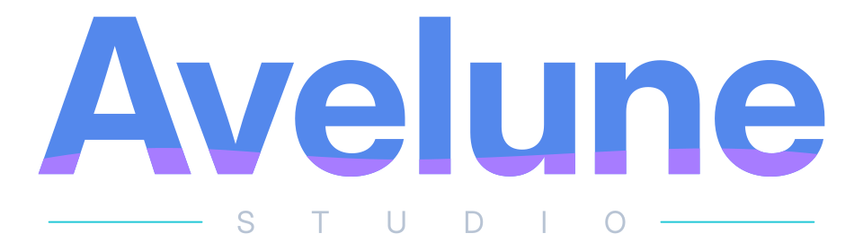
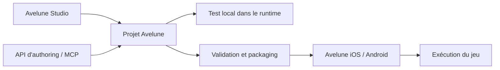
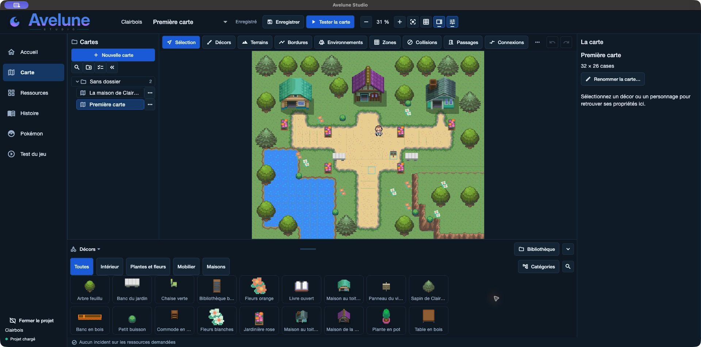
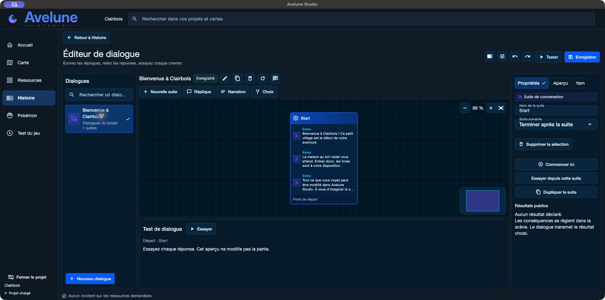

<p align="center">
  
</p>

<h1 align="center">Avelune Studio</h1>

<p align="center">
  <strong>Créer des mondes, raconter des histoires et les rendre jouables.</strong><br>
  Un atelier de création de RPG en 2D et en 3D, un moteur partagé et des lecteurs natifs.
</p>

<p align="center">
  <a href="https://github.com/yoahnl/pokemap/releases/latest">📥 Télécharger Studio</a> ·
  <a href="#demarrage">🚀 Démarrer</a> ·
  <a href="#apercus">🖼️ Aperçus</a> ·
  <a href="#sommaire">🧭 Sommaire</a><br>
  <strong>Français</strong> · <a href="documentation/en/README.md">English</a>
</p>

<p align="center">
  <a href="https://github.com/yoahnl/pokemap/actions/workflows/pokemap_quick_checks.yml"></a>
  <a href="https://github.com/yoahnl/pokemap/actions/workflows/pokemap_desktop_release.yml"></a>
  <a href="https://github.com/yoahnl/pokemap/actions/workflows/avelune_android_release.yml"></a>
</p>


<p align="center"><em>Illustration d'accueil d'Avelune Studio.</em></p>

**Avelune Studio** est l'atelier **no-code** pour créer des univers de RPG **en 2D et en 3D** : cartes, personnages, dialogues et événements se préparent dans une interface visuelle. Son moteur partagé porte les règles de jeu et l'exécution des projets. Les lecteurs **Avelune iOS et Android**, en SwiftUI et Kotlin/Compose, embarquent le runtime Flutter/Flame pour jouer aux aventures distribuées.

L'ambition dépasse le dessin de cartes : relier les lieux, les personnages, les dialogues, les événements et la progression pour construire une aventure que l'on peut tester, sauvegarder et distribuer.

> **Projet en développement actif.** Ce README présente les composants et les parcours du dépôt, pas une certification de complétude de toutes les mécaniques. Les limites, critères de validation et preuves détaillées restent dans la [roadmap mécanique](pokemap_roadmap_mecaniques_fangame.md) et la [documentation](documentation/).

**[Fonctionnalités](#fonctionnalites) · [Architecture](#architecture) · [Automatisation MCP](#mcp) · [Contribuer](#contribuer)**

<a id="sommaire"></a>

## 🧭 Sommaire

- [Comprendre le projet](#presentation)
- [Avelune Studio en images](#apercus)
- [Fonctionnalités et périmètre](#fonctionnalites)
- [Démarrage rapide](#demarrage)
- [Premier parcours de création](#premier-projet)
- [Organisation du dépôt](#organisation)
- [Architecture et technologies](#architecture)
- [Projets, ressources et sauvegardes](#donnees)
- [Automatisation et serveur MCP](#mcp)
- [Tests et vérifications](#tests)
- [Génération de code](#generation)
- [Construction et distribution](#distribution)
- [État du projet et limites](#etat)
- [Documentation de référence](#documentation)
- [Contribuer](#contribuer)
- [Dépannage et questions fréquentes](#depannage)
- [Licence et ressources tierces](#licence)

<a id="presentation"></a>

## 🌍 Comprendre le projet

### Un outil de création, un moteur et un lecteur

| Composant | À quoi sert-il ? | Point d'entrée |
| --- | --- | --- |
| **🛠️ Avelune Studio** | Construire les cartes en 2D ou en 3D, préparer le contenu et tester une aventure dans l'application desktop. | [`apps/avelune_studio`](apps/avelune_studio/) |
| **Runtime Avelune** | Exécuter les données du projet : exploration, événements, combats, présentation et état de la partie. | [`packages/map_runtime`](packages/map_runtime/) |
| **📱 Avelune iOS** | Fournir le lecteur natif SwiftUI et embarquer le runtime partagé. | [`apps/Avelune iOS`](apps/Avelune%20iOS/) |
| **🤖 Avelune Android** | Fournir le lecteur natif Kotlin/Compose et embarquer le runtime partagé. | [`apps/avelune_android`](apps/avelune_android/) |
| **Outillage d'édition partagé** | Regrouper les interfaces et capacités d'authoring réutilisées par Studio. | [`packages/map_editor`](packages/map_editor/) |
| **Host de développement** | Charger un projet local et exercer le runtime sans passer par toute l'application Avelune. | [`examples/playable_runtime_host`](examples/playable_runtime_host/) |
| **API d'authoring et MCP** | Manipuler les projets avec des opérations explicites, des validations et des outils d'automatisation. | [API d'authoring](packages/map_authoring/) et [serveur MCP](tools/pokemap_mcp/) |

Le créateur travaille sur un **projet Avelune** dans Studio. Le runtime interprète ce projet. Les applications natives Avelune fournissent l'expérience joueur.

Une [bibliothèque embarquée partagée](apps/pokemap_hub/) regroupe le code Dart, les assets et les services utilisés par les deux hôtes natifs.


```mermaid
flowchart LR
    Editor["Avelune Studio"] --> Project["Projet Avelune"]
    Automation["API d'authoring / MCP"] --> Project
    Project --> Playtest["Test local dans le runtime"]
    Project --> Package["Validation et packaging"]
    Package --> Avelune["Avelune iOS / Android"]
    Avelune --> Runtime["Exécution du jeu"]
```

Ce schéma décrit le parcours du contenu, pas le graphe des dépendances Dart.

### Principes de conception

**Créer sans programmer les situations courantes.** Les interfaces doivent privilégier les choix guidés, les aperçus et des messages compréhensibles plutôt que l'édition manuelle d'identifiants ou de JSON.

**Garder la maîtrise du format.** Avelune possède ses modèles et ses données de projet. RPG Maker, Tiled ou Pokémon SDK ne sont pas des prérequis d'exécution du moteur. Les comparaisons avec d'autres outils servent à guider les fonctionnalités, pas à imposer leur environnement.

**Séparer les règles du rendu.** Une règle de déplacement, une évolution ou un calcul de combat doit pouvoir être vérifié sans démarrer une interface Flutter.

**Valider une aventure, pas seulement une collection d'écrans.** Le parcours important relie exploration, interaction, combat, récompense, gestion de l'équipe et sauvegarde.

<a id="apercus"></a>

## 🖼️ Avelune Studio en images

Captures réelles de l'application **Avelune Studio sur macOS**, avec le projet de démonstration **Clairbois**. Cliquer sur une image pour l'agrandir.

| 🗺️ Carte et décors 2D | 💬 Dialogues visuels |
| --- | --- |
| [](documentation/avelune_studio/screenshots/studio-map-clairbois.jpg) | [](documentation/avelune_studio/screenshots/studio-dialogue-clairbois.jpg) |
| Composer les lieux, placer les décors et organiser les cartes. | Écrire les répliques, relier les suites et essayer une conversation. |

<p align="center"><em>Captures du 9 octobre 2026, réalisées avec Avelune Studio 0.3.24.</em></p>

<a id="fonctionnalites"></a>

## ✨ Fonctionnalités et périmètre

Les familles ci-dessous correspondent à des systèmes présents dans le code. Leur présence ne signifie pas que toutes les variantes possibles sont exposées dans chaque interface ou certifiées sur chaque plateforme.

### 🗺️ Construction du monde

Studio propose deux modes de projet distincts : **2D** pour composer avec des tuiles et des décors, et **3D** pour travailler les sols, le relief, les pentes et le placement de modèles. Le mode choisi s'applique à toutes les cartes du projet. Le mode 3D dispose d'une caméra de scène pour explorer la composition. Les outils narratifs et les données de jeu restent organisés autour du projet.

| Domaine | Périmètre du code |
| --- | --- |
| Cartes 2D | Couches de tuiles, terrains, chemins, entités et collisions. |
| Cartes 3D | Sols, relief, pentes, modèles placés dans la scène et outils de caméra. |
| Circulation entre les lieux | Points d'apparition, connexions entre cartes et téléportations. |
| Éléments interactifs | Personnages, panneaux, objets et événements de carte. |
| Habillage du monde | Outils dédiés aux bordures, à l'environnement et aux personnages. |
| Exploration | Déplacement sur grille, recherche de chemin, interactions et contrôles de passage. |

Les outils visuels sont répartis entre [l'espace cartes de Studio](apps/avelune_studio/lib/presentation/features/map_workspace/) et les [fonctionnalités d'édition partagées](packages/map_editor/lib/src/features/). Le [rendu 3D partagé](packages/map_render_3d/) prend en charge les scènes spatiales. Les décisions d'exploration sont exposées par [`map_gameplay`](packages/map_gameplay/lib/map_gameplay.dart).

### 💬 Dialogues, événements et mise en scène

Le projet dispose de systèmes de dialogue, de conditions, de pages d'événements et d'exécution de scènes. La partie narrative relie les déclencheurs du monde aux actions et aux changements d'état de la partie.

La présentation inclut également des composants pour les portraits de dialogue, les animations de personnages, les séquences d'introduction, la musique, les effets sonores et les médias. Le runtime prend en charge leur orchestration ; le contenu et les réglages viennent du projet.

Le point essentiel est la cohérence entre **ce que l'auteur configure**, **ce qui est enregistré** et **ce que le joueur voit réellement**. Une commande enregistrable ne constitue pas, à elle seule, une preuve de prise en charge complète.

### 🎒 Gameplay et progression

[`map_gameplay`](packages/map_gameplay/lib/map_gameplay.dart) expose notamment les systèmes suivants :

| Famille | Éléments présents |
| --- | --- |
| Début de partie | Construction de l'état initial, identité du joueur et résolution du point d'apparition. |
| Rencontres | Évaluation des rencontres sauvages et génération des Pokémon rencontrés. |
| Progression | Expérience, statistiques, montée de niveau, apprentissage de capacités et évolutions. |
| Équipe et stockage | Opérations sur l'équipe, le stockage et la destination des captures. |
| Inventaire | Sac, utilisation d'objets, objets tenus et compatibilité des effets. |
| Services | Achat, vente, soins et accès au stockage, avec intégration côté runtime. |
| Exploration avancée | Actions de terrain, modes de déplacement et conditions d'utilisation. |
| Continuité de l'aventure | Récompenses, récupération après défaite et mutations de l'état du jeu. |

Les fonctionnalités dépendent des catalogues, des règles activées et des capacités effectivement prises en charge. La roadmap reste la référence pour connaître les limites d'une mécanique particulière.

### ⚔️ Combats

Le moteur [`map_battle`](packages/map_battle/lib/map_battle.dart) est écrit en Dart et indépendant de Flutter/Flame. Il sépare la préparation du combat, les décisions des participants, la résolution des actions et les événements produits.

Le code comprend des systèmes de capacités, de types, de statistiques, de statuts, de changements de Pokémon, de capture, d'objets, de météo, de terrain et de décisions adverses. Des générateurs aléatoires contrôlables et une chronologie d'événements permettent de vérifier la résolution sans dépendre des animations.

Le runtime assure ensuite le passage depuis l'exploration, la présentation du combat et l'application de son résultat à la partie. **La couverture exacte des comportements ne se résume pas à la présence d'une classe ou d'une entrée de catalogue.**

### 🎮 Présentation et application joueur

La personnalisation couvre des profils de présentation, des libellés de menus, des thèmes sémantiques et de la typographie. Le runtime expose aussi des contrôleurs de démarrage, de séquences d'introduction et de lecture des médias.

Les hôtes natifs Avelune composent l'interface joueur et le runtime dans des applications distinctes de Studio. Cette séparation permet de faire évoluer l'outil de création sans transformer l'application joueur en interface d'édition.

<a id="demarrage"></a>

## 🚀 Démarrage rapide

### Prérequis

Prévoir **Git**, une installation de **Flutter avec son SDK Dart**, ainsi que l'outillage natif de la plateforme ciblée. Pour le parcours macOS ci-dessous, préparer l'environnement Apple demandé par `flutter doctor`.

Les [vérifications rapides](.github/workflows/pokemap_quick_checks.yml) et la [distribution Studio](.github/workflows/pokemap_desktop_release.yml) utilisent le même pin Flutter. La [distribution Android native](.github/workflows/avelune_android_release.yml) possède sa propre référence :

| Élément | Référence |
| --- | --- |
| Flutter — Studio et quick checks | `3.48.0-0.4.pre` |
| Révision Flutter — Studio et quick checks | `e3005e3402d9cfa2043114c8bc53c59d12e9b98e` |
| Flutter — distribution Android native | `3.47.5` |
| Dart | Utiliser le SDK livré avec cette installation de Flutter. |
| Node.js | `>=20`, uniquement pour les outils MCP qui le déclarent. |

Le pin Studio est une **préversion**. Choisir la toolchain du parcours ciblé en consultant son workflow et ses manifestes. Les contraintes déclarées par un package ne décrivent pas nécessairement toutes celles de ses dépendances.

Studio et l'intégration iOS du runtime utilisent **Swift Package Manager**. Le parcours de démarrage ne demande pas d'ajouter une installation CocoaPods par défaut.

### Récupérer le dépôt

Ouvrir le [dépôt GitHub](https://github.com/yoahnl/pokemap), copier son adresse depuis le bouton **Code**, puis le cloner dans un dossier nommé `avelune`. Depuis le dossier parent :

```bash
cd avelune
flutter --version
dart --version
flutter doctor -v
flutter devices
```

> Le dépôt n'a pas de `pubspec.yaml` à la racine ni d'orchestration Melos. Installer les dépendances et lancer les commandes **depuis le package concerné**.

Les blocs avec parenthèses ci-dessous utilisent Bash ou Zsh et partent de la racine du dépôt. Ils exécutent la commande dans un sous-shell : le terminal reste donc à la racine. Avec un autre shell, entrer dans le dossier indiqué puis lancer les commandes séparément.

### 🛠️ Lancer Avelune Studio sur macOS

```bash
(
  cd apps/avelune_studio &&
  flutter pub get &&
  flutter run -d macos
)
```

C'est le point d'entrée pour créer et modifier le contenu. Les dépendances internes sont référencées par chemins relatifs : conserver l'organisation du monorepo. Le [README Studio](apps/avelune_studio/README.md) détaille les parcours de l'atelier.

### Lancer le host de développement

```bash
(
  cd examples/playable_runtime_host &&
  flutter pub get &&
  flutter run -d macos
)
```

Le host permet de sélectionner un dossier de projet contenant `project.json`. Pour tester votre aventure, utiliser une copie de travail du projet créé ou ouvert dans Avelune Studio. Le [README du host](examples/playable_runtime_host/README.md) décrit ses options de lancement.

### 📱 Préparer Avelune iOS sur simulateur

Depuis la racine, avec Xcode, XcodeGen et un simulateur iOS déjà démarré :

```bash
bash "apps/Avelune iOS/tool/build_runtime.sh"
bash "apps/Avelune iOS/tool/build_simulator.sh"
```

Le premier script prépare le runtime en package Swift et régénère le projet Xcode. Le second construit l'application SwiftUI, l'installe sur le simulateur démarré et affiche la commande de lancement. Consulter les [scripts iOS](apps/Avelune%20iOS/tool/) et la [configuration du projet](apps/Avelune%20iOS/project.yml) pour les détails.

### 🤖 Construire Avelune Android en debug

Préparer **JDK 17** et **Android SDK 36**, puis lancer depuis la racine :

```bash
bash apps/avelune_android/tool/build_runtime.sh debug
bash apps/avelune_android/tool/build_android.sh
```

Le premier script prépare le runtime embarqué. Le second exécute les tests Kotlin et construit l'APK debug ; l'installation sur appareil ou émulateur reste une étape séparée. Les [scripts Android](apps/avelune_android/tool/) et la [configuration Gradle](apps/avelune_android/app/build.gradle.kts) décrivent les variantes et paramètres disponibles.

**Pour commencer :** ouvrir Studio pour créer du contenu, le host pour isoler un problème de runtime, et les applications natives Avelune pour travailler sur l'expérience joueur.

<a id="premier-projet"></a>

## 🌱 Premier parcours de création

Pour découvrir Avelune, commencer par une petite boucle jouable plutôt que par une région entière.

1. **Créer ou ouvrir votre projet dans Avelune Studio.** Pour expérimenter, travailler sur une copie du dossier et conserver ses ressources ensemble.
2. **Construire un lieu simple.** Préparer une carte, ses collisions, un point d'apparition et une sortie. Vérifier d'abord que le joueur peut se déplacer et quitter le lieu.
3. **Ajouter une interaction.** Placer un personnage ou un événement, lui associer un dialogue et vérifier ses conditions d'activation.
4. **Relier une mécanique.** Ajouter une rencontre, un combat, un objet ou un service selon les capacités configurées dans le projet.
5. **Tester la continuité.** Contrôler le retour à l'exploration, les changements d'équipe ou d'inventaire, puis une sauvegarde et son rechargement.
6. **Préparer la distribution.** Utiliser le parcours d'export et ses validations, puis vérifier le jeu dans le lecteur cible.

Un projet qui s'ouvre dans l'éditeur n'est pas forcément déjà jouable. Les catalogues, les références d'assets, le point de départ et les conditions narratives doivent former un ensemble cohérent.

### Scénario de référence : golden battle slice

Le [host de développement](examples/playable_runtime_host/README.md) documente un petit scénario de combat avec une carte `golden_field`, une rencontre sauvage, un dresseur et les données nécessaires au lancement.

C'est un bon point de départ pour comprendre le passage **exploration → combat → retour à la partie**. Les chemins absolus figurant dans certaines notes historiques doivent être remplacés par ceux de votre clone local.

<a id="organisation"></a>

## 📁 Organisation du dépôt

```text
avelune/
├── apps/
│   ├── avelune_studio/
│   ├── Avelune iOS/
│   └── avelune_android/
├── packages/
│   ├── map_core/
│   ├── map_gameplay/
│   ├── map_battle/
│   ├── map_authoring/
│   ├── map_distribution/
│   ├── map_runtime/
│   ├── map_render_3d/
│   ├── map_player_ui/
│   ├── map_editor/
│   ├── gamepads_darwin/
│   └── gamepads_ios/
├── examples/
│   └── playable_runtime_host/
├── documentation/
├── tools/
│   └── release/
├── tool/
├── skills/
├── plugins/
├── .github/workflows/
└── AGENTS.md
```

Cette arborescence est volontairement simplifiée ; elle ne liste pas tous les outils, fixtures et rapports. Le dossier racine `avelune` correspond au nom local choisi lors du clonage. Les accès à la bibliothèque embarquée et au serveur MCP figurent dans le tableau ci-dessous.

| Application ou package | Responsabilité principale |
| --- | --- |
| [`avelune_studio`](apps/avelune_studio/) | Application desktop de création et composition de l'atelier. |
| [`Avelune iOS`](apps/Avelune%20iOS/) | Lecteur natif SwiftUI avec runtime embarqué. |
| [`avelune_android`](apps/avelune_android/) | Lecteur natif Kotlin/Compose avec runtime embarqué. |
| [Bibliothèque embarquée partagée](apps/pokemap_hub/) | Bibliothèque Dart, assets et services partagés par les hôtes natifs. |
| [`map_core`](packages/map_core/) | Modèles partagés, contrats, sérialisation et validation des données. |
| [`map_gameplay`](packages/map_gameplay/) | Règles d'exploration, état de jeu, progression et opérations métier hors combat. |
| [`map_battle`](packages/map_battle/) | Règles et résolution des combats. |
| [`map_authoring`](packages/map_authoring/) | API canonique de manipulation des projets et contrats d'automatisation. |
| [`map_distribution`](packages/map_distribution/) | Construction et inspection des packages de jeu, manifestes, compatibilité et politiques de validation. |
| [`map_runtime`](packages/map_runtime/) | Intégration Flutter/Flame : chargement, rendu, exécution et liaison avec les systèmes de jeu. |
| [`map_render_3d`](packages/map_render_3d/) | Rendu partagé des scènes spatiales, des modèles et des aperçus 3D. |
| [`map_player_ui`](packages/map_player_ui/) | Composants d'interface destinés à l'expérience joueur. |
| [`map_editor`](packages/map_editor/) | UI et capacités d'authoring partagées avec Studio. |
| [`gamepads_darwin`](packages/gamepads_darwin/) / [`gamepads_ios`](packages/gamepads_ios/) | Adaptations locales liées aux contrôleurs sur les plateformes Apple. |
| [Serveur MCP](tools/pokemap_mcp/) | Adaptation TypeScript/Node.js de l'API d'authoring pour les clients d'automatisation. |

<a id="architecture"></a>

## 🧩 Architecture et technologies

### Répartition des responsabilités

L'architecture distingue les données, les règles, l'orchestration et l'affichage. Les packages `map_core`, `map_gameplay` et `map_battle` constituent le socle Dart indépendant de l'interface.

Concrètement, une modification doit être placée au bon niveau :

| Exemple de changement | Emplacement à privilégier |
| --- | --- |
| Nouveau contrat partagé ou format de données | `map_core` |
| Règle de déplacement, effet d'objet hors combat ou progression | `map_gameplay` |
| Calcul de dégâts ou résolution d'une action de combat | `map_battle` |
| Opération de création ou modification de projet exposable aux outils | `map_authoring` |
| Validation d'une archive distribuée ou de son manifeste | `map_distribution` |
| Affichage, animation et liaison avec la boucle de jeu | `map_runtime` |
| Scènes spatiales, rendu des modèles et aperçus 3D | `map_render_3d` |
| Parcours visuel d'édition | `map_editor` |
| Composition de l'atelier desktop | `apps/avelune_studio` |
| Interface et intégration du lecteur iOS | `apps/Avelune iOS` |
| Interface et intégration du lecteur Android | `apps/avelune_android` |
| Services et ressources Dart embarqués par les lecteurs | [Bibliothèque embarquée](apps/pokemap_hub/lib/) et [assets partagés](apps/pokemap_hub/assets/) |

Cette séparation évite de cacher les règles de gameplay dans des composants Flame ou de faire dépendre l'API d'automatisation de gestes propres à l'éditeur.

### Stack principale

**Dart** porte les modèles et les règles. **Flutter** fournit Studio, les interfaces partagées et le runtime embarqué ; **Flame** prend en charge les scènes 2D et **Flame 3D** le rendu spatial dans `map_render_3d`. **SwiftUI** et **Kotlin/Jetpack Compose** composent les lecteurs natifs iOS et Android. **Riverpod** intervient dans la gestion d'état côté Flutter ; **Freezed**, **json_serializable** et **build_runner** sont utilisés par les packages qui déclarent de la génération de code.

Le serveur MCP est un outil séparé en **TypeScript/Node.js**. Il adapte l'API d'authoring Dart ; ce n'est pas un second moteur de jeu.

Les versions exactes appartiennent aux manifestes et fichiers de verrouillage. Consulter notamment [Studio](apps/avelune_studio/pubspec.yaml), [l'UI d'édition](packages/map_editor/pubspec.yaml), le [runtime](packages/map_runtime/pubspec.yaml), le [projet iOS](apps/Avelune%20iOS/project.yml), le [module Android](apps/avelune_android/app/build.gradle.kts) et le [serveur MCP](tools/pokemap_mcp/package.json).

### Interfaces publiques et design system

Les consommateurs des bibliothèques partagées doivent privilégier leurs points d'entrée publics, comme `map_core.dart`, `map_gameplay.dart`, `map_battle.dart` et `map_runtime.dart`, plutôt que s'appuyer sur des détails internes.

Pour l'éditeur, les primitives d'interface et les couleurs passent par le design system et ses tokens sémantiques. Les règles détaillées de contribution et de découpage sont dans [`AGENTS.md`](AGENTS.md).

<a id="donnees"></a>

## 💾 Projets, ressources et sauvegardes

### Projet de création

Un projet local s'organise autour de `project.json`, de ses cartes et des ressources auxquelles ses données font référence. Déplacer uniquement le fichier JSON ne suffit pas lorsque le projet utilise des fichiers associés.

L'arborescence exacte dépend du contenu et du schéma. Créer ou ouvrir le projet dans Avelune Studio, puis conserver son dossier complet pour les tests et les échanges plutôt que construire un fichier JSON minimal à partir d'un exemple incomplet.

### État de la partie

Les **données du projet** décrivent le jeu. L'**état de la partie** décrit ce que le joueur a accompli : position, équipe, inventaire, progression et états narratifs, selon les systèmes utilisés.

Cette distinction est importante pour les tests : modifier un contenu de départ ne revient pas à modifier une sauvegarde existante. De même, un problème de lancement peut venir du projet, de la sauvegarde chargée ou de leur compatibilité.

### Package distribué

[`map_distribution`](packages/map_distribution/lib/map_distribution.dart) regroupe notamment la construction du package, les manifestes, les inventaires, l'inspection, la compatibilité, la validation du contenu et les politiques de chemins.

Utiliser les parcours prévus par l'éditeur et le lecteur, plutôt que supposer qu'un ZIP assemblé manuellement sera installable. Ne pas contourner les erreurs de format ou de compatibilité pour forcer le chargement d'un contenu non pris en charge.

<a id="mcp"></a>

## 🤖 Automatisation et serveur MCP

Le [serveur MCP Avelune](tools/pokemap_mcp/README.md) permet à un client compatible d'accéder à l'API d'authoring. Il est **local**, communique sur **stdio** et n'accède qu'aux racines de projets explicitement autorisées.

L'éditeur peut être lancé sans démarrer ce serveur. Le MCP concerne les usages d'automatisation et les assistants capables de manipuler les projets.

### Préparer les dépendances et construire le serveur

Depuis la racine du dépôt :

```bash
(
  cd packages/map_authoring &&
  dart pub get
)
```

Construire ensuite le serveur TypeScript avec les commandes indiquées dans le [guide du serveur MCP](tools/pokemap_mcp/README.md).

### Configurer un client

Configurer le client pour lancer le processus Node.js avec le chemin absolu du serveur construit et une racine de projet explicitement autorisée via `--root`. Utiliser un dossier de projets précis, pas l'ensemble du dossier personnel.

Plusieurs projets peuvent être autorisés en répétant `--root`. Les exemples de configuration et les options de localisation du dépôt, de l'API Dart et des adaptateurs runtime sont décrits dans le [guide du serveur MCP](tools/pokemap_mcp/README.md).

### Parcours d'utilisation

Le flux principal consiste à découvrir le catalogue, ouvrir un espace de projet, interroger ses ressources, puis valider le contenu. Le [guide du serveur MCP](tools/pokemap_mcp/README.md) donne les identifiants exacts des outils.

Les modifications passent par **la préparation d'un plan avant son application** : le client peut examiner le diff et le reçu prévus avant l'application. Les opérations destructrices ont une confirmation liée au plan. Les outils d'historique, de rendu et de playtest complètent ce parcours.

Les handles et curseurs retournés sont opaques : les réutiliser sans les reconstruire. Une erreur de racine non autorisée doit être corrigée en choisissant un chemin autorisé ou en ajoutant explicitement un périmètre précis, pas en ouvrant l'accès à tout le système de fichiers.

### Disponibilité et parité

Le [catalogue d'actions](pokemap_authoring_api_mcp_action_catalog.md) et le catalogue découvert à l'exécution servent à examiner les capacités disponibles. Ne pas déduire une parité complète avec l'éditeur du seul fait qu'une opération JSON générique existe.

La documentation MCP distingue les tests du serveur et la gate de conformité inter-packages. Une suite de tests verte ne remplace pas cette vérification de parité ; consulter ses limites documentées avant d'annoncer une couverture totale.

<a id="tests"></a>

## 🧪 Tests et vérifications

### Vérifier le package concerné

Pour les bibliothèques Dart indépendantes de Flutter, notamment `map_core`, `map_gameplay` et `map_battle`, lancer depuis leur dossier :

```bash
dart pub get
dart test
dart analyze
```

Pour les packages et applications Flutter, notamment `map_editor`, `map_runtime`, `avelune_studio` et le host de développement, lancer depuis leur dossier :

```bash
flutter pub get
flutter test
flutter analyze
```

Commencer par les tests proches du changement, puis élargir selon les dépendances touchées. Les tests complets, les parcours de certification et les mesures de performance ne sont pas interchangeables.

### Smoke tests de la boucle joueur

Après installation des dépendances des packages concernés, depuis la racine :

```bash
(
  cd packages/map_runtime &&
  flutter test test/phase_a_golden_battle_slice_smoke_test.dart
)
```

```bash
(
  cd examples/playable_runtime_host &&
  flutter test test/phase_a_golden_slice_launch_test.dart
)
```

Ces tests ciblent des parcours de référence. Ils ne certifient pas à eux seuls toutes les mécaniques ni toutes les plateformes.

### Vérifier le serveur MCP

Exécuter les contrôles de types et les tests Node.js avec les commandes du [guide du serveur MCP](tools/pokemap_mcp/README.md). Il décrit également la gate de conformité et ses conditions de refus.

### CI et preuves

Les [workflows GitHub Actions](.github/workflows/) séparent les contrôles rapides, l'hygiène documentaire, les certifications produit et les distributions. Le workflow de [vérifications rapides](.github/workflows/pokemap_quick_checks.yml) sélectionne des contrôles ciblés : il ne représente pas l'exécution de toutes les suites du monorepo.

Une vérification utile indique la commande, la révision testée, le résultat et les limites restantes. Ne pas annoncer un état « tout est validé » à partir d'un ancien rapport ou d'une seule vérification locale.

<a id="generation"></a>

## ⚙️ Génération de code

Les packages qui déclarent `build_runner` peuvent nécessiter une régénération après modification des modèles ou des providers concernés. Installer d'abord leurs dépendances et ne régénérer que le périmètre utile.

Exemple pour `map_core`, depuis la racine :

```bash
(
  cd packages/map_core &&
  dart pub get &&
  dart run build_runner build --delete-conflicting-outputs
)
```

Exemple pour l'éditeur :

```bash
(
  cd packages/map_editor &&
  flutter pub get &&
  dart run build_runner build --delete-conflicting-outputs
)
```

Inspecter le diff après génération. Éviter les modifications massives de fichiers générés sans rapport avec le changement demandé.

<a id="distribution"></a>

## 📦 Construction et distribution

Il faut distinguer **construire l'éditeur**, **exporter un jeu** et **publier l'application joueur**.

### Construire Studio localement

Exemple macOS :

```bash
(
  cd apps/avelune_studio &&
  flutter pub get &&
  flutter build macos --release
)
```

Les versions publiées de Studio pour **macOS, Windows et Linux** sont accessibles depuis la [dernière release](https://github.com/yoahnl/pokemap/releases/latest). Le workflow de [distribution Studio desktop](.github/workflows/pokemap_desktop_release.yml) contient les contrôles de version, les étapes de préflight et les règles de publication. Une compilation locale n'est pas une release signée et publiée.

### Exporter un jeu

Le parcours d'export de l'éditeur s'appuie sur les contrats de distribution. Vérifier le contenu, les ressources, la personnalisation et la compatibilité avant de distribuer le package, puis tester son chargement dans le lecteur cible.

Les projets 3D peuvent actuellement être exportés pour un **test local** (`localTest`). Leur publication comme jeu distribué est encore refusée par les validations de distribution.

### Distribuer Avelune

Avelune utilise les hôtes natifs SwiftUI et Kotlin/Compose, avec leurs [scripts iOS](apps/Avelune%20iOS/tool/), [scripts Android](apps/avelune_android/tool/) et configurations propres. La [distribution Android](.github/workflows/avelune_android_release.yml) publie sur le canal de test interne Google Play. La [certification produit](.github/workflows/pokemap_product_certification.yml) reste un parcours manuel distinct des releases Studio.

Les secrets de signature et les permissions de publication appartiennent à l'environnement de release. Ils ne sont pas nécessaires à documenter dans un exemple de configuration public et ne doivent pas être ajoutés au dépôt pour faciliter un build local.

<a id="etat"></a>

## 🚧 État du projet et limites

Avelune évolue encore. Les versions de Studio, du runtime, du serveur MCP et des lecteurs natifs sont distinctes : la version d'une application ne doit pas être interprétée comme un numéro de certification de tout l'écosystème.

Les points suivants doivent rester explicites :

**Couverture fonctionnelle.** Une fonctionnalité peut être modélisée, partiellement exécutée ou disponible dans un seul parcours. L'objectif est de démontrer toute la chaîne utile au joueur, pas seulement de disposer d'une structure de données.

**Comparaison avec Pokémon SDK.** Le dépôt comporte du travail de comparaison et de parité, notamment autour des combats. Ce README n'annonce pas une équivalence complète avec PSDK ni la reproduction de toutes les générations et de tous leurs cas particuliers.

**Compatibilité des projets.** La politique pré-1.0 décrite dans [`AGENTS.md`](AGENTS.md) ne garantit pas la conservation de tous les anciens formats. Conserver une copie de ses projets avant de tester une évolution de schéma et suivre les diagnostics de compatibilité.

**Plateformes.** Un dossier natif, une compilation ou un workflow ne constitue pas à lui seul une validation de l'expérience complète. Consulter les preuves propres à la plateforme et à la version visées.

**Automatisation.** La parité API, éditeur et MCP se vérifie opération par opération. Le catalogue et les contrôles de conformité sont plus précis qu'un chiffre global recopié dans ce README.

**Exemples et documentation historique.** Les projets d'exemple servent de références de développement. Les anciens rapports décrivent une révision et un contexte donnés ; ils ne garantissent pas l'état actuel de `main`.

Pour suivre les priorités, commencer par la [roadmap mécanique](pokemap_roadmap_mecaniques_fangame.md), puis consulter les preuves et rapports correspondants dans la [documentation](documentation/).

<a id="documentation"></a>

## 📚 Documentation de référence

| Besoin | Document ou dossier |
| --- | --- |
| Utiliser l'atelier de création desktop | [README Avelune Studio](apps/avelune_studio/README.md) |
| Télécharger la dernière version stable de Studio | [Releases GitHub](https://github.com/yoahnl/pokemap/releases/latest) |
| Préparer et construire le lecteur natif iOS | [Scripts iOS](apps/Avelune%20iOS/tool/) et [projet XcodeGen](apps/Avelune%20iOS/project.yml) |
| Préparer et construire le lecteur natif Android | [Scripts Android](apps/avelune_android/tool/) et [configuration Gradle](apps/avelune_android/app/build.gradle.kts) |
| Comprendre les règles de contribution et les frontières des packages | [`AGENTS.md`](AGENTS.md) |
| Suivre la complétude des mécaniques et leurs critères de validation | [Roadmap mécanique fangame](pokemap_roadmap_mecaniques_fangame.md) |
| Examiner les opérations d'authoring et les contrats MCP | [Catalogue d'actions](pokemap_authoring_api_mcp_action_catalog.md) |
| Configurer, utiliser et vérifier le serveur local | [Guide du serveur MCP Avelune](tools/pokemap_mcp/README.md) |
| Lancer un projet ou le scénario de référence golden slice | [README du host](examples/playable_runtime_host/README.md) |
| Retrouver les spécifications, audits et rapports | [`documentation/`](documentation/) |
| Comprendre les contrôles et distributions automatisés | [Workflows GitHub Actions](.github/workflows/) |

Les documents détaillés peuvent couvrir des périmètres plus anciens ou plus restreints. Vérifier leur date, les fichiers cités et la révision concernée avant de reprendre une conclusion comme état actuel du projet.

<a id="contribuer"></a>

## 🤝 Contribuer

Avant de commencer, lire [`AGENTS.md`](AGENTS.md) et les éventuelles instructions plus proches des fichiers concernés. Pour une mécanique de jeu, identifier aussi le lot et les critères de validation de la roadmap.

Une contribution doit expliquer **le problème traité**, **le périmètre modifié**, **la manière de le vérifier** et **ce qui reste hors périmètre**.

Privilégier des modifications ciblées. Respecter les points d'entrée publics, les frontières entre packages et le design system. Lorsqu'un comportement d'authoring change, examiner son exposition à l'API canonique et au MCP au lieu d'ajouter une solution uniquement accessible par l'interface.

Une modification de schéma doit considérer ses modèles, sa sérialisation, ses validations, ses fixtures et ses consommateurs. Une modification de gameplay doit être vérifiée au niveau de la règle, puis de son intégration quand le parcours joueur est concerné.

Les rapports et demandes de revue doivent mentionner les commandes réellement exécutées et leurs résultats. Ne pas transformer une implémentation en validation définitive sans respecter le processus de revue du projet.

### Signaler un problème

Pour rendre un signalement reproductible, fournir la révision ou la version, la plateforme, le composant concerné, les étapes, le résultat attendu et le résultat observé. Joindre un petit projet de reproduction ou des captures lorsque cela aide, après avoir retiré les informations privées et les ressources non partageables.

Ne jamais publier de clé API, de certificat, de mot de passe ou de sauvegarde personnelle non nettoyée dans un ticket ou une demande de revue.

<a id="depannage"></a>

## 🛠️ Dépannage et questions fréquentes

### `flutter pub get` ne trouve pas de projet

Vérifier le dossier courant. Il n'existe pas de package Dart racine : utiliser `apps/avelune_studio` pour l'application desktop, ou le package sur lequel vous travaillez. Pour les lecteurs natifs, suivre leurs scripts de préparation du runtime et de build.

### Les dépendances refusent de se résoudre

Comparer `flutter --version` et `dart --version` avec la toolchain de CI et les contraintes des manifestes. Vérifier également que les commandes utilisent la même installation Flutter/Dart. Ne pas modifier des versions au hasard pour faire disparaître le premier message d'erreur.

### Des fichiers générés sont absents ou incompatibles

Installer les dépendances du package, identifier son générateur et suivre la section [Génération de code](#generation). Ne pas éditer directement les fichiers générés pour masquer le problème.

### Le projet s'ouvre, mais les images ou les cartes manquent

Vérifier que le dossier complet a été conservé et que les références pointent vers des ressources présentes. Un `project.json` isolé ne remplace pas le projet dont il dépend.

### Le host ne démarre pas dans l'état attendu

Le [host](examples/playable_runtime_host/README.md) documente le chargement de `runtime_host_launch_save.json` lorsqu'il est présent à côté du projet. Vérifier quel projet et quelle sauvegarde sont réellement chargés avant de conclure à un problème de nouvelle partie.

### Le MCP refuse le chemin du projet

Utiliser un chemin absolu situé dans une racine autorisée par `--root`. Conserver ce périmètre étroit. Une erreur d'autorisation de workspace n'est pas une raison d'accorder l'accès à tout le disque.

### Faut-il programmer pour créer un jeu ?

L'objectif de l'éditeur est de rendre les parcours de création courants accessibles sans code. En revanche, développer une nouvelle règle moteur ou une capacité non prise en charge demande une contribution au code et à ses contrats d'authoring.

### Avelune est-il lui-même un jeu Pokémon terminé ?

Non. C'est l'environnement de création et d'exécution. Les aventures, leurs données et leurs ressources constituent des projets distincts que leurs auteurs créent avec Avelune Studio.

<a id="licence"></a>

## 📜 Licence et ressources tierces

Aucun fichier de licence globale n'est présent à la racine du dépôt dans la version documentée. **Ce README n'ajoute pas de licence MIT, Apache ou autre**, et ne remplace pas une décision explicite du mainteneur sur la réutilisation du code.

Certains sous-ensembles, dépendances, polices ou ressources peuvent disposer de leurs propres notices. Vérifier les conditions applicables à chaque élément avant de le réutiliser ou de le redistribuer. Le code du moteur, les ressources d'un jeu et les contenus tiers doivent être considérés séparément.

Avelune est un projet indépendant de création de jeux ; ce dépôt ne doit pas être présenté comme un projet officiel de la franchise Pokémon.
