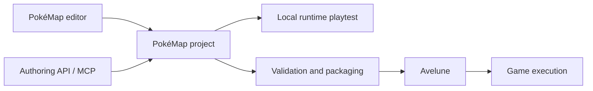

# PokéMap

[Français](../../README.md) · **English**

**Create worlds, tell stories, and bring them to life as playable adventures.**

PokéMap is a tile-based 2D RPG creation environment focused on Pokémon-like games and built around a **no-code** approach. The project brings together a visual editor, gameplay and battle engines, a Flutter/Flame runtime, and an application for playing games: **Avelune**.

Its ambition goes beyond drawing maps: connecting locations, characters, dialogue, events, and progression to build an adventure that can be tested, saved, and distributed.

> **Under active development.** This README introduces the repository's components and workflows; it does not certify that every mechanic is complete. Detailed limitations, validation criteria, and evidence remain in the [gameplay roadmap](../../pokemap_roadmap_mecaniques_fangame.md) and the [documentation](../../documentation/).

**[Get started](#getting-started) · [Features](#features) · [Architecture](#architecture) · [MCP](#mcp) · [Contribute](#contributing)**

## Contents

- [Project overview](#overview)
- [Features and scope](#features)
- [Getting started](#getting-started)
- [Your first creation workflow](#first-project)
- [Repository layout](#repository-layout)
- [Architecture and technologies](#architecture)
- [Projects, assets, and saves](#project-data)
- [Automation and MCP server](#mcp)
- [Tests and verification](#tests)
- [Code generation](#code-generation)
- [Build and distribution](#build-and-distribution)
- [Project status and limitations](#status)
- [Reference documentation](#documentation)
- [Contributing](#contributing)
- [Troubleshooting and frequently asked questions](#troubleshooting)
- [License and third-party resources](#license)

<a id="overview"></a>

## Project overview

### A creation tool, an engine, and a player application

| Component | What does it do? | Entry point |
| --- | --- | --- |
| **PokéMap editor** | Build maps, prepare content, configure systems, and test an adventure. | [`packages/map_editor`](../../packages/map_editor/) |
| **PokéMap runtime** | Execute project data: exploration, events, battles, presentation, and game state. | [`packages/map_runtime`](../../packages/map_runtime/) |
| **Avelune** | Provide the player application and integrate distributed games. Its technical name in the repository is `pokemap_hub`. | [`apps/pokemap_hub`](../../apps/pokemap_hub/) |
| **Development host** | Load a local project and exercise the runtime without going through the full Avelune application. | [`examples/playable_runtime_host`](../../examples/playable_runtime_host/) |
| **Authoring API and MCP** | Work with projects through explicit operations, validation, and automation tools. | [`packages/map_authoring`](../../packages/map_authoring/) and [`tools/pokemap_mcp`](../../tools/pokemap_mcp/) |

Creators work on a **PokéMap project**. The runtime interprets that project. Avelune provides the application in which players experience the resulting game.



This diagram describes the content workflow, not the Dart dependency graph.

### Design principles

**Create common gameplay situations without programming.** Interfaces should favor guided choices, previews, and understandable messages over manually editing identifiers or JSON.

**Own the format.** PokéMap owns its models and project data. RPG Maker, Tiled, and Pokémon SDK are not runtime prerequisites. Comparisons with other tools help guide features, rather than impose their environments.

**Separate rules from rendering.** A movement rule, an evolution, or a battle calculation should be testable without starting a Flutter interface.

**Validate an adventure, not just a collection of screens.** The meaningful workflow connects exploration, interaction, battles, rewards, party management, and saving.

<a id="features"></a>

## Features and scope

The following feature areas correspond to systems present in the code. Their presence does not mean that every possible variation is exposed in every interface or certified on every platform.

### World building

The editor includes tools for working with maps, entities, borders, smart tiles, and the environment. The runtime loads maps and their associated assets to build the playable scene.

| Area | Scope covered by the code |
| --- | --- |
| Maps and composition | Tile, terrain, path, entity, and collision layers. |
| Travel between locations | Spawn points, map connections, and warps. |
| Interactive elements | Characters, signs, items, and map events. |
| World presentation | Dedicated tools for borders, the environment, and characters. |
| Exploration | Grid-based movement, pathfinding, interactions, and traversal checks. |

Visual tools are primarily located in the [editor features](../../packages/map_editor/lib/src/features/). Exploration decisions are exposed by [`map_gameplay`](../../packages/map_gameplay/lib/map_gameplay.dart).

### Dialogue, events, and scene direction

The project includes systems for dialogue, conditions, event pages, and scene execution. Its narrative layer connects world triggers to actions and changes in game state.

Presentation also includes components for dialogue portraits, character animations, introduction sequences, music, sound effects, and media. The runtime handles their orchestration; content and settings come from the project.

What matters is consistency between **what the creator configures**, **what is saved**, and **what the player actually sees**. Being able to save a command is not, by itself, evidence of complete support.

### Gameplay and progression

[`map_gameplay`](../../packages/map_gameplay/lib/map_gameplay.dart) exposes the following systems, among others:

| Area | Available components |
| --- | --- |
| Starting a game | Initial state construction, player identity, and spawn point resolution. |
| Encounters | Wild encounter evaluation and generation of encountered Pokémon. |
| Progression | Experience, stats, leveling up, move learning, and evolutions. |
| Party and storage | Party operations, storage, and capture destinations. |
| Inventory | Bag, item use, held items, and effect compatibility. |
| Services | Buying, selling, healing, and storage access, with runtime integration. |
| Advanced exploration | Field actions, movement modes, and conditions of use. |
| Adventure continuity | Rewards, recovery after defeat, and game state mutations. |

Features depend on the catalogs, enabled rules, and capabilities that are actually supported. The roadmap remains the reference for the limitations of any particular mechanic.

### Battles

The [`map_battle`](../../packages/map_battle/lib/map_battle.dart) engine is written in Dart and is independent of Flutter/Flame. It separates battle setup, participant decisions, action resolution, and the events produced.

The code includes systems for moves, types, stats, status conditions, switching Pokémon, capture, items, weather, terrain, and opponent decisions. Controllable random number generators and an event timeline make it possible to verify resolution independently of animations.

The runtime then handles the transition from exploration, battle presentation, and applying the outcome to the game. **The exact behavioral coverage cannot be inferred solely from the presence of a class or a catalog entry.**

### Presentation and player application

Customization covers presentation profiles, menu labels, semantic themes, and typography. The runtime also exposes controllers for startup, introduction sequences, and media playback.

Avelune combines the player modules and runtime in an application separate from the editor. This separation allows the creation tool to evolve without turning the player application into an editing interface.

<a id="getting-started"></a>

## Getting started

### Prerequisites

You will need **Git**, a **Flutter installation with its Dart SDK**, and the native tooling for your target platform. For the macOS workflow below, prepare the Apple development environment required by `flutter doctor`.

The reproducible reference used by the [CI quick checks](../../.github/workflows/pokemap_quick_checks.yml) at the time of this documentation is:

| Component | Reference |
| --- | --- |
| Flutter | `3.46.0-0.3.pre` |
| Flutter revision | `677d472756f83c14371dd8cc624387065f3d32a7` |
| Dart | Use the SDK bundled with this Flutter installation. |
| Node.js | `>=20`, only for MCP tools that declare this requirement. |

The pinned Flutter version is a **prerelease**. When versions differ, check the workflows and `pubspec.yaml` files rather than assuming that any stable version is compatible. A package's declared constraints do not necessarily describe all of its dependencies' constraints.

The editor and Avelune applications enable **Swift Package Manager** in their Flutter configuration. The getting-started workflow does not require adding a CocoaPods installation by default.

### Clone the repository

```bash
git clone https://github.com/yoahnl/pokemap.git
cd pokemap
flutter --version
dart --version
flutter doctor -v
flutter devices
```

> The repository has no root `pubspec.yaml` and no Melos orchestration. Install dependencies and run commands **from the relevant package directory**.

The parenthesized blocks below use Bash or Zsh and start from the repository root. They run commands in a subshell, so your terminal stays at the root. With another shell, enter the indicated directory and run the commands separately.

### Run the editor on macOS

```bash
(
  cd packages/map_editor &&
  flutter pub get &&
  flutter run -d macos
)
```

This is the entry point for creating and editing content. Internal dependencies use relative paths: keep the monorepo layout intact instead of copying only `map_editor` into another directory.

### Run the development host

```bash
(
  cd examples/playable_runtime_host &&
  flutter pub get &&
  flutter run -d macos
)
```

The host lets you select a project folder containing `project.json`. The repository includes the [`selbrume`](../../selbrume/) project and a reference scenario described in the [host README](../../examples/playable_runtime_host/README.md).

### Run Avelune on an available device

```bash
(
  cd apps/pokemap_hub &&
  flutter pub get &&
  flutter run
)
```

Choose a target offered by Flutter, or add `-d` with the identifier returned by `flutter devices`. Native prerequisites, signing, and permissions depend on the platform; the presence of a target does not guarantee that a fresh environment is already ready to build.

**Where to start:** open the editor to create content, the host to isolate a runtime issue, and Avelune to work on the player application's experience.

<a id="first-project"></a>

## Your first creation workflow

To discover PokéMap, start with a small playable loop rather than an entire region.

1. **Open a sample project or prepare a project in the editor.** To experiment with Selbrume, work on a copy of its folder and keep its assets together.
2. **Build a simple location.** Prepare a map, its collisions, a spawn point, and an exit. First check that the player can move around and leave the location.
3. **Add an interaction.** Place a character or event, associate it with dialogue, and check its activation conditions.
4. **Connect a mechanic.** Add an encounter, battle, item, or service according to the capabilities configured in the project.
5. **Test continuity.** Check the return to exploration, party or inventory changes, then save and reload.
6. **Prepare distribution.** Use the export workflow and its validation checks, then test the game in the target player application.

A project that opens in the editor is not necessarily playable yet. Catalogs, asset references, the starting point, and narrative conditions must form a coherent whole.

### Reference scenario: golden battle slice

The [development host](../../examples/playable_runtime_host/README.md) documents a small battle scenario with a `golden_field` map, a wild encounter, a trainer, and the data needed to start.

It is a useful starting point for understanding the transition from **exploration → battle → return to the game**. Absolute paths in some historical notes should be replaced with the paths to your local clone.

<a id="repository-layout"></a>

## Repository layout

```text
pokemap/
├── apps/
│   └── pokemap_hub/
├── packages/
│   ├── map_core/
│   ├── map_gameplay/
│   ├── map_battle/
│   ├── map_authoring/
│   ├── map_distribution/
│   ├── map_runtime/
│   ├── map_player_ui/
│   ├── map_editor/
│   ├── gamepads_darwin/
│   └── gamepads_ios/
├── examples/
│   └── playable_runtime_host/
├── selbrume/
├── documentation/
├── tools/
│   └── pokemap_mcp/
├── tool/
├── skills/
├── plugins/
├── .github/workflows/
├── AGENTS.md
├── pokemap_roadmap_mecaniques_fangame.md
└── pokemap_authoring_api_mcp_action_catalog.md
```

This tree is deliberately simplified; it does not list every tool, fixture, or report.

| Package | Primary responsibility |
| --- | --- |
| [`map_core`](../../packages/map_core/) | Shared models, contracts, serialization, and data validation. |
| [`map_gameplay`](../../packages/map_gameplay/) | Exploration rules, game state, progression, and business operations outside battles. |
| [`map_battle`](../../packages/map_battle/) | Battle rules and resolution. |
| [`map_authoring`](../../packages/map_authoring/) | Canonical project authoring API and automation contracts. |
| [`map_distribution`](../../packages/map_distribution/) | Building and inspecting game packages, manifests, compatibility, and validation policies. |
| [`map_runtime`](../../packages/map_runtime/) | Flutter/Flame integration: loading, rendering, execution, and connections to game systems. |
| [`map_player_ui`](../../packages/map_player_ui/) | User interface components for the player experience. |
| [`map_editor`](../../packages/map_editor/) | Desktop editing application and visual creation workflows. |
| [`gamepads_darwin`](../../packages/gamepads_darwin/) / [`gamepads_ios`](../../packages/gamepads_ios/) | Local adaptations for controllers on Apple platforms. |

<a id="architecture"></a>

## Architecture and technologies

### Separation of responsibilities

The architecture distinguishes data, rules, orchestration, and presentation. The `map_core`, `map_gameplay`, and `map_battle` packages form the interface-independent Dart foundation.

In practice, each change should live at the appropriate level:

| Example change | Preferred location |
| --- | --- |
| New shared contract or data format | `map_core` |
| Movement rule, out-of-battle item effect, or progression | `map_gameplay` |
| Damage calculation or battle action resolution | `map_battle` |
| Project creation or editing operation exposed to tools | `map_authoring` |
| Validation of a distributed archive or its manifest | `map_distribution` |
| Display, animation, and integration with the game loop | `map_runtime` |
| Visual editing workflow | `map_editor` |
| Composition of the Avelune application | `apps/pokemap_hub` |

This separation avoids hiding gameplay rules inside Flame components or making the automation API depend on editor-specific gestures.

### Main stack

**Dart** provides the models and rules. **Flutter** provides applications and interfaces. **Flame** handles the game scene. **Riverpod** participates in application state management; **Freezed**, **json_serializable**, and **build_runner** are used by packages that declare code generation.

The MCP server is a separate **TypeScript/Node.js** tool. It adapts the Dart authoring API; it is not a second game engine.

Exact versions belong in each package's manifests and lockfiles. In particular, see those for the [editor](../../packages/map_editor/pubspec.yaml), [runtime](../../packages/map_runtime/pubspec.yaml), [Avelune](../../apps/pokemap_hub/pubspec.yaml), and [MCP server](../../tools/pokemap_mcp/package.json).

### Public interfaces and design system

Consumers of shared libraries should favor their public entry points, such as `map_core.dart`, `map_gameplay.dart`, `map_battle.dart`, and `map_runtime.dart`, rather than relying on internal details.

For the editor, interface primitives and colors come from the design system and its semantic tokens. Detailed contribution and package-boundary rules are in [`AGENTS.md`](../../AGENTS.md).

<a id="project-data"></a>

## Projects, assets, and saves

### Authoring project

A local project is organized around `project.json`, its maps, and the assets referenced by its data. Moving only the JSON file is not enough when the project uses associated files.

The exact layout depends on the content and schema. To explore a real example, browse [`selbrume`](../../selbrume/) rather than building a minimal JSON file from an incomplete example.

### Game state

**Project data** describes the game. **Game state** describes what the player has accomplished: position, party, inventory, progression, and narrative state, depending on the systems used.

This distinction matters when testing: changing starting content is not the same as changing an existing save. Likewise, a startup issue can come from the project, the loaded save, or their compatibility.

### Distributed package

[`map_distribution`](../../packages/map_distribution/lib/map_distribution.dart) brings together package building, manifests, inventories, inspection, compatibility, content validation, and path policies, among other capabilities.

Use the workflows provided by the editor and player application rather than assuming that a manually assembled ZIP will be installable. Do not bypass format or compatibility errors to force unsupported content to load.

<a id="mcp"></a>

## Automation and MCP server

The [PokeMap MCP](../../tools/pokemap_mcp/README.md) server allows a compatible client to access the authoring API. It is **local**, communicates over **stdio**, and only accesses explicitly authorized project roots.

The editor can run without starting this server. MCP is for automation workflows and assistants that can work with projects.

### Install dependencies and build the server

From the repository root:

```bash
(
  cd packages/map_authoring &&
  dart pub get
)
```

```bash
(
  cd tools/pokemap_mcp &&
  npm ci &&
  npm run build
)
```

### Configure a client

Adjust the two absolute paths below. The second must point to a project root you explicitly authorize, not your entire home directory.

```json
{
  "command": "node",
  "args": [
    "/absolute/path/to/pokemap/tools/pokemap_mcp/dist/src/index.js",
    "--root",
    "/absolute/path/to/my-project"
  ]
}
```

You can authorize several projects by repeating `--root`. Advanced options for locating the repository, Dart API, and runtime adapters are described in the [MCP README](../../tools/pokemap_mcp/README.md).

### Usage workflow

The main workflow is to discover the catalog with `pokemap_describe`, open a workspace with `pokemap_workspace`, query resources with `pokemap_query`, and then validate the content.

Changes go through **`pokemap_plan` before `pokemap_apply`**: the client can review the planned diff and receipt before applying them. Destructive operations require plan-bound confirmation. History, rendering, and playtest tools complete the workflow.

Returned handles and cursors are opaque: reuse them without reconstructing them. An unauthorized-root error should be resolved by choosing an authorized path or explicitly adding a narrow scope, not by granting access to the entire filesystem.

### Availability and parity

The [action catalog](../../pokemap_authoring_api_mcp_action_catalog.md) and the catalog discovered at runtime help you inspect available capabilities. Do not infer complete editor parity solely from the existence of a generic JSON operation.

The MCP documentation distinguishes server tests from the cross-package conformance gate. A passing test suite does not replace that parity check; review its documented limitations before claiming complete coverage.

<a id="tests"></a>

## Tests and verification

### Check the relevant package

For Flutter-independent Dart libraries, including `map_core`, `map_gameplay`, and `map_battle`, run the following from their directory:

```bash
dart pub get
dart test
dart analyze
```

For Flutter packages and applications, including `map_editor`, `map_runtime`, `pokemap_hub`, and the development host, run the following from their directory:

```bash
flutter pub get
flutter test
flutter analyze
```

Start with tests close to the change, then broaden the scope according to the dependencies affected. Full test suites, certification workflows, and performance measurements are not interchangeable.

### Player-loop smoke tests

After installing the relevant packages' dependencies, run the following from the root:

```bash
(
  cd packages/map_runtime &&
  flutter test test/phase_a_golden_battle_slice_smoke_test.dart
)
```

```bash
(
  cd examples/playable_runtime_host &&
  flutter test test/phase_a_golden_slice_launch_test.dart
)
```

These tests target reference workflows. They do not, by themselves, certify every mechanic or platform.

### Check the MCP server

```bash
(
  cd tools/pokemap_mcp &&
  npm ci &&
  npm run check &&
  npm test
)
```

The [MCP README](../../tools/pokemap_mcp/README.md) also describes the conformance gate and its rejection conditions.

### CI and evidence

The [GitHub Actions workflows](../../.github/workflows/) separate quick checks, documentation hygiene, product certifications, and distribution. The [PokeMap quick checks](../../.github/workflows/pokemap_quick_checks.yml) workflow selects targeted checks: it does not run every test suite in the monorepo.

Useful verification records the command, tested revision, result, and remaining limitations. Do not claim that everything is validated based on an old report or a single local check.

<a id="code-generation"></a>

## Code generation

Packages that declare `build_runner` may need regeneration after changes to the relevant models or providers. Install their dependencies first, and regenerate only the necessary scope.

Example for `map_core`, from the root:

```bash
(
  cd packages/map_core &&
  dart pub get &&
  dart run build_runner build --delete-conflicting-outputs
)
```

Example for the editor:

```bash
(
  cd packages/map_editor &&
  flutter pub get &&
  dart run build_runner build --delete-conflicting-outputs
)
```

Inspect the diff after generation. Avoid sweeping changes to generated files unrelated to the requested change.

<a id="build-and-distribution"></a>

## Build and distribution

Distinguish between **building the editor**, **exporting a game**, and **publishing the player application**.

### Build the editor locally

macOS example:

```bash
(
  cd packages/map_editor &&
  flutter pub get &&
  flutter build macos --release
)
```

A local build is not a signed, published release. The [PokeMap desktop distribution](../../.github/workflows/pokemap_desktop_release.yml) workflow contains version checks, preflight steps, and publishing rules.

### Export a game

The editor's export workflow relies on the distribution contracts. Check content, assets, customization, and compatibility before distributing a package, then test loading it in the target player application.

### Build a standalone Selbrume application

The [host README](../../examples/playable_runtime_host/README.md) documents a dedicated command:

```bash
(
  cd examples/playable_runtime_host &&
  flutter pub get &&
  dart run tool/package_selbrume_macos.dart --project ../../selbrume --release
)
```

This workflow bundles the project into the application's resources and produces its artifacts in the host's `build/mvp-release/` directory. The documentation for this MVP package targets **Apple Silicon (`arm64`)**, with ad hoc signing; this workflow is not equivalent to a notarized Developer ID distribution.

### Distribute Avelune

Avelune has its own configurations and workflows, including [Android distribution](../../.github/workflows/avelune_android_release.yml) and [hub product certification](../../.github/workflows/pokemap_hub_product_certification.yml).

Signing secrets and publishing permissions belong to the release environment. They do not need to be documented in a public configuration example and must not be added to the repository to make a local build easier.

<a id="status"></a>

## Project status and limitations

PokéMap is still evolving. The editor, runtime, MCP server, and Avelune have separate versions: one application's version must not be interpreted as a certification number for the entire ecosystem.

The following points must remain explicit:

**Functional coverage.** A feature may be modeled, partially executed, or available in only one workflow. The goal is to demonstrate the entire chain that matters to the player, not merely to have a data structure.

**Comparison with Pokémon SDK.** The repository includes comparison and parity work, particularly around battles. This README does not claim complete PSDK equivalence or reproduction of every generation and all of its edge cases.

**Project compatibility.** The pre-1.0 policy described in [`AGENTS.md`](../../AGENTS.md) does not guarantee preservation of all older formats. Keep a copy of your projects before testing a schema change, and follow compatibility diagnostics.

**Platforms.** A native directory, build, or workflow is not, by itself, validation of the complete experience. Check the evidence specific to your target platform and version.

**Automation.** API, editor, and MCP parity is checked operation by operation. The catalog and conformance checks are more precise than a global count copied into this README.

**Examples and historical documentation.** Sample projects serve as development references. Older reports describe a particular revision and context; they do not guarantee the current state of `main`.

To follow priorities, start with the [gameplay roadmap](../../pokemap_roadmap_mecaniques_fangame.md), then consult the corresponding evidence and reports in the [documentation](../../documentation/).

<a id="documentation"></a>

## Reference documentation

| Need | Document or directory |
| --- | --- |
| Understand contribution rules and package boundaries | [`AGENTS.md`](../../AGENTS.md) |
| Track mechanic completeness and validation criteria | [Fangame gameplay roadmap](../../pokemap_roadmap_mecaniques_fangame.md) |
| Inspect authoring operations and MCP contracts | [Action catalog](../../pokemap_authoring_api_mcp_action_catalog.md) |
| Configure, use, and verify the local server | [PokeMap MCP README](../../tools/pokemap_mcp/README.md) |
| Run a project, the golden slice, or Selbrume packaging | [Host README](../../examples/playable_runtime_host/README.md) |
| Explore a reference project | [`selbrume/`](../../selbrume/) |
| Find specifications, audits, and reports | [`documentation/`](../../documentation/) |
| Understand automated checks and distribution | [GitHub Actions workflows](../../.github/workflows/) |

Detailed documents may cover older or narrower scopes. Check their dates, cited files, and relevant revisions before treating a conclusion as the project's current state.

<a id="contributing"></a>

## Contributing

Before starting, read [`AGENTS.md`](../../AGENTS.md) and any instructions closer to the files involved. For a gameplay mechanic, also identify the relevant roadmap work item and its validation criteria.

A contribution should explain **the problem being addressed**, **the scope of the change**, **how to verify it**, and **what remains out of scope**.

Favor targeted changes. Respect public entry points, package boundaries, and the design system. When authoring behavior changes, examine its exposure through the canonical API and MCP rather than adding a solution accessible only through the interface.

A schema change must consider its models, serialization, validation, fixtures, and consumers. A gameplay change must be checked at the rule level, then at the integration level when it affects the player workflow.

Reports and review requests must state the commands actually run and their results. Do not treat an implementation as definitively validated without following the project's review process.

### Report an issue

To make a report reproducible, provide the revision or version, platform, affected component, steps, expected result, and observed result. Include a small reproduction project or screenshots when helpful, after removing private information and resources that cannot be shared.

Never publish an API key, certificate, password, or unsanitized personal save in an issue or review request.

<a id="troubleshooting"></a>

## Troubleshooting and frequently asked questions

### `flutter pub get` cannot find a project

Check your current directory. There is no root Dart package: use `packages/map_editor`, `apps/pokemap_hub`, or the package you are working on.

### Dependencies fail to resolve

Compare `flutter --version` and `dart --version` with the CI toolchain and manifest constraints. Also check that the commands use the same Flutter/Dart installation. Do not change versions at random just to clear the first error message.

### Generated files are missing or incompatible

Install the package's dependencies, identify its generator, and follow the [Code generation](#code-generation) section. Do not directly edit generated files to hide the problem.

### The project opens, but images or maps are missing

Check that the complete folder has been preserved and that references point to existing assets. An isolated `project.json` does not replace the project it depends on.

### The host does not start in the expected state

The [host](../../examples/playable_runtime_host/README.md) documents loading `runtime_host_launch_save.json` when it is present alongside the project. Check which project and save are actually loaded before concluding that there is a new-game issue.

### MCP rejects the project path

Use an absolute path inside a root authorized with `--root`. Keep that scope narrow. A workspace authorization error is not a reason to grant access to the entire disk.

### Do I need to program to create a game?

The editor aims to make common creation workflows accessible without code. However, developing a new engine rule or an unsupported capability requires a contribution to the code and its authoring contracts.

### Is PokéMap itself a finished Pokémon game?

No. It is the creation and execution environment. Adventures, their data, and their assets are separate projects, such as the Selbrume reference project.

<a id="license"></a>

## License and third-party resources

No repository-wide license file is present at the root in the documented version. **This README does not add an MIT, Apache, or any other license**, and does not replace an explicit decision by the maintainer about code reuse.

Some components, dependencies, fonts, or assets may have their own notices. Check the terms applicable to each element before reusing or redistributing it. Engine code, a game's assets, and third-party content must be considered separately.

PokéMap is an independent game creation project; this repository must not be presented as an official Pokémon franchise project.
