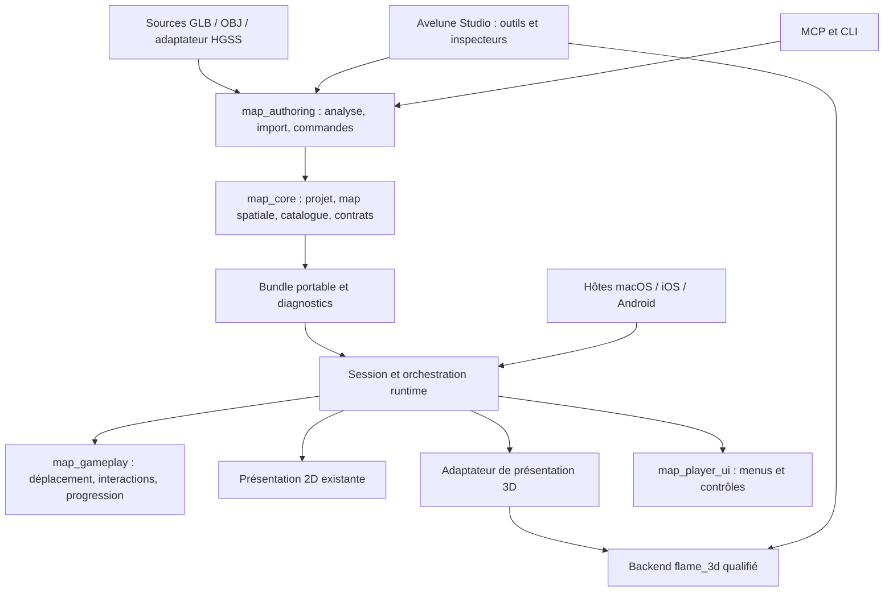
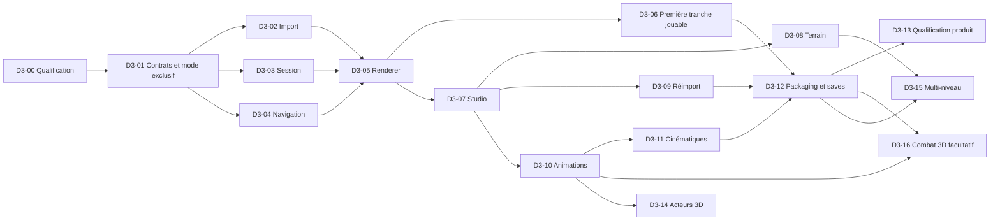

# Avelune Studio et Runtime — Plan d’intégration 3D

> **For agentic workers:** utiliser `skills/executing-plans/SKILL.md` ou `skills/subagent-driven-development/SKILL.md` pour une future exécution autorisée, lot par lot. Les cases ci-dessous décrivent du travail futur ; elles ne déclarent aucune fonctionnalité livrée. Respecter les instructions Git du dépôt avant toute opération d’écriture Git.

**Goal:** construire, importer, animer, enregistrer et jouer des maps 3D dans Avelune, avec le même gameplay et les mêmes jeux sur macOS, iOS et Android.

**Architecture:** chaque projet choisit un mode exclusif **2D ou 3D**, conformément à la précision explicite de Yoahn. Avelune conserve ses données, ses règles et sa session de jeu. Une représentation spatiale typée, un pipeline d’import contrôlé et un backend de présentation 3D prolongent les contrats existants. Studio et le Player partagent les ressources, les conventions et le rendu, mais gardent des responsabilités distinctes.

**Tech Stack:** Dart pur pour les contrats, l’authoring et le gameplay ; Flutter pour Studio et le runtime ; Flame pour le runtime existant ; `flame_3d 0.3.2` comme candidat à qualifier ; glTF 2.0/GLB comme format d’échange et de ressource normalisée ; SwiftUI et Kotlin/Compose comme hôtes mobiles existants.

**Date :** 7 octobre 2026. **Statut :** proposition d’architecture et de découpage, à examiner par Yoahn. **Mandat :** plan uniquement, aucun développement de production. Yoahn a demandé un document unique dans le dépôt, relié à Notion.

**Suivi unique :** [P3D-012 — Recetter le prototype et décider de la suite](https://app.notion.com/p/3db197a7bfa581f8ae8cfe80b8ff4baa), domaine **Systèmes transverses**, hors gate bêta. Cette préparation ne clôt pas la qualification P3D-011, ne vaut pas GO de publication et ne crée pas de tickets d’implémentation.

**Lecture conseillée :** sections 1–3 pour le produit ; 4–11 pour les décisions d’architecture ; 12–15 pour exécuter les futurs lots ; 16–17 pour les preuves, limites et décisions.

- [Recommandation](#1-recommandation) · [Audit](#2-ce-que-laudit-permet-réellement-de-conclure) · [Parcours Studio](#3-parcours-de-création-cible)
- [Architecture](#4-architecture-cible-et-frontières) · [Données](#5-contrats-de-données-proposés) · [Import](#6-import-et-bibliothèque-de-ressources)
- [Construction et passages](#7-construire-les-maps-et-authorer-les-passages) · [Animations](#8-animations-et-cinématiques) · [Sauvegardes et export](#9-enregistrement-export-et-sauvegarde-de-partie)
- [Mobile](#10-runtime-mobile-lifecycle-et-surfaces) · [Performance](#11-qualité-visuelle-et-performance) · [Fichiers](#12-fichiers-et-raccords-précis)
- [Lots](#13-ordre-de-livraison-et-lots-exécutables) · [Jalons et estimation](#14-dépendances-jalons-et-estimation) · [Vérification](#15-vérification-parité-et-critères-de-sortie)
- [Sources et preuves](#16-audit-sources-et-limites-de-la-mission) · [Décisions](#17-décisions-à-prendre-et-limites-assumées)

## 1. Recommandation

Construire un **mode de création 3D dans le Studio actuel**, avec une bibliothèque de modules, un sol éditable, des collisions explicites, des personnages et des événements. Garder les écrans Histoire, Personnages, Ressources, Vérification et les contrôles de jeu ; adapter leur projection dans le monde.

Le premier produit utile est une map créée dans Studio, enregistrée, fermée, rouverte, exportée, installée puis parcourue dans le vrai Avelune Runtime. Elle contient un bâtiment, une pente, de l’eau animée, un PNJ, une porte vers une autre map, un événement et une sauvegarde rechargeable. Ce parcours doit fonctionner avec un personnage PSDK en sprite, comme le laboratoire.

La trajectoire prépare ensuite les personnages 3D animés et les passages superposés. Elle ne transforme pas le premier lot en éditeur de modélisation, en moteur de physique généraliste ou en recréation intégrale de Pokémon X/Y.

Les décisions proposées sont les suivantes :

| Sujet | Décision recommandée | Conséquence |
|---|---|---|
| Produit | Mode exclusif 2D ou 3D choisi à la création du projet | Toutes les maps, transitions et exports respectent ce mode ; aucun jeu hybride |
| Données | Contrats Avelune typés dans `map_core` | Aucun objet Flame, handle GPU ou chemin absolu dans une map |
| Moteur | Continuer avec `flame_3d` sous qualification bornée | Ne pas annoncer un support production à partir du seul laboratoire |
| Import principal | GLB/glTF 2.0 normalisé, profil Avelune explicite | Un fichier glTF valide peut encore utiliser une fonction non prise en charge |
| Ressources HGSS | Adaptateur d’import spécialisé, réutilisant le travail du labo | Aucune règle liée à Oliville dans le runtime général |
| Construction | Assemblage de modules et terrain à grille/hauteurs | Le créateur place des maisons, peint des chemins et règle des passages |
| Personnages initiaux | Sprites 2D ancrés aux pieds, rendus dans la scène 3D | Le dessin actuel et ses animations restent utilisables |
| Collision | Données gameplay séparées de la géométrie visible | Un toit ne devient pas automatiquement un obstacle au sol |
| Animations | Clips visuels + états gameplay + orchestration cinématique existante | Une porte ouverte est un état de jeu, pas seulement un mesh tourné |
| Sauvegardes | Projet auteur, bundle publié et partie joueur séparés | Pas de textures ni de géométrie dupliquées dans chaque save |
| API | Même sémantique pour Studio, API, CLI et MCP | Une fonction seulement cliquable dans Studio reste incomplète |
| Plateformes | macOS, iOS et Android visés ; capacités vérifiées | Windows/Linux/web ne sont pas promis par ce plan |

**Précision validée par Yoahn :** l’exclusivité 2D/3D porte sur les maps du jeu. Les combats actuels peuvent rester dans un projet 3D. Sprites billboards, menus et présentation de combat existante sont donc autorisés ; le mélange de maps 2D et 3D reste interdit.

## 2. Ce que l’audit permet réellement de conclure

### 2.1 Le laboratoire a validé une expérience, pas encore une intégration

Le laboratoire est dans `apps/hgss_render_lab`. Il affiche une ville importée, utilise un personnage en sprite et réutilise `PixelMovementResolverV1.resolveSeparateAxis` pour ses déplacements. Sa navigation est reconstruite à partir des triangles et de règles adaptées à la source : elle n’est pas une collision Nintendo extraite du modèle.

La navigation du labo ne conserve qu’une hauteur par emplacement horizontal. Elle peut représenter un escalier ou une pente ; elle ne représente pas deux passages indépendants, l’un sur un pont et l’autre sous ce pont.

Yoahn a confirmé sur sa Thor le fonctionnement de l’image et des contrôles, puis le basculement des diagonales et l’agrandissement de 20 % du personnage. Les 66 tests, l’analyse et le build Android cités dans le suivi proviennent de l’exécution précédente. Ils **n’ont pas été relancés pour cette mission de planification**. Aucun relevé de performance instrumenté ni essai iOS n’est ajouté ici.

La scène de ville préparée pour le labo est une ressource visuelle cuite. Elle ne possède pas encore les garanties d’une map Studio : sélection des éléments métier, bibliothèque réutilisable, historique, réimport, navigation éditable, export portable et événements intégrés.

### 2.2 Les points de raccord existants

| Zone | Point d’appui constaté | Travail nécessaire |
|---|---|---|
| Studio actuel | `apps/avelune_studio`, canvas et commandes de map propres | Ajouter un viewport 3D et des outils spatiaux ; ne pas développer l’expérience principale dans l’ancien `map_editor` |
| Map canonique | `packages/map_core/lib/src/models/map_data.dart:22`, version courante `ProjectVersion.v8` | Décrire explicitement la représentation spatiale et ses références |
| Partie | `packages/map_core/lib/src/models/game_state.dart:72` | Conserver une position logique autoritaire ; ajouter le support de navigation quand nécessaire |
| Session runtime | `packages/map_runtime/lib/src/session/playable_map_game_session_runtime.dart` | Retirer progressivement la dépendance de la session au jeu Flame 2D concret |
| Jeu actuel | `packages/map_runtime/lib/src/presentation/flame/playable_map_game.dart` | Extraire seulement les responsabilités nécessaires au second renderer, avec non-régression 2D |
| Cinématiques | Contrats et évaluateurs dans `map_core`, contrôleurs dans `map_runtime` | Étendre les cibles spatiales et créer un adaptateur visuel 3D |
| Cinématique Flame | `flame_cinematic_runtime_playback_sink.dart:47` expose une caméra et des acteurs en `Vector2` | Ce sink ne devient pas 3D par un simple changement de caméra |
| Animation de décor | `map_placed_element_animation.dart` possède une évaluation temporelle pure | Réutiliser les règles applicables ; ajouter les canaux UV/TRS nécessaires |
| Mobile | Les deux modules Flutter lancent `runAveluneEmbeddedRuntime()` | Faire évoluer le runtime partagé et qualifier son montage dans chaque hôte natif |
| MCP vivant | `pokemap_describe` répond ; 372 actions annoncées lors de la lecture | Aucune action explicitement spatiale/mesh/3D n’a été trouvée par l’audit des identifiants |

`SceneAsset` existe déjà pour les scènes narratives. Le nouveau document spatial proposé s’appelle **`MapSpatialScene`** : il ne remplace pas ce graphe narratif et n’en réutilise pas le nom.

### 2.3 Le principal risque technique est identifié

La documentation de `flame_3d 0.3.2` annonce Android, iOS et macOS, tout en qualifiant le paquet d’expérimental, sans garantie de stabilité API, et en déconseillant la production. Flutter 3.47 ou supérieur est requis. Les manifests du projet demandent déjà Flutter 3.47.5 : une montée de version globale n’est donc pas le premier chantier. [Source officielle](https://pub.dev/packages/flame_3d/versions/0.3.2).

L’inspection du code installé montre notamment :

- import glTF/GLB, transformations de nœuds et skinning présents ; cela reste à éprouver avec nos fixtures ;
- `CUBICSPLINE` non implémenté dans le lecteur d’animations ;
- accessors sparse non pris en charge par le chemin examiné ;
- un seul clip actif dans l’état d’animation, sans mélange de clips prêt à l’emploi ;
- certains paramètres de matériau sont lus mais ne sont pas transmis au matériau de rendu ;
- les bornes utilisées par le culling d’un modèle animé ne sont pas une garantie de visibilité pendant toute l’animation.

**Conséquence :** ne jamais brancher le bouton « Importer un GLB » directement sur le parser du moteur et considérer le travail terminé. L’import doit produire un profil accepté, un diagnostic et un résultat visuel vérifié. Le lot de qualification peut conclure à un correctif borné, à une réduction du profil ou à une réévaluation du backend avant d’investir dans l’éditeur complet.

## 3. Parcours de création cible

### 3.1 Créer une map sans quitter Studio

1. Créer un **projet 3D**, puis une nouvelle map qui hérite de ce mode. Les dimensions restent exprimées en cases compréhensibles.
2. Choisir un profil visuel : caméra inclinée, textures nettes, personnage sprite ; un profil plus libre viendra avec le périmètre suivant.
3. Peindre le terrain, les chemins et l’eau. Les bords, falaises et raccords utilisent des ressources modulaires de la bibliothèque.
4. Placer une maison, un arbre, un banc ou un groupe enregistré ; déplacer, tourner, dupliquer et aligner sur la grille.
5. Activer la vue « Passages » pour voir le sol praticable, les obstacles, les pentes et les points d’arrivée.
6. Poser un PNJ, une zone de rencontre, une interaction et une porte depuis les outils métier existants.
7. Associer une animation disponible : eau en boucle, porte qui s’ouvre, enseigne qui tourne ; prévisualiser pause et retour à l’état initial.
8. Lancer « Jouer ici » avec le vrai runtime, puis revenir à l’édition sans enregistrer involontairement l’état de la partie dans la map.
9. Enregistrer, fermer Studio, rouvrir : ressources, placements, collisions, références d’animation et événements doivent être identiques.
10. Vérifier et exporter ; ouvrir le même jeu sur iOS et Android sans avoir accès au dossier source du Mac.

### 3.2 Importer une ressource

Le créateur choisit un GLB, voit le modèle, ses dimensions, ses matériaux et ses animations. Il règle une taille en cases et un pivot au sol. Studio propose un encombrement initial, puis permet de dessiner ou corriger la collision. Après validation, la ressource apparaît dans la bibliothèque avec une vignette, un nom et ses clips utilisables.

Le parcours normal n’affiche pas des indices de buffers, des matrices ou des chemins de textures. Les diagnostics techniques restent accessibles dans les détails de l’import pour résoudre une incompatibilité.

### 3.3 Importer une scène complète

Deux modes explicites :

- **Décor assemblé :** conserver un modèle complet comme ressource placée. La map peut recevoir ses collisions, événements, acteurs et points d’arrivée, mais les maisons ne deviennent pas artificiellement des ressources indépendantes.
- **Modules depuis les nœuds :** proposer des ressources séparées lorsque la hiérarchie source permet une séparation fiable. Préserver les transformations mondiales, les matériaux et l’identité des nœuds ; présenter le résultat avant validation.

Un mesh fusionné ne permet pas de retrouver automatiquement les intentions de l’auteur. Une segmentation heuristique peut aider l’import spécialisé HGSS ; elle reste une proposition à examiner, pas une promesse du format.

### 3.4 Ergonomie du viewport

Le viewport propose une vue de travail orbitale et la caméra du jeu, clairement distinctes. Orbiter pour placer une maison ne change pas la caméra enregistrée du jeu. La vue du dessus sert au terrain et aux passages ; la perspective sert aux volumes et aux occlusions.

Outils initiaux : sélection, déplacement sur le sol, altitude explicite, rotation autour de l’axe vertical, échelle uniforme, accrochage à la grille, duplication, suppression, cadrage de la sélection, masque de visibilité et verrouillage. Les groupes organisent la scène sans acquérir une deuxième logique de gameplay.

Le glisser crée un aperçu local ; son relâchement produit une seule commande annulable. Échap restaure l’état initial. Le changement de map, la perte de focus et une révision concurrente annulent proprement l’opération ou provoquent une revalidation. Une sélection ambiguë permet de choisir l’objet ou le niveau visé.

Les surfaces, boutons, inspecteurs et couleurs réutilisent le design system de Studio. L’outil « Passer devant » de la 2D ne doit jamais déplacer un objet en altitude : ordre visuel et hauteur physique restent deux concepts séparés, conformément au [cadrage Studio 3D](https://app.notion.com/p/3e0197a7bfa581fca753f8beffb95064).

## 4. Architecture cible et frontières



### 4.1 Responsabilités des packages

| Package / application | Responsabilité cible | Interdit dans cette frontière |
|---|---|---|
| `map_core` | Valeurs spatiales, scène auteur, ressources, collisions décrites, sérialisation, diagnostics et contrats de présentation | Flutter, Flame, buffers GPU et lecture directe de fichiers |
| `map_gameplay` | Navigation, résolution du mouvement, portée des interactions, états et règles | Caméra visuelle, triangulation de rendu, matériaux |
| `map_authoring` | Import, catalogue, mutations, références, révisions, persistance et préparation des exports | Widgets Studio et composants Flame |
| `map_runtime` | Session, orchestration, chargement, adaptateurs 2D/3D, raccord événements/cinématiques/combat | Commandes d’édition du projet auteur |
| **`map_render_3d`, proposé** | Modèles chargés, matériaux, caméra, picking, rendu et ownership GPU partagés par Studio et runtime | Règles Pokémon, accès aux saves, dépendance au laboratoire |
| `map_player_ui` | Contrôles, menus et présentation de session | Collision ou deuxième état de partie |
| `apps/avelune_studio` | Outils auteur, viewport, inspecteurs et retours d’erreur | Copie de l’importeur, copie du gameplay |
| Hôtes iOS / Android | Capacités, surfaces, lifecycle, fichiers et intégration Flutter | Un autre moteur de règles ou des menus métier natifs parallèles |

Le nouveau package de rendu se justifie par deux consommateurs réels : Studio et le Player. Il ne doit pas devenir un framework multi-moteur anticipé. Son API initiale ne couvre que charger une scène, appliquer un état visuel, projeter/sélectionner, piloter la caméra et libérer les ressources. Son backend reste remplaçable parce que ses types ne contaminent pas les données Avelune.

### 4.2 Extraction progressive du runtime

La première extraction garde le renderer 2D actif. Les tests existants doivent continuer à prouver le lancement, l’entrée utilisateur, les interactions, le combat et la sauvegarde. On déplace une responsabilité à la fois : ownership de l’état, orchestration du chargement, publication de l’état visuel, puis adaptateurs d’acteurs/caméra.

La session choisit la présentation à partir du **mode du projet**. Elle refuse une map de l’autre mode. Une transition entre deux maps du même jeu conserve équipe, inventaire, variables et autorité d’entrée ; elle prépare la destination avant de libérer l’ancienne scène. Un échec garde une session utilisable et ne consomme pas silencieusement l’événement de transition. Les jeux 2D et 3D peuvent être ouverts successivement depuis la bibliothèque, dans des sessions distinctes.

Le renderer reçoit l’état à présenter ; il ne recalcule ni les rencontres, ni les collisions, ni les récompenses. La caméra ne devient jamais la source de vérité de la position du joueur.

### 4.3 Horloges et ownership

Une autorité de temps de session alimente le gameplay et les animations de jeu. Pause, dialogue bloquant, cinématique et suspension appliquent une politique explicite. Le viewport auteur possède une horloge de preview séparée, réinitialisable et sans effet sur la partie.

Les données CPU de géométrie peuvent être mutualisées selon leur ownership ; les buffers et textures GPU sont partagés seulement entre instances d’un même contexte compatible. Poses, clip actif et paramètres animés sont propres à chaque instance. Le cache GPU appartient à son contexte de rendu/engine. Aucun handle GPU ne traverse un isolate ou ne s’enregistre dans JSON.

Chaque chargement porte une génération annulable. Un résultat arrivé après fermeture ou changement de map n’est pas attaché à la scène. Le dernier utilisateur libère les références logiques ; **la destruction GPU native doit être qualifiée séparément**, car `Resource` n’expose pas un simple `dispose`. Le cache dispose d’un budget, d’une invalidation par empreinte et d’une politique d’éviction testée. Le rechargement d’une texture ne doit pas laisser un mesh utiliser un handle détruit.

## 5. Contrats de données proposés

Les noms de cette section sont des **propositions à introduire**, pas des API déjà présentes. Les champs définitifs seront verrouillés au lot D3-01, à partir des fixtures de lecture/écriture et des conventions réellement utilisées par le gameplay.

### 5.1 Un mode exclusif de projet ; une map garde son identité et son gameplay

`ProjectManifest` porte un discriminant explicite proposé `worldMode: twoD | threeD`, fixé à la création. `MapData` conserve son identifiant, ses entités, événements, warps, connexions et zones gameplay. Dans un projet 3D, une propriété typée `spatialScene` contient un `MapSpatialScene` ; toutes les maps doivent satisfaire ce contrat. Dans un projet 2D, les données de scène spatiale sont interdites. Le mode n’est pas un réglage libre map par map.

La discrimination est **symétrique** : dans une map 3D, les payloads de représentation visuelle 2D (`visualStack`, calques de tiles et placements de décors 2D) sont interdits. Les données gameplay actuellement portées par des structures communes doivent être classées et conservées explicitement, sans effacer les collisions utiles. Un terrain 3D peut employer un atlas via son propre contrat de matériau ; il n’ajoute pas pour cela un calque de rendu 2D. Test obligatoire : scène spatiale et tile layer visuelle présentes ensemble → refus.

La création, l’import de maps, le copier/coller interprojets, les commandes API/MCP, la validation, l’export et le chargement runtime contrôlent ce même invariant. Une map 2D importée dans un projet 3D est refusée avec une explication ; aucune conversion implicite. Changer le mode d’un projet existant est hors V1 : ce serait un outil de conversion explicitement demandé, pas un toggle qui conserve des données incompatibles.

Un sprite utilisé comme personnage billboard, une texture PNG ou un menu Flutter restent autorisés dans un jeu 3D : ce sont des représentations et interfaces du jeu 3D, pas des maps 2D. La mutualisation du code gameplay et des écrans Studio n’autorise aucun mélange de modes dans le contenu d’un jeu.

Le document spatial contient les instances de décor, le terrain auteur, les références de matériaux/animations, les réglages de caméra, les supports de navigation et les attaches visuelles des entités. Il ne contient pas le graphe narratif, les statistiques Pokémon ou les buffers issus de Flame.

| Contrat proposé | Contenu essentiel | Invariant |
|---|---|---|
| `SpatialAssetDefinition` | ID stable, blob normalisé, empreinte, unités, pivot, bornes, matériaux et clips exposés, provenance | Modifier le contenu ne change pas arbitrairement l’ID |
| `SpatialInstance` | ID stable, ressource, position, rotation, échelle, overrides autorisés, groupe | Une instance n’est pas une copie de la géométrie |
| `SpatialPrefabDefinition` | Assemblage de modules, pivots, attaches et collision réutilisable | Pas de scripts exécutables embarqués |
| `MapSpatialScene` | Terrain, instances, attaches, caméra, navigation et profil visuel | Aucune référence directe aux classes du renderer |
| `SpatialEntityBinding` | ID d’entité canonique, apparence sprite/modèle, pivot, taille et attache | L’entité reste propriétaire de ses interactions |
| `SpatialNavigationDefinition` | Surfaces praticables, obstacles, hauteurs, passages et identifiants de support | La géométrie décorative ne décide pas seule du gameplay |
| `SpatialAnimationBinding` | Clip logique stable, cible, déclencheur, boucle/vitesse et état de repos | Un clip absent produit une erreur localisable |
| `SpatialCameraProfile` | Projection, cible, distance, inclinaison, limites et suivi | Distinct de la caméra temporaire de travail de Studio |

Les personnages non contrôlés et éléments interactifs ne sont pas dupliqués dans deux listes concurrentes : le binding référence l’entité métier. Pour un décor qui devient interactif, une commande explicite crée/lie l’entité et vérifie ses références.

### 5.2 Coordonnées et tailles

Convention proposée pour le monde 3D Avelune : **X vers la droite de la map, Z vers son bas, Y vers le haut**. Une case logique correspond à une unité de monde. Le nombre de pixels logiques par case vient du projet ; le 32 du labo ne doit pas devenir une constante universelle.

Un adaptateur unique convertit les positions logiques vers le monde, avec un offset de pivot documenté. Les sources utilisent leur conversion d’axes et d’unités une seule fois à l’import. Un sprite se place par ses pieds, sa taille visuelle est indépendante de son empreinte de collision et de sa vitesse.

Précision issue du code actuel : `GameplayPlayerState.playerPositionPx` est le coin supérieur gauche du sprite en pixels ; `pos` est la cellule calculée depuis le centre inférieur de la hitbox par `player_collision_conventions_v1.dart:89`. La conversion 3D doit donc utiliser **les pieds**, divisés par `manifest.settings.tileWidth/Height`, et non le coin supérieur gauche ou `RuntimeMapBundle.cellWidth/Height`, qui inclut une échelle de rendu. La hauteur vient du support navigable.

La sauvegarde actuelle copie la cellule `pos` dans `GameState.playerPosition` et ne conserve pas la position continue du mouvement. Pour restituer précisément une position 3D, le plan propose une localisation canonique continue avec support ; elle doit traverser le schéma de save, les checkpoints, le spawn, les transitions et le retour après défaite. Ajouter seulement un champ privé dans le renderer serait incorrect.

Le modèle sérialise une transformation explicite ; les rotations internes évitent les singularités et l’UI affiche des degrés compréhensibles. La V1 expose rotation verticale et échelle uniforme. Les transformations négatives ou non uniformes sont rejetées ou normalisées par l’import tant que normals, winding, collision et animation ne sont pas tous pris en charge.

### 5.3 Identité, réimport et variantes

Un réimport crée une nouvelle révision de contenu de la même ressource. Une table de correspondance relie les IDs Avelune aux nœuds, matériaux et clips sources. Les noms et indices glTF ne servent pas seuls d’identité stable.

Si la correspondance est ambiguë, l’import présente un conflit. Les placements et overrides déjà authorés ne sont pas écrasés automatiquement. Un clip supprimé reste visible dans le diagnostic des utilisations ; il ne se transforme pas en « premier clip disponible ».

Déplacer une texture dans la bibliothèque conserve l’identité. Dupliquer une ressource crée une identité distincte ; dupliquer une instance garde sa référence de ressource. Supprimer une ressource utilisée fournit un aperçu des usages et une opération explicite de remplacement ou de suppression des références.

### 5.4 Versionnement

La map courante est en **v8**, contrairement aux anciennes pages Notion qui mentionnent v6. Le lot de contrat devra réserver la prochaine version disponible du schéma après relecture du dépôt, mettre à jour les fixtures et refuser proprement un format non pris en charge.

Le maintien des **projets 2D** est un choix produit actuel, distinct des projets 3D. Il ne justifie pas des lecteurs multiples, migrations ou alias destinés uniquement à conserver d’anciens schémas pré-1.0. Une conversion de contenu existant est un outil explicite et un scope distinct ; aucune conversion automatique de PNG en volumes n’est prévue.

## 6. Import et bibliothèque de ressources

### 6.1 Pipeline transactionnel

```text
Sélection locale
  → inventaire borné des fichiers et dépendances
  → validation du format et du profil Avelune
  → normalisation axes / unités / matériaux / animations
  → aperçu + collisions proposées + diagnostic
  → plan de mutation et contrôle de révision
  → publication journalisée récupérable des blobs et du catalogue
  → invalidation des aperçus / caches / données compilées dépendantes
```

Les sources restent disponibles pour réimporter ; le jeu exporté embarque seulement les données nécessaires à l’exécution. L’importeur doit fonctionner hors ligne une fois ses outils installés. Ni le Player ni le téléphone n’ont besoin de Blender, Python ou du dossier Downloads de l’auteur.

Le validateur Khronos vérifie la conformité glTF. Un second contrôle Avelune vérifie les fonctions effectivement prises en charge. Ces deux verdicts sont différents. [Validateur officiel](https://github.com/KhronosGroup/glTF-Validator).

### 6.2 Formats et politique de prise en charge

| Source | Première intégration | Traitement |
|---|---|---|
| `.glb` | Prioritaire | Profil glTF accepté, textures intégrées, contrôles de matériaux/animations |
| `.gltf` + dépendances | Prévu dans le même pipeline | Résoudre les dépendances dans la racine choisie puis produire un GLB autonome normalisé |
| `.obj` + `.mtl` + images | Import statique borné | Conserver unités, UV, couleurs et alpha pris en charge ; pas d’animation inventée |
| Collada `.dae` HGSS | Adaptateur spécialisé après socle | Réutiliser et généraliser les conversions testées du labo ; diagnostic des hypothèses |
| `.blend`, FBX et autres | Conversion externe explicite | Export GLB depuis un outil identifié ; pas d’exécution automatique de contenu/script inconnu |
| PNG / sprites / atlas | Bibliothèques existantes | Sprite billboard ou texture de matériau, avec métadonnées de frames/pivot |

GLB est un conteneur d’asset, pas le document auteur de la map. Les placements, événements, collisions et réglages Avelune restent dans le projet Avelune.

### 6.3 Profil glTF initial

La V1 vise triangles, positions/normales/UV pris en charge, indices validés, textures PNG/JPEG, transformations de nœuds et matériaux stylisés. Le profil déclare explicitement ses extensions et limites. Une extension requise inconnue provoque un refus avant application ; une fonction optionnelle ignorée doit être signalée avec son effet concret, jamais effacée silencieusement.

Première direction artistique : textures nettes, matériaux unlit, couleurs de sommets lorsqu’elles existent, opacité opaque/mask et transparence limitée vérifiée. Ne pas promettre la fidélité PBR complète, les normal maps ou l’émission parce que le parser possède les champs correspondants.

La normalisation d’une interpolation spline vers des clés linéaires est une conversion avec une erreur mesurée : comparer les poses échantillonnées avant/après, conserver la recette et refuser si le seuil déclaré est dépassé. Elle ne se résume pas à renommer `CUBICSPLINE` en `LINEAR`.

Le standard glTF décrit séparément géométrie, hiérarchie, matériaux, skins et animations. Le sous-ensemble retenu doit être vérifié face à cette spécification, plutôt que déduit de l’extension du fichier. [Spécification glTF 2.0](https://registry.khronos.org/glTF/specs/2.0/glTF-2.0.html).

### 6.4 Import complet, annulation et réimport

L’import prépare ses résultats dans un espace temporaire ; l’application finale publie catalogue et fichiers référencés via le journal existant. Sa garantie multi-fichiers est **récupérable**, pas une visibilité atomique de tous les fichiers. Échec, annulation ou conflit de révision doivent être récupérés avant de rendre le projet à nouveau éditable, sans ressource fantôme ni map pointant vers un fichier manquant.

Enregistrer l’empreinte source, la version de conversion, la recette, les dépendances et la provenance. Dédupliquer le contenu identique sans fusionner des identités métier différentes. L’historique doit conserver les blobs encore référencés par une révision annulable ; aucune purge générale de `.pokemap/authoring/blobs` n’est permise.

Préflight d’import : taille et quantité bornées, chemins normalisés, archives sans sortie de racine, dépendances manquantes explicites, nombres finis, indices valides, hiérarchie sans cycle, textures décodables et plafonds de dimensions. Les limites du profil sont des paramètres versionnés et mesurés, pas les nombres arbitraires du labo promus en limites moteur.

## 7. Construire les maps et authorer les passages

### 7.1 Terrain modulaire

La première génération de terrain est une grille de cellules et de hauteurs avec modules de sol, bords, falaises et rampes. Studio conserve l’intention auteur ; la géométrie générée est un résultat reproductible. Peindre un chemin ne dépose pas des centaines de meshes indépendants dans le document.

Les visuels utilisent de vraies textures et ressources modulaires. Les primitives procédurales servent aux repères, volumes de collision et fixtures techniques ; elles ne remplacent pas l’asset artistique final.

Chaque ensemble de modules déclare taille, pivot, raccords et variantes. Le solveur choisit les raccords à partir du voisinage et de la hauteur. Un changement de terrain invalide seulement les cellules et chunks concernés. Le format prévoit une taille de chunk mesurable ; le choix initial doit venir de tests d’édition et de rendu, pas d’un streaming de monde ouvert construit d’avance.

### 7.2 Collision explicite et navigation compilée

Les données auteur décrivent le sol praticable, les obstacles et les passages. La compilation peut produire une grille de hauteur fine, des surfaces triangulées ou un index spatial ; le format compilé reste remplaçable sans perdre le contenu auteur.

Réutiliser le resolver de mouvement existant derrière une requête de navigabilité ; généraliser uniquement les hypothèses qui empêchent le nouveau support. Une hitbox de pieds ne devient pas la boîte englobante du sprite ou de la maison.

Le calcul doit contrôler le trajet, la largeur de passage, les variations de hauteur et les obstacles, puis autoriser le glissement le long d’un mur selon le comportement actuel. Rétrécir le sprite ne rend pas un passage plus large ; agrandir son apparence ne modifie pas sa vitesse.

V1 : une surface praticable par emplacement horizontal, avec pentes, escaliers et transitions entre maps. L’authoring refuse une superposition navigable ambiguë. Les obstacles portent déjà une étendue verticale utile ; le futur support multi-niveau ne sera pas reconstruit à partir des seules AABB visuelles.

### 7.3 Ponts et étages superposés

Extension dédiée : plusieurs supports à une même position, identifiés par `supportId`, reliés par des passages explicites. Le support est déjà enregistré dans la localisation V1 ; cette extension enrichit sa sélection, les surfaces simultanées et les passages. Monter sur un pont ne sélectionne pas automatiquement la plus grande hauteur trouvée.

Cette extension doit couvrir ensemble déplacements du joueur et des PNJ, ligne de vue, interaction devant soi, rencontres, zones, warps, triggers, routes cinématiques et saves. Un PNJ sous le pont ne voit pas le joueur au-dessus uniquement parce que leurs coordonnées horizontales sont proches.

Le lot ne sera pas considéré livré avec un seul joueur qui marche au bon étage. Sa recette comprend les interactions isolées entre niveaux et la restauration d’une partie sauvegardée sur chacun d’eux.

### 7.4 Objets mobiles et portes

La V1 autorise une porte visuellement animée dont le blocage change à un instant gameplay défini. Début, annulation et restauration réconcilient état logique et pose visuelle.

Les plateformes porteuses, ascenseurs continus, rigid bodies, sauts libres et navigation sur objets en mouvement sont hors première version. Leur ajout nécessiterait une politique de support mobile et de transport des acteurs, pas simplement une animation de translation du mesh.

## 8. Animations et cinématiques

### 8.1 Quatre besoins distincts

| Besoin | Mise en œuvre proposée | Garantie à prouver |
|---|---|---|
| Personnage sprite | Clips existants idle/walk/run/custom, billboard et profondeur 3D | Pieds ancrés, direction correcte, occlusion, taille indépendante de la collision |
| Eau / enseigne / lumière stylisée | Atlas de frames, défilement UV ou paramètres de matériau explicitement autorisés | Même résultat Studio/Player, pause et reprise sans saut temporel |
| Objet animé | Clip de transformations de nœuds : porte, moulin, objet qui tourne | Cible stable, retour à l’état de repos, instances indépendantes |
| Personnage 3D | Skinning et clips importés, binding idle/walk/run | Squelette conforme au profil, pose correcte, culling et coût mobile qualifiés |

Les animations de matériaux ne sont pas promises par le support de l’animation de nœuds glTF. Avelune définit un contrat séparé pour l’atlas/UV et le raccorde à son renderer.

### 8.2 Auteur no-code

Dans la ressource : liste des clips, aperçu, durée, boucle, vitesse, pose de repos et événements de lecture éventuels. Dans l’instance : animation automatique ou pilotée par un événement. Dans le personnage : associations des états idle/walk/run et animations nommées.

Pour une porte, le créateur choisit « ouverture », associe le clip et l’action logique d’ouverture. L’action métier reste testable sans GPU. Le clip ne modifie pas directement les variables du scénario en contournant l’exécuteur existant.

Les transitions simples entre clips sont initialement des changements explicites ; un blend fluide doit être développé et qualifié avant d’être proposé dans l’UI. La locomotion reste pilotée par le gameplay : les clips utilisent une animation sur place. Le root motion qui déplace le joueur est hors V1.

### 8.3 Réutilisation du système cinématique

Conserver les ressources, le séquencement, le dialogue, l’audio, les flags et les contrats de fin/annulation. Ajouter des cibles spatiales typées pour caméra, acteur et objet. Le renderer 3D consomme ces intentions via un nouvel adaptateur ; les contrôleurs ne deviennent pas dépendants de Flame3D.

Une cible logique de route peut suivre une surface avec sa hauteur. Une pose de caméra utilise de vrais paramètres 3D. Ne pas interpréter automatiquement le `zoom` 2D comme une distance caméra : la conversion change le cadrage et doit être authorée/validée.

La preview doit pouvoir lire, mettre en pause, avancer, revenir à zéro et annuler sans modifier la map. Une cinématique terminée ou interrompue restaure l’autorité d’entrée, le suivi caméra et les canaux audio/FX selon les garanties actuelles. Changement de map ou acteur disparu produit une issue explicite ; aucune attente infinie d’une animation visuelle.

Les emotes et dialogues utilisent une projection de l’ancrage de l’acteur vers l’écran. Tester le hors-champ, l’occlusion et les limites d’écran ; un offset fixe en pixels 2D ne suffit pas.

### 8.4 Conventions PSDK conservées comme référence

Le corpus PSDK reste une source de lecture pour les sprites, les états d’animation et le comportement de déplacement ; il ne devient pas une dépendance runtime. La direction quatre axes est notamment observable dans `scripts/4 Systems/003 Map Engine/2 Logic/50 RMXP/420 Game_Player_update_move.rb:13` (`Input.dir4`).

L’option diagonales est un réglage explicite du mouvement Avelune. Le laboratoire a montré les deux comportements ; le contrat produit devra fixer sa portée et sa persistance. Recommandation : valeur de projet déterminant le gameplay, surcharge de preview dans Studio ; pas un bouton X global qui pourrait entrer en conflit avec les menus du vrai Player.

## 9. Enregistrement, export et sauvegarde de partie

### 9.1 Projet auteur

Le projet contient le catalogue, les maps éditables, les références de sources et les recettes d’import. Les scènes spatiales sont sérialisées par `map_core` et enregistrées via les repositories/actions canoniques. Un JSON arbitraire copié sous `assets/` ne constitue pas une ressource correctement exportée.

Le fonctionnement actuel de l’historique doit être étendu explicitement : tous les nouveaux champs entrent dans les deltas, la détection de modification et l’annulation. Une sauvegarde qui conserve le JSON mais perd la scène à Undo n’est pas terminée.

Transactions ciblées : déplacer une instance ; peindre une zone ; changer une ressource ; réimporter ; dupliquer un groupe ; supprimer une ressource et traiter ses usages. Les opérations multi-fichiers utilisent les garanties réelles du journal d’authoring ; ne pas annoncer une atomicité globale que le stockage ne fournit pas.

### 9.2 Bundle de jeu

L’export résout récursivement les références : map → instance/prefab → modèle → matériaux/textures/clips, plus terrain, navigation, personnages et médias gameplay. Il produit un manifest de contenu et de capacités, des empreintes, puis un bundle autonome.

Inclure le **mode exclusif du projet**, une version de schéma, une version de données compilées et un profil de rendu requis. Réutiliser `map_distribution` et ses contrats `runtimeApi`, `requiredCapabilities`, `projectFormat` et `saveFormat`, plutôt qu’inventer un deuxième manifest de compatibilité. Ne pas utiliser la seule version commerciale de l’application pour décider qu’un jeu 3D est lisible.

Le Player contrôle ces exigences avant de démarrer la partie. Une plateforme incompatible affiche une explication et revient à la bibliothèque. Elle ne tente pas de rendre arbitrairement une map 3D dans le renderer 2D. Les jeux exclusivement 2D doivent continuer à fonctionner.

Les shaders proviennent du runtime livré et de profils autorisés ; les jeux importés n’embarquent pas de code ou shaders arbitraires à exécuter. Les modèles et textures sont des données chargées par les résolveurs du jeu installé, pas des chemins `rootBundle` codés en dur comme dans une démo.

### 9.3 Partie joueur

La save conserve l’identité du jeu et son contrat de compatibilité, la map, la position logique, l’orientation, le mode de déplacement, le support navigable et les états persistants du monde. Elle réutilise les états existants pour inventaire, équipe, variables, événements et progression.

Elle ne conserve pas les buffers GPU, la caméra de travail Studio, les références absolues de sources ou l’intégralité des modèles. Les animations décoratives peuvent redémarrer à une phase déterministe ; une porte ouverte se restaure depuis son état logique. La reprise au milieu d’une cinématique ne doit être annoncée que si le contrat courant l’autorise et est étendu avec des tests dédiés.

Chargement : lire et valider → résoudre map/ressources/support → préparer scène et gameplay → publier l’état préparé dans la session canonique au point de commit → libérer l’ancienne présentation. Si l’implémentation remplace un owner de session, son contrôleur doit orchestrer explicitement l’opération et les abonnements des surfaces. Aucun deuxième owner ne simule la même partie. En cas de map absente, support supprimé, ressource incompatible ou erreur GPU, conserver la save et appliquer la politique de rollback existante.

Un jeu mis à jour qui supprime le support sauvegardé doit déclarer la save incompatible ou proposer une relocalisation explicitement authorée. Ne pas téléporter silencieusement le joueur au premier point praticable.

## 10. Runtime mobile, lifecycle et surfaces

Les hôtes SwiftUI et Kotlin/Compose restent les hôtes de la même expérience Flutter. Les modifications concernent le packaging des assets/shaders, l’activation GPU dans l’engine réellement embarqué, les capacités, le montage des vues et le lifecycle.

Un succès `flutter run` du labo ne garantit pas le lancement depuis l’icône de l’application native, ni le montage après ouverture d’un jeu installé. Qualifier explicitement ces parcours sur les deux plateformes.

Sur Android, le fallback OpenGL documenté pour Flutter/Impeller ne prouve pas à lui seul la disponibilité de Flutter GPU pour notre renderer. Il faut une détection et un essai du backend requis. Sur iOS, compiler n’est pas une preuve d’exécution sur iPhone. [Documentation Impeller](https://docs.flutter.dev/perf/impeller).

Cas obligatoires : démarrage froid, retour bibliothèque, ouverture d’un second jeu, pause/reprise, perte de focus, déconnexion manette, rotation/redimensionnement autorisé, fermeture pendant chargement, pression mémoire et destruction/recréation de surface. Les inputs maintenus sont relâchés et réarmés suivant le contexte actif.

La [décision multi-surface](https://app.notion.com/p/3e4197a7bfa581c296a1cfc04d595858) reste applicable : une session, présentation principale monde/combat, présentation compagnon menus/commandes, fallback mono-écran. Le chantier 3D ne nécessite pas de livrer le double écran simultanément, mais ne doit pas créer une deuxième session ou hardcoder la Thor.

Si plusieurs engines sont nécessaires, seul le propriétaire de session fait avancer le jeu. La surface compagnon reçoit l’état UI et émet des intentions ; elle n’a pas besoin de recréer le renderer 3D. Les ressources GPU sont locales à leur engine.

## 11. Qualité visuelle et performance

Pour le profil HGSS : caméra contrôlée, sprite aux pieds, profondeur testée, échelle lisible et matériaux stylisés. Les réglages du labo fournissent un point de départ, pas une valeur imposée à tous les jeux.

La transparence mérite une qualification propre : objets opaques, feuillages découpés, sprite, eau et surfaces semi-transparentes qui se chevauchent. Trier les surfaces une fois à l’import, comme une adaptation particulière du labo, ne suffit pas pour une caméra mobile et des objets animés. Définir depth test/write, alpha cutout, ordre des transparents et limites du profil.

Le culling utilise des bornes conservatrices correctes pour les animations. Pour la première fixture animée, il peut être désactivé localement afin d’isoler le problème ; cela ne constitue pas la solution de performance finale.

Mesurer triangles, draw calls, changements de matériau, mémoire textures, temps de chargement, UI/raster frame time, pauses GC et croissance mémoire répétée. Distinguer ces métriques du vrai temps GPU : un callback Flutter ne mesure pas automatiquement toute l’exécution GPU.

`RenderContext3D.drawCount` compte les objets soumis dans le chemin examiné ; ce n’est pas un compteur des appels GPU par surface. Instrumenter les soumissions de surfaces/backend pour ce budget. Un mesh qui contient 178 surfaces ne se transforme pas en un seul draw call.

Les ressources partagées, regroupements par matériau, réduction des mises à jour et culling précèdent un chantier complexe d’instancing ou de LOD. Une ville de quelques milliers de triangles peut coûter cher si elle génère beaucoup de surfaces et de changements de texture.

Protocole initial proposé : scène nominale et scène de stress distinctes, échauffement de 30 secondes, mesure de 60 secondes répétée trois fois ; parcours identique ; appareil, backend, fréquence écran, résolution et build enregistrés. À 60 Hz, comparer notamment p95 UI/raster au budget de 16,7 ms et le taux de frames dépassant ce budget. Ces seuils sont des critères à valider, pas des résultats acquis.

Ajouter dix cycles d’ouverture/fermeture et dix cycles arrière-plan/reprise. Observer la mémoire au même point du parcours, après stabilisation. Une dérive reproductible est investiguée ; ne pas transformer un seuil arbitraire en preuve d’absence de fuite. La qualification thermique longue reste locale et opt-in, hors CI ordinaire.

## 12. Fichiers et raccords précis

Les chemins ci-dessous sont relatifs à `/Users/karim/Project/pokemonProject`. **Existant** signifie inspecté pendant cet audit. **Proposé** désigne un fichier à créer pendant une implémentation ultérieure ; aucun de ces fichiers de production n’est créé par ce plan.

| Statut | Chemin / zone | Raccord prévu |
|---|---|---|
| Existant | `packages/map_core/lib/src/models/project_manifest.dart` | Mode exclusif du projet, catalogue spatial et références de profil |
| Existant | `packages/map_core/lib/src/models/map_data.dart:24` | Scène spatiale typée, invariants de représentation et version |
| Existant | `packages/map_core/lib/src/models/game_state.dart:72` | Localisation sauvegardée, support et format canonique |
| Existant | `packages/map_core/lib/src/collision/player_collision_conventions_v1.dart:89` | Conventions des pieds et conversion pixels/cellules |
| Proposé | `packages/map_core/lib/src/models/map_spatial_scene.dart` | Document spatial auteur |
| Proposé | `packages/map_core/lib/src/models/spatial_asset_definition.dart` | Ressources, matériaux, clips et identités |
| Proposé | `packages/map_core/lib/src/models/spatial_navigation_definition.dart` | Sols, obstacles, supports et passages |
| Proposé | `packages/map_core/lib/src/operations/spatial_map_operations.dart` | Mutations pures communes à Studio et API |
| Proposé | `packages/map_core/lib/src/validation/spatial_map_validator.dart` | Validation spatiale, références et cohérence avec le mode projet |
| Existant | `packages/map_authoring/lib/src/editing/map_history_delta.dart:48` | Ajouter tous les champs spatiaux aux deltas, application et comptage |
| Existant | `packages/map_authoring/lib/src/domains/assets/asset_store.dart:143` | Catalogue et blobs adressés par contenu |
| Existant | `packages/map_authoring/lib/src/contracts/artifact_ref.dart:19` | Référence d’artefact ; hash cadré par domaine, distinct du SHA brut de provenance |
| Existant | `packages/map_authoring/lib/src/domains/assets/resource_source_actions.dart:109` | Précédent remplacement/révision, à étendre sans supposer que le PNG couvre le GLB |
| Existant | `packages/map_authoring/lib/src/references/resource_usage_projection.dart:19` et `resource_usage_walk.dart:3` | Usages et suppression sûre des nouvelles références |
| Existant | `packages/map_authoring/lib/src/application/map_mutation_dispatcher.dart:92` | Routage des nouvelles actions sémantiques |
| Existant | `packages/map_authoring/lib/src/registry/resource_kind_registry.dart` | Ressources spatiales découvrables ; préserver `scene` narratif |
| Existant | `packages/map_authoring/lib/src/transactions/journaled_transaction.dart:159` | Respect de `multiFileGuarantee: recoverable` |
| Proposé | `packages/map_authoring/lib/src/domains/spatial/spatial_asset_import.dart` | Inspection, normalisation et diagnostic d’import |
| Proposé | `packages/map_authoring/lib/src/domains/spatial/spatial_map_actions.dart` | Actions de scène, instances, terrain, caméra et animation |
| Existant | `apps/avelune_studio/lib/features/map_workspace/application/editable_map_document.dart:30` | Brouillon et commit d’édition |
| Existant | `apps/avelune_studio/lib/features/map_workspace/data/local_map_workspace_adapter.dart:134` | Sauvegarde conditionnée par la révision |
| Existant | `apps/avelune_studio/lib/presentation/features/map_workspace/map_workspace_canvas.dart:86` | Sélection de la présentation selon le mode du projet |
| Existant | `apps/avelune_studio/lib/presentation/features/map_workspace/map_decor_transform_draft.dart:31` | Précédent geste temporaire puis commit unique |
| Existant | `apps/avelune_studio/lib/features/resources/data/local_resource_mutation.dart:67` | Séparer staging modèle du chemin aujourd’hui orienté PNG |
| Proposé | `apps/avelune_studio/lib/presentation/features/map_workspace/spatial_map_viewport.dart` | Vue 3D, picking et contrôles de caméra de travail |
| Proposé | `apps/avelune_studio/lib/features/map_workspace/application/spatial_editing_commands.dart` | Commandes auteur pures, sans import Flutter/Flame |
| Proposé | `packages/map_render_3d/lib/map_render_3d.dart` et `lib/src/` | Backend de rendu partagé, cache, scène chargée, camera/picking, matériaux |
| Existant | `packages/map_gameplay/lib/src/gameplay_player_state.dart:65` | Position de mouvement autoritaire et projection de cellule |
| Proposé | `packages/map_gameplay/lib/src/spatial_navigation_query.dart` | Requête navigabilité/hauteur/support pure, consommée par le resolver existant |
| Existant | `packages/map_runtime/lib/src/session/in_process_game_session_adapter.dart:23` | Contrat de session conservé, enrichi seulement si nécessaire |
| Existant | `packages/map_runtime/lib/src/session/playable_map_game_session_runtime.dart:279` | Construction de la présentation sélectionnée par mode du projet |
| Existant | `packages/map_runtime/lib/src/presentation/flame/playable_map_game.dart:3180` | Synchronisation partie/monde ; extraction incrémentale |
| Existant | même fichier, `_startBattleHandoff` vers la ligne 7747 | Découpler orchestration combat de la présentation overworld concrète |
| Proposé | `packages/map_runtime/lib/src/presentation/spatial/spatial_runtime_presentation.dart` | Adaptation état de jeu → scène 3D |
| Proposé | `packages/map_runtime/lib/src/presentation/spatial/spatial_cinematic_playback_sink.dart` | Intentions et restauration cinématiques 3D |
| Existant | `packages/map_runtime/lib/src/application/scene_runtime/cinematic_runtime_playback_controller.dart:50` | Sink abstrait begin/update/end/restore réutilisable |
| Existant | `packages/map_authoring/lib/src/domains/distribution/runtime_project_projection_builder.dart:550` | Fermeture portable des blobs ; nouveaux types et dépendances |
| Existant | `packages/map_authoring/lib/src/domains/distribution/game_package_gameplay_readiness_gate.dart:26` | Spawns, supports, transitions et ressources requis avant export |
| Existant | `packages/map_distribution/lib/src/game_package_manifest.dart:17` | Contrats package/projet/save/capacités |
| Existant | `packages/map_distribution/lib/src/game_package_compatibility.dart:97` | Refus des capacités ou modes incompatibles |
| Existant | `apps/pokemap_hub/lib/presentation/features/player/pages/hub_installed_game_player.dart:817` | Façade des états dialogue/combat/input/picking indépendamment de la vue concrète |
| Existant | `apps/Avelune iOS/AveluneiOS/Infrastructure/FlutterEngineManager.swift:13` | Montage Flutter et qualification GPU dans l’hôte iOS |
| Existant | `apps/avelune_android/app/src/main/kotlin/com/yoahnl/avelune/player/runtime/RuntimeSession.kt:39` | Engine, surfaces et lifecycle Android |
| Existant | `apps/pokemap_hub/lib/embedding/avelune_runtime_app.dart:81` | Présentation principale/compagnon existante |
| Existant | `tools/pokemap_mcp/src/tools/mutations.ts:90` | Transport générique conservé ; nouvelles sémantiques via le catalogue |

Les numéros de ligne sont des repères du snapshot audité, pas des offsets garantis après les travaux concurrents. Préserver les barrels publics `map_core.dart`, `map_gameplay.dart`, `map_runtime.dart` et ceux des nouveaux packages.

## 13. Ordre de livraison et lots exécutables

Les identifiants **D3-00 à D3-16 sont des repères de ce plan**, pas des tickets Notion créés. Chaque lot inclut sa tranche de parité API/CLI/MCP lorsqu’il ajoute de l’authoring. Le backend 3D ne peut pas être déclaré disponible avant D3-00. Les étapes d’exécution restent soumises à une demande ultérieure de Yoahn.

Pour chaque lot de code : écrire d’abord les fixtures/cas attendus, vérifier qu’ils détectent l’absence ou le défaut, implémenter le minimum, exécuter les tests ciblés et l’analyse du package, puis revoir le diff. Les tests doivent couvrir une erreur réelle ou un comportement public, pas recopier la fonction testée.

### D3-00 — Qualification du backend et du profil d’import

**Dépendance :** aucune. **Estimation :** 12–24 heures. **Sortie :** profil accepté documenté et décision technique explicite, avant le développement produit.

- [ ] Préparer trois fixtures originales : décor texturé/cutout, porte TRS, modèle skinné minimal ; conserver leur source et leur résultat attendu.
- [ ] Vérifier dernière frame exacte, boucle, durée positive, scale de repos, deux instances indépendantes, transparence et culling animé.
- [ ] Qualifier indices Uint16, quatre influences et plafond constaté de 16 joints par surface ; décider subdivision/remapping ou refus avant upload.
- [ ] Vérifier les attributs ignorés par l’importeur actuel : `COLOR_0`, sampler, alpha, double face, normalisation d’entiers et extensions requises.
- [ ] Reproduire ou écarter les risques lus dans le code sur la dernière keyframe et la durée nulle. Aucun de ces risques n’est présenté ici comme un bug reproduit.
- [ ] Qualifier démarrage natif et ressources sur macOS, Thor et iPhone réel disponible ; un appareil manquant laisse sa case non qualifiée.
- [ ] Charger un GLB via le resolver d’une fixture de jeu installé, avec sources absentes ; qualifier l’adaptation des parsers qui passent actuellement par `Flame.assets`, sans conclure depuis un asset `rootBundle` seulement. Ce probe porte sur l’accès aux octets avec un adaptateur borné ; le véritable export auteur 3D arrive à D3-06, sans dépendance circulaire avec D3-02.
- [ ] Fixer le profil V1, les correctifs bornés nécessaires et un plafond d’investigation. En cas de blocage structurel, revenir à Yoahn avec alternatives/coûts avant de remplacer le moteur.

**Zone :** laboratoire pour les preuves ; package renderer candidat pour une extraction ultérieure. **Cas d’acceptation :** même fixture statique et animée observée sur les plateformes ciblées, diagnostics explicites des fonctions exclues, aucun hang aux bornes temporelles. Les sprites et la ville statique actuels ne remplacent pas ces preuves.

### D3-01 — Mode de projet et contrats spatiaux canoniques

**Dépendance :** profil D3-00 ; peut préparer ses fixtures pendant la qualification. **Estimation :** 16–32 heures.

- [ ] Introduire le choix exclusif `twoD/threeD` au manifeste et sa validation sur toutes les maps.
- [ ] Interdire symétriquement scène spatiale en mode 2D et représentation visuelle 2D dans une map 3D ; distinguer les champs gameplay des champs purement visuels.
- [ ] Définir `MapSpatialScene`, ressources, instances, bindings et supports avec valeurs finies, IDs uniques, références et unités explicites.
- [ ] Définir la localisation continue sauvegardable, le support et la conversion depuis les pieds du gameplay actuel.
- [ ] Réserver la version de schéma, mettre à jour codecs/fixtures/barrels, refuser les données incompatibles sans lecteur legacy ajouté pour convenance.
- [ ] Ajouter les opérations pures et étendre le calcul/application des deltas d’historique.
- [ ] Ajouter les kinds/queries/actions de création et inspection à `map_authoring` et au catalogue MCP.

**Fichiers :** `project_manifest.dart`, `map_data.dart`, `game_state.dart`, nouveaux modèles spatiaux, `map_history_delta.dart`, registre authoring. **Tests proposés :** `packages/map_core/test/spatial/spatial_document_codec_test.dart`, `packages/map_core/test/spatial/project_world_mode_test.dart`, `packages/map_authoring/test/spatial/spatial_history_test.dart`.

**Acceptation :** round-trip stable ; rejet de map 2D dans projet 3D et réciproquement ; Undo/Redo restaure tous les champs ; `NaN`, références absentes et doublons échouent avant écriture ; format inconnu refusé clairement.

### D3-02 — Premier import et catalogue de modèles

**Dépendance :** D3-00, D3-01. **Estimation :** 24–48 heures.

- [ ] Créer le socle de `map_render_3d` pour charger et prévisualiser **un modèle indépendant**, à partir du backend qualifié ; il ne dépend ni de la session ni de la navigation.
- [ ] Ajouter détection MIME/types GLB et inspection locale, sans détourner le staging PNG.
- [ ] Résoudre et normaliser les dépendances ; produire le profil accepté et son diagnostic.
- [ ] Enregistrer source, résultat, empreintes, identité logique, clips et slots matériaux dans le catalogue existant.
- [ ] Ajouter import plan/apply, reprise du journal, annulation et protections de révision.
- [ ] Créer l’écran d’import minimal avec aperçu, unités, pivot et erreurs actionnables.
- [ ] Vérifier import par Studio, API, JSONL et MCP sur la même fixture.

**Fichiers :** socle `packages/map_render_3d`, nouveau domaine `map_authoring/.../domains/spatial/`, `asset_store.dart`, `artifact_store.dart`, `local_resource_mutation.dart`, catalogue/query/dispatch. **Tests proposés :** `packages/map_authoring/test/spatial/spatial_asset_import_test.dart`, `apps/avelune_studio/test/spatial/spatial_import_flow_test.dart`. L’aperçu utilise ce même socle ; D3-05 l’étend à la scène et au runtime, sans cycle de dépendance ni renderer temporaire dupliqué.

**Acceptation :** la ressource est réellement utilisable dans la bibliothèque ; importer deux fois le même contenu a une politique explicite ; fichier invalide ou dépendance absente n’altère pas le projet ; crash/reprise ne laisse pas de référence pendante.

### D3-03 — Découplage ciblé session / présentation

**Dépendance :** D3-01 pour le choix de mode. **Estimation :** 32–56 heures. Peut avancer en parallèle de D3-02 avec ownership des fichiers coordonné.

- [ ] Caractériser les callbacks et listenables consommés par le Hub et `map_player_ui`.
- [ ] Introduire une façade étroite couvrant montage, état de présentation, picking et input ; garder `PlayableMapGame` comme implémentation 2D.
- [ ] Extraire progressivement l’ownership du monde, les transactions et l’orchestration nécessaires à la seconde présentation.
- [ ] Préserver le checkpoint, l’attente des scènes, les issues de combat et le lifecycle sans duplication de `GameState`.
- [ ] Prouver les parcours existants avec le renderer 2D avant de brancher la 3D.

**Fichiers :** session runtime, `playable_map_game.dart`, `hub_installed_game_player.dart`, contrôleurs de présentation concernés seulement. **Tests existants :** session, save/load, narrative parity, lifecycle, Golden Slice.

**Acceptation :** un jeu 2D reste fonctionnel avec les mêmes événements et saves ; un projet 3D non encore pris en charge produit une erreur explicite ; aucune scène 3D de secours ne s’instancie pour un jeu 2D. Pas de réécriture globale préalable du moteur.

### D3-04 — Navigation, position et interactions au sol

**Dépendance :** D3-01. **Estimation :** 24–40 heures.

- [ ] Définir la requête pure de hauteur/navigabilité/support consommée par le mouvement existant.
- [ ] Compiler une surface par emplacement depuis données auteur explicites ; écarter les règles de matériaux HGSS du runtime général.
- [ ] Raccorder joueur et PNJ, réservations/occupations, interactions, LOS, zones et warps.
- [ ] Tester pentes, seuils de marche, bord de falaise, étroit passage, diagonale activée/désactivée et dt variable.
- [ ] Ajouter la validation des spawns/arrivées et le diagnostic de navigation périmée après édition.

**Fichiers :** `map_gameplay`, conventions de collision core, nouveaux contrats navigation, validateurs. **Tests proposés :** `packages/map_gameplay/test/spatial_navigation_query_test.dart`, `packages/map_gameplay/test/spatial_interaction_test.dart`.

**Acceptation :** acteur aux bons pieds/hauteur, pas de passage à travers un obstacle fin à grande vitesse, comportement stable aux bords et aucun accès à une zone sans sol. Empilement de surfaces explicitement refusé tant que D3-15 n’est pas livré.

### D3-05 — Présentation 3D partagée et ressources GPU

**Dépendance :** D3-00, D3-02, D3-03, D3-04. **Estimation :** 24–40 heures.

- [ ] Étendre le socle de rendu partagé créé en D3-02 à la scène complète et créer son adaptateur `map_runtime`, sans dépendance du produit vers le labo.
- [ ] Charger les ressources depuis le resolver du jeu/projet ; supprimer toute hypothèse de chemins statiques de démo.
- [ ] Afficher décor, acteurs sprites, caméra, profondeur, alpha et projection des interactions.
- [ ] Mettre en place cache par contexte, états par instance, générations de chargement et libération mesurable.
- [ ] Rendre la sélection et les diagnostics exploitables par Studio, sans y déplacer les règles gameplay.

**Tests proposés :** `packages/map_render_3d/test/spatial_projection_test.dart`, `packages/map_render_3d/test/spatial_resource_ownership_test.dart`, `packages/map_runtime/test/spatial/spatial_runtime_presentation_test.dart`.

**Acceptation :** les mouvements proviennent de `map_gameplay`, les deux instances d’une ressource ne partagent pas accidentellement leur pose, fermer pendant chargement n’attache aucun résultat tardif, aucune référence GPU n’est sérialisée.

### D3-06 — Première tranche jouable du vrai produit

**Dépendance :** D3-01 à D3-05. **Estimation :** 16–28 heures.

- [ ] Préparer un petit projet **entièrement 3D** avec deux maps, un PNJ, une pente, une porte et une interaction persistante.
- [ ] Le construire via les contrats authoring disponibles, pas via le JSON privé du labo.
- [ ] Livrer dès ici un export portable minimal et son refus par un runtime incompatible ; ne pas attendre la fin du programme pour découvrir un blocage de packaging.
- [ ] Jouer, changer de map, sauvegarder, fermer puis reprendre dans le Hub et les hôtes mobiles qualifiés.
- [ ] Vérifier la non-régression sur un projet 2D distinct.

**Test proposé :** `examples/playable_runtime_host/test/spatial_project_vertical_slice_test.dart`. **Acceptation :** premier bout en bout réel, avec preuve native ; absence d’une étape signifie tranche partielle. Ce jalon ne prétend pas disposer encore de tous les outils auteur.

### D3-07 — Viewport Studio et placements éditables

**Dépendance :** D3-01, D3-02, D3-05. **Estimation :** 24–40 heures.

- [ ] Installer le viewport selon le mode projet et masquer les outils incompatibles.
- [ ] Ajouter ray picking, sélection stable, translation au sol/altitude, rotation verticale et scale uniforme.
- [ ] Réutiliser la logique de brouillon de geste : aperçu, un commit, cancel, undo/redo et conflit de révision.
- [ ] Afficher l’inspecteur de ressource/instance et distinguer caméra de travail/caméra du jeu.
- [ ] Raccorder « Jouer ici » au runtime commun et restaurer le document auteur au retour.

**Tests proposés :** `apps/avelune_studio/test/spatial/spatial_transform_gesture_test.dart`, `apps/avelune_studio/test/spatial/spatial_document_retention_test.dart`. **Acceptation :** placer/dupliquer/annuler/enregistrer/rouvrir un bâtiment et retrouver même ID, pose et collision ; aucun changement de caméra auteur ne modifie le jeu sans commande explicite.

### D3-08 — Terrain, modules et passages authorés

**Dépendance :** D3-04, D3-07. **Estimation :** 24–48 heures.

- [ ] Ajouter palette de terrain, sol/chemin/eau, hauteurs, falaises et rampes à partir de kits modulaires.
- [ ] Conserver les données auteur compactes et compiler les chunks affectés.
- [ ] Ajouter vue de navigation et outils de correction de surfaces/obstacles ; ne pas exiger de manipuler des triangles manuellement.
- [ ] Ajouter spawns, portes, zones et ancres d’interaction sur la surface sélectionnée.
- [ ] Proposer des groupes/prefabs simples ; préserver le lien ressource/instance et la duplication contrôlée.

**Tests proposés :** `packages/map_core/test/spatial/spatial_terrain_resolver_test.dart`, `apps/avelune_studio/test/spatial/spatial_terrain_authoring_test.dart`. **Acceptation :** créer depuis une map vide un chemin continu, une marche bloquée, une rampe traversable et un bassin ; jouer ce résultat, puis modifier et vérifier l’invalidation des collisions compilées.

### D3-09 — Réimport, usages et ressources réutilisables

**Dépendance :** D3-02, D3-07. **Estimation :** 16–28 heures.

- [ ] Exposer le graphe d’usages modèles → instances → maps et clips/matériaux associés.
- [ ] Prévisualiser réimport et changements d’identité ; conserver placements et overrides valides.
- [ ] Traiter noms de nœuds dupliqués, clip supprimé, source déplacée et empreinte identique.
- [ ] Permettre variantes de ressource et remplacement référencé avec journal/recovery et undo.
- [ ] Ajouter import de scène entière et extraction de modules lorsque la hiérarchie le permet.

**Acceptation :** réimporter une maison utilisée sur deux maps 3D modifie la ressource voulue, conserve les placements, signale un clip manquant et s’annule sans perte de fichiers. Un import interprojets vérifie le mode du projet de destination.

### D3-10 — Animations de décor et sprites

**Dépendance :** D3-00, D3-05, D3-07. **Estimation :** 20–36 heures.

- [ ] Ajouter bindings d’atlas/UV et TRS, clips nommés, boucle/one-shot, vitesse et pose de repos.
- [ ] Exposer preview/pause/reset dans ressources et instances ; réutiliser l’évaluation pure des animations compatibles.
- [ ] Synchroniser porte animée et blocage gameplay via une commande déterministe.
- [ ] Tester deux instances à phases différentes, pause, fin exacte, annulation et changement de map.
- [ ] Raccorder personnages sprites aux états existants, taille visuelle et pieds indépendants.

**Acceptation :** eau qui s’arrête en pause, porte dont l’état visuel/logique reste cohérent après load, animation disponible dans Studio et consommée dans le Player. L’import d’une animation Collada originale HGSS n’est pas implicitement promis.

### D3-11 — Événements et cinématiques en espace 3D

**Dépendance :** D3-03, D3-04, D3-05, D3-10. **Estimation :** 20–36 heures.

- [ ] Étendre les cibles/poses spatiales sans créer un second moteur narratif.
- [ ] Implémenter un sink 3D pour routes, caméra, animation, emotes et restauration.
- [ ] Raccorder les commandes de scénario, dialogues et audio existants au contexte 3D.
- [ ] Raccorder l’entrée dans la présentation de combat actuelle puis son résultat/retour sur la map 3D ; réutiliser `map_battle` et les menus, sans deuxième monde gameplay.
- [ ] Couvrir skip, cancel, changement de map, acteur absent et attente de fin d’animation.
- [ ] Prévisualiser une même cinématique dans Studio et le Player avec des ancrages identiques.

**Acceptation :** PNJ se déplace sur la pente, parle, ouvre une porte puis rend le contrôle ; combat actuel lancé depuis la map 3D, victoire/capture/défaite et retour correct ; une interruption restitue caméra/input/audio selon les contrats actuels ; aucun acteur n’est placé sous le sol par une interpolation 2D brute.

### D3-12 — Saves, export et installation robustes

**Dépendance :** D3-06, D3-09 à D3-11. **Estimation :** 24–40 heures.

- [ ] Compléter la fermeture des dépendances et supprimer la dépendance aux sources auteur dans les bundles.
- [ ] Enregistrer mode du projet et capacités requises dans les contrats de distribution existants.
- [ ] Généraliser checkpoint/localisation/support, défaite/respawn et mutations persistantes du décor.
- [ ] Valider rollback après map absente, texture absente, format incompatible ou support invalide.
- [ ] Tester installation, changement de version de jeu, retour bibliothèque et désinstallation avec les caches concernés.

**Acceptation :** un bundle déplacé sur une machine sans sources se lance ; une save reprend au bon endroit ; la save incompatible reste intacte ; un jeu contenant une map de l’autre mode est refusé avant export et au chargement s’il contourne l’exporteur.

### D3-13 — Qualification des hôtes et de la performance

**Dépendance :** D3-06 pour commencer ; D3-08 à D3-12 pour clôturer. **Estimation :** 24–40 heures, hors attente d’appareil et correction majeure du backend.

- [ ] Construire les vrais hôtes, shaders et ressources inclus ; tester depuis l’icône native.
- [ ] Exécuter la matrice tactile/clavier/manette et l’autorité input par contexte.
- [ ] Mesurer parcours nominal/stress et cycles lifecycle/mémoire selon le protocole.
- [ ] Vérifier le montage primary/companion existant et le fallback mono-écran sans deuxième simulation.
- [ ] Recetter sur appareils le passage map 3D → combat actuel → map 3D, avec outcome, position/support et reprise corrects.
- [ ] Fixer les budgets de profil et documenter exactement les appareils qualifiés.

**Acceptation :** preuves sur Mac, iPhone et Android réels ciblés ; limites explicites ; aucun « support iOS » déduit d’un APK Thor. Pas de nouveau soak/macOS runner coûteux dans la CI par défaut.

### D3-14 — Personnages 3D animés, étape suivante

**Dépendance :** D3-00, D3-09, D3-10. **Estimation :** 32–56 heures, hors création artistique et correctif structurel du skinning.

- [ ] Normaliser squelette et influences dans le profil qualifié ; segmenter/remapper les surfaces si cette stratégie a été prouvée.
- [ ] Ajouter une apparence modèle au personnage, réutilisant sa même identité et ses règles.
- [ ] Associer idle/walk/run/actions aux clips ; gérer les transitions de clips selon la capacité effectivement livrée.
- [ ] Qualifier plusieurs acteurs animés, culling dynamique, mémoire et remplacement de ressource.

**Acceptation :** un personnage modèle joue les mêmes interactions qu’un billboard, sans root motion implicite ni dépendance à la fréquence d’image. La compatibilité de modèles complexes X/Y n’est pas acquise par le seul support d’un squelette minimal.

### D3-15 — Ponts et supports superposés, étape suivante

**Dépendance :** D3-04, D3-08, D3-11, D3-12. **Estimation :** 32–56 heures.

- [ ] Étendre la navigation à plusieurs supports avec liens explicites et sélection d’étage dans Studio.
- [ ] Étendre indexations, occupations, LOS, interactions, rencontres, warps et routes par support.
- [ ] Enregistrer/restaurer le support canonique et vérifier la suppression/modification d’un passage.
- [ ] Tester deux acteurs au même X/Z sur niveaux différents, puis leur passage contrôlé par un escalier.

**Acceptation :** marcher dessus/dessous, sauvegarder/recharger chaque position et interagir uniquement avec le bon niveau. Un changement d’altitude visuelle seul ne valide pas ce lot.

### D3-16 — Scènes de combat 3D, extension facultative hors première version

**Dépendance :** D3-03, D3-05, D3-10 à D3-12 ; D3-14 seulement pour des combattants skinnés. **Estimation provisoire :** 32–64 heures pour une arène 3D stylisée avec combattants billboards et effets bornés ; le port de tout le catalogue d’effets demande un inventaire distinct.

**Décision de Yoahn : les combats actuels peuvent rester.** Ce lot est donc facultatif, hors critères de sortie de la première version. Le raccord obligatoire à la présentation de combat actuelle appartient à D3-11/D3-13. Si une arène 3D est demandée ensuite, conserver le moteur `map_battle`, les menus et les résultats ; changer sa présentation dédiée.

- [ ] Réutiliser le handoff déjà raccordé en D3-03/D3-11 ; conserver setup, outcome et transaction de retour en remplaçant seulement la présentation de combat.
- [ ] Définir le profil de scène de combat 3D, positions des combattants, cadrage et ancrages des effets/UI.
- [ ] Classer les effets actuels en overlays écran réutilisables, billboards monde adaptables et effets exigeant un port 3D ; ne pas promettre une conversion universelle.
- [ ] Tester entrée, tour, capture/défaite/victoire, interruptions et retour à l’emplacement/support overworld.

**Acceptation si commandé :** arène 3D qualifiée sur appareils, résultat battle inchangé, menus et input cohérents, retour au bon endroit sans deuxième session. Ce lot ne réécrit pas les règles de combat et ne bloque pas J3.

## 14. Dépendances, jalons et estimation



Le diagramme résume les dépendances principales ; les dépendances écrites de chaque lot font foi. La parité des transports, l’undo et les diagnostics traversent les lots ; ils ne sont pas une dernière étape de rattrapage.

| Jalon | Résultat examinable | Décision |
|---|---|---|
| J0, D3-00 | Profil moteur/import prouvé et limites listées | Continuer, correction bornée ou reconsidérer le backend |
| J1, D3-01 à D3-06 | Vrai projet 3D jouable, exportable et rechargeable | Valider les frontières avant l’éditeur complet |
| J2, D3-07 à D3-11 | Construire et animer une petite map dans Studio | Recette auteur par Yoahn |
| J3, D3-12/13 | Distribution, saves, appareils et handoff vers combats actuels qualifiés | Décision de disponibilité limitée ; aucune publication automatique |
| J4, D3-14/15 | Acteurs skinnés et supports superposés | Extensions séparées, sans retarder artificiellement le premier usage utile |

Les estimations sont des **heures d’ingénierie avec review et vérification**, pas des durées d’exécution d’agent ni une promesse calendaire. Elles excluent la fabrication des assets, la conversion massive des maps, une réécriture du backend, la publication stores et l’attente de matériel. Confiance faible avant J0/J1 ; réestimer à chaque jalon.

Sommes arithmétiques des lots, avant réserve : **148–268 h** jusqu’à la première tranche jouable D3-06 ; **300–536 h** pour le périmètre initial D3-00 à D3-13, avec combats actuels conservés ; **332–600 h** si l’arène de combat 3D facultative est ajoutée ; **396–712 h** avec toutes les extensions, acteurs skinnés et supports superposés compris. Ces fourchettes ne sont pas les anciennes estimations du laboratoire. Une réserve de pilotage distincte de 25 % porte le périmètre initial à **375–670 h**. Le coût d’un remplacement de moteur impose une nouvelle estimation.

L’objectif immédiat serait de commander seulement D3-00 puis D3-01 à D3-06, et de revoir le coût de Studio à partir de cette tranche. Lancer tout le programme sur la seule réussite visuelle du labo masquerait les risques de session, d’import et de lifecycle.

Le parallélisme utile se situe entre contrats/fixtures, raccord session et import une fois les interfaces stabilisées. Les schémas, lockfiles, `PlayableMapGame`, la projection de package et les registres authoring doivent avoir un propriétaire par tranche. Quatre agents qui modifient le même manifeste ne rendent pas le manifeste quatre fois plus correct.

## 15. Vérification, parité et critères de sortie

### 15.1 Matrice d’acceptation

| Domaine | Cas positif | Cas négatif / interruption | Preuve exigée |
|---|---|---|---|
| Mode projet | Créer un jeu 2D puis un jeu 3D séparé | Import/API/package tente une map de l’autre mode | Rejet identique dans Studio, API, CLI, MCP et Player |
| Codec | Enregistrer/rouvrir scène, références et caméra | Format inconnu, données non finies, référence cassée | Tests Dart round-trip et diagnostics avec chemin du champ |
| Import | GLB autonome et glTF avec textures | Extension requise absente du profil, indices invalides, texture manquante | Aucune application partielle ; diagnostic lisible et reprise journal |
| Réimport | Modifier un asset utilisé sur plusieurs maps | Nœud/clip supprimé, doublon ambigu | Correspondance explicite, placements préservés, undo |
| Édition | Placement/rotation/terrain et save/reopen | Échap, focus perdu, révision concurrente, save pendant saisie | Un seul delta par geste, aucune perte des brouillons |
| Navigation | Marche/course, pente, passage étroit | Obstacles fins, bord de falaise, dt élevé, zone sans sol | Replays déterministes et essai Player |
| Animation | Atlas/TRS, deux instances indépendantes | t=0, dernière key exacte, boucle, durée nulle, pause/cancel | Tests d’évaluation et vraie capture GPU |
| Gameplay | Dialogue, trigger, rencontre, porte, changement de map | Acteur/support absent, interruption d’une scène | Résultat métier identique au contrat ; input restauré |
| Save/load | Reprise position/support/état porte | Save corrompue, map manquante, ressources impossibles à charger | Ancienne session et save préservées ; retry possible |
| Export | Installer sur machine sans sources | Dépendance omise, capacité non supportée, mode incohérent | Bundle autonome, refus avant démarrage de partie |
| Lifecycle | Reprise et changement de jeu | Fermeture pendant import/load, surface détruite, manette débranchée | Aucun input bloqué, résultat tardif ignoré, ressources vérifiées |
| Non-régression | Projet 2D complet distinct | Introduire la 3D change timing/save/UI 2D | Golden Slice 2D + tests ciblés concernés |

La fixture de recette auteur doit être **créée avec les outils Studio livrés**, puis relue via API/MCP. Une fixture JSON écrite directement suffit à un test de codec, pas à prouver le parcours de création.

### 15.2 Parité sémantique dès chaque lot

Actions proposées à faire découvrir via le catalogue, avec noms définitivement fixés à l’implémentation : création de projet avec mode, import/inspection/réimport de modèle, placement/mutation/suppression d’instance, mutation de terrain, édition navigation, association d’animation, caméra, usages et validation. Les noms ne doivent pas être considérés comme des actions disponibles aujourd’hui.

Pour une mutation : même fixture initiale, même opération logique, mêmes données finales par API directe, worker JSONL, commande Studio et MCP. Tester plan périmé, identifiant d’opération rejoué et erreur de validation. Les previews n’écrivent pas de données cachées.

Les outils MCP génériques `plan/apply/query` peuvent rester les mêmes. Ce qui manque est le contrat sémantique, sa découverte et sa consommation réelle. Copier du JSON par `map.save` ne prouve pas la parité d’un outil de terrain ou de réimport.

Avant clôture d’un lot d’authoring : tests de parité, conformance PMCP-085, rebuild du serveur et inspection du catalogue vivant ; aucune action promise dans la documentation ne doit manquer du serveur effectivement chargé. Cette mission de plan n’ajoute aucune action et ne nécessite donc pas ce rebuild.

### 15.3 Commandes à utiliser lors de l’implémentation

Ces commandes sont **planifiées, non exécutées dans la mission actuelle**. Elles partent des dossiers indiqués. Employer le SDK Flutter 3.47.5 qualifié ou une version remplacée par une nouvelle qualification ; ne pas laisser le SDK global choisir silencieusement une autre version.

Contrats purs, depuis les packages modifiés :

```bash
cd /Users/karim/Project/pokemonProject/packages/map_core
dart test test/spatial
dart analyze

cd /Users/karim/Project/pokemonProject/packages/map_gameplay
dart test test/spatial_navigation_query_test.dart test/spatial_interaction_test.dart
dart analyze

cd /Users/karim/Project/pokemonProject/packages/map_distribution
dart test test/game_package_manifest_codec_test.dart test/game_package_compatibility_test.dart
dart analyze
```

Les tests `spatial` ci-dessus sont les fichiers proposés dans les lots ; les créer avant d’utiliser ces commandes. Résultat attendu : tous les cas du lot passent, analyse sans erreur ; consigner les vrais totaux au moment de l’exécution.

Authoring et transports :

```bash
cd /Users/karim/Project/pokemonProject/packages/map_authoring
dart test test/spatial
dart test test/domains/assets/resource_source_transaction_test.dart test/domains/maps/placed_element_geometry_transport_test.dart test/tooling/jsonl_mutation_worker_test.dart test/parity/full_authoring_parity_test.dart
dart run tool/pmcp085_conformance.dart
dart analyze

cd /Users/karim/Project/pokemonProject/tools/pokemap_mcp
npm run check
npm test
npm run build
```

Renderer, Studio et runtime :

```bash
cd /Users/karim/Project/pokemonProject/packages/map_render_3d
flutter test
flutter analyze

cd /Users/karim/Project/pokemonProject/apps/avelune_studio
flutter test test/spatial
flutter test test/architecture/architecture_boundaries_test.dart test/map_workspace/map_document_retention_test.dart test/map_workspace/save_while_typing_test.dart test/resource_io/resource_transaction_guard_test.dart
flutter analyze
flutter build macos --debug --no-pub

cd /Users/karim/Project/pokemonProject/packages/map_runtime
flutter test test/spatial
flutter test test/playable_map_game_save_load_transaction_test.dart test/session/playable_map_game_session_runtime_test.dart test/narrative_command_runtime_parity_test.dart test/player/runtime_player_lifecycle_matrix_test.dart
flutter test test/phase_a_golden_battle_slice_smoke_test.dart
flutter analyze

cd /Users/karim/Project/pokemonProject/examples/playable_runtime_host
flutter test test/spatial_project_vertical_slice_test.dart test/phase_a_golden_slice_launch_test.dart
flutter analyze
```

Le nouveau package `map_render_3d` n’existe pas encore ; les commandes correspondantes ne sont pas présentées comme exécutables avant son socle D3-02. Une erreur d’une suite historique doit être isolée et expliquée, jamais masquée derrière la réussite de la nouvelle fixture.

Hôtes réels, avec les scripts existants après mise à jour des assets et de l’initialisation GPU :

```bash
cd /Users/karim/Project/pokemonProject/apps/avelune_android
bash tool/build_runtime.sh debug
bash tool/build_android.sh :host_core:test :app:testDebugUnitTest :app:assembleDebug

cd '/Users/karim/Project/pokemonProject/apps/Avelune iOS'
bash tool/build_runtime.sh --no-codesign
xcodebuild -project AveluneiOS.xcodeproj -scheme AveluneiOS -configuration Debug -destination 'generic/platform=iOS' CODE_SIGNING_ALLOWED=NO build
```

L’iOS natif emploie actuellement un Swift package généré ; Android produit l’AAR du module partagé. Une commande générique `flutter build apk` dans le labo ne remplace pas ces builds. Les scripts comportent génération et nettoyage de sorties : les exécuter seulement dans le lot autorisé et inspecter leur delta. Le build iOS sans signature ne remplace pas l’installation et le run sur appareil avec la configuration de signature disponible.

Compiler les shaders du renderer dans son package avant les builds natifs avec le script `flame_3d:build_shaders` de la version figée et vérifier leurs ressources empaquetées. Ne pas ajouter aveuglément `--enable-flutter-gpu` à une commande `build` : l’activation doit être vérifiée dans les hôtes et les options réellement acceptées par le SDK.

Avant chaque run de tests Flutter, enregistrer PID runner et descendants ; après le run, inspecter et terminer seulement les descendants survivants dont l’appartenance est prouvée. Aucun kill par nom de processus. Les suites restent package-scoped ; les campagnes longues appareil/thermique restent locales et opt-in.

### 15.4 Lien avec les garanties gameplay existantes

Les garanties de **FG-014** (préparation/rollback de save-load), **FG-015** (pause/input), **FG-080/082** (contrats et exécution événementielle) et **FG-181/182/183** (fixture, parcours complet et non-régression) servent de critères à préserver. Leurs statuts historiques ne constituent pas une certification 3D.

Cette mission ne modifie ni la roadmap mécanique ni ses statuts. Pour la déclinaison 3D, les garanties nouvelles restent **TODO** ; le laboratoire apporte une preuve **PARTIAL** du rendu/déplacement seulement. Aucun lot bêta existant n’est élargi et aucune dépendance de release bêta n’est ajoutée.

## 16. Audit, sources et limites de la mission

### 16.1 Références produit consultées

- [Cockpit et laboratoire HGSS](https://app.notion.com/p/3db197a7bfa5814ba1abfc48be266598).
- [Vision 3D](https://app.notion.com/p/3db197a7bfa5811983a7c2c016aa5ae1).
- [Assets, import et textures](https://app.notion.com/p/3db197a7bfa581838960d592bf7cf9aa).
- [Préparer la 3D dans Avelune Studio](https://app.notion.com/p/3e0197a7bfa581fca753f8beffb95064).
- [Architecture multi-surface](https://app.notion.com/p/3e4197a7bfa581c296a1cfc04d595858).
- [P3D-012](https://app.notion.com/p/3db197a7bfa581f8ae8cfe80b8ff4baa) et son rattachement Systèmes transverses hors bêta.
- `AGENTS.md`, `codex_rule.md`, `pokemap_roadmap_mecaniques_fangame.md`, index des skills, workflows `writing-plans`, `requesting-code-review` et `using-pokemap-mcp`.

Les pages du 14 septembre contiennent des photographies anciennes : prototype non démarré, version Flame3D 0.3.0 et maps v6. Ces mentions ne sont pas reprises comme état courant. Le code et les preuves plus récentes font foi. La précision de Yoahn du 7 octobre — aucun mélange de modes dans un jeu — prime sur les hypothèses initiales et les propositions antérieures.

### 16.2 Références techniques primaires

- [flame_3d 0.3.2, README officiel](https://pub.dev/packages/flame_3d/versions/0.3.2) : statut et plateformes déclarés ; version figée pour cette étude.
- [glTF 2.0, spécification Khronos](https://registry.khronos.org/glTF/specs/2.0/glTF-2.0.html) : format et extensions ; aucune garantie que le parser actuel couvre tout le standard.
- [glTF Validator, dépôt officiel](https://github.com/KhronosGroup/glTF-Validator) : validation du format avant validation du profil Avelune.
- [Flutter Impeller](https://docs.flutter.dev/perf/impeller) : environnement graphique ; disponibilité de Flutter GPU à qualifier séparément.
- Corpus PSDK en lecture seule sous `/Users/karim/Project/pokemonProject autre dossiers/` : comportement/ressources de référence, pas format canonique du produit.

Le serveur `flame_docs` a été interrogé sur `flame_3d`, glTF et Flutter GPU ; aucun résultat utile pour ce périmètre. Le README officiel et les sources de la version installée ont servi de références complémentaires.

Références du paquet installé, sous `/Users/karim/.pub-cache/hosted/pub.dev/flame_3d-0.3.2/` :

| Fichier | Constat source, sans nouveau test exécuté |
|---|---|
| `lib/src/parser/gltf/animation.dart:51` et `animation_interpolation.dart:38` | Canaux TRS, interpolations exclues et morph weights |
| `lib/src/resources/material/unlit_material.dart:48` | Upload skinning et limite de joints par surface |
| `lib/src/parser/gltf/material.dart:113` | Écart entre propriétés lues et matériau final |
| `lib/src/parser/gltf/primitive.dart:50` | Attributs effectivement transférés |
| `lib/src/parser/gltf/accessor.dart:104` | Contraintes sur buffers/accessors |
| `lib/src/resources/mesh/surface.dart:49` | Conversion des indices en Uint16 |
| `lib/src/model/model_animation.dart:107` et `animation_state.dart:26` | Risques aux bornes temporelles à reproduire avant verdict de bug |
| `lib/src/model/model_component.dart:84` | Réserve documentée sur les bornes animées du culling |
| `lib/resources.dart:11` et `lib/src/resources/resource.dart:8` | Création de textures et absence de contrat simple de dispose |

Le wrapper Avelune doit s’appuyer sur les API réellement disponibles. Si un correctif du paquet est indispensable, prévoir une dépendance corrigée identifiée et testée ou une contribution/fork explicitement suivi. **Ne jamais modifier le cache Pub local comme solution produit.** La qualification doit aussi tester Studio et preview de jeu simultanés : backend global et ressources par contexte ne doivent pas entrer en conflit.

### 16.3 Commandes et actions réellement réalisées pour ce plan

| Action | Résultat / portée |
|---|---|
| `git status --short --untracked-files=all`, `git diff --stat`, `git rev-parse HEAD`, `git branch --show-current` | Audit de la base et des changements préexistants ; aucune écriture Git |
| Recherches `rg -n`, inventaires ciblés, lecture et extraction Python des fichiers listés en section 12 | Raccords, versions, tests existants, scripts mobiles et limites identifiés |
| Lecture des sources installées de `flame_3d 0.3.2` | Capacités/limites au niveau source ; pas une recette GPU |
| `flame_docs.search_documentation` | Aucun résultat utile pour la requête ciblée |
| Lectures Notion du cockpit, pages et ticket, catalogue MCP vivant | Contexte produit relu ; MCP répond avec 372 actions, aucune action spatiale explicite trouvée dans les IDs |
| Consultation des sources officielles ci-dessus | Versions, formats et statut expérimental recoupés |
| Écriture du présent document | Un seul livrable Markdown autorisé par Yoahn ; aucun fichier de production modifié |
| `POKEMAP_MARKDOWN_MAX_NEW=1 bash tools/scripts/check_markdown_hygiene.sh` | Code 0 : `Markdown hygiene: 1 new Markdown file(s), all in canonical locations.` L’override correspond au document unique explicitement demandé |
| `git diff --check` | Code 0, aucune sortie ; porte sur le diff suivi, distinct des contrôles du nouveau document non suivi |
| Contrôle structurel du document par Python | 17 lots uniques D3-00 à D3-16, aucun lot manquant, blocs de code équilibrés, aucun espace final ; tous les chemins complets marqués « Existant » présents |

Les tests Flutter/Dart, builds, simulations et essais appareils sont **non exécutés**, car la demande porte uniquement sur un plan. Les commandes de la section 15 sont le protocole de la future implémentation, pas des résultats. Aucun code hypothétique complet n’est présenté comme compilé : les types nouveaux sont des contrats d’architecture à verrouiller par les premiers lots.

### 16.4 État Git et inventaire de modification

Premier HEAD recontrôlé dans cette mission : `ca4071b59ab3569d58a4c5d02dceb4b9208c5db3`, branche `main`. Les références à `7e009f715` dans les échanges antérieurs appartiennent à une observation précédente. Le dépôt est partagé avec des travaux concurrents ; les numéros de ligne sont à recontrôler avant implémentation.

État initial constaté : **10 fichiers suivis modifiés et 166 fichiers non suivis du laboratoire**. Les fichiers suivis préexistants sont :

```text
packages/map_authoring/lib/src/domains/gameplay/pokemon_ruleset_actions.dart
packages/map_authoring/lib/src/parity/full_authoring_parity.dart
packages/map_authoring/test/domains/gameplay/pokemon_ruleset_authoring_test.dart
packages/map_editor/test/authoring_api/editor_mutation_parity_test.dart
packages/map_gameplay/lib/src/gameplay_world_state.dart
packages/map_gameplay/lib/src/los_detection.dart
packages/map_gameplay/test/los_detection_test.dart
packages/map_runtime/lib/src/presentation/flame/playable_map_game.dart
packages/map_runtime/test/trainer_spot_sequence_test.dart
tools/pokemap_mcp/test/pokemon_authoring.test.ts
```

Seul fichier ajouté par la mission : `documentation/reports/3d_lab/plans/2026-10-07_avelune_3d_integration_plan.md`. Zones : cadrage, audit, architecture, contrats, parcours Studio, imports, animations/navigation, sauvegardes/runtime mobile, lots, qualification, sources et verdict. Aucun commit, staging, branche, rebase ou push.

État final recontrôlé : **10 fichiers suivis modifiés préexistants, 167 fichiers non suivis**, soit les 166 fichiers du labo et ce plan. Aucun fichier de production modifié par cette mission. La copie jointe dans P3D-012 sert à consulter le document depuis Notion ; la source de référence reste ce fichier du dépôt, non commité à ce stade.

### 16.5 Passes et verdicts

| Passe | Travail | Verdict initial |
|---|---|---|
| Audit / Architecture | Session, gameplay, save, battle, cinématiques et hôtes mobiles | Raccord possible ; extraction progressive indispensable ; position pixels/cellule à préserver |
| Faisabilité d’implémentation | Studio, modèles, stockage, historique, références et API/MCP | Fondations réutilisables ; contrat spatial et cycle de ressource à créer ; attention aux deltas manuels |
| Tests | Fixtures du labo et bornes de parser/animation/navigation | Les 66 tests antérieurs ne prouvent pas glTF animé, multi-niveau ou parité produit |
| Build / Validation | Scripts iOS/Android, SDK, GPU et ownership | Hôtes partagés exploitables ; recette native et GPU à réaliser, cache image insuffisant comme preuve de libération GPU |
| Critique finale | Relecture croisée du document et des décisions utilisateur | Favorable après correction des deux P2 ; aucun autre P1/P2 identifié lors de la dernière passe |

Corrections issues des revues : discrimination symétrique 2D/3D, socle d’aperçu en D3-02 pour éviter une dépendance circulaire, publication dans la session canonique, support enregistré dès V1, combat courant obligatoire mais arène 3D facultative, distinction références logiques/destruction GPU et compteur réel de draw calls. La revue architecture confirme les réserves levées ; la revue moteur/validation est favorable avec ces précisions intégrées.

Les rôles ont été répartis sur trois subagents en lecture seule et la passe de synthèse du parent. Aucun subagent n’a implémenté le produit. Les observations initiales ne valent pas validation finale artistique ou GO de déploiement.

## 17. Décisions à prendre et limites assumées

**Déjà fixé par Yoahn :** un projet est 2D ou 3D, sans mélange de maps ; les combats actuels peuvent rester dans un projet 3D ; le personnage du labo est acceptable ; la diagonale doit pouvoir être désactivée ; cette mission ne fait que préparer un plan.

**Recommandation à examiner :** projet 3D orienté RPG au sol, construction modulaire, GLB comme entrée principale, sprites autorisés en 3D, qualification du moteur avant intégration, première tranche de deux maps 3D avant l’ensemble des outils auteur. Les supports superposés et acteurs skinnés ont des lots distincts.

**Portée combat tranchée :** réemploi de la présentation actuelle, avec raccord et retour au monde 3D testés. D3-16 reste une extension facultative ; aucun modèle de Pokémon 3D n’est nécessaire pour livrer le périmètre initial.

**Limites techniques ouvertes et procédure de décision :** fidélité des imports, corrections du backend, ownership GPU, budgets appareils, nombre de squelettes simultanés et effets de combat. D3-00 et les gates de chaque lot apportent une réponse mesurée. Une difficulté bloquante entraîne une estimation et une proposition bornées, pas une réécriture silencieuse.

**Auto-critique :** le risque principal n’est plus de dessiner une maison en volume. Il est de conserver la cohérence entre le document auteur, ses ressources, la navigation, l’état de jeu et les surfaces de présentation. Le plan limite ce risque par une tranche jouable précoce, des contrats typés, la parité des commandes et la conservation des preuves 2D. L’ampleur reste un vrai chantier produit ; la réussite de la Thor donne une bonne raison de le préparer, pas un raccourci autour de ces garanties.
