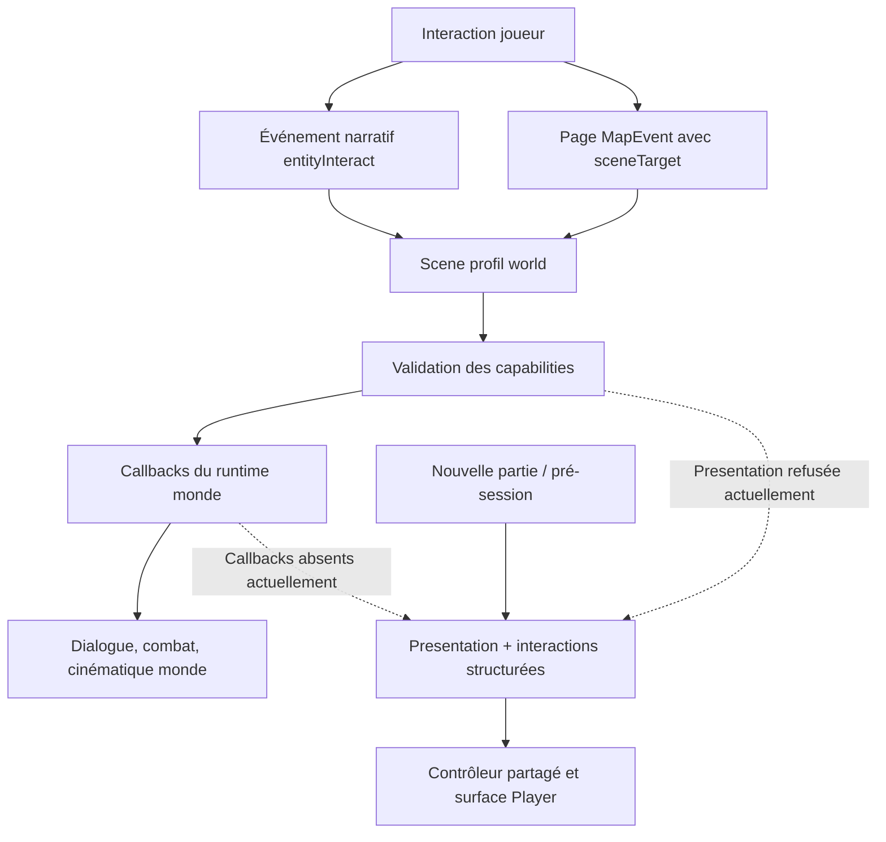
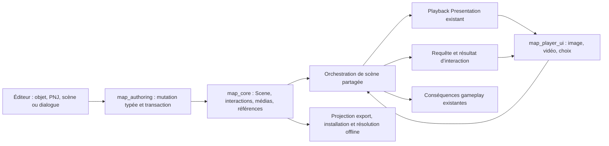

# Audit — médias et choix illustrés dans les interactions

Date : 5 septembre 2026. Ticket : `POST-CIN-MEDIA-AUD-001`. Famille unique : **16. Cinématiques et pré-session — Post-bêta**, `CIN-V2`.

[Ticket de l’audit](https://app.notion.com/p/3d2197a7bfa58192a119d59f92b7fa6e) · [Généralisation Presentation existante](https://app.notion.com/p/3ba197a7bfa581bb8ee4e38610a2d3d7)

## 1. Verdict et périmètre

**La fonctionnalité est réalisable en réutilisant Scene et Presentation. Le travail principal est de généraliser leur raccordement au monde, de rendre l’authoring simple et de compléter le cycle de vie des médias.** Il ne faut ni construire un second moteur de cinématiques ni considérer que le lecteur de l’introduction suffit à couvrir les interactions en partie.

Le code actuel contient des médias image/vidéo/audio, un évaluateur de présentation, des points d’attente pour dialogues et choix, un catalogue d’import et une chaîne de packaging. En revanche :

1. Le profil de scène `world` interdit actuellement Presentation et les interactions structurées.
2. Le runtime monde n’installe pas les callbacks permettant de les exécuter.
3. Les interactions authorées sont attachées au brouillon Nouvelle partie ; leurs résultats ne sont pas un contrat monde.
4. Les choix sont textuels et ne portent pas d’illustration.
5. Une commande média placée dans un dialogue Yarn n’a pas de sémantique exécutable aujourd’hui.
6. La vidéo, l’audio, le focus et l’export présentent des manques précis à résoudre avant de promettre le parcours demandé.

**Périmètre de cette tâche : audit et conception, sans implémentation.** Le seul fichier créé est ce rapport. Aucun code, asset de jeu, projet externe, schéma ou roadmap n’a été modifié. Aucun commit, rebase ou push.

Les références visuelles fournies servent à définir deux expériences : une illustration principale accompagnant un dialogue et un choix, puis plusieurs options illustrées avec confirmation. Elles ne constituent ni une spécification de moteur Pokémon ni une autorisation de reproduire exactement une interface existante.

### Preuves fraîches

- 43 tests ciblés `map_core`, 18 tests `map_runtime`, 21 tests `map_player_ui` : **82 tests réussis**.
- Analyse Dart des trois contrats ciblés : **No issues found!**
- Vérification TypeScript MCP : **exit 0**.
- Catalogue JSONL depuis le checkout : **success, exit 0**.
- Catalogue MCP live : **échec `worker.exited`, code 78**. Sa disponibilité n’est pas prouvée.
- Aucun replay Player, test de décodeur natif, build de distribution ou export d’un nouveau parcours n’a été effectué.

Ces résultats qualifient les fondations examinées. **Le parcours demandé reste à implémenter et à certifier.**

## 2. Méthode et état de référence

Racine examinée : `/Users/karim/Project/pokemonProject`. Branche observée : `main`. HEAD : `27b352ff8486f7a6402229c5b0e76e3c9a91fc54`, `feat: add smart tile variant naming with enlarged preview on hover`.

Les constats portent sur le **working tree courant**, qui contenait déjà 24 fichiers suivis modifiés et 17 fichiers non suivis au début de l’audit. Plusieurs fichiers analysés sont dans cette liste. Le SHA seul ne reproduit donc pas toutes les observations ; aucun changement concurrent n’est attribué à cet audit.

Instructions consultées : `AGENTS.md`, `codex_rule.md`, index des skills, `brainstorming`, `using-pokemap-mcp`. Le rapport unique est explicitement autorisé par la demande d’audit. Les exigences d’implémentation de `codex_rule.md` ne justifient pas de modifier le produit pendant une étude ; les tests existants ont été exécutés, sans écrire de tests de comportement futur. Ses prescriptions de commentaire et de commit ne s’appliquent pas à une modification logicielle inexistante et ne remplacent pas l’interdiction Git.

Le contrat `documentation/architecture/cinematic_v2_architecture_contract.md:57` réserve historiquement Presentation à la pré-session et reporte le monde à `BETA-CIN-009`. Ses invariants de propriété sont pertinents ; ses numéros de schéma initiaux ne doivent pas être repris comme valeurs courantes. Dans le code examiné, `PresentationCinematicAsset` est en **v3** et `ProjectMediaCatalog` en **v1**.

Les sources techniques ci-dessous sont des chemins relatifs à la racine précisée. Les numéros de ligne désignent les zones observées, susceptibles de se déplacer avec les travaux concurrents.

### Passes et verdicts

| Passe | Responsable | Résultat |
| --- | --- | --- |
| Audit / Architecture | Sous-agent `audit_scene_contracts` | Deux verrous monde démontrés ; protocole d’interaction réutilisable, binding Nouvelle partie à séparer. |
| Préparation implémentation / authoring | Sous-agent `audit_authoring_delivery` | Catalogue/import et actions existants ; nouveaux contrats monde, choix et références d’export nécessaires. Aucune implémentation exécutée. |
| Runtime / préparation tests | Sous-agent `audit_player_media` | Hold réutilisable ; défauts d’intégration audio, input, lifecycle, vidéo et image identifiés. |
| Tests et Build / Validation | Tom, passe distincte | 82 tests réussis, analyse ciblée et vérification TypeScript réussies ; JSONL disponible, MCP live en échec. Build application et replay non effectués. |
| Critique finale | Sous-agent `audit_scene_contracts`, seconde passe indépendante | Architecture cohérente ; quatre corrections concrètes intégrées, puis contrôle de la corrélation des reprises. Détail en section 14. |

## 3. Parcours actuel : objet ou PNJ vers média



### Déclenchement

`PlayableMapGame` produit une occurrence `entityInteract(mapId, entityId)` et la transmet au dispatch narratif (`packages/map_runtime/lib/src/presentation/flame/playable_map_game.dart:9852`, `:9866`, `:966`). Un `NarrativeEventDefinition` lie cette source à une scène et à ses conditions/politiques de réutilisation (`packages/map_core/lib/src/models/narrative_event_definition.dart:547`).

Le chemin exécute une session de travail avec commit ou rollback (`playable_map_game.dart:1070`, `:1089`, `:1096`, `:1107`). Une page `MapEvent` possède aussi une cible de scène (`packages/map_core/lib/src/models/map_event_definition.dart:90`, `:111`, `:133`) consommée par `SceneEventRuntimeHook` (`packages/map_runtime/lib/src/application/scene_runtime/scene_event_runtime_hook.dart:27`, `:52`, `:66`, `:86`).

**Une simple référence de dialogue sur un PNJ ne lance pas implicitement une Scene.** Les parcours historiques restent des fallbacks (`playable_map_game.dart:9881`, `:9941`, `:11802`). Ajouter un événement sur la case du PNJ ne garantit pas qu’il prendra la main : le fallback de case dépend de la cible d’interaction (`:9954`). Le raccordement recommandé est l’événement narratif `entityInteract` pour une entité précise, ou la cible de scène d’une page MapEvent pour l’événement de carte.

### Exécution

`SceneNodeKind.presentationCinematic` et `ScenePresentationCinematicPayload` existent (`packages/map_core/lib/src/models/scene_asset.dart:15`, `:1415`). Le payload référence la présentation et ses bindings `markerId → awaitableNodeId`.

`SceneRuntimeExecutor` attend déjà les opérations asynchrones (`packages/map_core/lib/src/runtime/scene_runtime_executor.dart:270`, `:297`, `:314`). `SceneRuntimeHostCallbacks` expose les ports facultatifs attendus (`packages/map_runtime/lib/src/application/scene_runtime/scene_runtime_host_callbacks.dart:9`). Mais `_buildSceneRuntimeHostCallbacks` ne renseigne ni `playPresentationCinematic` ni `requestStructuredInteraction` (`playable_map_game.dart:10176–10274`).

En amont, `packages/map_core/lib/src/models/scene_execution_capabilities.dart:141–171` réserve `presentation.cinematic` et `input.*` à la pré-session. Le diagnostic est bloquant (`packages/map_core/lib/src/diagnostics/scene_diagnostics.dart:296`). **Brancher un contrôleur sans modifier la matrice ne suffira pas ; modifier la matrice sans brancher les callbacks ne suffira pas non plus.**

## 4. Inventaire des capacités et des manques

| Besoin | Fondation constatée | Manque à traiter |
| --- | --- | --- |
| Image pendant une conversation | Pistes visuelles et hold sur cue ; nettoyage de la frame à la fin. | Déclenchement monde, erreur image explicite, raccourci auteur. |
| Plusieurs répliques sur la même image | Le cue peut attendre un dialogue entier. | Réutiliser la coordination des cues hors du runner Nouvelle partie. |
| Vidéo puis reprise | Driver natif et contrôle de séquence présents. | Fin native, erreur tardive, identité du clip et relecture, résolution `.blob`, skip/lifecycle monde. |
| Musique ou bruitage | Pistes audio, mixer, ducking, libération des canaux. | Autorité audio commune avec le monde, politique de portée et restauration. |
| Choix illustrés | Identifiants stables et résultats typés ; choix textuels. | Métadonnées visuelles, widgets, authoring, références et packaging. |
| Média au milieu d’un dialogue | Dialogue compilé en étapes, Scene asynchrone. | Étape média typée et pont suspendre/reprendre ; aucune commande générique existante. |
| Création no-code | Studio médias, picker Presentation, actions canoniques. | Actions utilisables en monde et formulaire simple partagé. |
| Jeu exporté autonome | Catalogue et projection des médias atteignables. | Inclure toute nouvelle référence portée par choix/dialogue ; compléter les informations exigées à l’export. |

### 4.1 Maintien d’image : réutiliser ce qui fonctionne

Le contrôleur de lecture détecte le cue, suspend l’horloge narrative, attend la réponse puis reprend (`packages/map_runtime/lib/src/player/runtime_presentation_scene_playback_controller.dart:174–227`). Il exige une durée jouable et refuse deux présentations actives (`:65–80`). À la fin, il retire la frame et libère l’audio (`:387–393`).

Cette portée est adaptée à une interaction. Le temps passé à lire ne doit pas devenir une durée de clip immense choisie au hasard. L’image vit tant que la séquence attend son dialogue ou son choix. À la sortie, le nettoyage est systématique.

Une image référencée mais indécodable retourne aujourd’hui un `SizedBox.expand()` dans le renderer runtime (`packages/map_player_ui/lib/src/player/runtime_presentation_surface_controller.dart:272–287`). La future préparation doit vérifier le décodage et produire un diagnostic ou un remplacement authoré, au lieu d’un vide silencieux.

### 4.2 Interactions et résultats

`SceneInteractionOption` contient `id`, `label`, `enabled`, sans média (`packages/map_core/lib/src/models/scene_structured_interaction.dart:77–113`). `RuntimeDialogueChoice` et `YarnChoice` sont également textuels (`packages/map_core/lib/src/dialogue/runtime_dialogue_document.dart:215`, `packages/map_runtime/lib/src/application/dialogue_runtime_models.dart:24`).

Le protocole requête/résultat valide déjà l’identité, la révision, le type de réponse et les options. Il faut le conserver. En revanche, `ScenePreSessionInteractionSpec.resultBinding` cible `playerName`, `avatarCharacterId` ou `starterOptionId` (`packages/map_core/lib/src/models/scene_pre_session_interaction.dart:5`, `:39`). Réutiliser ce binding dans une partie mélangerait deux états métier.

La surface de session superpose actuellement `snapshot.preSessionRequest`, même lorsqu’elle dessine une frame Presentation (`packages/map_player_ui/lib/src/player/pokemap_player_session_view.dart:548–576`). Il manque une requête d’interaction commune avec un propriétaire explicite, utilisable depuis le monde.

### 4.3 Audio : la restauration n’est pas automatique

`RuntimePresentationAudioController` joue via le mixer, libère canaux et ducking, et ignore des complétions obsolètes (`packages/map_runtime/lib/src/player/runtime_presentation_audio_controller.dart:142–181`, `:215–258`).

Mais le standalone construit un mixer neuf pour Presentation (`examples/playable_runtime_host/lib/main.dart:850`) et un autre pour le démarrage/le jeu (`examples/playable_runtime_host/lib/src/runtime_startup_host.dart:122`, `:133`, `main.dart:728`). La musique monde ne distingue que carte, rencontre et combat (`playable_map_game.dart:697–727`).

Partager une instance est nécessaire mais insuffisant : il faut aussi arbitrer la priorité de lecture. Une séquence devra acquérir puis restituer le contrôle de l’ambiance, sans qu’une synchronisation de carte relance sa musique pendant la vidéo. Le volume utilisateur, la position de l’ambiance et les changements devenus légitimes pendant l’annulation doivent être préservés.

### 4.4 Vidéo : clock de séquence et décodeur sont deux choses

Le port `RuntimePresentationVideoPlaybackDriver` ne remonte ni durée, ni fin native, ni erreur après démarrage et n’expose pas de seek (`packages/map_runtime/lib/src/player/runtime_presentation_media_playback_controller.dart:47–60`). La synchronisation se base sur le premier média vidéo visible et n’agit plus si son ID reste identique (`runtime_presentation_scene_playback_controller.dart:310–338`).

Conséquences : la fin de la timeline ne prouve pas la fin réelle du fichier ; le même média dans un autre clip peut ne pas redémarrer comme attendu ; une erreur native tardive n’est pas une issue Scene fiable.

`PresentationMediaAliasStore` fournit une extension jouable à un blob (`packages/map_player_ui/lib/src/player/presentation_media_alias_store.dart:30–56`), mais ses usages de production observés sont ceux du Studio. Les hosts runtime reçoivent les URI directement. Le wrapper utilise `VideoPlayerController.file` (`packages/map_player_ui/lib/src/player/player_intro_video_controller_io.dart:9–14`). C’est un **risque d’intégration à rejouer sur un vrai fichier**, pas la preuve que toute vidéo runtime échoue.

### 4.5 Input, skip, pause et annulation

La frame Presentation bloque déjà les commandes gameplay. Cependant, hors pré-session, confirmer est dirigé vers skip et retour vers cancel (`pokemap_player_session_view.dart:237–280`). Le standalone ne fournit pas `onPresentationSkip` au montage examiné (`main.dart:1340–1357`).

L’adaptateur distingue les terminaux, mais son port Scene fusionne `completed` et `skipped` (`packages/map_runtime/lib/src/application/scene_runtime/scene_presentation_cinematic_runtime_awaitable_result.dart:64–68`). C’est dangereux si passer une présentation contenant un choix obligatoire laisse la scène continuer sans réponse.

Pause/resume existent sur `RuntimePresentationSurfaceController:159–162`. Le callback lifecycle standalone examiné appelle son coordinateur ; aucun appel correspondant vers ce contrôleur n’a été retrouvé (`main.dart:1197`). Le raccordement devra être explicite. La documentation Flame configurée confirme `pauseEngine`/`resumeEngine` (`flame://flame/game`) ; le code et les verrous existants du projet restent la référence d’intégration. Il ne faut pas geler par inadvertance l’horloge qui attend le média.

### 4.6 Pendant un dialogue existant

Le compilateur connaît `portrait`, `jump` et `outcome` ; les autres lignes `<<…>>` peuvent être ignorées (`packages/map_core/lib/src/dialogue/yarn_dialogue_compiler.dart:183–225`). Ajouter des balises libres `showImage` ou `playVideo` dans l’éditeur ne ferait donc pas apparaître un support réel.

Il faut distinguer trois parcours :

- **Une image accompagne un dialogue entier** : le dialogue devient l’awaitable d’un cue Presentation. C’est la première tranche recommandée.
- **Une présentation est placée entre deux dialogues** : deux nœuds dialogue encadrent un nœud Presentation. Le joueur vit une conversation continue ; les assets existants ne sont pas découpés automatiquement.
- **Un média s’insère au milieu d’un même dialogue compilé** : une nouvelle étape typée doit suspendre le curseur, jouer la présentation, puis reprendre à l’étape suivante. Ce parcours fait partie du plan complet, mais n’est pas couvert par les deux premiers.

## 5. Architecture cible et alternatives

### Alternative retenue : séquence média Scene + Presentation

Le système conserve un graphe narratif unique. Presentation conserve son évaluateur, ses pistes et son renderer. L’auteur dispose d’un raccourci qui crée et relie une présentation simple, avec une interaction attendue et une sortie déterministe.

| Approche | Avantage | Coût / défaut | Décision |
| --- | --- | --- | --- |
| Réutiliser Presentation avec séquence attendue et raccourcis no-code | Même renderer, import, packaging, hold et résultats ; assets éditables dans Studio. | Généraliser les callbacks et les interactions ; simplifier l’auteur. | **Recommandée.** |
| Créer un système parallèle d’overlays image/vidéo globalement persistants | Commandes show/hide apparemment directes. | Deux autorités visuelles, nettoyage dispersé, références/export et restauration à dupliquer. | Écartée pour ce besoin. |
| Construire chaque cas dans une timeline complète manuellement | Peu d’UX nouvelle pour utilisateurs experts. | Trop de manipulation pour une lettre ou une carte de choix ; ne résout pas les verrous monde. | Mode avancé conservé, pas parcours normal. |



### Propriété des responsabilités

| Package | Responsabilité cible |
| --- | --- |
| `map_core` | Contrats typés, codecs, capabilities, diagnostics, références, outcomes et évaluation de présentation. Aucune UI ou dépendance native. |
| `map_authoring` | Opérations no-code transactionnelles, staging médias, création/liaison, requêtes et projection des dépendances. |
| `map_gameplay` | Règles métier déclenchées après la réponse ; ne pas y placer de lecture multimédia. |
| `map_runtime` | Coordination des cues, durée de vie des runs, callbacks monde, audio, traduction du résultat vers Scene. Aucune construction de widget. |
| `map_player_ui` | Surface commune, widgets de choix, focus, lecteur vidéo, adaptation d’URI jouable et rendu partagé. |
| `map_editor` | Pickers, formulaire guidé, aperçu, authoring des choix et diagnostics via les contrats canoniques. |
| Hosts / Hub | Injecter les ports, résolveurs et mixer communs ; raccorder lifecycle ; aucun scénario réimplémenté dans l’hôte. |

### Extraction minimale nécessaire

La coordination de cue aujourd’hui dans `runtime_new_game_flow.dart:174–267` sera extraite vers un service réutilisable. La pré-session y conservera son adaptateur de résultat vers `NewGameDraft`. Le monde utilisera des outcomes de scène et les opérations de gameplay existantes.

La composition `RuntimePresentationSessionRuntime` deviendra utilisable par ces deux contextes. Ajouter un port au monde est préférable à recopier le runner Nouvelle partie ou à placer la logique de cue dans les milliers de lignes de `PlayableMapGame`.

## 6. Contrats à construire et comportements proposés

Les noms de concepts ci-dessous décrivent la cible. **Ils ne sont pas des API ou actions MCP déjà disponibles.** Leurs identifiants publics seront figés au lot de contrats, après vérification du catalogue courant.

### 6.1 Interaction générique

- Requête : ID stable, révision, run/owner, prompt localisable, options, politique d’annulation et éventuelles contraintes.
- Réponse : les types existants, validés contre la requête ; une seule réponse terminale acceptée.
- Binding : adapter distinct pour Nouvelle partie ; en monde, sortie typée de Scene, puis commande métier. Ne pas écrire directement dans la party depuis le widget.
- Capabilities : activer uniquement celles dont l’exécuteur, l’authoring et le host monde sont présents. Ne pas copier en bloc les permissions de pré-session.

### 6.2 Option illustrée

Étendre le modèle d’option avec une présentation facultative : référence à un média du catalogue, description localisable et texte alternatif. Conserver `id` et l’outcome indépendants du libellé et du fichier. Une image absente ne doit pas sélectionner une autre option.

La première version accepte les images importées dans le projet. Un picker d’espèce ou de personnage peut alimenter cette même référence via les catalogues existants ; il ne doit pas introduire un chemin natif dans le contrat ni trois starters codés en dur. Les PNG transparents restent valables. L’animation de sprites de choix et les battlers animés sont des extensions, pas un préalable au choix illustré statique.

Deux variantes de rendu suffisent : illustration principale avec choix textuels ; cartes illustrées avec état ciblé, état sélectionné et confirmation. Le changement d’illustration au focus est un état de présentation local à la requête, pas une mutation de la timeline canonique.

### 6.3 Image et durée

La commande auteur « Afficher une image avec un dialogue » produit une présentation courte et un cue. Elle attend le dialogue ou la confirmation. Plusieurs répliques appartiennent au même awaitable ou à des cues successifs. Le média se ferme à la sortie de cette séquence.

La fermeture explicite est une sortie de la séquence. **Pas d’état image global qui survive à une scène, un warp ou un chargement.** Si un futur besoin réclame un HUD ou un document consultable de façon persistante, il faudra un contrat de durée de vie propre ; ce n’est pas nécessaire pour les références actuelles.

### 6.4 Vidéo

Pour « lire la vidéo jusqu’au bout », le port natif doit remonter fin et erreur, être corrélé au run et au clip, et distinguer arrêt demandé de fin observée. Un changement de clip doit pouvoir relire le même média. Seek/position sont nécessaires si la sémantique de clip inclut un segment ou une reprise ; ne pas annoncer leur prise en charge sans port effectif.

La séquence attend une fin native, un skip autorisé, une annulation ou une erreur. Un délai borné d’absence de progression empêche une attente éternelle ; il ne transforme jamais une panne en succès. Ce délai ne progresse que lorsque le lecteur est censé avancer : pause utilisateur, application en arrière-plan et hold avec vidéo gelée le suspendent. L’attente volontaire d’une réponse ne peut pas devenir un timeout de décodeur. Un seul décodeur actif reste la règle de la première version.

Le préchargement et la résolution d’URI jouable doivent être partagés entre preview, projet local et installation Hub. Tester les vrais fichiers de catalogue, y compris ceux stockés sous `.blob`.

### 6.5 Musique et son

Trois intentions sont distinctes et doivent être affichées par l’auteur :

| Intention | Comportement proposé |
| --- | --- |
| Son ponctuel | Lecture une fois ; aucune relance au retour d’un hold ou d’une pause. |
| Musique de séquence | Baisse ou pause de l’ambiance précédente ; lecture temporaire ; restitution à toute sortie. |
| Changer la musique de la carte | État monde explicite, persistant selon le contrat d’ambiance ; lot ultérieur séparé si ce comportement est retenu. |

Le parcours demandé « déclencher une musique » est couvert initialement par la portée séquence. Le cas radio qui continue après fermeture de l’interaction exige explicitement la troisième intention et ne sera pas promis par une simple piste Presentation.

### 6.6 Input et terminal

Priorité : requête de choix/texte active, puis média sans interaction, puis gameplay. Une confirmation de choix ne peut pas être consommée comme skip. L’annulation rejoint une issue authorée et libère les ressources ; elle n’est jamais un « Oui » implicite.

Pour une vidéo purement informative, l’auteur peut autoriser « Passer ». Pour un choix obligatoire, skip n’est pas disponible tant que la conséquence requise n’a pas été validée. Le contrat doit rendre `skipped` distinct de `completed` lorsque les branches le nécessitent ; les anciennes sorties ne seront pas maintenues uniquement pour compatibilité pré-1.0.

Tous les chemins fin, erreur, timeout, dispose et changement de scène terminalisent une seule fois. Les callbacks tardifs sont ignorés par identité du run. La fermeture d’un host annule la requête avant de détruire sa surface.

### 6.7 Sauvegarde et progression

Première version : aucune sauvegarde d’une frame vidéo ou d’un contrôleur Flutter. Utiliser une frontière stable avant/après la séquence. Un save demandé pendant une interaction est différé ou explicitement indisponible selon le comportement du host ; cette décision doit être la même pour sauvegarde manuelle et autosave.

La sélection d’un starter produit une réponse, puis la logique de partie ajoute le Pokémon et consomme l’événement une seule fois. La transaction de scène doit rester cohérente lors d’une erreur après sélection. Cela ne suppose pas que `FG-012/013` soit déjà certifié : vérifier leur flow existant avant de le réutiliser et traiter ses manques comme un lot métier séparé.

## 7. Authoring no-code concret

### Depuis un objet ou un PNJ

Dans les interactions de l’entité : « Ajouter une séquence média ». L’auteur choisit « Image et texte », « Vidéo », « Musique / son » ou « Choix illustré ». L’éditeur crée ou relie l’événement narratif à une Scene, dans la même opération réversible, sans écraser une interaction existante.

S’il existe déjà un dialogue direct ou un événement consommable, l’interface propose l’insertion dans son parcours. Elle montre l’ordre résultant. Pas de MapEvent invisible superposé au PNJ, pas d’IDs à saisir, pas de conversion silencieuse du contenu déjà authoré.

### Depuis Scene Studio

Un nœud compact expose média, mise en page, dialogue/choix attendu, politique de passage et sorties. « Ouvrir dans Presentation Studio » donne accès au montage avancé. La présentation créée demeure visible et éditable dans la bibliothèque ; aucun asset caché n’est ajouté pour satisfaire artificiellement le packaging.

### Depuis Dialogue Studio

Le bouton d’insertion média crée un bloc typé. Pour le premier parcours livré, il peut proposer une séquence autour d’un dialogue complet. L’insertion au milieu d’un même asset ne sera activée qu’une fois le codec et l’exécuteur d’étape média livrés.

Le pont dialogue suspend le curseur, attend le résultat du média puis reprend exactement à l’étape suivante. Chaque attente est corrélée au run et à l’occurrence d’exécution de l’étape, pas seulement à son ID authored : un saut peut rejouer cette même étape. Les sauts et choix du dialogue conservent leurs identités. Les directives média reconnues sont validées ; une directive média inconnue est une erreur exploitable, pas une ligne ignorée.

Un dialogue exécuté comme cue d’une Presentation ne peut pas lancer une seconde Presentation, même s’il référence un autre asset. La première version garde un seul run média actif : analyser les références atteignables pour rejeter à l’authoring les imbrications connues et les cycles, puis appliquer une garde runtime explicite aux appels dynamiques. Le refus doit résoudre l’attente avec une erreur exploitable ; il ne laisse pas le dialogue bloqué. Le changement de visuel d’une option dans la requête courante n’ouvre pas un second run.

### Formulaire média partagé

- Sélection/import depuis `ProjectMediaCatalog`, miniature et informations utiles.
- Mise en page simple : image principale centrée ou panneau ; cadrage sans déformation ; fond/thème via tokens.
- Pour audio : volume, boucle lorsqu’elle est prise en charge, portée clairement nommée.
- Pour vidéo : lecture attendue, passage autorisé, remplacement lorsqu’une plateforme ne peut pas lire la vidéo.
- Pour choix : image, titre, description facultative, ordre, condition d’activation et sortie.
- Aperçu à l’échelle Player en portrait et paysage ; toute édition reste dans les widgets et tokens du design system.

Le Studio sait importer mais ne demande pas actuellement les informations origine/licence exigées par la publication. L’opération `presentationMedia.configure` existe ; aucun appel d’éditeur n’a été retrouvé dans la recherche correspondante. Intégrer ces champs au détail du média permet de distinguer « lisible dans l’aperçu » de « prêt à exporter », sans imposer un long formulaire à chaque insertion. Ne pas inventer une provenance.

## 8. Médias, export et plateformes

### Chaîne à préserver

Import : staging → probe des octets → taille/hash → mutation canonique → publication atomique → cleanup/rollback. Les briques existent dans `packages/map_authoring/lib/src/domains/assets/presentation_media_import_actions.dart:125–164`, `:228–250` et dans le gateway d’import éditeur (`packages/map_editor/lib/src/application/authoring_api/presentation_studio_add_authoring_gateway.dart:243–277`).

Configuration existante : provenance, licence, poster, captions et remplacement via `presentation_media_configuration_actions.dart:33–40`, `:85–92`.

### Nouvelle référence = nouveau chemin de dépendance

Le preflight dérive actuellement ses racines des clips de `project.presentationCinematics` (`packages/map_core/lib/src/operations/presentation_media_publication.dart:327–343`). Le builder d’export lui transmet ces cinématiques puis retire les médias non atteints (`packages/map_authoring/lib/src/domains/distribution/runtime_project_projection_builder.dart:521–568`).

**Une image référencée directement dans une option ou une étape dialogue devra rejoindre le graphe de références.** Ajouter son `mediaId` au JSON et le charger dans l’éditeur ne suffira pas.

À mettre à jour ensemble : collecte des racines, suppression/remplacement gardés, diagnostic, portée des budgets, hash, projection runtime, catalogue installé et tests de round-trip. Le média d’une option masquée par condition doit rester empaqueté s’il est atteignable dans une autre partie ; l’export ne doit pas se fonder sur le seul choix actuellement visible.

Résolution à vérifier dans les deux voies : `packages/map_player_ui/lib/src/player/project_directory_presentation_media.dart:51–71` et `apps/pokemap_hub/lib/features/session/application/services/hub_installed_presentation_runtime.dart:63–98`.

### Matrice déclarée par le dépôt

| Cible | Image/audio/captions | Vidéo | Portée de cette observation |
| --- | --- | --- | --- |
| Android, iOS, macOS | Déclarés supported | Déclarée supported | Contrat de publication ; aucun replay natif effectué par cet audit. |
| Windows, Linux | Déclarés target | Fallback-only | Pas de backend vidéo enregistré selon la matrice de release. |
| Web | Unsupported | Unsupported | Aucun engagement ajouté par cet audit. |

Sources : `presentation_media_publication.dart:63–98` et `apps/pokemap_hub/tool/release/platform_support.json:14–34`, `:58–67`. `map_player_ui/pubspec.yaml:22` déclare `video_player: ^2.13.0` ; cette dépendance seule ne garantit pas tous les backends.

Le preflight vidéo accepte MP4/H.264, avec AAC facultatif (`presentation_media_publication.dart:799–803`), alors que le picker propose aussi MOV/WebM. L’auteur doit voir la différence entre import et publication compatible. Aucune conversion automatique ne doit être annoncée sans véritable pipeline de conversion.

Budgets existants à conserver dans la validation : fichier 256 MiB, présentation 220 MiB, durée 15 minutes, image 8192 px maximum, vidéo 3840 × 2160, un décodeur actif (`presentation_media_publication.dart:133–142`). Ce sont des plafonds de validation, pas une garantie de fluidité. Les grandes images de choix doivent être décodées à la taille utile et libérées selon la portée de la requête.

## 9. Parité API, JSONL, éditeur et MCP

Le catalogue JSONL local confirme notamment :

| Contrat existant | Usage | Limite |
| --- | --- | --- |
| `presentationMedia.import`, `.configure` | Import et configuration canoniques | Parcours éditeur à compléter pour les champs exigés à l’export. |
| `presentationCinematic.create/update/delete/duplicate` | Asset de présentation | Ne prouve pas sa lecture depuis le monde. |
| `presentationCinematicTemplate.instantiate` | Création depuis un modèle | Peut servir au raccourci, sans créer de scénario dans la timeline. |
| `presentationTimeline.insert`, `presentationClip.*` | Authoring des pistes/clips | Réutilisables. |
| `scene.preSession.presentation.insert/createAndLink` | Création/liaison guidée | Refusent le profil world. |
| `scene.preSession.interaction.insert/update` | Interactions du démarrage | Binding draft ; insuffisant pour le monde. |
| `scene.presentation.cue.routes.set` | Routes des résultats de cue | À préserver et étendre seulement si une nouvelle issue le demande. |

Le refus world des opérations rapides est explicite (`packages/map_authoring/lib/src/domains/narrative/scene_actions.dart:742`, `:1515–1519`). Ajouter une action générique documentée et des opérations de choix/étapes média est préférable à détourner un nom `preSession`.

Les futures opérations devront publier en une transaction : présentation, éventuel média staged, nœud Scene, cue, binding, routes et lien d’événement. Annulation ou conflit de révision : zéro publication partielle, brouillon conservé, une seule entrée undo pour la publication réussie.

Tests obligatoires par nouvelle sémantique : API directe, JSONL, UI éditeur et live MCP. Le serveur doit être reconstruit et son catalogue live revérifié à la livraison de code. L’audit a seulement effectué `npm run check`, sans reconstruire le serveur partagé.

### Blocage live constaté

`pokemap_describe({})` retourne `ok=false`, `worker.exited`, `exitCode=78`. Les points de sortie 78 examinés correspondent à l’initialisation des racines de workspace/export (`packages/map_authoring/bin/pokemap_authoring.dart:27–32`, `:74–77`). Le client absorbe stderr (`tools/pokemap_mcp/src/authoring_client.ts:214`).

Cela oriente vers la configuration, mais **la racine fautive du serveur actif n’a pas été identifiée**. Le JSONL ponctuel sous la racine du checkout fonctionne. Aucune racine autorisée n’a été élargie, aucun serveur partagé redémarré, aucun projet externe ouvert. Le live reste un critère de preuve à restaurer avant certification.

## 10. Découpage proposé pour l’implémentation

Les identifiants `MEDIA-01…07` sont des repères internes à cet audit, pas des tickets déjà créés. Ils restent hors gate bêta. Les critères existants de `BETA-CIN-009` ne sont pas élargis silencieusement.

### MEDIA-01 — Contrats et interaction générique

**Résultat :** un modèle d’interaction indépendant du draft, outcomes monde, politiques terminales et capabilities ciblées cohérentes.

Zones : `scene_structured_interaction.dart`, `scene_pre_session_interaction.dart`, `scene_asset.dart`, `scene_execution_capabilities.dart`, `scene_diagnostics.dart`, `scene_runtime_executor.dart`, callbacks et résultats awaitables. Séparer le binding spécifique avant d’autoriser `input.*` dans world. Définir la stratégie de version pour chaque contrat effectivement persisté ; actualiser les fixtures et rejeter proprement les versions inconnues. Pas de migration pré-1.0 pour convenance.

**Sortie :** codec, validations positives/négatives, profils world/preSession et invariants de réponse unique testés. La pré-session conserve son comportement. Aucun passage DONE sur simple ajout de champs.

### MEDIA-02 — Première séquence jouable : image + PNJ + dialogue

**Résultat :** interaction entité → Scene → image maintenue avec dialogue/confirmation → fermeture → contrôle joueur rendu.

Zones : extraction de coordination depuis `runtime_new_game_flow.dart`, ports dans `PlayableMapGame`, `RuntimePresentationSessionRuntime`, snapshot et surface Player, diagnostic/préchargement image. Authoring canonique d’une séquence image simple dans `scene_actions.dart` et raccordement guidé dans Scene/Entity UI. Réutiliser Presentation, son hold et le graphe d’événement.

**Sortie :** parcours PNJ et objet distincts rejoués ; événement consommable exécuté une fois ; erreur image/annulation/rechargement propres ; export puis installation de cette première fixture ; API/JSONL/éditeur/MCP. Dès ce lot, la requête possède les touches confirmer/retour, bloque le déplacement, résout cancel/dispose et respecte pause/reprise du host. Ce minimum ne doit pas attendre MEDIA-03. Aucun grand chantier de choix illustrés ne doit retarder cette première preuve utile.

### MEDIA-03 — Audio, focus et lifecycle communs

**Résultat :** son ou musique de séquence qui respecte les volumes, l’ambiance monde et toutes les sorties.

Zones : `runtime_audio_mixer.dart`, `runtime_presentation_audio_controller.dart`, synchronisation de musique monde, composition des hosts, surface et input Player. Instance de mixer commune et priorité de séquence explicite. Ce lot étend aux médias audio l’input et le lifecycle déjà obligatoires en MEDIA-02. Pause système distincte du hold narratif. Sauvegardes bornées à un état stable.

**Sortie :** tests focus/release/callbacks obsolètes ; écoute réelle avant/pendant/après séquence ; contrôle clavier, tactile, manette ; aucune touche de choix transformée en skip ; pas de son one-shot doublé. Une musique persistante de carte est exclue de ce lot, sauf décision produit explicite.

### MEDIA-04 — Vidéo jusqu’à sa fin native

**Résultat :** une vidéo importée peut être lue, passée si autorisé ou annulée, puis le dialogue reprend de façon déterministe.

Zones : port et driver vidéo, `runtime_presentation_media_playback_controller.dart`, contrôleur de séquence, alias/résolveur de fichiers partagé, diagnostics et fallback de publication.

**Sortie :** vraie fin native, erreur après démarrage, passage et pause/reprise ; même média relu dans deux clips ; fichier `.blob` issu du catalogue ; nettoyage du décodeur ; aucune fin de timer assimilée silencieusement à une réussite de lecture. Preuve macOS puis cibles mobiles déclarées supportées. Windows/Linux gardent leur remplacement tant qu’un backend distinct n’est pas livré.

### MEDIA-05 — Choix illustrés configurables

**Résultat :** cartes illustrées, navigation/focus, confirmation, résultat stable utilisable par les branches.

Zones : options structurées et codec, modèle Dialogue Editor, widgets `map_player_ui`, éditeurs/pickers, graphe de références, preflight et projection runtime. Étendre explicitement l’export pour les médias des options, sans dépendance cachée à une Presentation factice.

**Sortie :** 1, 3 et plusieurs options ; libellés longs, localisation, option désactivée, annulation, réponse obsolète, portrait/paysage ; médias de toutes les branches préservés après export. L’exemple starter ajoute une preuve métier d’attribution unique ; un choix esthétique seul ne clôture pas `FG-013`.

### MEDIA-06 — Insertion au milieu d’un dialogue compilé

**Résultat :** réplique A → image/vidéo/son → réplique B, dans un même dialogue existant, sans perdre curseur, saut ou branche.

Zones : `runtime_dialogue_document.dart`, `yarn_dialogue_compiler.dart`, `dialogue_runtime_models.dart`, adaptateur/exécution dialogue, `dialogue_editor_model.dart`, codec éditeur, diagnostics et collecteur de références. Introduire une étape média typée vers la séquence canonique et un port asynchrone ; aucune dépendance UI dans le modèle.

**Sortie :** insertion dans branche et après jump ; compilation/rechargement ; attente et reprise exacte ; annulation/erreur ; diagnostic des références et directives non supportées ; rejet d’une imbrication Presentation → dialogue → autre ou même Presentation. C’est un lot obligatoire pour annoncer l’insertion arbitraire « pendant une discussion ».

### MEDIA-07 — Consolidation auteur et preuve de livraison

**Résultat :** mêmes opérations et même rendu depuis objet, PNJ, Scene et Dialogue Studio ; média toujours présent dans le jeu installé.

Zones : formulaire partagé, provenance/configuration requise, raccourcis, undo/redo, dépendances d’assets, Hub et standalone. Les exigences d’export et de parité sont vérifiées à chaque lot, puis réunies dans un parcours final.

**Sortie :** réouverture éditeur, export propre, installation puis replay offline ; aucune lecture du dossier source ; deux fixtures hors Nouvelle partie ; verdict visuel explicite de Yoahn. Les tickets implémentés passent `TO REVIEW`, jamais directement `DONE`.

### Ordre et coût relatif

Ordre recommandé : 01 → 02 → 03 → 04 et 05 → 06 → 07. Vidéo et choix peuvent être développés séparément une fois les contrats stabilisés, avec revues distinctes des fichiers partagés. Pour voir rapidement le résultat, la première livraison à jouer est 02.

Le coût le plus élevé se situe dans 03/04 (arbitrage et lecture native) et 06 (curseur/compilation dialogue). Une image avec texte bénéficie de fondations déjà testées. Aucun chiffrage en jours n’est donné : il serait prématuré sans mesurer le premier raccordement monde et sans connaître les plateformes à certifier en priorité.

## 11. Matrice de validation attendue

| Dimension | Preuves nécessaires à la livraison |
| --- | --- |
| Modèles | Round-trip, version inconnue, média manquant/mauvais type, ID d’option stable, résultat invalide ou obsolète. |
| Capabilities | World accepte exactement le sous-ensemble branché ; pré-session inchangée ; absence d’adaptateur explicitement diagnostiquée. |
| Déclencheurs | PNJ avec DialogueRef, PNJ avec événement existant, objet, page MapEvent ; priorités et politique once sans double exécution. |
| Scène | Ordre exact, cue non rejoué, fin/skip/cancel/error, rollback, changement de carte, dispose et callback tardif. |
| Dialogue | Média entre répliques et dans une branche ; jump conservé ; reprise une seule fois ; directive invalide visible. |
| Rendu | PNG alpha, grand document, image cassée, choix illustrés, focus, paysage/portrait, grandes polices, texte alternatif. |
| Input | Clavier/tactile/manette ; confirmation du choix distincte de skip ; jeu bloqué seulement pendant sa portée. |
| Audio | Même mixer, volumes utilisateur, pause/ducking/reprise, one-shot, priorité carte/combat, fermeture/erreur. |
| Vidéo | Fichier natif catalogue, fin observée, même média relu, erreur après démarrage, pause système, skip, remplacement. |
| Export | Toutes les branches d’options atteignables, média supprimé/remplacé gardé, archive installée offline sans source. |
| Authoring | Pickers guidés, zéro mutation partielle, undo/redo, conflit de révision, sauvegarde/réouverture et aperçu partagé. |
| Transports | Contrat démontré séparément par API directe, JSONL, éditeur et MCP live après rebuild. |

Fixtures cibles : **lettre sur table**, **PNJ avec choix illustré**, **souvenir vidéo au milieu d’une conversation**, **radio à portée de séquence**. Une preuve optionnelle de radio persistante doit porter explicitement le lot d’ambiance monde correspondant.

Les tests mockés ne prouvent pas qu’un codec natif lit le fichier ni que le Player est visuellement satisfaisant. Les goldens ne remplacent pas le replay et l’avis artistique.

## 12. Commandes exécutées et résultats exacts

### Tests `map_core`

Répertoire : `packages/map_core`.

```bash
dart test --reporter=expanded test/scene_structured_interaction_test.dart test/scene_presentation_cue_routes_authoring_test.dart test/presentation_dialogue_contract_test.dart test/presentation_hold_policy_test.dart
```

Exit 0. Dernière ligne : `00:00 +43: All tests passed!`.

### Tests `map_runtime`

Répertoire : `packages/map_runtime`.

```bash
flutter test --no-pub --reporter=expanded test/player/runtime_presentation_scene_playback_controller_test.dart test/scene_presentation_cinematic_runtime_awaitable_adapter_test.dart
```

Exit 0. Dernière ligne : `00:01 +18: All tests passed!`.

### Tests `map_player_ui`

Répertoire : `packages/map_player_ui`.

```bash
flutter test --no-pub --reporter=expanded test/player/runtime_presentation_surface_controller_test.dart test/player/player_scene_interaction_surface_test.dart test/player/presentation_video_playback_driver_test.dart test/player/presentation_media_alias_store_test.dart
```

Exit 0. Dernière ligne : `00:02 +21: All tests passed!`.

Après chacun des deux runs Flutter, nettoyage exécuté séquentiellement via `pkill -9 -f` pour `flutter_tester`, `frontend_server_aot`, `flutter_tools.snapshot test`. Résultats du run runtime : codes 1/0/1 ; du run UI : 1/1/1. Le code 1 indique qu’aucun processus ne correspondait. Aucun processus applicatif PokeMap n’a été visé.

### Analyse ciblée

Répertoire : `packages/map_core`.

```bash
dart analyze lib/src/models/scene_structured_interaction.dart lib/src/models/scene_execution_capabilities.dart lib/src/models/presentation_cinematic_asset.dart
```

Exit 0 : `Analyzing scene_structured_interaction.dart, scene_execution_capabilities.dart, presentation_cinematic_asset.dart...` puis `No issues found!`.

Premier essai : un chemin incorrect `lib/src/scene/scene_execution_capabilities.dart` a produit exit 64, `Directory or file doesn't exist`. Corrigé après recherche du fichier, puis commande ci-dessus réussie. Ce premier résultat n’était pas un défaut d’analyse du code.

### MCP et JSONL

Répertoire : `tools/pokemap_mcp`.

```bash
npm run check
```

Exit 0 ; script exécuté : `tsc -p tsconfig.json --noEmit`. Aucun rebuild ni test complet MCP n’est revendiqué.

Répertoire : `packages/map_authoring`.

```bash
dart run bin/pokemap_authoring.dart --root /Users/karim/Project/pokemonProject
```

Entrée JSONL : `{"id":"audit-describe","command":"describe","args":{}}`. Exit 0, `status: success`, stderr vide. Un premier essai utilisant `requestId` à la place de `id` a retourné `invalid_request`, corrigé avant le succès rapporté. Aucune commande d’ouverture ou mutation de projet n’a été envoyée.

MCP live : `pokemap_describe({})` → `ok: false`, `worker.exited`, `The canonical Authoring worker exited unexpectedly (code 78).`, `details.exitCode: 78`.

### Lectures, Git, build et contrôles documentaires

`git status --short --untracked-files=all`, `git log -1 --format='%H %s'`, `git branch --show-current`, recherches `rg`/`rg --files`, lectures ciblées des contrats, des tests, des manifests et du contrat d’architecture. Des chemins supposés absents ont été corrigés par inventaire ; ils n’ont pas été interprétés comme absence de fonctionnalité.

Aucun test nouveau, aucune suite complète, aucun build macOS/mobile et aucun nouveau package de jeu : l’audit ne modifie pas le logiciel. Les runs Flutter compilent les suites ciblées ; ils ne constituent pas un build de release. Les prochains contrôles de livraison sont ceux de chaque lot, dont `dart run tool/pmcp085_conformance.dart` et `dart test test/parity/full_authoring_parity_test.dart` dans `map_authoring`, puis `npm run build`, `npm test` et catalogue live dans `tools/pokemap_mcp`.

Le résultat du contrôle Markdown et l’état final sont consignés en section 14.

## 13. Inventaire propre à l’audit et état Git initial

**Fichier créé :** `documentation/reports/architecture/scene_media_interactions_audit_2026-09-05.md`.

Zones : sections 1–4 = verdict/constats ; 5–9 = architecture, contrats, UX, livraison et parité ; 10–11 = lots et validation ; 12–14 = commandes, état Git, relecture et limites. Diff fonctionnel applicatif : aucun. Aucun fichier de test ou de production ajouté/modifié par cet audit.

État initial enregistré :

```text
 M examples/playable_runtime_host/lib/main.dart
 M packages/map_core/lib/src/authoring/scene_authoring_operations.dart
 M packages/map_core/lib/src/diagnostics/scene_diagnostics.dart
 M packages/map_core/lib/src/models/scene_asset.dart
 M packages/map_core/test/scene_authoring_operations_test.dart
 M packages/map_core/test/scene_diagnostics_test.dart
 M packages/map_gameplay/lib/map_gameplay.dart
 M packages/map_player_ui/lib/src/player/player_control_profile.dart
 M packages/map_player_ui/lib/src/player/player_control_strings.dart
 M packages/map_player_ui/lib/src/player/player_scene_interaction_surface.dart
 M packages/map_player_ui/lib/src/player/pokemap_player_session_view.dart
 M packages/map_player_ui/lib/src/player/runtime_player_actions.dart
 M packages/map_player_ui/lib/src/player/runtime_player_touch_controls.dart
 M packages/map_player_ui/test/player/player_control_profile_test.dart
 M packages/map_runtime/lib/src/player/runtime_player_input.dart
 M packages/map_runtime/lib/src/player/runtime_presentation_scene_playback_controller.dart
 M packages/map_runtime/lib/src/presentation/flame/playable_map_game.dart
 M packages/map_runtime/lib/src/presentation/flame/player_component.dart
 M packages/map_runtime/lib/src/presentation/flame/runtime_input_event.dart
 M packages/map_runtime/lib/src/presentation/flame/runtime_input_key_bindings.dart
 M packages/map_runtime/lib/src/session/player_input.dart
 M packages/map_runtime/test/player/runtime_presentation_scene_playback_controller_test.dart
 M packages/map_runtime/test/player_component_test.dart
 M packages/map_runtime/test/runtime_input_key_bindings_test.dart
?? packages/map_gameplay/lib/src/scene_inventory_condition_evaluator.dart
?? packages/map_gameplay/test/scene_inventory_condition_evaluator_test.dart
?? plugins/pokemap-reference-builder/skills/pokemap-reference-builder/scripts/__pycache__/asset_contract.cpython-314.pyc
?? plugins/pokemap-reference-builder/skills/pokemap-reference-builder/scripts/__pycache__/asset_resolver.cpython-314.pyc
?? plugins/pokemap-reference-builder/skills/pokemap-reference-builder/scripts/__pycache__/blueprint_quality.cpython-314.pyc
?? plugins/pokemap-reference-builder/skills/pokemap-reference-builder/scripts/__pycache__/blueprint_tool.cpython-314.pyc
?? plugins/pokemap-reference-builder/skills/pokemap-reference-builder/scripts/__pycache__/path_atlas_builder.cpython-314.pyc
?? plugins/pokemap-reference-builder/skills/pokemap-reference-builder/scripts/__pycache__/reference_analyzer.cpython-314.pyc
?? plugins/pokemap-reference-builder/skills/pokemap-reference-builder/scripts/__pycache__/test_asset_contract.cpython-314.pyc
?? plugins/pokemap-reference-builder/skills/pokemap-reference-builder/scripts/__pycache__/test_asset_resolver.cpython-314.pyc
?? plugins/pokemap-reference-builder/skills/pokemap-reference-builder/scripts/__pycache__/test_blueprint_quality.cpython-314.pyc
?? plugins/pokemap-reference-builder/skills/pokemap-reference-builder/scripts/__pycache__/test_blueprint_tool.cpython-314.pyc
?? plugins/pokemap-reference-builder/skills/pokemap-reference-builder/scripts/__pycache__/test_path_atlas_builder.cpython-314.pyc
?? plugins/pokemap-reference-builder/skills/pokemap-reference-builder/scripts/__pycache__/test_reference_analyzer.cpython-314.pyc
?? plugins/pokemap-reference-builder/skills/pokemap-reference-builder/scripts/__pycache__/test_reference_builder_cli.cpython-314.pyc
?? plugins/pokemap-reference-builder/skills/pokemap-reference-builder/scripts/__pycache__/test_visual_quality.cpython-314.pyc
?? plugins/pokemap-reference-builder/skills/pokemap-reference-builder/scripts/__pycache__/visual_quality.cpython-314.pyc
```

### Projection roadmap et Notion

Les statuts lus dans la roadmap sont `FG-080 TODO`, `FG-082 PARTIAL`, `FG-093 PARTIAL`, `FG-012 TODO`, `FG-013 TODO`. Ils restent inchangés ; cet audit ne recertifie pas leurs critères. Le raccordement de médias concerne principalement FG-080/082/093. FG-012/013 ne doivent être entraînés dans le scope que pour une véritable attribution de starter.

L’audit possède son ticket `POST-CIN-MEDIA-AUD-001`, dans exactement une famille existante. Le ticket d’implémentation historique `BETA-CIN-009`, malgré son préfixe, est bien `Gate bêta = non` et reste `TODO`. Aucun ticket bêta n’est créé, élargi ou rendu dépendant de ce travail.

## 14. Critique finale et état de livraison

### Corrections de la relecture indépendante

La seconde passe de `audit_scene_contracts` a validé l’architecture de séquence délimitée et la séparation des résultats monde/Nouvelle partie. Elle a demandé les corrections suivantes, intégrées au rapport :

1. Interdire toute imbrication de deux runs Presentation, y compris avec deux assets différents ; un graphe acyclique n’est pas nécessairement exécutable. Diagnostic de contexte et garde runtime prévus.
2. Livrer l’arbitrage minimal input, la libération au dispose et le lifecycle dès MEDIA-02 ; MEDIA-03 ne doit pas être une dépendance cachée pour avancer le premier dialogue.
3. Suspendre le watchdog vidéo pendant pause, arrière-plan ou hold frozen ; tester les pauses longues et l’erreur après reprise.
4. Corriger le chemin de `runtime_dialogue_document.dart` vers `lib/src/dialogue`.

La corrélation du pont dialogue a aussi été précisée : une occurrence de lecture et un run sont requis pour distinguer deux passages sur la même étape après un jump. Le tableau audio distingue bien ses trois intentions.

**Verdict critique :** pas d’autre objection bloquante à la livraison de l’audit après ces corrections. La conception reste une proposition à revoir avec Yoahn, pas une implémentation acceptée.

### Contrôles documentaires

- Contrôle d’existence des 65 chemins complets référencés dans la version finale : tous présents après correction du chemin dialogue ; aucun espace final détecté et blocs de code équilibrés.
- `git diff --check` : exit 0, aucune sortie. Le rapport étant non suivi, son contrôle documentaire a été effectué séparément ; cette commande ne prouve pas seule son contenu.
- `bash tools/scripts/check_markdown_hygiene.sh` : exit 1, `Markdown hygiene: 1 new Markdown files exceed the default limit of 0.` C’est le budget par défaut, pas un défaut d’emplacement.
- Contrôle borné à l’unique rapport explicitement demandé : `POKEMAP_MARKDOWN_MAX_NEW=1 bash tools/scripts/check_markdown_hygiene.sh`, exit 0, `Markdown hygiene: 1 new Markdown file(s), all in canonical locations.` Aucun autre document n’est créé et le script n’est pas modifié.

### État Git final observé

30 fichiers suivis modifiés, 21 non suivis ; aucun retrait par rapport à l’inventaire initial. HEAD et branche inchangés. Par rapport à l’état initial de la section 13, les lignes supplémentaires observées sont :

```text
 M packages/map_authoring/lib/src/api/authoring_read_api.dart
 M packages/map_authoring/lib/src/api/local_map_authoring_mutation_api.dart
 M packages/map_authoring/lib/src/domains/gameplay/pokemon_catalog_actions.dart
 M packages/map_authoring/lib/src/workspace/project_snapshot_loader.dart
 M packages/map_runtime/lib/src/application/scene_runtime/scene_battle_runtime_outcome_adapter.dart
 M packages/map_runtime/lib/src/application/scene_runtime/scene_battle_runtime_outcome_result.dart
?? documentation/reports/architecture/scene_media_interactions_audit_2026-09-05.md
?? packages/map_authoring/test/domains/gameplay/item_catalog_repair_test.dart
?? packages/map_runtime/lib/src/application/scene_runtime/scene_wild_battle_request.dart
?? packages/map_runtime/test/scene_wild_battle_request_test.dart
```

**Seule la ligne du rapport appartient à cet audit.** Les neuf autres lignes sont apparues pendant l’étude dans le workspace partagé ; aucun sous-agent de cet audit n’a écrit de code. Elles n’ont pas été modifiées, annulées ou embarquées dans un commit. Les tests présentés sont les observations faites pendant l’étude et ne certifient pas les évolutions concurrentes de l’ensemble du checkout.

### Auto-critique et limites

Limites conservées : working tree déjà modifié, couverture de tests ciblée, live MCP indisponible, absence de preuve native multi-plateforme, absence d’export de nouvelle fonctionnalité, absence de verdict artistique. Aucun résultat automatique ne transforme cette proposition d’architecture en implémentation acceptée.

L’étude ne prouve pas encore le temps de chargement, le coût mémoire ou la qualité perçue. Les contrats de sauvegarde en cours de séquence et de musique persistante devront être arbitrés dans les lots indiqués. Le premier prototype doit confirmer l’extraction du coordinateur de cues avant de figer des estimations détaillées.

Le ticket de cet audit est en `TO REVIEW`, avec preuves et fichier consolidé ; le ticket d’implémentation reste `TODO`. La dernière relecture indépendante accepte les corrections et ne relève plus d’objection bloquante à la livraison du rapport. Aucun statut `DONE`, aucun changement de gate bêta ni nouvelle dépendance de release.

Prochaine étape recommandée : figer les contrats MEDIA-01 et réaliser la séquence PNJ/image/dialogue de MEDIA-02, puis la faire rejouer à Yoahn avant de généraliser. La modification logicielle n’est pas engagée par cet audit.
