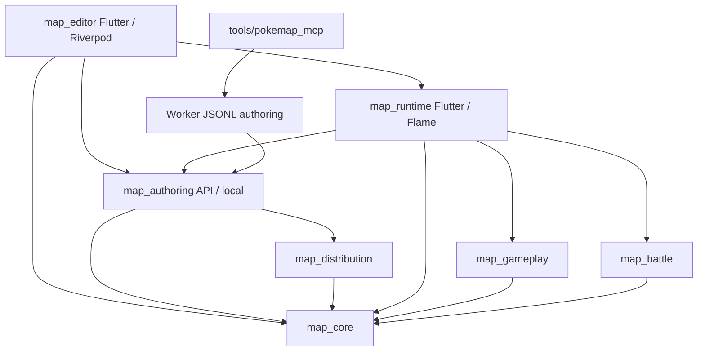

# Dépendances et flux critiques

## Graphe observé et frontières publiques

Le graphe résume les dépendances pertinentes, pas tous les imports transitifs. Sources : manifests des packages examinés et `packages/map_authoring/lib/src/application/map_mutation_dispatcher.dart:87-435`. Le runtime dépend déjà d’authoring ; cela n’autorise pas le domaine de Studio à dépendre de Flame. Le graphe proposé pour Studio place ses adaptateurs locaux/runtime dans l’infrastructure et son assemblage à l’entrée.

`map_authoring_api.dart:10-52` expose des ports typés (`AuthoringReadServicePort`, `AuthoringMutationServicePort`), requests/results/diffs/receipts, handles, références, `MapRenderPort`, `MediaProcessingPort` et `PlaytestPort`. `map_authoring_local.dart:4-50` expose en plus la composition filesystem, les chargeurs, caches, politique de racines et stores. Importer cette dernière dans la composition desktop, pas dans les commandes de domaine.

**Limite réelle :** l’API focalisée n’est pas une bibliothèque de ports complètement isolée. `packages/map_authoring/lib/src/api/authoring_read_api.dart:59-71` contient l’implémentation `AuthoringReadApi`. Son import de `workspace/project_open_service.dart` mène à `ports/project_file_reader.dart:1` (`dart:io`). « Pure Dart » ne signifie donc ni « sans infrastructure », ni « compilable Web ». Ne pas promettre une cible Web ou une application intérieure sans I/O par le seul choix du barrel.

## 1. Ouvrir projet → carte → documents → rendu

**Propriétaire actuel :** `EditorNotifier` orchestre ; `EditorState` porte à la fois session, carte, outils, sélection, viewport et histoire (`packages/map_editor/lib/src/features/editor/state/editor_state.dart:65-151`). Le type de viewport dépend de Flutter. `ProjectSessionController` détermine les transitions mais reste couplé à cet état.

1. `activateProject`, `editor_notifier.dart:727-802`, acquiert la capacité de mutation disque, charge le manifeste, passe par `ProjectSessionController.openProjectSession`, puis renouvelle l’identité de session.
2. `activateMap`, même fichier `3092-3296`, traite Save/Discard/Cancel et previews. `LoadMapUseCase.executeDocument` (`packages/map_editor/lib/src/application/use_cases/map_use_cases.dart:180-215`) obtient un document révisionné. Le résultat n’est adopté qu’après contrôle du lease de session (`editor_notifier.dart:3243-3249`).
3. `ProjectSessionController.openMapDocument`, `packages/map_editor/lib/src/features/editor/application/project_session_controller.dart:70-92`, installe le document et remet à zéro sélection/historique/dirty pour cette activation. Le code actuel ne prouve pas un registre multi-cartes chaudes conservant tous les documents sales.
4. `buildMapVisualCompositionPlan` est contrôlé à l’adoption ; une sémantique de pile non supportée rend l’édition read-only (`editor_notifier.dart:3287-3296`). Ne pas supprimer ce garde-fou sous prétexte de fluidité.
5. `MapCanvas` observe séparément document/viewport/interaction (`packages/map_editor/lib/src/ui/canvas/map_canvas.dart:815-817`), construit le painter (`2074-2100`), qui culle puis consomme le compositeur core (`map_canvas/map_grid_painter.dart:604-652`). Les images et pictures sont des ressources de vue, pas le document sauvegardable.

**API canonique parallèle :** `ProjectOpenService.openProject` (`packages/map_authoring/lib/src/workspace/project_open_service.dart:61-127`) autorise le chemin, lit et inspecte `project.json`, crée les handles. Son empreinte initiale de manifeste n’est pas la révision de toutes les cartes. `AuthoringReadApi.queryProject` (`src/api/authoring_read_api.dart:123-131`) demande un snapshot projet avec politique `editorReadProjection`, puis interroge `ProjectQueryService`. Ce n’est pas une garantie de lecture paresseuse limitée à la carte demandée.

**Adaptation M1 :** une session possède les documents ouverts et leur révision ; activation d’une carte chaude = changement de cible de vue. Une carte froide garde une attente locale. Identité projet/session/carte et génération doivent accompagner chaque résultat asynchrone. Ni un cache de snapshot ni un widget ne deviennent propriétaires d’une copie concurrente du document modifié.

## 2. Geste → aperçu → commande → historique → sauvegarde

Plusieurs mécanismes coexistent aujourd’hui ; ne pas présenter le système comme un bus uniforme déjà prêt.

- `beginMapStroke/endMapStroke` (`editor_notifier.dart:8655-8742`) conservent un `MapCellStrokeBuffer` transitoire. À la fin : commit du buffer, résolution dérivée éventuelle, contrôle du delta, `_applyMapMutation`, fermeture de stroke. Cette voie sépare déjà les mouvements du pointeur d’une opération d’historique.
- Les Smart Tiles ont aussi une publication canonique asynchrone (`editor_notifier.dart:8831-8860`) et rejouent les clics arrivés pendant l’écriture (`9180-9210`). La nouvelle session doit explicitement posséder cette file ; un callback tardif ne doit pas changer de projet cible.
- `MapEditingController` (`packages/map_editor/lib/src/features/editor/application/map_editing_controller.dart:11-80`) enveloppe début/fin/annulation/mutation/undo/redo. `MapHistoryCoordinator` (`src/application/services/map_history_coordinator.dart:7-9,313-355`) combine snapshots et deltas, bornés en entrées et octets estimés.
- Les actions canoniques `map.apply_operations` (`packages/map_authoring/lib/src/domains/maps/map_operations_batch.dart:23-68`) bornent 256 opérations et 1 000 000 cellules. Ces limites de sécurité ne sont pas des budgets de latence. `region_operations.dart:654-682` refuse les types non adressables par cellule ; un objet n’est pas un simple rectangle de TileLayer.
- `SemanticMapActionContext.draft` (`src/domains/maps/semantic_map_action_support.dart:103-151`) valide la projection puis sérialise **la carte entière**. La granularité sémantique ne rend pas chaque sauvegarde proportionnelle aux seuls octets des cellules touchées.

**Sauvegarde actuelle :** `saveActiveMap` (`editor_notifier.dart:2762-2913`) draine les publications en attente, traite les previews, appelle `SaveMapUseCase.executeRevisioned` et conserve le travail en cas de conflit. Le use case (`map_use_cases.dart:18-80`) passe soit par l’adapter canonique, soit par le repository révisionné. Ce double chemin doit être choisi explicitement dans Studio.

**Contrat canonique :** plan/confirm/apply depuis `AuthoringMutationServicePort` (`packages/map_authoring/lib/src/api/authoring_mutation_api.dart:61-104`). `LocalMapAuthoringMutationApi.applyMutation` (`local_map_authoring_mutation_api.dart:622-682`) recontrôle le snapshot canonique et lie opération/idempotence. Le journal transactionnel prend un verrou, contrôle révisions, stages et replay ; son reçu annonce `multiFileGuarantee: recoverable` (`transactions/journaled_transaction.dart:99-185,255-310`). Les fichiers sont promus successivement : ce n’est pas une atomicité instantanée du projet entier.

La persistance editor `AtomicMapDocumentPersistence` (`packages/map_editor/lib/src/infrastructure/repositories/atomic_map_document_persistence.dart:66-120`) protège une carte : verrou, fichier temporaire flushé, vérification et révision. Cette propriété ne doit pas être étendue à une transaction carte+manifest sans preuve.

**Historique :** `AuthoringUndoService.planRedo` existe (`packages/map_authoring/lib/src/history/undo_service.dart:140-198`) et ses tests internes passent. Il n’est pas exporté par les façades focalisées et le port public n’offre pas de redo. Choisir puis exposer l’histoire utilisateur de Studio avant de promettre « rétablir » ; ne pas importer le service privé pour contourner l’absence.

## 3. Sélection → propriétés → modification ciblée

`MapCanvasObjectHitTest.hitStack` (`packages/map_editor/lib/src/features/editor/application/map_canvas_object_hit_test.dart:119-202`) utilise le plan commun, construit un index de définitions, parcourt les candidats et renvoie une pile topmost-first. `cycleTarget` (`205-219`) et `EditorNotifier.selectCanvasObjectAt` (`editor_notifier.dart:7156-7191`) permettent déjà de parcourir les objets recouverts par clics successifs. La sélection reste une donnée de vue.

Limites : couches invisibles et opacité nulle exclues ; `ObjectLayer/MapPlacedTile`, tuiles, Smart Tiles et bordures ne participent pas à ce hit-stack (`map_canvas_object_hit_test.dart:186-193,231-237`). Les emprises/cellules ne sont pas une sélection pixel-alpha exacte. La pile visuelle future doit annoncer quelles familles elle couvre et rester cohérente avec son rendu.

Le déplacement possède son planner et sa preview (`packages/map_editor/lib/src/features/editor/application/map_canvas_object_move_planner.dart`, `map_canvas.dart:2637-2700`). Le notifier vérifie notamment les dépendances narratives des entités/triggers et les préconditions du candidat, puis applique la mutation (`editor_notifier.dart:7287-7334`). Reprendre ces règles sans lier la commande au widget de drag.

Pour les propriétés de décor, la voie canonique offre update/move/rotate/collision/opacity/shadow/animation/behaviors (`packages/map_authoring/lib/src/domains/maps/placed_element_actions.dart:103-307`). Un inspecteur Studio doit construire une intention typée et observer les changements concernés. Il n’existe pas encore une preuve de propagation de deltas localisée de bout en bout pour toutes les propriétés ; les abonnements séparés du canvas ne suffisent pas à la certifier.

## 4. Carte éditée → données runtime → rendu en jeu

`loadRuntimeMapBundle` (`packages/map_runtime/lib/src/application/load_runtime_map_bundle.dart:262-306`) reçoit projet et carte ; désérialisation, validation et composition à `231-241`. Le runtime sait donc consommer les mêmes données persistées. Ce chargement ne prouve pas qu’un document sale de Studio est transmis automatiquement.

`PlaytestPort/PlaytestSession` (`packages/map_authoring/lib/src/ports/playtest_port.dart:10-31`) et `RuntimePlaytestPort` (`packages/map_runtime/lib/src/application/runtime_playtest_port.dart:28-37,53-75`) permettent un driver explicite avec contrôle de révision et disposal en cas de dérive. `examples/playable_runtime_host/lib/src/evaluation/driver/evaluation_playtest_adapter.dart:31-68` illustre sandbox et checkpoint. Ce sont des points d’intégration, pas un bouton Tester déjà branché dans la nouvelle application.

Proposition M1 : capturer une révision identifiée après résolution explicite du travail non sauvegardé, transmettre une projection cohérente au driver runtime, isoler les sauvegardes de test, puis rendre la session auteur intacte au retour. Décider s’il s’agit d’un snapshot sandbox ou d’une sauvegarde préalable ; ne pas faire lire le disque en prétendant tester silencieusement les dernières modifications en mémoire.

## Empilement, persistance et runtime

### Représentation actuelle

`MapData` conserve `layers`, `placedElements` et `visualStack` (`packages/map_core/lib/src/models/map_data.dart:26-44`). La présence de la pile exige exactement `ProjectVersion.v6` dans le code actuel (`60-63`), sans acceptation implicite d’une version supérieure. `MapVisualStackConfig` ne supporte que `semanticsVersion:1` (`models/map_visual_stack_config.dart:22-33`). Le compositeur `operations/map_visual_composition.dart:165-263` interprète `canonicalV1` : couches stockées devant→derrière, peinture inverse.

`MapPlacedElement` (`models/map_data.dart:221-240`) contient layerId, position, rotation, collision, opacité, comportements et propriétés ; **aucun rang visuel indépendant typé**. Les `MapPlacedTile` (`models/map_layer.dart:68-90,152-159`) d’ObjectLayer forment une autre famille, sans collision/gameplay propres. Les coordonnées x/y et dimensions 2D (`models/geometry.dart:7-22`) ne décrivent pas une altitude.

### Pourquoi le contrat actuel ne suffit pas pour tout décor

Le plan compose les couches, puis les ombres/placed elements, puis les entités et passes foreground (`map_visual_composition.dart:235-255`). Le runtime exécute ces phases (`packages/map_runtime/lib/src/presentation/flame/map_layers_component.dart:436-486`). Affecter un décor à un autre calque caché ne crée pas automatiquement une relation d’ordre arbitraire entre toutes les familles.

Surtout, **réordonner `map.placedElements` n’est pas une opération purement visuelle** : `packages/map_gameplay/lib/src/gameplay_world_state.dart:1101-1157` choisit le premier comportement gagnant par cellule avec `putIfAbsent`. Un déplacement dans cette liste peut changer l’interaction. L’ordre d’affichage doit donc être distinct de la priorité métier, en plus des coordonnées et collisions.

### Profondeur du personnage et occlusion

Le runtime monte background et foreground (`packages/map_runtime/lib/src/presentation/flame/playable_map_game.dart:13647-13681`). `packages/map_runtime/lib/src/presentation/flame/overworld_render_priority.dart:1-15` donne des bandes de priorité séparées, avec profondeur d’acteur à partir de Y. Le joueur suit son `footPoint.y`, les PNJ leur `depthSortY` (`playable_map_game.dart:4515-4519`). Des patches d’occlusion se placent selon le bas de l’emprise (`packages/map_runtime/lib/src/presentation/flame/static_placed_element_occlusion_patch_resolution.dart:105-108,131-163`).

La passe foreground dépend encore de marqueurs dans le nom/ID du calque (`map_layers_component.dart:1335-1364`) ; sans masque d’occlusion, certaines cellules collision participent au découpage du décor (`1214-1225`). Ces comportements existants doivent être pris en compte dans la transition, sans assimiler ordre fixe, occlusion et collision.

Documentation Flame consultée : ressource `flame://flame/components/components`, section Priority. Elle confirme que `Component.priority` ordonne les enfants d’un même parent ; ce mécanisme n’est pas à lui seul le contrat d’empilement PokeMap. Dépendance déclarée : `packages/map_runtime/pubspec.yaml:24`, `flame: ^1.38.0`.

### Adaptation partagée à décider, sans implémentation

Faire porter au contrat core une sémantique explicite d’ordre fixe des éléments concernés, indépendante du parcours de comportements ; prolonger le compositeur commun et, si nécessaire, sa version. `map_authoring` doit porter les commandes sémantiques devant/derrière et leur historique ; editor, hit-stack, capture et runtime doivent consommer le même résultat. Une évolution de schéma éventuelle doit être décidée et testée ; aucune migration, aucun nouveau champ ni alias n’est ajouté ici.

Les choix ouverts sont la portée locale/globale, l’égalité, les extrémités, les groupes, les familles M1 et le passage naturel du personnage. Un compteur d’étages virtuels reste un repère visuel ; il ne représente pas une hauteur physique ou un étage praticable.

## Contrôles aux frontières et contrôles locaux

| Moment | Contrôles à conserver | Travail à ne pas dupliquer |
|---|---|---|
| Ouverture/import/entrée MCP | Racine autorisée, format/version, types, bornes, références indispensables, droits et handles | Ne pas réinterpréter une entrée non fiable comme document déjà validé. |
| Aperçu local de geste | Identité session/carte, carte prête, validité de la cible et bornes concernées | Pas de lecture disque, JSON ou audit complet du projet par mouvement. |
| Commit local | Révision de base, éléments touchés, invariants, unité d’histoire | Ne pas supprimer les garanties CAS parce que l’aperçu est rapide. |
| Sauvegarde | Révision, cible, écriture réelle, résultat et conflit visible | Ne pas bloquer l’enregistrement d’un brouillon sur une certification globale de jouabilité. |
| Test/export demandé | Cohérence nécessaire au snapshot ou package demandé | Séparer cette validation de chaque clic et réutiliser les résultats encore valides. |

Cette politique décrit la cible. Le code actuel reste mixte : sauvegarde entière, snapshots canoniques et contrôles projet sont présents. AS-ARC-002 doit choisir un chemin local cohérent sans recréer une sécurité incompatible avec API/JSONL/MCP.
