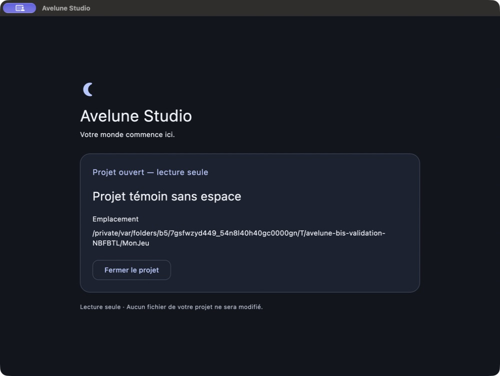

# AS-ARC-002-bis — complément de validation native

**Aucun code modifié. Réserve non levée : recette partielle / outillage instable et interruption de l’instance, cause indéterminée.**

Le 19 septembre 2026, les 18 régressions ciblées passent sur la base revue. Le véritable sélecteur macOS ouvre le projet témoin, son identité et sa racine sont correctes, puis le bouton de fermeture revient à l’accueil. Le processus testé disparaît ensuite sans fermeture normale observée. La saisie risquée n’est pas établie et le parcours est arrêté. Aucun GO natif.

## Base et audit

Dépôt vérifié : `/Users/karim/Project/pokemonProject`, remote `yoahnl/pokemap`, branche `main`, HEAD `dbcb62ad5f5502e9c7bf738ee44d12ef64042080`. État initial propre, index sans changement : [sorties initiales](evidence/initial-git.txt). Aucun changement préexistant à isoler.

Le README de l’application, les rapports AS-ARC-002 et bis, l’observation AX historique, son lancement et les deux tests référencés ont été relus. La chaîne actuelle transmet le texte et la sélection sans nettoyage, puis refuse à l’entrée et après résolution canonique avant le manifeste. Aucun défaut actionnable relevé par l’audit indépendant.

La réserve historique portait sur un `setValue` AX suivi de l’ouverture du voisin, sans preuve de la valeur réellement soumise. La présente session n’emploie aucun `setValue`, ouverture directe de contrôleur ou sélecteur factice. Le précédent crash de focus/AX et le retrait du champ pendant l’attente restent hors modification.

Les instructions directes limitent les règles générales du dépôt : aucune écriture Notion/Git, aucun test ou commentaire ajouté sans défaut reproduit, pas de programme complet d’audit. La compétence desktop est adaptée au pilotage natif demandé : Studio ne dispose pas d’entrée Marionette, aucune instrumentation n’est ajoutée. La compétence de vérification finale et une revue indépendante complètent les contrôles.

## Commandes et instance

Depuis `apps/avelune_studio`, séquentiellement :

| Commande | Résultat de cette session |
| --- | --- |
| `flutter test --no-pub test/infrastructure/project_path_identity_test.dart test/presentation/project_path_submission_test.dart` | **00:01 +18: All tests passed!**, code 0, aucun descendant restant |
| Dart embarqué, `--packages=.dart_tool/package_config.json`, script temporaire hors dépôt | Deux fixtures générées avec le helper et le codec existants |
| `flutter run -d macos --no-pub` | Build debug réussi, instance démarrée, puis `Lost connection to device.`, code 0 ; fermeture normale non prouvée |

[Tests et sortie originale](evidence/targeted-tests.txt), [reçu des tests](evidence/targeted-tests.json), [lancement original](evidence/native-run.txt), [reçu et processus suivis](evidence/native-run.json), [SDK et préparation](evidence/environment.txt).

Flutter `3.48.0-0.4.pre`, Dart embarqué `3.14.0-95.2.beta`, macOS `27.0 26A428` arm64. Aucun changement SDK ou dépendances. Analyse complète, suite complète et build séparé non relancés : aucun code corrigé, le lancement construit déjà le binaire.

Instance de recette : **PID applicatif 90159**, parent **89587** (runner), démarrée à **16:21:25 Europe/Paris**. Bundle :
`/Users/karim/Project/pokemonProject/apps/avelune_studio/build/macos/Build/Products/Debug/Avelune Studio.app`.
Identifiant `app.avelune.aveluneStudio`. Fenêtre CUA « Avelune Studio », seul processus de ce bundle observé pendant A. L’API renvoie le titre et le bundle, sans PID ni identifiant natif de fenêtre : l’association repose sur l’unicité du processus, le chemin et la chronologie.

Le runner contrôlé va de 16:21:10 à 16:23:54.820228. Le [reçu](evidence/native-run.json) établit la filiation. [Empreinte du lanceur](evidence/instance.txt) et [empreinte de la bibliothèque debug, dates des captures](evidence/capture-times.txt) identifient le build. La commande `ps` enregistrée dans `instance.txt` est postérieure à l’interruption et ne retourne plus ces PID ; elle n’est pas présentée comme l’identité initiale.

Un premier appel CUA avait lancé le PID 88397 avant le build frais et renvoyé un timeout. Son identité revérifiée, ce lancement préparatoire a été arrêté par SIGTERM. Aucune validation n’en est tirée et aucune instance préexistante n’a été terminée.

## Fixtures et intégrité

Racine temporaire :
`/private/var/folders/b5/7gsfwzyd449_54n8l40h40gc0000gn/T/avelune-bis-validation-NBFBTL`.

| Entrée relative, notation JSON | Dernier caractère du dossier | Nom réel dans le manifeste |
| --- | --- | --- |
| `"MonJeu"` | U+0075 | Projet témoin sans espace |
| `"MonJeu "` | **U+0020** | Projet demandé avec espace final |

Les entrées ont des inodes et racines résolues distincts, deux manifestes v6 générés via `ProjectManifest.toJson`. [Avant](evidence/fixture-before.json) et [après](evidence/fixture-after.json) sont identiques : inventaire complet de 5 entrées, inodes, tailles, dates de modification nanosecondes et SHA-256 des deux fichiers. Aucun renommage, fichier ajouté ou écriture du jeu par l’application. Les fixtures sont laissées disponibles pour la recette restante.

## Matrice du parcours réel

Toutes les actions de A visent le bundle ci-dessus et sont antérieures à la fin du PID 90159.

| Étape | Action et cible demandée | Attendu | Observation et preuve | Verdict |
| --- | --- | --- | --- | --- |
| A1 | Parcourir → vrai sélecteur → MonJeu | Bonne fixture | Le collage dans « Go to » échoue ; saisie clavier réussie, URL du manifeste vérifiée, clic Open | Réussi |
| A2 | Ouverture du témoin | Nom réel et racine exacte | Projet témoin sans espace, racine canonique MonJeu, état lecture seule | Réussi : [capture](evidence/a-valid.jpg), [AX](evidence/a-valid-ax.txt) |
| A3 | Fermer le projet | Retour au formulaire | Accueil, champ vide, deux boutons d’ouverture | Réussi : [AX après fermeture](evidence/a-closed-ax.txt) |
| B1–B5 | Tentative de focus/saisie clavier du chemin U+0020 | Chaîne relue, refus français, aucun voisin, texte conservé | Appel interrompu par « Computer Use is not active » ; aucune chaîne saisie, copiée ou soumise établie | Non validé |
| B6 | Corriger puis Entrée | Témoin correct puis fermeture | Non exécuté après le blocage | Non validé |
| C1–C3 | Vrai sélecteur, MonJeu U+0020 | Refus explicite, jamais le voisin | Non exécuté | Non validé |
| C4 | Sélection valide après refus | Reprise correcte | Non exécuté ; A n’est pas cette reprise | Non validé |
| D1–D4 | Fermer puis Quitter par menu | Sortie normale du PID et disparition de sa fenêtre | Retour accueil A3 acquis ; application ensuite interrompue sans action Quitter observée, runner code 0 et Lost connection | Non validé |
| D5 | Comparaison des fixtures | Aucun changement | Snapshots identiques | Réussi |

La capture a été prise à 16:23:23, l’AX de fermeture projet à 16:23:38, avant la fin du lancement contrôlé à 16:23:54. Ce sont des preuves fraîches du témoin, **pas des captures de refus ou de reprise après refus**.

## Interruption et ambiguïté

[Chronologie des actions, erreurs exactes et sélecteur](evidence/native-events.txt).

Le pilote a rencontré un timeout initial, puis une connexion utilisable. Dans le sélecteur, le collage a expiré sans remplacer l’ancien chemin proposé ; la saisie clavier a ensuite permis de choisir la nouvelle fixture correcte. Après A3, la tentative B échoue au niveau du pilote. Le rafraîchissement rend un accueil, mais les vérifications montrent ensuite que le PID 90159 et le runner 89587 ont disparu, et qu’un **PID 92752**, parent 1, démarré à 16:23:57, occupe le même bundle.

Ce nouvel accueil n’est pas attribué au processus testé. Aucune action de fermeture applicative n’a été envoyée à 90159. Le moment précis et la cause de la disparition ne sont pas établis : crash, interruption externe ou comportement du pilotage ne sont pas départagés. Le journal n’apporte ni exception ni trace de crash, seulement l’échec de premier plan et la déconnexion. La recherche limitée aux noms des diagnostics Avelune ne trouve que trois fichiers antérieurs, sans lire leurs contenus. L’absence de nouveau diagnostic n’exclut pas un crash.

Le menu Quitter du processus de remplacement a été inspecté, puis Escape envoyé, **sans activer Quitter**. Sa propriété étant incertaine, PID 92752 est laissé en place ; [menu observé](evidence/cleanup-menu-ax.txt) et [dernière réponse AX](evidence/replacement-final-ax.txt) ne valident pas sa fermeture. Les reçus confirment zéro descendant identifié restant pour tests et lancement contrôlé.

**Observation historique non reproduite dans un essai probant ; cause historique non établie.** La présente session n’a pas atteint une soumission risquée vérifiée ; elle ne réfute donc pas cette observation et ne démontre pas de défaut applicatif autorisant une correction. Aucun correctif spéculatif.

## Changements, passes et critique

Aucun fichier source, test, configuration, dépendance ou lockfile modifié. Aucun changement sous `packages/**`, Player, MCP ou ancien éditeur. Aucune écriture Git et aucune modification Notion. Aucun affichage de carte commencé.

Seuls ce README et `evidence/` sont ajoutés au dépôt. Le README parent et les preuves historiques restent intacts. Inventaire exhaustif : [état Git final](evidence/final-git.txt). Zones créées : base/commandes, instance, fixtures, matrice, incident, verdict et recette restante ; preuves texte/JSON, capture native réelle et contrôle d’hygiène. Le script de préparation reste sous `work/` dans la tâche Codex, hors dépôt.

| Passe | Responsable | Verdict |
| --- | --- | --- |
| Audit de périmètre et chaîne | agent indépendant audit_validation | Favorable aux sources, aucune anomalie actionnable ; critères de preuve natifs explicites |
| Implémentation | racine | Sans objet : aucun défaut applicatif démontré, aucun code changé |
| Tests | racine | 18 réussites fraîches, aucune suite concurrente, aucun descendant restant |
| Build / recette native | racine | Build réussi, A acquis, B interrompu, C risqué et D final manquants |
| Critique indépendante | audit_validation | Partiel justifié, aucun GO ; ne pas conclure à une simple panne du pilote ni arrêter le PID de propriété incertaine |

Autocritique : le pont de preuve entre saisie native et contrôleur Flutter manque encore. La capture A ne certifie pas le cas risqué ; l’arbre AX n’y supplée pas. Ni le code retour du runner, ni les tests, ni les fixtures intactes ne ferment cette réserve. Les interruptions ont été conservées et les essais répétés arrêtés conformément au complément.

Contrôles Git finaux : HEAD et index inchangés, diff suivi vide, uniquement ce complément non suivi ; `git diff --check` sans erreur. Contrôle Markdown avec budget explicite d’un README demandé : [sortie](evidence/markdown-hygiene.txt).

## Courte recette restante

1. Sur un nouveau lancement identifié de ces sources, sélectionner MonJeu, vérifier son nom et sa racine, puis fermer le projet afin d’établir la continuité de cette nouvelle instance.
2. Focus réel du champ, Cmd+A puis saisie/collage du chemin exact vers `MonJeu `. Sélection/copie vers un presse-papiers de test et comparaison des caractères, notamment U+0020 final. Cliquer Ouvrir : capturer le refus français, l’absence du voisin et le texte conservé. Corriger vers MonJeu, Entrée, vérifier l’identité puis fermer.
3. Par Parcourir, sélectionner réellement le dossier terminé par U+0020 et vérifier la cible exacte. Capturer le refus ; si le sélecteur ne transmet pas fidèlement la cible, documenter cette limite séparément. Revenir au témoin par le sélecteur.
4. Fermer le projet, Quitter par le menu, constater disparition du PID identifié et de sa fenêtre, examiner le seul journal de ce lancement, puis comparer les fixtures aux snapshots.

**Verdict proposé : recette partielle, réserve maintenue. Arrêt après ce complément.**
