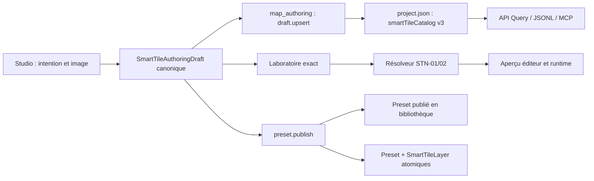

# STN-04 — Smart Tiles Studio no-code — Plan d’implémentation

> **Pour les agents d’exécution :** utiliser les skills `test-driven-development`, `using-pokemap-mcp` et `verification-before-completion` pour chaque sous-lot. Utiliser `requesting-code-review` avant le cutover final. Ne lancer aucune commande Git d’écriture sans autorisation explicite de Karim.

**Objectif :** livrer un Smart Tiles Studio réellement no-code permettant de créer, reprendre, tester et publier des terrains, chemins et surfaces organiques, puis d’en faire l’unique système d’authoring courant de PokeMap.

**Architecture :** conserver le kernel Smart Tiles, le résolveur et le rendu acquis en STN-01/02/03 ; ajouter un brouillon canonique incomplet et durable, une orchestration éditeur exclusivement fondée sur `map_authoring`, le parcours hybride validé, puis effectuer un cutover coordonné vers un format de projet Smart-Tiles-only. Les anciens modèles ne sont supprimés qu’après le portage de leurs capacités encore utiles.

**Stack :** Dart/Freezed/JSON dans `map_core`, API transactionnelle Dart dans `map_authoring`, Flutter/Riverpod et design system PokeMap dans `map_editor`, Flame dans `map_runtime`, JSONL et serveur MCP TypeScript dans `tools/pokemap_mcp`.

---

## 1. Métadonnées et statut

| Champ | Valeur |
|---|---|
| Lot | `STN-04 — Smart Tiles Studio no-code` |
| Date de formalisation | 2026-08-03 |
| Branche auditée | `main` |
| HEAD de référence | `160ab3256c3defce4a9e67ebfee7a02c3ac16991` |
| Dépendances livrées | STN-01 `b79d11bcb`, STN-02 `f5f8b9bc8`, STN-03 `11f71230b` |
| Statut actuel | `TODO` — plan prêt, implémentation non commencée |
| Nombre de séquences | 12 sous-lots, `STN-04.0` à `STN-04.11` |
| Rupture de compatibilité | assumée ; aucun migrateur Terrain/Path/Surface n’est requis |
| Import Tiled/TSX/Wang | hors périmètre ; second temps |
| Peinture Wang sur la World Map | hors périmètre ; `STN-05` |

Le lot ne peut être proposé `DONE` qu’après les preuves de la section 17. Une UI visuellement terminée sans persistance canonique, sans cutover legacy ou sans parité MCP reste `PARTIAL`.

### 1.1 Vue d’ensemble des 12 séquences

| Sous-lot | Livraison principale | Gate de sortie |
|---|---|---|
| `04.0` | baseline et gate d’exposition | blocages et inventaire legacy caractérisés |
| `04.1` | draft canonique + catalogue v3 | round-trip et compilation pure prouvés |
| `04.2` | actions/query/parité transports | close/reopen direct et JSONL identiques |
| `04.3` | contexte de lancement + autosave | CAS/latest-wins/flush sans bypass |
| `04.4` | shell + Usage/Image/Grille | trois intentions et import asset canonique |
| `04.5` | Matériaux/Raccords | six profils no-code persistés |
| `04.6` | Variantes/Formes | mapping, transforms et couverture complets |
| `04.7` | laboratoire lattice-aware | cell/edge/corner/mixed résolus exactement |
| `04.8` | publication + couche + paint cell | library/map atomiques et cell fields utilisables |
| `04.9` | absorption Surface | Border/gameplay/cinematic/runtime portés |
| `04.10` | v6 + suppression legacy | zéro système historique actif |
| `04.11` | golden slice + MCP live | toutes les gates finales vertes |

## 2. Audit initial consolidé

### 2.1 État Git initial

Le dépôt ne contenait aucune modification suivie attribuable à STN-04. Les éléments non suivis préexistants sont hors périmètre : sessions `.superpowers/brainstorm`, deux `Package.resolved` macOS et un `__pycache__`. Ils ne doivent être ni modifiés, ni ajoutés, ni supprimés pendant le lot.

### 2.2 Verdict des trois passes d’audit

| Passe | Verdict | Conséquence pour le plan |
|---|---|---|
| Architecture/kernel | STN-01/02/03 fournissent déjà les champs Wang, les topologies, les transformations, le résolveur, la couverture, le rendu et la publication atomique | ne pas réécrire le moteur ; concentrer STN-04 sur l’authoring, la persistance et le cutover |
| Éditeur/Surface | quatre systèmes concurrents restent actifs ; Terrain et Surface sont explicitement désactivés dans le Studio ; publication et ajout à la carte sont volontairement bloqués | remplacer le prototype et retirer tous les parcours d’écriture legacy avant exposition du nouveau Studio |
| API/MCP/tests | dix actions `smart_tile.*` existent, mais aucune persistance de brouillon ; dix-neuf actions `terrain.*`, `path.*`, `surface.*` restent enregistrées | ajouter un contrat de brouillon, prouver les quatre transports, puis nettoyer les catalogues d’actions et de ressources |

### 2.3 Cause racine du blocage actuel

Le blocage n’est pas un défaut du navigateur : il est codé dans l’architecture actuelle.

1. Le Studio ne permet d’activer que l’usage `path`.
2. Son guide `erwCorner16` est obligatoire.
3. Son brouillon ne vit qu’en mémoire.
4. `SmartTilePublicationService` refuse toujours de publier.
5. `EditorNotifier.addSmartTileLayer` refuse toujours l’ajout à la carte.
6. La bibliothèque mélange Smart Tiles natifs et presets historiques.
7. `map.create` et les anciens studios continuent à produire des données legacy.
8. `preflightNativeSmartTileMutation` refuse ensuite les mutations Smart Tiles en présence de ces données.

Le système fabrique donc lui-même l’état que son API native interdit.

## 3. Décisions produit figées

Les décisions suivantes sont des contraintes d’implémentation, pas des options à rediscuter pendant le code :

1. Les trois intentions de départ sont **Terrain**, **Chemin** et **Surface organique**.
2. `Surface organique` est techniquement `SmartTileUsage.forestSurface` et absorbe l’ancien Surface Studio.
3. `Surface simple` n’est pas une intention ; **Sans raccords** est un style de raccord.
4. Le parcours est hybride : guidé à la première création, workbench libre ensuite.
5. Les étapes sont exactement : **Usage → Image → Grille → Matériaux → Raccords → Variantes → Formes → Essai → Publier**.
6. La grille est détectée automatiquement puis confirmée visuellement ; la détection ne déduit jamais la sémantique.
7. Les guides sont facultatifs. ERW 16 est un accélérateur, pas une condition d’entrée.
8. La question centrale des matériaux est : « Quelle matière peignez-vous ? ».
9. Les six familles de raccords sont : **Sans raccords**, **Bordures**, **Coins**, **Formes organiques**, **Bordures + coins**, **Sur mesure**.
10. Aucun masque numérique, ID technique ou JSON n’apparaît dans le parcours normal.
11. Plusieurs cellules pour une même forme sont des variantes pondérées.
12. Les rotations et miroirs sont proposés de façon visible, réversible et désactivable ; les vraies variantes d’atlas restent prioritaires.
13. L’onglet utilisateur s’appelle **Formes**, pas `Patterns`.
14. Un motif/tampon périodique multi-cellules n’est pas un masque de raccord. Le vieux `PathPatternPreset` n’est pas reconduit implicitement dans le modèle de raccord.
15. Le workbench conserve l’atlas et un laboratoire compact visibles simultanément.
16. Les ambiguïtés se résolvent dans un panneau contextuel ; cliquer un diagnostic ouvre la forme concernée.
17. La publication depuis la bibliothèque ne crée pas de couche.
18. La publication depuis une carte promeut le preset et crée la couche en une seule transaction.
19. Une publication échouée ne détruit ni ne modifie le brouillon.
20. Tiled peut inspirer les concepts ; PokeMap reste propriétaire de son schéma et de son résolveur.

## 4. Périmètre et non-objectifs

### 4.1 Inclus dans STN-04

- brouillons Smart Tiles durables, incomplets, revisionnés et requêtables ;
- reprise d’un brouillon après fermeture/réouverture du projet ;
- trois intentions pleinement activables ;
- import canonique d’un PNG dans les assets du projet ;
- détection et confirmation de grille ;
- matériaux multiples, défaut et matière active ;
- six styles de raccord ;
- variantes, poids, animations et transformations D4 ;
- sorties multi-parties `ground`, `understory`, `canopy`, `foreground`, `shadow` ;
- galerie de formes humanisée et analyse de couverture ;
- banc d’essai exact pour champs cellule, arête, coin et mixte ;
- publication bibliothèque et publication + couche atomique ;
- redirection des créations Terrain/Chemin/Surface organique vers `SmartTileLayer` ;
- peinture/effacement canoniques des champs cellule `uniform`, `cardinal4` et `blob8` ;
- portage des usages utiles de Surface vers Smart Tiles ;
- retrait des actions, routes, catalogues et modèles legacy du format courant ;
- parité API directe, JSONL/CLI, éditeur et MCP ;
- format de projet Smart-Tiles-only explicite.

### 4.2 Explicitement hors STN-04

- import `.tsx`, `.tmx`, Wang Set Tiled ou conversion automatique d’un projet Tiled ;
- dépendance runtime ou authoring à Tiled ;
- migration des anciens projets Terrain/Path/Surface ;
- compatibilité d’écriture avec les formats PokeMap historiques ;
- compilateur du geste de pinceau World Map vers les lattices `wangEdge4`, `wangCorner4` et `wang8` ;
- nouveaux tampons périodiques multi-cellules remplaçant `PathPatternPreset` ;
- refonte du résolveur ou du moteur de rendu Smart Tiles ;
- nouvel équivalent de `SurfaceLayer`.

Le fichier simple `surface_global_compacted_path.png` est couvert par **Sans raccords** : une frame uniforme peut être répétée sans atlas 16 coins. Il ne nécessite ni `PathPatternPreset`, ni Tiled, ni STN-05.

## 5. Architecture cible



### 5.1 Frontières de responsabilité

| Couche | Responsabilité | Interdit |
|---|---|---|
| `map_core` | schéma durable, compilation pure draft → preset, validation, résolution, opérations de lattice | Flutter, accès disque, callbacks éditeur |
| `map_authoring` | actions sémantiques, CAS, atomicité, undo, query, sécurité assets | dépendance à un controller Flutter |
| `map_editor` | orchestration, UI no-code, autosave, projection des diagnostics, contexte de lancement | écriture directe de `project.json` ou d’une map |
| `map_runtime` | rendu du seul contrat publié | lecture d’un brouillon, logique d’authoring |
| `tools/pokemap_mcp` | transport générique et catalogue live | logique métier dupliquée en TypeScript |

## 6. Invariants non négociables

1. Un projet courant ne contient aucune `TerrainLayer`, `PathLayer` ou `SurfaceLayer`.
2. Un projet courant ne contient aucun `terrainPresets`, `pathPresets`, `pathPatternPresets` ou `surfaceCatalog`.
3. Un nouveau projet et une nouvelle carte sont valides avant toute création de Smart Tile.
4. Le runtime ignore toujours les brouillons.
5. Un brouillon peut être incomplet sans rendre le projet invalide.
6. Un preset publié doit satisfaire tous les diagnostics de publication.
7. Le Studio n’écrit jamais directement le manifest ou la map.
8. Un autosave n’écrase jamais une révision plus récente.
9. Une dépendance publiée partagée n’est jamais modifiée silencieusement par un brouillon.
10. Une publication + couche est tout-ou-rien.
11. Le même document canonique est observé après API directe, JSONL, éditeur et MCP.
12. Aucun composant produit de l’UI éditeur n’emploie une couleur hardcodée hors design system.
13. Le workbench n’affiche jamais un masque hexadécimal dans le parcours standard.
14. Les champs cellule `uniform`, `cardinal4` et `blob8` se peignent par actions canoniques ; une topologie Wang publiable mais non peignable sur la World Map est signalée explicitement comme dépendance STN-05. Le laboratoire STN-04 reste entièrement fonctionnel.

## 7. Schéma canonique du brouillon

### 7.1 Arbitrage retenu

Le champ existant `ProjectSmartTilePreset.status == draft` est suffisant pour un preset déjà structuré, mais insuffisant pour reprendre proprement les étapes **Image** et **Grille** : avant la création de règles, rien ne relie le preset à l’atlas importé ; fusionner des ressources provisoires dans le catalogue publié crée des orphelins et empêche d’éditer un preset publié sans le toucher.

STN-04 introduit donc un document séparé `ProjectSmartTileAuthoringDraft`. Les presets conservent leur enum de statut pour la compatibilité de l’API, mais le Studio persiste son travail dans `smartTileCatalog.drafts`. La publication seule promeut les ressources embarquées.

Alternative rejetée : un bundle `{preset, atlases, materials, animations}` directement fusionné dans les listes finales. Cette alternative est plus petite, mais ne garantit ni l’isolement d’un preset publié, ni le nettoyage des ressources provisoires, ni la reprise avant le premier mapping.

### 7.2 Modèle cible

Créer `packages/map_core/lib/src/models/smart_tile_authoring_draft.dart` :

```dart
@freezed
class ProjectSmartTileAuthoringDraft
    with _$ProjectSmartTileAuthoringDraft {
  const factory ProjectSmartTileAuthoringDraft({
    required String id,
    required String targetPresetId,
    String? sourcePresetId,
    required String name,
    @Default('') String categoryId,
    required SmartTileUsage usage,
    required SmartTileAuthoringStage lastStage,
    String? guideId,
    @Default([]) List<String> sourceTilesetIds,
    @Default([]) List<ProjectSmartTileAtlas> atlases,
    String? primaryAtlasId,
    @Default([]) List<ProjectSmartTileMaterial> materials,
    @Default([]) List<ProjectSmartTileAnimation> animations,
    String? defaultMaterialId,
    @Default([]) List<String> allowedMaterialIds,
    @Default(SmartTileTopology.uniform) SmartTileTopology topology,
    @Default(SmartTileTemplateHint.simple)
    SmartTileTemplateHint templateHint,
    @Default(SmartTileBoundaryPolicy.empty)
    SmartTileBoundaryPolicy boundaryPolicy,
    @Default(SmartTileCoveragePolicy.complete)
    SmartTileCoveragePolicy coveragePolicy,
    @Default(SmartTileCoverageProfile(
      mode: SmartTileCoverageMode.template,
    ))
    SmartTileCoverageProfile coverageProfile,
    @Default(SmartTileTransformPolicy())
    SmartTileTransformPolicy transformPolicy,
    @Default([]) List<SmartTileRule> rules,
    String? fallbackRuleId,
    @Default([]) List<String> tags,
    @Default(0) int sortOrder,
    @Default(0) int seedSalt,
  }) = _ProjectSmartTileAuthoringDraft;
}
```

`SmartTileAuthoringStage` est sérialisé avec les valeurs stables suivantes :

```text
usage, image, grid, materials, connections, variants, forms, test, publish
```

Règles du modèle :

- `id` identifie le brouillon ; `targetPresetId` identifie le futur preset ;
- `sourcePresetId` est présent lors d’une édition/duplication d’un preset publié ;
- `sourceTilesetIds` permet de reprendre après import d’image avant confirmation de grille ;
- `atlases`, matériaux et animations sont privés au brouillon jusqu’à publication ;
- `primaryAtlasId` désigne l’atlas affiché par défaut ; le parcours guidé en crée un, le workbench peut en ajouter ;
- `rules` peut être partiel ;
- `lastStage` sert uniquement à reprendre le parcours, jamais à valider la publication ;
- une étape est considérée complète par un projecteur pur, pas par la seule valeur `lastStage`.
- un seul draft peut cibler un `targetPresetId` donné ; ouvrir un preset publié reprend ce draft ou en crée un qui embarque une copie de toutes ses ressources référencées ;
- l’édition d’un preset publié ne modifie jamais le preset ni ses ressources avant la transaction de publication.

### 7.3 Catalogue v3

Modifier `ProjectSmartTileCatalog` :

```dart
static const currentFormatVersion = 3;
final List<ProjectSmartTileAuthoringDraft> drafts;
```

Migration supportée :

```text
catalogue v2 valide → catalogue v3 identique avec drafts = []
catalogue v1 non vide → refus explicite déjà existant
catalogue futur > 3 → refus explicite
```

Le projet v5 natif existant reste donc lisible au niveau du catalogue ; la rupture globale est portée par `ProjectVersion.v6`, pas par une erreur opaque de catalogue.

### 7.4 Compilation pure

Créer `packages/map_core/lib/src/operations/smart_tile_authoring_draft_compiler.dart` avec :

```dart
sealed class SmartTileDraftCompilationResult {}

final class SmartTileDraftCompilationSuccess
    extends SmartTileDraftCompilationResult {
  final ProjectSmartTilePreset preset;
  final List<ProjectSmartTileAtlas> atlases;
  final List<ProjectSmartTileMaterial> materials;
  final List<ProjectSmartTileAnimation> animations;
  final SmartTileCoverageReport coverage;
}

final class SmartTileDraftCompilationFailure
    extends SmartTileDraftCompilationResult {
  final List<SmartTileDiagnostic> diagnostics;
}

SmartTileDraftCompilationResult compileSmartTileAuthoringDraft({
  required ProjectSmartTileAuthoringDraft draft,
  required ProjectSmartTileCatalog catalog,
  required ProjectManifest manifest,
});
```

La fonction :

1. vérifie les IDs et références ;
2. refuse une grille absente ou hors image ;
3. construit le preset avec statut `published` seulement dans la projection de publication ;
4. analyse la couverture ;
5. distingue erreurs structurelles, erreurs de publication et avertissements ;
6. ne modifie aucun objet reçu ;
7. ne lit aucun fichier.

`validateProjectSmartTileCatalog` vérifie les IDs, doublons et références internes des drafts, mais n’applique pas aux drafts les exigences de couverture d’un preset publié. `resolveSmartTileLayerVisuals` et le runtime ne consultent jamais `catalog.drafts`.

## 8. Contrats API canoniques

### 8.1 `smart_tile.preset.draft.upsert`

Descriptor :

```text
id: smart_tile.preset.draft.upsert
version: 1
permission: projectWrite
risk: medium
guarantees: dryRun, idempotent, atomic, revisionChecked, undoable
resourceKinds: project, smartTileDraft, smartTileAtlas,
               smartTileMaterial, smartTileAnimation
```

Payload strict :

```json
{
  "draft": "<ProjectSmartTileAuthoringDraft>"
}
```

Sémantique : fusion par `draft.id`, aucune création de couche, aucun pruning d’un autre brouillon, validation structurelle, statut de sauvegarde retourné dans le preview et préflight global.

### 8.2 `smart_tile.preset.draft.delete`

Payload :

```json
{
  "draftId": "draft_id"
}
```

La suppression retire uniquement le document embarqué. L’asset importé n’est supprimé automatiquement que s’il existe déjà une action canonique prouvant qu’il n’est référencé nulle part ; sinon il reste dédupliqué dans le store et le nettoyage est explicite.

### 8.3 `smart_tile.preset.publish`

Étendre l’action existante sans créer une seconde publication :

```json
{
  "draftId": "draft_id",
  "layer": {
    "mapId": "map_id",
    "layerId": "layer_id",
    "name": "Nom visible"
  }
}
```

`layer` reste optionnel. Pour préserver l’API STN-03 pendant la transition, l’action accepte exactement l’un de `draftId` ou `preset`. Le Studio utilise exclusivement `draftId`. Le chemin direct `preset` est conservé comme contrat avancé jusqu’à une dépréciation séparée.

Transaction `draftId` :

1. charger le brouillon ;
2. compiler et valider ;
3. fusionner atlas, matériaux et animations par ID ;
4. remplacer/ajouter `targetPresetId` ;
5. retirer le brouillon ;
6. créer éventuellement la `SmartTileLayer` ;
7. prévalider projet + map ;
8. appliquer tout ou rien.

En cas d’échec, les huit projections sont abandonnées et le brouillon reste byte-identical.

### 8.4 Ressources et queries

Ajouter `smartTileDraft` à :

- `packages/map_authoring/lib/src/registry/resource_kind_registry.dart` ;
- `packages/map_authoring/lib/src/workspace/project_query_service.dart` ;
- `packages/map_authoring/lib/src/parity/full_authoring_parity.dart` ;
- le catalogue live MCP.

La query retourne l’état canonique, pas l’état local du widget.

### 8.5 Codes d’erreur stables

| Code | Déclencheur | Réponse UI |
|---|---|---|
| `smart_tile.draft.unknown` | brouillon absent | revenir à la bibliothèque et proposer une copie locale |
| `smart_tile.draft.invalid` | structure du brouillon invalide | ouvrir l’étape concernée |
| `smart_tile.draft.revision_conflict` | CAS obsolète | afficher conflit, recharger ou dupliquer |
| `smart_tile.draft.target_conflict` | cible publiée incompatible | proposer « Dupliquer en nouveau preset » |
| `smart_tile.draft.target_in_use` | un autre draft vise le même preset | ouvrir le draft existant ou dupliquer la cible |
| `smart_tile.draft.shared_dependency_conflict` | ressource publiée partagée modifiée | dupliquer la ressource dans le brouillon |
| `smart_tile.publish.incomplete` | diagnostic de publication bloquant | ouvrir Formes/Validation |
| `smart_tile.publish.layer_conflict` | ID de couche déjà pris | régénérer/éditer l’ID |
| `smart_tile.publish.payload_too_large` | frontière bornée dépassée | réduire ou relever uniformément la limite, jamais contourner |

### 8.6 Peinture cellulaire minimale

Ajouter dans `packages/map_authoring/lib/src/domains/maps/smart_tile_cell_actions.dart` :

```text
smart_tile.cell.paint
smart_tile.cell.erase
```

Payload `paint` :

```json
{
  "layerId": "layer_id",
  "materialId": "material_id",
  "cells": [
    {"x": 4, "y": 7},
    {"x": 5, "y": 7}
  ]
}
```

Payload `erase` :

```json
{
  "layerId": "layer_id",
  "cells": [
    {"x": 4, "y": 7}
  ]
}
```

Invariants : coordonnées uniques et dans la map, matériau autorisé par le preset/palette, une transaction par geste, ordre des cellules sans effet sur le résultat, support exclusif des champs `SmartTileCellField`. Une couche edge/corner/mixed retourne `smart_tile.wang_paint_requires_stn05` sans mutation. L’éditeur regroupe les cellules d’un drag et applique l’action au relâchement ; l’undo canonique annule tout le geste.

## 9. Orchestration éditeur

### 9.1 Contexte de lancement

Créer :

```dart
sealed class SmartTilesStudioLaunchContext {
  const factory SmartTilesStudioLaunchContext.library() =
      SmartTilesStudioLibraryContext;
  const factory SmartTilesStudioLaunchContext.map({
    required String mapId,
  }) = SmartTilesStudioMapContext;
}
```

- Project Explorer ouvre `library` ;
- toolbar d’une map ouverte capture `map(mapId: activeMap.id)` ;
- le contexte ne se recalcule jamais au moment de publier ;
- fermer la map après ouverture du Studio rend l’option couche indisponible sans changer la cible du brouillon.

### 9.2 Autosave

Créer `smart_tile_draft_persistence_coordinator.dart` avec la machine d’état :

```text
localOnly → dirty → saving → saved
                     ↘ failed
                     ↘ conflict
```

Contrat précis :

- debounce de 500 ms pour les modifications discrètes ;
- flush immédiat sur changement d’étape, fermeture, publication et changement de preset ;
- une seule mutation en vol ;
- coalescence `latest-wins` ;
- compteur de génération monotone ;
- fingerprint SHA-256 du JSON canonique ;
- clé d’idempotence `smart-tile-draft:<draftId>:<fingerprint>` ;
- une réponse d’une génération ancienne ne peut pas passer l’état courant à `saved` ;
- `saved` utilise la révision réellement retournée par `apply` ;
- après succès, recharger le snapshot canonique et remplacer le draft local ;
- après CAS, aucune réapplication automatique destructive ;
- le bouton **Réessayer** réutilise le dernier draft local avec la nouvelle révision seulement après accord utilisateur ;
- publier appelle `flush()` et attend le dernier apply réussi.

### 9.3 Frontière d’écriture

Supprimer du flux Smart Tiles :

```text
onManifestChanged → applyInMemoryProjectManifest
onAddToActiveMap → EditorNotifier.addSmartTileLayer
```

Toutes les mutations passent par `AuthoringMutationAdapter.plan/apply`. Les tests de garde doivent échouer si `smart_tiles_studio/` appelle directement un writer de manifest ou de map.

## 10. Modèle no-code et projections UI

### 10.1 Étapes et conditions de passage

| Étape | Entrée minimale | Sortie persistée | Blocage pour continuer |
|---|---|---|---|
| Usage | aucun | usage, nom, IDs stables, recommandations | usage non choisi |
| Image | usage | `sourceTilesetIds` après `asset.import` | image absente/illisible/hors projet |
| Grille | image | atlas primaire confirmé | cellules hors image ou dimensions nulles |
| Matériaux | atlas | matériaux, défaut, actif | aucun matériau/default invalide |
| Raccords | matériaux | topology, template, boundary | profil non choisi |
| Variantes | raccords | candidats, poids, transform policy, animations | candidat sans source |
| Formes | variantes | règles et résolution des ambiguïtés | formes obligatoires manquantes/ambiguës |
| Essai | formes | scénarios de test locaux ; draft flushé | erreur de résolution bloquante |
| Publier | essai | preset publié, draft retiré, couche optionnelle | diagnostic publication ou CAS |

### 10.2 Profils de raccord

Créer un read model `SmartTileConnectionProfile` dans l’application éditeur. Il projette les contrats existants ; il n’ajoute pas une seconde topologie au core.

| Libellé UI | Template | Topologie | Lattice | Recommandation |
|---|---|---|---|---|
| Sans raccords | `simple` | `uniform` | cellule | PNG global/simple, tout usage |
| Bordures | `edge16` | `wangEdge4` | arêtes | transitions par bords |
| Coins | `corner16` ou `corner12` | `wangCorner4` | coins | guide ERW |
| Formes organiques | `blob47` | `blob8` | cellule | surface organique, chemin naturel |
| Bordures + coins | `mixed256` | `wang8` | mixte | transitions riches |
| Sur mesure | `free` | choisi explicitement | choisi | utilisateur expert |

Le recommandateur peut proposer `uniform`, `cardinal4` ou `blob8` pour permettre une peinture cellulaire immédiate, mais ne modifie jamais le choix sans confirmation.

### 10.3 Mapping bidirectionnel

Mode guidé :

```text
forme attendue → clic sur une cellule atlas → candidat/variante
```

Mode workbench :

```text
clic cellule atlas → rôles compatibles → ajout à une ou plusieurs formes
```

Une cellule déjà affectée ouvre son affectation ; `Shift` ajoute une variante ; retirer une affectation ne supprime jamais la frame source.

### 10.4 Variantes et transformations

- poids entier borné `1..1000`, affiché en pourcentage normalisé ;
- ordre stable par insertion puis ID ;
- source atlas ou animation ;
- proposition de rotation/miroir calculée avec `smartTileAllowedTransforms`, `transformSmartTileSignature` et `analyzeSmartTileCoverage` ;
- aucune duplication silencieuse de candidat pour simuler une transform ;
- chaque proposition montre la source, la transform et les formes gagnées/perdues ;
- undo local avant autosave, undo canonique après apply.

### 10.5 Surface organique

`forestSurface` offre les canaux :

| Canal | Usage UI |
|---|---|
| `ground` | sol principal |
| `understory` | sous-bois et herbes basses |
| `canopy` | cime/masque au-dessus du joueur |
| `foreground` | éléments visuels de premier plan |
| `shadow` | ombre dédiée |

Le preset reste un `ProjectSmartTilePreset`. Aucun `SurfaceLayer` ou nouveau `OrganicSurfaceLayer` n’est créé.

### 10.6 Formes et diagnostics

Projeter `SmartTileCoverageReport` vers cinq états visibles :

| État UI | Statuts core |
|---|---|
| Couvert | `exact` |
| Généré | `transformed` |
| Secours | `fallback` |
| Ambigu | `ambiguous` |
| Manquant | `missing`, `noCandidate`, `missingVisualSource`, `outOfAtlasGrid` |

Chaque carte de forme contient un pictogramme topologique, un état, le nombre de variantes et l’action primaire. Le masque interne n’apparaît que dans un inspecteur développeur explicitement activé.

### 10.7 Banc d’essai exact

Le banc d’essai n’utilise pas `SmartTileTestGrid` pour les topologies incompatibles. Il construit un `SmartTileLayer` temporaire et appelle les opérations de lattice existantes :

- cellule : `setSmartTileCellMaterial` ;
- arête : `setSmartTileHorizontalEdgeMaterial` et `setSmartTileVerticalEdgeMaterial` ;
- coin : `setSmartTileCornerMaterial` ;
- mixte : combinaison des trois ;
- résolution : `smartTileCellContextForLayerCell` puis `resolveSmartTile`.

Le laboratoire offre crayon, gomme, reset, scénarios canoniques et inspection par cellule. Il ne prétend pas compiler un geste World Map Wang : cette responsabilité reste STN-05.

## 11. Architecture de l’interface

### 11.1 Shell desktop

Le panneau de 2 595 lignes est remplacé par une composition :

```text
┌ Bibliothèque ┐ ┌ Étape/workbench + atlas + mini-lab ┐ ┌ Inspecteur ┐
└──────────────┘ └────────────────────────────────────┘ └────────────┘
```

Nouveaux fichiers recommandés :

```text
packages/map_editor/lib/src/features/smart_tiles_studio/presentation/
  smart_tiles_studio_panel.dart
  smart_tiles_studio_shell.dart
  smart_tiles_studio_library_pane.dart
  smart_tiles_studio_stage_header.dart
  smart_tiles_studio_inspector.dart
  stages/
    smart_tile_usage_stage.dart
    smart_tile_image_stage.dart
    smart_tile_grid_stage.dart
    smart_tile_materials_stage.dart
    smart_tile_connections_stage.dart
    smart_tile_variants_stage.dart
    smart_tile_forms_stage.dart
    smart_tile_test_stage.dart
    smart_tile_publish_stage.dart
  workbench/
    smart_tile_atlas_workbench.dart
    smart_tile_compact_lab.dart
    smart_tile_ambiguity_resolver.dart
    smart_tile_coverage_gallery.dart
```

Le fichier racine orchestre seulement le layout, la sélection de preset et la navigation. Aucune étape ne lit ou écrit le projet directement.

### 11.2 Design system et responsive

- utiliser exclusivement les surfaces, boutons, champs, badges, cards et empty states du design system ;
- ajouter un primitive au design system avant tout widget ad hoc répété ;
- zéro `Color(0x...)`, `Colors.*` ou palette package dans les features ;
- largeur desktop : trois colonnes ;
- largeur intermédiaire : inspecteur en drawer ;
- largeur étroite de test, environ 560 px : bibliothèque et inspecteur en panneaux modaux, contenu principal sans overflow ;
- navigation clavier complète, focus visible et labels sémantiques ;
- état de sauvegarde toujours lisible sans dépendre uniquement d’une couleur.

## 12. Cutover Smart-Tiles-only

### 12.1 Version de projet

Introduire `ProjectVersion.v6`. Sa signification est stricte :

```text
v6 = aucune donnée Terrain/Path/Surface historique ; SmartTileLayer uniquement
      pour terrain, chemin et surface organique.
```

Les fichiers d’anciens formats sont refusés avant construction des unions Freezed avec un diagnostic lisible :

```text
legacy_project_schema_unsupported
This project uses TerrainLayer, PathLayer or SurfaceLayer and cannot be opened
by the Smart-Tiles-only editor.
```

Aucun convertisseur automatique n’est ajouté.

### 12.2 Ordre obligatoire d’absorption Surface

Avant suppression de `SurfaceLayer` et `surfaceCatalog` :

1. remplacer la source de génération gameplay par `SmartTileLayer + presetId + materialId` ;
2. porter les zones herbes hautes, surfable et lave/danger ;
3. porter les snapshots de sol du Border Studio vers un preset Smart Tile publié ;
4. projeter les primitives cinematic/backdrop depuis `SmartTileLayer` ;
5. vérifier collecte d’assets, composition visuelle, resize et rendu runtime ;
6. remplacer la palette `surface` par l’usage `forestSurface` ;
7. seulement ensuite supprimer les modèles et fichiers Surface.

### 12.3 Path Pattern

`PathPatternPreset` est retiré avec le legacy. STN-04 ne le renomme pas en Smart Tile : un motif périodique multi-cellules est un futur contrat de tampon, distinct des raccords. Les fichiers simples répétables utilisent `uniform`; les autotiles utilisent les six profils. Cette perte assumée est couverte par le choix de casser les anciens projets.

### 12.4 Gate de registre

Après cutover, le dispatcher canonique ne doit enregistrer aucune action dont l’ID commence par :

```text
terrain.
path.
surface.
```

Les resource kinds correspondants disparaissent aussi de `fullParity`, du catalogue Markdown consommé par `map_core` et du `pokemap_describe` live.

## 13. Décomposition d’implémentation

Chaque sous-lot suit : test rouge ciblé → implémentation minimale → tests ciblés → analyse du package → review du diff → commit seulement si autorisé.

### STN-04.0 — Baseline et garde d’exposition

**But :** caractériser les blocages et empêcher l’exposition partielle du nouveau Studio.

**Modifier :**

- `packages/map_editor/lib/src/features/smart_tiles_studio/presentation/smart_tiles_studio_workspace.dart` ;
- `packages/map_editor/test/smart_tiles_studio/smart_tiles_studio_panel_test.dart` ;
- `packages/map_authoring/test/parity/full_authoring_parity_test.dart`.

**Étapes :**

1. ajouter des tests de caractérisation des trois blocages actuels ;
2. ajouter un gate interne `SmartTilesStudioAvailability` activé seulement quand draft, publication et cutover sont présents ;
3. figer l’inventaire actuel des actions legacy afin que les sous-lots suivants les retirent explicitement ;
4. ne modifier aucun comportement utilisateur dans ce commit.

**Micro-checklist :**

- [ ] Capturer `git status`, branche, HEAD et actions canoniques avant édition.
- [ ] Écrire le test prouvant Terrain/Surface désactivés dans le prototype.
- [ ] Écrire le test prouvant la publication actuellement bloquée.
- [ ] Écrire le test prouvant les dix-neuf actions legacy enregistrées.
- [ ] Ajouter le gate interne avec valeur fermée par défaut.
- [ ] Rejouer uniquement les tests de caractérisation.
- [ ] Vérifier que le diff ne change aucun texte ou parcours visible.

**Preuve :** tests ciblés verts et snapshot des actions déterministe.

**Commit proposé :** `test(smart-tiles): characterize STN-04 cutover boundaries`.

### STN-04.1 — Brouillon core et catalogue v3

**Créer :**

- `packages/map_core/lib/src/models/smart_tile_authoring_draft.dart` ;
- fichiers Freezed/JSON générés associés ;
- `packages/map_core/lib/src/operations/smart_tile_authoring_draft_compiler.dart` ;
- `packages/map_core/test/smart_tiles/smart_tile_authoring_draft_test.dart` ;
- `packages/map_core/test/smart_tiles/smart_tile_authoring_draft_compiler_test.dart`.

**Modifier :**

- `packages/map_core/lib/src/models/smart_tile.dart` ;
- `packages/map_core/lib/map_core.dart` ;
- tests de sérialisation/catalogue Smart Tiles existants.

**Tests rouges d’abord :**

- round-trip de chaque `lastStage` ;
- v2 → v3 avec `drafts=[]` ;
- v3 conserve un draft incomplet ;
- listes immuables ;
- compilation terrain uniforme ;
- compilation ERW corner16 ;
- compilation forestSurface multi-part ;
- échec atlas absent, material absent, frame hors grille, règle ambiguë ;
- un brouillon incomplet ne rend pas le runtime lisible.

**Implémentation exacte du catalogue :** mettre à jour le constructeur public et privé, `empty`, `fromJson`, `toJson`, `isEmpty`, l’égalité, `hashCode` et toutes les copies manuelles de `ProjectSmartTileCatalog`. Étendre les helpers `_catalogWith` des packages consommateurs pour toujours préserver `drafts`. Une reconstruction de catalogue qui omet cette liste doit être couverte par un test de non-régression.

**Micro-checklist :**

- [ ] Créer l’enum sérialisé `SmartTileAuthoringStage`.
- [ ] Écrire le modèle Freezed du draft et son `fromJson` strict.
- [ ] Exporter le modèle depuis `map_core.dart`.
- [ ] Faire échouer le test de lecture d’un catalogue v3 avec draft.
- [ ] Ajouter `drafts` aux deux constructeurs du catalogue.
- [ ] Ajouter la migration déterministe v2 → v3.
- [ ] Mettre à jour JSON, égalité, hash et `isEmpty`.
- [ ] Écrire le compilateur pur et ses résultats success/failure.
- [ ] Réutiliser validation et coverage existantes, sans les dupliquer.
- [ ] Générer uniquement les fichiers du package `map_core`.
- [ ] Rejouer les tests ciblés puis `dart analyze`.

**Commande :**

```bash
cd packages/map_core
dart run build_runner build --delete-conflicting-outputs
dart test test/smart_tiles/smart_tile_authoring_draft_test.dart
dart test test/smart_tiles/smart_tile_authoring_draft_compiler_test.dart
dart analyze
```

**Résultat attendu :** zéro test en échec, zéro diagnostic d’analyse.

**Commit proposé :** `feat(smart-tiles): add durable authoring drafts`.

### STN-04.2 — Actions canoniques, queries et parité transport

**Créer :**

- `packages/map_authoring/test/domains/maps/smart_tile_draft_actions_test.dart` ;
- `packages/map_authoring/test/domains/maps/smart_tile_catalog_transport_parity_test.dart`.

**Modifier :**

- `packages/map_authoring/lib/src/domains/maps/smart_tile_catalog_actions.dart` ;
- `packages/map_authoring/lib/src/registry/resource_kind_registry.dart` ;
- `packages/map_authoring/lib/src/workspace/project_query_service.dart` ;
- `packages/map_authoring/lib/src/parity/full_authoring_parity.dart` ;
- `packages/map_authoring/test/domains/maps/smart_tile_catalog_actions_test.dart` ;
- `packages/map_authoring/test/domains/maps/smart_tile_resource_query_test.dart` ;
- `packages/map_authoring/test/tooling/jsonl_smart_tile_native_flow_test.dart` ;
- `packages/map_authoring/test/parity/full_authoring_parity_test.dart` ;
- `tools/pokemap_mcp/test/mutation_server.test.ts`.

**Cas obligatoires :** upsert, replacement, delete, no-op, draft inconnu, CAS, cible publiée, dépendance partagée, publication bibliothèque, publication + couche, rollback sur couche invalide, query avant/après reopen, parité byte-identical directe/JSONL.

Le handler `draft.upsert` remplace uniquement l’entrée portant le même `draft.id` et préserve catégories, atlases, materials, animations, presets et autres drafts. Le handler `publish` compile d’abord dans des collections temporaires, utilise les mêmes validateurs de dimensions que `smart_tile.atlas.upsert`, puis construit une seule `AuthoringMutationDraft`. Aucun sous-apply intermédiaire n’est permis.

**Micro-checklist :**

- [ ] Ajouter les deux descriptors draft et le dispatch correspondant.
- [ ] Implémenter l’upsert strict avec conservation de toutes les autres listes.
- [ ] Implémenter delete sans suppression implicite d’asset.
- [ ] Étendre publish avec le choix exclusif `draftId`/`preset`.
- [ ] Prouver le rollback quand la couche optionnelle échoue.
- [ ] Enregistrer `smartTileDraft` dans registry/query/parity.
- [ ] Ajouter query collection + query détail du draft.
- [ ] Écrire le scénario API directe complet.
- [ ] Écrire le scénario JSONL byte-identical.
- [ ] Écrire le scénario MCP relayé par le catalogue générique.
- [ ] Tester la taille maximale du payload.
- [ ] Exécuter PMCP-085 sans le considérer comme preuve unique.

**Limite payload :** produire un fixture maximal représentatif. Si son JSON dépasse 64 Kio, relever la même limite bornée dans `jsonl_worker.dart`, `pokemap_authoring.dart`, `request_guard.ts` et `authoring_client.ts`, puis tester limite exacte et limite + 1.

**Commandes :**

```bash
cd packages/map_authoring
dart test test/domains/maps/smart_tile_draft_actions_test.dart
dart test test/domains/maps/smart_tile_catalog_transport_parity_test.dart
dart test test/domains/maps/smart_tile_resource_query_test.dart
dart test test/tooling/jsonl_smart_tile_native_flow_test.dart
dart test test/parity/full_authoring_parity_test.dart
dart run tool/pmcp085_conformance.dart
dart analyze

cd ../../tools/pokemap_mcp
npm run check
npm test
npm run build
```

**Commit proposé :** `feat(authoring): persist and publish smart tile drafts`.

### STN-04.3 — Session, contexte de lancement et autosave

**Créer :**

- `packages/map_editor/lib/src/features/smart_tiles_studio/application/smart_tile_studio_launch_context.dart` ;
- `packages/map_editor/lib/src/features/smart_tiles_studio/application/smart_tile_draft_persistence_coordinator.dart` ;
- `packages/map_editor/lib/src/features/smart_tiles_studio/application/smart_tile_draft_persistence_state.dart` ;
- tests unitaires correspondants sous `packages/map_editor/test/smart_tiles_studio/`.

**Modifier :**

- `packages/map_editor/lib/src/features/smart_tiles_studio/application/smart_tile_authoring_controller.dart` ;
- `packages/map_editor/lib/src/features/smart_tiles_studio/application/smart_tile_studio_session.dart` ;
- `packages/map_editor/lib/src/features/smart_tiles_studio/application/smart_tile_publication_service.dart` ;
- `packages/map_editor/lib/src/features/smart_tiles_studio/presentation/smart_tiles_studio_workspace.dart` ;
- `packages/map_editor/lib/src/features/editor/state/editor_state.dart` et `editor_state.freezed.dart` ;
- `packages/map_editor/lib/src/features/editor/application/editor_workspace_controller.dart` ;
- `packages/map_editor/lib/src/features/editor/state/editor_notifier.dart` ;
- `packages/map_editor/lib/src/ui/panels/project_explorer_panel.dart` ;
- `packages/map_editor/lib/src/ui/shared/top_toolbar.dart`.

**Tests obligatoires :** debounce 500 ms avec fake clock, latest-wins, stale generation, flush, CAS, retry, reopen, lancement library, lancement map capturé, disparition de la map active, absence de writer direct.

**Micro-checklist :**

- [ ] Remplacer l’ancien enum de cinq étapes par les neuf étapes validées.
- [ ] Créer le contexte `library/map` et ses tests d’égalité.
- [ ] Faire porter le contexte par `EditorState`.
- [ ] Distinguer les deux points d’entrée Project Explorer/toolbar.
- [ ] Implémenter fingerprint canonique et compteur de génération.
- [ ] Implémenter debounce avec timer injectable.
- [ ] Sérialiser les apply et coalescer la valeur la plus récente.
- [ ] Implémenter `flush`, `retry` et traitement CAS.
- [ ] Remplacer le draft local par le snapshot post-apply.
- [ ] Supprimer les callbacks de mutation directe du workspace.
- [ ] Faire passer les deux guardrail tests.

**Commande :**

```bash
cd packages/map_editor
flutter pub run build_runner build --delete-conflicting-outputs
flutter test test/smart_tiles_studio/smart_tile_draft_persistence_coordinator_test.dart
flutter test test/smart_tiles_studio/smart_tiles_studio_navigation_test.dart
flutter test test/authoring_api/editor_write_boundary_test.dart
flutter test test/authoring_api/no_bypass_guardrail_test.dart
flutter analyze
```

**Commit proposé :** `feat(editor): add canonical smart tile autosave`.

### STN-04.4 — Shell hybride et étapes Usage/Image/Grille

**Créer :** le shell, le header et les trois widgets d’étape sous `packages/map_editor/lib/src/features/smart_tiles_studio/presentation/`, conformément à la section 11.

**Modifier :**

- `packages/map_editor/lib/src/features/smart_tiles_studio/presentation/smart_tiles_studio_panel.dart` pour le réduire à l’orchestration ;
- `packages/map_editor/lib/src/features/smart_tiles_studio/application/smart_tile_atlas_image_loader.dart` ;
- `packages/map_editor/lib/src/features/smart_tiles_studio/application/smart_tile_grid_detector.dart` ;
- tests panel/navigation/grille.

**Séquence Image canonique :**

1. sélectionner un fichier ;
2. le stage en artifact handle ;
3. plan/apply `asset.import` vers un `logicalPath` sous le projet ;
4. adopter le `ProjectTilesetEntry` canonique ;
5. stocker son ID dans le draft ;
6. analyser l’image importée depuis le projet ;
7. autosave du draft.

**Tests :** Terrain et Surface organique activés, PNG simple accepté, chemin hors root refusé, symlink sortant refusé, image invalide refusée, propositions de grille sans application automatique, grille manuelle, narrow/wide sans overflow.

**Micro-checklist :**

- [ ] Extraire le shell trois colonnes du panel monolithique.
- [ ] Créer les cartes Usage avec recommandations, sans désactivation.
- [ ] Stage l’image via artifact handle.
- [ ] Importer l’asset par `asset.import` et adopter le tileset canonique.
- [ ] Relire l’image uniquement depuis le chemin projet autorisé.
- [ ] Afficher les propositions de grille sur l’atlas.
- [ ] Demander une confirmation explicite avant application.
- [ ] Permettre origin, margin, spacing, cell size, rows et columns manuels.
- [ ] Autosauver `sourceTilesetIds`, `primaryAtlasId` puis l’atlas confirmé.
- [ ] Tester layout desktop, intermédiaire et 560 px.

**Commit proposé :** `feat(editor): add guided smart tile source setup`.

### STN-04.5 — Matériaux et profils de raccord

**Créer :**

- `packages/map_editor/lib/src/features/smart_tiles_studio/presentation/stages/smart_tile_materials_stage.dart` ;
- `packages/map_editor/lib/src/features/smart_tiles_studio/presentation/stages/smart_tile_connections_stage.dart` ;
- `packages/map_editor/lib/src/features/smart_tiles_studio/application/smart_tile_connection_profile.dart` ;
- `packages/map_editor/lib/src/features/smart_tiles_studio/presentation/stages/smart_tile_material_picker.dart` ;
- tests application/widget correspondants.

**Cas :** matériau existant, nouveau matériau, défaut, matière active, suppression référencée, six profils, recommandation par usage, changement de profil avec confirmation si mappings existants, aucun ID manuel.

**Micro-checklist :**

- [ ] Projeter matériaux catalogue et matériaux privés du draft dans un picker unique.
- [ ] Créer un matériau sans exposer son ID.
- [ ] Gérer default, allowed et active comme trois responsabilités distinctes.
- [ ] Bloquer la suppression d’un matériau encore mappé.
- [ ] Implémenter les six `SmartTileConnectionProfile`.
- [ ] Appliquer seulement la recommandation initiale ; ne jamais écraser un choix.
- [ ] Confirmer avant tout changement destructif de topologie.
- [ ] Tester les trois usages × six profils au niveau application.

**Commit proposé :** `feat(editor): author smart tile materials and connections`.

### STN-04.6 — Variantes, transformations et Formes

**Créer :** widgets de workbench et projecteurs coverage.

**Modifier :**

- `packages/map_editor/lib/src/features/smart_tiles_studio/application/smart_tile_authoring_controller.dart` pour multi-matières, poids, animations, visual parts et vraie `transformPolicy` ;
- `packages/map_editor/lib/src/features/smart_tiles_studio/application/smart_tile_guide.dart` pour guides facultatifs ;
- `packages/map_editor/lib/src/features/smart_tiles_studio/application/smart_tile_guide_placement.dart` pour préremplissage non destructif.

**Tests :** mapping bidirectionnel, plusieurs variantes, poids stable, rotations/miroirs, guide ERW optionnel, six profils, tous statuts de couverture, résolution d’ambiguïté, aucun `0x` visible.

**Micro-checklist :**

- [ ] Construire les read models humanisés de formes.
- [ ] Implémenter le mapping forme → cellule.
- [ ] Implémenter le mapping cellule → rôles compatibles.
- [ ] Ajouter/retirer/réordonner les variantes sans toucher la source.
- [ ] Normaliser l’affichage des poids sans modifier leurs entiers persistés.
- [ ] Câbler source frame et source animation.
- [ ] Projeter les propositions D4 depuis les opérations core.
- [ ] Rendre le guide ERW sélectionnable et désactivable.
- [ ] Ouvrir le resolver sur clic d’un diagnostic ambigu/manquant.
- [ ] Ajouter un guard widget interdisant les masques numériques visibles.

**Commit proposé :** `feat(editor): add no-code smart tile mapping workbench`.

### STN-04.7 — Laboratoire exact

**Créer :**

- `packages/map_editor/lib/src/features/smart_tiles_studio/application/smart_tile_test_layer_controller.dart` ;
- `packages/map_editor/lib/src/features/smart_tiles_studio/presentation/workbench/smart_tile_compact_lab.dart` ;
- `packages/map_editor/lib/src/features/smart_tiles_studio/presentation/stages/smart_tile_test_stage.dart` ;
- tests cell/edge/corner/mixed.

**Critère :** le même contexte résolu produit les mêmes visual parts dans le laboratoire, le painter éditeur et le test runtime de référence.

**Micro-checklist :**

- [ ] Créer un layer temporaire dimensionné depuis le scénario.
- [ ] Câbler crayon/gomme cellulaire.
- [ ] Câbler segments horizontaux/verticaux pour edge.
- [ ] Câbler intersections pour corner.
- [ ] Combiner les deux pour mixed.
- [ ] Résoudre exclusivement par les opérations core.
- [ ] Ajouter reset et scénarios canoniques.
- [ ] Afficher l’inspection d’une cellule sans masque brut.
- [ ] Comparer les visual parts aux fixtures éditeur/runtime.

**Commit proposé :** `feat(editor): add lattice-aware smart tile test lab`.

### STN-04.8 — Publication et handoff carte

**Modifier :**

- `packages/map_editor/lib/src/features/smart_tiles_studio/application/smart_tile_publication_service.dart` ;
- `packages/map_editor/lib/src/features/smart_tiles_studio/presentation/stages/smart_tile_publish_stage.dart` ;
- `packages/map_editor/lib/src/features/editor/presentation/world_map/world_map_layers_inspector.dart` ;
- `packages/map_editor/lib/src/features/editor/presentation/world_map/world_map_smart_tile_paint_palette.dart` ;
- `packages/map_editor/lib/src/features/editor/application/world_map_tool_activation.dart` ;
- tests publication et map editing.

**Créer :**

- `packages/map_authoring/lib/src/domains/maps/smart_tile_cell_actions.dart` ;
- `packages/map_authoring/test/domains/maps/smart_tile_cell_actions_test.dart` ;
- tests de parité JSONL/MCP des deux actions.

**Comportements :** cible explicite, résumé du plan avant apply, erreurs bloquantes, warnings visibles, génération de layerId éditable, transaction atomique, adoption du manifest/map, focus de la nouvelle couche, peinture et effacement cell-field via `AuthoringMutationAdapter`.

La palette Surface devient Surface organique et filtre `usage == forestSurface`. Les topologies Wang affichent « dessin sur carte disponible avec STN-05 » ; elles restent testables et publiables.

**Micro-checklist :**

- [ ] Remplacer le faux service de publication par plan/apply canonique.
- [ ] Flusher le draft avant construction du plan de publication.
- [ ] Afficher cible, presetId, layerId, warnings et écritures prévues.
- [ ] Appliquer library sans map.
- [ ] Appliquer map avec manifest + map atomiques.
- [ ] Adopter les snapshots et sélectionner la nouvelle couche.
- [ ] Ajouter `smart_tile.cell.paint` et `smart_tile.cell.erase`.
- [ ] Regrouper un drag éditeur en un seul geste canonique.
- [ ] Refuser edge/corner/mixed avec le code STN-05 stable.
- [ ] Prouver direct/JSONL/editor/MCP pour paint et erase.

**Commit proposé :** `feat(editor): publish smart tiles into library and maps`.

### STN-04.9 — Absorption des capacités Surface

**Modifier ou remplacer :**

- `packages/map_core/lib/src/operations/surface_to_gameplay_zone_generation_assessment.dart` ;
- `packages/map_core/lib/src/operations/surface_to_gameplay_zone_generation_plan.dart` ;
- `packages/map_editor/lib/src/features/surface_painter/surface_to_gameplay_zone_presenter.dart` ;
- `packages/map_core/lib/src/models/border_blueprint.dart` ;
- `packages/map_core/lib/src/models/border_materialization.dart` ;
- `packages/map_editor/lib/src/features/border_studio/application/border_surface_ground_snapshot_service.dart` ;
- `packages/map_editor/lib/src/features/border_studio/application/border_publication_candidate_builder.dart` ;
- `packages/map_editor/lib/src/features/border_studio/application/border_studio_publication_coordinator.dart` ;
- `packages/map_core/lib/src/read_models/cinematic_map_backdrop_preview_model.dart` ;
- `packages/map_core/lib/src/operations/map_visual_composition.dart` ;
- `packages/map_runtime/lib/src/application/runtime_manifest_tilesets.dart` ;
- tests correspondants core/editor/runtime.

**Renommages cibles :**

```text
SurfaceGameplayZoneGenerationSource → SmartTileGameplayZoneGenerationSource
sourceSurfacePresetId               → sourceSmartTilePresetId
border_surface_ground_snapshot...   → border_smart_tile_ground_snapshot...
```

Les snapshots Border publiés restent immuables. Leur source devient un preset Smart Tile ; leur rendu ne dépend plus de `surfaceCatalog`.

**Tests :** tall grass, surfable, lava, border ground snapshot, cinematic backdrop, asset collection, resize, render multi-part.

**Micro-checklist :**

- [ ] Introduire la source gameplay Smart Tile et ses codecs.
- [ ] Porter tall grass, surfable et lava sans modifier leurs règles métier.
- [ ] Basculer les dialogues/presenters vers `SmartTileLayer`.
- [ ] Renommer la source Border et ses champs JSON.
- [ ] Résoudre le snapshot Border depuis les visual parts publiées.
- [ ] Conserver les snapshots publiés byte-stables.
- [ ] Remplacer les primitives cinematic Surface par Smart Tile.
- [ ] Retirer Surface du collecteur d’assets après preuve équivalente.
- [ ] Rejouer resize, composition et runtime multi-part.
- [ ] Exécuter la Gate 3 avant toute suppression.

**Commit proposé :** `refactor(smart-tiles): absorb legacy surface capabilities`.

### STN-04.10 — Format v6 et suppression du legacy

**Modifier :**

- `packages/map_core/lib/src/models/enums.dart` ;
- `packages/map_core/lib/src/models/project_manifest.dart` et générés ;
- `packages/map_core/lib/src/models/map_layer.dart` et générés ;
- `packages/map_core/lib/src/models/map_data.dart` ;
- `packages/map_core/lib/src/validation/validators.dart` ;
- `packages/map_authoring/lib/src/domains/maps/map_lifecycle_adapter.dart` ;
- `packages/map_authoring/lib/src/domains/maps/smart_tile_native_transition_guard.dart` ;
- `packages/map_authoring/lib/src/domains/maps/map_mutation_dispatcher.dart` ;
- barrels et fixtures de tous les packages.

**Supprimer après portage :**

- unions `TerrainLayer`, `PathLayer`, `SurfaceLayer` ;
- champs de manifest terrain/path/pathPattern/surface ;
- actions `TerrainActions`, `PathActions`, `SurfaceActions` ;
- Path Studio, Surface Painter actif et Terrain Map Panel legacy ;
- renderers/collectors/operations exclusivement legacy ;
- tests qui affirment que les anciens parcours sont disponibles.

**Tests rouges d’abord :** nouveau projet v6 vide, nouvelle map sans layer implicite, rejet explicite v1-v5, rejet des clés legacy en v6, zéro action legacy, zéro route legacy, runtime du golden Smart Tile.

**Gates de recherche :**

```bash
rg -n 'TerrainLayer|PathLayer|SurfaceLayer' packages examples
rg -n 'terrainPresets|pathPresets|pathPatternPresets|surfaceCatalog' packages examples
rg -n "'terrain\.|'path\.|'surface\." packages/map_authoring tools/pokemap_mcp
```

Les seules occurrences permises sont les tests de rejet historique et le texte du diagnostic de format.

**Micro-checklist :**

- [ ] Ajouter `ProjectVersion.v6` et le preflight avant Freezed.
- [ ] Faire créer v6 par les use cases projet/map.
- [ ] Retirer les champs legacy du manifest courant.
- [ ] Retirer les trois variantes legacy de l’union MapLayer.
- [ ] Retirer les actions legacy du dispatcher et de PresetActions.
- [ ] Retirer les routes/boutons/studios legacy.
- [ ] Retirer les branches core/editor/runtime devenues inaccessibles.
- [ ] Migrer ou supprimer chaque fixture legacy selon son test.
- [ ] Regénérer seulement `map_core` et `map_editor` si requis.
- [ ] Faire passer les trois recherches zéro-occurrence.
- [ ] Exécuter tests/analyzers de chaque package touché.

**Commit proposé :** `feat(project): cut over v6 to smart tiles only`.

### STN-04.11 — Certification, catalogue MCP et ouverture du gate

**Modifier :**

- `pokemap_authoring_api_mcp_action_catalog.md` ;
- tests PMCP-085 ;
- fixtures golden ;
- `SmartTilesStudioAvailability` pour retirer le gate temporaire.

**Parcours golden obligatoire :**

```text
nouveau projet v6
→ nouvelle carte
→ Studio depuis la carte
→ Terrain / Sans raccords
→ import PNG
→ grille confirmée
→ matériau
→ draft autosauvé
→ fermeture/réouverture
→ reprise du draft
→ Essai
→ publication + couche
→ sauvegarde/rechargement
→ rendu éditeur et runtime identique
```

Répéter le parcours pour :

- Chemin ERW corner16, publié mais marqué STN-05 pour la peinture World Map ;
- Surface organique blob8 multi-parties ;
- publication depuis la bibliothèque sans couche.

**Micro-checklist :**

- [ ] Mettre à jour le catalogue Markdown canonique consommé par `map_core`.
- [ ] Rebuilder le CLI Dart et le serveur MCP TypeScript.
- [ ] Redémarrer le serveur MCP réellement connecté.
- [ ] Vérifier `pokemap_describe` live.
- [ ] Exécuter le golden Terrain simple.
- [ ] Exécuter le golden Chemin ERW.
- [ ] Exécuter le golden Surface organique.
- [ ] Fermer/réouvrir entre draft et publication dans chaque scénario requis.
- [ ] Exécuter la suite complète et les analyzers.
- [ ] Retirer le gate d’exposition seulement après tous les verts.
- [ ] Rédiger la clôture avec état Git initial/final, résultats et limites.

**Commit proposé :** `test(smart-tiles): certify STN-04 no-code workflow`.

## 14. Matrice de tests d’acceptation

| ID | Scénario | Niveau | Attendu |
|---|---|---|---|
| A01 | créer terrain uniforme avec un PNG | widget + intégration | preset publié, frame répétable |
| A02 | créer chemin ERW corner16 | core + widget | 16 rôles mappés, couverture correcte |
| A03 | créer surface organique blob8 multi-part | core + runtime | ground/canopy rendus dans le bon ordre |
| A04 | fermer au milieu de Grille | intégration | draft et image repris |
| A05 | deux saves rapides | unit | seule la génération la plus récente est `saved` |
| A06 | CAS concurrent | direct + editor | aucun écrasement ; état `conflict` |
| A07 | publication library | direct + editor + MCP | aucune layer |
| A08 | publication map | direct + editor + MCP | preset + exactement une layer atomiques |
| A08b | peindre/effacer un champ cellule | direct + JSONL + editor + MCP | un geste atomique et undoable |
| A09 | erreur layerId | direct | aucune promotion, draft intact |
| A10 | forme ambiguë | core + widget | publication bloquée, resolver contextuel ouvert |
| A11 | transform proposée | core + widget | visualisation et acceptation réversibles |
| A12 | palette organique | widget | cible uniquement `forestSurface` |
| A13 | Surface → tall grass | core + editor | cellules sémantiques converties en zone |
| A14 | Border depuis Smart Tile | core + editor | snapshot publié indépendant du draft |
| A15 | ancien projet | core + editor | diagnostic v6 lisible, aucun crash Freezed |
| A16 | catalogue live | MCP | draft actions présentes, legacy absent |
| A17 | payload maximal | JSONL + MCP | accepté à la limite, refusé à limite + 1 |
| A18 | narrow 560 px | widget | aucun overflow, navigation accessible |
| A19 | couleurs | guard test | aucun hardcode feature |
| A20 | runtime | golden | même rendu après reopen |

## 15. Parité PokeMap MCP

La conformité PMCP-085 seule est insuffisante : elle attribue automatiquement les transports aux descriptors. La clôture exige des gestes réels.

| Frontière | Preuve |
|---|---|
| API directe | plan/apply/query/undo du draft et de la publication |
| JSONL/CLI | mêmes receipts, diffs et octets persistés que l’API directe |
| Éditeur | `AuthoringMutationAdapter`, aucun bypass, adoption canonique |
| MCP | `describe → plan → apply → query → validate → close → reopen → query` |

Après rebuild, redémarrer le serveur MCP réellement utilisé puis vérifier le `pokemap_describe` live. Un catalogue source vert avec un serveur non rechargé n’est pas une preuve.

## 16. Risques et stratégies de réduction

| Risque | Impact | Réduction |
|---|---|---|
| lot transversal trop gros | régressions difficiles à localiser | 12 sous-lots, gate d’exposition, commits indépendants |
| draft diverge du preset | données impossibles à publier | compilateur pur unique + tests round-trip |
| assets orphelins | accumulation de fichiers | imports adressés par contenu, suppression explicite sûre |
| autosave écrase une édition | perte de travail | CAS, generation counter, latest-wins, aucune retry silencieuse |
| panel redevient monolithique | maintenance impossible | widgets d’étapes sans IO, shell d’orchestration minimal |
| suppression Surface casse Border | publication Border impossible | portage STN-04.9 avant suppression STN-04.10 |
| faux vert MCP | contrat absent en usage réel | scénario live complet après rebuild/restart |
| payload Wang dépasse 64 Kio | transport inutilisable | fixture maximal et limites cohérentes aux quatre frontières |
| confusion Formes/motifs | modèle incohérent | Formes = couverture ; tampons multi-cellules hors scope |
| utilisateur croit Wang peignable | frustration | badge STN-05 avant publication + Essai exact disponible |
| code legacy encore actif | deadlock réintroduit | recherches zéro-occurrence + registre live sans legacy |

## 17. Commandes de certification finale

Exécuter depuis chaque package, sans orchestrateur global :

```bash
cd packages/map_core
dart test
dart analyze

cd ../map_authoring
dart test
dart analyze
dart run tool/pmcp085_conformance.dart
dart compile exe bin/pokemap_authoring.dart -o /tmp/pokemap_authoring_stn04

cd ../map_editor
flutter test test/smart_tiles_studio
flutter test test/authoring_api/editor_mutation_parity_test.dart
flutter test test/authoring_api/editor_write_boundary_test.dart
flutter test test/authoring_api/no_bypass_guardrail_test.dart
flutter test
flutter analyze
flutter build macos --debug

cd ../map_runtime
flutter test test/smart_tile_runtime_render_test.dart
flutter test test/smart_tile_runtime_culling_test.dart
flutter test
flutter analyze

cd ../../tools/pokemap_mcp
npm run check
npm test
npm run build

cd ../..
bash tools/scripts/check_markdown_hygiene.sh
git diff --check
git status --short --untracked-files=all
```

Résultat exigé : toutes les commandes sortent avec code 0. Le rapport de clôture doit recopier les résultats frais exacts, lister les fichiers modifiés et distinguer toute limite conservée.

## 18. Gates Go/No-Go

### Gate 1 — Après STN-04.2

`GO` si le draft survit à un close/reopen via direct et JSONL et si la publication rollbacke proprement. Sinon, ne pas commencer l’intégration UI.

### Gate 2 — Après STN-04.7

`GO` si les quatre lattices sont testables avec le résolveur canonique et si aucune étape n’écrit directement le projet. Sinon, ne pas brancher la publication utilisateur.

### Gate 3 — Après STN-04.9

`GO` si Border, gameplay zones, cinematic et runtime ne dépendent plus de Surface. Sinon, ne pas supprimer les modèles legacy.

### Gate 4 — Après STN-04.10

`GO` si le registre, les routes, le format v6 et les recherches prouvent Smart-Tiles-only. Sinon, conserver le gate d’exposition et déclarer le lot `PARTIAL`.

### Gate final

`DONE` proposé uniquement si :

- A01 à A20 sont prouvés ;
- direct/JSONL/editor/MCP sont prouvés ;
- le serveur MCP live expose le bon catalogue ;
- le parcours golden passe après fermeture/réouverture ;
- aucun système legacy actif ne subsiste ;
- STN-05 est clairement la seule limite de peinture Wang restante ;
- le worktree final est documenté et aucun fichier préexistant hors scope n’a été touché.

## 19. Rollback

Le gate d’exposition permet de revenir au dernier sous-lot sain tant que STN-04.10 n’est pas fusionné. Après le cutover v6, le rollback est un revert du commit de cutover et non une migration descendante de données.

Chaque sous-lot doit rester réversible par son propre commit. Ne jamais mélanger dans un même commit :

- schéma du draft et suppression legacy ;
- refonte UI et portage Border ;
- cutover v6 et certification finale.

## 20. Auto-critique du plan

Ce plan privilégie la cohérence durable au patch rapide. Son coût principal est l’introduction d’un document de brouillon canonique et d’un format v6, alors qu’un simple bundle de preset aurait demandé moins de code. Ce coût est justifié par trois exigences validées : reprise depuis n’importe quelle étape, isolation d’un preset publié et suppression atomique des ressources provisoires.

Le risque résiduel le plus important reste la largeur du cutover Surface. La gate STN-04.9 empêche volontairement de supprimer les types avant d’avoir prouvé Border, gameplay zones, cinematic et runtime. Si cette gate échoue, le résultat honnête est `PARTIAL`, jamais un Studio déclaré terminé avec deux modèles actifs.

La seconde limite assumée est STN-05 : STN-04 sait authorer, tester, publier et créer une couche Wang, mais ne transforme pas encore un geste de pinceau World Map en arêtes/coins. Cette séparation évite de cacher un compilateur de gameplay complexe dans une refonte UI.

## 21. Ordre d’exécution recommandé

```text
STN-04.0 baseline
→ 04.1 draft core
→ 04.2 API/parité
→ 04.3 autosave/contexte
→ 04.4 shell Usage/Image/Grille
→ 04.5 Matériaux/Raccords
→ 04.6 Variantes/Formes
→ 04.7 Essai
→ 04.8 Publication
→ 04.9 absorption Surface
→ 04.10 cutover v6
→ 04.11 certification
```

Ne pas paralléliser les sous-lots qui touchent le schéma, la publication ou le cutover. Les widgets purs de STN-04.4 à 04.7 peuvent être répartis seulement après stabilisation des contrats 04.1 à 04.3.

## 22. Preuves de formalisation du plan

### Fichier créé par cette tâche

- `documentation/reports/editor/plans/stn_04_smart_tiles_studio_no_code_implementation_plan.md` — audit consolidé, architecture cible, contrats, 12 sous-lots, micro-checklists, tests, gates et rollback.

Aucun fichier Dart, Flutter, TypeScript, fixture ou configuration n’a été modifié par la formalisation.

### Commandes exécutées

```bash
wc -l documentation/reports/editor/plans/stn_04_smart_tiles_studio_no_code_implementation_plan.md
rg -n 'TB[D]|FIXM[E]|X[X]X|à défin[i]r|à décid[e]r|plus tar[d]|similair[e]|et[c]\.' documentation/reports/editor/plans/stn_04_smart_tiles_studio_no_code_implementation_plan.md
git diff --check
bash tools/scripts/check_markdown_hygiene.sh
POKEMAP_MARKDOWN_MAX_NEW=1 bash tools/scripts/check_markdown_hygiene.sh
rg -n '[[:blank:]]+$' documentation/reports/editor/plans/stn_04_smart_tiles_studio_no_code_implementation_plan.md
git status --short --untracked-files=all
```

Résultats :

- aucune marque de placeholder trouvée ;
- `git diff --check` sans erreur ;
- contrôle Markdown par défaut : échec attendu, un nouveau Markdown dépassant le budget zéro ;
- contrôle Markdown avec le budget explicitement autorisé d’un document : `Markdown hygiene: 1 new Markdown file(s), all in canonical locations.` ;
- code fences équilibrées, newline finale présente, aucune fin de ligne contenant des espaces ;
- aucun test Dart/Flutter/npm lancé, car cette tâche ne modifie que le plan.

### État Git initial et final

Au début de l’audit, seuls les fichiers non suivis préexistants `.superpowers/brainstorm`, les deux `Package.resolved` macOS et le `__pycache__` étaient visibles.

Lors du check final, des modifications release/update étrangères à STN-04 sont apparues dans le worktree : workflow desktop release, documentation update, updater natif, tests/outil release et script PowerShell de packaging. Elles n’ont été ni ouvertes pour édition, ni modifiées, ni ajoutées par cette tâche. Le seul nouvel artifact attribuable à cette formalisation est le présent plan.
