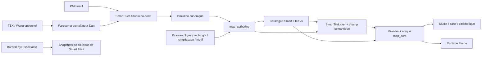

# Audit final STN-01 à STN-05 — Smart Tiles natifs

Date de clôture : 4 août 2026

Branche : `main`

Point de départ de la campagne de clôture : `2e481b135`

HEAD technique audité avant mise à jour de ce rapport : `94f9a285b`

Cible : PokeMap possède son modèle, son résolveur et son Studio ; Tiled reste une source d'inspiration et un format d'import optionnel.

## 1. Verdict exécutif

**La phase Smart Tiles peut être clôturée sans lot de rattrapage supplémentaire.**

STN-01, STN-02, STN-03, STN-04 et STN-05 sont `DONE` sur leur cible fonctionnelle et technique. Les écarts P0/P1 du premier audit ont été corrigés : transitions multi-matières, couverture sparse, preuve geste-vers-rendu, outils ligne/rectangle/remplissage, géométrie multi-cellules, Pattern Brush, import TSX/Wang core/API/MCP/éditeur et suppression du legacy Surface.

| Cible | Statut final | Preuve principale |
|---|---|---|
| Schéma Wang natif indépendant de Tiled | **DONE** | Champs cellule/arêtes/coins/mixte, signatures explicites, variantes pondérées, D4 et géométrie dans `map_core`. |
| `TerrainLayer` / `PathLayer` / `SurfaceLayer` absents | **DONE** | Recherche de production vide ; le wire v6 les refuse. |
| Catalogue historique Surface supprimé | **DONE** | `surface.dart` et son instruction runtime morte sont supprimés ; le rôle utile appartient désormais à Border. |
| Template historique `legacy_20` supprimé | **DONE** | Retiré du schéma et du JSON généré ; son décodage échoue explicitement. |
| Terrain, chemin, surface forestière no-code | **DONE** | Création, reprise, publication, ajout à la carte et peinture canonique. |
| Transitions exactes multi-matières | **DONE** | Cas explicites par matériau/slot, compilation et diagnostics d'ambiguïté. |
| Peinture Tiled-like | **DONE** | Pinceau, ligne, rectangle, flood fill, erase et transaction/undo uniques. |
| Frames visuelles multi-cellules | **DONE** | Sélection rectangulaire d'atlas, span, ancre, offset, footprint, canal et ordre. |
| Motifs périodiques / tampons | **DONE** | Ressource `smartTilePattern`, authoring no-code et paint/erase canoniques. |
| Import TSX/Wang sans dépendance à Tiled | **DONE** pour le périmètre V1 | Parseur Dart, probabilités, animations, sets corner/edge/mixed, preview et choix d'usage explicite. |
| Parité direct / JSONL / éditeur / MCP | **DONE** | Registres, actions, ressources, PMCP-085 et tests MCP verts. |
| Résolution commune éditeur / cinématique / runtime | **DONE** | `resolveSmartTileLayerVisuals` reste le point de vérité partagé. |
| Gate monorepo entière | **PARTIAL hors périmètre Smart Tiles** | Les gates ciblées sont vertes ; la suite éditeur globale conserve des échecs préexistants Narrative, Selbrume, Border et goldens. |

La gate monorepo globale n'est pas utilisée pour fabriquer un faux blocage Smart Tiles : ses échecs ne touchent ni les contrats, ni le Studio, ni le rendu Smart Tiles. Ils doivent être traités dans leurs lots propriétaires.

## 2. Architecture finale



Décisions confirmées :

1. PokeMap ne dépend pas de Tiled au runtime.
2. Un TSX est converti vers des ressources PokeMap natives ; il n'est pas conservé comme moteur parallèle.
3. Les cartes stockent une intention sémantique et des motifs, pas un rendu figé.
4. `BorderLayer` reste un système spécialisé pour murs, clôtures, côtes et bordures complexes. Il ne remplace pas les raccords Smart Tiles et n'est pas un reliquat de `TerrainLayer`/`PathLayer`.
5. Les anciens projets utilisant les contrats retirés sont volontairement incompatibles.

## 3. Audit par lot

| Lot | Statut | Résultat final |
|---|---|---|
| STN-01 — noyau Wang natif | **DONE** | Schéma, sérialisation, validation, signatures et résolveur déterministe. |
| STN-02 — transformations et rendu | **DONE** | Transformations D4, géométrie, visual parts et rendu partagé. |
| STN-03 — authoring canonique | **DONE** | Plan/apply, receipts, validation, JSONL et API directe. |
| STN-04 — Studio no-code / cutover v6 | **DONE** | Parcours hybride complet, transitions exactes, géométrie, Pattern Brush, publication et suppression du legacy. |
| STN-05 — peinture World Map | **DONE** | Gestes atomiques, outils de forme, undo/redo, sauvegarde et acceptation geste-vers-frame. |
| Extension import TSX/Wang V1 | **DONE** | Core, action canonique, MCP et UI no-code ; validation d'image avant mutation. |

### 3.1 Écarts du premier audit et résolution

| Écart initial | Résolution | Commits |
|---|---|---|
| Couverture sparse / règles de fallback | Profils sparse durcis et scénarios explicites. | `c4cab2f17` |
| Authoring binaire commun à toutes les matières | Cas exacts avec `SmartTileSlotMatch.material`. | `497e710f4` |
| Absence d'acceptation forme -> frame | Tests composés après gestes et résolution. | `901c63786` et tests associés |
| Outils ligne / rectangle / flood fill absents | Sélections bornées compilées en une mutation atomique. | `901c63786` |
| Géométrie multi-cellules peu authorable | Sélection rectangulaire et édition no-code de la géométrie. | `88da0f6d5` |
| Motifs périodiques absents | Contrat, actions, éditeur, compilateur de brouillon et UI Pattern Brush. | `823b8f5fb` à `037ccc12c` |
| Import TSX/Wang absent | Parseur pur Dart, action canonique, MCP et parcours no-code. | `1b39c3e84` à `ede21e5d2` |
| Dimensions TSX validées trop tard | Décodage et vérification avant toute mutation d'import. | `94f9a285b` |
| Types Surface publics morts | Remplacement par un contrat Border explicite et suppression des fichiers morts. | `b6540c83d` |
| `legacy_20` encore désérialisable | Retrait enum/wire/généré et test de rejet. | `b6540c83d` |
| Catalogue MCP documentaire obsolète | Ajout de `smartTilePattern`, Pattern Brush et import Wang. | `b6540c83d` |

## 4. Import TSX/Wang : périmètre exact

Le V1 prend en charge :

- tileset TSX à image unique avec grille régulière ;
- géométrie et référence d'image relatives ;
- Wang Sets `corner`, `edge` et `mixed` ;
- Wang colors et Wang IDs dans l'ordre Tiled ;
- variantes de même signature regroupées comme candidats pondérés ;
- probabilités de tuiles ;
- animations ;
- sélection explicite de l'usage PokeMap par Wang Set ;
- compilation en atlas, matériaux, animations, presets et brouillons natifs ;
- preview no-code et diagnostics avant écriture ;
- validation des dimensions réelles avant l'import de l'asset.

Limites explicites, non bloquantes pour ce V1 :

- les TSX « image collection » (`columns=0`) sont refusés avec diagnostic ;
- TMX n'est pas importé ;
- l'import produit des ressources natives à relire/publier, pas une dépendance vivante au TSX ;
- le pack ERW acheté a été inspecté en lecture seule mais aucun asset sous licence n'est copié dans le dépôt ni utilisé comme fixture redistribuée.

## 5. Suppression définitive du legacy terrain/path/surface

Recherche finale de production :

```text
TerrainLayer    0 type ou chemin exécutable
PathLayer       0 type ou chemin exécutable
SurfaceLayer    0 type ou chemin exécutable
ProjectSurface* 0
SurfaceAtlas*   0
SurfaceAnimation* 0
legacy_20       0 dans le code de production et le codec généré
```

Le contrat utile à Border a été renommé :

```text
SurfaceVariantRole                  -> BorderGroundVariantRole
standardSurfaceVariantRoleOrder     -> standardBorderGroundVariantRoleOrder
resolveSurfaceVariantRoleAt         -> resolveBorderGroundVariantRoleAt
surface_variant_role_resolver.dart  -> border_ground_variant_role_resolver.dart
```

Les valeurs wire de Border (`isolated`, `endNorth`, etc.) n'ont pas changé. Le nettoyage casse l'API Dart historique, conformément à la décision produit, sans changer les données Border courantes.

## 6. Preuves fraîches

### 6.1 Génération et analyses

| Commande | Résultat exact |
|---|---|
| `cd packages/map_core && dart run build_runner build --delete-conflicting-outputs` | exit 0, build terminé en 27 s ; seul le diff généré attendu de `smart_tile.g.dart` subsiste. |
| `cd packages/map_core && dart analyze` | exit 0, `No issues found!` |
| `cd packages/map_authoring && dart analyze` | exit 0, `No issues found!` |
| `cd packages/map_editor && flutter analyze` | exit 0, `No issues found!` |
| `cd packages/map_runtime && flutter analyze` | exit 0, `No issues found!` |
| `cd tools/pokemap_mcp && npm run check` | exit 0 |
| `cd tools/pokemap_mcp && npm run build` | exit 0 |

### 6.2 Tests

| Commande | Résultat exact |
|---|---|
| `cd packages/map_core && dart test test/smart_tiles` | exit 0, **247 tests passés** |
| `cd packages/map_core && dart test test/border` | exit 0, **951 tests passés** |
| `cd packages/map_authoring && dart test` | exit 0, **369 tests passés** |
| `cd packages/map_authoring && dart run tool/pmcp085_conformance.dart` | exit 0, `resourceCount: 62`, `catalogComplete: true` |
| `cd packages/map_editor && flutter test test/smart_tiles_studio test/features/editor/presentation/world_map/world_map_paint_inspector_test.dart` + quatre tests Border touchés | exit 0, **246 tests passés** |
| `cd packages/map_editor && flutter test` des trois fichiers d'import TSX/Wang | exit 0, **40 tests passés** |
| `cd packages/map_runtime && flutter test` des tests Smart Tiles + `test/border` | exit 0, **44 tests passés** |
| `cd tools/pokemap_mcp && npm test` | exit 0, **30 tests passés**, `fail 0` |

### 6.3 Qualification de la suite globale éditeur

La suite `flutter test` complète de `map_editor` a été relancée avant le nettoyage final. Elle a atteint environ `+4959 ~6 -111` puis a été interrompue après plus de dix minutes lorsqu'un test Narrative ne terminait pas. Les échecs observés appartiennent notamment aux catégories suivantes :

- goldens Narrative/Storylines/Scenes ;
- fixtures `selbrume/project.json` absentes ;
- tests Border dépendant d'un projet externe ;
- overflows World Map déjà recensés ;
- timeout `pumpAndSettle` du shell/inspecteur ;
- transactions de test tentées hors d'une racine projet autorisée.

Aucun test Smart Tiles n'apparaît dans la liste des échecs. Les suites exactes touchées ont ensuite été rejouées isolément et sont vertes. La gate monorepo reste donc `PARTIAL`, mais ce n'est pas une dette créée ni masquée par STN.

## 7. Parité PokeMap MCP

Ressources Smart Tiles découvrables :

```text
smartTileAtlas
smartTileMaterial
smartTilePattern
smartTileAnimation
smartTileDraft
smartTilePreset
smartTileLayer
```

Familles d'actions ajoutées ou vérifiées pendant la clôture :

```text
smart_tile.cell.paint / erase
smart_tile.pattern.upsert / delete
smart_tile.pattern.paint / erase
smart_tile.tiled_wang.import
```

Les actions passent par `map_authoring`. L'éditeur ne réimplémente pas la mutation métier. PMCP-085 retrouve une preuve de contrat pour l'import Wang et les motifs ; le serveur MCP réel expose les contrats via son catalogue testé.

## 8. Commits de la campagne de clôture

| Commit | Objet |
|---|---|
| `c4cab2f17` | Durcissement sparse Wang |
| `497e710f4` | Transitions exactes multi-matières |
| `901c63786` | Outils de peinture atomiques |
| `88da0f6d5` | Géométrie visuelle multi-cellules |
| `823b8f5fb` | Contrats Pattern Brush |
| `c487c2e90` | Peinture de motifs dans l'éditeur |
| `8b81f8818` | Compilation canonique des brouillons de motif |
| `037ccc12c` | Authoring Pattern Brush no-code |
| `1b39c3e84` | Parseur/compilateur TSX/Wang Dart |
| `beb8b5117` | Action canonique et parité import Wang |
| `ede21e5d2` | Parcours d'import Wang no-code |
| `b6540c83d` | Suppression des contrats Surface et `legacy_20` |
| `94f9a285b` | Préflight des dimensions d'atlas Wang |

Les commits eux-mêmes constituent les diffs complets et atomiques. Les zones sémantiques principales sont :

| Zone | Modification précise |
|---|---|
| `map_core/models/smart_tile.dart` | Pattern, strokes, géométrie, cas exacts ; retrait `legacy20`. |
| `map_core/operations/smart_tile_*` | gestes, motifs, couverture, résolution et compilation de brouillons. |
| `map_core/operations/tiled_wang_import.dart` | parse/validation/compilation TSX/Wang. |
| `map_authoring/domains/maps` | actions Pattern Brush et import Wang. |
| `map_editor/features/smart_tiles_studio` | authoring exact, formes, motifs et import guidé. |
| `map_editor/features/editor` | ligne, rectangle, flood fill, pattern et transaction. |
| `map_core/models/border_ground_variant_role.dart` | contrat Border remplaçant le seul symbole utile de Surface. |
| `map_runtime/border` | vocabulaire Border explicite ; aucun runtime Surface historique. |
| `tools/pokemap_mcp` | preuve de découverte et mutation Wang/Pattern. |

## 9. Inventaire exhaustif des fichiers modifiés depuis le premier audit

L'inventaire canonique est `git diff --name-only 2e481b135..94f9a285b` : **141 fichiers**. Il se répartit comme suit :

- `packages/map_authoring` : 16 fichiers — barrel, API de lecture, dispatcher, actions catalogue/cellule/motif, parité, registres, queries et tests/golden JSONL associés ;
- `packages/map_core` : 59 fichiers — modèles/générés, opérations Smart Tiles/Wang/Pattern/Border, validation, dépendance XML, tests Smart Tiles et tests Border renommés ;
- `packages/map_editor` : 59 fichiers — Studio, World Map, Border Studio, canevas, tests widget/intégration et service d'import ;
- `packages/map_runtime` : 6 fichiers — retrait de l'instruction Surface morte, vocabulaire Border et tests ;
- racine/outillage : `pokemap_authoring_api_mcp_action_catalog.md` et `tools/pokemap_mcp/test/mutation_server.test.ts`.

Fichiers créés structurants :

```text
packages/map_core/lib/src/models/border_ground_variant_role.dart
packages/map_core/lib/src/operations/border_ground_variant_role_resolver.dart
packages/map_core/lib/src/operations/smart_tile_pattern_operations.dart
packages/map_core/lib/src/operations/tiled_wang_import.dart
packages/map_core/test/smart_tiles/smart_tile_pattern_test.dart
packages/map_core/test/smart_tiles/tiled_wang_import_test.dart
packages/map_authoring/lib/src/domains/maps/smart_tile_pattern_actions.dart
packages/map_editor/lib/src/features/smart_tiles_studio/application/smart_tile_pattern_authoring.dart
packages/map_editor/lib/src/features/smart_tiles_studio/application/smart_tile_pattern_authoring_service.dart
packages/map_editor/lib/src/features/smart_tiles_studio/application/smart_tile_tiled_wang_import_service.dart
packages/map_editor/lib/src/features/smart_tiles_studio/presentation/smart_tile_pattern_editor.dart
packages/map_editor/lib/src/features/smart_tiles_studio/presentation/smart_tile_tiled_wang_import_editor.dart
packages/map_editor/test/smart_tiles_studio/smart_tile_pattern_authoring_service_test.dart
packages/map_editor/test/smart_tiles_studio/smart_tile_pattern_authoring_test.dart
packages/map_editor/test/smart_tiles_studio/smart_tile_pattern_editor_test.dart
packages/map_editor/test/smart_tiles_studio/smart_tile_tiled_wang_import_editor_test.dart
packages/map_editor/test/smart_tiles_studio/smart_tile_tiled_wang_import_service_test.dart
```

Fichiers supprimés :

```text
packages/map_core/lib/src/models/surface.dart
packages/map_core/lib/src/operations/surface_variant_role_resolver.dart
packages/map_runtime/lib/src/surface/surface_runtime_render_instruction.dart
```

Les autres fichiers de l'inventaire portent des raccordements, renommages typés, exports, codecs, tests ou fixtures nécessaires aux contrats ci-dessus ; aucun asset acheté n'est ajouté.

## 10. État Git

État initial de la campagne de clôture :

```text
branch: main
HEAD: 2e481b135
working tree: clean
origin/main...HEAD: 0 behind / 6 ahead
```

État avant le commit de ce rapport :

```text
branch: main
HEAD: 94f9a285b
working tree: clean
origin/main...HEAD: 0 behind / 19 ahead
```

Le commit documentaire final avance naturellement HEAD d'un commit ; son hash et l'état Git réellement final sont rapportés dans la réponse de clôture.

## 11. Passes d'audit et auto-critique

Aucun sous-agent n'a été utilisé pour cette clôture. Les passes locales indépendantes ont vérifié :

| Passe | Verdict |
|---|---|
| Modèle | Aucun deuxième modèle terrain/path/surface actif. |
| Authoring | Toutes les mutations ajoutées passent par `map_authoring`. |
| Produit | Terrain, chemin, forêt, formes, géométrie, motifs et import sont accessibles sans JSON. |
| Rendu | Le résolveur et les contrats de géométrie restent partagés. |
| Legacy | Types Surface morts et `legacy_20` réellement supprimés. |
| MCP | Ressources/actions découvrables, PMCP-085 complet, tests serveur verts. |
| Licence | Aucun fichier ERW acheté n'est copié. |

Risques résiduels réels :

1. Un échec concurrent après l'import canonique de l'image mais avant l'action Wang peut laisser un asset/tileset dédupliqué sans preset. Le TSX, les sélections et les dimensions sont désormais validés avant mutation, ce qui élimine les échecs usuels ; une transaction multi-ressources universelle serait néanmoins une amélioration d'infrastructure, pas un bloqueur STN.
2. Le parseur V1 ne couvre pas les image collections TSX ni TMX. Ces formats doivent être des lots d'import distincts si le besoin produit apparaît.
3. Le pack ERW réel n'est pas une fixture CI pour des raisons de licence. Les fixtures synthétiques prouvent les contrats ; une fixture redistribuable plus riche améliorerait encore la confiance.
4. La suite globale éditeur reste rouge/hang sur des domaines non Smart Tiles. La prochaine phase ne doit pas déclarer le monorepo globalement vert tant que ces propriétaires n'ont pas fermé leurs baselines.
5. `BorderLayer` est intentionnel. Le supprimer nécessiterait une décision produit différente et un lot autonome ; il ne faut pas le confondre avec le legacy terrain/path supprimé.

## 12. Décision de passage de phase

**Décision : GO pour la prochaine phase.**

Aucun lot de clôture Smart Tiles supplémentaire n'est justifié avant de poursuivre. Les prochains travaux peuvent porter sur une nouvelle capacité produit. Les améliorations import image-collection/TMX et transaction multi-ressources doivent être planifiées uniquement si la prochaine phase les exige.
