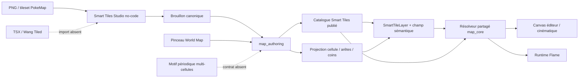

# Audit consolidé STN-01 à STN-05 — Smart Tiles

Date de l'audit : 4 août 2026  
Branche : `main`  
HEAD audité : `adec91d6c11284071e151f3201bce1664c32153a`  
Écart avec `origin/main` au début de l'audit : 5 commits locaux d'avance, 0 commit de retard  
Document cible : `documentation/reports/editor/plans/stn_04_smart_tiles_studio_no_code_implementation_plan.md`

## 1. Verdict exécutif

Le socle Smart Tiles n'est plus un prototype : le modèle natif, le résolveur, le rendu partagé, l'authoring canonique, le Studio no-code, la publication, la peinture World Map et la parité MCP existent et leurs suites ciblées sont vertes.

La cible finale n'est cependant **pas encore entièrement atteinte** si « atteindre Tiled sans dépendre de Tiled » signifie pouvoir reproduire les Wang Sets riches du pack ERW, les motifs périodiques multi-cellules et l'ensemble des outils de peinture de Tiled.

| Cible | Verdict | Conclusion précise |
|---|---|---|
| Retirer `TerrainLayer` et `PathLayer` du modèle courant | **DONE** | Aucun type ni chemin exécutable correspondant ne subsiste dans `packages/`, `examples/` ou `tools/`. |
| Retirer le catalogue legacy terrain/path/surface des projets v6 | **DONE** | Les clés legacy sont refusées par les gardes v6 ; les seules occurrences persistantes sont des rejets/tests. |
| Créer un terrain dans Smart Tiles Studio | **DONE** pour le parcours standard | Le choix Terrain est actif, le preset peut être créé, publié, ajouté à la carte, peint et rendu. Le blocage visible dans l'ancienne capture n'existe plus dans le code courant. |
| Créer chemins et surfaces organiques | **DONE** pour les profils binaires fournis | `uniform`, `cardinal4`, `blob8`, `wangEdge4`, `wangCorner4` et `wang8` existent ; les profils no-code sont présents. |
| Rendu identique entre Studio, carte, cinématique et runtime | **DONE** au niveau du résolveur partagé | Tous consomment `resolveSmartTileLayerVisuals`. |
| Authoring direct, JSONL/CLI, éditeur et MCP | **DONE** | Les transports canoniques sont prouvés et le catalogue MCP vivant expose 6 ressources et 14 actions Smart Tile. |
| Wang multi-couleurs comparable au pack ERW/Tiled | **PARTIAL** | Le noyau sait représenter des matériaux explicites par slot, mais le Studio compile encore une table binaire `mask -> candidates` commune à tous les matériaux. |
| Peinture Wang World Map | **PARTIAL** au sens « parfaitement certifié » | Mutation, transaction, undo/redo et transports sont prouvés ; il manque un test d'acceptation composé geste -> résolveur -> frame pour les formes usuelles. |
| Motifs simples répétés | **DONE** | Une frame logique unique utilise `Sans raccords`/`uniform`. |
| Motifs périodiques ou tampons multi-cellules | **TODO** | L'ancien `PathPatternPreset` a été supprimé sans remplacement, conformément au périmètre approuvé. |
| Import `.tsx`/Wang/TMX | **TODO** | Explicitement reporté à une seconde phase ; aucun importeur n'existe. |
| Richesse no-code des géométries multi-cellules | **PARTIAL** | Le modèle sait les stocker et les rendre, mais la sélection d'atlas ordinaire reste une cellule 1x1 et l'édition géométrique générique n'est pas exposée. |
| Gate projet entière verte | **PARTIAL** | Les tests Smart Tiles ciblés sont verts, mais plusieurs baselines globales hors Smart Tiles sont rouges ou instables. |

Verdict global : **STN-01, STN-02 et STN-03 sont DONE. STN-04 et STN-05 restent PARTIAL selon une définition stricte de “parfaitement terminé”.**

Aucun élément n'est techniquement `BLOCKED`. Les écarts sont implémentables sans réintroduire Tiled comme dépendance runtime.

## 2. Cible fonctionnelle retenue

L'audit compare le résultat à la cible décidée pendant les lots :

1. PokeMap possède son schéma, son résolveur et sa persistance.
2. Tiled sert de référence conceptuelle, jamais de dépendance d'exécution.
3. L'auteur travaille no-code : PNG, grille, matériaux, profils, placement, test et publication.
4. Terrain, chemin et surface organique partagent Smart Tiles Studio.
5. La carte stocke des champs sémantiques ; les visuels sont résolus, pas collés comme une grande image statique.
6. L'import TSX/Wang vient dans un second temps.
7. Les motifs périodiques sont un futur contrat de tampon distinct des règles d'autotile.
8. Les anciens projets peuvent être cassés ; aucune migration v5 n'est requise.

### Point de périmètre à ratifier

Le plan approuvé ne supprimait pas `BorderLayer`. Il supprimait la dépendance de Border Studio à l'ancien `surfaceCatalog` et la remplaçait par un snapshot de sol provenant d'un preset Smart Tile publié.

Il existe donc aujourd'hui deux sens différents de « bordure » :

- **Bordures Smart Tiles** : profil Wang `wangEdge4`, destiné aux transitions d'un terrain ou d'un chemin ;
- **Border Studio / `BorderLayer`** : système spécialisé de murs, clôtures, côtes et matérialisation de bordures.

Selon la cible écrite de STN-04, cette séparation est conforme. Si la cible réelle devient « supprimer aussi `BorderLayer` et faire toute bordure dans Smart Tiles Studio », ce travail est **TODO** et nécessite un lot d'architecture distinct. Il ne faut pas le considérer implicitement terminé.

## 3. Architecture effectivement en place



### 3.1 Modèle canonique

Le modèle courant expose :

- usages : `terrain`, `path`, `forestSurface` ;
- topologies : `uniform`, `cardinal4`, `blob8`, `wangEdge4`, `wangCorner4`, `wang8` ;
- templates : `simple`, `legacy20`, `edge16`, `corner16`, `corner12`, `blob47`, `mixed256`, `free` ;
- champs : cellule, arêtes, coins et mixte ;
- matériaux, groupes de connexion, variantes pondérées, animations, transformations D4 et visual parts ;
- géométrie de frame : span, offset, footprint, anchor, canal et ordre de dessin.

Le `MapLayer` public contient encore `TileLayer`, `CollisionLayer`, `SmartTileLayer`, `ObjectLayer`, `EnvironmentLayer` et `BorderLayer`, mais plus `TerrainLayer`, `PathLayer` ni `SurfaceLayer`.

### 3.2 Résolution et rendu

`packages/map_core/lib/src/operations/smart_tile_layer_visual_resolver.dart` est le point de vérité. Il combine contexte sémantique, règle, variante déterministe, transformation, géométrie et passes de rendu.

Les consommateurs vérifiés sont :

- carte éditeur : `packages/map_editor/lib/src/ui/canvas/map_canvas/map_grid_painter.dart:2413` ;
- laboratoire Studio : `packages/map_editor/lib/src/features/smart_tiles_studio/application/smart_tile_test_layer_controller.dart:166` ;
- fond cinématique : `packages/map_editor/lib/src/ui/canvas/cinematics/cinematic_map_backdrop_layer_render_plan.dart:266` ;
- runtime : `packages/map_runtime/lib/src/presentation/flame/map_layers_component.dart:330`.

Il n'y a donc pas deux résolveurs concurrents « éditeur contre runtime ».

### 3.3 Authoring canonique

Les actions Smart Tiles sont portées par `map_authoring`, pas par des mutations privées du Studio. Le catalogue MCP vivant expose :

- ressources : `smartTileAnimation`, `smartTileAtlas`, `smartTileDraft`, `smartTileLayer`, `smartTileMaterial`, `smartTilePreset` ;
- actions : `smart_tile.animation.delete`, `smart_tile.animation.upsert`, `smart_tile.atlas.upsert`, `smart_tile.cell.erase`, `smart_tile.cell.paint`, `smart_tile.layer.create`, `smart_tile.layer.delete`, `smart_tile.layer.merge`, `smart_tile.layer.normalize`, `smart_tile.material.upsert`, `smart_tile.preset.delete`, `smart_tile.preset.draft.delete`, `smart_tile.preset.draft.upsert`, `smart_tile.preset.publish`.

La peinture World Map passe par `applySmartTileMaterialGesture`, puis par les actions `smart_tile.cell.paint`/`erase`. Undo/redo et sauvegarde utilisent la transaction canonique.

## 4. Audit par lot

### 4.1 Lots principaux

| Lot | Commit principal | Statut | Preuve | Reste pour `DONE` parfait |
|---|---|---|---|---|
| STN-01 — noyau Wang natif | `b79d11bcb` | **DONE** | Schéma, champs, règles, signatures, validation et résolution pure Dart. | Rien dans le périmètre du lot. |
| STN-02 — transformations et rendu | `f5f8b9bc8` | **DONE** | D4, géométrie, visual parts, rendu partagé éditeur/runtime. | L'UI générique de géométrie multi-cellules appartient au gap no-code STN-04, pas au noyau STN-02. |
| STN-03 — authoring canonique | `11f71230b` | **DONE** | API canonique, plan/apply, JSONL, validation, receipts et tests authoring. | Rien dans le périmètre initial. |
| STN-04 — Studio no-code et cutover v6 | `58ec87d22` à `a44aeb4e5` | **PARTIAL** | Le parcours complet existe et 164 tests ciblés éditeur passent. | Corriger l'authoring multi-matière, la couverture liée au profil, la géométrie multi-cellules et fermer la gate globale. |
| STN-05 — peinture Wang World Map | `12a0d751e` à `adec91d6c` | **PARTIAL** | Projection, actions, UI, transaction, undo/redo et parité MCP passent. | Ajouter l'acceptation composée geste -> résolution visuelle et les outils de forme attendus. |

### 4.2 Sous-lots STN-04

| Sous-lot | Statut | Audit |
|---|---|---|
| 04.0 — Baseline et garde d'exposition | **DONE** | Les gardes legacy et la baseline v6 existent. |
| 04.1 — Brouillon core et catalogue v3 | **DONE** | Brouillons durables, round-trip et validation présents. |
| 04.2 — Actions, queries et parité transport | **DONE** | Direct, JSONL et MCP vérifiés. |
| 04.3 — Session, contexte et autosave | **DONE** | Reprise, autosave et publication canonique couverts. |
| 04.4 — Shell hybride Usage/Image/Grille | **DONE** | Terrain, Chemin et Surface organique sont sélectionnables ; PNG et grille sont gérés. |
| 04.5 — Matériaux et profils de raccord | **PARTIAL** | Les matériaux et six profils existent, mais la matière active n'identifie pas un ensemble de règles/visuels distinct. |
| 04.6 — Variantes, transformations et Formes | **PARTIAL** | Variantes, poids, animations, D4 et multi-parts existent ; l'authoring no-code d'une frame rectangulaire arbitraire reste incomplet. |
| 04.7 — Laboratoire exact | **DONE** | Lattice, couverture, cas manquants et preview partagent le résolveur. |
| 04.8 — Publication et handoff carte | **DONE** | Publication atomique et ajout de couche canonique présents. |
| 04.9 — Absorption Surface | **DONE** fonctionnel, **PARTIAL** en hygiène | Surface Studio est supprimé et Border/gameplay/cinématique/runtime ne lisent plus `surfaceCatalog`; des types publics morts dans `surface.dart` subsistent. |
| 04.10 — v6 et suppression du legacy | **DONE** fonctionnel | Les manifests v6 refusent les clés legacy et les anciennes couches ont disparu. |
| 04.11 — Certification et ouverture du gate | **PARTIAL** | Parité Smart Tiles verte, mais gate globale projet non verte et document de plan resté historiquement `PARTIAL`. |

### 4.3 Décomposition STN-05 d'après les cinq commits

Il n'existe pas de plan STN-05 persistant équivalent au plan STN-04. La décomposition suivante est reconstruite depuis les commits et tests :

| Étape reconstruite | Commit | Statut |
|---|---|---|
| Projection d'un geste vers les lattices | `12a0d751e` | **DONE** |
| Actions canoniques paint/erase | `6a8cbd339` | **DONE** |
| Palette et peinture World Map | `2fe165b63` | **DONE** fonctionnel |
| Transaction, sauvegarde, undo/redo | `e9a59f4f2` | **DONE** |
| Certification des transports | `adec91d6c` | **DONE** pour les transports, **PARTIAL** pour l'acceptation visuelle finale |

## 5. Écarts précis à corriger

### P0 — Les règles no-code ne sont pas réellement multi-matières

**Statut : PARTIAL fonctionnel majeur.**

Le noyau sait exprimer `SmartTileSlotMatch.material(materialId)` sur le centre et chacun des slots. En revanche, le contrôleur Studio stocke :

```text
Map<int, List<SmartTileCandidate>> mappings
```

La clé est un masque binaire. Lors de la compilation, les templates non simples produisent :

```text
centerMatch = any
signature = smartTileSignatureForMask(mask)
```

La matière active du Studio n'est utilisée que pour la sélection visuelle du picker ; elle n'entre ni dans la clé du mapping, ni dans les règles compilées. Toutes les matières d'un preset partagent donc les mêmes candidats visuels.

Cela empêche de reproduire fidèlement un Wang Set Tiled multi-couleurs. Le fichier ERW principal inspecté contient 11 Wang Sets, 38 couleurs Wang et 1 594 associations de tuiles. Un seul set « stone floor » contient 13 couleurs de transition. Une table binaire de masques ne peut pas encoder ces affectations par couleur.

**Changement requis :**

1. Remplacer le mapping d'authoring binaire par une liste de cas canoniques, par exemple `SmartTileAuthoringCase` avec `centerMatch`, signature complète et candidats.
2. Conserver le masque uniquement comme guide ergonomique pour les templates binaires.
3. Faire de la matière active un vrai contexte d'authoring : matière centrale, matières par coin/arête ou relation même/différente.
4. Ajouter une UI « cas de transition » no-code, avec noms et aperçus, sans exposer des Wang IDs bruts.
5. Compiler vers les `SmartTileSlotMatch.material` déjà supportés par `map_core`.
6. Ajouter des diagnostics d'ambiguïté entre cas multi-matières.
7. Prouver deux matières ayant des visuels différents, une transition croisée et un cas ERW à plusieurs couleurs sur direct, JSONL, éditeur et MCP.

### P0 — Politique de couverture couplée au profil au lieu de l'usage

**Statut : PARTIAL avec risque UX réel.**

`planNativeSmartTileLayerCreation` remplit toute la lattice avec la matière par défaut quand `coveragePolicy == complete`, sinon il crée un calque vide.

Les profils « Bordures » et « Coins » omettent une policy explicite et héritent de `complete`. Ils sont recommandés pour Terrain, mais restent sélectionnables pour Chemin ou Surface organique. Choisir l'un de ces profils sur un overlay peut donc créer un calque rempli sur toute la carte, alors que le parcours Chemin annonce un réseau peint au-dessus du terrain.

**Changement requis :**

1. Séparer clairement le choix de raccord du mode de couverture.
2. Exposer un choix no-code explicite : « Fond de carte rempli » ou « Calque vide à peindre ».
3. Pré-remplir selon l'usage : Terrain -> complet ; Chemin/Surface organique -> vide, sans que le profil Wang ne l'écrase silencieusement.
4. Ajouter une matrice de tests usage x profil x création de couche.

### P0 — Preuve d'acceptation visuelle STN-05 manquante

**Statut : PARTIAL de certification, pas preuve d'un bug confirmé.**

Les tests actuels prouvent séparément :

- la projection exacte du geste dans `semanticCells`, arêtes et coins ;
- la résolution d'un champ Wang construit à la main ;
- les transports et transactions.

Ils ne prouvent pas encore dans un même test qu'un geste utilisateur produit la bonne frame pour une forme isolée, une ligne, un L, un rectangle puis un effacement.

**Changement requis :**

1. Construire un preset publié via le même compilateur que le Studio.
2. Créer une couche par le flux canonique.
3. Peindre puis effacer via `smart_tile.cell.paint`/`erase`.
4. Appeler `resolveSmartTileLayerVisuals` après chaque geste.
5. Vérifier règle, candidat, transformation et géométrie pour `blob8`, `wangEdge4`, `wangCorner4` et `wang8`.
6. Ajouter au moins un golden éditeur/runtime avec un vrai atlas de fixture.

### P1 — Motifs périodiques et tampons multi-cellules absents

**Statut : TODO assumé par le plan.**

`PathPatternPreset` a été retiré. Une image constituant une seule frame logique répétable est couverte par `uniform`. En revanche, un motif 2x1, 3x3, une cadence, une phase ou un tampon composite ne dispose d'aucun contrat Smart Tiles dédié.

Le fichier `surface_global_compacted_path.png` est couvert aujourd'hui uniquement s'il représente une frame logique unique. S'il contient plusieurs cellules à alterner ou une empreinte périodique, il n'est pas couvert.

**Changement requis :**

1. Créer un contrat distinct `SmartTilePattern`/`PatternBrush`, pas un faux masque de raccord.
2. Définir dimensions, ancre, phase, répétition, cellules visuelles, effacement et éventuelle collision.
3. Ajouter une UI de sélection de région d'atlas et une preview de répétition.
4. Compiler ligne, rectangle et stamp vers une mutation canonique atomique.
5. Exposer le contrat dans l'API et le catalogue MCP.

### P1 — Géométrie multi-cellules insuffisamment authorable sans code

**Statut : PARTIAL.**

Le contrôleur accepte `columnSpan`, `rowSpan`, offsets, footprint, anchors, canaux et draw order. Mais la sélection standard d'une cellule d'atlas appelle `replaceAtlasCandidate` avec un span 1x1. L'UI sait ajouter des visual parts et propose un helper de canopée forestière, mais pas sélectionner et régler arbitrairement une frame multi-cellules.

**Changement requis :**

1. Sélection rectangulaire dans l'atlas.
2. Éditeur visuel de crop, ancre, offset, footprint, canal et ordre.
3. Preview à l'échelle de la grille et contrôle des débordements.
4. Tests widget puis rendu éditeur/runtime de frames 2x1, 2x2 et tall sprite.

### P1 — Outils de peinture Tiled-like incomplets

**Statut : PARTIAL produit.**

Le geste canonique accepte plusieurs cellules, ce qui couvre un trait de pinceau. Les opérations génériques de région refusent toutefois les lattices Wang avec `smart_tile_wang_gesture_action_required`. Il n'existe pas encore de parcours complet rectangle, ligne, pot de peinture et tampon périodique sur Wang.

**Changement requis :**

1. Compiler ligne et rectangle vers une liste de cellules puis une action canonique atomique.
2. Implémenter un flood fill sémantique borné.
3. Ajouter preview avant application, annulation unique et tests de grandes régions.
4. Réserver le stamp périodique au contrat Pattern décrit ci-dessus.

### P1 — Import TSX/Wang absent

**Statut : TODO, conforme au report de périmètre.**

Le pack ERW contient 38 fichiers TSX et 24 cartes TMX. Plusieurs TSX définissent des Wang Sets `corner` ou `edge`. Aucun parseur ni importeur n'est présent dans PokeMap.

**Changement requis :**

1. Parser TSX en pur Dart sans dépendance runtime à Tiled.
2. Importer image, géométrie, tile IDs, Wang colors, Wang IDs, probabilités et transformations pertinentes.
3. Projeter les couleurs Wang vers les cas multi-matières du schéma PokeMap.
4. Présenter diagnostics et preview avant écriture.
5. Publier via une transaction `map_authoring` atomique.
6. Utiliser le pack ERW fourni comme fixture d'acceptation externe ou en extraire une petite fixture redistribuable si la licence le permet.

### P2 — Résidus source de l'ancien vocabulaire Surface

**Statut : PARTIAL d'hygiène, sans double runtime actif.**

`packages/map_core/lib/src/models/surface.dart` reste exporté. À l'exception de `SurfaceVariantRole`, ses types ne sont référencés par aucun autre fichier : `SurfaceAtlasLayout`, `ProjectSurfaceAtlas`, `ProjectSurfaceAnimation`, `ProjectSurfacePreset`, etc. sont du code public mort. `SurfaceVariantRole` est encore utilisé par Border Studio et le runtime Border.

Des commentaires obsolètes mentionnent aussi des symboles retirés dans :

- `project_manifest_environment_preset_operations.dart` ;
- `visual_frame_json.dart` ;
- `surface.dart` lui-même ;
- `smart_tile_authoring_controller.dart:159`, qui affirme encore que la persistance attend l'adapter STN-04.

**Changement requis :**

1. Déplacer/renommer `SurfaceVariantRole` dans un contrat Border neutre.
2. Mettre à jour les imports Border.
3. Supprimer les types Surface morts et l'export public.
4. Nettoyer les commentaires qui citent les anciens presets.
5. Garder les chaînes de garde legacy uniquement dans les validateurs/tests v6.

### P2 — Documentation de statut obsolète

**Statut : PARTIAL de gouvernance.**

Le plan STN-04 conserve des cases non cochées et un verdict historique `PARTIAL`. Aucun plan ou rapport de clôture STN-05 persistant ne décrit ses critères de done. Les commits sont la seule chronologie fiable.

**Changement requis :**

1. Mettre à jour le document canonique après correction des P0/P1 retenus.
2. Formaliser STN-05 ou son lot de durcissement avec critères d'acceptation visuelle.
3. Ne déclarer le gate final `DONE` qu'après une baseline globale fraîche.

## 6. Comparaison concrète avec le pack ERW/Tiled

| Capacité ERW/Tiled observée | PokeMap actuel | Verdict |
|---|---|---|
| Tileset 32x32 de 3 960 tuiles | Atlas PNG/grille PokeMap supporté | **DONE** |
| Wang Sets `corner` et `edge` | `wangCorner4`, `wangEdge4`, `wang8` | **DONE** au niveau topologique |
| Plusieurs Wang Sets dans un TSX | Plusieurs presets PokeMap possibles | **DONE** manuellement |
| Plusieurs Wang colors dans un même set | Modèle core expressif, Studio binaire | **PARTIAL** |
| Affectations Wang ID par tuile | Règles PokeMap possibles, pas d'import | **PARTIAL** manuellement, **TODO** automatiquement |
| Variantes/probabilités | Candidats pondérés | **DONE** |
| Animations | Animations Smart Tile | **DONE** |
| Transformations | Politique D4 | **DONE** |
| Terrain brush avec formes | Pinceau multi-cellules canonique | **PARTIAL** faute de certification visuelle et d'outils de forme |
| Import TSX/TMX | Aucun importeur | **TODO** |

Conclusion : PokeMap possède déjà un noyau conceptuellement comparable aux Wang Sets, mais le Studio n'exploite pas encore toute l'expressivité du noyau. Le principal écart n'est pas le résolveur ; c'est le contrat d'authoring no-code encore réduit à des masques binaires.

## 7. Validation fraîche

### 7.1 Suites Smart Tiles et transports

| Commande | Résultat exact |
|---|---|
| `cd packages/map_core && dart test test/smart_tiles --reporter compact` | exit 0, **225 tests passés**, 1,9 s |
| `cd packages/map_authoring && dart test --reporter compact` | exit 0, **359 tests passés**, 20,3 s |
| `cd packages/map_editor && flutter test test/smart_tiles_studio test/features/editor/presentation/world_map/world_map_paint_inspector_test.dart --reporter compact` | exit 0, **164 tests passés**, 18,8 s |
| `cd packages/map_runtime && flutter test test/runtime_manifest_tilesets_smart_tile_test.dart test/smart_tile_runtime_culling_test.dart test/smart_tile_runtime_render_test.dart --reporter compact` | exit 0, **8 tests passés**, 4,0 s |
| `cd tools/pokemap_mcp && npm test` | exit 0, `fail 0`, 40,8 s |

### 7.2 Analyse, conformité et builds

| Commande | Résultat exact |
|---|---|
| `cd packages/map_core && dart analyze` | exit 0, `No issues found!` |
| `cd packages/map_authoring && dart analyze` | exit 0, `No issues found!` |
| `cd packages/map_editor && flutter analyze` | exit 0, `No issues found!` |
| `cd packages/map_runtime && flutter analyze` | exit 0, `No issues found!` |
| `cd packages/map_authoring && dart run tool/pmcp085_conformance.dart` | exit 0 |
| `cd packages/map_authoring && dart compile exe bin/pokemap_authoring.dart -o /tmp/pokemap_authoring_stn_audit` | exit 0, exécutable généré |
| `cd tools/pokemap_mcp && npm run check` | exit 0 |
| `cd tools/pokemap_mcp && npm run build` | exit 0 |
| `cd packages/map_editor && flutter build macos --debug` | exit 0, `PokeMap.app` construit |
| appel MCP vivant `pokemap_describe` | `ok: true`, 6 ressources et 14 actions Smart Tiles |

### 7.3 Baselines globales non vertes

Ces échecs empêchent une certification projet globale, mais ne contredisent pas les suites Smart Tiles ciblées.

| Périmètre | Résultat | Qualification |
|---|---|---|
| `map_core` complet, concurrence par défaut | `+3849 -5`, exit 1 | Un échec déterministe isolé : fixture de save absente `reports/product/pokemap_hub/phase_0/saves/examples/minimal-valid-save-envelope.json`. Le fichier Border soupçonné pendant le run passe isolément : 94 tests. |
| `map_core` complet séquentiel dans un batch global | timeout à 300 s avant restitution | Gate non certifié ; aucun verdict vert inventé. |
| `map_runtime` complet | `+2115 -1`, exit 1 | Échec unique isolé : golden ROT-01 absent `reports/ui/world_map_editor_gate_5_rotation_runtime.png`. |
| `map_editor` complet, concurrence par défaut | interrompu à environ `+2675 ~5 -84` après 3 min 46 s | Cascade non fiable provoquée notamment par un test d'inspecteur qui ne termine pas et par plusieurs erreurs UI/golden. |
| World Map rebuild isolation, isolé | exit 1 | Overflow horizontal de 46 px et un rebuild observé au lieu de zéro. |
| Gate 6 World Map, isolé | exit 1 | Overflow horizontal de 19 px à 800x600 et 1280x800. |
| Narrative Studio specialized routes, isolé | exit 1 | 4 goldens diffèrent de 0,07 %, 1 024 pixels chacun. Hors Smart Tiles. |
| Right inspector resize, isolé | timeout 90,1 s, exit 255 | Les quatre premiers tests passent ; le cinquième, « keeps non-map inspector state local and unchanged », ne termine pas. |

Pour rendre la gate globale `DONE`, il faut restaurer/corriger les deux fixtures manquantes, corriger les overflows World Map, qualifier les quatre goldens Narrative et rendre déterministe le test d'inspecteur.

## 8. Passes d'audit et verdicts indépendants

Aucun sous-agent n'a été lancé pour cet audit. Cinq passes locales séparées ont été menées afin d'éviter qu'une seule lecture confirme ses propres hypothèses.

| Passe | Question | Verdict |
|---|---|---|
| Architecture | Existe-t-il encore deux modèles terrain/path actifs ? | **Non.** Le cutover fonctionnel est réel. |
| Produit no-code | Un utilisateur peut-il créer, publier et utiliser terrain/chemin/surface ? | **Oui pour les profils standards ; partiellement pour les cas avancés.** |
| Résolution/runtime | Éditeur et runtime peuvent-ils diverger ? | **Le chemin de résolution est partagé ; risque faible.** |
| API/MCP | L'UI contourne-t-elle l'API canonique ? | **Non pour les flux audités ; parité transport verte.** |
| Critique Tiled/ERW | Peut-on reproduire le TSX ERW riche sans Tiled ? | **Pas encore fidèlement : multi-couleurs et import manquent.** |

## 9. Ordre recommandé pour atteindre `DONE` parfaitement

| Priorité | Lot proposé | Contenu | Condition de sortie |
|---|---|---|---|
| 1 | Durcissement STN-05 | Matrice usage/profil/couverture et tests geste -> résolveur -> rendu | Tous les usages/topologies rendent isolé, ligne, L, rectangle et erase correctement. |
| 2 | Authoring Wang multi-matières | Cas explicites par matériau/slot et UI no-code | Un extrait ERW multi-couleurs est reproductible manuellement sans JSON. |
| 3 | Outils de peinture | Ligne, rectangle, flood fill atomiques | Undo/redo unique et mêmes résultats direct/JSONL/editor/MCP. |
| 4 | Géométrie et motifs | Sélection atlas rectangulaire puis contrat Pattern | Frames multi-cellules et motif périodique rendus éditeur/runtime. |
| 5 | Import TSX/Wang | Parseur, preview, diagnostics, transaction | Import déterministe d'une fixture ERW, sans dépendance à Tiled. |
| 6 | Clôture et hygiène | Types Surface morts, docs, fixtures et baselines globales | Tests/analyzers/builds globaux verts et documents à jour. |

Le premier lot doit rester le durcissement sémantique/visuel. Construire l'importeur avant d'avoir un modèle d'authoring multi-couleurs complet obligerait soit à perdre des données Wang, soit à inventer un format temporaire.

## 10. Inventaire des zones auditées

### Modèle et opérations

- `packages/map_core/lib/src/models/map_layer.dart`
- `packages/map_core/lib/src/models/smart_tile.dart`
- `packages/map_core/lib/src/models/smart_tile_field.dart`
- `packages/map_core/lib/src/models/project_manifest.dart`
- `packages/map_core/lib/src/models/surface.dart`
- `packages/map_core/lib/src/operations/smart_tile_layer_creation.dart`
- `packages/map_core/lib/src/operations/smart_tile_layer_operations.dart`
- `packages/map_core/lib/src/operations/smart_tile_layer_visual_resolver.dart`
- `packages/map_core/lib/src/operations/smart_tile_resolver.dart`
- `packages/map_core/lib/src/operations/smart_tile_sprite_geometry.dart`

### Authoring et MCP

- `packages/map_authoring/lib/src/domains/maps/smart_tile_cell_actions.dart`
- `packages/map_authoring/lib/src/domains/maps/smart_tile_layer_actions.dart`
- `packages/map_authoring/lib/src/domains/maps/smart_tile_catalog_actions.dart`
- `packages/map_authoring/lib/src/parity/full_authoring_parity.dart`
- `tools/pokemap_mcp/src/`
- `tools/pokemap_mcp/test/mutation_server.test.ts`

### Éditeur et runtime

- `packages/map_editor/lib/src/features/smart_tiles_studio/`
- `packages/map_editor/lib/src/features/editor/state/editor_notifier.dart`
- `packages/map_editor/lib/src/features/editor/presentation/world_map/`
- `packages/map_editor/lib/src/features/border_studio/`
- `packages/map_editor/lib/src/ui/canvas/map_canvas/map_grid_painter.dart`
- `packages/map_runtime/lib/src/presentation/flame/map_layers_component.dart`

### Tests déterminants

- `packages/map_core/test/smart_tiles/`
- `packages/map_authoring/test/domains/maps/smart_tile_*`
- `packages/map_authoring/test/parity/full_authoring_parity_test.dart`
- `packages/map_editor/test/smart_tiles_studio/`
- `packages/map_editor/test/features/editor/presentation/world_map/world_map_paint_inspector_test.dart`
- `packages/map_runtime/test/smart_tile_runtime_*`
- `tools/pokemap_mcp/test/`

## 11. Fichiers modifiés par cet audit

Un seul fichier est ajouté :

- `documentation/reports/editor/stn_01_05_smart_tiles_target_audit_2026-08-04.md` — présent rapport.

Aucun code source, test, fixture, manifeste ou fichier généré n'a été modifié.

## 12. Auto-critique et risques résiduels

1. L'audit prouve l'absence d'occurrences legacy dans le code courant et les gardes v6, mais ne charge pas un corpus d'anciens projets réels ; les anciens projets sont de toute façon volontairement non supportés.
2. Le pack ERW a été inspecté structurellement. Aucun fichier acheté n'a été copié dans le dépôt et aucune hypothèse de licence de redistribution n'est faite.
3. La suite globale éditeur n'a pas pu fournir un bilan final fiable à cause d'une cascade et d'un test qui ne termine pas. Les suites ciblées et fichiers problématiques ont donc été privilégiés.
4. Le manque de test composé STN-05 est classé `PARTIAL` par discipline de preuve ; il ne démontre pas à lui seul que le rendu actuel est incorrect.
5. La décision de conserver ou supprimer `BorderLayer` doit être explicite. Le retirer sans lot dédié mélangerait autotiles de sol et matérialisation spécialisée de bordures.
6. Une UI multi-matières mal conçue peut devenir aussi opaque que les Wang IDs de Tiled. La solution doit rester guidée par des aperçus et des cas nommés.
7. L'import TSX ne doit commencer qu'après stabilisation du contrat multi-matières, sous peine de créer une seconde représentation transitoire.

## 13. État Git initial

Au début de l'audit :

- branche `main` ;
- HEAD `adec91d6c11284071e151f3201bce1664c32153a` ;
- working tree propre ;
- `origin/main...HEAD` : `0 5`.

L'état Git final est consigné après les vérifications de ce rapport dans le compte-rendu de la tâche.
