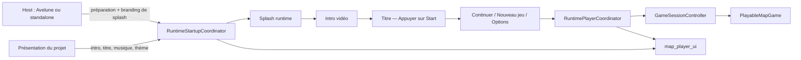

# Audit — FG-017 proposé — Runtime Startup, Intro & Title Flow V0

Date : 2026-08-08  
Type : audit d'architecture et de parcours, sans implémentation  
Verdict : `PARTIAL` — les contrats et plusieurs composants existent, mais le flux complet n'est ni possédé par la runtime ni prouvé de bout en bout.

## 1. Résumé exécutif

La demande ne part pas de zéro. PokeMap sait déjà :

- décrire une identité visuelle, une musique de titre et une vidéo d'introduction dans le projet ;
- valider et empaqueter la vidéo MP4/H.264, son poster et ses sous-titres ;
- lire une intro avec fallback, gérer la musique de titre, Continue, Nouveau jeu et Options ;
- router clavier, manette et tactile au-dessus de Flame ;
- charger une nouvelle partie ou une sauvegarde via des handles opaques.

Le défaut principal est l'ownership. `map_runtime` possède les contrôleurs purs, mais la vraie lecture vidéo, la résolution des assets installés et l'enchaînement intro/titre restent dans `apps/pokemap_hub`. Le host standalone contourne même le shell joueur canonique et monte directement `PlayableMapGame`.

L'architecture recommandée est donc :

1. une machine d'état de démarrage dans `map_runtime` ;
2. les surfaces Flutter et le lecteur vidéo dans `map_player_ui` ;
3. des ports de stockage et de résolution média fournis par le host, avec l'orchestration de préparation et la politique de sauvegarde détenues par `map_runtime` ;
4. Avelune réduit à un adaptateur qui injecte éventuellement son logo de splash ;
5. les médias du jeu, le titre et le menu pilotés par la configuration projet ;
6. une politique UI mono-sauvegarde qui masque les slots multiples sans détruire l'infrastructure existante.

Il ne faut pas coder ce parcours dans `examples/playable_runtime_host/lib/main.dart`, dans `PlayableMapGame`, ni dans une page Avelune.

## 2. Scope confirmé

Le parcours demandé est :

```text
lancement du jeu
  -> splash animé du host/runtime pendant la préparation
  -> vidéo d'introduction skippable
  -> écran titre animé + musique + « Appuyer sur Start »
  -> menu Continuer / Nouveau jeu / Options
  -> chargement de la partie par le runtime existant
```

Le splash ne doit pas prétendre que le chargement est fini avant qu'il le soit. Sa durée est un minimum d'animation, pas un minuteur qui force la transition. Il peut masquer la lecture du manifest et de la configuration, la découverte des sauvegardes et le préchargement des médias de présentation. Le chargement de la sauvegarde et du monde par `PlayableMapGameSessionRuntime` reste postérieur au choix Continuer/Nouveau jeu. Si la préparation initiale dépasse le minimum, la surface reste accessible et affiche un état de chargement discret ou une erreur récupérable.

Hors scope de cet audit :

- produire le logo ou l'animation Avelune ;
- choisir la direction artistique finale de l'écran titre ;
- modifier le code, les fixtures, la roadmap ou les sauvegardes ;
- ajouter réellement la vidéo de fond du titre ;
- supprimer le support multi-profils/multi-slots existant.

## 3. État Git initial

État observé avant l'audit :

```text
 M apps/pokemap_hub/lib/presentation/design_system/foundation/avelune_motion_tokens.dart
 M apps/pokemap_hub/lib/presentation/features/home/pages/avelune_home_screen.dart
 M apps/pokemap_hub/lib/presentation/features/home/widgets/avelune_cartridge_exchange_overlay.dart
 M apps/pokemap_hub/lib/presentation/features/home/widgets/avelune_game_shelf.dart
 M apps/pokemap_hub/lib/presentation/features/home/widgets/avelune_room_scene.dart
 M apps/pokemap_hub/test/presentation/features/home/avelune_cartridge_exchange_test.dart
 M apps/pokemap_hub/test/presentation/features/home/avelune_home_layout_ownership_test.dart
 M packages/gamepads_ios/ios/gamepads_ios/.swiftpm/xcode/xcuserdata/karim.xcuserdatad/xcschemes/xcschememanagement.plist
?? documentation/reports/architecture/pokemap_complete_project_audit_2026-08-08.md
```

Ces changements sont préexistants et ont été conservés sans modification.

## 4. Référence produit et limite de preuve

L'image fournie représente bien l'état post-Start souhaité : grand visuel de jeu, titre lisible, sélection principale claire et trois actions. Elle ne prouve pas un parcours actuel de PokeMap et ne doit pas être copiée littéralement : le cadre Nintendo Switch, les marques Pokémon et les artworks sont seulement une référence de hiérarchie.

Pour PokeMap, les invariants utiles sont :

- artwork plein écran responsive avec fallback statique ;
- titre/logo du projet lisible ;
- sélection très visible ;
- trois choix principaux seulement ;
- clavier, manette et toucher équivalents ;
- aucune dépendance à l'habillage Avelune dans les packages runtime.

Un audit visuel/accessibilité complet nécessitera des captures du flux réellement implémenté. Aucune conformité WCAG n'est revendiquée à partir de l'image de référence.

## 5. Audit initial du code existant

### 5.1 Contrat projet déjà disponible

`packages/map_core/lib/src/models/project_presentation_profile.dart` contient déjà :

- `ProjectBrandingProfile` : icône, cover, hero, accent, musique de titre et variante de layout ;
- `ProjectIntroVideoProfile` : vidéo, poster, WebVTT, durée, dimensions, bitrate, taille, codecs, reduced motion et replay ;
- `ProjectPresentationProfile` : branding, intro, typographie et thème sémantique ;
- une validation partagée des chemins, du MP4/H.264, de l'AAC, du poster obligatoire, du VTT et des budgets.

Le contrat est sérialisé dans `ProjectManifest.presentation` dans `packages/map_core/lib/src/models/project_manifest.dart`.

Preuve fraîche : `packages/map_core/test/project_presentation_profile_test.dart` passe `12/12`.

### 5.2 Authoring, éditeur et packaging déjà substantiels

Les mutations canoniques `presentation.update` et `presentation.delete` existent dans `packages/map_authoring/lib/src/domains/assets/presentation_actions.dart`. Le Personalization Studio possède déjà des parcours no-code pour le branding, la musique de titre, l'intro vidéo, les thèmes et la typographie sous `packages/map_editor/lib/src/features/personalization/`.

`map_distribution` possède un manifest runtime-facing et un préflight de packaging pour tous les assets de présentation. La preuve ciblée passe `24/24`.

Le live `pokemap_describe` répond `ok: true`, annonce 229 mutations et expose :

- `presentation.update` v1, risque medium, atomic/dry-run/idempotent/revision-checked/undoable ;
- `presentation.delete` v1, risque high, avec les mêmes garanties.

La conformance de parité `packages/map_authoring/test/parity/full_authoring_parity_test.dart` passe `7/7`, dont la parité directe/JSONL de `presentation.update`.

Limites de parité à traiter pendant l'implémentation :

- prouver que l'éditeur passe réellement par la mutation canonique au lieu d'une persistance parallèle ;
- rendre la présentation requêtable de façon explicite ou documenter précisément sa projection dans la ressource `project` ;
- inclure la validation de présentation dans le chemin réellement utilisé par `pokemap_validate` ;
- augmenter le contrat/action version si une vidéo de fond de titre est ajoutée ;
- prouver la consommation runtime, car une donnée sérialisée ou empaquetée n'est pas une preuve d'exécution.

### 5.3 Runtime joueur déjà disponible

`packages/map_runtime/lib/src/player/runtime_player_coordinator.dart` possède déjà la machine d'état titre/session et :

- charge préférences et dernière sauvegarde en parallèle ;
- rend Continue disponible seulement pour une save compatible ;
- lance Nouveau jeu avec un slot et une identité guidée ;
- ouvre les Options depuis le titre ;
- publie la progression de préparation/chargement ;
- protège les commandes avec la révision du snapshot.

`packages/map_runtime/lib/src/player/runtime_intro_sequence_controller.dart` couvre : lecture, pause/reprise lifecycle, fin naturelle, skip, fallback poster, reduced motion et replay.

`packages/map_runtime/lib/src/player/runtime_title_music_controller.dart` couvre : boucle, mixer, lifecycle, changements de volume et échec non bloquant.

`packages/map_runtime/lib/src/session/playable_map_game_session_runtime.dart` publie déjà les étapes de chargement projet, sauvegarde, monde, montage et ready.

Preuve fraîche : les tests ciblés intro/musique/coordinator passent `22/22`.

### 5.4 UI joueur générique déjà disponible

`packages/map_player_ui/lib/src/player/pokemap_player_session_view.dart` est le shell Flutter canonique au-dessus de Flame. Il centralise le focus clavier/manette et ne monte `GameWidget` que pour les phases qui utilisent la scène.

`packages/map_player_ui/lib/src/player/player_title_screen.dart` sait déjà rendre le logo, le fond, le titre et un menu responsive. Il affiche toutefois immédiatement six actions : Continue, New Game, Load, Options, Credits et Return to Hub.

`packages/map_runtime/lib/src/session/player_input.dart`, `runtime_input_key_bindings.dart` et `packages/map_player_ui/lib/src/player/runtime_player_gamepad_bridge.dart` normalisent déjà Enter/A/Start et empêchent l'input de fuir vers Flame.

Gaps :

- pas de phase « Appuyer sur Start » ;
- Start est consommé sans action sur le titre actuel ;
- pas de splash animé ;
- pas de tap global pour skipper la vidéo ;
- pas de vidéo bouclée en fond de titre ;
- pas de menu volontairement limité à trois actions.

### 5.5 Ownership encore incorrect

Le lecteur concret `video_player`, la résolution d'assets installés, le lancement de l'intro et la liaison musique/titre sont encore dans :

- `apps/pokemap_hub/lib/presentation/features/player/pages/hub_intro_video_player.dart` ;
- `apps/pokemap_hub/lib/presentation/features/player/pages/hub_installed_game_player.dart` ;
- `apps/pokemap_hub/lib/features/session/application/services/hub_title_presentation_loader.dart`.

Le host standalone `examples/playable_runtime_host/lib/main.dart` monte directement `PlayableMapGame` après un picker développeur. Il ne passe pas par le shell startup/title canonique.

## 6. Santé des étapes du futur parcours

| Étape | État actuel | Santé |
|---|---|---|
| 1. Préparation et splash | chargement réel existant, surface brandée absente | `TODO` |
| 2. Intro vidéo | contrat, validation et player Avelune existent ; ownership/input incomplets | `PARTIAL` |
| 3. Écran titre « Start » | logo/fond/musique disponibles ; gate Start absent | `TODO` |
| 4. Menu principal | écran et actions existent ; trop d'entrées et pas de politique mono-save | `PARTIAL` |
| 5. Continuer | dernier résumé et handle opaque existent | `PARTIAL`, smoke produit requis |
| 6. Nouveau jeu | descriptor et identity flow existent | `PARTIAL`, overwrite mono-save à sécuriser |
| 7. Options | surface et persistance existent | `PARTIAL`, parcours complet à recertifier |
| 8. Chargement monde | progression runtime existante | `PARTIAL`, golden boot demandé |

## 7. Approches étudiées

### A — Continuer dans Avelune

Effort initial faible, mais le host reste propriétaire de la vidéo et du flow. Le standalone et le playtest ne gagnent rien. Cette option contredit la demande et doit être rejetée.

### B — Déplacer seulement les widgets dans `map_player_ui`

Réduit la duplication visuelle, mais laisse les transitions et erreurs dans chaque host. C'est une amélioration partielle, insuffisante pour une runtime réellement autonome.

### C — Coordinateur runtime + surfaces player UI + ports host

Option recommandée. La machine d'état et les invariants sont testables sans Flutter, les surfaces sont communes, et les hosts ne fournissent que fichiers installés, stockage, branding éventuel et sortie externe. La runtime orchestre la préparation et choisit l'adressage canonique de la sauvegarde.

## 8. Architecture cible recommandée



### `map_runtime`

Ajouter un coordinateur de démarrage pur, composé autour du `RuntimePlayerCoordinator` existant, avec des phases explicites :

```text
preparing -> splash -> intro -> titlePrompt -> titleMenu
                         \-> poster/fallback -/
```

Invariants :

- le splash attend à la fois la durée minimale et la préparation réelle ;
- skip/finalisation vidéo est idempotent ;
- aucune entrée ne traverse deux phases ;
- la musique de titre ne démarre qu'après l'intro ;
- la musique s'arrête avant la session ;
- reduced motion remplace les vidéos par leur poster ;
- toute erreur média laisse une route vers le titre ;
- le chargement du monde ne commence qu'après Continue/Nouveau jeu.

### `map_player_ui`

Ajouter les surfaces génériques :

- `PlayerRuntimeSplashSurface` ;
- `PlayerIntroVideoPlayer` avec driver abstrait et implémentation `video_player` ;
- `PlayerTitlePromptSurface` ;
- politique de projection du menu titre ;
- tap/pointer global, Enter, action primaire et Start ;
- poster/fallback, reduced motion, focus visible et sémantique.

Le rendu doit utiliser le design system joueur existant. Les assets visibles ne doivent pas être simulés par des formes ou des placeholders définitifs.

### Hosts

Le host fournit un `RuntimeStartupBootstrap` ou port équivalent :

- résolution sûre des assets du package installé ou du projet local ;
- branding de splash optionnel ;
- gateways de stockage des sauvegardes/préférences et catalogue disponible, sans choisir le slot canonique ;
- sortie vers le host.

Avelune peut injecter son logo. Un standalone peut injecter PokeMap, le studio ou aucun logo. Aucun import Avelune ne doit remonter dans `map_runtime` ou `map_player_ui`.

### Données projet

Conserver dans le projet : intro, poster, sous-titres, logo/hero, thème et musique de titre.

Ajouter seulement si confirmé par le design : un `ProjectTitleVideoProfile` optionnel, bouclé, muet par défaut, avec poster obligatoire et reduced-motion. Ne pas détourner la vidéo d'intro pour le fond de titre.

Le splash du host ne doit pas devenir un champ projet par défaut : il représente le conteneur qui lance le jeu. Si un studio veut aussi un splash développeur propre au jeu, ce sera une étape projet distincte et explicitement authorable.

## 9. Politique mono-sauvegarde

Ne pas supprimer les profils et slots existants. La V0 applique une projection mono-save détenue par `map_runtime` :

- un seul `SaveSlotAddress` canonique déterminé par une politique runtime stable ; le host ne fournit que le stockage et le catalogue ;
- Continue masqué ou désactivé avec raison lisible si aucune save compatible ;
- Nouveau jeu demande confirmation si ce slot contient une partie ;
- aucune suppression immédiate : l'ancienne save reste intacte jusqu'au premier commit valide de la nouvelle partie ;
- Load et la gestion des profils ne figurent pas dans le menu principal V0 ;
- les capacités avancées restent disponibles derrière une future politique de menu.

## 10. Découpage de réalisation recommandé

### Lot 1 — `FG-017A Runtime Startup State Machine V0`

Machine d'état pure, splash minimum + préparation, intro/fallback, title prompt, lifecycle, erreurs et input exclusif. Aucun widget ni nouveau champ persistant.

### Lot 2 — `FG-017B Generic Startup Surfaces V0`

Widgets `map_player_ui`, lecteur vidéo générique, migration des tests Hub, press Start, menu trois actions et confirmation mono-save.

### Lot 3 — `FG-017C Host Adoption & Golden Boot V0`

Avelune et `playable_runtime_host` branchent le même shell. Smokes Nouveau jeu et Continuer. Ce lot ferme le cœur de `FG-016`.

### Lot 4 — `FG-017D Authored Title Motion V0`

Seulement après validation visuelle : vidéo de titre optionnelle, modèle, migration, import no-code, preview runtime réelle, packaging et parité API/JSONL/editor/MCP.

L'ordre évite de changer le schéma avant de prouver le flow et permet un premier résultat avec hero statique + musique déjà supportés.

## 11. Statuts roadmap proposés

La roadmap canonique n'est pas modifiée par cet audit.

| Lot/capacité | Statut actuel du fichier | Statut proposé après audit |
|---|---:|---:|
| `FG-011 New Game Runtime Flow V0` | `TODO` | `PARTIAL` — descriptor et tests existent, smoke produit incomplet |
| `FG-016 Golden Runtime Boot Smoke V0` | `TODO` | `TODO` |
| `FG-017` non nommé | absent malgré plage Phase 1 jusqu'à FG-019 | proposer `Runtime Startup, Intro & Title Flow V0` |
| `FG-162 Runtime Options V0` | `TODO` | `PARTIAL` — surface et persistance existent |
| `FG-014 Save/Load Transaction Hardening V0` | `DONE` | `DONE`, régression à préserver |
| `FG-165 Runtime Input Lock Conventions V0` | `DONE` | `DONE`, régression à préserver |
| `CIN-VID-03 Lecteur commun` | `PARTIAL` | `PARTIAL` |
| `PERS-04 Parcours Introduction` | `TODO` | `PARTIAL` sur le fond, parcours/preview à fermer |
| `PERS-06 Preview runtime réelle` | `TODO` | `TODO` |

## 12. Matrice de tests requise pour l'implémentation

| Couche | Preuves attendues |
|---|---|
| `map_core` | round-trip ancien/nouveau schéma, chemins, poster, codecs, budgets |
| `map_runtime` | toutes les transitions, boot court/long/erreur, skip idempotent, lifecycle, audio exclusif |
| `map_player_ui` | tap/Enter/A/Start, focus, resize, text scale, reduced motion, menu trois actions |
| sauvegarde | sans save, save compatible, save incompatible, confirmation Nouveau jeu, commit sûr |
| intégration | splash -> skip -> Start -> Nouveau jeu -> map ; splash -> Start -> Continuer -> état restauré |
| packaging | présence/hash/codec de chaque média et fallback |
| parité | API directe, JSONL/CLI, éditeur, MCP, `pokemap_describe` live et consommation runtime |
| plateformes | Android, iOS device, macOS, web si ciblé ; fallback poster explicite Windows/Linux |

## 13. Validation fraîche de l'audit

### Tests réussis

```text
cd packages/map_core
dart test test/project_presentation_profile_test.dart -r expanded
Résultat : 12/12, All tests passed.

cd packages/map_authoring
dart test test/domains/assets/presentation_authoring_test.dart -r expanded
Résultat : 5/5, All tests passed.

cd packages/map_authoring
dart test test/parity/full_authoring_parity_test.dart -r expanded
Résultat : 7/7, All tests passed.

cd packages/map_runtime
flutter test test/runtime_intro_sequence_controller_test.dart test/player/runtime_title_music_controller_test.dart test/player/runtime_player_coordinator_launch_test.dart -r expanded
Résultat : 22/22, All tests passed.

cd packages/map_distribution
dart test test/game_package_personalization_preflight_test.dart test/game_package_manifest_codec_test.dart -r expanded
Résultat : 24/24, All tests passed.

cd apps/pokemap_hub
flutter test --no-pub test/presentation/features/player/hub_intro_video_player_test.dart test/presentation/features/player/phase_5_personalization_golden_gate_test.dart -r expanded
Résultat : 5/5, All tests passed.

cd tools/pokemap_mcp
npm run check
Résultat : succès, `tsc -p tsconfig.json --noEmit`.

Invocation live : `mcp__pokemap__pokemap_describe({})`
Résultat : `ok: true`, `schemaVersion: 1`, 229 mutations, 17 resource kinds ; catalogue canonique complet, 0 capacité bloquée/manquante selon le résumé publié.
```

### Rebuild et tests MCP

```text
cd tools/pokemap_mcp
npm test
Résultat : le rebuild TypeScript réussit ; 5 tests passent et 2 intégrations échouent lors de l'exécution groupée.

node --import tsx --test --test-name-pattern='MCP emits the same map.create golden receipt' test/conformance_security.test.ts
Résultat : 1/1, pass.

node --import tsx --test --test-name-pattern='MCP applies and rereads the authored Avelune cartridge color' test/mutation_server.test.ts
Résultat : 1/1, pass.
```

Les deux intégrations défaillantes en suite complète passent isolément ; la suite MCP globale reste néanmoins non verte et doit être considérée comme une instabilité de concurrence/timeout à diagnostiquer, pas comme une preuve complète. Le live describe prouve le catalogue publié au moment de l'audit, mais ne résout pas les gaps de présentation détaillés en 5.2.

### Tests ou analyses non verts

```text
cd packages/map_player_ui
flutter test --no-pub test/player/player_intro_video_surface_test.dart -r expanded
Résultat : échec de compilation avant exécution.
Cause observée : le package config/lock autonome ne résout pas `map_authoring`, désormais importé/exporté par `map_runtime`.
Correction non effectuée : cet audit est read-only et ne doit pas lancer `flutter pub get` puis conserver un lock modifié.

cd packages/map_runtime
flutter analyze --no-pub
Résultat : 27 erreurs dans `test/border/border_map_layers_component_ordering_test.dart` sur des contrats Surface/Path/Terrain supprimés.
Lien avec ce lot : aucun ; dette préexistante des tests border.

cd packages/map_runtime
flutter analyze --no-pub lib
Résultat : No issues found.
```

### Analyses réussies

```text
cd packages/map_core && dart analyze
Résultat : No issues found.

cd packages/map_authoring && dart analyze
Résultat : No issues found.

cd packages/map_player_ui && flutter analyze --no-pub
Résultat : No issues found.
```

### Build

```text
cd apps/pokemap_hub
flutter build macos --debug --no-pub
Résultat : succès — build/macos/Build/Products/Debug/PokeMap Hub.app
```

Ce build valide la composition courante d'un worktree déjà dirty, pas une baseline immuable ni l'architecture cible.

### Hygiène du dépôt

```text
POKEMAP_MARKDOWN_MAX_NEW=1 bash tools/scripts/check_markdown_hygiene.sh
Résultat : succès — 1 nouveau fichier Markdown, dans un emplacement canonique.

dart tools/check_file_length.dart
Résultat : succès selon le gate du dépôt ; aucun nouveau dépassement signalé.
```

## 14. Fichiers modifiés par cet audit

Un seul fichier est créé :

- `documentation/reports/gameplay/fg_017_runtime_startup_intro_title_audit_2026-08-08.md`
  - zones : audit initial, architecture cible, lots, matrice de tests, preuves, risques et auto-critique ;
  - raison : conserver l'audit persistant explicitement demandé ;
  - impact produit : aucun, aucune source ou donnée projet n'est modifiée.

Aucun test n'est créé ou modifié car ce lot est un audit sans changement de comportement. Les tests existants ont été exécutés pour caractériser la baseline.

## 15. Verdicts des passes indépendantes

| Passe | Verdict |
|---|---|
| Audit / Architecture | `PARTIAL` — socle runtime/player UI solide ; lecteur réel et orchestration encore Hub-owned |
| Implémentation / Parité | `PARTIAL` — modèle/authoring déjà riches ; ownership, validation live et consommation runtime à fermer |
| Tests | `PARTIAL` — contrôleurs et packaging verts ; aucun golden flow complet |
| Build / Validation | `PARTIAL` — build Hub macOS vert et analyse de `lib` runtime verte ; analyse package-wide en échec avec 27 erreurs border, tests player UI bloqués par leur résolution de dépendances |
| Critique finale | `PASS_WITH_CHANGES` — architecture validée après correction des preuves MCP, de l'ownership mono-save, du périmètre de chargement masqué et de l'état Git final |

## 16. Risques principaux

1. `video_player` ne fournit pas la même couverture fichiers locaux sur toutes les plateformes ; Windows/Linux doivent avoir une politique de fallback explicite.
2. La fin naturelle et le skip peuvent arriver simultanément ; la transition doit être idempotente.
3. Un lifecycle pause pendant buffering peut produire des callbacks tardifs après dispose.
4. L'intro et la musique de titre peuvent se chevaucher sans ownership audio central.
5. Un splash à durée fixe peut mentir ou bloquer ; il doit attendre la vraie préparation et exposer les erreurs.
6. Nouveau jeu peut remplacer logiquement le slot courant sans confirmation ; la V0 mono-save doit protéger ce geste.
7. Une nouvelle vidéo de titre multiplie modèle, import, preview, packaging, codecs et parité ; elle ne doit pas être incluse dans le premier lot runtime.
8. Le vieux bridge manette du host peut doubler le chemin canonique s'il n'est pas retiré lors de l'adoption.
9. La compilation autonome de `map_player_ui` doit être réparée avant d'en faire le propriétaire du lecteur vidéo.

## 17. Auto-critique

- L'audit prouve les contrats et la structure, pas l'expérience visuelle finale.
- Aucun walkthrough humain n'a été réalisé, car le flux demandé n'existe pas encore sous cette forme.
- Le build macOS ne certifie pas Android/iOS/Windows/Linux ni les codecs sur appareil réel.
- La proposition `FG-017` utilise un identifiant libre de la plage Phase 1, mais doit être approuvée avant mise à jour de la roadmap.
- Le découpage recommande d'abord un hero statique + musique afin de réduire le risque ; il ne livre donc pas la vidéo de fond du titre dans le premier lot.
- Le verdict global reste `PARTIAL` tant que la vidéo de fond du titre demandée et reportée à `FG-017D` n'est pas livrée et prouvée.
- Les dettes de tests `map_player_ui` et border runtime sont hors scope, mais elles peuvent gêner la preuve finale et doivent être traitées ou isolées avant fermeture.

## 18. État Git final

Snapshot pris après les dernières validations :

```text
 M apps/pokemap_hub/lib/presentation/design_system/foundation/avelune_motion_tokens.dart
 M apps/pokemap_hub/lib/presentation/features/home/pages/avelune_home_screen.dart
 M apps/pokemap_hub/lib/presentation/features/home/widgets/avelune_cartridge_exchange_overlay.dart
 M apps/pokemap_hub/lib/presentation/features/home/widgets/avelune_game_shelf.dart
 M apps/pokemap_hub/lib/presentation/features/home/widgets/avelune_hero_details_panel.dart
 M apps/pokemap_hub/lib/presentation/features/home/widgets/avelune_room_scene.dart
 M apps/pokemap_hub/test/goldens/avelune/phase3_room_walnut_ivory_796x844.png
 M apps/pokemap_hub/test/goldens/avelune/phase4_insertion_latched_390x844.png
 M apps/pokemap_hub/test/goldens/avelune/production_home_iphone_393x852.png
 M apps/pokemap_hub/test/goldens/avelune/production_home_pixel10_427x952.png
 M apps/pokemap_hub/test/goldens/avelune/settings_sheet_393x852.png
 M apps/pokemap_hub/test/presentation/features/home/avelune_cartridge_exchange_test.dart
 M apps/pokemap_hub/test/presentation/features/home/avelune_game_shelf_test.dart
 M apps/pokemap_hub/test/presentation/features/home/avelune_home_layout_ownership_test.dart
 M apps/pokemap_hub/test/presentation/features/home/avelune_room_scene_golden_test.dart
 M packages/gamepads_ios/ios/gamepads_ios/.swiftpm/xcode/xcuserdata/karim.xcuserdatad/xcschemes/xcschememanagement.plist
 M packages/map_runtime/lib/src/presentation/flame/playable_map_game.dart
?? apps/pokemap_hub/test/presentation/features/home/failures/phase3_room_walnut_ivory_796x844_isolatedDiff.png
?? apps/pokemap_hub/test/presentation/features/home/failures/phase3_room_walnut_ivory_796x844_maskedDiff.png
?? apps/pokemap_hub/test/presentation/features/home/failures/phase3_room_walnut_ivory_796x844_masterImage.png
?? apps/pokemap_hub/test/presentation/features/home/failures/phase3_room_walnut_ivory_796x844_testImage.png
?? apps/pokemap_hub/test/presentation/features/home/failures/phase4_insertion_latched_390x844_isolatedDiff.png
?? apps/pokemap_hub/test/presentation/features/home/failures/phase4_insertion_latched_390x844_maskedDiff.png
?? apps/pokemap_hub/test/presentation/features/home/failures/phase4_insertion_latched_390x844_masterImage.png
?? apps/pokemap_hub/test/presentation/features/home/failures/phase4_insertion_latched_390x844_testImage.png
?? apps/pokemap_hub/test/presentation/features/home/failures/production_home_iphone_393x852_isolatedDiff.png
?? apps/pokemap_hub/test/presentation/features/home/failures/production_home_iphone_393x852_maskedDiff.png
?? apps/pokemap_hub/test/presentation/features/home/failures/production_home_iphone_393x852_masterImage.png
?? apps/pokemap_hub/test/presentation/features/home/failures/production_home_iphone_393x852_testImage.png
?? apps/pokemap_hub/test/presentation/features/home/failures/production_home_pixel10_427x952_isolatedDiff.png
?? apps/pokemap_hub/test/presentation/features/home/failures/production_home_pixel10_427x952_maskedDiff.png
?? apps/pokemap_hub/test/presentation/features/home/failures/production_home_pixel10_427x952_masterImage.png
?? apps/pokemap_hub/test/presentation/features/home/failures/production_home_pixel10_427x952_testImage.png
?? apps/pokemap_hub/test/presentation/features/settings/failures/settings_sheet_393x852_isolatedDiff.png
?? apps/pokemap_hub/test/presentation/features/settings/failures/settings_sheet_393x852_maskedDiff.png
?? apps/pokemap_hub/test/presentation/features/settings/failures/settings_sheet_393x852_masterImage.png
?? apps/pokemap_hub/test/presentation/features/settings/failures/settings_sheet_393x852_testImage.png
?? documentation/reports/gameplay/fg_017_runtime_startup_intro_title_audit_2026-08-08.md
?? packages/map_runtime/lib/src/presentation/flame/pixel_perfect_overworld_camera.dart
?? packages/map_runtime/lib/src/presentation/flame/playable_map_game_support.dart
?? packages/map_runtime/test/pixel_perfect_overworld_camera_test.dart
?? packages/map_runtime/test/playable_map_game_pixel_camera_test.dart
```

Seul le rapport `fg_017_runtime_startup_intro_title_audit_2026-08-08.md` appartient à cet audit. Toutes les autres modifications et tous les autres fichiers non suivis sont préexistants ou apparus concurremment et ont été préservés. Des artefacts de golden failures sont notamment apparus pendant l'audit sans provenir des commandes ciblées documentées ici.

## 19. Décision recommandée

Approuver l'approche C et démarrer par `FG-017A Runtime Startup State Machine V0`, sans nouveau champ persistant. Le splash utilise un branding injecté par le host ; Avelune peut fournir son logo, mais la runtime et le player UI restent entièrement indépendants.
