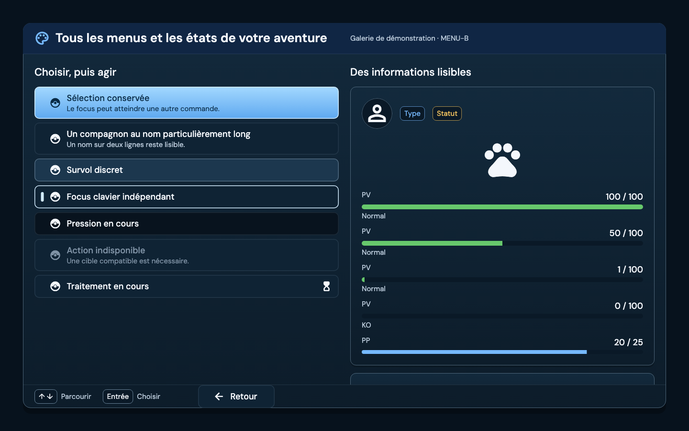
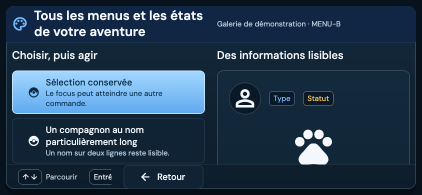
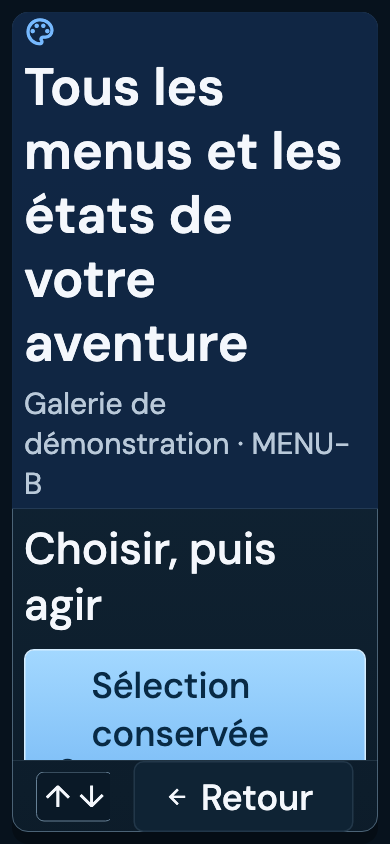

# MENU-B — Primitives et thème du Player

Ticket : POST-UI-MENU-002. Domaine : Systèmes transverses, Post Bêta, hors gate bêta. Date : 2026-09-06. Base : `main`, `150d99b6af71a951998a2b0a698a48b0b029503a`.

## Résultat et périmètre

Le lot ajoute un thème de menu bleu nuit et des primitives réutilisables dans `map_player_ui`, avec une galerie intégrée à la galerie existante de l’éditeur. L’utilisation est explicite : les jeux et les surfaces existants ne sont pas automatiquement réhabillés. Aucun import de miniatures, preset persisté, nouvelle navigation ou règle métier n’est ajouté.

Statut de la livraison initiale : **TO REVIEW**, readiness **Prêt réel**, verdict technique **PASS sur MENU-B** après corrections et preuves fraîches. Aucun commit effectué lors de cette livraison. La validation conditionnelle puis le commit demandés ensuite par Yoahn sont traités dans la section de clôture ci-dessous.

## Audit initial et décisions

Sources consultées : ticket 002 et critères communs 000, spécification intégrale du dossier `/Users/karim/Downloads/menu`, référence visuelle fournie, rapport MENU-A, `AGENTS.md`, `codex_rule.md`, index des skills et roadmap mécanique. L’audit a précédé les modifications.

Le Player possède déjà ses tokens, primitives, thèmes sémantiques, palettes par surface et typographie auteur. La preview auteur réutilise les vraies surfaces Player ; la galerie du design system possède déjà son point d’entrée. Nous réemployons ces mécanismes, sans dépendance des primitives Player vers le design system éditeur.

Le thème distingue une personnalisation sémantique explicitement fournie par l’auteur du thème générique par défaut. Une extension en mémoire conserve cette provenance ; aucun modèle de projet ou format sérialisé ne change. Priorité : accessibilité utilisateur, palette explicite du rôle, thème/typographie explicites du jeu, preset menu, valeurs sûres. La résolution se fait depuis le contexte consommateur pour respecter un thème modifié sous le scope. Une personnalisation des seules métriques conserve la police locale de secours.

FG-160 à FG-165 restent les repères de la roadmap pour les menus. Ce lot de primitives ne recertifie pas leurs parcours et ne modifie aucun statut FG. Les imports, presets, miniatures, écrans finaux et certification du Player installé restent dans leurs lots propriétaires.

## Comportements livrés

- Palette nuit centralisée, DM Sans locale, chiffres tabulaires, espaces et rayons partagés ; priorité de la personnalisation auteur testée.
- Cadre avec header, corps défilant et footer bornés ; adaptation aux marges sûres et au texte agrandi. Le bouton Retour reste fixe et conserve une cible d’au moins 48 px. Le footer accessible de 48 px prime sur la cote compacte théorique de 44 px.
- Panneaux, ligne sélectionnable, focus distinct de la sélection, états survol/pression/indisponible/occupé ; raison lisible et identifiant sémantique stable. Les actions indisponibles ou occupées ne sont pas exécutées.
- Portrait 64 px en containment, fond et bordure nuit, cercle optionnel pour la miniature ; illustration de démonstration non masquée. Jauges PV/PP avec valeurs brutes conservées et bornage graphique uniquement ; badges et retours vide/erreur/reçu.
- Flou limité au fond, texte hors du filtre ; variante opaque sans flou ni halo, mêmes commandes. Contraste renforcé et réduction des mouvements appliqués au thème.
- Transitions ouverture/fermeture/détail et durées d’état centralisées, sans boucle décorative. La fermeture retire les interactions ; les détails sortants sont exclus du pointeur, du clavier et des semantics pendant le fondu.
- Galerie interne « Player menus » dans la galerie existante, avec contrôles opaque/contraste/mouvements/texte/fond. Elle n’est exposée que par le barrel de preview, pas par le barrel produit.

## Inventaire complet du lot et zones modifiées

Les chemins suivants sont relatifs à la racine du dépôt. Les sources et le diff Git constituent la preuve technique ; aucune copie intégrale des fichiers n’est ajoutée au rapport.

| Fichier | Zone et changement |
| --- | --- |
| `packages/map_player_ui/lib/map_player_ui.dart` | Deux exports publics : thème et primitives de menu. |
| `packages/map_player_ui/lib/personalization_preview.dart` | Export de la galerie réservé à la preview. |
| `packages/map_player_ui/lib/src/theme/pokemap_player_theme.dart` | `PokeMapPlayerAuthoredSemanticTheme`, `withSemanticTheme`, `withSurfacePalette` : provenance du thème auteur sans persistance. |
| `packages/map_player_ui/lib/src/theme/pokemap_player_menu_theme.dart` | Nouveau : tokens, résolution des priorités, styles, contraste, mouvement, scope et extension de contexte. |
| `packages/map_player_ui/lib/src/foundation/player_menu_components.dart` | Nouveau : panneaux, cadre, header/footer, lignes, portrait, jauges, badges, feedback et transitions. |
| `packages/map_player_ui/lib/src/player/player_menu_primitives_gallery.dart` | Nouveau : scène locale de démonstration, paramètres d’accessibilité, états et sélection sans écriture projet. |
| `packages/map_player_ui/test/menu_theme_test.dart` | Nouveau : priorité auteur, scope réactif, typographie, contraste et réduction des mouvements. |
| `packages/map_player_ui/test/menu_components_test.dart` | Nouveau : états, identifiants, focus, valeurs, disposition, transitions et contraste pendant animation. |
| `packages/map_player_ui/test/player/player_menu_primitives_gallery_test.dart` | Nouveau : 18 combinaisons taille/texte, insets, interactions locales, six captures initiales et une capture après défilement. |
| `packages/map_editor/lib/src/ui/design_system/gallery/pokemap_design_system_gallery.dart` | Mode `playerMenus`, contrôles DS et branche de rendu dédiée ; anciens modes conservés. |
| `packages/map_editor/test/ui/design_system/pokemap_design_system_gallery_test.dart` | Test d’ouverture du mode, contrôles, présence de Retour et retour au mode Dark existant. |
| `packages/map_player_ui/test/player/goldens/menu_primitives/night_1440x900.png` | Nouveau : rendu nuit de référence des primitives. |
| `packages/map_player_ui/test/player/goldens/menu_primitives/opaque_light_1440x900.png` | Nouveau : mode opaque sur fond clair. |
| `packages/map_player_ui/test/player/goldens/menu_primitives/contrast_1440x900.png` | Nouveau : contraste renforcé sur fond contrasté. |
| `packages/map_player_ui/test/player/goldens/menu_primitives/landscape_844x390.png` | Nouveau : paysage compact et mouvements réduits. |
| `packages/map_player_ui/test/player/goldens/menu_primitives/portrait_text2_390x844.png` | Nouveau : portrait, texte ×2. |
| `packages/map_player_ui/test/player/goldens/menu_primitives/compact_text15_800x600.png` | Nouveau : format compact, texte ×1,5. |
| `packages/map_player_ui/test/player/goldens/menu_primitives/feedback_1440x900.png` | Nouveau : vide, erreur et reçu après défilement. |
| `documentation/reports/player/menus/post_ui_menu_002_design_system.md` | Nouveau : présent audit, inventaire, résultats et limites. |

Soit 19 fichiers : cinq fichiers suivis modifiés, six nouveaux fichiers Dart, sept PNG et un rapport. Le diff des cinq fichiers existants comporte 139 insertions et 4 suppressions. Les fichiers créés ne sont pas compris dans `git diff --stat` tant qu’ils ne sont pas suivis.

## Vérification et corrections

Les premiers tests ont révélé un Retour débordant en 844 × 390 avec texte ×2 : les hints sont désormais défilants à côté du Retour fixe. La lecture des captures a ensuite révélé un titre tronqué en portrait ×2 : budget du header et marges sûres corrigés, assertions de géométrie ajoutées. Les tests chargent DM Sans et Material Icons depuis les assets et le SDK locaux ; aucune police réseau ou police système variable.

La revue de spécification a fait corriger la priorité du thème auteur, le branchement des durées, la variante opaque, la pression assombrie, le cadre des portraits et le blocage clavier à la fermeture. La revue qualité a relevé deux P2 : ancien détail actif durant le fondu et perte de contraste avec certaines sélections auteur grises. L’ombrage est désormais borné au seuil 4,5:1 en gardant le texte stable ; le test inspecte les couleurs peintes sur 13 étapes de l’animation. La protection des détails sortants fait l’objet d’un test pointeur/clavier/semantics.

Historique des runs : première galerie 25 réussites/1 échec, puis 26/26 après correction du footer. Suite combinée suivante 55 réussites/1 échec lié au titre testé avec la police de test Ahem ; chargement DM Sans corrigé. Une suite a ensuite donné 57 réussites/1 échec dans le nouveau test du focus sortant. Le wrapper était créé déjà exclu avant le rattachement du FocusNode : Flutter ne déclenchait pas son retrait. Le wrapper reste désormais identique et garde sa clé entre les états actif et sortant ; la transition `excluding: false → true` retire immédiatement le focus. L’assertion immédiate est conservée, avec pointeur/Entrée/Espace avant l’avancement de 1 ms. Test isolé : 1/1 passé. Rejeu complet final : **58/58 passés**, sans régénération de goldens. Les échecs précédents ne sont pas présentés comme des runs verts.

Commandes package `packages/map_player_ui` :

```bash
flutter test --no-pub --reporter expanded --update-goldens test/menu_theme_test.dart test/menu_components_test.dart test/pokemap_player_theme_test.dart test/player/player_menu_primitives_gallery_test.dart
flutter test --no-pub --reporter expanded test/menu_theme_test.dart test/menu_components_test.dart test/pokemap_player_theme_test.dart test/player/player_menu_primitives_gallery_test.dart
flutter test --no-pub --reporter expanded test/pokemap_player_theme_test.dart test/pokemap_player_window_theme_test.dart test/player/player_shared_surface_contract_test.dart test/player/player_personalization_surface_golden_test.dart test/player/runtime_player_pause_shell_test.dart test/player/runtime_player_presentation_test.dart
flutter analyze --no-pub
```

La première commande génère seulement les nouvelles références de galerie. Le rejeu final sans `--update-goldens` termine **`00:03 +58: All tests passed!`**, exit 0. La suite de régression existante termine **`00:03 +71: All tests passed!`**, exit 0, sans modification de ses goldens. Analyse complète après le dernier correctif : **`No issues found! (ran in 7.1s)`**, exit 0. Les trois fichiers de tests propres à MENU-B représentent 51 cas ; les sept autres du run ciblé sont les tests existants du thème.

Commandes package `packages/map_editor` :

```bash
flutter test --no-pub --reporter expanded test/ui/design_system/pokemap_design_system_gallery_test.dart test/personalization/personalization_runtime_preview_test.dart test/personalization/personalization_player_surface_adapter_test.dart
flutter analyze --no-pub lib/src/ui/design_system/gallery/pokemap_design_system_gallery.dart test/ui/design_system/pokemap_design_system_gallery_test.dart
```

Résultats : `00:04 +29: All tests passed!`, exit 0 ; `No issues found! (ran in 5.1s)`, exit 0. Les harnesses Flutter ont été réapés après les runs, sans interrompre une suite concurrente.

## Captures examinées

Les sept PNG listés ont été ouverts et examinés. Ils montrent les primitives effectivement rendues par Flutter, avec assets et polices locaux. Les formats testés sont 390 × 844, 844 × 390, 800 × 600, 1280 × 720, 1440 × 900 et 1920 × 1080, chacun aux échelles de texte 1/1,5/2. Un test supplémentaire couvre les marges sûres en portrait ×2.







Ces baselines sont proposées pour revue. Ce sont des preuves de galerie, pas une validation artistique par Yoahn ni une preuve des nouveaux écrans dans un Player installé. La scène emploie volontairement des icônes locales de démonstration ; elle ne prétend pas importer les miniatures Pokémon.

## Parité authoring et MCP

Nouveaux contrats API, JSONL et MCP : N/A, car ce lot ajoute des widgets non persistés et un mode de galerie interne. Aucun changement de données, commande métier, export ou import. La preview éditeur est testée avec les mêmes primitives publiques. Le skill `using-pokemap-mcp` a été appliqué à cette décision.

Garde fraîche depuis `tools/pokemap_mcp` : `npm run check` et `npm run build`, exit 0 ; `node --import tsx --test test/live_menu_contracts.test.ts`, 1 test passé, 0 échec, exit 0, environ 9,9 s. Depuis `packages/map_authoring` : `dart test test/parity/full_authoring_parity_test.dart`, `00:17 +18: All tests passed!`, exit 0.

La connexion MCP configurée échoue encore à `pokemap_describe` avec `worker.exited`, code 78, sur une ancienne racine locale inexistante `pokemon_sdk_showcase_v2`. Le serveur packagé est donc vérifié séparément avec la fixture et la racine étroite du test existant. Aucune configuration de sécurité n’a été élargie.

`dart run tool/pmcp085_conformance.dart` termine exit 1 : catalogue complet, 83 ressources, 341 actions, 0 cellule manquante/bloquée ; `transportCertificationComplete=false` et `itemTransportCertificationComplete=false`, receipts Items absents de cette exécution. Ce contrôle global n’est pas déclaré vert. Logs temporaires : `/tmp/menu-b002-mcp-guard.log` et `/tmp/menu-b002-pmcp085-conformance.json`.

## Passes et contre-revues

| Passe | Verdict |
| --- | --- |
| Audit / Architecture, agent `menu_b_audit` | Favorable : primitives opt-in et réemploi de la galerie ; priorité auteur et résolution réactive à préserver. |
| Implémentation, agent `menu_b_primitives` | Sources et tests livrés, analyse ciblée sans problème ; corrections issues des revues intégrées. |
| Spécification, agent `menu_b_spec_review` | PASS source après corrections ; preuves d’exécution laissées au parent. |
| Qualité, agent `menu_b_quality_review` | PASS ciblé après les deux P2 et la correction du wrapper de focus révélée par l’exécution ; aucun autre finding. |
| Tests et rendu, passe parent | 58 tests ciblés, 71 régressions Player et 29 tests éditeur réussis ; sept captures examinées et rejouées sans régénération. |
| Build / parité, agent `menu_a_mcp_validation` réutilisé | Check/build MCP, test live et 18 tests authoring réussis ; limites de connexion et certification globale explicites. |

## État Git et limites

État initial : `main`, HEAD `150d99b6af71a951998a2b0a698a48b0b029503a`, index vide, 15 fichiers suivis modifiés hors lot et 16 non suivis hors lot. Deux autres fichiers runtime, puis deux fichiers du host, ont été modifiés concurremment pendant le lot. Ils sont préservés.

Fichiers suivis hors lot : les deux services Hub `hub_in_process_session_factory.dart` et `hub_runtime_startup_bootstrap.dart` ; `examples/playable_runtime_host/lib/main.dart`, `pubspec.yaml` et `pubspec.lock` ; `map_core` `scene_execution_capabilities.dart` et `scene_execution_profile_test.dart` ; `map_editor` `scenes_workspace.dart` et `scenes_workspace_shell_test.dart` ; `map_runtime` `playable_map_game.dart`, `playable_map_game_session_runtime.dart`, `playable_map_game_event_v2_boot_integration_test.dart`, puis `runtime_player_coordinator.dart` et `runtime_player_pre_session_flow_test.dart` ; `tools/pokemap_mcp/src/config.ts`, `src/index.ts` et `test/config.test.ts`. Les non-suivis hors lot sont `examples/playable_runtime_host/dev/marionette_main.dart` et quinze caches Python sous le plugin reference-builder.

Au dernier relevé, deux fichiers concurrents supplémentaires sont apparus : `examples/playable_runtime_host/lib/src/runtime_launch_save.dart` et `examples/playable_runtime_host/test/runtime_launch_save_test.dart`.

État final relevé après la dernière correction : même branche et HEAD, index vide, **24 fichiers suivis modifiés** (5 du lot, 19 hors lot) et **30 non suivis** (14 du lot, 16 hors lot). `git diff --check` termine exit 0. Aucune opération Git d’écriture n’a été exécutée. La compilation des widgets est prouvée par les tests, pas par un build de distribution installé.

`bash tools/scripts/check_markdown_hygiene.sh` termine **exit 1** : `Markdown hygiene: 1 new Markdown files exceed the default limit of 0.` Le seul document neuf est ce rapport demandé par le ticket, dans son emplacement canonique. Aucun override de budget n’a été appliqué. Il s’agit d’une limite du garde documentaire à budget zéro, conservée comme telle ; ce contrôle n’est pas annoncé vert.

Autocritique : à texte ×2 et en petit format, le header prend naturellement davantage de place ; le corps défile et Retour reste accessible. La validation finale des compositions métier et des vraies illustrations appartient aux lots suivants. Les contrôles du Player existant restent testés séparément du nouveau thème. Aucun changement de roadmap, de scope bêta ou de statut d’un autre ticket n’est inclus.

## Clôture conditionnelle demandée par Yoahn

La demande suivante autorise explicitement la validation de MENU-B uniquement s’il satisfait ses critères, les corrections nécessaires et un commit local. Elle n’autorise ni push, ni rebase, ni lancement de MENU-C.

Audit initial de cette clôture : même HEAD `150d99b6af71a951998a2b0a698a48b0b029503a`, branche `main`, index vide, 24 fichiers suivis modifiés et 30 non suivis. L’allowlist reste limitée aux 19 fichiers du tableau ; les 19 fichiers suivis et 16 non suivis concurrents restent exclus.

La nouvelle revue indépendante `menu_b_closure_review` a trouvé un P2 supplémentaire : lors de `selected: false → true → false`, le texte basculait immédiatement tandis que le fond interpolait encore pendant 140 ms. À la désélection, le contraste initial blanc sur bleu était de 1,41:1 à 2,35:1. Le passage entre couleur et gradient nullable provoquait aussi une transparence transitoire en mode opaque. Les tests précédents couvraient les états stables et l’ombrage hover/pressed, pas ce changement de sélection.

Correction ciblée : le fond et les couleurs du label, du sous-titre et du repère de focus sont résolus ensemble à partir de la décoration animée. Les fonds des lignes utilisent deux stops opaques, composés depuis les tokens panel/base ; leur opacité ne varie plus pendant la transition. Si aucun texte n’atteint 4,5:1 contre les deux stops intermédiaires, le gradient est brièvement ramené à leur couleur moyenne. Les couleurs de sélection finales, la durée de 140 ms, les dimensions et les commandes restent conservées. Une régression inspecte les deux sens sur 29 étapes chacun, pour le preset et deux couleurs auteur, avec et sans mode opaque.

Un premier run global de clôture a été interrompu avec exit 137 et erreurs de teardown ; il n’est pas compté comme preuve. La cause exacte de l’arrêt externe n’est pas établie. Après correction, le run suivant a donné 116 réussites et sept différences de goldens attendues : les fonds de lignes désormais composés modifient les captures. Seules les sept baselines MENU-B ont été actualisées, puis ouvertes et examinées. Le rejeu final ci-dessous n’utilise pas `--update-goldens`.

### Critères et verdict final

| Critère signé du ticket | Preuve et verdict |
| --- | --- |
| Tokens et variantes uniques | Palette, typographie, composition et mouvement centralisés dans le thème ; primitives publiques opt-in, sans couleur locale ajoutée à une feature. PASS. |
| Sélection lumineuse, focus distinct | Sept captures examinées ; halo limité à la sélection, focus séparé, contraste du label/sous-titre/repère vérifié sur toute la transition. PASS. |
| Texte net, mode opaque, mêmes commandes | Un seul filtre de fond, primitives hors du flou, stops opaques pendant l’animation ; cibles, géométrie et activation testées. PASS. |
| PV/PP alignés et stables | Styles numériques tabulaires, valeurs brutes conservées et bornage graphique ; jauges 0/1/50/100 et PP contrôlés dans les tests et captures. PASS. |
| Galerie, semantics, analyse, captures réelles | Galerie existante réemployée, six formats et trois échelles de texte, insets, clavier/pointeur/semantics, sept captures locales et rejeu final. PASS. |

La contre-revue `menu_b_closure_review` donne **PASS source après correction du P2**. L’agent d’implémentation a vérifié le nouveau cas ciblé (1/1) et le parent a rejoué les suites finales et examiné les sept rendus modifiés. Aucun autre défaut bloquant n’est identifié sur MENU-B.

**MENU-B est validé sur l’autorisation conditionnelle explicite de Yoahn.** Le ticket passe à DONE avec readiness Terminé après enregistrement du commit local. Cette validation porte sur les primitives et leur galerie ; elle ne certifie pas les compositions métier ni le Player installé des lots suivants.

### Commandes et résultats frais de clôture

Depuis `packages/map_player_ui` :

```bash
flutter test --no-pub --reporter expanded test/menu_theme_test.dart test/menu_components_test.dart test/pokemap_player_theme_test.dart test/pokemap_player_window_theme_test.dart test/player/player_menu_primitives_gallery_test.dart test/player/player_shared_surface_contract_test.dart test/player/player_personalization_surface_golden_test.dart test/player/runtime_player_pause_shell_test.dart test/player/runtime_player_presentation_test.dart
flutter analyze --no-pub
```

Résultats : **`00:06 +123: All tests passed!`**, exit 0 ; **`No issues found! (ran in 13.2s)`**, exit 0. La génération bornée préalable utilisait `flutter test --no-pub --reporter expanded --update-goldens test/player/player_menu_primitives_gallery_test.dart` : **27/27**, exit 0. Les goldens des surfaces Player existantes n’ont pas changé.

Depuis `packages/map_editor`, les deux commandes galerie/preview et analyse listées plus haut ont été rejouées : **`00:06 +29: All tests passed!`**, exit 0 ; **`No issues found! (ran in 5.5s)`**, exit 0. Soit **152 tests Player/éditeur réussis** dans la validation finale, après le correctif.

Depuis `tools/pokemap_mcp` : `npm run check`, `npm run build` et `node --import tsx --test test/live_menu_contracts.test.ts` terminent exit 0 ; test live **1/1**, 11 327,797 ms. Depuis `packages/map_authoring` : `dart test test/parity/full_authoring_parity_test.dart` termine **`00:17 +18: All tests passed!`**, exit 0. La connexion configurée `pokemap_describe` échoue encore avec `worker.exited`, code 78. La certification globale PMCP/Items décrite plus haut n’est pas revendiquée ; aucun nouveau contrat authoring n’est nécessaire pour la correction UI.

`dart format --output=none --set-exit-if-changed` sur les neuf fichiers Dart `map_player_ui` de l’allowlist : **`Formatted 9 files (0 changed) in 0.04 seconds.`**, exit 0. L’essai sur les onze fichiers du lot termine exit 1 pour les deux fichiers de galerie éditeur ; leurs versions HEAD présentent déjà des écarts avec le formatter courant, vérifiés séparément par `git show HEAD:<path>` et le formatter sur stdin. Le style existant a été conservé pour éviter un reformatage des zones hors lot. Ce contrôle global de format n’est pas annoncé vert.

Les harnesses Flutter ont été réapés après chaque run. `git diff --check` est vert. Le garde Markdown précommit reste exit 1 pour ce seul rapport neuf et le budget par défaut de zéro, sans override.

### Livraison Git et autocritique

Précommit : même branche et HEAD, index initialement vide, 24 fichiers suivis modifiés et 30 non suivis. L’allowlist exacte comporte les 19 fichiers de ce rapport ; les empreintes des 18 fichiers code/tests/PNG sont relevées après les tests et vérifiées avant staging. Le rapport conserve les preuves sans ajouter un second document. Le SHA du commit est enregistré dans Notion et dans le message de livraison ; il n’est pas inclus dans son propre contenu.

Les modifications Hub/cinéma, host/Marionette/sauvegardes, scènes auteur et configuration MCP restent hors commit, ainsi que les quinze caches Python. Aucun push ni rebase. La validation du lot ne masque pas les limites de connexion MCP, de certification Items globale ou de formatage historique de la galerie. Le prochain lot reste MENU-C, uniquement sur demande.
