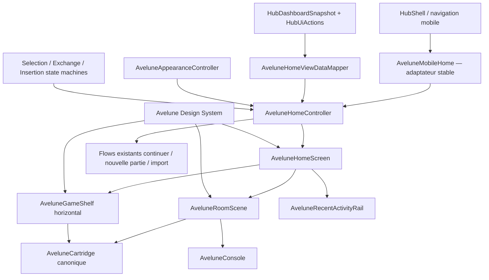
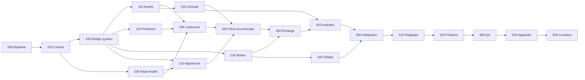

# Avelune Console Experience V1 Implementation Plan

> **For agentic workers:** REQUIRED SUB-SKILL: Use superpowers:subagent-driven-development (recommended) or superpowers:executing-plans to implement this plan task-by-task. Steps use checkbox (`- [ ]`) syntax for tracking.

**Goal:** Transformer le prototype Avelune validé le 5 août 2026 en une expérience Flutter mobile de production, skeuomorphique, fluide, non scrollable verticalement sur l’accueil portrait, alimentée par les vraies données et dotée d’un design system strictement réservé à Avelune.

**Architecture:** Conserver `apps/pokemap_hub` comme composition root, ses contrôleurs, sa bibliothèque, ses sauvegardes et ses flows d’import/lancement. Reconstruire la couche de présentation Avelune autour d’un design system local, de read models immuables, d’objets visuels composés par couches et de machines à états explicites pour l’échange, l’insertion et la transition vers les détails. `AveluneMobileHome` reste l’adaptateur public jusqu’au cutover final.

**Tech Stack:** Flutter/Dart, `ChangeNotifier` et `ValueListenable` déjà employés par le Hub, `CustomPainter` localisé, assets WebP multi-résolution, `file_picker`, `image`, stockage JSON atomique sous l’application-support root, tests Flutter widget/golden/integration, API d’auteur canonique `map_core`/`map_authoring`, JSONL/CLI et PokeMap MCP.

---

## 1. Statut, source de vérité et mode d’emploi

- Statut du document : roadmap maître prête à être exécutée lot par lot.
- Date de rédaction : 5 août 2026.
- Application concernée : `apps/pokemap_hub`.
- Référence produit approuvée : prototype Avelune V3 actuellement servi sur `http://127.0.0.1:4173/`.
- Référence historique : `documentation/reports/avelune/avelune_ui_01_mobile_console_home_experience.md`.
- Décision produit : le prototype approuvé remplace les versions Flutter V0.1 à V0.3 comme cible visuelle et UX ; leurs intégrations métier restent à préserver.
- Un lot n’est jamais considéré terminé par la seule présence de code. Il doit franchir ses tests, son Visual Gate et son auto-review.
- Cette roadmap ne doit pas être exécutée comme une réécriture géante. Chaque identifiant `AVELUNE-*` est une unité révisable, testable et livrable séparément.
- Toute opération Git d’écriture reste soumise à une autorisation explicite au moment de l’exécution. Aucun commit ni push n’est inclus dans la rédaction de cette roadmap.

## 2. Résultat produit verrouillé

L’accueil final doit produire la séquence mentale suivante :

```text
J’ouvre Avelune
→ je reconnais immédiatement ma dernière cartouche
→ je touche cette cartouche
→ elle s’aligne puis s’insère avec un clic physique
→ ma sauvegarde ou ma nouvelle partie démarre
```

Le résultat est accepté uniquement si les points suivants sont simultanément vrais :

1. L’écran évoque une vraie console installée sur une commode, pas un launcher ni une collection de cartes Material.
2. Le fond, la commode, la console et les cartouches ont des matières, reflets, ombres de contact et marques d’usure crédibles.
3. Un seul moule de cartouche, au ratio canonique `0.7`, est utilisé pour le héros, l’étagère et l’emplacement d’ajout.
4. La cartouche héro est droite, frontale et verticale ; aucune rotation ni variante horizontale n’existe.
5. L’accueil portrait ne possède pas de défilement vertical.
6. L’étagère défile horizontalement et accepte 0, 1, 3, 10, 100 jeux et davantage sans modifier la taille physique des cartouches.
7. Le toucher du héros remplace le gros bouton Continuer et déclenche l’insertion puis le vrai flow de lancement.
8. Le toucher d’une autre cartouche déclenche un échange naturel, interruptible de manière sûre et sans chevauchement incohérent des connecteurs.
9. L’appui long déclenche une transition Hero depuis la cover ou le fallback vers une page de détails réelle.
10. Les réglages permettent de choisir un fond, une finition de commode dont `Ivoire`, et une image personnelle locale.
11. La couleur de coque vient du `branding.accentColor` existant, avec fallback neutre. Une couleur indépendante n’est pas nécessaire au V1 pour satisfaire le besoin actuel.
12. Les jeux, saves, covers, erreurs, imports et lancements proviennent exclusivement des sources existantes.
13. Accueil et Paramètres restent les deux seules destinations de navigation mobile de premier niveau.
14. Le design system est exclusivement Avelune ; il ne modifie pas le design system de `map_editor`.

## 3. Non-objectifs

Le programme ne doit pas :

- réécrire le routeur global, `HubDashboardController`, `GameLibrary`, le format de sauvegarde ou le runtime Flame ;
- introduire une boutique, Découvrir, Succès, Communauté, compte en ligne, profil social ou analytics ;
- faire d’une capture complète un fond d’interface simulant tous les composants ;
- rendre la console ou les cartouches dépendantes d’un moteur 3D ;
- persister l’image personnelle dans un package de jeu ou la transmettre au réseau ;
- ajouter un second design system générique au monorepo ;
- ajouter un historique multi-save persistant au seul motif de remplir l’UI ;
- modifier `ProjectPresentationProfile` tant que `accentColor` satisfait le contrat de couleur de coque ;
- mélanger les changements Smart Tiles/Tiled déjà présents dans le worktree avec les lots Avelune.

## 4. Audit de départ

### 4.1 Architecture réellement présente

| Question | Réponse vérifiée |
|---|---|
| Application Avelune | `apps/pokemap_hub` |
| Entrée d’accueil mobile | `apps/pokemap_hub/lib/src/ui/avelune/avelune_mobile_home.dart` via `hub_shell.dart` |
| État | `HubDashboardController extends ChangeNotifier` et snapshots immuables |
| Jeux installés | `GameLibrary` / `GameLibraryStore` |
| Sauvegarde reprenable | `HubSaveStore`, projetée en `HubGameActivity` |
| Activité récente | meilleure donnée actuelle : dernière sauvegarde par jeu dans `HubDashboardSnapshot.games` |
| Import | inbox et installer existants sous `apps/pokemap_hub/lib/src/install/` |
| Lancement/reprise | `HubUiActions`, `HubPlayerLaunchIntent` et `InstalledGameLaunchResolver` |
| Couleur de cartouche | `InstalledGameBranding.accentColor`, issu du Hub de personnalisation PokeMap |
| Cover/hero/icon | branding packagé et résolu par le Hub, avec fallback Avelune |
| Navigation | shell existant ; accueil mobile Avelune et paramètres |
| Thème Avelune actuel | `AveluneColors`, extension de thème partielle dans `avelune_theme.dart` |
| Composant canonique | `AveluneCartridge`, ratio `kAveluneCartridgeAspectRatio = 0.7` |
| Console actuelle | `AveluneConsole`, frontale, mais encore trop stylisée par rapport au prototype approuvé |
| Assets actuels | fallback, noyer, grain ABS, usure ABS, laiton brossé |

### 4.2 Dette à traiter

- `avelune_mobile_home.dart` concentre encore trop de responsabilités et des composants privés de mobilier.
- `avelune_theme.dart` ne constitue pas un design system complet : typographie, espace, formes, profondeur, matériaux, motion, breakpoints et états de composants manquent.
- La version Flutter actuelle est scrollable verticalement sur petits écrans ; le prototype approuvé ne l’est pas.
- Le mobilier et la console Flutter ne possèdent pas encore le niveau de réalisme du prototype.
- L’apparence du fond et de la commode n’a pas encore de contrat Flutter ni de stockage local dédié.
- Le Hub ne dépend pas encore de `file_picker` ni de `image`.
- Aucun logo Avelune autonome de production n’est présent ; l’icône iOS sert encore de fallback.
- L’activité récente est une projection de dernière sauvegarde, pas un historique multi-jeux complet.
- Le clic d’insertion repose sur le feedback système ; aucun son propriétaire licencié n’est disponible.
- Les goldens existants couvrent plusieurs états mais valident l’ancienne direction visuelle et le comportement scrollable.

### 4.3 Concurrence dans le worktree

Au démarrage de la rédaction, le worktree contient des changements préexistants Smart Tiles/Tiled ainsi que deux fichiers de compatibilité Avelune non suivis. Ils appartiennent à d’autres lots et sont hors périmètre. L’exécution de la roadmap doit les préserver et ne jamais les nettoyer avec Git.

## 5. Architecture cible



### 5.1 Arborescence cible

```text
apps/pokemap_hub/lib/src/ui/avelune/
├── avelune_mobile_home.dart                 # adaptateur public conservé
├── design_system/
│   ├── avelune_design_system.dart           # barrel Avelune uniquement
│   ├── foundation/
│   │   ├── avelune_color_tokens.dart
│   │   ├── avelune_typography_tokens.dart
│   │   ├── avelune_spacing_tokens.dart
│   │   ├── avelune_shape_tokens.dart
│   │   ├── avelune_depth_tokens.dart
│   │   ├── avelune_material_tokens.dart
│   │   ├── avelune_motion_tokens.dart
│   │   └── avelune_breakpoints.dart
│   ├── theme/
│   │   ├── avelune_theme_data.dart
│   │   └── avelune_theme_extensions.dart
│   └── components/
│       ├── avelune_pressable.dart
│       ├── avelune_inset_panel.dart
│       ├── avelune_icon_control.dart
│       ├── avelune_section_label.dart
│       ├── avelune_bottom_navigation.dart
│       ├── avelune_sheet.dart
│       └── avelune_state_message.dart
├── appearance/
│   ├── avelune_appearance_preferences.dart
│   ├── avelune_appearance_catalog.dart
│   ├── avelune_appearance_store.dart
│   ├── avelune_custom_background_importer.dart
│   ├── avelune_appearance_controller.dart
│   └── avelune_appearance_settings.dart
├── home/
│   ├── avelune_home_screen.dart
│   ├── avelune_home_controller.dart
│   ├── avelune_home_view_data.dart
│   ├── avelune_home_view_data_mapper.dart
│   ├── avelune_home_geometry.dart
│   ├── avelune_header.dart
│   ├── avelune_room_scene.dart
│   ├── avelune_game_shelf.dart
│   ├── avelune_recent_activity_rail.dart
│   └── avelune_home_state_message.dart
├── objects/
│   ├── cartridge/
│   │   ├── avelune_cartridge.dart
│   │   ├── avelune_cartridge_geometry.dart
│   │   └── avelune_cartridge_painter.dart
│   ├── console/
│   │   ├── avelune_console.dart
│   │   ├── avelune_console_geometry.dart
│   │   └── avelune_console_painter.dart
│   └── furniture/
│       ├── avelune_credenza.dart
│       └── avelune_shelf_surface.dart
├── motion/
│   ├── avelune_interaction_state.dart
│   ├── avelune_exchange_controller.dart
│   ├── avelune_insertion_controller.dart
│   └── avelune_feedback.dart
└── details/
    ├── avelune_game_details_screen.dart
    └── avelune_game_details_view_data.dart
```

Les fichiers historiques `avelune_cartridge.dart`, `avelune_console.dart`, `avelune_game_details.dart`, `avelune_navigation.dart` et `avelune_theme.dart` restent des façades temporaires pendant la migration. Ils sont supprimés ou transformés en exports seulement au lot de cutover, après preuve de parité.

## 6. Contrats du design system Avelune

### 6.1 Tokens obligatoires

| Domaine | Contrat minimum |
|---|---|
| Couleurs | canvas, room, glass, surface, inset, outline, text primaire/secondaire, violet Avelune, glow, laiton, états succès/attention/erreur, coque neutre, bois et ivoire |
| Typographie | display, title, section, game title, body, metadata, label, caption ; styles compatibles avec le text scaling |
| Espacement | échelle centralisée `2, 4, 6, 8, 12, 16, 20, 24, 32, 40` |
| Formes | rayons `4, 8, 12, 16, 24`, capsule et contours de focus |
| Profondeur | ombre ambiante, ombre de contact, inset, objet posé, objet flottant, halo sélectionné |
| Matériaux | plastique ABS mat, plastique usé, verre imprimé, connecteurs dorés, bois sombre, peinture ivoire patinée |
| Motion | durées, courbes, amplitudes, politique reduced motion, ordre des phases |
| Breakpoints | classes compact, regular, large et règles de densité verticale |
| États | idle, pressed, selected, disabled, invalid, loading, inserting, launching |

### 6.2 Valeurs motion initiales

Ces valeurs constituent le premier étalonnage à tester sur appareil physique. Toute modification doit être consignée dans le lot concerné avec une capture vidéo avant/après.

| Token | Valeur cible | Usage |
|---|---:|---|
| `press` | 100 ms | compression tactile |
| `selection` | 180 ms | glow et feedback de sélection |
| `exchange` | 440 ms | échange héros/étagère |
| `insertionAlign` | 120 ms | recentrage au-dessus du slot |
| `insertionDescend` | 300 ms | descente principale |
| `insertionLatch` | 120 ms | compression et verrouillage |
| `insertionLaunchDelay` | 80 ms | laisser lire le clic avant le lancement |
| `detailsHero` | 420 ms | cover vers détails |
| `ambientFloat` | 2 800 ms | flottement discret au repos |
| `reducedMotionTransition` | 120 ms maximum | fondu/état sans trajectoire physique |

Courbe physique de référence : `Cubic(0.2, 0.8, 0.2, 1.0)` pour les déplacements, `easeOutCubic` pour les pressions, `easeInCubic` pour la descente. Aucune animation ne doit employer une rotation 3D.

### 6.3 Vocabulaire de feedback

| Événement | Haptique | Son | Règle |
|---|---|---|---|
| Sélection étagère | `selectionClick` | aucun | une fois par changement effectif |
| Début d’insertion | aucun | aucun | pas de bruit prématuré |
| Latch | `mediumImpact` | clic système | exactement au contact du slot |
| Long press reconnu | `lightImpact` | aucun | avant la transition Hero |
| Erreur de lancement | feedback erreur plateforme | aucun | puis message exploitable |

Le V1 conserve le clic système derrière une abstraction `AveluneFeedback`. Un son propriétaire n’entre dans le produit qu’après licence, mixage et validation sur iOS/Android.

## 7. Contrat responsive et absence de scroll portrait

### 7.1 Politique de layout

- La racine de l’accueil portrait est un `Stack`/`Column` dimensionné par `LayoutBuilder`, jamais un `SingleChildScrollView`.
- La bibliothèque est un `ListView.builder` horizontal lazy.
- L’activité récente est un rail compact ; sur petit écran, une seule activité et une action « Voir tout » ouvrent une sheet scrollable.
- Les écrans Paramètres et Détails peuvent défiler verticalement ; cette exception ne concerne pas l’accueil.
- À text scale élevé, l’accueil conserve ses zones et renvoie le détail du texte vers des sheets accessibles au lieu de réduire le texte sous les seuils lisibles.
- Les Safe Areas supérieure et inférieure font partie de la hauteur disponible avant résolution de la géométrie.

### 7.2 Matrice de densité

| Viewport de test | Classe | Bibliothèque visible au repos | Activité sur l’accueil | Attendu |
|---|---|---|---|---|
| 320 × 568 | compact | 3 cartouches complètes + amorce | 1 ligne | aucun overflow, aucun scroll vertical |
| 375 × 667 | compact tall | au moins 3 complètes + amorce | 1 ligne | console et slot entièrement visibles |
| 390 × 844 | regular | au moins 4 emplacements | 2 lignes maximum | composition de référence principale |
| 430 × 932 | large | 4 emplacements + amorce | 3 lignes maximum | respiration accrue sans agrandir le moule de l’étagère |
| 360 × 800 | Android regular | au moins 3 complètes + amorce | 2 lignes maximum | gesture inset respecté |
| 427 × 952 | Android large | 4 emplacements + amorce | 3 lignes maximum | parité visuelle iOS/Android |

### 7.3 Géométrie des cartouches

- Ratio unique : `kAveluneCartridgeAspectRatio = 0.7`.
- Hauteur étagère : résolue par `AveluneHomeGeometry`, identique pour tous les items du viewport.
- Largeur : `height × 0.7`, jamais calculée depuis le titre ou la cover.
- Héros : même widget et même structure interne, taille supérieure pilotée par le parent.
- Ajouter un jeu : même widget, même ratio, mêmes connecteurs et mêmes contraintes.
- Sélection : glow, ombre et translation maximale de 4 dp ; aucune variation de largeur ou hauteur.

## 8. Catalogue d’apparence V1

### 8.1 Identifiants stables

| Type | Identifiants | Défaut |
|---|---|---|
| Fond | `amber`, `dawn`, `linen`, `violet`, `slate`, `custom` | `amber` |
| Commode | `walnut`, `ivory`, `oak`, `ash`, `mahogany`, `ebony` | `walnut` |

Les labels français sont respectivement : Ambre, Aube, Lin, Crépuscule, Ardoise, Mon image ; Noyer, Ivoire, Chêne clair, Frêne, Acajou, Ébène.

### 8.2 Stockage local

Le stockage Avelune est distinct des préférences de fenêtre desktop et des préférences de gameplay :

```text
<application-support>/avelune/appearance/preferences.json
<application-support>/avelune/appearance/preferences.backup.json
<application-support>/avelune/appearance/custom-background.jpg
<application-support>/avelune/appearance/custom-background.thumbnail.jpg
```

Schéma JSON V1 :

```json
{
  "schemaVersion": 1,
  "backgroundId": "amber",
  "furnitureId": "walnut"
}
```

Le fichier personnalisé porte un nom fixe et n’enregistre jamais de chemin absolu. `backgroundId: "custom"` n’est valide que si l’image décodée existe ; sinon le contrôleur revient à `amber` et affiche une information non bloquante.

### 8.3 Contrat d’import d’image

- Formats acceptés : JPEG, PNG, WebP.
- Taille d’entrée maximale : 12 Mo.
- Décodage obligatoire avant écriture ; l’extension seule ne fait pas foi.
- Plus grand côté après traitement : 1 800 px maximum.
- Sortie locale : JPEG qualité 84 sur fond `#171218`, orientation EXIF corrigée.
- Traitement hors du thread UI via `compute` ou isolate.
- Écriture atomique par fichier temporaire, validation du résultat, renommage, puis miniature.
- Refus des liens symboliques et des racines non sûres selon les patterns des stores existants.
- Remplacement récupérable : l’ancien fichier n’est supprimé qu’après validation du nouveau.
- Suppression explicite : retire image et miniature puis revient à `amber`.
- Aucune permission réseau, synchronisation cloud ou incorporation au package de jeu.

## 9. Plan de livraison synthétique

Les estimations sont des enveloppes de travail net pour un développeur, hors attente de validation artistique. Elles servent à découper le risque, pas à promettre une date.

| Ordre | Lot | Résultat | Dépend de | Taille |
|---:|---|---|---|---|
| 0 | `AVELUNE-000` | baseline et prototype figés | — | S |
| 1 | `AVELUNE-010` | contrat UX et géométrie exécutable | 000 | S |
| 2 | `AVELUNE-100` | fondations du design system | 010 | M |
| 3 | `AVELUNE-110` | catalogue de matières et assets | 100 | L |
| 4 | `AVELUNE-120` | primitives Avelune | 100 | M |
| 5 | `AVELUNE-130` | motion, haptique et feedback | 100 | M |
| 6 | `AVELUNE-200` | read model et contrôleur d’accueil | 010 | M |
| 7 | `AVELUNE-210` | préférences d’apparence locales | 100, 200 | M |
| 8 | `AVELUNE-220` | preuve de couleur de coque PokeMap | 200 | S |
| 9 | `AVELUNE-300` | cartouche canonique réaliste | 110, 120, 200 | L |
| 10 | `AVELUNE-310` | console frontale réaliste | 110, 120 | L |
| 11 | `AVELUNE-320` | pièce, commode et étagère horizontale | 110, 210, 300, 310 | L |
| 12 | `AVELUNE-400` | échange de cartouches | 130, 300, 320 | M |
| 13 | `AVELUNE-410` | insertion et lancement | 130, 300, 310, 400 | L |
| 14 | `AVELUNE-420` | appui long et détails Hero | 130, 200, 300 | M |
| 15 | `AVELUNE-500` | intégration de l’accueil et des états | 210, 320, 400, 410, 420 | L |
| 16 | `AVELUNE-510` | paramètres d’apparence | 120, 210, 500 | M |
| 17 | `AVELUNE-520` | activité, navigation et accessibilité finale | 500, 510 | M |
| 18 | `AVELUNE-600` | matrice automatisée et Visual Gate | 520 | L |
| 19 | `AVELUNE-610` | appareils physiques et performance | 600 | M |
| 20 | `AVELUNE-620` | cutover, nettoyage et livraison | 610 | M |

Enveloppe globale indicative : 30 à 44 jours de travail net, dont 8 à 12 jours de production/itération d’assets et 4 à 6 jours de validation multi-appareils. Les lots `100`, `200` et la production artistique de `110` peuvent se chevaucher après validation de `010`, mais le cutover reste strictement séquentiel.

## 10. Chemin critique



## 11. Lots détaillés

### AVELUNE-000 — Baseline propre et gel du prototype

**Objectif :** distinguer l’état du dépôt des changements concurrents et rendre la référence approuvée durable avant tout nouveau code Flutter.

**Fichiers/artefacts :**

- `documentation/reports/roadmap/avelune/avelune_console_experience_v1_roadmap.md`
- screenshots figés sous `documentation/avelune/reference/console_v1/`
- frames de motion sous `documentation/avelune/reference/console_v1/motion/`
- manifeste de référence et provenance sous `documentation/avelune/reference/console_v1/reference_manifest.json`

**Tâches :**

- [x] Rejouer Gate 0 depuis la racine et conserver les sorties exactes.
- [x] Classer chaque changement présent en `préexistant`, `Avelune` ou `inconnu` ; stopper si un fichier Avelune est modifié par un autre lot.
- [x] Sur un état de référence non mélangé, exécuter les tests Avelune existants et noter les rouges préexistants.
- [x] Capturer les deux presets natifs du prototype et figer les baselines Flutter 320×568, 390×844 et 430×932 sans fabriquer de faux viewport prototype.
- [x] Capturer les séquences insertion, échange, appui long et réglages en série de frames.
- [x] Capturer les états sans jeu, sans sauvegarde et plusieurs jeux comme baselines fonctionnelles, puis les apparences approuvées comme cibles visuelles.
- [x] Copier uniquement les assets visuels élémentaires approuvés, jamais une capture complète utilisée comme UI.
- [x] Documenter pour chaque asset la source disponible, la date, le statut de droit, les dimensions, le hash et le rôle ; renvoyer l’outil/licence non prouvé au gate `AVELUNE-110` plutôt que l’inventer.
- [x] Rattacher le pack figé aux validations explicites du prototype données par l’utilisateur le 5 août 2026.

**Validation :**

```bash
cd /Users/karim/Project/pokemonProject/apps/pokemap_hub
flutter test test/ui/avelune_cartridge_test.dart
flutter test test/ui/avelune_mobile_home_test.dart
flutter test test/ui/avelune_mobile_home_golden_test.dart
```

**Sortie du lot :** référence durable approuvée, état initial reproductible, aucune confusion avec le worktree concurrent.

**Exécution du 5 août 2026 :**

- HEAD de départ : `a30d191bc feat(avelune): deepen skeuomorphic console home` sur `main`.
- Worktree concurrent : 44 fichiers suivis modifiés et trois fichiers préexistants non suivis hors de ce lot au moment du Gate 0 ; aucun n’a été nettoyé ni ajouté au lot.
- Pack figé : 9 références visuelles, 2 frames de motion, 6 baselines fonctionnelles, 5 assets élémentaires et un manifeste JSON avec SHA-256.
- Presets natifs du prototype : iPhone 393×852 et Pixel 10 427×952. Les autres tailles sont des cibles Flutter prouvées par `AVELUNE-010`, pas des états natifs du prototype.
- `flutter test test/ui/avelune_cartridge_test.dart` : 4 tests passés.
- `flutter test test/ui/avelune_mobile_home_test.dart` : 13 tests passés ; la baseline confirme encore le comportement verticalement scrollable à remplacer dans une phase ultérieure.
- `flutter test test/ui/avelune_mobile_home_golden_test.dart` : 7 goldens passés.
- Aucun raster de référence n’est déclaré asset de production. Le manifeste impose `AVELUNE-110` avant tout usage dans le bundle Flutter.

### AVELUNE-010 — Contrat UX, états et géométrie

**Objectif :** transformer le prototype en règles mesurables avant de produire les composants.

**Fichiers :**

- `apps/pokemap_hub/lib/src/ui/avelune/home/avelune_home_geometry.dart`
- `apps/pokemap_hub/test/ui/avelune/home/avelune_home_geometry_test.dart`
- mise à jour de cette roadmap pour figer les valeurs approuvées si la calibration les modifie.

**Tâches :**

- [ ] Écrire d’abord les tests des classes compact, regular et large.
- [ ] Définir les zones header, scène, étagère, activité et navigation à partir de la Safe Area disponible.
- [ ] Garantir que la somme des zones ne dépasse jamais la hauteur portrait aux six viewports de référence.
- [ ] Définir la hauteur unique des cartouches d’étagère et la hauteur du héros par classe.
- [ ] Définir les anchors du slot console, du héros, de la tablette et de la trajectoire d’insertion.
- [ ] Définir le mode compact : activité condensée et absence de texte secondaire non essentiel.
- [ ] Définir le mode text scale élevé : labels accessibles et détails dans une sheet, sans rendre l’accueil verticalement scrollable.
- [ ] Ajouter un test qui échoue si un viewport retourne une géométrie négative ou superposée.

**Validation :**

```bash
cd /Users/karim/Project/pokemonProject/apps/pokemap_hub
flutter test test/ui/avelune/home/avelune_home_geometry_test.dart
flutter analyze lib/src/ui/avelune/home/avelune_home_geometry.dart
```

**Sortie du lot :** toutes les dimensions de référence sont résolues sans overflow ; aucune valeur de layout majeure n’est répétée dans les widgets.

### AVELUNE-100 — Fondations du design system exclusivement Avelune

**Objectif :** remplacer `AveluneColors` partiel par un système cohérent sans toucher au design system PokeMap Editor.

**Fichiers :** tous les fichiers `design_system/foundation/` et `design_system/theme/` listés en section 5.1, plus leurs tests sous `apps/pokemap_hub/test/ui/avelune/design_system/`.

**Tâches :**

- [ ] Écrire des tests de présence et de cohérence pour chaque famille de tokens.
- [ ] Déplacer les couleurs existantes vers des noms sémantiques ; conserver une façade de compatibilité dans `avelune_theme.dart`.
- [ ] Créer les tokens typographiques à partir de la police projet/système, sans nouvelle licence.
- [ ] Centraliser spacing, formes, profondeur, matériaux, motion et breakpoints.
- [ ] Créer `AveluneThemeData.standard`, `highContrast` et la résolution via `BuildContext`.
- [ ] Interdire dans les nouveaux widgets Avelune les `Color(0x...)`, `Colors.*`, durées et rayons ad hoc hors fichiers de tokens.
- [ ] Définir des contrastes mesurés pour texte, focus, erreurs et navigation.
- [ ] Définir les tokens reduced motion et high contrast.
- [ ] Exporter uniquement le barrel `avelune_design_system.dart` vers les consommateurs.

**Tests :**

- tokens standard et high contrast complets ;
- `copyWith`/`lerp` des extensions ;
- absence de couleur directe via test statique ciblé ou script `rg` ;
- résolution identique sur iOS et Android.

**Sortie du lot :** aucun nouveau composant Avelune ne dépend de constantes visuelles dispersées.

### AVELUNE-110 — Catalogue de matières et pipeline d’assets

**Objectif :** produire le réalisme validé sous forme de couches réutilisables et performantes.

**Arborescence d’assets cible :**

```text
apps/pokemap_hub/assets/avelune/
├── room/backgrounds/{amber,dawn,linen,violet,slate}.webp
├── room/furniture/credenza_{walnut,ivory,oak,ash,mahogany,ebony}.webp
├── objects/console/{body,slot,wear,contact_shadow}.webp
├── objects/cartridge/{shell,highlight,wear,connectors,label_glass}.webp
├── artwork/fallback_moonlit_path.webp
└── logo/avelune_mark.webp
```

Chaque raster dispose de variantes `2.0x/` et `3.0x/` si la comparaison sur appareil montre une perte visible. Le ratio du moule de cartouche reste défini par le code, pas par les dimensions accidentelles du fichier.

**Tâches :**

- [ ] Écrire le manifeste Dart `AveluneMaterialCatalog` avant de brancher les widgets.
- [ ] Séparer réellement arrière-plan, commode, console et cartouche en couches alpha.
- [ ] Produire une commode ivoire peinte et patinée comme asset distinct, pas comme simple filtre gris.
- [ ] Produire six finitions de commode partageant exactement la même géométrie et les mêmes anchors.
- [ ] Produire cinq fonds sans meuble intégré pour permettre toutes les combinaisons.
- [ ] Produire une console frontale symétrique avec slot, LED et marques d’usure discrètes.
- [ ] Produire un moule de cartouche neutre teintable avec highlights, usure et connecteurs séparés.
- [ ] Produire ou fournir le logo Avelune autonome ; interdire l’extraction depuis la capture.
- [ ] Compresser en WebP et vérifier les alpha, dimensions, poids et absence de bord blanc.
- [ ] Déclarer les dossiers dans `apps/pokemap_hub/pubspec.yaml`.
- [ ] Ajouter un test qui charge chaque asset du catalogue.
- [ ] Comparer les assets seuls sur fond quadrillé puis dans la scène.

**Visual Gate :** montrer noyer, ivoire, console et cartouche à 1×/2×/3× ; refuser le lot si les marques d’usure ressemblent à un bruit uniforme ou si les objets paraissent dessinés à plat.

### AVELUNE-120 — Primitives de composant

**Objectif :** fournir les briques tactiles et les surfaces communes sans transformer Avelune en UI générique.

**Tâches :**

- [ ] Implémenter `AvelunePressable` avec press scale, focus, disabled et reduced motion.
- [ ] Implémenter `AveluneInsetPanel` pour l’activité et les sheets, avec matériaux du thème.
- [ ] Implémenter `AveluneIconControl` avec cible minimale 48 dp.
- [ ] Implémenter `AveluneSectionLabel`, `AveluneStateMessage` et `AveluneSheet`.
- [ ] Migrer la navigation minimale vers `design_system/components/avelune_bottom_navigation.dart`.
- [ ] Ajouter Semantics, focus clavier de test et états selected/disabled/invalid.
- [ ] Ajouter des widget tests pour chaque état et des goldens standard/high contrast.
- [ ] Vérifier que ces primitives ne sont importées ni par `map_editor` ni par les packages runtime.

**Sortie du lot :** toutes les interactions futures utilisent les mêmes règles tactiles, visuelles et accessibles.

### AVELUNE-130 — Motion, feedback et politique reduced motion

**Objectif :** centraliser les comportements physiques avant d’animer les objets.

**Fichiers :** `motion/avelune_interaction_state.dart`, `avelune_exchange_controller.dart`, `avelune_insertion_controller.dart`, `avelune_feedback.dart` et tests unitaires associés.

**Tâches :**

- [ ] Définir les états `idle`, `exchanging`, `aligning`, `descending`, `latched`, `launching`, `openingDetails`, `recovering`, `error`.
- [ ] Interdire les transitions impossibles avec assertions et tests de table.
- [ ] Définir `AveluneFeedback` comme port injectable ; l’implémentation plateforme encapsule haptique et clic système.
- [ ] Déclencher feedback une fois par transition, jamais depuis `build()`.
- [ ] Définir la réduction des animations à partir de `MediaQuery.disableAnimations`.
- [ ] Tester le nettoyage des contrôleurs, l’annulation au `dispose` et l’absence de callback de lancement après démontage.
- [ ] Tester les taps rapides : pendant l’échange, seule la dernière sélection demandée peut être mise en attente ; pendant l’insertion, toute nouvelle sélection est ignorée jusqu’au résultat.

**Sortie du lot :** les widgets restent déclaratifs ; les transitions et effets secondaires sont testables sans rendu.

### AVELUNE-200 — Read model et contrôleur d’accueil

**Objectif :** retirer la logique métier et les scans de données des widgets sans dupliquer les repositories.

**Contrats :**

- `AveluneHomeViewData` : état global, jeux, sélection, activité, import, erreur sûre, préférence reduced motion.
- `AveluneGameViewData` : id, titre, sous-titre, artwork, accent/coque, validité, sauvegarde et action principale.
- `AveluneRecentActivityViewData` : jeu, cover, date relative, type disponible, action réelle.
- `AveluneHomeViewDataMapper` : projection pure de `HubDashboardSnapshot`.
- `AveluneHomeController` : sélection et orchestration UI uniquement ; aucun accès disque direct.

**Tâches :**

- [ ] Écrire les tests du mapper pour 0, 1, 3, 10 jeux, titre long, assets absents, jeu invalide et sauvegarde absente.
- [ ] Définir la sélection initiale : dernier jeu avec sauvegarde, sinon sélection Hub valide, sinon premier jeu, sinon aucune.
- [ ] Définir l’action : `Continuer` si reprenable, `Jouer` sinon, disabled si invalide ou absent.
- [ ] Résoudre artwork : cover, hero, icon, fallback, sans lecture synchrone dans `build()`.
- [ ] Exposer la couleur de coque depuis `branding.accentColor`, puis fallback neutre.
- [ ] Recalculer uniquement quand le snapshot ou la sélection change.
- [ ] Ne pas créer de nouveau repository d’activité ; projeter les données réellement présentes.
- [ ] Injecter `HubUiActions` dans le contrôleur sans contourner les flows existants.

**Sortie du lot :** les vues peuvent être testées avec des données immuables sans instancier le disque ou le runtime.

### AVELUNE-210 — Préférences d’apparence et image personnelle

**Objectif :** rendre fond et commode configurables, persistants et locaux.

**Dépendances à ajouter dans `apps/pokemap_hub/pubspec.yaml` :**

```yaml
file_picker: ^8.0.0
image: ^4.2.0
```

**Tâches :**

- [ ] Écrire les tests du modèle JSON exact décrit en section 8.
- [ ] Implémenter `AveluneAppearanceCatalog` avec les onze presets et identifiants stables.
- [ ] Implémenter `AveluneAppearanceStore` avec current/backup/temp et protections anti-symlink.
- [ ] Implémenter le fallback `amber`/`walnut` sur document absent ou corrompu.
- [ ] Implémenter une abstraction de picker injectable pour les tests.
- [ ] Importer, décoder, réorienter, redimensionner et réencoder hors thread UI.
- [ ] Écrire image et miniature atomiquement ; valider en les redécodant.
- [ ] Implémenter remplacer, supprimer et restaurer après erreur.
- [ ] Exposer `idle`, `loading`, `ready`, `saving`, `error` dans `AveluneAppearanceController`.
- [ ] Brancher le contrôleur dans `HubComposition` à partir du support root existant.
- [ ] Tester fermeture/réouverture, fichier absent, fichier corrompu, mauvais MIME, >12 Mo et échec d’écriture.

**Sortie du lot :** la préférence survit à un redémarrage ; un fichier invalide ne bloque jamais l’accueil.

### AVELUNE-220 — Preuve de couleur de coque issue de PokeMap

**Objectif :** démontrer le contrat existant `accentColor` de bout en bout au lieu d’ajouter un champ persistant inutile.

**Chaîne à prouver :**

```text
ProjectBrandingProfile.accentColor
→ presentation.update
→ export GamePackageBranding.accentColor
→ installation InstalledGameBranding.accentColor
→ AveluneGameViewData.shellColor
→ AveluneCartridge
```

**Tâches :**

- [ ] Ajouter un test `map_core` de validation `#RRGGBB` et `#RRGGBBAA` si la couverture actuelle est insuffisante.
- [ ] Vérifier l’éditeur `project_branding_editor.dart` et conserver le libellé expliquant que la couleur teinte la coque Avelune et l’écran titre.
- [ ] Prouver `presentation.update` via API directe et JSONL/CLI.
- [ ] Prouver l’export et l’installation avec une couleur non violette.
- [ ] Prouver le rendu de cette couleur sur héros et étagère via le même composant.
- [ ] Vérifier `pokemap_describe`, le plan/apply MCP, la relecture et la validation du projet.
- [ ] N’ajouter aucun champ `cartridgeShellColor` au V1.

**Validation :**

```bash
cd /Users/karim/Project/pokemonProject/packages/map_authoring
dart run tool/pmcp085_conformance.dart
dart test test/parity/full_authoring_parity_test.dart
dart test test/domains/assets/presentation_authoring_test.dart
dart analyze

cd /Users/karim/Project/pokemonProject/tools/pokemap_mcp
npm run check
npm test
```

**Sortie du lot :** couleur auteur vérifiée sur transports direct, JSONL/CLI, éditeur, package, Hub et MCP.

### AVELUNE-300 — Cartouche canonique réaliste

**Objectif :** reconstruire le composant signature avec un seul moule, plus réaliste que la version actuelle.

**Tâches :**

- [ ] Écrire les tests de ratio, orientation, structure et contraintes avant le nouveau rendu.
- [ ] Conserver une seule classe `AveluneCartridge` et les tailles `hero`/`shelf` comme paramètres d’affichage.
- [ ] Composer coque teintable, highlight, usure, label, cover et connecteurs à partir des couches du catalogue.
- [ ] Employer la même carte de matière et la même géométrie interne à toutes les tailles.
- [ ] Clip/fit les titres longs sur deux lignes maximum sans modifier le moule.
- [ ] Construire `addGame` avec le même moule et les mêmes connecteurs.
- [ ] Afficher invalidité et sélection par overlays sémantiques sans changer la taille.
- [ ] Ajouter `RepaintBoundary` et `cacheWidth/cacheHeight` adaptés à la taille d’affichage.
- [ ] Exclure les détails d’usure purement décoratifs de l’arbre sémantique.
- [ ] Produire des goldens violet, bleu pétrole, graphite, fallback, titre long, invalide et ajouter.

**Tests critiques :**

- héros et étagère ont le même `runtimeType` de composant canonique ;
- ratio exact égal à `0.7` ;
- aucune `Transform.rotate` ni perspective ;
- `addGame` a les mêmes contraintes shelf ;
- quatre titres différents donnent des tailles strictement identiques.

**Visual Gate :** l’objet doit montrer volume, ombre de contact, micro-usure et connecteurs crédibles sans devenir photoréaliste au point de masquer la cover.

### AVELUNE-310 — Console frontale réaliste

**Objectif :** remplacer la console stylisée par un objet frontal, crédible, marqué par l’usage et parfaitement aligné au slot.

**Tâches :**

- [ ] Écrire des tests de ratio, symétrie, slot et anchors.
- [ ] Composer body, wear, façade, ports, slot, LED et ombre de contact en couches.
- [ ] Conserver une vue strictement frontale sans silhouette Nintendo exacte.
- [ ] Définir la profondeur visuelle du slot et l’occlusion de la cartouche pendant la descente.
- [ ] Relier la LED aux états idle, inserting, latched, launching et error via tokens.
- [ ] Ne rendre interactif aucun port ou bouton décoratif.
- [ ] Isoler le painter et les assets dans un `RepaintBoundary`.
- [ ] Produire goldens idle, insertion 50 %, latched, error et high contrast.

**Visual Gate :** console posée, matière ABS, usure discrète aux arêtes, slot lisible et ombre cohérente avec la commode.

### AVELUNE-320 — Pièce, commode et étagère horizontale

**Objectif :** construire la scène approuvée avec une vraie commode, un fond interchangeable et plus de trois jeux.

**Tâches :**

- [ ] Créer `AveluneRoomScene` avec couches : fond, lumière, commode, console, ombres, héros.
- [ ] Afficher chaque fond indépendamment de chaque finition de commode.
- [ ] Aligner les six commodes sur les mêmes anchors et dimensions.
- [ ] Poser visuellement la console sur le plateau avec une ombre de contact commune.
- [ ] Créer une tablette lisible et des séparateurs qui ne changent pas la largeur des cartouches.
- [ ] Implémenter `AveluneGameShelf` avec `ListView.builder` horizontal lazy et cacheExtent borné.
- [ ] Conserver `addGame` en dernier item, y compris avec 0 jeu.
- [ ] Positionner chaque cartouche sur la tablette ; aucun flottement permanent dans l’étagère.
- [ ] Garder la sélection visible via `Scrollable.ensureVisible` horizontal seulement.
- [ ] Vérifier 0, 1, 3, 10 et 100 jeux.
- [ ] Vérifier l’absence de `Scrollable` vertical dans l’accueil aux six viewports.

**Visual Gate :** comparer noyer et ivoire côte à côte ; la commode doit paraître continue, porter la console et ranger physiquement les jeux.

### AVELUNE-400 — Échange naturel des cartouches

**Objectif :** faire de la sélection d’un autre jeu un échange compréhensible, rapide et fiable.

**Séquence :**

```text
idle
→ shelf tap
→ old hero rises/fades toward its shelf anchor
→ new shelf cartridge rises toward hero anchor
→ selected data swaps at the midpoint occluded
→ new hero settles
→ idle
```

**Tâches :**

- [ ] Écrire les tests d’état avant le rendu.
- [ ] Conserver les deux cartouches dans un overlay dédié pendant l’échange, pas dans deux layouts concurrents.
- [ ] Calculer les anchors depuis `RenderBox.localToGlobal`, sans coordonnées fixes d’iPhone.
- [ ] Masquer les connecteurs au midpoint si les objets se croisent.
- [ ] Mettre à jour les métadonnées au midpoint, jamais avant que le nouvel objet soit identifiable.
- [ ] Ne conserver que la dernière demande lors de taps rapides.
- [ ] Revenir à un fondu de 120 ms en reduced motion.
- [ ] Déclencher un seul `selectionClick` par changement final.
- [ ] Tester 20 échanges successifs et un démontage en cours d’animation.

**Sortie du lot :** aucun doublon, saut de layout, mauvaise cover ni sélection incohérente après taps rapides.

### AVELUNE-410 — Insertion physique et lancement réel

**Objectif :** remplacer définitivement l’action Continuer par la cartouche héro et synchroniser la mise en scène avec le vrai lancement.

**Séquence nominale :**

```text
tap hero
→ valider sélection et action
→ align 120 ms
→ descend 300 ms
→ latch 120 ms
→ mediumImpact + clic
→ attendre 80 ms
→ appeler onContinue ou onNewGame
→ succès : laisser le shell lancer le runtime
→ erreur : remonter en recovering et afficher l’erreur réelle
```

**Tâches :**

- [ ] Tester les transitions pures `idle → ... → launching`.
- [ ] Appeler le flow existant seulement après `latched`.
- [ ] Utiliser `onContinue` si `canContinue`, sinon `onNewGame`.
- [ ] Empêcher l’insertion si jeu invalide, import en cours ou action absente.
- [ ] Occlure progressivement les connecteurs derrière le slot.
- [ ] Synchroniser LED, ombre, compression et feedback sur le latch.
- [ ] En reduced motion, remplacer la trajectoire par état latched/fondu sans délai inutile.
- [ ] Sur erreur, restaurer exactement la sélection et permettre une nouvelle tentative.
- [ ] Ajouter une Semantics action explicite « Continuer [jeu] » ou « Jouer à [jeu] ».
- [ ] Tester double tap, changement de route, erreur, sauvegarde invalide et dispose.

**Visual Gate :** fournir vidéo 60 fps réelle sur iOS et Android ; refuser si la cartouche traverse le slot, accélère brutalement ou déclenche le clic avant contact.

### AVELUNE-420 — Appui long, Hero et détails du jeu

**Objectif :** rendre les détails accessibles par une transition cover-led élégante sans transformer l’accueil en fiche catalogue.

**Tâches :**

- [ ] Construire `AveluneGameDetailsViewData` depuis les données réelles disponibles.
- [ ] Employer le tag stable `avelune-cover:<gameId>` pour le Hero.
- [ ] Reconnaître l’appui long avec le comportement plateforme standard et un feedback léger.
- [ ] Animer cover/fallback vers la zone haute de la page en 420 ms.
- [ ] Afficher titre, auteur, version, état, dernière partie et description seulement s’ils existent.
- [ ] Ne pas inventer notes, succès, popularité, prix ou données sociales.
- [ ] Fournir une action sémantique `Voir les détails` et une petite affordance accessible pour les utilisateurs ne pouvant effectuer un long press.
- [ ] Autoriser le scroll dans la page de détails, pas sur l’accueil.
- [ ] Tester retour Android, interruption Hero, fallback, titre long et text scale 2.0.

**Sortie du lot :** transition Hero stable et page utile, sans données fictives.

### AVELUNE-500 — Intégration complète de l’accueil

**Objectif :** assembler les objets, les données et les interactions derrière l’adaptateur existant.

**Tâches :**

- [ ] Faire déléguer `AveluneMobileHome` au nouvel `AveluneHomeScreen` sans changer son contrat avec `HubShell`.
- [ ] Brancher `HubDashboardSnapshot`, `HubUiActions` et le contrôleur d’apparence.
- [ ] Précacher uniquement la cover sélectionnée et les assets de scène essentiels.
- [ ] Implémenter l’état 0 jeu : console vide, message, add cartridge, import réel.
- [ ] Implémenter le jeu sans save : héros présent, action Jouer, aucune fausse date.
- [ ] Implémenter le jeu avec save : action Continuer et date réelle.
- [ ] Implémenter le jeu invalide : sélection possible, insertion bloquée, message exploitable.
- [ ] Implémenter import en cours : progression réelle et interactions incompatibles désactivées.
- [ ] Implémenter erreur de chargement : scène conservée et récupération possible.
- [ ] Conserver header/logo et navigation minimale sans accès paramètres dupliqué.
- [ ] Vérifier que le fond personnalisé ne cache jamais les contrastes essentiels grâce aux overlays du thème.

**Sortie du lot :** l’écran remplace fonctionnellement l’ancien accueil sans modifier les repositories ni le runtime.

### AVELUNE-510 — Réglages d’apparence clairs

**Objectif :** reproduire le panneau approuvé avec des options compréhensibles et prévisualisables.

**Tâches :**

- [ ] Créer trois sections : `Fond`, `Commode`, `Mon image`.
- [ ] Afficher chaque preset avec miniature, label, description et état sélectionné non porté uniquement par la couleur.
- [ ] Prévisualiser immédiatement le choix dans une miniature de scène.
- [ ] Sauvegarder de manière optimiste puis restaurer l’ancien choix si l’écriture échoue.
- [ ] Ajouter `Choisir une image`, progression, `Remplacer` et `Supprimer`.
- [ ] Afficher les erreurs exactes : format, poids, décodage, écriture et fichier disparu.
- [ ] Sélectionner `Ivoire` sans filtre approximatif.
- [ ] Tester fermeture/réouverture de la page et redémarrage du contrôleur.
- [ ] Ne pas dupliquer Paramètres dans l’avatar si aucun profil local distinct n’existe.

**Visual Gate :** montrer les onze presets, une image personnelle et l’état erreur ; l’interface doit rester Avelune, pas un formulaire desktop.

### AVELUNE-520 — Activité, navigation et accessibilité finale

**Objectif :** terminer la hiérarchie de l’accueil sans réintroduire du scroll vertical.

**Tâches :**

- [ ] Afficher l’activité réellement disponible, triée par `lastSaveAt`, sans créer de faux type de sauvegarde.
- [ ] Utiliser une seule ligne sur compact, deux sur regular, trois sur large.
- [ ] Ouvrir `Voir tout` dans une sheet si plus d’activités existent.
- [ ] Au toucher d’une activité, sélectionner le jeu puis reprendre seulement si le flow le permet.
- [ ] Conserver uniquement Accueil et Paramètres dans la navigation.
- [ ] Ajouter labels, état sélectionné, hints et custom actions aux cartouches.
- [ ] Vérifier cibles tactiles 48 dp et contraste.
- [ ] Tester text scale 1.0, 1.3, 1.6 et 2.0 ; le home ne doit pas overflow.
- [ ] Tester `disableAnimations`, high contrast et navigation par focus.
- [ ] Exclure ports, rayures et ombres décoratives des Semantics.

**Sortie du lot :** toutes les fonctions indispensables sont accessibles sans geste caché obligatoire.

### AVELUNE-600 — Tests automatisés et Visual Gate complet

**Objectif :** prouver la Definition of Done avant appareil physique.

**Tests à créer/adapter :**

```text
apps/pokemap_hub/test/ui/avelune/design_system/*
apps/pokemap_hub/test/ui/avelune/appearance/*
apps/pokemap_hub/test/ui/avelune/home/*
apps/pokemap_hub/test/ui/avelune/motion/*
apps/pokemap_hub/test/ui/avelune/objects/*
apps/pokemap_hub/test/ui/avelune/avelune_console_experience_golden_test.dart
apps/pokemap_hub/integration_test/avelune_console_experience_test.dart
```

**Matrice obligatoire :**

- [ ] ratio et composant canonique héros/shelf/add ;
- [ ] tailles uniformes et titre long ;
- [ ] orientation frontale sans rotation ;
- [ ] 0 jeu, sans save, avec save, invalide, import, erreur ;
- [ ] 1, 3, 10, 100 jeux ;
- [ ] sélection, échange, insertion, continuer, jouer, ajouter, détails, activité, paramètres ;
- [ ] 320×568, 375×667, 390×844, 430×932, 360×800, 427×952 ;
- [ ] absence de scroll vertical sur home ;
- [ ] noyer, ivoire, fond custom, image custom absente/corrompue ;
- [ ] reduced motion, high contrast, text scale et Semantics ;
- [ ] golden idle, exchange midpoint, insertion midpoint, latched, details, settings, empty et invalid.

**Commandes :**

```bash
cd /Users/karim/Project/pokemonProject/apps/pokemap_hub
dart format --output=none --set-exit-if-changed lib/src/ui/avelune test/ui/avelune integration_test/avelune_console_experience_test.dart
flutter test test/ui/avelune
flutter test integration_test/avelune_console_experience_test.dart -d macos
flutter analyze
flutter build apk --debug
flutter build ios --simulator --no-codesign

cd /Users/karim/Project/pokemonProject
git diff --check
bash tools/scripts/check_markdown_hygiene.sh
```

**Visual Gate :** comparer côte à côte les screenshots Flutter et le pack approuvé, contrôler explicitement : console, cartouche, commode, étagère, absence de scroll, hiérarchie, navigation, contrastes et absence de concepts interdits.

### AVELUNE-610 — Appareils physiques, fluidité et mémoire

**Objectif :** calibrer la sensation que les goldens ne peuvent pas prouver.

**Matrice appareil :**

- iPhone compact pris en charge ;
- iPhone standard 60 Hz ;
- grand iPhone ;
- Android milieu de gamme 60 Hz ;
- Android grand écran avec navigation gestuelle.

**Budgets cibles, à mesurer et non à supposer :**

- 90e percentile build+raster inférieur à 16,7 ms pendant 20 échanges et 20 insertions après warm-up ;
- aucune frame supérieure à 32 ms hors transition de route/runtime documentée ;
- aucune image de bibliothèque décodée à sa résolution source lorsque la taille shelf suffit ;
- liste 100 jeux lazy, sans construction simultanée de tous les items ;
- aucun I/O ou décodage synchrone dans `build()` ;
- traitement de l’image personnelle hors thread UI avec progression visible ;
- aucun ticker actif lorsque l’écran n’est pas visible ;
- flottement héros arrêté en reduced motion et quand la route est inactive.

**Tâches :**

- [ ] Enregistrer le timeline Flutter DevTools sur les cinq appareils/cibles.
- [ ] Capturer les pires frames et identifier leur widget/painter.
- [ ] Vérifier cache d’images, taille décodée, RepaintBoundary et nombre de rebuilds.
- [ ] Calibrer haptique, clic et durées sans modifier le contrat visuel.
- [ ] Vérifier reprise après background/foreground pendant échange et insertion.
- [ ] Vérifier rotation accidentelle, retour Android et interruption par appel/système.
- [ ] Faire valider par l’utilisateur les vidéos finales iOS et Android.

**Sortie du lot :** seuils mesurés, éventuels écarts documentés et sensation physique validée.

### AVELUNE-620 — Cutover, nettoyage et livraison

**Objectif :** retirer la dette temporaire et livrer une seule implémentation Avelune cohérente.

**Tâches :**

- [ ] Supprimer les composants historiques uniquement si aucune importation active ne les utilise.
- [ ] Transformer les anciennes façades en exports stables ou mettre à jour les imports ciblés.
- [ ] Supprimer les goldens de l’ancienne direction après ajout et approbation des nouveaux.
- [ ] Vérifier qu’aucun asset du prototype complet n’est utilisé comme capture d’UI.
- [ ] Vérifier qu’aucune donnée de démonstration n’est dans le code de production.
- [ ] Vérifier qu’aucun fichier temporaire, cache ou script one-shot ne reste.
- [ ] Exécuter les suites ciblées puis les non-régressions Hub pertinentes.
- [ ] Mettre à jour le rapport Avelune consolidé ou créer un seul rapport de livraison si explicitement demandé.
- [ ] Exécuter Gate final Git et comparer au Gate 0.
- [ ] Préparer un commit par lot ou un commit final seulement après autorisation explicite, sans inclure les changements préexistants.

**Gate final :**

```bash
cd /Users/karim/Project/pokemonProject
git status --short --untracked-files=all
git diff --stat
git diff --name-only
git diff --check
find . -type f \( -name '_gen_*.py' -o -name 'build_*.py' -o -name '*.tmp' \) -print
```

**Sortie du lot :** une seule expérience Avelune de production, rollback possible par Git, preuves complètes et aucun mélange de périmètre.

## 12. Gates de validation utilisateur

| Gate | Moment | Preuve montrée | Décision requise |
|---|---|---|---|
| `G0` | après 000 | screenshots/vidéos du prototype figé | « C’est bien la référence » |
| `G1` | après 100/120 | planche design system standard/high contrast | tokens et primitives approuvés |
| `G2` | après 110 | assets noyer, ivoire, console, cartouche | réalisme et matière approuvés |
| `G3` | après 300/310/320 | home statique six tailles | composition et non-scroll approuvés |
| `G4` | après 400/410/420 | vidéos échange/insertion/détails | sensation et timing approuvés |
| `G5` | après 510/520 | parcours complet et réglages | UX globale approuvée |
| `G6` | après 610 | builds iOS/Android sur appareils | autorisation de cutover |

Un « presque bon » à `G2`, `G3` ou `G4` bloque le chemin critique. Les lots suivants ne doivent pas compenser une matière ou une animation non approuvée par davantage d’effets.

## 13. Definition of Done globale

- [ ] Le prototype validé est reconnaissable sans être utilisé comme capture statique.
- [ ] Le design system Avelune couvre fondations, thèmes, matériaux, composants, motion, responsive, accessibilité et tests.
- [ ] Le design system PokeMap Editor n’a pas été modifié pour accueillir les primitives Avelune.
- [ ] L’accueil portrait n’est pas verticalement scrollable aux six viewports.
- [ ] L’étagère horizontale accepte au moins 100 jeux en liste lazy.
- [ ] Héros, shelf et add emploient le même `AveluneCartridge` et le même ratio `0.7`.
- [ ] Console et cartouche sont frontales, réalistes et portent une usure subtile.
- [ ] La commode noyer et la commode ivoire sont des finitions crédibles de la même géométrie.
- [ ] Le fond et la commode sont indépendamment configurables.
- [ ] Une image personnelle JPEG/PNG/WebP peut être importée, remplacée, supprimée et restaurée après redémarrage.
- [ ] L’insertion appelle le vrai flow seulement après latch.
- [ ] L’échange résiste aux taps rapides.
- [ ] L’appui long et l’alternative accessible ouvrent les vrais détails.
- [ ] Aucun jeu, save, activité ou succès fictif n’est créé.
- [ ] 0 jeu, sans save, save, invalide, import et erreur sont traités.
- [ ] Accueil/Paramètres sont les seules destinations de premier niveau.
- [ ] Reduced motion, high contrast, text scale et Semantics sont vérifiés.
- [ ] Les tests ciblés, analyze, builds, Visual Gates et appareils sont verts ou chaque écart est explicitement bloquant.
- [ ] Les preuves finales distinguent les changements préexistants.
- [ ] Aucun commit ou push n’inclut un fichier hors lot.

## 14. Risques et parades

| Risque | Probabilité | Impact | Parade | Gate propriétaire |
|---|---|---|---|---|
| Assets réalistes trop lourds | moyenne | fort | couches WebP, variantes de résolution, cacheWidth, mesure mémoire | G2/G6 |
| Capture complète utilisée comme raccourci | faible | critique | catalogue par couches, review des assets et widget tests | G2 |
| Non-scroll incompatible avec petit écran | moyenne | critique | géométrie testée, activité condensée, sheets, aucun texte minuscule | G3 |
| Long press non découvrable | élevée | moyen | Semantics action et affordance discrète | G5 |
| Tap rapide corrompt la sélection | moyenne | fort | machine à états, dernière demande mise en attente, tests de stress | G4 |
| Lancement échoue après animation | moyenne | fort | recovering, vraie erreur, nouvelle tentative | G4 |
| Image custom corrompue ou énorme | moyenne | fort | limite 12 Mo, decode, isolate, réencodage, écriture atomique | G5 |
| Commode ivoire paraît grise/filtrée | moyenne | fort | asset dédié peint/patiné, validation utilisateur | G2 |
| Couleur auteur perdue au packaging | faible | fort | lot 220 et parité API/CLI/éditeur/MCP | G3 |
| Haptique/son diffèrent par plateforme | élevée | moyen | port injectable et calibration appareils | G4/G6 |
| Travail concurrent mélange les diffs | élevée actuellement | critique | Gate 0, inventaire par lot, aucune commande Git destructive | tous |
| Suite globale déjà rouge | moyenne | moyen | baseline avant lot, comparaison exacte et ciblage package | G0/G6 |

## 15. Lots explicitement différés

### 15.1 Couleur de coque indépendante de l’accent

Le V1 utilise `ProjectBrandingProfile.accentColor`, ce qui satisfait déjà la demande « couleur de cartouche depuis le Hub de personnalisation ». Un champ indépendant ne sera créé que si le produit exige deux choix simultanés : accent d’écran titre et plastique de cartouche.

Si cette décision est prise, ouvrir `AVELUNE-AUTH-01` comme lot séparé et toucher explicitement :

- `packages/map_core/lib/src/models/project_presentation_profile.dart` et générés ;
- validation et tests `map_core` ;
- `packages/map_distribution/lib/src/game_package_manifest.dart`, codec strict et tests de compatibilité ;
- export/projection `map_editor` ;
- éditeur de branding ;
- `presentation.update`, parity tests et catalogues ;
- installer, maintenance, library model/codec du Hub ;
- mapper et tests Avelune ;
- JSONL/CLI, MCP live describe/plan/apply/query/validate.

La compatibilité du schéma `GamePackagePresentation` doit être conçue avant le code, car le codec actuel refuse les champs inconnus. Ce lot ne peut pas être glissé dans un lot visuel.

### 15.2 Historique multi-save

Le V1 affiche la meilleure projection réelle actuelle. Un vrai historique par save slot exige un lot métier dédié, une politique de rétention, un modèle de type de sauvegarde et des migrations ; il n’est pas nécessaire pour atteindre le prototype approuvé.

### 15.3 Son propriétaire de cartouche

Le V1 utilise le clic système. Un son propriétaire exige source licenciée, format compatible, mixer, volume utilisateur, interruption audio et tests de focus sonore.

### 15.4 Animations 120 Hz avancées

Le V1 vise une animation stable à 60 Hz sur matériel cible. Les optimisations ProMotion/haut rafraîchissement viennent après les mesures V1 et ne doivent pas modifier les durées perceptuelles.

## 16. Stratégie de commits future

Sous réserve d’une autorisation Git explicite au moment de chaque livraison :

1. un commit pour baseline/référence si des artefacts durables sont ajoutés ;
2. un commit pour les fondations design system ;
3. un commit pour assets/matériaux ;
4. un commit pour read model/apparence ;
5. un commit par objet majeur cartouche/console/commode ;
6. un commit pour motion ;
7. un commit pour intégration/réglages ;
8. un commit pour QA/cutover.

Avant chaque commit : `git diff --name-only`, `git diff --check`, tests du lot et inventaire manuel. Aucun `git add .` ; seuls les chemins du lot sont explicitement stageables.

## 17. Verdict des passes de préparation

| Passe | Verdict |
|---|---|
| Audit / Architecture | `READY` — package, sources, flows et dettes identifiés |
| Données / Parité auteur | `READY` — `accentColor` couvre le V1 ; aucun nouveau schéma requis |
| UX / Responsive | `READY WITH HARD GATE` — non-scroll portrait impose la géométrie de 010 avant les widgets |
| Design system | `READY` — périmètre strictement Avelune et arborescence définie |
| Motion / Interaction | `READY WITH DEVICE CALIBRATION` — états et timing initial définis, validation physique obligatoire |
| Tests / Validation | `READY` — matrice, commandes et seuils cibles définis |
| Build / Release | `BLOCKED UNTIL G6` — aucun cutover avant appareils physiques et Visual Gate approuvé |

Aucun sub-agent n’a été lancé pour cette rédaction : les instructions de coordination actives interdisaient la délégation proactive. Les passes ci-dessus sont des audits locaux nommés, pas des validations indépendantes.

## 18. Auto-critique de la roadmap

1. La roadmap est volontairement plus longue que le code d’un simple écran, car le réalisme demandé dépend d’assets, de motion, de responsive, de stockage et de QA physique.
2. L’enveloppe de 30 à 44 jours inclut une vraie itération visuelle ; elle peut baisser si les assets du prototype sont directement exploitables, mais ne doit pas servir à supprimer les Visual Gates.
3. Les valeurs d’animation sont des cibles initiales, pas des mesures. Seul le lot 610 pourra les confirmer.
4. L’absence absolue de scroll sur le home complexifie text scale élevé ; le choix d’une sheet accessible est le compromis assumé.
5. L’utilisation de `accentColor` couple encore coque et écran titre. C’est intentionnel pour éviter un changement de schéma sans nécessité, et un lot séparé est documenté si le produit veut les dissocier.
6. Le réalisme restera 2D par couches. C’est une limite volontaire pour conserver performance, testabilité et données dynamiques.
7. Le clic système peut manquer de personnalité ; il protège cependant le V1 d’une dépendance audio et de droits non validés.
8. Le worktree courant est fortement concurrent. Toute implémentation avant isolation claire de ce contexte serait risquée.

## 19. Recommandation d’exécution immédiate

Commencer uniquement par `AVELUNE-000`, puis `AVELUNE-010`. La première remise visuelle ne doit pas être « tout l’écran » : elle doit montrer le pack de référence figé, les zones responsive et les anchors de la cartouche/console. Après approbation, exécuter `AVELUNE-100` et produire la planche du design system Avelune avant tout nouveau rendu skeuomorphique.
