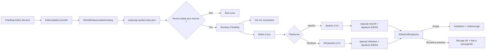
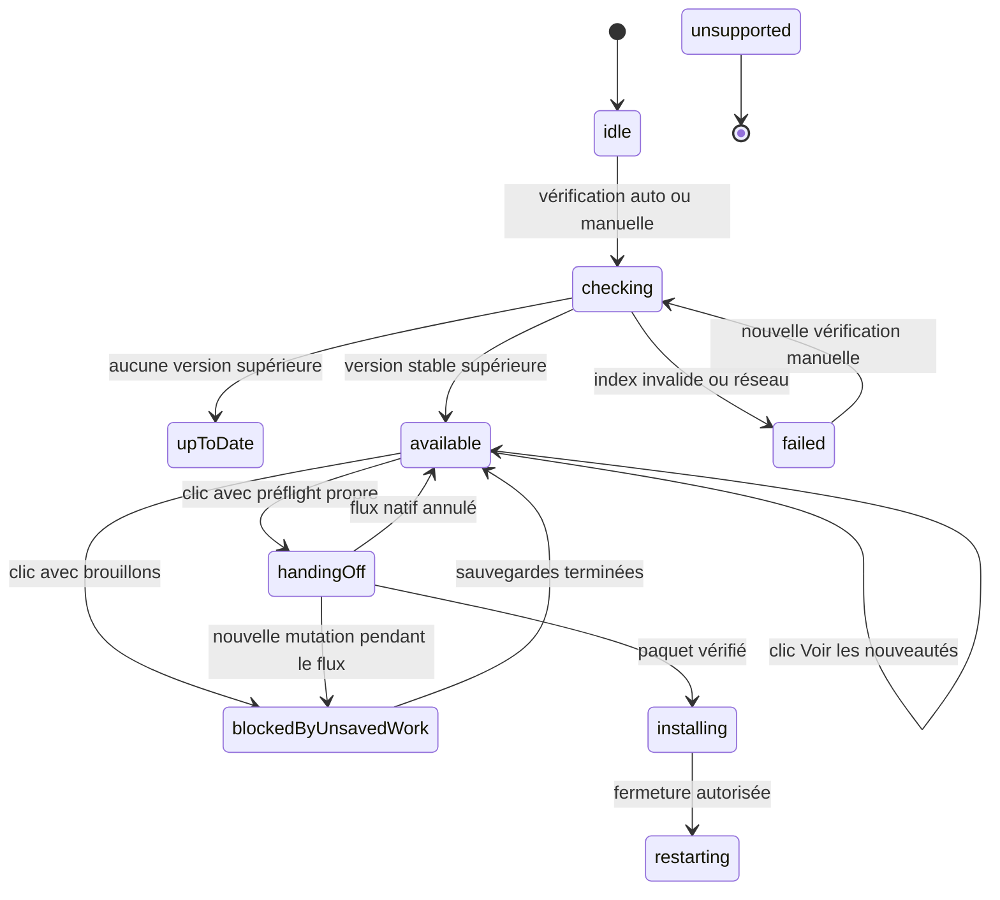
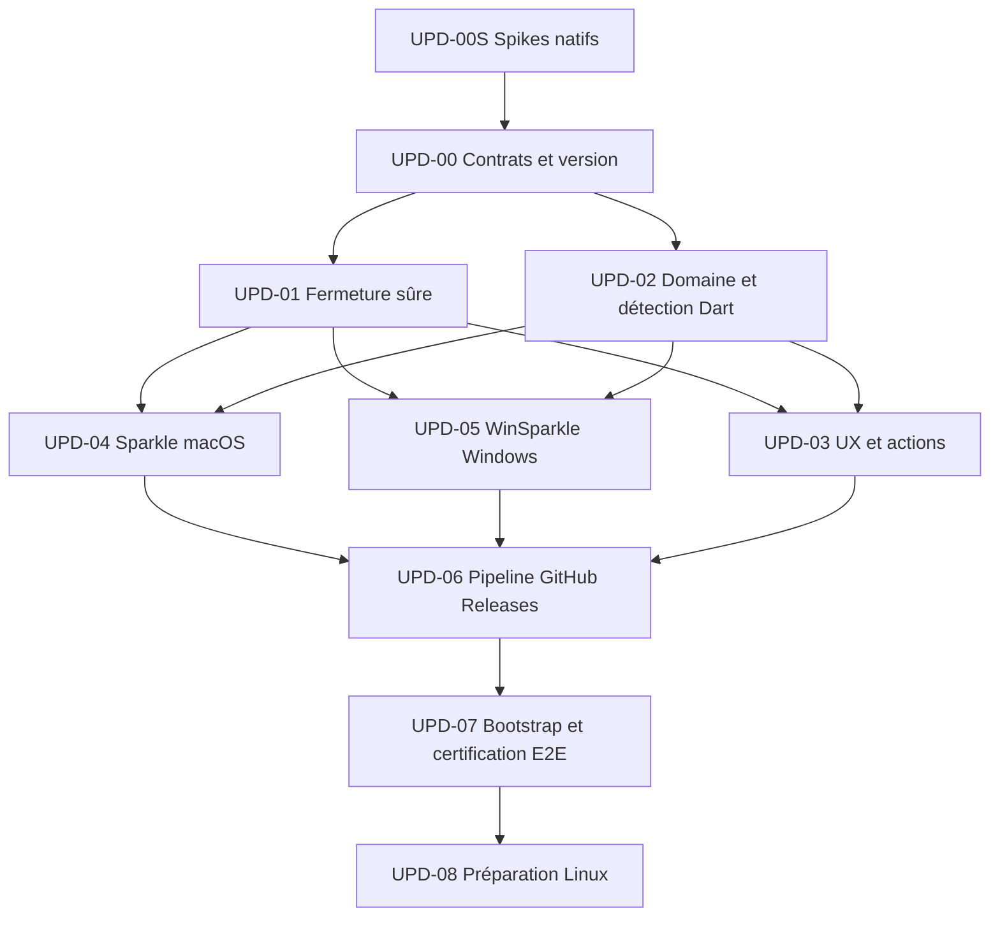

# PokeMap Editor Auto-Update Implementation Plan

> **For agentic workers:** REQUIRED SUB-SKILL: Use superpowers:subagent-driven-development (recommended) or superpowers:executing-plans to implement this plan task-by-task. Steps use checkbox (- [ ]) syntax for tracking.

**Goal:** Permettre aux personnes ayant installé PokeMap Editor de recevoir et installer les nouvelles versions stables depuis GitHub Releases, sans retélécharger et réinstaller manuellement toute l'application à chaque publication.

**Architecture:** Un contrôleur Flutter commun détecte silencieusement les nouvelles versions et présente une expérience PokeMap cohérente. Sparkle sur macOS et WinSparkle sur Windows prennent ensuite en charge le téléchargement, la vérification cryptographique, l'installation et le redémarrage selon les conventions natives. La publication reste hébergée sur GitHub Releases, avec un index léger commun et deux appcasts séparés.

**Tech Stack:** Flutter/Dart, Riverpod, package_info_plus, http, pub_semver, url_launcher, MethodChannel, Sparkle 2.9.5, WinSparkle 0.9.4, Inno Setup 6, GitHub Actions et GitHub Releases.

---

## 0. Carte d'identité du plan

| Champ | Valeur |
|---|---|
| Produit | PokeMap Editor desktop |
| Périmètre initial | macOS et Windows |
| Canal | stable uniquement |
| Hébergement | dépôt GitHub yoahnl/pokemap, releases versionnées et feed roulant dédié |
| Version actuelle observée | 0.2.0 |
| Première version compatible updater proposée | 0.3.0 |
| Première preuve de mise à jour proposée | 0.3.0 vers 0.3.1 |
| Expérience | détection discrète, bandeau PokeMap, action explicite, installateur natif |
| Politique utilisateur | aucune mise à jour forcée |
| Windows Authenticode | exclu du premier périmètre, coût volontairement évité |
| macOS | application signée et notarizée en production |
| Linux | différé jusqu'à une distribution AppImage stabilisée |
| État de cette roadmap | prête à être exécutée lot par lot |
| Date d'audit | 2 août 2026 |

Le petit pacte UwU : l'interface doit être mignonne et rassurante, mais le mécanisme de confiance doit rester très sérieux. Aucun téléchargement ne devient exécutable sans validation cryptographique par le framework natif.

## 1. Résumé exécutable

Le système cible suit cinq temps :

1. PokeMap Editor démarre normalement et restaure le projet.
2. Après un délai court, un contrôleur Dart consulte un petit fichier pokemap-update-index.json publié avec la dernière GitHub Release.
3. Si une version stable plus récente existe, un bandeau PokeMap non bloquant propose Voir les nouveautés et Mettre à jour.
4. Le clic ouvre le flux natif Sparkle ou WinSparkle. Le framework natif télécharge et vérifie la mise à jour avec une clé EdDSA embarquée.
5. Le redémarrage n'est autorisé que si aucun travail non enregistré n'est signalé. Sinon PokeMap explique quoi sauvegarder et laisse l'utilisateur reprendre la main.

La livraison doit être amorcée en deux releases. La version 0.3.0 installe le mécanisme. La version 0.3.1 est la première version que 0.3.0 peut réellement récupérer. Une installation manuelle de 0.3.0 reste donc inévitable : un ancien binaire ne peut pas apprendre magiquement à se mettre à jour, même avec beaucoup de UwU.

## 2. Décisions verrouillées

- GitHub Releases reste la source publique de distribution.
- La vérification silencieuse se fait une seule fois par session, après le démarrage.
- Une vérification manuelle reste accessible dans chaque espace de travail.
- Le bandeau PokeMap annonce la disponibilité ; les dialogues natifs gèrent le téléchargement et l'installation.
- Le canal stable ignore toute version SemVer de prépublication.
- La mise à jour est toujours déclenchée par une action humaine.
- Une erreur de vérification automatique reste discrète ; une erreur après action manuelle est visible et actionnable.
- macOS utilise Sparkle 2.9.5, épinglé précisément. Cette version publiée le 2 août 2026 complète un correctif de sécurité sur les deltas.
- Windows utilise WinSparkle 0.9.4, épinglé précisément et vérifié par SHA-256 lors de l'acquisition.
- macOS et Windows ont des appcasts séparés.
- Les clés privées EdDSA vivent uniquement dans les secrets GitHub Actions ; seules les clés publiques sont intégrées aux applications.
- L'absence d'Authenticode Windows est acceptée pour la première version. Elle ne réduit pas la vérification EdDSA des mises à jour, mais elle laisse possible un avertissement SmartScreen lors de l'installation initiale.
- Les projets utilisateur, sauvegardes, préférences et ressources importées ne doivent jamais être stockés dans le répertoire remplacé par l'installateur.
- Le tag roulant pokemap-editor-update-stable contient uniquement les pointeurs de feed. Les releases pokemap-vX.Y.Z restent versionnées et immuables.
- Aucun changement de schéma de projet PokeMap n'est inclus dans ce chantier.

## 3. Audit initial du dépôt

### 3.1 État Git observé avant création du document

La copie de travail contenait déjà cet artefact non suivi et sans rapport avec l'updater :

    ?? skills/creating-pokemap-maps-from-reference/scripts/__pycache__/inventory_assets.cpython-314.pyc

Il doit rester intact. La présente tâche ne l'ajoute, ne le modifie et ne le supprime pas.

### 3.2 Points d'intégration existants

| Zone | État observé | Conséquence |
|---|---|---|
| packages/map_editor/pubspec.yaml | version 0.2.0 sans build number ; http et pub_semver déjà directs | passer à X.Y.Z+BUILD et ajouter seulement les dépendances nécessaires |
| packages/map_editor/lib/main.dart | ProviderScope puis MaterialApp avec EditorShellPage | envelopper la page dans EditorUpdateHost |
| editor_shell_page.dart | shell global, restauration et routage des workspaces | bon emplacement pour brancher la disponibilité et la garde de redémarrage |
| editor_state.dart | isDirty, isProjectDirty et isSaving | base utile, mais couverture insuffisante seule |
| top_toolbar.dart | commandes globales pour la plupart des workspaces | ajouter Vérifier les mises à jour dans Aide |
| world_map_toolbelt.dart | menu séparé pour World Map | ajouter la même commande afin de préserver la parité |
| design_system.dart | boutons, panneaux, cartes et callouts PokeMap | créer un bandeau de design system, sans couleur ad hoc |
| app_fr.arb et app_en.arb | sources de localisation | toutes les chaînes de l'updater doivent y être définies |
| macOS MainFlutterWindow.swift | enregistre les plugins et le bridge de fichiers | installer ici le bridge Sparkle |
| macOS Info.plist | versions basées sur FLUTTER_BUILD_NAME et BUILD_NUMBER | compatible avec une source de version Flutter |
| macOS Release.entitlements | sandbox et accès réseau client | valider les exigences Sparkle sandboxées en build notarizé |
| Windows flutter_window.cpp | accès au moteur Flutter | installer ici le MethodChannel WinSparkle |
| Windows Runner.rc | métadonnées dérivées de FLUTTER_VERSION | préserver la cohérence version binaire, tag et appcast |
| pokemap_desktop_release.yml | DMG macOS, ZIP Windows, tar.gz Linux | transformer le ZIP Windows en installateur et publier les appcasts |
| desktop_distribution_contract_test.dart | contrats de packaging existants | étendre plutôt que dupliquer |
| github_distribution_workflow_test.dart | contrats du workflow existant | ajouter les invariants updater et sécurité |

### 3.3 Dette de fermeture déjà présente

Le shell ne possède pas encore une vérité centrale disant « l'application peut fermer sans perdre de travail ». Les indicateurs globaux ne couvrent pas automatiquement tous les brouillons locaux :

- carte et manifeste de projet ;
- document narratif ;
- session de personnalisation ;
- Border Studio ;
- Path Studio ;
- Step Studio ;
- Environment Studio ;
- Dialogue Studio ;
- Global Story Studio ;
- Event Builder V2 ;
- éventuels dialogues ou opérations de sauvegarde en cours.

Le lot UPD-01 est donc une dépendance de sécurité fonctionnelle, pas une finition. Tant que sa couverture n'est pas prouvée, le système doit refuser le redémarrage automatique.

### 3.4 Corrections apportées au concept initial

1. Un appcast unique est remplacé par deux flux :

       appcast-macos.xml
       appcast-windows.xml

   Les formats et extensions natives ne sont pas identiques, et Sparkle recommande de séparer les plateformes.

2. Une progression de téléchargement dessinée intégralement dans Flutter n'est pas promise sur Windows. WinSparkle ne fournit pas un flux public stable d'octets téléchargés. Le bandeau PokeMap déclenche le flux, puis la fenêtre native montre le téléchargement.

3. La détection personnalisée utilise un index JSON léger. Appeler directement WinSparkle « sans UI » n'est pas suffisamment silencieux pour garantir l'expérience choisie.

4. « Sauvegarder et redémarrer » n'est activé que lorsque chaque domaine de brouillon déclare sa préparation à la fermeture. Avant cette preuve, l'action sûre est « Afficher ce qu'il faut sauvegarder ».

5. L'URL releases/latest n'est pas utilisée pour les feeds. Ce dépôt distribue plusieurs produits : la dernière release globale pourrait ne pas être celle de PokeMap Editor. Les trois pointeurs stables vivent dans une release roulante dédiée, taguée pokemap-editor-update-stable.

6. Sparkle est épinglé à 2.9.5, et non à 2.9.2. La version 2.9.5 corrige plus complètement un problème de lien symbolique lors de l'application de deltas. Toute révision de ce pin exige une lecture fraîche des notes officielles.

### 3.5 Validations fraîches exécutées pendant l'audit

| Commande | Résultat exact utile |
|---|---|
| cd packages/map_editor && flutter test test/release | réussite, 6 tests sur 6 |
| cd packages/map_editor && flutter analyze | échec préexistant, 5 erreurs depuis benchmark/authoring_session_lifecycle.dart vers un import benchmark_support.dart absent |
| cd packages/map_editor && flutter build macos --release | réussite, PokeMap.app de 46,9 Mo ; avertissements de plugins audio/vidéo |
| codesign --verify --deep --strict sur le bundle produit | réussite |
| inspection du bundle | identifiant com.yoahnl.pokemap.editor ; versions 0.2.0 / 0.2.0 |
| inspection Sparkle | SUFeedURL, SUPublicEDKey et Sparkle.framework absents |

Ces preuves caractérisent l'existant ; elles ne valident aucun code d'updater. Le chantier devra soit corriger les cinq erreurs d'analyse dans un périmètre autorisé, soit établir clairement qu'elles restent une dette préexistante avant de prétendre à une analyse verte.

## 4. Objectifs, hors périmètre et critères produit

### 4.1 Objectifs

- Détecter une nouvelle version stable sans bloquer le démarrage.
- Rendre la disponibilité compréhensible sans vocabulaire moteur.
- Télécharger et installer avec vérification cryptographique.
- Refuser toute régression de version ou version mal formée.
- Préserver le travail non enregistré.
- Produire une release reproductible et auditable.
- Permettre un retour manuel au téléchargement GitHub si le flux natif échoue.
- Garder le coût d'hébergement nul dans les limites GitHub usuelles du projet.

### 4.2 Hors périmètre initial

- mises à jour forcées ;
- canal bêta, nightly ou dev ;
- installation Linux automatique ;
- mise à jour des projets créés par les utilisateurs ;
- télémétrie distante ;
- patch binaire Flutter personnalisé ;
- service d'update propriétaire ;
- certificat Authenticode Windows payant ;
- contrôle du téléchargement WinSparkle par une barre de progression Flutter ;
- migration de données métier ;
- modifications du runtime jouable.

### 4.3 Définition produit de « sans réinstaller »

Pour l'utilisateur, l'application :

- annonce la mise à jour ;
- télécharge le paquet adapté ;
- lance l'installation native ;
- redémarre sur la nouvelle version ;
- conserve ses projets et préférences ;
- ne lui demande pas de rechercher manuellement le bon fichier.

Le framework natif remplace techniquement le bundle ou les fichiers installés. Ce remplacement est une mise à niveau automatisée, pas une réinstallation manuelle complète.

## 5. Architecture cible

### 5.1 Vue d'ensemble

### 5.2 Répartition des responsabilités

| Composant | Responsabilité | Ne doit jamais faire |
|---|---|---|
| EditorUpdateCatalog | lire et valider l'index GitHub | installer un exécutable |
| EditorUpdateController | orchestration, état UI, fréquence, erreurs | faire confiance au JSON pour l'authenticité du paquet |
| EditorUpdateBanner sur PokeMapActionBanner | présenter les actions | gérer du réseau ou des secrets |
| EditorExitReadiness | agréger les blocages de fermeture | sauvegarder silencieusement un domaine inconnu |
| EditorNativeUpdater | contrat Dart vers natif | interpréter l'appcast en Dart |
| Sparkle/WinSparkle | télécharger, vérifier, installer | décider si le travail Flutter est sauvegardé |
| Workflow release | construire, signer, publier et valider | publier partiellement une release stable |

### 5.3 Machine d'état Flutter

Les états installing et restarting peuvent n'être connus que par événements natifs. L'UI doit accepter qu'une plateforme fournisse moins de granularité qu'une autre.

### 5.4 Contrat de l'index public

Nom immuable de l'asset :

    pokemap-update-index.json

Schéma version 1 :

    {
      "schemaVersion": 1,
      "channel": "stable",
      "version": "0.3.1",
      "tag": "pokemap-v0.3.1",
      "publishedAt": "2026-08-15T18:00:00Z",
      "releaseNotesUrl": "https://github.com/yoahnl/pokemap/releases/tag/pokemap-v0.3.1"
    }

URL stable :

    https://github.com/yoahnl/pokemap/releases/download/pokemap-editor-update-stable/pokemap-update-index.json

Feeds natifs stables :

    https://github.com/yoahnl/pokemap/releases/download/pokemap-editor-update-stable/appcast-macos.xml
    https://github.com/yoahnl/pokemap/releases/download/pokemap-editor-update-stable/appcast-windows.xml

Règles de validation :

- HTTPS obligatoire ;
- hôte GitHub attendu ou URL explicitement autorisée dans la configuration ;
- réponse limitée à 64 Kio ;
- délai réseau court et configurable, 8 secondes par défaut ;
- schemaVersion exactement égal à 1 ;
- channel exactement égal à stable ;
- version SemVer valide, sans suffixe de prépublication ;
- tag exactement égal à pokemap-v suivi de version ;
- releaseNotesUrl en HTTPS et sous github.com/yoahnl/pokemap ;
- publishedAt UTC valide ;
- une version égale ou inférieure à la version installée n'est jamais proposée.

Cet index sert uniquement à l'annonce. Sparkle et WinSparkle revérifient le paquet depuis leur appcast signé. Une compromission de l'index ne suffit donc pas à faire exécuter un binaire arbitraire.

### 5.5 Contrat MethodChannel

Canaux proposés :

    MethodChannel com.yoahnl.pokemap.editor/update
    EventChannel  com.yoahnl.pokemap.editor/update/events

Méthodes Dart vers natif :

    initialize
    openUpdateFlow
    setRestartReady
    dispose

Événements natifs vers Dart sur l'EventChannel :

    updateFlowOpened
    noUpdateFound
    updateCancelled
    restartRequested
    restartBlocked
    updateError
    manualCheckRequested

Événement conditionnel, interdit tant que le spike de staging différé n'est pas validé :

    updateReadyToInstall

Payload commun d'erreur :

    {
      "code": "native_update_failed",
      "message": "Message générique sûr pour l'interface",
      "recoverable": true
    }

Le code natif ne doit jamais transmettre un secret, un chemin utilisateur sensible ou une trace complète dans l'interface. Chaque événement porte un identifiant d'opération ; le contrôleur ignore un événement tardif appartenant à une opération annulée ou remplacée.

Matrice de capacités V1 :

| Capacité | macOS Sparkle | Windows WinSparkle | Contrat Flutter |
|---|---:|---:|---|
| UI native après clic | oui | oui | disponible |
| détection personnalisée par index JSON | oui | oui | disponible |
| progression en octets | possible avec user driver custom | non exposée | non promise |
| erreur native typée | partiellement possible | non, error_callback sans argument | générique par défaut |
| payload prêt pour installation différée | possible avec intégration custom | uniquement si spike user_run_installer validé | capability flag |
| annulation/no update | oui | oui | disponible |
| preuve signature invalide | paquet non exécuté | paquet non exécuté | E2E natif, pas code UI exigé |

Le bridge expose au contrôleur une structure de capabilities. L'UI ne dessine ni progression ni bouton « Redémarrer pour installer » si la capability correspondante est fausse. Sur Windows V1, l'échec est générique dans Flutter et le détail reste dans l'UI ou le journal natif ; le critère de sécurité est que le paquet altéré n'est jamais exécuté.

restartBlocked est réduit vers blockedByUnsavedWork et force une nouvelle lecture de EditorExitReadiness avant toute nouvelle tentative.

## 6. Arborescence cible

Les noms ci-dessous sont les emplacements canoniques proposés. Une modification de nom durant l'implémentation doit être motivée dans le compte rendu du lot.

    packages/map_editor/
      lib/
        src/
          features/
            editor_updates/
              domain/
                editor_update_models.dart
                editor_update_catalog.dart
                editor_native_updater.dart
                editor_exit_readiness.dart
              application/
                editor_update_controller.dart
                editor_update_providers.dart
              infrastructure/
                github_release_update_catalog.dart
                method_channel_editor_native_updater.dart
              presentation/
                editor_update_host.dart
                editor_update_banner.dart
          ui/
            design_system/
              pokemap_action_banner.dart
            editor_shell_page.dart
            shared/
              top_toolbar.dart
      test/
        features/
          editor_updates/
            editor_update_models_test.dart
            github_release_update_catalog_test.dart
            editor_update_controller_test.dart
            editor_exit_readiness_test.dart
            method_channel_editor_native_updater_test.dart
            editor_update_host_test.dart
            editor_update_banner_test.dart
        ui/
          design_system/
            pokemap_action_banner_test.dart
        release/
          desktop_distribution_contract_test.dart
          github_distribution_workflow_test.dart
          update_feed_contract_test.dart
          update_installer_contract_test.dart
      tool/
        release/
          generate_update_index.dart
          validate_release_version.dart
          validate_update_assets.dart
      macos/
        Runner/
          EditorUpdaterBridge.swift
          Info.plist
          Release.entitlements
        Runner.xcodeproj/
          project.pbxproj
      windows/
        runner/
          editor_updater_bridge.cpp
          editor_updater_bridge.h
          flutter_window.cpp
          flutter_window.h
          Runner.rc
          CMakeLists.txt
        installer/
          pokemap.iss
        CMakeLists.txt
    .github/
      workflows/
        pokemap_desktop_release.yml

Les fichiers générés par flutter gen-l10n restent modifiés par le générateur officiel :

    packages/map_editor/lib/l10n/app_localizations.dart
    packages/map_editor/lib/l10n/app_localizations_en.dart
    packages/map_editor/lib/l10n/app_localizations_fr.dart

## 7. Graphe de dépendance des lots

Chemin critique :

    UPD-00S → UPD-00 → UPD-01 → UPD-04/UPD-05 → UPD-06 → UPD-07

Les lots UPD-04 et UPD-05 peuvent être implémentés en parallèle après stabilisation des contrats, mais leur publication doit converger dans le même pipeline.

## 8. UPD-00S — Spikes natifs et décision go/no-go

**But :** lever les incertitudes qui pourraient invalider l'UX ou la chaîne de signature avant d'investir dans l'architecture complète.

**Dépendances :** aucune.

**Nature du lot :** harnais jetables hors production, preuves écrites et aucune promesse produit avant verdict.

### Tâche 00S.1 — Prouver Sparkle dans le runner sandboxé

**Fichiers de production à ne modifier qu'après validation du spike :**

- packages/map_editor/macos/Runner.xcodeproj/project.pbxproj
- packages/map_editor/macos/Runner/Info.plist
- packages/map_editor/macos/Runner/Release.entitlements
- apps/pokemap_hub/tool/release/sign_macos_app.sh

- [ ] Intégrer Sparkle 2.9.5 par SPM dans un harnais.
- [ ] Valider SUEnableInstallerLauncherService.
- [ ] Valider les exceptions Mach $(PRODUCT_BUNDLE_IDENTIFIER)-spks et -spki.
- [ ] Construire un bundle sandboxé avec Installer.xpc, Autoupdate, Updater.app et Sparkle.framework.
- [ ] Exécuter codesign, spctl et notarization sur le bundle final.
- [ ] Prouver que le script partagé ne détruit ni entitlements ni signatures imbriquées.

### Tâche 00S.2 — Prouver le flux WinSparkle retenu

Deux branches sont à tester :

**Branche V1 recommandée :**

    bandeau Flutter
      → préflight de sauvegarde
      → fenêtre WinSparkle native
      → téléchargement vérifié
      → installation et relance natives

**Branche enrichie facultative :**

    bandeau Flutter
      → téléchargement WinSparkle
      → callback user_run_installer
      → copie atomique du payload vérifié
      → état prêt à redémarrer
      → garde de sauvegarde
      → installation différée

- [ ] Confirmer que le préflight V1 empêche toute ouverture du flux lorsque la session est sale.
- [ ] Confirmer que can_shutdown reste un second verrou atomique si une édition survient pendant le téléchargement.
- [ ] Pour la branche enrichie, prouver que le callback reçoit un payload déjà vérifié EdDSA.
- [ ] Prouver la durée de vie du fichier, sa copie atomique et son nettoyage.
- [ ] Rejeter tout chemin hors du répertoire de staging contrôlé.
- [ ] Prouver qu'aucun fallback ne lance l'installateur après un retour handled.
- [ ] Recalculer et conserver un hash du payload staged.
- [ ] Prouver la reprise après redémarrage de PokeMap.

Décision :

- si la branche enrichie remplit toutes les preuves, elle peut être planifiée comme amélioration ;
- sinon la V1 native reste la cible officielle ;
- aucun downloader ou vérificateur cryptographique maison n'est autorisé.

### Tâche 00S.3 — Prouver Inno Setup par utilisateur

- [ ] Installer sous LocalAppData sans UAC.
- [ ] Mettre à niveau une installation existante avec un AppId stable.
- [ ] Vérifier le comportement lorsque PokeMap est ouvert.
- [ ] Vérifier la relance et la conservation des données.
- [ ] Injecter une interruption pour déterminer si l'ancienne version reste lançable.
- [ ] Si le rollback n'est pas prouvé, documenter une récupération manuelle et ne pas la présenter comme automatique.

### Tâche 00S.4 — Prouver la stratégie de feeds GitHub

- [ ] Créer une release versionnée de test avec assets immuables.
- [ ] Créer une release roulante de test taguée pokemap-editor-update-stable.
- [ ] Remplacer les feeds roulants seulement après validation de la release versionnée.
- [ ] Mesurer le comportement HTTP pendant le remplacement d'un asset.
- [ ] Vérifier que la dernière release d'un autre produit ne change pas les URLs de l'éditeur.
- [ ] Si la fenêtre de 404 n'est pas acceptable, déplacer uniquement les trois petits pointeurs vers GitHub Pages, toujours sans coût d'hébergement externe.

**Critères d'acceptation UPD-00S :**

- harnais macOS signé et sandboxé fonctionnel ;
- flux Windows V1 démontré ; branche enrichie classée viable ou explicitement exclue ;
- comportement Inno en cas d'interruption connu ;
- stratégie de feed indépendante des autres produits du monorepo ;
- décision go/no-go écrite avant UPD-04 et UPD-05.

**Checkpoint suggéré :** aucun commit des harnais jetables. Seules les preuves ou modifications de production validées peuvent être conservées, avec autorisation Git explicite.

## 9. UPD-00 — Contrats, version et garde-fous de release

**But :** définir les contrats avant l'intégration native et empêcher une release dont le tag, le binaire et les feeds se contredisent.

**Dépendances :** UPD-00S.

**Résultat livrable :** modèles immuables, validation de version, contrats de distribution mis à jour et dépendances explicites.

### Tâche 00.1 — Caractériser la distribution actuelle

**Fichiers :**

- Modifier packages/map_editor/test/release/desktop_distribution_contract_test.dart
- Modifier packages/map_editor/test/release/github_distribution_workflow_test.dart

- [ ] Ajouter des assertions décrivant l'identité macOS et Windows actuelle.
- [ ] Ajouter un test rouge exigeant un installateur Windows PokeMap-Editor-Setup-version.exe.
- [ ] Ajouter un test rouge exigeant les deux appcasts et l'index JSON.
- [ ] Ajouter un test rouge exigeant une release GitHub créée en brouillon avant publication.
- [ ] Vérifier que les jobs de pull request n'accèdent jamais aux secrets de signature.

Commande :

    cd packages/map_editor
    flutter test test/release/desktop_distribution_contract_test.dart test/release/github_distribution_workflow_test.dart

Attendu initial : échec ciblé sur les nouveaux contrats, sans échec parasite.

### Tâche 00.2 — Définir les modèles de domaine

**Fichiers :**

- Créer packages/map_editor/lib/src/features/editor_updates/domain/editor_update_models.dart
- Créer packages/map_editor/test/features/editor_updates/editor_update_models_test.dart

Contrat minimal :

    enum EditorUpdatePhase {
      idle,
      checking,
      upToDate,
      available,
      handingOff,
      blockedByUnsavedWork,
      installing,
      restarting,
      failed,
      unsupported,
    }

    final class EditorUpdateRelease {
      const EditorUpdateRelease({
        required this.version,
        required this.tag,
        required this.publishedAt,
        required this.releaseNotesUri,
      });
    }

- [ ] Tester l'égalité ou la comparaison nécessaire sans rendre l'état mutable.
- [ ] Représenter une erreur par code stable, message localisable et caractère récupérable.
- [ ] Distinguer une vérification automatique d'une vérification manuelle.
- [ ] Interdire qu'un état available existe sans release associée.
- [ ] Garder les types Flutter hors du domaine.

Commande :

    cd packages/map_editor
    flutter test test/features/editor_updates/editor_update_models_test.dart

Attendu final : tous les cas passent.

### Tâche 00.3 — Ajouter les dépendances directes

**Fichier :**

- Modifier packages/map_editor/pubspec.yaml

Versions de départ proposées :

    package_info_plus: ^8.3.1
    url_launcher: ^6.3.2

http et pub_semver sont déjà déclarés et ne doivent pas être dupliqués.

- [ ] Exécuter flutter pub get avec la version Flutter épinglée par le dépôt.
- [ ] Vérifier qu'aucune contrainte SDK n'est augmentée sans nécessité démontrée.
- [ ] Si url_launcher impose une contrainte incompatible, conserver le lien sous forme de copie ouvrable et documenter la limitation au lieu de modifier largement le socle.
- [ ] Inspecter le lockfile pour éviter une mise à niveau transitive non liée.

Commande :

    cd packages/map_editor
    flutter pub get
    flutter pub deps --style=compact

Attendu : résolution réussie et uniquement les changements de dépendances nécessaires.

### Tâche 00.4 — Verrouiller l'identité de release

**Fichiers :**

- Créer packages/map_editor/tool/release/validate_release_version.dart
- Créer packages/map_editor/test/release/update_feed_contract_test.dart
- Modifier packages/map_editor/lib/src/ui/shared/status_bar.dart
- Modifier .github/workflows/pokemap_desktop_release.yml

Règle :

    tag pokemap-v0.3.1
           ⇅
    pubspec version 0.3.1+301
           ⇅
    CFBundleShortVersionString 0.3.1
           ⇅
    CFBundleVersion et build Windows 301
           ⇅
    index et appcasts 0.3.1

- [ ] Écrire les tests du validateur avant son implémentation.
- [ ] Refuser un tag sans préfixe pokemap-v.
- [ ] Refuser une prépublication sur le canal stable.
- [ ] Refuser une version de tag différente du pubspec.
- [ ] Refuser un build number absent ou non croissant dans le scénario E2E.
- [ ] Utiliser X.Y.Z pour l'affichage et BUILD pour sparkle:version et les comparaisons natives.
- [ ] Supprimer toute version d'interface codée en dur, notamment dans StatusBar, au profit de PackageInfo.
- [ ] Exécuter le validateur avant tout job de signature.

Commande :

    cd packages/map_editor
    dart run tool/release/validate_release_version.dart --tag pokemap-v0.3.1 --pubspec pubspec.yaml

Attendu : sortie explicite de validation et code 0 ; tout désaccord retourne un code non nul.

**Critères d'acceptation UPD-00 :**

- les contrats échouent d'abord pour les bonnes raisons puis passent ;
- aucune logique native n'est requise pour tester les modèles ;
- une release incohérente est bloquée avant la signature ;
- le modèle ne dépend ni de Flutter UI ni de Riverpod.

**Checkpoint suggéré :** feat(map_editor): define desktop update contracts. Toute création de commit requiert une autorisation Git explicite.

## 10. UPD-01 — Préparation à la fermeture et protection du travail

**But :** disposer d'une vérité centrale, testée et atomique sur l'autorisation de redémarrer.

**Dépendances :** UPD-00.

**Principe fail-closed :** un domaine non enregistré ou non couvert bloque le redémarrage.

### Tâche 01.1 — Créer le registre de blocages

**Fichiers :**

- Créer packages/map_editor/lib/src/features/editor_updates/domain/editor_exit_readiness.dart
- Créer packages/map_editor/lib/src/features/editor/application/editor_unsaved_work_registry.dart
- Créer packages/map_editor/lib/src/features/editor/state/editor_unsaved_work_provider.dart
- Créer packages/map_editor/test/features/editor_updates/editor_exit_readiness_test.dart
- Créer packages/map_editor/test/features/editor_updates/editor_unsaved_work_registry_test.dart

Contrat minimal :

    enum EditorExitBlockerKind {
      map,
      projectManifest,
      narrative,
      personalization,
      borderPreview,
      borderStudio,
      pathStudio,
      stepStudio,
      environmentStudio,
      dialogueStudio,
      globalStoryStudio,
      eventBuilderV2,
      pendingTemplate,
      saveInProgress,
      unknown,
    }

    final class EditorExitReadiness {
      const EditorExitReadiness({required this.blockers});
      bool get canExit => blockers.isEmpty;
    }

    abstract interface class EditorUnsavedWorkParticipant {
      String get id;
      EditorExitBlockerKind get kind;
      bool get isDirty;
      Future<EditorUnsavedWorkSaveOutcome> save();
    }

- [ ] Tester zéro, un et plusieurs blocages.
- [ ] Garantir un ordre stable pour l'affichage.
- [ ] Dédupliquer les blocages d'un même domaine.
- [ ] Garder les libellés localisés hors du domaine.
- [ ] Prévoir unknown comme verrou de sécurité.
- [ ] Posséder le participant dans la couche application/session tant que son brouillon existe, indépendamment du widget qui l'affiche.
- [ ] Refuser les identifiants en double.
- [ ] Ne supprimer le participant qu'après save, discard confirmé ou résolution du brouillon.
- [ ] Si un brouillon est strictement local au widget, interdire sa fermeture silencieuse et imposer save, discard ou cancel avant dispose.
- [ ] Garantir qu'un brouillon résolu ne laisse pas de blocage fantôme.
- [ ] Permettre un participant non sauvegardable qui renvoie vers son brouillon au lieu de prétendre le sauvegarder.

### Tâche 01.2 — Agréger les indicateurs globaux

**Fichiers :**

- Modifier packages/map_editor/lib/src/features/editor/state/editor_state.dart
- Modifier packages/map_editor/lib/src/features/editor/state/models/editor_state_groups.dart si nécessaire
- Créer packages/map_editor/lib/src/features/editor_updates/application/editor_update_providers.dart

- [ ] Mapper isDirty vers map.
- [ ] Mapper isProjectDirty vers projectManifest.
- [ ] Mapper isSaving vers saveInProgress.
- [ ] Exposer un provider EditorExitReadiness stable et facile à tester.
- [ ] Éviter de dupliquer l'état source dans le contrôleur updater.

### Tâche 01.3 — Couvrir les sessions spécialisées

**Fichiers à inspecter et modifier seulement si le domaine possède un brouillon autonome :**

- packages/map_editor/lib/src/application/services/narrative_document_session.dart
- packages/map_editor/lib/src/features/personalization/application/personalization_studio_session_controller.dart
- packages/map_editor/lib/src/features/border_studio/application/border_studio_draft_controller.dart
- packages/map_editor/lib/src/features/border_studio/state/border_studio_providers.dart
- packages/map_editor/lib/src/features/path_studio/path_studio_new_path_draft.dart
- packages/map_editor/lib/src/features/path_studio/path_studio_panel.dart
- packages/map_editor/lib/src/features/narrative/application/step_studio_authoring.dart
- packages/map_editor/lib/src/ui/canvas/step_studio_workspace.dart
- packages/map_editor/lib/src/features/environment_studio/environment_studio_panel.dart
- packages/map_editor/lib/src/ui/canvas/dialogue_studio_workspace.dart
- packages/map_editor/lib/src/ui/canvas/global_story_studio_workspace.dart
- packages/map_editor/lib/src/ui/canvas/events_v2/event_builder_v2_product_route.dart

- [ ] Pour chaque domaine, écrire un test prouvant qu'un brouillon modifié crée un blocage.
- [ ] Prouver qu'une sauvegarde ou annulation retire le blocage.
- [ ] Prouver qu'un onglet avec brouillon ne peut se fermer qu'après save/discard confirmé, ou que son participant application reste enregistré.
- [ ] Ne pas exposer de sauvegarde globale avant d'avoir une API sûre pour chaque domaine.
- [ ] Documenter par assertion tout domaine déclaré non concerné.
- [ ] Extraire l'ordre map/preview puis projet depuis map_activation_guard.dart vers un coordinateur réutilisable et testé.
- [ ] Revalider tous les participants après chaque await de sauvegarde.
- [ ] Tester une nouvelle mutation apparue pendant la sauvegarde.
- [ ] Produire une matrice domaine → owner → signal dirty → save/discard → test pour chaque valeur connue de l'enum.

### Tâche 01.4 — Synchroniser la disponibilité avec le natif

**Fichiers :**

- Créer packages/map_editor/lib/src/features/editor_updates/domain/editor_native_updater.dart
- Créer packages/map_editor/test/features/editor_updates/method_channel_editor_native_updater_test.dart

Contrat :

    abstract interface class EditorNativeUpdater {
      bool get isSupported;
      EditorNativeUpdaterCapabilities get capabilities;
      Stream<EditorNativeUpdateEvent> get events;
      Future<void> initialize();
      Future<void> openUpdateFlow();
      Future<void> setRestartReady(bool isReady);
      Future<void> dispose();
    }

- [ ] Envoyer setRestartReady à chaque changement réel, pas à chaque rebuild.
- [ ] Initialiser à false jusqu'au premier calcul complet.
- [ ] Repasser immédiatement à false si un brouillon apparaît pendant le téléchargement.
- [ ] Tolérer l'absence de bridge sur une plateforme non prise en charge.
- [ ] Ne jamais bloquer le thread UI en attendant une sauvegarde.
- [ ] Tester les matrices de capabilities macOS, Windows V1, Windows enrichi et plateforme unsupported.
- [ ] Rejeter updateReadyToInstall comme événement malformé lorsque supportsDeferredInstall est false.
- [ ] Tester que restartBlocked réduit l'état vers blockedByUnsavedWork et ne déclenche aucune fermeture.

Commande de lot :

    cd packages/map_editor
    flutter test test/features/editor_updates/editor_exit_readiness_test.dart test/features/editor_updates/method_channel_editor_native_updater_test.dart

Attendu : tous les scénarios de blocage et transition passent.

**Critères d'acceptation UPD-01 :**

- toute source de travail non enregistré connue est couverte ou explicitement classée non concernée ;
- le natif reçoit un booléen atomique sûr ;
- unknown bloque la fermeture ;
- aucun test ne suppose qu'une sauvegarde silencieuse est toujours possible ;
- une matrice de couverture associe chaque domaine éditable à son signal et à son test.

**Checkpoint suggéré :** feat(map_editor): guard updater restart against unsaved work. Toute création de commit requiert une autorisation Git explicite.

## 11. UPD-02 — Détection GitHub et contrôleur Dart

**But :** détecter proprement une version stable et fournir une machine d'état testable sans réseau réel.

**Dépendances :** UPD-00 ; intégration finale avec UPD-01.

### Tâche 02.1 — Définir les ports

**Fichiers :**

- Créer packages/map_editor/lib/src/features/editor_updates/domain/editor_update_catalog.dart
- Créer packages/map_editor/lib/src/features/editor_updates/domain/editor_native_updater.dart si non créé en UPD-01

Contrats :

    abstract interface class EditorUpdateCatalog {
      Future<EditorUpdateRelease?> latestStable(Version currentVersion);
    }

    abstract interface class EditorInstalledVersionReader {
      Future<Version> read();
    }

- [ ] Injecter horloge, client HTTP et version installée.
- [ ] Ne pas appeler PackageInfo directement depuis le contrôleur.
- [ ] Définir des erreurs typées : réseau, timeout, schéma, version, URL et plateforme.

### Tâche 02.2 — Implémenter le catalogue GitHub

**Fichiers :**

- Créer packages/map_editor/lib/src/features/editor_updates/infrastructure/github_release_update_catalog.dart
- Créer packages/map_editor/test/features/editor_updates/github_release_update_catalog_test.dart

Cas de test obligatoires :

- [ ] 200 avec version supérieure stable retourne une release.
- [ ] version égale retourne null.
- [ ] version inférieure retourne null.
- [ ] version prérelease est rejetée.
- [ ] mauvais canal est rejeté.
- [ ] schemaVersion inconnu est rejeté.
- [ ] JSON tronqué ou mal formé est rejeté.
- [ ] corps supérieur à 64 Kio est rejeté.
- [ ] redirection finale hors hôte autorisé est rejetée.
- [ ] URL de notes hors dépôt autorisé est rejetée.
- [ ] timeout produit une erreur récupérable.
- [ ] 404, 429 et 5xx sont différenciés sans fuite de contenu.

Commande :

    cd packages/map_editor
    flutter test test/features/editor_updates/github_release_update_catalog_test.dart

Attendu : aucune requête Internet réelle ; client injecté.

### Tâche 02.3 — Implémenter le contrôleur

**Fichiers :**

- Créer packages/map_editor/lib/src/features/editor_updates/application/editor_update_controller.dart
- Créer packages/map_editor/test/features/editor_updates/editor_update_controller_test.dart

Comportement :

- vérification automatique une fois par session ;
- délai par défaut de 12 secondes après disponibilité du shell ;
- aucune vérification si la plateforme est non prise en charge ;
- vérification manuelle toujours autorisée hors opération active ;
- réponse upToDate visible brièvement uniquement pour une action manuelle ;
- échec automatique journalisé localement et UI silencieuse ;
- échec manuel visible avec Réessayer et Ouvrir GitHub ;
- état available conservé tant que la version proposée reste supérieure ;
- aucune boucle automatique de retry ;
- événements natifs réduits dans la même machine d'état.

- [ ] Utiliser une fausse horloge pour le délai.
- [ ] Tester qu'un rebuild ne lance pas une deuxième vérification.
- [ ] Tester qu'un appel concurrent partage ou refuse l'opération en cours.
- [ ] Tester l'annulation propre au dispose.
- [ ] Tester le passage available vers handingOff.
- [ ] Tester le retour après annulation native.
- [ ] Tester le blocage par EditorExitReadiness.
- [ ] Tester qu'un état dirty apparu pendant le flux repasse la garde à false.

### Tâche 02.4 — Câbler Riverpod et le host global

**Fichiers :**

- Modifier packages/map_editor/lib/main.dart
- Créer packages/map_editor/lib/src/features/editor_updates/application/editor_update_providers.dart
- Créer packages/map_editor/lib/src/features/editor_updates/infrastructure/method_channel_editor_native_updater.dart
- Créer packages/map_editor/lib/src/features/editor_updates/presentation/editor_update_host.dart
- Créer packages/map_editor/test/features/editor_updates/editor_update_host_test.dart

Composition cible :

    MaterialApp(
      home: const EditorUpdateHost(
        child: EditorShellPage(),
      ),
    )

- [ ] Démarrer le minuteur après le premier frame et la restauration initiale.
- [ ] Abonner une seule instance au flux natif.
- [ ] Nettoyer timer, subscription et bridge.
- [ ] Fournir des overrides complets pour les tests.
- [ ] Ne pas coupler EditorShellPage au client HTTP.

Commande de lot :

    cd packages/map_editor
    flutter test test/features/editor_updates

Attendu : suite updater Dart intégralement verte.

**Critères d'acceptation UPD-02 :**

- l'index ne peut qu'annoncer une version ;
- aucune erreur automatique ne bloque l'éditeur ;
- la version installée provient des métadonnées du binaire ;
- le contrôleur est couvert sans GitHub réel ;
- les ressources asynchrones sont libérées.

**Checkpoint suggéré :** feat(map_editor): add stable update discovery controller. Toute création de commit requiert une autorisation Git explicite.

## 12. UPD-03 — Expérience PokeMap, localisation et accessibilité

**But :** proposer une expérience no-code claire, cohérente et délicieusement UwU.

**Dépendances :** UPD-01 et UPD-02.

### Tâche 03.1 — Créer le composant de design system

**Fichiers :**

- Créer packages/map_editor/lib/src/ui/design_system/pokemap_action_banner.dart
- Modifier packages/map_editor/lib/src/ui/design_system/design_system.dart
- Créer packages/map_editor/lib/src/features/editor_updates/presentation/editor_update_banner.dart
- Créer packages/map_editor/test/ui/design_system/pokemap_action_banner_test.dart
- Créer packages/map_editor/test/features/editor_updates/editor_update_banner_test.dart

API proposée :

    EditorUpdateBanner(
      versionLabel: "0.3.1",
      onReadNotes: controller.openReleaseNotes,
      onUpdate: controller.openNativeUpdateFlow,
      onDismiss: controller.dismissAvailableBanner,
    )

- [ ] Utiliser exclusivement les tokens de thème PokeMap.
- [ ] Réutiliser PokeMapPanel, PokeMapButton et les primitives existantes.
- [ ] Ne définir aucun Color(0x...), Colors.* ou palette de feature.
- [ ] Rester lisible à 200 % de mise à l'échelle.
- [ ] Supporter thème clair et sombre.
- [ ] Fournir focus clavier, ordre de tabulation et labels sémantiques.
- [ ] Ne pas utiliser une animation infinie.
- [ ] Respecter les préférences de réduction de mouvement.

### Tâche 03.2 — Ajouter les textes français et anglais

**Fichiers :**

- Modifier packages/map_editor/lib/l10n/app_fr.arb
- Modifier packages/map_editor/lib/l10n/app_en.arb
- Régénérer les trois fichiers app_localizations*.dart

Clés minimales :

    editorUpdateAvailableTitle
    editorUpdateAvailableBody
    editorUpdateReadNotes
    editorUpdateInstall
    editorUpdateCheck
    editorUpdateChecking
    editorUpdateUpToDate
    editorUpdateManualCheckFailed
    editorUpdateRetry
    editorUpdateOpenGitHub
    editorUpdateUnsavedTitle
    editorUpdateUnsavedBody
    editorUpdateSaveBeforeRestart
    editorUpdateCancelled
    editorUpdateUnsupported

Ton français proposé :

- titre : « Une nouvelle aventure t'attend ✨ »
- corps : « PokeMap {version} est prêt à rejoindre ton équipe. »
- action : « Mettre à jour »
- blocage : « Tes créations ne sont pas encore toutes sauvegardées. On garde tout bien au chaud avant de redémarrer. »

Le texte anglais doit rester professionnel et naturel, pas traduire UwU littéralement.

Commande :

    cd packages/map_editor
    flutter gen-l10n

Attendu : génération sans clé manquante et sans modification manuelle des sorties générées.

### Tâche 03.3 — Rendre le contrôle manuel accessible partout

**Fichiers :**

- Modifier packages/map_editor/lib/src/ui/shared/top_toolbar.dart
- Modifier packages/map_editor/lib/src/features/editor/presentation/world_map/world_map_toolbelt.dart
- Modifier packages/map_editor/lib/src/ui/canvas/narrative_studio/narrative_studio_product_shell.dart
- Modifier packages/map_editor/macos/Runner/Base.lproj/MainMenu.xib
- Modifier packages/map_editor/lib/src/ui/editor_shell_page.dart

- [ ] Ajouter Vérifier les mises à jour dans le groupe Aide de TopToolbar.
- [ ] Ajouter checkForUpdates dans _WorldMapMoreAction.
- [ ] Ajouter le même libellé et la même action dans _WorldMapPlusMenu.
- [ ] Ajouter l'action au chrome de NarrativeStudioProductShell, qui n'utilise pas TopToolbar.
- [ ] Brancher le menu macOS Help / Check for Updates sur le même bridge natif.
- [ ] Faire émettre manualCheckRequested vers le contrôleur Dart depuis le menu macOS ; ne jamais appeler Sparkle directement en contournant le préflight.
- [ ] Centraliser le callback dans EditorShellPage.
- [ ] Désactiver l'action uniquement pendant une vérification active.
- [ ] Afficher « PokeMap est déjà à jour » après une vérification manuelle sans résultat.
- [ ] Tester la présence de l'action dans les trois branches de shell : classique, World Map et Narrative Studio.

### Tâche 03.4 — Présenter les blocages sans perdre le contexte

**Fichiers :**

- Modifier packages/map_editor/lib/src/features/editor_updates/presentation/editor_update_host.dart
- Modifier packages/map_editor/lib/src/ui/editor_shell_page.dart
- Étendre packages/map_editor/test/features/editor_updates/editor_update_host_test.dart

- [ ] Afficher la liste localisée des espaces à sauvegarder.
- [ ] Offrir Revenir à l'éditeur.
- [ ] Offrir Réessayer le redémarrage lorsque la readiness devient propre.
- [ ] N'offrir Sauvegarder et redémarrer que si un orchestrateur de sauvegarde prouve la prise en charge de tous les blocages présents.
- [ ] Conserver le bandeau si l'utilisateur annule le flux natif.
- [ ] Afficher un code précis seulement si la plateforme l'a réellement fourni.
- [ ] Sur Windows V1, afficher une erreur native générique sans prétendre distinguer signature et réseau.
- [ ] Prouver en test natif qu'une signature invalide empêche toute exécution, indépendamment du message Flutter.

Commandes de lot :

    cd packages/map_editor
    flutter test test/ui/design_system/pokemap_action_banner_test.dart test/features/editor_updates/editor_update_banner_test.dart test/features/editor_updates/editor_update_host_test.dart
    flutter test test/ui/shared/top_toolbar_test.dart

Si top_toolbar_test.dart n'existe pas, créer un test ciblé dans test/features/editor_updates plutôt qu'un fichier artificiellement large.

**Critères d'acceptation UPD-03 :**

- la commande est disponible dans les shells classique, World Map et Narrative Studio ;
- le bandeau est non modal et accessible ;
- aucune couleur feature n'est codée en dur ;
- français et anglais sont complets ;
- une annulation ne fait perdre ni travail ni possibilité de retenter.

**Checkpoint suggéré :** feat(map_editor): add UwU desktop update experience. Toute création de commit requiert une autorisation Git explicite.

## 13. UPD-04 — Intégration macOS avec Sparkle

**But :** installer une mise à jour signée et notarizée en remplaçant proprement le bundle macOS.

**Dépendances :** UPD-01 et UPD-02.

**Version épinglée :** Sparkle 2.9.5.

**Références :**

- https://sparkle-project.org/documentation/
- https://github.com/sparkle-project/Sparkle/releases/tag/2.9.5

### Tâche 04.1 — Ajouter Sparkle par Swift Package Manager

**Fichiers :**

- Modifier packages/map_editor/macos/Runner.xcodeproj/project.pbxproj
- Ajouter ou mettre à jour le fichier de résolution SPM généré par Xcode si le projet le suit

- [ ] Épingler 2.9.5, sans plage flottante.
- [ ] Lier Sparkle uniquement à la cible Runner.
- [ ] Vérifier le build Debug sans secret.
- [ ] Vérifier le build Release signé dans le job dédié.
- [ ] Documenter la procédure de montée de version et le contrôle du changelog.

### Tâche 04.2 — Configurer l'identité et la confiance

**Fichiers :**

- Modifier packages/map_editor/macos/Runner/Info.plist
- Modifier packages/map_editor/macos/Runner/Release.entitlements
- Modifier packages/map_editor/macos/Runner.xcodeproj/project.pbxproj pour les services XPC requis

Clés de configuration visées :

    SUFeedURL = https://github.com/yoahnl/pokemap/releases/download/pokemap-editor-update-stable/appcast-macos.xml
    SUPublicEDKey = clé publique macOS
    SUEnableAutomaticChecks = false
    SURequireSignedFeed = true
    SUVerifyUpdateBeforeExtraction = true
    SUEnableInstallerLauncherService = true

- [ ] Générer une paire EdDSA macOS hors dépôt.
- [ ] Enregistrer seulement la clé privée dans GitHub Actions.
- [ ] Intégrer seulement la clé publique dans Info.plist.
- [ ] Vérifier les exigences sandbox exactes de Sparkle 2.9.5.
- [ ] Ajouter les exceptions Mach $(PRODUCT_BUNDLE_IDENTIFIER)-spks et -spki.
- [ ] Ne pas activer le downloader XPC tant que network.client reste accordé.
- [ ] Conserver network.client et les accès fichiers utilisateur existants.
- [ ] Prouver que la signature de code imbriquée est valide après intégration.

Vérifications Release :

    codesign --verify --deep --strict --verbose=2 build/macos/Build/Products/Release/PokeMap.app
    spctl --assess --type execute --verbose=4 build/macos/Build/Products/Release/PokeMap.app

Attendu : codesign retourne 0 ; spctl accepte le binaire notarizé.

### Tâche 04.3 — Implémenter le bridge Swift

**Fichiers :**

- Créer packages/map_editor/macos/Runner/EditorUpdaterBridge.swift
- Modifier packages/map_editor/macos/Runner/MainFlutterWindow.swift
- Modifier packages/map_editor/macos/Runner/AppDelegate.swift lorsque le delegate de fermeture Sparkle est branché

Responsabilités :

- créer une seule instance du contrôleur Sparkle ;
- enregistrer le MethodChannel ;
- ouvrir le flux natif à la demande ;
- transmettre les événements sûrs au moteur Flutter ;
- consulter une readiness mise à jour par Dart avant fermeture ;
- remettre la demande à l'utilisateur si le travail est dirty ;
- libérer le channel à la fermeture de la fenêtre.

- [ ] Ne pas lire de clé privée.
- [ ] Ne pas exécuter une callback Flutter depuis un thread non principal.
- [ ] Ne pas déclencher les vérifications automatiques Sparkle en doublon du contrôleur Dart.
- [ ] Gérer l'absence d'update, l'annulation et l'erreur.
- [ ] Gérer l'application déplacée hors /Applications selon le comportement Sparkle documenté.

### Tâche 04.4 — Produire l'archive Sparkle

**Fichiers :**

- Modifier .github/workflows/pokemap_desktop_release.yml
- Créer ou adapter le script de packaging macOS sous packages/map_editor/tool/release

Assets macOS :

    PokeMap-Editor-0.3.1-macOS.dmg
    PokeMap-Editor-0.3.1-macOS.app.zip
    appcast-macos.xml
    signatures et métadonnées nécessaires à Sparkle

- [ ] Garder le DMG pour la première installation.
- [ ] Utiliser le zip signé de l'app pour Sparkle.
- [ ] Notariser et stapler avant génération de l'appcast final.
- [ ] Générer les deltas Sparkle lorsque l'outillage 2.9.5 et la version précédente le permettent.
- [ ] Ne jamais publier un delta sans paquet complet de secours.
- [ ] Vérifier les signatures d'appcast avant upload.

### Tâche 04.5 — Tester sur une machine macOS propre

- [ ] Installer 0.3.0 depuis le DMG.
- [ ] Créer un projet hors du bundle de l'application.
- [ ] Détecter 0.3.1.
- [ ] Annuler puis relancer la mise à jour.
- [ ] Bloquer le redémarrage avec une carte dirty.
- [ ] Sauvegarder puis terminer l'installation.
- [ ] Vérifier la version 0.3.1 après redémarrage.
- [ ] Vérifier le projet et les préférences.
- [ ] Tester paquet altéré, appcast altéré et indisponibilité GitHub.

**Critères d'acceptation UPD-04 :**

- build Release signé et notarizé ;
- archive complète vérifiée par Sparkle ;
- redémarrage bloqué en présence de travail non enregistré ;
- aucun secret dans l'app, les logs ou les artifacts ;
- installation initiale et mise à niveau validées sur une machine sans environnement de développement.

**Checkpoint suggéré :** feat(map_editor): integrate signed Sparkle updates on macOS. Toute création de commit requiert une autorisation Git explicite.

## 14. UPD-05 — Intégration Windows avec WinSparkle et Inno Setup

**But :** remplacer la distribution ZIP par une installation par utilisateur, puis appliquer les mises à jour vérifiées par WinSparkle.

**Dépendances :** UPD-01 et UPD-02.

**Version épinglée :** WinSparkle 0.9.4.

**Références :**

- https://github.com/vslavik/winsparkle
- https://www.nuget.org/packages/WinSparkle/0.9.4

### Tâche 05.1 — Acquérir WinSparkle de manière déterministe

**Fichiers :**

- Modifier packages/map_editor/windows/runner/CMakeLists.txt
- Modifier packages/map_editor/windows/CMakeLists.txt si nécessaire

Source :

    https://www.nuget.org/api/v2/package/WinSparkle/0.9.4

SHA-256 vérifié lors de l'audit :

    452f4076a41cebc81540dfa34af9a28d4718ac976612c1f41a0581ddcbdf9007

- [ ] Télécharger uniquement dans le répertoire de build.
- [ ] Exiger exactement ce hash.
- [ ] Extraire build/native/include/winsparkle.h, build/native/x64/WinSparkle.lib et build/native/x64/WinSparkle.dll.
- [ ] Lier la bibliothèque à Runner.
- [ ] Copier la DLL près de PokeMap.exe.
- [ ] Échouer immédiatement en cas de hash ou structure inattendue.
- [ ] Vérifier que la version CMake Flutter supporte la méthode d'extraction choisie.
- [ ] Ne pas committer le paquet NuGet ou la DLL.

### Tâche 05.2 — Configurer la clé publique et le feed

**Fichiers :**

- Modifier packages/map_editor/windows/runner/Runner.rc
- Modifier packages/map_editor/windows/runner/resource.h si nécessaire

Ressources visées :

    FeedURL  APPCAST  "https://github.com/yoahnl/pokemap/releases/download/pokemap-editor-update-stable/appcast-windows.xml"
    EdDSAPub EDDSA    "clé publique Windows"

- [ ] Générer une paire EdDSA Windows distincte de macOS.
- [ ] Stocker la clé privée uniquement dans GitHub Actions.
- [ ] Embarquer la clé publique dans la ressource.
- [ ] Refuser la signature DSA historique.
- [ ] Préserver ProductName, FileDescription et version existants.

### Tâche 05.3 — Implémenter le bridge C++

**Fichiers :**

- Créer packages/map_editor/windows/runner/editor_updater_bridge.h
- Créer packages/map_editor/windows/runner/editor_updater_bridge.cpp
- Modifier packages/map_editor/windows/runner/flutter_window.h
- Modifier packages/map_editor/windows/runner/flutter_window.cpp
- Modifier packages/map_editor/windows/runner/CMakeLists.txt

Architecture thread-safe :

    Dart setRestartReady(bool)
              ↓
    std::atomic_bool can_restart
              ↓
    WinSparkle can_shutdown callback
              ↓
    true: fermeture native
    false: événement restartBlocked vers le thread Flutter

- [ ] Initialiser can_restart à false.
- [ ] Ne jamais appeler MethodChannel directement depuis can_shutdown.
- [ ] Dispatcher les événements sur le task runner du moteur Flutter.
- [ ] Installer les callbacks avant winsparkle_init.
- [ ] Appeler winsparkle_cleanup au OnDestroy.
- [ ] Utiliser le flux avec UI seulement après clic utilisateur.
- [ ] Gérer update found, not found, cancelled, installer démarré et erreur générique.
- [ ] Ne jamais inventer un code signature_invalid : win_sparkle_set_error_callback ne fournit aucun détail.
- [ ] N'émettre updateReadyToInstall que dans la branche enrichie validée par UPD-00S.
- [ ] Dégrader proprement si la DLL ne se charge pas.

### Tâche 05.4 — Créer l'installateur Inno Setup

**Fichier :**

- Créer packages/map_editor/windows/installer/pokemap.iss

Paramètres :

    DefaultDirName={localappdata}\Programs\PokeMap
    PrivilegesRequired=lowest
    AppVersion=version de release
    ArchitecturesAllowed=x64compatible
    ArchitecturesInstallIn64BitMode=x64compatible

- [ ] Générer une AppId GUID une seule fois durant l'implémentation et la conserver pour toutes les versions.
- [ ] Inclure l'intégralité du dossier Release Flutter, dont WinSparkle.dll.
- [ ] Créer les raccourcis menu Démarrer et désinstallation.
- [ ] Ne pas imposer la fermeture sans consulter le bridge.
- [ ] Conserver les données utilisateur hors du répertoire d'installation.
- [ ] Générer PokeMap-Editor-Setup-version.exe.
- [ ] Vérifier l'installation, la réparation et la désinstallation par utilisateur.
- [ ] Ne pas revendiquer un éditeur vérifié par Windows sans Authenticode.

### Tâche 05.5 — Produire l'appcast Windows

**Fichiers :**

- Modifier .github/workflows/pokemap_desktop_release.yml
- Créer ou adapter un outil sous packages/map_editor/tool/release

Assets Windows :

    PokeMap-Editor-Setup-0.3.1.exe
    appcast-windows.xml
    métadonnées EdDSA requises

- [ ] Signer le paquet avec l'outil EdDSA WinSparkle.
- [ ] Injecter longueur exacte, URL versionnée et signature dans l'enclosure.
- [ ] Tester l'appcast avec l'outil WinSparkle épinglé.
- [ ] Publier le paquet complet ; aucun patch différentiel Windows dans le premier périmètre.
- [ ] Vérifier que le tag roulant résout vers les feeds stables et que les enclosures pointent vers la release versionnée.

### Tâche 05.6 — Tester sur Windows propre

- [ ] Installer 0.3.0 sans droits administrateur.
- [ ] Observer et documenter l'éventuel avertissement SmartScreen.
- [ ] Lancer depuis le menu Démarrer.
- [ ] Détecter 0.3.1.
- [ ] Annuler puis relancer.
- [ ] Bloquer le redémarrage avec un brouillon Path Studio.
- [ ] Sauvegarder puis installer.
- [ ] Vérifier la version après relance.
- [ ] Vérifier les projets et préférences.
- [ ] Tester EXE altéré, appcast altéré, absence de réseau et DLL absente.
- [ ] Désinstaller sans supprimer les projets utilisateur.

**Critères d'acceptation UPD-05 :**

- installateur par utilisateur reproductible ;
- WinSparkle acquis avec version et hash fixes ;
- clé publique embarquée et clé privée absente ;
- callback de fermeture thread-safe ;
- mise à niveau 0.3.0 vers 0.3.1 validée sur Windows propre ;
- avertissement SmartScreen documenté honnêtement.

**Checkpoint suggéré :** feat(map_editor): integrate verified WinSparkle updates on Windows. Toute création de commit requiert une autorisation Git explicite.

## 15. UPD-06 — Pipeline GitHub Releases atomique

**But :** produire une release stable complète, validée et publiable en une seule opération contrôlée.

**Dépendances :** UPD-03, UPD-04 et UPD-05.

### 15.1 Secrets attendus

Les noms exacts doivent être choisis une fois et documentés dans les paramètres du dépôt. Proposition :

| Secret | Usage |
|---|---|
| MACOS_CERTIFICATE_P12 | signature Developer ID |
| MACOS_CERTIFICATE_PASSWORD | import du certificat |
| MACOS_SIGNING_IDENTITY | identité codesign |
| APPLE_ID | notarization |
| APPLE_TEAM_ID | notarization |
| APPLE_APP_PASSWORD | notarization |
| SPARKLE_MACOS_EDDSA_PRIVATE_KEY | signature appcast/archives macOS |
| WINSPARKLE_WINDOWS_EDDSA_PRIVATE_KEY | signature installateur Windows |

Les clés publiques ne sont pas des secrets et peuvent être committées dans les configurations natives.

### Tâche 06.1 — Séparer validation, build, assemblage et publication

**Fichier :**

- Modifier .github/workflows/pokemap_desktop_release.yml

Jobs proposés :

    validate_release
    build_macos
    build_windows
    build_linux_preview
    assemble_update_metadata
    validate_release_assets
    create_draft_release
    smoke_download_draft
    publish_release
    promote_stable_feed

- [ ] Déclencher les releases uniquement sur pokemap-v*.
- [ ] Conserver les builds de PR sans secrets et sans publication.
- [ ] Utiliser des permissions GitHub minimales par job.
- [ ] Mettre contents: write uniquement sur les jobs de release nécessaires.
- [ ] Épingler les actions tierces par SHA de commit.
- [ ] Définir des timeouts.
- [ ] Empêcher deux publications concurrentes du même tag.
- [ ] Conserver les logs utiles sans imprimer les secrets.

### Tâche 06.2 — Construire chaque plateforme

macOS :

    flutter build macos --release --build-name=0.3.1 --build-number=301

Windows :

    flutter build windows --release --build-name=0.3.1 --build-number=301

- [ ] Utiliser la version validée comme entrée unique.
- [ ] Ne pas reconstruire après signature.
- [ ] Produire des checksums SHA-256 publics pour les téléchargements manuels.
- [ ] Nommer tous les packages avec la version ; seuls les deux appcasts et l'index gardent un nom stable dans la release roulante.
- [ ] Conserver Linux en preview séparée sans prétendre qu'il supporte l'updater.

### Tâche 06.3 — Générer les feeds et l'index

**Fichiers :**

- Créer packages/map_editor/tool/release/generate_update_index.dart
- Créer packages/map_editor/tool/release/validate_update_assets.dart
- Étendre packages/map_editor/test/release/update_feed_contract_test.dart

- [ ] Générer appcast-macos.xml depuis les artifacts signés.
- [ ] Générer appcast-windows.xml depuis l'installateur signé EdDSA.
- [ ] Générer pokemap-update-index.json depuis la même version validée.
- [ ] Refuser toute URL non HTTPS.
- [ ] Refuser tout asset référencé absent.
- [ ] Vérifier taille, checksum, signature, version et MIME.
- [ ] Valider le XML avec un parseur, sans comparaison textuelle fragile.
- [ ] Valider le JSON avec le même schéma que l'application.

### Tâche 06.4 — Publier d'abord en brouillon

Ordre obligatoire :

1. créer la release GitHub en brouillon ;
2. uploader tous les packages, feeds, index et checksums ;
3. retélécharger chaque asset depuis la release ;
4. revérifier hashes et signatures ;
5. exécuter les smoke checks ;
6. publier la release ;
7. promouvoir les trois fichiers vers la release roulante pokemap-editor-update-stable ;
8. vérifier les URLs du tag roulant ;
9. seulement alors annoncer la release.

- [ ] Ne jamais promouvoir le feed roulant vers une release incomplète.
- [ ] Mettre à jour pokemap-update-index.json en dernier pour que le bandeau n'annonce jamais une version dont les feeds ne sont pas prêts.
- [ ] Échouer avant publication si un seul asset manque.
- [ ] Ne pas écraser silencieusement une release stable existante.
- [ ] Activer les releases immuables GitHub si l'option du dépôt est disponible et compatible.
- [ ] Conserver une procédure manuelle de suppression du brouillon échoué.

### Tâche 06.5 — Tester les contrats du workflow

Commandes :

    cd packages/map_editor
    flutter test test/release
    dart run tool/release/validate_update_assets.dart --directory chemin-vers-assets --version 0.3.1

Attendu :

- tous les tests de contrat passent ;
- le validateur retourne 0 sur un bundle complet ;
- chaque mutation négative ciblée retourne un code non nul.

**Critères d'acceptation UPD-06 :**

- aucun secret sur PR ou main non taggé ;
- publication stable atomique ;
- deux appcasts distincts et un index commun ;
- tag, pubspec, binaires et feeds cohérents ;
- checksums et signatures revérifiés après upload ;
- dernière release téléchargeable par noms d'assets stables.

**Checkpoint suggéré :** ci(release): publish atomic signed desktop updates. Toute création de commit requiert une autorisation Git explicite.

## 16. UPD-07 — Bootstrap, certification et exploitation

**But :** prouver la boucle réelle sur deux versions et rendre la publication répétable.

**Dépendances :** UPD-06.

### Tâche 07.1 — Préparer la release bootstrap 0.3.0

- [ ] Fusionner tous les lots précédents.
- [ ] Configurer les clés publiques finales.
- [ ] Configurer les secrets privés finaux.
- [ ] Construire 0.3.0.
- [ ] Publier DMG macOS et installateur Windows.
- [ ] Publier des appcasts valides même si aucune version supérieure n'existe.
- [ ] Documenter que les utilisateurs 0.2.0 doivent installer 0.3.0 manuellement.
- [ ] Archiver les artifacts signés nécessaires aux deltas macOS futurs.

### Tâche 07.2 — Préparer la release de preuve 0.3.1

- [ ] Introduire un changement visible et sans risque permettant d'identifier 0.3.1.
- [ ] Construire et signer les deux plateformes.
- [ ] Créer la release en brouillon.
- [ ] Installer 0.3.0 sur les machines de certification.
- [ ] Publier 0.3.1 uniquement lorsque les assets sont complets.
- [ ] Déclencher la détection automatique et manuelle.
- [ ] Effectuer la mise à niveau complète.

### Tâche 07.3 — Matrice E2E obligatoire

| Scénario | macOS | Windows | Résultat attendu |
|---|---:|---:|---|
| 0.3.0 propre vers 0.3.1 | oui | oui | installation et relance |
| vérification sans update | oui | oui | message manuel, silence auto |
| annulation utilisateur | oui | oui | app inchangée, bandeau retentable |
| projet dirty | oui | oui | redémarrage bloqué |
| brouillon spécialisé dirty | oui | oui | redémarrage bloqué |
| sauvegarde puis retry | oui | oui | installation réussie |
| index hors ligne | oui | oui | app utilisable |
| appcast invalide | oui | oui | aucun paquet exécuté |
| signature invalide | oui | oui | paquet rejeté et jamais exécuté ; message Windows potentiellement générique |
| paquet tronqué | oui | oui | rejet |
| version égale ou inférieure | oui | oui | aucune proposition |
| conservation des projets | oui | oui | données intactes |
| conservation des préférences | oui | oui | préférences intactes |
| lancement hors IDE | oui | oui | fonctionnement identique |

### Tâche 07.4 — Runbook de release

Avant tag :

- [ ] branche prévue verte ;
- [ ] version pubspec mise à jour ;
- [ ] notes de release rédigées ;
- [ ] migration de données déclarée absente ou documentée ;
- [ ] clés et certificats non expirés ;
- [ ] tests Dart/Flutter verts ;
- [ ] analyse statique verte ;
- [ ] builds locaux ou CI de chaque plateforme verts.

Après création du brouillon :

- [ ] inventaire exact des assets ;
- [ ] checksums revérifiés ;
- [ ] signatures EdDSA revérifiées ;
- [ ] notarization macOS acceptée ;
- [ ] installateur Windows testé ;
- [ ] feeds parseables ;
- [ ] URLs de notes valides ;
- [ ] smoke update depuis la version précédente.

Après publication :

- [ ] le tag pokemap-editor-update-stable retourne 200 pour index et appcasts ;
- [ ] vérification manuelle depuis la version précédente ;
- [ ] surveillance des erreurs GitHub Actions ;
- [ ] notes publiques mentionnant l'absence d'Authenticode Windows ;
- [ ] conservation sécurisée de la version précédente.

### Tâche 07.5 — Retour arrière et incident

Cas « application défectueuse mais signature intacte » :

- publier une version corrective supérieure, par exemple 0.3.2 ;
- ne pas republier 0.3.1 sous le même tag ;
- ne jamais proposer automatiquement un downgrade ;
- garder le lien de téléchargement manuel de la version précédente pour support encadré.

Cas « clé privée EdDSA suspectée compromise » :

1. suspendre la publication ;
2. révoquer le secret GitHub ;
3. générer une nouvelle paire ;
4. ne plus signer aucun asset avec la clé suspecte ;
5. macOS : utiliser le mécanisme de rotation Sparkle documenté seulement pour une rotation planifiée avec ancienne clé prouvée saine ; en cas de compromission, distribuer manuellement une app Developer ID notarizée contenant la nouvelle clé publique ;
6. Windows : sans Authenticode ni seconde chaîne de confiance, exiger une réinstallation manuelle de l'installateur contenant la nouvelle clé publique, accompagnée de son hash public ;
7. documenter l'incident sans exposer la clé ;
8. tester une nouvelle chaîne bootstrap vers une version corrective sur chaque plateforme.

Cas « appcast cassé » :

- ne pas modifier silencieusement un asset de release immuable ;
- préparer une nouvelle release corrective ;
- si GitHub permet une correction sûre avant publication, corriger le brouillon puis refaire toutes les validations.

### Tâche 07.6 — Journaux locaux et support

- [ ] Journaliser heure, version installée, étape logique et code d'erreur.
- [ ] Ne jamais journaliser contenu de projet, chemins personnels complets ou secret.
- [ ] Conserver une taille bornée.
- [ ] Ajouter une action Copier le diagnostic seulement si le design system fournit un flux sûr.
- [ ] Aucune télémétrie distante dans ce lot.

**Critères d'acceptation UPD-07 :**

- 0.3.0 vers 0.3.1 réussit sur machines propres macOS et Windows ;
- toutes les lignes de la matrice sont signées par un résultat daté ;
- le travail utilisateur survit ;
- le runbook est exécutable par une autre personne ;
- un incident ne demande jamais de réutiliser un tag ou de contourner une signature.

**Checkpoint suggéré :** release(map_editor): certify desktop updater bootstrap. Toute création de commit ou de tag requiert une autorisation Git explicite.

## 17. UPD-08 — Entrée future de Linux

**But :** définir les conditions d'entrée, sans diluer le périmètre macOS/Windows.

**Dépendance :** UPD-07 certifié.

Le support Linux devient éligible lorsque :

- le format AppImage devient le format officiel PokeMap Linux ;
- son AppImage desktop integration est reproductible ;
- une solution de mise à jour compatible, par exemple AppImageUpdate, est validée ;
- la signature et la provenance de l'AppImage sont définies ;
- la conservation des projets est prouvée ;
- le pipeline possède un runner de certification pertinent.

Travail futur borné :

- ajouter appcast-linux.json ou zsync selon la technologie retenue ;
- étendre EditorNativeUpdater avec une implémentation Linux ;
- préserver le même index d'annonce ;
- ajouter Linux à la matrice E2E ;
- ne pas réutiliser aveuglément les contrats Sparkle.

Statut : hors périmètre de la première livraison, avec critères d'entrée explicites.

## 18. Matrice de tests complète

### 18.1 Tests unitaires Dart

| Sujet | Cas principaux |
|---|---|
| SemVer | supérieur, égal, inférieur, prérelease, invalide |
| Index | schéma, canal, tag, date, URLs, taille |
| Contrôleur | délai, une fois/session, concurrence, erreurs, dispose |
| Readiness | chaque blocker, déduplication, ordre, unknown |
| Réduction événements | found, cancel, error, ready, restart |
| Version installée | valide, invalide, build metadata |

### 18.2 Tests widgets

| Sujet | Cas principaux |
|---|---|
| Bandeau | disponible, dismiss, notes, update |
| Accessibilité | semantics, clavier, text scale |
| Thèmes | clair et sombre |
| Erreurs | auto silencieuse, manuelle visible |
| Blocages | liste, retour, retry |
| Workspaces | shell classique, World Map, Narrative Studio et menu Help macOS |

### 18.3 Tests de contrats fichiers

- Info.plist contient feed et clé publique, jamais privée.
- Runner.rc contient feed et clé publique, jamais privée.
- CMake épingle version et SHA-256.
- Inno Setup garde AppId et installation par utilisateur.
- workflow crée un brouillon avant publication.
- workflow publie exactement les assets attendus.
- les jobs PR ne référencent pas les secrets.
- les appcasts pointent vers la version du tag.

### 18.4 Tests natifs

macOS :

- construction du bridge ;
- delegate de fermeture ;
- signature du bundle ;
- notarization ;
- archive Sparkle ;
- appcast et delta.

Windows :

- construction x64 ;
- chargement DLL ;
- callback atomique ;
- marshaling vers le thread Flutter ;
- installateur silencieux/non silencieux selon scénario ;
- désinstallation.

### 18.5 Tests de mutation release

Le validateur doit échouer pour chacune de ces mutations :

- un octet de paquet changé ;
- signature EdDSA changée ;
- longueur enclosure changée ;
- URL HTTP ;
- URL vers un autre dépôt ;
- version de feed différente ;
- asset absent ;
- tag de prépublication ;
- index supérieur à 64 Kio ;
- clé privée détectée dans artifact ou logs.

## 19. Commandes de vérification par palier

### Pendant le développement Dart/UI

    cd packages/map_editor
    flutter test test/features/editor_updates
    flutter analyze

### Contrats de release

    cd packages/map_editor
    flutter test test/release
    dart run tool/release/validate_release_version.dart --tag pokemap-v0.3.1 --pubspec pubspec.yaml

### Suite package complète

    cd packages/map_editor
    flutter test
    flutter analyze

### Build macOS

    cd packages/map_editor
    flutter build macos --release --build-name=0.3.1 --build-number=301
    codesign --verify --deep --strict --verbose=2 build/macos/Build/Products/Release/PokeMap.app

### Build Windows sur runner Windows

    cd packages/map_editor
    flutter build windows --release --build-name=0.3.1 --build-number=301
    iscc windows/installer/pokemap.iss

### Hygiène du dépôt

    bash tools/scripts/check_markdown_hygiene.sh
    git diff --check
    git status --short --untracked-files=all

Une commande n'est marquée verte que si elle a été exécutée fraîchement dans l'environnement pertinent. Un build macOS ne prouve pas Windows, et inversement.

## 20. Sécurité et chaîne d'approvisionnement

### 20.1 Modèle de confiance

- GitHub héberge, mais la signature EdDSA décide si le paquet est accepté.
- HTTPS protège le transport ; EdDSA protège l'authenticité du paquet.
- Le certificat Developer ID et la notarization protègent l'identité macOS.
- L'absence d'Authenticode signifie que l'identité publique Windows initiale n'est pas attestée par Microsoft.
- Le SHA-256 CMake protège l'acquisition de WinSparkle durant le build.
- Les actions GitHub doivent être épinglées pour réduire les mises à jour de dépendance implicites.

### 20.2 Gestion des clés

- une paire par plateforme ;
- clé privée jamais dans Git, artifact, cache partagé ou log ;
- secrets accessibles uniquement au job de tag protégé ;
- rotation testée avant expiration ou suspicion ;
- sauvegarde chiffrée hors GitHub avec accès restreint ;
- clé publique versionnée avec une note de provenance ;
- aucune valeur fictive de clé dans une release.

### 20.3 Limitation SmartScreen

Sans certificat Authenticode :

- l'installation initiale Windows peut afficher « Éditeur inconnu » ;
- la réputation SmartScreen peut rester faible ;
- les mises à jour EdDSA restent vérifiées par WinSparkle ;
- la documentation doit expliquer comment vérifier le hash GitHub ;
- cette limite est acceptée pour éviter un coût récurrent, mais doit être réévaluée si la diffusion devient large.

Ce point est un risque d'adoption et de confiance, pas une raison de désactiver les contrôles cryptographiques internes.

## 21. Parité PokeMap MCP

Verdict : non applicable à ce chantier.

Justification :

- l'updater distribue l'application elle-même ;
- il ne crée ni ne modifie de donnée de projet ;
- il n'ajoute aucune commande d'authoring ;
- il ne change ni validation de carte, ni import/export, ni rendu, ni playtest ;
- une action MCP permettant de mettre à jour l'application distante introduirait une mutation système dangereuse et hors du contrat map_authoring.

Conséquence : aucune action ni ressource pokemap_describe n'est ajoutée. Si un lot futur expose la version de l'éditeur pour diagnostic, il devra être read-only et réévalué selon skills/using-pokemap-mcp/SKILL.md.

## 22. Statuts et gouvernance des lots

Statuts utilisés :

- PLANIFIÉ : contrat écrit, implémentation non commencée ;
- EN COURS : au moins une tâche active, critères incomplets ;
- BLOQUÉ : dépendance externe ou décision humaine requise ;
- À CERTIFIER : code terminé, preuve E2E manquante ;
- CERTIFIÉ : critères et vérifications fraîches satisfaits.

| Lot | Statut initial | Sortie attendue |
|---|---|---|
| UPD-00S | PLANIFIÉ | décision go/no-go native |
| UPD-00 | PLANIFIÉ | contrats et version cohérente |
| UPD-01 | PLANIFIÉ | fermeture fail-closed |
| UPD-02 | PLANIFIÉ | détection et machine d'état |
| UPD-03 | PLANIFIÉ | UX PokeMap localisée |
| UPD-04 | PLANIFIÉ | mise à jour macOS signée |
| UPD-05 | PLANIFIÉ | mise à jour Windows vérifiée |
| UPD-06 | PLANIFIÉ | pipeline atomique |
| UPD-07 | PLANIFIÉ | certification 0.3.0 vers 0.3.1 |
| UPD-08 | PLANIFIÉ, différé | conditions Linux |

Un lot ne devient CERTIFIÉ qu'avec :

- fichiers modifiés inventoriés ;
- tests et commandes exacts avec résultats ;
- état Git final ;
- risques restants ;
- auto-critique ;
- absence de régression connue sur le périmètre.

## 23. Risques et stratégies de réduction

| Risque | Probabilité | Impact | Réduction |
|---|---:|---:|---|
| brouillon local non recensé | moyenne | critique | registre fail-closed et matrice par domaine |
| SmartScreen Windows | élevée au début | moyen | transparence, hashes, futur Authenticode |
| release partielle visible | faible après pipeline | élevé | brouillon, validation, publication atomique |
| clé privée exposée | faible | critique | secrets isolés, scan logs/artifacts, rotation |
| incompatibilité Sparkle sandbox | moyenne | élevé | prototype Release tôt dans UPD-04 |
| WinSparkle callback mal threadé | moyenne | critique | atomic bool et marshaling moteur |
| tag/version incohérents | moyenne sans contrôle | élevé | validateur avant signature |
| feed roulant en cache ou brièvement indisponible | faible | moyen | index promu en dernier et retry manuel |
| GitHub indisponible | faible | faible | éditeur reste fonctionnel, retry manuel |
| faux progrès UI Windows | évité | moyen | interface native assumée |
| perte de préférences | faible | élevé | stockage hors install dir et test E2E |
| delta macOS défaillant | faible | moyen | archive complète toujours disponible |

## 24. Découpage recommandé en itérations

### Itération A — Fondations sûres

- UPD-00S complet ;
- UPD-00 complet ;
- UPD-01 complet ;
- UPD-02 avec fake updater ;
- démonstration widget sans réseau réel.

Sortie : toute la logique commune est testable, sans intégrer encore de binaire natif.

### Itération B — Expérience utilisateur

- UPD-03 complet ;
- commande manuelle dans les trois branches de shell et le menu Help macOS ;
- localisations et accessibilité.

Sortie : le parcours visible fonctionne contre un fake natif.

### Itération C — Plateformes

- prototype Release Sparkle tôt ;
- UPD-04 complet ;
- UPD-05 complet ;
- tests natifs ciblés.

Sortie : chaque plateforme sait appliquer un paquet local signé.

### Itération D — Publication réelle

- UPD-06 complet ;
- bootstrap 0.3.0 ;
- preuve 0.3.1 ;
- certification UPD-07.

Sortie : le cycle GitHub Releases réel est opérationnel.

## 25. Audit multi-passe

Trois passes indépendantes ont été exécutées en lecture seule :

| Passe | Agent | Verdict | Réserve principale intégrée |
|---|---|---|---|
| Architecture | Franklin | VIABLE sous condition | spike obligatoire sur le flux WinSparkle ; registre des brouillons locaux requis |
| Implémentation/TDD | Parfit | PRÊT À PLANIFIER sous condition | bootstrap manuel inévitable ; ne jamais écrire un downloader cryptographique maison |
| Release/tests | Kant | NO-GO aujourd'hui | aucun updater natif présent, analyse préexistante rouge, installateur Windows et feeds absents |

Convergences :

- le host global doit envelopper EditorShellPage pour couvrir les trois branches du shell ;
- le contrôle manuel doit exister dans TopToolbar, World Map et Narrative Studio ;
- la version doit devenir X.Y.Z+BUILD avec build strictement croissant ;
- le redémarrage doit être fail-closed sur tous les brouillons ;
- l'UX native Windows est la V1 sûre ;
- la première installation compatible updater reste manuelle ;
- les binaires versionnés et les feeds roulants doivent être séparés ;
- la parité MCP est non applicable.

Divergences résolues :

- la version Sparkle observée a évolué pendant la journée du 2 août 2026. Une vérification primaire finale a identifié 2.9.5 comme release officielle courante, contenant un correctif de sécurité de delta. La roadmap épingle donc 2.9.5.
- un feed releases/latest était initialement envisagé. Il est remplacé par le tag dédié pokemap-editor-update-stable afin qu'une release d'un autre produit du monorepo ne détourne pas les clients.
- l'état « téléchargé, prêt à redémarrer » reste une amélioration conditionnelle sur Windows. La V1 promet uniquement le préflight PokeMap suivi du flux natif WinSparkle.

Verdict consolidé : **roadmap exécutable, production NO-GO tant que UPD-00S, UPD-01, UPD-04, UPD-05, UPD-06 et la certification UPD-07 ne sont pas satisfaits.**

Relecture finale indépendante :

- premier verdict : NO-GO roadmap, à cause d'un contrat WinSparkle trop riche et d'un ownership dirty contradictoire ;
- corrections : capabilities par plateforme, erreur Windows générique, updateReadyToInstall conditionnel, participants dirty hors widget, enum complet, trois shells, rotation de clés, chemins NuGet et restartBlocked ;
- second verdict après correction : **GO roadmap**.

## 26. Auto-critique initiale

Points forts :

- séparation claire entre annonce Flutter et confiance native ;
- protection du travail traitée comme dépendance ;
- publication atomique et testable ;
- bootstrap à deux versions explicite ;
- limites Windows annoncées honnêtement ;
- Linux différé sans être oublié.

Points à surveiller pendant l'implémentation :

- les APIs exactes de fermeture de Sparkle 2.9.5 doivent être confirmées dans la documentation installée, pas mémorisées ;
- la liste des brouillons locaux peut évoluer entre cette roadmap et UPD-01 ;
- le hash NuGet doit être revérifié depuis le paquet téléchargé par CI avant adoption ;
- la compatibilité package_info_plus et url_launcher doit être prouvée avec le SDK réellement épinglé ;
- les tests de fichiers ne remplacent pas une certification sur machines propres ;
- l'absence d'Authenticode pourra devenir un frein au-delà d'un petit cercle d'utilisateurs.

## 27. Définition globale de terminé

Le chantier est terminé lorsque :

- PokeMap Editor 0.3.0 installé manuellement détecte 0.3.1 ;
- macOS et Windows installent 0.3.1 après action utilisateur ;
- les deux plateformes refusent un paquet altéré ;
- le redémarrage est impossible tant qu'un travail connu est non sauvegardé ;
- projets et préférences survivent ;
- la commande manuelle existe dans tous les workspaces ;
- la vérification automatique est silencieuse et non bloquante ;
- la release GitHub est assemblée en brouillon, validée, puis publiée ;
- les suites Flutter, l'analyse et les builds natifs pertinents sont verts ;
- la matrice E2E est complétée avec résultats datés ;
- les limites SmartScreen sont documentées ;
- aucun secret n'apparaît dans Git, artifacts ou logs ;
- la roadmap et le rapport d'exécution reflètent l'état Git final.

À ce moment seulement, le système pourra être qualifié de « mise à jour toute douce, cryptographiquement sérieuse et extrêmement UwU ».

## 28. Preuves de production de cette roadmap

### 28.1 Inventaire des modifications de cette tâche

Un seul fichier a été créé :

- documentation/reports/roadmap/editor/map_editor_auto_update_roadmap.md

Zones du fichier :

- sections 0 à 7 : décisions, audit, architecture, contrats et dépendances ;
- sections 8 à 17 : spikes et lots UPD-00 à UPD-08 ;
- sections 18 à 24 : tests, commandes, sécurité, MCP, gouvernance, risques et itérations ;
- sections 25 à 28 : verdicts indépendants, auto-critique, définition de terminé et preuves.

Aucun fichier Dart, Flutter, Swift, C++, CMake, Inno Setup ou GitHub Actions n'a été modifié par cette tâche.

### 28.2 Commandes de validation du document

Commande :

    bash tools/scripts/check_markdown_hygiene.sh

Résultat : code 1 attendu, car la politique par défaut autorise zéro nouveau Markdown et cette demande approuve explicitement une roadmap persistante.

Commande :

    POKEMAP_MARKDOWN_MAX_NEW=1 bash tools/scripts/check_markdown_hygiene.sh

Résultat exact :

    Markdown hygiene: 1 new Markdown file(s), all in canonical locations.

Commandes :

    wc -l documentation/reports/roadmap/editor/map_editor_auto_update_roadmap.md
    rg -c '^- \[ \]' documentation/reports/roadmap/editor/map_editor_auto_update_roadmap.md

Résultats avant ajout de cette annexe :

    1954 lignes
    283 actions cochables

Recherche de marqueurs incomplets :

    rg -n 'TO''DO|TB''D|place''holder|Sparkle 2\.9\.''2|releases/latest''/download' documentation/reports/roadmap/editor/map_editor_auto_update_roadmap.md

Résultat : aucune occurrence.

Commande :

    git diff --no-index --check /dev/null documentation/reports/roadmap/editor/map_editor_auto_update_roadmap.md

Résultat : aucune erreur de whitespace ; code 1 attendu parce que le fichier comparé à /dev/null est nouveau.

markdownlint-cli2 et markdownlint ne sont pas installés dans l'environnement ; aucun succès de lint Markdown supplémentaire n'est revendiqué.

Les tests Flutter, l'analyse et le build macOS exécutés pendant l'audit sont inventoriés en section 3.5. Aucun test de production supplémentaire n'est requis après les seules corrections Markdown.

### 28.3 État Git final observé

Le snapshot final contient des modifications concurrentes étrangères à cette roadmap :

    M packages/map_core/lib/map_core.dart
    M packages/map_core/lib/src/models/smart_tile.dart
    M packages/map_core/lib/src/models/smart_tile.freezed.dart
    M packages/map_core/lib/src/models/smart_tile.g.dart
    M packages/map_core/lib/src/operations/smart_tile_catalog_validation.dart
    M packages/map_core/lib/src/operations/smart_tile_coverage.dart
    M packages/map_core/lib/src/operations/smart_tile_layer_visual_resolver.dart
    M packages/map_core/lib/src/operations/smart_tile_resolver.dart
    M packages/map_core/test/smart_tiles/smart_tile_catalog_validation_test.dart
    M packages/map_core/test/smart_tiles/smart_tile_layer_visual_resolver_test.dart
    M packages/map_editor/lib/src/ui/canvas/map_canvas/map_grid_painter.dart
    M packages/map_runtime/lib/src/presentation/flame/map_layers_component.dart
    M packages/map_runtime/test/smart_tile_runtime_render_test.dart
    ?? documentation/reports/roadmap/editor/map_editor_auto_update_roadmap.md
    ?? packages/map_core/lib/src/operations/smart_tile_sprite_geometry.dart
    ?? packages/map_core/test/smart_tiles/smart_tile_sprite_geometry_test.dart
    ?? packages/map_editor/test/smart_tiles_studio/smart_tile_transform_preview_test.dart
    ?? packages/map_runtime/test/smart_tile_runtime_culling_test.dart
    ?? skills/creating-pokemap-maps-from-reference/scripts/__pycache__/inventory_assets.cpython-314.pyc

Seule la ligne de la roadmap appartient à cette tâche. Les autres changements ont été préservés sans modification intentionnelle.

### 28.4 Verdict documentaire

- hygiène Markdown : conforme avec l'autorisation bornée à un fichier ;
- audit initial : inclus ;
- trois passes indépendantes : incluses ;
- relecture finale : GO roadmap ;
- code de production : NO-GO jusqu'à exécution et certification des lots ;
- risque principal restant : faisabilité exacte du flux Windows enrichi, volontairement isolée dans UPD-00S ;
- prochain lot recommandé : UPD-00S, sans commencer simultanément le pipeline de production.
