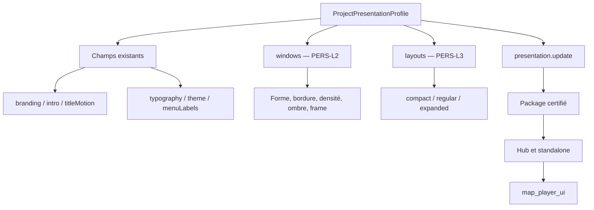

# PokeMap Personalization Studios Implementation Roadmap

> **For agentic workers:** REQUIRED SUB-SKILL: Use `subagent-driven-development` (recommended) or `executing-plans` to implement this roadmap lot by lot. Every lot must end with fresh tests, build evidence, visual acceptance and a scoped commit.

**Goal:** Livrer dans PokeMap une personnalisation compréhensible et réellement consommée par le jeu : aperçu immédiat, fenêtres personnalisables, placements responsifs contraints, puis presets partageables sur toutes les surfaces joueur.

**Architecture:** `ProjectPresentationProfile` reste la source project-owned. Toutes les modifications passent par `presentation.update`, sont transportées dans le package certifié, chargées par le Hub et consommées par `map_player_ui`. Les couleurs restent dans le thème sémantique, les formes dans Window Studio et les placements dans Layout Studio ; aucun JSON, CSS ou arbre de widgets libre n’est exposé au créateur.

**Tech Stack:** Dart, Flutter, Freezed/JSON, Riverpod 3, packages `map_core`, `map_authoring`, `map_distribution`, `map_editor`, `map_player_ui`, `map_runtime`, PokeMap Hub et PokeMap MCP.

---

## 0. Décision en une page

| Élément | Décision |
|---|---|
| Socle déjà livré | `337a97a6e feat(personalization): add live pause menu customization` |
| Lots restant à livrer | **2** après la fermeture de PERS-L2 |
| Ordre | Acceptation → Window Studio → Layout Studio → Extension complète |
| Mutation canonique | `presentation.update` |
| Profil canonique | `ProjectPresentationProfile` |
| Preview | Editor-owned, certifiée contre les mêmes fixtures que le player ; aucune dépendance aux internes runtime |
| Couleurs | `ProjectSemanticThemeProfile` |
| Formes de fenêtres | Nouveau profil Window Studio |
| Placements | Nouveau profil Layout Studio à breakpoints fixes |
| Coordonnées libres | Exclues |
| Splash Avelune | Host-owned, visible dans le parcours mais non personnalisable |
| État global | PERS-L1 et PERS-L2 `DONE` ; Phase 8 toujours `PARTIAL` jusqu’à PERS-L4 |

Le commit `337a97a6e` est le **lot zéro livré**. Il ne doit pas être recompté comme travail futur : il prouve déjà la verticale modèle → sauvegarde canonique → export → Hub → menu Pause réel.

## 1. Ce que signifie « l’interface magique »

La cible est atteinte lorsque :

- chaque réglage indique clairement où il apparaît dans le jeu ;
- le résultat est visible pendant l’édition dans la bonne surface ;
- un projet ancien conserve exactement son rendu actuel ;
- les réglages invalides expliquent le problème avant l’export ;
- le Hub et le standalone consomment les mêmes valeurs ;
- clavier, manette, grands textes, portrait, paysage et mouvement réduit restent utilisables ;
- aucune capacité n’existe uniquement dans le schéma, l’éditeur ou la preview ;
- aucun placement ne dépend d’une résolution ou d’une coordonnée pixel absolue.

## 2. Architecture cible verrouillée



Décisions non négociables :

1. Le thème sémantique possède les couleurs. Window Studio référence ses tokens au lieu de dupliquer des palettes.
2. Les breakpoints sont définis par le runtime. Le projet choisit une variante par classe, pas ses propres seuils.
3. L’éditeur ne dépend pas des internes de `map_runtime`. La fidélité se prouve par fixtures communes, résolveurs purs et comparaisons visuelles editor/player.
4. `presentation.update` reste la seule mutation de profil complet. Les packs du lot 4 possèdent des actions dédiées uniquement pour leur cycle import/export.
5. Toute ressource image ou fonte reste relative au projet, cataloguée, validée et soumise au lifecycle d’assets.
6. Le splash de plateforme reste Avelune-owned. Un jeu ne peut ni le masquer ni le recolorer.

## 3. Audit initial

### 3.1 Socle réellement livré par `337a97a6e`

- `ProjectMenuLabelsProfile` et validation vide, longueur et caractères de contrôle ;
- édition guidée des neuf libellés du menu Pause ;
- fallback automatique vers la localisation player ;
- sauvegarde du Studio via `EditorAuthoringMutationAdapter.savePresentation` et `presentation.update` ;
- export `.avelunegame`, chargement Hub et consommation par `PlayerPauseMenu` ;
- preview intro, titre, dialogue, menu, HUD exploration et HUD combat ;
- simulations paysage, portrait, carré, text scale et reduced motion ;
- comparaison brouillon/sauvegarde et composition éditeur/preview côte à côte ;
- tests ciblés dans core, authoring, distribution, editor, player UI et Hub.

### 3.2 Gaps confirmés

| Gap | Conséquence |
|---|---|
| 6 tests globaux Personalization rouges | La preview actuelle n’est pas encore certifiée comme parcours complet |
| Preview composée dans l’éditeur | La fidélité au player n’est pas prouvée par goldens croisés |
| `compareProjectPresentation` ignore `menuLabels` et `titleMotion` | Comparaison, reset et presets peuvent mentir |
| Presets/reset incomplets | Une section peut paraître réinitialisée sans l’être entièrement |
| Test MCP sans `menuLabels` | La nouvelle sémantique n’est pas prouvée sur le transport live |
| Transport Editor absent du catalogue `presentation.update` | La parité reste administrativement partielle |
| `titleMotion` sans parcours no-code complet | Le schéma possède encore une capacité invisible |
| Window Studio absent | Rayons, bordures, densité et frames restent codés dans les widgets |
| Layout Studio absent | Les placements restent déterminés par le code |
| Aucun pack de style | Les personnalisations ne sont ni partageables ni importables |

### 3.3 Échecs globaux à fermer en premier

Commande fraîche de l’audit :

```bash
cd packages/map_editor
flutter test test/personalization --reporter expanded
```

Résultat : **95 réussis, 6 échoués**, exit `1`.

1. `Phase 5 golden fixture packages every presentation category` attend les anciens chemins d’intro plats au lieu de `presentation/intro/landscape/...`.
2. `PST-061 saves a Studio profile and exports its installable package` reçoit `false` après la sauvegarde canonique.
3. `runs preflight in Studio and invalidates it after a draft edit` ne déclenche pas le preflight.
4. `applies a preset to a dirty draft without writing project.json` conserve `standard` au lieu de `cinematic`.
5. `branding accent and layout update only the studio draft` manque sa cible de clic.
6. `title music import, preview, and removal stay in the draft` manque sa cible de clic et n’appelle pas le picker.

Aucun lot ne peut être marqué `DONE` en neutralisant les hit-tests, en appelant directement un callback ou en supprimant une assertion.

### 3.4 État Git observé

Au début de la préparation de cette roadmap :

```text
HEAD 337a97a6e
Worktree sale avec le chantier Smart Tiles/runtime parallèle.
```

Pendant l’audit, ce chantier parallèle a été commit sous :

```text
49afbe464 feat(smart-tiles): add cell-entry animation activation for smart tile layers
```

`49afbe464` a `337a97a6e` pour parent et ne modifie pas le périmètre Personalization. La roadmap ne réécrit aucun de ces deux commits.

## 4. Vue d’ensemble des quatre lots restants

| Lot | Résultat visible | Taille | Dépend de | Statut initial |
|---|---|---:|---|---|
| PERS-L1 | La preview actuelle est fiable, accessible et acceptée dans la vraie app | M | Socle `337a97a6e` | **DONE — 2026-08-10** |
| PERS-L2 | Window Studio personnalise réellement Pause et Dialogue | L | PERS-L1 | **DONE — 2026-08-10** |
| PERS-L3 | Layout Studio place les contenus par variantes responsives sûres | L | PERS-L2 | Prêt |
| PERS-L4 | Toutes les surfaces utilisent les contrats et les presets sont partageables | XL | PERS-L3 | Bloqué par L3 |

La dépendance est stricte :

```text
PERS-L1 → PERS-L2 → PERS-L3 → PERS-L4
```

## 5. PERS-L1 — Stabilisation et acceptation de la preview

### Résultat utilisateur

La nouvelle interface de la preview est celle de PokeMap, pas une démonstration séparée. Chaque section est atteignable, les changements restent visibles après redémarrage et l’aperçu annonce uniquement ce que le runtime consomme réellement.

### Scope

- [x] Corriger les six tests globaux sans contourner les interactions réelles.
- [x] Centraliser les scénarios de preview : surface, viewport, text scale, reduced motion, baseline et brouillon.
- [x] Centraliser les descripteurs de surfaces : libellé, rôle typographique, token sémantique et projection.
- [x] Scinder le grand widget de preview en contrôles, canvas et surfaces ciblées.
- [x] Couvrir `menuLabels` et `titleMotion` dans comparaison, reset et presets : reset Branding efface `branding + titleMotion`, reset Interface efface `theme + menuLabels`.
- [x] Ajouter des goldens déterministes editor et player alimentés par la même fixture.
- [x] Ajouter `menuLabels` à la preuve MCP de `presentation.update`.
- [x] Déclarer le transport Editor dans la parité canonique.
- [x] Rejouer le parcours dans l’application macOS réelle sans prendre le contrôle d’une autre session active.

### Fichiers structurants

| Action | Fichier |
|---|---|
| Modifier | `packages/map_editor/lib/src/features/personalization/application/personalization_preview_projection.dart` |
| Créer | `packages/map_editor/lib/src/features/personalization/application/personalization_preview_scenario.dart` |
| Modifier | `packages/map_editor/lib/src/features/personalization/application/project_presentation_presets.dart` |
| Modifier | `packages/map_editor/lib/src/features/personalization/presentation/personalization_runtime_preview.dart` |
| Créer | `packages/map_editor/lib/src/features/personalization/presentation/personalization_preview_controls.dart` |
| Créer | `packages/map_editor/lib/src/features/personalization/presentation/personalization_preview_canvas.dart` |
| Modifier | `packages/map_editor/test/personalization/personalization_runtime_preview_test.dart` |
| Créer | `packages/map_editor/test/personalization/personalization_runtime_preview_golden_test.dart` |
| Modifier | `packages/map_authoring/lib/src/parity/full_authoring_parity.dart` |
| Modifier | `packages/map_authoring/test/parity/full_authoring_parity_test.dart` |
| Modifier | `tools/pokemap_mcp/test/mutation_server.test.ts` |

### Gate de sortie

- [x] `flutter test test/personalization --reporter expanded` termine à `0 failed`.
- [x] Les interactions utilisent des widgets `hitTestable()` et des scrollables explicitement identifiés.
- [x] Le shell passe à `759×900`, `760×900`, `761×900`, `1024×720`, `1280×800` et `1600×1000`.
- [x] Les mêmes cas passent à text scale `1.0` et `2.0` sans overflow ni scroll horizontal obligatoire.
- [x] Tab, Shift+Tab, Entrée, Espace, directions/D-pad et A couvrent le parcours preview/publication. Échap/B sont `N/A` dans le Studio embarqué : il ne possède ni modal ni niveau de navigation à fermer ; leur affecter une action locale serait arbitraire.
- [x] Les goldens couvrent les six surfaces, paysage et portrait ; carré uniquement lorsqu’il apporte une différence réelle.
- [x] Reduced motion est prouvé pour intro et titre.
- [x] La comparaison détecte `menuLabels` et `titleMotion`.
- [x] Direct API, JSONL/CLI, Editor et MCP produisent le même profil de labels.
- [x] Un build macOS debug réussit et le parcours réel est inspecté visuellement.

### Clôture PERS-L1 — 2026-08-10

Statut produit : **DONE**. Le schéma reste en version 2 et Window/Layout Studio restent hors scope.

Preuves principales :

- suite Personalization : `140 passed`, `0 failed` ;
- gate Editor + export + Personalization : `174 passed`, `0 failed` ;
- goldens : 12 editor et 12 player, six surfaces en paysage et portrait ;
- authoring ciblé : `15 passed`, analyse `No issues found!` ;
- MCP `presentation.update` avec `menuLabels` : test live ciblé vert ; suite séquentielle `37 passed`, `1 failed` sur `runtime_server.test.ts`, sans lien avec la présentation ;
- build réel : `Built build/macos/Build/Products/Debug/PokeMap.app` ;
- smoke réel isolé : projet disposable attesté, ouverture de `personalizationStudio`, 306 éléments inspectables, menu en portrait à 200 % et mouvement réduit vérifiés par clés stables et capture ;
- fixture source inchangée avant/après (`0932bd9eefd549bedda54b2afe2fd0b9a95dc5595950f0f1ce52bd5e1c24d702`).

Limites de validation globales conservées :

- `flutter analyze` reste rouge sur 379 diagnostics préexistants, sans warning ou erreur ajouté par PERS-L1 ;
- la suite globale `map_editor` a été interrompue après `5160 passed`, `11 skipped`, `133 failed` lorsqu’un test Narrative a dépassé son timeout de dix minutes puis bloqué le runner ; l’interruption a ajouté un échec technique de fermeture du loader. Les échecs observés concernent notamment goldens Narrative absents, fixtures Selbrume V2/V6 et lifecycles Riverpod, pas Personalization ;
- le connecteur Marionette Codex installé est en `0.5.0` face au binding projet `0.6.0`. Le smoke a utilisé les extensions debug `0.6.0` du processus isolé directement ; aucune autre instance PokeMap n’a été pilotée.

### Commandes obligatoires

```bash
cd packages/map_editor
flutter test test/personalization --reporter expanded
flutter test test/authoring_api/editor_mutation_parity_test.dart \
  test/game_export/game_package_export_service_test.dart \
  test/personalization
flutter test
flutter analyze
flutter build macos --debug

cd ../map_authoring
dart test test/domains/assets/presentation_authoring_test.dart \
  test/parity/full_authoring_parity_test.dart
dart analyze

cd ../../tools/pokemap_mcp
npm run check
npm test
```

### Non-objectifs

- nouveaux champs de projet ;
- Window Studio ou Layout Studio ;
- modification du splash Avelune ;
- refonte générale de `map_player_ui`.

### Commit de lot proposé

```text
fix(personalization): certify the studio preview experience
```

## 6. PERS-L2 — Window Studio V1

### Résultat utilisateur

Le créateur choisit l’apparence des fenêtres sans JSON et voit cette apparence dans le menu Pause et les dialogues du jeu installé.

### Contrat proposé

```text
ProjectWindowStyleProfile
- id
- fillToken
- borderToken
- borderWidth
- cornerRadius
- contentPadding
- shadowElevation

ProjectPresentationWindowsProfile
- styles
- defaultStyleId
- pauseMenuStyleId
- dialogueStyleId
- pauseBackdropOpacity
```

Les valeurs numériques sont bornées et éditées par contrôles guidés. `fillToken` et `borderToken` référencent le thème sémantique existant ; aucune couleur n’est copiée dans le profil de fenêtre.

### Scope

- [x] Ajouter modèle, JSON, migration/defaults et validation pure dans `map_core`.
- [x] Passer `ProjectPresentationProfile` à `schemaVersion: 3` et migrer V2 → V3 sans modifier le rendu des projets dépourvus de `windows`.
- [x] Étendre `presentation.update` et la ressource queryable.
- [x] Transporter le profil dans le manifeste `.avelunegame`.
- [x] Créer un thème Window résolu dans `map_player_ui`.
- [x] Faire consommer le profil par les primitives communes, puis Pause et Dialogue.
- [x] Construire un éditeur no-code avec presets sûrs, reset et comparaison.
- [x] Prévisualiser les mêmes fixtures dans l’éditeur et le player.
- [x] Charger réellement le profil depuis un jeu installé dans le Hub.

### Fichiers structurants

| Action | Fichier |
|---|---|
| Créer | `packages/map_core/lib/src/models/project_presentation_window_profile.dart` |
| Modifier | `packages/map_core/lib/src/models/project_presentation_profile.dart` |
| Créer | `packages/map_core/test/project_presentation_window_profile_test.dart` |
| Modifier | `packages/map_authoring/lib/src/domains/assets/presentation_actions.dart` |
| Modifier | `packages/map_distribution/lib/src/game_package_manifest.dart` |
| Modifier | `packages/map_distribution/lib/src/game_package_manifest_codec.dart` |
| Créer | `packages/map_player_ui/lib/src/theme/pokemap_player_window_theme.dart` |
| Modifier | `packages/map_player_ui/lib/src/foundation/player_components.dart` |
| Modifier | `packages/map_player_ui/lib/src/player/player_pause_menu.dart` |
| Modifier | `packages/map_player_ui/lib/src/player/player_dialogue_overlay.dart` |
| Créer | `packages/map_editor/lib/src/features/personalization/presentation/project_window_studio.dart` |
| Créer | `packages/map_editor/lib/src/features/personalization/application/project_window_style_presets.dart` |
| Modifier | `apps/pokemap_hub/lib/features/session/application/services/hub_title_presentation_loader.dart` |

### Gate de sortie

- [x] Pause et Dialogue consomment les styles dans le standalone et le Hub installé.
- [x] Un projet sans `windows` conserve le chemin de rendu historique pixel pour pixel.
- [x] Les valeurs hors bornes, non finies et les tokens inconnus sont rejetés.
- [x] Brouillon, undo/redo, autosave, restart recovery et conflit de révision sont testés.
- [x] La preview editor et le player utilisent le même profil fixture et des goldens comparables.
- [x] API directe, JSONL/CLI, Editor, export, Hub et MCP sont prouvés.
- [x] Les widgets concernés délèguent rayon, padding et bordure à `PlayerPanel` lorsqu’un profil Window est présent.

### Clôture PERS-L2 — 2026-08-10

Statut produit : **DONE**. `pauseBackdropOpacity` appartient au profil Window global, car seul le menu Pause possède un backdrop ; le dialogue ne reçoit pas un champ sans consommateur. L’absence de `windows` conserve volontairement le chemin historique de `PlayerPanel`, au lieu de simuler un faux profil legacy qui ne pourrait pas représenter pixel pour pixel les deux implémentations Pause existantes.

Preuves principales :

- `map_core` : 30 tests ciblés verts pour codec, migrations V1/V2, bornes inclusives et exclusives, non-finis, tokens, références et contraste ;
- `map_authoring` : 16 tests verts pour `presentation.update`, query et parité directe/JSONL ;
- `map_distribution` : 31 tests verts pour manifeste V3, codec, preflight et hash ;
- `map_editor` : 146 tests Personalization verts, dont Window Studio à `720×900` et text scale `2.0`, presets, reset, comparaison, sauvegarde, restart et export ;
- `map_player_ui` : suite complète verte, 161 tests, avec Pause standalone, vrai `RuntimePlayerPauseShell`, Dialogue, bordure désactivée, padding historique de `PlayerSurface` et fallback sans profil ;
- PokeMap Hub : 14 tests verts sur loader, package installé, rendu Phase 5 et parcours export-install-start Phase 6 ;
- standalone : smoke `phase_a_golden_slice_launch_test.dart` vert, 9 tests ;
- goldens : 4 images editor et 4 images player mises à jour pour Pause et Dialogue, paysage et portrait, depuis `golden_personalization_slice/presentation.json` ;
- MCP : TypeScript check et build verts ; mutation réelle `presentation.update`, requery `projectPresentationProfile`, catalogue V3 et parité transport vérifiés par le SDK MCP local.

Limites globales sans lien avec PERS-L2 :

- la suite complète `map_core` termine à `4017 passed`, `1 skipped`, `11 failed` : trois timeouts de benchmarks exécutés sous charge, deux budgets Border dépassés, quatre fixtures historiques absentes et deux attentes obsolètes de l’inventaire Smart Tiles ; les tests PERS-L2 isolés restent verts ;
- la suite complète `map_distribution` conserve six échecs sur des fichiers historiques absents sous `reports/product/pokemap_hub/phase_0`, tandis que les 31 tests de personnalisation ciblés sont verts ;
- `flutter analyze` de `map_editor` et du host standalone reste non nul sur leurs diagnostics préexistants ; aucun diagnostic ne vise les nouveaux fichiers Window Studio ou Window Theme.

### Tests minimum

```text
map_core        codec + validation + migration + defaults
map_authoring   plan/apply + stale revision + assets + JSONL
map_distribution manifeste + codec + preflight
map_editor      édition + draft/save/restart + preview + export
map_player_ui   Pause + Dialogue + primitives communes
pokemap_hub     package installé + rendu consommé
tools/pokemap_mcp mutation réelle + requery
```

### Non-objectifs

- placement responsive ;
- CSS ou widget tree libre ;
- application immédiate à toutes les surfaces ;
- textures, frames décoratives et nine-slices ;
- animations de chrome ;
- splash Avelune personnalisable.

### Commit de lot proposé

```text
feat(personalization): add project window styles
```

## 7. PERS-L3 — Layout Studio responsive V1

### Résultat utilisateur

Le créateur choisit où vivent les blocs du titre, du menu Pause et du dialogue selon la classe d’écran, sans pouvoir produire une interface inaccessible ou spécifique à sa machine.

### Contrat proposé

```text
ProjectPresentationBreakpoint
- compact
- regular
- expanded

ProjectSurfaceLayoutVariant
- alignment
- maxWidthFactor
- maxHeightFactor
- safeAreaPadding
- contentPadding
- spacingScale
- contentOrder stable
- optionalVisibilityFlags bornés aux éléments secondaires

ProjectResponsiveSurfaceLayout
- compact
- regular
- expanded

ProjectPresentationLayoutsProfile
- title
- pauseMenu
- dialogue
```

Le runtime possède les seuils de breakpoints. L’utilisateur manipule des slots, alignements et ordres bornés ; jamais des coordonnées absolues.
Les actions essentielles ne peuvent jamais être masquées par `optionalVisibilityFlags`.

### Scope

- [ ] Ajouter le profil et un résolveur pur dans `map_core`.
- [ ] Migrer `branding.layoutVariant` vers les nouveaux presets tout en le conservant en lecture pendant une version complète.
- [ ] Ajouter le résolveur partagé côté player sans logique gameplay.
- [ ] Adapter Title, Pause et Dialogue.
- [ ] Construire un canvas contraint avec snap, reset, comparaison et presets.
- [ ] Utiliser les scénarios de preview stabilisés au lot 1.
- [ ] Étendre authoring, distribution, Hub, export et MCP.
- [ ] Prouver focus, safe areas, text scale et fallbacks.

### Fichiers structurants

| Action | Fichier |
|---|---|
| Créer | `packages/map_core/lib/src/models/project_presentation_layout_profile.dart` |
| Créer | `packages/map_core/lib/src/operations/project_presentation_layout_resolver.dart` |
| Modifier | `packages/map_core/lib/src/models/project_presentation_profile.dart` |
| Modifier | `packages/map_core/lib/map_core.dart` et fichiers Freezed/JSON générés |
| Créer | `packages/map_core/test/project_presentation_layout_profile_test.dart` |
| Créer | `packages/map_core/test/project_presentation_layout_resolver_test.dart` |
| Modifier | `packages/map_authoring/lib/src/domains/assets/presentation_actions.dart` et tests de parité |
| Modifier | `packages/map_distribution/lib/src/game_package_manifest.dart` et `game_package_manifest_codec.dart` |
| Modifier | `packages/map_editor/lib/src/features/game_export/application/game_package_export_service.dart` |
| Créer | `packages/map_player_ui/lib/src/layout/player_responsive_surface_layout.dart` |
| Modifier | `packages/map_player_ui/lib/map_player_ui.dart` |
| Modifier | `packages/map_player_ui/lib/src/player/player_title_screen.dart` |
| Modifier | `packages/map_player_ui/lib/src/player/player_pause_menu.dart` |
| Modifier | `packages/map_player_ui/lib/src/player/player_dialogue_overlay.dart` |
| Créer | `packages/map_editor/lib/src/features/personalization/presentation/project_layout_studio.dart` |
| Créer | `packages/map_editor/lib/src/features/personalization/presentation/personalization_layout_canvas.dart` |
| Modifier | `packages/map_editor/lib/src/features/personalization/presentation/personalization_runtime_preview.dart` |
| Modifier | `apps/pokemap_hub/lib/features/session/application/services/hub_title_presentation_loader.dart` |
| Modifier | `tools/pokemap_mcp/test/mutation_server.test.ts` et catalogue `pokemap_describe` |

### Matrice obligatoire

| Cas | Taille | Text scale | Safe area |
|---|---:|---:|---:|
| Téléphone portrait | `390×844` | `1.0`, `2.0` | haut `44`, bas `34` |
| Téléphone paysage | `844×390` | `1.0`, `2.0` | latéral/bas `21` |
| Tablette portrait | `768×1024` | `1.0`, `2.0` | standard |
| Tablette paysage | `1024×768` | `1.0`, `2.0` | standard |
| Desktop HD | `1280×720` | `1.0`, `2.0` | zéro |
| Desktop FHD | `1920×1080` | `1.0` | zéro |
| Ultra-wide | `2560×1080` | `1.0` | zéro |

`reducedMotion=true/false` est obligatoire au minimum pour `390×844` et `1280×720`.

### Gate de sortie

- [ ] Le même résolveur sélectionne compact, regular ou expanded pour preview, standalone et Hub.
- [ ] Portrait, paysage, fallback et projet legacy sont déterministes.
- [ ] Aucun contenu ne quitte les safe areas.
- [ ] Aucun overflow à 200 % de texte.
- [ ] Le focus clavier/manette reste stable après changement de breakpoint et réordonnancement.
- [ ] Snap, bornes, annulation et restauration sont couverts par interaction réelle.
- [ ] Les goldens editor/player utilisent exactement la même fixture.
- [ ] `branding.layoutVariant` conserve sa sémantique historique pendant la migration.
- [ ] Les quatre transports et le package installé sont prouvés.

### Non-objectifs

- drag libre au pixel ;
- seuils de breakpoint configurables ;
- layout différent pour chaque appareil ;
- logique de gameplay ;
- keyframes ou timeline ;
- skin du splash hôte.

### Commit de lot proposé

```text
feat(personalization): add responsive surface layouts
```

## 8. PERS-L4 — Toutes surfaces, presets et import/export

### Résultat utilisateur

Le créateur applique le même langage visuel à toutes les interfaces joueur, enregistre un preset, l’exporte et le réimporte sans perdre ses assets ni casser un ancien projet.

### Surfaces à certifier

- titre et prompt ;
- dialogue ;
- menu Pause ;
- équipe ;
- sac ;
- Pokédex ;
- carte ;
- sauvegarde ;
- options ;
- crédits ;
- notifications et confirmations ;
- HUD exploration ;
- HUD combat ;
- résultats de combat et capture.

L’intro reste une surface plein écran. Elle ne reçoit un style de fenêtre qu’après démonstration d’un besoin réel.

### Contrats proposés

```text
ProjectPresentationSurfaceRole
ProjectPresentationSurfaceAssignments
ProjectPresentationPresetPack
PresentationPresetPackManifest
PresentationPresetAsset
PresentationPresetCompatibility
```

Format local proposé : `.pokemapstyle`, archive déterministe :

```text
manifest.json
profile.json
assets/
licenses/
```

Actions canoniques proposées :

```text
presentation.preset.import_plan
presentation.preset.import_apply
presentation.preset.export
presentation.preset.delete_plan
presentation.preset.delete_apply
```

Ressource queryable proposée : `projectPresentationPreset`.

### Scope

- [ ] Inventorier chaque surface et son ownership window/layout/theme/labels.
- [ ] Étendre les contrats prouvés des lots 2–3 sans ajouter de renderer parallèle.
- [ ] Rendre `titleMotion.promptLoop` et `menuLoop` entièrement éditables sans JSON.
- [ ] Clarifier icon, cover et hero par destination réelle.
- [ ] Ajouter une bibliothèque de presets versionnés et réversibles.
- [ ] Exporter et importer les packs avec assets et licences.
- [ ] Ajouter une section unique Vérifier & publier avec erreurs actionnables.
- [ ] Certifier le profil final dans un package installé Hub et un standalone.
- [ ] Vérifier `pokemap_describe` live après rebuild MCP.

### Sécurité d’import obligatoire

- chemins relatifs uniquement ;
- rejet traversal et symlinks ;
- checksum, MIME et limites de taille ;
- licences obligatoires pour fontes et assets redistribuables ;
- staging avant apply ;
- import atomique et révisionné ;
- aucune écriture hors root autorisée ;
- aucune extension exécutable ou widget Flutter importable.

### Fichiers structurants

| Action | Fichier |
|---|---|
| Créer | `packages/map_core/lib/src/models/project_presentation_surface_role.dart` |
| Modifier | profils Window/Layout, `ProjectPresentationProfile`, barrels et fichiers générés |
| Créer | `packages/map_distribution/lib/src/presentation_preset_pack.dart` |
| Créer | `packages/map_distribution/lib/src/presentation_preset_pack_codec.dart` |
| Créer | `packages/map_authoring/lib/src/domains/assets/presentation_preset_actions.dart` |
| Modifier | dispatcher, resource registry et catalogue de parité `map_authoring` |
| Créer | `packages/map_editor/lib/src/features/personalization/application/project_presentation_pack_import_service.dart` |
| Créer | `packages/map_editor/lib/src/features/personalization/application/project_presentation_pack_export_service.dart` |
| Créer | `packages/map_editor/lib/src/features/personalization/presentation/project_presentation_preset_library.dart` |
| Modifier | lifecycle d’assets, preflight, export et tests Personalization Editor |
| Modifier | surfaces concernées sous `packages/map_player_ui/lib/src/player/` |
| Modifier | chargement Hub et tests de package installé |
| Modifier | `pokemap_authoring_api_mcp_action_catalog.md` |
| Modifier | `tools/pokemap_mcp/test/mutation_server.test.ts` et tests de ressources |

### Matrice de complétude

Chaque champ doit être prouvé de bout en bout :

```text
schéma → validation → migration → API canonique → JSONL/CLI
→ UI no-code → preview → export → standalone runtime
→ Hub installé → MCP live → accessibilité
```

Une cellule vaut `PASS` ou possède une justification `N/A` démontrée. Une cellule vide interdit `DONE`.

### Gate de sortie

- [ ] Chaque surface inventoriée consomme theme, window et layout selon sa responsabilité.
- [ ] Aucun champ du profil n’est techniquement présent mais introuvable dans le Studio.
- [ ] Preset, reset, undo/redo et comparaison couvrent toutes les sections.
- [ ] Import/export préserve assets, licences, checksums et compatibilité de schéma.
- [ ] Un package réellement installable est lancé dans le Hub.
- [ ] Standalone et Hub produisent les mêmes résolutions de style/layout.
- [ ] Les builds desktop Hub/editor/host et Android Hub réussissent.
- [ ] Toutes les analyses et suites globales concernées sont vertes.
- [ ] Le catalogue et le live `pokemap_describe` exposent les actions et ressources réelles.

### Commandes de certification finale

```bash
cd packages/map_core && dart test && dart analyze
cd ../map_authoring && dart run tool/pmcp085_conformance.dart && dart test && dart analyze
cd ../map_distribution && dart test && dart analyze
cd ../map_player_ui && flutter test && flutter analyze
cd ../map_runtime && flutter test && flutter analyze
cd ../map_editor && flutter test && flutter analyze && flutter build macos --debug
cd ../../examples/playable_runtime_host && flutter test && flutter analyze && flutter build macos --debug
cd ../../apps/pokemap_hub && flutter test && flutter analyze && flutter build macos --debug && flutter build apk --debug
cd ../../tools/pokemap_mcp && npm run check && npm test
```

### Non-objectifs

- marketplace ou synchronisation cloud ;
- publication communautaire ;
- plugins exécutables ;
- fusion automatique de packs conflictuels ;
- montage vidéo ou éditeur de sous-titres temporel ;
- personnalisation du splash Avelune.

### Commit de lot proposé

```text
feat(personalization): complete shareable presentation profiles
```

## 9. Règles communes de fermeture d’un lot

Un lot reste `PARTIAL` si une seule de ces conditions est vraie :

- la fonctionnalité existe uniquement dans l’éditeur ou la preview ;
- le runtime utilise encore une constante concurrente ;
- l’utilisateur doit éditer du JSON ou un chemin manuel ;
- un test global lié au lot échoue ;
- un build requis est omis ou échoue ;
- un projet legacy change sans migration prouvée ;
- la matrice responsive ou accessibilité est incomplète ;
- API directe, JSONL/CLI, Editor ou MCP ne sont pas prouvés ;
- le Hub installé et le standalone divergent ;
- un changement concurrent Smart Tiles/runtime est incorporé au commit.

Chaque lot doit terminer par :

```bash
bash tools/scripts/check_markdown_hygiene.sh
git diff --check
git status --short --untracked-files=all
```

Le rapport de lot doit fournir les commandes exactes, leurs résultats, le build, l’acceptation visuelle, l’état Git initial/final, les limites et les risques restants.

## 10. Alignement avec la roadmap existante

Cette roadmap détaille la **Phase 8 — Refonte du Personalization Hub** de `documentation/roadmap/road_map_runtime_media_cinematics_audio_time.md`.

| Capacités parentes | Lot de fermeture principal |
|---|---|
| PERS-01, PERS-02, PERS-06, PERS-07, PERS-08, PERS-11, PERS-13, PERS-14 | PERS-L1 |
| PERS-05, PERS-09 | PERS-L2 |
| PERS-04, PERS-06 | PERS-L3 |
| PERS-03, PERS-04, PERS-05, PERS-09, PERS-10, PERS-11, PERS-12 | PERS-L4 |

La Phase 8 reste `PARTIAL` jusqu’à la certification de PERS-L4. Les statuts du document parent ne sont pas modifiés par cette roadmap seule.

## 11. Verdict des passes indépendantes

| Passe | Verdict |
|---|---|
| Audit / Architecture | `PASS` — scénario/descripteurs uniques, preview editor-owned et aucune dépendance aux internes runtime |
| Implémentation / Produit | `PASS` — les six parcours rouges sont fermés sans court-circuiter les interactions ; presets, reset et comparaison sont complets |
| Tests | `PASS PERS-L1` — 140/140 Personalization, 174/174 gate combiné et 24/24 goldens editor/player |
| Build / Validation | `PASS PERS-L1` — build macOS et smoke isolé réels ; bruits globaux hors lot documentés sans être maquillés |
| Critique finale | `PASS avec limites connues` — aucune dépendance runtime dans l’éditeur, aucun nouveau champ, Window/Layout Studio exclus |

## 12. Risques et auto-critique initiale

| Risque | Réponse de la roadmap |
|---|---|
| Mini-Flutter no-code incontrôlable | Breakpoints fixes, slots bornés, aucun arbre libre |
| Explosion combinatoire des goldens | Fixtures partagées et matrice minimale définie par lot |
| Duplication thème/window | Window référence les tokens sémantiques |
| Preview différente du runtime | Résolveurs purs, fixtures communes et goldens editor/player |
| Assets orphelins | Lifecycle canonique et imports atomiques |
| Régression des anciens projets | Defaults identiques et migration testée avant consommation |
| Confusion icon/cover/hero | Destinations explicites dans PERS-L4 |
| Mélange splash hôte/projet | Splash Avelune non éditable dans tous les lots |
| Parité annoncée mais non réelle | Preuve direct API, JSONL, Editor et MCP obligatoire |
| Worktree concurrent | Staging explicite par lot et contrôle du diff avant commit |

Le point volontairement ambitieux est PERS-L4. S’il dépasse un seul commit révisable, il doit être exécuté en sous-lots internes `surface assignments`, `preset pack` et `certification`, tout en conservant un seul statut produit : aucun sous-lot ne suffit à déclarer l’extension complète `DONE`.

## 13. Prochaine action

Commencer ensuite uniquement par **PERS-L2 — Window Studio V1**. PERS-L1 fournit désormais la baseline fiable ; PERS-L2 peut ajouter formes, bordures, densité et ombre sans mélanger les placements responsifs de PERS-L3.
