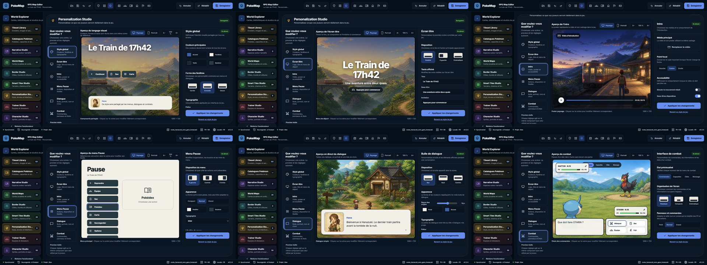
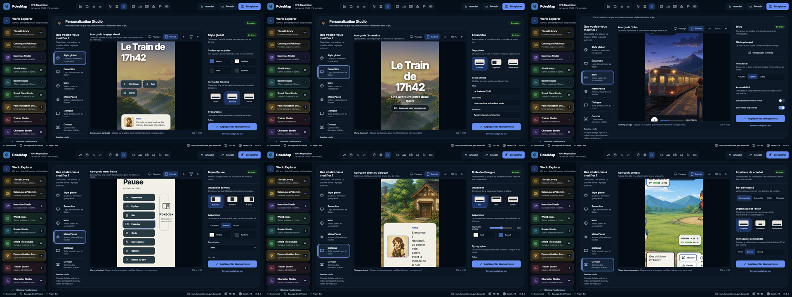

# Personalization Studio V2 Implementation Roadmap

> **For agentic workers:** REQUIRED SUB-SKILL: Use subagent-driven-development (recommended) or executing-plans to implement this roadmap lot by lot. Steps use checkbox syntax for tracking. Every lot ends with focused tests, explicit analyzer evidence, a visual or runtime proof when applicable, and one scoped commit.

**Goal:** Remplacer l’actuel Personalization Hub par un Studio immédiatement compréhensible dont chaque preview affiche les véritables widgets visibles dans le jeu, pour six scènes seulement : Style global, Écran titre, Intro, Menu Pause, Dialogue et Combat.

**Architecture:** ProjectPresentationProfile reste la source project-owned et presentation.update reste la mutation canonique. Les surfaces visuelles réutilisables appartiennent à map_player_ui ; la runtime et le Studio les composent avec des données différentes, mais ne possèdent jamais deux implémentations graphiques concurrentes. Le Studio possède uniquement le scénario de démonstration, les inspecteurs, la navigation et les contrôles de simulation.

**Tech Stack:** Dart 3, Flutter, Freezed/JSON, Riverpod 3, map_core, map_authoring, map_distribution, map_player_ui, map_runtime, map_editor, PokeMap Hub, PokeMap MCP, tests widget/golden et builds macOS.

---

## 0. Décision produit et état de cette roadmap

| Décision | Règle |
|---|---|
| Référence visuelle | La preview HTML V4 et les screenshots versionnés ci-dessous |
| Nombre de scènes | Six : Style global, Écran titre, Intro, Menu Pause, Dialogue, Combat |
| HUD exploration | Aucun écran dédié ; le jeu n’en possède pas |
| HUD combat | Le vocabulaire Studio devient « Combat » ; le nom JSON battleHudSurface reste compatible |
| Fidélité | La preview Flutter monte les mêmes widgets visibles que la runtime |
| Runtime internals | map_editor n’importe jamais package:map_runtime |
| Données de démonstration | Editor-owned et non persistées dans ProjectPresentationProfile |
| Portraits | Character Studio possède les assets ; Personalization Studio possède leur présentation |
| Mutation | presentation.update, sans second chemin de sauvegarde |
| Ancien Studio | Conservé uniquement jusqu’à ce que le nouveau parcours atteigne sa gate de parité |
| Schéma courant | ProjectPresentationProfile V4 |
| Prochaine évolution | V5 bornée au Combat et aux fallbacks associés |

Les anciens lots PERS-L1 à PERS-L4 restent de l’historique Git utile, mais leur statut DONE ne signifie pas que l’interface actuelle est acceptée. Cette roadmap V2 remplace leur cible UX sans jeter les contrats, migrations, transports et garanties déjà livrés.

## 1. Référence visuelle capturée

### 1.1 Contact sheets

### 1.2 Captures individuelles

| Scène | Paysage | Portrait |
|---|---|---|
| Style global | [PNG](assets/personalization-studio-v2/01-global-landscape.png) | [PNG](assets/personalization-studio-v2/01-global-portrait.png) |
| Écran titre | [PNG](assets/personalization-studio-v2/02-title-landscape.png) | [PNG](assets/personalization-studio-v2/02-title-portrait.png) |
| Intro | [PNG](assets/personalization-studio-v2/03-intro-landscape.png) | [PNG](assets/personalization-studio-v2/03-intro-portrait.png) |
| Menu Pause | [PNG](assets/personalization-studio-v2/04-pause-landscape.png) | [PNG](assets/personalization-studio-v2/04-pause-portrait.png) |
| Dialogue | [PNG](assets/personalization-studio-v2/05-dialogue-landscape.png) | [PNG](assets/personalization-studio-v2/05-dialogue-portrait.png) |
| Combat | [PNG](assets/personalization-studio-v2/06-battle-landscape.png) | [PNG](assets/personalization-studio-v2/06-battle-portrait.png) |

Capture réalisée à partir de http://127.0.0.1:8174/personalization-studio-v4.html?v=1. Les douze vues ont été rejouées après navigation réelle ; la console ne contenait ni warning ni erreur.

## 2. Audit initial du checkout

### 2.1 État Git initial

~~~text
Worktree: /Users/karim/.config/superpowers/worktrees/pokemonProject/personalization-preview-acceptance
Branch: feature/personalization-preview-acceptance
HEAD: 984b6973d chore(editor): satisfy pinned Flutter lints
Status initial: clean
~~~

### 2.2 Contrats déjà solides

- packages/map_core/lib/src/models/project_presentation_profile.dart porte le profil V4 : branding, intro, titleMotion, typography, theme, menuLabels, windows et layouts.
- packages/map_core/lib/src/models/project_presentation_window_profile.dart possède les rôles standard, pauseMenu et dialogue.
- packages/map_core/lib/src/models/project_presentation_layout_profile.dart possède des layouts responsifs pour title, pauseMenu et dialogue.
- packages/map_authoring/lib/src/domains/assets/presentation_actions.dart porte presentation.update et la lecture projectPresentationProfile.
- packages/map_distribution transporte le profil et ses assets dans le package certifié.
- packages/map_player_ui/lib/src/player/runtime_player_presentation.dart applique le thème sémantique, les fenêtres et les layouts.
- apps/pokemap_hub/lib/features/session/application/services/hub_runtime_startup_adapter.dart recharge la présentation installée.
- examples/playable_runtime_host et le Hub appliquent RuntimePlayerPresentation avant d’afficher le player.

### 2.3 Dette bloquante de la preview actuelle

packages/map_editor ne dépend pas de map_player_ui. Le fichier personalization_runtime_preview.dart redessine localement le titre, le dialogue, le menu, l’intro et le combat avec des classes privées telles que _TitleRuntimePreview, _DialogueRuntimePreview, _MenuRuntimePreview, _BattleHudRuntimePreview et _IntroRuntimePreview.

Conséquences :

1. une modification du vrai widget runtime ne modifie pas automatiquement la preview ;
2. les goldens editor et player peuvent être tous les deux verts tout en montrant deux interfaces différentes ;
3. l’ancien inventaire expose un HUD exploration absent du produit ;
4. le Combat ne possède ni rôle Window dédié, ni layout responsive dédié ;
5. la preview mélange les réglages persistés et les données fictives utilisées pour raconter une scène.

### 2.4 Widgets réels à partager

| Scène | Widget runtime actuel | Cible partagée |
|---|---|---|
| Écran titre | PlayerTitleScreen | PlayerTitleSurface monté par PlayerTitleScreen et le Studio |
| Intro | PlayerIntroVideoSurface | PlayerIntroVideoSurface directement |
| Menu Pause | RuntimePlayerPauseShell et PlayerPauseMenu | PlayerPauseSurface partagé, shell runtime conservé pour session/focus |
| Dialogue | PlayerDialogueOverlay | PlayerDialogueSurface partagé, overlay runtime conservé comme adaptateur |
| Combat | PlayerBattleOverlay | PlayerBattleSurface partagé, overlay runtime conservé comme adaptateur |
| Style global | RuntimePlayerPresentation.applyTo | Même ThemeData appliqué autour des cinq surfaces |

Le mot « même » désigne ici le même widget visible. Les wrappers runtime restent autorisés pour convertir les snapshots, dispatcher les commandes, gérer le focus ou charger les assets ; ils ne doivent pas repeindre la surface.

### 2.5 Character Studio : frontière à préserver

Il n’existe pas encore de contrat canonique de portrait et d’expression pour les personnages. Le Studio doit néanmoins conserver les contrôles Portrait, Nom et Choix.

Décision :

- aucun portrait n’est ajouté à ProjectPresentationProfile ;
- un PersonalizationCharacterPreviewSource editor-owned fournit des options de démonstration ;
- l’option transporte characterId, displayName, portraitPath et expressionId ;
- le provider de transition peut retourner une fixture locale ;
- lorsque Character Studio livre sa query canonique, seul l’adaptateur de source change ;
- la runtime reçoit plus tard une référence stable de personnage/expression, jamais une recherche fragile par nom affiché.

### 2.6 Risques principaux

| Risque | Réponse imposée |
|---|---|
| Import map_runtime dans map_editor | Test de frontière qui scanne les imports et échoue |
| Faux partage via deux widgets presque identiques | Tests find.byType sur le widget visible partagé |
| Changement visuel legacy involontaire | Golden avant/après avec profil absent |
| Migration V4 vers V5 modifiant le Combat | battle layout et combat font restent absents après migration |
| Portrait placé dans le profil de présentation | Test JSON prouvant son absence |
| Contrôle visible sans consommation runtime | Gate de parité par champ et par surface |
| Écran trop dense à 720 px | Layout adaptatif et inspecteur en side sheet |
| Goldens trompeurs | Même fixture JSON, widgets partagés, captures editor/player séparées |

## 3. Architecture cible

~~~mermaid
flowchart LR
  Profile["ProjectPresentationProfile"] --> Authoring["presentation.update"]
  Authoring --> Package["Package certifié"]
  Package --> Hub["Hub / standalone"]
  Hub --> RuntimePresentation["RuntimePlayerPresentation"]
  RuntimePresentation --> Shared["Surfaces visibles map_player_ui"]

  Studio["Personalization Studio"] --> Draft["Draft + autosave"]
  Draft --> Authoring
  Studio --> Scenario["Scénario editor-owned"]
  Scenario --> Shared

  Runtime["Snapshots et commandes map_runtime"] --> Adapters["Wrappers runtime"]
  Adapters --> Shared

  Character["Character Studio"] --> CharacterQuery["Query portraits / expressions"]
  CharacterQuery --> Scenario
  CharacterQuery --> Runtime
~~~

### 3.1 Autorités

| Couche | Possède | Ne possède pas |
|---|---|---|
| map_core | Profil, migrations, validation, rôles sémantiques | Widgets, fichiers locaux ouverts |
| map_authoring | Mutation/query canonique, révisions, parité transports | État Riverpod ou contrôles UI |
| map_distribution | Manifeste, assets, préflight, hash | Choix visuels |
| map_player_ui | ThemeData player, surfaces visibles et view-data UI | Sauvegarde de projet |
| map_runtime | Snapshots de jeu, commandes, orchestration | Duplication visuelle des surfaces |
| map_editor | Draft, navigation, scénario, inspecteurs, simulation | Rendu alternatif du player |
| Character Studio | Personnages, portraits, expressions | Forme/couleur/placement des dialogues |

### 3.2 Contrat de scène du Studio

~~~dart
enum PersonalizationStudioScene {
  globalStyle,
  title,
  intro,
  pause,
  dialogue,
  battle,
}

final class PersonalizationPreviewScenario {
  const PersonalizationPreviewScenario({
    required this.profile,
    required this.scene,
    required this.viewport,
    required this.textScale,
    required this.reducedMotion,
    required this.fixtures,
  });
}
~~~

PersonalizationPreviewFixtures contient uniquement le nom du jeu, une ligne de dialogue, des choix, les états de combat, les images de décor et une option de portrait. Son JSON éventuel reste dans les tests ou les fixtures editor ; il n’est jamais écrit dans project.json.

### 3.3 Règle de parité widget

Chaque surface possède un widget visible partagé et deux types de consommateurs :

~~~dart
PlayerDialogueOverlay(snapshot: runtimeSnapshot)
  -> maps snapshot
  -> PlayerDialogueSurface(data: sharedViewData)

PersonalizationPlayerSurfaceAdapter(scenario: editorScenario)
  -> maps fixture
  -> PlayerDialogueSurface(data: sharedViewData)
~~~

Le test bloquant vérifie que PlayerDialogueSurface, PlayerBattleSurface, PlayerPauseSurface, PlayerTitleSurface et PlayerIntroVideoSurface apparaissent dans l’arbre du Studio et dans l’arbre runtime correspondant.

## 4. Phases et ordre d’exécution

| Phase | Lots exécutables dans la même tranche | Résultat de phase | Dépendance |
|---|---|---|---|
| Phase 0 — Contrat | PERS2-00, PERS2-01 | Référence et vocabulaire verrouillés | aucune |
| Phase 1 — Widgets partagés | PERS2-02, PERS2-03, PERS2-04 | La preview affiche les vrais widgets | Phase 0 |
| Phase 2 — Nouveau shell | PERS2-05, PERS2-06, PERS2-07 | Navigation, preview et inspecteur simples | Phase 1 |
| Phase 3 — Cinq surfaces existantes | PERS2-08, puis PERS2-09 à PERS2-12 en parallèle | Global, titre, intro, Pause et Dialogue terminés | Phase 2 |
| Phase 4 — Combat V1 | PERS2-13, puis PERS2-14 et PERS2-15, puis PERS2-16 | Combat personnalisable de bout en bout | Phase 3 |
| Phase 5 — Certification — implémentée, gate globale PARTIAL | PERS2-17 et PERS2-18, puis PERS2-19 | Hub, standalone, accessibilité et acceptation finale | Phase 4 |

Ordre critique :

~~~text
00 → 01 → 02 → 03 → 04 → 05
                         ├─ 06
                         └─ 07
05/06/07 → 08 → 09 + 10 + 11 + 12
09/10/11/12 → 13 → 14 + 15 → 16
16 → 17 + 18 → 19
~~~

## 5. Phase 0 — Contrat et vocabulaire

### PERS2-00 — Captures et roadmap V2

**Statut : DONE — 2026-08-10**

**Résultat :** douze screenshots et deux contact sheets figent les six scènes en paysage et portrait.

**Fichiers :**

- Modifier : documentation/reports/roadmap/personalization/personalization_studios_roadmap.md
- Créer : documentation/reports/roadmap/personalization/assets/personalization-studio-v2/*.png

**Gate :**

- [x] Six scènes capturées en paysage.
- [x] Six scènes capturées en portrait.
- [x] Navigation réelle rejouée.
- [x] Console sans warning ni erreur.
- [x] Roadmap unique mise à jour au lieu de créer un second document concurrent.

**Commit proposé :** docs(personalization): define the studio v2 implementation roadmap

### PERS2-01 — Registre canonique des six scènes

**Résultat :** le code, les libellés et les tests parlent tous des mêmes six scènes.

**Fichiers :**

- Modifier : packages/map_editor/lib/src/features/personalization/application/personalization_preview_surface_descriptor.dart
- Modifier : packages/map_editor/lib/src/features/personalization/application/personalization_preview_projection.dart
- Modifier : packages/map_editor/lib/src/features/personalization/presentation/project_semantic_theme_editor.dart
- Modifier : packages/map_editor/lib/src/features/personalization/presentation/personalization_readiness_localizations.dart
- Test : packages/map_editor/test/personalization/personalization_preview_surface_descriptor_test.dart
- Test : packages/map_editor/test/personalization/personalization_runtime_preview_test.dart
- Test : packages/map_editor/test/personalization/project_semantic_theme_editor_test.dart

**Étapes :**

- [ ] Écrire un test exigeant exactement globalStyle, title, intro, pause, dialogue et battle.
- [ ] Vérifier que le test échoue encore sur overworldHud et battleHud.
- [ ] Remplacer PersonalizationPreviewSurface par PersonalizationStudioScene.
- [ ] Garder overworldHudSurface dans le modèle V4 pour compatibilité, mais ne plus l’exposer comme scène.
- [ ] Afficher « Combat » au lieu de « HUD combat » sans renommer la clé JSON battleHudSurface.
- [ ] Mettre à jour les clés ValueKey stables et les tests de navigation.

**Commandes :**

~~~bash
cd packages/map_editor
flutter test test/personalization/personalization_preview_surface_descriptor_test.dart \
  test/personalization/project_semantic_theme_editor_test.dart \
  test/personalization/personalization_runtime_preview_test.dart
flutter analyze lib/src/features/personalization test/personalization
~~~

**Gate :** aucune chaîne « HUD exploration » dans le parcours Studio ; aucun changement du JSON V4.

**Commit proposé :** refactor(personalization): align the studio on six player scenes

## 6. Phase 1 — Les véritables widgets dans la preview

### PERS2-02 — Extraire les surfaces visibles partagées

**Résultat :** runtime et Studio peuvent rendre les mêmes widgets sans partager les snapshots ni les contrôleurs.

**Fichiers :**

- Créer : packages/map_player_ui/lib/src/player/player_title_surface.dart
- Créer : packages/map_player_ui/lib/src/player/player_pause_surface.dart
- Créer : packages/map_player_ui/lib/src/player/player_dialogue_surface.dart
- Créer : packages/map_player_ui/lib/src/player/player_battle_surface.dart
- Créer : packages/map_player_ui/lib/player_surfaces.dart
- Modifier : packages/map_player_ui/lib/src/player/player_title_screen.dart
- Modifier : packages/map_player_ui/lib/src/player/player_pause_menu.dart
- Modifier : packages/map_player_ui/lib/src/player/runtime_player_pause_shell.dart
- Modifier : packages/map_player_ui/lib/src/player/player_dialogue_overlay.dart
- Modifier : packages/map_player_ui/lib/src/player/player_battle_overlay.dart
- Test : packages/map_player_ui/test/player/player_shared_surface_contract_test.dart
- Test : packages/map_player_ui/test/player_title_screen_test.dart
- Test : packages/map_player_ui/test/player_pause_menu_test.dart
- Test : packages/map_player_ui/test/player_dialogue_overlay_test.dart
- Test : packages/map_player_ui/test/player_battle_overlay_test.dart

**Contrats minimaux :**

~~~dart
final class PlayerDialogueViewData {
  final int revision;
  final String? speaker;
  final String text;
  final List<PlayerDialogueChoiceViewData> choices;
  final PlayerPortraitSlotData? portrait;
}

final class PlayerBattleViewData {
  final PlayerBattleHudViewData enemy;
  final PlayerBattleHudViewData player;
  final String prompt;
  final List<PlayerBattleCommandViewData> commands;
}
~~~

**Étapes :**

- [ ] Écrire des tests find.byType qui échouent tant que les wrappers peignent eux-mêmes leur contenu.
- [ ] Déplacer uniquement l’arbre visuel et ses view-data dans les quatre nouveaux fichiers.
- [ ] Conserver les conversions snapshot/commande dans les wrappers existants.
- [ ] Faire composer PlayerTitleScreen, RuntimePlayerPauseShell, PlayerDialogueOverlay et PlayerBattleOverlay avec la surface partagée correspondante.
- [ ] Exporter seulement les surfaces et view-data depuis player_surfaces.dart.
- [ ] Vérifier le fallback pixel historique lorsque ProjectPresentationProfile est absent.

**Commandes :**

~~~bash
cd packages/map_player_ui
flutter test test/player/player_shared_surface_contract_test.dart \
  test/player_title_screen_test.dart \
  test/player_pause_menu_test.dart \
  test/player_dialogue_overlay_test.dart \
  test/player_battle_overlay_test.dart
flutter analyze
~~~

**Gate :** les wrappers runtime contiennent les surfaces partagées ; aucune copie de l’arbre visible ne subsiste.

**Commit proposé :** refactor(player-ui): share visible player surfaces

### PERS2-03 — Brancher map_editor sur les surfaces partagées

**Résultat :** le Studio monte les mêmes widgets que le player avec des fixtures editor-owned.

**Fichiers :**

- Modifier : packages/map_editor/pubspec.yaml
- Créer : packages/map_editor/lib/src/features/personalization/application/personalization_preview_fixtures.dart
- Créer : packages/map_editor/lib/src/features/personalization/presentation/personalization_player_surface_adapter.dart
- Modifier : packages/map_editor/lib/src/features/personalization/presentation/personalization_preview_canvas.dart
- Modifier : packages/map_editor/lib/src/features/personalization/presentation/personalization_runtime_preview.dart
- Test : packages/map_editor/test/personalization/personalization_player_surface_adapter_test.dart
- Test : packages/map_editor/test/personalization/personalization_package_boundary_test.dart

**Étapes :**

- [ ] Ajouter map_player_ui comme dépendance locale.
- [ ] Créer une fixture typée pour titre, intro, Pause, dialogue et combat.
- [ ] Construire RuntimePlayerPresentation depuis le draft et appliquer exactement son ThemeData.
- [ ] Mapper les fixtures vers PlayerTitleSurface, PlayerIntroVideoSurface, PlayerPauseSurface, PlayerDialogueSurface et PlayerBattleSurface.
- [ ] Écrire un test qui échoue si un fichier du feature importe package:map_runtime.
- [ ] Écrire un test qui échoue si les cinq types partagés sont absents de l’arbre.

**Commandes :**

~~~bash
cd packages/map_editor
flutter pub get
flutter test test/personalization/personalization_player_surface_adapter_test.dart \
  test/personalization/personalization_package_boundary_test.dart
flutter analyze lib/src/features/personalization
~~~

**Gate :** la preview ne possède plus de renderer visuel indépendant.

**Commit proposé :** feat(personalization): preview real player surfaces

### PERS2-04 — Parité golden editor/player et suppression des faux renderers

**Résultat :** une fixture unique produit des captures editor et player séparées mais issues des mêmes widgets.

**Fichiers :**

- Créer : packages/map_player_ui/test/fixtures/personalization_studio_v2_fixture.dart
- Modifier : packages/map_player_ui/test/player/player_personalization_surface_golden_test.dart
- Modifier : packages/map_editor/test/personalization/personalization_runtime_preview_golden_test.dart
- Supprimer les classes privées de rendu dans : packages/map_editor/lib/src/features/personalization/presentation/personalization_runtime_preview.dart
- Supprimer les goldens overworldHud dans packages/map_editor/test/personalization/goldens/personalization/
- Supprimer les goldens overworldHud dans packages/map_player_ui/test/player/goldens/player_personalization/

**Étapes :**

- [ ] Ajouter des goldens paysage et portrait pour les cinq surfaces player.
- [ ] Ajouter un golden Style global qui compose plusieurs surfaces partagées.
- [ ] Ajouter un test de type commun en plus de la comparaison d’images.
- [ ] Supprimer _TitleRuntimePreview, _DialogueRuntimePreview, _MenuRuntimePreview, _OverworldHudRuntimePreview, _BattleHudRuntimePreview et _IntroRuntimePreview.
- [ ] Refuser toute régénération qui conserve overworldHud comme scène.

**Commandes :**

~~~bash
cd packages/map_player_ui
flutter test test/player/player_personalization_surface_golden_test.dart

cd ../map_editor
flutter test test/personalization/personalization_runtime_preview_golden_test.dart \
  test/personalization/personalization_player_surface_adapter_test.dart
~~~

**Gate :** aucune classe privée de faux player dans map_editor ; goldens des cinq surfaces et du collage global présents.

**Commit proposé :** test(personalization): lock shared widget visual parity

## 7. Phase 2 — Nouveau shell simple et contextualisé

### PERS2-05 — Shell trois colonnes conforme à la maquette

**Résultat :** liste des scènes à gauche, preview dominante au centre, inspecteur contextuel à droite.

**Fichiers :**

- Créer : packages/map_editor/lib/src/features/personalization/presentation/personalization_studio_shell_v2.dart
- Créer : packages/map_editor/lib/src/features/personalization/presentation/personalization_scene_navigation.dart
- Créer : packages/map_editor/lib/src/features/personalization/presentation/personalization_scene_inspector.dart
- Modifier : packages/map_editor/lib/src/features/personalization/presentation/personalization_studio_workspace.dart
- Étendre si nécessaire : packages/map_editor/lib/src/ui/design_system/pokemap_dashboard_primitives.dart
- Test : packages/map_editor/test/personalization/personalization_studio_shell_v2_test.dart

**Breakpoints :**

| Largeur utile | Navigation | Inspecteur | Preview |
|---:|---|---|---|
| au moins 1440 | 260 px | 360 px | flexible, prioritaire |
| 1100 à 1439 | 220 px | 320 px | flexible |
| 760 à 1099 | rail compact | side sheet ouvrable | flexible |
| moins de 760 | liste horizontale | sheet modale | largeur complète |

**Étapes :**

- [ ] Écrire les quatre tests de layout avant le widget.
- [ ] Composer uniquement des primitives PokeMap du design system.
- [ ] Garder Enregistrer, Annuler et Rétablir dans le chrome global existant.
- [ ] Afficher un seul titre, une seule description et un badge En direct dans l’inspecteur.
- [ ] Préserver les clés sémantiques de navigation et de scroll.

**Gate :** aucune couleur brute dans le feature ; aucun overflow à 720×900 et text scale 2.0.

**Commit proposé :** feat(personalization): introduce the studio v2 shell

### PERS2-06 — Barre de preview et ciblage direct

**Résultat :** paysage/portrait, échelle du texte et clic sur la scène contrôlent réellement la preview.

**Fichiers :**

- Modifier : packages/map_editor/lib/src/features/personalization/application/personalization_preview_scenario.dart
- Créer : packages/map_editor/lib/src/features/personalization/presentation/personalization_live_preview.dart
- Modifier : packages/map_editor/lib/src/features/personalization/presentation/personalization_preview_controls.dart
- Test : packages/map_editor/test/personalization/personalization_live_preview_test.dart

**Étapes :**

- [ ] Limiter les orientations produit à paysage et portrait dans la navigation principale.
- [ ] Garder les matrices carrée/téléphone paysage dans les tests techniques, pas dans l’UI simple.
- [ ] Conserver text scale 100 %, 150 % et 200 %.
- [ ] Faire remonter un PersonalizationInspectorTarget lors d’un clic sur une zone éditable.
- [ ] Garder reduced motion visible uniquement sur Intro et Écran titre.

**Gate :** chaque contrôle modifie le widget partagé sans écrire dans le draft sauf pour un vrai réglage de projet.

**Commit proposé :** feat(personalization): add direct live preview controls

### PERS2-07 — Orchestration des inspecteurs

**Résultat :** chaque scène ouvre uniquement les réglages qui la concernent.

**Fichiers :**

- Créer : packages/map_editor/lib/src/features/personalization/application/personalization_inspector_target.dart
- Modifier : packages/map_editor/lib/src/features/personalization/presentation/personalization_scene_inspector.dart
- Modifier : packages/map_editor/lib/src/features/personalization/presentation/personalization_studio_workspace.dart
- Test : packages/map_editor/test/personalization/personalization_scene_inspector_test.dart

**Contrat :**

~~~dart
sealed class PersonalizationInspectorTarget {
  const PersonalizationInspectorTarget();
}

final class GlobalColorsTarget extends PersonalizationInspectorTarget {}
final class PauseLabelsTarget extends PersonalizationInspectorTarget {}
final class DialogueAppearanceTarget extends PersonalizationInspectorTarget {}
final class BattleCommandsTarget extends PersonalizationInspectorTarget {}
~~~

**Gate :** le clic sur une bulle, un bouton Pause ou un panneau Combat positionne l’inspecteur sur la section correspondante sans nouvelle route.

**Commit proposé :** feat(personalization): route scene selections to contextual inspectors

## 8. Phase 3 — Les cinq surfaces déjà contractées

### PERS2-08 — Style global

**Résultat :** couleurs, forme générale et typographie commune se répercutent sur toutes les surfaces.

**Fichiers :**

- Créer : packages/map_editor/lib/src/features/personalization/presentation/inspectors/personalization_global_style_inspector.dart
- Modifier : packages/map_editor/lib/src/features/personalization/presentation/project_semantic_theme_editor.dart
- Modifier : packages/map_editor/lib/src/features/personalization/presentation/project_window_studio.dart
- Modifier : packages/map_editor/lib/src/features/personalization/presentation/project_typography_editor.dart
- Test : packages/map_editor/test/personalization/personalization_global_style_inspector_test.dart

**Gate :**

- quatre couleurs simples exposées : accent, fenêtres, texte, boutons ;
- trois presets de forme : carrée, arrondie, douce ;
- une police sélectionnée sans exposer de chemin de fichier brut ;
- contraste bloquant avant sauvegarde ;
- modification visible simultanément sur le collage multi-surfaces.

**Commit proposé :** feat(personalization): simplify global visual styling

### PERS2-09 — Écran titre

**Fichiers :**

- Créer : packages/map_editor/lib/src/features/personalization/presentation/inspectors/personalization_title_inspector.dart
- Réutiliser : project_branding_editor.dart, project_title_motion_editor.dart
- Test : packages/map_editor/test/personalization/personalization_title_inspector_test.dart

**Gate :** presets Centrée, À gauche et Cinématique ; titre, sous-titre, invitation et média immédiatement visibles dans PlayerTitleSurface ; reduced motion prouvé.

**Commit proposé :** feat(personalization): rebuild the title scene inspector

### PERS2-10 — Intro

**Fichiers :**

- Créer : packages/map_editor/lib/src/features/personalization/presentation/inspectors/personalization_intro_inspector.dart
- Réutiliser : project_intro_video_editor.dart
- Test : packages/map_editor/test/personalization/personalization_intro_inspector_test.dart

**Gate :** média principal, point focal, poster de repli, sous-titres, relecture et mouvement réduit pilotent PlayerIntroVideoSurface ; aucun lecteur vidéo alternatif dans map_editor.

**Commit proposé :** feat(personalization): rebuild the intro scene inspector

### PERS2-11 — Menu Pause

**Fichiers :**

- Créer : packages/map_editor/lib/src/features/personalization/presentation/inspectors/personalization_pause_inspector.dart
- Réutiliser : project_menu_labels_editor.dart, project_window_studio.dart, project_layout_studio.dart
- Test : packages/map_editor/test/personalization/personalization_pause_inspector_test.dart

**Gate :** gauche/centrée/droite, compact/normal/grand, couleurs, typo et neuf libellés ; le changement Pokédex → Bestiaire est prouvé dans PlayerPauseSurface puis dans RuntimePlayerPauseShell.

**Commit proposé :** feat(personalization): rebuild the pause menu inspector

### PERS2-12 — Dialogue et seam Character Studio

**Fichiers :**

- Créer : packages/map_editor/lib/src/features/personalization/application/personalization_character_preview_source.dart
- Créer : packages/map_editor/lib/src/features/personalization/presentation/inspectors/personalization_dialogue_inspector.dart
- Modifier : packages/map_player_ui/lib/src/player/player_dialogue_surface.dart
- Test : packages/map_editor/test/personalization/personalization_dialogue_inspector_test.dart
- Test : packages/map_editor/test/personalization/personalization_character_preview_source_test.dart
- Test : packages/map_player_ui/test/player/player_shared_surface_contract_test.dart

**Contrat temporaire :**

~~~dart
final class PersonalizationCharacterPreviewOption {
  final String characterId;
  final String displayName;
  final String? portraitPath;
  final String? expressionId;
}

abstract interface class PersonalizationCharacterPreviewSource {
  Future<List<PersonalizationCharacterPreviewOption>> load(String projectRoot);
}
~~~

**Gate :**

- bas/haut/centrée, rayon, contour, couleurs et typographie ;
- toggles Portrait, Nom et Choix fonctionnels ;
- fixture de portrait substituable par provider ;
- aucun champ characterId, portraitPath ou expressionId dans ProjectPresentationProfile.toJson ;
- intégration Character Studio limitée au provider, sans modifier l’inspecteur.

**Commit proposé :** feat(personalization): rebuild dialogue with character preview seam

## 9. Phase 4 — Combat personnalisable V1

### PERS2-13 — Schéma V5 borné au Combat

**Résultat :** le Combat possède forme, placement, taille et typo sans coordonnée libre.

**Fichiers :**

- Modifier : packages/map_core/lib/src/models/project_presentation_profile.dart
- Modifier : packages/map_core/lib/src/models/project_presentation_window_profile.dart
- Modifier : packages/map_core/lib/src/models/project_presentation_layout_profile.dart
- Modifier : packages/map_core/lib/src/models/project_presentation_surface_role.dart
- Régénérer : fichiers Freezed/JSON correspondants dans packages/map_core/lib/src/models/
- Modifier : packages/map_core/lib/map_core.dart
- Test : packages/map_core/test/project_presentation_profile_test.dart
- Test : packages/map_core/test/project_presentation_window_profile_test.dart
- Test : packages/map_core/test/project_presentation_layout_profile_test.dart

**Évolution :**

~~~dart
ProjectPresentationProfile.supportedSchemaVersion = 5;

enum ProjectWindowRole { standard, pauseMenu, dialogue, battle }

ProjectPresentationWindowsProfile {
  String? battleStyleId;
}

ProjectPresentationLayoutsProfile {
  ProjectResponsiveSurfaceLayoutProfile? battle;
}

ProjectTypographyProfile {
  ProjectTypographyRoleProfile? combat;
}
~~~

**Règles :**

- migration V4 → V5 conserve battle null et combat null ;
- battleStyleId absent résout defaultStyleId ;
- slots Combat autorisés : bottomCenter, right et fullScreen ;
- width, spacing et screenMargin fournissent la taille ; aucune largeur pixel authorable ;
- la police combat fallback sur body ;
- battleHudSurface reste la clé couleur compatible.

**Gate :** roundtrip V5, migration V1/V2/V3/V4, rejet V4 contenant des clés V5, valeurs inconnues, listes invalides et fallback legacy pixel.

**Commit proposé :** feat(core): add bounded combat presentation contracts

### PERS2-14 — Authoring, distribution et MCP V5

**Fichiers :**

- Modifier : packages/map_authoring/lib/src/domains/assets/presentation_actions.dart
- Modifier : packages/map_authoring/lib/src/parity/full_authoring_parity.dart
- Modifier : packages/map_authoring/lib/src/registry/resource_kind_registry.dart
- Modifier : packages/map_distribution/lib/src/game_package_manifest_codec.dart
- Modifier : packages/map_distribution/lib/src/presentation_preset_pack.dart
- Modifier : tools/pokemap_mcp/test/mutation_server.test.ts
- Test : packages/map_authoring/test/domains/assets/presentation_authoring_test.dart
- Test : packages/map_authoring/test/parity/full_authoring_parity_test.dart
- Test : packages/map_distribution/test/game_package_manifest_codec_test.dart

**Gate :**

- direct API, JSONL/CLI, Editor et MCP transportent battleStyleId, layouts.battle et typography.combat ;
- projectPresentationProfile les retourne après relecture ;
- export/import preset conserve les assets et le hash ;
- pokemap_describe annonce schemaVersion 5 ;
- generic JSON persistence n’est pas acceptée comme preuve.

**Commandes :**

~~~bash
cd packages/map_authoring
dart run tool/pmcp085_conformance.dart
dart test test/domains/assets/presentation_authoring_test.dart \
  test/parity/full_authoring_parity_test.dart
dart analyze

cd ../map_distribution
dart test
dart analyze

cd ../../tools/pokemap_mcp
npm run check
npm test
~~~

**Commit proposé :** feat(authoring): propagate combat presentation v5

### PERS2-15 — Consommation réelle dans PlayerBattleSurface

**Fichiers :**

- Modifier : packages/map_player_ui/lib/src/player/player_battle_surface.dart
- Modifier : packages/map_player_ui/lib/src/player/player_battle_overlay.dart
- Modifier : packages/map_player_ui/lib/src/theme/pokemap_player_layout_theme.dart
- Modifier : packages/map_player_ui/lib/src/theme/pokemap_player_window_theme.dart
- Modifier : packages/map_player_ui/lib/src/theme/pokemap_player_theme.dart
- Test : packages/map_player_ui/test/player_battle_overlay_test.dart
- Test : packages/map_player_ui/test/player/player_responsive_layout_matrix_test.dart
- Test : packages/map_player_ui/test/player/player_personalization_surface_golden_test.dart

**Gate :**

- Classique place les commandes en bas ;
- Compacte réduit largeur et spacing sans cacher PV/commandes ;
- Cinématique place le panneau à droite sur regular/expanded et revient en bas sur compact portrait ;
- forme et couleur passent par PlayerPanel ;
- combat font ne modifie pas les dialogues ;
- clavier, tactile et manette gardent les mêmes commandes versionnées.

**Commit proposé :** feat(player-ui): consume combat presentation settings

### PERS2-16 — Inspecteur Combat et quatre états

**Fichiers :**

- Créer : packages/map_editor/lib/src/features/personalization/presentation/inspectors/personalization_battle_inspector.dart
- Modifier : packages/map_editor/lib/src/features/personalization/application/personalization_preview_fixtures.dart
- Modifier : packages/map_editor/lib/src/features/personalization/presentation/personalization_player_surface_adapter.dart
- Test : packages/map_editor/test/personalization/personalization_battle_inspector_test.dart

**États obligatoires :**

1. Commandes : Attaquer, Sac, Équipe, Fuite.
2. Capacités : quatre capacités, PP et indisponibilité.
3. Cible : sélection d’une cible.
4. Message : texte long sans commandes actives.

**Gate :** les trois presets, trois tailles, couleurs et police sont visibles dans les quatre états et les deux orientations.

**Commit proposé :** feat(personalization): add the combat scene inspector

## 10. Phase 5 — Persistance, Hub et certification

### PERS2-17 — Sauvegarde, export, Hub et standalone

**Statut : DONE — 2026-08-10**

**Preuves :** commit `031f84bc6` ; 13 tests ciblés verts sur le redémarrage Editor, l’export canonique, l’installation Hub et le lancement standalone. Le profil V5 complet traverse `presentation.update`, le package exporté et `RuntimePlayerPresentation` sans second loader de présentation.

**Fichiers :**

- Modifier : packages/map_editor/lib/src/features/personalization/application/personalization_studio_session_controller.dart
- Modifier : packages/map_editor/lib/src/features/personalization/presentation/personalization_studio_workspace.dart
- Modifier : apps/pokemap_hub/lib/features/session/application/services/hub_runtime_startup_adapter.dart
- Modifier : apps/pokemap_hub/lib/presentation/features/player/pages/hub_installed_game_player.dart
- Modifier : examples/playable_runtime_host/lib/main.dart
- Test : packages/map_editor/test/personalization/phase_6_personalization_studio_export_e2e_test.dart
- Test : apps/pokemap_hub/test/presentation/features/player/hub_runtime_presentation_test.dart
- Test : apps/pokemap_hub/test/presentation/features/player/phase_6_personalization_packaging_e2e_test.dart
- Test : examples/playable_runtime_host/test/phase_a_golden_slice_launch_test.dart

**Gate :** draft → save presentation.update → restart → export → install Hub → launch montre le même profil sur les cinq widgets partagés ; le standalone montre la même chose.

**Commit proposé :** feat(personalization): complete studio to player propagation

### PERS2-18 — Accessibilité, input et responsive

**Statut : DONE — 2026-08-10**

**Preuves :** commit `03120b033` ; 32 tests Editor et 50 tests player ciblés verts. La matrice couvre les quatre viewports, les échelles 1× à 2×, clavier, souris et manette, les cibles de 48 px, les semantics, le mouvement réduit et l’absence d’overflow.

**Fichiers :**

- Modifier : packages/map_editor/test/personalization/personalization_readiness_accessibility_test.dart
- Créer : packages/map_editor/test/personalization/personalization_studio_v2_responsive_test.dart
- Modifier : packages/map_player_ui/test/player/player_responsive_layout_matrix_test.dart
- Modifier : packages/map_player_ui/test/player/player_shared_surface_contract_test.dart

**Matrice :**

| Viewport Studio | Jeu simulé | Text scale | Input |
|---|---|---:|---|
| 720×900 | portrait | 1.0 et 2.0 | clavier |
| 1024×768 | paysage | 1.0 et 1.5 | clavier/souris |
| 1440×900 | paysage | 1.0 et 2.0 | clavier/manette |
| 1600×1000 | paysage | 1.0 | souris |

**Gate :** Tab/Shift+Tab/Entrée/Espace, directions, D-pad/A/B, focus visible, semantics, reduced motion, zéro overflow et cible tactile minimale.

**Commit proposé :** test(personalization): certify responsive accessible authoring

### PERS2-19 — Acceptation visuelle et suppression de l’ancien Studio

**Statut : IMPLÉMENTÉ — certification globale PARTIAL — 2026-08-10**

**Fichiers :**

- Supprimer : packages/map_editor/lib/src/features/personalization/presentation/personalization_hub_shell.dart
- Renommer/remplacer : packages/map_editor/lib/src/features/personalization/presentation/personalization_studio_shell_v2.dart vers personalization_studio_shell.dart
- Supprimer les éditeurs devenus inaccessibles uniquement après migration de leurs tests.
- Mettre à jour : packages/map_editor/test/personalization/goldens/personalization/
- Mettre à jour : documentation/reports/roadmap/personalization/personalization_studios_roadmap.md avec preuves de clôture.

**Gate finale :**

- aucun ancien shell monté ;
- aucun faux renderer ;
- six scènes exactement ;
- même widget visible editor/runtime ;
- douze goldens Studio et dix goldens player minimum ;
- sauvegarde/export/Hub/standalone verts ;
- direct API/JSONL/Editor/MCP verts ;
- build macOS Editor, standalone et Hub vert ;
- comparaison humaine avec les contact sheets approuvée.

**Commandes de certification :**

~~~bash
cd packages/map_core
dart test
dart analyze

cd ../map_authoring
dart run tool/pmcp085_conformance.dart
dart test
dart analyze

cd ../map_distribution
dart test
dart analyze

cd ../map_player_ui
flutter test
flutter analyze

cd ../map_editor
flutter test test/personalization
flutter analyze
flutter build macos --debug

cd ../../examples/playable_runtime_host
flutter test
flutter analyze
flutter build macos --debug

cd ../../apps/pokemap_hub
flutter test
flutter analyze
flutter build macos --debug
flutter build apk --debug

cd ../../tools/pokemap_mcp
npm run check
npm test

cd ../..
bash tools/scripts/check_markdown_hygiene.sh
~~~

**Preuves de clôture Phase 5 :**

| Gate | Preuve fraîche | Verdict |
|---|---|---|
| Shell canonique | `personalization_hub_shell.dart` supprimé ; `PersonalizationStudioShell` sans suffixe V2 ; test d’absence legacy vert | PASS |
| Six scènes et vrais widgets | registre à six scènes ; `PersonalizationPlayerSurfaceAdapter` monte les surfaces `map_player_ui` ; 190 tests Personalization verts | PASS |
| Acceptation visuelle | 12 goldens Editor et 10 goldens player régénérés, rejoués et inspectés en deux contact sheets | PASS technique, approbation Yoahn requise |
| Propagation | certification PERS2-17 : 13 tests ciblés verts | PASS |
| Accessibilité et responsive | certification PERS2-18 : 82 tests ciblés verts | PASS |
| Parité authoring et MCP | PMCP-085 : 63 ressources, 237 actions, zéro contrat manquant ou bloqué ; 491 tests authoring et 39 tests MCP verts ; `presentation.update` visible dans `pokemap_describe` live | PASS ciblé |
| Distribution et player | 99 tests distribution et 190 tests player verts | PASS |
| Builds | Editor macOS, standalone macOS, Hub macOS et Hub Android debug construits | PASS |
| Suites globales héritées | `map_core` : 4042 succès, 8 échecs, 1 skip ; standalone : 246 succès, 24 échecs, 3 skips ; Hub : 398 succès, 7 goldens Avelune en échec | HORS SCOPE, bloque le statut global DONE |

PERS2-19 ne passe à `DONE` global qu’après acceptation visuelle de Yoahn et résolution ou dérogation explicite des suites héritées rouges. Les tests et builds du périmètre Personalization sont verts.

**Commit proposé :** feat(personalization): ship the studio v2 experience

## 11. Definition of Done commune à chaque lot

- [ ] Le lot commence par un test rouge ou un test de caractérisation explicite.
- [ ] Les modifications restent limitées aux fichiers annoncés ou le dépassement est documenté avant édition.
- [ ] Le comportement legacy sans profil reste prouvé.
- [ ] Toute donnée persistée passe par map_core, map_authoring, map_distribution, Hub et MCP.
- [ ] Toute surface visible utilise map_player_ui.
- [ ] Aucun import package:map_runtime dans le feature Personalization de map_editor.
- [ ] Les tests ciblés passent avec le nombre exact rapporté.
- [ ] L’analyse ciblée passe ou les diagnostics préexistants sont listés précisément.
- [ ] Un contrôle visible possède une preuve de consommation runtime.
- [ ] Le statut Git final distingue les fichiers du lot des changements parallèles.
- [ ] Un commit unique et scoped clôt le lot lorsque Yoahn le demande.

## 12. Limites volontaires de V2

- Pas de coordonnées pixel libres.
- Pas de constructeur de fenêtre arbitraire.
- Pas de seuils responsive configurables par projet.
- Pas de remplacement du splash Avelune.
- Pas de portrait stocké dans ProjectPresentationProfile.
- Pas de Character Studio complet dans cette roadmap.
- Pas de HUD exploration inventé.
- Pas de personnalisation des sprites de combat ou des décors par le Studio.
- Pas de changement de règles de combat ; uniquement leur présentation.

## 13. Verdict des passes d’audit

| Passe | Verdict |
|---|---|
| Audit / Architecture | CHANGES REQUIRED : la preview editor duplique actuellement les widgets et map_editor ne dépend pas de map_player_ui |
| Implémentation / Plan | PASS : la décomposition isole d’abord les surfaces partagées, puis le shell, puis les scènes |
| Tests | PASS WITH GATES : type identity, legacy goldens, matrices responsive et parité transports sont obligatoires |
| Build / Validation | NOT RUN pour cette tâche documentaire ; aucune source Dart n’a été modifiée |
| Critique finale | PASS : le Combat reçoit un contrat V5 borné ; Character Studio reste propriétaire des portraits ; aucun HUD exploration n’est recréé |

Les vrais sub-agents n’ont pas été lancés pour produire cette roadmap, conformément à la restriction d’orchestration active de cette session. Les cinq passes ci-dessus ont été réalisées séparément dans le même audit.

## 14. Auto-critique et points de vigilance

1. Extraire les surfaces partagées est plus important que refaire le shell. Commencer par le shell produirait encore une jolie interface mensongère.
2. map_player_ui dépend aujourd’hui de map_runtime. Cette roadmap ne propose pas une scission complète du package, car ce serait un chantier beaucoup plus large ; elle impose un barrel player_surfaces.dart et des view-data indépendants pour empêcher le Studio d’importer les types runtime.
3. Le nombre de goldens ne doit pas exploser avec toutes les combinaisons. Les tests widget prouvent les états ; les goldens couvrent les six scènes, deux orientations et les variantes qui modifient réellement la géométrie.
4. Le schéma V5 ne doit pas absorber les données de démonstration. Le test JSON négatif du lot PERS2-12 est bloquant.
5. L’intégration réelle des portraits aux dialogues dépendra du contrat Character Studio. La preview et son provider peuvent être livrés avant, mais la runtime ne doit pas inventer une résolution par nom.

## 15. Tranches recommandées

Pour avancer vite sans mélanger les responsabilités :

1. **Tranche A : PERS2-01 à PERS2-04** — supprimer le mensonge architectural et afficher les vrais widgets.
2. **Tranche B : PERS2-05 à PERS2-08** — installer le nouveau shell et le style global.
3. **Tranche C : PERS2-09 à PERS2-12** — terminer titre, intro, Pause et Dialogue dans une seule phase fonctionnelle.
4. **Tranche D : PERS2-13 à PERS2-16** — livrer le Combat V1 verticalement.
5. **Tranche E : PERS2-17 à PERS2-19** — certifier, construire et supprimer définitivement l’ancien Studio.

Chaque tranche doit disposer de son propre worktree, être rebasée avant intégration et rester sans changement parallèle non lié.
