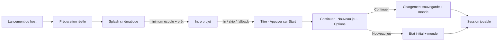
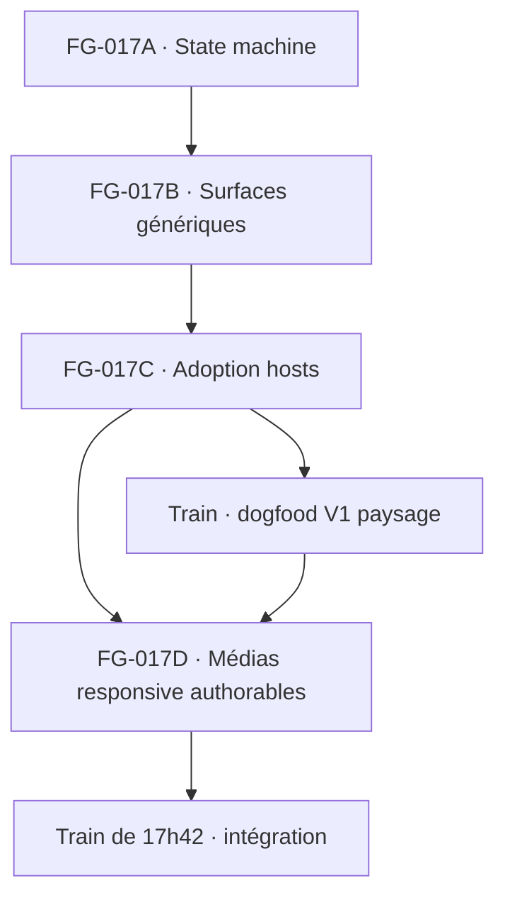

# FG-017 — Runtime Startup, Intro & Title Flow — Roadmap d’implémentation

> **Pour les agents d’exécution :** sous-skill requis : utiliser `subagent-driven-development` (recommandé lorsque la politique de coordination l’autorise) ou `executing-plans`, lot par lot. Les étapes utilisent des cases à cocher. Les opérations Git d’écriture restent interdites sans autorisation explicite de l’utilisateur.

**Objectif :** livrer dans la runtime PokeMap le parcours premium validé par la preview — splash cinématique avec progression réelle, intro skippable, écran « Appuyer sur Start », menu Continuer/Nouveau jeu/Options, médias paysage et portrait — puis l’activer pour *Le Train de 17h42* sans dépendance fonctionnelle à Avelune.

**Architecture :** `map_runtime` possède l’orchestration et les politiques de démarrage ; `map_player_ui` possède les surfaces Flutter génériques ; le host fournit seulement des ports de stockage, de résolution d’assets et un branding de conteneur optionnel. Les médias et l’identité du jeu restent des données projet, exposées par `map_core`, `map_authoring`, l’éditeur et le MCP. Avelune devient un adaptateur du même shell que le host standalone.

**Stack :** Dart, Flutter, `video_player`, Flame pour la session de jeu après le menu, Freezed/JSON, PokeMap Authoring API, MCP JSONL/TypeScript, tests Dart/Flutter et golden smokes multi-format.

---

## 1. Statut et décision de lot

- Date de création : 2026-08-08.
- Lot parent proposé : `FG-017 — Runtime Startup, Intro & Title Flow V0`.
- Position : Phase 1, entre `FG-016` et `FG-020`.
- Statut canonique actuel : `FG-017` n’est pas encore inscrit dans `pokemap_roadmap_mecaniques_fangame.md`.
- Statut de préparation : `PARTIAL` — briques existantes, ownership et parcours bout en bout incomplets.
- Premier lot exécutable : `FG-017A Runtime Startup State Machine V0`.
- Source d’audit : `documentation/reports/gameplay/fg_017_runtime_startup_intro_title_audit_2026-08-08.md`.
- Référence visuelle : preview locale `runtime-startup-preview`, hors dépôt PokeMap. Elle sert de direction, pas de dépendance de build.

Cette roadmap ne modifie pas le statut de la roadmap mécanique. La mise à jour de `pokemap_roadmap_mecaniques_fangame.md` doit faire l’objet d’une demande explicite après validation du découpage.

## 2. Résultat produit attendu

Au lancement d’un jeu installé ou d’un projet en playtest :

1. la runtime démarre la préparation du manifest, des préférences, des sauvegardes et des médias de présentation ;
2. le splash cinématique du host apparaît immédiatement ;
3. sa barre représente une progression réelle et monotone ;
4. le splash reste visible pendant une durée minimale, sans masquer une erreur ni mentir sur l’état réel ;
5. l’intro du projet démarre, ou son poster/fallback est utilisé ;
6. un tap, clic, `Enter`, `Start` ou action primaire permet de la passer ;
7. le titre animé apparaît avec la musique de titre ;
8. une action primaire ouvre le menu ;
9. le menu montre uniquement Continuer, Nouveau jeu et Options ;
10. Continuer charge la sauvegarde canonique compatible ;
11. Nouveau jeu confirme l’écrasement logique si nécessaire, sans détruire une sauvegarde avant le premier commit sûr ;
12. la session Flame et le monde ne sont chargés qu’après la décision du joueur.



## 3. Décisions signées

### 3.1 Ownership

| Sujet | Propriétaire | Rôle des autres couches |
|---|---|---|
| Machine de démarrage | `map_runtime` | le host injecte des ports, jamais la navigation |
| Progression de préparation | `map_runtime` | les ports publient leurs résultats ; la runtime agrège |
| Splash cinématique | `map_player_ui` | branding injecté, aucune importation d’Avelune |
| Branding du splash | host | Avelune fournit éventuellement son logo ; le standalone fournit le défaut PokeMap |
| Intro, posters, boucles titre/menu | projet | `map_core` décrit ; distribution empaquette ; runtime résout |
| Lecture vidéo générique | `map_player_ui` | `video_player` devient une dépendance générique |
| Musique de titre et exclusivité audio | `map_runtime` | le host ne déclenche pas de piste concurrente |
| Politique mono-sauvegarde | `map_runtime` | le stockage conserve ses capacités multi-slots |
| Surface Continuer/Nouveau jeu/Options | `map_player_ui` | projection dictée par la runtime |
| Configuration no-code | `map_editor` | utilise le contrat canonique `map_authoring` |
| Automatisation | `map_authoring` + MCP | mêmes sémantiques que l’éditeur |

### 3.2 Splash

- Le mécanisme appartient à la runtime et à l’UI joueur, pas à Avelune.
- Le contenu de branding est injecté par un `RuntimeHostSplashBranding` immuable.
- La composition reprend la direction validée : noir profond, lueur lunaire, orbites, logo progressif, nom, signature, barre fine et fondu noir.
- La durée minimale de référence est de 7,2 secondes pour le Train de 17h42 ; elle est skippable une fois l’action de skip autorisée.
- Une préparation plus longue maintient le splash à son état final et continue la progression.
- Une préparation plus courte affiche 100 % puis attend la durée minimale.
- Une erreur bloquante remplace l’attente par un message récupérable ; aucune boucle infinie silencieuse.
- Le splash est une animation Flutter déterministe, pas une vidéo encodée : cela permet de refléter le vrai chargement, d’adapter le texte, de respecter reduced motion et d’éviter un média supplémentaire.

```dart
final class RuntimeHostSplashBranding {
  const RuntimeHostSplashBranding({
    required this.displayName,
    required this.signature,
    this.logoAssetId,
    this.primaryColorHex = '#F2D9B2',
    this.secondaryColorHex = '#9E79D7',
    this.minimumDisplayDuration = const Duration(milliseconds: 7200),
  });

  final String displayName;
  final String signature;
  final String? logoAssetId;
  final String primaryColorHex;
  final String secondaryColorHex;
  final Duration minimumDisplayDuration;
}
```

### 3.3 Données projet

- Le splash du host n’est pas sérialisé dans `ProjectPresentationProfile` en V0.
- Le projet possède l’intro, les posters, les sous-titres, les boucles du prompt et du menu, le logo/hero, la typographie, le thème et la musique de titre.
- Le prompt titre et le menu peuvent utiliser des boucles différentes ; le Train de 17h42 utilise le sac ouvert au prompt et le sac fermé au menu.
- Une variante portrait est optionnelle. Si elle manque, la variante paysage est cadrée à partir d’un point focal authorable.
- Le poster reste obligatoire pour toute vidéo afin d’assurer le fallback, reduced motion et les plateformes sans codec disponible.

### 3.4 Sauvegarde

- L’interface V0 expose une seule sauvegarde logique.
- Le choix déterministe de la sauvegarde canonique appartient à `map_runtime`.
- Le host fournit un catalogue et un gateway de stockage, sans décider quel slot afficher.
- Les slots avancés ne sont ni supprimés ni migrés ; ils restent masqués par la politique V0.
- Si la découverte des sauvegardes échoue, Nouveau jeu est bloqué jusqu’à retry pour empêcher un écrasement aveugle.
- Une sauvegarde incompatible désactive Continuer avec un message sûr et déclenche une confirmation renforcée avant Nouveau jeu.

## 4. Non-objectifs

- Refaire l’interface globale d’Avelune dans ce lot.
- Créer un navigateur de profils ou plusieurs slots visibles.
- Charger le monde pendant le splash.
- Rendre une vidéo obligatoire pour qu’un projet soit jouable.
- Inventer un format vidéo propriétaire.
- Intégrer des chemins absolus propres à la machine de développement.
- Dupliquer les règles entre Avelune, le standalone et l’éditeur.
- Masquer les erreurs média derrière un écran noir.
- Ajouter des actions Load, Credits ou Return to Hub au menu principal V0.
- Modifier les mécaniques de jeu du Train de 17h42 au-delà de son entrée de session.

## 5. Audit initial consolidé

### 5.1 Briques déjà disponibles

- `packages/map_core/lib/src/models/project_presentation_profile.dart` décrit branding, intro, typographie et thème.
- `ProjectIntroVideoProfile` valide MP4/H.264, AAC ou aucun audio, poster, WebVTT, dimensions, bitrate, durée et taille.
- Les limites actuelles de l’intro sont : 120 secondes, 1920 px sur le grand côté, 1080 px sur le petit côté, 12 000 kbps et 100 MiB.
- `packages/map_runtime/lib/src/player/runtime_intro_sequence_controller.dart` couvre lecture, pause/reprise lifecycle, poster, skip, replay et échec.
- `packages/map_runtime/lib/src/player/runtime_title_music_controller.dart` couvre la boucle de musique, le mixer et les échecs non bloquants.
- `packages/map_runtime/lib/src/player/runtime_player_coordinator.dart` possède déjà titre, préparation de session, Continue, Nouveau jeu, Options, save/load et transitions de session.
- `packages/map_player_ui/lib/src/player/player_intro_video_surface.dart` fournit la surface visuelle de l’intro.
- `packages/map_player_ui/lib/src/player/player_title_screen.dart` fournit un titre responsive générique, mais expose six actions.
- `packages/map_authoring/lib/src/domains/assets/presentation_actions.dart` expose déjà `presentation.update` et `presentation.delete`.
- Le Personalization Studio sait importer branding, musique, intro, thème et typographie.
- La distribution sait prévalider et empaqueter la présentation.

### 5.2 Ownership à migrer

- `apps/pokemap_hub/lib/presentation/features/player/pages/hub_intro_video_player.dart` possède encore le driver `video_player` concret.
- `apps/pokemap_hub/lib/features/session/application/services/hub_title_presentation_loader.dart` résout encore les médias installés.
- `apps/pokemap_hub/lib/presentation/features/player/pages/hub_installed_game_player.dart` orchestre encore intro, musique et titre.
- `examples/playable_runtime_host/lib/main.dart` monte directement `PlayableMapGame` et contourne le shell de démarrage.

### 5.3 Dettes de parité à fermer

- Le Personalization Studio possède encore des parcours d’import/persistance qui ne prouvent pas tous un passage par `presentation.update`.
- `projectPresentationProfile` doit être réellement queryable dans le transport live, pas seulement annoncé comme supporté par un agrégat projet.
- `ProjectValidator.validate` doit appeler la validation de présentation partagée.
- Toute évolution responsive du schéma doit être prouvée en API directe, JSONL/CLI, éditeur et MCP live.

### 5.4 État Git initial de la roadmap

```text
 M packages/map_distribution/lib/src/game_package_content_validator.dart
 M packages/map_editor/lib/src/features/game_export/application/runtime_project_projection_builder.dart
 M packages/map_editor/test/game_export/game_package_export_service_test.dart
?? documentation/reports/gameplay/fg_017_runtime_startup_intro_title_audit_2026-08-08.md
```

Ces changements sont préexistants. La roadmap ne les modifie pas et ne doit pas les incorporer silencieusement.

## 6. Architecture cible détaillée

### 6.1 Coordinateur de démarrage

Créer un coordinateur séparé du `RuntimePlayerCoordinator` afin de ne pas faire croître le fichier existant de 1 222 lignes et de conserver sa responsabilité session/pause.

```dart
enum RuntimeStartupPhase {
  preparing,
  splash,
  intro,
  titlePrompt,
  titleMenu,
  launchingSession,
  recoverableError,
  completed,
  lifecyclePaused,
}

enum RuntimeStartupAction {
  skipSplash,
  skipIntro,
  continueFromPoster,
  replayIntro,
  pressStart,
  retryPreparation,
}
```

Le snapshot expose au minimum :

- une révision monotone ;
- la phase ;
- la progression globale `0.0..1.0` ;
- l’étape de préparation localisable ;
- la présentation résolue ;
- les capacités de skip/replay/retry ;
- l’erreur sûre éventuelle ;
- le `RuntimePlayerSnapshot` courant lorsque le menu/session devient actif.

Le coordinateur compose :

- `RuntimePlayerCoordinator` ;
- `RuntimeIntroSequenceController` ;
- `RuntimeTitleMusicController` ;
- un `RuntimeStartupPreparationPort` ;
- un `RuntimePresentationAssetResolver` ;
- une horloge injectée pour les tests ;
- un branding de host optionnel.

### 6.2 Préparation et progression réelle

La progression V0 est agrégée par unités terminées, avec les poids suivants :

| Étape | Poids |
|---|---:|
| manifest et identité du jeu | 15 |
| préférences joueur | 10 |
| découverte et compatibilité des sauvegardes | 15 |
| profil de présentation | 10 |
| branding du splash | 10 |
| intro et poster | 20 |
| titre, menu et musique | 20 |
| **Total** | **100** |

Règles :

- une étape absente mais optionnelle est marquée terminée ;
- une étape non bloquante en échec est terminée avec diagnostic ;
- la progression ne diminue jamais ;
- le texte affiché dépend d’une étape stable, pas d’un pourcentage arbitraire ;
- le splash ne couvre pas le chargement du monde et de la sauvegarde complète ;
- après Continuer/Nouveau jeu, `PlayableMapGameSessionRuntime` conserve ses propres étapes de chargement.

Les quatre libellés visuels de référence sont localisés : Éveil, Préparation du voyage, Accord du monde et Prêt. Ils correspondent à des groupes d’étapes, pas à des timers.

### 6.3 Port de résolution média

```dart
final class RuntimeResolvedAsset {
  const RuntimeResolvedAsset({
    required this.assetId,
    required this.resolvedUri,
    required this.mediaType,
  });

  final String assetId;
  final Uri resolvedUri;
  final String mediaType;
}

abstract interface class RuntimePresentationAssetResolver {
  Future<RuntimeResolvedAsset?> resolveImage(String projectRelativePath);
  Future<RuntimeResolvedAsset?> resolveMedia(String projectRelativePath);
  Future<bool> exists(String projectRelativePath);
}
```

Contraintes :

- aucun chemin absolu dans les snapshots publics ;
- résolution sous une racine d’installation ou de projet étroite ;
- normalisation et rejet des traversées de chemin ;
- fermeture explicite des handles/players ;
- cache par hash du package, jamais par chemin utilisateur global.

### 6.4 Projection mono-menu

Une politique dédiée projette les actions existantes :

```dart
final class RuntimeTitleMenuProjection {
  const RuntimeTitleMenuProjection({
    required this.actions,
    required this.initialSelection,
  });

  final List<RuntimePlayerActionAvailability> actions;
  final RuntimePlayerAction initialSelection;
}

final class RuntimeTitleMenuPolicy {
  const RuntimeTitleMenuPolicy.singleSave();

  RuntimeTitleMenuProjection project(RuntimePlayerSnapshot snapshot);
}
```

La projection rend exactement :

1. Continuer — activé seulement pour une sauvegarde canonique compatible ;
2. Nouveau jeu — activé si le stockage est sain ;
3. Options — toujours activé après préparation.

Load, Credits et Return to Hub restent disponibles dans les contrats avancés, mais absents de cette projection.

### 6.5 Audio

- Le splash peut jouer un chime du host via le mixer, jamais une musique persistante concurrente.
- L’intro possède son audio AAC éventuel.
- La musique de titre démarre uniquement lorsque l’intro est terminée ou passée.
- La musique continue entre `titlePrompt` et `titleMenu` sans redémarrage.
- Elle fade out avant `preparingSession`.
- Lifecycle inactive/paused coupe ou suspend toute sortie.
- Un échec audio laisse le parcours jouable et publie un diagnostic non bloquant.

### 6.6 Input exclusif

Chaque événement reçoit la révision du snapshot et ne peut traverser qu’une phase :

| Phase | Tap/clic | Enter/Espace | Start/A | Back/Escape |
|---|---|---|---|---|
| splash | skip autorisé | skip autorisé | skip autorisé | aucun effet |
| intro | skip | skip | skip | skip selon plateforme |
| poster | continuer | continuer | continuer | aucun effet |
| titlePrompt | ouvrir menu | ouvrir menu | ouvrir menu | aucun effet |
| titleMenu | choisir | valider | valider | host/system selon plateforme |
| options | choisir | valider | valider | retour menu |

Un même appui ne doit jamais passer l’intro puis ouvrir le menu dans la même frame.

## 7. Contrat responsive de présentation V2

Ce schéma arrive seulement dans `FG-017D`, après stabilisation du shell avec le schéma V1.

### 7.1 Modèle proposé

```dart
@Freezed(fromJson: true, toJson: true)
class ProjectVideoVariantProfile with _$ProjectVideoVariantProfile {
  const factory ProjectVideoVariantProfile({
    required String videoPath,
    required String posterPath,
    String? captionsPath,
    required int durationMilliseconds,
    required int width,
    required int height,
    required int bitrateKbps,
    required int sizeBytes,
    required String videoCodec,
    required String audioCodec,
    @Default(0.5) double focalX,
    @Default(0.5) double focalY,
  }) = _ProjectVideoVariantProfile;
}

@Freezed(fromJson: true, toJson: true)
class ProjectResponsiveVideoProfile with _$ProjectResponsiveVideoProfile {
  const factory ProjectResponsiveVideoProfile({
    required ProjectVideoVariantProfile landscape,
    ProjectVideoVariantProfile? portrait,
  }) = _ProjectResponsiveVideoProfile;
}

@Freezed(fromJson: true, toJson: true)
class ProjectIntroVideoProfile with _$ProjectIntroVideoProfile {
  const factory ProjectIntroVideoProfile({
    required ProjectResponsiveVideoProfile media,
    @Default('poster') String reducedMotionBehavior,
    @Default(true) bool allowReplay,
  }) = _ProjectIntroVideoProfile;
}

@Freezed(fromJson: true, toJson: true)
class ProjectTitleMotionProfile with _$ProjectTitleMotionProfile {
  const factory ProjectTitleMotionProfile({
    ProjectResponsiveVideoProfile? promptLoop,
    ProjectResponsiveVideoProfile? menuLoop,
  }) = _ProjectTitleMotionProfile;
}
```

`ProjectPresentationProfile.schemaVersion` passe de 1 à 2 et ajoute `titleMotion`.

### 7.2 Migration V1 vers V2

- Les champs V1 de `intro` sont transformés en `intro.media.landscape`.
- `portrait` reste absent.
- `focalX` et `focalY` valent 0,5.
- La sérialisation suivante produit le schéma V2.
- La lecture V1 reste couverte par fixture et round-trip.
- Aucun projet existant n’est invalidé par l’absence de `titleMotion`.

### 7.3 Sélection de variante

1. Classer les contraintes en portrait lorsque `height > width`.
2. Préférer la variante correspondant à l’orientation.
3. Si elle manque, utiliser l’autre variante en `BoxFit.cover` avec le point focal.
4. Si reduced motion est actif, utiliser le poster correspondant.
5. Si la vidéo échoue, utiliser le poster correspondant.
6. Si le poster échoue, utiliser `branding.heroPath`, puis `coverPath`, puis un fond thématique.

La sélection dépend des contraintes de rendu, pas de `Platform.isAndroid` ou `Platform.isIOS`.

### 7.4 Budgets V2

| Média | Durée max | Taille unitaire | Audio | Notes |
|---|---:|---:|---|---|
| intro paysage/portrait | 120 s | 100 MiB | AAC ou aucun | total des deux variantes ≤ 160 MiB |
| boucle prompt | 15 s | 24 MiB | aucun | H.264, loop sans rupture |
| boucle menu | 15 s | 24 MiB | aucun | H.264, loop sans rupture |
| ensemble title motion | — | 96 MiB | aucun | posters inclus dans le preflight global |
| présentation complète | — | 220 MiB | — | erreur de publication au-delà |

Toutes les vidéos restent limitées à 1920 × 1080 ou 1080 × 1920, H.264, 12 000 kbps. Les boucles titre/menu contenant une piste audio sont rejetées afin de préserver l’ownership du mixer.

## 8. Spécification responsive des surfaces

### 8.1 Téléphone portrait

- Média dans la zone supérieure, menu en bottom sheet.
- Safe areas haut/bas via `MediaQuery.padding` et `viewPadding`.
- Cibles tactiles d’au moins 56 px ; référence preview : 58 px.
- Continuer conserve la métadonnée de sauvegarde sans réduire le libellé principal.
- Aide clavier masquée.
- Replay intro accessible, mais secondaire.
- Le sac et le sujet principal restent dans le cadrage par point focal.
- Les dialogues Nouveau jeu et Options deviennent des sheets ou cartes à largeur disponible.

### 8.2 Téléphone paysage et tablette

- Sous 760 px logiques de largeur utile : bottom sheet.
- Au-dessus : panneau latéral adaptatif.
- Aucun branchement par type d’appareil.
- Les rotations conservent la sélection du menu et la position logique de la vidéo.

### 8.3 Desktop

- Panneau gauche à largeur bornée ; visuel à droite.
- Clavier et manette disposent d’un focus visible.
- Le ratio 16:9 est privilégié sans imposer de letterboxing si la fenêtre diffère.

### 8.4 Accessibilité

- `Semantics` explicites pour Skip, Start, Continuer, Nouveau jeu et Options.
- Text scale testé à 1,0 ; 1,3 ; 2,0.
- Contraste minimum WCAG AA pour les textes fonctionnels.
- Reduced motion : splash statique premium, poster d’intro, posters de title/menu.
- Sous-titres WebVTT affichés pour l’intro lorsque présents.
- Aucun statut transmis uniquement par couleur.

## 9. Inventaire de fichiers cible

### 9.1 `map_runtime`

Créer :

- `packages/map_runtime/lib/src/player/runtime_startup_models.dart` — phases, snapshots, actions et diagnostics.
- `packages/map_runtime/lib/src/player/runtime_startup_coordinator.dart` — orchestration pure.
- `packages/map_runtime/lib/src/player/runtime_startup_preparation.dart` — ports, étapes et agrégation de progression.
- `packages/map_runtime/lib/src/player/runtime_title_menu_policy.dart` — projection mono-sauvegarde.
- `packages/map_runtime/lib/src/player/runtime_presentation_asset_resolver.dart` — contrats de résolution.
- `packages/map_runtime/lib/src/player/runtime_presentation_media_selector.dart` — choix portrait/paysage en D.

Modifier :

- `packages/map_runtime/lib/src/player/runtime_player_coordinator.dart` — seam publique minimale de préparation/délégation, sans absorber le startup.
- `packages/map_runtime/lib/src/player/runtime_player_host.dart` — ports du host strictement nécessaires.
- `packages/map_runtime/lib/src/player/runtime_title_music_controller.dart` — fade et ownership startup si non couverts.
- `packages/map_runtime/lib/map_runtime.dart` — exports publics.

Tests :

- `packages/map_runtime/test/player/runtime_startup_coordinator_test.dart`.
- `packages/map_runtime/test/player/runtime_startup_preparation_test.dart`.
- `packages/map_runtime/test/player/runtime_title_menu_policy_test.dart`.
- `packages/map_runtime/test/player/runtime_presentation_media_selector_test.dart`.
- tests existants intro, musique, coordinator et session.

### 9.2 `map_player_ui`

Créer :

- `packages/map_player_ui/lib/src/player/player_runtime_splash_surface.dart`.
- `packages/map_player_ui/lib/src/player/player_intro_video_player.dart`.
- `packages/map_player_ui/lib/src/player/player_title_prompt_surface.dart`.
- `packages/map_player_ui/lib/src/player/player_runtime_startup_shell.dart`.
- `packages/map_player_ui/lib/src/player/player_startup_strings.dart`.
- `packages/map_player_ui/lib/src/player/player_startup_media.dart`.

Modifier :

- `packages/map_player_ui/lib/src/player/player_title_screen.dart` — projection trois actions et compositions mobile/desktop.
- `packages/map_player_ui/lib/src/player/player_intro_video_surface.dart` — API générique alignée avec le driver.
- `packages/map_player_ui/lib/src/player/runtime_player_surface_router.dart` — intégration du startup shell.
- `packages/map_player_ui/lib/map_player_ui.dart` — exports.
- `packages/map_player_ui/pubspec.yaml` — dépendance `video_player`.

Tests :

- `packages/map_player_ui/test/player/player_runtime_splash_surface_test.dart`.
- `packages/map_player_ui/test/player/player_intro_video_player_test.dart`.
- `packages/map_player_ui/test/player/player_title_prompt_surface_test.dart`.
- `packages/map_player_ui/test/player/player_runtime_startup_shell_test.dart`.
- extension de `player_intro_video_surface_test.dart` et des tests title existants.

### 9.3 Contrats, authoring, éditeur et distribution

Modifier en D :

- `packages/map_core/lib/src/models/project_presentation_profile.dart`.
- fichiers Freezed/JSON générés correspondants.
- `packages/map_core/lib/src/validation/validators.dart` — faire appeler la validation de présentation par `ProjectValidator.validate`.
- `packages/map_authoring/lib/src/domains/assets/presentation_actions.dart`.
- `packages/map_authoring/test/domains/assets/presentation_authoring_test.dart`.
- `packages/map_authoring/test/parity/full_authoring_parity_test.dart`.
- `packages/map_editor/lib/src/features/personalization/application/project_intro_video_import_service.dart`.
- `packages/map_editor/lib/src/features/personalization/presentation/personalization_studio_workspace.dart`.
- `packages/map_editor/lib/src/features/personalization/presentation/project_intro_video_editor.dart`.
- `packages/map_editor/lib/src/features/personalization/presentation/project_branding_title_preview.dart`.
- `packages/map_editor/lib/src/features/personalization/presentation/personalization_runtime_preview.dart`.
- `packages/map_editor/lib/src/features/personalization/presentation/personalization_readiness_panel.dart`.
- `packages/map_distribution/lib/src/game_package_personalization_preflight.dart`.
- projection/export de présentation et tests associés.
- `tools/pokemap_mcp` pour ressource queryable et catalogue live.

### 9.4 Hosts

Modifier :

- `apps/pokemap_hub/lib/presentation/features/player/pages/hub_installed_game_player.dart`.
- `apps/pokemap_hub/lib/features/session/application/services/hub_title_presentation_loader.dart` ou son remplacement adaptateur.
- `examples/playable_runtime_host/lib/main.dart`.

Supprimer seulement après migration et preuve sans référence :

- `apps/pokemap_hub/lib/presentation/features/player/pages/hub_intro_video_player.dart`.

Migrer les tests Hub vers les surfaces génériques avant suppression.

## 10. Découpage d’exécution

## FG-017A — Runtime Startup State Machine V0

**But :** posséder tout l’enchaînement dans `map_runtime` sans nouveau champ persistant ni nouveau widget.

### A1 — Contrats et snapshots

- [ ] Écrire les tests d’invariants des phases et révisions dans `runtime_startup_coordinator_test.dart`.
- [ ] Créer `runtime_startup_models.dart` avec les enums et snapshots immuables.
- [ ] Exposer une seule phase active et une progression bornée/monotone.
- [ ] Exporter les contrats dans `map_runtime.dart`.
- [ ] Exécuter le test ciblé et `flutter analyze lib/src/player`.

Critère de sortie : les modèles ne dépendent d’aucun widget, d’Avelune ni d’un chemin de fichier concret.

### A2 — Préparation réelle

- [ ] Écrire les tests : préparation courte, préparation longue, étape optionnelle absente, erreur non bloquante et erreur bloquante.
- [ ] Implémenter les sept étapes pondérées dans `runtime_startup_preparation.dart`.
- [ ] Injecter l’horloge et la durée minimale.
- [ ] Attendre simultanément `minimumElapsed` et `preparationReady`.
- [ ] Publier un diagnostic récupérable avec Retry pour les erreurs bloquantes.

Critère de sortie : aucun `Timer` décoratif ne pilote le pourcentage.

### A3 — Composition des contrôleurs existants

- [ ] Caractériser le boot actuel du `RuntimePlayerCoordinator`.
- [ ] Ajouter une seam publique minimale pour préparer le titre sans lancer de session.
- [ ] Composer `RuntimeIntroSequenceController` et `RuntimeTitleMusicController` dans le startup coordinator.
- [ ] Prouver : pas d’intro, intro terminée, skip idempotent, poster, replay, reduced motion et échec vidéo.
- [ ] Prouver que la musique démarre après l’intro et s’arrête avant la session.

Critère de sortie : le coordinator existant reste propriétaire des sessions ; le nouveau coordinator reste propriétaire du pré-titre.

### A4 — Input, lifecycle et erreurs

- [ ] Tester un input avec révision périmée.
- [ ] Tester qu’un input ne traverse pas deux phases.
- [ ] Tester pause/reprise pendant splash, intro et title prompt.
- [ ] Tester dispose pendant préparation et lecture.
- [ ] Tester Retry puis succès.

Critère de sortie : aucune future ni subscription ne survit à `dispose`.

### Commandes A

```bash
cd packages/map_runtime
flutter test test/player/runtime_startup_coordinator_test.dart \
  test/player/runtime_startup_preparation_test.dart \
  test/runtime_intro_sequence_controller_test.dart \
  test/player/runtime_title_music_controller_test.dart \
  test/player/runtime_player_coordinator_launch_test.dart -r expanded
flutter analyze
```

**Statut de lot proposé après preuve :** `DONE` pour A uniquement ; `FG-017` global reste `PARTIAL`.

## FG-017B — Generic Startup Surfaces V0

**But :** porter la direction visuelle dans `map_player_ui`, indépendante des hosts.

### B1 — Splash cinématique

- [ ] Créer un test avec horloge/animation contrôlée à 0 %, 45 %, 81 % et 100 %.
- [ ] Implémenter fond, halos, orbites, mark reveal, wordmark, signature, barre et curtain fade.
- [ ] Recevoir `RuntimeHostSplashBranding` au lieu d’importer un asset Avelune.
- [ ] Connecter la barre au snapshot réel.
- [ ] Ajouter la variante reduced motion statique.
- [ ] Tester thème clair/sombre du host, logo absent et erreur de logo.

### B2 — Lecteur intro générique

- [ ] Déplacer l’abstraction driver hors du Hub.
- [ ] Implémenter le driver `video_player` dans `map_player_ui`.
- [ ] Conserver poster, sous-titres, buffering, skip, replay, lifecycle et dispose.
- [ ] Migrer les tests de `hub_intro_video_player_test.dart` vers le package générique.
- [ ] Garantir que la vidéo n’est jamais propriétaire de la navigation.

### B3 — Prompt et menu

- [ ] Ajouter `PlayerTitlePromptSurface` séparé du menu.
- [ ] Projeter Continuer/Nouveau jeu/Options via `RuntimeTitleMenuPolicy`.
- [ ] Conserver les actions avancées dans l’API, sans les rendre dans cette variante.
- [ ] Ajouter la confirmation Nouveau jeu avec sauvegarde existante.
- [ ] Conserver Options puis retour exact au menu.

### B4 — Responsive et accessibilité

- [ ] Tester 360×800, 390×844, 412×915, 768×1024, 1280×720 et 1920×1080.
- [ ] Tester portrait/paysage et rotation sans perte de sélection.
- [ ] Tester text scale 1,0 ; 1,3 ; 2,0.
- [ ] Tester safe areas simulées.
- [ ] Tester tap, clic, Enter, Espace, Start et action primaire.
- [ ] Tester le focus visible au clavier/manette.

### Commandes B

```bash
cd packages/map_player_ui
flutter test test/player/player_runtime_splash_surface_test.dart \
  test/player/player_intro_video_player_test.dart \
  test/player/player_title_prompt_surface_test.dart \
  test/player/player_runtime_startup_shell_test.dart \
  test/player/player_intro_video_surface_test.dart -r expanded
flutter analyze
```

**Statut de lot proposé après preuve :** `DONE` pour B ; global encore `PARTIAL` tant que les hosts contournent le shell.

## FG-017C — Host Adoption & Golden Boot V0

**But :** brancher Avelune et le standalone sur le même shell, puis prouver Nouveau jeu et Continuer.

### C1 — Adaptateur Avelune

- [ ] Écrire un test de caractérisation du parcours Hub actuel.
- [ ] Créer l’adaptateur `RuntimePresentationAssetResolver` sous la racine d’installation.
- [ ] Injecter le branding Avelune dans le splash générique.
- [ ] Remplacer l’orchestration locale de `HubInstalledGamePlayer` par `PlayerRuntimeStartupShell`.
- [ ] Conserver l’external exit vers le Hub sans l’afficher dans le menu V0.
- [ ] Supprimer le lecteur Hub uniquement lorsque `rg` ne trouve plus de référence de production.

### C2 — Host standalone

- [ ] Remplacer le montage direct de `PlayableMapGame` par le startup shell.
- [ ] Fournir le branding PokeMap par défaut.
- [ ] Fournir les mêmes ports de save, préférences et résolution média.
- [ ] Conserver le picker développeur avant le lancement du jeu, hors du shell runtime.

### C3 — Golden boot

- [ ] Étendre `phase_a_golden_slice_launch_test.dart` avec le pré-titre.
- [ ] Ajouter splash → skip intro → Start → Nouveau jeu → map.
- [ ] Ajouter splash → intro → Start → Continuer → état restauré.
- [ ] Ajouter sauvegarde incompatible, média absent et préparation lente.
- [ ] Ajouter preuve de non-chevauchement audio.

### C4 — Rollout contrôlé

- [ ] Activer le shell derrière une capacité de host, pas un champ projet.
- [ ] Dogfood sur Le Train de 17h42 dans Avelune.
- [ ] Activer ensuite le standalone.
- [ ] Retirer le chemin historique après deux smokes verts et absence de référence.

### Commandes C

```bash
cd apps/pokemap_hub
flutter test --no-pub \
  test/presentation/features/player/hub_intro_video_player_test.dart \
  test/presentation/features/player/hub_title_presentation_loader_test.dart \
  test/presentation/features/player/phase_5_personalization_golden_gate_test.dart \
  test/presentation/features/player/phase_6_personalization_packaging_e2e_test.dart -r expanded
flutter analyze --no-pub lib

cd ../../../examples/playable_runtime_host
flutter test test/phase_a_golden_slice_launch_test.dart -r expanded
flutter analyze

cd ../../packages/map_runtime
flutter test test/phase_a_golden_battle_slice_smoke_test.dart -r expanded
```

**Statut de lot proposé après preuve :** cœur de `FG-017` jouable ; global reste `PARTIAL` jusqu’aux médias titre/menu authorables et portrait.

## FG-017D — Authored Responsive Title Motion V0

**But :** rendre les variantes 16:9/9:16 et les boucles prompt/menu authorables, validées, empaquetées et queryables.

### D1 — Schéma et migration

- [ ] Écrire les fixtures V1, V2 landscape-only et V2 landscape+portrait.
- [ ] Ajouter les types responsive et `ProjectTitleMotionProfile`.
- [ ] Implémenter la migration V1 → V2 avant désérialisation générée.
- [ ] Ajouter validation chemins, points focaux, posters, codecs et budgets combinés.
- [ ] Faire appeler la validation de présentation par `ProjectValidator.validate`.
- [ ] Régénérer Freezed/JSON dans `map_core` uniquement.

### D2 — Canonical authoring et parité

- [ ] Étendre `presentation.update` sans créer une action concurrente.
- [ ] Exposer `projectPresentationProfile` comme ressource queryable.
- [ ] Prouver round-trip API directe et JSONL/CLI.
- [ ] Prouver plan/apply MCP avec preview et révision.
- [ ] Actualiser le catalogue descriptif et le live `pokemap_describe`.
- [ ] Conserver les chemins sous la racine autorisée ; aucune ouverture de `$HOME` ou `/`.

### D3 — Éditeur no-code

- [ ] Ajouter des emplacements distincts Intro paysage, Intro portrait, Titre paysage, Titre portrait, Menu paysage et Menu portrait.
- [ ] Réutiliser le picker/importeur ; aucun champ de chemin manuel dans le parcours normal.
- [ ] Ajouter preview orientation et point focal.
- [ ] Montrer fallback et diagnostics avant publication.
- [ ] Faire persister les modifications via l’adaptateur canonique `presentation.update`.

### D4 — Distribution

- [ ] Projeter tous les variants dans le package installé.
- [ ] Vérifier existence, MIME, hash, codec, budget individuel et budget cumulé.
- [ ] Refuser une boucle titre/menu avec audio.
- [ ] Préserver les packages V1.
- [ ] Ajouter un receipt listant chaque variante et son hash.

### D5 — Consommation runtime

- [ ] Sélectionner la variante selon les contraintes.
- [ ] Tester portrait manquant, paysage manquant interdit, poster, focal point et reduced motion.
- [ ] Précharger uniquement la variante choisie et son poster.
- [ ] Libérer la boucle précédente lors d’une rotation qui impose un switch.

### Commandes D

```bash
cd packages/map_core
dart run build_runner build --delete-conflicting-outputs
dart test test/project_presentation_profile_test.dart -r expanded
dart analyze

cd ../map_authoring
dart run tool/pmcp085_conformance.dart
dart test test/domains/assets/presentation_authoring_test.dart \
  test/parity/full_authoring_parity_test.dart -r expanded
dart analyze

cd ../map_distribution
dart test test/game_package_personalization_preflight_test.dart \
  test/personalization_release_gate_receipt_test.dart -r expanded
dart analyze

cd ../map_editor
flutter test test/personalization -r expanded
flutter analyze

cd ../../tools/pokemap_mcp
npm run check
npm test
```

Puis : live `pokemap_describe`, workspace absolu autorisé, query présentation, mutation sûre, validation, re-query et fermeture.

**Statut de lot proposé après preuve :** `FG-017` peut être proposé `DONE` sous réserve de l’acceptance Train et des builds mobiles.

## 11. Intégration Le Train de 17h42

Le projet réel du Train de 17h42 n’est pas présent sous une forme identifiable dans ce dépôt. Son intégration doit donc utiliser un workspace PokeMap autorisé et le contrat canonique ; aucun chemin projet ne doit être inventé.

### T1 — Ouvrir le projet en sécurité

- [ ] Exécuter le `pokemap_describe` live.
- [ ] Résoudre le chemin canonique du projet fourni par l’utilisateur ou Avelune.
- [ ] Vérifier qu’il est sous une racine MCP étroite autorisée.
- [ ] Ouvrir le workspace et conserver ses handles opaques.
- [ ] Query le manifest, la présentation et le catalogue d’assets.

Condition de blocage : si le projet est hors racines, demander l’autorisation de la plus petite racine utile ; ne jamais élargir au dossier personnel entier.

### T2 — Produire les médias finaux

- [ ] Importer `pokemon-le-train-de-17h42-intro.mp4` via le parcours d’import, jamais par référence absolue à Downloads.
- [ ] Produire son poster et ses sous-titres si l’audio transporte une information significative.
- [ ] Exporter la boucle prompt : compartiment réaliste, sac en cuir couché ouvert, lettre et affaires visibles, paysage mobile.
- [ ] Exporter la boucle menu : cadrage distinct, sac couché fermé, paysage mobile.
- [ ] Exporter les variantes 1920×1080 et 1080×1920.
- [ ] Garantir une boucle sans rupture, aucune personne, pixel art fin et absence de morphing du mobilier/sac.
- [ ] Conserver l’intérieur fixe et déplacer uniquement le paysage derrière la fenêtre lorsque la composition le permet.

Les assets de la preview dans `.codex/visualizations` sont une référence de direction. Ils doivent être importés ou reproduits en assets de projet approuvés ; leurs chemins machine ne doivent pas apparaître dans le manifest.

### T3 — Configurer la présentation

- [ ] Appliquer le logo, les posters, l’intro, les boucles prompt/menu, la musique et les points focaux par `presentation.update`.
- [ ] Conserver le splash Avelune comme branding de host, pas comme champ du projet.
- [ ] Prévisualiser desktop, mobile portrait et mobile paysage dans l’éditeur.
- [ ] Inspecter tous les diagnostics de publication.
- [ ] Appliquer avec operation ID unique et révision attendue.
- [ ] Re-query puis valider le projet.

### T4 — Acceptance joueur

- [ ] Lancement à froid sur Android : splash → intro → prompt → menu → Nouveau jeu.
- [ ] Relance Android : Continuer restaure la position et la progression.
- [ ] Lancement iOS simulator/device : même parcours et safe areas.
- [ ] Desktop : clavier, manette et souris.
- [ ] Mobile : tap global pour skip, grandes cibles, rotation et reprise lifecycle.
- [ ] Reduced motion : aucun autoplay vidéo, posters lisibles.
- [ ] Audio : intro puis musique de titre, jamais simultanées.
- [ ] Mode avion : parcours local complet.

## 12. Matrice de fallback et erreurs

| Situation | Comportement attendu | Bloquant |
|---|---|---:|
| logo host absent | wordmark texte et halo générique | non |
| préférences illisibles | défauts accessibles + diagnostic | non |
| découverte save impossible | erreur Retry/Exit ; Nouveau jeu interdit | oui |
| aucune save | Continuer désactivé ; Nouveau jeu sélectionné | non |
| save incompatible | Continuer désactivé avec raison ; confirmation renforcée | non |
| intro absente | passage direct au prompt | non |
| intro codec/lecture en échec | poster puis Continuer | non |
| poster intro absent | validation empêche publication | oui en authoring |
| boucle prompt absente | hero/cover/poster thématique | non |
| boucle menu absente | poster/menu statique ou prompt fallback | non |
| portrait absent | paysage + focal point | non |
| musique titre absente/échoue | silence | non |
| préparation > durée splash | splash reste à progression réelle | non |
| manifest invalide | erreur Retry/Exit sûre | oui |
| app en background | pause vidéo/audio/animation coûteuse | non |
| dispose pendant async | annulation et aucune publication tardive | non |

## 13. Stratégie de tests complète

### 13.1 Unitaires

- Toutes les transitions autorisées/interdites.
- Révisions et commandes périmées.
- Idempotence skip/finish/retry/dispose.
- Agrégation pondérée et monotone.
- Sélection de save canonique.
- Migration V1/V2.
- Sélection portrait/paysage et point focal.
- Budgets individuels/cumulés.

### 13.2 Widget

- Frames déterministes du splash.
- Buffering, sous-titres, poster, skip et replay.
- Prompt séparé du menu.
- Trois actions et états disabled.
- Confirmation Nouveau jeu.
- Options puis retour.
- Viewports et text scales de la section 8.
- Sémantique, focus et reduced motion.

### 13.3 Intégration

- Host Avelune et standalone sur le même shell.
- Nouveau jeu jusqu’à la map.
- Continue jusqu’à l’état restauré.
- Préparation lente et échec récupérable.
- Rotation pendant titre/menu.
- Lifecycle pendant intro.
- Absence de double audio.

### 13.4 Packaging/authoring

- Assets présents, réguliers, lisibles, sûrs et hashés.
- MIME et codecs réels, pas uniquement extensions.
- Receipt complet.
- Direct API, JSONL/CLI, éditeur et MCP produisent la même projection.
- Live describe/query/mutation/validate/re-query.

### 13.5 Plateformes

- Android debug sur émulateur puis appareil physique de référence.
- iOS simulator puis appareil lorsque disponible.
- macOS pour le host desktop.
- Web seulement si la cible produit le maintient ; poster explicite en cas d’autoplay/codec bloqué.
- Windows/Linux : poster/fallback tant que la matrice codec n’est pas certifiée.

## 14. Gates transverses

À la fin de chaque lot :

```bash
dart tools/check_file_length.dart
bash tools/scripts/check_markdown_hygiene.sh
git status --short --untracked-files=all
```

Le premier contrôle de cette roadmap a constaté que `tools/check_file_length.dart`, pourtant référencé par `AGENTS.md`, est absent du worktree. L’agent d’exécution doit retenter la commande et signaler explicitement le blocage tant que l’outil n’est pas restauré ou que l’instruction canonique n’est pas corrigée ; il ne doit pas inventer un checker de remplacement dans un lot startup.

La gate finale exige en plus :

- analyses package par package ;
- tests ciblés et smokes runtime ;
- build du host concerné ;
- tests MCP et live describe ;
- aucune référence production au lecteur Hub supprimé ;
- walkthrough humain du Train sur mobile ;
- état Git final distinguant changements du lot et modifications préexistantes.

## 15. Rollback et compatibilité

- Le shell historique reste disponible derrière une capacité de host pendant C.
- Le schéma V1 reste lisible après D.
- Les projets sans présentation utilisent les surfaces et thèmes génériques.
- Les projets sans portrait restent jouables via focal point.
- La suppression du lecteur Hub intervient seulement après migration des tests et smokes verts.
- Un rollback de host ne réécrit pas le manifest projet.
- Aucune migration ne supprime une sauvegarde ou un asset source.

## 16. Dépendances et ordre strict



Le dogfood paysage peut commencer après C avec les champs existants. La sortie finale mobile 9:16 attend D.

## 17. Critères de clôture de `FG-017`

`FG-017` peut être proposé `DONE` uniquement lorsque :

- la runtime possède le parcours complet ;
- Avelune et le standalone utilisent le même shell ;
- le splash reflète le chargement réel ;
- intro, prompt et menu sont indépendants et skippables/activables correctement ;
- Continuer/Nouveau jeu/Options fonctionnent avec politique mono-save ;
- variantes paysage/portrait sont authorables, empaquetées et consommées ;
- reduced motion, fallbacks et erreurs sont prouvés ;
- la parité API/CLI/éditeur/MCP est verte ;
- les smokes Nouveau jeu et Continuer atteignent la map ;
- le Train de 17h42 passe un walkthrough mobile réel ;
- tests, analyses, builds, hygiène Markdown, longueur de fichiers et état Git sont documentés.

Une vidéo de fond uniquement simulée, une UI Hub-only ou un manifest qui sérialise sans action sémantique ne suffisent pas.

## 18. Recommandation de démarrage

Commencer par `FG-017A` dans une seule session d’implémentation bornée : modèles, préparation réelle, composition des contrôleurs et tests purs. Ne pas porter le design Flutter, ne pas modifier le schéma et ne pas toucher au projet du Train pendant ce premier lot.

Cette séquence réduit le risque principal : obtenir une interface splendide dont la progression, l’audio, les sauvegardes ou le lifecycle resteraient pilotés par le host.

## 19. Passes de revue de la roadmap

Les passes ont été exécutées séparément dans la session, conformément à `codex_rule.md` et sans délégation concurrente.

| Passe | Verdict | Synthèse |
|---|---|---|
| Audit / Architecture | `PASS` | l’architecture réutilise les contrôleurs existants, respecte les frontières de packages et retire l’ownership Hub sans réécriture globale |
| Implémentation | `PASS_WITH_CHANGES` | l’exécution est faisable, mais doit rester séquentielle A → B → C → D ; le schéma V2 et le projet Train sont volontairement exclus de A |
| Tests | `PASS_WITH_CHANGES` | la matrice couvre états, UI, sauvegarde, packaging, parité et plateformes ; aucune preuve de code nouveau n’existe encore car cette livraison est documentaire |
| Build / Validation | `PASS_WITH_CHANGES` | hygiène Markdown verte avec un budget explicite de deux documents ; gate de longueur indisponible car le script référencé manque ; builds Dart/Flutter non applicables à une création Markdown seule |
| Critique finale | `PASS_WITH_CHANGES` | roadmap cohérente et exécutable ; risques résiduels listés en section 21 |

## 20. Preuves de validation de la roadmap

Commandes exécutées depuis la racine :

```text
wc -l -w documentation/reports/roadmap/runtime/fg_017_runtime_startup_train_1742_roadmap.md
Résultat avant ajout des preuves : 929 lignes, 5 928 mots.

rg -n "TBD|TODO|FIXME|à compléter|placeholder" documentation/reports/roadmap/runtime/fg_017_runtime_startup_train_1742_roadmap.md
Résultat : aucune occurrence.

POKEMAP_MARKDOWN_MAX_NEW=2 bash tools/scripts/check_markdown_hygiene.sh
Résultat : succès — 2 nouveaux fichiers Markdown, tous dans des emplacements canoniques.

dart tools/check_file_length.dart
Résultat : échec d’infrastructure — tools/check_file_length.dart absent.
```

Aucun test, analyse ou build de package n’a été lancé : aucun fichier Dart, Flutter, TypeScript, manifest ou dépendance n’a été modifié par cette demande de roadmap. Les commandes complètes attendues pendant l’implémentation sont inscrites dans chaque lot.

## 21. Auto-critique et risques

1. Le schéma responsive V2 est une décision de conception détaillée, pas une implémentation validée. Sa migration doit être prouvée avant toute adoption éditeur.
2. Les budgets cumulés proposés protègent le mobile, mais devront être confrontés à de vrais exports du Train avant fermeture de D ; les dépasser doit produire un diagnostic, pas une compression silencieuse.
3. Le projet réel du Train de 17h42 n’est pas localisé dans le dépôt. L’intégration reste dépendante d’un workspace absolu autorisé et ne justifie aucun élargissement de racine MCP.
4. La preview web est hors dépôt et ne constitue pas une golden Flutter. B doit reconstruire la composition avec une horloge testable et des assets projet, pas embarquer le prototype React.
5. La disponibilité H.264 varie selon les plateformes. Le poster est donc un contrat fonctionnel, pas un détail visuel.
6. `RuntimePlayerCoordinator` est déjà long. Toute tentative d’y intégrer le startup complet violerait la décomposition de cette roadmap.
7. Le worktree contient des modifications préexistantes dans distribution et export éditeur. Les futurs lots doivent isoler leurs diffs et éviter de les écraser.
8. La gate de longueur de fichiers référencée par le dépôt est absente. Cela doit rester visible dans les rapports jusqu’à résolution par le chantier d’infrastructure approprié.
9. Le walkthrough humain mobile est indispensable : les widget tests ne prouvent ni le codec réel, ni le ressenti du rythme, ni les safe areas d’un appareil physique.

## 22. État Git final

```text
 M packages/map_distribution/lib/src/game_package_content_validator.dart
 M packages/map_editor/lib/src/features/game_export/application/runtime_project_projection_builder.dart
 M packages/map_editor/test/game_export/game_package_export_service_test.dart
?? documentation/reports/gameplay/fg_017_runtime_startup_intro_title_audit_2026-08-08.md
?? documentation/reports/roadmap/runtime/fg_017_runtime_startup_train_1742_roadmap.md
```

Seul `documentation/reports/roadmap/runtime/fg_017_runtime_startup_train_1742_roadmap.md` a été créé par la demande de roadmap courante. Le rapport d’audit FG-017 provient de l’étape d’audit précédente. Les trois modifications de code étaient préexistantes et ont été préservées sans édition.

Validation structurelle finale avant cette section : 1 020 lignes, 6 597 mots et 28 fences de code équilibrées. L’hygiène Markdown reste verte avec le budget explicite de deux documents autorisés par les demandes successives d’audit et de roadmap.
