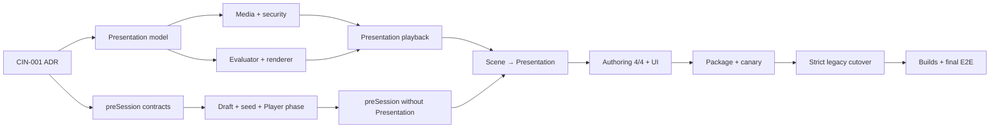
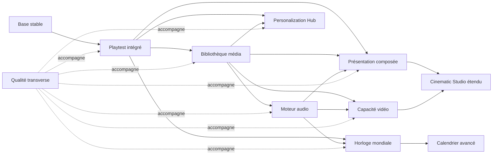

# PokeMap — Roadmap Runtime, Médias, Cinématiques, Audio et Temps

## 1. Statut du document

| Champ | Valeur |
|---|---|
| Type | Roadmap produit transverse |
| Statut | Roadmap canonique proposée pour exécution par lots ; décisions P0 à figer dans `BETA-CIN-001` |
| Date de référence | 13 août 2026 |
| Périmètre | Runtime intégré, playtest, médias, cinématiques, audio, temps, personnalisation et qualité associée |
| Public | Équipe produit et agents d'implémentation PokeMap |

Cette roadmap décrit des capacités génériques de PokeMap. Elle ne remplace pas :

- la roadmap canonique des mécaniques de fangame `pokemap_roadmap_mecaniques_fangame.md` ;
- les roadmaps historiques présentes dans `documentation/MVP Selbrume/` ;
- les plans d'implémentation détaillés qui devront être écrits et validés phase par phase.

Lorsqu'un lot touche une mécanique de fangame, son plan d'implémentation doit identifier les lots `FG-*` concernés et respecter leurs critères de clôture.

---

## 2. Contrainte fondamentale de généricité

Tout élément de cette roadmap doit être utilisable par n'importe quel projet créé avec PokeMap.

Il est interdit d'introduire dans les packages produit :

- des noms de lieux, de personnages, de trajets ou de scénarios propres à un jeu ;
- une logique conditionnelle réservée à un projet particulier ;
- des modèles ou commandes décrivant un moyen de transport précis lorsqu'un concept générique suffit ;
- des médias de production propres à un jeu dans les fixtures canoniques du moteur ;
- des raccourcis d'architecture justifiés uniquement par un cas narratif particulier.

Un projet réel peut servir de projet de validation ou de golden slice. Dans ce cas :

- son contenu reste dans son propre projet ;
- les fixtures automatisées restent minimales et neutres ;
- toute capacité révélée par ce projet est reformulée comme une fonctionnalité générique ;
- la preuve doit démontrer qu'un second projet pourrait configurer la même capacité sans modifier le code.

Exemple de formulation correcte :

```text
Interaction avec un point d'observation
→ ouverture d'une scène panoramique configurable
→ sélection de variantes par conditions
→ lecture de couches visuelles et audio synchronisées
→ sortie contrôlée et restauration du runtime
```

---

## 3. Principes d'architecture

### 3.1 Frontières des packages

| Package | Responsabilité dans cette roadmap |
|---|---|
| `map_core` | Modèles canoniques, sérialisation, validation, migrations et contrats purs |
| `map_gameplay` | Décisions de gameplay et de temps mondial ne dépendant ni de Flutter ni de Flame |
| `map_battle` | Intégrations audio ou temporelles du combat uniquement à travers des contrats explicites |
| `map_runtime` | Lecture des médias, rendu Flame, audio, caméra, overlays, cycle de vie et exécution du playtest |
| `map_player_ui` | Renderer Flutter partagé, surfaces de présentation et interactions structurées du Player |
| `map_authoring` | Actions sémantiques canoniques utilisables par l'éditeur, la CLI et MCP |
| `map_editor` | Parcours no-code, prévisualisation et composition de l'expérience d'authoring |
| `map_distribution` | Packaging déterministe, sécurité des médias, hashes, installation et vérification offline |
| Application de composition | Assemblage de l'éditeur et du runtime sans dépendance de l'éditeur vers les détails internes du runtime |

### 3.2 Règles permanentes

- L'éditeur ne dépend pas directement des détails internes de `map_runtime`.
- Le runtime consomme des contrats canoniques et ne corrige pas silencieusement des données invalides.
- Une nouvelle donnée visible par l'utilisateur doit avoir une stratégie de sérialisation, migration, validation et export.
- Les sélecteurs guidés remplacent les identifiants saisis à la main dans les parcours normaux.
- La prévisualisation et le jeu final doivent partager les mêmes contrats d'exécution.
- Toute nouvelle capacité d'authoring doit évaluer la parité API directe, JSONL/CLI, éditeur et MCP.
- Les préférences du joueur et les médias de production restent deux responsabilités séparées.
- Les erreurs média ne doivent jamais laisser le runtime dans un état verrouillé ou impossible à quitter.

---

## 4. Légende des statuts

| Symbole | Signification |
|---|---|
| ✅ | Fondation acquise avec preuves existantes, à revalider avant clôture d'un nouveau lot |
| 🟡 | Capacité partielle ou présente dans un périmètre limité |
| ⬜ | Capacité à construire |
| 🔧 | Capacité existante nécessitant une refonte notable |
| ⏸ | Capacité volontairement reportée |

Les statuts de cette version correspondent à l'audit préparatoire. Ils ne constituent pas une preuve fraîche de clôture.

---

## 5. Phase 0 — Stabilisation préalable

**Objectif :** retrouver une base compilable et testable avant d'ouvrir les lots transverses.

| ID | Capacité | Statut | Critère de sortie |
|---|---|---:|---|
| BASE-01 | Stabiliser le chantier Smart Tiles en cours | 🟡 | Les packages concernés compilent et leurs tests ciblés ne bloquent plus les vérifications des autres domaines. |
| BASE-02 | Vérifier les fichiers générés | 🟡 | Les sources, fichiers générés et signatures publiques sont cohérents dans chaque package concerné. |
| BASE-03 | Établir une ligne de base de tests | 🟡 | Les commandes ciblées et leurs résultats exacts sont consignés avant le premier lot fonctionnel. |
| BASE-04 | Isoler les changements préexistants | ⬜ | Chaque futur lot distingue ses fichiers des modifications déjà présentes dans le worktree. |

**Dépendances :** aucune.

**Sortie de phase :** les échecs préexistants sont soit corrigés, soit précisément isolés et documentés afin de ne pas masquer les régressions futures.

---

## 6. Phase 1 — Runtime et playtest intégrés à PokeMap

**Objectif :** réduire fortement le temps entre une modification dans PokeMap et sa vérification dans le véritable runtime.

| ID | Capacité | Statut | Critère de sortie |
|---|---|---:|---|
| PT-01 | Tester la carte courante | ⬜ | La carte ouverte peut être lancée dans le véritable runtime depuis PokeMap. |
| PT-02 | Tester un instantané non enregistré | ⬜ | Le runtime reçoit un snapshot temporaire sans imposer une sauvegarde du projet. |
| PT-03 | Choisir le point de départ | ⬜ | Le créateur peut utiliser le spawn principal, un spawn sélectionné ou une position de test valide. |
| PT-04 | Isoler les sauvegardes de test | ⬜ | Aucune sauvegarde de production ne peut être lue ou écrasée par défaut pendant le playtest. |
| PT-05 | Contrôler la session | ⬜ | Arrêter, recommencer, recharger et revenir à l'éditeur sont toujours accessibles. |
| PT-06 | Recharger rapidement | ⬜ | Les changements compatibles peuvent être réinjectés sans redémarrage complet de l'application. |
| PT-07 | Afficher les diagnostics | ⬜ | Carte, position, collisions, variables, interrupteurs, événements et erreurs sont inspectables. |
| PT-08 | Observer l'exécution narrative | ⬜ | La commande active, les conditions, les verrous d'entrée et les transitions sont visibles en mode debug. |
| PT-09 | Gérer les profils de playtest | ⬜ | Plusieurs états de départ configurables peuvent être enregistrés sans devenir du contenu du jeu. |
| PT-10 | Conserver un rapport de session | ⬜ | Les erreurs et avertissements d'une session peuvent être copiés ou exportés. |
| PT-11 | Tester le jeu complet | ⬜ | Le runtime peut être lancé depuis le flux écran-titre, Nouvelle partie ou Chargement. |
| PT-12 | Utiliser une composition découplée | 🟡 | L'intégration repose sur un port ou une factory injectée et non sur un import des détails du runtime par l'éditeur. |
| PT-13 | Assurer la parité des transports | 🟡 | L'API canonique, la CLI/JSONL, l'éditeur et MCP exposent les opérations applicables ou justifient explicitement les exceptions. |

**Dépendances :** Phase 0.

**Premier incrément livrable :** `PT-01` à `PT-05`, avec snapshot temporaire, spawn choisi et sauvegarde isolée.

**Sortie de phase :** une carte quelconque peut être modifiée, lancée, inspectée, rechargée et quittée sans manipulation externe du projet.

---

## 7. Phase 2 — Bibliothèque média commune

**Objectif :** fournir une fondation unique aux images animées, vidéos, musiques, ambiances, bruitages et effets cinématiques.

| ID | Capacité | Statut | Critère de sortie |
|---|---|---:|---|
| MED-01 | Bibliothèque média unifiée | ⬜ | Les différents types de médias partagent un catalogue canonique extensible. |
| MED-02 | Import guidé | ⬜ | Un média peut être importé sans édition manuelle de JSON ni saisie de chemin interne. |
| MED-03 | Identifiants stables | ⬜ | Le déplacement ou remplacement d'un fichier ne casse pas automatiquement ses usages. |
| MED-04 | Métadonnées techniques | ⬜ | Type, format, durée, dimensions, boucle et propriétés utiles sont conservés ou calculés. |
| MED-05 | Prévisualisation | 🟡 | Chaque type pris en charge possède une prévisualisation adaptée dans PokeMap. |
| MED-06 | Validation | ⬜ | Les fichiers absents, illisibles, incompatibles ou excessifs sont signalés avant le runtime. |
| MED-07 | Cycle de vie | ⬜ | Chargement, pause, reprise et libération réagissent correctement au cycle de vie de l'application. |
| MED-08 | Recherche et classement | ⬜ | Les médias peuvent être filtrés par type, rôle, étiquette et utilisation. |
| MED-09 | Graphe d'utilisation | ⬜ | PokeMap peut indiquer quelles cartes, scènes ou configurations référencent un média. |
| MED-10 | Remplacement sécurisé | ⬜ | Le remplacement conserve l'identité canonique et déclenche les validations nécessaires. |
| MED-11 | Préchargement et cache | ⬜ | Un groupe de médias peut être préparé avant l'entrée dans une carte ou une séquence. |
| MED-12 | Export et packaging | 🟡 | Les médias référencés sont inclus, les médias manquants bloquent correctement et les règles de plateforme sont vérifiées. |

**Dépendances :** Phase 1 pour la preuve dans le runtime réel.

**Sortie de phase :** un média importé par un parcours no-code possède une identité stable, peut être prévisualisé, validé, référencé et retrouvé dans le package exporté.

---

## 8. Phase 3 — Moteur audio générique

**Objectif :** fournir un moteur audio cohérent pour les cartes, interfaces, événements, combats et cinématiques.

| ID | Capacité | Statut | Critère de sortie |
|---|---|---:|---|
| AUD-01 | Catalogue audio canonique | ⬜ | Musiques, ambiances, effets, sons d'interface et voix éventuelles sont décrits sans chemins bruts. |
| AUD-02 | Audio Director | ⬜ | Un service runtime arbitre les transitions et l'état audio global. |
| AUD-03 | Musique de carte | 🟡 | La musique configurée dans les métadonnées d'une carte est réellement résolue et jouée. |
| AUD-04 | Transitions musicales | ⬜ | Fondu entrant, fondu sortant, remplacement et arrêt sont configurables et testés. |
| AUD-05 | Continuité musicale | ⬜ | Une transition de carte ne redémarre pas une piste compatible sans raison. |
| AUD-06 | Ambiances de carte | ⬜ | Une carte peut référencer une ou plusieurs boucles d'environnement. |
| AUD-07 | Soundscapes multicouches | ⬜ | Un paysage sonore combine des couches, variantes, conditions et intensités. |
| AUD-08 | Zones et émetteurs sonores | ⬜ | Position, distance et zone peuvent influer sur la présence ou le volume d'un son. |
| AUD-09 | Bruitages de gameplay | ⬜ | Les événements de gameplay génériques peuvent déclencher des identités sonores configurables. |
| AUD-10 | Sons d'interface | ⬜ | Navigation, validation, annulation, erreur et notification utilisent un thème sonore cohérent. |
| AUD-11 | Commandes audio d'événement | 🟡 | Les événements peuvent jouer, arrêter, fondre ou modifier une ressource audio canonique. |
| AUD-12 | Bus Master | 🟡 | Le volume général est persistant et appliqué à toutes les sorties. |
| AUD-13 | Bus Musique | 🟡 | Les musiques disposent d'un réglage indépendant. |
| AUD-14 | Bus Ambiance | ⬜ | Les ambiances disposent d'un réglage indépendant. |
| AUD-15 | Bus Effets | 🟡 | Les bruitages disposent d'un réglage indépendant. |
| AUD-16 | Bus Interface | ⬜ | Les sons d'interface disposent d'un réglage indépendant. |
| AUD-17 | Bus Voix | ⏸ | Une sortie séparée peut être activée si un projet utilise des voix. |
| AUD-18 | Ducking | ⬜ | Les pistes configurées diminuent temporairement pendant une priorité audio supérieure. |
| AUD-19 | Priorités et limites | ⬜ | Le nombre de voix simultanées et leur stratégie d'éviction sont déterministes. |
| AUD-20 | Pooling et cache | ⬜ | Les sons fréquents ne déclenchent pas de chargements répétés évitables. |
| AUD-21 | Variantes | ⬜ | Une identité sonore peut sélectionner plusieurs échantillons ou variations configurables. |
| AUD-22 | Spatialisation simple | ⬜ | Panoramique, distance et atténuation fonctionnent sans moteur audio propriétaire au projet. |
| AUD-23 | Audio Studio | ⬜ | Un parcours dédié configure médias, boucles, bus, soundscapes et prévisualisation. |
| AUD-24 | Sélecteurs guidés | ⬜ | Les références audio normales utilisent la bibliothèque média, pas un champ d'identifiant brut. |
| AUD-25 | Inventaire audio | ⬜ | Le projet peut produire une cue sheet comprenant rôles, sources, boucles, volumes et licences. |
| AUD-26 | Accessibilité audio | ⬜ | Les réglages prévoient sous-titres sonores, atténuation des sons brusques et alternatives utiles. |

**Dépendances :** Phase 2.

**Vertical slice recommandé :** musique de carte, ambiance multicouche, transition de carte, sons d'interaction et réglages Master/Musique/Ambiance/Effets.

**Sortie de phase :** un projet neutre configure son identité audio dans PokeMap et obtient le même comportement en preview, playtest et package exporté.

---

## 9. Phase 4 — Cinématiques de présentation composées

**Objectif :** fournir une cinématique de présentation hors monde, indépendante d'une map et d'un `GameState`, capable de composer des calques, du texte, des médias et des transitions. Une composition panoramique est une capacité de cette famille, pas une troisième famille de cinématique.

| ID | Capacité | Statut | Critère de sortie |
|---|---|---:|---|
| CIN-RT-01 | Présentation canonique | ⬜ | Une cinématique de présentation peut ouvrir une surface visuelle indépendante du monde et de la carte principale. |
| CIN-RT-02 | Parallaxe multicouche | ⬜ | Plusieurs couches défilent avec des vitesses, directions et modes de répétition configurables. |
| CIN-RT-03 | Boucle visuelle | ⬜ | Une couche bouclée ne présente pas de rupture visible aux dimensions validées. |
| CIN-RT-04 | Séquence non bouclée | ⬜ | Une scène peut avoir une durée et une fin déterminées sans répétition. |
| CIN-RT-05 | Variantes conditionnelles | ⬜ | Les couches ou scènes peuvent être choisies par des conditions canoniques du projet. |
| CIN-RT-06 | Masques et cadres | ⬜ | Une scène peut être limitée par un masque ou un cadre configurable. |
| CIN-RT-07 | Marqueurs temporels | ⬜ | Des marqueurs déclenchent effets, dialogues, changements de couche ou commandes audio. |
| CIN-RT-08 | Interaction d'entrée | ⬜ | Une interaction générique peut ouvrir la scène avec paramètres et contexte. |
| CIN-RT-09 | Politique de sortie | ⬜ | La scène définit si et quand elle peut être quittée, passée ou rejouée. |
| CIN-RT-10 | Politique d'entrée joueur | ⬜ | Les commandes peuvent être verrouillées, limitées ou redirigées pendant la scène. |
| CIN-RT-11 | Synchronisation audio-visuelle | ⬜ | Les couches, marqueurs, dialogues et sons utilisent une même référence temporelle. |
| CIN-RT-12 | Restauration du runtime | ⬜ | Caméra, overlay, commandes et audio reviennent à un état valide après succès, sortie ou erreur. |
| CIN-RT-13 | Authoring no-code | ⬜ | La scène est configurable par sélecteurs, aperçu et validations sans édition de JSON. |
| CIN-RT-14 | Portabilité du cas d'usage | ⬜ | Les fixtures prouvent au moins deux configurations sémantiquement différentes sans branche de code dédiée. |

**Dépendances :** Phases 1 à 3.

**Sortie de phase :** une Scene peut lancer une présentation multicouche hors monde, synchronisée avec l'audio, contrôlable, accessible et correctement restaurée.

---

## 10. Phase 5 — Cinématiques vidéo

**Objectif :** permettre l'utilisation encadrée de vidéos pré-rendues comme capacité d'une cinématique de présentation, sans créer une famille de cinématique ou un lecteur concurrent.

| ID | Capacité | Statut | Critère de sortie |
|---|---|---:|---|
| CIN-VID-01 | Média vidéo canonique | ⬜ | La vidéo devient un type officiel de la bibliothèque média. |
| CIN-VID-02 | Étape vidéo | ⬜ | Une vidéo peut être insérée dans une cinématique ou déclenchée par une commande canonique. |
| CIN-VID-03 | Lecteur commun | 🟡 | Les fondations existantes de lecture d'introduction sont extraites derrière un contrat réutilisable. |
| CIN-VID-04 | Modes d'affichage | ⬜ | Plein écran et surface intégrée respectent dimensions, ratio et politique de fond. |
| CIN-VID-05 | Cycle de vie | ⬜ | Pause, reprise, perte de focus et arrière-plan conservent un état cohérent. |
| CIN-VID-06 | Politique de passage | ⬜ | Une vidéo peut être obligatoire, passable immédiatement ou passable après un délai. |
| CIN-VID-07 | Sous-titres | ⬜ | Des pistes localisables sont synchronisées et activables indépendamment de l'audio. |
| CIN-VID-08 | Solution de secours | ⬜ | Une image, un texte ou une autre scène peut remplacer une vidéo illisible ou non supportée. |
| CIN-VID-09 | Préchargement | ⬜ | Le lancement évite les attentes et écrans noirs évitables. |
| CIN-VID-10 | Validation plateforme | ⬜ | Codec, conteneur, résolution et budget sont vérifiés selon les cibles de publication. |
| CIN-VID-11 | Prévisualisation réelle | ⬜ | La vidéo se comporte de manière équivalente dans le Studio et le runtime. |
| CIN-VID-12 | Packaging | ⬜ | Le fichier, ses sous-titres et son fallback sont inclus et vérifiés lors de l'export. |

**Dépendances :** Phases 1 et 2. La Phase 3 est requise pour la politique audio complète.

**Sortie de phase :** une vidéo importée, validée et sous-titrée peut être jouée, interrompue selon sa politique, remplacée en cas d'échec et exportée sans référence cassée.

---

## 11. Phase 6 — Évolution du Cinematic Studio

**Objectif :** réunir deux familles explicites — cinématique de monde et cinématique de présentation — dans une expérience d'authoring cohérente. Panorama, composition multicouche et vidéo sont des capacités du mode présentation.

### 11.1 Fondations observées

| ID | Capacité | Statut | Décision |
|---|---|---:|---|
| CIN-ST-01 | Modèle `CinematicAsset` monde | ✅ | Le conserver pour les cinématiques in-engine ; ne pas l'étendre par des champs nullable de présentation. |
| CIN-ST-02 | Actions linéaires in-game | ✅ | Conserver caméra, acteur, dialogue, audio, fondus, secousses, effets et marqueurs. |
| CIN-ST-03 | Prévisualisation runtime | 🟡 | Revalider la parité après stabilisation de la ligne de base. |
| CIN-ST-04 | Ancien Cutscene Studio | 🔧 | Le retirer intégralement après canary du remplacement : zéro reader, bridge, fallback, conversion automatique, route ou surface legacy. |
| CIN-ST-05 | V1 linéaire | 🟡 | Elle peut être clôturée fonctionnellement après preuve fraîche, mais ne couvre pas la vision cinématique complète. |

### 11.2 Extensions à réaliser

| ID | Capacité | Statut | Critère de sortie |
|---|---|---:|---|
| CIN-ST-06 | Familles de cinématique | ⬜ | Le Studio distingue clairement monde et présentation ; panorama et vidéo restent des capacités de présentation. |
| CIN-ST-07 | Timeline temporelle | ⬜ | Chaque élément possède une position et une durée explicites. |
| CIN-ST-08 | Pistes simultanées | ⬜ | Caméra, image, acteur, dialogue, audio et effets peuvent se chevaucher. |
| CIN-ST-09 | Réorganisation visuelle | ⬜ | Les éléments sont déplaçables et redimensionnables avec annulation. |
| CIN-ST-10 | Marqueurs nommés | 🟡 | Les marqueurs servent à la navigation, la synchronisation et les déclenchements. |
| CIN-ST-11 | Modèles de scène | ⬜ | Des modèles génériques accélèrent les parcours courants sans enfermer le créateur. |
| CIN-ST-12 | Preview dans le vrai runtime | ⬜ | Le Studio injecte un snapshot dans le même moteur que le playtest. |
| CIN-ST-13 | Préflight complet | 🟡 | Références, durées, médias, transitions et politiques de sortie sont vérifiés avant lecture. |
| CIN-ST-14 | Historique et annulation | 🟡 | Les opérations structurantes sont réversibles et testées. |
| CIN-ST-15 | Modularisation de l'espace de travail | 🔧 | Le grand workspace actuel est séparé par responsabilités sans régression de parcours. |
| CIN-ST-16 | Diagnostic de parité | ⬜ | Toute divergence entre preview et runtime est visible et couverte par une fixture partagée. |

**Dépendances :** contrats CIN-V2, Phase 2 pour les médias, Phase 4 pour la présentation composée et Phase 5 pour la capacité vidéo. La pré-session sans présentation reste livrable sans dépendre des Phases 4 et 5.

**Sortie de phase :** une personne non développeuse peut construire, prévisualiser, diagnostiquer et publier les deux familles de cinématiques depuis un seul Studio cohérent, et Narrative Studio peut les orchestrer sans devenir un second moteur de timeline.

### 11.3 CIN-V2 — Roadmap exécutable cinématiques de présentation et pré-session

Cette famille est le graphe d'exécution canonique du chantier. Les identifiants historiques `BETA-WLD-008`, `BETA-WLD-009` et `BETA-LCH-001` sont conservés. `Bloqué par` dans le cockpit Notion est la source de vérité ; les champs texte et la relation inverse `Bloque` doivent en être des projections synchronisées.

Règles de découpage :

- un ticket d'implémentation possède un seul owner, un livrable vérifiable et aucun second chantier caché ; il est redécoupé si son delta n'est plus révisable indépendamment ;
- `BETA-WLD-009`, `BETA-CIN-010`, `BETA-CIN-028` et `BETA-CIN-008` sont des gates d'agrégation, pas des sacs de code supplémentaires ;
- la voie pré-session sans présentation reste indépendante de la voie média/renderer jusqu'à leur jointure ;
- la baseline UI rouge ne bloque jamais `map_core`, le draft, le seed ou l'évaluateur headless ;
- le cutover legacy n'est lancé qu'après un canary du remplacement canonique ;
- le gate final agrège des reçus déjà verts et n'a pas le droit de corriger un comportement.

#### A. Décisions et baselines

| Ordre | Ticket | Livrable atomique | Bloqué par | Preuve de sortie |
|---:|---|---|---|---|
| 0.395 | `BETA-CIN-012` | Caractériser la route Cinematics, le timer pendant et les goldens rouges. | — | Baseline reproductible, dettes attribuées et nouvelles régressions distinguables. |
| 0.400 | `BETA-CIN-001` | ADR monde/présentation/preSession, frontières de packages et matrice des décisions P0. | — | Toutes les décisions P0 sont tranchées, sans code runtime ou UI. |
| 0.405 | `BETA-CIN-011` | Co-concevoir l'UX/UI et obtenir la validation humaine explicite. | `CIN-001` | Wireframes, maquettes, prototype, états, a11y et handoff approuvés par Yoahn. |

#### B. Contrats Presentation et médias

| Ordre | Ticket | Livrable atomique | Bloqué par | Preuve de sortie |
|---:|---|---|---|---|
| 0.410 | `BETA-CIN-002` | `PresentationCinematicAsset`, codec versionné, timebase absolue, tracks et clips purs. | `CIN-001` | Roundtrip canonique, versions futures rejetées, aucune dépendance Flutter/Flame. |
| 0.425 | `BETA-CIN-013` | Graphe de références, usages, preflight inter-assets et suppression sûre. | `CIN-002` | Une ressource active ne peut jamais être supprimée ; références absentes diagnostiquées. |
| 0.430 | `BETA-CIN-014` | Catalogue média Presentation et identités stables. | `CIN-002`, `CIN-013` | Image, audio, vidéo, poster et captions possèdent une identité stable et queryable. |
| 0.432 | `BETA-CIN-029` | Import transactionnel et probe technique réel. | `CIN-014` | Import atomique ; MIME/magic, dimensions, durée et codec constatés avant commit. |
| 0.434 | `BETA-CIN-030` | Métadonnées, captions, fallbacks, provenance, licences et budgets authorés. | `CIN-029` | Métadonnées complètes, fallbacks actionnables et budgets par asset/séquence. |
| 0.436 | `BETA-CIN-048` | Sécurité des médias et corpus hostiles. | `CIN-029`, `CIN-030` | Traversal, symlink, TOCTOU, archive bomb, MIME trompeur et fichiers excessifs rejetés avant écriture hors staging. |
| 0.440 | `BETA-CIN-015` | Évaluateur déterministe render-neutral. | `CIN-002` | Seek/timebase produisent le même `PresentationFrame` sans map, Flame ou `GameState`. |
| 0.445 | `BETA-CIN-017` | Renderer Flutter partagé statique dans `map_player_ui`. | `CIN-014`, `CIN-015` | Player et Editor rendent le même frame, sans renderer bis ni cycle de packages. |
| 0.447 | `BETA-CIN-031` | Compositing, animations et transitions partagés. | `CIN-017` | Calques, z-order, transform, opacity, easing et transitions suivent le frame canonique. |
| 0.450 | `BETA-CIN-018` | Autorité audio/vidéo unique et lecture intégrée. | `CIN-030`, `CIN-031` | Une seule politique mute/volume/ducking ; jamais deux autorités audio concurrentes. |
| 0.452 | `BETA-CIN-032` | Lifecycle, skip, captions, reduced motion/flash, cache et cleanup. | `CIN-018` | Pause/reprise/skip/error libèrent exactement une fois tous les handles et respectent l'accessibilité. |

#### C. Scene, interactions et New Game sans dépendance Presentation

| Ordre | Ticket | Livrable atomique | Bloqué par | Preuve de sortie |
|---:|---|---|---|---|
| 0.415 | `BETA-CIN-003` | `SceneExecutionProfile.preSession` et capability gate unique. | `CIN-001` | Actions monde refusées au build et au runtime avec le même diagnostic. |
| 0.420 | `BETA-CIN-004` | Requêtes/résultats structurés awaitables, validation, cancel et stale revision. | `CIN-001` | Aucun caractère ni contrôle UI ne traverse `RuntimeInputEvent`. |
| 0.435 | `BETA-CIN-005` | `NewGameDraft` immuable/versionné et commandes de mutation pures. | `CIN-003`, `CIN-004` | Cancel/stale/retry n'écrivent aucune session, save ou configuration projet. |
| 0.438 | `BETA-CIN-007` | Entrypoint optionnel unique et migration contrôlée de `starterSelectionSceneId`. | `CIN-003`, `CIN-005` | Un seul nom canonique ; Scene incompatible bloquée ; absence de flow préservée. |
| 0.442 | `BETA-CIN-016` | Commit exact-once `NewGameDraft → NewGameSeed`. | `CIN-005` | Aucun commit partiel ou mutation de `ProjectNewGameConfig`. |
| 0.444 | `BETA-CIN-034` | Surfaces Player choice/text/confirmation/selection. | `CIN-004`, `CIN-011` | IME, clavier, tactile, manette, graphemes, focus et stale request couverts. |
| 0.446 | `BETA-CIN-035` | Projection `NewGameSeed → GameState` dans `map_gameplay`. | `CIN-016` | Le même seed produit un état déterministe ; starter reste une extension de gameplay. |
| 0.455 | `BETA-LCH-001` | Phase Player preSession, slot/overwrite, preload, cancel/retry et création session. | `CIN-007`, `CIN-016`, `CIN-034`, `CIN-035` | Flow absent ou textuel fonctionne sans Presentation ; ancienne save intacte avant commit. |

#### D. Scene → Presentation et authoring canonique

| Ordre | Ticket | Livrable atomique | Bloqué par | Preuve de sortie |
|---:|---|---|---|---|
| 0.460 | `BETA-WLD-008` | Nœud Scene typé Presentation et exécution awaitable. | `CIN-003`, `CIN-015`, `CIN-032` | `completed/cancelled/failed` exact-once ; non-régression des Cinematics monde canoniques. |
| 0.462 | `BETA-CIN-006` | Actions et validations headless Scene/preSession. | `CIN-003`, `CIN-004`, `CIN-005` | Template, capabilities, draft bindings et diagnostics passent en API directe/JSONL. |
| 0.464 | `BETA-CIN-019` | Resources, queries et actions sémantiques Presentation en API directe/JSONL. | `CIN-013`, `CIN-014` | Tracks/clips/layers/media queryables ; dry-run, CAS, receipts, undo et pagination prouvés. |
| 0.466 | `BETA-CIN-033` | Adaptateur MCP et certification des quatre transports. | `CIN-006`, `CIN-019` | API directe, JSONL/CLI, Editor et MCP = 4/4 E2E avec catalogue live. |

#### E. UI atomique

| Ordre | Ticket | Livrable atomique | Bloqué par | Preuve de sortie |
|---:|---|---|---|---|
| 0.470 | `BETA-CIN-020` | Routes typées et adoption de la session documentaire Narrative existante. | `CIN-011`, `CIN-012` | Dirty guard, undo/redo, autosave, conflit et restauration communs. |
| 0.472 | `BETA-CIN-021` | Library et création mode-aware. | `CIN-002`, `CIN-019`, `CIN-020` | Mode → template → titre, badges, filtres, duplication et réouverture. |
| 0.474 | `BETA-CIN-022` | Extraire/stabiliser le Builder monde. | `CIN-011`, `CIN-012`, `CIN-020` | Aucune régression map/acteurs/caméra et responsabilités sorties du workspace géant. |
| 0.476 | `BETA-CIN-023` | Canvas Presentation et layer stack. | `CIN-017`, `CIN-019`, `CIN-020` | Ratio, safe areas, fonds, calques, médias et z-order sans contrôles monde parasites. |
| 0.478 | `BETA-CIN-024` | Timeline et transports partagés. | `CIN-002`, `CIN-022`, `CIN-023` | Move/resize/scrub/zoom, raccourcis et commit unique après drag. |
| 0.480 | `BETA-CIN-025` | Palette/picker preSession dans Scene Builder. | `CIN-006`, `CIN-021`, `WLD-008` | Capabilities visibles et incompatibilités expliquées, sans IDs manuels. |
| 0.482 | `BETA-CIN-039` | Transaction atomique create-and-link. | `CIN-020`, `CIN-021`, `CIN-025` | Créer/lier/revenir forme un seul undo et ne produit aucun asset orphelin. |
| 0.484 | `BETA-CIN-026` | Diagnostics et récupération UI. | `CIN-013`, `CIN-021` à `CIN-025`, `CIN-032` | Missing/corrupt/unsupported media, retry/fix/open-source et live feedback sans catch silencieux. |
| 0.486 | `BETA-CIN-040` | Design system, a11y, l10n et responsive. | `CIN-026` | Aucun contrôle ad hoc ; clavier/focus/semantics ; FR/EN ; 1280–1920 et text scale 100–150 %. |
| 0.488 | `BETA-CIN-041` | Certification visuelle et parité preview/runtime. | `CIN-024`, `CIN-039`, `CIN-040` | Goldens frais et même asset/même timestamp dans Editor et vrai runtime. |
| 0.490 | `BETA-WLD-009` | Gate d'intégration du nouveau Cinematic Studio. | `CIN-021` à `CIN-026`, `CIN-039` à `CIN-041` | Les deux modes et le flow preSession passent le contrat validé de `CIN-011`. |

#### F. Distribution, canary, cutover et certification

| Ordre | Ticket | Livrable atomique | Bloqué par | Preuve de sortie |
|---:|---|---|---|---|
| 0.492 | `BETA-CIN-027` | Packaging déterministe et réinstallation offline. | `CIN-013`, `CIN-030`, `CIN-032`, `CIN-048` | Layout, hashes, captions, fallbacks, licences et budgets vérifiés après réinstallation. |
| 0.494 | `BETA-CIN-037` | Observabilité structurée et respect de la vie privée. | `CIN-032`, `LCH-001`, `WLD-008` | Un terminal event/runId ; aucun chemin absolu, sous-titre ou donnée joueur dans les logs. |
| 0.496 | `BETA-CIN-038` | Performance et mémoire mesurées. | `CIN-037`, `WLD-009` | 50 cycles, un décodeur max, zéro handle final, RSS ≤10 %, skip p95 <100 ms, première frame p95 <1 s. |
| 0.498 | `BETA-CIN-042` | Canary E2E du remplacement avant cutover. | `CIN-027`, `CIN-033`, `LCH-001`, `WLD-008`, `WLD-009` | Authoring → package → install → preSession → map → save/reload vert avant suppression legacy. |
| 0.500 | `BETA-CIN-043` | Retrait legacy core/runtime et réécriture des fixtures retenues. | `CIN-042` | Zéro reader/bridge/fallback runtime et rejet fail-closed avant mutation. |
| 0.502 | `BETA-CIN-044` | Retrait legacy Editor/authoring/CLI/MCP. | `CIN-042`, `CIN-043` | Zéro route, widget, schema, action, query ou transport legacy. |
| 0.504 | `BETA-CIN-010` | Gate de cutover legacy intégral. | `CIN-043`, `CIN-044` | `rg` production sans marqueur legacy, suites canoniques vertes et aucun dual-reader. |
| 0.506 | `BETA-CIN-036` | Compatibilité project/package/save et rollback. | `CIN-010`, `CIN-027`, `LCH-001` | Migration canonique, future version rejetée, crash ancien/nouveau atomique, ancienne save inchangée avant commit. |
| 0.508 | `BETA-CIN-045` | Build macOS courant et politique SPM-only. | `CIN-010`, `CIN-027`, `WLD-009` | Editor/Player/Hub release buildés au SHA courant, zéro Pods. |
| 0.510 | `BETA-CIN-046` | Builds et E2E iOS/Android. | `CIN-010`, `CIN-027`, `LCH-001`, `WLD-009` | Bundles release et parcours device réels sur les deux plateformes. |
| 0.512 | `BETA-CIN-047` | Décision et preuve Web/Windows/Linux. | `CIN-010`, `CIN-027` | Backend certifié ou fallback poster/hors scope déclaré, testé et non trompeur. |
| 0.514 | `BETA-CIN-028` | Gate builds et plateformes. | `CIN-045`, `CIN-046`, `CIN-047` | Chaque plateforme a son verdict et son receipt ; aucune moyenne ne masque un rouge. |
| 0.516 | `BETA-CIN-008` | Certification finale neutre de bout en bout. | `CIN-010`, `CIN-028`, `CIN-033`, `CIN-036`, `CIN-038`, `CIN-041`, `LCH-001` | Matrice complète avec/sans preSession/Presentation, input, lifecycle, crash, package, save/reload et legacy rejeté. |
| 0.700 | `BETA-CIN-009` | Généraliser aux interludes, endings et transitions. | `CIN-008` | Deux fixtures hors New Game prouvent l'absence de spécialisation identité. |

Dans Notion, les relations `Bloqué par` de `BETA-CIN-008` doivent contenir uniquement `CIN-010`, `CIN-028`, `CIN-033`, `CIN-036`, `CIN-038`, `CIN-041` et `BETA-LCH-001`.

Projection contrôlée le 13 août 2026 : **51 tickets, 122 dépendances, 2 racines, 0 cycle et 0 violation d'ordre**. Les 51 pages Notion ont été relues individuellement après écriture ; parents, relations inverses, ordre et readiness correspondent tous à ce graphe.

### 11.4 Chemin critique et parallélisation



`CIN-001` et `CIN-012` sont les deux racines immédiatement parallélisables. Après `CIN-001`, `CIN-002`, `CIN-003`, `CIN-004` et `CIN-011` peuvent avancer en parallèle tandis que `CIN-012` poursuit la caractérisation UI. La pré-session textuelle doit atteindre son canary sans attendre la vidéo, le compositing ou le Studio Presentation. `CIN-010` ne peut jamais avancer en parallèle de writers/readers canoniques encore instables.

---

## 12. Phase 7 — Horloge mondiale et cycle jour-nuit

**Objectif :** fournir une source de temps configurable pouvant piloter le rendu, l'audio et les règles du monde.

| ID | Capacité | Statut | Critère de sortie |
|---|---|---:|---|
| TIME-01 | Horloge mondiale canonique | ⬜ | Tous les consommateurs lisent une même source de temps sérialisable. |
| TIME-02 | Mode narratif | ⬜ | Le temps avance uniquement sur commande ou transition définie par le projet. |
| TIME-03 | Mode accéléré | ⬜ | La relation temps réel/temps du monde est configurable et testée. |
| TIME-04 | Mode appareil | ⬜ | La synchronisation avec l'appareil est facultative et remplaçable par un autre mode. |
| TIME-05 | Mode personnalisé | ⬜ | Un projet peut configurer ses règles sans ajouter de logique spécifique au moteur. |
| TIME-06 | Pause temporelle | ⬜ | Menus, cinématiques et états configurés peuvent suspendre l'avancement. |
| TIME-07 | Persistance | ⬜ | Jour, heure, minute, mode et paramètres nécessaires survivent à la sauvegarde. |
| TIME-08 | Phases visuelles | ⬜ | Les périodes sont configurables et ne sont pas limitées à quatre noms imposés. |
| TIME-09 | Éclairage global | ⬜ | Teinte, luminosité et transitions dépendent de profils de période validés. |
| TIME-10 | Lumières automatiques | ⬜ | Des composants peuvent réagir à des plages temporelles sans script spécifique. |
| TIME-11 | Variantes de décors | ⬜ | Les références visuelles peuvent changer selon une condition temporelle canonique. |
| TIME-12 | Ombres solaires | 🟡 | L'orientation et la longueur sont pilotables par le temps lorsque la fonctionnalité est activée. |
| TIME-13 | Conditions temporelles | ⬜ | Les événements, dialogues, rencontres et règles du monde peuvent interroger le temps. |
| TIME-14 | Soundscapes temporels | ⬜ | Le moteur audio peut effectuer une transition entre profils selon la période. |
| TIME-15 | Transitions progressives | ⬜ | Les changements visuels et audio évitent les ruptures non configurées. |
| TIME-16 | Contrôles de playtest | ⬜ | Le créateur peut figer, avancer ou définir le temps dans une session isolée. |

**Dépendances :** Phases 1 et 3. Les scènes de la Phase 4 peuvent également consommer les conditions temporelles.

**Mode recommandé par défaut :** le projet choisit explicitement son mode ; le moteur ne suppose jamais que l'horloge de l'appareil est la source canonique.

**Sortie de phase :** le temps peut être configuré, sauvegardé, simulé en playtest et utilisé de manière cohérente par le rendu, l'audio et les conditions de gameplay.

---

## 13. Phase 8 — Refonte du Personalization Hub

**Objectif :** remplacer l'espace actuel difficile à comprendre par des parcours séparés, prévisibles et prévisualisés dans le runtime réel.

| ID | Capacité | Statut | Critère de sortie |
|---|---|---:|---|
| PERS-01 | Audit du parcours actuel | 🔧 | Les problèmes d'architecture de l'information, de vocabulaire et d'état sont inventoriés avec preuves. |
| PERS-02 | Séparation des responsabilités | 🔧 | Personnalisation, média, preview et publication possèdent des responsabilités explicites. |
| PERS-03 | Parcours Identité | ⬜ | Nom, logo, icône et éléments de marque sont configurables dans un parcours guidé. |
| PERS-04 | Parcours Introduction | ⬜ | Écran-titre, introduction et médias associés sont configurables et prévisualisables. |
| PERS-05 | Parcours Thème | ⬜ | Typographie, couleurs et options visuelles utilisent les primitives du design system. |
| PERS-06 | Preview runtime réelle | ⬜ | Les écrans personnalisés sont rendus par le même runtime que le jeu exporté. |
| PERS-07 | Brouillons explicites | 🟡 | Les changements en cours sont distingués de la configuration enregistrée et publiée. |
| PERS-08 | Actions compréhensibles | 🔧 | Enregistrer, appliquer, annuler, réinitialiser et publier ont des effets non ambigus. |
| PERS-09 | Préréglages réversibles | ⬜ | Un preset peut être appliqué puis annulé sans perte silencieuse. |
| PERS-10 | Sélecteurs média guidés | ⬜ | Les médias sont choisis dans la bibliothèque commune. |
| PERS-11 | Préflight simplifié | 🔧 | Chaque erreur explique sa cause, son impact et l'action de correction disponible. |
| PERS-12 | Publication guidée | 🔧 | Le contenu exporté est prévisible et seuls les problèmes réellement bloquants empêchent l'action. |
| PERS-13 | Découpage technique | 🔧 | Les grands fichiers sont séparés en unités cohérentes protégées par des tests de parcours. |
| PERS-14 | Aide contextuelle | ⬜ | Les réglages complexes disposent d'une explication au point de décision. |

**Non-objectif :** transformer le Personalization Hub en Audio Studio ou en bibliothèque média.

**Dépendances :** Phases 1 et 2. Les fondations audio et vidéo permettent d'éviter de recréer des sélecteurs spécialisés.

**Sortie de phase :** une personne découvrant l'outil peut identifier le parcours pertinent, modifier une configuration, la prévisualiser, comprendre ses erreurs et la publier.

---

## 14. Phase 9 — Calendrier avancé

**Objectif :** étendre l'horloge mondiale avec des cycles de jours et des règles récurrentes sans les imposer aux projets simples.

| ID | Capacité | Statut | Critère de sortie |
|---|---|---:|---|
| CAL-01 | Index de jour | ⏸ | Une sauvegarde peut conserver un jour courant indépendant du calendrier réel. |
| CAL-02 | Semaine configurable | ⏸ | La longueur et les noms des jours sont définis par le projet. |
| CAL-03 | Calendrier personnalisé | ⏸ | Des cycles fictifs peuvent être décrits sans hypothèse grégorienne. |
| CAL-04 | Horaires de présence | ⏸ | Une entité peut sélectionner présence, position ou comportement par règles temporelles. |
| CAL-05 | Événements récurrents | ⏸ | Une règle peut se déclencher à certaines plages, certains jours ou selon un cycle. |
| CAL-06 | Exceptions narratives | ⏸ | Le scénario peut suspendre ou remplacer temporairement une récurrence. |
| CAL-07 | Simulation en playtest | ⏸ | Le créateur peut atteindre rapidement une date ou une occurrence sans modifier la sauvegarde réelle. |
| CAL-08 | Validation des règles | ⏸ | Les plages impossibles, cycles incohérents et références invalides sont détectés. |

**Dépendances :** Phase 7.

**Sortie de phase :** un projet peut activer un calendrier réel ou fictif et configurer des horaires sans que cette complexité soit obligatoire pour les autres projets.

---

## 15. Chantier transverse — Qualité, accessibilité et parité

Ces lots accompagnent les phases fonctionnelles ; ils ne constituent pas une phase finale de rattrapage.

| ID | Capacité | Statut | Critère de sortie |
|---|---|---:|---|
| QA-01 | Contrats partagés | 🟡 | Éditeur, API, preview, runtime, export et MCP utilisent les mêmes sémantiques. |
| QA-02 | Fixtures communes | ⬜ | Une même fixture neutre couvre sérialisation, authoring, preview et runtime. |
| QA-03 | Erreurs média récupérables | ⬜ | Une ressource absente ou illisible produit un diagnostic et un état runtime sûr. |
| QA-04 | Restauration après séquence | 🟡 | Entrées, caméra, overlays et audio sont restaurés après succès, annulation ou exception. |
| QA-05 | Validation pré-runtime | 🟡 | Les erreurs déterministes sont détectées avant le lancement. |
| QA-06 | Budgets média | ⬜ | Des seuils configurables avertissent sur mémoire, durée, résolution et taille. |
| QA-07 | Formats par plateforme | ⬜ | Les formats officiellement supportés sont documentés et validés. |
| QA-08 | Sous-titres | ⬜ | Vidéos et informations audio pertinentes possèdent une alternative textuelle. |
| QA-09 | Réduction des mouvements | ⬜ | Parallaxe, secousses et transitions respectent une préférence d'accessibilité. |
| QA-10 | Réduction des flashs | ⬜ | Les effets lumineux dangereux sont détectés ou atténuables. |
| QA-11 | Contrôle des séquences | ⬜ | Passer, accélérer, mettre en pause ou revoir respecte une politique explicite. |
| QA-12 | Diagnostic d'export | ⬜ | Le rapport distingue clairement erreurs bloquantes, avertissements et informations. |
| QA-13 | Vérification du package | 🟡 | Toutes les ressources référencées et leurs dépendances sont prouvées présentes. |
| QA-14 | Golden slice neutre | ⬜ | Un projet de démonstration minimal couvre playtest, média, audio, temps et cinématiques. |
| QA-15 | Tests de cycle de vie | ⬜ | Pause, reprise, focus, arrêt et relance sont couverts pour audio et vidéo. |
| QA-16 | Compatibilité ascendante | ⬜ | Les migrations conservent les projets existants ou produisent un diagnostic actionnable. |

---

## 16. Ordre recommandé et jalons

| Ordre | Phase | Lots principaux | Jalon produit |
|---:|---|---|---|
| 0 | Stabilisation | BASE-01 à BASE-04 | Base de vérification fiable |
| 1 | Playtest de carte | PT-01 à PT-10 | Boucle éditer → tester → diagnostiquer |
| 2 | Médias | MED-01 à MED-12 | Bibliothèque commune importable et exportable |
| 3 | Audio | AUD-01 à AUD-26 | Vertical slice audio générique |
| 4 | Présentation composée | CIN-RT-01 à CIN-RT-14 | Présentation hors monde multicouche réutilisable |
| 5 | Capacité vidéo | CIN-VID-01 à CIN-VID-12 | Lecture vidéo robuste et accessible dans Presentation |
| 6 | Studio et jeu complet | CIN-ST-01 à CIN-ST-16, CIN-V2, PT-11 à PT-13 | Authoring des deux familles et playtest complet |
| 7 | Temps | TIME-01 à TIME-16 | Cycle temporel simulable et persistant |
| 8 | Personnalisation | PERS-01 à PERS-14 | Parcours de personnalisation compréhensible |
| 9 | Calendrier | CAL-01 à CAL-08 | Jours et récurrences optionnels |
| Continu | Qualité | QA-01 à QA-16 | Parité, robustesse et accessibilité |

### 16.1 Dépendances principales



---

## 17. Gouvernance des lots

Cette roadmap reste volontairement transverse. Elle ne doit pas être exécutée comme un seul chantier.

Avant chaque phase :

1. auditer à nouveau l'état réel du code et des tests ;
2. identifier les lots `FG-*` concernés lorsqu'il s'agit d'une mécanique de fangame ;
3. écrire une spécification de sous-projet et la faire valider ;
4. écrire un plan d'implémentation testable avec fichiers et commandes exacts ;
5. limiter le premier lot à un résultat jouable ou observable ;
6. évaluer la parité PokeMap MCP ;
7. définir les non-objectifs et la stratégie de migration.

Un lot ne peut être proposé comme terminé que si les preuves fraîches comprennent :

- les fichiers modifiés ;
- les tests ciblés et leur résultat exact ;
- les analyses pertinentes et leur résultat exact ;
- une preuve dans le runtime réel lorsque le lot modifie le comportement du jeu ;
- une preuve du parcours no-code lorsque le lot modifie l'authoring ;
- l'évaluation de parité API, CLI/JSONL, éditeur et MCP ;
- la vérification de l'export lorsque de nouvelles ressources sont persistées ;
- l'état Git final et les limites connues.

---

## 18. Prochains lots recommandés

### BETA-CIN-001 — Figer les frontières et les décisions P0

**Objectif :** produire l'ADR et les matrices qui rendent les deux voies CIN-V2 implémentables sans couplage accidentel entre monde, Presentation, Scene, New Game et Player.

**Sortie obligatoire :** schéma/version, timebase, capabilities, packages, audio/vidéo, preload, draft/crash, entrypoint, migration, plateformes, cutover legacy et gates de preuve sont tous tranchés. Ce ticket ne crée encore ni modèle Dart, ni runtime, ni UI.

**Contrats proposés à la review :** [`cinematic_v2_architecture_contract.md`](../architecture/cinematic_v2_architecture_contract.md) et [`cinematic_v2_contract_v1.json`](../architecture/contracts/cinematic_v2_contract_v1.json). Ils restent `review-candidate` jusqu'à la validation explicite de Yoahn ; les lots dépendants ne doivent pas les traiter comme figés avant cette validation.

### BETA-CIN-012 — Caractériser la baseline UI en parallèle

**Objectif :** rendre reproductibles le timer pendant et les goldens Cinematics déjà rouges afin que les lots UI futurs ne puissent pas masquer une régression derrière la dette existante.

`BETA-CIN-012` ne bloque que les lots UI et visuels. Après `BETA-CIN-001`, les contrats `CIN-002`, `CIN-003` et `CIN-004` peuvent démarrer en parallèle, tandis que `CIN-011` poursuit la co-conception validée avec Yoahn.
