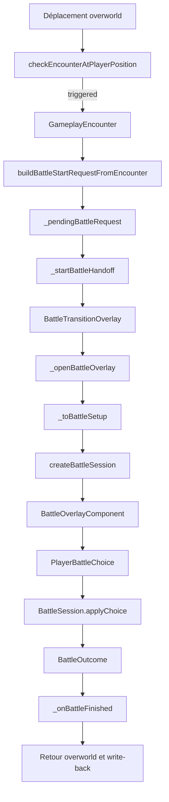
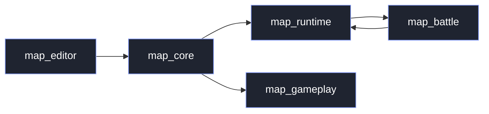
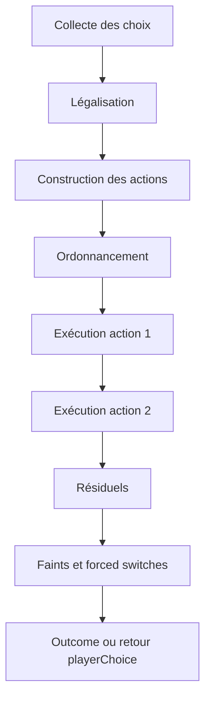

# Plan du moteur de combat et lecture complète du fonctionnement actuel

## 1. Résumé exécutif

Ton projet a déjà une base très saine pour faire un vrai moteur de combat Pokémon-like.

Le constat central est simple :

- l’**overworld**, les **rencontres**, le **handoff runtime** et la **persistance** existent déjà ;
- les **données projet** sont déjà beaucoup plus riches que le moteur de combat actuel ;
- le vrai goulot d’étranglement est `packages/map_battle`, qui reste encore un moteur **MVP 1v1 très simplifié**.

Autrement dit, tu n’as pas un problème de manque de données. Tu as surtout un problème de **perte d’information au moment où le runtime entre dans le moteur de combat**.

Aujourd’hui, ton projet sait déjà décrire des moves avec `type`, `category`, `accuracy`, `pp`, `priority`, `target`, des Pokémon avec `abilityId`, `heldItemId`, `statusId`, `ivs`, `evs`, des dresseurs avec une vraie team, et une progression avec `seenSpeciesIds` / `caughtSpeciesIds`. Pourtant, quand le combat démarre, le moteur ne conserve pour l’instant qu’un sous-ensemble très petit : essentiellement `speciesId`, `level`, `maxHp`, `currentHp`, `abilityId`, puis des moves réduits à `id`, `name`, `power`.

La recommandation stratégique est donc :

1. ne pas reconstruire une stack parallèle ;
2. garder `map_battle` comme **noyau pur, déterministe, testable** ;
3. enrichir le **contrat de handoff** entre `map_runtime` et `map_battle` ;
4. refactorer `BattleSession` vers un vrai **pipeline de tour** ;
5. seulement après, brancher dégâts complets, statuts, talents, objets, switchs, rewards et write-back.

Le point le plus important à relire si on doit refaire une analyse complète plus tard est ce cluster :

- `packages/map_battle/lib/src/battle_session.dart`
- `packages/map_battle/lib/src/battle_state.dart`
- `packages/map_battle/lib/src/battle_setup.dart`
- `packages/map_runtime/lib/src/presentation/flame/playable_map_game.dart`
- `packages/map_gameplay/lib/src/gameplay_encounter.dart`
- `packages/map_core/lib/src/models/save_data.dart`

C’est ce bloc qui raconte réellement :
- comment un combat démarre ;
- quelles données passent dans le moteur ;
- ce que le moteur résout vraiment ;
- ce qui est écrit ensuite dans l’état de jeu.

---

## 2. Carte d’ensemble de l’architecture actuelle

## 2.1 Répartition par package

### `packages/map_core`
Rôle actuel :
- modèles projet ;
- modèles save/runtime persistés ;
- structures Pokémon joueur ;
- progression, sac, flags, story flags ;
- modèles dresseurs et équipes ;
- normalisation des données chargées / sauvegardées.

C’est la couche qui porte déjà l’essentiel de la vérité métier persistée.

### `packages/map_gameplay`
Rôle actuel :
- règles pures d’overworld ;
- déplacements ;
- collisions ;
- triggers ;
- surf ;
- résolution des rencontres sauvages.

C’est la couche qui sait déjà dire :
- si un déplacement déclenche une rencontre ;
- quelle table d’apparition est active ;
- quelle espèce et quel niveau doivent être générés.

### `packages/map_runtime`
Rôle actuel :
- orchestration Flame ;
- transitions ;
- overlays ;
- handoff overworld → combat ;
- gestion des choix joueur ;
- retour à l’overworld ;
- write-back runtime de certains outcomes.

C’est ici que le moteur de combat est branché au vrai jeu.

### `packages/map_battle`
Rôle actuel :
- moteur de combat pur ;
- déterministe ;
- immutable ;
- indépendant de Flutter/Flame.

C’est la bonne intention architecturale, mais la simulation reste encore très petite.

### `packages/map_editor`
Rôle actuel :
- authoring des données projet ;
- dresseurs ;
- équipes ;
- catalogues ;
- Pokédex local ;
- moves ;
- médias ;
- validations.

C’est très important pour le combat, parce que cette couche possède déjà beaucoup de métadonnées dont `map_battle` aura besoin demain.

---

## 2.2 Vue d’ensemble du flux actuel



---

## 3. Comment les combats fonctionnent aujourd’hui dans ton projet

## 3.1 Déclenchement d’une rencontre sauvage

La détection de rencontre sauvage est déjà assez propre.

Le runtime :
1. lit le mode de déplacement du joueur ;
2. choisit `EncounterKind.walk` ou `EncounterKind.surf` ;
3. appelle `checkEncounterAtPlayerPosition(...)` ;
4. si une rencontre est déclenchée, transforme le résultat en `WildBattleStartRequest`.

Le pipeline de `checkEncounterAtPlayerPosition(...)` fait déjà pas mal de choses utiles :

- résolution de la zone de gameplay compatible ;
- lecture de la table d’apparition ;
- validation de la cohérence `encounterKind` ;
- filtrage des entrées valides ;
- tirage de probabilité ;
- choix pondéré d’une entrée ;
- tirage du niveau dans l’intervalle `[minLevel, maxLevel]`.

Donc, côté overworld, la logique de rencontre est déjà plus avancée que le combat lui-même.

## 3.2 Déclenchement d’un combat dresseur

Le runtime gère aussi déjà la logique de déclenchement trainer :

- vérification du trainer référencé ;
- garde anti-retrigger ;
- génération d’une `TrainerBattleStartRequest` ;
- stockage dans `_pendingBattleRequest` ;
- write-back de `trainer_defeated:{trainerId}` après victoire ;
- réarmement par sortie de ligne de vue côté runtime.

C’est très bon signe : la boucle produit autour du combat dresseur existe déjà.

## 3.3 Transition runtime → combat

Quand un `BattleStartRequest` est prêt :

1. `_startBattleHandoff(request)` passe le flow en `battleTransition` ;
2. le runtime nettoie les overlays précédents ;
3. il affiche `BattleTransitionOverlayComponent` ;
4. quand la transition finit, `_openBattleOverlay(request)` est appelé ;
5. le runtime mappe la request vers un `BattleSetup` ;
6. il crée une `BattleSession` ;
7. il affiche `BattleOverlayComponent`.

Cette séparation est bonne :
- transition visuelle d’un côté ;
- session métier de l’autre ;
- overlay UI piloté par session.

## 3.4 Le vrai problème actuel : le handoff vers `BattleSetup`

Le point le plus fragile, aujourd’hui, est le mapping runtime → moteur.

Dans l’extrait visible de `PlayableMapGame`, `_openBattleOverlay(...)` appelle `_toBattleSetup(request)`, puis `createBattleSession(setup)`. Mais `_toBattleSetup(...)` visible reste encore un mapping simplifié / placeholder :

- Pokémon joueur fixé à `pikachu` ;
- niveau joueur fixé ;
- moves joueur codés en dur ;
- trainer enemy fixé sur une espèce placeholder ;
- HP dérivés par une formule simplifiée ;
- pas de résolution canonique de la vraie party du joueur ;
- pas de résolution de la vraie team trainer depuis le projet ;
- pas de passage complet des données du Pokédex local.

C’est le nœud principal du chantier.

Le moteur `map_battle` a déjà commencé à accepter mieux :
- `currentHp`
- `abilityId`
- `allowCapture`

Mais le runtime visible n’exploite pas encore complètement ces possibilités.

En une phrase :

**le moteur de combat commence à s’enrichir plus vite que son mapper runtime.**

## 3.5 Création de session

`createBattleSession(setup)` reste simple et propre :

- clamp des PV courants si fournis ;
- création d’un `BattleCombatant` joueur ;
- création d’un `BattleCombatant` ennemi ;
- passage à l’état initial `BattlePhase.playerChoice`.

C’est une bonne fondation parce que :
- le moteur est immutable ;
- les tests sont faciles ;
- le runtime n’a pas besoin de manipuler des détails internes.

## 3.6 Choix disponibles

Aujourd’hui, `BattleSession.getAvailableChoices()` construit les choix de manière très simple :

- un `PlayerBattleChoiceFight(i)` par move du joueur ;
- un `PlayerBattleChoiceCapture()` seulement en sauvage si `allowCapture == true` ;
- un `PlayerBattleChoiceRun()` seulement en sauvage.

C’est déjà mieux qu’un simple moteur “fight only”, parce que le contrat métier distingue maintenant :
- victoire ;
- défaite ;
- fuite ;
- capture.

Le bon point ici est que les invariants sont défendus deux fois :
- à l’affichage des choix ;
- et dans `applyChoice(...)`.

Donc même si un call site contourne l’UI, le moteur protège encore le domaine.

## 3.7 Résolution d’un choix

Le cœur actuel de `applyChoice(...)` est le suivant :

### Cas spéciaux immédiats
- `Run` en trainer battle → erreur ;
- `Capture` en trainer battle → erreur ;
- `Capture` quand non autorisée → erreur ;
- `Run` valide → outcome immédiat `runaway` ;
- `Capture` valide → outcome immédiat `captured`.

### Cas normal
1. le choix joueur est converti en action ;
2. l’IA choisit une action ennemie ;
3. `_resolveTurn(...)` construit le résultat du tour ;
4. les dégâts sont appliqués ;
5. `_determineOutcome(...)` décide victoire ou défaite ;
6. la session retourne soit à `playerChoice`, soit à `finished`.

Le design est propre sur le plan structurel.
Le problème n’est pas la forme.
Le problème est la **profondeur du contenu simulé**.

## 3.8 Ce que `_resolveTurn(...)` fait aujourd’hui

La résolution est encore MVP :

- le joueur attaque d’abord ;
- si l’ennemi survit, l’ennemi réattaque ;
- les dégâts sont `move.power` ;
- pas de vitesse ;
- pas de priorité ;
- pas de précision ;
- pas de STAB ;
- pas de types ;
- pas de talents ;
- pas d’objets ;
- pas de statuts ;
- pas de PP ;
- pas de protection ;
- pas de multi-hit ;
- pas de field state ;
- pas de side state ;
- pas de switching.

Dit autrement : ton moteur a déjà la **squelette d’un tour**, mais pas encore la **grammaire complète du combat**.

## 3.9 État runtime pendant le combat

Le runtime gère déjà plusieurs choses utiles :

- anti-spam `_isBattleResolving` ;
- mise à jour de l’overlay après chaque choix ;
- navigation clavier dans les choix ;
- validation clavier / clic ;
- retour propre à l’overworld.

C’est important : l’UI battle n’est pas la dette principale.
Elle est déjà raisonnablement découplée.

## 3.10 Fin de combat

Dans l’extrait visible de `_onBattleFinished(outcome)` :

- si victoire contre trainer, le runtime écrit `trainer_defeated:{trainerId}` ;
- les overlays sont retirés ;
- la session est nettoyée ;
- le flow revient à l’overworld.

Ce qui est déjà sûr :
- le flux de victoire trainer est bien branché.

Ce qui doit encore être consolidé :
- write-back complet des issues `captured`, `runaway`, `defeat` ;
- persistance des PV / statuts / PP ;
- récompenses ;
- seen/caught Pokédex ;
- insertion d’un Pokémon capturé dans la party.

---

## 4. Ce que le projet fait déjà très bien

## 4.1 Le domaine est déjà découpé intelligemment

La séparation actuelle est saine :

- `map_gameplay` pour l’overworld pur ;
- `map_runtime` pour l’orchestration ;
- `map_battle` pour la simulation ;
- `map_core` pour la vérité persistée ;
- `map_editor` pour l’authoring.

C’est exactement la bonne base pour faire grossir le combat sans polluer le reste.

## 4.2 Le moteur de combat est déjà pur et testable

Même s’il est simple, `map_battle` a les bonnes propriétés :

- pure Dart ;
- immutable ;
- déterministe ;
- API petite ;
- tests simples.

Il faut absolument garder ça.

## 4.3 Le système de rencontre est déjà solide

Les rencontres sauvages sont déjà mieux structurées que beaucoup de premiers prototypes :

- zones ;
- tables ;
- pondération ;
- tirage de niveau ;
- distinction walk/surf.

Donc il ne faut pas repartir de là.
Il faut capitaliser dessus.

## 4.4 Les données save/runtime sont déjà riches

`PlayerPokemon` transporte déjà :

- `speciesId`
- `natureId`
- `abilityId`
- `level`
- `ivs`
- `evs`
- `knownMoveIds`
- `currentHp`
- `statusId`
- `isShiny`
- `heldItemId`

Ça veut dire qu’un vrai handoff battle canonique est déjà faisable sans inventer un nouveau format persistant.

## 4.5 La progression Pokédex est déjà prête à aider le combat

`PlayerProgression` sait déjà gérer :

- `seenSpeciesIds`
- `caughtSpeciesIds`

et la normalisation garantit déjà que :
- `caught` implique `seen` ;
- les espèces présentes dans la party se synchronisent dans la progression.

C’est une excellente base pour le combat :
- “seen” peut être écrit dès l’engagement réel du combat ;
- “caught” peut être écrit après capture réelle.

## 4.6 Les catalogues locaux existent déjà

Le move catalog local contient déjà :

- `type`
- `category`
- `power`
- `accuracy`
- `pp`
- `priority`
- `target`
- `shortDesc`
- `generation`

Et côté trainer/team authoring, le projet sait déjà éditer :

- `speciesId`
- `level`
- `moves`
- `heldItemId`
- `formId`
- `gender`
- `shiny`

Donc les futures mécaniques ont déjà une base auteur.

---

## 5. La vraie dette technique du moteur de combat

## 5.1 Perte d’information entre les données projet et la simulation

Le plus gros problème n’est pas l’absence de données.
C’est leur **écrasement**.

Exemple typique :

- côté données projet, un move connaît `type`, `category`, `accuracy`, `pp`, `priority`, `target` ;
- côté `BattleMove`, le moteur n’utilise encore que `id`, `name`, `power`.

Cette perte d’information bloque presque toutes les mécaniques importantes :
- ordre du tour ;
- précision ;
- dégâts spéciaux/physiques ;
- STAB ;
- types ;
- PP ;
- targeting ;
- moves de statut.

## 5.2 Moteur 1v1 à un seul combattant par côté

Aujourd’hui, `BattleSetup` porte un Pokémon joueur et un Pokémon ennemi.
Ce n’est pas encore un combat d’équipe.

Tant qu’on reste sur ce modèle, on ne peut pas proprement faire :
- switch volontaire ;
- switch forcé ;
- K.O. suivi d’un remplacement ;
- talents de lead ;
- hazards ;
- écriture honnête des PV du vrai membre actif de la party.

Il faut donc tôt ou tard passer de :
- `playerPokemon` / `enemyPokemon`

à quelque chose du type :
- `playerSide.party[]`
- `enemySide.party[]`
- `activeIndex`
- `bench`
- `side conditions`

## 5.3 Absence de couches d’état

Un vrai combat Pokémon-like a plusieurs couches d’état :

### État global du combat
- numéro de tour ;
- RNG ;
- règle de format ;
- phase courante ;
- log d’événements.

### État de terrain
- weather ;
- terrain ;
- pseudo weather globaux.

### État de côté
- hazards ;
- screens ;
- wish ;
- tailwind ;
- flags side-specific.

### État de combattant
- PV ;
- stats calculées ;
- boosts ;
- statut principal ;
- volatiles ;
- types actifs ;
- talent ;
- objet ;
- PP ;
- lock de move ;
- compteur de sleep / toxic / etc.

Aujourd’hui, l’état est encore beaucoup plus plat.

## 5.4 Pas de pipeline de hit

Un move n’est pas juste “on inflige power dégâts”.
Un vrai pipeline de hit doit savoir gérer au minimum :

1. validité de la cible ;
2. possibilité d’agir ;
3. immunités générales ;
4. immunités de type ;
5. précision ;
6. protections ;
7. dégâts ou effet de statut ;
8. effets post-hit ;
9. faint éventuel ;
10. enchaînements.

Aujourd’hui, cette colonne vertébrale n’existe pas encore.

## 5.5 Pas de pipeline de dégâts

Le calcul de dégâts doit devenir un vrai pipeline, même si tu gardes une première version simple :

1. choisir stat d’attaque ;
2. choisir stat de défense ;
3. déterminer catégorie physique/spéciale ;
4. puissance de base ;
5. multiplicateurs ;
6. type effectiveness ;
7. STAB ;
8. crit ;
9. random roll ;
10. clamp et minimum damage.

Aujourd’hui, tout est ramené à :
- `damage = move.power`.

## 5.6 Runtime finish handler encore asymétrique

Le moteur sait déjà produire `captured`.
Mais dans les extraits visibles du runtime, on voit surtout le write-back certain de la victoire trainer.

Il manque une vraie surface centralisée du type :

- `applyBattleOutcomeToGameState(outcome, request, gameState, projectData)`

pour traiter proprement :
- `victory`
- `defeat`
- `runaway`
- `captured`

---

## 6. Recommandation d’architecture cible

## 6.1 Principe directeur

Le moteur de combat ne doit **jamais** aller lire directement :
- le manifest projet ;
- les fichiers JSON ;
- la save ;
- le catalogue dresseur ;
- le Pokédex.

Le moteur doit recevoir des **snapshots résolus**.

Donc :

- `map_runtime` résout ;
- `map_battle` simule ;
- `map_runtime` applique l’issue.

C’est le meilleur compromis entre propreté, testabilité et évolution.

## 6.2 Répartition cible des responsabilités



### `map_editor`
Responsabilité cible :
- authoring ;
- validation ;
- catalogues ;
- teams trainers ;
- médias ;
- learnsets ;
- moves.

### `map_core`
Responsabilité cible :
- modèles persistés ;
- modèles projet ;
- progression ;
- save ;
- trainer data ;
- party data.

### `map_gameplay`
Responsabilité cible :
- règles overworld ;
- détection d’événements ;
- rencontres ;
- surf ;
- interactions carte.

### `map_runtime`
Responsabilité cible :
- résolution des données nécessaires au combat ;
- création de snapshots de combat ;
- orchestration des phases runtime ;
- write-back de l’issue ;
- overlays et transitions.

### `map_battle`
Responsabilité cible :
- simulation pure ;
- tour ;
- queue d’actions ;
- statuts ;
- dégâts ;
- conditions ;
- outcomes.

## 6.3 Le cluster de vérité à relire en priorité

Si je devais refaire une analyse complète plus tard, je relirais dans cet ordre :

1. `packages/map_battle/lib/src/battle_session.dart`
2. `packages/map_runtime/lib/src/presentation/flame/playable_map_game.dart`
3. `packages/map_battle/lib/src/battle_state.dart`
4. `packages/map_battle/lib/src/battle_setup.dart`
5. `packages/map_gameplay/lib/src/gameplay_encounter.dart`
6. `packages/map_core/lib/src/models/save_data.dart`
7. les catalogues locaux de moves
8. les use cases editor sur les équipes de trainer

Pourquoi :
- `battle_session.dart` dit ce que la simulation fait réellement ;
- `playable_map_game.dart` dit comment le moteur est branché au vrai jeu ;
- `battle_state.dart` dit quelles couches d’état existent ou non ;
- `battle_setup.dart` dit ce qui passe réellement la frontière ;
- `gameplay_encounter.dart` dit d’où vient la rencontre ;
- `save_data.dart` dit ce qu’on peut honnêtement écrire après combat.

---

## 7. Modèle de données cible recommandé

## 7.1 Ce qu’il faut éviter

Il ne faut pas faire un troisième format incohérent du style :

- données projet ;
- données save ;
- données combat ;
- et chaque couche invente ses champs différemment.

Il faut au contraire introduire des **snapshots de combat explicites**.

## 7.2 Proposition de contrat cible

### `BattleSetup`
Responsabilité :
- décrire entièrement le combat initial ;
- aucun accès IO ;
- aucun lien vers Flame ;
- aucun lien vers save repository.

Structure cible :

- `battleKind`
- `isTrainerBattle`
- `trainerId`
- `allowRun`
- `allowCapture`
- `playerSide`
- `enemySide`
- `rules`

### `BattleSideSetup`
Responsabilité :
- décrire une équipe côté combat.

Structure cible :

- `sideId`
- `party`
- `activeIndex`
- `sideConditions`

### `BattleParticipantSetup`
Responsabilité :
- snapshot complet d’un Pokémon entrant en combat.

Structure cible :

- `speciesId`
- `formId`
- `level`
- `types`
- `abilityId`
- `heldItemId`
- `natureId`
- `ivs`
- `evs`
- `currentHp`
- `maxHp`
- `statsSnapshot`
- `statusId`
- `moves`
- `isShiny`
- `gender`

### `BattleMoveData`
Responsabilité :
- snapshot complet d’un move exploitable par le moteur.

Structure cible :

- `id`
- `name`
- `typeId`
- `category`
- `power`
- `accuracy`
- `pp`
- `currentPp`
- `priority`
- `target`
- `effectPayload`
- `flags`

Tu n’as pas besoin d’encoder tout Showdown.
Tu as besoin d’un format qui ne perd pas les infos déjà présentes dans tes catalogues.

## 7.3 État runtime du combat cible

### `BattleState`
Responsabilité :
- état global immutable.

Champs cibles :

- `phase`
- `turnNumber`
- `rngState`
- `field`
- `playerSide`
- `enemySide`
- `queue`
- `currentResolution`
- `log`
- `outcome`

### `BattleFieldState`
Champs typiques :
- `weather`
- `terrain`
- `pseudoWeather`
- `globalCounters`

### `BattleSideState`
Champs typiques :
- `activeIndex`
- `party`
- `sideConditions`
- `pendingSwitch`
- `lastUsedMove`

### `BattleBattlerState`
Champs typiques :
- `speciesId`
- `currentHp`
- `maxHp`
- `stats`
- `boosts`
- `status`
- `volatiles`
- `types`
- `abilityId`
- `heldItemId`
- `moves`
- `isFainted`

---

## 8. Pipeline cible d’un tour



## 8.1 Étapes recommandées

### Étape 1 — Collecte des intentions
Exemples :
- fight move 0
- switch slot 2
- item
- run
- capture

### Étape 2 — Légalisation
Vérifier :
- choix autorisé ;
- move disponible ;
- PP suffisant ;
- switch possible ;
- capture autorisée ;
- fuite autorisée.

### Étape 3 — Résolution des actions
Transformer :
- intention UI
en
- action de combat résolue.

### Étape 4 — Ordonnancement
Trier selon :
- ordre système ;
- priorité du move ;
- vitesse ;
- tiebreak RNG.

### Étape 5 — Exécution
Chaque action exécutée peut :
- échouer ;
- toucher ;
- infliger dégâts ;
- poser un statut ;
- modifier le field ;
- provoquer un faint ;
- forcer un switch.

### Étape 6 — Résiduels
À la fin du tour :
- poison ;
- burn ;
- weather ;
- leech-like effects ;
- side conditions ;
- volatiles à durée limitée.

### Étape 7 — Fermeture du tour
Décider :
- prochain choix joueur ;
- forced switch ;
- victoire ;
- défaite ;
- autre issue.

---

## 9. Pipeline cible d’un move

## 9.1 Forme générale

Un move doit suivre un pipeline stable.

Ordre recommandé :

1. vérifier si l’utilisateur peut agir ;
2. consommer ou réserver le PP ;
3. résoudre la cible ;
4. vérifier immunités ;
5. lancer le check de précision ;
6. appliquer protections ;
7. exécuter l’effet principal ;
8. exécuter les effets secondaires ;
9. traiter le faint ;
10. exécuter les hooks post-move.

## 9.2 Pseudocode recommandé

```text
function executeMove(state, action):
  user = getBattler(state, action.user)
  target = resolveTarget(state, action)

  if not canAct(user, action):
    return state

  if not canPayMoveCost(user, action.move):
    return state

  state = payMoveCost(state, user, action.move)

  if target is null:
    return addLog(state, "move_failed_no_target")

  if isImmune(state, user, target, action.move):
    return addLog(state, "move_immune")

  if not passesAccuracy(state, user, target, action.move):
    return addLog(state, "move_missed")

  if isProtected(state, target, action.move):
    return addLog(state, "move_blocked")

  state = applyPrimaryMoveEffect(state, user, target, action.move)
  state = applySecondaryMoveEffects(state, user, target, action.move)
  state = resolveFaints(state)
  state = applyAfterMoveHooks(state, user, target, action.move)

  return state
```

## 9.3 Pourquoi cette forme est importante

Parce qu’elle rend possible, plus tard, sans casser le moteur :

- les talents “avant hit” ;
- les objets “sur hit” ;
- les volatiles “cannot act” ;
- les protections ;
- les multi-hit ;
- les moves de statut purs ;
- les effets différés.

---

## 10. Pipeline cible de dégâts

## 10.1 Formule progressive recommandée

Ne cherche pas à implémenter tout le canon en un seul lot.
Je recommande une montée en charge en trois niveaux.

### Niveau 1
- attaque / défense ;
- catégorie physique/spéciale ;
- power ;
- niveau ;
- STAB ;
- type effectiveness ;
- random roll.

### Niveau 2
- critique ;
- multiplicateurs talent/objet ;
- burn physique ;
- écrans ;
- weather offensif/défensif.

### Niveau 3
- cas spéciaux par move ;
- dépendance HP, poids, vitesse, statut, terrain ;
- effets de terrain et formes.

## 10.2 Pseudocode recommandé

```text
function calculateDamage(ctx):
  levelFactor = floor((2 * ctx.attackerLevel) / 5) + 2

  if ctx.moveCategory == "physical":
    attackStat = ctx.attackerAttack
    defenseStat = ctx.defenderDefense
  else:
    attackStat = ctx.attackerSpecialAttack
    defenseStat = ctx.defenderSpecialDefense

  baseDamage =
    floor(
      floor(
        floor(levelFactor * ctx.movePower * attackStat / defenseStat) / 50
      ) + 2
    )

  modifier = 1.0
  modifier = modifier * ctx.stabMultiplier
  modifier = modifier * ctx.typeMultiplier
  modifier = modifier * ctx.criticalMultiplier
  modifier = modifier * ctx.randomMultiplier
  modifier = modifier * ctx.abilityMultiplier
  modifier = modifier * ctx.itemMultiplier
  modifier = modifier * ctx.fieldMultiplier

  finalDamage = floor(baseDamage * modifier)

  if finalDamage < 1 and ctx.typeMultiplier > 0:
    finalDamage = 1

  return finalDamage
```

## 10.3 Ce qu’il faut absolument injecter

Le random roll ne doit pas être pris “au hasard global”.
Il faut un RNG déterministe injecté ou transporté dans l’état.

Pourquoi :
- tests stables ;
- replays ;
- debug ;
- tiebreaks reproductibles ;
- futur netcode éventuel.

---

## 11. Statuts, volatiles et couches d’état à modéliser

## 11.1 Statuts principaux
Priorité recommandée :

1. `sleep`
2. `poison`
3. `burn`
4. `paralysis`
5. `freeze`

Tu n’as pas besoin de tout faire d’un coup.
Tu as besoin d’un modèle qui ne t’oblige pas à tout réécrire.

## 11.2 Volatiles
Exemples typiques :
- protect-like
- flinch
- confusion
- trapped
- substitute-like
- temporary charge turns
- encore-like
- disable-like

## 11.3 Side conditions
Exemples :
- stealth-like hazards
- spikes-like hazards
- reflect/light-screen-like
- tailwind-like

## 11.4 Field conditions
Exemples :
- rain
- sun
- sand
- snow
- electric-like terrain
- grassy-like terrain

---

## 12. Plan concret recommandé pour le moteur de combat

## Lot 0 — Geler le périmètre et aligner les responsabilités

Objectif :
- décider une fois pour toutes ce qui vit dans `map_battle` et ce qui n’y vit pas.

À faire :
- documenter la frontière package ;
- interdire les accès repo/IO depuis `map_battle` ;
- confirmer que le runtime fournit des snapshots résolus.

Livrable :
- document d’architecture court ;
- tests de non-régression sur le flux actuel.

## Lot 1 — Réparer le handoff runtime → battle

Objectif :
- arrêter le mapping placeholder visible dans `_toBattleSetup(...)`.

À faire :
- lire la vraie party joueur depuis `GameState` ;
- choisir le vrai Pokémon actif ;
- transporter `currentHp`, `abilityId`, `knownMoveIds`, `heldItemId`, `statusId` ;
- résoudre le wild enemy à partir des données locales ;
- résoudre la team trainer à partir de `ProjectTrainerEntry`.

Livrable :
- `BattleSetup` construit à partir de données réelles ;
- plus aucun `pikachu` hardcodé ni formule HP factice dans le runtime.

## Lot 2 — Enrichir `BattleMoveData` et `BattleMove`

Objectif :
- ne plus perdre les champs déjà présents dans les catalogues locaux.

À faire :
- ajouter `typeId`
- `category`
- `accuracy`
- `pp`
- `currentPp`
- `priority`
- `target`

Livrable :
- moteur capable de lire ces champs ;
- tests de mapping depuis catalogues locaux.

## Lot 3 — Introduire un vrai snapshot de stats

Objectif :
- sortir du modèle `damage = power`.

À faire :
- résoudre des stats runtime pour chaque battler ;
- conserver `attack`, `defense`, `specialAttack`, `specialDefense`, `speed` ;
- poser un modèle de boosts.

Livrable :
- `BattleBattlerState.stats`
- `BattleBattlerState.boosts`

## Lot 4 — Implémenter le vrai pipeline de dégâts v1

Objectif :
- avoir un calcul de dégâts crédible.

À faire :
- catégories physique/spéciale ;
- STAB ;
- type chart ;
- random roll ;
- KO corrects.

Livrable :
- `calculateDamage(...)`
- tests snapshot sur dégâts.

## Lot 5 — Implémenter précision, PP et priorité

Objectif :
- rendre un tour vraiment Pokémon-like.

À faire :
- check précision ;
- consommation PP ;
- tri priorité puis vitesse ;
- RNG déterministe pour tie et hit.

Livrable :
- `resolveActionOrder(...)`
- `passesAccuracy(...)`
- `consumePp(...)`

## Lot 6 — Statuts principaux et résiduels

Objectif :
- rendre le combat vivant au-delà des dégâts directs.

À faire :
- poison ;
- burn ;
- paralysis ;
- sleep minimal ;
- boucle de résiduels fin de tour.

Livrable :
- `BattleStatusState`
- `applyResiduals(...)`

## Lot 7 — Field state et side state

Objectif :
- préparer hazards, météo, terrain, protections.

À faire :
- `BattleFieldState`
- `BattleSideState`
- side conditions
- weather
- terrain

Livrable :
- bases de terrain et météo ;
- au moins un exemple de condition de côté.

## Lot 8 — Parties et switch

Objectif :
- quitter le faux modèle “un Pokémon par côté”.

À faire :
- party par côté ;
- slot actif ;
- switch volontaire ;
- remplacement après K.O. ;
- forced switch.

Livrable :
- vraie boucle 1v1 d’équipe.

## Lot 9 — Outcome applier runtime

Objectif :
- centraliser le write-back des issues.

À faire :
- créer un use case du style `applyBattleOutcomeToGameState(...)` ;
- écrire PV ;
- écrire statuts ;
- marquer seen ;
- marquer caught ;
- insérer capture dans la party ;
- écrire trainer_defeated ;
- préparer rewards plus tard.

Livrable :
- runtime symétrique et honnête sur toutes les issues.

## Lot 10 — Récompenses et économie de fin de combat

Objectif :
- rendre le combat utile pour la progression.

À faire :
- money trainer ;
- XP ;
- éventuellement items/loot plus tard.

Livrable :
- pipeline post-battle dédié.

## Lot 11 — Journal de combat et UI plus riche

Objectif :
- faire dépendre l’UI d’un flux de log, pas d’implicites.

À faire :
- `BattleLogEntry`
- rendu du tour ;
- messages structurés ;
- step-by-step display si voulu.

Livrable :
- overlay branché sur log et état, pas sur des hypothèses implicites.

---

## 13. Ordre d’implémentation que je recommande vraiment

Si tu veux le meilleur ratio effort / valeur, je recommande cet ordre précis :

1. `Lot 1` — handoff réel
2. `Lot 2` — enrichissement move
3. `Lot 3` — stats snapshots
4. `Lot 4` — dégâts v1
5. `Lot 5` — précision / PP / priorité
6. `Lot 9` — outcome applier runtime
7. `Lot 6` — statuts principaux
8. `Lot 7` — field / side
9. `Lot 8` — parties / switch
10. `Lot 10` — rewards
11. `Lot 11` — log / UI

Pourquoi cet ordre est bon :
- il rend le moteur utile très tôt ;
- il évite d’écrire des mécaniques sur un handoff faux ;
- il évite d’attaquer les switchs avant d’avoir un vrai tour ;
- il sécurise rapidement le write-back runtime.

---

## 14. Ce qu’il ne faut surtout pas faire

## 14.1 Ne pas brancher `map_battle` directement sur le projet ou la save
Le moteur doit recevoir des snapshots résolus, pas lire les fichiers.

## 14.2 Ne pas enrichir l’UI avant d’enrichir le contrat de données
Sinon tu masques le vrai problème derrière des écrans plus jolis.

## 14.3 Ne pas implémenter les switchs avant le pipeline de tour
Sinon tu vas tout réécrire quand l’ordre, les faints et les résiduels arriveront.

## 14.4 Ne pas coder les exceptions move par move trop tôt
D’abord :
- contrat de move ;
- pipeline ;
- damage ;
- statuts ;
- field.

Ensuite seulement :
- cas spéciaux.

## 14.5 Ne pas laisser le write-back dispersé
Il faut un seul endroit pour appliquer les outcomes à `GameState`.

---

## 15. Pseudocode des points centraux

## 15.1 Construction du setup réel

```text
function buildBattleSetupFromRequest(gameState, request, projectData):
  playerActive = resolveActivePlayerMember(gameState.party)
  playerMoves = resolveBattleMoves(playerActive.knownMoveIds, projectData.moves)
  playerSnapshot = toBattleParticipantSetup(playerActive, playerMoves, projectData)

  if request.kind == "wild":
    enemySnapshot = resolveWildEnemyFromEncounterRequest(request, projectData)
    allowCapture = playerPartyHasSpace(gameState.party)
    isTrainerBattle = false
    trainerId = null
  else:
    trainer = resolveTrainer(projectData.trainers, request.trainerId)
    enemyActive = resolveTrainerLead(trainer, projectData)
    enemySnapshot = enemyActive
    allowCapture = false
    isTrainerBattle = true
    trainerId = request.trainerId

  return BattleSetup(
    battleKind = request.kind,
    isTrainerBattle = isTrainerBattle,
    trainerId = trainerId,
    allowCapture = allowCapture,
    playerSide = BattleSideSetup(
      activeIndex = 0,
      party = [playerSnapshot]
    ),
    enemySide = BattleSideSetup(
      activeIndex = 0,
      party = [enemySnapshot]
    )
  )
```

## 15.2 Résolution d’un tour

```text
function resolveTurn(state, playerChoice, enemyChoice):
  legalPlayerAction = legalizeChoice(state, "player", playerChoice)
  legalEnemyAction = legalizeChoice(state, "enemy", enemyChoice)

  orderedActions = orderActions(state, [
    legalPlayerAction,
    legalEnemyAction
  ])

  nextState = state

  for action in orderedActions:
    if isBattleFinished(nextState):
      break

    nextState = executeAction(nextState, action)
    nextState = resolveImmediateFaints(nextState)
    nextState = resolveForcedReplacementIfNeeded(nextState)

  nextState = applyResiduals(nextState)
  nextState = resolveImmediateFaints(nextState)
  nextState = resolveForcedReplacementIfNeeded(nextState)
  nextState = finalizeTurn(nextState)

  return nextState
```

## 15.3 Application d’issue au `GameState`

```text
function applyBattleOutcomeToGameState(gameState, request, outcome):
  nextState = gameState

  nextState = writeBackActivePartyMemberState(nextState, outcome.finalState.player)

  if request.kind == "wild":
    nextState = markSpeciesSeen(nextState, request.speciesId)

  if outcome.type == "victory" and request.kind == "trainer":
    nextState = markTrainerDefeated(nextState, request.trainerId)

  if outcome.type == "captured":
    nextState = addCapturedPokemonToParty(nextState, outcome.finalState.enemy)
    nextState = markSpeciesCaught(nextState, outcome.finalState.enemy.speciesId)

  if outcome.type == "runaway":
    nextState = nextState

  if outcome.type == "defeat":
    nextState = nextState

  return normalizeLoadedGameState(nextState)
```

---

## 16. Tests à écrire pour sécuriser le chantier

## 16.1 Tests de handoff
- build setup from wild request uses real species/level
- build setup from trainer request uses real trainer team
- active player member keeps `currentHp`
- active player member keeps `abilityId`
- move snapshots carry `type`, `category`, `accuracy`, `pp`, `priority`

## 16.2 Tests de tour
- priority sorts before speed
- speed tie uses deterministic RNG
- fainted target does not act
- no PP blocks move usage
- accuracy miss produces no damage

## 16.3 Tests de dégâts
- STAB applied
- super effective applied
- resisted applied
- immunity produces zero damage
- minimum damage clamp correct

## 16.4 Tests de statuts
- poison residual
- burn residual
- paralysis speed reduction or move gate depending design
- sleep blocks action for expected duration

## 16.5 Tests de write-back runtime
- trainer victory writes `trainer_defeated:*`
- wild battle marks species seen
- captured outcome inserts party member
- captured outcome updates caught/seen
- runaway keeps party unchanged
- defeat writes back current HP honestly

---

## 17. Le diagnostic le plus important

Le meilleur résumé technique du chantier est celui-ci :

**ton projet a déjà presque tout ce qu’il faut autour du combat, mais le moteur lui-même n’absorbe pas encore la richesse des données déjà disponibles.**

En pratique :

- `map_gameplay` sait déjà trouver et générer une rencontre ;
- `map_runtime` sait déjà passer de l’overworld au combat ;
- `map_core` sait déjà porter party, progression, statuts et persistance ;
- `map_editor` sait déjà authorer des moves, trainers et équipes ;
- `map_battle` sait déjà faire une résolution minimale pure et testable.

Donc le plan juste n’est pas :
- “tout refaire”.

Le plan juste est :
- **élargir la frontière `runtime -> battle`** ;
- **profondifier `map_battle`** ;
- **centraliser le write-back**.

---

## 18. Conclusion

Si ton objectif est de construire un vrai moteur de combat Pokémon-like à partir de cette base, je te recommande de considérer le projet actuel comme :

- **déjà bon sur le flow produit** ;
- **déjà bon sur la séparation des couches** ;
- **déjà bon sur la donnée auteur** ;
- **encore trop mince sur la simulation pure**.

Le prochain grand mouvement n’est donc pas de refaire l’overworld, ni l’éditeur, ni la save.

Le prochain grand mouvement, c’est :

1. réparer le handoff réel vers `BattleSetup` ;
2. enrichir `BattleMoveData` / `BattleCombatant` ;
3. transformer `BattleSession` en vrai pipeline de tour ;
4. brancher un outcome applier runtime unique.

C’est ce chemin qui te donnera :
- un moteur propre ;
- un moteur extensible ;
- un moteur fidèle ;
- et surtout un moteur qui reste cohérent avec tout le reste de ton repo.
