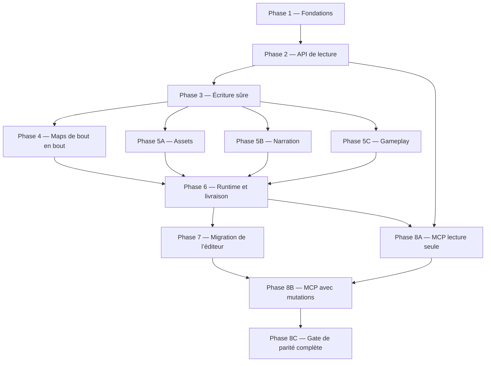

# PokeMap Authoring API + MCP — Roadmap par phases

> **Goal:** construire une API d’authoring canonique, sûre et testable, puis
> exposer cette API à l’éditeur et à un serveur MCP sans dupliquer les règles
> métier de PokeMap.
>
> **Architecture:** `map_authoring` porte les contrats et l’orchestration pure ;
> les adaptateurs Flutter/runtime exécutent les besoins de plateforme ; le MCP
> reste une façade mince qui traduit le protocole vers l’API canonique.
>
> **Tech Stack:** Dart 3, Flutter, packages PokeMap existants, JSON Schema,
> transport JSONL local, SDK MCP officiel retenu après un gate de compatibilité.

## 1. Lecture rapide

La réalisation est découpée en huit phases produit. Chaque phase se termine par
une capacité démontrable et une porte de sortie explicite.

| Phase | Lots | Capacité obtenue | Peut commencer quand |
|---|---|---|---|
| `1 — Fondations` | `PMCP-000` à `003` | Contrats et registre d’actions stables | Immédiatement |
| `2 — API de lecture` | `PMCP-010` à `013` | Un agent inspecte un projet sans Flutter | Phase 1 validée |
| `3 — Écriture sûre` | `PMCP-020` à `024` | Mutations planifiées, atomiques et annulables | Phase 2 validée |
| `4 — Maps de bout en bout` | `PMCP-030` à `035` | Création et transformation complète des maps | Phase 3 validée |
| `5 — Contenu du jeu` | `PMCP-040` à `063` | Assets, narration et gameplay manipulables | Phase 3 validée |
| `6 — Runtime et livraison` | `PMCP-070` à `072` | Playtest, readiness et package prouvés | Phases 4 et 5 validées |
| `7 — Migration de l’éditeur` | `PMCP-080` à `081` | L’éditeur consomme l’API canonique | Phase 6 validée |
| `8 — MCP de production` | `PMCP-082` à `085` | ChatGPT pilote PokeMap avec parité vérifiée | Gates détaillés ci-dessous |

Le premier incrément utile est livré à la fin de la phase 2. Le premier
incrément capable de créer réellement une map est livré à la fin de la
phase 4. La revendication « couverture complète » n’est autorisée qu’à la fin
de la phase 8.

## 2. Dépendances entre les phases

Les branches Maps, Assets et Narration peuvent progresser en parallèle après
la phase 3. Le gameplay peut lui aussi être subdivisé, mais sa preuve runtime
reste consolidée en phase 6.

## 3. Phase 1 — Fondations de l’Authoring API

**Lots :** `PMCP-000`, `PMCP-001`, `PMCP-002`, `PMCP-003`  
**Statut initial :** `PLANNED`

### Objectif

Créer la frontière canonique sur laquelle tous les consommateurs futurs
pourront s’appuyer.

### Livrables

- matrice de couverture entre ressources, actions, packages et runtime ;
- nouveau package pur Dart `map_authoring` ;
- références opaques et registre versionné des actions ;
- enveloppes de requête, résultat, erreur et receipt ;
- kit de tests de contrat partagé.

### Porte de sortie

- aucun import Flutter ou Flame dans `map_authoring` ;
- chaque action du catalogue possède un propriétaire et un statut ;
- contrats sérialisables avec round-trip testé ;
- registre généré de façon déterministe ;
- erreurs structurées et réparables.

### Valeur obtenue

La surface d’authoring est définie une seule fois. Aucun outil externe ne peut
encore modifier un projet.

## 4. Phase 2 — API de lecture et exploration

**Lots :** `PMCP-010`, `PMCP-011`, `PMCP-012`, `PMCP-013`  
**Statut initial :** `PLANNED`

### Objectif

Permettre à un agent d’explorer un workspace PokeMap sans connaître les chemins
internes ni parser directement les fichiers du projet.

### Livrables

- ouverture sûre du workspace et handles explicites ;
- snapshots cohérents du projet ;
- queries filtrables et paginées ;
- résolution de références et diagnostics ;
- vérité de capacité editor/runtime ;
- CLI JSONL strictement en lecture seule.

### Porte de sortie

- inspection d’un projet réel par API et par CLI ;
- résultats déterministes et paginés ;
- chemins hors workspace refusés ;
- références cassées remontées explicitement ;
- aucune opération d’écriture accessible.

### Valeur obtenue

ChatGPT ou un script peut comprendre un projet PokeMap avec beaucoup moins de
tâtonnements, sans prendre de risque sur les données.

## 5. Phase 3 — Noyau d’écriture sûre

**Lots :** `PMCP-020`, `PMCP-021`, `PMCP-022`, `PMCP-023`, `PMCP-024`  
**Statut initial :** `PLANNED`

### Objectif

Garantir qu’une mutation est prévisible, contrôlée, atomique et récupérable
avant d’exposer la moindre création de contenu.

### Livrables

- cycle `plan → preview → validate → apply → receipt` ;
- dry-run et diff structuré ;
- contrôle de révision optimiste ;
- clés d’idempotence durables ;
- transactions multi-fichiers et recovery ;
- permissions, confirmations et audit ;
- historique, undo et redo.

### Porte de sortie

- un retry ne duplique jamais une mutation ;
- une révision obsolète est refusée sans écrasement ;
- une panne au milieu d’une transaction est récupérable ;
- les permissions et confirmations sont testées ;
- chaque mutation appliquée retourne un receipt exploitable.

### Valeur obtenue

L’infrastructure peut recevoir des mutations métier sans exposer les projets à
des écritures partielles ou silencieuses.

## 6. Phase 4 — Maps de bout en bout

**Lots :** `PMCP-030` à `PMCP-035`  
**Statut initial :** `PLANNED`

### Objectif

Livrer la première tranche verticale réellement utile : créer, transformer,
valider et rendre une map complète.

### Livrables

- lifecycle des maps ;
- layers, régions et opérations batch ;
- terrain, chemins, surfaces et autotiles ;
- environnement et bordures ;
- objets spatiaux et collision effective ;
- warps, connexions et graphe du monde ;
- rendu de preview.

### Porte de sortie

- création d’une map depuis une intention structurée ;
- preview et diff avant application ;
- références et collisions validées ;
- connexions bidirectionnelles cohérentes ;
- rendu généré depuis l’état réellement sauvegardé ;
- undo de la création ou transformation.

### Valeur obtenue

Un agent peut construire une map PokeMap complète par API, sans reproduire les
gestes de l’interface graphique.

## 7. Phase 5 — Contenu du jeu

**Lots :** `PMCP-040` à `PMCP-063`  
**Statut initial :** `PLANNED`

Cette phase comprend trois flux pouvant avancer en parallèle une fois le noyau
d’écriture validé.

### Phase 5A — Assets et bibliothèques

**Lots :** `PMCP-040` à `PMCP-042`

- imports sûrs et adressage des assets ;
- tilesets, palettes, éléments et presets ;
- images de présentation, vidéo, audio et fontes ;
- détection des références et des suppressions dangereuses.

**Gate :** tout asset manipulé possède une identité stable, un diagnostic de
références et une preuve de consommation.

### Phase 5B — Narration

**Lots :** `PMCP-050` à `PMCP-053`

- dialogues Yarn et scripts legacy ;
- Scenes, Event V2, Facts et World Rules ;
- Storylines et migration des Scenarios ;
- cinématiques et preuve de parité narrative.

**Gate :** un parcours narratif peut être créé, validé et exécuté sans
référence cassée ni modèle ambigu.

### Phase 5C — Données et mécaniques de jeu

**Lots :** `PMCP-060` à `PMCP-063`

- espèces, Pokémon et catalogues ;
- moves, abilities, items, trainers et encounters ;
- shops, badges et new game ;
- save, party, PC, bag et services ;
- battle, progression et preuve de consommation runtime.

**Gate :** chaque donnée déclarée comme supportée est consommée par un chemin
runtime testé ; les gaps `FG-*` restent explicitement tracés.

### Valeur obtenue

L’API ne manipule plus seulement le décor : elle couvre le contenu nécessaire à
un fangame jouable.

## 8. Phase 6 — Runtime, playtest et distribution

**Lots :** `PMCP-070`, `PMCP-071`, `PMCP-072`  
**Statut initial :** `PLANNED`

### Objectif

Prouver que le contenu authoré fonctionne dans le runtime et que l’artefact
livré correspond exactement au projet validé.

### Livrables

- sessions de playtest sandboxées ;
- commandes runtime manquantes ;
- jobs longs, annulation et artefacts ;
- validation de readiness ;
- Golden Slice automatisée ;
- package de distribution avec preuve d’identité.

### Porte de sortie

- un playtest démarre depuis un snapshot identifié ;
- logs, captures et diagnostics sont reliés au receipt ;
- readiness bloque les capacités non supportées ;
- la Golden Slice passe sur le package produit ;
- les octets testés sont ceux qui sont distribués.

### Valeur obtenue

L’authoring n’est plus seulement correct sur le papier : il est prouvé dans une
boucle de jeu et dans l’artefact final.

## 9. Phase 7 — Migration de l’éditeur

**Lots :** `PMCP-080`, `PMCP-081`  
**Statut initial :** `PLANNED`

### Objectif

Faire de l’Authoring API la source canonique également pour `map_editor`, afin
d’éliminer les chemins parallèles et les divergences.

### Livrables

- migration des lectures de l’éditeur ;
- migration progressive des mutations ;
- adaptation des receipts au feedback UI ;
- historique canonique partagé ;
- garde-fou contre les writes hors API.

### Porte de sortie

- un geste UI et l’appel API équivalent produisent le même receipt ;
- aucun parsing concurrent du projet ;
- undo/redo de l’éditeur utilise l’historique canonique ;
- aucun chemin de mutation produit ne contourne l’API ;
- aucune dépendance Flutter ne remonte dans `map_authoring`.

### Valeur obtenue

L’éditeur et les agents utilisent le même moteur d’authoring. Une fonctionnalité
n’est plus implémentée deux fois.

## 10. Phase 8 — MCP de production

**Lots :** `PMCP-082`, `PMCP-083`, `PMCP-084`, `PMCP-085`  
**Statut initial :** `PLANNED`

### Objectif

Exposer l’API canonique à ChatGPT par une surface MCP compacte, conforme et
sûre.

### Phase 8A — Gate protocole

- tester les SDK officiels contre les clients réellement ciblés ;
- retenir la version de protocole et les transports ;
- figer la stratégie de compatibilité et de mise à jour.

**Gate :** choix SDK/protocole appuyé par une matrice reproductible, sans
dépendance MCP dans `map_authoring`.

### Phase 8B — MCP en lecture seule

- tools de description, workspace, query, validation et artefacts ;
- resources de projet, map, catalogue et diagnostics ;
- pagination, structured content et sandbox de chemins.

**Gate :** inspection d’un projet réel depuis le client MCP, sans aucune
capacité d’écriture.

### Phase 8C — MCP avec mutations

- plan, apply, render, playtest, jobs, historique et recovery ;
- confirmations et permissions ;
- erreurs réparables par le modèle ;
- parité API, CLI, éditeur et MCP.

**Gate final :**

- chaque cellule applicable de la matrice est `SUPPORTED` ;
- aucun `BLOCKED` ou `MISSING` n’est masqué ;
- conformance MCP et tests de sécurité verts ;
- API directe, éditeur, CLI et MCP produisent des receipts équivalents ;
- Golden Journey complète reproductible ;
- revendication « 100 % » autorisée uniquement par l’Evidence Pack.

### Valeur obtenue

ChatGPT peut manipuler PokeMap efficacement avec une surface d’outils stable,
sans accès direct aux fichiers et sans logique métier dupliquée dans le MCP.

## 11. Ordre recommandé

1. Exécuter les phases 1 à 3 strictement dans l’ordre.
2. Livrer la phase 4 avant d’élargir excessivement le catalogue métier.
3. Paralléliser les flux 5A, 5B et 5C après validation du noyau.
4. Consolider toutes les preuves en phase 6.
5. Migrer l’éditeur en phase 7.
6. Réaliser le gate MCP dès que la compatibilité doit être figée, mais ne
   publier les mutations MCP qu’après la migration de l’éditeur.
7. Fermer avec la conformance et la parité de la phase 8.

## 12. Prochain travail à planifier

Le prochain plan exécutable doit couvrir uniquement la **phase 1**, en
commençant par `PMCP-000`. Chaque lot conserve son propre plan détaillé, ses
commandes de validation et son rapport de preuves.

La définition exhaustive de chaque lot reste dans
`pokemap_authoring_api_mcp_lot_roadmap.md`.
