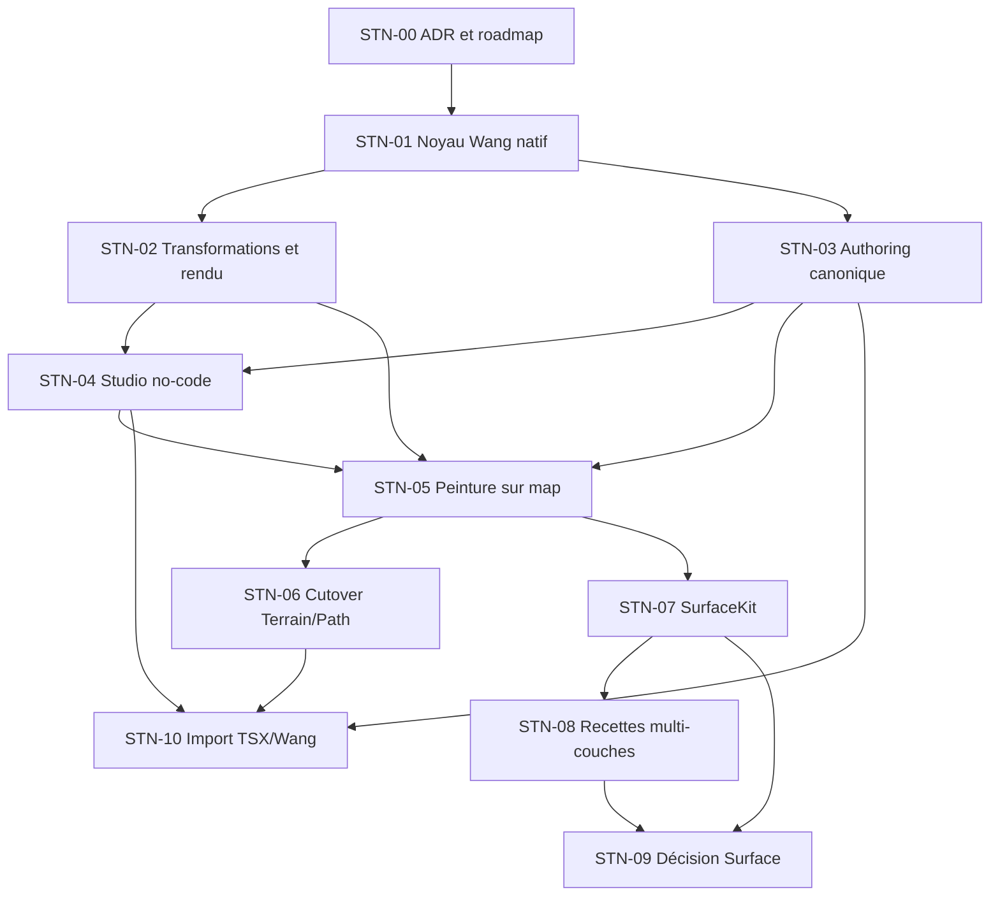

# Smart Tiles Native Roadmap Implementation Plan

> **For agentic workers:** REQUIRED SUB-SKILL: Use `subagent-driven-development` (recommended) or `executing-plans` to implement one lot at a time. Steps use checkbox (`- [ ]`) syntax for tracking.

**Goal:** Remplacer Terrain et Path historiques par un système Smart Tiles natif capable d'authorer et rendre des sols, chemins et raccords Wang avancés sans Tiled, préparer séparément la convergence Surface, puis ajouter un import TSX/Wang facultatif.

**Architecture:** `map_core` possède les données sémantiques et les opérations pures ; `map_authoring` possède toutes les mutations persistées et leurs transactions ; l'éditeur, JSONL et le MCP consomment ces contrats ; l'éditeur et le runtime consomment un plan visuel commun. Les recettes multi-couches restent séparées du résolveur Wang local.

**Tech Stack:** Dart 3, Freezed/json_serializable, Flutter desktop, Flame, API `map_authoring`, JSONL, TypeScript MCP, tests Dart/Flutter/Node.

**ADR autoritatif:** `reports/editor/stn_00_native_smart_tiles_architecture_decision_2026-08-02.md`

---

## 1. Règles d'exécution

### 1.1 Un lot à la fois

Chaque lot ci-dessous est une unité intégrable. Ne pas commencer le lot suivant tant que :

- ses critères de sortie ne sont pas prouvés ;
- les changements concurrents touchant les mêmes fichiers ne sont pas réconciliés ;
- les tests ciblés et analyses du périmètre sont exécutés ;
- la parité PokeMap MCP applicable est évaluée ;
- le statut est honnêtement `DONE`, `PARTIAL` ou `BLOCKED`.

Le présent document fixe les contrats et gates, mais seul STN-01 possède déjà un plan exécutable détaillé. Avant STN-02 puis chaque lot ultérieur, écrire et faire relire un fichier `reports/editor/plans/YYYY-MM-DD-stn-XX-<slug>.md` avec inventaire exact, tests rouge/vert, commandes indépendantes, parité applicable et vérification finale. Aucun worker ne doit exécuter directement une formulation de roadmap comme « nouveaux read models si nécessaire ».

### 1.2 Git

Les étapes de commit ne sont volontairement pas incluses comme actions exécutables : `AGENTS.md` interdit toute écriture Git sans demande explicite de l'utilisateur. Un worker peut proposer un découpage de commits, mais ne doit ni stage, ni commit, ni créer de branche sans cette autorisation.

### 1.3 Référence Tiled

Le commit de référence est :

```text
aa069419db754412a2b4d51d8ea03bb048499f0a
```

Les workers peuvent consulter les docs, les formats publics et le modèle BSD. Ils ne doivent traduire ni `wangfiller`, ni `wangbrush`, ni `automapper`. Aucun test ou fixture Tiled n'est repris : leur licence et leur provenance ne sont pas établies indépendamment fichier par fichier.

### 1.4 Assets commerciaux

Le pack local ERW sert à l'acceptance manuelle et au diagnostic, jamais comme fixture committée. Les tests automatisés utilisent des atlas synthétiques originaux.

## 2. Carte des dépendances



`STN-02` et `STN-03` peuvent être préparés en parallèle après `STN-01`, mais leurs fichiers communs et contrats de plan visuel doivent être stabilisés avant merge.

## 3. Inventaire des frontières actuelles

### 3.1 Fondations natives existantes

| Responsabilité | Fichiers actuels principaux |
|---|---|
| Modèle catalogue et règles | `packages/map_core/lib/src/models/smart_tile.dart` |
| Couche sémantique | `packages/map_core/lib/src/models/map_layer.dart` |
| Templates et masques | `packages/map_core/lib/src/operations/smart_tile_templates.dart` |
| Résolution de règle/candidat | `packages/map_core/lib/src/operations/smart_tile_resolver.dart` |
| Projection de couche en visuels | `packages/map_core/lib/src/operations/smart_tile_layer_visual_resolver.dart` |
| Opérations de grille | `packages/map_core/lib/src/operations/smart_tile_layer_operations.dart` |
| Diagnostics catalogue | `packages/map_core/lib/src/operations/smart_tile_catalog_validation.dart` |
| Actions canoniques partielles | `packages/map_authoring/lib/src/domains/maps/smart_tile_layer_actions.dart` |
| Studio | `packages/map_editor/lib/src/features/smart_tiles_studio/` |
| Rendu éditeur | `packages/map_editor/lib/src/ui/canvas/map_canvas/map_grid_painter.dart` |
| Rendu runtime | `packages/map_runtime/lib/src/presentation/flame/map_layers_component.dart` |

### 3.2 Legacy à éliminer dans STN-06

Le retrait concerne au minimum :

- les factories/classes `TerrainLayer` et `PathLayer` ;
- `ProjectTerrainPreset` et opérations Terrain ;
- `ProjectPathPreset`, `ProjectPathPatternPreset`, résolveurs, animations et actions Path ;
- les branches de composition, resize, validation, query, authoring, éditeur et runtime dédiées ;
- les champs de manifeste correspondants ;
- les fixtures produit encore écrites dans ces formats.

`SurfaceLayer` et `ProjectSurfaceCatalog` restent hors du cutover Terrain/Path. Leur éventuelle suppression est décidée dans STN-09 après preuve de `SurfaceKit`.

Ne pas supprimer :

- `TerrainType`, réutilisé par les matériaux ;
- `BorderLayer`, domaine linéaire/procédural ;
- `EnvironmentLayer`, domaine de génération ;
- `TileLayer`, nécessaire aux éléments libres et aux sorties dérivées explicites.

### 3.3 Dette concurrente connue

Au démarrage de STN-00, des modifications non commitées existent notamment dans :

- `smart_tile_layer_operations.dart` ;
- `validators.dart` ;
- `map_resize.dart` ;
- les outils World Map et tests Smart Tile de l'éditeur.

Chaque lot doit repartir d'un `git status` et d'un diff ciblé. Aucun plan ne donne l'autorisation d'écraser ces changements.

## 4. STN-00 — Décision et planification

**But :** figer la direction avant tout changement de modèle.

**Livrables :**

- `reports/editor/stn_00_native_smart_tiles_architecture_decision_2026-08-02.md` ;
- le présent fichier ;
- `reports/editor/plans/2026-08-02-stn-01-native-wang-kernel.md`.

**Critères de sortie :**

- [ ] La source de vérité sémantique est explicite.
- [ ] `ProjectVersion.v5` est réservé au nouveau schéma natif.
- [ ] Le catalogue natif porte `currentFormatVersion = 2`, rejette le format 1 non vide par un diagnostic stable et normalise seulement l'empty v1.
- [ ] Un `SmartTileField` topology-specific remplace les quatre listes concurrentes.
- [ ] `centerMatch`, le profil de couverture persisté et la politique de transformation sont explicités.
- [ ] Le terrain multi-matières est autorisé dans un seul fournisseur de sol.
- [ ] `Simple`, Edge, Corner, Blob, Mixed et Libre sont distingués.
- [ ] `SurfaceKit` et `MapPatternRuleSet` sont séparés du résolveur local.
- [ ] Terrain/Path legacy sont planifiés pour suppression et Surface possède une décision séparée.
- [ ] `BorderLayer` et `EnvironmentLayer` sont explicitement hors suppression.
- [ ] La frontière de licence Tiled est documentée au commit épinglé.
- [ ] L'import TSX est différé après stabilisation native.
- [ ] Les documents sont placés dans un chemin non ignoré par Git.
- [ ] Les contrôles whitespace, placeholders, liens locaux et statut ignore réussissent, y compris lorsque les fichiers sont encore untracked.

**Validation :**

```bash
files=(
  reports/editor/stn_00_native_smart_tiles_architecture_decision_2026-08-02.md \
  reports/editor/plans/2026-08-02-smart-tiles-native-roadmap.md \
  reports/editor/plans/2026-08-02-stn-01-native-wang-kernel.md
)

if rg -n '[[:blank:]]+$' "${files[@]}"; then
  echo 'Trailing whitespace detected' >&2
  exit 1
fi

if rg -n 'T[B]D|PLACEHOLDE[R]|à d[ée]finir|à d[ée]cider' "${files[@]}"; then
  echo 'Planning placeholder detected' >&2
  exit 1
fi

for file in "${files[@]}"; do
  test -f "$file"
  if git check-ignore -q "$file"; then
    echo "Tracked planning artifact is ignored: $file" >&2
    exit 1
  fi
done
```

Les liens relatifs sont ensuite résolus depuis le dossier du document. La mention factuelle du `TODO` présent dans la licence existante est vérifiée manuellement et n'est pas utilisée comme instruction de travail.

## 5. STN-01 — Noyau Wang natif

**But :** produire un contrat pur capable de représenter un motif simple, un voisinage cellulaire et de vrais slots Wang multi-matières sans ambiguïté dépendante de l'ordre des règles.

**Inclus :**

- `ProjectVersion.v5` pour tout nouveau catalogue/champ natif ;
- `ProjectSmartTileCatalog.currentFormatVersion = 2`, avec rejet ciblé du format 1 non vide et normalisation sûre de l'empty v1 ;
- union `SmartTileField` (`cell`, `corner`, `edge`, `mixed`) sans grille inactive ;
- `semanticCells` distinctes des contraintes Wang et sémantique gameplay explicite ;
- `PathSurfaceKind` dans le matériau v2 et politique de transformation persistée ;
- topologie/gabarit `Simple` ;
- contexte observé séparant centre, arêtes et sommets ;
- `centerMatch`, règles relatives et matériaux exacts ;
- profil de couverture persistant avec scénarios explicites bornés ;
- statut d'ambiguïté ;
- fallback explicitement signalé ;
- diagnostics de couverture ;
- sémantique `non assigné` versus `vide intentionnel` ;
- round-trip JSON et exports publics.

**Exclus :** nouvelle UX/layout Flutter (hors gardes transitoires), transformation des pixels, mutation persistée du catalogue, pinceau World Map, legacy removal.

**Fichiers principaux :**

- `packages/map_core/lib/src/models/smart_tile.dart` ;
- `packages/map_core/lib/src/models/map_layer.dart` ;
- `packages/map_core/lib/src/models/enums.dart` ;
- `packages/map_core/lib/src/models/map_data.dart` ;
- `packages/map_core/lib/src/models/project_manifest.dart` ;
- `packages/map_core/lib/src/operations/smart_tile_resolver.dart` ;
- `packages/map_core/lib/src/operations/smart_tile_layer_visual_resolver.dart` ;
- `packages/map_core/lib/src/operations/smart_tile_templates.dart` ;
- `packages/map_core/lib/src/operations/smart_tile_catalog_validation.dart` ;
- nouveaux fichiers purs dédiés au contexte et à la couverture ;
- `packages/map_core/lib/map_core.dart` ;
- fichiers Freezed/json_serializable générés du package.

**Critères de sortie :**

- [ ] Un preset Simple avec trois variantes se résout sans lire les voisins.
- [ ] Le plan pur projette ensemble map cible + manifeste v5 après preflight de toutes les maps ; aucun transport ne persiste encore une ressource isolée.
- [ ] Le format catalogue 1 non vide est rejeté avec `smart_tile_catalog_v1_unsupported` ; l'empty v1 devient l'empty v2.
- [ ] Un manifeste v5 avec catégories/presets Terrain ou Path, ou une map v5 avec leurs layers, est rejeté sans mutation partielle.
- [ ] La topologie et le variant `SmartTileField` incompatible sont rejetés structurellement.
- [ ] `semanticCells` porte occupation/gameplay ; les lattices portent seulement les contraintes visuelles Wang.
- [ ] Un Corner Wang lit réellement les sommets partagés et non les diagonales de cellules.
- [ ] Un Edge Wang lit réellement les arêtes partagées.
- [ ] Une règle `material(id)` distingue deux matériaux d'un même groupe.
- [ ] Deux règles Simple peuvent distinguer leur matériau central via `centerMatch`.
- [ ] Deux règles maximales à égalité donnent `ambiguousRule`, quel que soit leur ordre.
- [ ] Un fallback explicite est marqué dans le résultat et dans la couverture.
- [ ] `0` non assigné et matériau `isEmpty` produisent des diagnostics différents.
- [ ] Les anciens tests natifs applicables restent verts ou sont remplacés avec justification.
- [ ] Aucun code Flutter/Flame/Tiled n'entre dans `map_core`.

**Plan détaillé :** `reports/editor/plans/2026-08-02-stn-01-native-wang-kernel.md`.

## 6. STN-02 — Transformations D4 et rendu partagé

**But :** appliquer de façon pixel-perfect les huit symétries opt-in et corriger le culling à partir des bounds visuels réels.

**Préflight obligatoire :** consulter la documentation Flame configurée ; si elle est indisponible, consigner l'indisponibilité, relever la version installée dans les pubspec/lockfiles et partir d'un motif de rendu déjà fonctionnel dans le dépôt.

**Modèle :**

```dart
@freezed
class SmartTileSpriteTransform with _$SmartTileSpriteTransform {
  @Assert('quarterTurns >= 0 && quarterTurns <= 3')
  const factory SmartTileSpriteTransform({
    @Default(0) int quarterTurns,
    @Default(false) bool flipX,
  }) = _SmartTileSpriteTransform;
}
```

La transformation est portée par `SmartTileVisualPart` afin de s'appliquer pareillement à une frame statique et à une animation.

Ordre canonique : appliquer `flipX` dans les coordonnées source, puis `quarterTurns` rotations horaires. La table persistée est :

| Élément D4 | `quarterTurns` | `flipX` |
|---|---:|---:|
| identité | 0 | false |
| R90 | 1 | false |
| R180 | 2 | false |
| R270 | 3 | false |
| HFlip | 0 | true |
| diagonale H→R90 | 1 | true |
| VFlip | 2 | true |
| diagonale H→R270 | 3 | true |

`SmartTileTransformPolicy` définit des générateurs HFlip, VFlip et R90. `allows(transform)` teste l'appartenance à la fermeture finie engendrée, pas les champs encodés naïvement : VFlip seul autorise `(2, true)`, H+V autorise aussi R180, et rotation+une réflexion autorise tout D4.

**Fichiers principaux :**

- `packages/map_core/lib/src/models/smart_tile.dart` ;
- nouveau `packages/map_core/lib/src/operations/smart_tile_sprite_geometry.dart` ;
- `packages/map_core/lib/src/operations/smart_tile_coverage.dart` ;
- `packages/map_core/lib/src/operations/smart_tile_layer_visual_resolver.dart` ;
- `packages/map_editor/lib/src/ui/canvas/map_canvas/map_grid_painter.dart` ;
- `packages/map_runtime/lib/src/presentation/flame/map_layers_component.dart` ;
- tests core/editor/runtime dédiés.

**Critères de sortie :**

- [ ] Les huit couples `(quarterTurns, flipX)` ont des vecteurs de géométrie testés.
- [ ] Source rect, destination, ancre et empreinte restent cohérents après rotation.
- [ ] Les filtres de rendu restent `none`.
- [ ] Une partie ancrée hors viewport mais visible n'est pas cullée.
- [ ] Éditeur et runtime consomment le même transform dans le plan neutre.
- [ ] Une transformation non autorisée bloque la publication.
- [ ] La composition D4 transforme conjointement signature et partie visuelle dans un ordre canonique testé.
- [ ] Une table canonique des huit éléments définit identité, rotations, HFlip, VFlip et compositions ; `transformPolicy.allows(transform)` distingue les permissions TSX H/V/rotate malgré la représentation `quarterTurns + flipX`.
- [ ] La couverture expose `transformed` et `transformedCount` séparément d'`exact` et de `fallback`.
- [ ] `preferUntransformed` départage uniquement des candidats autrement équivalents ; il ne masque ni missing ni ambiguity.

**Validation ciblée :**

```bash
(cd packages/map_core && dart test \
  test/smart_tiles/smart_tile_sprite_geometry_test.dart \
  test/smart_tiles/smart_tile_layer_visual_resolver_test.dart && dart analyze)

(cd packages/map_editor && flutter test \
  test/smart_tiles_studio/smart_tile_transform_preview_test.dart && flutter analyze)

(cd packages/map_runtime && flutter test \
  test/smart_tile_runtime_render_test.dart \
  test/smart_tile_runtime_culling_test.dart && flutter analyze)
```

## 7. STN-03 — Authoring canonique et transports

**But :** rendre catalogues, sets et couches manipulables sans contrôleur éditeur privé.

### 7.1 Ressources découvrables

- `smartTilePreset` ;
- `smartTileMaterial` ;
- `smartTileAtlas` ;
- `smartTileAnimation` ;
- `smartTileLayer` ;
- diagnostics de couverture attachés au détail du preset.

### 7.2 Actions minimales

| Action | Effet atomique |
|---|---|
| `smart_tile.atlas.upsert` | crée ou remplace la géométrie d'un atlas validé |
| `smart_tile.material.upsert` | crée ou remplace un matériau non référentiellement ambigu |
| `smart_tile.animation.upsert` | crée ou remplace une animation et valide ses frames |
| `smart_tile.animation.delete` | refuse une animation encore référencée |
| `smart_tile.preset.publish` | publie le sous-graphe set/règles/candidats avec validation projetée |
| `smart_tile.preset.delete` | refuse les références actives |
| `smart_tile.layer.create` | crée une couche dérivée d'un set publié |
| `smart_tile.layer.delete` | supprime une couche par révision attendue |
| `smart_tile.layer.normalize` | migre l'action de maintenance existante vers le field actif |
| `smart_tile.layer.merge` | conserve l'action existante avec compatibilité de fields explicite |

Les actions `paint`, `fill` et `erase` entrent dans STN-05, après existence du compilateur topology-aware. `normalize` et `merge` existent déjà : STN-01 les migre au field actif et STN-03 prouve leur contrat de maintenance. STN-03 ne publie aucun contrat de peinture provisoire.

**Fichiers principaux :**

- nouveau `packages/map_authoring/lib/src/domains/maps/smart_tile_catalog_actions.dart` ;
- `packages/map_authoring/lib/src/domains/maps/smart_tile_layer_actions.dart` ;
- nouveau `packages/map_authoring/lib/src/domains/maps/smart_tile_native_transition_guard.dart` ;
- `packages/map_authoring/lib/src/domains/maps/map_operations_batch.dart` ;
- `packages/map_authoring/lib/src/domains/maps/map_mutation_dispatcher.dart` ;
- `packages/map_authoring/lib/src/transactions/change_set.dart` ;
- registre de ressources et query service existants ;
- `packages/map_authoring/lib/src/parity/full_authoring_parity.dart` ;
- `packages/map_authoring/lib/map_authoring.dart` ;
- tests direct API, JSONL, editor adapter et MCP.

**Critères de sortie :**

- [ ] Publication et création optionnelle de couche ne laissent jamais une référence orpheline.
- [ ] `atlas.upsert` vérifie grille/marges/spacing contre les dimensions réelles décodées de l'image et produit `out_of_image` via tous les transports.
- [ ] La création produit un unique `AuthoringChangeSet` contenant les changements map + manifeste ; une failure ou stale revision n'en persiste aucun.
- [ ] `smart_tile.layer.create` refuse atomiquement une seconde couche `usage: terrain` et tout projet contenant encore du legacy Terrain/Path.
- [ ] Atlas/material/animation upsert, preset publish et layer create partagent un preflight de toutes les maps du projet ; aucune mutation ne rend le catalogue v2 non vide tant qu'une map ou le manifeste contient du legacy.
- [ ] Stale revision, double application et operation ID rejoué sont testés.
- [ ] Direct API et JSONL donnent la même projection et le même receipt stable.
- [ ] L'adaptateur éditeur n'appelle aucune écriture directe du manifeste/map.
- [ ] Le catalogue MCP live décrit ressources, schémas et actions.
- [ ] Les ressources/actions Animation sont couvertes par direct API, JSONL, adaptateur éditeur et MCP live.
- [ ] Le serveur TypeScript ne contient aucune règle métier Smart Tile dupliquée.

**Validation ciblée :**

```bash
(cd packages/map_authoring && dart test \
  test/domains/maps/smart_tile_catalog_actions_test.dart \
  test/domains/maps/smart_tile_layer_editing_actions_test.dart \
  test/domains/maps/smart_tile_resource_query_test.dart \
  test/tooling/jsonl_smart_tile_native_flow_test.dart \
  test/parity/full_authoring_parity_test.dart && \
  dart run tool/pmcp085_conformance.dart && dart analyze)

(cd packages/map_editor && flutter test \
  test/authoring_api/editor_mutation_parity_test.dart \
  test/authoring_api/editor_write_boundary_test.dart \
  test/authoring_api/no_bypass_guardrail_test.dart && flutter analyze)

(cd tools/pokemap_mcp && npm run check && npm test && npm run build)
```

La preuve live suit : describe, open d'une fixture sous une racine étroite, query, plan, apply, validate, close, reopen et seconde query.

## 8. STN-04 — Smart Tiles Studio no-code

**But :** permettre de créer tous les sets ciblés sans connaissance préalable de Wang.

**Parcours :**

```text
Usage → Image → Grille → Matériaux → Raccords → Variantes → Patterns → Essai → Publier
```

**Fichiers principaux :**

- `packages/map_editor/lib/src/features/smart_tiles_studio/application/` ;
- `packages/map_editor/lib/src/features/smart_tiles_studio/presentation/` ;
- nouveaux read models/DS widgets si un primitive manque ;
- tests `packages/map_editor/test/smart_tiles_studio/`.

**Critères de sortie :**

- [ ] Terrain, Path et Forest ne sont plus désactivés artificiellement.
- [ ] `Simple` est proposé sans guide de 16 cases.
- [ ] Un Stamp v1 applique visiblement et atomiquement une matrice de matériaux ; il n'affirme jamais figer les variantes visuelles résolues.
- [ ] Edge, Corner, Blob, Mixed et Libre sont sélectionnables.
- [ ] L'utilisateur marque visuellement coins/arêtes sans saisir de masque.
- [ ] Les guides ERW/layout sont facultatifs et éditables.
- [ ] La vue Patterns distingue exact/transformed/fallback/missing/ambiguous.
- [ ] Le banc d'essai couvre formes et modifications difficiles.
- [ ] La publication passe uniquement par l'action canonique.
- [ ] Aucun code couleur produit n'est hardcodé hors design system.

**Validation ciblée :**

```bash
(cd packages/map_editor && flutter test test/smart_tiles_studio && flutter test \
  test/authoring_api/editor_mutation_parity_test.dart \
  test/authoring_api/editor_write_boundary_test.dart \
  test/authoring_api/no_bypass_guardrail_test.dart && flutter analyze)
```

## 9. STN-05 — Peinture sémantique sur World Map

**But :** rendre Sol et Chemin réellement utilisables dans la map.

**Compilateur pur :**

```dart
SmartTilePaintResult compileSmartTilePaint({
  required GridSize mapSize,
  required SmartTileLayer layer,
  required ProjectSmartTilePreset preset,
  required SmartTilePaintIntent intent,
});
```

`SmartTilePaintResult` contient la couche projetée, les cellules/lattices modifiées, le halo de résolution et les diagnostics. Il ne contient aucune image Flutter.

**Gestes obligatoires :** point, ligne, rectangle, Stamp de matériaux sémantiques, fill, erase, pipette, matière entière et édition avancée d'un coin ou d'une arête.

Ce lot enregistre alors les actions canoniques `smart_tile.layer.paint`, `fill` et `erase`, puis rejoue la parité de `normalize` et `merge`. Chacune compile d'abord un plan neutre, puis l'applique par révision attendue ; aucun transport ne mute directement `semanticCells` ou une lattice.

**Critères de sortie :**

- [ ] Un sol Simple peut couvrir la map.
- [ ] Un sol multi-matières peut remplacer localement herbe par terre et revenir en arrière.
- [ ] Un chemin Simple ne requiert aucune variante de coin.
- [ ] Un chemin Corner16 recalcule tous les sommets/cellules affectés après ajout et effacement.
- [ ] Fill est déterministe et indépendant de l'ordre de parcours.
- [ ] Le halo présenté correspond exactement aux entrées recalculées.
- [ ] Undo/redo et sauvegarde/rechargement conservent le variant actif et ses seules lattices.
- [ ] L'outil refuse clairement une transition absente au lieu de peindre un faux raccord.
- [ ] Les actions API/JSONL/MCP produisent le même résultat que l'éditeur.

**Validation ciblée :**

```bash
(cd packages/map_core && dart test \
  test/smart_tiles/smart_tile_paint_compiler_test.dart \
  test/smart_tiles/smart_tile_layer_roundtrip_test.dart && dart analyze)

(cd packages/map_authoring && dart test \
  test/domains/maps/smart_tile_layer_editing_actions_test.dart \
  test/tooling/jsonl_smart_tile_native_flow_test.dart \
  test/parity/full_authoring_parity_test.dart && dart analyze)

(cd packages/map_editor && flutter test \
  test/smart_tiles_studio/smart_tile_map_editing_test.dart \
  test/features/editor/application/world_map_paint_layer_routing_test.dart \
  test/features/editor/application/world_map_tool_activation_test.dart \
  test/authoring_api/editor_mutation_parity_test.dart \
  test/authoring_api/editor_write_boundary_test.dart \
  test/authoring_api/no_bypass_guardrail_test.dart && \
  flutter analyze)

(cd packages/map_authoring && dart run tool/pmcp085_conformance.dart)

(cd tools/pokemap_mcp && npm run check && npm test && npm run build)
```

La preuve MCP live est rejouée après rechargement du serveur : describe, open, query, plan, apply, validate, close, reopen et query finale.

## 10. STN-06 — Portage gameplay et cutover Terrain/Path

**But :** terminer la convergence autorisée ; aucun nouveau projet ni flux produit ne dépend de Terrain ou Path historiques.

### 10.1 Inventaire comportemental préalable

Avant suppression, chaque capacité reçoit une décision explicite `ported`, `replaced` ou `dropped` :

- `TerrainType` et requêtes de terrain gameplay ;
- `PathSurfaceKind`, notamment l'eau ;
- activation d'animation et triggers Path ;
- presets et Path Patterns ;
- ordre, visibilité, opacité et propriétés ;
- rendu, resize, query, cinematic backdrop et authoring preview.

Le portage attendu est générique : les matériaux Smart Tile portent les profils de terrain/surface et les politiques d'animation ne dépendent plus de `PathLayer`.

### 10.2 Conversion des contenus suivis

- [ ] Convertir les fixtures et projets d'exemple réellement utilisés par les tests.
- [ ] Produire des fixtures legacy dédiées uniquement au test de rejet structuré.
- [ ] Vérifier qu'aucun asset commercial ni chemin machine n'est introduit.

### 10.3 Suppression

- [ ] Supprimer `TerrainLayer`, `PathLayer` et leurs factories de `MapLayer`.
- [ ] Supprimer les catégories et champs de manifeste Terrain/Path et Path Pattern.
- [ ] Supprimer `SmartTileTemplateHint.legacy20`, `legacy_smart_tile_migration.dart`, le CLI éditeur associé et toutes les branches legacy d'`autotile.apply`/actions live.
- [ ] Régénérer uniquement `map_core`.
- [ ] Supprimer les opérations, actions, UI, runtime et gameplay devenus inaccessibles.
- [ ] Remplacer les tests historiques pertinents par des tests Smart Tile.
- [ ] Faire échouer le décodage Terrain/Path et revalider le rejet Smart Tile v4 introduit en STN-01, avec diagnostics structurés sans perte silencieuse.
- [ ] Conserver Surface, Border et Environment sans les réinterpréter.

### 10.4 Gardes statiques

```bash
rg -n 'TerrainLayer|PathLayer|MapLayer\.(terrain|path)|MapLayerKind\.(terrain|path)|PresetLibraryKind\.(terrain|path)' \
  packages examples selbrume -g '*.dart'

rg -n 'ProjectTerrainPreset|ProjectPathPreset|ProjectPathPatternPreset|terrainCategories|pathCategories|legacy20|legacy_smart_tile_migration' \
  packages examples selbrume -g '*.dart'

rg -n '"runtimeType"\s*:\s*"(terrain|path)"|"(terrains|terrainCategories|pathCategories|terrainPresets|pathPresets|pathPatternPresets)"\s*:' \
  packages examples selbrume -g '*.json' \
  | rg -v 'packages/map_core/test/fixtures/rejected_legacy/'

rg -n 'TerrainLayer|PathLayer|ProjectTerrainPreset|ProjectPathPreset|ProjectPathPatternPreset|materialCells|legacy20|terrainPresets|pathPresets|pathPatternPresets' \
  tools/pokemap_mcp/src -g '*.ts'

rg -n 'TerrainLayer|PathLayer|ProjectTerrainPreset|ProjectPathPreset|ProjectPathPatternPreset|materialCells|legacy20|terrainPresets|pathPresets|pathPatternPresets' \
  tools/pokemap_mcp/test -g '*.ts' \
  | rg -v '^tools/pokemap_mcp/test/legacy_rejection\.test\.ts:'
```

Résultat attendu : aucune branche produit. Seuls les fichiers nommés sous `packages/map_core/test/fixtures/rejected_legacy/` et le test TypeScript dédié `tools/pokemap_mcp/test/legacy_rejection.test.ts` peuvent encore contenir les tags JSON ; ces allowlists sont relues fichier par fichier dans le rapport du lot.

Les termes UX `WorldMapPaintSubtool.terrain/path`, ainsi que les sémantiques génériques `TerrainType` et `PathSurfaceKind`, peuvent rester seulement s'ils ne référencent plus de layer/preset legacy ; chaque occurrence restante est justifiée dans le rapport.

### 10.5 Gate de suppression

Le lot n'est `DONE` qu'après :

- suites complètes `map_core`, `map_authoring`, `map_gameplay`, `map_editor`, `map_runtime` ;
- playable host ;
- checks/build/tests MCP ;
- conformance PMCP-085 et catalogue MCP live rechargé sans ressource/action legacy ;
- golden flows Terrain et Path natifs, avec portage obligatoire de l'eau, de `PathSurfaceKind` et des politiques/triggers d'animation ;
- ouverture d'un fichier legacy retournant l'erreur attendue ;
- état Git audité et absence de suppression concurrente accidentelle.

## 11. STN-07 — `SurfaceKit`

**But :** assembler plusieurs sets et rôles d'un pack complexe sans les fusionner dans un preset monolithique.

**Contrat minimal :**

```text
ProjectSmartTileSurfaceKit
├── id, name, categoryId
├── materialIds[]
├── setBindings[]
│   ├── presetId
│   ├── role
│   ├── channel
│   └── priority
├── staticLayerStack[]
└── gameplayDefaults
```

`staticLayerStack` est une pile typée et déclarative de bindings, sans condition, boucle, probabilité ni sortie dérivée. Elle ne dépend pas du moteur de recettes STN-08.

**Critères de sortie :**

- [ ] Un kit peut regrouper au moins un sol, une transition, un chemin et un overlay.
- [ ] Les références invalides ou cycles sont diagnostiqués.
- [ ] La palette World Map présente le kit comme une famille cohérente.
- [ ] Le golden synthétique prouve la pile ground/understory/canopy/foreground.
- [ ] Une acceptance locale ERW prouve le potentiel sans committer l'asset.
- [ ] Sauvegarde et runtime ne dépendent d'aucun chemin absolu local.
- [ ] Ressource/action kit disponibles dans la parité canonique.

## 12. STN-08 — `MapPatternRuleSet` natif v1

**But :** produire des sorties dérivées multi-couches pour falaises, murs, trous et décorations, sans surcharger le résolveur Wang.

**V1 inclut :**

- entrées cellule/matériau positives, négatives, empty, non-empty, ignore et alternatives ;
- lecture de plusieurs couches sémantiques ;
- sorties tuiles et Smart Tile dérivées multi-couches ;
- ordre stable, overlap explicite, probabilité déterministe ;
- rayon borné, idempotence et détection de cycles ;
- preview/diff/receipt et undo/redo.

**V1 exclut :** import des règles Tiled, interprétation TMX, scripting arbitraire et boucle non bornée.

**Critères de sortie :**

- [ ] Réappliquer la même recette ne change pas le résultat.
- [ ] Deux règles conflictuelles produisent un diagnostic stable.
- [ ] Une modification locale ne réévalue pas toute la map sans raison déclarée.
- [ ] Les sorties manuelles ne sont jamais effacées par une sortie dérivée sans ownership explicite.
- [ ] Les dépendances cycliques sont refusées avant application.
- [ ] Direct API, éditeur, JSONL et MCP partagent le plan canonique.

## 13. STN-09 — Décision de convergence Surface

**But :** décider, avec preuves, si `SurfaceLayer`/`ProjectSurfaceCatalog` sont remplacés par `SmartTileUsage.forestSurface` + `SurfaceKit`, ou restent un domaine distinct.

**Audit obligatoire :** rôles Surface, animations, painter, gameplay zones, runtime resolver, tileset collector, cinematic backdrop et authoring actions.

**Sorties possibles :**

- `converge` : plan séparé de conversion/suppression avec golden flows équivalents ;
- `retain` : frontière documentée expliquant pourquoi Surface n'est pas un Smart Tile ;
- `partial` : sous-ensemble convergé et responsabilités restantes renommées sans double sens.

Ce lot ne supprime rien tant que l'option n'est pas acceptée explicitement.

## 14. STN-10 — Import TSX/Wang facultatif

**But :** convertir un tileset Tiled moderne vers les contrats PokeMap sans Tiled à l'exécution.

**Entrée V1 :** TSX XML externe avec image, grille, transformations, Wang Sets, Wang Colors et Wang Tiles.

**Sortie V1 :** atlas, matériaux, sets natifs, diagnostics, preview et receipt.

**Actions/ressources :**

- `smart_tile.import.tsx.inspect` ;
- `smart_tile.import.tsx.apply` ;
- ressource d'aperçu d'import bornée et paginée.

**Sécurité :**

- chemin absolu sous une racine étroite autorisée ;
- aucun accès réseau implicite ;
- résolution des images sans traversal/symlink escape ;
- copie/staging d'asset via le pipeline canonique ;
- limite de taille, nombre de tuiles et cardinalité de motifs ;
- rejet des entités XML externes ;
- aucune exécution de script ou propriété arbitraire.

**Critères de sortie :**

- [ ] Wang Corner, Edge et Mixed modernes sont importés.
- [ ] L'ordre des huit slots est testé par vecteurs synthétiques asymétriques.
- [ ] Les permissions de transformation et les ratios `tile.probability` représentables sont conservés par réduction décimale exacte ; toute réduction ou non-prise-en-charge de `wangcolor.probability` est explicitée dans le preview/receipt et interdit toute revendication de parité probabiliste.
- [ ] Un slot `wangid=0` devient une absence exacte et jamais un wildcard.
- [ ] `tile.probability` devient le poids candidat ; une valeur `wangcolor.probability` non par défaut exige l'acceptation explicite de `wangcolor_probability_unsupported` et reste documentée dans le reçu.
- [ ] Les lexèmes décimaux sont alignés puis réduits par PGCD vers `[0, 2 147 483 647]` ; un ratio hors borne bloque l'import avec `tile_probability_ratio_overflow`, sans arrondi silencieux.
- [ ] Un ancien format hex pré-1.5 est refusé clairement.
- [ ] TMX et AutoMapping sont refusés comme hors scope.
- [ ] L'import ne conserve aucun lien requis vers le TSX source.
- [ ] Le projet importé fonctionne après déplacement/suppression du fichier TSX original.
- [ ] La même entrée et le même operation ID sont idempotents.

## 15. Matrice de preuve transversale

| Capacité | Core | Authoring direct | JSONL | Éditeur | Runtime | MCP live |
|---|---:|---:|---:|---:|---:|---:|
| Résoudre Simple/Wang | obligatoire | query/preview | query | banc d'essai | obligatoire | query |
| Publier un set | validation | obligatoire | obligatoire | obligatoire | N/A | obligatoire |
| Créer une couche | opération | obligatoire | obligatoire | obligatoire | lecture | obligatoire |
| Peindre/fill/erase | compilateur | obligatoire | obligatoire | obligatoire | rendu | obligatoire |
| SurfaceKit | validation/résolution | obligatoire | obligatoire | obligatoire | obligatoire | obligatoire |
| Recette dérivée | moteur pur | obligatoire | obligatoire | obligatoire | résultat | obligatoire |
| Rejet legacy | codec | open/validate | open | message | load | open |
| Import TSX | parser pur | plan/apply | obligatoire | assistant | N/A | obligatoire |

`N/A` doit être justifié dans le rapport du lot ; il ne doit jamais masquer une action persistante manquante.

## 16. Gate final de programme

```bash
(cd packages/map_core && dart test && dart analyze)
(cd packages/map_authoring && dart test && dart analyze)
(cd packages/map_gameplay && dart test && dart analyze)
(cd packages/map_runtime && flutter test && flutter analyze)
(cd packages/map_editor && flutter test && flutter analyze)
(cd examples/playable_runtime_host && flutter test && flutter analyze)
(cd packages/map_authoring && dart run tool/pmcp085_conformance.dart)
(cd tools/pokemap_mcp && npm run check && npm test && npm run build)
git diff --check
git status --short --untracked-files=all
```

Après rechargement du serveur, exécuter la séquence MCP live describe/open/query/plan/apply/validate/close/reopen/query sur une fixture native, puis prouver le rejet d'une fixture legacy allowlistée. Le programme est terminé seulement lorsque les parcours natifs fonctionnent et que les types legacy ont effectivement disparu. Une UI visible, un JSON sérialisable ou une action MCP isolée ne suffisent pas.

## 17. Stratégie de revue

Chaque lot réalise cinq passes nommées :

1. **Audit / Architecture** — contrats et risques avant modification ;
2. **Implémentation** — conformité au scope et aux frontières packages ;
3. **Tests** — cas positif, négatif, garde et non-régression ;
4. **Build / Validation** — commandes fraîches et résultats exacts ;
5. **Critique finale** — code inutile, bypass, mensonges de validation, effets de bord et changements concurrents.

Les revues n'élargissent pas le lot. Tout problème adjacent devient un risque ou un lot suivant explicitement proposé.
