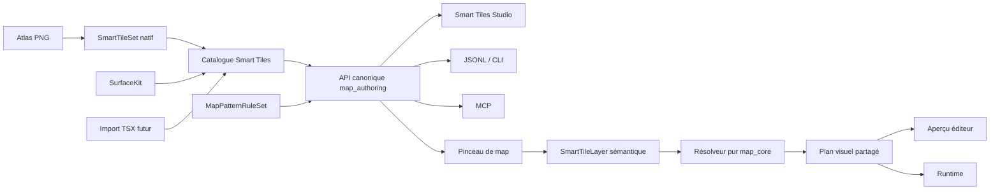

# STN-00 — Architecture native Smart Tiles / Wang

Date : 2 août 2026

Statut : **accepté**

Décision : PokeMap devient l'unique système d'authoring et d'exécution des sols, chemins et surfaces raccordées. Tiled reste une référence documentaire et, plus tard, une source d'import facultative.

Périmètre : `map_core`, `map_authoring`, `map_editor`, `map_runtime`, `tools/pokemap_mcp`

Référence Tiled inspectée : `mapeditor/tiled@aa069419db754412a2b4d51d8ea03bb048499f0a`

## 1. Résumé de la décision

PokeMap implémente une **parité fonctionnelle ciblée** avec les terrains/Wang Sets de Tiled sans intégrer Tiled et sans traduire son code d'éditeur.

La source de vérité d'une map reste sémantique : elle stocke les matériaux et réseaux peints. Le résolveur Dart produit ensuite un plan visuel déterministe. Il ne remplace jamais les données sémantiques par des identifiants de tuiles résolus.

Le système cible comprend quatre briques séparées :

1. un `SmartTileSet` natif, porté initialement par l'évolution de `ProjectSmartTilePreset` ;
2. un `SmartTileLayer` canonique pour les sols, chemins et surfaces forestières ;
3. un `SurfaceKit` regroupant plusieurs sets compatibles pour un pack graphique complexe ;
4. un futur `MapPatternRuleSet` pour les recettes multi-couches de type AutoMapping.

Les modèles historiques suivants sont supprimés une fois les parcours natifs prouvés :

- `TerrainLayer` et `ProjectTerrainPreset` ;
- `PathLayer`, `ProjectPathPreset` et `ProjectPathPatternPreset` ;

Cette suppression peut casser les projets externes historiques. C'est une décision produit explicite. Les fixtures et projets d'exemple conservés dans le dépôt doivent toutefois être convertis avant la suppression afin que le dépôt reste cohérent et vérifiable.

`SurfaceLayer` et le catalogue Surface historique ne sont pas inclus implicitement dans ce cutover. Leur convergence vers `SmartTileUsage.forestSurface` exige une décision et un lot séparés après `SurfaceKit`. `BorderLayer` et `EnvironmentLayer` ne sont pas supprimés : ils représentent respectivement des bordures linéaires/procédurales et de la génération environnementale, deux responsabilités distinctes d'un raccord de sol Smart Tile.

## 2. Contexte et problème résolu

L'[audit Smart Tiles Studio du 2 août 2026](smart_tiles_studio_data_model_audit_2026-08-02.md) a établi que le dépôt fait vivre simultanément :

- des couches et presets Terrain historiques ;
- des couches, presets et patterns Path historiques ;
- un catalogue Surface historique ;
- le catalogue et les couches Smart Tile natives ;
- plusieurs chemins d'édition qui ne passent pas par la même API canonique.

Le modèle Smart Tile contient déjà des topologies, signatures, variantes, animations et parties visuelles avancées, mais le Studio n'expose qu'un guide ERW Corner16 orienté Path. L'utilisateur peut donc voir des presets natifs sans disposer du parcours complet permettant de créer et peindre un terrain.

Le besoin accepté est plus large qu'une correction d'interface :

- créer des sols simples ou multi-matières ;
- créer des chemins utilisant différents layouts ;
- exploiter un atlas riche sans Tiled ;
- obtenir des raccords comparables aux Wang Sets ;
- conserver une sémantique exploitable par le gameplay ;
- supprimer définitivement les représentations concurrentes ;
- ajouter seulement ensuite un import TSX/Wang.

## 3. Remise en cause et découpage du scope

Construire en un seul lot le modèle, le résolveur, le Studio, le pinceau, les recettes multi-couches, l'import TSX et la suppression du legacy serait trop large. Cela empêcherait de prouver quelle couche est réellement canonique et rendrait les régressions difficiles à isoler.

La décision est donc de livrer des lots autonomes. Chaque lot doit produire un comportement observable et testé. Le legacy n'est supprimé qu'après la preuve des parcours natifs, non pour préserver les anciens projets, mais pour éviter de rendre le dépôt lui-même inutilisable pendant la transition.

## 4. Documents antérieurs supersédés

Ce document conserve les fondations utiles des spécifications précédentes, mais remplace leurs décisions incompatibles avec le besoin actuel.

| Document antérieur | Décision conservée | Décision remplacée |
|---|---|---|
| `2026-07-30-smart-tiles-studio-design.md` | catalogue natif, signatures, résolveur pur, atlas libres, banc d'essai | maintien indéfini du legacy et terrain limité à un seul matériau |
| `2026-07-31-smart-tiles-usages-design.md` | parcours no-code par intention et stratégies internes | report non contractuel du terrain multi-matières |
| `2026-07-31-smart-tiles-guided-erw16-path.md` | guide ERW16 comme accélérateur | ERW16 comme seul parcours réellement implémenté |
| `2026-08-02-smart-tile-mcp-operations.md` | API canonique et parité des transports | opérations limitées à normalize/merge comme preuve suffisante d'authoring |

Les anciens documents restent des archives de décision et d'implémentation. En cas de conflit, le présent ADR prévaut.

## 5. Principes verrouillés

### 5.1 PokeMap possède ses données

Un projet créé avec PokeMap se crée, se modifie, se valide, se sauvegarde et s'exécute sans Tiled, TSX, TMX ou binaire externe.

Un import futur convertit les données entrantes vers le schéma PokeMap. Aucun identifiant Tiled ne devient une dépendance du runtime.

### 5.2 L'intention est canonique, le rendu est dérivé

La map persiste :

- les matériaux de cellules ;
- les matériaux d'arêtes et de sommets partagés lorsque la topologie l'exige ;
- le set ou kit utilisé ;
- les seeds et politiques explicites.

Elle ne persiste pas comme source de vérité la tuile graphique choisie par le résolveur.

Modifier une cellule invalide une région bornée. Éditeur et runtime recalculent le même plan visuel à partir des mêmes données.

### 5.3 Les termes techniques restent avancés

Le parcours normal présente :

- `Sol` ;
- `Chemin` ;
- `Forêt / surface` ;
- `Simple` ;
- `Raccords par côtés` ;
- `Raccords par coins` ;
- `Raccords avancés`.

`Wang`, `Blob`, masque, signature et codes techniques restent visibles dans le mode avancé et les diagnostics, pas comme prérequis du parcours normal.

### 5.4 Une absence de règle ne doit jamais mentir

Un raccord manquant est un diagnostic. Le moteur n'invente pas une tuile proche silencieusement.

Un fallback n'est utilisé que lorsqu'il est configuré explicitement. Le plan de résolution marque alors le fallback afin que le Studio, les validations et les outils puissent l'exposer.

### 5.5 Déterminisme commun

À catalogue, map, coordonnées et seeds identiques, API directe, éditeur, runtime, JSONL et MCP produisent le même candidat et les mêmes diagnostics.

Les variantes pondérées n'utilisent jamais l'horloge, l'ordre d'itération d'une map ou un générateur aléatoire global.

## 6. Architecture cible



### 6.1 `map_core`

`map_core` possède :

- le schéma sérialisé ;
- les topologies et signatures ;
- les transformations visuelles ;
- le contexte observé d'une cellule ;
- le résolveur déterministe ;
- les diagnostics de couverture ;
- le compilateur de peinture pur ;
- les contrats `SurfaceKit` et `MapPatternRuleSet` lorsqu'ils sont introduits ;
- les validations structurelles et de readiness.

Il reste pur Dart et ne dépend ni de Flutter, ni de Flame, ni de Tiled.

### 6.2 `map_authoring`

`map_authoring` est l'unique frontière de mutation persistée :

- gestion du catalogue, des atlas, matériaux, sets et kits ;
- création, modification, publication et suppression d'un set ;
- création et peinture atomique d'un `SmartTileLayer` ;
- aperçu, confirmation, révision, undo/redo et validation projetée ;
- import futur avec aperçu et reçu.

L'éditeur ne doit pas appeler directement un contrôleur persistant propre au Studio ni écrire `project.json` pour contourner cette frontière.

### 6.3 `map_editor`

`map_editor` possède :

- l'expérience no-code ;
- les read models et brouillons non persistés ;
- la sélection visuelle des cellules d'atlas ;
- les guides facultatifs ;
- le banc d'essai et la vue Patterns ;
- les outils de peinture sur map ;
- la présentation des diagnostics canoniques.

Tous les composants d'interface utilisent le design system PokeMap. Les couleurs restent des tokens de thème.

### 6.4 `map_runtime`

`map_runtime` :

- charge les atlas référencés par le plan ;
- consomme le plan visuel produit par `map_core` ;
- applique les transformations, offsets, ancres et canaux ;
- ne réimplémente aucune règle Wang ou sélection pondérée.

### 6.5 `tools/pokemap_mcp`

Le MCP décrit et expose les mêmes ressources et actions que l'API canonique. Une sauvegarde JSON générique ne constitue pas une preuve de support Smart Tile.

## 7. Schéma natif v5

### 7.1 Version de projet

Le schéma décrit par cet ADR est écrit sous `ProjectVersion.v5`.

- un manifeste contenant le catalogue natif révisé est v5 ;
- une map contenant le nouveau `SmartTileField` est v5 ;
- une map ou un manifeste v5 n'écrit jamais `TerrainLayer` ou `PathLayer` ;
- un manifeste v5 exige également `terrainCategories`, `pathCategories`, `terrainPresets`, `pathPresets` et `pathPatternPresets` vides ; un champ legacy non vide provoque un rejet ciblé ;
- les versions v1 à v4 restent interprétées seulement par les branches encore nécessaires aux autres domaines pendant la transition ;
- dès STN-01, un ancien Smart Tile v4 à quatre listes est rejeté ; après le cutover STN-06, Terrain/Path historiques le sont également, toujours sans décodage partiel.

Un projet v4 sans donnée Smart Tile v4 supprimée peut rester lisible si un autre sous-système l'exige. En revanche, dès STN-01, un ancien payload Smart Tile à quatre listes et un catalogue Smart Tile non vide de format 1 sont rejetés avec des diagnostics dédiés. Un catalogue format 1 strictement vide est équivalent à l'absence de domaine Smart Tile et peut être normalisé vers l'empty v2 sans perte. Le numéro de version seul ne suffit donc pas à jeter un projet : le codec inspecte les variants et catalogues réellement présents et explique précisément celui qui n'est plus supporté.

La transition vers v5 est atomique. Une opération qui voudrait créer ou publier un Smart Tile natif dans un projet contenant encore un layer ou un catalogue Terrain/Path refuse l'ensemble de la transaction, sans changement de version ni écriture partielle. La conversion all-or-nothing des contenus historiques appartient à STN-06 ; l'outil `legacy_smart_tile_migration.dart` est désactivé ou différé jusque-là s'il ne peut pas garantir qu'aucun legacy ne subsiste.

### 7.2 Nommage et évolution

Le concept produit et documentaire est `SmartTileSet`. Le type sérialisé existant `ProjectSmartTilePreset` évolue d'abord en place pour éviter un renommage mécanique avant stabilisation des contrats.

Un renommage Dart ou JSON éventuel exige un lot dédié et n'est pas nécessaire pour obtenir la parité fonctionnelle.

### 7.3 Catalogue

`ProjectSmartTileCatalog` reste la racine :

```text
ProjectSmartTileCatalog
├── categories[]
├── atlases[]
├── materials[]
├── animations[]
├── presets[]       # SmartTileSets persistés
└── surfaceKits[]   # ajouté dans STN-07
```

Le catalogue possède une version indépendante. Le nouveau contrat fixe `ProjectSmartTileCatalog.currentFormatVersion` à `2`. Un catalogue non vide de format `1` — ou sans `formatVersion`, donc legacy — est rejeté avec le code stable `smart_tile_catalog_v1_unsupported` et une remédiation explicite ; il n'est jamais interprété comme un catalogue v2 partiel. Seul un catalogue legacy entièrement vide est normalisé vers `ProjectSmartTileCatalog.empty()` v2. Une version supérieure à 2 produit `smart_tile_catalog_version_unsupported`. Les fixtures natives suivies sont réécrites en format 2 dans STN-01.

### 7.4 Atlas

Un atlas décrit uniquement la géométrie d'échantillonnage d'une image du projet :

- identifiant et `tilesetId` ;
- largeur/hauteur de cellule ;
- origine, marges et espacements ;
- colonnes et lignes ;
- offset visuel.

La position physique des cellules n'impose jamais une topologie. Un guide 5×3, 5×9 ou ERW16 est une aide d'authoring, pas un format moteur.

### 7.5 Matériau et sémantique gameplay

Un matériau possède :

- un identifiant stable et un nom ;
- un groupe de connexion ;
- une sémantique de gameplay telle que `TerrainType` ;
- un `PathSurfaceKind` sérialisé dès le catalogue v2 pour l'eau, les rails, les ponts et autres comportements de déplacement ;
- un état explicite `isEmpty` pour représenter un vide intentionnel ;
- une couleur d'éditeur facultative.

Dans `semanticCells`, deux états ne doivent pas être confondus :

- l'indice palette `0` signifie **non assigné** ;
- un matériau non nul avec `isEmpty == true` signifie **vide intentionnel**.

Dans une lattice Wang, l'indice `0` signifie au contraire **absence exacte de couleur/contrainte sur ce slot** ; il ne compte pas comme cellule sémantique non assignée. Un matériau `isEmpty` reste une valeur palette explicite distincte dans les deux domaines.

Le non-assigné est structurellement sérialisable afin qu'un brouillon de map puisse être sauvegardé. La readiness du terrain décide ensuite si cette absence bloque publication ou playtest. Cela remplace l'incohérence actuelle où certaines opérations créent `0` alors que la validation finale le rejette immédiatement.

Les politiques d'animation Path historiques doivent également devenir génériques avant le retrait de `PathLayer` : activation `always`, `manual` ou `triggered`, portée et règles de déclenchement. Le gameplay interroge à terme les cellules sémantiques et profils des matériaux Smart Tile, jamais le type concret `PathLayer`.

### 7.6 Topologies

Les topologies natives sont :

| Topologie | Intention | Domaine observé |
|---|---|---|
| `uniform` | texture simple et variantes globales | aucun voisin requis |
| `cardinal4` | réseau binaire simple | N, E, S, W issus des cellules |
| `blob8` | masse avec diagonales conditionnelles | côtés et diagonales issus des cellules |
| `wangEdge4` | matériaux portés par les arêtes | quatre arêtes partagées |
| `wangCorner4` | matériaux portés par les sommets | quatre sommets partagés |
| `wang8` | Wang mixte | quatre arêtes et quatre sommets |

Les gabarits visibles ou avancés sont `Simple`, `Edge16`, `Corner16`, `Corner12`, `Blob47`, `Mixed256` et `Libre`.

`Simple` permet notamment une texture globale ou plusieurs variantes de centre comme `surface_global_compacted_path.png`, sans la forcer dans une grille Corner16.

`Stamp` est un geste d'authoring, pas une topologie supplémentaire. En v1, il applique atomiquement une matrice de matériaux sémantiques ; il ne promet pas de figer des frames d'atlas, car la map ne persiste jamais la variante résolue. Un `SmartTileVisualPart` peut dépasser 1×1 pour un overhang, une canopée ou une falaise : son owner reste l'unique cellule résolue et son footprint est uniquement visuel, sans étendre occupation, gameplay, fill ou erase. Le placement persistant d'un motif visuel multi-cellules exact est différé vers un contrat `placed-pattern/ownerAnchor` dédié.

### 7.7 Signature observée et règle

Le résolveur ne doit plus confondre un voisin diagonal de cellule et un sommet Wang.

Il reçoit un contexte composé de :

```text
SmartTileCellContext
├── centerMaterialId?       # occupation et sémantique de la cellule
└── observedSignature
    ├── northEdge?
    ├── northEastCorner?
    ├── eastEdge?
    ├── southEastCorner?
    ├── southEdge?
    ├── southWestCorner?
    ├── westEdge?
    └── northWestCorner?
```

Pour `cardinal4` et `blob8`, la signature est dérivée des cellules voisines. Pour les topologies Wang, elle est lue dans les lattices partagées de la couche.

Une contrainte de règle est :

- `any` : aucune contrainte ;
- `same` : même groupe de connexion que le centre ;
- `different` : groupe différent ou absence ;
- `empty` : absence ou matériau explicitement vide ;
- `material(id)` : identifiant exact.

Les sets binaires utilisent principalement `same/different`. Les sets Wang multi-matières utilisent principalement `material(id)` afin de ne pas réduire plusieurs couleurs à un masque binaire.

Une règle porte deux domaines distincts :

```text
SmartTileRule
├── centerMatch       # matériau sémantique de la cellule
├── signature         # huit slots visuels observés
└── candidates[]
```

`centerMatch` réutilise le même type de contrainte, mais accepte uniquement `any`, `empty` et `material(id)`. `same` et `different` y sont invalides, puisqu'une comparaison du centre avec lui-même ne définit aucune règle utile. Cette contrainte est indispensable pour qu'un preset `Simple` multi-matières puisse choisir des variantes différentes pour herbe, terre ou eau sans lire les voisins.

La spécificité d'une règle est le nombre de contraintes non `any`, centre compris, sur les seuls slots actifs de sa topologie. Deux règles compatibles de spécificité maximale identique sont ambiguës ; l'ordre de sérialisation ne les départage jamais.

Tout slot inactif pour la topologie doit être `any`. Une contrainte non triviale sur un slot inactif est rejetée au catalogue au lieu d'être ignorée silencieusement.

### 7.8 Profil de couverture persisté

La couverture requise fait partie du preset publié ; elle ne peut pas dépendre d'une liste éphémère fournie uniquement par l'éditeur :

```text
SmartTileCoverageProfile
├── mode                 # template | explicit | templateAndExplicit
├── requiredScenarios[]
└── allowFallback

SmartTileCoverageScenario
├── id
├── centerMaterialId?    # null = absence exacte
└── slots                # huit valeurs exactes ; null = absence exacte
```

Le profil est distinct de `SmartTileCoveragePolicy` : le profil déclare les cas que le set promet de résoudre, tandis que la policy `complete` ou `sparse` décide si une couche non assignée bloque sa readiness.

- `template` génère les cas canoniques du gabarit pour chaque matériau central autorisé pertinent ;
- `explicit` utilise exclusivement les scénarios persistés ;
- `templateAndExplicit` prend l'union identifiée des deux ensembles ;
- `Libre` et les contrats exacts multi-matières sans ensemble canonique exigent des scénarios explicites ;
- `requiredScenarios` possède des identifiants uniques et l'ensemble final après expansion template/union est limité à 4 096 cas par preset ; la borne est vérifiée avant toute résolution ;
- une valeur `null` dans un scénario signifie l'absence exacte, jamais un wildcard ; le wildcard appartient uniquement à `SmartTileSlotMatch.any`.

Le même résolveur analyse chaque scénario. La publication échoue si un cas obligatoire est manquant, ambigu ou résolu seulement par fallback alors que `allowFallback` vaut `false`.

### 7.9 Candidats et transformations

Une règle contient plusieurs candidats pondérés. Chaque partie visuelle peut utiliser la transformation diédrique suivante :

Un poids négatif est invalide. Le poids `0` est autorisé pour conserver une variante dormante/importée mais elle n'est jamais auto-sélectionnée. Une règle publiée, y compris le fallback, doit posséder au moins un candidat de poids strictement positif.

```text
quarterTurns : 0 | 1 | 2 | 3
flipX        : bool
```

Ces deux valeurs couvrent les huit symétries nécessaires. La transformation est explicite et opt-in. Elle s'applique au rendu, aux dimensions, à l'ancre et à l'empreinte calculée ; elle ne modifie jamais le PNG source.

Chaque preset porte une politique typée :

```text
SmartTileTransformPolicy
├── allowHFlip
├── allowVFlip
├── allowQuarterTurns
└── preferUntransformed
```

Le Studio peut générer des mappings transformés à partir d'une frame seulement lorsque cette politique l'autorise. Il expose toujours que la variante est synthétisée. STN-10 traduit les attributs TSX correspondants vers ce contrat au lieu de déduire les permissions depuis les candidats existants.

STN-02 définit une composition D4 canonique qui transforme ensemble la signature et le visuel. La couverture distingue alors `exact`, `transformed`, `fallback`, `missing` et `ambiguous` ; une règle visuelle transformée ne peut pas être comptée comme exacte ni inventée uniquement côté renderer.

### 7.10 `SmartTileLayer` et champ topologique

`SmartTileLayer` reste l'unique couche de map pour les trois usages :

- `terrain` ;
- `path` ;
- `forestSurface`.

Il contient :

- `presetId`, puis éventuellement `surfaceKitId` lorsque STN-07 l'introduit ;
- `usage` ;
- la palette de matériaux ;
- un unique `SmartTileField` sérialisé selon la topologie ;
- le seed de couche ;
- les propriétés réellement génériques restantes.

Le champ est une union et ne persiste aucune grille inactive :

```text
SmartTileField
├── cell
│   └── semanticCells[width × height]
├── corner
│   ├── semanticCells[width × height]
│   └── corners[(width + 1) × (height + 1)]
├── edge
│   ├── semanticCells[width × height]
│   ├── horizontalEdges[width × (height + 1)]
│   └── verticalEdges[(width + 1) × height]
└── mixed
    ├── semanticCells[width × height]
    ├── horizontalEdges[width × (height + 1)]
    ├── verticalEdges[(width + 1) × height]
    └── corners[(width + 1) × (height + 1)]
```

Correspondance obligatoire :

| Topologie | Variant de champ |
|---|---|
| `uniform`, `cardinal4`, `blob8` | `cell` |
| `wangCorner4` | `corner` |
| `wangEdge4` | `edge` |
| `wang8` | `mixed` |

`semanticCells` est la source de vérité de l'occupation, du matériau peint au centre et du gameplay. Les lattices sont la source de vérité des contraintes visuelles Wang partagées. Ce ne sont pas deux copies de la même donnée : elles représentent deux domaines explicites.

Le pinceau « matière entière » met les deux domaines à jour dans une seule opération atomique. Le mode avancé peut modifier uniquement un coin ou une arête ; cette divergence visuelle est alors intentionnelle, visible dans l'UI et contrôlée par la readiness. Aucune lattice n'est un cache silencieux pouvant être régénéré ou écrasé à l'ouverture.

### 7.11 Terrain multi-matières

Une map possède au maximum un fournisseur de sol canonique `SmartTileLayer(usage: terrain)`, mais cette couche accepte plusieurs matériaux non vides.

Cette décision distingue :

- plusieurs **matériaux dans un sol** : herbe, terre, sable, eau, autorisés ;
- plusieurs **fournisseurs de sol concurrents** : interdits afin d'éviter un ordre implicite.

La couverture du terrain est une politique de readiness, pas une condition empêchant toute sauvegarde :

- `complete` exige qu'aucune cellule ne reste non assignée avant publication/playtest ;
- `sparse` autorise des cellules non assignées pour une map volontairement partielle ;
- un matériau `isEmpty` représente un vide intentionnel dans les deux modes.

Le mode proposé par défaut pour un sol est `complete`. Les chemins et surfaces sont `sparse` par défaut.

## 8. Résolveur natif

### 8.1 Entrées et sortie

Le résolveur pur reçoit :

- un set publié ;
- les matériaux autorisés ;
- le `SmartTileCellContext` observé ;
- la coordonnée et les seeds ;
- les identifiants stables de projet, map, couche, set et règle.

Il retourne un résultat structuré :

- statut `resolved`, `noIntent`, `noMatchingRule`, `ambiguousRule` ou `noCandidate` ;
- règle et candidat sélectionnés ;
- parties visuelles ;
- hash déterministe ;
- indicateur de fallback explicite ;
- diagnostics sûrs.

### 8.2 Sélection d'une règle

1. Construire les slots actifs selon la topologie.
2. Évaluer toutes les règles sauf celle désignée par `fallbackRuleId`, sans dépendre de leur ordre dans la liste.
3. Conserver les règles compatibles de spécificité maximale.
4. Retourner `ambiguousRule` si plusieurs règles distinctes restent à égalité.
5. Utiliser le fallback seulement en l'absence de règle primaire et seulement s'il est déclaré ; sa signature n'entre jamais dans le matching primaire.
6. Trier les candidats par identifiant stable puis effectuer le choix pondéré déterministe.

La publication bloque une ambiguïté ou une couverture requise manquante. Le runtime ne plante pas et n'invente pas de correction.

### 8.3 Différence assumée avec Tiled

Tiled écrit généralement la tuile résolue dans une `TileLayer`. PokeMap conserve le champ sémantique et dérive le visuel.

PokeMap n'a donc pas à reproduire le même algorithme de correction destructive du voisinage. Son compilateur de peinture met à jour l'intention et les lattices partagées ; le résolveur reste une fonction sans effet de bord.

### 8.4 Atlas partiel

La vue de couverture distingue :

- `exact` : une règle explicite couvre le motif ;
- `transformed` : une règle autorisée couvre le motif après transformation ;
- `fallback` : seule la règle de secours explicite couvre le motif ;
- `missing` : aucun résultat ;
- `ambiguous` : plusieurs règles maximales ;
- `outOfAtlasGrid` : une frame dépasse la grille atlas déclarée ;
- `outOfImage` : la géométrie atlas déclarée dépasse les dimensions réelles de l'image, vérifiées par la readiness asset canonique.

Un set partiel peut rester brouillon et être testé. Sa publication exige que son profil de couverture déclaré soit satisfait.

## 9. Authoring natif

### 9.1 Création d'un set

Le parcours normal est :

1. choisir `Sol`, `Chemin` ou `Forêt / surface` ;
2. choisir une image du projet ;
3. confirmer la grille détectée ;
4. choisir `Simple`, une recommandation de raccord, ou `Configuration libre` ;
5. définir les matériaux ;
6. marquer visuellement les coins et/ou arêtes de chaque cellule d'atlas ;
7. affecter variantes, poids et transformations ;
8. vérifier la vue Patterns ;
9. peindre dans le banc d'essai ;
10. publier via `map_authoring`.

Un guide ERW16 ou tout autre layout préremplit l'étape 6. L'utilisateur peut toujours corriger chaque mapping.

### 9.2 Outils de map

Le pinceau natif propose :

- point et trait ;
- stamp atomique d'une matrice de matériaux sémantiques ; aucun verrouillage implicite de frame résolue ;
- rectangle ;
- remplissage ;
- gomme ou remplacement par un matériau vide explicite ;
- pipette ;
- peinture d'une matière entière ;
- mode avancé coin ou arête ;
- aperçu du halo réellement recalculé ;
- opération atomique et undo/redo.

Le compilateur pur traduit le geste en modifications des cellules et lattices. Il ne choisit aucune frame graphique.

### 9.3 Parcours Chemin simple

Un chemin `Simple` possède une règle uniforme avec une ou plusieurs frames pondérées. Le matériau central décide si la cellule est rendue. Aucun raccord artificiel n'est demandé.

Ce parcours couvre les textures compactées globales et les motifs répétables qui n'ont ni coin, ni T, ni croix dédiée.

## 10. `SurfaceKit`

Un pack commercial complexe ne correspond pas à un seul Wang Set. `SurfaceKit` regroupe :

- plusieurs SmartTileSets ;
- une palette de matériaux commune ;
- les usages et canaux de sortie ;
- la pile de couches recommandée ;
- les transitions compatibles ;
- les réglages de collision et gameplay ;
- les recettes optionnelles associées.

Exemple conceptuel :

```text
Grass Land Kit
├── main_grass_simple
├── grass_to_dirt_corner
├── grass_to_gravel_edge
├── water_blob
├── cliff_face_set
└── tall_grass_overlay
```

Le kit ne duplique pas les règles des sets. Il orchestre leur composition et présente une palette cohérente dans World Map.

## 11. `MapPatternRuleSet`

Les raccords Wang sont locaux à une cellule et ses voisins. Ils ne remplacent pas un moteur produisant plusieurs couches, objets ou collisions.

Le futur moteur de recettes est donc séparé :

- entrées positives, négatives, vides, non vides et alternatives ;
- lecture de plusieurs couches sémantiques ;
- sorties vers couches dérivées, objets et collisions ;
- ordre stable, probabilité déterministe et politique d'overlap ;
- rayon de réévaluation borné ;
- idempotence ;
- détection de cycles et conflits ;
- preview et reçu d'application.

Il s'inspire des capacités utilisateur d'AutoMapping, pas de son code ni de ses détails d'implémentation.

## 12. Frontière avec Tiled et licences

### 12.1 Référence autorisée

Le dépôt Tiled a été inspecté hors du dépôt PokeMap au commit :

```text
aa069419db754412a2b4d51d8ea03bb048499f0a
```

Références prioritaires :

- [`docs/manual/terrain.rst`](https://github.com/mapeditor/tiled/blob/aa069419db754412a2b4d51d8ea03bb048499f0a/docs/manual/terrain.rst) ;
- [`docs/manual/automapping.md`](https://github.com/mapeditor/tiled/blob/aa069419db754412a2b4d51d8ea03bb048499f0a/docs/manual/automapping.md) ;
- [`docs/reference/tmx-map-format.rst`](https://github.com/mapeditor/tiled/blob/aa069419db754412a2b4d51d8ea03bb048499f0a/docs/reference/tmx-map-format.rst) ;
- `src/libtiled/wangset.h` et `.cpp` pour comprendre le modèle déclaré.

### 12.2 Frontière de licence

Le fichier `COPYING` de Tiled répartit globalement `src/libtiled` sous BSD 2-Clause et l'application `src/tiled` sous GPL, tout en précisant que l'en-tête de chaque fichier prévaut.

Sont notamment BSD 2-Clause au commit inspecté :

- `src/libtiled/wangset.h/.cpp` ;
- `src/libtiled/tileset.h/.cpp` ;
- `src/libtiled/mapreader.cpp` et `src/libtiled/mapwriter.cpp`.

Sont notamment GPL-2.0-or-later :

- `src/tiled/wangfiller.*` ;
- `src/tiled/wangbrush.*` ;
- `src/tiled/automapper.*` ;
- `src/tiled/randompicker.h` ;
- les modèles et vues d'éditeur Wang ;
- `src/libtiled/maptovariantconverter.cpp` et `src/libtiled/varianttomapconverter.cpp`, malgré leur emplacement dans `src/libtiled`.

### 12.3 Politique PokeMap

La politique par défaut est **aucune copie**, y compris du code BSD, tant qu'une réimplémentation simple est possible.

Il est permis de :

- lire les documentations et formats publics ;
- observer les comportements ;
- écrire des exigences neutres ;
- créer des fixtures synthétiques originales ;
- implémenter une architecture Dart propre à PokeMap.

Il est interdit de :

- traduire ligne par ligne le contrôle de flux GPL ;
- reprendre noms privés, commentaires, constantes ou tests de Tiled ;
- copier les fixtures Tiled dans PokeMap ;
- présenter une adaptation comme une implémentation indépendante.

Toute adaptation future de code BSD doit être isolée, attribuée et accompagnée des notices applicables dans un inventaire tiers. Aucune adaptation n'est autorisée avant que PokeMap possède une licence racine explicite. `packages/map_runtime/LICENSE` contient actuellement seulement `TODO: Add your license here.`

Cette section est une politique d'ingénierie prudente, pas un avis juridique.

## 13. Import TSX/Wang différé

L'import est réalisé après stabilisation du schéma natif. Il est one-shot et ne crée aucune synchronisation avec le fichier source.

La première version importe seulement :

- la géométrie de tileset et l'image ;
- `<transformations hflip vflip rotate preferuntransformed>` ;
- `<wangset name type tile>` ;
- `<wangcolor name color tile probability>` ;
- `<wangtile tileid wangid>` ;
- l'attribut `probability` de `<tile>` avec valeur par défaut `1` ;
- les huit valeurs CSV de `wangid` dans l'ordre Tiled documenté.

La traduction est verrouillée ainsi :

- une valeur de slot `wangid` égale à `0` devient une absence exacte (`empty/no-color`), jamais `any` ;
- `tile.probability` est lu depuis son lexème décimal comme `numérateur / 10^scale` ; pour chaque groupe candidat, l'import aligne les échelles puis divise tous les numérateurs par leur PGCD. Chaque poids réduit doit être compris entre `0` et `2 147 483 647`. Zéro reste déclarable mais n'est jamais auto-sélectionné ; un ratio exact dépassant la borne bloque l'application v1 avec `tile_probability_ratio_overflow` au lieu d'être arrondi silencieusement ;
- `wangcolor.probability` n'a pas d'équivalent natif en import V1 : une valeur non par défaut produit la perte `wangcolor_probability_unsupported`, visible au preview/receipt, et `apply` exige que ce code précis soit explicitement accepté ;
- le reçu d'import décrit chaque traduction de probabilité ; aucune équivalence de formule aléatoire avec Tiled n'est promise.

Elle produit :

- un atlas PokeMap ;
- des matériaux PokeMap ;
- un ou plusieurs SmartTileSets natifs ;
- un rapport de transformations, pertes et diagnostics ;
- un aperçu avant application ;
- un reçu d'import.

Le premier lot d'import n'accepte ni TMX, ni AutoMapping, ni anciens encodages hexadécimaux pré-1.5. Ils sont rejetés avec un diagnostic explicite plutôt qu'interprétés approximativement.

## 14. Suppression du legacy Terrain/Path

### 14.1 Gate avant suppression

La suppression peut casser les projets externes, mais elle ne commence qu'après preuve locale des parcours suivants :

- terrain simple et terrain multi-matières ;
- chemin Simple et chemin raccordé ;
- sauvegarde/rechargement ;
- undo/redo ;
- rendu identique éditeur/runtime ;
- authoring direct, JSONL, éditeur et MCP ;
- conversion des fixtures et exemples suivis dans le dépôt ;
- diagnostics clairs pour une donnée legacy non supportée.

### 14.2 Éléments retirés

Le lot de retrait supprime les unions, manifest fields, opérations, services, contrôleurs, panels, renderers et tests exclusivement dédiés à :

- Terrain historique ;
- Path historique et Path Pattern ;

`TerrainType` reste disponible comme sémantique de gameplay attachée aux matériaux.

Surface historique ne fait pas partie de ce retrait. STN-09 décidera séparément de sa convergence après preuve de `SurfaceKit`.

### 14.3 Comportement de lecture

Après suppression, un projet contenant les tags JSON historiques ne doit jamais être chargé partiellement ni perdre ses données silencieusement. Le codec retourne une erreur structurée indiquant :

- le format non supporté ;
- la map et le champ concernés ;
- la dernière version PokeMap capable de l'ouvrir, si elle est connue ;
- l'absence de migration automatique dans la version courante.

## 15. Parité d'authoring obligatoire

Chaque comportement persistant suit cette chaîne :

```text
opération pure map_core
        ↓
action transactionnelle map_authoring
        ↓
API directe ─ JSONL/CLI ─ adaptateur éditeur ─ MCP
```

Un lot reste `PARTIAL` si l'un des transports applicables n'est pas prouvé.

Les ressources/actions minimales à terme couvrent :

- catalogue, atlas, matériaux, sets, animations et kits ;
- diagnostics de couverture ;
- publication ;
- création de couche ;
- peinture et remplissage ;
- validation et rendu d'aperçu ;
- import TSX futur.

## 16. Lots contractuels

| Lot | Résultat vérifiable |
|---|---|
| `STN-00` | ADR, frontière Tiled/licence, roadmap et premier plan d'implémentation |
| `STN-01` | noyau natif : Simple, contexte observé Wang exact, ambiguïtés, fallback explicite et couverture |
| `STN-02` | transformations D4, géométrie, culling et rendu partagé éditeur/runtime |
| `STN-03` | authoring canonique du catalogue et des sets avec parité API/JSONL/éditeur/MCP |
| `STN-04` | Studio no-code : grille, matériaux, marquage coins/arêtes, Patterns et banc d'essai |
| `STN-05` | peinture sémantique sur map : terrain/path, point/ligne/fill/erase, preview et undo/redo |
| `STN-06` | portage gameplay, conversion des fixtures suivies puis suppression Terrain/Path legacy |
| `STN-07` | `SurfaceKit` et golden slice d'un pack complexe local sans dépendance d'asset commercial |
| `STN-08` | `MapPatternRuleSet` natif v1 pour sorties dérivées multi-couches |
| `STN-09` | décision séparée de convergence ou maintien de Surface legacy |
| `STN-10` | import TSX/Wang facultatif vers le schéma natif |

La roadmap détaillée et les dépendances se trouvent dans `reports/editor/plans/2026-08-02-smart-tiles-native-roadmap.md`.

## 17. Critères d'acceptation globaux

La cible est atteinte lorsque :

1. un utilisateur crée un sol simple sans notions Wang ;
2. un utilisateur crée un terrain multi-matières en marquant visuellement un atlas ;
3. un utilisateur crée un chemin Simple, Edge, Corner, Blob ou Libre ;
4. les raccords manquants et ambigus sont visibles avant publication ;
5. les transformations autorisées sont explicites et pixel-perfect ;
6. une modification sémantique produit le même plan dans l'éditeur et le runtime ;
7. le pack local Grass Land peut être configuré sans Tiled ;
8. API directe, JSONL, éditeur et MCP utilisent le même contrat ;
9. `TerrainLayer`, `PathLayer` et leurs catalogues historiques ne sont plus présents ;
10. les projets Terrain/Path ou Smart Tile v4 non supportés échouent clairement au lieu d'être partiellement chargés ;
11. l'import TSX/Wang convertit vers PokeMap sans devenir une dépendance ;
12. aucun code, fixture ou commentaire GPL de Tiled n'est copié.
13. le catalogue format 2, `centerMatch`, le profil de couverture et la transform policy round-trip avec des valeurs JSON stables ;
14. une map ne possède qu'un fournisseur terrain et une transition v5/legacy échoue atomiquement ;
15. eau, `PathSurfaceKind` et triggers d'animation ne dépendent plus de `PathLayer` avant sa suppression.

## 18. Alternatives rejetées

### Garder les deux systèmes indéfiniment

Rejeté : c'est la cause principale de l'ambiguïté actuelle et des chemins d'édition divergents.

### Utiliser Tiled comme éditeur obligatoire

Rejeté : PokeMap perdrait la propriété de son workflow et son objectif no-code intégré.

### Importer TSX avant de stabiliser le schéma

Rejeté : l'import dicterait le modèle interne et créerait une dépendance conceptuelle au format externe.

### Écrire directement des TileLayers résolues

Rejeté : cela perd l'intention, complique les modifications locales et réintroduit une représentation concurrente.

### Fusionner les recettes multi-couches dans le résolveur Wang

Rejeté : un voisinage local et une transformation de plusieurs couches/objets n'ont pas les mêmes invariants ni le même cycle de vie.

## 19. Conséquences et risques assumés

### Conséquences positives

- une seule représentation canonique ;
- résultat déterministe et inspectable ;
- authoring no-code sans outil externe ;
- atlas simples et avancés dans le même système ;
- import futur réduit à un adaptateur ;
- capacité de dépasser Tiled en conservant l'intention sémantique.

### Coûts

- évolution de schéma et génération Freezed ;
- refonte du Studio ;
- nouvelles actions `map_authoring` et contrats MCP ;
- migration des fixtures internes ;
- suppression transversale importante au lot STN-06 ;
- besoins de golden tests visuels et de performances.

### Risques à surveiller

- laisser le Studio contourner `map_authoring` ;
- mélanger matière centrale et slots Wang ;
- traiter l'absence de règle comme une approximation silencieuse ;
- persister à la fois intention et résultat résolu comme deux vérités ;
- supprimer le legacy avant d'avoir converti les fixtures suivies ;
- copier involontairement une structure GPL trop spécifique ;
- créer un moteur de recettes non borné ou non idempotent.

## 20. Sources de référence

- [Dépôt Tiled](https://github.com/mapeditor/tiled/tree/aa069419db754412a2b4d51d8ea03bb048499f0a)
- [Répartition des licences Tiled](https://github.com/mapeditor/tiled/blob/aa069419db754412a2b4d51d8ea03bb048499f0a/COPYING)
- [Manuel Terrain/Wang](https://doc.mapeditor.org/en/stable/manual/terrain/)
- [Manuel AutoMapping](https://doc.mapeditor.org/en/stable/manual/automapping/)
- [Format TMX/TSX](https://doc.mapeditor.org/en/stable/reference/tmx-map-format/)
- [Modèle Wang BSD](https://github.com/mapeditor/tiled/blob/aa069419db754412a2b4d51d8ea03bb048499f0a/src/libtiled/wangset.h)
- [WangFiller GPL](https://github.com/mapeditor/tiled/blob/aa069419db754412a2b4d51d8ea03bb048499f0a/src/tiled/wangfiller.cpp)
- [AutoMapper GPL](https://github.com/mapeditor/tiled/blob/aa069419db754412a2b4d51d8ea03bb048499f0a/src/tiled/automapper.cpp)
