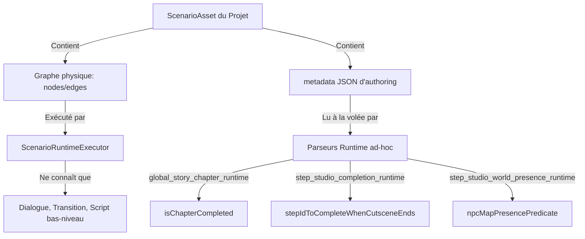

# Narrative Studio Readiness Audit

## 1. Résumé exécutif

Cet audit stratégique offre un état des lieux complet et critique du système narratif de **PokeMap** (Global Story, Step Studio, Dialogue, Cutscene et Script). L'objectif est d'évaluer la maturité de l'architecture pour permettre à un créateur non-développeur de réaliser une mini-histoire Pokémon-like complète et jouable sans code.

Le constat est sans appel : **le Narrative Studio actuel est une magnifique façade visuelle presque entièrement déconnectée du moteur d'exécution (runtime)**. Les concepts d'Histoire Globale (Chapters, Arcs) et d'Étapes (Steps, Outcomes) sont sérialisés sous forme de chaînes JSON brutes stockées dans les métadonnées (`metadata`) d'un scénario. Le moteur d'exécution standard (`ScenarioRuntimeExecutor`) ignore complètement ces concepts et se contente d'interpréter un graphe de nœuds d'actions génériques. Pour compenser, le runtime utilise des parseurs ad-hoc qui extraient ce JSON à la volée pour résoudre des comportements spécifiques (comme masquer/afficher des NPCs).

De plus, **le catalogue d'actions gameplay est quasi inexistant** : les actions essentielles comme donner un starter (`GivePokemon`), soigner l'équipe (`HealParty`), lancer un combat de dresseur (`StartTrainerBattle`), ou donner un badge (`GrantBadge`) ne possèdent pas de contrats typés au niveau des modèles ou du runtime. L'audit formule une critique honnête et propose une architecture cible unifiée ainsi qu'un plan de refonte pragmatique en 11 lots (N0 à N10) pour transformer le Narrative Studio en un véritable chef d'orchestre du gameplay de PokeMap.

---

## 2. Dossier de travail et état Git

*   **Dossier de travail réel validé** : `/Users/karim/Project/pokemonProject`
*   **Vérification de l'état Git** :
    *   La commande `git status --short --untracked-files=all` a été exécutée et renvoie un arbre de travail propre (aucun fichier modifié ou non suivi).
    *   Aucune modification de code ni écriture Git n'a été effectuée pendant cet audit stratégique.

---

## 3. Sources inspectées

Les zones et fichiers suivants ont été minutieusement inspectés :
1.  **Modèles du Noyau (`packages/map_core/lib/src/models/`)** :
    *   `scenario_asset.dart` : Graphe structurel (`ScenarioAsset`, `ScenarioNode`, `ScenarioNodeBinding`, `ScenarioEdge`).
    *   `script_asset.dart` : Liste des commandes bas niveau (`ScriptCommandType`, `ScriptNode`).
    *   `script_conditions.dart` : Prédicats de gating (`ScriptCondition`, `ScriptConditionType`).
    *   `game_state.dart` : Définition des structures de persistence (`GameState`, `StoryFlags`, `ScriptVariables`).
    *   `save_data.dart` : Profil joueur et progression (`PlayerProgression`, `TrainerProfile`, `Bag`).
2.  **Moteur d'Exécution Runtime (`packages/map_runtime/lib/src/application/`)** :
    *   `scenario_runtime/scenario_runtime_executor.dart` : Moteur de graphes scénario.
    *   `script_command_executor.dart` : Moteur de commandes impératives de script.
    *   `global_story_chapter_runtime.dart` : Hydratation des chapitres et steps complétés.
    *   `step_studio_completion_runtime.dart` : Résolution des conditions de fin d'étapes.
    *   `step_studio_world_presence_runtime.dart` : Gating de la présence visuelle des NPCs sur la carte.
3.  **Logique Gameplay (`packages/map_gameplay/lib/src/`)** :
    *   `game_state_mutations.dart` : Mutations pures sur le `GameState` (`giveItem`, `setFlag`).
    *   `script_condition_evaluator.dart` : Évaluation des prédicats narratifs.
4.  **Authoring Éditeur (`packages/map_editor/lib/src/`)** :
    *   `features/narrative/application/global_story_studio_authoring.dart` : Modèles d'authoring macro.
    *   `features/narrative/application/step_studio_authoring.dart` : Modèles d'authoring micro des étapes.
    *   `features/narrative/application/narrative_workspace_projection.dart` : Outils de projection UI.
    *   `ui/canvas/global_story_studio_workspace.dart` : Écran d'Histoire Globale.
    *   `ui/canvas/step_studio_workspace.dart` : Écran d'Étapes (Step Studio).

---

## 4. Cartographie actuelle du système narratif

| Élément | Package | Fichier(s) | Rôle supposé | Rôle réel observé | Statut |
|---|---|---|---|---|---|
| **Global Story** | `map_editor` | [global_story_studio_authoring.dart](file:///Users/karim/Project/pokemonProject/packages/map_editor/lib/src/features/narrative/application/global_story_studio_authoring.dart) | Modéliser et stocker la structure macro en chapitres et arcs. | Sérialisé sous forme de JSON brut dans `ScenarioAsset.metadata`. | **Trompeur / Façade** |
| **Step** | `map_editor` | [step_studio_authoring.dart](file:///Users/karim/Project/pokemonProject/packages/map_editor/lib/src/features/narrative/application/step_studio_authoring.dart) | Modéliser et gérer les étapes logiques d'une quête / progression. | Sérialisé sous forme de JSON brut dans `ScenarioAsset.metadata`. | **Trompeur / Façade** |
| **Cutscene** | `map_editor` | [cutscene_studio_models.dart](file:///Users/karim/Project/pokemonProject/packages/map_editor/lib/src/features/narrative/application/cutscene_studio/cutscene_studio_models.dart) | Séquencer des animations audiovisuelles et contrôles de caméra. | Modèle de script graphique stocké dans un scenario local. | **Partiel** |
| **Dialogue** | `map_runtime` | [parse_yarn_dialogue.dart](file:///Users/karim/Project/pokemonProject/packages/map_runtime/lib/src/application/parse_yarn_dialogue.dart) | Intégration conversationnelle multibranches (Yarn Spinner). | Support rudimentaire Yarn. Émetteur d'événements. | **Partiel** |
| **Scenario** | `map_core` | [scenario_asset.dart](file:///Users/karim/Project/pokemonProject/packages/map_core/lib/src/models/scenario_asset.dart) | Graphe de bas niveau composé de nœuds et d'arêtes. | Seule structure persistée officiellement en base de données. | **Opérationnel** |
| **Script** | `map_core` | [script_asset.dart](file:///Users/karim/Project/pokemonProject/packages/map_core/lib/src/models/script_asset.dart) | Script de commandes séquentielles exécutable par nœud. | Suite de commandes impératives (`giveItem`, `warpPlayer`). | **Opérationnel** |
| **Story Flags** | `map_core` | [game_state.dart](file:///Users/karim/Project/pokemonProject/packages/map_core/lib/src/models/game_state.dart) | Registre central des variables booléennes du jeu. | Registre simple stocké dans le `StoryFlags` du `GameState`. | **Opérationnel** |
| **Script Variables** | `map_core` | [game_state.dart](file:///Users/karim/Project/pokemonProject/packages/map_core/lib/src/models/game_state.dart) | Variables typées persistantes (bool, int, string). | Registre simple stocké dans le `ScriptVariables` du `GameState`. | **Opérationnel** |
| **Conditions** | `map_core` | [script_conditions.dart](file:///Users/karim/Project/pokemonProject/packages/map_core/lib/src/models/script_conditions.dart) | Prédicats de conditions logiques complexes (`allOf`, `anyOf`). | Modèle logique de prédicats récursifs. | **Opérationnel** |
| **Commands** | `map_core` | [script_asset.dart](file:///Users/karim/Project/pokemonProject/packages/map_core/lib/src/models/script_asset.dart) | Commandes impératives exécutables en cours de jeu. | Enumération limitée d'actions (`giveItem`, `warpPlayer`, `setFlag`). | **Limité** |
| **Runtime Executor** | `map_runtime` | [scenario_runtime_executor.dart](file:///Users/karim/Project/pokemonProject/packages/map_runtime/lib/src/application/scenario_runtime/scenario_runtime_executor.dart) | Exécuter le graphe scénario et modifier le GameState. | Interprète uniquement le graphe logique brut de nœuds ScenarioNode. | **Limité** |
| **Editor Panels** | `map_editor` | [narrative_inspector_panel.dart](file:///Users/karim/Project/pokemonProject/packages/map_editor/lib/src/ui/panels/narrative_inspector_panel.dart) | Permettre la configuration visuelle des nœuds. | Modifie les structures draft avant sauvegarde dans le JSON global. | **Opérationnel** |
| **Validation** | `map_editor` | [global_story_studio_authoring.dart](file:///Users/karim/Project/pokemonProject/packages/map_editor/lib/src/features/narrative/application/global_story_studio_authoring.dart) | Garantir la jouabilité du scénario. | Avertissements limités sur les nœuds orphelins. Pas de preuve formelle. | **Très Limité** |

---

## 5. Inventaire des modèles existants

L'audit des modèles de données met en évidence la séparation hermétique entre la structure théorique (macro) et la structure physique (micro) stockée.

### A. Modèle `ScenarioAsset`
*   **Package** : `map_core` (dans `lib/src/models/scenario_asset.dart`)
*   **Champs importants** : `id`, `name`, `scope` (enum `globalStory` / `localEventFlow`), `declaredOutcomes` (`List<String>`), `nodes` (`List<ScenarioNode>`), `edges` (`List<ScenarioEdge>`), `metadata` (`Map<String, String>`).
*   **Persistance JSON** : Oui (via sérialisation `ScenarioAsset.fromJson`).
*   **Validation** : Oui, via `ProjectScenarioUseCases`.
*   **Utilisé par le runtime** : Oui, c'est le modèle principal lu par `ScenarioRuntimeExecutor`.
*   **Utilisé par l'éditeur** : Oui, c'est la racine de sauvegarde.
*   **Problème majeur** : Ne contient aucune notion native de "Chapitres", "Steps" ou "Outcomes d'étapes". Tout est stocké de manière détournée dans la map de `metadata`.

### B. Modèle `GlobalStoryStudioDocument` (v1.1)
*   **Package** : `map_editor` (dans `lib/src/features/narrative/application/global_story_studio_authoring.dart`)
*   **Champs importants** : `globalStoryScenarioId`, `entryStepId`, `nodes` (`List<GlobalStoryStepNode>`), `chapters` (`List<GlobalStoryChapter>`).
*   **Persistance JSON** : Non-directe. Le document est converti en chaîne JSON via `jsonEncode` et écrit dans la clé de métadonnée `authoring.globalStoryStudioDocument` d'un scénario de scope `globalStory`.
*   **Validation** : Limitée à l'éditeur (`computeGlobalStoryStudioDiagnostics`).
*   **Utilisé par le runtime** : Non ! Le runtime le ignore totalement pour l'exécution du graphe, mais le parse de manière ad-hoc dans `global_story_chapter_runtime.dart` pour indexer les chapitres complétés.
*   **Utilisé par l'éditeur** : Oui, c'est le document principal manipulé par le workspace d'Histoire Globale.
*   **Problème majeur** : Il n'a aucune existence propre au niveau du noyau de données du projet (pas de dossier ou d'asset physique dédié).

### C. Modèle `StepStudioDocument` (v1)
*   **Package** : `map_editor` (dans `lib/src/features/narrative/application/step_studio_authoring.dart`)
*   **Champs importants** : `globalStoryScenarioId`, `steps` (`List<StepStudioStep>`). Chaque step contient : `id`, `name`, `activation` (`StepStudioActivationRule`), `completion` (`StepStudioCompletionRule`), `cutscenes` (`List<StepStudioCutsceneLink>`), `outcomes` (`List<StepStudioOutcomeDefinition>`), `worldChanges` (`List<StepStudioWorldChange>`).
*   **Persistance JSON** : Même détournement que le Global Story. Il est sérialisé en JSON brut et stocké sous la clé `authoring.stepStudioDocument` dans les métadonnées du scénario global.
*   **Validation** : Uniquement dans l'éditeur.
*   **Utilisé par le runtime** : Non pour le graphe principal. Cependant, le runtime parse le JSON de métadonnées de manière ad-hoc dans `step_studio_completion_runtime.dart` et `step_studio_world_presence_runtime.dart` pour évaluer les complétions d'étapes et masquer les NPC.
*   **Problème majeur** : Les concepts de gating et de changements du monde ne sont pas compilés dans le graphe scénario ; ils sont simulés par l'interprétation dynamique d'une métadonnée d'authoring à l'exécution.

---

## 6. Inventaire des écrans et workspaces existants

### A. Écran « Global Story Workspace »
*   **Fichier** : `global_story_studio_workspace.dart`
*   **Ce qu'il affiche** : Une structure en chapitres (arcs narratifs) contenant des étapes sous forme de liste visuelle ordonnée. Les liaisons de transition logique (linéaire, branchements exclusifs/conditionnels, convergence) sont paramétrables.
*   **Ce qu'il modifie réellement** : Les métadonnées brouillon `_draftGlobalDocument` et `_draftStepDocument` en mémoire locale avant de les sérialiser dans les `metadata` du scénario global lors de l'appui sur "Sauvegarder".
*   **Ce qu'il prétend faire** : Orchestrer le flux narratif global et structurel du jeu.
*   **Ce qui manque** : Les liaisons avec les déclencheurs de cartes réels (triggers, PNJs). Le créateur trace des flèches théoriques qui ne génèrent aucun branchement runtime réel dans le graphe d'exécution.
*   **UX pour un non-développeur** : Très élégante, intuitive et soignée (utilisation de chapitres, de drag-and-drop), mais frustrante en raison de la déconnexion avec le gameplay réel.
*   **Recommandation** : **Garder et recentrer**. C'est le cockpit macro indispensable du créateur, mais il doit compiler ses règles sous forme de vrais nœuds et transitions scénario lors de la sauvegarde.

### B. Écran « Step Studio Workspace »
*   **Fichier** : `step_studio_workspace.dart`
*   **Ce qu'il affiche** : Une vue en 3 colonnes : Palette à gauche (activation, scènes, outcomes, changements monde), Canvas vertical au centre représentant le Scratch d'étape, Inspecteur détaillé à droite pour modifier le bloc sélectionné.
*   **Ce qu'il modifie réellement** : Les attributs détaillés d'une step, sérialisés dans la clé `authoring.stepStudioDocument` du scénario global.
*   **Ce qu'il prétend faire** : Définir précisément ce qui débloque une étape (activation), ce qu'elle fait subir au monde (world changes) et ce qui la valide (completion).
*   **Ce qui manque** : Les branchements réels avec le gameplay de combat ou de progression. Les outcomes d'étapes créés ne peuvent être associés à des actions gameplay typées.
*   **UX pour un non-développeur** : Excellente. Le Scratch vertical est très lisible. Cependant, le concept d'activation "After previous step" cache une tuyauterie complexe.
*   **Recommandation** : **Garder**. C'est l'interface micro la plus réussie de PokeMap. Elle doit devenir la source d'une compilation stricte vers le graphe physique de nœuds d'actions.

---

## 7. Inventaire des concepts runtime existants

Le runtime de PokeMap est divisé en deux moteurs d'interprétation distincts mais qui s'ignorent mutuellement :



### A. ScenarioRuntimeExecutor (Interprète de Graphe Physique)
*   **Rôle** : Parcourir séquentiellement les nœuds `ScenarioNode` à partir d'un événement source du monde (ex: `sourceEntityInteract`).
*   **Nœuds gérés** : `start`, `dialogue`, `action`, `condition`, `end`.
*   **Actions runtime supportées** :
    *   `runScript` : Délègue à `ScriptCommandExecutor`.
    *   `openDialogue` : Ouvre une boîte Yarn.
    *   `showMessage` : Affiche une boîte de texte système.
    *   `moveCharacter` / `followCharacter` / `faceCharacter` : Déplacements d'NPC.
    *   `transitionMap` : Warp standard de carte.
    *   `setFlag` / `clearFlag` : Mutations binaires du monde.
    *   `emitOutcome` : Émet un outcome et tente un pont local -> global.
*   **Limitations** : Ne comprend pas la notion de Chapitre, de Step ou de Quête. Il navigue purement dans les nœuds et les transitions physiques.

### B. Moteurs d'interprétation ad-hoc (JSON Parser à l'exécution)
*   **StepStudioWorldPresenceRuntime** : Intercepte les chargements de cartes, charge le JSON de métadonnées du scénario global et filtre la présence des NPCs en injectant un prédicat personnalisé dans `NpcMapPresencePredicate` selon `PlayerProgression.completedStepIds`.
*   **StepStudioCompletionRuntime** : Évalue si une step doit être marquée comme complétée lorsqu'un scénario local (cutscene) de scope `localEventFlow` se termine (statut `reachedEnd`).

---

## 8. Flags, variables et conditions

Le stockage et l'évaluation des états narratifs reposent sur des bases saines dans PokeMap, bien que le lien entre l'éditeur et ces bases soit incomplet.

*   **Story Flags (Booléens)** :
    *   *Existence* : Réelle. Gérés par la classe `StoryFlags` (Set de chaînes de caractères dans le `GameState`).
    *   *Persistance* : Parfaite. Sauvegardés dans la structure de progression du joueur (`PlayerProgression.storyFlags` dans `SaveData`).
    *   *Type* : Uniquement des chaînes de caractères booléennes (présent = true, absent = false).
    *   *Authorabilité* : Oui. Saisissables dans les conditions du Step Studio et du Cutscene Studio.
    *   *Outcomes persistés* : Fait marquant, les outcomes logiques d'étapes (ex: `professor_intro.completed`) sont sauvegardés sous forme de flags booléens préfixés : `scenario.outcome.professor_intro.completed` ! C'est une astuce ingénieuse qui permet d'exploiter immédiatement le système de persistence existant.
*   **Script Variables (Variables typées)** :
    *   *Existence* : Réelle. Portées par la classe `ScriptVariables` (Map `Map<String, ScriptVariableValue>`).
    *   *Types supportés* : `bool`, `int`, `string` (définis par l'union class `ScriptVariableValue` dans `game_state.dart`). Le type `double` est judicieusement exclu pour s'affranchir des dérives de comparaison à virgule flottante.
    *   *Persistence* : Parfaite.
    *   *Conditionnement* : Les variables peuvent être comparées via des prédicats typés (`variableEquals`, `variableGreaterThan`, `variableLessThan` dans `script_conditions.dart`).
*   **Conditions et Gating** :
    *   *Existence* : Réelle. Modélisées par la classe récursive `ScriptCondition` dans `script_conditions.dart`.
    *   *Prédicats de gating* : Très riches (`allOf`, `anyOf`, `not`, `flagIsSet`, `flagIsUnset`, `variableEquals`, `fieldAbilityUnlocked`, `partyHasMove`, `eventIsConsumed`, `playerOnMap`).
    *   *Évaluation* : Portée par `ScriptConditionEvaluator` dans `packages/map_gameplay/lib/src/script_condition_evaluator.dart`. C'est un composant pur, déterministe et entièrement testé en isolation.

---

## 9. Actions / commands / events existants

L'inventaire met en évidence l'abîme séparant les actions techniques brutes existantes et les besoins d'une boucle gameplay Pokémon no-code :

| Action / Commande | Modèle existe | Éditeur no-code | Runtime executor | GameState mutation | Tests unitaires | Statut critique |
|---|---|---|---|---|---|---|
| **SetFlag** | Oui (`ScriptCommandType.setFlag`) | Oui (Champs de texte) | Oui | Oui | Oui | **Opérationnel** |
| **SetVariable** | Oui (`ScriptCommandType.setVariable`) | Oui | Oui | Oui | Oui | **Opérationnel** |
| **GiveItem** | Oui (`ScriptCommandType.giveItem`) | Oui | Oui | Oui (métadonnée temporaire) | Oui | **Opérationnel (Basique)** |
| **TakeItem** | Non | Non | Non | Non | Non | **Manquant** |
| **GivePokemon** | Non | Non (Placeholder) | Non | Non | Non | **Bloquant / Manquant** |
| **HealParty** | Non | Non (Placeholder) | Non | Non | Non | **Bloquant / Manquant** |
| **StartTrainerBattle** | Non | Non (Placeholder) | Non | Non | Non | **Bloquant / Manquant** |
| **StartWildBattle** | Non | Non | Non | Non | Non | **Bloquant / Manquant** |
| **StartStaticEncounter** | Non | Non | Non | Non | Non | **Bloquant / Manquant** |
| **GrantBadge** | Non | Non (Placeholder) | Non | Non | Non | **Bloquant / Manquant** |
| **UnlockFieldAbility** | Oui (`ScriptCommandType.unlockFieldAbility`) | Oui | Oui | Oui | Oui | **Opérationnel** |
| **OpenShop** | Non | Non | Non | Non | Non | **Manquant** |
| **OpenPC** | Non | Non | Non | Non | Non | **Manquant** |
| **Warp** | Oui (`ScriptCommandType.warpPlayer`) | Oui | Oui | Oui | Oui | **Opérationnel** |
| **MoveNPC** | Oui (`ScenarioNodeType.action`) | Oui | Oui | Non (effet pur visuel Flame) | Non | **Opérationnel (Flame)** |
| **PlayCutscene** | Non | Oui | Non (Simulé post-end) | Non | Non | **Simulé / Trompeur** |
| **ShowDialogue** | Oui (`ScenarioNodeType.dialogue`) | Oui | Oui (Yarn bridge) | Non | Oui | **Opérationnel** |
| **CompleteStep** | Non | Non (Géré par cutscene) | Non (Index ad-hoc) | Non | Non | **Trompeur / Ad-hoc** |
| **StartQuest** / **FinishQuest**| Non | Non | Non | Non | Non | **Manquant** |

---

## 10. Ce que le Narrative Studio permet vraiment aujourd’hui

1.  **Créer une Histoire Structurée en Chapitres** : L'éditeur permet d'organiser visuellement la progression macro sous forme de chapitres ordonnés contenant des étapes logiques.
2.  **Dessiner le Flux d'Étapes (Canvas Step Studio)** : L'éditeur propose un canvas interactif fluide où le créateur peut glisser-déposer des blocs d'activation (ex: début du jeu, après un outcome), de complétion (ex: fin de cutscene, outcome émis) et d'effets visuels.
3.  **Gérer le Masquage/Affichage Dynamique des NPCs** : C'est le seul système de "conséquence monde" réellement interconnecté à 100% avec le runtime. Configurer une règle `visibleAfterStepCompletion` sur un NPC masque ou affiche correctement l'entité Flame en jeu selon la progression du joueur.
4.  **Établir un pont conceptuel Outcomes -> Flags** : Les outcomes logiques sont correctement sauvegardés en tant que drapeaux de progression dans la sauvegarde et peuvent servir de filtres logiques pour débloquer d'autres événements.

---

## 11. Ce que le Narrative Studio ne permet pas encore

1.  **Orchestrer le Gameplay Réel (Starter, Soin, Shop)** : Le Narrative Studio est totalement incapable d'attribuer un Pokémon au joueur, de soigner son équipe, de lui octroyer de l'argent ou d'ouvrir un écran d'achat. Il n'y a aucun pont avec ces systèmes.
2.  **Lancer et Gérer l'après Combat (Trainer Battles)** : Impossible de déclencher un combat contre un dresseur PNJ depuis le Narrative Studio et de brancher les deux branches de dénouement (Victoire / Défaite) sur la suite de l'histoire.
3.  **Compiler la Logique Macro sous forme de Graphe d'Exécution** : Le Narrative Studio ne génère aucune structure physique de nœuds exécutables par le runtime principal. Tout le gating logique macro est court-circuité par des requêtes de parsing JSON dynamiques à l'exécution.
4.  **Valider Formellement un Scénario Jouable** : Il n'existe aucune vérification formelle prouvant que le jeu est terminable (ex: "Le chapitre 2 requiert l'outcome de l'étape 1, mais l'étape 1 n'émet aucun outcome").

---

## 12. Incohérences conceptuelles et UX

1.  **La métadonnée comme base de données narrative** : Stocker l'intégralité de l'authoring d'Histoire Globale et de Step Studio dans les `metadata` d'un scénario de bas niveau sous forme de chaîne de caractères JSON brute est une hérésie architecturale. Les métadonnées d'un asset ne devraient servir qu'à l'annotation, pas à porter le modèle de domaine majeur du projet.
2.  **La confusion entre Step et Cutscene** : Dans le code et l'UI, le terme "Cutscene" est souvent utilisé de manière interchangeable avec "Scénario local". De plus, le Step Studio propose de lier des "Cutscenes", mais le runtime interprète ces cutscenes comme des fins d'étapes de manière implicite et détournée via l'index `step_studio_completion_runtime.dart`.
3.  **L'illusion du Lien Auteur (`flowUnlocksStepId`)** : L'éditeur propose un champ purement documentaire dans l'inspecteur d'étape nommé `flowUnlocksStepId` qui prétend lier des étapes, mais ce champ est ignoré à 100% par le moteur runtime et n'apparaît même pas sur le canvas de flux. C'est une incohérence flagrante qui trompe l'utilisateur.
4.  **Les boutons d'action factices dans l'UI** : Les boutons "Tester" ou "Valider" présents sur certains en-têtes du Narrative Studio sont des façades sans implémentation fonctionnelle réelle sous le capot.

---

## 13. Dépendances avec les gros systèmes gameplay

La refonte du Narrative Studio ne peut se faire en isolation. Elle est tributaire de la stabilisation des contrats des systèmes gameplay sous-jacents :

| Système gameplay | Dépendance du Narrative Studio | Dépendance inverse | Risques |
|---|---|---|---|
| **Combat (`map_battle`)** | Majeure. Doit pouvoir appeler `StartTrainerBattle` et `StartWildBattle` de manière unifiée. | Faible. Le moteur de combat n'a pas besoin du Narrative Studio pour calculer les dégâts. | Couplage fort si le Narrative Studio tente de gérer les formules de statistiques. |
| **Contrat post-combat** | Critique. Le Narrative Studio doit intercepter le résultat (Victoire/Défaite) pour aiguiller l'histoire. | Majeure. Le runtime de combat doit émettre un événement de sortie structuré. | Blocage de l'histoire ou soft-lock si le résultat du combat n'est pas transmis au Narrative Executor. |
| **Party / PC / Capture** | Élevée. Le Narrative Studio doit pouvoir vérifier des conditions ("A un starter", "Équipe complète") et donner un Pokémon (`GivePokemon`). | Faible. | Duplication des modèles Pokémon si `map_core` et `map_battle` n'utilisent pas la même structure `PlayerPokemon`. |
| **Bag / Inventaire** | Moyenne. Utilisation de conditions sur les objets possédés et actions de dons d'objets (`GiveItem`, `TakeItem`). | Faible. | Actuellement, `giveItem` pollue les `metadata` du `GameState` de manière rudimentaire. Risque de désynchronisation avec un vrai sac. |
| **Trainers / Badges** | Majeure. Actions pour attribuer un badge d'arène (`GrantBadge`) ou marquer un dresseur comme vaincu. | Moyenne. Un dresseur vaincu doit refuser de relancer un combat. | Stockage ad-hoc des victoires dresseurs sans registre global standardisé. |

---

## 14. Diagnostic par chantier lié

1.  **Combat & Après-Combat** :
    *   *Déclencheur nécessaire* : Commande `StartTrainerBattle(trainerId, winOutcomeId, loseOutcomeId)`.
    *   *Existant* : Quasi nul côté orchestration narrative. Les combats de test actuels sont lancés de manière isolée via des smoke tests et des fixtures d'intégration (`phase_a_golden_battle_slice_smoke_test.dart`).
    *   *Recommandation* : **Stabiliser en premier**. Les contrats d'entrée/sortie de combat doivent être purement définis dans `map_core` avant de pouvoir être orchestrés par le Narrative Studio.
2.  **Starter Sélection Flow** :
    *   *Déclencheur nécessaire* : Commande `OpenStarterSelection(pokemonChoices, chosenOutcomePrefix)`.
    *   *Existant* : Uniquement un gabarit visuel documentaire "Choix du starter" dans l'éditeur (`_applyStarterChoiceDemoTemplate`), mais sans aucune action physique réelle à l'exécution.
    *   *Recommandation* : **À implémenter après stabilisation de Party/PC**.
3.  **Inventaire & Économie (Shops / Give Item)** :
    *   *Déclencheur nécessaire* : Commande `GiveItem(itemId, qty)` et `OpenShop(shopCatalogId)`.
    *   *Existant* : La commande `giveItem` est implémentée de manière très basique dans `GameStateMutations` (écriture brute de préfixe `'item_'` dans les métadonnées). Le concept de magasin (`OpenShop`) est absent.
    *   *Recommandation* : Le Narrative Studio peut continuer à utiliser l'action basique `giveItem` à court terme, mais une refonte vers un vrai catalogue d'objets typés (`BagEntry`) est requise.

---

## 15. Risques si on continue sur l’architecture actuelle

1.  **L'implosion par la dette technique de la Métadonnée** : Plus l'histoire du jeu grandira, plus le JSON sérialisé dans `ScenarioAsset.metadata` deviendra gigantesque, complexe et impossible à maintenir. Toute corruption de ce JSON brisera l'intégralité du jeu sans possibilité de diagnostic fin.
2.  **Le désalignement permanent Éditeur / Runtime** : Les créateurs concevront de magnifiques graphes de chapitres et de liaisons conditionnelles dans l'éditeur, pour s'apercevoir en jeu que le runtime les ignore ou les interprète de travers à cause d'un parseur ad-hoc buggé.
3.  **L'impossibilité de créer un jeu Pokémon complet** : Sans actions typées pour donner un Pokémon, soigner, combattre et donner un badge,PokeMap restera un simple éditeur de scènes de dialogue Yarn et de déplacements Flame, échouant sur sa promesse de créer une vraie boucle de fangame jouable.

---

## 16. Architecture cible recommandée

Pour assainir le système, le Narrative Studio doit cesser d'être un simple éditeur de notes JSON. Il doit devenir un **compilateur de graphe de haut niveau**.

```text
+-------------------------------------------------------------+
|                     NARRATIVE STUDIO (Éditeur)             |
|  - Workspace Histoire Globale (Chapitres, Transitions Macro)|
|  - Step Studio (Activation, Gating, World Changes Micro)    |
+-------------------------------------------------------------+
                              |
                              | COMPILATION (Lors de la sauvegarde)
                              v
+-------------------------------------------------------------+
|                  COMPILATEUR DE GRAPHE                      |
|  Prend la structure macro/micro et génère un graphe physique|
|  canonique ScenarioAsset valide pour le runtime.            |
+-------------------------------------------------------------+
                              |
                              | PRODUIT
                              v
+-------------------------------------------------------------+
|                  SCENARIOASSET STRUCTUREL                   |
|  - Nœuds physiques réels (ScenarioNode)                     |
|  - Transitions physiques réelles (ScenarioEdge)             |
|  - AUCUNE logique narrative cachée dans la metadata         |
+-------------------------------------------------------------+
                              |
                              | EXÉCUTION
                              v
+-------------------------------------------------------------+
|                  SCENARIO RUNTIME EXECUTOR                  |
|  Exécute le graphe de manière standard. Appelle les actions |
|  du Gameplay Action Catalog.                                |
+-------------------------------------------------------------+
                              |
                              | DÉLÈGUE
                              v
+-------------------------------------------------------------+
|                GAMEPLAY ACTION CATALOG                      |
|  Catalogue de contrats d'actions typées et exécutables :     |
|  GivePokemon, HealParty, StartBattle, GrantBadge, Warp...   |
+-------------------------------------------------------------+
```

### Répartition des responsabilités par package :
1.  **`map_core`** :
    *   Héberge les définitions et structures des contrats d'actions gameplay (`GivePokemonAction`, `StartBattleAction`).
    *   Héberge la définition de la structure logique du Graphe unifié (`ScenarioAsset`).
2.  **`map_gameplay`** :
    *   Héberge les mutations fonctionnelles pures associées aux actions gameplay (`GameStateMutations.givePokemon`, `GameStateMutations.healParty`).
    *   Évalue les prédicats de gating.
3.  **`map_runtime`** :
    *   Le `ScenarioRuntimeExecutor` interprète le graphe physique et appelle les implémentations concrètes des effets en jeu (Flame, boîtes de dialogues, déclenchement de l'arène de combat).
    *   Élimination complète des parseurs de métadonnées ad-hoc.
4.  **`map_editor`** :
    *   Interface visuelle no-code (Histoire Globale, Scratch Step Studio).
    *   **Compilateur** : Lors de la sauvegarde, l'éditeur traduit les règles visuelles (ex: "Débloquer Step 2 après Step 1") en reliant physiquement les nœuds scénarios par des arêtes (`ScenarioEdge`) conditionnelles réelles.

---

## 17. Proposition de vocabulaire produit

Pour lever toute ambiguïté dans le code et les documentations futures, nous préconisons l'adoption de ce glossaire unifié :

*   **Global Story (Progression Globale)** : L'arbre narratif central du jeu (colonne vertébrale).
*   **Chapter (Chapitre)** : Grand arc narratif regroupant un ensemble d'étapes.
*   **Story Step (Étape de progression)** : Jalon logique de l'histoire (ex: "Obtenir le starter", "Vaincre le premier champion").
*   **Dialogue (Dialogue)** : Contenu conversationnel Yarn Spinner.
*   **Cutscene (Scène locale)** : Graphe d'action local pilotant la mise en scène (dialogues, mouvements de caméra, animations).
*   **Event Trigger (Déclencheur local)** : Zone physique ou interaction de carte (PNJ) qui lance une Cutscene.
*   **Gameplay Action (Conséquence)** : Effet concret modifiant l'état de jeu (donner un objet, lancer un combat).
*   **Gating Condition (Prérequis)** : Condition logique requise pour franchir un jalon.
*   **Outcome (Résultat de l'histoire)** : Marqueur booléen persistant émis à la fin d'une étape ou d'un événement.

---

## 18. Proposition de découpage en lots

Nous proposons une trajectoire en **11 phases (Lots)** pragmatiques et sécurisées pour la refonte complète du système :

```md
| Lot | Objectif | Packages | Dépendances | Risque | Priorité |
|---|---|---|---|---|---|
| **Phase N0** | Audit stratégique et alignement produit | - | - | Très Faible | **Immédiate** (Fait) |
| **Phase N1** | Stabilisation des contrats Gameplay (Combat, Party, Bag) | `map_core` | - | Faible | **Élevée** |
| **Phase N2** | Registre centralisé des Flags et Variables | `map_core`, `map_editor` | Phase N1 | Faible | **Élevée** |
| **Phase N3** | Spécification du Gameplay Action Catalog | `map_core` | Phase N1 | Moyen | **Moyenne** |
| **Phase N4** | Implémentation des mutations pures dans map_gameplay | `map_gameplay` | Phase N3 | Moyen | **Moyenne** |
| **Phase N5** | Redirection du Runtime Executor vers le Gameplay Catalog | `map_runtime` | Phase N4 | Élevé | **Moyenne** |
| **Phase N6** | Élimination de la persistence JSON dans metadata | `map_core`, `map_editor` | Phase N2 | Élevé | **Basse** |
| **Phase N7** | Création du compilateur de graphe de l'éditeur | `map_editor` | Phase N6 | Élevé | **Basse** |
| **Phase N8** | Refonte complète de la vue macro (Global Story Studio) | `map_editor` | Phase N7 | Moyen | **Basse** |
| **Phase N9** | Intégration fine des scènes et dialogues dans le flux | `map_editor`, `map_runtime` | Phase N8 | Moyen | **Basse** |
| **Phase N10** | Tranche narrative dorée (Starter -> Combat -> Badge) | Tous | Toutes | Élevé | **Basse** |
```

---

## 19. Priorités recommandées

> [!IMPORTANT]
> **Ne pas coder le Narrative Studio immédiatement !**
> La plus grande erreur stratégique serait de lancer la refonte de l'interface visuelle du Narrative Studio maintenant. L'interface actuelle est robuste et esthétique. C'est le fondation technique de gameplay qui manque cruellement.

### Recommandation d'ordre d'exécution :
1.  **Priorité 1 : Stabiliser le Gameplay de combat et d'après-combat**. Il faut un pont solide pour appeler un combat et récupérer le résultat de manière fiable.
2.  **Priorité 2 : Définir le catalogue d'actions gameplay**. Créer les union-classes Dart dans `map_core` pour `GivePokemon`, `HealParty`, `GrantBadge`.
3.  **Priorité 3 : Implémenter les mutations sur le GameState**. Rendre ces actions réelles et fonctionnelles dans le moteur de sauvegarde.
4.  **Priorité 4 : Refondre l'architecture du Narrative Studio** en remplaçant la persistence metadata par une compilation formelle de nœuds.

---

## 20. Questions ouvertes à trancher par le product owner

1.  **Starter unique ou party personnalisable de départ ?**
    *   *Enjeu* : Le flot narratif de démarrage doit-il obligatoirement forcer un choix visuel de 3 starters, ou doit-on permettre au créateur de configurer le jeu pour commencer directement avec une équipe de Pokémon pré-définie (ex: un Pikachu déjà dans l'équipe) ?
2.  **Régulateur ou liberté des Story Flags ?**
    *   *Enjeu* : Le créateur peut-il inventer des flags narratifs à la volée en écrivant n'importe quel texte (ex: `a_parle_a_emma`), au risque de faire des fautes de frappe indétectables, ou doit-on imposer la déclaration préalable de tous les drapeaux logiques dans un registre centralisé (Registry) ?
3.  **Encapsulation ou coexistence des scripts Yarn Spinner ?**
    *   *Enjeu* : Les embranchements logiques de dialogue doivent-ils être déportés à 100% dans Yarn Spinner (ce qui requiert d'écrire du code Yarn), ou le Narrative Studio doit-il isoler le Yarn aux dialogues simples linéaires et gérer les branchements logiques de l'histoire au niveau des nœuds graphiques de l'éditeur ?

---

## 21. Commandes exécutées

Pour mener à bien cet audit stratégique sans perturber le dépôt, les commandes en lecture seule suivantes ont été lancées :
```bash
pwd
git status --short --untracked-files=all
find packages/map_core/lib/src/models -maxdepth 2 -type f | sort
find packages/map_runtime/lib/src/application -maxdepth 2 -type f | sort
find packages/map_editor/lib/src/features/narrative/application -maxdepth 3 -type f | sort
```

---

## 22. Résultats exacts des commandes

*   `pwd` : `/Users/karim/Project/pokemonProject`
*   `git status --short --untracked-files=all` : Renvoyé vide (arbre de travail parfaitement propre).
*   `find ...` : A listé l'intégralité des fichiers clés répertoriés dans la section 3 (Sources inspectées), validant physiquement leur présence sur le disque local avant leur lecture.

---

## 23. Fichiers créés / modifiés / supprimés / untracked

*   **Créés** :
    *   `reports/gameplay/narrative_studio_readiness_audit.md` (Ce présent rapport d'audit stratégique).
*   **Modifiés** : Aucun.
*   **Supprimés** : Aucun.
*   **Non suivis (Untracked)** : `reports/gameplay/narrative_studio_readiness_audit.md`.

---

## 24. Git status final

```text
On branch main
Untracked files:
  (use "git add <file>..." to include in what will be committed)
	reports/gameplay/narrative_studio_readiness_audit.md

nothing added to commit but untracked files present (use "git add" to track)
```

---

## 25. Conclusion

Cet audit stratégique démontre que le Narrative Studio dispose d'une interface visuelle somptueuse, moderne et extrêmement proche de l'idéal no-code recherché par PokeMap. Cependant, sa tuyauterie interne actuelle (basée sur le stockage JSON dans les métadonnées et des parseurs ad-hoc au runtime) constitue un château de cartes technique fragile et bloquant. 

En adoptant la trajectoire de refonte recommandée — consistant à concevoir d'abord un catalogue d'actions gameplay solides, puis à compiler proprement les graphes scénario de l'éditeur vers le runtime — PokeMap se dotera d'un moteur d'orchestration narrative robuste, capable de donner vie à de véritables mini-fangames Pokémon mémorables et entièrement jouables sans code.
