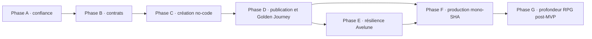

# Avelune & PokeMap Product Hardening Implementation Roadmap

> **For agentic workers:** REQUIRED SUB-SKILL: use
> `subagent-driven-development` or `executing-plans` to implement one lot at a
> time. Every implementation lot must receive its own TDD implementation plan
> with checkbox steps before code is changed.

**Goal:** make it possible to create a complete creature-collection RPG
without code in PokeMap, publish it as an Avelune game, install it on mobile,
play from a new game to credits, save, resume and update it safely.

**Architecture:** preserve the existing package boundaries: contracts and
validation in `map_core`, pure gameplay in `map_gameplay`, combat in
`map_battle`, execution in `map_runtime`, player surfaces in `map_player_ui`,
authoring in `map_editor`, packaging in `map_distribution`, and the mobile
library/player shell in `apps/pokemap_hub`. The roadmap closes the product
chain in dependency order rather than adding more isolated mechanics.

**Tech stack:** Dart, Flutter, Flame, package-scoped tests and analyzers, iOS
Xcode Cloud, GitHub Actions for Android and desktop.

---

## 1. Decision

The recommended strategy is **PokeMap/no-code first, with a mandatory
end-to-end gate through Avelune**.

The audit does not show an empty mechanics engine. It shows a broad and often
well-tested engine whose public promise is still weakened by three structural
problems:

1. some authoring surfaces can publish data that their runtime path does not
   consume consistently;
2. export certification does not yet prove global gameplay readiness;
3. no single candidate is proven through authoring, package export, mobile
   installation, save/reload and credits.

Adding more advanced mechanics before closing this chain would increase the
number of behaviors to certify without making the product reliably shippable.

Source audit:
`reports/gameplay/audit/avelune_pokemap_ultra_complete_product_audit_2026-07-28.md`.

## 2. Scope and guardrails

### In scope

- restore trustworthy automated gates;
- close no-code authoring/runtime contract gaps;
- make export certification truthful;
- define `.avelunegame` as the public mobile package identity;
- prove one golden release journey using the same package bytes;
- compose Avelune maintenance, update and save-recovery flows;
- establish production signing, provenance and store validation;
- defer advanced RPG breadth until the golden journey is green.

### Out of scope until Phase 5

- online play;
- breeding;
- contests;
- double battles;
- temporary battle gimmicks;
- procedural world generation;
- a large public game marketplace;
- visual polish unrelated to a blocking authoring or player flow.

### Naming rule

- `Avelune` is the only public mobile player identity.
- `PokeMap` remains the desktop editor identity.
- No new public mobile string, extension, MIME/UTI description or store
  metadata may contain `Poke`, `Pokémon` or another Nintendo trademark.
- `.pokemapgame` remains readable only as a hidden legacy migration format
  after `.avelunegame` becomes canonical.

## 3. Evidence baseline

The roadmap starts from the audit verdict at commit
`a3d741818c1961ac2f653da235bb30c20df75b00`.

Fresh evidence to preserve:

- `map_core`: full suite `+4502`, green;
- `map_gameplay`: full suite `+428`, green;
- `map_battle`: full suite `+1764`, green;
- runtime host: full suite `+257 ~2`, green;
- `map_runtime`: full suite red on the machine-specific
  `packages/map_runtime/test/le_train_m00_external_runtime_smoke_test.dart`;
- `map_editor`: full suite red on one concurrent performance budget, green
  when that budget is isolated;
- Avelune/Hub standard suite red because the atomic-save crash-stage test
  exceeds the default timeout, green with the explicit two-minute budget;
- iOS build succeeds, but the installed-flow driver stops at the new identity
  screen;
- static encounter authoring and runtime adapter contracts disagree;
- export can display a certification result without invoking all global
  gameplay/narrative validators;
- production artifacts at the audited prerelease mix provenance from two
  commits.

## 4. Definition of the target MVP

The program is MVP-ready only when all of the following are true for the same
candidate commit and the same exported game bytes:

- a creator starts from a new project in PokeMap without entering engine IDs;
- the project includes a valid start, starter, exploration, dialogue, wild
  encounter, capture, trainer battle, reward, shop, heal, progression and
  ending;
- PokeMap blocks export if any required reference, start state or reachable
  ending is invalid;
- PokeMap exports a deterministic `.avelunegame`;
- Avelune installs that package through real Android and iOS entry points;
- a player can start, save, kill/relaunch the app, continue and reach credits;
- update, repair and uninstall have explicit save-retention behavior and
  recover from interrupted transactions;
- Android, iOS and desktop release receipts all point to the same source SHA;
- no critical release gate is red, skipped without an accepted reason, or
  dependent on a developer-machine path.

## 5. Effort scale and execution rules

Effort is relative:

- `XS`: up to two focused engineering days;
- `S`: approximately three to five days;
- `M`: approximately one to two weeks;
- `L`: approximately three to five weeks;
- `XL`: more than five weeks and must be split again before implementation.

Each lot must:

1. begin with a fresh Git status and a focused code audit;
2. preserve package boundaries and legacy behavior outside its explicit scope;
3. add a failing positive, negative and regression test before implementation;
4. run the targeted package suite and analyzer;
5. run broader gates listed in this document when the lot crosses packages;
6. end with an evidence report and proposed FG status, without silently
   editing the canonical roadmap;
7. remain one reviewable commit boundary, or be split before coding.

The `writing-plans` skill recommends a dedicated worktree. The repository rules
forbid creating one without explicit user permission, so this master roadmap
was written in the existing working tree and changes documentation only.

## 6. Dependency map



The critical path is:

```text
Phase A: GATE-01..04 + GOV-01
  -> Phase B: CORE-01 + NC-09 -> CORE-02
  -> Phase C: NC-01..06 + NC-08
  -> Phase D: NC-07 + PKG-01 -> PKG-02 -> PKG-03
  -> Phase E: AVEL-01..07
  -> Phase F: REL-01 -> REL-02/03/04
  -> Phase G: RPG-01..04
```

## 6 bis. Découpage opérationnel en phases multi-lots

Une phase n’est pas un mégalot ni un commit. C’est un **incrément produit
démontrable** qui regroupe plusieurs lots autonomes. Chaque lot garde son
propre plan TDD, son commit, sa revue et son reçu de validation. Une phase ne
peut être déclarée terminée que lorsque tous ses lots obligatoires et sa gate
de sortie sont verts.

### Vue d’ensemble

| Phase | Résultat produit | Lots inclus | Organisation | Gate de sortie |
|---|---|---|---|---|
| A — Confiance | Les signaux automatiques redeviennent fiables | GATE-01 à 04, GOV-01 | 4 réparations parallèles, puis consolidation des reçus | Suites par défaut déterministes et dashboard traçable |
| B — Contrats | PokeMap ne peut plus certifier une donnée incohérente | CORE-01, CORE-02, NC-09 | CORE-01 et NC-09 en parallèle, CORE-02 ferme la phase | Contrats runtime/save cohérents et export fail-closed |
| C — Création no-code | Un créateur fabrique le slice MVP sans IDs bruts | NC-01 à 06, NC-08 | Deux vagues authoring/runtime | Projet neutre créé par UI, validé et exécutable |
| D — Publication | Le même jeu va de PokeMap aux crédits dans Avelune | NC-07, PKG-01 à 03 | Playtest et format en parallèle, puis Golden Journey | Un digest `.avelunegame` atteint les crédits après reprise |
| E — Résilience Avelune | La bibliothèque et les sauvegardes résistent aux incidents | AVEL-01 à 07 | Services transactionnels, puis device lab | Update/repair/uninstall/import save et lifecycle certifiés |
| F — Production | Tous les artefacts publiés appartiennent au même SHA | REL-01 à 04 | Provenance d’abord, plateformes en parallèle | Play Internal, TestFlight et desktop cold-install prouvés |
| G — Post-MVP | La profondeur RPG augmente sans fragiliser le socle | RPG-01 à 04 | Un système indépendant à la fois | Chaque extension possède sa propre chaîne complète |

### Phase A — Restaurer la confiance dans les preuves

**Lots :** GATE-01, GATE-02, GATE-03, GATE-04 et GOV-01.

**Condition d’entrée :** état audité du 2026-07-28 avec quatre signaux rouges
ou instables et un dashboard principalement dérivé de statuts documentaires.

**Vague A1 — parallélisable :**

- GATE-01 répare le smoke iOS installé et franchit l’identité joueur ;
- GATE-02 stabilise les sept crash stages de la sauvegarde atomique ;
- GATE-03 remplace le projet Desktop absolu du smoke runtime ;
- GATE-04 sépare les tests fonctionnels de la lane performance éditeur ;
- GOV-01 peut définir le schéma de reçu pendant ces quatre travaux.

**Vague A2 — consolidation :**

- chaque GATE émet un reçu avec SHA, commande et résultat ;
- GOV-01 ingère ces reçus et expose les contradictions sans les écraser.

**Démonstration de phase :**

```text
checkout frais
  -> suites Hub/runtime/editor par défaut
  -> smoke iOS installé
  -> génération dashboard en mode check
  -> aucun chemin machine et aucune contradiction masquée
```

**Gate de sortie :**

- GATE-01 à 04 sont verts sur leurs commandes standards ;
- les budgets lents restent testés, pas supprimés ;
- le dashboard relie chaque statut à une preuve fraîche ;
- aucun résultat vert ne dépend d’un timeout implicite ou d’un fichier
  extérieur au dépôt.

**Livrable de décision :** autorisation d’ouvrir les changements de contrats
transverses de la Phase B.

### Phase B — Rendre les contrats et la certification véridiques

**Lots :** CORE-01, CORE-02 et NC-09.

**Condition d’entrée :** Phase A verte.

**Vague B1 — deux chantiers parallèles :**

- CORE-01 unifie le payload `staticEncounter` entre catalogue, picker, JSON,
  diagnostics, adapter et battle ;
- NC-09 fixe le contrat canonique Facts/variables/Storyline/consumption/save et
  ses migrations.

**Vague B2 — fermeture de la certification :**

- CORE-02 compose les validateurs projet, carte, narration, présentation,
  start/starter et fin atteignable ;
- les nouveaux contrats CORE-01 et NC-09 deviennent des erreurs bloquantes
  lorsqu’ils sont incomplets.

**Démonstration de phase :**

```text
fixture invalide
  -> diagnostics navigables
  -> aucun package écrit

fixture valide
  -> export déterministe
  -> réouverture et inspection
  -> certification accordée
```

**Gate de sortie :**

- le static générique traverse l’adapter de production et persiste son état
  consumed ;
- une save N-1 migre, une save future est rejetée sans mutation ;
- aucun projet sans spawn, starter ou fin atteignable n’est certifié ;
- les tests négatifs prouvent chaque refus.

**Livrable de décision :** contrat stable sur lequel les parcours no-code
peuvent construire sans créer une nouvelle migration immédiate.

### Phase C — Fermer la création no-code du slice MVP

**Lots :** NC-01, NC-02, NC-03, NC-04, NC-05, NC-06 et NC-08.

**Condition d’entrée :** Phase B verte.

**Vague C1 — fondations authoring, parallélisables :**

- NC-01 crée un projet minimum jouable avec IDs générés ;
- NC-04 masque ou implémente chaque type de zone authorable ;
- NC-05 migre, exécute ou bloque chaque bloc Cutscene historique ;
- NC-08 partage les contrats de preview entre Studio et joueur.

**Vague C2 — progression et templates :**

- NC-02 rend Storylines autoritaire jusqu’à la sauvegarde ;
- NC-03 route les cadeaux vers party ou PC atomiquement ;
- NC-06 génère les templates static, gift, arène et rival sur les contrats
  réels.

**Démonstration de phase :**

```text
nouveau projet via UI
  -> starter
  -> dialogue et conditions composées
  -> static/gift/trainer
  -> Storyline multi-map
  -> shop/heal/badge/field ability
  -> fin atteignable
  -> export readiness verte
```

**Gate de sortie :**

- aucun ID moteur ni JSON brut n’est requis dans ce parcours ;
- chaque surface visible produit un modèle validé et consommé ;
- party pleine, références supprimées et données legacy malformées sont
  couvertes négativement ;
- preview et runtime partagent le même profil de présentation ;
- le projet neutre de phase passe CORE-02.

**Livrable de décision :** un projet complet authoré, mais pas encore présenté
comme release tant que la Phase D n’est pas verte.

### Phase D — Prouver publication, installation et fin de partie

**Lots :** NC-07, PKG-01, PKG-02 et PKG-03.

**Condition d’entrée :** Phase C verte.

**Vague D1 — parallélisable :**

- NC-07 lance un snapshot sandboxé depuis PokeMap ;
- PKG-01 rend `.avelunegame` canonique et garde le legacy en lecture ;
- le scanner d’identité publique bloque tout nom mobile interdit.

**Vague D2 — chaîne d’octets :**

- PKG-02 lie export, demande d’installation et promotion Avelune au même
  digest.

**Vague D3 — arbitre produit :**

- PKG-03a crée et exporte le projet par les APIs authoring ;
- PKG-03b le joue dans le host jusqu’à la fin ;
- PKG-03c installe les mêmes octets dans Avelune, sauvegarde, tue le process,
  reprend et atteint les crédits.

**Gate de sortie :**

- le playtest n’utilise jamais une sauvegarde de production ;
- un unique digest `.avelunegame` est visible dans tout le reçu ;
- aucune fixture JSON n’est retouchée pour contourner l’éditeur ;
- la reprise se fait après une progression significative ;
- le reçu final lie projet, package, commit et résultats.

**Livrable de décision :** première preuve solide que la promesse centrale est
réalisable. Cette phase marque la frontière fonctionnelle du MVP, pas encore
sa disponibilité publique.

### Phase E — Rendre Avelune résiliente

**Lots :** AVEL-01 à AVEL-07.

**Condition d’entrée :** Phase D verte.

**Vague E1 — services utilisateur :**

- AVEL-01 compose repair/uninstall et les politiques de conservation ;
- AVEL-03 ajoute export/import de sauvegarde ;
- AVEL-04 fournit démo offline et onboarding ;
- AVEL-07 produit un bundle diagnostic redacted.

**Vague E2 — transactions et devices :**

- AVEL-02 ajoute update+migration+rollback après AVEL-01 ;
- AVEL-05 certifie touch, manette, back, rotation et lifecycle ;
- AVEL-06 certifie accessibilité, safe areas et codecs après AVEL-05/NC-08.

**Gate de sortie :**

- interruption à chaque étape de maintenance récupère un état valide ;
- keep/delete saves possède des confirmations distinctes ;
- import de save rejette mauvais jeu, version future et corruption ;
- une installation fraîche joue la démo offline ;
- les parcours critiques passent sur les cibles iOS/Android retenues avec
  VoiceOver/TalkBack.

**Livrable de décision :** candidat suffisamment sûr pour entrer dans les
pipelines de distribution de production.

### Phase F — Construire une release de production mono-SHA

**Lots :** REL-01, REL-02, REL-03 et REL-04.

**Condition d’entrée :** Phases D et E vertes.

**Vague F1 — provenance :**

- REL-01 définit version, build number, SHA, hashes et promotion immuable.

**Vague F2 — plateformes parallèles :**

- REL-02 signe l’AAB et prouve Play Internal ;
- REL-03 archive via Xcode Cloud et prouve TestFlight ;
- REL-04 signe/notarise macOS et certifie les cold installs Windows/Linux.

**Gate de sortie :**

- tous les artefacts promus appartiennent au même run/SHA ;
- aucun debug key, build local ou artefact d’un commit ancêtre n’est promu ;
- les installations réelles franchissent import, new game et resume ;
- les receipts de signature/notarisation/store sont archivés.

**Livrable de décision :** GO/NO-GO de release publique, fondé sur des artefacts
installés plutôt que sur un build réussi.

### Phase G — Étendre le RPG après le MVP

**Lots :** RPG-01, RPG-02, RPG-03 et RPG-04.

**Condition d’entrée :** Phase F verte et retour réel des premiers utilisateurs.

**Organisation :**

- RPG-01 expose la profondeur battle déjà utile ;
- RPG-02 ajoute une field ability complète par incrément ;
- RPG-03 fournit des arcs arène/rival/postgame neutres ;
- RPG-04 réévalue séparément doubles, breeding, online, concours et gimmicks.

**Gate de sortie par incrément :**

- modèle, editor, validation, runtime, save et tests sont tous présents ;
- aucune mécanique ne dépend d’un asset, nom ou personnage protégé ;
- la Golden Release Journey reste verte ;
- une nouvelle mécanique ne peut pas transformer la phase en mégalot.

## 7. Roadmap summary
## 7. Roadmap summary

| Order | Lot | Product | Audit status | Effort | Blocking output |
|---:|---|---|---|---|---|
| 1 | GATE-01 Installed iOS identity flow | Avelune | `CONTRADICTORY` | XS | Installed smoke reaches gameplay |
| 2 | GATE-02 Atomic-save test contract | Avelune | `CONTRADICTORY` | XS | Standard Hub suite is trustworthy |
| 3 | GATE-03 Hermetic runtime smoke | Runtime | `CONTRADICTORY` | XS | Runtime suite has no machine path |
| 4 | GATE-04 Stable editor performance lane | PokeMap | `CONTRADICTORY` | XS | Editor functional suite is deterministic |
| 5 | CORE-01 Static encounter contract | Transverse | `CONTRADICTORY` | M | One payload crosses editor to battle |
| 6 | CORE-02 Gameplay publish-readiness gate | PokeMap | `CONTRADICTORY` | M | Invalid adventures cannot be certified |
| 7 | GOV-01 Evidence-backed FG dashboard | Governance | `CONTRADICTORY` | S | Status derives from fresh receipts |
| 8 | NC-01 Playable-project wizard | PokeMap | `PARTIAL` | M | New project boots without manual IDs |
| 9 | NC-02 Authoritative Storylines | PokeMap/runtime | `PARTIAL` | L | Story graph drives and restores progression |
| 10 | NC-03 Gift party-or-box transaction | Gameplay/runtime | `PARTIAL` | M | Gift cannot fail only because party is full |
| 11 | NC-04 Truthful gameplay zones | PokeMap/runtime | `CONTRADICTORY` | M | Every authorable zone has a consumer |
| 12 | NC-05 Legacy Cutscene resolution | PokeMap/runtime | `CONTRADICTORY` | M | No inert block remains publishable |
| 13 | NC-06 Canonical event templates | PokeMap | `PARTIAL` | M | Static/gift/gym/rival templates are valid |
| 14 | NC-07 Sandboxed playtest | PokeMap/runtime | `MISSING` | L | Creator can play the current draft safely |
| 15 | NC-08 Preview/player parity | PokeMap/player UI | `PARTIAL` | M | Editor and Avelune render the same contract |
| 16 | NC-09 Canonical narrative state | Transverse | `CONTRADICTORY` | L | Facts/variables/save bridges cannot diverge |
| 17 | PKG-01 Public `.avelunegame` contract | Distribution | `CONTRADICTORY` | M | Public mobile package identity is neutral |
| 18 | PKG-02 Byte-identical publish/install | PokeMap/Avelune | `PARTIAL` | M | Avelune installs the exported bytes |
| 19 | PKG-03 Golden Release Journey | Transverse | `MISSING` | XL | One proof reaches credits after resume |
| 20 | AVEL-01 Library maintenance composition | Avelune | `PARTIAL` | M | Repair/uninstall are usable and recoverable |
| 21 | AVEL-02 Transactional update and migration | Avelune | `PARTIAL` | L | Update either commits fully or rolls back |
| 22 | AVEL-03 Save portability | Avelune | `MISSING` | M | Versioned export/import is user-facing |
| 23 | AVEL-04 Offline demo and onboarding | Avelune | `MISSING` | M | Fresh install is playable without a file |
| 24 | AVEL-05 Mobile lifecycle and input | Avelune | `UNPROVEN` | L | Touch/back/rotation/background are certified |
| 25 | AVEL-06 Accessibility and media | Avelune | `UNPROVEN` | L | AT, safe areas and video pass device gates |
| 26 | AVEL-07 Support diagnostics | Avelune | `PARTIAL` | M | Redacted diagnostic bundle is exportable |
| 27 | REL-01 Version and provenance | Distribution | `CONTRADICTORY` | M | One SHA owns every promoted artifact |
| 28 | REL-02 Android production | Avelune | `UNPROVEN` | M | Signed AAB passes Play Internal |
| 29 | REL-03 iOS production | Avelune | `UNPROVEN` | M | Xcode Cloud archive passes TestFlight |
| 30 | REL-04 Desktop production | PokeMap | `UNPROVEN` | L | macOS/Windows/Linux cold installs pass |
| 31 | RPG-01 Battle authoring depth | Both | `DEFERRED` | Split | Existing battle depth becomes authorable |
| 32 | RPG-02 Additional field abilities | Both | `DEFERRED` | Split | World traversal expands one ability at a time |
| 33 | RPG-03 Reusable adventure arcs | PokeMap | `DEFERRED` | Split | Arena/rival/postgame templates become reusable |
| 34 | RPG-04 Deferred-system review | Both | `DEFERRED` | Split | Each advanced system gets a separate product case |

## 8. Lot sheets — Phase A trustworthy gates

These four lots are independent and may be implemented in parallel if each
uses an isolated worktree approved by the user.

### GATE-01 — Installed iOS identity flow

**Objective:** update the installed-flow driver so it completes the legitimate
identity step and proves title → identity → gameplay.

**Primary files:**

- modify
  `apps/pokemap_hub/integration_test/runtime_owned_player_flow_test.dart`;
- inspect
  `apps/pokemap_hub/lib/src/ui/player/hub_installed_game_player.dart`;
- inspect
  `packages/map_player_ui/lib/src/player/player_new_game_identity.dart`;
- update fixture helpers only if the public flow requires it:
  `apps/pokemap_hub/test/support/runtime_owned_player_package_fixture.dart`.

**Tests:**

```bash
cd apps/pokemap_hub
flutter test --no-pub integration_test/runtime_owned_player_flow_test.dart \
  -d 53A65644-3BE1-4AF0-9AF3-CD792CA62612
flutter test --no-pub test/ui/player
flutter analyze --no-pub
```

**Definition of done:**

- the test enters a valid identity using public UI semantics;
- it waits on stable keys/state rather than arbitrary delays;
- it reaches the `playing` state, writes a checkpoint and resumes it;
- no production shortcut bypasses identity creation;
- the iOS simulator build and installed smoke both exit zero.

**Non-goal:** redesigning identity customization.

**Commit boundary:** driver, stable test keys if needed, focused tests and
evidence only. Suggested message: `test(avelune): restore installed iOS flow`.

### GATE-02 — Atomic-save test contract

**Objective:** separate a real save-atomicity failure from a test-harness
timeout without weakening crash-stage coverage.

**Primary files:**

- inspect
  `apps/pokemap_hub/test/saves/hub_save_store_atomic_test.dart`;
- inspect
  `apps/pokemap_hub/test/fixtures/atomic_save_crash_writer.dart`;
- inspect
  `apps/pokemap_hub/lib/src/saves/hub_save_store.dart`;
- modify CI timeout configuration only if the measured crash-process cost
  cannot be reduced safely.

**Tests:**

```bash
cd apps/pokemap_hub
flutter test --no-pub -r expanded \
  test/saves/hub_save_store_atomic_test.dart
flutter test --no-pub --timeout 2m -r expanded \
  test/saves/hub_save_store_atomic_test.dart
flutter test --no-pub --timeout 2m
flutter analyze --no-pub
```

**Definition of done:**

- all seven crash stages remain asserted;
- the default project test command has an explicit, reviewed timeout contract;
- no stage is removed, merged or silently skipped;
- interrupted writes always resolve to the old or new valid save;
- the standard Hub CI command exits zero consistently.

**Non-goal:** adding cloud saves.

**Commit boundary:** atomic-save harness and its CI timeout contract. Suggested
message: `test(avelune): stabilize atomic save crash stages`.

### GATE-03 — Hermetic runtime smoke

**Objective:** remove the dependency on
`/Users/karim/Desktop/pokeMap Project/le_train_de_17h42` from the runtime test
suite.

**Primary files:**

- modify
  `packages/map_runtime/test/le_train_m00_external_runtime_smoke_test.dart`;
- create a minimal versioned fixture below
  `packages/map_runtime/test/fixtures/le_train_m00/`, or reclassify the smoke
  as an explicitly external manual test outside the default suite;
- reuse runtime fixture helpers under
  `packages/map_runtime/test/support/`.

**Tests:**

```bash
cd packages/map_runtime
flutter test --no-pub -r expanded \
  test/le_train_m00_external_runtime_smoke_test.dart
flutter test --no-pub -r expanded
flutter analyze --no-pub
```

**Definition of done:**

- the default suite contains no absolute developer-machine path;
- the test writes only inside a temporary directory;
- the fixture owns the expected `l_structure` contract explicitly;
- a fresh checkout can run the complete runtime suite successfully.

**Non-goal:** importing the whole external game into repository history.

**Commit boundary:** one hermetic fixture and its test. Suggested message:
`test(runtime): make external map smoke hermetic`.

### GATE-04 — Stable editor performance lane

**Objective:** keep the 1,000-step Storyline budget meaningful without letting
concurrent Flutter tests distort it.

**Primary files:**

- modify
  `packages/map_editor/test/narrative_large_project_workspace_performance_test.dart`;
- modify the relevant GitHub Actions workflow or add a package-local test
  script that runs performance budgets sequentially;
- preserve the existing `20,000 µs` p95 budget unless new evidence justifies a
  separate decision.

**Tests:**

```bash
cd packages/map_editor
flutter test --no-pub --timeout 2m -r expanded \
  test/narrative_large_project_workspace_performance_test.dart
flutter test --no-pub --timeout 2m -r expanded
flutter analyze --no-pub
```

**Definition of done:**

- functional tests and performance budgets run in explicitly separate lanes;
- the performance case passes three consecutive sequential executions;
- the budget, warm-up and sample count are visible in the test output;
- the complete editor functional suite exits zero.

**Non-goal:** broad editor performance optimization.

**Commit boundary:** test-lane isolation only. Suggested message:
`test(editor): isolate narrative performance budget`.

### GOV-01 — Evidence-backed FG dashboard

**Relevant canonical lot:** FG-184.

**Objective:** distinguish roadmap intent from current proof and prevent a
stale Markdown status from being treated as runtime truth.

**Primary files:**

- modify
  `packages/map_core/lib/src/tooling/gameplay_roadmap_dashboard.dart`;
- modify
  `packages/map_core/tool/generate_gameplay_roadmap_dashboard.dart`;
- extend
  `packages/map_core/test/gameplay_roadmap_dashboard_test.dart`;
- define a small structured receipt schema under
  `reports/gameplay/evidence/` without rewriting historical reports.

**Tests:**

```bash
cd packages/map_core
dart test test/gameplay_roadmap_dashboard_test.dart
dart run tool/generate_gameplay_roadmap_dashboard.dart --check ../..
dart analyze
```

**Definition of done:**

- nested Markdown and JSON evidence is indexed;
- reports with multiple FG IDs do not silently update only the first;
- every displayed status shows source path, candidate SHA, commands and
  freshness;
- contradictory current evidence is surfaced as contradiction, not collapsed
  to historical `DONE`;
- the generator remains read-only in `--check` mode.

**Commit boundary:** evidence schema, parser and tests. Suggested message:
`feat(tooling): derive FG dashboard from receipts`.

## 9. Lot sheets — Phase B truthful contracts

### CORE-01 — Static encounter contract

**Relevant canonical lots:** FG-087 and FG-102. The audit proposes
`CONTRADICTORY`, regardless of their historical roadmap text.

**Objective:** define one typed static-encounter payload that survives
catalogue → editor → JSON → validation → runtime adapter → battle → consumed
state → save/reload.

**Primary files:**

- modify
  `packages/map_core/lib/src/read_models/narrative_command_catalog.dart`;
- modify the `SceneBattlePayload` contract in its existing `map_core` model;
- modify
  `packages/map_editor/lib/src/application/services/narrative_template_catalog.dart`;
- modify
  `packages/map_editor/lib/src/ui/canvas/scenes_workspace.dart`;
- modify
  `packages/map_runtime/lib/src/application/scene_runtime/scene_battle_runtime_outcome_adapter.dart`;
- preserve the specialized Selbrume boss path while removing the generic
  mismatch.

**Tests:**

- extend
  `packages/map_core/test/narrative_command_contract_parity_test.dart`;
- extend
  `packages/map_editor/test/narrative_template_catalog_test.dart`;
- extend
  `packages/map_runtime/test/scene_battle_runtime_outcome_adapter_test.dart`;
- add an editor-to-runtime composition test in
  `packages/map_runtime/test/static_encounter_authoring_contract_test.dart`;
- keep
  `packages/map_runtime/test/static_battle_start_request_test.dart` green.

```bash
cd packages/map_core
dart test test/narrative_command_contract_parity_test.dart
dart analyze

cd ../map_editor
flutter test --no-pub test/narrative_template_catalog_test.dart
flutter analyze --no-pub

cd ../map_runtime
flutter test --no-pub \
  test/scene_battle_runtime_outcome_adapter_test.dart \
  test/static_battle_start_request_test.dart \
  test/static_encounter_authoring_contract_test.dart
flutter analyze --no-pub
```

**Definition of done:**

- template and picker emit the same required identifiers;
- diagnostics reject an incomplete payload before export;
- runtime launches a wild/static battle without pretending it is a trainer;
- capture/defeat policy marks the event consumed once;
- save/reload does not respawn a consumed encounter;
- the parity test calls the production adapter rather than a fake callback.

**Migration:** define an explicit upgrade or diagnostic for previously saved
payloads that contain only `trainerId`, only `battleTemplateId`, or a species
stored in the wrong field.

**Commit boundary:** schema, migration, authoring and runtime adapter must land
together because partial landing would create a new incompatible format.
Suggested message: `fix(narrative): unify static encounter contract`.

### CORE-02 — Gameplay publish-readiness gate

**Relevant canonical lots:** FG-146, FG-147, FG-180 and FG-185.

**Objective:** make the export dialog's certification statement mean that the
project is structurally playable and has a reachable beginning and ending.

**Primary files:**

- create
  `packages/map_editor/lib/src/features/game_export/application/gameplay_publish_readiness_gate.dart`;
- modify
  `packages/map_editor/lib/src/features/game_export/application/game_package_export_service.dart`;
- modify
  `packages/map_editor/lib/src/features/game_export/presentation/game_package_export_controller.dart`;
- modify
  `packages/map_editor/lib/src/features/game_export/presentation/game_package_export_dialog.dart`;
- reuse
  `packages/map_core/lib/src/validation/validators.dart`;
- reuse
  `packages/map_core/lib/src/operations/narrative_project_validator.dart`;
- reuse
  `packages/map_editor/lib/src/application/services/pokemon_project_validator.dart`.

**Tests:**

- create
  `packages/map_editor/test/game_export/gameplay_publish_readiness_gate_test.dart`;
- extend
  `packages/map_editor/test/game_export/game_package_export_service_test.dart`;
- extend
  `packages/map_editor/test/game_export/generic_release_gate_test.dart`;
- preserve the positive Selbrume export test.

Negative fixtures must cover:

- missing or invalid start map/spawn;
- no configured starter or playable-party path;
- dangling dialogue, trainer, shop, cinematic or Scene reference;
- malformed static encounter;
- required Fact never set;
- unreachable completion/credits;
- invalid presentation media required by the selected profile.

```bash
cd packages/map_editor
flutter test --no-pub \
  test/game_export/gameplay_publish_readiness_gate_test.dart \
  test/game_export/game_package_export_service_test.dart \
  test/game_export/generic_release_gate_test.dart
flutter analyze --no-pub
```

**Definition of done:**

- export invokes project, map, narrative and presentation validation exactly
  once through an explicit orchestration service;
- every blocking diagnostic is navigable to the authoring surface;
- a package with any blocking diagnostic is not written;
- warnings do not masquerade as errors;
- Selbrume or the canonical neutral fixture still exports deterministically;
- “certified” is displayed only after the generated package is reopened and
  inspected successfully.

**Commit boundary:** orchestration gate, UI copy and tests. Suggested message:
`feat(export): enforce gameplay publish readiness`.

### NC-09 — Canonical narrative state

**Objective:** define one source of truth for typed Facts, legacy variables,
Storyline progress, event consumption and save migrations.

**Primary files/tests:**

- Fact and narrative models in `map_core`;
- `GameState` mutations in `map_gameplay`;
- scene consequence writer and save bridges in `map_runtime`;
- save/profile gateways in Avelune;
- existing migration, Fact and Storyline tests in all affected packages.

**Definition of done:**

- every state type has one canonical key, value type and default policy;
- all bridges round-trip the same value without resetting unknown-but-valid
  future fields;
- malformed legacy values fail closed and produce migration diagnostics;
- N-1 saves migrate atomically to N;
- future-version saves are rejected without mutation;
- NC-02 and NC-03 use this contract rather than private state.

**Effort/dependencies:** `L`; design decision required before NC-02/NC-03
runtime integration.

**Suggested commit split:** contract/migration, gameplay bridge, runtime bridge,
then Avelune bridge.

## 10. Lot sheets — Phase C no-code authoring

### NC-01 — Playable-project wizard

**Objective:** create the smallest valid game without asking the creator for
engine IDs.

**Primary surfaces:**

- project creation dialog/use cases in `packages/map_editor/lib/src`;
- `packages/map_core/lib/src/models/project_manifest.dart`;
- `packages/map_core/lib/src/models/map_data.dart`;
- existing new-game configuration contracts;
- runtime boot in
  `packages/map_runtime/lib/src/presentation/flame/playable_map_game.dart`.

**Tests:**

- extend
  `packages/map_editor/test/ui/shell/pokemap_workspace_empty_state_test.dart`;
- extend `packages/map_editor/test/project_pokemon_config_test.dart`;
- create
  `packages/map_editor/test/playable_project_wizard_test.dart`;
- preserve
  `packages/map_runtime/test/playable_map_game_project_new_game_boot_test.dart`.

**Definition of done:**

- the creator enters display names, not map/entity IDs;
- IDs are generated, unique and stable;
- the wizard creates a map, valid spawn, minimal starter configuration and
  project presentation defaults;
- cancel is atomic and leaves no partial project;
- the generated project passes CORE-02 and boots to controllable gameplay.

**Effort/dependencies:** `M`; depends on CORE-02.

**Suggested commit:** `feat(editor): create playable project wizard`.

### NC-02 — Authoritative Storylines

**Objective:** make visible Storyline metadata drive runtime progression rather
than remain only an editor graph.

**Primary files:**

- `packages/map_core/lib/src/models/storyline_asset.dart`;
- `packages/map_core/lib/src/authoring/storyline_progression_operations.dart`;
- `packages/map_core/lib/src/read_models/storyline_progression_projection.dart`;
- `packages/map_editor/lib/src/ui/canvas/storylines_workspace.dart`;
- runtime narrative state writer under
  `packages/map_runtime/lib/src/application/scene_runtime/`;
- save bridges in `map_gameplay` and `map_runtime`.

**Tests:**

- existing `packages/map_core/test/storyline_*` suite;
- existing
  `packages/map_editor/test/storylines_graph_authoring_test.dart`;
- existing
  `packages/map_editor/test/storylines_workspace_scene_links_test.dart`;
- create
  `packages/map_runtime/test/storyline_progression_save_resume_test.dart`;
- add a host journey with optional and required branches.

**Definition of done:**

- activation, step transition, branch outcome and completion have one
  canonical state machine;
- every visible editor field either changes execution or is hidden;
- invalid transitions fail closed with an author-facing diagnostic;
- progress survives save/reload and project migration;
- a multi-map Storyline created through the GUI reaches `finishGame`.

**Effort/dependencies:** `L`; depends on NC-09 contract decisions and CORE-02.

**Suggested commit split:** first state machine, then editor projection, then
runtime/save integration. Each split must remain backward-compatible and have
its own report.

### NC-03 — Gift party-or-box transaction

**Relevant canonical lot:** FG-103.

**Primary files/tests:**

- modify the existing give-Pokémon operation in `map_gameplay`;
- modify the runtime narrative consequence writer;
- reuse PC/box storage contracts;
- extend `packages/map_gameplay/test/give_pokemon_test.dart`;
- extend `packages/map_runtime/test/scenario_give_pokemon_test.dart`;
- add host coverage for party full and box full.

**Definition of done:**

- free party slot sends the gift to party;
- full party sends it to a deterministic PC box;
- full party and full storage return a user-visible, non-destructive result;
- creature creation, destination and event consumption commit atomically;
- save interruption cannot duplicate or lose the gift;
- message text identifies the destination.

**Effort/dependencies:** `M`; depends on existing PC storage and NC-09.

**Suggested commit:** `feat(gameplay): route gifts to party or storage`.

### NC-04 — Truthful gameplay zones

**Objective:** remove authorable zone types that the runtime cannot consume, or
implement their smallest valid V0 semantics.

**Primary files/tests:**

- `packages/map_core/lib/src/models/enums.dart`;
- `packages/map_core/lib/src/models/map_gameplay_zone_payloads.dart`;
- `packages/map_core/lib/src/operations/map_gameplay_zones.dart`;
- editor zone services under
  `packages/map_editor/lib/src/application/services/gameplay_zone_*`;
- `packages/map_gameplay` zone consumers;
- `packages/map_core/test/map_gameplay_zone_validation_test.dart`;
- `packages/map_gameplay/test/surface_generated_gameplay_zone_bridge_test.dart`;
- `packages/map_editor/test/surface_painter/surface_to_gameplay_zone_action_test.dart`.

**Definition of done:**

- `encounter`, `movement`, `hazard`, `movementEffect`, `special` and `custom`
  each have a documented consumer or are rejected/hidden;
- no authorable type is silently inert;
- editor preview and runtime interpretation use the same semantic payload;
- migration diagnostics identify legacy inert zones.

**Effort/dependencies:** `M`; depends on CORE-02.

**Suggested commit:** `fix(zones): align authoring with runtime consumers`.

### NC-05 — Legacy Cutscene resolution

**Objective:** prevent the historical Cutscene Studio from saving steps that
appear executable but are ignored or blocked.

**Primary files/tests:**

- legacy models/compiler/advisories under
  `packages/map_editor/lib/src/features/narrative/application/cutscene_studio/`;
- canonical cinematic diagnostics in `map_core`;
- runtime legacy runner
  `packages/map_runtime/test/cutscene_runtime_runner_test.dart`;
- editor tests
  `packages/map_editor/test/cutscene_studio_authoring_test.dart`.

**Definition of done:**

- every legacy block is classified as migrated, executed or blocked;
- unsupported choice/wait, presence, camera and call blocks are not
  publishable;
- a deterministic migration preview targets canonical Scenes/Cinematics;
- no automatic migration changes project data without explicit confirmation;
- CORE-02 blocks any unresolved legacy block.

**Effort/dependencies:** `M`; depends on CORE-02 and canonical Cinematics.

**Suggested commit:** `fix(editor): resolve legacy cutscene false support`.

### NC-06 — Canonical event templates

**Relevant canonical lots:** FG-094, FG-102, FG-103 and FG-145.

**Primary files/tests:**

- `packages/map_editor/lib/src/application/services/narrative_template_catalog.dart`;
- `packages/map_editor/test/narrative_template_catalog_test.dart`;
- reference pickers/indexes in `map_core`;
- one runtime composition test per template.

**Definition of done:**

- static encounter, creature gift, arena leader and rival follow-up templates
  are available;
- all references use guided pickers;
- template preview lists exact data mutations and required assets;
- apply/undo/recovery is atomic;
- each generated graph passes CORE-02 and a production runtime adapter test.

**Effort/dependencies:** `M`; depends on CORE-01, NC-02 and NC-03.

**Suggested commit:** `feat(editor): add canonical RPG event templates`.

### NC-08 — Preview/player parity

**Objective:** make Personalization Studio preview the same player surfaces,
safe areas and portrait/landscape behavior used by Avelune.

**Primary files/tests:**

- presentation profile in `map_core`;
- player surfaces in `packages/map_player_ui/lib/src`;
- editor projections under
  `packages/map_editor/lib/src/features/personalization/`;
- Avelune runtime presentation tests;
- existing editor Personalization tests and Phase 5/6 golden gates.

**Definition of done:**

- title, intro video, fonts, theme and transition policy share a public
  rendering contract;
- portrait and landscape previews use actual player aspect constraints;
- no 800×600 overflow is reported in the audited Studio/Branding paths;
- editor and Avelune goldens derive from the same fixture and tokens;
- unsupported media codec/aspect combinations block export.

**Effort/dependencies:** `M`; may run after CORE-02.

**Suggested commit:** `fix(personalization): share editor and player preview`.

## 11. Lot sheets — Phase D publication and Golden Journey

### NC-07 — Sandboxed playtest

**Objective:** replace the disabled “Lecture test globale” affordance with a
safe preview of the current project.

**Primary files/tests:**

- `packages/map_editor/lib/src/ui/canvas/global_story_studio/global_story_studio_panels.dart`;
- editor workspace/session controller;
- a narrow public launch contract in `map_runtime`;
- process and temporary-project adapter under `map_editor`;
- create `packages/map_editor/test/global_playtest_controller_test.dart`;
- create an integration smoke in
  `examples/playable_runtime_host/test/editor_playtest_smoke_test.dart`.

**Definition of done:**

- playtest runs a snapshot of the current project, never the production save;
- start, stop, restart and reset are deterministic;
- unsaved changes are either included through a snapshot or explicitly
  excluded with clear copy;
- runtime crashes return structured diagnostics to the editor;
- no child process or temporary directory remains after normal completion.

**Effort/dependencies:** `L`; depends on CORE-02 and NC-01.

**Suggested commit split:** launch protocol, editor controller, then UI.

### PKG-01 — Public `.avelunegame` contract

**Objective:** make `.avelunegame` the only newly produced public mobile
extension while retaining read-only legacy compatibility.

**Primary files:**

- `packages/map_distribution/lib/src/game_package_install_request.dart`;
- comments/docs in `packages/map_distribution`;
- PokeMap export service/controller/dialog and toolbar;
- Android platform adapter,
  `apps/pokemap_hub/ios/Runner/Info.plist` and
  `apps/pokemap_hub/ios/Runner/AppDelegate.swift`;
- macOS player shell metadata if it remains a supported diagnostic host.

**Tests:**

- distribution package name/path-policy tests;
- editor export controller/service/dialog tests;
- Android/iOS distribution contract tests;
- migration test for opening a legacy `.pokemapgame`;
- binary/string release gate that scans public Avelune surfaces.

**Definition of done:**

- new exports end in `.avelunegame`;
- the internal deterministic format version is independent from the filename;
- legacy `.pokemapgame` imports are accepted without showing the legacy
  identity as the recommended format;
- public Avelune UI and native metadata contain no forbidden identity string;
- PokeMap UI says “Exporter pour Avelune”.

**Effort/dependencies:** `M`; depends on CORE-02.

**Suggested commit:** `feat(distribution): make avelunegame canonical`.

### PKG-02 — Byte-identical publish/install

**Objective:** prove that the package inspected by PokeMap is the exact package
installed by Avelune.

**Primary files/tests:**

- PokeMap
  `packages/map_editor/lib/src/features/game_export/infrastructure/hub_install_request_publisher.dart`;
- `map_distribution` install request and digest contracts;
- Avelune installer/inbox;
- editor-to-inbox integration test
  `apps/pokemap_hub/test/install/editor_export_install_inbox_test.dart`;
- add a digest assertion across exporter, request and installed library entry.

**Definition of done:**

- export computes and persists one package digest;
- handoff never rebuilds or mutates package bytes;
- Avelune verifies the same digest before promotion;
- interrupted handoff/install is recoverable;
- a creator sees game ID, version and destination before publishing.

**Effort/dependencies:** `M`; depends on PKG-01.

**Suggested commit:** `feat(distribution): preserve package digest to install`.

### PKG-03 — Golden Release Journey

**Objective:** create the single arbiter for the product promise.

**Journey:**

```text
new PokeMap project
  -> guided authoring
  -> publish-readiness validation
  -> .avelunegame export
  -> Avelune import/install
  -> new identity and starter
  -> exploration/dialogue
  -> wild encounter/capture
  -> trainer battle/reward
  -> shop/heal/badge/field ability
  -> save
  -> process kill/relaunch
  -> continue
  -> ending/credits
```

**Primary evidence:**

- extend the canonical neutral fixture or create a fresh legally neutral
  fixture under `examples/playable_runtime_host/`;
- reuse existing FG-181/182 journeys without treating them as authoring proof;
- create an editor-driven export test and an Avelune installed-flow test that
  consume the same package file;
- issue one structured receipt with project hash, package hash, commit SHA,
  commands and platform results.

**Definition of done:**

- no fixture JSON is hand-edited to bypass the editor path;
- the same package digest crosses every step;
- save/reload occurs after meaningful progression;
- credits are reached and the completed state is persisted;
- negative companion journey proves CORE-02 blocks an invalid game;
- receipt is reproducible from a clean checkout.

**Effort/dependencies:** `XL`, but execute as three commit-able lots:

1. PKG-03a editor-created fixture and export;
2. PKG-03b host journey on exported bytes;
3. PKG-03c installed Avelune journey and receipt.

## 12. Lot sheets — Phase E resilient Avelune

### AVEL-01 — Library maintenance composition

**Objective:** wire existing maintenance services to update, repair and
uninstall UI with explicit save policies.

**Primary files/tests:**

- `apps/pokemap_hub/lib/src/install/game_maintenance_service.dart`;
- `apps/pokemap_hub/lib/src/platform/hub_composition.dart`;
- `apps/pokemap_hub/lib/src/ui/hub_app.dart`;
- `apps/pokemap_hub/lib/src/ui/hub_game_views.dart`;
- `apps/pokemap_hub/test/install/game_maintenance_service_test.dart`;
- UI controller/widget tests for confirm, keep saves and delete saves.

**Definition of done:**

- repair verifies and restores only package-owned files;
- uninstall offers keep/delete saves with distinct confirmations;
- cancellation performs no mutation;
- interrupted maintenance recovers on next boot;
- library state and diagnostics refresh after success/failure.

**Effort/dependencies:** `M`; depends on PKG-02.

### AVEL-02 — Transactional update and save migration

**Objective:** replace the deliberate `UnsupportedError` in
`apps/pokemap_hub/lib/src/platform/hub_composition.dart` with a recoverable
update protocol.

**Required stages:**

```text
inspect candidate
  -> verify compatibility
  -> snapshot/migrate saves in staging
  -> install package in staging
  -> load smoke
  -> atomic promotion
  -> retain rollback metadata
```

**Tests:**

- crash injection at every stage;
- incompatible/future package rejection;
- migration failure rollback;
- power-loss recovery simulation;
- old save remains readable when promotion is not committed.

**Definition of done:**

- the old game and saves remain launchable until atomic promotion;
- failure exposes actionable diagnostics;
- retry is idempotent;
- rollback restores package and save schema together.

**Effort/dependencies:** `L`; depends on AVEL-01, NC-09 and versioning.

### AVEL-03 — Save portability

**Objective:** provide versioned export/import for one profile or all profiles
without exposing raw sandbox paths.

**Primary location:** new focused service under
`apps/pokemap_hub/lib/src/saves/`, composed through platform adapters and
profile UI.

**Definition of done:**

- export contains game ID, save schema, profile IDs and checksums;
- import rejects a wrong game, newer unsupported schema, traversal and
  corruption;
- import previews overwritten profiles and is atomic;
- sharing uses native iOS/Android surfaces;
- no secret diagnostics or unrelated game data is included.

**Effort/dependencies:** `M`; depends on NC-09 and AVEL-01.

### AVEL-04 — Offline demo and onboarding

**Objective:** make a fresh Avelune install playable without external files.

**Definition of done:**

- a neutral signed demo package is bundled or seeded idempotently;
- the empty library offers “Play the demo” and “Import a game”;
- demo updates obey the same transaction path as user games;
- deleting the demo does not delete unrelated saves;
- fresh-install offline test reaches gameplay in no more than three deliberate
  user actions.

**Effort/dependencies:** `M`; depends on PKG-03.

### AVEL-05 — Mobile lifecycle and input certification

**Coverage:**

- touch controls and gesture conflicts;
- supported controllers;
- Android back behavior;
- portrait/landscape policy and rotation;
- background, suspend, kill and resume;
- safe-area changes and keyboard overlays.

**Definition of done:**

- device tests cover at least two Android API/size profiles and current iOS
  simulator/device targets;
- back never destroys unsaved progress without confirmation;
- lifecycle checkpoints use the atomic save path;
- controller disconnect/reconnect has a visible fallback;
- orientation policy is explicit per player surface.

**Effort/dependencies:** `L`; depends on PKG-03 and GATE-01.

### AVEL-06 — Accessibility and media certification

**Coverage:**

- VoiceOver and TalkBack labels/order;
- scalable text and contrast;
- focus visibility;
- safe areas;
- intro video portrait/landscape crop;
- audio captions or equivalent handling where product copy requires it;
- supported codec matrix on iOS and Android.

**Definition of done:**

- all critical flows are operable with screen readers;
- no text/action is clipped at supported text scale;
- editor preflight rejects media that the target player cannot decode;
- Personalization preview matches tested device behavior.

**Effort/dependencies:** `L`; depends on NC-08 and AVEL-05.

### AVEL-07 — Support diagnostics

**Objective:** allow a player to export a redacted, actionable support bundle.

**Contents:**

- Avelune/app version and source receipt;
- game ID/version and package digest;
- save schema version, never full save content by default;
- last installation/maintenance diagnostic codes;
- bounded/redacted logs;
- device/OS/runtime compatibility metadata.

**Definition of done:**

- bundle generation works offline;
- preview lists included data before sharing;
- paths, usernames, tokens and gameplay secrets are redacted;
- fault-injection tests produce a bundle that identifies the failing stage;
- user can delete local diagnostics.

**Effort/dependencies:** `M`; depends on AVEL-01/02.

## 13. Lot sheets — Phase F production and distribution

### REL-01 — Version and provenance

**Objective:** make it impossible to publish a release assembled from multiple
source commits.

**Primary files:**

- `.github/workflows/avelune_android_release.yml`;
- `.github/workflows/pokemap_desktop_release.yml`;
- `.github/workflows/pokemap_hub_product_certification.yml`;
- Xcode Cloud scripts under `apps/pokemap_hub/ios/ci_scripts/`;
- release receipt models/tests in `map_core` and certification tooling.

**Definition of done:**

- semantic product version and build number have one source;
- every artifact embeds or accompanies commit SHA and package hashes;
- promotion consumes artifacts from one immutable CI run;
- preview and production channels are distinct;
- dirty/local artifacts cannot receive a production receipt.

**Effort/dependencies:** `M`; depends on PKG-03.

### REL-02 — Android production

**Definition of done:**

- release keystore is supplied only through protected CI secrets;
- CI produces signed APK and AAB from REL-01;
- certificate fingerprint is asserted;
- Play Internal install, import, new game, save and resume smoke pass;
- artifact size and startup measurements are recorded rather than guessed;
- no debug key or public PokeMap mobile string is present.

**Effort/dependencies:** `M`; depends on REL-01 and AVEL-05/06.

### REL-03 — iOS production

**Definition of done:**

- Xcode Cloud uses a pinned Flutter/toolchain contract;
- package tests and analysis run before archive;
- archive, signing and TestFlight upload point to the REL-01 SHA;
- TestFlight installed smoke covers import, identity, gameplay and resume;
- privacy metadata and supported document types match Avelune identity.

**Effort/dependencies:** `M`; depends on REL-01 and AVEL-05/06.

### REL-04 — PokeMap desktop production

**Definition of done:**

- macOS universal artifact is Developer ID signed, notarized and stapled;
- Windows artifact is signed and cold-installed on a clean VM;
- Linux artifact is packaged and cold-installed on its supported baseline;
- all three run project creation, export and playtest smoke;
- downloads and checksums are promoted from the same REL-01 run.

**Effort/dependencies:** `L`; depends on REL-01, NC-07 and PKG-02.

## 14. Lot sheets — Phase G post-MVP RPG breadth

Phase 5 starts only after PKG-03 and REL-02/03 are green.

### RPG-01 — Battle authoring depth

Close held-item equip/use, richer battle items, and authoring for
weather/terrain/hazards already supported by the engine. Keep each effect as a
separate model → editor → runtime → save → test lot.

### RPG-02 — Additional field abilities

Add one field ability per lot after Surf, including map validation,
acquisition, traversal, save/reload and invalid-map diagnostics.

### RPG-03 — Reusable adventure arcs

Provide legally neutral arena, rival and light postgame templates built on
NC-02 and NC-06. Templates must remain editable and must not ship protected
names, characters or assets.

### RPG-04 — Re-evaluate deferred systems

Assess double battles, breeding, online, contests and temporary gimmicks
individually. Each requires a separate product case and cannot be bundled into
one expansion lot.

## 15. Package validation matrix

Run commands from each package directory.

### Pure Dart

```bash
cd packages/map_core
dart test
dart analyze

cd ../map_gameplay
dart test
dart analyze

cd ../map_battle
dart test
dart analyze

cd ../map_distribution
dart test
dart analyze
```

### Flutter

```bash
cd packages/map_runtime
flutter test --no-pub
flutter analyze --no-pub

cd ../map_player_ui
flutter test --no-pub
flutter analyze --no-pub

cd ../map_editor
flutter test --no-pub --timeout 2m
flutter analyze --no-pub

cd ../../apps/pokemap_hub
flutter test --no-pub --timeout 2m
flutter analyze --no-pub

cd ../../examples/playable_runtime_host
flutter test --no-pub --timeout 2m
flutter analyze --no-pub
```

### Golden and installed gates

```bash
cd packages/map_runtime
flutter test --no-pub test/phase_a_golden_battle_slice_smoke_test.dart

cd ../../examples/playable_runtime_host
flutter test --no-pub test/phase_a_golden_slice_launch_test.dart
flutter test --no-pub test/phase_7a_installed_golden_journey_test.dart

cd ../../apps/pokemap_hub
flutter test --no-pub integration_test/runtime_owned_player_flow_test.dart \
  -d 53A65644-3BE1-4AF0-9AF3-CD792CA62612
```

Android and iOS production gates must additionally run on installed builds.
Passing a widget test or simulator build alone is not store evidence.

## 16. Milestones and go/no-go gates

### Milestone A — trustworthy repository

Required lots: GATE-01 through GATE-04 and GOV-01.

Go only when all default package suites are deterministic and every skip has a
documented platform reason, then the dashboard derives their status from fresh
receipts.

### Milestone B — truthful export

Required lots: CORE-01, CORE-02 and NC-09.

Go only when narrative state/migrations use a canonical contract and no invalid
project can receive a certification result or package file.

### Milestone C — no-code complete slice

Required lots: NC-01 through NC-06 and NC-08.

Go only when a creator can author the MVP slice without raw IDs or JSON and
every visible authoring feature has a runtime/save consumer.

### Milestone D — Avelune golden journey

Required lots: NC-07 and PKG-01 through PKG-03.

Go only when PokeMap can playtest its sandbox and one `.avelunegame` digest
reaches credits after process kill/relaunch.

### Milestone E — resilient player

Required lots: AVEL-01 through AVEL-07.

Go only when update, repair, uninstall, save portability, lifecycle,
accessibility and diagnostics pass device-level acceptance.

### Milestone F — production release candidate

Required lots: REL-01 through REL-04.

Go only when all promoted artifacts share one SHA and have platform-specific
signing/install evidence.

## 17. Recommended first execution batch

Start with **Phase A**:

1. GATE-01;
2. GATE-02;
3. GATE-03;
4. GATE-04;
5. GOV-01.

The four GATE lots can run independently. GOV-01 starts by defining the receipt
schema, then closes only after it ingests their real results.

After the Phase A gate, start **Phase B** with CORE-01 and NC-09 in parallel,
then CORE-02. Do not start NC-01 or new mechanics before Phase B closes:
otherwise the project wizard could generate data that export still fails to
assess globally.

## 18. Risks and mitigations

| Risk | Consequence | Mitigation |
|---|---|---|
| Historical roadmap treated as current truth | False completion | GOV-01 structured receipts and contradiction state |
| Schema changes split across packages | Old projects/saves break | Land contract+migration+consumers together |
| Golden fixture bypasses editor | False no-code proof | PKG-03a must create data through public authoring APIs |
| More features before gates | Larger uncertified surface | Enforce phase entry criteria |
| Mobile identity leaks through legacy paths | Trademark/product risk | PKG-01 binary and UI string gate |
| Update mutates saves before package commit | Data loss | AVEL-02 staging and atomic promotion |
| Performance budget is made easier to pass | Hidden regression | GATE-04 separate lane, unchanged initial threshold |
| Platform success inferred from simulator | Store failure | REL-02/03 installed production evidence |
| One mega-commit spans the monorepo | Review and rollback risk | Use the lot boundaries above |

## 19. Initial Git state for this roadmap task

Branch: `main`.

HEAD:

```text
a3d741818c1961ac2f653da235bb30c20df75b00
```

Pre-existing changes preserved:

```text
 M reports/gameplay/evidence/ph_007_personalization_release_gate_receipt.json
 M tool/pokemap_product_certification/pubspec.lock
?? packages/gamepads_darwin/macos/gamepads_darwin/.swiftpm/xcode/xcuserdata/karim.xcuserdatad/xcschemes/xcschememanagement.plist
?? packages/gamepads_ios/ios/gamepads_ios/.swiftpm/xcode/xcuserdata/karim.xcuserdatad/xcschemes/xcschememanagement.plist
?? reports/gameplay/audit/avelune_pokemap_ultra_complete_product_audit_2026-07-28.md
?? reports/ui/world_map_editor_audit_2026-07-28/evidence/01-empty-world-map-800x600.png
?? reports/ui/world_map_editor_audit_2026-07-28/evidence/02-port-open-overview-800x600.png
?? reports/ui/world_map_editor_audit_2026-07-28/evidence/03-inspector-scroll-layer-context-800x600.png
?? reports/ui/world_map_editor_audit_2026-07-28/evidence/04-layers-expanded-truncated-actions-800x600.png
?? reports/ui/world_map_editor_audit_2026-07-28/world_map_editor_ultra_complete_audit.md
```

No code, test, fixture, workflow, canonical roadmap or pre-existing report was
modified for this roadmap.

## 20. Self-review and limitations

### Coverage review

The roadmap covers the four product layers that the audit found to be
decisive:

- no-code authoring;
- model/validation/runtime/save consistency;
- Avelune installation and resilience;
- production provenance and distribution.

It deliberately places advanced RPG breadth after the release proof.

### Limits

- effort sizes are relative planning estimates, not delivery promises;
- device-lab availability, Apple/Google accounts and signing secrets can
  change the order inside Phases E–F;
- each `L` or `XL` lot must be converted into a separate implementation plan
  and may be split further after its focused code audit;
- exact line numbers are intentionally omitted where current files are large
  and active; every implementation plan must recapture them from its own base
  commit;
- this document proposes FG status reconciliation but does not modify
  `pokemap_roadmap_mecaniques_fangame.md`.

## 21. Verification and final Git state

No package test, analyzer or build was rerun for this documentation-only task.
The roadmap uses the fresh command evidence captured in the source audit.

Document checks performed:

```bash
perl -ne \
  'print "$.:$_" if /\x54\x42\x44|\x54\x4f\x44\x4f|\x3c[^\x3e]+\x3e/' \
  reports/gameplay/avelune_pokemap_product_roadmap_2026-07-28.md
awk '/^```/ {n++} END {print n, n % 2}' \
  reports/gameplay/avelune_pokemap_product_roadmap_2026-07-28.md
rg -n '[[:blank:]]+$' \
  reports/gameplay/avelune_pokemap_product_roadmap_2026-07-28.md
git diff --check
git diff --no-index --check /dev/null \
  reports/gameplay/avelune_pokemap_product_roadmap_2026-07-28.md
git status --short --untracked-files=all
```

Results:

- placeholder scan: no match;
- all current file references checked by the roadmap validation script exist;
  the seven deliberately proposed new test/service paths were excluded from
  that existence check;
- `42` Markdown fences, an even count;
- `34` uniquely headed implementation lots, matching the roadmap summary;
- `7` operational phases, each with entry logic, work waves, demonstration and
  exit gate;
- the lot sheets allocate them exactly once as `5 / 3 / 7 / 4 / 7 / 4 / 4`
  lots across Phases A through G;
- no trailing whitespace;
- `git diff --check`: exit `0`;
- the no-index check returns exit `1` because a new file differs from
  `/dev/null`, with no whitespace diagnostic;
- the only new repository file created by this task is this roadmap.

Final Git status:

```text
 M reports/gameplay/evidence/ph_007_personalization_release_gate_receipt.json
 M tool/pokemap_product_certification/pubspec.lock
?? packages/gamepads_darwin/macos/gamepads_darwin/.swiftpm/xcode/xcuserdata/karim.xcuserdatad/xcschemes/xcschememanagement.plist
?? packages/gamepads_ios/ios/gamepads_ios/.swiftpm/xcode/xcuserdata/karim.xcuserdatad/xcschemes/xcschememanagement.plist
?? reports/gameplay/audit/avelune_pokemap_ultra_complete_product_audit_2026-07-28.md
?? reports/gameplay/avelune_pokemap_product_roadmap_2026-07-28.md
?? reports/ui/world_map_editor_audit_2026-07-28/evidence/01-empty-world-map-800x600.png
?? reports/ui/world_map_editor_audit_2026-07-28/evidence/02-port-open-overview-800x600.png
?? reports/ui/world_map_editor_audit_2026-07-28/evidence/03-inspector-scroll-layer-context-800x600.png
?? reports/ui/world_map_editor_audit_2026-07-28/evidence/04-layers-expanded-truncated-actions-800x600.png
?? reports/ui/world_map_editor_audit_2026-07-28/world_map_editor_ultra_complete_audit.md
```

No Git write operation was performed.

## 22. Decision requested

Approve the seven-phase order, then authorize either the first implementation
plan for **GATE-01** or the complete **Phase A** program
**GATE-01 through GATE-04 plus GOV-01**. No implementation has started.
