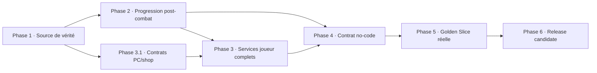

# PokeMap MVP Closure Roadmap Implementation Plan

> **For agentic workers:** REQUIRED SUB-SKILL: Use superpowers:subagent-driven-development (recommended) or superpowers:executing-plans to implement this plan task-by-task. Steps use checkbox (`- [ ]`) syntax for tracking.

**Goal:** Transformer le démonstrateur narratif Selbrume et les fondations gameplay existantes en un MVP fangame PokeMap réellement jouable sans code, vérifié de bout en bout et distribuable sur macOS.

**Architecture:** Conserver `map_core` comme source des contrats sérialisables, `map_gameplay` comme moteur de mutations et de progression pur, `map_battle` comme propriétaire des règles de combat, `map_runtime` comme intégration Flutter/Flame, `map_editor` comme authoring no-code et `playable_runtime_host` comme hôte de démonstration et de release. Les six phases ferment d'abord la vérité documentaire, puis la boucle post-combat et les services joueur, avant de câbler le no-code, de rejouer une vraie Golden Slice et de produire une release gate exécutable.

**Tech Stack:** Dart 3, Flutter, Flame, Freezed/JSON Serializable, `package:test`, tests Flutter, macOS desktop, formats projet et sauvegarde PokeMap.

**Execution workspace:** utiliser le workspace courant ; aucun worktree dédié n'est requis, conformément à la préférence utilisateur déjà donnée.

**Plan location:** le dossier `docs/` est ignoré par le dépôt ; cet artefact est
donc conservé sous `reports/gameplay/`, emplacement suivi prévu pour les
roadmaps et Evidence Packs gameplay.

---

## 1. Décision de périmètre

Cette roadmap vise le MVP global défini dans `pokemap_roadmap_mecaniques_fangame.md` :

```text
Un fangame court de 30 à 60 minutes, créable sans code,
jouable du New Game à la fin de l'histoire.
```

Selbrume reste le démonstrateur narratif canonique, mais devient aussi la preuve
produit de la boucle RPG minimale. Le plan ne vise pas la parité exhaustive avec
les jeux Pokémon modernes.

### Capacités obligatoires couvertes

| Capacité MVP | Phase de fermeture |
|---|---|
| New Game, starter, maps, PNJ, dialogues, cutscenes | Déjà fondés ; revalidés en Phase 5 |
| Wild encounter et capture | Phases 2 et 5 |
| Party pleine vers PC | Phases 3 et 5 |
| Trainer battle | Déjà fondé ; récompenses fermées en Phase 2 |
| XP, level-up, move learning | Phase 2 |
| Badge ou flag, Surf ou Cut | Phase 4 |
| Shop et centre de soin | Phases 3 et 4 |
| Save/load et mini-histoire | Phases 5 et 6 |
| Authoring no-code honnête | Phase 4 |
| Gate reproductible et package | Phase 6 |

### Non-objectifs conservés

- doubles et multi-battles produit ;
- Mega, Z-Moves, Dynamax, Tera et autres gimmicks ;
- breeding/daycare, online, concours, Battle Frontier ;
- Fly, Dive, Waterfall et toutes les capacités terrain avancées ;
- multi-slot cloud, packaging signé/notarié et parité multiplateforme ;
- polish artistique exhaustif ;
- UX avancée IV/EV/natures ;
- objets tenus, TM/HM et familles complètes de Balls au-delà du minimum requis.

L'évolution par niveau est incluse dans le chemin recommandé parce que `FG-047`
appartient au groupe canonique `FG-040` à `FG-049`. Si elle doit être différée,
la Phase 1 doit modifier explicitement le critère global et le rapport de scope ;
elle ne peut pas disparaître implicitement.

## 2. Baseline auditée le 2026-07-22

| Élément | Baseline |
|---|---|
| Branche | `main` |
| HEAD | `d95498768e49` |
| Worktree initial | propre |
| Upstream local | `main...origin/main [ahead 82]`, sans `fetch` de contrôle |
| Narrative Studio / Selbrume | GO technique borné |
| MVP fangame global | NO-GO |
| Checklist produit | 11 critères prouvés, 3 partiels, 5 manquants |
| Dashboard canonique | `DONE 7 · PARTIAL 0 · TODO 94`, avec doublon `FG-024` |
| Gates ciblées Core | `+17`, réussite |
| Analyses des six packages | réussite |
| Suites complètes gameplay / battle | `+303` / `+1722`, réussite |
| Suites Core / runtime / editor / host sous charge parallèle | échecs ; 12 suspects réussissent isolément |

### Causes du NO-GO à fermer

1. `PlayerPokemon` ne persiste ni XP ni PP actuels.
2. Le write-back combat persiste les PV et un flag trainer, mais pas la boucle de progression.
3. Shop, soin et PC existent seulement sous forme de briques pures ou de contrats non câblés.
4. `warp`, `openShop` et `openPc` sont publiables mais sans callback runtime de production.
5. `healParty`, `awardBadge` et `unlockFieldAbility` sont marqués unsupported.
6. Selbrume ne fournit aucune Poké Ball acquérable.
7. La Golden Slice globale forge plusieurs outcomes et appelle directement les mutations.
8. Readiness et Release Gate agrègent des preuves déclaratives sans les produire.
9. La roadmap, les rapports et le dashboard se contredisent.
10. Aucune exécution séquentielle unique, aucun package Selbrume autonome et aucun walkthrough humain complet ne ferment la release.

## 3. Ordre global et dépendances



Après la Phase 1, la Phase 2 et le seul sous-lot 3.1 peuvent être préparés en
parallèle dans des commits distincts. Les opérations de soin/Bag de 3.2 exigent
les PP et les calculateurs livrés en Phase 2 ; la suite des phases reste
séquentielle.

| Phase | Lots canoniques principaux | Sous-lots | Gate de sortie |
|---|---|---:|---|
| 1. Source de vérité | FG-180, FG-183, FG-184, FG-185 | 3 | Une seule définition MVP et aucun faux GO |
| 2. Progression post-combat | FG-020, FG-021, FG-040 à FG-049, FG-051 | 8 | Une victoire réelle persiste progression et récompenses |
| 3. Services joueur | FG-022 à FG-030, FG-060 à FG-063, FG-069 à FG-071 | 5 | Party/PC/Bag/shop/soin jouables |
| 4. Contrat no-code | FG-082, FG-085, FG-089 à FG-093 | 4 | Toute commande affichée est exécutable |
| 5. Golden Slice réelle | FG-014, FG-180 à FG-182 | 5 | Parcours Selbrume sans mutation directe ni outcome forgé |
| 6. Release candidate | FG-183 à FG-185, nouveau FG-186 proposé | 5 | Suites, build, package et walkthrough verts pour le même `releaseCandidateCommit` |

## 4. Règles d'exécution de chaque sous-lot

- Un sous-lot produit un commit autonome après autorisation Git explicite.
- Le test de comportement doit être écrit ou renforcé avant l'implémentation.
- Un test positif, un cas négatif, un garde-fou et une non-régression sont requis.
- Les fichiers générés sont régénérés uniquement dans le package modifié.
- Un statut canonique n'est promu qu'après tests ciblés, suite package et analyse fraîche.
- Un test qui construit `passed` manuellement ne constitue jamais une preuve produit.
- Une commande no-code ne peut être affichée comme supportée si le runtime ne la consomme pas.
- Les suites de release sont lancées séquentiellement afin d'éviter la contention observée.
- Chaque rapport de lot contient l'état Git initial/final, les commandes exactes et les limites conservées.

---

# Phase 1 — Réconcilier la source de vérité

**Objectif :** empêcher la roadmap, les rapports et les tests de déclarer un GO
qui ne correspond pas aux capacités réellement accessibles au joueur.

## Task 1.1 — FG-184 : rendre le dashboard strict sur les identifiants

**Files:**

- Modify: `packages/map_core/lib/src/tooling/gameplay_roadmap_dashboard.dart`
- Modify: `packages/map_core/tool/generate_gameplay_roadmap_dashboard.dart`
- Modify: `packages/map_core/test/gameplay_roadmap_dashboard_test.dart`
- Create: `packages/map_core/test/gameplay_roadmap_repository_consistency_test.dart`

- [ ] **Step 1:** Ajouter un test rouge qui charge la roadmap réelle et refuse les identifiants dupliqués, notamment `FG-024`.
- [ ] **Step 2:** Ajouter un test rouge qui rend une contradiction explicite entre statut canonique et rapports au lieu de promouvoir silencieusement le lot.
- [ ] **Step 3:** Faire du statut de la roadmap la source canonique ; les rapports restent des propositions de statut et des preuves.
- [ ] **Step 4:** Ajouter `--check` au CLI avec exit code non nul sur doublon, ligne invalide ou contradiction.
- [ ] **Step 5:** Exécuter :

```bash
cd packages/map_core
dart test test/gameplay_roadmap_dashboard_test.dart test/gameplay_roadmap_repository_consistency_test.dart
dart run tool/generate_gameplay_roadmap_dashboard.dart --check ../..
dart analyze
```

Expected: tous les tests passent, `--check` réussit seulement après correction des incohérences.

- [ ] **Step 6:** Commit proposé : `fix(gameplay): make roadmap status checks authoritative`.

## Task 1.2 — FG-185 : rétablir une gate honnête

**Files:**

- Modify: `packages/map_core/lib/src/read_models/mvp_release_gate.dart`
- Modify: `packages/map_core/test/mvp_release_gate_test.dart`
- Modify: `reports/gameplay/fg_185_mvp_release_gate_v0.md`
- Modify: `reports/gameplay/fg_180_185_phase_10_playable_game_validation_completion.md`
- Modify: `pokemap_roadmap_mecaniques_fangame.md`

- [ ] **Step 1:** Ajouter un test qui prouve qu'une simple liste de cinq constantes `passed` ne peut pas être présentée comme receipt exécutable.
- [ ] **Step 2:** Conserver l'agrégateur pur, mais distinguer `declaredEvidence` de `executedEvidence` dans son contrat.
- [ ] **Step 3:** Reclasser FG-185 en `PARTIAL / NO-GO` tant que la Phase 6 ne fournit pas un receipt exécuté.
- [ ] **Step 4:** Corriger le rapport de Phase 10 pour séparer le commit technique `c1bc49b21` de la clôture documentaire `d95498768`.
- [ ] **Step 5:** Ne promouvoir aucun autre FG pendant cette tâche ; les réconciliations positives exigent leurs propres preuves fraîches.
- [ ] **Step 6:** Exécuter :

```bash
cd packages/map_core
dart test test/mvp_release_gate_test.dart test/project_gameplay_readiness_test.dart
dart analyze
```

Expected: l'agrégateur reste fail-closed et le scénario documentaire seul reste NO-GO.

- [ ] **Step 7:** Commit proposé : `docs(gameplay): restore an honest MVP release baseline`.

## Task 1.3 — Geler les contrats transversaux

**Files:**

- Create: `reports/gameplay/fg_000_mvp_closure_contract_2026-07-22.md`
- Modify: `pokemap_roadmap_mecaniques_fangame.md`

- [ ] **Step 1:** Écrire la matrice des 19 critères avec `SUPPORTED`, `PARTIAL` ou `BLOCKED` et une source de preuve par ligne.
- [ ] **Step 2:** Fixer les décisions suivantes : XP totale persistée, PP actuels persistés, évolution niveau-only, storage par boxes, shop à stock projet, badge typé et Surf comme field gate MVP.
- [ ] **Step 3:** Remplacer, après approbation explicite du scope, les plages globales trop larges du type « tous FG-060 à FG-071 » par les lots exacts nécessaires aux 19 critères.
- [ ] **Step 4:** Classer explicitement `DEFERRED` les lots non requis comme Repel, familles complètes de Balls, Fishing, Headbutt, field moves avancés et rematchs ; ne jamais les marquer `DONE` par raccourci.
- [ ] **Step 5:** Réauditer les fondations FG-010 à FG-016, FG-024, FG-026, FG-027, FG-140, FG-141, FG-160 et FG-163 et ne proposer `DONE` qu'avec leurs tests existants réellement verts.
- [ ] **Step 6:** Vérifier que chaque critère possède une phase et un test d'acceptation dans ce plan.
- [ ] **Step 7:** Commit proposé : `docs(gameplay): freeze MVP closure contracts`.

**Gate Phase 1 :** roadmap sans doublon, FG-185 honnêtement partiel, périmètre
signé et aucune promotion de statut non prouvée.

---

# Phase 2 — Fermer la progression post-combat

**Objectif :** faire d'un combat une vraie transition persistante de la party,
des récompenses et de la progression Pokémon.

## Contrats cibles

```dart
PlayerPokemon(
  experience: null, // sentinel legacy jusqu'à hydratation catalogue
  knownMoveIds: const [],
  currentPpByMoveId: null, // sentinel legacy ; map vide = aucun move
  statusId: '',
)
```

```dart
BattleProgressionResult(
  pokemonUpdatesByPartyIndex: ...,
  moneyAwarded: ...,
  itemGrants: ...,
  badgeIds: ...,
  unlockedFieldAbilities: ...,
  messages: ...,
  pendingMoveLearning: ...,
  pendingEvolution: ...,
)
```

`experience == null` est un état de migration : le runtime l'hydrate au minimum
d'XP correspondant au niveau sauvegardé avant tout gain. `currentPpByMoveId ==
null` est également hydraté depuis les PP max du catalogue. Une fois le
`GameState` jouable construit, les deux champs sont non null et sauvegardés.
`maxPp` et les statistiques maximales restent dérivés des catalogues.

## Task 2.1 — FG-020 / FG-021 / FG-040 : étendre la persistance PlayerPokemon

**Files:**

- Modify: `packages/map_core/lib/src/models/save_data.dart`
- Regenerate: `packages/map_core/lib/src/models/save_data.freezed.dart`
- Regenerate: `packages/map_core/lib/src/models/save_data.g.dart`
- Modify: `packages/map_core/test/save_data_test.dart`
- Modify: `packages/map_core/test/game_state_persistence_test.dart`
- Create: `packages/map_runtime/lib/src/application/runtime_player_pokemon_progression_hydrator.dart`
- Create: `packages/map_runtime/test/runtime_player_pokemon_progression_hydrator_test.dart`
- Modify: `packages/map_runtime/lib/src/presentation/flame/playable_map_game.dart`
- Create: `reports/gameplay/fg_040_battle_persistence_contract_v0.md`

- [ ] **Step 1:** Caractériser le JSON legacy sans `experience` et sans `currentPpByMoveId`.
- [ ] **Step 2:** Ajouter `int? experience` et `Map<String, int>? currentPpByMoveId` ; `null` signifie legacy non hydraté, pas zéro.
- [ ] **Step 3:** Hydrater l'XP au seuil minimal du niveau courant après chargement du growth rate, et les PP au maximum catalogue après chargement des moves.
- [ ] **Step 4:** Ajouter la non-régression « Pokémon legacy niveau 16 sans XP ne régresse jamais et ne repasse jamais niveau 1 ».
- [ ] **Step 5:** Rejeter XP négative, PP négatifs, clé de move vide et PP attachés à une attaque inconnue après hydratation.
- [ ] **Step 6:** Régénérer dans `packages/map_core` :

```bash
dart run build_runner build --delete-conflicting-outputs
dart test test/save_data_test.dart test/game_state_persistence_test.dart
dart analyze
```

- [ ] **Step 7:** Vérifier l'hydratation runtime :

```bash
cd packages/map_runtime
flutter test test/runtime_player_pokemon_progression_hydrator_test.dart
flutter analyze
```

- [ ] **Step 8:** Commit proposé : `feat(core): persist Pokemon experience and PP`.

## Task 2.2 — FG-041 / FG-042 : write-back PP et statuts

**Files:**

- Modify: `packages/map_runtime/lib/src/application/runtime_battle_combatant_seed_builder.dart`
- Modify: `packages/map_runtime/lib/src/application/runtime_battle_outcome_apply.dart`
- Modify: `packages/map_runtime/lib/src/application/runtime_psdk_battle_session_adapter.dart`
- Create: `packages/map_runtime/lib/src/application/runtime_battle_status_bridge.dart`
- Modify: `packages/map_runtime/test/runtime_battle_setup_mapper_test.dart`
- Modify: `packages/map_runtime/test/runtime_battle_outcome_apply_test.dart`
- Modify: `packages/map_runtime/test/p5_gameplay_save_load_beta_roundtrip_test.dart`

- [ ] **Step 1:** Tester le seed des PP sauvegardés vers chaque `BattleMove`.
- [ ] **Step 2:** Tester les ponts `par`, `brn`, `psn`, `tox`, `slp` et `frz` dans les deux sens.
- [ ] **Step 3:** Réécrire HP, PP et statut de chaque `lineupIndex` sur le slot party exact après victoire, défaite et fuite.
- [ ] **Step 4:** Tester deux membres engagés avec switch et laisser les membres non engagés inchangés.
- [ ] **Step 5:** Tester save/reload après combat.
- [ ] **Step 6:** Exécuter :

```bash
cd packages/map_runtime
flutter test test/runtime_battle_setup_mapper_test.dart test/runtime_battle_outcome_apply_test.dart test/p5_gameplay_save_load_beta_roundtrip_test.dart
flutter analyze
```

- [ ] **Step 7:** Commit proposé : `feat(runtime): persist battle PP and major status`.

## Task 2.3 — FG-043 / FG-051 : modèle de récompense

**Files:**

- Create: `packages/map_gameplay/lib/src/battle_reward.dart`
- Modify: `packages/map_gameplay/lib/map_gameplay.dart`
- Create: `packages/map_gameplay/test/battle_reward_model_test.dart`
- Modify: `packages/map_core/lib/src/models/project_trainer.dart`
- Regenerate: `packages/map_core/lib/src/models/project_trainer.freezed.dart`
- Regenerate: `packages/map_core/lib/src/models/project_trainer.g.dart`
- Modify: `packages/map_runtime/lib/src/application/runtime_pokemon_species_loader.dart`
- Modify: `packages/map_runtime/test/runtime_pokemon_species_loader_test.dart`

- [ ] **Step 1:** Définir un `BattleReward` pur : XP par slot, argent, items, flags, badge et field unlock optionnels.
- [ ] **Step 2:** Étendre les trainers avec `moneyReward`, grants d'items et flags idempotents.
- [ ] **Step 3:** Charger réellement `growthRateId`, `baseExp` et `catchRate` depuis les catalogues.
- [ ] **Step 4:** Garder `map_gameplay` indépendant de `map_battle` ; le runtime transforme un outcome en reward.
- [ ] **Step 5:** Tester JSON legacy, trainer sans récompense et données catalogue absentes.
- [ ] **Step 6:** Commit proposé : `feat(gameplay): add typed battle reward contracts`.

## Task 2.4 — FG-044 / FG-045 : XP et level-up

**Files:**

- Create: `packages/map_gameplay/lib/src/pokemon_experience_curve.dart`
- Create: `packages/map_gameplay/lib/src/pokemon_stat_calculator.dart`
- Create: `packages/map_gameplay/lib/src/battle_progression_service.dart`
- Modify: `packages/map_gameplay/lib/src/game_state_mutations.dart`
- Create: `packages/map_gameplay/test/pokemon_experience_curve_test.dart`
- Create: `packages/map_gameplay/test/battle_progression_service_test.dart`
- Modify: `packages/map_gameplay/test/battle_reward_operations_test.dart`
- Modify: `packages/map_battle/lib/src/battle_state.dart`
- Modify: `packages/map_battle/lib/src/battle_session.dart`
- Modify: `packages/map_battle/test/battle_switch_test.dart`

- [ ] **Step 1:** Suivre les slots party ayant réellement participé, y compris après switch.
- [ ] **Step 2:** Calculer l'XP à partir du niveau adverse, de `baseExp` et du profil de croissance.
- [ ] **Step 3:** Attribuer l'XP aux participants, sans Exp Share, même si un participant finit K.O.
- [ ] **Step 4:** Gérer plusieurs niveaux, le cap 100 et la conservation du dommage lors du recalcul des PV max.
- [ ] **Step 5:** N'attribuer aucune récompense en défaite ou fuite.
- [ ] **Step 6:** Supprimer l'usage produit de `levelUpsByPartyIndex` fourni arbitrairement par l'appelant.
- [ ] **Step 7:** Tester wild, trainer, switch, participant K.O., multi-level, cap et save/reload.
- [ ] **Step 8:** Commit proposé : `feat(gameplay): apply XP and level progression`.

## Task 2.5 — FG-046 : apprentissage d'attaque

**Files:**

- Create: `packages/map_gameplay/lib/src/battle_progression_result.dart`
- Modify after Task 2.4 creates it: `packages/map_gameplay/lib/src/battle_progression_service.dart`
- Modify: `packages/map_runtime/lib/src/application/runtime_pokemon_learnset_loader.dart`
- Modify: `packages/map_runtime/test/runtime_pokemon_learnset_loader_test.dart`
- Create: `packages/map_gameplay/test/battle_move_learning_test.dart`

- [ ] **Step 1:** Charger toutes les attaques `levelUp` franchies entre ancien et nouveau niveau.
- [ ] **Step 2:** Ajouter automatiquement une attaque si moins de quatre sont connues, avec PP max.
- [ ] **Step 3:** Produire `pendingMoveLearning` si quatre attaques sont connues.
- [ ] **Step 4:** Ajouter une décision runtime apprendre/remplacer/refuser ; aucun remplacement silencieux.
- [ ] **Step 5:** Tester doublon, multi-level, acceptation, refus et remplacement.
- [ ] **Step 6:** Conserver FG-046 `PARTIAL` jusqu'au backend de présentation livré en Task 2.8.
- [ ] **Step 7:** Commit proposé : `feat(gameplay): support move learning on level up`.

## Task 2.6 — FG-047 : évolution niveau-only

**Files:**

- Create: `packages/map_gameplay/lib/src/pokemon_evolution_service.dart`
- Create: `packages/map_gameplay/test/pokemon_evolution_service_test.dart`
- Create: `packages/map_runtime/lib/src/application/runtime_pokemon_evolution_loader.dart`
- Create: `packages/map_runtime/test/runtime_pokemon_evolution_loader_test.dart`
- Modify after Task 2.5 creates it: `packages/map_gameplay/lib/src/battle_progression_result.dart`

- [ ] **Step 1:** Charger uniquement les évolutions par niveau pour le MVP.
- [ ] **Step 2:** Produire une décision `pendingEvolution` après les level-ups et move learnings.
- [ ] **Step 3:** Préserver nature, capacité compatible, IV, EV, shiny, objet, moves et ratio de PV.
- [ ] **Step 4:** Tester acceptation, refus, absence d'évolution et niveau franchi par plusieurs niveaux.
- [ ] **Step 5:** Conserver FG-047 `PARTIAL` jusqu'au backend de présentation livré en Task 2.8.
- [ ] **Step 6:** Commit proposé : `feat(gameplay): add level based evolution flow`.

## Task 2.7 — FG-049 : formule de capture

**Files:**

- Create: `packages/map_battle/lib/src/capture_formula.dart`
- Modify: `packages/map_battle/lib/src/battle_setup.dart`
- Modify: `packages/map_battle/lib/src/battle_session.dart`
- Modify: `packages/map_battle/lib/src/battle_resolution.dart`
- Create: `packages/map_battle/test/battle_capture_formula_test.dart`
- Modify: `packages/map_battle/test/battle_session_test.dart`
- Modify: `packages/map_runtime/lib/src/application/runtime_battle_setup_mapper.dart`
- Modify: `packages/map_runtime/lib/src/application/runtime_psdk_battle_session_adapter.dart`
- Modify: `packages/map_runtime/lib/src/application/runtime_battle_outcome_apply.dart`
- Modify: `packages/map_runtime/lib/src/presentation/flame/playable_map_game.dart`

- [ ] **Step 1:** Tester une formule déterministe utilisant HP/maxHP, `catchRate`, multiplicateur Ball et bonus statut.
- [ ] **Step 2:** Figer le contrat MVP `poke-ball = 1.0` ; aucune autre famille de Ball n'est inférée depuis du texte de catalogue.
- [ ] **Step 3:** Injecter exclusivement `BattleRng` ; échec continue le combat, succès produit `captured`.
- [ ] **Step 4:** Consommer une Ball à chaque tentative, succès ou échec, sans double consommation au write-back.
- [ ] **Step 5:** Refuser la capture trainer et préserver provisoirement la destination flat-storage existante ; les boxes et la saturation sont fermées en Task 3.2.
- [ ] **Step 6:** Aligner chemin legacy et adaptateur PSDK sur la même règle.
- [ ] **Step 7:** Commit proposé : `feat(battle): add deterministic capture formula`.

## Task 2.8 — FG-048 / FG-051 : orchestration et présentation

**Files:**

- Create: `packages/map_runtime/lib/src/application/runtime_battle_reward_resolver.dart`
- Create: `packages/map_runtime/test/runtime_battle_reward_resolver_test.dart`
- Create: `packages/map_runtime/lib/src/application/runtime_post_battle_decision_coordinator.dart`
- Create: `packages/map_runtime/test/runtime_post_battle_decision_coordinator_test.dart`
- Create: `packages/map_runtime/lib/src/presentation/flame/post_battle_progression_overlay_component.dart`
- Create: `packages/map_runtime/test/post_battle_progression_overlay_component_test.dart`
- Modify: `packages/map_runtime/lib/src/presentation/flame/playable_map_game.dart`
- Modify: `packages/map_runtime/lib/src/presentation/flame/battle_overlay_component.dart`
- Modify: `packages/map_runtime/test/battle_overlay_component_test.dart`

- [ ] **Step 1:** Appliquer dans l'ordre HP/PP/statuts, issue, XP, niveaux, moves, évolution, argent/items/flags, trainer defeated et messages.
- [ ] **Step 2:** Présenter les décisions apprendre/remplacer/refuser une attaque et accepter/refuser une évolution avant de finaliser l'état.
- [ ] **Step 3:** Verrouiller l'input combat/overworld pendant la queue et restaurer proprement le contrôle après la dernière décision.
- [ ] **Step 4:** Rendre l'application transactionnelle : une erreur ne laisse pas une moitié de récompense persistée.
- [ ] **Step 5:** Afficher chaque changement critique et la destination d'une capture.
- [ ] **Step 6:** Tester victoire, défaite, fuite, capture, multi-level, acceptation/refus/remplacement, évolution et erreur de catalogue.
- [ ] **Step 7:** Commit proposé : `feat(runtime): orchestrate post battle progression`.

**Gate Phase 2 :** un combat réel modifie et persiste HP, PP, statut, XP,
niveaux, moves, évolution et récompenses, et la formule de capture produit une
issue honnête. La destination box et le cas storage plein restent bloqués jusqu'à
la Gate Phase 3.

---

# Phase 3 — Rendre les services joueur utilisables

**Objectif :** fermer Party, PC, Bag, shop et soin comme parcours joueur réels.

## Task 3.1 — FG-022 / FG-030 / FG-069 : contrats persistants

**Files:**

- Modify: `packages/map_core/lib/src/models/save_data.dart`
- Modify: `packages/map_core/lib/src/models/project_manifest.dart`
- Create: `packages/map_core/lib/src/models/shop_definition.dart`
- Create: `packages/map_core/lib/src/models/badge_definition.dart`
- Create generated: `packages/map_core/lib/src/models/shop_definition.freezed.dart`
- Create generated: `packages/map_core/lib/src/models/shop_definition.g.dart`
- Create generated: `packages/map_core/lib/src/models/badge_definition.freezed.dart`
- Create generated: `packages/map_core/lib/src/models/badge_definition.g.dart`
- Regenerate: `packages/map_core/lib/src/models/save_data.freezed.dart`
- Regenerate: `packages/map_core/lib/src/models/save_data.g.dart`
- Regenerate: `packages/map_core/lib/src/models/project_manifest.freezed.dart`
- Regenerate: `packages/map_core/lib/src/models/project_manifest.g.dart`
- Modify: `packages/map_core/lib/src/operations/project_json_migrations.dart`
- Modify: `packages/map_core/lib/src/operations/game_state_persistence.dart`
- Modify: `packages/map_core/lib/map_core.dart`
- Create: `packages/map_core/test/shop_definition_test.dart`
- Create: `packages/map_core/test/badge_definition_test.dart`
- Modify: `packages/map_core/test/game_state_persistence_test.dart`
- Modify: `packages/map_core/test/project_json_migrations_test.dart`

- [ ] **Step 1:** Migrer `storedPokemon` vers des boxes à ID stable, capacité et ordre déterministes.
- [ ] **Step 2:** Ajouter un shop projet : ID, label, entrées item/prix et validation de références.
- [ ] **Step 3:** Ajouter `BadgeDefinition` au manifeste : ID stable, label, icône optionnelle et field ability optionnelle pour alimenter les pickers.
- [ ] **Step 4:** Garantir round-trip legacy sans perte et refuser boxes, shops ou badges invalides.
- [ ] **Step 5:** Réutiliser `TrainerProfile.badgeIds` et les field abilities existantes ; ne pas créer un second registre d'acquisition.
- [ ] **Step 6:** Régénérer Core, tester et analyser.
- [ ] **Step 7:** Exécuter :

```bash
cd packages/map_core
dart run build_runner build --delete-conflicting-outputs
dart test test/game_state_persistence_test.dart test/project_json_migrations_test.dart test/shop_definition_test.dart test/badge_definition_test.dart
dart analyze
```

- [ ] **Step 8:** Commit proposé : `feat(core): add PC boxes shops and badge definitions`.

## Task 3.2 — FG-023 / FG-024 / FG-025 / FG-028 / FG-060 / FG-062 / FG-063 / FG-071 : opérations pures

**Files:**

- Modify: `packages/map_gameplay/lib/src/game_state_mutations.dart`
- Create: `packages/map_gameplay/lib/src/player_storage_operations.dart`
- Modify: `packages/map_gameplay/lib/map_gameplay.dart`
- Create: `packages/map_gameplay/test/player_storage_operations_test.dart`
- Create: `packages/map_gameplay/test/shop_operations_test.dart`
- Modify: `packages/map_gameplay/test/party_bag_heal_operations_test.dart`
- Modify: `packages/map_gameplay/test/capture_destination_operations_test.dart`

- [ ] **Step 1:** Ajouter dépôt, retrait, swap Party/Box, déplacement Box/Box et changement de lead atomiques.
- [ ] **Step 2:** Limiter la party à six et interdire le retrait du dernier Pokémon utilisable si la règle l'exige.
- [ ] **Step 3:** Retourner des résultats d'erreur typés sans mutation partielle.
- [ ] **Step 4:** Étendre le soin à HP, statut et PP persistés.
- [ ] **Step 5:** Protéger achat inconnu, quantité invalide, fonds insuffisants et stock éventuel.
- [ ] **Step 6:** Tester explicitement capture party pleine vers première box disponible et erreur typée quand toutes les boxes sont pleines.
- [ ] **Step 7:** Commit proposé : `feat(gameplay): add player service operations`.

## Task 3.3 — FG-026 / FG-027 / FG-029 / FG-061 / FG-070 / FG-071 : UI joueur

**Files:**

- Modify: `examples/playable_runtime_host/lib/src/in_game_menu.dart`
- Create: `examples/playable_runtime_host/lib/src/in_game_shop_page.dart`
- Create: `examples/playable_runtime_host/lib/src/in_game_pc_page.dart`
- Create: `examples/playable_runtime_host/lib/src/in_game_heal_flow.dart`
- Modify: `examples/playable_runtime_host/lib/main.dart`
- Modify: `examples/playable_runtime_host/test/in_game_menu_test.dart`
- Create: `examples/playable_runtime_host/test/in_game_shop_page_test.dart`
- Create: `examples/playable_runtime_host/test/in_game_pc_page_test.dart`
- Create: `examples/playable_runtime_host/test/in_game_heal_flow_test.dart`

- [ ] **Step 1:** Rendre Bag interactif pour potion, antidote et rappel avec picker de cible.
- [ ] **Step 2:** Permettre changement de lead et ordre dans Party, avec une fiche résumé affichant niveau, XP, statut, PV, moves et PP.
- [ ] **Step 3:** Ajouter dépôt, retrait et échange dans PC avec feedback.
- [ ] **Step 4:** Ajouter shop avec stock, prix, argent, quantité et résultat.
- [ ] **Step 5:** Ajouter le soin complet et le feedback de fin.
- [ ] **Step 6:** Faire passer toute mutation par `map_gameplay` et verrouiller l'input overworld pendant chaque écran.
- [ ] **Step 7:** Commit proposé : `feat(host): add interactive player services`.

## Task 3.4 — Valider et exposer les shops dans l'éditeur

**Files:**

- Create directory: `packages/map_editor/lib/src/features/gameplay/application/`
- Create directory: `packages/map_editor/lib/src/features/gameplay/presentation/`
- Create: `packages/map_editor/lib/src/features/gameplay/application/shop_editor_controller.dart`
- Create: `packages/map_editor/lib/src/features/gameplay/presentation/shop_editor_panel.dart`
- Modify: `packages/map_editor/lib/src/application/services/narrative_template_catalog.dart`
- Create: `packages/map_editor/test/shop_editor_controller_test.dart`
- Create: `packages/map_editor/test/shop_editor_panel_test.dart`

- [ ] **Step 1:** Ajouter création, renommage, suppression gardée et édition de stock par pickers catalogue.
- [ ] **Step 2:** Empêcher la suppression d'un shop référencé par une Scene sans choix explicite de réparation.
- [ ] **Step 3:** Éviter toute saisie manuelle d'ID dans le chemin normal.
- [ ] **Step 4:** Tester doublons, références cassées, prix négatif et sauvegarde/rechargement.
- [ ] **Step 5:** Commit proposé : `feat(editor): add guided shop authoring`.

## Task 3.5 — Intégration service runtime

**Files:**

- Create: `packages/map_runtime/lib/src/application/player_service_runtime_controller.dart`
- Create: `packages/map_runtime/test/player_service_runtime_controller_test.dart`
- Modify: `examples/playable_runtime_host/lib/main.dart`

- [ ] **Step 1:** Exposer des ports typés pour ouvrir shop/PC/soin sans dépendre des widgets host.
- [ ] **Step 2:** Attendre fermeture, annulation ou erreur avant de rendre l'input.
- [ ] **Step 3:** Synchroniser le `GameState` et la sauvegarde après mutation réussie.
- [ ] **Step 4:** Tester concurrence d'overlays, annulation et exception host.
- [ ] **Step 5:** Commit proposé : `feat(runtime): coordinate player service overlays`.

**Gate Phase 3 :** le joueur peut acheter, utiliser un soin, réorganiser sa
party, déposer/retirer un Pokémon et se soigner sans API de debug.

---

# Phase 4 — Rendre le contrat no-code honnête

**Objectif :** toute action publiée par Narrative Studio doit être validable et
exécutable par le runtime réel.

## Task 4.1 — FG-082 / FG-090 / FG-091 : brancher les commandes interactives

**Files:**

- Modify: `packages/map_runtime/lib/src/application/scene_runtime/scene_interactive_command_runtime_executor.dart`
- Modify: `packages/map_runtime/lib/src/application/scene_runtime/scene_runtime_host_callbacks.dart`
- Modify: `packages/map_runtime/lib/src/presentation/flame/playable_map_game.dart`
- Modify: `packages/map_runtime/lib/map_runtime.dart`
- Modify: `examples/playable_runtime_host/lib/main.dart`
- Modify: `packages/map_runtime/test/scene_interactive_command_runtime_executor_test.dart`
- Modify: `packages/map_runtime/test/narrative_command_save_load_integration_test.dart`
- Create: `packages/map_runtime/test/playable_map_game_scene_interactive_command_integration_test.dart`

- [ ] **Step 1:** Installer réellement `executeInteractiveCommand` dans `_buildSceneRuntimeHostCallbacks`.
- [ ] **Step 2:** Faire utiliser à `warp` le pipeline de transition de map existant.
- [ ] **Step 3:** Faire ouvrir shop et PC via le controller Phase 3.
- [ ] **Step 4:** Renvoyer un port Scene déclaré pour succès, annulation et erreur.
- [ ] **Step 5:** Tester save/reload après chaque commande et disparition du message « No interactive Scene command executor is installed ».
- [ ] **Step 6:** Commit proposé : `feat(runtime): execute interactive Scene commands`.

## Task 4.2 — FG-085 / FG-089 : conséquences gameplay manquantes

**Files:**

- Modify: `packages/map_core/lib/src/models/scene_consequence.dart`
- Modify: `packages/map_core/lib/src/read_models/narrative_command_catalog.dart`
- Modify: `packages/map_core/lib/src/runtime/scene_runtime_plan_builder.dart`
- Modify: `packages/map_core/lib/src/runtime/scene_runtime_dry_run_preview.dart`
- Modify: `packages/map_core/lib/src/diagnostics/scene_diagnostics.dart`
- Modify: `packages/map_core/lib/src/operations/narrative_symbolic_reachability_solver.dart`
- Modify: `packages/map_runtime/lib/src/application/scene_runtime/scene_consequence_runtime_writer.dart`
- Modify: `packages/map_core/test/narrative_command_catalog_test.dart`
- Modify: `packages/map_runtime/test/narrative_command_save_load_integration_test.dart`

- [ ] **Step 1:** Ajouter les variants canoniques `HealParty`, `AwardBadge` et `UnlockFieldAbility`.
- [ ] **Step 2:** Étendre sérialisation, preview, diagnostics, reachability et writer runtime.
- [ ] **Step 3:** Garantir idempotence sur Event consommé et badge/capacité déjà acquis.
- [ ] **Step 4:** Corriger les références FG du catalogue : heal `FG-085`, badge/field `FG-089`, warp `FG-090`, shop/PC `FG-091`.
- [ ] **Step 5:** Commit proposé : `feat(core): add canonical gameplay Scene consequences`.

## Task 4.3 — FG-093 : authoring guidé

**Files:**

- Modify: `packages/map_editor/lib/src/application/services/narrative_template_catalog.dart`
- Modify: `packages/map_editor/lib/src/ui/canvas/scenes/scene_action_builder.dart`
- Modify: `packages/map_editor/lib/src/ui/canvas/narrative_studio/narrative_command_palette.dart`
- Modify: `packages/map_editor/lib/src/ui/canvas/events_v2/event_builder_v2_product_route.dart`
- Modify: `packages/map_editor/test/scene_action_builder_test.dart`
- Modify: `packages/map_editor/test/ui/canvas/narrative_command_palette_test.dart`

- [ ] **Step 1:** Ajouter pickers projet pour shop, badge et field ability.
- [ ] **Step 2:** Afficher heal, badge et unlock uniquement quand le runtime courant déclare la capability.
- [ ] **Step 3:** Refuser publication si une référence est cassée ou si une commande n'a aucun backend exécutable.
- [ ] **Step 4:** Tester création, édition, round-trip, suppression de cible et migration legacy.
- [ ] **Step 5:** Commit proposé : `feat(editor): author executable gameplay commands`.

## Task 4.4 — Audit de parité catalogue/runtime

**Files:**

- Create: `packages/map_core/test/narrative_command_contract_parity_test.dart`
- Create: `packages/map_runtime/test/narrative_command_runtime_parity_test.dart`
- Create: `reports/gameplay/fg_082_093_narrative_command_runtime_parity.md`

- [ ] **Step 1:** Dans Core, parcourir tous les descriptors supportés et exiger modèle, sérialisation, diagnostics et plan.
- [ ] **Step 2:** Dans Runtime, exiger un writer ou handler exécutable et un port de sortie testé pour chaque commande déclarée supportée.
- [ ] **Step 3:** Exiger qu'une commande volontairement différée soit masquée ou étiquetée unsupported.
- [ ] **Step 4:** Ajouter les deux tests à la matrice rapide de release sans introduire de dépendance Core vers Runtime.
- [ ] **Step 5:** Commit proposé : `test(gameplay): enforce narrative command runtime parity`.

**Gate Phase 4 :** aucune commande visible comme supportée ne peut produire un
payload inexécutable ou tomber sur un callback absent.

---

# Phase 5 — Construire la vraie Golden Slice Selbrume

**Objectif :** remplacer l'auto-attestation synthétique par un parcours
`PlayableMapGame` où tous les changements viennent d'inputs joueur ou d'actions
authorées.

## Task 5.1 — Donner des Poké Balls par Narrative Studio

**Files:**

- Modify: `packages/map_editor/tool/seed_selbrume_canonical_narrative_content.dart`
- Regenerate: `selbrume/project.json`
- Modify: `selbrume/dialogues/mael_intro.yarn`
- Modify: `packages/map_editor/test/selbrume_canonical_narrative_seed_test.dart`
- Modify: `packages/map_runtime/test/selbrume_new_game_starter_integration_test.dart`
- Modify: `examples/playable_runtime_host/test/selbrume_player_journey_e2e_test.dart`

- [ ] **Step 1:** Ajouter `giveItem(poke-ball, 5)` dans le tronc commun authoré après les quatre chemins de starter/party.
- [ ] **Step 2:** Vérifier zéro Ball avant Maël, cinq après, sans duplication après interaction ou reload.
- [ ] **Step 3:** Vérifier overlay, consommation, capture party/box, Pokédex et save/reload.
- [ ] **Step 4:** Régénérer uniquement via le seed et vérifier `--check`.
- [ ] **Step 5:** Commit proposé : `feat(selbrume): author an obtainable capture flow`.

## Task 5.2 — Authorer shop, PC, soin, badge et Surf dans Selbrume

**Files:**

- Modify: `packages/map_editor/tool/seed_selbrume_canonical_narrative_content.dart`
- Regenerate: `selbrume/project.json`
- Modify: `selbrume/dialogues/mado.yarn`
- Modify: `selbrume/dialogues/mael_after_mission.yarn`
- Modify: `selbrume/dialogues/lysa_port.yarn`
- Modify: `selbrume/dialogues/ending_port.yarn`
- Modify: `packages/map_editor/test/selbrume_canonical_narrative_seed_test.dart`
- Modify: `packages/map_editor/test/selbrume_narrative_reconstruction_test.dart`

- [ ] **Step 1:** Ajouter une boutique minimale avec potion et antidote.
- [ ] **Step 2:** Ajouter un terminal PC et un centre de soin visibles sur une map existante.
- [ ] **Step 3:** Attribuer un badge ou flag puis Surf via conséquences canoniques après le combat prévu.
- [ ] **Step 4:** Ajouter un field gate Surf visible : passage refusé avant unlock et traversable après acquisition.
- [ ] **Step 5:** Ajouter une utilisation de `warp` authorée sans casser les connexions physiques existantes.
- [ ] **Step 6:** Faire reconstruire ces éléments par le harness no-code, sans JSON manuel.
- [ ] **Step 7:** Commit proposé : `feat(selbrume): author the MVP player services`.

## Task 5.3 — FG-182 : parcours joueur réel

**Files:**

- Modify: `examples/playable_runtime_host/test/selbrume_player_journey_e2e_test.dart`
- Create: `selbrume/walkthrough.json`
- Modify: `examples/playable_runtime_host/test/golden_fangame_slice_e2e_test.dart`
- Modify: `examples/playable_runtime_host/test/golden_fangame_slice_fixture_test.dart`
- Modify: `reports/gameplay/fg_182_golden_slice_end_to_end_smoke_v0.md`

- [ ] **Step 1:** Désigner Selbrume comme Golden Slice produit canonique.
- [ ] **Step 2:** Conserver l'ancienne fixture comme test de composition sans lui permettre de produire la readiness.
- [ ] **Step 3:** Piloter New Game, Maël, starter, Balls, déplacement, rencontre, capture, Lysa, shop, Bag, Party, PC, soin, badge, Surf, phare, save/reload et épilogue.
- [ ] **Step 4:** Injecter un RNG déterministe par les ports de test publics afin que la capture reste réelle mais non flaky.
- [ ] **Step 5:** Tester une seconde capture avec party pleine, destination box visible, puis retrait depuis le PC.
- [ ] **Step 6:** Exiger un `BadgeDefinition` acquis, le refus du field gate avant Surf et sa traversée après unlock.
- [ ] **Step 7:** Interdire `_finishedOutcome`, setters debug, `GameStateMutations`, récompenses directes et `setFlag` dans le test d'acceptation.
- [ ] **Step 8:** Faire correspondre toutes les étapes de `walkthrough.json` dans l'ordre.
- [ ] **Step 9:** Commit proposé : `test(host): prove the real Selbrume MVP journey`.

## Task 5.4 — FG-180 : collecteur Readiness réel

**Files:**

- Create: `packages/map_core/lib/src/models/mvp_release_evidence_receipt.dart`
- Create: `packages/map_core/lib/src/read_models/mvp_product_criterion.dart`
- Modify: `packages/map_core/lib/map_core.dart`
- Modify: `packages/map_core/lib/src/read_models/project_gameplay_readiness.dart`
- Create: `packages/map_core/test/mvp_release_evidence_receipt_test.dart`
- Create: `packages/map_core/test/mvp_product_criterion_test.dart`
- Create: `examples/playable_runtime_host/lib/src/project_gameplay_readiness_collector.dart`
- Create: `examples/playable_runtime_host/lib/src/project_tree_digest.dart`
- Create: `examples/playable_runtime_host/tool/src/selbrume_mvp_journey_verifier.dart`
- Create: `examples/playable_runtime_host/test/project_gameplay_readiness_collector_test.dart`
- Create: `examples/playable_runtime_host/test/project_tree_digest_test.dart`

- [ ] **Step 1:** Garder Core pur et déplacer inspection disque/exécution dans le host.
- [ ] **Step 2:** Définir les 19 `MvpProductCriterion` et une table many-to-one explicite vers les checks Readiness existants.
- [ ] **Step 3:** Dériver les checks du projet et du journey verifier exécuté ; ne jamais les mapper automatiquement vers `passed`.
- [ ] **Step 4:** Faire émettre par le runner Selbrume un receipt machine de l'exécution réelle, consommable par le collector et le test.
- [ ] **Step 5:** Hasher de façon déterministe tout l'arbre projet requis — manifest, maps, dialogues, catalogs et assets — en excluant sauvegardes et répertoires de build.
- [ ] **Step 6:** Enregistrer commande, exit code, commit, timestamp, source, tree hash projet et critères observés.
- [ ] **Step 7:** Échouer sur source absente, commit différent, check manquant, critère non mappé ou preuve dupliquée.
- [ ] **Step 8:** Commit proposé : `feat(host): collect executable gameplay readiness evidence`.

## Task 5.5 — FG-014 : transaction de chargement sûre

**Files:**

- Modify: `packages/map_runtime/lib/src/presentation/flame/playable_map_game.dart`
- Modify: `packages/map_runtime/lib/src/infrastructure/file_game_save_repository.dart`
- Create: `packages/map_runtime/test/playable_map_game_save_load_transaction_test.dart`
- Modify: `packages/map_runtime/test/file_game_save_repository_test.dart`
- Modify: `packages/map_runtime/test/p6_selbrume_save_load_golden_slice_test.dart`

- [ ] **Step 1:** Caractériser un chargement valide, un JSON corrompu, une map absente et une exception pendant la reconstruction.
- [ ] **Step 2:** Lire, migrer et valider la sauvegarde ainsi que la map cible avant de détruire le monde courant.
- [ ] **Step 3:** Appliquer le nouveau monde comme une transaction ; sur échec, conserver l'ancien monde, l'input et le dernier état sauvegardable.
- [ ] **Step 4:** Afficher une erreur utilisateur actionnable sans supprimer ni écraser la sauvegarde fautive.
- [ ] **Step 5:** Vérifier le parcours save/reload Selbrume après un échec injecté puis une nouvelle tentative réussie.
- [ ] **Step 6:** Commit proposé : `fix(runtime): make game loading transactional`.

**Gate Phase 5 :** Selbrume traverse naturellement la checklist MVP, sauvegarde
au milieu du parcours et termine l'histoire sans mutation de test.

---

# Phase 6 — Produire une release candidate vérifiable

**Objectif :** exécuter, construire, empaqueter et faire jouer exactement le
même `releaseCandidateCommit` et le même tree hash projet avant de déclarer GO.

La phase distingue deux commits pour éviter une boucle de preuve impossible :

- `releaseCandidateCommit` contient le code et Selbrume ; il est testé, construit
  et empaqueté sans changement de worktree ;
- `evidenceCommit` ajoute ensuite les receipts et rapports qui référencent le
  SHA, le tree hash et le package issus de `releaseCandidateCommit`.

Le second commit ne prétend pas avoir produit un nouveau package. Toute
modification de code ou de donnée après le candidat invalide les receipts et
impose un nouveau candidat.

## Task 6.1 — FG-185 : outil de vérification unique

**Files:**

- Create: `examples/playable_runtime_host/lib/src/mvp_release_evidence_collector.dart`
- Create: `examples/playable_runtime_host/lib/src/mvp_release_command_matrix.dart`
- Create: `examples/playable_runtime_host/lib/src/human_walkthrough_receipt_validator.dart`
- Create: `examples/playable_runtime_host/tool/verify_mvp_release.dart`
- Create: `examples/playable_runtime_host/test/mvp_release_evidence_collector_test.dart`
- Create: `examples/playable_runtime_host/test/mvp_release_command_matrix_test.dart`
- Create: `examples/playable_runtime_host/test/human_walkthrough_receipt_validator_test.dart`
- Modify after Task 5.4 creates it: `packages/map_core/lib/src/models/mvp_release_evidence_receipt.dart`
- Modify after Task 5.4 creates it: `packages/map_core/test/mvp_release_evidence_receipt_test.dart`
- Modify: `packages/map_core/lib/src/read_models/mvp_release_gate.dart`
- Modify: `packages/map_core/test/mvp_release_gate_test.dart`

- [ ] **Step 1:** Faire produire un receipt JSON et un résumé Markdown déterministes.
- [ ] **Step 2:** Définir deux payloads validés et versionnés : receipt automatisé et receipt de walkthrough humain.
- [ ] **Step 3:** Exiger `releaseCandidateCommit`, date, tree hash projet, package SHA, cwd, commande, exit code, durée et sources.
- [ ] **Step 4:** Exiger une preuve reliée pour chacun des 19 critères produit et chaque critère technique de release.
- [ ] **Step 5:** Retourner un code non nul dès qu'un critère échoue.
- [ ] **Step 6:** Refuser receipt périmé, autre candidat, tree hash différent, package différent ou preuve dupliquée.
- [ ] **Step 7:** Tester quick, full, échec de commande, preuve périmée, projet altéré et receipt humain mal formé.
- [ ] **Step 8:** Commit proposé : `feat(host): add executable MVP release gate`.

## Task 6.2 — FG-183 : matrice séquentielle

**Files:**

- Modify after Task 6.1 creates it: `examples/playable_runtime_host/lib/src/mvp_release_command_matrix.dart`
- Modify after Task 6.1 creates it: `examples/playable_runtime_host/tool/verify_mvp_release.dart`
- Modify: `reports/gameplay/fg_183_regression_matrix_v0.md`

- [ ] **Step 1:** Exécuter strictement, sans parallélisme : Core, Gameplay, Battle, Runtime, Editor, Host.
- [ ] **Step 2:** Pour chaque package, exécuter la suite complète puis l'analyse.
- [ ] **Step 3:** Ajouter les deux smokes runtime imposés par `AGENTS.md`, la Golden Slice et le seed Selbrume `--check`.
- [ ] **Step 4:** Arrêter au premier échec et conserver le log exact.
- [ ] **Step 5:** Après correction, créer un nouveau `releaseCandidateCommit` et recommencer toute la matrice sur ce candidat.
- [ ] **Step 6:** Commande finale attendue :

```bash
cd examples/playable_runtime_host
dart run tool/verify_mvp_release.dart --project ../../selbrume/project.json --full --output build/mvp-release/evidence.json
```

- [ ] **Step 7:** Commit proposé : `test(gameplay): add sequential MVP regression gate`.

## Task 6.3 — Build et package macOS Selbrume

**Files:**

- Create: `examples/playable_runtime_host/lib/src/bundled_runtime_project.dart`
- Modify: `examples/playable_runtime_host/lib/main.dart`
- Create: `examples/playable_runtime_host/tool/package_selbrume_macos.dart`
- Create: `examples/playable_runtime_host/test/bundled_runtime_project_test.dart`
- Create: `examples/playable_runtime_host/test/selbrume_release_package_test.dart`
- Modify: `examples/playable_runtime_host/macos/Runner/Configs/AppInfo.xcconfig`
- Modify: `examples/playable_runtime_host/README.md`

- [ ] **Step 1:** Construire `flutter build macos --release`.
- [ ] **Step 2:** Copier Selbrume dans les ressources après build sans créer de copie versionnée parallèle.
- [ ] **Step 3:** Refaire une signature ad hoc après copie et exiger `codesign --verify --deep --strict` ; signature Developer ID et notarisation restent post-MVP.
- [ ] **Step 4:** Résoudre le projet sans chemin absolu machine ni checkout du dépôt.
- [ ] **Step 5:** Produire archive et SHA-256 sous `build/mvp-release/`.
- [ ] **Step 6:** Tester présence de project, maps, dialogues, données Pokémon et assets.
- [ ] **Step 7:** Tester New Game, save, fermeture et reprise depuis le package.
- [ ] **Step 8:** Commit proposé : `build(host): package the Selbrume MVP for macOS`.

## Task 6.4 — Walkthrough humain reproductible

**Files:**

- Create: `reports/gameplay/selbrume_mvp_walkthrough_protocol.md`
- Create during execution: `reports/gameplay/selbrume_mvp_walkthrough_receipt.json`
- Create: `reports/gameplay/fg_186_selbrume_release_candidate_walkthrough.md`

- [ ] **Step 1:** Utiliser un profil macOS vierge et uniquement le package de Task 6.3.
- [ ] **Step 2:** Parcourir New Game jusqu'à l'épilogue avec une victoire, une défaite/reprise, une capture et un save/reload à mi-parcours.
- [ ] **Step 3:** Fermer et relancer l'application ; vérifier reprise, party, PC, Bag, flags et progression.
- [ ] **Step 4:** Prendre des captures aux checkpoints définis dans le protocole.
- [ ] **Step 5:** Associer receipt, `releaseCandidateCommit`, package SHA et tree hash complet du projet.
- [ ] **Step 6:** Refuser le GO s'il reste un P0/P1 ; documenter les P2/P3 acceptés et leur contournement.
- [ ] **Step 7:** Commit proposé : `test(gameplay): record the Selbrume release walkthrough`.

## Task 6.5 — Décision GO finale

**Files:**

- Modify: `reports/gameplay/fg_185_mvp_release_gate_v0.md`
- Modify: `reports/gameplay/fg_180_185_phase_10_playable_game_validation_completion.md`
- Modify: `pokemap_roadmap_mecaniques_fangame.md`

- [ ] **Step 1:** Faire consommer au gate les receipts automatisé et humain qui référencent le même `releaseCandidateCommit`, le même tree hash projet et le même package SHA.
- [ ] **Step 2:** Vérifier les 19 critères, les critères globaux FG et les exclusions signées.
- [ ] **Step 3:** Promouvoir seulement les lots soutenus par des preuves fraîches.
- [ ] **Step 4:** Générer le dashboard final et exiger zéro doublon/contradiction.
- [ ] **Step 5:** Vérifier `git diff --check` et un worktree contenant uniquement la clôture documentaire attendue.
- [ ] **Step 6:** Commit proposé : `docs(gameplay): approve the verified Selbrume MVP release`.

**Gate Phase 6 :** un même `releaseCandidateCommit` possède six suites et
analyses séquentielles vertes, deux builds macOS, un package Selbrume autonome,
un receipt automatisé et un walkthrough humain complet. L'`evidenceCommit`
ultérieur enregistre ces preuves et la roadmap cohérente sans modifier le code
ou les données du candidat.

---

## 5. Matrice de validation finale

### 5.1 Commandes ciblées minimales par sous-lot

Ces commandes complètent les commandes déjà écrites directement dans les Tasks.
Chaque commande est lancée depuis la racine indiquée, puis l'analyse du package
touché est obligatoire avant commit.

```text
Task 1.3  : cd packages/map_core
            dart run tool/generate_gameplay_roadmap_dashboard.dart --check ../..

Task 2.3  : cd packages/map_gameplay
            dart test test/battle_reward_model_test.dart
            cd ../map_runtime
            flutter test test/runtime_pokemon_species_loader_test.dart

Task 2.4  : cd packages/map_gameplay
            dart test test/pokemon_experience_curve_test.dart test/battle_progression_service_test.dart test/battle_reward_operations_test.dart
            cd ../map_battle
            dart test test/battle_switch_test.dart

Task 2.5  : cd packages/map_gameplay
            dart test test/battle_move_learning_test.dart
            cd ../map_runtime
            flutter test test/runtime_pokemon_learnset_loader_test.dart

Task 2.6  : cd packages/map_gameplay
            dart test test/pokemon_evolution_service_test.dart
            cd ../map_runtime
            flutter test test/runtime_pokemon_evolution_loader_test.dart

Task 2.7  : cd packages/map_battle
            dart test test/battle_capture_formula_test.dart test/battle_session_test.dart
            cd ../map_runtime
            flutter test test/runtime_battle_outcome_apply_test.dart

Task 2.8  : cd packages/map_runtime
            flutter test test/runtime_battle_reward_resolver_test.dart test/runtime_post_battle_decision_coordinator_test.dart test/post_battle_progression_overlay_component_test.dart test/battle_overlay_component_test.dart

Task 3.2  : cd packages/map_gameplay
            dart test test/player_storage_operations_test.dart test/shop_operations_test.dart test/party_bag_heal_operations_test.dart test/capture_destination_operations_test.dart

Task 3.3  : cd examples/playable_runtime_host
            flutter test test/in_game_menu_test.dart test/in_game_shop_page_test.dart test/in_game_pc_page_test.dart test/in_game_heal_flow_test.dart

Task 3.4  : cd packages/map_editor
            flutter test test/shop_editor_controller_test.dart test/shop_editor_panel_test.dart

Task 3.5  : cd packages/map_runtime
            flutter test test/player_service_runtime_controller_test.dart

Task 4.1  : cd packages/map_runtime
            flutter test test/scene_interactive_command_runtime_executor_test.dart test/narrative_command_save_load_integration_test.dart test/playable_map_game_scene_interactive_command_integration_test.dart

Task 4.2  : cd packages/map_core
            dart test test/narrative_command_catalog_test.dart
            cd ../map_runtime
            flutter test test/narrative_command_save_load_integration_test.dart

Task 4.3  : cd packages/map_editor
            flutter test test/scene_action_builder_test.dart test/ui/canvas/narrative_command_palette_test.dart

Task 4.4  : cd packages/map_core
            dart test test/narrative_command_contract_parity_test.dart
            cd ../map_runtime
            flutter test test/narrative_command_runtime_parity_test.dart

Task 5.1  : cd packages/map_editor
            dart run tool/seed_selbrume_canonical_narrative_content.dart --project-root ../../selbrume --check
            flutter test test/selbrume_canonical_narrative_seed_test.dart
            cd ../map_runtime
            flutter test test/selbrume_new_game_starter_integration_test.dart

Task 5.2  : cd packages/map_editor
            flutter test test/selbrume_canonical_narrative_seed_test.dart test/selbrume_narrative_reconstruction_test.dart

Task 5.3  : cd examples/playable_runtime_host
            flutter test test/selbrume_player_journey_e2e_test.dart test/golden_fangame_slice_e2e_test.dart test/golden_fangame_slice_fixture_test.dart

Task 5.4  : cd packages/map_core
            dart test test/mvp_release_evidence_receipt_test.dart test/mvp_product_criterion_test.dart test/project_gameplay_readiness_test.dart
            cd ../../examples/playable_runtime_host
            flutter test test/project_gameplay_readiness_collector_test.dart test/project_tree_digest_test.dart

Task 5.5  : cd packages/map_runtime
            flutter test test/playable_map_game_save_load_transaction_test.dart test/file_game_save_repository_test.dart test/p6_selbrume_save_load_golden_slice_test.dart

Task 6.1  : cd examples/playable_runtime_host
            flutter test test/mvp_release_evidence_collector_test.dart test/mvp_release_command_matrix_test.dart test/human_walkthrough_receipt_validator_test.dart

Task 6.2  : cd examples/playable_runtime_host
            dart run tool/verify_mvp_release.dart --project ../../selbrume/project.json --full --output build/mvp-release/evidence.json

Task 6.3  : cd examples/playable_runtime_host
            flutter test test/bundled_runtime_project_test.dart test/selbrume_release_package_test.dart
            dart run tool/package_selbrume_macos.dart --project ../../selbrume --release

Task 6.5  : cd packages/map_core
            dart test test/mvp_release_gate_test.dart test/gameplay_roadmap_dashboard_test.dart test/gameplay_roadmap_repository_consistency_test.dart
            dart run tool/generate_gameplay_roadmap_dashboard.dart --check ../..
```

### 5.2 Matrice exhaustive orchestrée

La liste ci-dessous spécifie la matrice interne de
`tool/verify_mvp_release.dart`. Elle n'est pas exécutée manuellement puis
relancée par le tool : le tool est l'unique orchestrateur et le seul producteur
du receipt. Il lance ces commandes séparément et séquentiellement depuis chaque
package.

```bash
cd packages/map_core
dart test
dart analyze
```

```bash
cd packages/map_gameplay
dart test
dart analyze
```

```bash
cd packages/map_battle
dart test
dart analyze
```

```bash
cd packages/map_runtime
flutter test
flutter analyze
flutter test test/phase_a_golden_battle_slice_smoke_test.dart
```

```bash
cd packages/map_editor
flutter test
flutter analyze
dart run tool/seed_selbrume_canonical_narrative_content.dart --project-root ../../selbrume --check
flutter build macos --release
```

```bash
cd examples/playable_runtime_host
flutter test
flutter analyze
flutter test test/phase_a_golden_slice_launch_test.dart
flutter test test/selbrume_player_journey_e2e_test.dart
flutter build macos --release
```

```bash
cd examples/playable_runtime_host
dart run tool/verify_mvp_release.dart --project ../../selbrume/project.json --full --walkthrough-receipt ../../reports/gameplay/selbrume_mvp_walkthrough_receipt.json
```

La dernière commande est donc la seule commande manuelle de gate finale.

Expected final: toutes les étapes internes retournent `0`, les tests annoncent
`All tests passed!`, les analyses annoncent `No issues found!`, les builds sont
créés et la release gate retourne `GO` avec zéro blocker.

## 6. Politique de statut

| Moment | FG-185 | Produit |
|---|---|---|
| Baseline de ce plan | `PARTIAL / NO-GO` proposé | Démonstrateur narratif technique |
| Après Phase 2 | `PARTIAL` | Progression RPG réelle |
| Après Phase 3 | `PARTIAL` | Services joueur réels |
| Après Phase 4 | `PARTIAL` | Authoring no-code honnête |
| Après Phase 5 | `PARTIAL / RC` | Golden Slice automatisée réelle |
| Après Phase 6 | `DONE / GO` seulement si toutes les gates passent | MVP fangame vérifié et empaqueté |

## 7. Risques et garde-fous

| Risque | Garde-fou |
|---|---|
| Migration des sauvegardes | Tests JSON legacy + round-trip avant chaque changement de schéma |
| Double système badge/flag | Un seul contrat partagé dans Core, projection narrative explicite |
| Divergence PSDK/legacy | Même formule de capture et même reward resolver |
| `PlayableMapGame` trop volumineux | Nouveaux coordinators ciblés ; pas de refactor global opportuniste |
| UI host couplée au runtime | Ports typés dans `map_runtime`, widgets dans le host pour le MVP |
| Commande editor mensongère | Test automatique de parité catalogue/runtime |
| Flakiness sous contention | Matrice de release séquentielle, rerun complet après correction |
| Faux GO documentaire | Receipts hashés liés au commit, projet et package |
| Selbrume modifié manuellement | Seed canonique et `--check`, reconstruction no-code |
| Scope qui dérive | Non-objectifs figés en Phase 1 et rappelés dans chaque Evidence Pack |

## 8. Passes de conception de cette roadmap

| Passe | Verdict |
|---|---|
| Audit / Architecture | Six phases suffisantes ; ne pas relancer les 94 lots sans réconciliation |
| Progression | Huit sous-lots requis pour persistance, XP, moves, évolution, capture et rewards |
| Services / No-code | Cinq sous-lots services puis quatre sous-lots de parité no-code |
| Tests / Release | Selbrume peut devenir la vraie Golden Slice sans réécriture complète du driver |
| Build / Validation | Package macOS et suites séquentielles nécessaires avant GO |
| Implémentation | Non commencée par ce document |
| Critique finale | PASS après correction de 4 P0 et 8 P1 : migration XP, dépendance boxes, UI post-combat, receipts, badges, parité packages, commits, matrice unique, Golden Slice, générés, Ball et chemins Yarn |

## 9. Handoff d'exécution

Ordre recommandé :

1. exécuter toute la Phase 1 ;
2. exécuter Phase 2 et fondations Phase 3 en commits séparés ;
3. fermer Phase 3 puis Phase 4 ;
4. transformer Selbrume en preuve Phase 5 ;
5. ne préparer le package et le walkthrough qu'après toutes les gates précédentes.

Chaque sous-lot doit utiliser `test-driven-development`, puis
`verification-before-completion`. Pour les phases 2 à 5, utiliser
`subagent-driven-development` avec une revue de conformité avant la revue de
qualité. Aucun push n'est inclus implicitement : il requiert une demande
explicite de l'utilisateur.

Deux modes d'exécution restent possibles :

1. **Subagent-Driven, recommandé** — un agent neuf par sous-lot, revue de
   conformité puis revue de qualité avant le commit suivant ;
2. **Inline Execution** — exécution séquentielle dans la même tâche avec un
   checkpoint utilisateur à la fin de chaque phase.

## 10. Evidence Pack de création de la roadmap

### Fichier créé

- `reports/gameplay/fg_000_pokemap_mvp_closure_roadmap_2026-07-22.md` — présent
  document complet ; aucun autre fichier produit n'a été modifié.

### Commandes de validation documentaire

```text
git status --short --branch --untracked-files=all
git rev-parse --short=12 HEAD
git diff --check
wc -l reports/gameplay/fg_000_pokemap_mvp_closure_roadmap_2026-07-22.md
validation script : chemins Modify/Regenerate existants, parents de Create,
                    fences Markdown, header writing-plans, numéros de tasks,
                    scan de placeholders
```

Résultats : baseline `main` à `d95498768e49`, worktree initial propre ; fences
Markdown équilibrées, header obligatoire présent, aucun placeholder interdit et
aucun chemin `Modify` réellement initial manquant après correction. Les tests
Dart/Flutter, analyses et builds ne sont pas applicables à la création de ce
document seul et n'ont pas été relancés.

### État Git attendu à la livraison de ce document

```text
## main...origin/main [ahead 82]
?? reports/gameplay/fg_000_pokemap_mvp_closure_roadmap_2026-07-22.md
```

### Limites conservées

- la roadmap ne constitue pas une implémentation ; tous les checkboxes restent ouverts ;
- les fichiers marqués `Create` devront être revérifiés au début de leur sous-lot ;
- les statuts canoniques ne sont pas modifiés par cet artefact ;
- la comparaison upstream est locale, aucun `git fetch` n'a été exécuté ;
- aucun commit ou push n'est réalisé sans nouvelle autorisation explicite.
