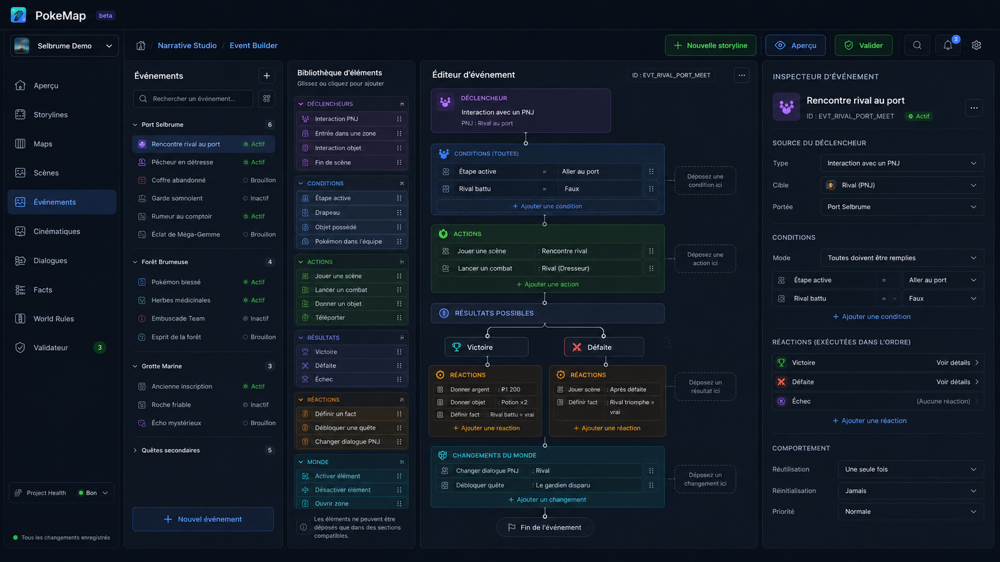
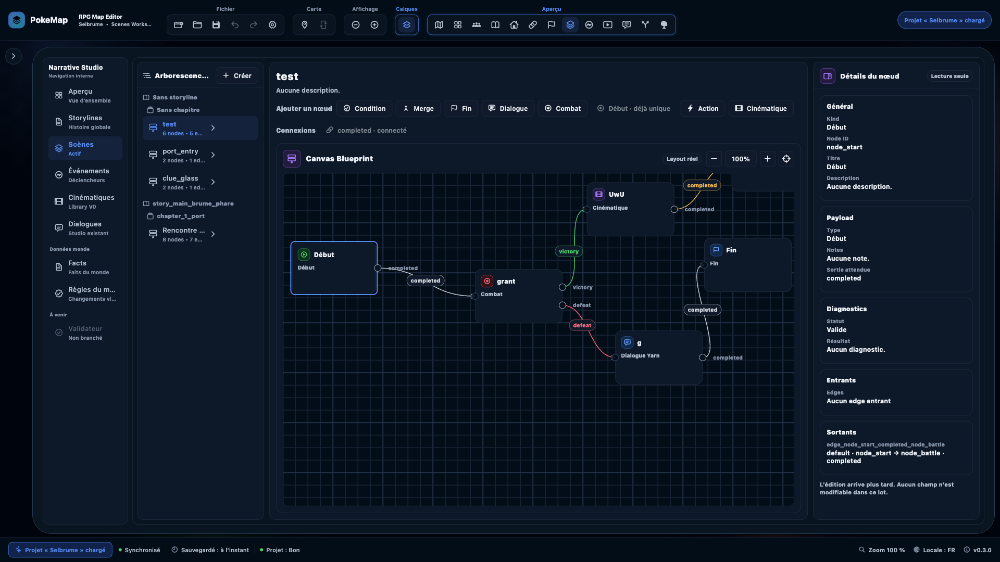
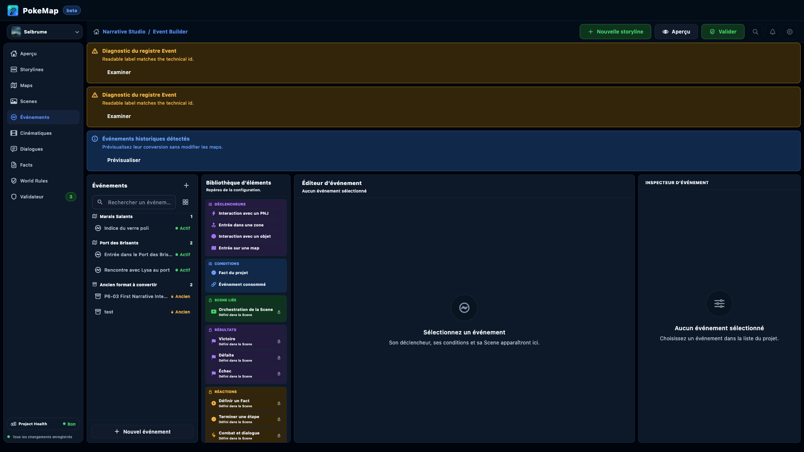
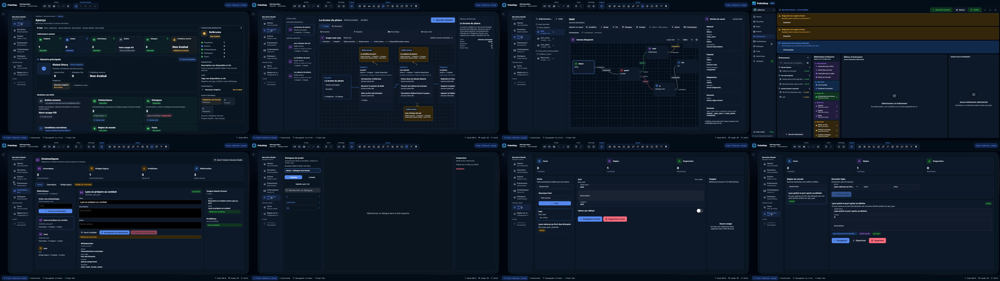
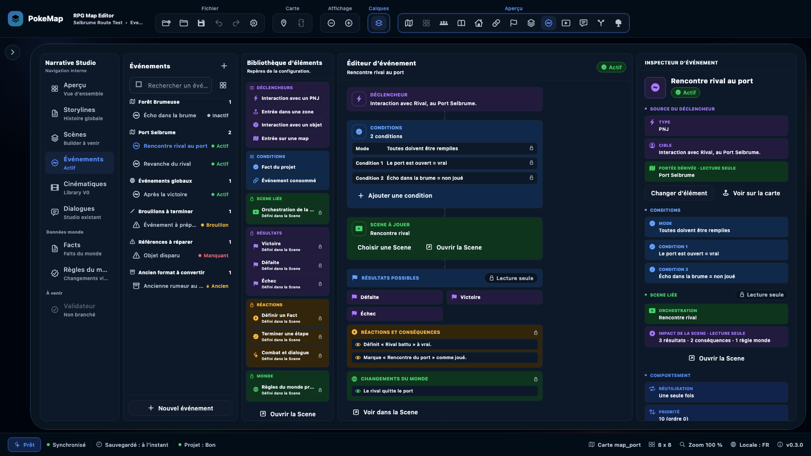

# NS-UI-01 — Audit de convergence visuelle du Narrative Studio

Date : 17 juillet 2026
Statut : **UI NO-GO confirmé — aucune implémentation réalisée**
Référence visuelle : Event Builder V2
Périmètre : Aperçu, Storylines, Scènes, Événements, Cinématiques, Dialogues, Facts, Règles du monde et Validateur.

## 1. Résumé exécutif

Le verdict UI NO-GO est justifié. La rupture ne vient pas d'une simple différence de couleurs : deux systèmes de produit sont montés dans la même application.

- Event Builder V2 remplace tout le chrome générique par une coque produit dédiée : marque, contexte projet, navigation unique, breadcrumb, actions et workspace plein écran.
- Les autres workspaces restent imbriqués dans le shell historique du RPG Map Editor : toolbar générique, grand îlot arrondi, explorateur externe, seconde navigation Narrative Studio et barre d'état inférieure.
- Le code confirme que cette différence est volontaire : `EditorShellPage` bifurque uniquement pour Event V2, tandis que les autres routes passent par `NarrativeStudioShell`.

La bonne stratégie est donc de **faire du langage visuel de l'Event Builder le shell commun du Narrative Studio**, puis d'y brancher plusieurs archétypes de workspace. Il ne faut pas copier sa grille exacte à quatre colonnes partout : un graphe de Scene, un dashboard et une bibliothèque de dialogues n'ont pas la même structure métier.

Cet audit ne modifie ni ne remplace le gate de release Event Builder V2, documenté séparément. Le **UI NO-GO** désigne uniquement la convergence visuelle et produit du Narrative Studio.

## 2. Confirmation du scope et interprétation

Demande auditée : reprendre l'UI du workspace Event Builder et rendre tout le Narrative Studio aussi cohérent et soigné, sans coder dans ce lot.

Interprétation retenue :

1. Extraire le **langage commun** de l'Event Builder : shell, navigation, contexte, panneaux, densité, badges, états et actions.
2. Conserver les outils spécialisés de chaque workspace : graphes, timeline, arborescence Yarn, gestion de Facts et règles.
3. Ne pas redesign le Map Editor dans ce lot. La destination Maps/Cartes peut rester une porte de sortie dans la navigation produit.
4. Ne pas transformer le Validateur en faux workspace : aucun mode dédié n'existe aujourd'hui.
5. Ne modifier ni le code, ni les données projet, ni les tests pendant cet audit.

Remise en cause nécessaire du mot « recopier » : une copie littérale de la grille Event serait une erreur. L'alternative proposée est une coque commune configurable avec des slots de contenu.

## 3. État Git initial

- Branche : `main`
- HEAD : `f93b70ad feat(events): add Event Builder V2 product shell and project payload model`
- Aucun fichier suivi n'était modifié au début de l'audit.
- Hors périmètre déjà présents : 68 PNG non suivis sous `selbrume/assets/sources/v2/` et un lock projet non suivi.
- Aucune opération Git d'écriture n'a été lancée.

## 4. Evidence visuelle

### 4.1 Cible utilisateur



### 4.2 Comparaison live demandée

#### Scene Builder actuel



#### Event Builder actuel



### 4.3 Parcours live capturé dans l'application

Ordre de la planche, de gauche à droite puis de haut en bas : Aperçu, Storylines, Scènes, Événements, Cinématiques, Dialogues, Facts, Règles du monde.



### 4.4 État Event V2 sélectionné déjà produit par la route réelle

Cette capture n'est pas utilisée comme preuve nouvelle de l'audit, mais comme référence d'implémentation interne déjà disponible dans le dépôt :



## 5. Parcours audité, étape par étape

| Étape | Surface | Santé | Constat principal |
|---:|---|---|---|
| 1 | Aperçu | **À revoir** | Bonne matière fonctionnelle, mais dashboard enfermé dans le double chrome historique et trop fragmenté en cartes. |
| 2 | Storylines | **Partiel** | Graphe et inspecteur cohérents sur le fond ; shell, toolbar et navigation ne correspondent pas à Event V2. |
| 3 | Scènes | **Partiel critique** | Le canvas est la meilleure base métier, mais la rupture de coque est la plus visible. C'est le bon pilote de migration. |
| 4 | Événements | **Référence avec réserves** | Meilleure hiérarchie générale ; les diagnostics pleine largeur et le double vide éditeur/inspecteur ne doivent pas être généralisés. |
| 5 | Cinématiques | **À revoir** | Bibliothèque/détail compréhensible, mais densité, formulaire et shell restent différents ; le builder timeline doit rester spécialisé. |
| 6 | Dialogues | **À revoir fortement** | Grand vide central, arborescence et inspecteur peu guidants ; dépend encore du système visuel historique. |
| 7 | Facts | **Partiel** | Structure liste/éditeur/usages réutilisable, mais header, CTA et surfaces ne suivent pas la grammaire Event. |
| 8 | Règles du monde | **Partiel** | Même bonne structure registre/détail que Facts, avec beaucoup d'espace mort et des actions peu hiérarchisées. |
| 9 | Validateur | **Bloqué** | L'item est désactivé dans le shell générique ; la tentative de navigation conserve Facts. Il n'existe pas de `EditorWorkspaceMode.validator`. |

## 6. Diagnostic visuel transversal

### 6.1 Ce que l'Event Builder fait mieux

- Une seule navigation produit, immédiatement lisible.
- Un contexte projet visible et stable.
- Un breadcrumb et des actions au même endroit.
- Des panneaux rectangulaires denses avec bordures discrètes, sans grand « îlot » décoratif autour de tout le produit.
- Une séparation claire entre liste, bibliothèque, éditeur et inspecteur.
- Des couleurs métier utiles pour distinguer déclencheurs, conditions, scène, résultats, réactions et monde.
- Des états vides centrés et compréhensibles.
- Davantage de largeur réellement accordée au travail de l'auteur.

### 6.2 Ce qui crée la cassure actuelle

| Dimension | Shell historique | Event Builder V2 |
|---|---|---|
| Barre haute | Outils génériques File/Map/Display/Layers/Preview | Marque PokeMap compacte |
| Contexte | Réparti entre toolbar, titre, footer et explorateur | Sélecteur projet + breadcrumb + actions |
| Navigation | Explorateur externe + sidebar Narrative interne | Une navigation produit unique |
| Conteneur | Grand îlot arrondi et décoratif | Workspace plein écran structuré |
| Statut | Barre inférieure globale | Santé et sauvegarde dans le pied de navigation |
| Actions | Emplacements variables selon l'écran | Barre contextuelle stable |
| Densité | Beaucoup de cadres et d'espaces interstitiels | Panneaux plus directs et fonctionnels |

### 6.3 Défauts de l'Event Builder à ne pas propager

1. Les diagnostics répétés occupent environ un tiers de la hauteur dans l'état live 1366 px. Ils doivent devenir un résumé compact, dédupliqué et repliable.
2. L'état sans sélection crée deux grands vides simultanés dans l'éditeur et l'inspecteur. Un seul empty state principal doit guider vers « sélectionner » ou « créer ».
3. Le CTA global « Nouvelle storyline » est hors contexte dans Événements. Chaque route doit fournir sa propre action primaire.
4. Le breadcrumb, la route active, `Project Health / Bon` et le badge Validateur `3` sont aujourd'hui codés pour Event V2 ; ils doivent provenir d'un modèle réel et configurable.
5. La grille Event à quatre colonnes est adaptée au flux d'événement, pas aux autres outils.
6. Le seuil actuel ferme totalement Event sous 1280 px. Le shell commun doit prévoir repli, side sheet et scroll explicite plutôt qu'un modèle unique.
7. Les statuts ne doivent jamais dépendre uniquement du vert, de l'ambre ou du rouge.

## 7. Audit d'architecture

### 7.1 Preuve de la bifurcation

- `packages/map_editor/lib/src/ui/editor_shell_page.dart:105` calcule `usesEventV2ProductShell`.
- `packages/map_editor/lib/src/ui/editor_shell_page.dart:250` monte `EventBuilderV2ProductShell` à la place du chrome générique.
- `packages/map_editor/lib/src/ui/canvas/narrative_workspace_canvas.dart:668` retourne directement Event V2 pour éviter une seconde sidebar.
- `packages/map_editor/lib/src/ui/canvas/narrative_workspace_canvas.dart:677` enveloppe toutes les autres routes dans `NarrativeStudioShell`.
- `packages/map_editor/lib/src/ui/canvas/events_v2/event_builder_v2_product_shell.dart:25` documente explicitement ce shell comme réservé à Event V2.

### 7.2 Inventaire principal

| Fichier | Taille | Rôle / dette de convergence |
|---|---:|---|
| `editor_shell_page.dart` | 1 363 lignes | Point de bifurcation entre le produit Event et le shell historique. |
| `narrative_workspace_canvas.dart` | 2 280 lignes | Composition et injection des comportements de tous les workspaces narratifs. |
| `narrative_studio_shell.dart` | 67 lignes | Ancien shell interne minimal. |
| `narrative_studio_sidebar.dart` | 212 lignes | Navigation codée en dur, Validateur désactivé, libellés parfois périmés. |
| `event_builder_v2_product_shell.dart` | 537 lignes | Prototype de coque produit à extraire et rendre configurable. |
| `event_builder_v2_product_route.dart` | 1 309 lignes | Route métier Event : ne doit pas devenir le shell commun. |
| `event_builder_v2_workspace.dart` | 384 lignes | Grille Event et règles responsive propres à ce module. |
| `narrative_overview_workspace.dart` | 1 624 lignes | Dashboard encore fondé sur `EditorChrome`. |
| `storylines_workspace.dart` | 3 101 lignes | Graphe/structure déjà largement fondé sur le design system. |
| `scenes_workspace.dart` | 2 265 lignes | Graphe/inspecteur déjà largement fondé sur le design system. |
| `cinematics_library_workspace.dart` | 2 018 lignes | Bibliothèque moderne, à rebrancher au shell commun. |
| `cinematic_builder_workspace.dart` | 13 693 lignes | Builder très spécialisé ; migration à isoler et tester fortement. |
| `dialogue_studio_workspace.dart` | 1 711 lignes | Reste fortement lié à `EditorChrome` et aux widgets historiques. |
| `facts_world_rules_workspace.dart` | 1 604 lignes | Base design-system déjà présente, principalement à recomposer. |

### 7.3 Design system existant à réutiliser

Le dépôt possède déjà les primitives nécessaires : `PokeMapPanel`, `PokeMapPageSurface`, `PokeMapCard`, `PokeMapButton`, `PokeMapIconButton`, `PokeMapSidebarItem`, `PokeMapSectionHeader`, `PokeMapToolbarSurface`, `PokeMapEmptyState`, `PokeMapDiagnosticCallout`, side sheets et tokens `PokeMapColorTokens`.

La migration ne doit pas créer un second design system. Les nouveaux éléments doivent être des compositions de ces primitives.

## 8. Cible recommandée

### 8.1 Une coque commune, plusieurs archétypes

```text
NarrativeStudioProductShell
├── ProductHeader (50 px)
├── ProjectContextBar (52 px)
│   ├── project picker
│   ├── breadcrumb
│   └── actions du workspace
└── ProductBody
    ├── ProductNavigation
    │   └── santé + sauvegarde en pied
    └── NarrativeWorkspaceFrame
        ├── explorer/list            optionnel
        ├── palette/context          optionnel
        ├── canvas/editor            principal
        ├── inspector                optionnel
        └── diagnostics tray         compact
```

### 8.2 Archétypes de workspace

| Archétype | Workspaces | Composition cible |
|---|---|---|
| Dashboard | Aperçu | Navigation + dashboard ; inspecteur permanent uniquement si une sélection le justifie. |
| Graphe | Storylines, Scènes | Explorateur + canvas prioritaire + inspecteur ; zoom dans la toolbar du canvas. |
| Timeline | Cinematic Builder | Bibliothèque/acteurs + stage/timeline + inspecteur ; aucune contrainte Event importée. |
| Bibliothèque / détail | Cinématiques, Dialogues | Arborescence/liste + éditeur + usages/inspecteur. |
| Registre | Facts, Règles du monde | Liste + formulaire/détail + usages/diagnostics. |
| Automatisation | Événements | Liste + palette optionnelle + flux + inspecteur. |
| Diagnostics | Validateur | Liste des problèmes + détail/action ; à créer seulement avec un vrai modèle de route. |

### 8.3 Contrat de navigation et d'actions

- Une seule déclaration de destinations, partagée par tous les workspaces.
- Route sélectionnée dérivée de `EditorWorkspaceMode`, jamais `selected: true` codé en dur.
- Breadcrumb, titre, CTA, badge et actions fournis par la route active.
- Libellés localisés et cohérents : ne pas mélanger `Scenes`, `Scènes`, `World Rules` et `Règles du monde` dans la même locale.
- Maps/Cartes reste une destination vers l'éditeur de map, sans obliger son redesign dans ce lot.
- Validateur reste une action ou un drawer tant qu'un vrai mode transversal n'existe pas.

Actions primaires attendues :

Le terme produit `Fact` est conservé ci-dessous pour refléter l'interface actuelle. Une décision de localisation doit trancher ensuite entre ce terme technique et `fait`, puis l'appliquer partout.

| Route | Action primaire |
|---|---|
| Storylines | Nouvelle storyline |
| Scènes | Nouvelle scène |
| Événements | Nouvel événement |
| Cinématiques | Nouvelle cinématique |
| Dialogues | Nouveau dialogue |
| Facts | Nouveau Fact |
| Règles du monde | Nouvelle règle |
| Validateur | Relancer la validation |

## 9. Roadmap proposée — lots indépendants et testables

| Lot | Priorité | Portée | Critère de sortie |
|---|---|---|---|
| NS-UI-00 | P0 | Figement du contrat visuel et goldens de caractérisation | Baselines 1366/1672/1920, états sélectionné/vide/diagnostic et inventaire des actions existantes. |
| NS-UI-01 | P0 | `NarrativeStudioProductShell` configurable + modèle unique de destinations | Aucun comportement métier déplacé ; breadcrumb, route, CTA et statut ne sont plus codés pour Event. |
| NS-UI-02 | P0 | Rebrancher Event V2 sur le shell partagé | Parité visuelle avec la référence, une seule navigation/contexte/barre d'actions ; gate actuel sous 1280 px conservé. |
| NS-UI-03 | P1 | Migrer Scènes comme pilote | Même graphe, mêmes hit-tests et zooms ; nouvelle coque visible ; 0 overflow à 1366/1672. |
| NS-UI-04 | P1 | Migrer Storylines | Graph et Structure restent fonctionnels ; liste et inspecteur suivent le shell commun. |
| NS-UI-05 | P1 | Migrer la bibliothèque Cinématiques | Liste, métadonnées, usages, sélection et bridge legacy préservés. |
| NS-UI-06 | P1 | Migrer le Cinematic Builder | Timeline, preview, stage et inspecteur préservés ; aucun refactor métier opportuniste. |
| NS-UI-07 | P1 | Migrer Dialogues | Opérations Yarn, arborescence, canvas et inspecteur préservés ; états vides guidants. |
| NS-UI-08 | P1 | Migrer Aperçu | Dashboard, métriques et raccourcis utilisent le shell commun sans imposer d'inspecteur permanent. |
| NS-UI-09 | P1 | Migrer Facts et Règles du monde | Les deux registres partagent surfaces, headers, CTAs et inspecteurs sans fusionner leurs intentions. |
| NS-UI-10 | P1 | Validation transversale, responsive et accessibilité | Une seule navigation/contexte/barre d'actions par route, 0 overflow, focus/semantics validés et goldens complets. |

Gate produit séparé, non bloquant pour `NS-UI-10` : décider si le Validateur devient une route, un drawer ou reste une action externe. Son implémentation ne doit être planifiée qu'après cette décision.

Ordre recommandé : shell → Event de référence → Scènes pilote → autres graphes/builders → registres/dashboard → validation finale. Cette séquence protège d'abord la référence puis traite la cassure la plus visible.

API minimale du shell : descriptor de route, contexte projet, actions, callbacks de navigation et slots visuels. Aucun provider ou service métier ne doit appartenir au shell. Le handoff vers Maps/Cartes reste une sortie vers un autre outil, pas le début d'une migration du Map Editor.

## 10. Stratégie de tests future

### 10.1 Contrats existants à préserver

- `narrative_overview_shell_navigation_test.dart`
- `scenes_workspace_shell_test.dart`
- `facts_world_rules_manager_test.dart`
- `event_builder_v2_product_route_test.dart`
- `event_builder_v2_phase_k_responsive_test.dart`
- `event_builder_v2_phase_k_visual_test.dart`
- harness `event_builder_v2_visual_harness.dart`

### 10.2 Matrice recommandée

| Axe | États / tailles | Attendu |
|---|---|---|
| Routes réelles | Tous les workspaces + Event legacy/V2 | Une seule navigation sémantique, un seul contexte projet, une seule barre d'actions, état sélectionné conservé et aucune mutation par navigation. |
| Goldens | 1366, 1440, 1672 et 1920 ; DPR 1 | Full page + crops header/nav/action/empty state/diagnostic. |
| Responsive | 1280×768 et hauteurs basses | Repli explicite des panneaux, aucun `RenderFlex overflow`, aucun texte métier perdu. |
| Texte | 100 %, 125 %, stress 150 % | Actions et statuts visibles ; reflow ou scroll sans superposition. |
| Clavier | Tab/Shift+Tab/Escape, modals, side sheets | Ordre stable, focus visible, retour du focus au lanceur. |
| Semantics | Navigation, tabs, graphes, boutons icône | Labels, rôles, selected/disabled et ordre VoiceOver corrects. |
| Contraste | Texte, composants, focus | 4,5:1 texte normal ; 3:1 composants et focus. |
| Canvas accessibles | Scènes, Storylines, Cinématiques | Alternative liste/arborescence, sélection clavier, annonces des relations, panning et zoom accessibles. |
| Système | Mouvement réduit, contraste accru, scale >150 % | Animations adaptatives, focus/cibles visibles et aucun libellé critique tronqué. |
| États asynchrones | Diagnostics, sauvegarde, validation | Annonces live non intrusives et retour de focus stable après modal/side sheet. |
| Cibles | Icon buttons, ports, toolbar, navigation | Taille et espacement suffisants, sans dépendre d'un pointeur de haute précision. |

Les captures conditionnelles écrites sous `reports/` ne doivent pas rester le seul gate. Un noyau de goldens contractuels doit vivre sous `test/goldens/narrative_studio/` et s'exécuter dans la suite normale.

## 11. Risques et garde-fous

| Priorité | Risque | Garde-fou |
|---|---|---|
| P0 | Réintroduire le double chrome autour d'Event V2 | Tester le résultat : une seule navigation sémantique, un seul contexte projet et une seule barre d'actions. |
| P0 | Faire du shell le propriétaire des données Event ou d'autres workspaces | Shell purement visuel ; routes et callbacks métier restent en dessous. |
| P0 | Copier la grille quatre colonnes partout | Utiliser des slots et des archétypes, jamais une grille universelle. |
| P1 | Déplacer les coordonnées ou hit-tests du graphe Scènes | Goldens, zoom 75/100/125 et tests d'interaction avant/après. |
| P1 | Casser le builder cinématique monolithique | Lot séparé, caractérisation avant extraction, aucun refactor métier opportuniste. |
| P1 | Perdre raccourcis/focus dans les champs et modals | Tests clavier et restauration de focus à chaque route. |
| P1 | Faux statut de santé/validation | Read model réel ; aucun badge ou texte de santé codé en dur. |
| P2 | Mélange de langue et libellés périmés | Catalogue localisé unique des destinations et actions. |
| P2 | Contraste et statuts dépendants de la couleur | Texte + icône + couleur, mesure de contraste et focus visible. |

## 12. Verdict des passes / sub-agents

| Passe | Verdict |
|---|---|
| Audit / Architecture | Extraction viable si elle concerne uniquement le chrome et la navigation configurée. Ne pas fusionner routes, états ou corps des workspaces. |
| Produit / stratégie de migration | Partager le langage visuel de l'Event Builder, pas sa grille. Scènes est le meilleur pilote après sécurisation du shell. |
| Implémentation | **Non applicable** : le prompt interdit explicitement de coder dans ce lot. Aucun fichier applicatif modifié. |
| Tests / accessibilité | Principal risque P0 : double chrome et largeur disponible. Matrice requise sur routes, viewports, text scale, focus, semantics et graphes. |
| Build / validation | **Non applicable** : audit documentaire et visuel, sans changement de code. |
| Critique finale | **GO documentaire après corrections** : cible utilisateur ajoutée, gate release Event dissocié, roadmap resserrée, Validateur sorti de la clôture et état Git final explicité. |

## 13. Commandes et résultats

Commandes de lecture/inspection exécutées :

- `git status --short --untracked-files=all`
- `git branch --show-current`
- `git rev-parse --short HEAD`
- `git log -1 --pretty='%h %s'`
- recherches `rg`, inventaires `find`, lectures ciblées `sed`, comptages `wc -l`
- `sips -g pixelWidth -g pixelHeight ...`
- `shasum -a 256 reports/narrativeStudio/ui_consistency_audit/evidence/*.png`
- capture de l'application macOS en lecture seule avec Computer Use
- création mécanique de la planche via `ffmpeg`

Résultats :

- 1 cible utilisateur inspectée en 1672×941.
- 2 captures live fournies par l'utilisateur inspectées en 1920×1080.
- 8 routes navigables capturées en 1366×768.
- 1 tentative Validateur conservée comme preuve négative : aucune navigation, Facts reste affiché.
- Bifurcation de shell confirmée dans le code.
- Aucun test Flutter lancé : aucun comportement ni code n'a été modifié.
- Aucune analyse Dart/Flutter lancée : non applicable à un audit sans code.
- Aucun build lancé : non applicable à un audit sans code.

## 14. Fichiers créés et contenu

### 14.1 Rapport

- `reports/narrativeStudio/ui_consistency_audit/narrative_studio_event_builder_visual_system_audit_2026-07-17.md`
  - Le présent document constitue le contenu complet du fichier créé.

### 14.2 Evidence binaire

Les PNG ne peuvent pas être reproduits byte-for-byte dans un rapport Markdown. Leur contenu complet est représenté visuellement ci-dessus et leur intégrité est donnée par dimensions + SHA-256.

| Fichier | Dimensions | SHA-256 | Statut |
|---|---:|---|---|
| `00-narrative-studio-current-contact-sheet.png` | 1920×540 | `ac7f8fb51a3ac0b77b83bdc16c585f5d956b5ab5050739fc1c0c4d9af2a231d9` | Accepté |
| `00-user-target-event-builder-1672x941.png` | 1672×941 | `2072679b3b861a63c068628450705d39e70ad59dc5067e0a0bf91c0bcbe8c885` | Accepté — cible utilisateur |
| `01-scene-builder-current.png` | 1920×1080 | `66f51815fdf328abbfcb6034b18e40ced9ec8b9fd62f3c7e6afa23dd717aa10a` | Accepté |
| `02-event-builder-current.png` | 1920×1080 | `f3cd02e40db21b709ab4e2705edb2bd723d9c892fc6a6ff5f3d67d658783a4e6` | Accepté |
| `03-overview-current.png` | 1366×768 | `86deea03abc0450f92cd6181cbaf269f01761851a524dd8aab6fcd90a39c61ca` | Accepté |
| `04-storylines-current.png` | 1366×768 | `8092bd613393c148cc4184c230b6b09c885085dcdb68849821836454b2a49e83` | Accepté |
| `05-scenes-current.png` | 1366×768 | `99a15debc03f06b0ebeb0b6f8bf573350e34d40d326132405301cac12bc4307c` | Accepté |
| `06-events-current.png` | 1366×768 | `d29b9d15409afcf47a7473237a053e5efb0c8c22164296c83f453f46aa9c9760` | Accepté |
| `07-cinematics-current.png` | 1366×768 | `97cab459d0bbdade8f10cdaed425cc56da2d4207f9a3951c92e9756a83777909` | Accepté |
| `08-dialogues-current.png` | 1366×768 | `d839b3cb6c34da52a8f096aaa6586e3c3a22eb00b03c3bf42400473900cea466` | Accepté |
| `09-facts-current.png` | 1366×768 | `f59c561e5adeed54c62c291defcffb83020f88fac175a34ecfe9afb441be4770` | Accepté |
| `10-world-rules-current.png` | 1366×768 | `cacd745f55a5c0e33fa6ef32f3886ce7db6ea4e593680998b9c385ac740b3f7f` | Accepté |
| `11-validator-navigation-blocked.png` | 1366×768 | `20b5e128f922d43d49401dda0bb40f9a8cd296da9694be6cd4bcad72c1fd644b` | Rejeté comme écran Validateur ; conservé comme preuve du blocage |

## 15. État Git final

- Branche : `main`
- HEAD : `f93b70ad`
- Fichiers suivis modifiés : **0**
- Fichiers créés par l'audit, non suivis : le présent rapport + 13 PNG d'evidence.
- Éléments hors périmètre toujours non suivis : 68 PNG sous `selbrume/assets/sources/v2/` et `selbrume/.pokemap-project-1f1a60297a27b0b0.lock`.
- Aucune mise en stage, aucun commit et aucun push.

## 16. Limites de l'audit

- Les captures prouvent la structure visuelle et la navigation observée, pas la conformité complète clavier/VoiceOver.
- Le contraste n'a pas été mesuré pixel par pixel ; les modes contraste accru et mouvement réduit restent à tester.
- Les états d'erreur, loading, modal et édition active de chaque workspace n'ont pas tous été parcourus.
- Aucun changement n'a été implémenté ; la roadmap reste une proposition.
- Le Map Editor global est volontairement hors redesign, même si la navigation produit y conduit.

## 17. Auto-critique initiale

La tentation principale serait d'extraire trop vite le fichier Event et d'en faire une coque universelle. Ce serait insuffisant : ce fichier contient encore des choix Event codés en dur et le reste du studio comprend plusieurs monolithes à haut risque. La stratégie proposée réduit ce risque en séparant d'abord le modèle de navigation, le chrome et les slots, puis en migrant les écrans un par un avec leurs tests existants.

Le point encore ouvert est le Validateur : soit il devient un vrai workspace transversal avec un modèle dédié, soit il reste un drawer/action. Cette décision est maintenant sortie de la clôture UI des routes existantes.

## 18. Recommandation finale

Accepter le NO-GO UI et ouvrir la série `NS-UI-00` à `NS-UI-10`. Le premier code à écrire ne doit pas être une retouche de Scene : il doit extraire proprement le shell de référence, le rendre configurable et prouver qu'Event V2 reste visuellement identique. Scènes vient immédiatement après comme pilote de migration visible. La décision Validateur reste un gate produit séparé.
