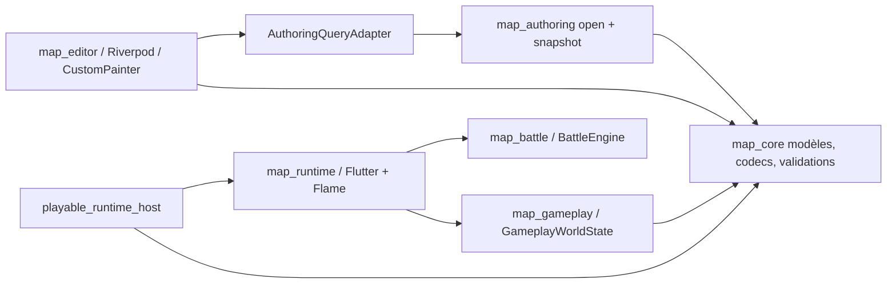

# PokeMap Full Performance Audit

Audit réalisé le 1er août 2026. Portée principale demandée : `packages/map_core`, `packages/map_gameplay`, `packages/map_battle`, `packages/map_runtime`, `packages/map_editor` et `examples/playable_runtime_host`. Les dépendances directement traversées par un scénario mesuré, notamment `packages/map_authoring`, sont citées sans prétendre constituer un audit exhaustif de ces packages hors périmètre.

## 1. Résumé exécutif

**Verdict : PokeMap est réactif sur les petits projets et plusieurs sous-systèmes sont déjà bien indexés, mais il n'est pas prêt à garantir une expérience fluide sur grandes maps, gros projets et longues sessions.** Le risque principal est structurel : `GameplayWorldState` alloue un tableau booléen à la résolution pixel de toute la map, même lorsqu'elle est presque vide, puis le reconstruit lors des déplacements d'entités. À 256×256 cellules de 16 px, un déplacement coûte 50,487 ms et le cache ajoute 136 577 024 octets de RSS ; à 512×512, le coût atteint 179,559 ms et 532 512 768 octets.

Le deuxième axe critique est le chargement auteur. Sur le projet réel Selbrume, l'ouverture du manifeste puis du snapshot cohérent prend en moyenne 595,4 ms en AOT après chauffe. Le snapshot conserve 4 753 256 octets de ressources, mais son empreinte retenue après GC est d'environ 41,6 Mo. L'adaptateur éditeur conserve une session par racine de projet jusqu'à invalidation ou arrêt de l'application : trois copies de Selbrume portent le heap après GC de 71,7 à 155,1 Mo, soit environ 41,7 Mo par projet supplémentaire.

Le troisième signal majeur vient du runtime desktop réellement exécuté en mode profile. Le scénario Selbrume de soin a réussi en 27,023 s, mais 150 frames sur 155 ont dépassé 33 ms ; le build p50 est 97,889 ms et le build p95 126,005 ms, tandis que le raster p95 reste à 2,129 ms. Le maximum, contaminé par les interrogations VM, n'est pas retenu comme baseline. L'échantillonnage CPU pointe les transformations pixel-par-pixel des masques d'occlusion statiques (`_samplePixelCenter`, `destinationPixelToSourcePixel`, `drawQuarterTurnPixels`) : le goulot se situe côté CPU/build, pas côté raster GPU.

Le rapport retient **2 findings CRITICAL, 4 HIGH, 8 MEDIUM et 2 LOW**. Les trois actions P0 proposées sont : rendre les masques d'occlusion runtime immuables et cullés au lieu de les recalculer par pixel à chaque frame ; indexer une fois l'occupation des surfaces afin de supprimer la croissance quadratique commune éditeur/runtime ; séparer les collisions gameplay statiques des entités mobiles et supprimer le bitmap pixel global inutile. Aucun correctif n'a été commencé.

## 2. Verdict global

| Surface | Verdict | Signal principal |
|---|---|---|
| `map_editor` | **Conditionnel** : convenable sur petit/moyen projet, non garanti sur gros projet ou longue session | snapshot Selbrume ~595 ms moyen ; cache de sessions non borné ; opérations images synchrones dans `build` |
| Canvas éditeur | **Non scalable sur couches Surface denses** | painter profile p95 20,07 ms à 400 placements, 123,41 ms à 1 024 et 798,89 ms à 2 500 |
| `map_runtime` / Flame | **Non conforme au budget 60 FPS sur le scénario profile observé** | 150/155 frames >33 ms, build p95 126,005 ms ; 3 888 128 pixels de masque réévalués/frame ; raster p95 2,129 ms |
| `map_core` | **Sain aux tailles usuelles, deux limites de scalabilité** | validation de hiérarchie O(G³) au pire ; peinture immuable O(nombre de cellules) |
| `map_gameplay` | **Non scalable sur grandes maps avec entités dynamiques** | cache collision pixel global : 136,6 Mo à 256² ; 532,5 Mo à 512² |
| `map_battle` | **Sain pour des combats réalistes** | moteur + un tour AOT p50 159 µs ; historique quadratique uniquement à des durées extrêmes |
| Hôte jouable | **Fonctionnellement profilable, instrumentation encore partielle** | scénario soin réussi ; scénario MVP interrompu par une assertion de fixture sans lien de performance |

Le verdict ne signifie pas que l'éditeur ou le runtime sont lents partout. Les recherches narratives ciblées, la validation incrémentale et le moteur de combat restent rapides dans leurs domaines réalistes. Il signifie qu'au moins trois chemins réalistes franchissent nettement les budgets proposés, avec une croissance non bornée ou superlinéaire.

Le lot roadmap `FG-000` reste `TODO`. Cet audit horizontal fournit une preuve partielle utile, mais ne produit ni l'inventaire exhaustif des mécaniques ni le livrable `reports/gameplay/fg_000_fangame_mechanics_readiness_audit.md` exigés par sa DoD. La roadmap n'a pas été modifiée.

## 3. Environnement de mesure

| Élément | Valeur |
|---|---|
| Machine | MacBookPro18,3 physique ; aucun hyperviseur détecté |
| CPU | Apple M1 Pro, arm64, 10 cœurs (8 performance + 2 efficacité) |
| GPU | Apple M1 Pro, 16 cœurs |
| Mémoire | 34 359 738 368 octets, soit 32 Gio |
| OS | macOS 27.0, build `26A5378n` |
| Flutter | `3.46.0-0.3.pre`, canal beta, framework `677d472756`, engine `a24b1ea55d` |
| Dart inclus dans Flutter | `3.13.0` beta |
| Dart autonome | `3.12.1` stable, `macos_arm64` |
| DevTools | `2.59.0` |
| Flame déclaré / résolu | `^1.35.0` / `1.37.0` dans les lockfiles runtime et hôte |
| Écran principal | D27-30, 1920×1080 à 75 Hz |
| Autres écrans présents | écran intégré 3024×1964 ; L24i-30 1920×1080 à 75 Hz |

Modes employés :

- **Dart AOT/release** pour les codecs JSON, snapshots, mutations core, construction gameplay, moteur battle et sondes RSS ;
- **Dart JIT + VM service** uniquement pour les heap snapshots et GC forcés, signalés séparément ;
- **Flutter test debug/JIT** pour les tests de caractérisation existants de l'éditeur ; ces chiffres ne sont pas comparés aux chiffres profile/AOT ;
- **Flutter macOS profile** sur un miroir temporaire du runtime jouable, avec collecte de `FrameTiming`, profil CPU et heap ;
- **Flutter macOS release** pour la taille du bundle runtime ;
- **analyse statique** pour les I/O synchrones, caches, lifecycle et complexités lorsqu'un parcours dynamique fiable manquait.

Les mesures ont été lancées sur secteur, mais sans verrouillage de fréquence CPU, sans refroidissement contrôlé et sans purge du cache disque système. Les distributions comportent chauffe et répétitions ; les mesures de startup et RSS doivent donc être traitées comme des ordres de grandeur sur cette machine, non comme des garanties multi-plateformes.

## 4. État initial du dépôt

Gate initial exécuté depuis `/Users/karim/Project/pokemonProject` :

```text
pwd
/Users/karim/Project/pokemonProject

git branch --show-current
main

git status --short --untracked-files=all
<aucune sortie>

git diff --stat
<aucune sortie>

git diff --name-only
<aucune sortie>

git log --oneline -n 10
4fb49e318 test(mcp): cover cold-start visual import
00a49f67d feat(authoring): expose visual library organization
2a0e3fde0 feat(mcp): stage local authoring artifacts
2f728e1f1 feat(map-editor): add narrative validator isolate executor and tests
3678f913d chore(runtime-host): refresh authoring dependency lockfile
91a9ba83d chore(repo): remove tracked generated artifacts
4385bd457 docs(skills): require PokeMap MCP parity workflows
2c341c58e prototype(smart-tiles): add interactive studio concept
c5d4baa77 feat(smart-tiles): add guided ERW authoring and migration
78a6cc88c fix(map-editor): clarify split-menu selection states
```

Le dépôt était donc propre, sur `main`, au commit initial `4fb49e318`. Aucun changement préexistant non commité n'était présent.

Pendant l'audit, un processus extérieur à cet audit a modifié puis commité trois fichiers et déplacé `HEAD` vers `7f35d44d9 fix(authoring): allow progressive tileset atlas migration`. Les fichiers concernés sont `packages/map_authoring/lib/src/domains/assets/tileset_actions.dart`, `packages/map_authoring/test/domains/assets/visual_library_contract_test.dart` et `tools/pokemap_mcp/test/mutation_server.test.ts` (202 insertions, 4 suppressions). Aucun de ces changements n'a été produit, nettoyé ou modifié par cet audit. Les benchmarks du snapshot auteur ont été recompilés/répétés après ce changement ; le loader, le fingerprint et l'adaptateur mesurés n'ont pas été modifiés par ce commit.

## 5. Méthodologie et limites

L'audit a suivi les treize passes demandées : cartographie architecturale ; scan statique contextualisé ; matrice de mesures ; éditeur ; canvas ; runtime ; core ; gameplay ; battle ; mémoire/lifecycle ; assets/I/O ; startup/bundles ; tests/CI. Trois passes de domaine indépendantes ont travaillé en lecture seule, suivies d'une consolidation puis d'une auto-review contradictoire.

Les occurrences de `build`, `setState`, `ref.watch`, `copyWith`, `sort`, `readAsBytesSync`, `Timer`, listeners et painters n'ont pas été assimilées automatiquement à des défauts. Un finding n'a été retenu que si le code établissait directement son coût, si un benchmark en isolait la croissance, ou si plusieurs signaux concordants permettaient de le classer `STRONGLY_SUPPORTED`. Les scripts et miroirs temporaires sont restés sous `/tmp/pokemap-performance-audit/`.

Limites importantes :

- aucun parcours déterministe de l'éditeur complet n'expose aujourd'hui startup, ouverture, changement de map, pan/zoom, peinture et sauvegarde en mode profile ; les mesures éditeur combinent donc AOT sur les services, tests Flutter JIT existants et preuves statiques ;
- le scénario runtime `selbrume.mvp` s'est arrêté après 2,848 s sur une assertion fonctionnelle de fixture starter (`squirtle`/`bulbasaur`) sans lien de performance ; ses six frames sont conservées comme signal court mais le finding runtime s'appuie surtout sur le scénario soin réussi de 27,023 s et 155 frames ;
- le profile runtime utilisait une copie temporaire instrumentée conformément au workflow desktop ; aucune instrumentation n'a été ajoutée au dépôt ;
- l'outil documentaire Flame configuré était accessible mais n'a retourné aucun résultat aux requêtes lifecycle/cache/performance ; les conclusions reposent donc sur Flame `1.37.0` installé et sur les patterns déjà employés dans le dépôt ;
- aucune fixture existante ne satisfait entièrement la définition « 50 maps ou davantage » du scénario C ; Selbrume est un gros projet réel en volume de données mais ne contient que 10 maps. Les dimensions extrêmes ont été testées par données synthétiques temporaires, explicitement étiquetées ;
- aucun compteur fiable de draw calls GPU n'était exposé ; aucune valeur n'est inventée ;
- le heap JIT, le RSS AOT, les temps Flutter test debug et les frames Flutter profile ne sont jamais comparés directement sans mention du mode ;
- le cold/warm startup de l'éditeur n'a pas été mesuré de manière fiable ; les tailles release éditeur et runtime ont été relevées sur des miroirs temporaires ;
- les suites complètes observées dans `/tmp/pokemap-performance-audit/tests` ont été produites par un processus non attribuable avant le changement de `HEAD`. Leur provenance n'étant pas contrôlée, elles sont exclues des preuves de conformité et seulement consignées comme contamination externe.

Conflit de règles résolu : `codex_rule.md` demande normalement d'adapter les tests d'une implémentation, mais la demande directe interdit toute modification de code ou de test. Cette exécution est un audit sans implémentation ; aucune modification de test n'était donc applicable.

## 6. Architecture performance de PokeMap



Les frontières de package sont globalement saines : `map_core`, `map_gameplay` et `map_battle` restent purs Dart ; les règles gameplay ne sont pas enfouies dans les composants Flame ; l'éditeur ne dépend pas des internals runtime. Les principaux risques ne viennent pas d'un couplage transversal général mais de représentations et points de frontière précis : snapshot cohérent auteur, cache collision pixel, masques d'occlusion recalculés, mutations immuables de couches et caches d'images UI.

Inventaire de taille audité (les différences mineures de comptage viennent des filtres fichiers générés/tests) :

| Surface | Fichiers `lib` | Lignes `lib` approx. | Fichiers tests | Lignes tests approx. |
|---|---:|---:|---:|---:|
| `map_core` | 398 | 216 721 | 392 | 157 817 |
| `map_gameplay` | 43 | 12 619 | 57 | 16 269 |
| `map_battle` | 328 | 97 265 | 146 | 77 295 |
| `map_runtime` | 204 | 373 244 | 276 | 126 141 |
| `map_editor` | 761 | 347 472 | 625 | 295 841 |
| hôte jouable | 65 | 19 964 | 83 | 16 036 |

Le total dépasse un million de lignes de bibliothèque, largement influencé par des catalogues générés (`battle_sdk_rmxp_animation_catalog.dart` : 282 843 lignes). La taille d'un fichier généré n'est pas un hotspot en soi. Les fichiers métier les plus concentrés et donc risqués pour l'observabilité restent `editor_notifier.dart` (~14 957 lignes), `playable_map_game.dart` (~13 874), `map_canvas.dart` (~3 519) et `map_grid_painter.dart` (~3 307).

## 7. Scénarios et jeux de données

| Scénario | Jeu de données | Taille / contenu | Mode | Métriques | Limite |
|---|---|---|---|---|---|
| A — petit | `golden_battle_slice` | 1 map, `project.json` 1 283 caractères | Dart AOT | lecture, JSON, snapshot | fixture très petite |
| B — intermédiaire | `event_builder_v2_selbrume_slice` | 2 maps, manifeste 83 148 caractères, snapshot 265 447 octets/4 ressources | Dart AOT + Flutter test JIT | open/snapshot, scénarios narratifs | moins de maps que la définition B |
| B/C — checkpoint | `promotion_checkpoint` | 10 maps, 192 éléments, manifeste 1 234 939 caractères | Dart AOT | JSON, validation | snapshot incomplet : une ressource déclarée manque, donc mesure snapshot rejetée |
| C — gros réel disponible | `selbrume` | 10 maps, 31 tilesets, 341 éléments, 24 dialogues, 16 cinématiques, 49 facts, 34 world rules, 35 scènes ; manifeste 2 420 033 caractères ; 4 753 256 octets de ressources snapshot | Dart AOT, JIT/VM service, Flutter profile | open/snapshot, JSON, heap/RSS, runtime | ne remplit pas le seuil 50 maps |
| C — gros synthétique | hiérarchies de 10 à 400 groupes ; recherches 10 000 entrées ; workspace 1 000 événements | données temporaires hors dépôt | Dart AOT / Flutter test JIT | courbes de croissance | worst-case, pas un projet utilisateur complet |
| D — canvas lourd | maps 32² à 512², une couche et mutation isolée ; test world-map large existant | jusqu'à 262 144 cellules | Dart AOT + Flutter test JIT | peinture, copie, RSS | pas de pan/zoom GPU profile complet |
| E — runtime chargé | `selbrume.healing-service` et `selbrume.mvp` | runtime réel, assets et sprites Selbrume | Flutter macOS profile | `FrameTiming`, CPU samples, heap | MVP interrompu tôt ; soin réussi |
| F — session longue | 1 puis 3 copies APFS de Selbrume sous `/tmp` | racines distinctes, mêmes 35 ressources | Dart JIT + VM service/GC ; AOT RSS | heap retenu, RSS, latence open | ne simule pas tous les studios/combats |

Les données synthétiques servent seulement à isoler une complexité et à établir une courbe. Elles ne remplacent pas un futur fixture de référence de 50–100 maps, versionné et représentatif.

## 8. Budgets de performance proposés

Ces budgets sont **provisoires** : aucun budget produit officiel n'a été trouvé. Ils doivent être enregistrés plusieurs semaines en mode observation avant de devenir bloquants en CI. Pour les frames, `build + raster` doit être évalué avec les timings de chaque frame, pas en additionnant des percentiles indépendants.

| Action / métrique | Idéal | Acceptable | Seuil de régression |
|---|---:|---:|---:|
| Frame éditeur à 60 FPS | p95 ≤16,67 ms ; <0,5 % >33,3 ms | p95 ≤24 ms ; <2 % >33,3 ms | p95 >33,3 ms ou ≥5 % >33,3 ms |
| Frame runtime à 60 FPS | p95 ≤16,67 ms ; <0,5 % >33,3 ms | p95 ≤20 ms ; <1 % >33,3 ms | p95 >25 ms ou ≥2 % >33,3 ms |
| Cold startup éditeur | ≤2,0 s | ≤4,0 s | >6,0 s ou +20 % vs baseline |
| Cold startup runtime | ≤1,5 s | ≤3,0 s | >5,0 s ou +20 % |
| Ouverture projet réel de référence | ≤400 ms | ≤1,0 s | >1,5 s ou +20 % |
| Changement de map | ≤100 ms | ≤250 ms | >500 ms |
| Sauvegarde `project.json` | ≤100 ms | ≤250 ms | >500 ms |
| Sauvegarde/chargement `GameState` | ≤50 ms | ≤150 ms | >300 ms |
| Action interactive principale (sélection, recherche, inspector) | p95 ≤16,67 ms | p95 ≤50 ms | p95 >100 ms |
| Action explicite lourde (validation globale, import) | ≤250 ms ou progression | ≤1 s avec feedback | >2 s sans feedback/annulation |
| Heap/RSS après 10 cycles identiques et GC | croissance ≤20 Mo et stabilisée | ≤50 Mo ou ≤10 %, stabilisée | croissance monotone >100 Mo ou >10 % |
| Pic éditeur, gros projet de référence | <750 Mo | <1,5 Gio | >2 Gio |
| Pic runtime, map dense de référence | <500 Mo | <1 Gio | >1,5 Gio |
| Lane perf critique CI | <5 min | <10 min | >15 min ou +20 % |

Un budget de mémoire absolu doit être calibré sur macOS, Windows et Linux. La règle réellement bloquante doit d'abord porter sur la croissance persistante après retour à l'état initial.

## 9. Résultats mesurés

### Chargement, JSON et mémoire auteur

| Mesure | Mode | p50 | p95 | Autre |
|---|---|---:|---:|---|
| Selbrume : lecture `project.json` | Dart AOT, 15 itérations | 6,423 ms | 6,708 ms | 2 420 033 caractères |
| Selbrume : decode + `ProjectManifest.fromJson` | Dart AOT | 20,938 ms | 21,929 ms | — |
| Selbrume : `toJson` + pretty encode | Dart AOT | 20,599 ms | 40,118 ms | 15 échantillons ; un outlier au p95 |
| Selbrume : `ProjectValidator.validate` | Dart AOT | 0,405 ms | 0,540 ms | zone à préserver |
| Selbrume : ouverture manifeste auteur | Dart AOT, 8 itérations après 2 chauffes | 102,351 ms | 105,004 ms | moyenne 101,884 ms |
| Selbrume : chargement snapshot | Dart AOT, mêmes itérations | 493,841 ms | 497,571 ms | moyenne 493,506 ms |
| Petit snapshot | Dart AOT | 0,869 ms | 1,253 ms | 2 ressources / 2 407 octets |
| Snapshot intermédiaire | Dart AOT | 31,377 ms | 32,418 ms | 4 ressources / 265 447 octets |
| Snapshot Selbrume, RSS d'un process isolé | Dart AOT | — | — | delta 187,6 à 239,7 Mo selon deux runs ; RSS max 244,1 à 296,1 Mo |
| Snapshot Selbrume retenu après GC | Dart JIT + VM service | — | — | heap ~71,5 Mo avec snapshot, ~29,9 Mo après libération : ~41,6 Mo retenus |
| Sessions auteur : 1 → 3 projets | Dart JIT + GC forcé | — | — | heap 71 715 024 →155 124 752 octets ; ~41,7 Mo par projet ajouté |

### Scalabilité core/gameplay/battle

| Mesure | Mode | Résultat |
|---|---|---|
| `GameplayWorldState` 128², init/move | Dart AOT | p50 11,001 / 10,790 ms ; +34 291 712 octets RSS |
| `GameplayWorldState` 256², init/move | Dart AOT | 44,503 / 50,487 ms ; +136 577 024 octets RSS |
| `GameplayWorldState` 512², init/move | Dart AOT | 174,119 / 179,559 ms ; +532 512 768 octets RSS ; RSS max 567 754 752 |
| Peinture immutable 128² / 256² / 512² | Dart AOT | p95 0,384 / 1,296 / 4,932 ms par mutation isolée |
| Peinture via harness éditeur 128² / 256² / 512² / 1 024² | Dart AOT, second harness | p95 0,29 / 1,14 / 7,82 / 16,91 ms ; configuration/échantillonnage distincts, non fusionnés |
| Validation chaîne de groupes 100 / 200 / 400 | Dart AOT | p95 5,752 / 35,142 / 325,956 ms |
| Battle registry 330 entrées | Dart AOT | construction p50 40,8 µs, p95 56,1 µs |
| Battle engine + un tour | Dart AOT | p50 159,0 µs avec registry par défaut |
| Historique battle 1 000 / 2 000 / 5 000 append | Dart AOT | p50 2,691 / 10,865 / 73,613 ms cumulés |

### Éditeur et canvas

Les six tests de performance éditeur existants explicitement ciblés ont donné 10/10 succès en 51,68 s (`flutter test`, debug/JIT, macOS arm64). Le test world-map large a donné 7/7 succès en 16,73 s ; ses budgets portent surtout sur des comptages, pas sur `FrameTiming`.

| Scénario de test existant | Mode | Résultat observé |
|---|---|---|
| Cinematic builder cold load / open | Flutter test debug/JIT | 1 108 ms / 805 ms ; 6 745 premiers builds |
| Journal persistence p95 / recovery 100 p95 | Flutter test debug/JIT | 51,367 ms / 308,247 ms |
| Session prepare 500 / revalidation finale 500 p95 | Flutter test debug/JIT | 381,822 ms / 210,896 ms |
| Validation incrémentale 500 records p95 | Flutter test debug/JIT | 13,519 ms |
| Recherche globale 10 000 exact/accent/fuzzy p95 | Flutter test debug/JIT | 109,370 / 93,051 / 97,783 ms |
| Projection 1 000 map-events p95 | Flutter test debug/JIT | 523,657 ms |
| Graphe storyline / library cinématiques / timeline, 1 000 | Flutter test debug/JIT | p95 3,100 / 5,242 / 1,317 ms |

### Runtime profile et bundle

| Scénario | Mode | Résultat |
|---|---|---|
| `selbrume.healing-service` | Flutter macOS profile, scénario réussi | 27,023 s ; 155 frames ; build p50/p95 97,889/126,005 ms ; raster p95 2,129 ms ; 150 frames >33 ms ; p99/max contaminés par les interrogations VM |
| `selbrume.mvp` | Flutter macOS profile, arrêté par assertion fonctionnelle | 2,848 s ; 6/6 frames >33 ms ; build p50/p95 124,505/126,804 ms ; raster p95 2,516 ms |
| Heap durant bootstrap runtime | Flutter profile + VM service | 51,7 →188,3 Mo en 8 s ; run trop court pour conclure à une fuite |
| Bundle éditeur | Flutter macOS release, build frais en miroir temporaire | build 91,32 s ; 45 648 Kio sur disque (Flutter : 46,7 MB) ; binaire AOT 27 973 216 octets |
| Bundle runtime hôte | Flutter macOS release, build incrémental en miroir temporaire | build 58,19 s ; 49 014 220 octets de fichiers réguliers ; exécutable Dart AOT ~14,7 Mo |
| Bundle runtime hôte profile | Flutter macOS profile | 63 092 Kio sur disque ; non comparable directement au release |

Le profil CPU final de 23 625 échantillons attribue 13 647 ticks inclusifs (57,8 %) à `drawQuarterTurnPixels`, 8 308 à `destinationPixelToSourcePixel`, 4 821 à `_samplePixelCenter` et 1 754 ticks exclusifs au stub `AllocateObject`. Le raster restant bas, l'investigation doit commencer par la géométrie réutilisable et le culling des masques d'occlusion, sans conclure à un problème GPU général.

Les draw calls, le cold/warm startup de l'éditeur et un vrai profil bout-en-bout « ouverture → changement de map → pan/zoom → peinture → sauvegarde » ne sont pas accessibles dans l'instrumentation actuelle ; ils restent explicitement non mesurés. Une tentative Marionette a d'abord échoué sur la canonicalisation `/tmp` → `/private/tmp`, puis la sandbox macOS de l'application a refusé l'accès au projet temporaire ; aucun chiffre debug n'a été reconverti en chiffre profile.

## 10. Findings critiques

### PERF-RT-01 — Les masques d'occlusion statiques sont recalculés pixel par pixel à chaque frame

- **ID :** `PERF-RT-01`.
- **Titre :** Les masques d'occlusion statiques consomment le thread UI à chaque rendu.
- **Sévérité :** `CRITICAL` — priorité P0.
- **Niveau de preuve :** `MEASURED`.
- **Packages concernés :** `packages/map_runtime`, `examples/playable_runtime_host` comme reproducteur.
- **Fichiers et lignes concernés :** `placed_element_occlusion_patch_component.dart:9-35,54-139`, `quarter_turn_pixel_renderer.dart:36-140`, `playable_map_game.dart:12000-12018,12230-12245,13183-13199`, `map_placed_element_footprint.dart:149-255`.
- **Scénario de reproduction :** lancer Selbrume sur macOS en profile et exécuter `selbrume.healing-service` ; la map initiale et ses connexions montent 87 patches d'occlusion non vides.
- **Mesures observées :** build p50 97,889 ms, p95 126,005 ms ; 150/155 frames (96,8 %) >33,3 ms ; raster p95 2,129 ms ; 3 888 128 pixels de masque réévalués/frame ; `drawQuarterTurnPixels` représente 57,8 % des 23 625 échantillons inclusifs.
- **Comportement attendu :** réutiliser une géométrie statique et rester sous 16,67 ms p95 pour viser 60 FPS.
- **Impact utilisateur :** déplacement et interactions fortement saccadés ; build p50/p95 97,889/126,005 ms.
- **Impact technique :** millions de conversions pixel/source, allocations `GridPos`, construction de chemins et tests de masque sur l'isolate UI.
- **Cause racine :** `_drawRuns` est calculé au constructeur mais sert seulement à tester `isEmpty` ; `render()` refait le travail pixel par pixel. Les patches ne sont pas inclus dans le culling viewport existant.
- **Facteurs aggravants :** preload des maps connectées, 74 arbres avec masques 224×224 ou 160×256, patches montés comme composants séparés.
- **Proposition de correction :** construire une géométrie ou image immutable depuis `_drawRuns`, la réutiliser par patch, et exclure les patches hors `camera.visibleWorldRect`.
- **Pourquoi cette correction est préférable :** elle exploite une donnée déjà pré-calculée, préserve la sémantique d'occlusion et évite une réécriture du renderer.
- **Alternatives considérées :** précomposer chaque patch en bitmap (plus de mémoire), fusionner tous les patches (invalidation complexe), supprimer l'occlusion (perte fonctionnelle).
- **Risques de la correction :** décalage des rotations, display scale, opacité ou ordre de profondeur.
- **Effort estimé :** M, environ 1–2 jours avec tests visuels.
- **Gain attendu :** suppression de plusieurs millions d'opérations par frame ; gain majeur, facteur exact à remesurer.
- **Test ou benchmark de validation :** tests rotations 0–3 et masques, goldens d'occlusion, trois profils Selbrume ; p95 UI ≤16,67 ms et <1 % des frames >33 ms.
- **Risque de régression :** masques décalés ou ordre avant/arrière incorrect.
- **Dépendances avec d'autres findings :** à traiter avant `PERF-CANVAS-01` et `PERF-RT-03`, afin de mesurer ensuite les coûts secondaires.

### PERF-SURFACE-01 — La résolution des variantes Surface est quadratique avant le culling

- **ID :** `PERF-SURFACE-01`.
- **Titre :** Chaque placement Surface reconstruit l'occupation de tous les placements.
- **Sévérité :** `CRITICAL` — priorité P0.
- **Niveau de preuve :** `MEASURED` ; la cause est également lisible directement dans le code.
- **Packages concernés :** `packages/map_core`, `packages/map_editor`, `packages/map_runtime`.
- **Fichiers et lignes concernés :** `surface_variant_role_resolver.dart:12-34`, `surface_layer_static_preview.dart:30-79`, `surface_tile_preview_resolver.dart:40-75`, `map_grid_painter.dart:502-530`, `map_layers_component.dart:474-507`, `surface_runtime_resolver.dart:10-99`.
- **Scénario de reproduction :** couches synthétiques temporaires de 100, 400, 900/1 024, 1 600 et 2 500 placements ; vrai `MapGridPainter` en Flutter profile et resolver runtime en Dart AOT. Une surface contiguë 32×32 représente déjà 1 024 placements, taille réaliste du scénario D, et dépasse 88–123 ms.
- **Mesures observées :** painter éditeur p95 1,56/20,07/123,41/798,89 ms pour 100/400/1 024/2 500 ; resolver runtime p95 1,443/17,959/88,195/288,995/796,627 ms pour 100/400/900/1 600/2 500.
- **Comportement attendu :** résolution statique proche de O(P), puis rendu O(V) sur les placements visibles, sous 8 ms pour le painter.
- **Impact utilisateur :** freeze de centaines de millisecondes sur couche Surface dense, dans l'éditeur comme dans le runtime.
- **Impact technique :** set d'occupation, chaînes de coordonnées, listes, tri et instructions recréés avant même l'application du viewport.
- **Cause racine :** `resolveSurfaceVariantRoleForPlacement` rescane tous les placements pour chaque placement ; les deux consommateurs répètent l'appel et appliquent le culling trop tard.
- **Facteurs aggravants :** animation, plusieurs presets, overlays éditeur et grandes couches entièrement chargées.
- **Proposition de correction :** construire une fois l'occupation et les rôles par `(révision de couche, preset)`, invalider à la mutation, puis ne matérialiser que viewport + halo.
- **Pourquoi cette correction est préférable :** la topologie est stable entre deux mutations ; elle transforme O(P²) en O(P+V) sans changer le format de données.
- **Alternatives considérées :** isolate à chaque frame (transfert et latence), cache par temps d'animation (mauvaise clé), suppression du tri seul (ne supprime pas le terme quadratique).
- **Risques de la correction :** mauvaise invalidation, variantes incorrectes aux bords/coins, couture au bord du viewport.
- **Effort estimé :** M–L, 3–5 jours pour le contrat partagé et les deux consommateurs.
- **Gain attendu :** très élevé ; 2 500 placements doivent passer de ~0,8 s à quelques millisecondes de résolution statique.
- **Test ou benchmark de validation :** benchmark 100/400/900/1 600/2 500 dans core, tests de parité des rôles, goldens editor/runtime, profil viewport ; cible 2 500 <5 ms hors dessin.
- **Risque de régression :** bordures Surface visuellement différentes après mutation ou animation.
- **Dépendances avec d'autres findings :** coordonner avec `PERF-CANVAS-01`; indépendant du jank actuel Selbrume de `PERF-RT-01`, car Selbrume n'utilise pas de `SurfaceLayer` dans ce scénario.

## 11. Findings élevés

### PERF-GAME-01 — Cache collision pixel global reconstruit lors des mouvements d'entités

- **ID :** `PERF-GAME-01`.
- **Titre :** `GameplayWorldState` alloue un `List<bool>` à la résolution pixel de toute la map.
- **Sévérité :** `HIGH` — priorité P0.
- **Niveau de preuve :** `MEASURED` ; la cause est également lisible directement dans le code.
- **Packages concernés :** `packages/map_gameplay`; multiplicateur possible dans la validation narrative.
- **Fichiers et lignes concernés :** `gameplay_world_state.dart:714-760,775-844,942-954`, `narrative_physical_reachability_validator.dart:200-226,437-453`.
- **Scénario de reproduction :** map synthétique presque vide, une couche, un panneau bloquant, cellules 16×16 px ; tailles 32² à 512² ; init puis déplacement réel d'une entité.
- **Mesures observées :** à 128² : move p50 10,790 ms et +34 291 712 octets RSS ; 256² : 50,487 ms et +136 577 024 ; 512² : 179,559 ms et +532 512 768, RSS max 567 754 752.
- **Comportement attendu :** coût proportionnel aux obstacles/entités modifiés, pas au nombre de pixels du monde.
- **Impact utilisateur :** frame longue à chaque déplacement d'entité et risque de pression mémoire sévère sur grande map.
- **Impact technique :** huit octets environ par slot booléen mesuré, reconstruction de dizaines de millions de slots.
- **Cause racine :** collisions statiques et occupation dynamique sont fusionnées dans un bitmap pixel dense recréé par `withEntityPosition`/visibilité.
- **Facteurs aggravants :** grandes dimensions, tile size élevé, plusieurs états symboliques construits par le validateur de reachability.
- **Proposition de correction :** séparer masque statique et entités ; utiliser l'index spatial existant pour les rectangles dynamiques ; encoder les vrais masques en bits, intervalles ou chunks ; ne rien allouer s'il n'existe aucun masque pixel.
- **Pourquoi cette correction est préférable :** conserve les index O(1) déjà efficaces et cible seulement la représentation qui explose.
- **Alternatives considérées :** `Uint8List` dense (gain mémoire limité), réduire arbitrairement la taille des maps (contrainte produit), recalcul partiel du même bitmap (complexité et toujours dense).
- **Risques de la correction :** divergence de collision au pixel, ordre entre entités et terrain, invalidation de chunks.
- **Effort estimé :** L, 5–10 jours avec caractérisation exhaustive.
- **Gain attendu :** supprimer jusqu'à des centaines de Mo et ramener un move 256² sous le budget de frame.
- **Test ou benchmark de validation :** parité collision sur fixtures, matrices 32²–512² avec/sans masque, RSS isolé, mouvement d'entités ; cible p95 <5 ms à 256² sans masque pixel.
- **Risque de régression :** traversée d'obstacles, blocage fantôme ou résultat différent du validateur.
- **Dépendances avec d'autres findings :** prioritaire avant tout profil runtime dense ; pourrait réduire le coût de validation physique, à remesurer séparément.

### PERF-AUTH-01 — L'ouverture canonique relit, redécode, rehache et retient tout le projet

- **ID :** `PERF-AUTH-01`.
- **Titre :** Le snapshot auteur cohérent dépasse 0,5 s et crée une forte pression mémoire sur Selbrume.
- **Sévérité :** `HIGH` — priorité P1 ; classement fondé sur la combinaison latence réelle + pic mémoire, bien que la latence seule reste sous le budget provisoire acceptable de 1 s.
- **Niveau de preuve :** `MEASURED` ; la cause est également lisible directement dans le code.
- **Packages concernés :** `packages/map_editor`, dépendance traversée `packages/map_authoring`, `packages/map_core`.
- **Fichiers et lignes concernés :** `authoring_query_adapter.dart:52-86`, `project_snapshot_loader.dart:17-23,35-63,103-185`, `narrative_project_fingerprint.dart:8-34`.
- **Scénario de reproduction :** ouvrir `selbrume` via `ProjectOpenService` puis `ProjectSnapshotLoader.editorReadProjection`, 2 chauffes + 8 itérations AOT.
- **Mesures observées :** open moyen/p95 101,884/105,004 ms ; snapshot moyen/p95 493,506/497,571 ms ; 35 ressources et 4 753 256 octets bruts retenus ; delta RSS AOT 187,6–239,7 Mo selon deux runs.
- **Comportement attendu :** ouverture ≤400 ms idéale, ≤1 s acceptable, sans copies transitoires disproportionnées.
- **Impact utilisateur :** attente visible à l'ouverture/changement de projet et risque de freeze puisque décodages/hachages restent sur l'isolate appelant autour des awaits.
- **Impact technique :** lecture initiale, relecture de cohérence, fingerprint agrégé puis fingerprints individuels ; `Uint8List.fromList` recopie chaque entrée.
- **Cause racine :** contrat de snapshot cohérent implémenté par double lecture, matérialisation totale et hachages/copies multiples.
- **Facteurs aggravants :** assets CAS, nombreux fichiers, maps/dialogues volumineux, réouvertures après chaque invalidation.
- **Proposition de correction :** préserver la double vérification mais utiliser fingerprint streaming sans copie, I/O parallèle bornée, parsing/hachage hors UI, index/manifeste d'abord et rétention brute limitée aux ressources réellement nécessaires.
- **Pourquoi cette correction est préférable :** elle conserve la garantie de cohérence et la frontière de sécurité workspace, contrairement à la suppression naïve de la seconde lecture.
- **Alternatives considérées :** supprimer la cohérence (rejeté), charger tout en isolate monolithique (transferts volumineux), cache global éternel (aggrave `PERF-AUTH-02`).
- **Risques de la correction :** accepter une révision mixte, changer les fingerprints, dépasser les limites de file descriptors ou casser le diagnostic ressource manquante.
- **Effort estimé :** L, 5–8 jours par étapes.
- **Gain attendu :** objectif initial de réduire d'au moins 30 % temps et pic mémoire, à confirmer par benchmark.
- **Test ou benchmark de validation :** parité fingerprint/diagnostics, mutation concurrente entre deux lectures, A/B sur A/B/C, heap/RSS ; budget Selbrume open+snapshot moyen <400 ms à terme.
- **Risque de régression :** snapshot incohérent ou accès hors racine autorisée.
- **Dépendances avec d'autres findings :** amplifie `PERF-AUTH-02` et `PERF-IO-01` ; optimiser avant de choisir un budget cache.

### PERF-AUTH-02 — Les sessions auteur restent en mémoire pour chaque racine ouverte

- **ID :** `PERF-AUTH-02`.
- **Titre :** Cache de sessions non borné durant une longue session éditeur.
- **Sévérité :** `HIGH` — priorité P1 pour le lifecycle.
- **Niveau de preuve :** `MEASURED` ; la rétention est également lisible directement dans le code.
- **Packages concernés :** `packages/map_editor`, `packages/map_authoring` via les snapshots retenus.
- **Fichiers et lignes concernés :** `authoring_query_adapter.dart:14-49`, `repository_providers.dart:53-58`, invalidations ciblées `file_repositories.dart:271-275` et `authoring_mutation_adapter.dart:132,156,178`.
- **Scénario de reproduction :** ouvrir successivement une puis trois copies de Selbrume sous trois racines distinctes, garder l'adaptateur vivant, forcer un GC via VM service.
- **Mesures observées :** heap après GC 71 715 024 octets pour une session, 155 124 752 pour trois ; +83 409 728 pour deux projets, soit ~41,7 Mo chacun. Les opens successifs prennent 810,127/595,936/571,043 ms dans cette passe JIT.
- **Comportement attendu :** fermer la session du projet quitté ou appliquer une limite explicite qui se stabilise.
- **Impact utilisateur :** mémoire qui augmente à chaque projet visité et risque de swap/crash en session longue.
- **Impact technique :** chaque entrée conserve snapshot, maps, manifestes, bytes et handle workspace jusqu'à `closeAll` au dispose du provider.
- **Cause racine :** `_sessions` est une `Map` sans limite ; le changement de projet n'invalide que les mutations/sauvegardes de la racine courante.
- **Facteurs aggravants :** `PERF-AUTH-01`, grands projets, navigation entre clients, app laissée ouverte plusieurs jours.
- **Proposition de correction :** expliciter un lease « projet actif », fermer l'ancien à la bascule ; si multi-projet requis, LRU borné en octets et fermeture déterministe des handles.
- **Pourquoi cette correction est préférable :** rend le lifecycle explicite et mesurable au lieu de dépendre du dispose global de Riverpod.
- **Alternatives considérées :** timer d'expiration (non déterministe), weak references (lifecycle de fichiers incertain), `closeAll` à chaque requête (perd tout bénéfice de cache).
- **Risques de la correction :** fermer une session encore utilisée par une requête asynchrone ou perdre un cache utile lors d'un aller-retour rapide.
- **Effort estimé :** M, 2–4 jours avec gestion des courses.
- **Gain attendu :** éliminer ~41,7 Mo retenus par ancien projet Selbrume et borner la croissance F.
- **Test ou benchmark de validation :** 10 bascules A↔B, requêtes concurrentes, GC après retour A ; croissance ≤20 Mo et handles fermés exactement une fois.
- **Risque de régression :** `workspace.handle_unknown` en course ou réouvertures trop fréquentes.
- **Dépendances avec d'autres findings :** calibrer la limite après réduction de l'empreinte `PERF-AUTH-01`.

### PERF-ED-01 — Une peinture recopie la couche entière et l'undo conserve des maps complètes

- **ID :** `PERF-ED-01`.
- **Titre :** Coût O(surface de map) par cellule, multiplié par l'historique immutable.
- **Sévérité :** `HIGH` — priorité P1.
- **Niveau de preuve :** `MEASURED` ; les copies sont également lisibles directement dans le code.
- **Packages concernés :** `packages/map_core`, `packages/map_editor`.
- **Fichiers et lignes concernés :** `map_paint.dart:25-87`, `map_collision.dart:68-123`, `map_history_coordinator.dart:134-155,234-255`.
- **Scénario de reproduction :** peindre une cellule sur couches 128², 256², 512² et 1 024² en AOT ; produire 100 snapshots successifs 512².
- **Mesures observées :** second harness éditeur p95 0,29/1,14/7,82/16,91 ms avant rebuild/rendu ; harness core indépendant p95 0,384/1,296/4,932 ms à 128²/256²/512². Les configurations et échantillonnages diffèrent ; le rapport ne moyenne pas ces séries. Cent snapshots 512² ajoutent ~186 269 696 octets RSS.
- **Comportement attendu :** coût proportionnel au trait/chunk modifié et un seul commit immutable par geste.
- **Impact utilisateur :** trait saccadé sur grande map, undo gourmand, GC et mémoire croissants durant la peinture continue.
- **Impact technique :** `toList` de toute la grille puis copies de `MapData` retenues jusqu'à 100 entrées.
- **Cause racine :** primitive unitaire immutable appelée potentiellement plusieurs fois par pointer event et historique snapshot complet.
- **Facteurs aggravants :** pinceaux multi-cellules, collision + tuile, cartes ≥512², répétition rapide.
- **Proposition de correction :** transaction de geste avec buffer de deltas/chunks, un commit final, undo/redo par commande ou delta ; conserver JSON/public model inchangé au premier lot.
- **Pourquoi cette correction est préférable :** réduit CPU et mémoire sans supprimer l'immutabilité aux frontières.
- **Alternatives considérées :** rendre tous les modèles mutables (risque majeur), augmenter seulement le debounce (latence), réduire la profondeur undo (perte UX sans traiter le CPU).
- **Risques de la correction :** granularité undo différente, trait partiel après erreur, duplication de cellules dans un delta.
- **Effort estimé :** L, 5–8 jours.
- **Gain attendu :** 1 allocation de couche par geste au lieu d'une par cellule ; baisse forte de l'historique pour les traits longs.
- **Test ou benchmark de validation :** parité outils/undo/redo, traits 1/100/1 000 cellules sur 512² et 1 024², RSS 100 gestes ; frame p95 <16,67 ms.
- **Risque de régression :** historique incohérent, sauvegarde d'un état intermédiaire.
- **Dépendances avec d'autres findings :** mesurer avec `PERF-ED-02` résolu pour séparer mutation et rebuild.

## 12. Findings moyens

### PERF-ED-02 — Une mutation locale invalide le shell et des projections globales

- **ID :** `PERF-ED-02`.
- **Titre :** Watchers larges et index global couplent peinture de map et travail narratif.
- **Sévérité :** `MEDIUM` — priorité P1 ; passer à HIGH seulement après profil bout-en-bout.
- **Niveau de preuve :** `STRONGLY_SUPPORTED` ; coût des projections mesuré, rebuild bout-en-bout non mesuré.
- **Packages concernés :** `packages/map_editor`.
- **Fichiers et lignes concernés :** `editor_shell_page.dart:103-128,171-190,253-270`.
- **Scénario de reproduction :** modifier une tuile alors que le shell observe projet et carte entiers ; benchmark de projection 100 maps/1 000 événements et recherche 10 000 entrées.
- **Mesures observées :** projection map-events p95 523,657 ms ; recherche exacte/accent/fuzzy p95 109,370/93,051/97,783 ms en Flutter test debug/JIT. Ces valeurs sont des proxys, pas la durée directe d'un trait profile.
- **Comportement attendu :** une mutation de tuile ne reconstruit que le workspace/canvas concerné ; index narratif invalidé uniquement par révision narrative.
- **Impact utilisateur :** risque de freeze lors d'une édition sans rapport avec la narration.
- **Impact technique :** sous-arbre shell et index global recalculés sur identités de manifest/map trop larges, même hors espace narratif.
- **Cause racine :** abonnements Riverpod globaux et clé de mémoïsation fondée sur l'identité complète de la map active.
- **Facteurs aggravants :** gros catalogues, 1 000 événements, recherche visible, fréquence des pointer events.
- **Proposition de correction :** providers `select` par révision sémantique, index narratif activé seulement dans son workspace, isolation du canvas et instrumentation de rebuild.
- **Pourquoi cette correction est préférable :** réduit l'invalidation sans refactorer tout Riverpod ni rendre les modèles mutables.
- **Alternatives considérées :** `const` généralisé (ne change pas les dépendances), `RepaintBoundary` partout (ne supprime pas le build), debounce global (latence).
- **Risques de la correction :** UI stale si une révision sémantique oublie un champ.
- **Effort estimé :** M–L, 4–7 jours par tranche.
- **Gain attendu :** supprimer des projections de 100–500 ms du chemin des mutations non narratives.
- **Test ou benchmark de validation :** compteur de builds et timeline profile sur 100 coups de pinceau, mutations narrative/non narrative, recherche 10k ; zéro rebuild d'index narratif sur tuile.
- **Risque de régression :** recherche ou inspector non rafraîchi.
- **Dépendances avec d'autres findings :** nécessaire pour mesurer proprement le gain `PERF-ED-01`.

### PERF-CANVAS-01 — Smart tiles et ombres recalculent des projections globales avant le viewport

- **ID :** `PERF-CANVAS-01`.
- **Titre :** Le painter demande la map entière alors que les résolveurs peuvent accepter des bornes.
- **Sévérité :** `MEDIUM` — priorité P1 ; impact dynamique à mesurer.
- **Niveau de preuve :** `STRONGLY_SUPPORTED` ; le travail global est confirmé statiquement mais son impact bout-en-bout n'est pas isolé.
- **Packages concernés :** `packages/map_editor`, `packages/map_core`.
- **Fichiers et lignes concernés :** `map_grid_painter.dart:451-490,2705-2765`, `smart_tile_layer_visual_resolver.dart:53-105`.
- **Scénario de reproduction :** afficher une grande map avec smart tiles et ombres, puis provoquer des paints par zoom/pan/overlay.
- **Mesures observées :** le rendu standard 4 couches est cullé et reste à 1,55–1,91 ms p95 de 128² à 1 024² ; en revanche ces deux branches construisent leurs projections globales à chaque paint. Aucun timing isolé fiable n'est disponible : ne pas convertir ce constat en millisecondes inventées.
- **Comportement attendu :** calcul limité au viewport + halo, cache stable entre deux révisions pertinentes.
- **Impact utilisateur :** dégradation attendue avec taille totale de map, même si la zone visible ne change pas.
- **Impact technique :** scans, tris et instructions d'ombre/smart tiles recréés dans le hot path du painter.
- **Cause racine :** les bornes disponibles dans le resolver ne sont pas transmises ; aucune clé de cache révision carte/projet/lumière.
- **Facteurs aggravants :** overlays, animation, map 1 024², pan continu.
- **Proposition de correction :** passer viewport + halo au resolver smart, indexer/cacher les instructions d'ombre par révision, n'animer que les placements visibles.
- **Pourquoi cette correction est préférable :** prolonge le culling standard déjà efficace au lieu de réécrire le painter.
- **Alternatives considérées :** raster cache global (stale et volumineux), isolate par frame (trop de transfert), masquer les effets (perte UX).
- **Risques de la correction :** couture au viewport, ombre non invalidée, halo insuffisant.
- **Effort estimé :** M, 3–5 jours.
- **Gain attendu :** coût dépendant du visible plutôt que de la surface totale ; valeur exacte à établir avant/après.
- **Test ou benchmark de validation :** benchmark profile 128²–1 024² à viewport constant, pan/zoom, goldens bordures ; pente quasi plate avec la taille totale.
- **Risque de régression :** éléments manquants au bord ou animation décalée.
- **Dépendances avec d'autres findings :** partager l'index viewport avec `PERF-SURFACE-01` si l'API reste simple.

### PERF-RT-02 — Deux preloads décodent concurremment les mêmes tilesets

- **ID :** `PERF-RT-02`.
- **Titre :** Le cache runtime déduplique les résultats terminés, pas les chargements en vol.
- **Sévérité :** `MEDIUM` — priorité P1, quick win.
- **Niveau de preuve :** `MEASURED`.
- **Packages concernés :** `packages/map_runtime`.
- **Fichiers et lignes concernés :** `playable_map_game.dart:2974-3033,3534-3536,12115-12132,12230-12290`, `tile_image_loader.dart:21-83,119-130`.
- **Scénario de reproduction :** démarrage Selbrume profile ; preload de connexion et de warp vers la même map.
- **Mesures observées :** deux séquences simultanées `cache miss`/`loader start missing=5`/`image loaded` pour les cinq mêmes fichiers ; 2 395 362 octets PNG et environ 16 392 192 octets RGBA par décodage.
- **Comportement attendu :** un seul `Future` partagé par `(path, transparentColor)`.
- **Impact utilisateur :** CPU/I/O de démarrage dupliqué et pression mémoire transitoire.
- **Impact technique :** deux groupes d'images natives peuvent coexister ; le décodage PNG travaille inutilement.
- **Cause racine :** le cache n'est alimenté qu'après succès ; deux appelants franchissent le miss avant la première complétion.
- **Facteurs aggravants :** prewarm connexion + warp, cinq grandes images, machine sous pression.
- **Proposition de correction :** cache single-flight des futures, suppression de l'entrée en cas d'échec, clé incluant transparence.
- **Pourquoi cette correction est préférable :** déduplique tous les appelants sans supprimer les preloads utiles.
- **Alternatives considérées :** retirer un preload (transition plus lente), mutex global (sérialise des images différentes).
- **Risques de la correction :** conserver une future échouée ou partager une image avec mauvaise clé de transparence.
- **Effort estimé :** S–M, 1–2 jours.
- **Gain attendu :** supprimer un décodage complet de cinq fichiers et jusqu'à ~15,6 Mio RGBA dupliqués sur ce boot.
- **Test ou benchmark de validation :** loader espion avec deux appels concurrents, compteur exactement 1, profile Selbrume sans seconde séquence.
- **Risque de régression :** retry impossible après erreur ou mauvaise image partagée.
- **Dépendances avec d'autres findings :** compatible avec `PERF-ASSET-02`.

### PERF-ASSET-01 — Des lectures et décodages synchrones sont exécutés pendant `build`

- **ID :** `PERF-ASSET-01`.
- **Titre :** Thumbnails éditeur et icônes battle peuvent bloquer le thread UI sur cache miss ou rebuild.
- **Sévérité :** `MEDIUM` — priorité P1.
- **Niveau de preuve :** `CONFIRMED_STATIC` ; impact dynamique précis non mesuré.
- **Packages concernés :** `packages/map_editor`, `packages/map_runtime`.
- **Fichiers et lignes concernés :** `environment_element_thumbnail.dart:35-46,181-202`, `path_pattern_tileset_image_info_loader.dart:12-62`, `path_studio_tileset_image_picker.dart:62-102`, `battle_mobile_command_overlay.dart:1545,1691,1847-1893`.
- **Scénario de reproduction :** ouvrir une liste d'éléments Environment/Path avec tileset non décodé, ou reconstruire la liste d'items battle avec chemins fichier.
- **Mesures observées :** appels directs `existsSync`, `readAsBytesSync`, `img.decodeImage` dans le chemin de build ; aucune distribution profile isolée disponible.
- **Comportement attendu :** `build` ne fait ni I/O fichier ni décodage CPU ; il affiche un état async/cache.
- **Impact utilisateur :** frame longue à la première vignette ou lors d'un rebuild de liste.
- **Impact technique :** I/O et décompression exécutés sur l'isolate UI, parfois une fois par ligne.
- **Cause racine :** widgets stateless et loaders « async » effectuant le travail synchrone avant leur premier `await`.
- **Facteurs aggravants :** tilesets de plusieurs Mo, listes longues, média lent/réseau, rebuilds `PERF-ED-02`.
- **Proposition de correction :** service image async single-flight, cache de l'image source décodée puis crop, widgets à états loading/error et provider scoped.
- **Pourquoi cette correction est préférable :** centralise I/O/cache et garde `build` pur sans cacher le coût derrière un microtask.
- **Alternatives considérées :** `FutureBuilder` autour du même appel synchrone (insuffisant), précharger tous les assets (pic mémoire), supprimer les previews (perte no-code).
- **Risques de la correction :** clignotement, ordre de réponse async, thumbnails stale après changement de fichier.
- **Effort estimé :** M, 3–5 jours pour les consommateurs ciblés.
- **Gain attendu :** suppression du jank de cache miss ; gain exact à capturer avec un tileset 1,76 Mo.
- **Test ou benchmark de validation :** fake file reader lent, compteur de décodages, profile ouverture d'une liste 100 items ; aucune frame >33 ms attribuée au decode.
- **Risque de régression :** preview absente ou mauvaise source après invalidation.
- **Dépendances avec d'autres findings :** utiliser la politique de cache de `PERF-ASSET-02` et le single-flight de `PERF-RT-02`.

### PERF-ASSET-02 — Plusieurs caches d'images n'ont ni borne ni lifecycle complet

- **ID :** `PERF-ASSET-02`.
- **Titre :** Images/crops/futures et codecs peuvent survivre indéfiniment dans une session.
- **Sévérité :** `MEDIUM` — priorité P1/P2.
- **Niveau de preuve :** `CONFIRMED_STATIC` ; fuite effective non démontrée.
- **Packages concernés :** `packages/map_editor`, `packages/map_runtime`.
- **Fichiers et lignes concernés :** `environment_element_thumbnail.dart:169-178,269-274`, `tileset_editor_canvas.dart:765-780`, `tile_image_loader.dart:10-18,113-116`; exemple correct `battle_fx_bundle_cache.dart:83-92`.
- **Scénario de reproduction :** ouvrir successivement de nombreux tilesets/projets et régénérer des crops/atlases, puis fermer les studios.
- **Mesures observées :** maps statiques sans éviction/invalidation ; clé Environment sans mtime/révision ; `Future<ui.Image?>` conservés ; codecs chargés sans `dispose`. Aucun delta heap spécifique isolé : ne pas appeler cela une fuite confirmée.
- **Comportement attendu :** cache scoped au projet, borne en octets, invalidation sur révision et destruction déterministe des codecs/images évincés.
- **Impact utilisateur :** risque de croissance persistante et previews obsolètes dans une longue session.
- **Impact technique :** mémoire Dart et native non bornée ; finalizers/GC décident du moment de libération.
- **Cause racine :** caches `static Map` et ownership des `ui.Codec`/`ui.Image` non exprimé.
- **Facteurs aggravants :** assets haute résolution, changements de chemin, multi-projets, `PERF-AUTH-02`.
- **Proposition de correction :** LRU par poids décodé et projet, clé avec révision de contenu, leases/refcount si image affichée, `try/finally { codec.dispose(); }`.
- **Pourquoi cette correction est préférable :** borne la mémoire tout en conservant le bénéfice des previews et suit un pattern déjà présent dans le cache battle FX.
- **Alternatives considérées :** vider tout le cache à chaque build (thrash), attendre le GC (non déterministe), cache global par chemin seul (stale).
- **Risques de la correction :** disposer une image encore peinte, sous-estimer son poids, churn si limite trop basse.
- **Effort estimé :** M, 3–5 jours.
- **Gain attendu :** stabilité mémoire en scénario F ; aucun chiffre promis avant heap/native diff.
- **Test ou benchmark de validation :** 100 assets, plusieurs projets, évictions, modification fichier, GC ; plateau RSS/heap et compteur de codecs disposés.
- **Risque de régression :** scintillement, reload excessif ou crash sur image disposée.
- **Dépendances avec d'autres findings :** coordonner avec `PERF-ASSET-01`, `PERF-RT-02` et le lifecycle projet `PERF-AUTH-02`.

### PERF-IO-01 — JSON et validations volumineux s'exécutent synchronement autour des I/O

- **ID :** `PERF-IO-01`.
- **Titre :** Les `Future` de sauvegarde ne déplacent pas `toJson`, decode, canonicalisation et pretty-print hors UI.
- **Sévérité :** `MEDIUM` — priorité P1.
- **Niveau de preuve :** `MEASURED` ; le placement synchrone sur l'isolate appelant est confirmé statiquement.
- **Packages concernés :** `packages/map_editor`, `packages/map_runtime`, `packages/map_core`.
- **Fichiers et lignes concernés :** `file_repositories.dart:165-239,250-268,354-430`, `file_game_save_repository.dart:35-62`.
- **Scénario de reproduction :** charger/sauvegarder Selbrume et une map de 788 Ko ; appeler le repository depuis l'isolate UI.
- **Mesures observées :** Selbrume decode+modèle p95 21,929 ms ; pretty encode p50 20,599 ms, p95 40,118 ms ; mesure éditeur complète decode+validation p95 30,61 ms et encode p95 22,40 ms ; map 788 Ko 10,77/9,08 ms.
- **Comportement attendu :** pas de bloc >16,67 ms sur UI ; sauvegarde totale ≤100 ms idéale avec atomicité/CAS préservées.
- **Impact utilisateur :** hitch pendant open/save, plus visible si sauvegardes répétées.
- **Impact technique :** encode→decode de `project.toJson`, canonicalisation et pretty-print matérialisent plusieurs graphes/bytes.
- **Cause racine :** traitements CPU synchrones avant/après les awaits fichier ; round-trip JSON de sûreté.
- **Facteurs aggravants :** manifeste 2,42 Mo, maps volumineuses, sauvegardes automatiques, contention disque.
- **Proposition de correction :** isolate pour validation/sérialisation au-dessus d'un seuil, `TransferableTypedData`, réutilisation des bytes validés et écriture atomique/CAS inchangée.
- **Pourquoi cette correction est préférable :** retire le travail du thread UI sans affaiblir les contrôles de conflit ni imposer des isolates aux petits fichiers.
- **Alternatives considérées :** minifier le JSON (gain partiel, lisibilité), enlever validation/canonicalisation (sécurité perdue), isolate systématique (overhead petits projets).
- **Risques de la correction :** état devenu stale pendant le calcul, copies inter-isolate, erreurs moins bien contextualisées.
- **Effort estimé :** M, 3–5 jours.
- **Gain attendu :** supprimer des hitches 20–40 ms sur Selbrume ; temps total similaire ou légèrement meilleur.
- **Test ou benchmark de validation :** petits/2,4/10 Mo, heartbeat UI pendant save, round-trip exact, concurrence fichier, crash recovery.
- **Risque de régression :** écrasement concurrent ou JSON différent.
- **Dépendances avec d'autres findings :** partager l'infrastructure de parsing/hachage avec `PERF-AUTH-01`.

### PERF-CORE-01 — La validation d'une hiérarchie de groupes profonde est cubique

- **ID :** `PERF-CORE-01`.
- **Titre :** Recherche linéaire du parent répétée pour chaque chaîne d'ancêtres.
- **Sévérité :** `MEDIUM` — priorité P2.
- **Niveau de preuve :** `MEASURED` ; la complexité est confirmée statiquement.
- **Packages concernés :** `packages/map_core`.
- **Fichiers et lignes concernés :** `validators.dart:398-438`; observations secondaires `validators.dart:1903,2547`.
- **Scénario de reproduction :** hiérarchie synthétique en chaîne de 10, 25, 50, 100, 200 et 400 groupes, validation AOT.
- **Mesures observées :** p95 23,05 µs, 101,75 µs, 0,636 ms, 5,752 ms, 35,142 ms, 325,956 ms ; environ ×8 lorsque la taille double au haut de la courbe.
- **Comportement attendu :** validation O(G) avec index parent et marquage de visite.
- **Impact utilisateur :** validation/import bloquant plusieurs centaines de ms sur taxonomie pathologique.
- **Impact technique :** O(G³) au pire : pour chaque groupe, chaque ancêtre appelle `firstWhere` O(G).
- **Cause racine :** absence de `groupById` et de mémoïsation des sous-chaînes validées.
- **Facteurs aggravants :** hiérarchie profonde plutôt que large, validations répétées.
- **Proposition de correction :** construire `Map<id, group>` une fois, DFS tri-color avec états visiting/valid/invalid.
- **Pourquoi cette correction est préférable :** algorithme standard linéaire, diagnostic de cycle conservable, changement local.
- **Alternatives considérées :** limiter artificiellement la profondeur, seulement utiliser un `Map` sans mémoïsation (reste O(G²)).
- **Risques de la correction :** ordre ou multiplicité des diagnostics différent.
- **Effort estimé :** S–M, 1–2 jours.
- **Gain attendu :** 400 groupes de ~326 ms à quelques ms, à vérifier.
- **Test ou benchmark de validation :** parité diagnostics, cycles/parents absents, courbe 10–3 200 groupes, assertion de pente.
- **Risque de régression :** cycle manqué ou message différent attendu par tests.
- **Dépendances avec d'autres findings :** aucune ; ne pas bloquer les P0 runtime/gameplay.

### PERF-CI-01 — La CI protège quelques read models JIT mais pas les hotspots critiques

- **ID :** `PERF-CI-01`.
- **Titre :** Absence de lane AOT/profile/mémoire pour canvas, runtime, gameplay et I/O.
- **Sévérité :** `MEDIUM` — priorité P1 instrumentation.
- **Niveau de preuve :** `MEASURED` ; les lacunes de couverture sont en plus confirmées statiquement.
- **Packages concernés :** monorepo ; workflow principal et hôte jouable.
- **Fichiers et lignes concernés :** `.github/workflows/pokemap_hub_product_certification.yml:97-118`, `interactive_frame_metrics.dart:3-24,31-101`.
- **Scénario de reproduction :** lancer `flutter test --tags performance --run-skipped` sans liste, puis la liste explicite ; inspecter les métriques du host.
- **Mesures observées :** commande par tag interrompue à 105,19 s après découverte séquentielle de 612 fichiers et un seul test perf démarré ; six fichiers explicites : 10/10 en 51,68 s. Le workflow répète ces six fichiers trois fois en debug/JIT. Le collector versionné n'enregistre que moyenne/max, pas p50/p95/p99 ni taux de frames lentes.
- **Comportement attendu :** benchmarks déterministes par package, modes explicites, distributions/artifacts, budgets observés puis bloquants.
- **Impact utilisateur :** régressions comme `PERF-RT-01`, `PERF-SURFACE-01` ou `PERF-GAME-01` peuvent entrer sans alerte.
- **Impact technique :** couverture concentrée sur narrative/cinématiques ; résultats JIT sensibles au runner et difficiles à diagnostiquer.
- **Cause racine :** lane historique fondée sur tests Flutter tagués et liste manuelle, sans fixture/scénario transversal versionné.
- **Facteurs aggravants :** pas d'orchestrateur monorepo, beta Flutter, variance CI, absence de budget mémoire.
- **Proposition de correction :** manifest de benchmarks explicites, shards core/gameplay/editor/runtime, AOT pour algorithmes, profile desktop périodique, JSON de percentiles/slow frames/RSS/build size archivé.
- **Pourquoi cette correction est préférable :** sépare tests fonctionnels et mesures, conserve les tests existants et rend chaque régression attribuable.
- **Alternatives considérées :** répéter davantage les tests JIT (coûteux sans meilleure représentativité), assertions RSS dans unit tests ordinaires (flaky), supprimer les tests lents (rejeté).
- **Risques de la correction :** variance et CI plus longue si budgets durs activés trop tôt.
- **Effort estimé :** M, 3–5 jours pour observation initiale ; entretien continu.
- **Gain attendu :** détection automatique des quatre courbes critiques et historique de tendance.
- **Test ou benchmark de validation :** exécuter 10 runs d'observation, calculer CV, injecter une régression contrôlée, vérifier artifact et alerte.
- **Risque de régression :** faux positifs bloquant les PR.
- **Dépendances avec d'autres findings :** chaque P0 doit fournir son benchmark avant correction ; le schéma de métriques doit précéder les seuils.

## 13. Findings faibles et observations

### PERF-BATTLE-01 — L'historique de tentatives devient quadratique seulement à durée extrême

- **ID :** `PERF-BATTLE-01`.
- **Titre :** Chaque append recopie l'historique battle complet.
- **Sévérité :** `LOW` — priorité P3 actuellement.
- **Niveau de preuve :** `MEASURED`.
- **Packages concernés :** `packages/map_battle`.
- **Fichiers et lignes concernés :** `psdk_battle_combatant.dart:137-210`.
- **Scénario de reproduction :** construire 100, 500, 1 000, 2 000 et 5 000 entrées par append répété en AOT.
- **Mesures observées :** p50 cumulés 48 µs, 682 µs, 2,691 ms, 10,865 ms, 73,613 ms ; getter 13,05 µs à 5 000.
- **Comportement attendu :** coût borné pour les combats supportés ; structure bornée/persistante seulement si combats infinis ou simulateur.
- **Impact utilisateur :** aucun impact réaliste démontré aujourd'hui.
- **Impact technique :** O(T²) cumulé et historique sans borne théorique.
- **Cause racine :** copie de liste immutable à chaque append.
- **Facteurs aggravants :** combats artificiellement très longs, simulateur automatisé.
- **Proposition de correction :** ne rien changer maintenant ; documenter une limite, puis buffer/persistent list si un cas produit l'exige.
- **Pourquoi cette correction est préférable :** évite un refactor prématuré d'un domaine borné et mesuré rapide.
- **Alternatives considérées :** queue mutable globale (risque sémantique), truncation immédiate (peut perdre une règle future).
- **Risques de la correction :** si borne ajoutée, logique dépendant d'un historique ancien.
- **Effort estimé :** XS–S si le besoin apparaît.
- **Gain attendu :** nul dans les combats ordinaires ; jusqu'à ~74 ms évités à 5 000 entrées.
- **Test ou benchmark de validation :** combat long explicite et parité des règles utilisant l'historique.
- **Risque de régression :** effets multi-tours incorrects.
- **Dépendances avec d'autres findings :** aucune ; rester après P0–P2.

### PERF-RT-03 — Le chemin mono-chunk alloue des objets de découpe à chaque draw

- **ID :** `PERF-RT-03`.
- **Titre :** Le cas courant traverse le resolver générique multi-chunks.
- **Sévérité :** `LOW` — priorité P2 après le hotspot critique.
- **Niveau de preuve :** `STRONGLY_SUPPORTED` ; les allocations sont confirmées statiquement, leur part exacte dans le profil ne l'est pas.
- **Packages concernés :** `packages/map_runtime`.
- **Fichiers et lignes concernés :** `runtime_tileset_image.dart:63-121,153-171`.
- **Scénario de reproduction :** chaque `drawImageRect` sur tileset composé d'un seul chunk.
- **Mesures observées :** une liste, un `RuntimeTilesetDrawSlice` et deux `Rect` sont créés par draw ; `AllocateObject` est un symbole important du profil, sans attribution exclusive à cette méthode.
- **Comportement attendu :** fast-path direct sans allocation pour `chunks.length == 1`.
- **Impact utilisateur :** pression GC secondaire sur maps à nombreuses tuiles.
- **Impact technique :** churn évitable dans la boucle de rendu.
- **Cause racine :** le chemin générique de découpe est systématique.
- **Facteurs aggravants :** plusieurs couches et draw calls visibles.
- **Proposition de correction :** appeler directement `canvas.drawImageRect` pour un chunk, garder le resolver pour les frontières.
- **Pourquoi cette correction est préférable :** changement local, faible risque et mesurable après suppression du hotspot dominant.
- **Alternatives considérées :** pool de slices ou cache de destinations, trop complexes.
- **Risques de la correction :** coordonnées locales incorrectes pour un atlas décalé.
- **Effort estimé :** S, moins d'un jour avec tests.
- **Gain attendu :** modeste ; réduction allocations/GC à quantifier.
- **Test ou benchmark de validation :** parité mono/multi-chunk et profil allocations après `PERF-RT-01`.
- **Risque de régression :** rendu incorrect des grands atlas.
- **Dépendances avec d'autres findings :** mesurer seulement après `PERF-RT-01`.

Observations positives non comptées comme findings : le rendu standard de quatre couches est déjà correctement cullé et reste à 1,55–1,91 ms p95 entre 128² et 1 024² ; la grille ajoute ~0,3 ms à 1 024² ; `GameplayWorldState.withPlayer` partage ses index ; les timelines battle ne s'accumulent pas globalement ; le registry battle de 330 entrées se construit en 40,8 µs p50 et un moteur + un tour en 159 µs p50. La croissance heap runtime observée sur 16 s comporte des chutes GC et ne démontre aucune fuite.

## 14. Analyse map_editor

`map_editor` est la surface la plus vaste auditée : 761 fichiers et ~347 472 lignes de `lib`, 625 fichiers de tests et ~295 841 lignes de tests. L'architecture Riverpod sépare repositories, use cases et widgets, mais certains agrégateurs restent très larges : `editor_notifier.dart` approche 15 000 lignes et `EditorShellPage` observe des objets de forte granularité. Cette concentration ne constitue pas un finding en soi ; `PERF-ED-02` l'étaye par les dépendances exactes et les coûts de projection.

Le chemin d'ouverture réel de l'éditeur passe maintenant par l'API auteur canonique, ce qui est positif pour la parité et la cohérence mais place `ProjectSnapshotLoader` sur le chemin critique. Le petit projet reste quasi instantané (open+snapshot p95s de stages ~1,7 ms) ; Selbrume monte à environ 595 ms de moyenne de stages et ~41,6 Mo de heap retenu après GC. Le cache de sessions transforme ensuite ce coût par projet en croissance de longue session.

Les six tests de performance ciblés couvrent narrative, cinématiques, persistence et workspace. Ils montrent que la validation incrémentale 500 records (13,519 ms p95), le graphe storyline (3,100 ms), la bibliothèque cinématique (5,242 ms) et la timeline (1,317 ms) sont sains. En revanche, recherche 10k (~93–109 ms), projection 1 000 événements (~524 ms) et revalidation finale (~211 ms) doivent rester hors des gestes locaux.

Un build macOS release frais en miroir temporaire a réussi en 91,32 s et produit 45 648 Kio sur disque, binaire AOT 27 973 216 octets. Le startup visuel n'est pas mesuré : la tentative de parcours desktop conforme au skill a buté sur la canonicalisation `/private/tmp` puis la sandbox applicative. Il serait trompeur d'appeler le benchmark de service « startup éditeur ».

Verdict : l'éditeur possède de bonnes caractérisations locales, mais son ouverture entière, son lifecycle multi-projets, ses invalidations globales et son chemin images empêchent une garantie pour gros projet/session F.

## 15. Analyse canvas et rendu des maps

Le canvas ne souffre pas d'un problème général de culling. Sur quatre couches standard et un viewport 1000×700, le vrai painter profile reste entre 1,55 et 1,91 ms p95 lorsque la map passe de 128² à 1 024². La grille ajoute environ 0,3 ms. Ajouter des `RepaintBoundary` partout ou réécrire `MapGridPainter` serait donc une mauvaise priorité.

Le coût dépend toutefois fortement du type de couche :

| Chemin | Dépendance observée | Verdict |
|---|---|---|
| Tile/Terrain standard | surtout zone visible | sain dans la matrice mesurée |
| Surface | nombre total de placements au carré avant culling | `PERF-SURFACE-01`, P0 |
| Smart tiles | map entière transmise au resolver malgré bornes possibles | `PERF-CANVAS-01`, P1 |
| Ombres | projection globale reconstruite dans le paint | `PERF-CANVAS-01`, P1 |
| Mutation tile/collision | nombre total de cellules copiées | `PERF-ED-01`, P1 |
| Undo/redo | nombre et taille des snapshots complets | `PERF-ED-01`, P1 |

À 2 500 placements Surface, le painter profile atteint 798,89 ms p95. Ce chiffre ne vient pas du GPU : le resolver seul atteint ~0,8 s. L'optimisation correcte est un index topologique invalidé à la mutation, puis viewport + halo. Pour la peinture, une transaction par trait et des deltas constituent un chantier distinct.

Les draw calls exacts n'étaient pas exposés. Le rapport ne déduit pas leur nombre à partir des instructions Dart. Le scénario D complet avec zoom/pan/overlays/sélection continue reste à instrumenter après ajout d'un bridge profile déterministe.

## 16. Analyse map_runtime / Flame

Le lockfile résout Flame `1.37.0`. `PlayableMapGame` (~13 874 lignes) orchestre chargement, maps, acteur, caméra, narration, combat et caches. `MapLayersComponent` possède déjà un culling cellule (`map_layers_component.dart:143-160`) ; les patches d'occlusion sont cependant montés séparément et absents de `_syncViewportCullingRects`.

Le scénario E réel est une map initiale 55×55, sept layers, 84 placements, avec port et forêt préchargés. Les 87 patches non vides entraînent 3 888 128 pixels de masque par frame. Deux passes indépendantes confirment le problème : sans sonde intrusive, 118 frames donnent build moyen 99,986 ms et raster moyen 1,036 ms ; avec collecte détaillée, build p50/p95 97,889/126,005 ms et raster p95 2,129 ms. Les p99/max à ~1,14–1,18 s sont contaminés par la récupération périodique VM et ne servent pas de baseline.

Le process a consommé 74,6–103,8 % CPU et 369–375 Mio RSS lors d'un échantillonnage externe. La série heap `51,9 →136,7 →116,3 →164,3 →159,8 →167,9 →165,5 →105,8 →145,9 Mo` comporte des collections nettes : aucune fuite runtime n'est prouvée sur 16 s.

La résolution Surface runtime a le même défaut O(P²) que l'éditeur, mais Selbrume n'utilise pas de `SurfaceLayer` dans ce parcours : ne pas lui attribuer le jank actuel. Les coûts secondaires sont le double décodage concurrent (`PERF-RT-02`), les codecs/lifecycle (`PERF-ASSET-02`) et les allocations mono-chunk (`PERF-RT-03`). Le ticker host qui fait un `setState` racine toutes les 250 ms n'apparaît pas dominant.

Battle handoff/retour n'ont pas reçu une distribution profile bout-en-bout. Le moteur battle pur est rapide et les smokes runtime/host sont verts ; la priorité reste donc le rendu overworld. L'outil Flame docs configuré n'a retourné aucun contenu aux recherches pertinentes, limite explicitement compensée par l'inspection de la version installée et du code existant.

## 17. Analyse map_core

`map_core` porte les modèles, codecs et opérations pures. Les risques mesurés sont localisés :

- `SurfaceVariantRoleResolver` est la cause algorithmique de `PERF-SURFACE-01` ;
- `map_paint.dart` et `map_collision.dart` copient une couche complète par mutation (`PERF-ED-01`) ;
- une validation de hiérarchie profonde est O(G³) (`PERF-CORE-01`).

En revanche, le `ProjectValidator` général n'est pas un hotspot sur Selbrume : p95 0,540 ms en AOT. Les modèles Freezed partagent les champs non touchés ; supprimer globalement `copyWith`, l'immutabilité ou les deep equalities n'est pas justifié. Les autres boucles quadratiques repérées concernent des cardinalités normalement petites (layers, behaviors par élément) et restent observations, pas findings.

Les codecs JSON deviennent perceptibles au-delà de 1–2 Mo, mais ce coût est un point de frontière et doit être déplacé/streamé plutôt que micro-optimisé partout. Les graphes narratifs ciblés restent sous 6 ms p95 à 1 000 éléments dans les tests existants.

## 18. Analyse map_gameplay

`map_gameplay` est compact et utilise déjà des indexes de tuiles, entités, warps et behaviors. `withPlayer` partage ces caches, et les requêtes normales de mouvement sont constantes. Le défaut est le cache pixel global de `GameplayWorldState`, qui annule ces bénéfices sur grande map lorsque la présence/position d'une entité change.

La courbe AOT est linéaire avec le nombre de pixels mais catastrophique avec la dimension en cellules : 64² ~8,6 Mo ; 128² ~34,3 ; 256² ~136,6 ; 512² ~532,5. Un move 192² franchit déjà le budget 60 FPS à 24,272 ms p50. La correction doit distinguer terrain statique, vrais masques pixel et rectangles dynamiques.

Le validateur de reachability physique construit des `GameplayWorldState` pour des états symboliques et peut multiplier ce coût. Le code soutient fortement le risque, mais aucun benchmark end-to-end de reachability n'a été exécuté : cette extension reste `STRONGLY_SUPPORTED`, pas mesurée.

## 19. Analyse map_battle

Le moteur de combat est la zone la plus saine de l'audit. Le registry généré de 330 entrées se construit en 40,8 µs p50/56,1 µs p95 ; le moteur avec registry par défaut en 43,6 µs p50 ; moteur + un tour en 159 µs p50. Un proxy AOT attribue au registry joignable un delta conservateur de 147 760 octets par rapport à un binaire `dart:io` apparié.

Les copies de `BattleState`, scans d'IA, party et moves sont bornés par le domaine réaliste. Les timeline builders sont par tour et ne s'accumulent pas globalement. Aucun timer, isolate ou listener dangereux n'existe dans ce package pur Dart.

L'historique de tentatives est O(T²), mais ne devient perceptible qu'à des milliers d'entrées (`PERF-BATTLE-01`). Ne pas refactorer maintenant le registry, l'IA ou tous les modèles immuables. Le widget runtime d'icône d'item qui lit le disque dans `build` relève de `PERF-ASSET-01`, pas du moteur battle.

## 20. Mémoire et cycles de vie

| Observation | Nature | Verdict |
|---|---|---|
| Snapshot Selbrume AOT : +187,6 à +239,7 Mo RSS, max 244,1–296,1 Mo | pic/transitoire + allocator | élevé, à réduire ; pas une fuite à lui seul |
| Snapshot retenu JIT après GC : ~41,6 Mo | cache volontaire par session | acceptable pour l'actif, excessif si multiplié |
| 1→3 sessions auteur : +83,4 Mo après GC | croissance persistante contrôlée | cache non borné confirmé, `PERF-AUTH-02` |
| `GameplayWorldState` 512² : +532,5 Mo | allocation déterministe dense | incapacité à passer à l'échelle, `PERF-GAME-01` |
| Runtime profile : heap monte et redescend 51,9–167,9 Mo | activité + GC | aucune fuite démontrée |
| Caches images statiques/codecs | ownership absent | risque confirmé statiquement, fuite non démontrée |
| 100 snapshots peinture 512² : +186,3 Mo RSS | historique/snapshots | pression forte, `PERF-ED-01` |

L'audit distingue donc quatre concepts : pic attendu, cache volontaire, croissance persistante et fuite. Seule la croissance du cache de sessions est reproduite après GC ; les caches images sont non bornés mais leur dommage n'est pas isolé ; le runtime court montre au contraire des GC efficaces. Le scénario F complet (studios, plusieurs combats, retour au point initial) n'a pas été achevé et reste un benchmark à créer.

Le scan lifecycle a vérifié contrôleurs, tickers, timers, subscriptions, listeners et composants. Aucune fuite généralisée n'est prouvée. Les actions précises sont de fermer les sessions projet, borner les caches images et disposer les codecs. Une campagne « ajouter `dispose` partout » serait injustifiée.

## 21. Assets, images et caches

Inventaire brut : `map_runtime` contient ~13,76 Mio d'assets, l'hôte ~15,03 Mio et `map_editor` ~22,39 Mio en incluant tests/goldens — ce dernier chiffre n'est pas une taille bundle. Le bundle runtime release contient 14 399 244 octets d'animations battle, 29,4 % de ses fichiers réguliers. Ces animations sont référencées par le catalogue ; aucune suppression n'est recommandée sans télémétrie d'usage et test de packaging.

Les findings assets couvrent trois niveaux :

- déduplication des chargements en vol (`PERF-RT-02`) ;
- interdiction d'I/O/décodage synchrone dans `build` (`PERF-ASSET-01`) ;
- ownership, bornes et invalidation des images/crops/codecs (`PERF-ASSET-02`).

Le cache images standard du canvas est scoped et libère ses leases ; il doit être préservé. En revanche, les caches `static` Environment et Tileset Editor n'ont ni borne ni révision de contenu. Le futur service partagé doit raisonner en poids décodé, pas seulement en nombre de chemins, et distinguer source décodée/crops. Les formats audio/vidéo n'ont pas été profilés dynamiquement ; aucune conclusion de performance n'est formulée.

## 22. I/O, JSON, chargement et sauvegarde

La courbe AOT du manifeste confirme une croissance principalement linéaire :

| Manifeste | Decode + modèle p95 | Pretty encode p95 | Validation p95 |
|---:|---:|---:|---:|
| 1,3 Ko | 0,007 ms | 0,053 ms | 0,003 ms |
| 83 Ko | 0,999 ms | 1,501 ms | 0,126 ms |
| 1,235 Mo | 5,625 ms | 8,531 ms | 0,414 ms |
| 2,420 Mo Selbrume | 21,929 ms | 40,118 ms | 0,540 ms |

La validation générale n'est donc pas la cible ; parsing, construction du modèle et pretty-print le sont lorsque exécutés sur UI. `FileProjectRepository` effectue aussi un encode→decode de sûreté, canonicalise, relit pour CAS puis écrit avec flush. Ne pas retirer les contrôles de conflit pour gagner quelques ms. Déporter les étapes CPU et réutiliser les bytes est plus sûr.

Le snapshot auteur relit toutes les ressources pour détecter une modification concurrente. Cette garantie explique une partie du coût ; la correction doit streamer/paralleliser de manière bornée, pas supprimer la seconde observation. Le checkpoint incomplet `promotion_checkpoint` a déclenché `WorkspaceAccessException(workspace.file_unavailable)` ; ses résultats snapshot ont été rejetés, preuve que le harness ne masque pas les ressources absentes.

La sauvegarde `GameState` appelle `toJson` et pretty encode avant `writeAsString`; son temps réel et la taille d'une grosse save n'ont pas été mesurés. Dialogues Yarn et blobs assets sont inclus dans le snapshot Selbrume, mais aucune distribution séparée n'est disponible. Les performances d'atomicité ne doivent pas être confondues avec la correction fonctionnelle d'une écriture partielle, hors portée de cet audit.

## 23. Startup, builds et taille

| Produit | Mode | Build | Taille observée | Limite |
|---|---|---:|---:|---|
| Éditeur macOS | release frais, miroir temporaire | 91,32 s | 45 648 Kio ; Flutter 46,7 MB | startup non mesuré |
| Runtime Selbrume macOS | release incrémental, miroir temporaire chargé | 58,19 s | 49 014 220 octets réguliers (~49,0 MB annoncé) | pas baseline froide CI |
| Runtime Selbrume macOS | profile | — | 63 092 Kio sur disque | non comparable au release |

Le runtime AOT représente ~14,7 Mo et FlutterMacOS ~14,2 Mo ; les animations battle ~14,4 Mo. Cette ventilation justifie un rapport de taille automatisé, pas une suppression immédiate. Les workflows release construisent macOS, Windows et Linux, mais n'enregistrent pas de budget/tendance de taille.

Cold startup et warm startup n'ont pas de chiffres fiables. Le bridge interactif n'est pas disponible en release, l'hôte dépend d'état utilisateur et l'éditeur n'a pas accepté le projet `/private/tmp` via sa sandbox. Le temps de scénario inclut chargements et actions, pas seulement le first frame ; il ne doit pas être réétiqueté startup.

## 24. Tests et CI

Tests contrôlés exécutés :

- `flutter test` sur les six fichiers performance éditeur explicites : 10/10, 51,68 s, debug/JIT ;
- `flutter test test/ui/world_map/world_map_large_map_performance_test.dart --reporter expanded` : 7/7, 16,73 s ;
- runtime smoke `test/phase_a_golden_battle_slice_smoke_test.dart` dans le miroir : 3/3, 9,27 s ;
- host smoke `test/phase_a_golden_slice_launch_test.dart` : 1/1, 12,44 s ;
- une première invocation runtime depuis le mauvais cwd a échoué en 0,28 s (`No pubspec.yaml file found`), puis la commande corrigée est verte ;
- `flutter test --tags performance --run-skipped --concurrency=1` sans liste a été interrompu après 105,19 s : découverte de 612 fichiers, un seul test tagué démarré.

Aucune suite complète ni analyseur n'a été lancé par les passes contrôlées : aucun code n'a changé, et l'objectif était de mesurer des chemins ciblés sans transformer l'audit en validation fonctionnelle globale. Des JSON de suites complètes apparus sous `/tmp` avant le changement externe de `HEAD` n'ont été créés par aucun des trois agents de domaine ; leur provenance/commit étant inconnus, leurs résultats sont exclus.

La CI existante exécute une lane fonctionnelle éditeur puis six tests performance trois fois, tous via `flutter test` debug/JIT. C'est utile contre les régressions des read models couverts, mais aucun gate n'observe collisions gameplay, Surface O(P²), frames runtime profile, mémoire session, JSON AOT ou taille bundle. `PERF-CI-01` propose une évolution progressive sans supprimer de tests.

## 25. Scalabilité par taille de projet

| Axe | Petit | Intermédiaire | Grand | Forme observée |
|---|---:|---:|---:|---|
| Snapshot auteur | 1,253 ms p95 / 2,4 Ko | 32,418 ms / 265 Ko | 497,571 ms / 4,75 Mo | plus que linéaire sur ce mix ressources |
| JSON modèle | 0,007 ms p95 / 1,3 Ko | 0,999 ms / 83 Ko | 21,929 ms / 2,42 Mo | proche linéaire avec allocations |
| Peinture cellule | 0,027 ms p95 / 32² | 1,296 ms / 256² | 4,932 ms / 512² ; 16,91 ms / 1 024² autre harness | O(cellules) |
| Collision gameplay move | 2,690 ms / 64² | 50,487 ms / 256² | 179,559 ms / 512² | O(pixels de map) |
| Surface resolver | 1,4–1,6 ms / 100 | 18–20 ms / 400 | ~0,8 s / 2 500 | O(placements²) |
| Hiérarchie groupes | 0,023 ms / 10 | 5,752 ms / 100 | 325,956 ms / 400 | O(groupes³) au pire |
| Recherche narrative | — | — | 93–109 ms / 10 000 | acceptable comme action explicite, pas dans un geste |
| Battle tour | — | 159 µs p50 | — | domaine borné, stable |

Le projet réel Selbrume couvre le volume d'assets, manifestes et ressources, mais pas 50 maps. Une fixture C versionnée doit varier indépendamment nombre de maps, taille de map, densité d'entités, surfaces, assets et narration ; sinon un seul « gros projet » masque la cause de la croissance.

## 26. Zones à ne pas optimiser maintenant

- `ProjectValidator` général : 0,540 ms p95 sur Selbrume.
- Rendu Tile/Terrain standard et grille : culling efficace, painter p95 <2 ms dans la matrice.
- Raster GPU du runtime : p95 2,129 ms ; le coût est CPU occlusion.
- Registry battle, création moteur, IA et state copies bornées : tour p50 159 µs.
- Storyline, bibliothèque cinématique et timeline à 1 000 éléments : p95 3,10/5,24/1,32 ms.
- `withPlayer` et les index gameplay déjà partagés.
- Remplacement global de Freezed, `copyWith`, `StatefulWidget`, listes ou Riverpod.
- Ajout de `const`, `RepaintBoundary`, isolates ou caches partout sans trace ciblée.
- Suppression d'animations battle uniquement pour la taille : elles sont référencées ; mesurer l'usage et préserver le produit.
- Historique battle de milliers d'entrées tant que les combats infinis/simulateur ne sont pas une exigence.

Ces zones forment le P3 : protéger PokeMap contre une réécriture large qui retarderait les corrections mesurées.

## 27. Quick wins

1. **Single-flight tilesets runtime (`PERF-RT-02`)** — cache de `Future` par clé, éviction sur erreur. Effort S–M ; supprime immédiatement un double décodage de cinq images sur Selbrume.
2. **Disposer les codecs (`PERF-ASSET-02`)** — appliquer le `try/finally` déjà utilisé dans `battle_fx_bundle_cache`. Effort XS ; robuste, faible risque, mémoire native à mesurer.
3. **Manifeste de tests performance + percentiles (`PERF-CI-01`)** — conserver la liste explicite, produire p50/p95/p99, taux >16/>33 ms et artifact JSON. Effort S–M ; rend les prochains gains vérifiables.
4. **Fermer explicitement la session quittée (`PERF-AUTH-02`)** — si le produit confirme un seul projet actif. Effort M en raison des courses ; gain ~41,7 Mo par ancien Selbrume.
5. **Fast-path tileset mono-chunk (`PERF-RT-03`)** — seulement après le P0 occlusion, pour éviter de mesurer du bruit secondaire.

Les quick wins peuvent être menés en parallèle des P0, mais ne doivent pas servir à déclarer le runtime fluide avant `PERF-RT-01`.

## 28. Refactors recommandés

- **Occlusion runtime immutable + culling** : refactor local du composant, pas du moteur Flame entier.
- **Topologie Surface indexée partagée** : API core pure produisant occupation/rôles, consommée par editor/runtime, sans cache global opaque.
- **Collision gameplay en couches** : terrain statique packé/chunké, masques pixel optionnels, entités via index spatial.
- **Transaction de geste éditeur** : deltas/chunks en mémoire puis un snapshot public par action.
- **Révisions sémantiques des read models** : providers étroits et caches dérivés par domaine, pas une seconde architecture state management.
- **Pipeline auteur par phases** : index/manifeste, ressources à la demande, hachage streaming, parsing hors UI, cohérence préservée.
- **Ownership assets** : service scoped projet, single-flight, LRU en octets, leases et dispose déterministe.

Chaque refactor doit commencer par le benchmark de section 30 et conserver les contrats JSON, authoring, editor et runtime. Aucun changement MCP n'est requis tant que la sémantique publique ne change pas ; si un futur lot modifie authoring/import/render/playtest, la parité `map_authoring`/CLI/editor/MCP devra être réévaluée selon `using-pokemap-mcp`.

## 29. Roadmap performance priorisée

### Lot 0 — Quick wins single-flight, dispose et métriques

- **Nom :** `PERF-L0 Quick wins`.
- **Objectif :** dédupliquer les tilesets, disposer les codecs et enrichir le collector sans changer l'architecture.
- **Findings traités :** `PERF-RT-02`, partie de `PERF-ASSET-02`, socle de `PERF-CI-01`.
- **Packages touchés :** `map_runtime`, hôte jouable.
- **Risque :** faible à moyen.
- **Effort :** S–M, 2–3 jours.
- **Gain attendu :** un double décodage de cinq images supprimé, lifecycle natif déterministe, résultats vérifiables.
- **Benchmarks requis avant modification :** boot Selbrume avec compteurs de loader ; heap/native loop ; artifact frame actuel.
- **Tests de non-régression :** concurrence de deux callers, retry après erreur, transparence, tests collector JSON.
- **Ordre recommandé :** 1, en parallèle de la préparation P0.
- **Dépendances :** aucune ; ne clôt pas `PERF-RT-01`.

### Lot 1 — Instrumentation et budgets en observation

- **Nom :** `PERF-L1 Observability`.
- **Objectif :** versionner datasets, modes, percentiles, slow frames, RSS et taille avant les corrections.
- **Findings traités :** `PERF-CI-01`, validation de tous les autres.
- **Packages touchés :** chaque package dans son `benchmark/`, hôte pour profile, workflows.
- **Risque :** faux positifs si seuils durs trop tôt.
- **Effort :** M, 3–5 jours.
- **Gain attendu :** baseline reproductible et preuve de non-régression.
- **Benchmarks requis avant modification :** reprendre la matrice A–F de section 30 trois fois.
- **Tests de non-régression :** schéma artifact, calcul percentile, run sans frame, compatibilité runner.
- **Ordre recommandé :** 2, avant les trois refactors P0 ; mode observation d'abord.
- **Dépendances :** Lot 0 pour le collector enrichi.

### Lot 2 — Runtime Flame : occlusion immutable et culling

- **Nom :** `PERF-L2 Runtime Occlusion`.
- **Objectif :** supprimer le recalcul de 3,9 M pixels/frame et culler les patches.
- **Findings traités :** `PERF-RT-01`.
- **Packages touchés :** `map_runtime`, hôte fixtures.
- **Risque :** moyen, visuel et profondeur.
- **Effort :** M, 1–2 jours plus validation multi-plateforme.
- **Gain attendu :** retour vers le budget 60 FPS sur Selbrume ; facteur à mesurer.
- **Benchmarks requis avant modification :** trois profils healing sans sonde intrusive et goldens rotations.
- **Tests de non-régression :** masques/rotations/display scale, ordre acteur/objet, culling caméra.
- **Ordre recommandé :** 3, premier correctif P0.
- **Dépendances :** Lots 0–1 pour preuve ; aucune dépendance métier.

### Lot 3 — Topologie Surface partagée core/editor/runtime

- **Nom :** `PERF-L3 Surface O(P)`.
- **Objectif :** construire l'occupation/rôles une fois puis rendre le visible.
- **Findings traités :** `PERF-SURFACE-01`.
- **Packages touchés :** `map_core`, `map_editor`, `map_runtime`.
- **Risque :** moyen à élevé, parité visuelle et invalidation.
- **Effort :** M–L, 3–5 jours.
- **Gain attendu :** 1 024–2 500 placements de 88–800 ms vers quelques ms.
- **Benchmarks requis avant modification :** deux harnesses actuels 100–2 500 et fixture Surface réelle.
- **Tests de non-régression :** rôles coins/bords, presets, animation, goldens editor/runtime.
- **Ordre recommandé :** 4, P0 après occlusion.
- **Dépendances :** Lot 1 ; coordonner API viewport avec Lot 8.

### Lot 4 — Collision gameplay statique/dynamique

- **Nom :** `PERF-L4 Gameplay Collision Storage`.
- **Objectif :** retirer les entités du bitmap pixel mondial et packer/chunker les masques réels.
- **Findings traités :** `PERF-GAME-01`.
- **Packages touchés :** `map_gameplay`, tests/fixtures runtime uniquement pour intégration.
- **Risque :** élevé, règle de collision.
- **Effort :** L, 5–10 jours.
- **Gain attendu :** centaines de Mo évités et moves grandes maps sous le budget.
- **Benchmarks requis avant modification :** matrice 32²–512² avec/sans masque et entités, RSS isolé.
- **Tests de non-régression :** parité collision, visibilité, interactions, warps, reachability.
- **Ordre recommandé :** 5, P0 mécanique après caractérisation.
- **Dépendances :** Lot 1 ; aucune migration JSON nécessaire au premier lot.

### Lot 5 — Mémoire et lifecycle des projets

- **Nom :** `PERF-L5 Authoring Session Lifecycle`.
- **Objectif :** un lease actif ou LRU borné, fermeture déterministe des workspaces.
- **Findings traités :** `PERF-AUTH-02`.
- **Packages touchés :** `map_editor`, `map_authoring` si contrat de lease nécessaire.
- **Risque :** moyen, courses async.
- **Effort :** M, 2–4 jours.
- **Gain attendu :** ~41,7 Mo libérés par ancien projet Selbrume.
- **Benchmarks requis avant modification :** 1/3/10 racines, GC et handles.
- **Tests de non-régression :** switch rapide, requêtes en vol, close idempotent, erreur d'open.
- **Ordre recommandé :** 6, P1 rapide après P0 runtime ; peut avancer en parallèle.
- **Dépendances :** choix produit mono/multi-projet ; calibrage final après Lot 9.

### Lot 6 — Rendu éditeur : gestes et historique delta

- **Nom :** `PERF-L6 Editor Gesture Transactions`.
- **Objectif :** une transaction/chunk par trait et undo/redo delta.
- **Findings traités :** `PERF-ED-01`.
- **Packages touchés :** `map_core`, `map_editor`.
- **Risque :** élevé, historique et sauvegarde.
- **Effort :** L, 5–8 jours.
- **Gain attendu :** baisse CPU O(cellules du trait) et mémoire des 100 snapshots.
- **Benchmarks requis avant modification :** deux harnesses paint et RSS 100 gestes, clairement séparés.
- **Tests de non-régression :** tous outils de peinture, collision, undo/redo, annulation et crash.
- **Ordre recommandé :** 7, P1.
- **Dépendances :** Lot 1 ; mesurer avec état/rebuild du Lot 7 isolable.

### Lot 7 — State management et rebuilds sémantiques

- **Nom :** `PERF-L7 Editor Semantic Revisions`.
- **Objectif :** découpler mutation locale, shell et index narratif.
- **Findings traités :** `PERF-ED-02`.
- **Packages touchés :** `map_editor`.
- **Risque :** moyen, données UI stale.
- **Effort :** M–L, 4–7 jours par tranches.
- **Gain attendu :** éliminer les projections globales de 100–500 ms des gestes non narratifs si le profil les confirme.
- **Benchmarks requis avant modification :** parcours profile bout-en-bout et compteurs de builds ; sans cette preuve, rester expérimental.
- **Tests de non-régression :** refresh inspector/recherche, changement de map, undo, mutation narrative/non narrative.
- **Ordre recommandé :** 8, P1 après instrumentation desktop.
- **Dépendances :** Lot 1 et accès sandbox à un fixture profile.

### Lot 8 — Assets, images, caches et viewport

- **Nom :** `PERF-L8 Asset Ownership & Canvas Bounds`.
- **Objectif :** service image scoped/LRU et viewport+halo pour smart tiles/ombres.
- **Findings traités :** `PERF-ASSET-01`, `PERF-ASSET-02`, `PERF-CANVAS-01`.
- **Packages touchés :** `map_editor`, `map_core`, éventuellement `map_runtime` pour API commune minimale.
- **Risque :** moyen, invalidation et coutures.
- **Effort :** L au total, découpable en trois sous-lots M.
- **Gain attendu :** aucun I/O dans build, mémoire bornée, coût canvas fonction du visible.
- **Benchmarks requis avant modification :** liste 100 thumbnails/tileset 1,76 Mo, heap 100 assets, painter 128²–1 024² viewport constant.
- **Tests de non-régression :** changement fichier, eviction, image disposée, bord viewport, animation.
- **Ordre recommandé :** 9, P1/P2.
- **Dépendances :** Lots 0 et 3 pour single-flight/index viewport.

### Lot 9 — I/O, snapshot et sérialisation

- **Nom :** `PERF-L9 Authoring I/O Pipeline`.
- **Objectif :** hachage streaming sans copie, I/O bornée, parsing/encode hors UI.
- **Findings traités :** `PERF-AUTH-01`, `PERF-IO-01`.
- **Packages touchés :** `map_authoring`, `map_core`, `map_editor`, `map_runtime` pour save seuilée.
- **Risque :** élevé, cohérence/CAS/sécurité workspace.
- **Effort :** L, 5–8 jours en sous-lots.
- **Gain attendu :** open Selbrume <400 ms à terme, hitches save 20–40 ms retirés de l'UI, pic réduit.
- **Benchmarks requis avant modification :** A/B/Selbrume/10 Mo, snapshot concurrent et RSS/heap.
- **Tests de non-régression :** fingerprint exact, changement entre lectures, ressource absente, CAS, recovery.
- **Ordre recommandé :** 10, P1 après lifecycle pour lire clairement la mémoire.
- **Dépendances :** Lots 1 et 5 ; ne jamais élargir les racines workspace.

### Lot 10 — Scalabilité core et battle/gameplay secondaire

- **Nom :** `PERF-L10 Pure Dart Scaling`.
- **Objectif :** DFS linéaire groupes ; surveiller historique battle et fast-path runtime seulement après hotspots.
- **Findings traités :** `PERF-CORE-01`, `PERF-BATTLE-01`, `PERF-RT-03`.
- **Packages touchés :** `map_core`, éventuellement `map_battle`, `map_runtime`.
- **Risque :** faible à moyen.
- **Effort :** S–M pour core/fast-path ; battle différé.
- **Gain attendu :** validation 400 groupes de ~326 ms à quelques ms ; gains runtime secondaires.
- **Benchmarks requis avant modification :** chaînes 10–3 200, battle 100–5 000, allocations mono-chunk après P0.
- **Tests de non-régression :** diagnostics/cycles, règles battle, atlas mono/multi-chunk.
- **Ordre recommandé :** 11, P2 ; battle reste P3 sans besoin produit.
- **Dépendances :** `PERF-RT-01` corrigé avant micro-optimisation runtime.

### Lot 11 — CI de non-régression et taille

- **Nom :** `PERF-L11 Performance CI`.
- **Objectif :** shards, artifacts, tendances, budgets multi-plateformes.
- **Findings traités :** clôture `PERF-CI-01`.
- **Packages touchés :** workflows et scripts benchmark par package.
- **Risque :** coût/variance runner.
- **Effort :** M initial puis maintenance.
- **Gain attendu :** prévention durable et visibilité bundle/startup.
- **Benchmarks requis avant modification :** 10 runs observation sur runners choisis, coefficient de variation.
- **Tests de non-régression :** schéma, baseline, artifact, alerte +5/+10 %, retry contrôlé.
- **Ordre recommandé :** 12 pour les gates durs, mais collecte observation dès Lot 1.
- **Dépendances :** tous les benchmarks stabilisés ; ne pas bloquer les PR sur RSS/profile bruyants avant calibration.

## 30. Plan de benchmarks et non-régression

| Benchmark proposé | Emplacement futur | Mode | Dataset | Mesures et budget initial | Cadence |
|---|---|---|---|---|---|
| `world_collision_scaling` | `packages/map_gameplay/benchmark/` | Dart AOT | 32²–512², vide/masque/entités | init/move p50/p95, RSS ; 256² sans masque <5 ms | PR ciblée + nightly |
| `surface_role_scaling` | `packages/map_core/benchmark/` | Dart AOT | 100–2 500 placements, presets/bords | p50/p95 et pente ; 2 500 <5 ms topology | PR ciblée |
| `map_paint_gesture` | `packages/map_core/benchmark/` + editor integration | AOT + Flutter profile | 128²–1 024², traits 1/100/1 000 | CPU, alloc, heap, frames ; séparer les deux harnesses | PR AOT, nightly profile |
| `authoring_snapshot_open` | `packages/map_authoring/benchmark/` | Dart AOT | A, B, Selbrume, futur C 50 maps | stages, total par itération, heap/RSS, bytes | PR ciblée + nightly mémoire |
| `editor_project_journey` | `packages/map_editor/integration_test/` ou harness desktop | Flutter macOS profile | fixture sandbox autorisée | startup, open, map switch, pan/paint/save, frames/rebuilds | nightly macOS |
| `runtime_selbrume_journey` | hôte jouable evaluation | Flutter profile | healing + transitions + battle | p50/p95/p99, >16/>33, CPU, heap/native | nightly macOS |
| `asset_singleflight_lifecycle` | runtime/editor tests + benchmark | JIT fonctionnel + profile mémoire | 100 images, doublons, erreurs | load count, decode count, bytes, plateau | PR + nightly mémoire |
| `json_roundtrip_scaling` | core/editor/runtime benchmark | Dart AOT | 1 Ko/100 Ko/2,4 Mo/10 Mo | read/decode/model/validate/encode/write | PR ciblée |
| `group_hierarchy_scaling` | `map_core/benchmark/` | Dart AOT | 10–3 200 groupes | p50/p95 et slope ; 400 <5 ms | PR ciblée |
| `battle_turn_baseline` | `map_battle/benchmark/` | Dart AOT | 100 combats/tours déterministes | distribution/alloc ; alerte +20 % | hebdomadaire/P3 |
| `desktop_bundle_size` | scripts release existants | release | editor + host, macOS/Win/Linux | octets par composant ; alerte +5 %, gate +10 % | chaque release |

Protocole commun : deux à cinq warmups ; au moins 15–30 répétitions pour opérations courtes et trois runs complets pour parcours UI ; conserver tous les échantillons JSON ; rapporter moyenne, médiane, p95, p99, max et mode ; ne pas mélanger machines/SDK dans une tendance. Les gros single-shot mémoire 256²/512² restent étiquetés comme tels jusqu'à répétition isolée sûre.

Sur PR, garder les benchmarks purs déterministes et les invariants fonctionnels. Les profils UI, RSS natif et startups vont d'abord en nightly sur runner dédié, mode observation. Un gate nécessite à la fois un seuil absolu et une dégradation relative confirmée sur deux runs ; une simple variance de ±5 % ne doit pas échouer une PR.

Artifacts recommandés : JSON brut versionné par schéma, versions SDK/commit/machine, résumé Markdown, timeline CPU seulement sur échec, taille par composant. Ne pas stocker les captures volumineuses dans Git ; les attacher à la CI. Les fixtures A/B/C doivent être immuables ou générées de manière déterministe hors des tests fonctionnels.

## 31. Risques et inconnues restantes

- Aucun fixture produit de 50+ maps : extrapolation C partielle.
- Pas de parcours profile complet de l'éditeur, ni startup cold/warm fiable.
- Pas de distribution réelle de changement de map, save/load `GameState`, ouverture battle overlay et retour battle.
- Machine chargée pendant le runtime (load average ~9,5–14, pression mémoire) : les écarts fins ne sont pas significatifs, mais pas l'écart 126 ms vs 16,67 ms.
- Flutter/Dart beta pour les profils UI ; Dart stable pour plusieurs AOT purs.
- p99/max runtime contaminés par la récupération VM ; p50/p95 et passe non instrumentée sont privilégiés.
- Mémoire native Skia/images incomplète dans le heap Dart ; aucune fuite runtime conclue.
- Windows/Linux et écrans à 60 Hz non profilés.
- Draw calls GPU, audio et vidéo non instrumentés.
- Usage réel des 14,4 Mo d'animations battle inconnu ; aucune suppression sûre.
- Les caches images non bornés sont statiquement confirmés, mais leur courbe RSS n'est pas isolée.
- `PERF-ED-02` et `PERF-CANVAS-01` restent MEDIUM faute de timing bout-en-bout isolé.
- Le commit externe `7f35d44d9` a changé la borne temporelle ; les mesures snapshot clés ont été répétées après ce commit, pas toutes les mesures antérieures dont les fichiers n'étaient pas touchés.
- Suites complètes et analyseurs non relancés ; aucun code n'a changé, mais le dépôt courant a par ailleurs des échecs fonctionnels possibles non qualifiés par cet audit.

## 32. Auto-review indépendante

### Verdicts des passes

| Passe | Verdict indépendant |
|---|---|
| Audit Dart core/gameplay/battle | gameplay non prêt aux grandes maps ; core sain aux tailles usuelles avec deux courbes ; battle sain |
| Audit éditeur/canvas | Surface critique ; ouverture, historique et invalidations à prioriser ; rendu standard déjà cullé |
| Audit runtime/Flame | non conforme sur scénario réaliste ; occlusion CPU dominante ; aucune fuite runtime démontrée |
| Implémentation | N/A et interdite par la demande ; aucun patch code/test/dépendance |
| Tests/build/validation | smokes et perf ciblés verts ; builds release verts ; limites détaillées section 24 |
| Critique consolidée | **PASS** après correction de trois points : référence d'ID, caveat VM au niveau des synthèses et retrait du FPS non directement capturé |

La première critique contradictoire a déjà entraîné ces corrections : séparation explicite des deux harnesses de peinture ; correction des plages de lignes gameplay/battle/core ; rappel que 256² et 512² gameplay sont des single shots ; passage de `PERF-ED-02` et `PERF-CANVAS-01` de HIGH à MEDIUM ; justification explicite du CRITICAL Surface par une surface réaliste 32×32 (1 024 placements) ; maintien de `PERF-AUTH-01` en HIGH uniquement pour la combinaison ~0,6 s + 188–240 Mo de RSS, pas pour dépassement du budget latency acceptable.

Checklist finale :

- **Mesure avant conclusion :** oui pour les P0 et les courbes ; les points non mesurés restent `STRONGLY_SUPPORTED`/limites.
- **Debug vs profile/release :** séparés ; aucun chiffre Flutter test debug présenté comme frame production.
- **Mémoire :** RSS AOT, heap JIT après GC, cache persistant et heap profile distingués.
- **Scalabilité :** dimensions, placements, groupes, bytes et sessions variés ; manque 50 maps explicite.
- **Micro-optimisations :** registry battle, raster, `const`, Freezed et historique battle protégés en P3.
- **I/O :** snapshot, JSON, image et double decode couverts ; atomicité préservée comme contrainte.
- **Lifecycle Flutter/Flame :** sessions, codecs, caches et composants inspectés ; aucune fuite généralisée inventée.
- **Priorités utilisateur :** frames/jank/mémoire précèdent taille et micro-allocations.
- **Applicabilité :** lots indépendants, benchmarks avant changement, aucune réécriture totale.
- **Zones à ne pas optimiser :** section 26 explicite.

## 33. Conclusion

PokeMap peut continuer à livrer des fonctionnalités sur petits/moyens projets, mais les quatre premiers lots performance doivent précéder toute promesse « gros projet/runtime fluide » : occlusion runtime, Surface O(P), collision gameplay et lifecycle des sessions auteur. Le moteur battle, le raster GPU et le rendu standard ne justifient pas de chantier prioritaire.

Statut proposé : audit `DONE` comme artefact performance autonome une fois la gate finale verte ; `FG-000` reste `TODO` car sa DoD mécanique est différente. Aucun fichier de roadmap n'est modifié. Les 16 findings se répartissent en 2 CRITICAL, 4 HIGH, 8 MEDIUM et 2 LOW.

## 34. Evidence Pack

### Inventaire des changements

- Seul fichier créé par l'audit : `reports/performance/pokemap_full_performance_audit.md`.
- Ce document constitue le contenu complet du fichier créé ; aucun second fichier rapport ne nécessite reproduction.
- Code de production modifié : aucun.
- Tests modifiés : aucun.
- Dépendances/lockfiles modifiés : aucun.
- Génération `build_runner`, `.g.dart`, `.freezed.dart` : aucune.
- Données/scripts/copies de profil : exclusivement `/tmp/pokemap-performance-audit/`.
- Commit externe observé : `4fb49e318` → `7f35d44d9`, trois fichiers listés section 4, non touchés par l'audit.

### Commandes principales exécutées

Gate initial exact :

```bash
pwd
git branch --show-current
git status --short --untracked-files=all
git diff --stat
git diff --name-only
git log --oneline -n 10
flutter --version
dart --version
```

Inventaire et inspection, exemples représentatifs :

```bash
rg --files packages examples/playable_runtime_host
rg -n 'build\(|setState|ref\.watch|CustomPainter|shouldRepaint|readAsBytesSync|decodeImage|Timer|addListener|dispose\(' packages examples/playable_runtime_host
find packages examples/playable_runtime_host -type f -name '*.dart'
du -sk packages/map_runtime/assets packages/map_editor/assets examples/playable_runtime_host/assets
git show --stat --oneline 7f35d44d9
```

Benchmarks manifeste/snapshot finaux :

```bash
/tmp/pokemap-performance-audit/main/manifest_bench_aot \
  examples/playable_runtime_host/golden_battle_slice/project.json \
  examples/playable_runtime_host/event_builder_v2_selbrume_slice/project.json \
  examples/playable_runtime_host/event_builder_v2_selbrume_slice/promotion_checkpoint/project.json \
  selbrume/project.json

/tmp/pokemap-performance-audit/main/snapshot_bench_aot_head_7f35d44d9 \
  examples/playable_runtime_host/golden_battle_slice \
  examples/playable_runtime_host/event_builder_v2_selbrume_slice \
  examples/playable_runtime_host/event_builder_v2_selbrume_slice/promotion_checkpoint \
  selbrume

/tmp/pokemap-performance-audit/main/snapshot_bench_aot_head_7f35d44d9 selbrume
/usr/bin/time -l /tmp/pokemap-performance-audit/main/snapshot_memory_aot selbrume
```

La commande snapshot multi-projets a correctement mesuré A/B puis échoué sur `promotion_checkpoint` avec `WorkspaceAccessException(workspace.file_unavailable)` ; aucun résultat après cette erreur n'a été utilisé. Selbrume a été relancé seul et a réussi.

Benchmarks purs temporaires :

```bash
dart --packages=packages/map_gameplay/.dart_tool/package_config.json \
  /tmp/pokemap-performance-audit/dart/core_gameplay_bench.dart
dart compile exe --packages=packages/map_gameplay/.dart_tool/package_config.json \
  /tmp/pokemap-performance-audit/dart/core_gameplay_bench.dart \
  -o /tmp/pokemap-performance-audit/dart/core_gameplay_bench_aot
/tmp/pokemap-performance-audit/dart/core_gameplay_bench_aot

dart --packages=packages/map_battle/.dart_tool/package_config.json \
  /tmp/pokemap-performance-audit/dart/battle_bench.dart
dart compile exe --packages=packages/map_battle/.dart_tool/package_config.json \
  /tmp/pokemap-performance-audit/dart/battle_bench.dart \
  -o /tmp/pokemap-performance-audit/dart/battle_bench_aot
/tmp/pokemap-performance-audit/dart/battle_bench_aot

/opt/homebrew/Caskroom/flutter/3.38.4/flutter/bin/cache/dart-sdk/bin/dart \
  compile exe --packages=packages/map_runtime/.dart_tool/package_config.json \
  -Dbenchmark.mode=flutter-aot \
  /tmp/pokemap-performance-audit/runtime/surface_resolver_benchmark.dart \
  -o /tmp/pokemap-performance-audit/runtime/surface_resolver_benchmark_flutter
/tmp/pokemap-performance-audit/runtime/surface_resolver_benchmark_flutter
```

Tests/builds/profils contrôlés :

```bash
cd packages/map_editor
flutter test test/ui/world_map/world_map_large_map_performance_test.dart --reporter expanded
flutter test --run-skipped --concurrency=1 --reporter expanded \
  test/cinematic_builder_characterization_performance_test.dart \
  test/event_registry_persistence_performance_test.dart \
  test/narrative_event_authoring_snapshot_performance_test.dart \
  test/narrative_event_validation_incremental_performance_test.dart \
  test/narrative_global_search_performance_test.dart \
  test/narrative_large_project_workspace_performance_test.dart

# Dans les miroirs temporaires correspondants :
flutter build macos --release --no-pub
flutter test --no-pub test/phase_a_golden_battle_slice_smoke_test.dart
flutter test --no-pub test/phase_a_golden_slice_launch_test.dart

/usr/bin/time -l /opt/homebrew/Caskroom/flutter/3.38.4/flutter/bin/cache/dart-sdk/bin/dart \
  --packages=/tmp/pokemap-performance-audit/runtime/profile_view/examples/playable_runtime_host/.dart_tool/package_config.json \
  /tmp/pokemap-performance-audit/runtime/profile_interactive_runtime.dart healing_service
```

Le runner temporaire lance l'application hôte avec `flutter run --profile --no-pub`, collecte `FrameTiming`/VM CPU/heap, puis ferme l'application. Aucun process de profil PokeMap ne restait après vérification. Une tentative de smoke depuis le mauvais cwd et la tentative Marionette sandbox sont consignées sections 14/24.

### Résultats exacts utiles

- Tests éditeur perf : 10/10, 51,68 s ; world map : 7/7, 16,73 s.
- Smokes : runtime 3/3 en 9,27 s ; host 1/1 en 12,44 s.
- Builds : éditeur release 91,32 s/46,7 MB annoncé ; runtime release 58,19 s/49,0 MB annoncé.
- Runtime profile : 155 frames, build p50/p95 97,889/126,005 ms, raster p95 2,129 ms, 150 frames >33,3 ms.
- Surface 2 500 : editor p95 798,89 ms ; runtime resolver p95 796,627 ms.
- Gameplay move 256²/512² : 50,487/179,559 ms, single samples ; +136 577 024/+532 512 768 octets RSS.
- Snapshot Selbrume final : open moyen/p95 101,884/105,004 ms ; load 493,506/497,571 ms ; 4 753 256 octets bruts.
- Session 1→3 : heap après GC 71 715 024→155 124 752 octets.
- Battle engine + tour : 159 µs p50.

### Environnement, modes et limites des outils

L'environnement complet est section 3 ; chaque tableau de résultats porte son mode. Le Dart Flutter AOT du benchmark Surface était `3.13.0-167.1.beta`; les autres benchmarks purs principaux utilisaient Dart autonome `3.12.1`. Les profils Flutter utilisaient Flutter `3.46.0-0.3.pre`. Flame docs n'a fourni aucun résultat ; draw calls, startup fiable, heap natif complet et multi-plateforme restent indisponibles. Les données brutes restent temporaires et ne font pas partie du diff.

### Git initial et gate finale

État initial : `main`, `4fb49e318`, status/stat/name vides. État après changement externe et avant rapport : `main`, `7f35d44d9`, status propre. Gate exécutée après critique :

```text
git status --short --untracked-files=all
?? reports/performance/pokemap_full_performance_audit.md

git diff --stat
<aucune sortie ; le rapport est non suivi>

git diff --name-only
<aucune sortie ; le rapport est non suivi>

git diff --check
<aucune sortie>

find . -type f \( -name '_gen_*.py' -o -name 'build_*.py' -o -name '*.tmp' \) -print
<aucune sortie>
```

Toutes les commandes ont retourné le code 0. Contrôles complémentaires du rapport : 34/34 headings exacts ; 16/16 findings avec les 22 champs ; sévérités 2/4/8/2 ; 43 références fichier/ligne résolues et dans les bornes ; fences Markdown équilibrées ; aucun ID dupliqué, tabulation ni espace de fin de ligne. Le status final ne contient bien, pour cet audit, que ce rapport.
