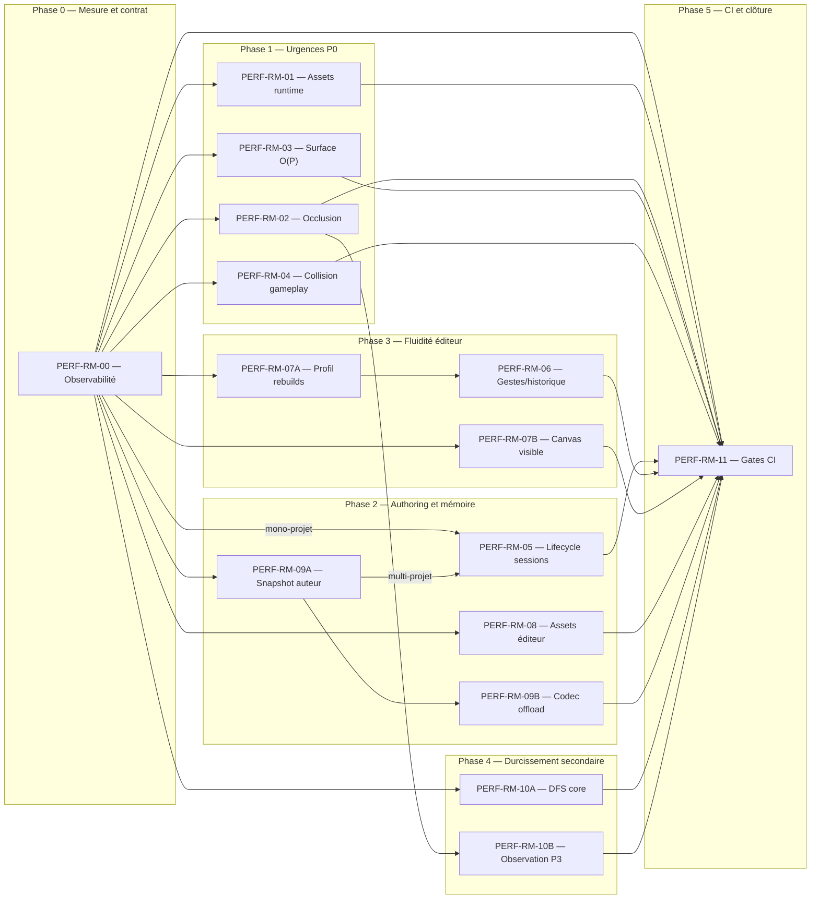

# PokeMap Performance Remediation Roadmap

> **For agentic workers:** REQUIRED SUB-SKILL: Use `subagent-driven-development` (recommended) or `executing-plans` to implement this roadmap lot by lot. Every lot must first be expanded into the dedicated implementation plan named below, and progress must use checkbox (`- [ ]`) tracking.

**Goal:** Ramener PokeMap dans des budgets reproductibles sur le runtime chargé, les grandes surfaces, les grandes maps et les longues sessions d'authoring, sans régression fonctionnelle, visuelle, de sérialisation ou de parité PokeMap MCP.

**Architecture:** Déplacer les coûts des boucles chaudes vers des index calculés à la mutation ou au chargement, borner explicitement la mémoire par projet, séparer données statiques et dynamiques, limiter le rendu au viewport avec halo, et sortir I/O/décodage des chemins UI. Les budgets restent d'abord en observation ; seuls les benchmarks déterministes deviennent bloquants après calibration.

**Tech Stack:** Dart 3, Flutter desktop, Flame 1.37.0, packages purs `map_core`/`map_gameplay`/`map_battle`/`map_authoring`, packages Flutter `map_runtime`/`map_editor`, hôte `examples/playable_runtime_host`, tests Dart/Flutter, profile macOS, artifacts JSON et GitHub Actions.

---

## 1. Contrat de cette roadmap

**Statut :** `PLANNED`
**État d'exécution :** `READY FOR LOT PLANNING`, pas `READY FOR IMPLEMENTATION`
**Date :** 2026-08-01
**Source de vérité :** `reports/performance/pokemap_full_performance_audit.md`
**HEAD observé à la rédaction :** `main@7f35d44d9`

Ce document est une roadmap portefeuille, pas une autorisation d'implémenter tous les lots d'un bloc. Les clusters `RM-07`, `RM-09` et `RM-10` sont volontairement divisés en sous-lots avec plans séparés afin de préserver les frontières de packages. Chaque lot doit rester livrable, mesurable et réversible indépendamment.

Les quinze plans détaillés nommés ci-dessous ne sont pas créés par cette tâche. La section 5.1 rend les mesures before/after exécutables une fois `RM-00` livré, mais aucun agent ne doit modifier le code d'un sous-lot avant d'avoir produit son plan test-first avec les diffs et étapes de code exacts.

- [ ] Créer le plan d'implémentation dédié indiqué par le lot avant toute modification de code.
- [ ] Relire le `SKILL.md` correspondant au travail : `systematic-debugging` pour une anomalie, `test-driven-development` pour le comportement, `verification-before-completion` avant le verdict, et `using-pokemap-mcp` lorsque la parité s'applique.
- [ ] Établir la baseline sur le même HEAD et les mêmes fixtures avant le premier patch du lot.
- [ ] Ajouter d'abord un test de caractérisation ou un benchmark qui échoue sur le budget, puis faire le changement minimal.
- [ ] Produire l'Evidence Pack exact indiqué par le lot, conformément à `codex_rule.md`.
- [ ] Ne pas modifier `pokemap_roadmap_mecaniques_fangame.md` sans demande explicite.
- [ ] Ne lancer aucune écriture Git, création de branche/worktree, commit ou push sans autorisation explicite de l'utilisateur.

La clôture globale exige que chaque finding soit soit fermé par preuve, soit explicitement différé avec risque accepté. Une amélioration locale sans mesure après changement ne ferme aucun lot.

## 2. Audit initial et résultat attendu

L'audit recense 16 findings : 2 `CRITICAL`, 4 `HIGH`, 8 `MEDIUM` et 2 `LOW`.

| Finding | Sévérité | Symptôme de référence | Lot de traitement |
|---|---|---|---|
| `PERF-RT-01` | CRITICAL | build runtime p50/p95 97,889/126,005 ms ; 150/155 frames >33,3 ms | `PERF-RM-02` |
| `PERF-SURFACE-01` | CRITICAL | resolver/painter Surface proche de 0,8 s à 2 500 placements | `PERF-RM-03` |
| `PERF-GAME-01` | HIGH | move 256² 50,487 ms ; 512² 179,559 ms ; bitmap pixel mondial | `PERF-RM-04` |
| `PERF-AUTH-01` | HIGH | open + snapshot Selbrume ~595 ms ; delta RSS 187,6–239,7 Mo | `PERF-RM-09A` |
| `PERF-AUTH-02` | HIGH | environ 41,7 Mo retenus par projet auteur supplémentaire | `PERF-RM-05` |
| `PERF-ED-01` | HIGH | copie de couche complète ; 100 snapshots 512² +186,3 Mo RSS | `PERF-RM-06` |
| `PERF-ED-02` | MEDIUM | mutation locale invalide shell et projections globales | investigation conditionnelle `PERF-RM-07A` |
| `PERF-CANVAS-01` | MEDIUM | smart tiles/ombres projetés avant le viewport | investigation conditionnelle `PERF-RM-07B` |
| `PERF-RT-02` | MEDIUM | double décodage simultané de cinq tilesets | `PERF-RM-01` |
| `PERF-ASSET-01` | MEDIUM | I/O et décodage synchrones dans `build` | runtime `PERF-RM-01`, éditeur `PERF-RM-08` |
| `PERF-ASSET-02` | MEDIUM | caches non bornés et lifecycle incomplet | runtime `PERF-RM-01`, éditeur `PERF-RM-08` |
| `PERF-IO-01` | MEDIUM | JSON/validation synchrones autour des I/O | `PERF-RM-09B` |
| `PERF-CORE-01` | MEDIUM | validation de groupes cubique ; 325,956 ms à 400 | `PERF-RM-10A` |
| `PERF-CI-01` | MEDIUM | hotspots critiques absents des gates CI | `PERF-RM-00`, puis `PERF-RM-11` |
| `PERF-BATTLE-01` | LOW | historique quadratique seulement à durée extrême | observation sans code `PERF-RM-10B` |
| `PERF-RT-03` | LOW | allocations mono-chunk secondaires | option conditionnelle `PERF-RM-10B` |

Résultat produit attendu après `PERF-RM-04` : les trois bloqueurs de scalabilité P0 sont sous budget avec parité fonctionnelle et visuelle. Résultat attendu après `PERF-RM-11` : les gains sont protégés par des benchmarks reproductibles, des artifacts et des règles de régression calibrées.

## 3. Lots mécaniques FG concernés

Cette roadmap de performance ne clôt pas un lot mécanique à elle seule.

| Lot FG | État actuel à préserver | Relation avec la roadmap |
|---|---|---|
| `FG-000` | `TODO` | L'audit performance ne remplit pas la DoD de l'audit mécanique ; aucun changement de statut proposé. |
| `FG-014` | `DONE` | Les changements I/O/save doivent rerun les preuves de transaction et rollback. |
| `FG-016` | `TODO` | Les lots runtime fournissent un gate de boot plus fiable, mais ne prouvent pas le flow new game complet. |
| `FG-182` | `DONE` | Le Golden Slice end-to-end devient une non-régression obligatoire. |
| `FG-183` | `DONE` | La matrice de régression doit référencer les nouveaux benchmarks sans perdre ses preuves existantes. |
| `FG-185` | `PARTIAL / NO-GO` | Les performances renforcent le release gate mais ne lèvent ni RM-071 ni la recette humaine. |

## 4. Budgets provisoires et règles de décision

Ces budgets viennent de l'audit. Ils restent en mode observation jusqu'à dix exécutions représentatives sur le runner cible. Les percentiles de build et raster ne doivent jamais être additionnés séparément ; la décision frame utilise les timings par frame.

| Action ou métrique | Cible idéale | Sortie acceptable | Régression / No-Go |
|---|---:|---:|---:|
| Frame éditeur 60 FPS | p95 ≤16,67 ms ; <0,5 % >33,3 ms | p95 ≤24 ms ; <2 % >33,3 ms | p95 >33,3 ms ou ≥5 % >33,3 ms |
| Frame runtime 60 FPS | p95 ≤16,67 ms ; <0,5 % >33,3 ms | p95 ≤20 ms ; <1 % >33,3 ms | p95 >25 ms ou ≥2 % >33,3 ms |
| Cold startup éditeur | ≤2,0 s | ≤4,0 s | >6,0 s ou +20 % |
| Cold startup runtime | ≤1,5 s | ≤3,0 s | >5,0 s ou +20 % |
| Ouverture projet réel | ≤400 ms | ≤1,0 s | >1,5 s ou +20 % |
| Changement de map | ≤100 ms | ≤250 ms | >500 ms |
| Sauvegarde `project.json` | ≤100 ms | ≤250 ms | >500 ms |
| Save/load `GameState` | ≤50 ms | ≤150 ms | >300 ms |
| Action interactive principale | p95 ≤16,67 ms | p95 ≤50 ms | p95 >100 ms |
| Action explicite lourde | ≤250 ms ou progression | ≤1 s avec feedback | >2 s sans feedback/annulation |
| Heap/RSS après 10 cycles + GC | croissance ≤20 Mo stabilisée | ≤50 Mo ou ≤10 %, stabilisée | monotone >100 Mo ou >10 % |
| Pic éditeur gros projet | <750 Mo | <1,5 Gio | >2 Gio |
| Pic runtime map dense | <500 Mo | <1 Gio | >1,5 Gio |
| Lane perf critique CI | <5 min | <10 min | >15 min ou +20 % |

Gates spécifiques déjà proposés par l'audit :

- `surface_role_scaling` : topologie 2 500 placements <5 ms en Dart AOT.
- `world_collision_scaling` : move 256² sans masque <5 ms en Dart AOT.
- `group_hierarchy_scaling` : 400 groupes <5 ms en Dart AOT.
- Bundle desktop : alerte à +5 %, gate à +10 % après calibration.
- Battle : alerte à +20 % seulement ; pas de refactor sans scénario produit réel.

## 5. Datasets de référence

Chaque benchmark doit enregistrer le commit, le mode, l'OS, l'architecture, les versions Dart/Flutter/Flame, le fingerprint de fixture, les chauffes, le nombre d'itérations et les percentiles.

| ID | Fixture/scénario | Usage |
|---|---|---|
| A | `golden_battle_slice`, 1 map | petit projet, JSON/snapshot |
| B | `event_builder_v2_selbrume_slice`, 2 maps | projet intermédiaire, authoring/narratif |
| B/C | `promotion_checkpoint`, 10 maps | JSON/validation uniquement ; snapshot interdit tant que la ressource manque |
| C | `selbrume`, 10 maps/31 tilesets/341 éléments | gros réel disponible, mémoire, open, runtime |
| D | maps synthétiques 32² à 1 024² | scaling peinture, Surface, collision |
| E | `selbrume.healing-service` puis `selbrume.mvp` | frames runtime, transitions, battle |
| F | 1/3/10 racines projet distinctes | lifecycle session et cache |

Un fixture versionné de 50–100 maps reste requis avant de prétendre certifier les très gros projets. Les résultats synthétiques prouvent une complexité, pas une expérience utilisateur complète.

### 5.1 Commandes benchmark/profile contractuelles

Les fichiers ci-dessous sont créés par `PERF-RM-00`. Leurs options CLI font partie du contrat de ce lot et doivent être testées. Ces commandes sont les mesures before/after exactes ; les commandes de chaque lot restent les vérifications fonctionnelles minimales.

```bash
cd packages/map_core
mkdir -p build/performance
dart compile exe benchmark/surface_role_scaling.dart -o build/performance/surface_role_scaling
build/performance/surface_role_scaling --warmups 5 --samples 30 --sizes 100,400,900,1024,1600,2500 --output build/performance/surface_role_scaling.json
dart compile exe benchmark/map_paint_gesture.dart -o build/performance/map_paint_gesture
build/performance/map_paint_gesture --warmups 5 --samples 30 --sizes 128,256,512,1024 --stroke-lengths 1,100,1000 --output build/performance/map_paint_gesture.json
dart compile exe benchmark/group_hierarchy_scaling.dart -o build/performance/group_hierarchy_scaling
build/performance/group_hierarchy_scaling --warmups 5 --samples 30 --sizes 10,100,400,800,1600,3200 --output build/performance/group_hierarchy_scaling.json
dart compile exe benchmark/json_roundtrip_scaling.dart -o build/performance/json_roundtrip_scaling
build/performance/json_roundtrip_scaling --warmups 5 --samples 30 --bytes 1024,102400,2420033,10485760 --output build/performance/json_roundtrip_scaling.json
```

```bash
cd packages/map_gameplay
mkdir -p build/performance
dart compile exe benchmark/world_collision_scaling.dart -o build/performance/world_collision_scaling
build/performance/world_collision_scaling --warmups 5 --samples 30 --sizes 32,64,128,256 --isolated-size 512 --isolated-runs 3 --output build/performance/world_collision_scaling.json
```

```bash
cd packages/map_authoring
mkdir -p build/performance
dart compile exe benchmark/authoring_snapshot_open.dart -o build/performance/authoring_snapshot_open
build/performance/authoring_snapshot_open --warmups 2 --samples 15 --fixtures small,intermediate,selbrume,synthetic-10mb --roots 1,3,10 --cycles 10 --output build/performance/authoring_snapshot_open.json
```

```bash
cd packages/map_battle
mkdir -p build/performance
dart compile exe benchmark/battle_turn_baseline.dart -o build/performance/battle_turn_baseline
build/performance/battle_turn_baseline --warmups 5 --samples 30 --turns 100,500,1000,2000,5000 --output build/performance/battle_turn_baseline.json
```

```bash
cd examples/playable_runtime_host
dart run tool/pokemap_eval.dart run selbrume.healing-service --target interactive --build-mode profile --runs 3 --json-output build/performance/runtime_selbrume_journey.json
```

```bash
cd packages/map_editor
flutter drive --profile -d macos --driver=test_driver/performance_driver.dart --target=integration_test/editor_project_journey_test.dart --dart-define=POKEMAP_PERF_OUTPUT=build/performance/editor_project_journey.json
```

Les quatre premières familles AOT peuvent être conditionnées aux chemins sur PR après calibration. Battle, profile Flutter, RSS/heap/native et builds restent nightly/weekly. Chaque commande doit refuser une fixture inconnue, un nombre d'échantillons nul et un chemin de sortie hors du package.

## 6. Phases, dépendances et parallélisation



| Phase | Objectif | Lots regroupés | Effort indicatif | Critère de sortie |
|---|---|---|---:|---|
| 0 — Mesure et contrat | Rendre les gains comparables avant tout patch | `RM-00` | 3–5 j.p. | Harness versionnés, trois baselines comparables, artifacts JSON et CI en observation ; aucun seuil dur. |
| 1 — Urgences P0 | Retirer les blocages runtime et grandes maps | `RM-01`, `RM-02`, `RM-03`, `RM-04` | 11–21 j.p. | Single-flight runtime vert, runtime p95 ≤20 ms, Surface 2 500 <5 ms, collision 256² <5 ms, parités visuelle et gameplay vertes. |
| 2 — Authoring, mémoire et I/O | Stabiliser ouverture, sessions, assets et persistance | `RM-09A`, `RM-05`, `RM-08`, `RM-09B` | 12–20 j.p. | Snapshot/fingerprint cohérents, politique mono/multi-projets prouvée, caches éditeur bornés, aucune I/O/decode dans `build`, CAS/recovery verts. |
| 3 — Fluidité éditeur | Isoler les rebuilds, borner le canvas et réduire le coût des gestes | `RM-07A`, `RM-07B`, `RM-06` | 10–18 j.p. | Investigations reproductibles ; patches uniquement si confirmés ; frame éditeur ≤24 ms acceptable, historique et viewport sous budget. |
| 4 — Durcissement secondaire | Corriger le core mesuré et observer les faibles priorités | `RM-10A`, `RM-10B` | 2–5 j.p. | Hiérarchie 400 groupes <5 ms ; battle/runtime secondaire documenté `NO CODE` ou corrigé avec hotspot réel. |
| 5 — CI et clôture | Transformer les budgets calibrés en protection durable | `RM-11` | 3–7 j.p. | Dix runs d'observation, gates déterministes, nightlies profile/RSS, artifacts lisibles et verdict final par finding. |

Total séquentiel indicatif : 41–76 jours-personnes. Ce n'est pas un engagement calendaire. Deux pistes peuvent avancer en parallèle si elles ne modifient pas le même fichier et si leurs baselines partagent le même commit.

Les numéros de phase expriment l'ordre de décision, pas une sérialisation absolue. Après la Phase 0, les caractérisations des Phases 2, 3 et 4 peuvent avancer pendant la Phase 1 si les fichiers ne se chevauchent pas. En revanche, la Phase 5 ne durcit aucun seuil tant que les lots qui alimentent ce seuil n'ont pas atteint leur propre critère de sortie.

## Task 1: PERF-RM-00 — Observabilité et baseline reproductible

**Phase :** 0 — Mesure et contrat
**Priorité :** fondation P0
**Findings :** socle de tous les lots, début de `PERF-CI-01`
**Plan dédié :** `reports/performance/plans/2026-08-01-pokemap-perf-rm-00-observability.md`
**Evidence Pack :** `reports/performance/perf_rm_00_observability.md`

**Fichiers :**

- Create: `packages/map_core/benchmark/surface_role_scaling.dart`
- Create: `packages/map_core/benchmark/map_paint_gesture.dart`
- Create: `packages/map_core/benchmark/group_hierarchy_scaling.dart`
- Create: `packages/map_core/benchmark/json_roundtrip_scaling.dart`
- Create: `packages/map_gameplay/benchmark/world_collision_scaling.dart`
- Create: `packages/map_authoring/benchmark/authoring_snapshot_open.dart`
- Create: `packages/map_battle/benchmark/battle_turn_baseline.dart`
- Create: `packages/map_editor/integration_test/editor_project_journey_test.dart`
- Create: `packages/map_editor/test_driver/performance_driver.dart`
- Modify: `examples/playable_runtime_host/lib/src/evaluation/interactive/interactive_frame_metrics.dart`
- Modify: `examples/playable_runtime_host/test/evaluation/interactive_frame_metrics_test.dart`
- Modify: `examples/playable_runtime_host/tool/pokemap_eval.dart`
- Modify: `.github/workflows/pokemap_hub_product_certification.yml` uniquement pour collecte non bloquante

- [ ] Écrire les harnesses déterministes avec warmups, p50/p95/p99, compteurs d'itérations, RSS/heap lorsque disponible et sortie JSON versionnée.
- [ ] Conserver séparés les deux harnesses de peinture : coût pur `map_core` et frames/rebuilds Flutter.
- [ ] Marquer explicitement les mesures gameplay 256²/512² historiques comme single shots jusqu'à répétition ; exécuter 512² dans trois processus isolés, jamais dans une boucle qui retient plusieurs mondes.
- [ ] Capturer trois runs locaux A–F sur `main@7f35d44d9` ou refaire toute la baseline si le HEAD change.
- [ ] Ajouter une lane CI d'observation qui publie l'artifact mais ne bloque aucun PR.
- [ ] Ajouter un mode profile versionné au runner runtime et un journey éditeur via `flutter drive --profile`; `flutter test` debug/JIT ne sert pas de proxy profile.
- [ ] Maintenir un manifeste explicite de tests ; proscrire la découverte globale `flutter test --tags performance` dans `map_editor`.
- [ ] Tester le collector sur percentiles connus, zéro frame, échantillons non triés, JSON malformé et version de schéma inconnue.
- [ ] Rejeter explicitement `promotion_checkpoint` pour le snapshot tant que sa ressource déclarée manque.
- [ ] Documenter la variance et les limites machine ; séparer Dart AOT, Flutter JIT, Flutter profile, heap JIT, RSS AOT et mémoire native ; ne pas transformer RSS/profile en gate dur.

**Go :** chaque harness produit le même schéma, les fixtures sont fingerprintées, trois runs sont comparables et les métriques runtime exposent p50/p95/p99 ainsi que les taux >16,67/>33,3 ms. Après dix runs d'observation, un blocage demande simultanément un seuil absolu dépassé et une régression relative reproduite deux fois.
**No-Go :** dataset non versionné, mode JIT comparé à AOT, frame percentiles additionnés, métrique absente traitée comme zéro, ou seuil bloquant activé avant dix runs CI d'observation.

**Vérification minimale :**

```bash
cd packages/map_core && dart test && dart analyze
cd packages/map_gameplay && dart test && dart analyze
cd packages/map_authoring && dart test && dart analyze
cd packages/map_battle && dart test && dart analyze
cd packages/map_editor && flutter drive --profile -d macos --driver=test_driver/performance_driver.dart --target=integration_test/editor_project_journey_test.dart
cd examples/playable_runtime_host && flutter test test/evaluation/interactive_frame_metrics_test.dart && flutter analyze
```

## Task 2: PERF-RM-01 — Ownership assets runtime et quick wins

**Phase :** 1 — Urgences P0
**Priorité :** P1 rapide, avant refactors lourds
**Findings :** `PERF-RT-02`, parts runtime de `PERF-ASSET-01` et `PERF-ASSET-02`
**Dépendance :** compteurs de `PERF-RM-00`
**Plan dédié :** `reports/performance/plans/2026-08-01-pokemap-perf-rm-01-runtime-asset-ownership.md`
**Evidence Pack :** `reports/performance/perf_rm_01_runtime_asset_ownership.md`

**Fichiers :**

- Modify: `packages/map_runtime/lib/src/infrastructure/tile_image_loader.dart`
- Modify: `packages/map_runtime/lib/src/presentation/flame/playable_map_game.dart`
- Modify: `packages/map_runtime/lib/src/presentation/flutter/battle_mobile_command_overlay.dart`
- Reference pattern: `packages/map_runtime/lib/src/presentation/flame/battle_fx_bundle_cache.dart`
- Create: `packages/map_runtime/test/tile_image_loader_singleflight_test.dart`
- Create: `packages/map_runtime/test/battle_mobile_command_overlay_asset_loading_test.dart`

- [ ] Caractériser deux callers concurrents sur la même clé `(path, transparentColor)` et prouver deux décodages avant le patch.
- [ ] Stocker la future en vol, partager son résultat, et retirer l'entrée en cas d'erreur pour autoriser un retry.
- [ ] Entourer tout codec créé par ce chemin d'un `try/finally` avec `dispose()` ; ne pas disposer une `ui.Image` encore possédée par un caller.
- [ ] Retirer toute lecture/décodage synchrone du `build` de l'overlay battle et exprimer loading/error sans cacher un appel synchrone derrière un `FutureBuilder`.
- [ ] Garder les types `ui.Image`, leases et caches Flutter dans `map_runtime`; ne rien déplacer vers `map_core`.
- [ ] Vérifier deux clés de transparence distinctes, deux fichiers distincts, erreur puis retry, et fermeture/reload.
- [ ] Reprofiler le boot Selbrume et conserver le gain comme quick win sans prétendre fermer `PERF-RT-01`.

**Go :** exactement un load/decode pour N appels concurrents identiques, retry vert après erreur, aucune seconde séquence des cinq tilesets Selbrume, aucune I/O synchrone dans `build`, rendu identique.
**No-Go :** future échouée retenue, mauvaise image partagée entre clés, codec/image utilisé après dispose, ou régression de transition.

```bash
cd packages/map_runtime && flutter test test/tile_image_loader_singleflight_test.dart test/battle_fx_bundle_cache_test.dart test/battle_mobile_command_overlay_asset_loading_test.dart && flutter test && flutter analyze
cd examples/playable_runtime_host && flutter test test/phase_a_golden_slice_launch_test.dart && flutter analyze
```

## Task 3: PERF-RM-02 — Occlusion runtime immutable et culling caméra

**Phase :** 1 — Urgences P0
**Priorité :** P0, premier hotspot runtime
**Finding :** `PERF-RT-01`
**Dépendance :** `PERF-RM-00`
**Plan dédié :** `reports/performance/plans/2026-08-01-pokemap-perf-rm-02-runtime-occlusion.md`
**Evidence Pack :** `reports/performance/perf_rm_02_runtime_occlusion.md`

**Fichiers :**

- Modify: `packages/map_runtime/lib/src/presentation/flame/placed_element_occlusion_patch_component.dart`
- Modify: `packages/map_runtime/lib/src/presentation/flame/quarter_turn_pixel_renderer.dart`
- Modify only if required: `packages/map_runtime/lib/src/presentation/flame/playable_map_game.dart`
- Reuse: `packages/map_runtime/lib/src/presentation/flame/static_placed_element_occlusion_patch_resolution.dart`
- Reuse: `packages/map_core/lib/src/operations/map_placed_element_footprint.dart`
- Modify tests: `packages/map_runtime/test/placed_element_occlusion_patch_component_test.dart`
- Modify tests: `packages/map_runtime/test/quarter_turn_pixel_renderer_test.dart`
- Modify tests: `packages/map_runtime/test/runtime_occlusion_visual_smoke_test.dart`
- Modify tests: `packages/map_runtime/test/building_runtime_occlusion_golden_slice_test.dart`

- [ ] Consulter Flame docs ; si la recherche reste vide, rester sur Flame 1.37.0 et les patterns existants du dépôt.
- [ ] Ajouter un test prouvant que la géométrie issue de `_drawRuns` est construite une fois et réutilisée sur plusieurs renders.
- [ ] Introduire une représentation immutable locale au composant ; ne pas réécrire le moteur de rendu Flame.
- [ ] Culler les patches hors `camera.visibleWorldRect` avec un halo suffisant pour les rotations et le display scale.
- [ ] Vérifier rotations 0–3, masques pleins/creux/asymétriques, masque vide/invalide, opacité, transparence, échelle, ordre acteur/objet et bords du viewport.
- [ ] Exécuter trois profils non intrusifs `selbrume.healing-service` et comparer la médiane des runs à la baseline.

**Go :** géométrie statique construite une fois, zéro rééchantillonnage pixel en steady-state, zéro draw hors viewport, runtime Selbrume p95 ≤20 ms et <1 % des frames >33,3 ms sur la médiane de trois runs, avec objectif p95 ≤16,67 ms ; raster sans régression >20 %, goldens et ordre de profondeur inchangés.
**No-Go :** un seul profil, culling visuellement incorrect, cache global opaque, hausse mémoire non expliquée, ou gain obtenu en désactivant l'occlusion.

```bash
cd packages/map_runtime && flutter test test/placed_element_occlusion_patch_component_test.dart test/quarter_turn_pixel_renderer_test.dart test/runtime_occlusion_visual_smoke_test.dart test/building_runtime_occlusion_golden_slice_test.dart
cd packages/map_runtime && flutter test test/phase_a_golden_battle_slice_smoke_test.dart && flutter analyze
cd examples/playable_runtime_host && flutter test test/phase_a_golden_slice_launch_test.dart && flutter analyze
```

## Task 4: PERF-RM-03 — Topologie Surface O(P), partagée et invalidée

**Phase :** 1 — Urgences P0
**Priorité :** P0, hotspot commun core/editor/runtime
**Finding :** `PERF-SURFACE-01`
**Dépendance :** `PERF-RM-00`
**Plan dédié :** `reports/performance/plans/2026-08-01-pokemap-perf-rm-03-surface-topology.md`
**Evidence Pack :** `reports/performance/perf_rm_03_surface_topology.md`

**Fichiers :**

- Modify: `packages/map_core/lib/src/operations/surface_variant_role_resolver.dart`
- Modify if public API changes: `packages/map_core/lib/map_core.dart`
- Modify: `packages/map_editor/lib/src/features/surface_painter/surface_layer_static_preview.dart`
- Modify: `packages/map_editor/lib/src/features/surface_painter/surface_tile_preview_resolver.dart`
- Modify: `packages/map_editor/lib/src/ui/canvas/map_canvas/map_grid_painter.dart`
- Modify: `packages/map_runtime/lib/src/presentation/flame/map_layers_component.dart`
- Modify: `packages/map_runtime/lib/src/surface/surface_runtime_resolver.dart`
- Modify tests: `packages/map_core/test/surface_variant_role_resolver_test.dart`
- Modify tests: `packages/map_editor/test/surface_painter/surface_layer_static_preview_test.dart`
- Modify tests: `packages/map_editor/test/surface_painter/surface_tile_preview_resolver_test.dart`
- Modify tests: `packages/map_runtime/test/surface/surface_runtime_resolver_test.dart`
- Modify tests: `packages/map_runtime/test/surface/surface_runtime_golden_slice_test.dart`

- [ ] Caractériser rôles centre/bords/coins, trous, presets, animation et duplicats avant de changer l'algorithme.
- [ ] Construire en un passage l'occupation et les rôles, sans `firstWhere` répété ni cache global mutable.
- [ ] Exposer uniquement la topologie pure dans `map_core`; caches, viewport et invalidation applicative restent localisés dans editor/runtime, qui consomment le même résultat.
- [ ] Rendre uniquement viewport + halo après la résolution topologique, sans coutures aux bords.
- [ ] Comparer bit-à-bit les rôles anciens/nouveaux sur petites fixtures et par golden sur Surface réelle.
- [ ] Couvrir catalog/atlas manquant, layer caché, preset différent et coordonnées invalides sans modifier les diagnostics existants.
- [ ] Mesurer 100, 400, 1 024 et 2 500 placements en AOT, puis les intégrations editor/runtime.

**Go :** 2 500 placements <5 ms pour la topologie AOT, pente compatible O(P), painter Surface <8 ms sur la référence, ratio p95 1 024²/128² ≤1,5 à viewport constant, rôles et goldens identiques, aucune divergence editor/runtime.
**No-Go :** index stale après mutation/undo, API cachée dans l'éditeur, cache global sans ownership, ou différence visuelle non expliquée.

**Parité MCP :** si seule l'implémentation interne change, documenter API/JSONL/MCP `N/A — contrat inchangé` et vérifier que le catalogue live ne change pas. Si une nouvelle sémantique de peinture Surface est exposée, elle doit passer par `map_authoring` et être prouvée en direct, JSONL, éditeur et MCP.

```bash
cd packages/map_core && dart test test/surface_variant_role_resolver_test.dart && dart test && dart analyze
cd packages/map_editor && flutter test test/surface_painter/surface_layer_static_preview_test.dart test/surface_painter/surface_tile_preview_resolver_test.dart && flutter analyze
cd packages/map_runtime && flutter test test/surface/surface_runtime_resolver_test.dart test/surface/surface_runtime_golden_slice_test.dart && flutter analyze
```

## Task 5: PERF-RM-04 — Collision gameplay en couches et stockage borné

**Phase :** 1 — Urgences P0
**Priorité :** P0, risque mécanique élevé
**Finding :** `PERF-GAME-01`
**Dépendance :** `PERF-RM-00`
**Plan dédié :** `reports/performance/plans/2026-08-01-pokemap-perf-rm-04-gameplay-collision.md`
**Evidence Pack :** `reports/performance/perf_rm_04_gameplay_collision.md`

**Fichiers :**

- Modify: `packages/map_gameplay/lib/src/gameplay_world_state.dart`
- Create if needed: `packages/map_gameplay/lib/src/collision/world_collision_storage.dart`
- Modify: `packages/map_gameplay/lib/src/validation/narrative_physical_reachability_validator.dart`
- Modify if public API changes: `packages/map_gameplay/lib/map_gameplay.dart`
- Modify tests: `packages/map_gameplay/test/gameplay_world_state_entity_move_test.dart`
- Modify tests: `packages/map_gameplay/test/placed_elements_collision_test.dart`
- Modify tests: `packages/map_gameplay/test/runtime_movement_collision_regression_test.dart`
- Modify tests: `packages/map_gameplay/test/narrative_physical_reachability_validator_test.dart`
- Create: `packages/map_gameplay/test/gameplay_world_state_collision_storage_characterization_test.dart`

- [ ] Caractériser terrain, masque pixel optionnel, entités mobiles, NPC, visibilité, interaction, warp et reachability.
- [ ] Séparer collision statique et occupancy dynamique ; un déplacement d'entité ne doit plus reconstruire le monde pixel.
- [ ] Remplacer les `List<bool>` mondiales par une représentation packée/chunkée seulement là où un masque pixel existe.
- [ ] Garder les règles dans `map_gameplay`; aucune dépendance Flutter/Flame et aucune migration JSON au premier sous-lot.
- [ ] Couvrir `applyCollision=false`, profil/élément inconnu, entité invisible, hors-limites, cellules legacy et priorité `collisionMask`.
- [ ] Ajouter tests différentiels ancien/nouveau sur petites maps et invariants de scaling 32²–512² ; exécuter 512² dans trois processus isolés.
- [ ] Rejouer les bridges runtime et le Golden Slice après les tests purs.

**Go :** move 256² sans masque p95 <5 ms AOT, aucun stockage `worldPixelWidth × worldPixelHeight` sans masque, stockage statique partagé lors d'un move, objectif de réduction RSS ≥90 % sur la même référence 256² avant calibration multi-OS, mémoire stabilisée, parité complète collision/interaction/reachability.
**No-Go :** changement de règle métier, données gameplay déplacées dans Flame, migration schema non planifiée, ou benchmark rapide qui ignore les masques/entités.

```bash
cd packages/map_gameplay && dart test test/gameplay_world_state_entity_move_test.dart test/gameplay_world_state_collision_storage_characterization_test.dart test/placed_elements_collision_test.dart test/runtime_movement_collision_regression_test.dart test/narrative_physical_reachability_validator_test.dart
cd packages/map_gameplay && dart test && dart analyze
cd packages/map_runtime && flutter test test/playable_map_game_world_state_v1_integration_test.dart test/phase_a_golden_battle_slice_smoke_test.dart && flutter analyze
cd examples/playable_runtime_host && flutter test test/phase_a_golden_slice_launch_test.dart && flutter analyze
```

## Task 6: PERF-RM-05 — Lifecycle des sessions authoring

**Phase :** 2 — Authoring, mémoire et I/O
**Priorité :** P1 mémoire, quick win conditionnel
**Finding :** `PERF-AUTH-02`
**Dépendance :** `PERF-RM-00` et décision explicite mono-projet actif ou multi-projets. En mono-projet, close-on-switch est indépendant ; en multi-projets, la borne LRU est calibrée après `PERF-RM-09A`.
**Plan dédié :** `reports/performance/plans/2026-08-01-pokemap-perf-rm-05-authoring-session-lifecycle.md`
**Evidence Pack :** `reports/performance/perf_rm_05_authoring_session_lifecycle.md`

**Fichiers :**

- Modify: `packages/map_editor/lib/src/application/authoring_api/authoring_query_adapter.dart`
- Modify: `packages/map_editor/lib/src/application/authoring_api/authoring_mutation_adapter.dart`
- Modify: `packages/map_editor/lib/src/app/providers/core/repository_providers.dart`
- Modify: `packages/map_editor/lib/src/infrastructure/repositories/file_repositories.dart`
- Modify only if lifecycle ownership requires it: `packages/map_editor/lib/src/features/editor/state/editor_notifier.dart`
- Modify only if canonical lease is required: `packages/map_authoring/lib/src/workspace/project_open_service.dart`
- Create: `packages/map_editor/test/authoring_api/authoring_session_lifecycle_test.dart`

- [ ] Écrire les tests 1/3/10 racines avec GC, requêtes en vol, open en erreur, switch rapide et close idempotent.
- [ ] Décider avant code : un projet actif implique close-on-switch ; plusieurs projets impliquent leases/LRU après optimisation et mesure de `PERF-RM-09A`. Ne pas conserver une session par chemin sans borne.
- [ ] Fermer déterministiquement les workspaces quittés, annuler/invalider les requêtes obsolètes et empêcher un résultat tardif de remplacer le projet courant.
- [ ] Rejouer ouverture, query, mutation, fermeture et réouverture via API directe, éditeur et transport MCP lorsque applicable.
- [ ] Mesurer le retour 3→1 projets après GC et vérifier les handles fichiers.

**Go :** après dix bascules/racines, retour à l'état cible et GC, croissance idéale ≤20 Mo, acceptable ≤50 Mo ou ≤10 % ; aucun handle inactif en mono-projet ou respect strict de la borne LRU ; close idempotent ; aucune réponse stale ; workflow editor inchangé.
**No-Go :** éviction pendant une mutation, perte de données non sauvegardées, élargissement des racines workspace, ou cache borné uniquement en nombre sans poids/lifecycle.

**Parité MCP :** obligatoire pour open/query/close si le contrat de workspace change. Conserver des racines absolues et étroites ; `workspace.path_outside_allowed_roots` reste un rejet de sécurité valide.

```bash
cd packages/map_editor && flutter test test/authoring_api/authoring_session_lifecycle_test.dart test/authoring_api/editor_read_parity_test.dart test/authoring_api/editor_mutation_parity_test.dart && flutter analyze
cd packages/map_authoring && dart run tool/pmcp085_conformance.dart && dart test test/parity/full_authoring_parity_test.dart && dart analyze
cd tools/pokemap_mcp && npm run check && npm test
```

## Task 7: PERF-RM-06 — Transactions de geste et historique delta

**Phase :** 3 — Fluidité éditeur
**Priorité :** P1, risque élevé undo/save
**Finding :** `PERF-ED-01`
**Dépendance :** caractérisation pure possible après `PERF-RM-00`; correction performance après le profile-gate `PERF-RM-07A`, afin de ne pas attribuer les rebuilds globaux à la copie de couche.
**Plan dédié :** `reports/performance/plans/2026-08-01-pokemap-perf-rm-06-editor-gesture-history.md`
**Evidence Pack :** `reports/performance/perf_rm_06_editor_gesture_history.md`

**Fichiers :**

- Modify: `packages/map_core/lib/src/operations/map_paint.dart`
- Modify: `packages/map_core/lib/src/operations/map_collision.dart`
- Modify: `packages/map_editor/lib/src/application/services/map_history_coordinator.dart`
- Modify: `packages/map_editor/lib/src/application/models/map_history_snapshot.dart`
- Modify only at the transaction boundary: `packages/map_editor/lib/src/features/editor/state/editor_notifier.dart`
- Modify tests: `packages/map_editor/test/map_editing_controller_test.dart`
- Modify tests: `packages/map_editor/test/ui/world_map/world_map_gate_6_essential_journey_test.dart`
- Create: `packages/map_core/test/map_paint_gesture_transaction_test.dart`
- Create: `packages/map_editor/test/map_history_delta_retention_test.dart`

- [ ] Caractériser paint/erase/fill/collision, trait annulé, undo/redo, dirty state et save/reopen.
- [ ] Accumuler les cellules ou chunks modifiés pendant le geste, puis publier une seule mutation logique à la fin.
- [ ] Stocker un delta réversible dans l'historique ; garder un snapshot public seulement aux frontières qui l'exigent.
- [ ] Garantir qu'un crash/annulation au milieu d'un geste n'enregistre pas une action partielle ambiguë.
- [ ] Mesurer séparément CPU d'un trait et mémoire de 100 entrées undo sur 128²–1 024².
- [ ] Si le geste devient une nouvelle sémantique publique, le faire porter par l'API canonical `map_authoring`, pas par un controller éditeur privé.

**Go :** un snapshot public et une entrée d'historique par geste, coût proportionnel aux cellules touchées, feedback frame p95 ≤24 ms et commit d'un trait de 1 000 cellules sur map 512² p95 ≤50 ms, 100 entrées historiques après GC idéales ≤20 Mo et acceptables ≤50 Mo ou ≤10 %, undo/redo bit-identique, JSON inchangé, save/reopen vert.
**No-Go :** coalescence de gestes distincts, perte de collision, historique non déterministe, bypass de `map_authoring`, ou benchmark qui ne mesure qu'une cellule.

```bash
cd packages/map_core && dart test test/map_paint_gesture_transaction_test.dart && dart test && dart analyze
cd packages/map_editor && flutter test test/map_history_delta_retention_test.dart test/map_editing_controller_test.dart test/ui/world_map/world_map_gate_6_essential_journey_test.dart test/selbrume_editor_repository_roundtrip_test.dart && flutter analyze
cd packages/map_authoring && dart test test/history/undo_redo_contract_test.dart test/history/history_retention_test.dart test/parity/full_authoring_parity_test.dart && dart analyze
```

## Task 8: PERF-RM-07A/B — Deux investigations éditeur indépendantes

**Phase :** 3 — Fluidité éditeur
**Priorité :** P1 investigation ; P2 implémentation si le profil ne confirme pas un impact P1
**Findings :** `PERF-ED-02` pour `RM-07A`, `PERF-CANVAS-01` pour `RM-07B`
**Dépendance :** `PERF-RM-00`; aucune dépendance d'implémentation entre ces deux sous-lots ni avec l'occlusion Flame
**Plans dédiés :**

- `reports/performance/plans/2026-08-01-pokemap-perf-rm-07a-editor-semantic-revisions.md`
- `reports/performance/plans/2026-08-01-pokemap-perf-rm-07b-canvas-visible-projections.md`

**Evidence Packs :**

- `reports/performance/perf_rm_07a_editor_semantic_revisions.md`
- `reports/performance/perf_rm_07b_canvas_visible_projections.md`

### PERF-RM-07A — Révisions sémantiques

**Fichiers :**

- Modify only if profile confirms: `packages/map_editor/lib/src/ui/editor_shell_page.dart`
- Modify only if profile confirms: `packages/map_editor/lib/src/features/editor/state/editor_selectors.dart`
- Modify only at narrow invalidation points: `packages/map_editor/lib/src/features/editor/state/editor_notifier.dart`
- Modify tests: `packages/map_editor/test/editor_shell_page_smoke_test.dart`
- Modify: `packages/map_editor/test/ui/world_map/world_map_rebuild_isolation_test.dart`

- [ ] Profiler open→map switch→pan→paint→undo→save avec compteurs de builds/projections pour mutations narrative et non narrative.
- [ ] Fermer le sous-lot `NOT CONFIRMED — NO CODE` si aucune projection globale hors budget n'est reproduite.
- [ ] Si confirmé, séparer révisions document/narrative/asset/viewport sans introduire un second système d'état.
- [ ] Invalider seulement les read models dont les entrées changent ; tester inspector, recherche, map switch, undo et données stale.

**Go investigation :** profil reproductible et décision documentée. **Go implémentation :** mutation tile = zéro rebuild d'index narratif, mutation narrative = une invalidation pertinente, action principale p95 ≤50 ms.
**No-Go :** patch sans profil, UI stale, ou refonte globale du state management.

### PERF-RM-07B — Projections canvas visibles

**Fichiers :**

- Modify only if profile confirms: `packages/map_editor/lib/src/ui/canvas/map_canvas/map_grid_painter.dart`
- Modify only if required: `packages/map_core/lib/src/operations/smart_tile_layer_visual_resolver.dart`
- Modify: `packages/map_editor/lib/src/application/shadow/editor_static_shadow_preview.dart`
- Modify: `packages/map_editor/lib/src/application/shadow/editor_projected_building_shadow_preview.dart`
- Modify tests: `packages/map_editor/test/map_grid_painter_test.dart`
- Modify tests: `packages/map_editor/test/ui/world_map/world_map_large_map_performance_test.dart`
- Modify tests: `packages/map_editor/test/ui/canvas/editor_static_shadow_preview_painter_test.dart`
- Modify tests: `packages/map_core/test/smart_tiles/smart_tile_layer_visual_resolver_test.dart`

- [ ] Profiler standard, smart tiles, ombres et combinaison séparément à viewport constant sur 128²–1 024².
- [ ] Passer au resolver smart-tile ses bornes `startX/startY/endX/endY` existantes au lieu de recalculer toute la map.
- [ ] Pour les ombres, calculer ou réutiliser les bounds puis filtrer le visible ; ne pas inventer un halo arbitraire.
- [ ] Préserver le painter standard comme contrôle, sans ajout généralisé de `RepaintBoundary`.
- [ ] Couvrir viewport invalide/hors map, bords, animation, layer order et éléments tournés.

**Go investigation :** profil reproductible et décision documentée. **Go implémentation :** canvas combiné <8 ms sur 1 024², ratio p95 1 024²/128² ≤1,5 à viewport constant, painter standard toujours proche de sa baseline ~2 ms, aucune couture.
**No-Go :** optimisation globale non justifiée, coutures, halo arbitraire, ou régression du painter standard.

```bash
cd packages/map_core && dart test test/smart_tiles/smart_tile_layer_visual_resolver_test.dart && dart analyze
cd packages/map_editor && flutter test test/editor_shell_page_smoke_test.dart test/ui/world_map/world_map_rebuild_isolation_test.dart test/map_grid_painter_test.dart test/ui/world_map/world_map_large_map_performance_test.dart test/ui/canvas/editor_static_shadow_preview_painter_test.dart && flutter test && flutter analyze
```

## Task 9: PERF-RM-08 — Pipeline assets éditeur async et LRU en octets

**Phase :** 2 — Authoring, mémoire et I/O
**Priorité :** P1/P2
**Findings :** parts éditeur de `PERF-ASSET-01` et `PERF-ASSET-02`
**Dépendance :** `PERF-RM-00`; le scope projet doit respecter la décision lifecycle `PERF-RM-05`, sans partager de cache avec le runtime
**Plan dédié :** `reports/performance/plans/2026-08-01-pokemap-perf-rm-08-editor-asset-pipeline.md`
**Evidence Pack :** `reports/performance/perf_rm_08_editor_asset_pipeline.md`

**Fichiers :**

- Modify/extend: `packages/map_editor/lib/src/ui/assets/editor_image_cache.dart`
- Modify: `packages/map_editor/lib/src/features/environment_studio/widgets/environment_element_thumbnail.dart`
- Modify: `packages/map_editor/lib/src/features/path_studio/path_pattern_tileset_image_info_loader.dart`
- Modify: `packages/map_editor/lib/src/features/path_studio/path_studio_tileset_image_picker.dart`
- Modify: `packages/map_editor/lib/src/ui/canvas/tileset_editor_canvas.dart`
- Modify tests: `packages/map_editor/test/editor_image_cache_test.dart`
- Create: `packages/map_editor/test/environment_studio/environment_element_thumbnail_async_test.dart`

- [ ] Injecter un file reader/decodeur lent et prouver qu'aucun `existsSync`, `readAsBytesSync` ou decode CPU ne s'exécute dans `build`.
- [ ] Centraliser source décodée + crops dans un service scoped projet, single-flight et LRU pondéré par octets décodés.
- [ ] Étendre `editor_image_cache.dart` et son provider existants ; ne pas créer un second cache global ni introduire des types Flutter dans `map_core`.
- [ ] Inclure révision/mtime/content fingerprint dans la clé et invalider après modification de fichier.
- [ ] Utiliser leases/refcount ou ownership équivalent ; disposer codecs et images uniquement lorsque plus aucun consommateur ne les peint.
- [ ] Afficher loading/error via les widgets du design system et préserver light/dark/accessibilité.
- [ ] Mesurer 100 assets, doublons, erreurs, eviction, switch projets et 10 cycles avec GC/native memory.

**Go :** zéro I/O/decode synchrone dans `build`, un decode par source/révision en concurrence, eviction sûre, previews non stale, croissance stabilisée ≤50 Mo ou ≤10 %.
**No-Go :** `FutureBuilder` autour d'un appel encore synchrone, cache global par chemin seul, limite en nombre sans poids, image disposée encore affichée, ou préchargement intégral.

```bash
cd packages/map_editor && flutter test test/editor_image_cache_test.dart test/environment_studio/environment_element_thumbnail_async_test.dart && flutter test && flutter analyze
```

## Task 10: PERF-RM-09A/B — Snapshot authoring puis codec offload applicatif

**Phase :** 2 — Authoring, mémoire et I/O
**Priorité :** P1, risque cohérence/CAS élevé
**Findings :** `PERF-AUTH-01` pour `RM-09A`, `PERF-IO-01` pour `RM-09B`
**Dépendances :** `PERF-RM-00`; `RM-09B` commence après la baseline et le contrat stabilisé de `RM-09A`
**Plans dédiés :**

- `reports/performance/plans/2026-08-01-pokemap-perf-rm-09a-authoring-snapshot.md`
- `reports/performance/plans/2026-08-01-pokemap-perf-rm-09b-application-codec-offload.md`

**Evidence Packs :**

- `reports/performance/perf_rm_09a_authoring_snapshot.md`
- `reports/performance/perf_rm_09b_application_codec_offload.md`

### PERF-RM-09A — Snapshot authoring Phase A

**Fichiers :**

- Modify: `packages/map_authoring/lib/src/workspace/project_snapshot_loader.dart`
- Modify: `packages/map_core/lib/src/operations/narrative_project_fingerprint.dart`
- Modify tests: `packages/map_authoring/test/workspace/project_snapshot_test.dart`
- Modify tests: `packages/map_core/test/narrative_project_fingerprint_test.dart`
- Create: `packages/map_authoring/test/workspace/project_snapshot_concurrency_test.dart`

- [ ] Décomposer read/decode/model/première fingerprint/seconde observation/projections/total sur A, B, Selbrume et 10 Mo synthétiques.
- [ ] Réutiliser `NarrativeProjectFingerprintBuilder` pour hacher en streaming ; ne pas créer une seconde infrastructure.
- [ ] Préserver double vérification, diagnostics, ordre, fingerprint et `ProjectSnapshot.resourceBytes` exactement.
- [ ] Rejeter mutation entre lectures, ressource absente, CAS stale, handle expiré et accès hors racine.
- [ ] Une rétention lazy qui changerait `resourceBytes` est une migration d'API distincte, hors Phase A.

**Go :** moyenne Selbrume <400 ms, p95 ≤1 s, pic RSS réduit d'au moins 30 % sur le même runner, snapshot/fingerprint bit-identiques et concurrence incohérente rejetée.
**No-Go :** snapshot incohérent, hash différent, seconde vérification supprimée, ressource absente ignorée ou frontière workspace affaiblie.

### PERF-RM-09B — Codec offload applicatif

**Fichiers :**

- Modify: `packages/map_editor/lib/src/infrastructure/repositories/file_repositories.dart`
- Modify: `packages/map_runtime/lib/src/infrastructure/file_game_save_repository.dart`
- Modify tests: `packages/map_editor/test/selbrume_editor_repository_roundtrip_test.dart`
- Modify tests: `packages/map_runtime/test/file_game_save_repository_test.dart`
- Modify tests: `packages/map_runtime/test/playable_map_game_save_load_transaction_test.dart`

- [ ] Mesurer read/decode/model/validate/encode/write séparément sur 1 Ko, 100 Ko, 2,4 Mo et 10 Mo.
- [ ] Déplacer parse/encode coûteux vers des executors package-locaux seulement au-dessus d'un seuil mesuré.
- [ ] Préserver octets, format JSON, ordre transactionnel, atomicité, CAS, rollback/retry et recovery.
- [ ] Conserver un heartbeat UI pendant save ; ne pas annoncer un gain si le temps total se déplace sans retirer le hitch.
- [ ] Ne jamais élargir une racine workspace pour faire passer un benchmark.

**Go :** save projet ≤250 ms acceptable avec objectif ≤100 ms, aucune frame >33,3 ms sur la fixture 10 Mo, save/load `GameState` ≤150 ms acceptable, octets/CAS/recovery strictement identiques.
**No-Go :** ordre transactionnel ou format modifié, isolate qui contourne l'atomicité, gain obtenu en sautant validation, ou heartbeat sans mesure de frame.

**Parité MCP :** la régression de parité est obligatoire sur `RM-09A/B`. Toute modification publique de snapshot/query/persistance exige direct API, JSONL/CLI, éditeur et MCP, rebuild/test de `tools/pokemap_mcp`, `pokemap_describe`, open absolu autorisé, query, validate et close. Toute exposition manquante vaut `PARTIAL` ou `BLOCKED`.

```bash
cd packages/map_core && dart test test/narrative_project_fingerprint_test.dart && dart test && dart analyze
cd packages/map_authoring && dart test test/workspace/project_snapshot_test.dart test/workspace/project_snapshot_concurrency_test.dart test/parity/full_authoring_parity_test.dart && dart run tool/pmcp085_conformance.dart && dart analyze
cd packages/map_editor && flutter test test/selbrume_editor_repository_roundtrip_test.dart && flutter analyze
cd packages/map_runtime && flutter test test/file_game_save_repository_test.dart test/playable_map_game_save_load_transaction_test.dart && flutter analyze
cd tools/pokemap_mcp && npm run check && npm test
```

## Task 11: PERF-RM-10A/B — DFS core et chemins secondaires

**Phase :** 4 — Durcissement secondaire
**Priorité :** P2 core ; P3 observation battle/runtime secondaire
**Findings :** `PERF-CORE-01` pour `RM-10A`, `PERF-BATTLE-01` et `PERF-RT-03` pour `RM-10B`
**Dépendances :** `PERF-RM-00`; la partie runtime de `RM-10B` attend `PERF-RM-02`
**Plans dédiés :**

- `reports/performance/plans/2026-08-01-pokemap-perf-rm-10a-core-hierarchy-dfs.md`
- `reports/performance/plans/2026-08-01-pokemap-perf-rm-10b-secondary-observation.md`

**Evidence Packs :**

- `reports/performance/perf_rm_10a_core_hierarchy_dfs.md`
- `reports/performance/perf_rm_10b_secondary_observation.md`

### PERF-RM-10A — Hiérarchie core DFS

**Fichiers :**

- Modify: `packages/map_core/lib/src/validation/validators.dart`
- Modify tests: `packages/map_core/test/project_validator_test.dart`
- Create: `packages/map_core/test/group_hierarchy_scaling_test.dart`

- [ ] Construire `groupById`, puis remplacer la validation répétée par DFS blanc/gris/noir.
- [ ] Caractériser arbres/forêts valides, parent absent, self-parent et cycles multi-nœuds.
- [ ] Prouver mêmes texte, ordre et multiplicité des diagnostics sur 10–3 200 groupes.
- [ ] Garder `map_core` pur Dart et sans cache applicatif.

**Go :** 400 groupes <5 ms AOT, pente linéaire jusqu'à 3 200, diagnostics bit-identiques.
**No-Go :** ordre instable, cycle/parent manquant raté ou diagnostic fusionné.

### PERF-RM-10B — Observation P3 et code conditionnel

**Fichiers :**

- Observe only: `packages/map_battle/lib/src/psdk/domain/psdk_battle_combatant.dart`
- Modify only after profile proof: `packages/map_runtime/lib/src/infrastructure/runtime_tileset_image.dart`
- Test: `packages/map_runtime/test/runtime_tileset_image_test.dart`
- Test: `packages/map_battle/test/psdk_pp_history_test.dart`
- Test: `packages/map_battle/test/psdk_move_procedure_parity_test.dart`
- Test: `packages/map_battle/test/psdk_move_families/history_power_moves_test.dart`

- [ ] Enregistrer une baseline battle 100–5 000 tours ; alerter à +20 %, sans gate produit ni patch automatique.
- [ ] Interdire toute troncature d'historique sans décision mécanique explicite.
- [ ] Reprofiler le fast path mono-chunk seulement après `PERF-RM-02`; l'optimiser uniquement s'il reste un hotspot mesurable.
- [ ] Accepter `NO CODE — NOT PRODUCT RELEVANT` comme verdict normal.

**Go :** observation reproductible ; code inchangé est un résultat valide.
**No-Go :** micro-optimisation sans hotspot ou règle battle modifiée pour un cas synthétique extrême.

```bash
cd packages/map_core && dart test test/project_validator_test.dart test/group_hierarchy_scaling_test.dart && dart test && dart analyze
cd packages/map_battle && dart test test/psdk_pp_history_test.dart test/psdk_move_procedure_parity_test.dart test/psdk_move_families/history_power_moves_test.dart && dart analyze
cd packages/map_runtime && flutter test test/runtime_tileset_image_test.dart test/placed_element_quarter_turn_render_test.dart && flutter analyze
```

## Task 12: PERF-RM-11 — CI performance, tendances et release gate

**Phase :** 5 — CI et clôture
**Priorité :** clôture durable
**Finding :** solde de `PERF-CI-01`
**Dépendances :** benchmarks stabilisés et lots applicables `PERF-RM-02` à `PERF-RM-10A/B`
**Plan dédié :** `reports/performance/plans/2026-08-01-pokemap-perf-rm-11-ci-gates.md`
**Evidence Pack :** `reports/performance/perf_rm_11_ci_gates.md`

**Fichiers :**

- Modify: `.github/workflows/pokemap_hub_product_certification.yml`
- Modify: `examples/playable_runtime_host/lib/src/evaluation/interactive/interactive_frame_metrics.dart`
- Modify: `examples/playable_runtime_host/test/evaluation/interactive_frame_metrics_test.dart`
- Modify: `reports/gameplay/fg_183_regression_matrix_v0.md` seulement si explicitement demandé dans le lot
- Create: `reports/performance/pokemap_performance_budget_calibration_v1.md`

- [ ] Collecter au moins dix runs d'observation par runner et calculer variance/coefficient de variation.
- [ ] Sur PR, exécuter tests fonctionnels, analyseur et benchmarks AOT déterministes conditionnés aux chemins via un manifeste explicite ; ne jamais lancer une découverte globale `--tags performance`.
- [ ] Réserver au nightly macOS les trois profils runtime, le journey editor, RSS/heap/assets et collisions 512² ; réserver au weekly les startups, battle P3 et builds multi-plateformes.
- [ ] Rendre bloquants d'abord Surface/collision/groupes ; conserver profile/RSS en alerte tant que bruyants. Un blocage exige seuil absolu et régression relative reproduite deux fois.
- [ ] Publier artifacts JSON bruts versionnés, tendances, comparaison à baseline, cause de skip et environnement ; joindre les traces lourdes à la CI, sans les committer.
- [ ] Ajouter alertes +5/+10 % pour bundle après mesure release multi-plateforme.
- [ ] Qualifier chaque build `fresh` ou `incremental`, avec SDK, machine, commit, mode et taille par composant ; un build incrémental ne devient pas une baseline froide.
- [ ] Sharder pour maintenir la lane critique <10 min et empêcher un retry de masquer une régression répétable.
- [ ] Ajouter une procédure de rebaseline explicitement revue ; aucun auto-update de baseline depuis une PR.
- [ ] Produire le verdict final par finding avec preuve before/after et limites plateforme.

**Go :** les hotspots critiques ont une lane reproductible, les artifacts sont lisibles, les seuils déterministes bloquent une régression injectée confirmée, le profile bruyant reste informatif, la lane reste <10 min. Startup editor/runtime, map switch, battle handoff, draw calls, audio/vidéo et Windows/Linux restent `NOT_MEASURED` tant qu'une lane dédiée ne les a pas réellement capturés.
**No-Go :** gate dure avant calibration, baseline automatiquement écrasée, retry illimité, résultat manquant interprété comme succès, ou CI globale >15 min.

```bash
cd packages/map_core && dart test && dart analyze
cd packages/map_gameplay && dart test && dart analyze
cd packages/map_battle && dart test && dart analyze
cd packages/map_authoring && dart test && dart analyze
cd packages/map_runtime && flutter test && flutter analyze
cd packages/map_editor && flutter test && flutter analyze
cd examples/playable_runtime_host && flutter test && flutter analyze
cd tools/pokemap_mcp && npm run check && npm test
```

## 7. Gate PokeMap MCP transversale

| Lots | Décision de parité |
|---|---|
| `RM-01`, `RM-02`, `RM-07A/B`, `RM-08`, `RM-10A/B`, `RM-11` | Normalement `N/A — implémentation interne, contrat inchangé`; l'Evidence Pack doit justifier ce N/A et prouver la non-régression visible pertinente. |
| `RM-03` | `N/A` si seul le resolver interne change ; parité complète si une nouvelle action Surface est introduite. |
| `RM-04` | `N/A` si stockage mémoire privé et JSON inchangé ; parité map authoring/runtime si le contrat collision change. |
| `RM-05` | Parité workspace obligatoire si open/query/close ou leases changent publiquement. |
| `RM-06` | Parité obligatoire si une transaction de geste devient une action publique. |
| `RM-09A/B` | Tests de parité obligatoires ; toute modification publique de snapshot/query/persistance impose direct API, JSONL/CLI, editor, MCP et live catalog. |

Pour toute parité applicable : lancer `pokemap_describe`, ouvrir une fixture par chemin absolu sous une racine étroite, suivre les cursors, plan/apply avec operation ID unique pour une mutation sûre, validate, re-query/render ou playtest, puis close. Le whole-map save ou la présence de JSON ne prouve pas une sémantique MCP.

## 8. Règles d'arrêt et rollback

- Arrêter un lot si une règle métier, un format sérialisé ou un diagnostic change sans spécification explicite.
- Revenir au dernier design mesuré, pas nécessairement au code précédent, si le gain disparaît sur le scénario réel Selbrume.
- Garder l'ancienne implémentation uniquement derrière un chemin de comparaison temporaire dans le lot ; la supprimer avant clôture ou documenter sa durée de vie.
- Ne jamais masquer un problème par suppression d'occlusion, de preview, de validation, d'historique ou de preload utile.
- Une hausse mémoire >10 % ou une courbe monotone impose analyse avant merge, même si la latence s'améliore.
- Un résultat plateforme unique reste `PARTIAL` pour les budgets absolus mémoire et bundle multi-plateforme.

## 9. Séquençage recommandé des phases

1. **Phase 0 — Mesure et contrat :** exécuter `PERF-RM-00` seul, publier la baseline et activer uniquement la collecte CI non bloquante.
2. **Phase 1 — Urgences P0 :** lancer en parallèle `PERF-RM-01`, `PERF-RM-02`, `PERF-RM-03` et `PERF-RM-04` avec ownership de fichiers exclusif. `RM-01` peut être livré le premier comme quick win ; `RM-02` reste le premier correctif structurel P0.
3. **Phase 2 — Authoring, mémoire et I/O :** lancer `PERF-RM-09A` et `PERF-RM-08`; lancer `PERF-RM-05` immédiatement en mono-projet ou après `RM-09A` pour un LRU multi-projets ; terminer par `PERF-RM-09B` après stabilisation du snapshot.
4. **Phase 3 — Fluidité éditeur :** profiler `PERF-RM-07A` et `PERF-RM-07B`; accepter un verdict `NO CODE` si les hotspots ne sont pas confirmés ; lancer `PERF-RM-06` après la décision de profil `RM-07A`.
5. **Phase 4 — Durcissement secondaire :** traiter `PERF-RM-10A`; garder `PERF-RM-10B` en observation sans code sauf hotspot runtime résiduel ou exigence battle réelle.
6. **Phase 5 — CI et clôture :** calibrer puis activer progressivement `PERF-RM-11`, consolider les preuves before/after et produire le verdict global des 16 findings.

La Phase 0 est le prochain travail concret. Après elle, la Phase 1 reste prioritaire pour le produit. Les Phases 2 et 3 peuvent néanmoins démarrer en parallèle par leurs mesures et caractérisations, sans retarder la fermeture des trois P0.

## 10. Evidence Pack de cette roadmap

### Audit initial

- Source lue : `reports/performance/pokemap_full_performance_audit.md`.
- Verdict source : acceptable sur petits/moyens projets ; non prêt pour grandes maps et runtime chargé.
- Limite de preuve source : seules performances ciblées, smokes et deux builds miroir étaient verts ; suites complètes et analyseurs n'avaient pas été relancés, et le build host était incrémental.
- État Git initial : branche `main`, HEAD `7f35d44d9`, seul `reports/performance/pokemap_full_performance_audit.md` était non suivi ; diff suivi vide.
- Roadmap mécanique lue : `FG-000` reste `TODO`, `FG-182`/`FG-183` restent `DONE`, `FG-185` reste `PARTIAL / NO-GO`.
- Skill PokeMap MCP lue ; aucune mutation de projet ou appel live nécessaire pour un document de plan.
- Flame docs consultées pour caméra/culling : aucune entrée trouvée pour les requêtes ; version installée vérifiée dans `packages/map_runtime/pubspec.lock` : Flame 1.37.0.

### Passes indépendantes

- Audit/architecture : `PASS_WITH_CHANGES`. Corrections intégrées : baseline avant quick wins, trois P0 parallèles, branche mono/multi-projets, profile-gate avant `ED-01`, séparation `ED-02`/canvas, caches runtime/éditeur séparés, réutilisation de `NarrativeProjectFingerprintBuilder`, battle sans lot de code par défaut.
- Tests/build/validation : `CONDITIONAL PASS`. Conditions intégrées : harness critiques versionnés, modes AOT/JIT/profile/mémoire séparés, tests positifs/négatifs/non-régression, PR déterministe vs nightly profile/RSS, dix runs d'observation, seuil absolu + régression relative reproduite deux fois, manifeste explicite et zones non mesurées marquées comme telles.
- Implémentation : `N/A`, la demande porte sur une roadmap ; aucun code, test, dépendance ou fichier généré modifié.
- Critique finale : premier verdict `PASS_WITH_CHANGES` sur l'exécutabilité annoncée, l'ordre `RM-01/RM-02` et la gate des fichiers non suivis. Après ajout du statut `READY FOR LOT PLANNING`, du contrat CLI §5.1, clarification d'ordre et contrôles `--no-index`, seconde passe : **`PASS`, aucun défaut résiduel bloquant**.

### Fichiers de cette tâche

- Créé : `reports/performance/pokemap_performance_remediation_roadmap.md` — contenu intégral présent dans ce document. Le chemin par défaut du skill `docs/superpowers/plans/` est ignoré pour les nouveaux fichiers par `.gitignore`; la règle repo place les roadmaps/audits sous `reports/`.
- Préexistant et non modifié pendant cette tâche : `reports/performance/pokemap_full_performance_audit.md`.
- Révision demandée ensuite : le même fichier roadmap a été restructuré en 6 phases, sans changer les 15 lots ni leurs gates.
- Un fichier cache sans rapport, déjà présent au début de la révision phases, a été préservé sans modification : `skills/creating-pokemap-maps-from-reference/scripts/__pycache__/inventory_assets.cpython-314.pyc`.

### Commandes et résultats de rédaction

```text
git status --short --untracked-files=all
=> ?? reports/performance/pokemap_full_performance_audit.md

git rev-parse --abbrev-ref HEAD && git rev-parse --short=9 HEAD
=> main
=> 7f35d44d9

git diff --name-only && git diff --check
=> aucune sortie

wc -l skills/using-pokemap-mcp/SKILL.md pokemap_roadmap_mecaniques_fangame.md
=> 78 et 2055 lignes

rg/sed/rg --files ciblés
=> 16 findings, fichiers/tests et lots FG inventoriés

Flame docs search: camera/viewport/culling
=> aucune entrée trouvée

packages/map_runtime/pubspec.lock
=> flame 1.37.0

contrôle structure/chemins
=> 16/16 findings présents ; 6 phases / 12 clusters / 15 sous-lots ; fences Markdown paires ; tous les chemins existants présents ; tous les chemins `Create` absents ; aucun placeholder

git diff --no-index --check /dev/null <audit|roadmap>
=> aucune sortie pour les deux fichiers ; exit 1 attendu car le fichier diffère de /dev/null

git status --short --untracked-files=all
=> ?? reports/performance/pokemap_full_performance_audit.md
=> ?? reports/performance/pokemap_performance_remediation_roadmap.md
=> ?? skills/creating-pokemap-maps-from-reference/scripts/__pycache__/inventory_assets.cpython-314.pyc

git diff --stat ; git diff --name-only ; git diff --check
=> aucune sortie suivie

contrôle artefacts temporaires dans le statut Git
=> aucun artefact créé par la roadmap ; un `__pycache__` sans rapport, présent avant la révision phases, reste non suivi et non modifié
```

Aucun test, analyseur, build ou codegen n'a été exécuté : une roadmap Markdown ne modifie aucun package exécutable. La section 5.1 spécifie le contrat CLI exact des benchmarks/profils à créer dans `RM-00`; chaque lot liste ses vérifications fonctionnelles minimales. Les diffs et commandes test-first de chaque changement de code appartiennent aux quinze plans détaillés futurs et ne sont pas prétendus présents ici.

### Auto-critique et risques

- Les budgets restent proposés, pas contractualisés produit ; `PERF-RM-00` doit les calibrer avant toute gate dure.
- Selbrume ne représente que 10 maps ; il manque encore le fixture 50–100 maps.
- Les efforts 41–76 jours-personnes viennent des estimations de l'audit et peuvent évoluer après les plans détaillés.
- `PERF-RM-04`, `PERF-RM-06` et `PERF-RM-09A/B` sont les lots de plus grand risque fonctionnel ; ils doivent être découpés en PRs plus petites dans leurs plans dédiés.
- La parallélisation est utile, mais `map_runtime`, `map_core` et `map_editor` ont des zones croisées ; ownership exclusif obligatoire pour éviter les conflits.
- Les budgets RSS absolus restent plateforme-dépendants ; la croissance après retour à l'état initial est le premier gate fiable.
- Aucun statut FG ne doit changer sur la base de cette roadmap seule.
- Le `__pycache__` sans rapport reste dans le working tree ; il n'a pas été supprimé car cette révision n'autorise pas de nettoyage hors périmètre.

### Gate finale de la roadmap

- [x] Verdict architecture intégré.
- [x] Verdict validation intégré.
- [x] Critique contradictoire finale `PASS` après correction des réserves.
- [x] `git diff --check` vert, complété par `git diff --no-index --check` sur les deux fichiers non suivis.
- [x] État Git final documenté ; aucun artefact temporaire créé par la tâche, avec un `__pycache__` préexistant explicitement signalé.
