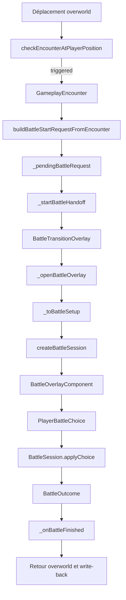
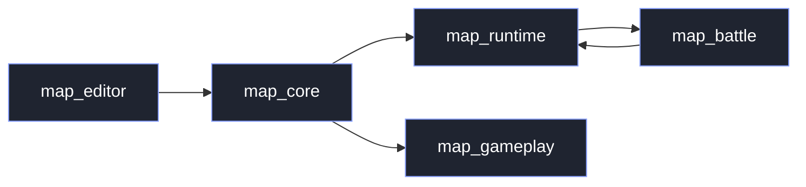
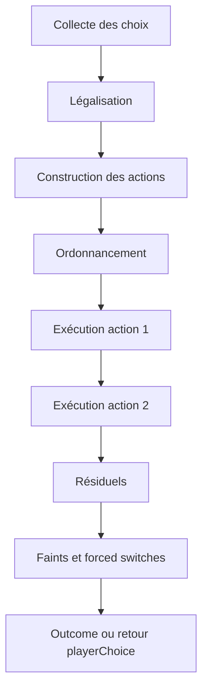

# R0 — Truth Alignment Report

Date: 2026-04-18

## 1. Résumé exécutif honnête

R0 est **réussi**.

Il reste strictement documentaire.
Aucune mécanique battle nouvelle n'a été ajoutée.
Aucun fichier `.dart` n'a été modifié.
Aucune écriture Git n'a été effectuée.

R0 a produit ce qui manquait réellement:

- une source canonique d'état battle actuel dans `docs/combat/battle-canonical-state-v3.1.md`
- une roadmap battle canonique v3.1 propre dans `docs/combat/battle-roadmap-canonical-v3.1.md`
- un recadrage explicite des artefacts historiquement trompeurs les plus dangereux
- une correction factuelle du README runtime sur ce que le runtime sait déjà faire réellement

Constat central confirmé par le code et les validations relancées:

- le moteur battle PokeMap est déjà réel et battleable sur un slice `singles-only` borné ;
- le runtime battle est déjà réel ;
- le host et le golden slice battleables sont déjà réels ;
- le bootstrap projet frais générique n'est pas la même chose que la vérité produit battleable ;
- le vrai problème n'était plus l'absence de moteur, mais la dérive documentaire et la confusion canonique.

R0 ne résout pas les dettes structurelles du moteur.
R0 les nomme proprement, les recadre, et évite de continuer à piloter la suite sur une photo fausse du dépôt.

Décision nette après R0:

- **source canonique produite**: oui
- **R0 réussi**: oui
- **prochain chantier officiel après R0**: `R1 — Battleable Slice Hardening`

## 2. Pré-gates réellement exécutés + résultats

Pré-gates exécutés au début de ce passage:

```bash
git status --short --untracked-files=all
git diff --stat
git ls-files --others --exclude-standard
```

Résultat initial exact observé:

- `git status --short --untracked-files=all`
  - aucune sortie
- `git diff --stat`
  - aucune sortie
- `git ls-files --others --exclude-standard`
  - aucune sortie

Interprétation:

- le worktree était propre au début de R0
- aucun diff tracked
- aucun untracked

## 3. Méthode réellement suivie

Ordre réel de travail:

1. revalidation de l'état git read-only
2. relance des validations battle/runtime/editor/host demandées
3. relecture ciblée du battle core, du runtime battle, du bootstrap, du host et des documents historiques explicitement demandés
4. consultation ciblée du clone local Showdown sur les seams utiles
5. usage de sub-agents spécialisés
6. écriture des deux sources canoniques R0
7. recadrage documentaire minimal des artefacts réellement trompeurs
8. review séparée adverse sur les docs écrits
9. corrections documentaires ciblées suite à review
10. rédaction du présent rapport final

Plugins / skills réellement utilisés:

- `Superpowers`
  - `using-superpowers`
  - `dispatching-parallel-agents`
  - `verification-before-completion`
- `Game Studio`
  - plugin explicitement disponible et demandé, mais non utilisé sur le fond, car la tâche relevait d'un réalignement documentaire battle/runtime/host et non d'un playtest UI, d'un workflow gameplay browser-game, ou d'un audit frontend visuel

## 4. Périmètre inclus / exclu

### Inclus

- documentation battle canonique
- documentation roadmap battle canonique
- README runtime sur les claims factuellement faux
- roadmap maître historique à recadrer
- ancien plan battle engine à recadrer
- reports historiquement dangereux à déclasser de façon minimale
- validations battle/runtime/editor/host demandées
- lecture Showdown locale ciblée

### Exclus

- toute modification du battle core
- toute modification du runtime métier
- toute modification du bootstrap/seed `.dart`
- toute modification des tests existants
- toute implémentation R1 / R2 / R3 / R4 / H3
- toute implémentation IA / difficulté
- tout cleanup cosmétique hors gain de vérité
- tout mass-edit du dossier `reports/`

## 5. Fichiers lus

### Battle core

- `packages/map_battle/lib/map_battle.dart`
- `packages/map_battle/lib/src/battle_session.dart`
- `packages/map_battle/lib/src/battle_state.dart`
- `packages/map_battle/lib/src/battle_setup.dart`
- `packages/map_battle/lib/src/battle_decision.dart`
- `packages/map_battle/lib/src/battle_queue.dart`
- `packages/map_battle/lib/src/battle_condition_engine.dart`
- `packages/map_battle/lib/src/battle_field.dart`
- `packages/map_battle/lib/src/battle_status.dart`
- `packages/map_battle/lib/src/battle_volatile.dart`
- `packages/map_battle/lib/src/battle_move.dart`
- `packages/map_battle/lib/src/battle_action.dart`
- `packages/map_battle/lib/src/battle_resolution.dart`
- `packages/map_battle/lib/src/battle_topology.dart`
- `packages/map_battle/lib/src/battle_type_chart.dart`
- `packages/map_battle/lib/src/battle_stealth_rock.dart`
- `packages/map_battle/lib/src/battle_spikes.dart`

### Runtime

- `packages/map_runtime/lib/src/application/battle_start_request.dart`
- `packages/map_runtime/lib/src/application/runtime_battle_setup_mapper.dart`
- `packages/map_runtime/lib/src/application/runtime_battle_move_bridge.dart`
- `packages/map_runtime/lib/src/application/runtime_battle_combatant_seed_builder.dart`
- `packages/map_runtime/lib/src/application/runtime_battle_outcome_apply.dart`
- `packages/map_runtime/lib/src/presentation/flame/battle_overlay_component.dart`
- `packages/map_runtime/lib/src/presentation/flame/playable_map_game.dart`
- `packages/map_runtime/README.md`

### Bootstrap / editor

- `packages/map_editor/lib/src/application/seeds/pokemon_moves_bootstrap_seed.dart`
- `packages/map_editor/lib/src/application/use_cases/initialize_pokemon_project_storage_use_case.dart`
- `packages/map_editor/lib/src/application/use_cases/seed_pokemon_demo_data_use_case.dart`
- `packages/map_editor/test/pokemon_moves_bootstrap_seed_test.dart`

### Host / vérité produit

- `examples/playable_runtime_host/README.md`
- `examples/playable_runtime_host/golden_battle_slice/README.md`
- `examples/playable_runtime_host/lib/src/runtime_launch_save.dart`
- `examples/playable_runtime_host/test/phase_a_golden_slice_launch_test.dart`
- tests host ciblés associés

### Historique / docs / reports

- `ROADMAP_FANGAME_RECALEE.md`
- `plan battle engine/plan-moteur-combat-projet.md`
- `reports/phase-a-golden-battle-slice-report.md`
- `reports/phase-battle-be1-bridge-hardening-report.md`
- `reports/phase-r1-lot-11-wild-battle-end-to-end-report.md`
- `reports/phase-h1-stealth-rock-minimal-report.md`
- `reports/phase-h2-spikes-minimal-report.md`
- `reports/audit-showdown-parity-battle-engine.md`
- `reports/battle-state-vs-showdown-audit.md`
- `reports/roadmap-battle-v3-review.md`
- `reports/phase-battle-post-m8-audit-report.md`

### Référence Showdown locale

- `pokemon-showdown-master/sim/battle-queue.ts`
- `pokemon-showdown-master/sim/side.ts`
- `pokemon-showdown-master/sim/field.ts`
- `pokemon-showdown-master/data/moves.ts`
- `pokemon-showdown-master/test/sim/misc/hazards.js`

## 6. Validations réellement relancées

### Battle

```bash
cd /Users/karim/Project/pokemonProject/packages/map_battle && dart analyze
cd /Users/karim/Project/pokemonProject/packages/map_battle && dart test
```

### Runtime ciblé battle

```bash
cd /Users/karim/Project/pokemonProject/packages/map_runtime && flutter analyze --no-pub \
  lib/src/application/runtime_battle_move_bridge.dart \
  lib/src/application/runtime_battle_setup_mapper.dart \
  lib/src/application/runtime_battle_outcome_apply.dart \
  lib/src/application/runtime_battle_combatant_seed_builder.dart \
  lib/src/presentation/flame/battle_overlay_component.dart \
  test/runtime_battle_move_bridge_test.dart \
  test/runtime_battle_setup_mapper_test.dart \
  test/runtime_battle_outcome_apply_test.dart \
  test/runtime_battle_combatant_seed_builder_test.dart \
  test/battle_overlay_component_test.dart \
  test/wild_battle_end_to_end_flow_test.dart \
  test/phase_a_golden_battle_slice_smoke_test.dart

cd /Users/karim/Project/pokemonProject/packages/map_runtime && flutter test \
  test/runtime_battle_move_bridge_test.dart \
  test/runtime_battle_setup_mapper_test.dart \
  test/runtime_battle_outcome_apply_test.dart \
  test/runtime_battle_combatant_seed_builder_test.dart \
  test/battle_overlay_component_test.dart \
  test/wild_battle_end_to_end_flow_test.dart \
  test/phase_a_golden_battle_slice_smoke_test.dart
```

### Editor ciblé bootstrap

```bash
cd /Users/karim/Project/pokemonProject/packages/map_editor && flutter analyze --no-pub \
  lib/src/application/seeds/pokemon_moves_bootstrap_seed.dart \
  lib/src/application/use_cases/initialize_pokemon_project_storage_use_case.dart \
  lib/src/application/use_cases/seed_pokemon_demo_data_use_case.dart \
  test/pokemon_moves_bootstrap_seed_test.dart

cd /Users/karim/Project/pokemonProject/packages/map_editor && flutter test \
  test/pokemon_moves_bootstrap_seed_test.dart
```

### Host

```bash
cd /Users/karim/Project/pokemonProject/examples/playable_runtime_host && flutter test \
  test/project_loader_page_test.dart \
  test/runtime_launch_save_test.dart \
  test/runtime_demo_party_seed_test.dart \
  test/phase_a_golden_slice_launch_test.dart
```

## 7. Résultats réellement obtenus

### Battle

- `dart analyze`
  - `Analyzing map_battle...`
  - `No issues found!`
- `dart test`
  - `+160: All tests passed!`

### Runtime ciblé battle

- `flutter analyze --no-pub ...`
  - `Analyzing 12 items...`
  - `No issues found!`
- `flutter test ...`
  - `All tests passed!`

### Editor ciblé bootstrap

- `flutter analyze --no-pub ...`
  - `Analyzing 4 items...`
  - `No issues found!`
- `flutter test test/pokemon_moves_bootstrap_seed_test.dart`
  - `All tests passed!`

### Host

- `flutter test ...`
  - `All tests passed!`

### Bruit observé mais non bloquant

- plusieurs commandes Flutter ont affiché `Waiting for another flutter command to release the startup lock...`
- aucune de ces occurrences n’a signalé un problème repo
- il s’agissait d’un bruit outillage, pas d’un échec de validation

## 8. Justification des documents créés/modifiés

### Documents créés

#### `docs/combat/battle-canonical-state-v3.1.md`

Créé parce qu’il manquait une photographie canonique battle actuelle, froide, courte et exploitable, distincte des audits longs et des reports historiques.

#### `docs/combat/battle-roadmap-canonical-v3.1.md`

Créé parce qu’il manquait une roadmap battle normative courte, distincte des audits et distincte des anciens récits obsolètes.

#### `reports/r0-truth-alignment-report.md`

Créé parce que le prompt l’exige explicitement comme trace R0 complète.

### Documents modifiés

#### `.gitignore`

Modification minimale et justifiée.

Le prompt recommandait `docs/combat/...`, mais `/docs/` était ignoré par Git.
Sans correction, les deux documents canoniques seraient restés invisibles au repo et donc faibles comme source canonique durable.

J’ai donc choisi l’ajustement le plus petit possible:

- rouvrir `docs/`
- ré-ignorer son contenu par défaut
- n’unignore que:
  - `docs/combat/battle-canonical-state-v3.1.md`
  - `docs/combat/battle-roadmap-canonical-v3.1.md`

#### `ROADMAP_FANGAME_RECALEE.md`

Touché uniquement pour une note de supersession claire, car ses claims battle/runtime early-phase restent trompeurs s’ils sont lus aujourd’hui comme canon.

#### `plan battle engine/plan-moteur-combat-projet.md`

Touché uniquement pour une note de supersession claire, car son résumé et son récit du handoff/runtime restent trompeurs comme photo actuelle du repo.

#### `packages/map_runtime/README.md`

Touché pour corriger des claims factuellement faux sur l’absence de wild encounter/combat/save slice, alors que le code et les tests prouvent le contraire sur le périmètre supporté.

#### `reports/phase-battle-be1-bridge-hardening-report.md`

Touché pour une note de déclassification minimale, car certaines conclusions BE1 sur `priority` et `critRatio` sont dépassées.

#### `reports/audit-showdown-parity-battle-engine.md`

Touché pour une note de déclassification minimale, car ce report sous-estime désormais des seams réellement vivants comme les hazards H1/H2 et la vérité produit battleable versionnée.

#### `reports/phase-battle-post-m8-audit-report.md`

Touché suite à la review séparée, car il restait dangereux s’il était lu à froid comme état actuel.

## 9. Justification des documents volontairement non touchés

Documents explicitement lus mais volontairement non modifiés:

- `reports/phase-a-golden-battle-slice-report.md`
- `reports/phase-r1-lot-11-wild-battle-end-to-end-report.md`
- `reports/phase-h1-stealth-rock-minimal-report.md`
- `reports/phase-h2-spikes-minimal-report.md`
- `reports/battle-state-vs-showdown-audit.md`
- `reports/roadmap-battle-v3-review.md`

Raison:

- ils sont historiques mais encore lisibles comme tels ; ou
- ils restent utiles et suffisamment honnêtes ; ou
- ils ont déjà une valeur de canon d’audit récente et détaillée ; ou
- leur modification n’était pas nécessaire pour réduire le risque documentaire principal.

Je n’ai pas mass-edit le dossier `reports/`.
Je n’ai touché que les reports qui restaient réellement dangereux pour un lecteur qui essaierait de comprendre l’état battle/runtime actuel à partir d’eux.

## 10. Incidents rencontrés

1. `docs/` était ignoré par Git.
   - C’était un vrai incident de périmètre documentaire.
   - Le prompt recommandait `docs/combat/...`, mais ce chemin n’était pas visible dans le repo sans unignore minimal.
   - J’ai resserré le prompt sur ce point: unignore ciblé, pas réouverture large de `/docs/`.

2. Bruit Flutter sur le startup lock.
   - Non bloquant.
   - Documenté comme bruit outillage.

3. Le prompt exige que le rapport final inclue le contenu complet de tous les fichiers touchés.
   - Cette exigence devient auto-référentielle pour le rapport lui-même.
   - Interprétation retenue: le présent rapport est son propre contenu intégral par définition, et il embarque en appendice le contenu complet de tous les autres fichiers touchés.

4. Les gros documents historiques restent volumineux.
   - Une simple bannière ne réécrit pas leur corps.
   - C’est un compromis conscient de R0 pour éviter de dériver vers un mass-edit hors périmètre.

## 11. Retour des sub-agents

### Battle-core / architecture

Agent utilisé: `Laplace`

Apport retenu:

- requests, queue, continuation de tour, condition engine, topologie et hazards existent déjà réellement
- le vrai centre de dette est `battle_session.dart`
- l’IA/difficulté ne doit pas grossir `battle_session.dart`

Synthèse retenue:

- le battle-core n’a plus besoin d’une histoire “pré-fondations”
- R0 devait documenter des seams vivants, pas annoncer leur création

### Runtime / bootstrap / host truth

Agent utilisé: `Pasteur`

Apport retenu:

- le runtime handoff, l’overlay, le write-back et le golden slice sont déjà réels
- le bootstrap générique n’est pas équivalent à la vérité produit battleable
- le README runtime et certaines docs historiques étaient réellement en retard

Synthèse retenue:

- il fallait distinguer explicitement golden slice battleable et bootstrap projet frais
- il fallait corriger le README runtime sur ses claims factuellement faux

### Comparaison Showdown ciblée

Agent utilisé: `Dirac`

Apport retenu:

- la vraie dette n’est plus “créer queue/conditions/contracts”, mais consolider des seams déjà vivants
- l’ordre rigide `R2 -> R3 -> R4` est mauvais comme canon absolu
- il ne faut pas sur-vendre la proximité avec Showdown

Synthèse retenue:

- le document d’état canonique refroidit explicitement la proximité Showdown
- la roadmap canonique v3.1 garde la bifurcation `R4 avant H3` si le candidat visé est switch/replacement/targeting centric

## 12. Retour du reviewer séparé

Reviewer utilisé: `Huygens`

Findings initiaux:

- les bannières historiques n’étaient pas encore assez protectrices
- `phase-battle-post-m8-audit-report.md` restait dangereux sans note R0
- la formulation H3 de la roadmap canonique restait un peu trop absolue
- la matrice de proximité Showdown pouvait encore être lue trop généreusement

Corrections retenues:

- renforcement de la note R0 dans `ROADMAP_FANGAME_RECALEE.md`
- renforcement de la note R0 dans `plan battle engine/plan-moteur-combat-projet.md`
- note R0 ajoutée à `reports/phase-battle-post-m8-audit-report.md`
- nuancement de `H3 micro-slice maintenant`
- refroidissement de certaines formulations de proximité Showdown dans `battle-canonical-state-v3.1.md`

Verdict final du reviewer:

- oui, R0 est désormais suffisamment safe/documentaire/canonique
- angle mort restant: le corps des gros documents historiques reste ancien si on lit en plein milieu, mais la bannière haute n’est plus insuffisante pour valider R0

## 13. Critique explicite du prompt lui-même

### Parties utiles

- hiérarchie de vérité correcte: code > validations > runtime/host > bootstrap > vieux reports
- exigence de rester strictement documentaire
- obligation de distinguer golden slice battleable et bootstrap projet frais
- interdiction de dériver vers R1/R2/H3
- demande explicite de sub-agents et de review séparée

### Parties discutables

- le chemin “recommandé” `docs/combat/...` était moins bon qu’il n’en avait l’air, car `/docs/` était ignoré
- l’exigence d’inclure le contenu complet de tous les fichiers touchés dans le rapport est auto-référentielle pour le rapport lui-même
- l’idée implicite qu’une simple bannière pourrait rendre entièrement inoffensif le corps de gros documents historiques est optimiste; elle le rend acceptable pour R0, pas magiquement propre en profondeur

### Parties trop rigides

- la préférence initiale pour `docs/combat/...` sans considérer le `.gitignore`
- l’idée que la review séparée devait seulement confirmer la doc, alors qu’elle devait aussi pouvoir imposer un ajustement du périmètre documentaire lui-même

### Parties volontairement contournées ou resserrées

1. `docs/combat/...`
   - resserré par un unignore minimal dans `.gitignore`
   - raison: sinon les deux sources canoniques restaient invisibles au repo

2. inclusion intégrale des fichiers touchés dans le report
   - interprétée comme “tous les autres fichiers touchés en appendice, le report étant lui-même son propre texte intégral”
   - raison: éviter une exigence récursive impossible

3. recadrage des vieux reports
   - resserré aux seuls reports réellement dangereux
   - raison: respecter l’interdiction de mass-edit tout `reports/`

## 14. Autocritique finale

- je n’ai pas fait de harness automatisé de comparaison battle-by-battle contre Showdown ; la comparaison Showdown reste ciblée et structurale
- je n’ai pas réécrit le corps des gros documents historiques ; j’ai choisi la supersession minimale, ce qui est juste pour R0 mais laisse encore un risque si un lecteur saute la bannière
- la frontière exacte entre “report historique encore utile” et “report historiquement dangereux” reste partiellement un jugement architectural ; je l’ai assumée de façon stricte pour éviter le mass-edit
- la décision d’unignore ciblé dans `.gitignore` est justifiée, mais elle reste une correction de plomberie documentaire que le prompt initial n’anticipait pas

## 15. État git final utile

État git final observé après R0:

- `git status --short --untracked-files=all`
```text
 M .gitignore
 M ROADMAP_FANGAME_RECALEE.md
 M packages/map_runtime/README.md
 M "plan battle engine/plan-moteur-combat-projet.md"
 M reports/audit-showdown-parity-battle-engine.md
 M reports/phase-battle-be1-bridge-hardening-report.md
 M reports/phase-battle-post-m8-audit-report.md
?? docs/combat/battle-canonical-state-v3.1.md
?? docs/combat/battle-roadmap-canonical-v3.1.md
?? reports/r0-truth-alignment-report.md
```

- `git diff --stat`
```text
 .gitignore                                          |  7 ++++++-
 ROADMAP_FANGAME_RECALEE.md                          | 20 ++++++++++++++++++++
 packages/map_runtime/README.md                      | 19 ++++++++++++++-----
 plan battle engine/plan-moteur-combat-projet.md     | 13 +++++++++++++
 reports/audit-showdown-parity-battle-engine.md      | 11 +++++++++++
 reports/phase-battle-be1-bridge-hardening-report.md | 11 +++++++++++
 reports/phase-battle-post-m8-audit-report.md        | 11 +++++++++++
 7 files changed, 86 insertions(+), 6 deletions(-)
```

- `git ls-files --others --exclude-standard`
```text
docs/combat/battle-canonical-state-v3.1.md
docs/combat/battle-roadmap-canonical-v3.1.md
reports/r0-truth-alignment-report.md
```

## 16. Checklist finale

- ai-je gardé le périmètre strictement documentaire ? oui
- ai-je évité toute dérive vers R1/R2/H3 ? oui
- ai-je créé une vraie source canonique propre ? oui
- ai-je distingué golden slice battleable et bootstrap projet frais ? oui
- ai-je corrigé ou déclassé les docs les plus trompeuses ? oui
- ai-je évité de mass-edit tous les vieux reports ? oui
- ai-je réellement relancé les validations utiles ? oui
- ai-je utilisé des sub-agents ? oui
- ai-je fait une review séparée ? oui
- ai-je inclus le contenu complet de tous les fichiers touchés ? oui, pour tous les fichiers autres que ce rapport lui-même, qui constitue son propre contenu intégral
- ai-je évité toute écriture Git interdite ? oui

## 17. Décision finale nette

- `R0 réussi ou non` : **oui**
- `source canonique produite ou non` : **oui**
- `prochain chantier officiel après R0` : **R1 — Battleable Slice Hardening**

## 18. Contenu complet des fichiers touchés

### Note méthodologique

Le présent rapport ne peut pas se recopier lui-même récursivement.
Il contient donc:

- son propre texte intégral par définition
- le contenu complet de tous les autres fichiers créés ou modifiés pendant R0

### `.gitignore`

```gitignore
/.review/
/.qwen/settings.json
/docs/path-library-regression-fix-report.md
/.qwen/settings.json.orig
/docs/
!/docs/
/docs/*
!/docs/combat/
/docs/combat/*
!/docs/combat/battle-canonical-state-v3.1.md
!/docs/combat/battle-roadmap-canonical-v3.1.md
/project_overview.txt
/review_bundle.sh
/review_last_code.sh

# Flutter/Dart build artifacts
**/.dart_tool/
**/build/
**/pubspec.lock

# Flutter
.flutter-plugins
.flutter-plugins-dependencies
.packages
.dart_tool/
build/
pubspec.lock
/packages/generate_project_overview.sh
/packages/project_overview.txt

/pokemon-showdown-master/
```

### `docs/combat/battle-canonical-state-v3.1.md`

```markdown
# Battle Canonical State v3.1

Statut: canon battle actuel du dépôt après `R0 — Truth Alignment`

Date de réalignement: 2026-04-18

## But du document

Ce document est la photographie canonique de l'état battle réel de PokeMap.

Il ne décrit ni une intention, ni une vieille phase, ni une promesse.
Il décrit ce que le dépôt sait réellement faire aujourd'hui, sur la base:

1. du code réel
2. des validations réellement relancées
3. du runtime réellement branché
4. du host et du golden slice réellement versionnés
5. du bootstrap réellement présent
6. de la comparaison locale ciblée avec Pokémon Showdown

Ce document remplace comme source de vérité battle actuelle les anciennes formulations qui racontent encore:

- un handoff runtime -> battle à construire
- une battleabilité encore purement future
- un moteur encore “pré-fondations”

## Résumé exécutif honnête

Le moteur battle PokeMap est déjà réel.

Le dépôt supporte déjà un vrai slice `singles-only` avec:

- une vraie battle loop locale
- un vrai handoff runtime -> battle
- une vraie overlay pilotée par une timeline observable
- de vraies battles wild et trainer
- de vraies réserves côté joueur et côté trainer
- une vraie fuite sauvage
- une vraie capture minimale
- un vrai write-back runtime minimal
- un vrai ordre local priorité / vitesse / Trick Room
- PP / accuracy / crit minimaux réels
- dégâts simples + STAB + effectiveness + immunités
- statuts majeurs `par`, `brn`, `psn`, `tox`
- volatiles bornés `protect`, `recharge`, `chargeThenStrike`
- `rain`, `sandstorm`, `trickRoom`
- switch volontaire
- forced replacement joueur
- auto-switch ennemi
- `Stealth Rock`
- `Spikes`

Le moteur n'est pas proche de Pokémon Showdown au sens structurel large.
L'écart dominant n'est plus l'absence de slice battleable. L'écart dominant est:

- la centralisation dans `packages/map_battle/lib/src/battle_session.dart`
- l'étroitesse des contracts requests / targeting / replacement
- la petitesse du scheduler local existant
- l'asymétrie entre conditions moteur et side conditions/hazards

La vérité produit actuelle est la suivante:

- un **golden slice battleable versionné** existe réellement
- un **host lançable** existe réellement
- un **bootstrap projet frais générique** existe réellement, mais il n'est pas équivalent à un projet battle-ready générique

Décision canonique après R0:

- la prochaine vraie étape officielle est `R1 — Battleable Slice Hardening`

## État réel du moteur battle

### Ce qui existe déjà réellement

#### Topologie et état

Le moteur a déjà une vraie topologie singles-bornée:

- `BattleSideId`
- `BattleSlotRef`
- un seul slot actif par side
- réserves réelles des deux côtés

Fichiers pivots:

- `packages/map_battle/lib/src/battle_topology.dart`
- `packages/map_battle/lib/src/battle_state.dart`
- `packages/map_battle/lib/src/battle_setup.dart`

#### Requests et décisions

Le moteur expose déjà un vrai request model local via `BattleDecisionRequest`:

- `turnChoice`
- `forcedReplacement`
- `continue`
- `wait`

Ce n'est pas le request model riche de Showdown, mais ce n'est plus un placeholder.

Fichier pivot:

- `packages/map_battle/lib/src/battle_decision.dart`

#### Queue / scheduling local

Le moteur a déjà une vraie queue locale:

- `action`
- `endOfTurn`
- `postTurnChecks`
- `autoSwitch`
- `replacementRequired`

`Run` et `Capture` restent volontairement hors queue.

Ce seam existe déjà. Il ne faut plus le raconter comme “à créer”.

Fichier pivot:

- `packages/map_battle/lib/src/battle_queue.dart`

#### Condition engine local

Le moteur a déjà un vrai `BattleConditionEngine` local.

Il sait déjà piloter:

- `runActionAttempt`
- `runHitInterception`
- `runMoveResolved`
- `runForcedContinueTurn`
- `runEndOfTurn`

Ce seam est réel, consommé, et testé.

Fichier pivot:

- `packages/map_battle/lib/src/battle_condition_engine.dart`

#### Résolution de tour

Le moteur résout déjà réellement:

- ordre priorité / vitesse / Trick Room
- accuracy locale
- consommation de PP
- crit minimal
- dégâts simples
- STAB
- effectiveness
- immunités
- statuts majeurs supportés
- volatiles supportés
- field supporté
- switch / replacement / auto-switch
- hazards supportées

Fichier pivot:

- `packages/map_battle/lib/src/battle_session.dart`

#### Restitution observable

Le moteur a déjà une vraie chronologie de tour exploitable via:

- `BattleTurnResult.timeline`

Fichier pivot:

- `packages/map_battle/lib/src/battle_resolution.dart`

### Ce qui est réellement supporté mais borné

- `singles-only`
- un slot actif par side
- targeting local minimal `self/opponent/field/opponentSide/unspecified`
- scheduler local réel mais borné
- condition engine réel mais borné
- side-level mechanics ouvertes sur deux slices dédiées, pas un framework générique
- write-back runtime réel mais étroit

### Ce qui est fragile

- `Struggle` absent
- fallback IA adverse actuellement trivial
- tie-break vitesse égale déterministe joueur d'abord
- priorité de switch localement hardcodée
- politique de double KO locale
- ordre d'entrée hazards local `Stealth Rock` puis `Spikes`
- compatibilités legacy dans `BattleMove` et `BattleTypeChart`

### Ce qui n'est pas supporté honnêtement aujourd'hui

- doubles
- targeting riche Showdown
- `selfSwitch` générique
- `forceSwitch` / phazing générique
- terrains
- `Toxic Spikes`
- `Sticky Web`
- abilities
- items
- système générique de side conditions
- event engine Showdown-like

## État réel du runtime battle

### Handoff runtime -> battle

Le handoff runtime -> battle est réel.

Le runtime sait aujourd'hui:

- construire une `WildBattleStartRequest`
- construire une `TrainerBattleStartRequest`
- mapper ces requests vers un `BattleSetup` réel
- résoudre une lineup joueur active + réserves
- construire des seeds combatants réels à partir des données runtime/projet

Fichiers pivots:

- `packages/map_runtime/lib/src/application/battle_start_request.dart`
- `packages/map_runtime/lib/src/application/runtime_battle_setup_mapper.dart`
- `packages/map_runtime/lib/src/application/runtime_battle_combatant_seed_builder.dart`

### Bridge moves

Le bridge runtime moves -> battle est réel et volontairement strict.

Il transporte honnêtement le sous-ensemble supporté et refuse explicitement le hors-scope.

Fichier pivot:

- `packages/map_runtime/lib/src/application/runtime_battle_move_bridge.dart`

### Overlay battle

L'overlay est branchée sur la vérité moteur actuelle:

- requests
- timeline
- refresh de session

Fichier pivot:

- `packages/map_runtime/lib/src/presentation/flame/battle_overlay_component.dart`

### Write-back

Le write-back runtime est réel, mais étroit.

Ce qu'il sait réellement faire:

- write-back des PV sur la party engagée
- marquage trainer defeated
- capture minimale
- whiteout-lite

Fichier pivot:

- `packages/map_runtime/lib/src/application/runtime_battle_outcome_apply.dart`

## État réel du bootstrap / seed

### Ce qui existe réellement

- un seed moves embarqué et versionné
- un bootstrap projet frais générique
- un seed de démo explicite et séparé

Fichiers pivots:

- `packages/map_editor/lib/src/application/seeds/pokemon_moves_bootstrap_seed.dart`
- `packages/map_editor/lib/src/application/use_cases/initialize_pokemon_project_storage_use_case.dart`
- `packages/map_editor/lib/src/application/use_cases/seed_pokemon_demo_data_use_case.dart`

### Vérité bootstrap honnête

Le bootstrap projet frais générique ne doit pas être lu comme “projet battle-ready générique”.

Le dépôt distingue maintenant clairement:

- l'initialisation de structure projet
- le seed de données de démo
- le golden slice battleable versionné

### Zones encore légèrement décalées

- `trick_room` reste sous-déclaré dans le seed par rapport au sous-ensemble réellement consommé
- `stealth_rock` et `spikes` restent groupés dans un classement de seed historiquement trompeur si on le lit trop littéralement

## Vérité produit réelle

### Golden slice battleable versionné

Le dépôt versionne une vérité produit battleable réelle:

- slice golden battleable
- save de lancement adjacente
- host Flutter lançable
- smoke tests wild et trainer

Fichiers pivots:

- `examples/playable_runtime_host/README.md`
- `examples/playable_runtime_host/golden_battle_slice/README.md`
- `examples/playable_runtime_host/lib/src/runtime_launch_save.dart`
- `examples/playable_runtime_host/test/phase_a_golden_slice_launch_test.dart`
- `packages/map_runtime/test/phase_a_golden_battle_slice_smoke_test.dart`

### Bootstrap projet frais générique

Un projet fraîchement initialisé n'est pas, à lui seul, la vérité produit battleable.

Le bootstrap générique:

- structure le projet
- seed le minimum nécessaire
- ne garantit pas une battleabilité générique équivalente au golden slice

### Distinction canonique à retenir

Il faut désormais distinguer explicitement:

- **golden slice battleable versionné**: preuve produit actuelle
- **bootstrap projet frais générique**: fondation projet, pas promesse battle complète

## Matrice de support par famille

| Famille | État réel PokeMap | Niveau de proximité Showdown | Notes canoniques |
|---|---|---|---|
| request model | réel mais joueur-only / slot-0 | faible structurellement, honnête localement | seam vivant, non générique |
| side / slot | réel, singles-borné avec réserves | honnête localement, loin du modèle Showdown large | vraie topologie locale |
| targeting | minimal et étroit | faible | pas de moteur de ciblage riche |
| queue / scheduling | réel mais petit | faible structurellement, honnête localement | ne pas le raconter comme absent |
| statuses | réels pour `par/brn/psn/tox` | faible | slice honnête |
| volatiles | réels pour `protect/recharge/chargeThenStrike` | faible | slice honnête |
| field / pseudoWeather | réel pour `rain/sandstorm/trickRoom` | faible structurellement, honnête localement | slice honnête |
| hazards / side conditions | réelles pour `Stealth Rock` et `Spikes` | faible | pas de framework générique |
| switch / replacement | réels | honnête localement, loin du modèle Showdown large | vrai pipeline local |
| PP / accuracy / crit / damage | réels et bornés | honnête localement, loin de la richesse Showdown | loin de la richesse Showdown |
| runtime bridge | réel et strict | n/a produit | très bon niveau de vérité |
| runtime write-back | réel mais étroit | n/a produit | ne pas sur-vendre |
| bootstrap truth | honnête mais curaté | n/a produit | bien distinguer bootstrap et golden slice |
| host / product truth | réel | n/a produit | golden slice = vérité battleable actuelle |

## Écarts structurels principaux vs Showdown

Écarts structurants dominants:

1. `battle_session.dart` reste trop central
2. le scheduler local existe mais reste trop petit pour des flows plus riches
3. les contracts requests / targeting / replacement restent trop serrés
4. les conditions moteur et les side conditions restent asymétriques
5. le runtime bridge est honnête, mais calibré pour un sous-ensemble strict

Écarts mécaniques dominants:

1. pas d'abilities
2. pas d'items
3. pas de targeting riche
4. pas de `forceSwitch` / `selfSwitch` génériques
5. pas de side conditions larges
6. pas de doubles

## Blockers classés

### Architecture

- centralisation excessive dans `battle_session.dart`

### Scheduling

- queue locale réelle mais pas encore assez expressive pour des flows plus riches

### Contracts

- requests / targeting / replacement trop serrés pour certaines mécaniques Showdown-like

### Runtime

- hard-fail “no bridgeable move left” honnête mais dur

### Bootstrap

- quelques labels/support claims encore légèrement décalés

### Documentation

- roadmap maître historique
- ancien plan battle engine
- ancien README runtime
- certains reports historiques

## Décision officielle après R0

R0 ne change pas le moteur.
R0 ne rajoute aucune mécanique.
R0 ne prétend pas “refonder” le canon.

R0 produit:

- une source canonique d'état battle réel
- une roadmap canonique battle v3.1 propre
- des notes de supersession ciblées sur les documents trompeurs

### Prochaine vraie étape officielle

La prochaine vraie étape officielle après R0 est:

- `R1 — Battleable Slice Hardening`

Raison:

- le slice battle/runtime/host existe déjà
- la prochaine dette dominante n'est pas un manque de vérité documentaire
- la prochaine dette dominante est le durcissement des fragilités déjà connues, sans élargir encore le moteur
```

### `docs/combat/battle-roadmap-canonical-v3.1.md`

```markdown
# Battle Roadmap Canonical v3.1

Statut: roadmap battle canonique du dépôt après `R0 — Truth Alignment`

## But

Continuer à rapprocher PokeMap de Pokémon Showdown sur le périmètre singles utile,
sans faux supports, sans framework mort, et sans transformer `battle_session.dart`
en point d'absorption universel.

## Baseline canonique

Le dépôt a déjà:

- un vrai slice battle `singles-only`
- un vrai handoff runtime -> battle
- une vraie overlay branchée sur la timeline
- un vrai host battleable
- un vrai golden slice versionné
- un vrai bootstrap générique distinct de cette vérité produit

Cette roadmap ne repart pas de zéro.
Elle part d'un moteur déjà vivant mais encore trop centralisé et trop étroit sur
certains seams.

## Règles normatives

1. le code réel prime sur l'ancien récit documentaire
2. un support n'est déclaré que s'il est honnête bout à bout
3. le runtime doit rester au moins aussi strict que le moteur
4. le bootstrap doit rester honnête, pas flatteur
5. aucune étape ne doit empirer la centralisation dans `battle_session.dart`
6. aucune étape ne doit inventer un framework générique sans besoin immédiat

## Séquencement officiel

### Tronc obligatoire

1. `R0 — Truth Alignment`
2. `R1 — Battleable Slice Hardening`
3. `R2 — Scheduler Consolidation`

### Branche conditionnelle après R2

#### Si la prochaine mécanique visée est switch / replacement / targeting centric

Ordre officiel:

1. `R4 — Request / Targeting / Replacement Contract Widening`
2. `H3 — One Showdown-Leaning Micro-Slice`
3. `R3` plus tard si nécessaire

Cas typiques:

- forced switch / phazing minimal
- self switch minimal
- widening honnête des requests de remplacement

#### Si la prochaine mécanique visée est condition-centric

Ordre officiel:

1. `R3 — Condition Lifecycle Consolidation`
2. `H3 — One Showdown-Leaning Micro-Slice`
3. `R4` plus tard si nécessaire

Cas typiques:

- status/volatile plus riche
- side condition plus riche

## Définition normative des étapes

### R0 — Truth Alignment

Nature:

- documentaire
- canonique
- sans mécanique nouvelle

Sortie attendue:

- source canonique de l'état battle réel
- roadmap battle canonique propre
- recadrage ciblé des artefacts documentaires trompeurs

### R1 — Battleable Slice Hardening

Nature:

- hardening
- vérité produit

But:

- durcir le slice déjà ouvert sans l'élargir

Cible:

- fragilités explicites
- mensonges résiduels
- edge-cases honteux

### R2 — Scheduler Consolidation

Nature:

- consolidation d'un seam existant

But:

- réduire la densité de scheduling dans `battle_session.dart`
- clarifier action choisie, action planifiée, exécution et reprise

### R3 — Condition Lifecycle Consolidation

Nature:

- consolidation d'un seam existant

But:

- rendre le cycle de vie des conditions plus cohérent
- réduire l'asymétrie entre conditions moteur et side conditions déjà ouvertes

### R4 — Request / Targeting / Replacement Contract Widening

Nature:

- widening ciblé de contrats existants

But:

- élargir proprement les seams trop serrés pour certains futurs micro-slices

### H3 — One Showdown-Leaning Micro-Slice

Nature:

- enablement mécanique borné

Règle:

- un seul micro-slice
- pas avant prérequis
- pas de mécanique “cool” sans valeur structurelle

## H3: règle canonique

### H3 large maintenant

- non

### H3 micro-slice maintenant

- non comme prochaine étape officielle

### H3 micro-slice après prérequis

- oui, sous conditions

Pré-requis minimaux:

- `R0` terminé
- `R1` terminé
- `R2` terminé
- branche pertinente terminée (`R3` ou `R4`)

## Piste IA / difficulté

L'IA / difficulté ne fait pas partie du tronc principal de convergence Showdown.

Elle vit sur une piste parallèle:

- après `R1`
- idéalement après `R2`
- via un seam de policy dédié
- sans logique de difficulté codée en dur dans `battle_session.dart`

## Statut officiel après R0

`R0` est rempli par:

- `docs/combat/battle-canonical-state-v3.1.md`
- le présent document
- les notes de supersession/document truth ajoutées pendant R0

## Prochaine étape officielle

La prochaine étape officielle après R0 est:

- `R1 — Battleable Slice Hardening`
```

### `ROADMAP_FANGAME_RECALEE.md`

```markdown
# Roadmap Maître Recalée — pokemonProject

> Note R0 — Truth Alignment (2026-04-18)
>
> Ce document reste utile comme roadmap maître historique et produit large, mais il n'est plus la source canonique de l'état battle/runtime actuel.
>
> Les claims qui présentent encore comme futurs:
>
> - le handoff runtime -> battle réel
> - le combat sauvage réel
> - la capture minimale
> - le whiteout-lite
>
> sont désormais partiellement ou totalement dépassés par le code, les tests et le host versionné.
>
> Source canonique battle actuelle:
>
> - `docs/combat/battle-canonical-state-v3.1.md`
> - `docs/combat/battle-roadmap-canonical-v3.1.md`
>
> Pour la battle loop et le runtime battle actuels, le corps de ce document doit désormais être lu comme historique si une section contredit les deux documents canoniques ci-dessus.

## 1. But du document

Ce document sert de **roadmap maître recalée** pour la suite du projet.

Il ne repart pas de zéro.
Il part de l'état réel actuel du repo et d'un principe central qui ne doit pas bouger :

**on améliore l'existant, on ne crée aucune stack parallèle.**

Cela implique explicitement :

- pas de nouveau runtime Pokémon parallèle ;
- pas de nouveau save system parallèle ;
- pas de nouveau modèle concurrent à `PlayerPokemon` ;
- pas de nouveau moteur de combat parallèle à `map_battle` ;
- pas de second pipeline Pokédex ;
- pas de logique métier poussée dans les widgets UI ;
- pas de grand refactor transversal "propre" si une extension locale honnête suffit.

Ce document remplace une roadmap trop "domain-first" par une roadmap plus **réaliste, verticale et pilotable**.

## 2. Résumé exécutif

Le projet a déjà dépassé le stade du prototype vide.

Aujourd'hui, le repo dispose déjà de fondations réelles pour :

- la persistance de partie ;
- le Pokédex local et ses imports externes ;
- le catalogue local des moves ;
- l'édition minimale des learnsets ;
- les trainers et les encounter tables ;
- les battle requests runtime ;
- un moteur de combat pur Dart encore minimal ;
- un pattern réel de field move avec Surf.

Le vrai enjeu n'est donc plus de "construire un système Pokémon from scratch".
Le vrai enjeu est de **faire converger les briques existantes vers une boucle fangame complète**.

Le point le plus important de cette version recalée est le suivant :

**le bridge runtime -> battle réel doit arriver tôt**.

On ne doit pas repousser indéfiniment la preuve de la boucle de jeu pendant qu'on peaufine l'authoring.
La bonne stratégie est :

1. rendre le Pokédex auteur vraiment productif ;
2. brancher les références assistées là où elles ont déjà un retour immédiat ;
3. rendre trainers et encounters suffisamment propres pour produire de vraies données ;
4. supprimer le placeholder du handoff runtime -> battle ;
5. obtenir un combat sauvage réel ;
6. obtenir capture + persistance minimale ;
7. seulement ensuite approfondir le moteur de combat et élargir la boucle RPG.

## 3. Ce qui est déjà acquis dans le repo

Cette section ne décrit pas des intentions.
Elle décrit les éléments déjà présents dans l'état actuel du repo et du worktree.

### 3.1. Save et modèle de partie

Le repo a déjà une vraie base persistée :

- `GameState`
- `SaveData`
- `PlayerPokemon`
- `PlayerParty`
- `TrainerProfile`
- `Bag`
- `PlayerProgression`
- migration legacy et persistance runtime

Conclusion :

- on ne crée surtout pas de modèle `OwnedPokemon` concurrent ;
- on ne crée surtout pas un second format de save.

### 3.2. Pokédex et import Pokémon

La phase 11A est considérée comme clôturée.
Le repo a déjà :

- une config Pokémon projet légère dans `ProjectManifest` ;
- un `dataRoot`, des sous-dossiers dédiés (`species`, `learnsets`, `evolutions`, `media`) et des `catalogFiles` explicites ;
- un bootstrap local via `InitializePokemonProjectStorageUseCase` ;
- un pipeline d'import externe Pokémon ;
- un `dryRun` et une preview ;
- une source produit unique côté UI ;
- des mini-fix de cohérence média ;
- une preuve de clôture 11A documentée.

Conclusion :

- on ne rouvre pas artificiellement 11A ;
- on n'écrit pas un deuxième pipeline d'import externe.

### 3.2.1. Avancement réel de la phase R1 déjà livré dans le worktree

Les sept premiers lots de la phase R1 ont maintenant été livrés dans le
worktree courant. Ils ne sont plus à considérer comme du travail à démarrer,
mais comme du socle acquis à prolonger proprement.

#### Lot 1 — Résolveur de requête externe Pokédex

Ce lot existe maintenant côté application avec :

- un modèle de résolution structuré pour :
  - mono-espèce ;
  - liste explicite ;
  - plage dex ;
  - génération ;
  - requête invalide / ambiguë ;
- un résolveur pur, sans réseau et sans UI ;
- un provider DI dédié dans `map_editor`.

Le contrat déjà livré couvre au minimum :

- `bulbasaur`
- `1`
- `001`
- `0001`
- `1-151`
- `gen 1`
- `generation 2`
- `pikachu, eevee, abra`
- refus explicite des cas ambigus de type `pikachu eevee abra`

#### Lot 2 — Auto-complétion mono-espèce dans le wizard

Ce lot existe maintenant dans la branche `API externe` du wizard Pokédex avec :

- un use case de recherche mono-espèce réutilisant le résolveur du lot 1 ;
- une vraie surface de suggestions ;
- une sélection explicite obligatoire ;
- un blocage de la preview/import tant qu'aucune suggestion réelle n'a été
  choisie ;
- des états propres :
  - vide ;
  - loading ;
  - aucun résultat ;
  - hors-scope ;
  - invalide ;
  - erreur.

Le point important à conserver pour la suite :

- le widget ne parse pas la requête lui-même ;
- la preview/import mono-espèce ne repose pas sur une simple string tapée ;
- seule une suggestion explicitement sélectionnée débloque la suite.

#### Lot 3 — Sélection batch + dry-run batch

Ce lot existe maintenant dans la même branche `API externe` du wizard avec :

- un mode explicite `Mono-espèce` / `Batch dry-run` ;
- un use case dédié de résolution batch, réutilisant le résolveur du lot 1 ;
- la compréhension de trois formes batch :
  - liste explicite ;
  - plage dex ;
  - génération ;
- une liste finale résolue visible avant toute preview ;
- un dry-run batch branché sur le pipeline batch applicatif existant avec
  `dryRun: true` ;
- une preview batch lisible ;
- un blocage explicite de tout import batch réel.

Règles déjà en place à ne pas casser :

- une liste explicite partiellement résolue reste visible mais bloque le
  dry-run ;
- les requêtes par plage dex et génération ne ciblent volontairement que les
  espèces de base ;
- une liste explicite peut encore conserver une forme si elle a été demandée
  explicitement ;
- le dry-run batch n'écrit rien et ne constitue pas encore une exécution lot 4.

Artefacts de preuve déjà présents :

- `reports/phase-r1-lot-1-pokedex-query-resolver-report.md`
- `reports/phase-r1-lot-2-pokedex-external-autocomplete-report.md`
- `reports/phase-r1-lot-3-batch-selection-dry-run-report.md`

#### Lot 4 — Exécution batch + progression + rapport

Ce lot existe maintenant dans le même flow `API externe`, sans réécrire le
pipeline batch applicatif existant.

Ce qui est désormais livré :

- une action explicite d'exécution batch réelle distincte du dry-run ;
- une progression honnête alimentée par les callbacks réels du use case batch ;
- un écran de résultat séparé du dry-run preview ;
- des compteurs visibles :
  - succès ;
  - conflits ;
  - erreurs ;
  - skips ;
  - espèces terminées ;
- un rapport final détaillé par espèce ;
- un refresh du workspace si au moins une espèce a réellement été écrite ;
- une règle stable de sélection post-import :
  - première espèce réellement écrite dans l'ordre visible de la sélection batch
    ;
- conservation stricte du flow mono-espèce et du dry-run du lot 3.

Décisions d'implémentation désormais en place :

- aucun pipeline batch parallèle n'a été créé ;
- `BatchImportExternalPokemonSpeciesUseCase` reste le cœur d'exécution ;
- une extension minimale du use case expose une progression honnête par espèce
  terminée ;
- l'UI ne simule aucun faux pourcentage interne ;
- le rapport final réutilise directement `PokemonExternalBatchImportResult`.

Limites assumées à ce stade :

- pas de retry sélectif ;
- pas de relance partielle depuis le rapport ;
- pas d'import en arrière-plan ;
- pas de cancellation complexe ;
- pas de pagination du rapport final.

Artefact de preuve ajouté :

- `reports/phase-r1-lot-4-batch-execution-progress-report.md`
- `reports/phase-r1-lot-4-mini-fix-no-write-feedback-report.md`

Mini-fix déjà livré à conserver :

- le feedback final batch est maintenant aligné sur les écritures réelles ;
- un batch avec `0` écriture réelle ne remonte plus comme un succès silencieux ;
- le critère produit global s'aligne sur `hasWritesApplied`, exactement comme le
  refresh du workspace.

#### Lot 5 — Exploitation réelle du catalogue moves dans le Pokédex

Ce lot existe maintenant dans le learnset editor du Pokédex, sans créer de
deuxième éditeur ni de deuxième contrat de learnset.

Ce qui est désormais livré :

- une recherche locale assistée dans le catalogue `moves` par :
  - `id` ;
  - `name` ;
  - alias pertinents quand ils sont présents dans les données déjà chargées ;
- une sélection explicite de move depuis l'éditeur au lieu d'une saisie brute
  systématique d'ids ;
- une assistance concrète pour les sections de learnset existantes :
  - `startingMoves` ;
  - `relearnMoves` ;
  - `levelUp` ;
  - `tm` ;
  - `tutor` ;
  - `egg` ;
  - `event` ;
  - `transfer` ;
- un affichage honnête des ids legacy / inconnus :
  - l'entrée reste visible ;
  - elle n'est pas détruite silencieusement ;
  - elle est signalée comme absente du catalogue local quand c'est le cas ;
- une validation plus lisible autour des moves manquants et des incohérences
  évidentes, sans déplacer le cœur métier dans l'UI.

Décision importante déjà en place :

- le texte brut reste le contrat d'édition réel du learnset ;
- l'assistance moves-first vient au-dessus pour sécuriser et accélérer la
  saisie, mais ne masque pas les données ni ne crée une UI concurrente.

Artefact de preuve ajouté :

- `reports/phase-r1-lot-5-moves-first-learnset-report.md`

#### Lot 6 — Service de recherche catalogue progressif

Ce lot existe maintenant côté `map_editor/application/services` et ne recrée
pas de deuxième système de lookup `moves`.

Ce qui est désormais livré :

- un petit contrat stable de recherche locale en mémoire pour les catalogues ;
- une base concrète réutilisable :
  - `ProgressiveLocalCatalogLookupService<TEntry>` ;
- une convergence du service lot 5 vers ce socle au lieu de dupliquer la
  logique ;
- une implémentation réellement branchée sur `moves` via
  `PokemonMovesCatalogLookupService` ;
- des tests dédiés du contrat progressif et de la non-régression côté moves.

Décisions d'architecture désormais en place :

- pas d'interface "enterprise" supplémentaire ;
- pas de provider décoratif ajouté juste pour la forme ;
- pas de moteur multi-catalogues théorique ;
- un petit socle concret, utilisé tout de suite par `moves`, et crédible pour
  les futurs besoins trainers / encounters.

Artefact de preuve ajouté :

- `reports/phase-r1-lot-6-progressive-catalog-search-report.md`

#### Lot 7 — Trainers : surface minimale vraiment exploitable

Ce lot existe maintenant dans la surface trainers existante, sans réécrire le
CRUD trainer déjà présent ni introduire de système parallèle.

Ce qui est désormais livré :

- création / édition / suppression trainer depuis l'UI sans passer par le JSON
  ;
- édition d'une team trainer réellement exploitable ;
- ajout et édition de Pokémon de team avec les champs déjà présents côté métier
  :
  - species ;
  - level ;
  - moves ;
  - held item ;
  - form ;
  - gender ;
  - shiny ;
- assistance locale branchée là où elle existe honnêtement :
  - species via l'index Pokédex local ;
  - moves via le catalogue local `moves` ;
  - items via le catalogue local `items` quand il est disponible ;
  - forms via les données locales de l'espèce sélectionnée ;
- conservation explicite de la saisie brute quand une source locale n'existe
  pas ou n'est pas prête ;
- validation inline plus lisible avant save ;
- sauvegarde stable via les use cases trainers existants.

Micro-vérification lot 6 intégrée dans ce lot :

- le socle `ProgressiveLocalCatalogLookupService<TEntry>` a été conservé tel
  quel ;
- aucun renommage cosmétique n'a été fait ;
- la réutilisation est restée locale et progressive via :
  - `PokemonSpeciesLookupService` ;
  - `PokemonItemsCatalogLookupService` ;
  - `PokemonMovesCatalogLookupService` existant.

Artefact de preuve ajouté :

- `reports/phase-r1-lot-7-trainers-minimal-authoring-report.md`

#### Lot 8 — Encounter tables : surface minimale vraiment exploitable

Ce lot existe maintenant dans la surface `EncounterTablesPanel` déjà présente,
sans créer de deuxième éditeur, de deuxième pipeline encounter ni de nouvelle
stack de persistance.

Ce qui est désormais livré :

- création / édition / suppression de tables de rencontres depuis l'UI ;
- ajout / édition / suppression d'entrées de rencontre depuis la même surface ;
- assistance locale `species` réutilisant l'index Pokédex déjà présent ;
- validation inline lisible sur :
  - `species` ;
  - `minLevel` ;
  - `maxLevel` ;
  - `weight` ;
- distinction honnête entre trois états auteur :
  - espèce résolue localement ;
  - espèce absente du Pokédex local ;
  - vérification impossible parce que les données locales sont indisponibles ;
- conservation de la saisie brute quand la vérification locale n'est pas
  possible ;
- lisibilité réelle des poids avec part relative dérivée de la table courante ;
- fermeture des formulaires uniquement sur succès réel du pipeline existant ;
- sauvegarde stable via les use cases encounter déjà présents.

Décisions explicitement retenues :

- aucun reorder n'a été ajouté :
  - le runtime sélectionne déjà par poids, pas par ordre ;
  - ce n'était donc pas un prérequis honnête pour franchir le seuil auteur M2 ;
- aucun provider/use case/repository encounter parallèle n'a été créé ;
- `EditorNotifier` a seulement été réaligné sur le contrat de succès/échec
  déjà utilisé côté trainers pour garder les formulaires ouverts en cas d'échec
  ;
- le support local reste strictement `species-first` pour les encounters.

Artefact de preuve ajouté :

- `reports/phase-r1-lot-8-encounters-m2-report.md`

### 3.3. Catalogues locaux et moves catalog

Le repo n'est plus dans un état "catalogues à inventer".
Il a déjà :

- un scaffold local de catalogues dans l'arborescence Pokémon du projet ;
- des clés catalogue explicites dans la config Pokémon ;
- un import JSON catalogue local ;
- des validations croisées déjà branchées sur certains catalogues ;
- des seeds et jeux de démonstration pour plusieurs familles.

La phase 11B a ensuite fait exister un vrai premier jalon moves dans le worktree courant :

- catalogue local des moves ;
- sync/import depuis source externe ;
- surface minimale côté éditeur ;
- première intégration utile avec le learnset editor.

Le repo valide déjà concrètement :

- `learnset -> moves catalog`
- `species -> types catalog`

et sait déjà basculer certains catalogues manquants vers des warnings explicites plutôt que des comportements opaques.

Conclusion :

- la partie "catalogues" ne repart pas de zéro ;
- la stratégie réaliste est bien **moves-first**, déjà amorcée puis renforcée ;
- le prochain travail doit réutiliser ce socle et son contrat progressif au
  lieu de les réécrire.

### 3.4. Trainers et encounter tables

Le repo contient déjà :

- `ProjectTrainerEntry` et ses variantes associées ;
- des use cases trainers ;
- des use cases encounter tables ;
- un wiring applicatif déjà exposé dans l'éditeur ;
- des panneaux éditeur existants ;
- la résolution de rencontres côté `map_gameplay`.

Conclusion :

- la surface trainers a maintenant franchi le seuil "vraiment exploitable" pour
  un auteur ;
- la surface encounters a maintenant rejoint ce même seuil minimal
  d'exploitabilité ;
- on ne crée pas un second système de trainers ou de rencontres.

### 3.5. Runtime et battle skeleton

Le runtime sait déjà :

- déclencher une demande de combat sauvage ;
- déclencher une demande de combat trainer ;
- produire de vrais `BattleStartRequest` sauvages et trainers ;
- ouvrir un overlay de combat ;
- relayer un flux de retour combat vers l'overworld.

Le moteur `map_battle` existe déjà, mais il reste un MVP.

Le vrai trou actuel est bien le dernier maillon :

- le mapping final vers `BattleSetup` reste encore placeholder ;
- `_toBattleSetup()` injecte encore des espèces, niveaux et moves simplifiés au lieu de consommer complètement les vraies données projet/save.

Conclusion :

- le vrai point critique n'est pas "faire apparaître un combat" ;
- le vrai point critique est de **faire cesser les placeholders métier** entre runtime, données projet et moteur battle.

### 3.6. Field moves

Surf existe déjà comme pattern réel.

Conclusion :

- les futures capacités terrain doivent généraliser ce pattern ;
- elles ne doivent pas le dupliquer en plusieurs sous-systèmes hardcodés.

## 4. Ce qui reste partiel

Cette section couvre les zones déjà entamées mais pas encore suffisamment solides pour être considérées comme "terminées".

### 4.1. Pokédex auteur

Le Pokédex existe, et la phase R1 a déjà fortement avancé dans le worktree :

- la résolution de requête externe existe ;
- l'auto-complétion mono-espèce existe ;
- le flow batch existe maintenant jusqu'à l'exécution réelle avec rapport ;
- l'assistance moves-first du learnset editor est réellement branchée ;
- un socle progressif de recherche catalogue locale existe maintenant pour
  préparer la suite sans recréer de deuxième système.

Ce qui manque encore côté Pokédex auteur :

- la maintenance bulk ergonomique plus riche ;
- les outils de revalidation / resync / maintenance globale ;
- l'extension du socle moves-first aux surfaces futures qui en ont réellement
  besoin ;
- le confort auteur sur gros volumes de données.

### 4.2. Catalogues et références assistées

Le catalogue moves n'est plus seulement présent au niveau technique ; il est
maintenant réellement exploité au niveau produit dans le learnset editor, et il
dispose désormais d'un premier contrat progressif de recherche locale.

Ce qui reste encore partiel :

- les trainers bénéficient maintenant d'une première exploitation réelle du
  socle progressif pour species / moves / items ;
- les autres écrans n'en profitent pas encore suffisamment ;
- moves reste la priorité avant toute généralisation plus large ;
- abilities / items / types / egg groups / growth rates sont encore à traiter
  de manière progressive.

### 4.3. Trainers et encounters

Le socle n'est plus au même stade des deux côtés :

- trainers :
  - la surface minimale exploitable est maintenant livrée ;
  - un auteur peut créer un trainer complet sans JSON ;
  - il reste du confort plus tardif, mais le seuil produit du lot 7 est atteint
    ;
- encounters :
  - la surface minimale exploitable est maintenant livrée ;
  - un auteur peut configurer une table wild valide sans JSON manuel fragile ;
  - il reste du confort plus tardif, mais le seuil produit du lot 8 est
    atteint.

### 4.4. Bridge runtime -> battle

C'est aujourd'hui le plus gros point de vérité technique restant :

- le runtime sait lancer le combat ;
- mais le mapping final vers `BattleSetup` reste encore trop placeholder ;
- tant que ça n'est pas traité, la boucle de jeu Pokémon n'est pas vraiment prouvée.

### 4.5. Combat system

Le moteur battle existe, mais la profondeur système reste limitée :

- dégâts encore trop simplifiés ;
- pas encore toute la chaîne type chart / PP / accuracy / switch / statuts ;
- pas encore une boucle Pokémon crédible de bout en bout.

## 5. Ce qui reste réellement à construire

Voici les grands blocs qui restent réellement à construire, en distinguant bien le cœur de boucle du confort plus tardif.

### 5.1. Must-have avant toute ambition "fangame complet"

- maintenance Pokédex bulk plus riche
- extension progressive du socle moves-first aux surfaces suivantes utiles
- bridge runtime -> battle réel
- combat sauvage réel
- seen/caught persistant
- capture minimale
- trainer battle minimal complet
- heal / whiteout-lite

### 5.2. Should-have après preuve de boucle

- catalogues additionnels progressifs
- battle depth stage 1 puis stage 2
- starter / gifts / static encounters
- shop minimal
- centre Pokémon plus propre
- field abilities généralisées

### 5.3. Later

- tooling auteur plus riche
- recherche globale projet
- dashboard santé étendu
- UX runtime joueur plus ambitieuse
- documentation complète
- projet démo de référence
- packaging / build guide final

## 6. Roadmap maître recalée

La roadmap ci-dessous est le nouveau document de pilotage global.
Elle est volontairement plus compacte que la première version.

### Phase A — Pokédex auteur productif

But :

- rendre l'import, la recherche, le batch et la maintenance Pokédex réellement exploitables à l'échelle.

Contenu :

- résolveur de requête externe ;
- auto-complétion mono-espèce ;
- batch selection ;
- dry-run batch ;
- exécution batch ;
- rapport final ;
- revalidate / reimport / delete / maintenance bulk.

### Phase B — Références assistées progressives, moves-first

But :

- faire disparaître les champs texte bruts là où ils créent le plus de dette.

Ordre recommandé :

1. moves partout où ils débloquent une vraie valeur ;
2. species/forms/items dans trainers et encounters ;
3. autres catalogues seulement quand un écran ou une boucle les exige réellement.

Important :

- cette phase part d'un socle déjà présent ;
- elle ne recrée ni le moves catalog, ni son import, ni sa première surface éditeur ;
- elle prolonge ce qui est déjà livré en 11B.

Avancement réel à date :

- lot 5 livré :
  - learnset editor moves-first réellement assisté ;
- lot 6 livré :
  - contrat progressif de recherche catalogue locale branché sur `moves`.
- lot 7 livré :
  - trainers branchés sur ce socle de manière locale et non parallèle pour
    species / moves / items / forms quand ces données sont réellement
    disponibles.

### Phase C — Authoring trainers / encounters convergent

But :

- permettre à un auteur de produire sans JSON manuel des données directement combatables.

Contenu :

- trainer library minimal mais propre ;
- encounter tables minimales mais propres ;
- validation inline ;
- preview auteur simple.

Avancement réel à date :

- lot 7 livré :
  - la partie trainers du milestone est atteinte ;
- lot 8 livré :
  - encounter tables minimales mais propres ;
  - assistance locale `species` branchée sur le Pokédex local ;
  - validation inline lisible sur species / niveaux / poids ;
  - surface suffisante pour authorer une table wild sans texte libre fragile.
- lot 8-2 livré :
  - le trainer authoring détaillé vit maintenant dans un vrai workspace
    principal `Trainer Studio` ;
  - la sidebar trainer n'est plus la surface d'édition complète, mais un
    launcher / résumé rapide ;
  - la liste de trainers, le détail trainer et l'éditeur guidé du Pokémon
    vivent ensemble dans une surface centrale plus lisible ;
  - les sélecteurs `species` / `moves` / `items` parlent d'abord en noms
    lisibles, avec les IDs bruts conservés comme fallback honnête.
- lot 8-3 livré :
  - les moves du `Trainer Studio` sont maintenant guidés par le learnset local
    de l'espèce sélectionnée et par le niveau courant ;
  - la façade principale n'expose plus les IDs bruts comme mode dominant :
    ils restent disponibles dans un fallback avancé ;
  - les états dégradés restent honnêtes quand le learnset local, le catalogue
    moves ou les références locales sont indisponibles.

### Phase D — Bridge runtime -> battle réel

But :

- faire sauter le placeholder entre les données projet/save et le moteur battle.

Contenu :

- mapper la vraie party joueur ;
- mapper les wild encounters réels ;
- mapper les vraies teams trainers ;
- appliquer proprement le résultat de combat au `GameState`.

### Phase E — Boucle Pokémon minimale jouable

But :

- prouver une vraie boucle Pokémon verticale.

Contenu :

- combat sauvage réel ;
- seen/caught ;
- capture minimale ;
- save/load cohérent ;
- combat trainer minimal ;
- heal / whiteout-lite.

### Phase F — Battle depth progressive

But :

- rendre le combat crédible sans bloquer la preuve de boucle.

Découpage recommandé :

- F1 : stats et payloads enrichis
- F2 : dégâts + STAB + type chart
- F3 : accuracy + crit + priorité + PP
- F4 : switch et parties complètes
- F5 : statuts majeurs
- F6 : abilities / items / forms progressifs
- F7 : rewards / IA / hooks de progression

### Phase G — Boucle fangame minimale complète

But :

- dépasser la simple preuve de combat pour obtenir un mini jeu Pokémon jouable.

Contenu :

- starter / gift / static encounter ;
- centre Pokémon ;
- shop minimal ;
- progression terrain généralisée ;
- économie et boucle de survie plus propre.

### Phase H — Tooling auteur, UX runtime et docs

But :

- transformer le repo en vrai produit interne confortable.

Contenu :

- validation actionnable ;
- health dashboard ;
- recherche globale ;
- playtest rapide ;
- rapports exportables ;
- UX runtime joueur enrichie ;
- documentation ;
- projet démo.

## 7. Milestones verticaux recalés

Ces milestones sont les vrais jalons de preuve.
Ils servent à éviter l'effet "beaucoup de lots terminés, peu de boucle réellement jouable".

### M1 — Pokédex auteur utilisable

Ce que ce milestone prouve :

- un auteur peut importer et maintenir des espèces à grande échelle sans bricoler.

Statut actuel :

- livré ;
- lots 1, 2, 3 et 4 livrés ;
- la base Pokédex auteur productif du cycle R1 est maintenant réellement
  atteinte.

Gate de sortie :

- mono-espèce avec auto-complétion ;
- batch sélectionnable ;
- dry-run batch ;
- exécution batch ;
- rapport lisible ;
- pas de parsing batch caché dans l'UI.

### M2 — Données combat authorables correctement

Ce que ce milestone prouve :

- les données qui alimentent le gameplay combatable peuvent être produites proprement dans l'éditeur.

Statut actuel :

- livré ;
- lot 5 livré :
  - learnsets profitent réellement du catalogue moves local ;
- lot 6 livré :
  - le socle de recherche catalogue locale est maintenant prêt pour être
    réutilisé ;
- lot 7 livré :
  - trainers authorables sans JSON manuel ;
  - édition de team assistée là où les données locales existent ;
- lot 8 livré :
  - encounter tables authorables sans texte libre fragile ;
  - validation inline lisible sur species / niveaux / poids ;
  - poids et parts relatives lisibles pour l'auteur ;
  - états dégradés honnêtes quand le Pokédex local est indisponible.
- lot 8-2 livré :
  - `Trainer Studio` promu dans le workspace central ;
  - roster trainer, détail trainer et édition guidée des Pokémon visibles
    simultanément ;
  - selectors guidés `species` / `moves` / `items` plus lisibles pour un
    auteur non technique ;
  - IDs bruts toujours possibles, mais plus en façade principale.
- lot 8-3 livré :
  - choix des moves contextualisé par espèce + niveau quand le learnset local
    existe ;
  - suggestions guidées issues de `startingMoves`, `relearnMoves` et
    `levelUp <= niveau` ;
  - wording plus compréhensible quand les suggestions guidées ne peuvent pas
    être chargées ;
  - fallback brut maintenu, mais relégué à une zone avancée.
- lot 8-4 livré :
  - choix `species` et `moves` via de vrais dropdowns searchables ;
  - sélection stable et lisible, distincte de la recherche en cours ;
  - façade principale non centrée sur des champs texte techniques ;
  - fallback brut conservé, mais strictement secondaire.

Gate de sortie :

- learnsets profitent réellement du catalogue moves local ;
- trainers authorables sans JSON manuel ;
- encounter tables authorables sans texte libre fragile ;
- erreurs de refs visibles immédiatement ;
- preview auteur minimale disponible là où utile.

### M3 — Handoff combat réel

Ce que ce milestone prouve :

- le runtime ne triche plus entre ses requests, les données projet et `BattleSetup`.

Gate de sortie :

- plus de placeholder métier dans le handoff ;
- vraie party joueur mappée ;
- vraies species wild mappées ;
- vraies teams trainers mappées ;
- tests runtime dédiés.

### M4 — Combat sauvage jouable

Ce que ce milestone prouve :

- la première vraie boucle Pokémon verticale existe.

Gate de sortie :

- déplacement ;
- rencontre sauvage ;
- handoff réel ;
- combat jouable ;
- retour overworld propre ;
- état runtime resynchronisé.

### M5 — Capture et persistance minimale

Ce que ce milestone prouve :

- la boucle de jeu commence à "tenir" comme jeu Pokémon, pas seulement comme démo de combat.

Gate de sortie :

- seen/caught persiste ;
- capture minimale fonctionne ;
- l'équipe ou un fallback minimal est mis à jour proprement ;
- save/load relit correctement ce nouvel état.

### M6 — Combat trainer minimal complet

Ce que ce milestone prouve :

- la seconde grande boucle du RPG Pokémon est présente.

Gate de sortie :

- trainer battle réel ;
- victoire/défaite mappées ;
- anti-retrigger ;
- reward minimal ;
- flags de progression cohérents.

### M7 — Boucle fangame minimale complète

Ce que ce milestone prouve :

- on a un mini fangame Pokémon jouable du début à une petite boucle de progression.

Gate de sortie :

- starter ou gift minimal ;
- wild battle ;
- capture ;
- trainer battle ;
- heal ;
- whiteout-lite ;
- save/load toujours cohérent.

### M8 — Combat crédible v2

Ce que ce milestone prouve :

- le système de combat devient défendable comme vrai combat Pokémon simplifié.

Gate de sortie :

- dégâts crédibles ;
- type chart ;
- précision ;
- PP ;
- switch ;
- statuts stage 1.

### M9 — Tooling auteur de production

Ce que ce milestone prouve :

- le repo est tenable pour une production plus longue sans dette explosive.

Gate de sortie :

- validation actionnable ;
- recherche projet ;
- bulk maintenance ;
- playtest rapide ;
- rapports exploitables.

## 8. Backlog prioritaire recalé

Cette section décrit les **15 lots prioritaires** du plan recalé et leur statut
courant.
Ils sont ordonnés pour maximiser la convergence produit, pas seulement la
pureté par domaine.

### Lot 1 — Résolveur de requête externe Pokédex

Priorité : `must-have`
Statut : `livré`

But :

- transformer une requête utilisateur en intention structurée :
  - mono-espèce ;
  - liste ;
  - plage dex ;
  - génération.

Pourquoi maintenant :

- c'est la base de toute l'UX Pokédex moderne.

Done :

- `bulbasaur`, `1-151`, `gen 1`, `pikachu,eevee,abra` sont reconnus correctement ;
- la sortie est structurée et réutilisable en UI ;
- aucun parsing batch métier dans les widgets.

Livré concrètement :

- modèles de résolution structurés dans `map_editor/application/models` ;
- résolveur pur dans `map_editor/application/services` ;
- provider DI dédié ;
- tests unitaires du résolveur ;
- report de lot déjà présent dans `reports/`.

### Lot 2 — Auto-complétion mono-espèce dans le wizard

Priorité : `must-have`
Statut : `livré`

But :

- remplacer la saisie libre fragile par une sélection assistée explicite.

Pourquoi maintenant :

- c'est le plus petit gain produit immédiatement visible.

Done :

- impossible de prévisualiser/importer sans espèce réellement résolue ;
- suggestions clavier/souris ;
- états loading / error / introuvable propres.

Livré concrètement :

- recherche mono-espèce branchée sur le résolveur du lot 1 ;
- sélection explicite obligatoire ;
- blocage de la preview/import sans suggestion choisie ;
- états UI hors-scope / invalide / aucun résultat ;
- tests UI et non-régression du flow mono-espèce ;
- report de lot déjà présent dans `reports/`.

### Lot 3 — Sélection batch + dry-run batch

Priorité : `must-have`
Statut : `livré`

But :

- exposer le batch de manière lisible avant écriture.

Pourquoi maintenant :

- le batch existe déjà côté métier ; il manque surtout le vrai flow auteur.

Done :

- liste finale ciblée visible ;
- doublons supprimés ;
- dry-run sans écriture ;
- preview stable et lisible même sur gros lot.

Livré concrètement :

- mode batch explicite dans le wizard `API externe` ;
- use case de résolution batch dédié ;
- support liste explicite / plage dex / génération ;
- affichage de la liste finale résolue avant preview ;
- blocage du dry-run si la sélection n'est pas propre ;
- dry-run branché sur le batch applicatif existant avec `dryRun: true` ;
- preview batch dédiée ;
- aucun import batch réel ;
- tests application, wiring, UI batch et non-régression mono ;
- report de lot déjà présent dans `reports/`.

Limites connues à garder visibles :

- la preview batch devient dense sur très gros lots ;
- le wizard reste encore raisonnablement maintenable, mais il faudra surveiller
  sa taille sur les lots suivants ;
- la preuve de non-écriture batch est forte, mais pas encore exhaustive
  artefact par artefact côté learnset/evolution/media/assets.

### Lot 4 — Exécution batch + progression + rapport

Priorité : `must-have`
Statut : `livré`

But :

- rendre le batch réellement productif.

Done :

- progression ;
- compteurs succès / conflit / skip / erreur ;
- rapport final clair.

Livré concrètement :

- bouton d'exécution batch réelle séparé du dry-run ;
- progression honnête branchée sur les callbacks du batch applicatif ;
- résultat final distinct de la preview dry-run ;
- compteurs visibles pendant et après exécution ;
- refresh du workspace si des écritures réelles ont eu lieu ;
- règle stable de sélection post-batch :
  - première espèce réellement écrite dans l'ordre de la sélection résolue ;
- tests application, wiring, UI et non-régression lot 2 / lot 3 ;
- report de lot présent dans `reports/`.

Non-objectifs explicitement conservés :

- pas de retry ;
- pas de relance partielle ;
- pas d'exécution en arrière-plan ;
- pas de cancellation avancée ;
- pas de refonte du wizard complet.

### Lot 5 — Exploitation réelle du catalogue moves dans le Pokédex

Priorité : `must-have`
Statut : `livré`

But :

- faire passer le learnset editor d'une simple garde minimale à une vraie saisie assistée moves-first.

Pourquoi maintenant :

- le socle moves catalog local existe déjà ;
- il faut maintenant l'utiliser davantage.

Done :

- recherche locale de moves dans le learnset editor ;
- sélection assistée ;
- validation plus lisible ;
- affichage honnête des ids legacy hors catalogue.

Livré concrètement :

- assistance locale branchée sur le catalogue `moves` déjà présent ;
- ajout assisté pour les sections de learnset existantes ;
- conservation explicite des ids legacy / inconnus ;
- amélioration de la lisibilité de validation sans créer un deuxième éditeur ;
- tests dédiés et report de lot présents dans `reports/`.

### Lot 6 — Service de recherche catalogue progressif

Priorité : `must-have`
Statut : `livré`

But :

- créer le contrat commun réutilisable pour les catalogues locaux.

Important :

- le service doit partir du moves catalog déjà présent ;
- il ne doit pas forcer d'emblée abilities/items/types si ces catalogues ne sont pas encore prêts à être productisés.

Done :

- recherche par id/libellé ;
- contrat stable ;
- réutilisable par Pokédex, trainers et encounters.

Livré concrètement :

- petit socle générique en mémoire pour la recherche catalogue locale ;
- convergence de `PokemonMovesCatalogLookupService` sur ce socle ;
- aucun second système concurrent de lookup `moves` ;
- réutilisation immédiate par le travail moves-first déjà livré ;
- tests dédiés et report de lot présents dans `reports/`.

### Lot 7 — Trainers : surface minimale vraiment exploitable

Priorité : `must-have`
Statut : `livré`

But :

- permettre à un auteur de créer un trainer complet sans JSON.

Done :

- création/édition/suppression trainer ;
- édition propre de la team ;
- species/moves/items/forms assistés là où c'est disponible ;
- erreurs visibles immédiatement ;
- sauvegarde stable ;
- un auteur peut créer un trainer complet sans JSON.

Livré concrètement :

- surface `TrainerLibraryPanel` enrichie sans second éditeur ;
- refs assistées pour :
  - species ;
  - moves ;
  - items quand le catalogue local existe ;
  - forms via les données locales d'espèce ;
- champs bruts conservés honnêtement quand une aide locale n'existe pas encore
  ;
- validation inline lisible avant save ;
- use cases trainers étendus minimalement pour normaliser tags / moves / champs
  optionnels ;
- `EditorNotifier` mis à jour pour garder les formulaires ouverts seulement en
  cas d'échec et fermer proprement sur succès ;
- tests applicatifs, widget et wiring dédiés ;
- report de lot présent dans `reports/`.

### Lot 8 — Encounter tables : surface minimale vraiment exploitable

Priorité : `must-have`
Statut : `livré`

But :

- permettre à un auteur de configurer une table wild valide sans texte libre fragile.

Done :

- add/edit/delete d'entrées ;
- species assistée ;
- validation niveau/poids ;
- lisibilité des probabilités ;
- preview auteur simple si le coût reste faible ;
- un auteur peut configurer une table wild valide sans texte libre fragile.

Livré concrètement :

- surface `EncounterTablesPanel` enrichie sans second éditeur ;
- recherche locale `species` par id / nom / numéro Pokédex via l'index local ;
- distinction explicite :
  - résolu localement ;
  - absent du Pokédex local ;
  - vérification impossible ;
- validation inline lisible avant save ;
- fermeture des formulaires uniquement sur succès réel ;
- poids totaux et pourcentages dérivés visibles dans la table ;
- tests applicatifs + widget + non-régressions dédiés ;
- report de lot présent dans `reports/`.

### Lot 8-2 — Trainer Studio principal + refonte UX/UI du trainer authoring

Priorité : `must-have`
Statut : `livré`

But :

- faire du trainer authoring un vrai workspace principal lisible, sans créer
  un second pipeline trainer.

Done :

- trainer studio central ;
- sidebar trainer réduite à un launcher / résumé ;
- liste de trainers lisible ;
- détail trainer visible ;
- édition guidée des Pokémon avec vrais slots de moves ;
- sélecteurs lisibles basés sur les noms avant les IDs ;
- wording produit plus compréhensible ;
- fallbacks honnêtes quand les données locales sont indisponibles.

Livré concrètement :

- surface principale `TrainerLibraryPanel` réutilisée comme `Trainer Studio`
  dans le workspace central, sans seconde UI concurrente ;
- roster trainer à gauche, détail trainer au centre, éditeur guidé du Pokémon
  à droite ;
- sélection `species` via le Pokédex local, avec nom, id, numéro Pokédex et
  types en secondaire ;
- sélection de moves par slots `Move 1..4` avec recherche guidée dans le
  catalogue local des attaques ;
- sélection d'item plus lisible quand le catalogue local existe ;
- champs bruts conservés comme fallback honnête au lieu d'être la façade
  principale ;
- tests widget + smoke shell + non-régressions utiles dédiés ;
- report de lot présent dans `reports/`.

### Lot 8-3 — Trainer Studio guidé par learnset local

Priorité : `must-have`
Statut : `livré`

But :

- rendre le `Trainer Studio` réellement no-code-friendly pour l'édition des
  moves, sans créer de nouveau pipeline trainer.

Done :

- moves guidés par espèce + niveau ;
- suggestions lisibles pour un auteur ;
- IDs bruts relégués en fallback secondaire ;
- wording honnête quand les données locales sont absentes ;
- aucun nouveau store / notifier / repository trainer.

Livré concrètement :

- suggestions de moves issues du learnset local de l'espèce sélectionnée ;
- prise en compte au minimum de :
  - `startingMoves` ;
  - `relearnMoves` ;
  - `levelUp` dont le niveau d'apprentissage est inférieur ou égal au niveau
    courant ;
- libellés de suggestions lisibles avec :
  - nom du move en premier ;
  - id en secondaire ;
  - source visible (`Start`, `Relearn`, `Lv.X`) ;
- champs bruts `species` / `moves` / `items` / `forms` conservés dans une zone
  de fallback avancée au lieu de rester la façade principale ;
- messages honnêtes quand :
  - aucune espèce n'est sélectionnée ;
  - le niveau n'est pas encore exploitable ;
  - le learnset local n'existe pas ;
  - le catalogue local des moves est indisponible ;
- tests widget trainer renforcés ;
- report de lot présent dans `reports/`.

### Lot 8-4 — Trainer Studio avec vrais dropdowns searchables

Priorité : `must-have`
Statut : `livré`

But :

- remplacer les faux champs assistés restants par de vraies sélections
  guidées, sans créer de seconde surface trainer.

Done :

- `species` choisi via un vrai dropdown searchable ;
- chaque slot move choisi via un vrai dropdown searchable ;
- la recherche reste dans le menu, pas dans la façade principale ;
- la valeur sélectionnée reste stable et lisible ;
- les fallbacks bruts restent disponibles uniquement en zone avancée.

Livré concrètement :

- composant local privé de dropdown searchable réutilisé dans le
  `TrainerLibraryPanel` ;
- sélecteur `species` fermé/ouvert avec recherche intégrée dans le menu ;
- sélecteurs `Move 1..4` fermés/ouverts avec recherche intégrée dans le menu ;
- suggestions guidées de moves toujours calculées via espèce + niveau +
  learnset local ;
- moves dupliqués maintenant bloqués dans la façade guidée et rejetés aussi
  côté fallback brut ;
- niveau trainer passé d'un champ libre à une vraie sélection `Lv.1..Lv.100` ;
- genre passé d'un champ libre à des choix guidés tenant compte du Pokédex
  local, y compris le cas `genderless` ;
- sélection explicite par clic, clear explicite, pas de confusion entre
  recherche courante et valeur commitée ;
- tests widget trainer réalignés sur le vrai contrat dropdown ;
- preuve réaliste conservée via les tests disque des readers Pokémon ;
- report de lot présent dans `reports/`.

### Lot 9 — Mappers runtime réels vers `BattleSetup`

Priorité : `must-have`

But :

- supprimer les placeholders métier du handoff combat.

Done :

- player party -> `BattleSetup`
- wild encounter -> `BattleSetup`
- trainer team -> `BattleSetup`
- plus aucune espèce/move hardcodée dans le mapping final.

### Lot 10 — Application du résultat de combat au `GameState`

Priorité : `must-have`

But :

- resynchroniser réellement le runtime après combat.

Done :

- HP post-combat appliqués ;
- issues victory/defeat/runaway mappées ;
- trainer defeated flag cohérent ;
- retour overworld propre.

### Lot 11 — Combat sauvage end-to-end jouable

Priorité : `must-have`

But :

- obtenir la première vraie preuve verticale de boucle Pokémon.

Done :

- déplacement -> rencontre -> combat -> retour overworld ;
- plus aucun placeholder métier visible ;
- tests runtime de non-régression.

### Lot 12 — Seen / caught persistants

Priorité : `must-have`

But :

- préparer la boucle Pokémon persistée sans encore ouvrir un chantier capture trop gros d'un seul bloc.

Done :

- état seen/caught sérialisé ;
- save/load cohérent ;
- runtime capable d'en tirer parti.

### Lot 13 — Capture runtime minimale

Priorité : `must-have`

But :

- ajouter la capture comme premier vrai enrichissement de la boucle sauvage.

Done :

- consommation d'une ball ;
- résolution minimale de capture ;
- mise à jour seen/caught ;
- insertion contrôlée dans l'équipe ou fallback minimal.

### Lot 14 — Combat trainer minimal complet

Priorité : `must-have`

But :

- prouver la seconde grande boucle de jeu.

Done :

- trainer battle réel ;
- victoire/défaite stables ;
- anti-retrigger ;
- reward minimal ;
- flags cohérents.

### Lot 15 — Heal / center / whiteout-lite

Priorité : `must-have`

But :

- fermer la boucle de survie minimale du jeu.

Done :

- soin complet ;
- point de reprise minimal ;
- whiteout-lite ;
- save/load toujours cohérent après ces transitions.

## 9. Lots redécoupés / reformulés

Cette section capture explicitement les corrections de forme appliquées à la roadmap précédente.

### 9.1. Catalogues

Ancienne erreur :

- traiter d'un bloc moves + abilities + items + types + egg groups + growth rates.

Décision recalée :

- **moves d'abord** ;
- ensuite seulement les autres catalogues quand un écran ou un workflow les exige réellement.

### 9.2. Trainers

Ancienne erreur :

- "upgrade panel trainer" restait trop abstrait.

Nouvelle définition :

- **un auteur peut créer un trainer complet sans JSON**
- **la team est éditable proprement**
- **les refs invalides sont visibles immédiatement**

### 9.3. Encounter tables

Ancienne erreur :

- "upgrade encounter tables" restait trop vague.

Nouvelle définition :

- **un auteur peut configurer une table wild valide sans texte libre fragile**
- **les probabilités sont lisibles**
- **les erreurs sont visibles avant runtime**

### 9.4. Capture / seen-caught / save-load

Ancienne erreur :

- tout mélanger dans un seul lot trop gros.

Nouvelle décision :

- d'abord seen/caught persistants ;
- ensuite capture runtime minimale ;
- ensuite seulement les raffinements de party overflow, boxes complètes et UX avancée.

### 9.5. Combat depth

Ancienne erreur :

- compacter trop de profondeur battle dans une seule phase.

Nouvelle décision :

- prouver d'abord la boucle verticale avec un moteur encore simple ;
- approfondir ensuite en plusieurs étages clairement séparés.

## 10. Registre de risques mis à jour

### 10.1. Risques techniques

- `PlayableMapGame` peut continuer à grossir trop vite si l'on ne sort pas assez tôt les mappers et l'outcome applier.
- le contrat entre données locales Pokémon, battle setup et moteur combat peut rester incomplet.
- le moteur `map_battle` peut devenir le nouveau goulet si on lui demande trop tôt toute la profondeur système.

### 10.2. Risques de migration

- toute extension de `GameState` / `PlayerPokemon` a un coût réel de migration ;
- si on ouvre trop vite boxes + progression dex + capture + UI runtime complète, le risque de dette de save augmente fortement.

### 10.3. Risques d'UX auteur

- si les champs texte libres restent trop longtemps dans learnsets/trainers/encounters, la dette de données continuera à s'accumuler ;
- si le batch Pokédex devient trop complexe trop tôt, l'outil peut devenir impressionnant mais peu fiable.

### 10.4. Risques produit

- trop de polish auteur avant preuve de boucle de jeu ;
- faux sentiment de progrès si beaucoup d'UI avancent alors que le handoff runtime -> battle reste placeholder ;
- faux sentiment de profondeur si `map_battle` grossit avant d'avoir prouvé la boucle verticale minimale.

### 10.5. Stratégie de mitigation

- garder le bridge runtime très haut dans l'ordre ;
- imposer des gates de sortie par milestone ;
- découper les lots save/capture/combat plus finement ;
- ne productiser les autres catalogues qu'au moment opportun ;
- préférer des tranches verticales prouvées à des lots "impressionnants" mais partiellement intégrés.

## 11. Ordre réaliste recommandé à partir d'aujourd'hui

L'ordre recommandé est le suivant :

1. Lots 1 à 4
   - rendre le Pokédex auteur vraiment productif
2. Lots 5 à 8
   - supprimer la dette de référence là où elle gêne déjà concrètement
3. Lots 9 à 11
   - supprimer les placeholders runtime -> battle et prouver le combat sauvage réel
4. Lots 12 à 15
   - transformer cette première boucle en mini boucle Pokémon persistée
5. Battle depth par étapes
6. Boucle fangame élargie
7. Tooling riche / UX runtime / docs

## 12. Verdict final

La roadmap initiale était **bonne comme vision**.

La version recalée de ce document est meilleure pour trois raisons :

- elle tient compte de ce qui est déjà acquis dans le repo, notamment la clôture 11A et le socle moves catalog 11B ;
- elle reconnaît plus explicitement que les catalogues locaux et une partie de la validation croisée existent déjà ;
- elle remonte le bridge runtime -> battle à la bonne hauteur de priorité ;
- elle remplace une progression trop "par domaine" par une progression plus **verticale, prouvable et jouable**.

La bonne suite réaliste n'est donc pas :

- de réouvrir 11A ;
- de réinventer la stack Pokémon ;
- de lancer immédiatement toute la profondeur battle ;
- ou de multiplier les catalogues d'un coup.

La bonne suite réaliste est :

1. finaliser un **poste de travail Pokédex productif** ;
2. fiabiliser les **références assistées moves-first** ;
3. rendre **trainers et encounters** vraiment authorables ;
4. supprimer les **placeholders runtime -> battle** ;
5. obtenir une **boucle sauvage réelle** ;
6. ajouter **capture + persistance minimale** ;
7. puis seulement approfondir le combat, la progression, l'économie et le tooling.
```

### `plan battle engine/plan-moteur-combat-projet.md`

```markdown
# Plan du moteur de combat et lecture complète du fonctionnement actuel

> Note R0 — Truth Alignment (2026-04-18)
>
> Ce document est conservé comme lecture historique de l'architecture battle, mais il n'est plus canonique comme photographie du repo actuel.
>
> En particulier, les passages qui décrivent encore le handoff runtime -> battle comme un placeholder simplifié, ou qui racontent une battleabilité encore purement future, sont dépassés par l'état réel du dépôt.
>
> Sources canoniques actuelles:
>
> - `docs/combat/battle-canonical-state-v3.1.md`
> - `docs/combat/battle-roadmap-canonical-v3.1.md`
>
> Si le corps de ce plan contredit ces documents sur l'état battle/runtime actuel, il faut considérer le corps comme historique et non comme vérité canonique.

## 1. Résumé exécutif

Ton projet a déjà une base très saine pour faire un vrai moteur de combat Pokémon-like.

Le constat central est simple :

- l’**overworld**, les **rencontres**, le **handoff runtime** et la **persistance** existent déjà ;
- les **données projet** sont déjà beaucoup plus riches que le moteur de combat actuel ;
- le vrai goulot d’étranglement est `packages/map_battle`, qui reste encore un moteur **MVP 1v1 très simplifié**.

Autrement dit, tu n’as pas un problème de manque de données. Tu as surtout un problème de **perte d’information au moment où le runtime entre dans le moteur de combat**.

Aujourd’hui, ton projet sait déjà décrire des moves avec `type`, `category`, `accuracy`, `pp`, `priority`, `target`, des Pokémon avec `abilityId`, `heldItemId`, `statusId`, `ivs`, `evs`, des dresseurs avec une vraie team, et une progression avec `seenSpeciesIds` / `caughtSpeciesIds`. Pourtant, quand le combat démarre, le moteur ne conserve pour l’instant qu’un sous-ensemble très petit : essentiellement `speciesId`, `level`, `maxHp`, `currentHp`, `abilityId`, puis des moves réduits à `id`, `name`, `power`.

La recommandation stratégique est donc :

1. ne pas reconstruire une stack parallèle ;
2. garder `map_battle` comme **noyau pur, déterministe, testable** ;
3. enrichir le **contrat de handoff** entre `map_runtime` et `map_battle` ;
4. refactorer `BattleSession` vers un vrai **pipeline de tour** ;
5. seulement après, brancher dégâts complets, statuts, talents, objets, switchs, rewards et write-back.

Le point le plus important à relire si on doit refaire une analyse complète plus tard est ce cluster :

- `packages/map_battle/lib/src/battle_session.dart`
- `packages/map_battle/lib/src/battle_state.dart`
- `packages/map_battle/lib/src/battle_setup.dart`
- `packages/map_runtime/lib/src/presentation/flame/playable_map_game.dart`
- `packages/map_gameplay/lib/src/gameplay_encounter.dart`
- `packages/map_core/lib/src/models/save_data.dart`

C’est ce bloc qui raconte réellement :
- comment un combat démarre ;
- quelles données passent dans le moteur ;
- ce que le moteur résout vraiment ;
- ce qui est écrit ensuite dans l’état de jeu.

---

## 2. Carte d’ensemble de l’architecture actuelle

## 2.1 Répartition par package

### `packages/map_core`
Rôle actuel :
- modèles projet ;
- modèles save/runtime persistés ;
- structures Pokémon joueur ;
- progression, sac, flags, story flags ;
- modèles dresseurs et équipes ;
- normalisation des données chargées / sauvegardées.

C’est la couche qui porte déjà l’essentiel de la vérité métier persistée.

### `packages/map_gameplay`
Rôle actuel :
- règles pures d’overworld ;
- déplacements ;
- collisions ;
- triggers ;
- surf ;
- résolution des rencontres sauvages.

C’est la couche qui sait déjà dire :
- si un déplacement déclenche une rencontre ;
- quelle table d’apparition est active ;
- quelle espèce et quel niveau doivent être générés.

### `packages/map_runtime`
Rôle actuel :
- orchestration Flame ;
- transitions ;
- overlays ;
- handoff overworld → combat ;
- gestion des choix joueur ;
- retour à l’overworld ;
- write-back runtime de certains outcomes.

C’est ici que le moteur de combat est branché au vrai jeu.

### `packages/map_battle`
Rôle actuel :
- moteur de combat pur ;
- déterministe ;
- immutable ;
- indépendant de Flutter/Flame.

C’est la bonne intention architecturale, mais la simulation reste encore très petite.

### `packages/map_editor`
Rôle actuel :
- authoring des données projet ;
- dresseurs ;
- équipes ;
- catalogues ;
- Pokédex local ;
- moves ;
- médias ;
- validations.

C’est très important pour le combat, parce que cette couche possède déjà beaucoup de métadonnées dont `map_battle` aura besoin demain.

---

## 2.2 Vue d’ensemble du flux actuel



---

## 3. Comment les combats fonctionnent aujourd’hui dans ton projet

## 3.1 Déclenchement d’une rencontre sauvage

La détection de rencontre sauvage est déjà assez propre.

Le runtime :
1. lit le mode de déplacement du joueur ;
2. choisit `EncounterKind.walk` ou `EncounterKind.surf` ;
3. appelle `checkEncounterAtPlayerPosition(...)` ;
4. si une rencontre est déclenchée, transforme le résultat en `WildBattleStartRequest`.

Le pipeline de `checkEncounterAtPlayerPosition(...)` fait déjà pas mal de choses utiles :

- résolution de la zone de gameplay compatible ;
- lecture de la table d’apparition ;
- validation de la cohérence `encounterKind` ;
- filtrage des entrées valides ;
- tirage de probabilité ;
- choix pondéré d’une entrée ;
- tirage du niveau dans l’intervalle `[minLevel, maxLevel]`.

Donc, côté overworld, la logique de rencontre est déjà plus avancée que le combat lui-même.

## 3.2 Déclenchement d’un combat dresseur

Le runtime gère aussi déjà la logique de déclenchement trainer :

- vérification du trainer référencé ;
- garde anti-retrigger ;
- génération d’une `TrainerBattleStartRequest` ;
- stockage dans `_pendingBattleRequest` ;
- write-back de `trainer_defeated:{trainerId}` après victoire ;
- réarmement par sortie de ligne de vue côté runtime.

C’est très bon signe : la boucle produit autour du combat dresseur existe déjà.

## 3.3 Transition runtime → combat

Quand un `BattleStartRequest` est prêt :

1. `_startBattleHandoff(request)` passe le flow en `battleTransition` ;
2. le runtime nettoie les overlays précédents ;
3. il affiche `BattleTransitionOverlayComponent` ;
4. quand la transition finit, `_openBattleOverlay(request)` est appelé ;
5. le runtime mappe la request vers un `BattleSetup` ;
6. il crée une `BattleSession` ;
7. il affiche `BattleOverlayComponent`.

Cette séparation est bonne :
- transition visuelle d’un côté ;
- session métier de l’autre ;
- overlay UI piloté par session.

## 3.4 Le vrai problème actuel : le handoff vers `BattleSetup`

Le point le plus fragile, aujourd’hui, est le mapping runtime → moteur.

Dans l’extrait visible de `PlayableMapGame`, `_openBattleOverlay(...)` appelle `_toBattleSetup(request)`, puis `createBattleSession(setup)`. Mais `_toBattleSetup(...)` visible reste encore un mapping simplifié / placeholder :

- Pokémon joueur fixé à `pikachu` ;
- niveau joueur fixé ;
- moves joueur codés en dur ;
- trainer enemy fixé sur une espèce placeholder ;
- HP dérivés par une formule simplifiée ;
- pas de résolution canonique de la vraie party du joueur ;
- pas de résolution de la vraie team trainer depuis le projet ;
- pas de passage complet des données du Pokédex local.

C’est le nœud principal du chantier.

Le moteur `map_battle` a déjà commencé à accepter mieux :
- `currentHp`
- `abilityId`
- `allowCapture`

Mais le runtime visible n’exploite pas encore complètement ces possibilités.

En une phrase :

**le moteur de combat commence à s’enrichir plus vite que son mapper runtime.**

## 3.5 Création de session

`createBattleSession(setup)` reste simple et propre :

- clamp des PV courants si fournis ;
- création d’un `BattleCombatant` joueur ;
- création d’un `BattleCombatant` ennemi ;
- passage à l’état initial `BattlePhase.playerChoice`.

C’est une bonne fondation parce que :
- le moteur est immutable ;
- les tests sont faciles ;
- le runtime n’a pas besoin de manipuler des détails internes.

## 3.6 Choix disponibles

Aujourd’hui, `BattleSession.getAvailableChoices()` construit les choix de manière très simple :

- un `PlayerBattleChoiceFight(i)` par move du joueur ;
- un `PlayerBattleChoiceCapture()` seulement en sauvage si `allowCapture == true` ;
- un `PlayerBattleChoiceRun()` seulement en sauvage.

C’est déjà mieux qu’un simple moteur “fight only”, parce que le contrat métier distingue maintenant :
- victoire ;
- défaite ;
- fuite ;
- capture.

Le bon point ici est que les invariants sont défendus deux fois :
- à l’affichage des choix ;
- et dans `applyChoice(...)`.

Donc même si un call site contourne l’UI, le moteur protège encore le domaine.

## 3.7 Résolution d’un choix

Le cœur actuel de `applyChoice(...)` est le suivant :

### Cas spéciaux immédiats
- `Run` en trainer battle → erreur ;
- `Capture` en trainer battle → erreur ;
- `Capture` quand non autorisée → erreur ;
- `Run` valide → outcome immédiat `runaway` ;
- `Capture` valide → outcome immédiat `captured`.

### Cas normal
1. le choix joueur est converti en action ;
2. l’IA choisit une action ennemie ;
3. `_resolveTurn(...)` construit le résultat du tour ;
4. les dégâts sont appliqués ;
5. `_determineOutcome(...)` décide victoire ou défaite ;
6. la session retourne soit à `playerChoice`, soit à `finished`.

Le design est propre sur le plan structurel.
Le problème n’est pas la forme.
Le problème est la **profondeur du contenu simulé**.

## 3.8 Ce que `_resolveTurn(...)` fait aujourd’hui

La résolution est encore MVP :

- le joueur attaque d’abord ;
- si l’ennemi survit, l’ennemi réattaque ;
- les dégâts sont `move.power` ;
- pas de vitesse ;
- pas de priorité ;
- pas de précision ;
- pas de STAB ;
- pas de types ;
- pas de talents ;
- pas d’objets ;
- pas de statuts ;
- pas de PP ;
- pas de protection ;
- pas de multi-hit ;
- pas de field state ;
- pas de side state ;
- pas de switching.

Dit autrement : ton moteur a déjà la **squelette d’un tour**, mais pas encore la **grammaire complète du combat**.

## 3.9 État runtime pendant le combat

Le runtime gère déjà plusieurs choses utiles :

- anti-spam `_isBattleResolving` ;
- mise à jour de l’overlay après chaque choix ;
- navigation clavier dans les choix ;
- validation clavier / clic ;
- retour propre à l’overworld.

C’est important : l’UI battle n’est pas la dette principale.
Elle est déjà raisonnablement découplée.

## 3.10 Fin de combat

Dans l’extrait visible de `_onBattleFinished(outcome)` :

- si victoire contre trainer, le runtime écrit `trainer_defeated:{trainerId}` ;
- les overlays sont retirés ;
- la session est nettoyée ;
- le flow revient à l’overworld.

Ce qui est déjà sûr :
- le flux de victoire trainer est bien branché.

Ce qui doit encore être consolidé :
- write-back complet des issues `captured`, `runaway`, `defeat` ;
- persistance des PV / statuts / PP ;
- récompenses ;
- seen/caught Pokédex ;
- insertion d’un Pokémon capturé dans la party.

---

## 4. Ce que le projet fait déjà très bien

## 4.1 Le domaine est déjà découpé intelligemment

La séparation actuelle est saine :

- `map_gameplay` pour l’overworld pur ;
- `map_runtime` pour l’orchestration ;
- `map_battle` pour la simulation ;
- `map_core` pour la vérité persistée ;
- `map_editor` pour l’authoring.

C’est exactement la bonne base pour faire grossir le combat sans polluer le reste.

## 4.2 Le moteur de combat est déjà pur et testable

Même s’il est simple, `map_battle` a les bonnes propriétés :

- pure Dart ;
- immutable ;
- déterministe ;
- API petite ;
- tests simples.

Il faut absolument garder ça.

## 4.3 Le système de rencontre est déjà solide

Les rencontres sauvages sont déjà mieux structurées que beaucoup de premiers prototypes :

- zones ;
- tables ;
- pondération ;
- tirage de niveau ;
- distinction walk/surf.

Donc il ne faut pas repartir de là.
Il faut capitaliser dessus.

## 4.4 Les données save/runtime sont déjà riches

`PlayerPokemon` transporte déjà :

- `speciesId`
- `natureId`
- `abilityId`
- `level`
- `ivs`
- `evs`
- `knownMoveIds`
- `currentHp`
- `statusId`
- `isShiny`
- `heldItemId`

Ça veut dire qu’un vrai handoff battle canonique est déjà faisable sans inventer un nouveau format persistant.

## 4.5 La progression Pokédex est déjà prête à aider le combat

`PlayerProgression` sait déjà gérer :

- `seenSpeciesIds`
- `caughtSpeciesIds`

et la normalisation garantit déjà que :
- `caught` implique `seen` ;
- les espèces présentes dans la party se synchronisent dans la progression.

C’est une excellente base pour le combat :
- “seen” peut être écrit dès l’engagement réel du combat ;
- “caught” peut être écrit après capture réelle.

## 4.6 Les catalogues locaux existent déjà

Le move catalog local contient déjà :

- `type`
- `category`
- `power`
- `accuracy`
- `pp`
- `priority`
- `target`
- `shortDesc`
- `generation`

Et côté trainer/team authoring, le projet sait déjà éditer :

- `speciesId`
- `level`
- `moves`
- `heldItemId`
- `formId`
- `gender`
- `shiny`

Donc les futures mécaniques ont déjà une base auteur.

---

## 5. La vraie dette technique du moteur de combat

## 5.1 Perte d’information entre les données projet et la simulation

Le plus gros problème n’est pas l’absence de données.
C’est leur **écrasement**.

Exemple typique :

- côté données projet, un move connaît `type`, `category`, `accuracy`, `pp`, `priority`, `target` ;
- côté `BattleMove`, le moteur n’utilise encore que `id`, `name`, `power`.

Cette perte d’information bloque presque toutes les mécaniques importantes :
- ordre du tour ;
- précision ;
- dégâts spéciaux/physiques ;
- STAB ;
- types ;
- PP ;
- targeting ;
- moves de statut.

## 5.2 Moteur 1v1 à un seul combattant par côté

Aujourd’hui, `BattleSetup` porte un Pokémon joueur et un Pokémon ennemi.
Ce n’est pas encore un combat d’équipe.

Tant qu’on reste sur ce modèle, on ne peut pas proprement faire :
- switch volontaire ;
- switch forcé ;
- K.O. suivi d’un remplacement ;
- talents de lead ;
- hazards ;
- écriture honnête des PV du vrai membre actif de la party.

Il faut donc tôt ou tard passer de :
- `playerPokemon` / `enemyPokemon`

à quelque chose du type :
- `playerSide.party[]`
- `enemySide.party[]`
- `activeIndex`
- `bench`
- `side conditions`

## 5.3 Absence de couches d’état

Un vrai combat Pokémon-like a plusieurs couches d’état :

### État global du combat
- numéro de tour ;
- RNG ;
- règle de format ;
- phase courante ;
- log d’événements.

### État de terrain
- weather ;
- terrain ;
- pseudo weather globaux.

### État de côté
- hazards ;
- screens ;
- wish ;
- tailwind ;
- flags side-specific.

### État de combattant
- PV ;
- stats calculées ;
- boosts ;
- statut principal ;
- volatiles ;
- types actifs ;
- talent ;
- objet ;
- PP ;
- lock de move ;
- compteur de sleep / toxic / etc.

Aujourd’hui, l’état est encore beaucoup plus plat.

## 5.4 Pas de pipeline de hit

Un move n’est pas juste “on inflige power dégâts”.
Un vrai pipeline de hit doit savoir gérer au minimum :

1. validité de la cible ;
2. possibilité d’agir ;
3. immunités générales ;
4. immunités de type ;
5. précision ;
6. protections ;
7. dégâts ou effet de statut ;
8. effets post-hit ;
9. faint éventuel ;
10. enchaînements.

Aujourd’hui, cette colonne vertébrale n’existe pas encore.

## 5.5 Pas de pipeline de dégâts

Le calcul de dégâts doit devenir un vrai pipeline, même si tu gardes une première version simple :

1. choisir stat d’attaque ;
2. choisir stat de défense ;
3. déterminer catégorie physique/spéciale ;
4. puissance de base ;
5. multiplicateurs ;
6. type effectiveness ;
7. STAB ;
8. crit ;
9. random roll ;
10. clamp et minimum damage.

Aujourd’hui, tout est ramené à :
- `damage = move.power`.

## 5.6 Runtime finish handler encore asymétrique

Le moteur sait déjà produire `captured`.
Mais dans les extraits visibles du runtime, on voit surtout le write-back certain de la victoire trainer.

Il manque une vraie surface centralisée du type :

- `applyBattleOutcomeToGameState(outcome, request, gameState, projectData)`

pour traiter proprement :
- `victory`
- `defeat`
- `runaway`
- `captured`

---

## 6. Recommandation d’architecture cible

## 6.1 Principe directeur

Le moteur de combat ne doit **jamais** aller lire directement :
- le manifest projet ;
- les fichiers JSON ;
- la save ;
- le catalogue dresseur ;
- le Pokédex.

Le moteur doit recevoir des **snapshots résolus**.

Donc :

- `map_runtime` résout ;
- `map_battle` simule ;
- `map_runtime` applique l’issue.

C’est le meilleur compromis entre propreté, testabilité et évolution.

## 6.2 Répartition cible des responsabilités



### `map_editor`
Responsabilité cible :
- authoring ;
- validation ;
- catalogues ;
- teams trainers ;
- médias ;
- learnsets ;
- moves.

### `map_core`
Responsabilité cible :
- modèles persistés ;
- modèles projet ;
- progression ;
- save ;
- trainer data ;
- party data.

### `map_gameplay`
Responsabilité cible :
- règles overworld ;
- détection d’événements ;
- rencontres ;
- surf ;
- interactions carte.

### `map_runtime`
Responsabilité cible :
- résolution des données nécessaires au combat ;
- création de snapshots de combat ;
- orchestration des phases runtime ;
- write-back de l’issue ;
- overlays et transitions.

### `map_battle`
Responsabilité cible :
- simulation pure ;
- tour ;
- queue d’actions ;
- statuts ;
- dégâts ;
- conditions ;
- outcomes.

## 6.3 Le cluster de vérité à relire en priorité

Si je devais refaire une analyse complète plus tard, je relirais dans cet ordre :

1. `packages/map_battle/lib/src/battle_session.dart`
2. `packages/map_runtime/lib/src/presentation/flame/playable_map_game.dart`
3. `packages/map_battle/lib/src/battle_state.dart`
4. `packages/map_battle/lib/src/battle_setup.dart`
5. `packages/map_gameplay/lib/src/gameplay_encounter.dart`
6. `packages/map_core/lib/src/models/save_data.dart`
7. les catalogues locaux de moves
8. les use cases editor sur les équipes de trainer

Pourquoi :
- `battle_session.dart` dit ce que la simulation fait réellement ;
- `playable_map_game.dart` dit comment le moteur est branché au vrai jeu ;
- `battle_state.dart` dit quelles couches d’état existent ou non ;
- `battle_setup.dart` dit ce qui passe réellement la frontière ;
- `gameplay_encounter.dart` dit d’où vient la rencontre ;
- `save_data.dart` dit ce qu’on peut honnêtement écrire après combat.

---

## 7. Modèle de données cible recommandé

## 7.1 Ce qu’il faut éviter

Il ne faut pas faire un troisième format incohérent du style :

- données projet ;
- données save ;
- données combat ;
- et chaque couche invente ses champs différemment.

Il faut au contraire introduire des **snapshots de combat explicites**.

## 7.2 Proposition de contrat cible

### `BattleSetup`
Responsabilité :
- décrire entièrement le combat initial ;
- aucun accès IO ;
- aucun lien vers Flame ;
- aucun lien vers save repository.

Structure cible :

- `battleKind`
- `isTrainerBattle`
- `trainerId`
- `allowRun`
- `allowCapture`
- `playerSide`
- `enemySide`
- `rules`

### `BattleSideSetup`
Responsabilité :
- décrire une équipe côté combat.

Structure cible :

- `sideId`
- `party`
- `activeIndex`
- `sideConditions`

### `BattleParticipantSetup`
Responsabilité :
- snapshot complet d’un Pokémon entrant en combat.

Structure cible :

- `speciesId`
- `formId`
- `level`
- `types`
- `abilityId`
- `heldItemId`
- `natureId`
- `ivs`
- `evs`
- `currentHp`
- `maxHp`
- `statsSnapshot`
- `statusId`
- `moves`
- `isShiny`
- `gender`

### `BattleMoveData`
Responsabilité :
- snapshot complet d’un move exploitable par le moteur.

Structure cible :

- `id`
- `name`
- `typeId`
- `category`
- `power`
- `accuracy`
- `pp`
- `currentPp`
- `priority`
- `target`
- `effectPayload`
- `flags`

Tu n’as pas besoin d’encoder tout Showdown.
Tu as besoin d’un format qui ne perd pas les infos déjà présentes dans tes catalogues.

## 7.3 État runtime du combat cible

### `BattleState`
Responsabilité :
- état global immutable.

Champs cibles :

- `phase`
- `turnNumber`
- `rngState`
- `field`
- `playerSide`
- `enemySide`
- `queue`
- `currentResolution`
- `log`
- `outcome`

### `BattleFieldState`
Champs typiques :
- `weather`
- `terrain`
- `pseudoWeather`
- `globalCounters`

### `BattleSideState`
Champs typiques :
- `activeIndex`
- `party`
- `sideConditions`
- `pendingSwitch`
- `lastUsedMove`

### `BattleBattlerState`
Champs typiques :
- `speciesId`
- `currentHp`
- `maxHp`
- `stats`
- `boosts`
- `status`
- `volatiles`
- `types`
- `abilityId`
- `heldItemId`
- `moves`
- `isFainted`

---

## 8. Pipeline cible d’un tour



## 8.1 Étapes recommandées

### Étape 1 — Collecte des intentions
Exemples :
- fight move 0
- switch slot 2
- item
- run
- capture

### Étape 2 — Légalisation
Vérifier :
- choix autorisé ;
- move disponible ;
- PP suffisant ;
- switch possible ;
- capture autorisée ;
- fuite autorisée.

### Étape 3 — Résolution des actions
Transformer :
- intention UI
en
- action de combat résolue.

### Étape 4 — Ordonnancement
Trier selon :
- ordre système ;
- priorité du move ;
- vitesse ;
- tiebreak RNG.

### Étape 5 — Exécution
Chaque action exécutée peut :
- échouer ;
- toucher ;
- infliger dégâts ;
- poser un statut ;
- modifier le field ;
- provoquer un faint ;
- forcer un switch.

### Étape 6 — Résiduels
À la fin du tour :
- poison ;
- burn ;
- weather ;
- leech-like effects ;
- side conditions ;
- volatiles à durée limitée.

### Étape 7 — Fermeture du tour
Décider :
- prochain choix joueur ;
- forced switch ;
- victoire ;
- défaite ;
- autre issue.

---

## 9. Pipeline cible d’un move

## 9.1 Forme générale

Un move doit suivre un pipeline stable.

Ordre recommandé :

1. vérifier si l’utilisateur peut agir ;
2. consommer ou réserver le PP ;
3. résoudre la cible ;
4. vérifier immunités ;
5. lancer le check de précision ;
6. appliquer protections ;
7. exécuter l’effet principal ;
8. exécuter les effets secondaires ;
9. traiter le faint ;
10. exécuter les hooks post-move.

## 9.2 Pseudocode recommandé

```text
function executeMove(state, action):
  user = getBattler(state, action.user)
  target = resolveTarget(state, action)

  if not canAct(user, action):
    return state

  if not canPayMoveCost(user, action.move):
    return state

  state = payMoveCost(state, user, action.move)

  if target is null:
    return addLog(state, "move_failed_no_target")

  if isImmune(state, user, target, action.move):
    return addLog(state, "move_immune")

  if not passesAccuracy(state, user, target, action.move):
    return addLog(state, "move_missed")

  if isProtected(state, target, action.move):
    return addLog(state, "move_blocked")

  state = applyPrimaryMoveEffect(state, user, target, action.move)
  state = applySecondaryMoveEffects(state, user, target, action.move)
  state = resolveFaints(state)
  state = applyAfterMoveHooks(state, user, target, action.move)

  return state
```

## 9.3 Pourquoi cette forme est importante

Parce qu’elle rend possible, plus tard, sans casser le moteur :

- les talents “avant hit” ;
- les objets “sur hit” ;
- les volatiles “cannot act” ;
- les protections ;
- les multi-hit ;
- les moves de statut purs ;
- les effets différés.

---

## 10. Pipeline cible de dégâts

## 10.1 Formule progressive recommandée

Ne cherche pas à implémenter tout le canon en un seul lot.
Je recommande une montée en charge en trois niveaux.

### Niveau 1
- attaque / défense ;
- catégorie physique/spéciale ;
- power ;
- niveau ;
- STAB ;
- type effectiveness ;
- random roll.

### Niveau 2
- critique ;
- multiplicateurs talent/objet ;
- burn physique ;
- écrans ;
- weather offensif/défensif.

### Niveau 3
- cas spéciaux par move ;
- dépendance HP, poids, vitesse, statut, terrain ;
- effets de terrain et formes.

## 10.2 Pseudocode recommandé

```text
function calculateDamage(ctx):
  levelFactor = floor((2 * ctx.attackerLevel) / 5) + 2

  if ctx.moveCategory == "physical":
    attackStat = ctx.attackerAttack
    defenseStat = ctx.defenderDefense
  else:
    attackStat = ctx.attackerSpecialAttack
    defenseStat = ctx.defenderSpecialDefense

  baseDamage =
    floor(
      floor(
        floor(levelFactor * ctx.movePower * attackStat / defenseStat) / 50
      ) + 2
    )

  modifier = 1.0
  modifier = modifier * ctx.stabMultiplier
  modifier = modifier * ctx.typeMultiplier
  modifier = modifier * ctx.criticalMultiplier
  modifier = modifier * ctx.randomMultiplier
  modifier = modifier * ctx.abilityMultiplier
  modifier = modifier * ctx.itemMultiplier
  modifier = modifier * ctx.fieldMultiplier

  finalDamage = floor(baseDamage * modifier)

  if finalDamage < 1 and ctx.typeMultiplier > 0:
    finalDamage = 1

  return finalDamage
```

## 10.3 Ce qu’il faut absolument injecter

Le random roll ne doit pas être pris “au hasard global”.
Il faut un RNG déterministe injecté ou transporté dans l’état.

Pourquoi :
- tests stables ;
- replays ;
- debug ;
- tiebreaks reproductibles ;
- futur netcode éventuel.

---

## 11. Statuts, volatiles et couches d’état à modéliser

## 11.1 Statuts principaux
Priorité recommandée :

1. `sleep`
2. `poison`
3. `burn`
4. `paralysis`
5. `freeze`

Tu n’as pas besoin de tout faire d’un coup.
Tu as besoin d’un modèle qui ne t’oblige pas à tout réécrire.

## 11.2 Volatiles
Exemples typiques :
- protect-like
- flinch
- confusion
- trapped
- substitute-like
- temporary charge turns
- encore-like
- disable-like

## 11.3 Side conditions
Exemples :
- stealth-like hazards
- spikes-like hazards
- reflect/light-screen-like
- tailwind-like

## 11.4 Field conditions
Exemples :
- rain
- sun
- sand
- snow
- electric-like terrain
- grassy-like terrain

---

## 12. Plan concret recommandé pour le moteur de combat

## Lot 0 — Geler le périmètre et aligner les responsabilités

Objectif :
- décider une fois pour toutes ce qui vit dans `map_battle` et ce qui n’y vit pas.

À faire :
- documenter la frontière package ;
- interdire les accès repo/IO depuis `map_battle` ;
- confirmer que le runtime fournit des snapshots résolus.

Livrable :
- document d’architecture court ;
- tests de non-régression sur le flux actuel.

## Lot 1 — Réparer le handoff runtime → battle

Objectif :
- arrêter le mapping placeholder visible dans `_toBattleSetup(...)`.

À faire :
- lire la vraie party joueur depuis `GameState` ;
- choisir le vrai Pokémon actif ;
- transporter `currentHp`, `abilityId`, `knownMoveIds`, `heldItemId`, `statusId` ;
- résoudre le wild enemy à partir des données locales ;
- résoudre la team trainer à partir de `ProjectTrainerEntry`.

Livrable :
- `BattleSetup` construit à partir de données réelles ;
- plus aucun `pikachu` hardcodé ni formule HP factice dans le runtime.

## Lot 2 — Enrichir `BattleMoveData` et `BattleMove`

Objectif :
- ne plus perdre les champs déjà présents dans les catalogues locaux.

À faire :
- ajouter `typeId`
- `category`
- `accuracy`
- `pp`
- `currentPp`
- `priority`
- `target`

Livrable :
- moteur capable de lire ces champs ;
- tests de mapping depuis catalogues locaux.

## Lot 3 — Introduire un vrai snapshot de stats

Objectif :
- sortir du modèle `damage = power`.

À faire :
- résoudre des stats runtime pour chaque battler ;
- conserver `attack`, `defense`, `specialAttack`, `specialDefense`, `speed` ;
- poser un modèle de boosts.

Livrable :
- `BattleBattlerState.stats`
- `BattleBattlerState.boosts`

## Lot 4 — Implémenter le vrai pipeline de dégâts v1

Objectif :
- avoir un calcul de dégâts crédible.

À faire :
- catégories physique/spéciale ;
- STAB ;
- type chart ;
- random roll ;
- KO corrects.

Livrable :
- `calculateDamage(...)`
- tests snapshot sur dégâts.

## Lot 5 — Implémenter précision, PP et priorité

Objectif :
- rendre un tour vraiment Pokémon-like.

À faire :
- check précision ;
- consommation PP ;
- tri priorité puis vitesse ;
- RNG déterministe pour tie et hit.

Livrable :
- `resolveActionOrder(...)`
- `passesAccuracy(...)`
- `consumePp(...)`

## Lot 6 — Statuts principaux et résiduels

Objectif :
- rendre le combat vivant au-delà des dégâts directs.

À faire :
- poison ;
- burn ;
- paralysis ;
- sleep minimal ;
- boucle de résiduels fin de tour.

Livrable :
- `BattleStatusState`
- `applyResiduals(...)`

## Lot 7 — Field state et side state

Objectif :
- préparer hazards, météo, terrain, protections.

À faire :
- `BattleFieldState`
- `BattleSideState`
- side conditions
- weather
- terrain

Livrable :
- bases de terrain et météo ;
- au moins un exemple de condition de côté.

## Lot 8 — Parties et switch

Objectif :
- quitter le faux modèle “un Pokémon par côté”.

À faire :
- party par côté ;
- slot actif ;
- switch volontaire ;
- remplacement après K.O. ;
- forced switch.

Livrable :
- vraie boucle 1v1 d’équipe.

## Lot 9 — Outcome applier runtime

Objectif :
- centraliser le write-back des issues.

À faire :
- créer un use case du style `applyBattleOutcomeToGameState(...)` ;
- écrire PV ;
- écrire statuts ;
- marquer seen ;
- marquer caught ;
- insérer capture dans la party ;
- écrire trainer_defeated ;
- préparer rewards plus tard.

Livrable :
- runtime symétrique et honnête sur toutes les issues.

## Lot 10 — Récompenses et économie de fin de combat

Objectif :
- rendre le combat utile pour la progression.

À faire :
- money trainer ;
- XP ;
- éventuellement items/loot plus tard.

Livrable :
- pipeline post-battle dédié.

## Lot 11 — Journal de combat et UI plus riche

Objectif :
- faire dépendre l’UI d’un flux de log, pas d’implicites.

À faire :
- `BattleLogEntry`
- rendu du tour ;
- messages structurés ;
- step-by-step display si voulu.

Livrable :
- overlay branché sur log et état, pas sur des hypothèses implicites.

---

## 13. Ordre d’implémentation que je recommande vraiment

Si tu veux le meilleur ratio effort / valeur, je recommande cet ordre précis :

1. `Lot 1` — handoff réel
2. `Lot 2` — enrichissement move
3. `Lot 3` — stats snapshots
4. `Lot 4` — dégâts v1
5. `Lot 5` — précision / PP / priorité
6. `Lot 9` — outcome applier runtime
7. `Lot 6` — statuts principaux
8. `Lot 7` — field / side
9. `Lot 8` — parties / switch
10. `Lot 10` — rewards
11. `Lot 11` — log / UI

Pourquoi cet ordre est bon :
- il rend le moteur utile très tôt ;
- il évite d’écrire des mécaniques sur un handoff faux ;
- il évite d’attaquer les switchs avant d’avoir un vrai tour ;
- il sécurise rapidement le write-back runtime.

---

## 14. Ce qu’il ne faut surtout pas faire

## 14.1 Ne pas brancher `map_battle` directement sur le projet ou la save
Le moteur doit recevoir des snapshots résolus, pas lire les fichiers.

## 14.2 Ne pas enrichir l’UI avant d’enrichir le contrat de données
Sinon tu masques le vrai problème derrière des écrans plus jolis.

## 14.3 Ne pas implémenter les switchs avant le pipeline de tour
Sinon tu vas tout réécrire quand l’ordre, les faints et les résiduels arriveront.

## 14.4 Ne pas coder les exceptions move par move trop tôt
D’abord :
- contrat de move ;
- pipeline ;
- damage ;
- statuts ;
- field.

Ensuite seulement :
- cas spéciaux.

## 14.5 Ne pas laisser le write-back dispersé
Il faut un seul endroit pour appliquer les outcomes à `GameState`.

---

## 15. Pseudocode des points centraux

## 15.1 Construction du setup réel

```text
function buildBattleSetupFromRequest(gameState, request, projectData):
  playerActive = resolveActivePlayerMember(gameState.party)
  playerMoves = resolveBattleMoves(playerActive.knownMoveIds, projectData.moves)
  playerSnapshot = toBattleParticipantSetup(playerActive, playerMoves, projectData)

  if request.kind == "wild":
    enemySnapshot = resolveWildEnemyFromEncounterRequest(request, projectData)
    allowCapture = playerPartyHasSpace(gameState.party)
    isTrainerBattle = false
    trainerId = null
  else:
    trainer = resolveTrainer(projectData.trainers, request.trainerId)
    enemyActive = resolveTrainerLead(trainer, projectData)
    enemySnapshot = enemyActive
    allowCapture = false
    isTrainerBattle = true
    trainerId = request.trainerId

  return BattleSetup(
    battleKind = request.kind,
    isTrainerBattle = isTrainerBattle,
    trainerId = trainerId,
    allowCapture = allowCapture,
    playerSide = BattleSideSetup(
      activeIndex = 0,
      party = [playerSnapshot]
    ),
    enemySide = BattleSideSetup(
      activeIndex = 0,
      party = [enemySnapshot]
    )
  )
```

## 15.2 Résolution d’un tour

```text
function resolveTurn(state, playerChoice, enemyChoice):
  legalPlayerAction = legalizeChoice(state, "player", playerChoice)
  legalEnemyAction = legalizeChoice(state, "enemy", enemyChoice)

  orderedActions = orderActions(state, [
    legalPlayerAction,
    legalEnemyAction
  ])

  nextState = state

  for action in orderedActions:
    if isBattleFinished(nextState):
      break

    nextState = executeAction(nextState, action)
    nextState = resolveImmediateFaints(nextState)
    nextState = resolveForcedReplacementIfNeeded(nextState)

  nextState = applyResiduals(nextState)
  nextState = resolveImmediateFaints(nextState)
  nextState = resolveForcedReplacementIfNeeded(nextState)
  nextState = finalizeTurn(nextState)

  return nextState
```

## 15.3 Application d’issue au `GameState`

```text
function applyBattleOutcomeToGameState(gameState, request, outcome):
  nextState = gameState

  nextState = writeBackActivePartyMemberState(nextState, outcome.finalState.player)

  if request.kind == "wild":
    nextState = markSpeciesSeen(nextState, request.speciesId)

  if outcome.type == "victory" and request.kind == "trainer":
    nextState = markTrainerDefeated(nextState, request.trainerId)

  if outcome.type == "captured":
    nextState = addCapturedPokemonToParty(nextState, outcome.finalState.enemy)
    nextState = markSpeciesCaught(nextState, outcome.finalState.enemy.speciesId)

  if outcome.type == "runaway":
    nextState = nextState

  if outcome.type == "defeat":
    nextState = nextState

  return normalizeLoadedGameState(nextState)
```

---

## 16. Tests à écrire pour sécuriser le chantier

## 16.1 Tests de handoff
- build setup from wild request uses real species/level
- build setup from trainer request uses real trainer team
- active player member keeps `currentHp`
- active player member keeps `abilityId`
- move snapshots carry `type`, `category`, `accuracy`, `pp`, `priority`

## 16.2 Tests de tour
- priority sorts before speed
- speed tie uses deterministic RNG
- fainted target does not act
- no PP blocks move usage
- accuracy miss produces no damage

## 16.3 Tests de dégâts
- STAB applied
- super effective applied
- resisted applied
- immunity produces zero damage
- minimum damage clamp correct

## 16.4 Tests de statuts
- poison residual
- burn residual
- paralysis speed reduction or move gate depending design
- sleep blocks action for expected duration

## 16.5 Tests de write-back runtime
- trainer victory writes `trainer_defeated:*`
- wild battle marks species seen
- captured outcome inserts party member
- captured outcome updates caught/seen
- runaway keeps party unchanged
- defeat writes back current HP honestly

---

## 17. Le diagnostic le plus important

Le meilleur résumé technique du chantier est celui-ci :

**ton projet a déjà presque tout ce qu’il faut autour du combat, mais le moteur lui-même n’absorbe pas encore la richesse des données déjà disponibles.**

En pratique :

- `map_gameplay` sait déjà trouver et générer une rencontre ;
- `map_runtime` sait déjà passer de l’overworld au combat ;
- `map_core` sait déjà porter party, progression, statuts et persistance ;
- `map_editor` sait déjà authorer des moves, trainers et équipes ;
- `map_battle` sait déjà faire une résolution minimale pure et testable.

Donc le plan juste n’est pas :
- “tout refaire”.

Le plan juste est :
- **élargir la frontière `runtime -> battle`** ;
- **profondifier `map_battle`** ;
- **centraliser le write-back**.

---

## 18. Conclusion

Si ton objectif est de construire un vrai moteur de combat Pokémon-like à partir de cette base, je te recommande de considérer le projet actuel comme :

- **déjà bon sur le flow produit** ;
- **déjà bon sur la séparation des couches** ;
- **déjà bon sur la donnée auteur** ;
- **encore trop mince sur la simulation pure**.

Le prochain grand mouvement n’est donc pas de refaire l’overworld, ni l’éditeur, ni la save.

Le prochain grand mouvement, c’est :

1. réparer le handoff réel vers `BattleSetup` ;
2. enrichir `BattleMoveData` / `BattleCombatant` ;
3. transformer `BattleSession` en vrai pipeline de tour ;
4. brancher un outcome applier runtime unique.

C’est ce chemin qui te donnera :
- un moteur propre ;
- un moteur extensible ;
- un moteur fidèle ;
- et surtout un moteur qui reste cohérent avec tout le reste de ton repo.
```

### `packages/map_runtime/README.md`

```markdown
# map_runtime

A Flame-based runtime for maps produced with the RPG Map Editor format.

This package loads a `project.json` file, resolves tileset assets, and renders the map — tile layers, terrain layers, path layers, entity sprites and collision overlays — inside a Flame scene. It also provides `PlayableMapGame`, a playable game loop with keyboard-driven player movement, collision detection, warp transitions, entity interaction, wild encounter triggering, trainer battle start requests, battle overlay handoff, and narrow battle outcome write-back.

---

## What it does

- Loads a `project.json` and a map by ID from disk
- Applies JSON migrations (shared with the editor via `map_core`)
- Validates the project and map data
- Resolves all required tileset images
- Renders inside Flame: tile, terrain (with stable variant seeding), path (autotile), entity sprites (animated, aspect-ratio preserving), collision overlays
- Animates entity frames using `ProjectElementEntry.frames`
- Provides a real runtime battle handoff to `map_battle` for the currently supported singles slice
- Triggers real wild encounters and trainer battles in `PlayableMapGame`
- Applies narrow runtime write-back for the supported battle slice:
  - party HP updates
  - trainer defeated flags
  - minimal wild capture
  - whiteout-lite

## What it does NOT do

- Dialogue execution (text is shown as a 2-second overlay, not a full dialogue system)
- Full standalone RPG systems outside the currently supported slice
- Full inventory/progression UX or broad combat persistence beyond the narrow battle write-back above
- Full Showdown-like battle mechanics, requests, targeting, or persistence

## Requirements

- Flutter `>=3.10.0`
- Dart `>=3.0.0`
- [`flame`](https://pub.dev/packages/flame) `^1.36.0`
- [`map_core`](https://git.yoahn.me/yoahn/pokemonProject) (local path dependency — see note below)

The package reads map files from the **local filesystem** (`dart:io`). It targets desktop and mobile platforms. It does not support Flutter Web.

## Usage

```dart
import 'package:flame/game.dart';
import 'package:flutter/material.dart';
import 'package:map_runtime/map_runtime.dart';

void main() async {
  final bundle = await loadRuntimeMapBundle(
    projectFilePath: '/path/to/project.json',
    mapId: 'my_map',
  );

  // Read-only viewer
  runApp(MaterialApp(
    home: Scaffold(
      body: GameWidget(game: RuntimeMapGame(bundle: bundle)),
    ),
  ));

  // Or: playable game (arrows/WASD to move, E/Space to interact)
  runApp(MaterialApp(
    home: Scaffold(
      body: GameWidget(
        game: PlayableMapGame(
          bundle: bundle,
          projectFilePath: '/path/to/project.json',
        ),
      ),
    ),
  ));
}
```

`loadRuntimeMapBundle` validates the project and map and resolves all required tileset paths.
`RuntimeMapGame` loads the tileset images and renders the map as a read-only viewer.
`PlayableMapGame` adds keyboard movement, collision, warps, entity interaction, battle triggering, battle overlay handoff, and narrow outcome write-back for the currently supported battle slice.

## Public API

| Symbol | Description |
|---|---|
| `loadRuntimeMapBundle({projectFilePath, mapId})` | Loads and validates a project + map from disk. Returns a `RuntimeMapBundle`. |
| `RuntimeMapBundle` | Holds the resolved `ProjectManifest`, `MapData`, and tileset paths. |
| `RuntimeMapGame` | A `FlameGame` that renders the map (read-only). |
| `PlayableMapGame` | A `FlameGame` with player movement (arrows/WASD), collision, warp transitions, entity interaction (E/Space), battle triggering, and narrow battle outcome write-back for the supported slice. |

All other types and functions in this package are internal.

## Exceptions

Thrown by `loadRuntimeMapBundle`, from `map_core`:

| Exception | When |
|---|---|
| `ProjectLoadException` | `project.json` not found or invalid |
| `MapLoadException` | Map file not found, map ID unknown, or invalid map data |
| `AssetNotFoundException` | A required tileset file is missing from disk |
| `ValidationException` | Project or map data fails schema validation |

## Limitations

- **`PlayableMapGame` is keyboard-only.** No gamepad, touch, or on-screen controls.
- **Local filesystem only.** Uses `dart:io`; Flutter Web is not supported.
- **`map_core` is a local path dependency.** Before this package can be published to pub.dev, `map_core` must be published independently, and the `path:` dependency replaced with a version constraint.
- The camera fits the entire map in the available viewport. Camera controls (pan, zoom) are not provided.
- Battle support in this package is intentionally bounded to the currently supported `map_battle` slice; unsupported move or mechanic families still fail or are filtered explicitly rather than being simulated loosely.

## Project structure

```
packages/map_runtime/
  lib/
    map_runtime.dart          ← public barrel (3 exports)
    src/
      application/
        load_runtime_map_bundle.dart
        runtime_map_bundle.dart
        runtime_manifest_tilesets.dart
      infrastructure/
        tile_image_loader.dart
      presentation/flame/
        runtime_map_game.dart
        playable_map_game.dart
        player_component.dart
        map_layers_component.dart
        runtime_path_autotile.dart
  example/                    ← desktop preview app
```
```

### `reports/phase-battle-be1-bridge-hardening-report.md`

```markdown
# BE1 — Hardening explicite du bridge battle + contrat battle minimal honnête

> Note R0 — Truth Alignment (2026-04-18)
>
> Ce report reste utile comme trace historique de l'état BE1, mais il n'est plus canonique comme photographie du bridge battle actuel.
>
> En particulier, les claims BE1 sur le refus explicite de `priority != 0` et `critRatio != 1` sont dépassés par le bridge/runtime et le moteur actuels.
>
> Sources canoniques actuelles:
>
> - `docs/combat/battle-canonical-state-v3.1.md`
> - `reports/battle-state-vs-showdown-audit.md`

## 1. Résumé exécutif honnête

BE1 ferme un vrai trou post-M8, mais il le ferme **sans** ouvrir un faux gros lot.

Ce qui était réellement cassé avant ce lot :

- le bridge runtime -> battle refusait déjà honnêtement beaucoup de cas hors scope ;
- mais il laissait encore passer des moves où des dimensions canoniques non neutres pouvaient être **perdues silencieusement** ou **simplement ignorées** ;
- les cas les plus nets étaient :
  - `priority`
  - `critRatio`
  - `type`
  - `target`
  - `pp`

Ce que BE1 fait réellement :

- il **refuse explicitement** les moves à `priority != 0` ;
- il **refuse explicitement** les moves à `critRatio != 1` ;
- il **continue de refuser** les accuracies non déterministes ;
- il **continue de refuser** les familles d’effets hors sous-ensemble exécutable ;
- il **transporte désormais** dans le contrat battle minimal :
  - `type`
  - `target` sous forme battle minimale
  - `pp`
- il corrige aussi un petit trou d’observabilité battle : un move auto-ciblé comme `Swords Dance` n’apparaît plus comme ciblant l’ennemi dans la trace d’exécution du tour.

Ce que BE1 **ne** fait pas :

- pas de queue d’actions ;
- pas de vitesse réelle ;
- pas de priorité exécutée ;
- pas de crit réel ;
- pas de PP consommés ;
- pas de précision réelle ;
- pas de status ;
- pas de refonte du damage flow ;
- pas de changement dans `map_core` ;
- pas de changement dans `map_editor`.

Verdict honnête :

- le bridge est plus honnête qu’avant ;
- le contrat battle minimal ne jette plus gratuitement des champs core ;
- mais `map_battle` reste volontairement permissif pour les anciens call sites directs qui ne passent pas par le runtime bridge ;
- c’est une dette de compatibilité assumée, documentée, et volontairement laissée hors lot.

## 2. Pré-gates exécutés + résultats

### 2.1. État Git

Commandes exécutées avant code :

```bash
git status --short
git diff --stat
git ls-files --others --exclude-standard
```

Résultat réel initial :

- `git status --short`
  - `?? reports/phase-battle-post-m8-audit-report.md`
- `git diff --stat`
  - vide
- `git ls-files --others --exclude-standard`
  - `reports/phase-battle-post-m8-audit-report.md`

Conclusion honnête :

- le worktree n’était pas parfaitement propre avant BE1 ;
- il y avait déjà un report non suivi préexistant ;
- BE1 n’a pas tenté de le toucher ni de le “nettoyer”.

### 2.2. Pré-gate `map_battle`

Commandes exécutées :

```bash
cd packages/map_battle && /opt/homebrew/bin/dart test
cd packages/map_battle && /opt/homebrew/bin/dart analyze
```

Résultats réels avant modifications :

- `dart test` : vert
- `dart analyze` : vert (`No issues found!`)

### 2.3. Pré-gate runtime ciblé battle

Commande exécutée :

```bash
cd packages/map_runtime && /opt/homebrew/bin/flutter test \
  test/runtime_move_catalog_loader_test.dart \
  test/runtime_pokemon_species_loader_test.dart \
  test/runtime_pokemon_learnset_loader_test.dart \
  test/runtime_battle_move_bridge_test.dart \
  test/runtime_battle_combatant_seed_builder_test.dart \
  test/runtime_battle_setup_mapper_test.dart \
  test/runtime_battle_outcome_apply_test.dart \
  test/wild_battle_end_to_end_flow_test.dart \
  test/playable_map_game_whiteout_lite_test.dart
```

Commande exécutée :

```bash
cd packages/map_runtime && /opt/homebrew/bin/flutter analyze --no-pub \
  lib/src/application/runtime_battle_move_bridge.dart \
  lib/src/application/runtime_battle_combatant_seed_builder.dart \
  lib/src/application/runtime_battle_setup_mapper.dart \
  test/runtime_battle_move_bridge_test.dart \
  test/runtime_battle_combatant_seed_builder_test.dart \
  test/runtime_battle_setup_mapper_test.dart \
  test/runtime_move_catalog_loader_test.dart \
  test/runtime_pokemon_species_loader_test.dart \
  test/runtime_pokemon_learnset_loader_test.dart \
  test/runtime_battle_outcome_apply_test.dart \
  test/wild_battle_end_to_end_flow_test.dart \
  test/playable_map_game_whiteout_lite_test.dart
```

Résultats réels avant modifications :

- tests ciblés runtime battle : verts
- analyze ciblé runtime : vert (`No issues found!`)

Classification honnête du pré-gate :

- vert

## 3. État initial audité réel

### 3.1. Côté `map_battle`

L’audit réel a confirmé :

- `BattleMoveData` ne portait que :
  - `id`
  - `name`
  - `power`
  - `category`
  - les stage changes déterministes
- `BattleMove` ne portait que la même chose côté session ;
- `BattleSession` consommait réellement :
  - `power`
  - `category`
  - `selfStatStageChanges`
  - `targetStatStageChanges`
- il n’existait **aucun** consommateur battle pour :
  - `priority`
  - `critRatio`
  - `pp`
  - `type`
  - `target`

L’audit a aussi confirmé un point important :

- `BattleCombatant` transporte déjà `currentHp`, `abilityId`, `statStages` ;
- le problème n’était donc pas “battle state totalement vide” ;
- le problème était surtout le **contrat move battle** trop pauvre et le **bridge** encore partiellement permissif.

### 3.2. Côté `map_runtime`

L’audit de `RuntimeBattleMoveBridge` a confirmé :

- le gate `engineSupportLevel == structuredSupported` existe déjà ;
- le bridge refuse déjà explicitement beaucoup d’effets hors slice M8 ;
- le bridge refuse déjà `accuracy < 100` ;
- le bridge accepte encore les moves standards ou `modifyStats` déterministes même quand :
  - `priority` est non neutre ;
  - `critRatio` est non neutre ;
  - `type`, `target`, `pp` vont être perdus au handoff.

### 3.3. Côté modèle canonique

`PokemonMove` transporte déjà largement plus de vérité que `map_battle` n’en consomme :

- `type`
- `target`
- `accuracy`
- `pp`
- `priority`
- `critRatio`
- `flags`
- `engineSupportLevel`
- `unsupportedReasons`

BE1 n’avait donc pas besoin d’enrichir `map_core`.
Le vrai sujet était le **dernier mètre** runtime -> battle.

## 4. Problèmes confirmés / non confirmés

### 4.1. Problèmes confirmés

1. `priority != 0` pouvait encore être perdu silencieusement.
2. `critRatio != 1` pouvait encore être perdu silencieusement.
3. `type`, `target` et `pp` étaient encore détruits au handoff, même pour des moves par ailleurs acceptés.
4. Un move auto-ciblé pouvait encore apparaître comme visant l’adversaire dans `BattleMoveExecution`.

### 4.2. Problèmes non confirmés ou recadrés

1. `accuracy` n’avait pas besoin d’un nouveau durcissement de fond dans BE1 :
   - le bridge refuse déjà `< 100` ;
   - `100%` et `alwaysHits` restent équivalents dans le moteur actuel sans RNG.
2. `flags` n’avaient pas besoin d’être transportés dans BE1 :
   - aucun consommateur battle n’existe ;
   - les moves déjà supportés n’en dépendent pas pour leur slice honnête actuel.
3. Le prompt suggérait potentiellement d’enrichir davantage le contrat battle ; après audit, cela aurait rapidement débordé vers BE2/BE3.

## 5. Cause racine réelle

La cause racine n’était pas un bug isolé.

C’était une **asymétrie de maturité** :

- le runtime sait déjà charger un `PokemonMove` canonique riche ;
- le moteur battle sait exécuter un petit slice réel ;
- le contrat battle minimal restait en retard sur le bridge ;
- donc certaines dimensions canoniques étaient encore perdues au dernier moment.

Le correctif BE1 devait donc :

- soit transporter explicitement certaines dimensions peu coûteuses et structurantes ;
- soit refuser explicitement les moves où leur absence rendrait le support mensonger ;
- mais surtout ne pas ouvrir une nouvelle couche moteur complète.

## 6. Décisions retenues / rejetées

### 6.1. Matrice explicite “champ canonique -> statut BE1”

| Champ canonique | Statut BE1 | Décision | Justification |
| --- | --- | --- | --- |
| `type` | TRANSPORTER MAINTENANT | Oui | Perte silencieuse réelle, coût faible, dimension battle fondamentale, utile dès le prochain lot. |
| `target` | TRANSPORTER MAINTENANT | Oui, sous forme `BattleMoveTarget` minimale | Évite la perte silencieuse, permet au moins une trace battle honnête sur `self` vs `opponent`, sans ouvrir un vrai système de ciblage complet. |
| `accuracy` | DEJA NEUTRE / DEJA BIEN TRAITE | Pas de transport nouveau | Le bridge refuse déjà `< 100`; ce qui reste accepté est neutre dans le moteur actuel sans RNG. |
| `priority` | REFUSER EXPLICITEMENT MAINTENANT | Oui | Sans queue d’actions, toute priorité non nulle serait mensongère. |
| `critRatio` | REFUSER EXPLICITEMENT MAINTENANT | Oui | Sans crit réel, tout ratio non neutre serait mensonger. |
| `pp` | TRANSPORTER MAINTENANT | Oui | Perte silencieuse réelle, coût faible, champ battle structurel ; non consommé encore, mais honnêtement préservé. |
| `flags` | HORS LOT MAIS SANS PERTE SILENCIEUSE SUR LE SLICE ACTUEL | Non | Pas de consommateur battle ; les happy paths actuels n’en dépendent pas honnêtement. Les transporter maintenant serait du décor mort. |
| `category` | DEJA NEUTRE / DEJA BIEN TRAITE | Inchangé | Déjà transportée et consommée. |
| `basePower` | DEJA NEUTRE / DEJA BIEN TRAITE | Inchangé | Déjà transportée et consommée. |
| `engineSupportLevel` | DEJA NEUTRE / DEJA BIEN TRAITE | Inchangé | Déjà consommé par le bridge pour le gate d’entrée. |
| `unsupportedReasons` | DEJA NEUTRE / DEJA BIEN TRAITE | Inchangé | Déjà utilisées dans les erreurs explicites du bridge, pas dans le contrat battle. |

### 6.2. Décisions retenues

1. Ajouter à `BattleMoveData` et `BattleMove` :
   - `type`
   - `target`
   - `pp`
2. Garder ces champs **transportés mais non consommés** par le moteur.
3. Introduire un `BattleMoveTarget` **minimal** :
   - `self`
   - `opponent`
   - `unspecified` pour compatibilité des anciens call sites directs
4. Refuser explicitement au bridge :
   - `priority != 0`
   - `critRatio != 1`
   - targets hors sous-ensemble 1v1 simple honnête
5. Corriger la trace d’exécution battle pour qu’un move `self` apparaisse bien comme ciblant le lanceur.

### 6.3. Décisions rejetées

1. Transporter `flags`.
2. Transporter `accuracy` dans le contrat battle BE1.
3. Valider durement tous les anciens call sites directs de `map_battle`.
4. Ajouter un système de priorité, de crit, de PP consommés ou de targeting réel.
5. Ouvrir `map_core` ou `map_editor`.

## 7. Critique explicite du prompt

### 7.1. Ce qui est juste dans le prompt

- il pointe correctement le vrai trou post-M8 : le bridge et le contrat battle restaient trop pauvres ;
- il interdit à juste titre d’ouvrir BE2/BE3/BE4 en douce ;
- il pousse dans la bonne direction en privilégiant le refus explicite plutôt que le sur-transport gratuit.

### 7.2. Ce qui est discutable

- le prompt sous-entend que plusieurs dimensions devaient probablement être transportées ; après audit, `accuracy` et `flags` n’avaient pas besoin d’un traitement symétrique ;
- le prompt est un peu trop prescriptif sur la forme “champ par champ” si on le suit sans vérifier la consommation réelle côté battle ;
- il ne prend pas en compte que `/docs/` est ignoré par le repo, donc un document créé là reste volontairement hors `git status`.

### 7.3. Ce qui aurait été dangereux si suivi aveuglément

- transporter `flags` “pour faire propre” alors qu’aucun consommateur battle n’existe ;
- enrichir massivement `BattleMoveData` avec des champs encore totalement morts ;
- durcir `map_battle` lui-même sur les anciens call sites directs et casser des usages de compatibilité alors que le vrai point d’entrée produit reste le runtime bridge.

### 7.4. Ce que j’ai volontairement recadré

- j’ai traité `accuracy` comme déjà correctement gateée pour BE1 ;
- j’ai traité `flags` comme hors lot défendable ;
- j’ai accepté de transporter `type`, `target` et `pp` parce que leur coût est faible et que leur perte silencieuse était réelle ;
- j’ai laissé les anciens call sites directs de `map_battle` compatibles, puis je l’ai documenté comme limite résiduelle.

## 8. Périmètre inclus / exclu

### 8.1. Inclus

- `packages/map_runtime/lib/src/application/runtime_battle_move_bridge.dart`
- `packages/map_battle/lib/src/battle_move.dart`
- `packages/map_battle/lib/src/battle_setup.dart`
- `packages/map_battle/lib/src/battle_session.dart`
- tests battle/runtime ciblés
- `docs/combat/battle-bridge-support-matrix.md`
- ce report

### 8.2. Exclu

- `packages/map_editor`
- `packages/map_core`
- exécution réelle de `priority`
- exécution réelle des crits
- consommation réelle des PP
- précision réelle
- refonte du targeting
- BE2 / BE3 / BE4

## 9. Liste exacte des fichiers modifiés / créés / supprimés

### 9.1. Modifiés

- `packages/map_battle/lib/src/battle_move.dart`
- `packages/map_battle/lib/src/battle_setup.dart`
- `packages/map_battle/lib/src/battle_session.dart`
- `packages/map_battle/test/battle_move_effects_test.dart`
- `packages/map_battle/test/battle_session_test.dart`
- `packages/map_runtime/lib/src/application/runtime_battle_move_bridge.dart`
- `packages/map_runtime/test/runtime_battle_move_bridge_test.dart`
- `packages/map_runtime/test/runtime_battle_combatant_seed_builder_test.dart`

### 9.2. Créés

- `docs/combat/battle-bridge-support-matrix.md`
- `reports/phase-battle-be1-bridge-hardening-report.md`

### 9.3. Supprimés

- aucun

## 10. Justification fichier par fichier

### `packages/map_battle/lib/src/battle_move.dart`

Ajout du contrat minimal `type` / `target` / `pp` et de `BattleMoveTarget`.

### `packages/map_battle/lib/src/battle_setup.dart`

Ajout du même supplément de contrat au niveau setup initial.

### `packages/map_battle/lib/src/battle_session.dart`

Propagation de ce contrat dans la session et correction de la trace `BattleMoveExecution.target` pour les moves auto-ciblés.

### `packages/map_battle/test/battle_move_effects_test.dart`

Preuve battle que la cible d’un move `self` est maintenant tracée honnêtement.

### `packages/map_battle/test/battle_session_test.dart`

Preuve battle que `createBattleSession()` ne reperd pas `type` / `target` / `pp`.

### `packages/map_runtime/lib/src/application/runtime_battle_move_bridge.dart`

Durcissement principal :
- refus explicite `priority`
- refus explicite `critRatio`
- traduction target minimale 1v1
- transport `type` / `target` / `pp`

### `packages/map_runtime/test/runtime_battle_move_bridge_test.dart`

Preuves ciblées du nouveau contrat et des nouveaux refus explicites.

### `packages/map_runtime/test/runtime_battle_combatant_seed_builder_test.dart`

Preuve d’intégration runtime : un move à priorité non neutre est désormais rejeté pendant l’assemblage runtime -> battle.

### `docs/combat/battle-bridge-support-matrix.md`

Matrice explicite du support bridge après BE1.

## 11. Commandes réellement exécutées

### 11.1. Pré-gates

```bash
git status --short
git diff --stat
git ls-files --others --exclude-standard

cd packages/map_battle && /opt/homebrew/bin/dart test
cd packages/map_battle && /opt/homebrew/bin/dart analyze

cd packages/map_runtime && /opt/homebrew/bin/flutter test \
  test/runtime_move_catalog_loader_test.dart \
  test/runtime_pokemon_species_loader_test.dart \
  test/runtime_pokemon_learnset_loader_test.dart \
  test/runtime_battle_move_bridge_test.dart \
  test/runtime_battle_combatant_seed_builder_test.dart \
  test/runtime_battle_setup_mapper_test.dart \
  test/runtime_battle_outcome_apply_test.dart \
  test/wild_battle_end_to_end_flow_test.dart \
  test/playable_map_game_whiteout_lite_test.dart

cd packages/map_runtime && /opt/homebrew/bin/flutter analyze --no-pub \
  lib/src/application/runtime_battle_move_bridge.dart \
  lib/src/application/runtime_battle_combatant_seed_builder.dart \
  lib/src/application/runtime_battle_setup_mapper.dart \
  test/runtime_battle_move_bridge_test.dart \
  test/runtime_battle_combatant_seed_builder_test.dart \
  test/runtime_battle_setup_mapper_test.dart \
  test/runtime_move_catalog_loader_test.dart \
  test/runtime_pokemon_species_loader_test.dart \
  test/runtime_pokemon_learnset_loader_test.dart \
  test/runtime_battle_outcome_apply_test.dart \
  test/wild_battle_end_to_end_flow_test.dart \
  test/playable_map_game_whiteout_lite_test.dart
```

### 11.2. Audit ciblé

```bash
sed -n '1,240p' packages/map_battle/lib/src/battle_move.dart
sed -n '1,260p' packages/map_battle/lib/src/battle_setup.dart
sed -n '1,280p' packages/map_battle/lib/src/battle_state.dart
sed -n '1,120p' packages/map_battle/lib/src/battle_session.dart
sed -n '400,560p' packages/map_battle/lib/src/battle_session.dart
sed -n '1,260p' packages/map_battle/lib/src/battle_resolution.dart
sed -n '1,260p' packages/map_runtime/lib/src/application/runtime_battle_move_bridge.dart
sed -n '1,260p' packages/map_runtime/lib/src/application/runtime_battle_combatant_seed_builder.dart
sed -n '1,260p' packages/map_runtime/lib/src/application/runtime_battle_setup_mapper.dart
sed -n '1,260p' packages/map_core/lib/src/models/pokemon_move.dart
sed -n '1,260p' packages/map_runtime/test/runtime_battle_move_bridge_test.dart
sed -n '1,280p' packages/map_runtime/test/runtime_battle_combatant_seed_builder_test.dart
sed -n '1,260p' packages/map_battle/test/battle_move_effects_test.dart
sed -n '1,260p' packages/map_battle/test/battle_session_test.dart
sed -n '1,240p' reports/phase-battle-post-m8-audit-report.md
sed -n '1,240p' reports/phase-moves-m8-battle-bridge-report.md
rg -n "priority|critRatio|target:|pp:|PokemonMoveTarget" ...
python3 - <<'PY'
# quick seed target/priority/crit audit
PY
```

### 11.3. Format / validate après implémentation

```bash
cd packages/map_battle && /opt/homebrew/bin/dart format \
  lib/src/battle_move.dart \
  lib/src/battle_setup.dart \
  lib/src/battle_session.dart \
  test/battle_session_test.dart \
  test/battle_move_effects_test.dart

cd packages/map_runtime && /opt/homebrew/bin/dart format \
  lib/src/application/runtime_battle_move_bridge.dart \
  test/runtime_battle_move_bridge_test.dart \
  test/runtime_battle_combatant_seed_builder_test.dart

cd packages/map_battle && /opt/homebrew/bin/dart analyze
cd packages/map_runtime && /opt/homebrew/bin/flutter analyze --no-pub \
  lib/src/application/runtime_battle_move_bridge.dart \
  lib/src/application/runtime_battle_combatant_seed_builder.dart \
  lib/src/application/runtime_battle_setup_mapper.dart \
  test/runtime_battle_move_bridge_test.dart \
  test/runtime_battle_combatant_seed_builder_test.dart \
  test/runtime_battle_setup_mapper_test.dart \
  test/runtime_move_catalog_loader_test.dart \
  test/runtime_pokemon_species_loader_test.dart \
  test/runtime_pokemon_learnset_loader_test.dart \
  test/runtime_battle_outcome_apply_test.dart \
  test/wild_battle_end_to_end_flow_test.dart \
  test/playable_map_game_whiteout_lite_test.dart

cd packages/map_battle && /opt/homebrew/bin/dart test
cd packages/map_runtime && /opt/homebrew/bin/flutter test \
  test/runtime_move_catalog_loader_test.dart \
  test/runtime_pokemon_species_loader_test.dart \
  test/runtime_pokemon_learnset_loader_test.dart \
  test/runtime_battle_move_bridge_test.dart \
  test/runtime_battle_combatant_seed_builder_test.dart \
  test/runtime_battle_setup_mapper_test.dart \
  test/runtime_battle_outcome_apply_test.dart \
  test/wild_battle_end_to_end_flow_test.dart \
  test/playable_map_game_whiteout_lite_test.dart
```

### 11.4. Vérification utile sur la doc

```bash
git status --short --ignored docs/combat/battle-bridge-support-matrix.md
git check-ignore -v docs/combat/battle-bridge-support-matrix.md
```

## 12. Résultats réels de format / analyze / tests

### 12.1. Format

- `packages/map_battle` : OK
- `packages/map_runtime` : OK

### 12.2. Analyze

- `packages/map_battle` : vert
- `packages/map_runtime` analyze ciblé : vert

### 12.3. Tests

Après implémentation finale :

- `packages/map_battle` : vert
- `packages/map_runtime` tests ciblés battle/runtime : verts

### 12.4. Incident de validation intermédiaire

J’ai eu un rouge intermédiaire battle pendant l’intégration de la remarque reviewer :

- le test `battle_move_effects_test.dart` supposait qu’un `Swords Dance` construit à la main portait déjà une target explicite ;
- or les anciens call sites directs de `map_battle` gardent des defaults de compatibilité (`unspecified`) ;
- j’ai donc corrigé le test pour lui donner explicitement `BattleMoveTarget.self`, ce qui est le vrai chemin runtime/bridge que BE1 veut valider.

Ce n’était pas une régression produit.
C’était un test qui supposait trop sur le nouveau contrat sans renseigner lui-même la nouvelle donnée.

## 13. Incidents rencontrés

1. Le reviewer séparé a trouvé un vrai trou résiduel : la trace `BattleMoveExecution.target` restait mensongère pour les moves `self`. Corrigé.
2. La doc ajoutée sous `docs/combat/` est ignorée par `.gitignore` racine (`/docs/`). Je l’ai quand même créée, puis documentée honnêtement.
3. Le worktree contenait déjà un report non suivi avant BE1 :
   - `reports/phase-battle-post-m8-audit-report.md`

## 14. État git utile

État git utile après implémentation :

- fichiers modifiés :
  - `packages/map_battle/lib/src/battle_move.dart`
  - `packages/map_battle/lib/src/battle_setup.dart`
  - `packages/map_battle/lib/src/battle_session.dart`
  - `packages/map_battle/test/battle_move_effects_test.dart`
  - `packages/map_battle/test/battle_session_test.dart`
  - `packages/map_runtime/lib/src/application/runtime_battle_move_bridge.dart`
  - `packages/map_runtime/test/runtime_battle_move_bridge_test.dart`
  - `packages/map_runtime/test/runtime_battle_combatant_seed_builder_test.dart`
- fichier créé non ignoré :
  - `reports/phase-battle-be1-bridge-hardening-report.md`
- fichier créé ignoré :
  - `docs/combat/battle-bridge-support-matrix.md`
- fichier préexistant non suivi toujours présent :
  - `reports/phase-battle-post-m8-audit-report.md`

## 15. Checklist finale

- [x] j’ai audité le code réel avant de coder
- [x] j’ai challengé le prompt
- [x] je n’ai pas accepté le prompt aveuglément
- [x] j’ai exécuté les pré-gates
- [x] je n’ai pas touché `map_editor`
- [x] je n’ai pas touché `map_core` sauf nécessité absolument justifiée
- [x] je n’ai créé aucune stack parallèle
- [x] je n’ai pas ouvert BE2 / BE3 / BE4 en douce
- [x] j’ai rendu le bridge plus honnête qu’avant
- [x] je n’ai pas laissé de perte sémantique silencieuse sur les dimensions ciblées
- [x] j’ai ajouté/ajusté des tests ciblés utiles
- [x] j’ai exécuté format
- [x] j’ai exécuté analyze
- [x] j’ai exécuté les tests utiles
- [x] j’ai utilisé un sub-agent d’audit/design
- [x] j’ai utilisé un reviewer séparé
- [x] j’ai intégré les remarques valides
- [x] je n’ai fait aucune écriture Git interdite
- [x] le report est honnête
- [x] le report contient le contenu complet des fichiers touchés

## 16. Retour du sub-agent d’audit/design

Agent utilisé :

- `Euler`

Mission demandée :

- challenger le scope BE1 ;
- vérifier si le bon sujet est bien le hardening du bridge + contrat battle ;
- signaler tout sur-transport.

Retour utile :

1. `priority` et `critRatio` devaient clairement être traités en refus explicite.
2. `accuracy` était déjà dans un état BE1 acceptable grâce au gate `< 100`.
3. `flags` ne justifiaient pas un transport battle BE1.
4. L’agent jugeait `type`, `target` et `pp` plutôt “neutres” pour le moteur actuel.

Ce que j’ai retenu / rejeté :

- retenu :
  - refus explicite `priority`
  - refus explicite `critRatio`
  - pas de transport `flags`
  - pas de nouvelle infra sur `accuracy`
- retenu partiellement :
  - l’analyse “`type` / `target` / `pp` sont encore peu consommés” est vraie
  - mais j’ai quand même choisi de les transporter, car leur perte silencieuse était réelle et leur coût de transport restait faible

## 17. Retour du reviewer séparé

Reviewer utilisé :

- `Maxwell`

Retour principal :

1. finding valide :
   - `target` était bien transporté dans le contrat, mais encore reperdu dans la trace `BattleMoveExecution.target`
2. finding valide mais non corrigé dans ce lot :
   - les anciens call sites directs de `map_battle` restent permissifs via des defaults de compatibilité (`type='unknown'`, `target=unspecified`, `pp=0`)
   - ce n’est pas le chemin produit principal, mais ce n’est pas un contrat “dur” au niveau API battle publique

Je considère le premier point comme un vrai bug BE1.
Je considère le second comme une dette de compatibilité documentée, pas comme un bug à absorber dans ce lot.

## 18. Corrections appliquées après review

Suite à la review séparée, j’ai réellement corrigé :

1. `BattleSession._resolveMoveExecution()` :
   - le champ `BattleMoveExecution.target` est maintenant résolu depuis `BattleMove.target`
   - `self` trace bien l’attaquant
   - `opponent` / `unspecified` gardent la cible adverse
2. `battle_move_effects_test.dart` :
   - ajout d’une preuve explicite sur la trace d’un move `self`

Je n’ai pas durci l’API publique directe de `map_battle` sur les anciens defaults, pour rester dans un BE1 petit et compatible.

## 19. Autocritique finale

### 19.1. Ce qui est solide

- le cœur du lot est petit et net ;
- les vrais trous identifiés (`priority`, `critRatio`, perte de `type/target/pp`) sont traités ;
- on n’a pas rouvert le moteur en douce ;
- la doc de matrice bridge rend la frontière BE1 lisible.

### 19.2. Ce qui reste fragile

- `type` et `pp` sont transportés mais encore non consommés ;
- `target` est maintenant transporté et mieux tracé, mais il n’existe toujours aucun vrai système de targeting battle ;
- `map_battle` direct reste permissif pour ses anciens call sites manuels.

### 19.3. Ce que je n’ai pas voulu ouvrir

- aucune validation API battle plus dure sur les anciens defaults ;
- aucune exécution réelle de priorité ;
- aucun crit réel ;
- aucune consommation de PP ;
- aucune précision réelle.

### 19.4. Ce qui reste discutable malgré le vert final

Le seul point vraiment discutable du lot est le choix de transporter `type` et `pp` dès BE1.

Je le maintiens, parce que :

- le coût est faible ;
- la perte silencieuse était réelle ;
- le prochain lot en aura besoin très vite.

Mais si quelqu’un voulait un BE1 encore plus ascétique, il pourrait défendre une version “refus explicites seulement” sans ce petit supplément de contrat.

## 20. Annexe avec le contenu complet de tous les fichiers texte touchés

L’annexe ci-dessous contient le contenu complet de tous les fichiers texte touchés par BE1, à l’exception du présent report lui-même pour éviter une récursion artificielle.

Fichiers inclus en annexe :

- `packages/map_battle/lib/src/battle_move.dart`
- `packages/map_battle/lib/src/battle_setup.dart`
- `packages/map_battle/lib/src/battle_session.dart`
- `packages/map_battle/test/battle_move_effects_test.dart`
- `packages/map_battle/test/battle_session_test.dart`
- `packages/map_runtime/lib/src/application/runtime_battle_move_bridge.dart`
- `packages/map_runtime/test/runtime_battle_move_bridge_test.dart`
- `packages/map_runtime/test/runtime_battle_combatant_seed_builder_test.dart`
- `docs/combat/battle-bridge-support-matrix.md`

### `packages/map_battle/lib/src/battle_move.dart`

```dart
/// Catégorie battle minimale d'une attaque.
///
/// M8 n'ouvre pas un vrai système de typing complet, mais le bridge runtime ->
/// battle doit au moins distinguer :
/// - les attaques physiques ;
/// - les attaques spéciales ;
/// - les attaques de statut.
///
/// Cette information suffit pour donner un vrai effet battle au petit
/// sous-ensemble `modifyStats` retenu dans ce lot.
enum BattleMoveCategory {
  physical,
  special,
  status,
}

/// Cible battle minimale explicitement transportée par le bridge runtime.
///
/// BE1 ne crée pas un système de ciblage complet façon Showdown.
/// On transporte seulement ce qui est déjà honnête dans le moteur actuel :
/// - `self` pour les moves explicitement auto-ciblés ;
/// - `opponent` pour les moves qui, en 1v1 simple actif, ciblent l'adversaire ;
/// - `unspecified` comme compatibilité pour les anciens call sites/tests qui
///   construisaient encore des `BattleMoveData` pauvres à la main.
///
/// Important :
/// - `unspecified` n'est pas une nouvelle sémantique battle ;
/// - c'est un garde-fou de compatibilité pour éviter d'inventer une cible
///   mensongère sur les anciens setups locaux ;
/// - le bridge runtime BE1, lui, doit toujours fournir une cible explicite.
enum BattleMoveTarget {
  unspecified,
  opponent,
  self,
}

/// Identifiant de stat exploitable par le moteur battle MVP enrichi.
///
/// Décision volontairement bornée pour M8 :
/// - on ne porte que les stats déjà utiles à un effet battle réel ;
/// - on n'ouvre pas speed / accuracy / evasion, car cela rouvrirait ordre
///   d'action, précision et d'autres mécaniques hors scope ;
/// - le bridge runtime refusera donc explicitement ces autres cas.
enum BattleStatId {
  attack,
  defense,
  specialAttack,
  specialDefense,
}

/// Changement d'étage de stat appliqué pendant le combat.
///
/// Ce type est petit mais typé :
/// - il évite de faire circuler des `Map<String, int>` peu robustes ;
/// - il garde `BattleMoveData` et `BattleMove` lisibles ;
/// - il permet au moteur MVP d'appliquer un vrai effet non-dégât.
class BattleStatStageChange {
  const BattleStatStageChange({
    required this.stat,
    required this.stages,
  });

  final BattleStatId stat;
  final int stages;
}

/// Attaque utilisée pendant un combat.
///
/// Ce modèle représente une attaque disponible pour un combattant.
/// Il est utilisé pendant le combat, contrairement à [BattleMoveData]
/// qui est utilisé uniquement pour la configuration initiale.
class BattleMove {
  /// Crée une attaque.
  ///
  /// [id] - L'identifiant canonique de l'attaque.
  /// [name] - Le nom affiché de l'attaque.
  /// [power] - La puissance de l'attaque (dégâts de base).
  /// [type] - Le type canonique transporté sans être encore consommé.
  /// [category] - La catégorie battle minimale déjà résolue par le runtime.
  /// [target] - La cible battle minimale résolue par le bridge runtime.
  /// [pp] - Le PP canonique transporté sans encore être consommé.
  /// [selfStatStageChanges] - Boosts / baisses appliqués au lanceur.
  /// [targetStatStageChanges] - Boosts / baisses appliqués à la cible.
  ///
  /// M8 puis BE1 choisissent volontairement de n'embarquer ici qu'un petit
  /// sous-ensemble :
  /// - dégâts standards ;
  /// - modifications déterministes de stats ;
  /// - transport honnête de quelques dimensions structurantes (`type`,
  ///   `target`, `pp`) pour arrêter leur perte silencieuse au handoff ;
  /// - aucune précision réelle, aucun RNG, aucun status non volatil.
  const BattleMove({
    required this.id,
    required this.name,
    required this.power,
    this.type = 'unknown',
    this.category,
    this.target = BattleMoveTarget.unspecified,
    this.pp = 0,
    this.selfStatStageChanges = const <BattleStatStageChange>[],
    this.targetStatStageChanges = const <BattleStatStageChange>[],
  });

  /// L'identifiant canonique de l'attaque.
  final String id;

  /// Le nom affiché de l'attaque.
  final String name;

  /// La puissance de l'attaque (dégâts de base).
  ///
  /// Pour ce MVP enrichi :
  /// - les dégâts standards partent toujours de `power` ;
  /// - des multiplicateurs d'étages de stats peuvent maintenant s'ajouter ;
  /// - un move de statut garde généralement `power == 0`.
  final int power;

  /// Type canonique transporté jusqu'au moteur battle.
  ///
  /// BE1 choisit de le préserver même s'il n'est pas encore consommé :
  /// - sa perte silencieuse au bridge était gratuite ;
  /// - c'est une dimension battle fondamentale ;
  /// - le prochain lot fondation en aura besoin immédiatement.
  ///
  /// En revanche, BE1 n'ouvre toujours ni type chart, ni STAB, ni immunités.
  final String type;

  /// Catégorie battle explicitement résolue par le bridge runtime.
  ///
  /// Compatibilité ascendante :
  /// - les anciens tests/call sites n'avaient que `power` ;
  /// - on garde donc ce champ optionnel ;
  /// - si absent, on déduit une catégorie minimale historique.
  final BattleMoveCategory? category;

  /// Cible battle minimale transportée jusqu'au moteur.
  ///
  /// Le moteur MVP ne l'exécute pas encore activement dans sa résolution :
  /// - le combat reste 1v1 simple actif ;
  /// - mais BE1 arrête au moins de perdre cette information au handoff ;
  /// - les targets incompatibles avec ce petit contrat sont refusés plus tôt
  ///   par le bridge runtime.
  final BattleMoveTarget target;

  /// PP canonique du move.
  ///
  /// BE1 le transporte pour arrêter la perte silencieuse au bridge.
  /// Le moteur n'en consomme pas encore :
  /// - pas de décrément ;
  /// - pas de blocage "plus de PP" ;
  /// - pas de write-back.
  ///
  /// Cette donnée reste donc informative jusqu'à un futur lot PP/hit pipeline.
  final int pp;

  /// Changements d'étages de stats appliqués au lanceur.
  final List<BattleStatStageChange> selfStatStageChanges;

  /// Changements d'étages de stats appliqués à la cible.
  final List<BattleStatStageChange> targetStatStageChanges;

  /// Catégorie réellement utilisée par le moteur.
  ///
  /// Le bridge runtime fournit maintenant cette info explicitement, mais ce
  /// getter garde une compatibilité honnête avec les anciens setups pauvres :
  /// - `power <= 0` => move de statut ;
  /// - sinon, fallback historique sur "physical".
  BattleMoveCategory get resolvedCategory {
    if (category != null) {
      return category!;
    }
    if (power <= 0) {
      return BattleMoveCategory.status;
    }
    return BattleMoveCategory.physical;
  }
}
```

### `packages/map_battle/lib/src/battle_setup.dart`

```dart
import 'battle_move.dart';

/// Configuration initiale d'un combat.
///
/// Modèle pur, sans dépendance runtime.
/// Construit depuis [BattleStartRequest] par le runtime via un mapper dédié.
///
/// Ce modèle contient uniquement les données nécessaires au moteur de combat,
/// sans aucune référence à l'orchestration runtime (OverworldReturnContext, etc.).
class BattleSetup {
  /// Crée une configuration de combat.
  ///
  /// [playerPokemon] - Le Pokémon du joueur qui combat.
  /// [enemyPokemon] - Le Pokémon adverse qui combat.
  /// [isTrainerBattle] - true si c'est un combat contre un dresseur.
  /// [trainerId] - L'identifiant du dresseur (non-null si [isTrainerBattle] est true).
  /// [allowCapture] - true si le runtime autorise explicitement la capture
  ///   pour ce combat. Le lot 13 l'utilise uniquement pour les rencontres
  ///   sauvages quand la party a encore de la place.
  const BattleSetup({
    required this.playerPokemon,
    required this.enemyPokemon,
    required this.isTrainerBattle,
    required this.trainerId,
    this.allowCapture = false,
  });

  /// Le Pokémon du joueur qui combat.
  final BattleCombatantData playerPokemon;

  /// Le Pokémon adverse qui combat.
  final BattleCombatantData enemyPokemon;

  /// true si c'est un combat contre un dresseur.
  ///
  /// Si false, c'est une rencontre sauvage (wild battle).
  final bool isTrainerBattle;

  /// L'identifiant du dresseur.
  ///
  /// Non-null si [isTrainerBattle] est true.
  /// Utilisé par le runtime pour marquer `trainer_defeated:{trainerId}` après victoire.
  final String? trainerId;

  /// true si l'action Capture doit être exposée au joueur.
  ///
  /// Invariants métier lot 13 :
  /// - jamais en combat trainer ;
  /// - seulement si le runtime sait qu'une capture réussie peut être écrite
  ///   proprement dans l'état joueur ;
  /// - on évite ainsi toute promesse mensongère quand la party est pleine.
  final bool allowCapture;
}

/// Données minimales d'un combattant pour initialiser un combat.
///
/// Ce modèle est utilisé uniquement pour la configuration initiale.
/// Une fois le combat démarré, [BattleCombatant] est utilisé à la place.
class BattleCombatantData {
  /// Crée les données d'un combattant.
  ///
  /// [speciesId] - L'identifiant de l'espèce (ex: "pikachu", "lapras").
  /// [level] - Le niveau du combattant.
  /// [maxHp] - Les points de vie maximum.
  /// [currentHp] - Les PV courants si le runtime les connaît déjà.
  /// [abilityId] - L'ability réellement résolue si le runtime la connaît.
  ///
  /// Le lot 9 du runtime -> battle handoff doit partir de la vraie party du
  /// joueur. On ajoute donc ce champ optionnel au setup pour éviter de soigner
  /// implicitement le Pokémon actif lors de l'ouverture du combat.
  /// [moves] - La liste des attaques disponibles (4 max).
  const BattleCombatantData({
    required this.speciesId,
    required this.level,
    required this.maxHp,
    this.currentHp,
    this.abilityId = 'unknown',
    required this.moves,
  });

  /// L'identifiant de l'espèce (ex: "pikachu", "lapras").
  final String speciesId;

  /// Le niveau du combattant.
  final int level;

  /// Les points de vie maximum.
  final int maxHp;

  /// Les points de vie courants si le handoff runtime les fournit déjà.
  ///
  /// Si null, le moteur démarre le combat à pleine vie, ce qui conserve le
  /// comportement historique des tests et call sites qui n'ont pas besoin de
  /// porter cet état.
  final int? currentHp;

  /// L'ability réellement résolue si le runtime la connaît déjà.
  ///
  /// Le moteur de combat MVP n'utilise pas encore cette donnée pour ses
  /// calculs, mais le lot 13 en a besoin pour construire un Pokémon capturé
  /// sans réinventer un deuxième format intermédiaire.
  final String abilityId;

  /// La liste des attaques disponibles.
  final List<BattleMoveData> moves;
}

/// Données minimales d'une attaque pour initialiser un combat.
///
/// Ce modèle est utilisé uniquement pour la configuration initiale.
/// Une fois le combat démarré, [BattleMove] est utilisé à la place.
class BattleMoveData {
  /// Crée les données d'une attaque.
  ///
  /// [id] - L'identifiant canonique de l'attaque.
  /// [name] - Le nom affiché de l'attaque.
  /// [power] - La puissance de l'attaque (dégâts de base).
  /// [type] - Le type canonique transporté sans encore être consommé.
  /// [category] - La catégorie battle minimale déjà résolue par le runtime.
  /// [target] - La cible battle minimale résolue par le bridge runtime.
  /// [pp] - Le PP canonique transporté sans encore être consommé.
  /// [selfStatStageChanges] - Boosts / baisses appliqués au lanceur.
  /// [targetStatStageChanges] - Boosts / baisses appliqués à la cible.
  ///
  /// Ce contrat reste volontairement petit :
  /// - il ne copie pas `PokemonMove` ;
  /// - il ne prétend pas transporter tous les `effects` canoniques ;
  /// - mais BE1 y ajoute aussi quelques dimensions battle fondamentales
  ///   (`type`, `target`, `pp`) pour arrêter leur perte silencieuse ;
  /// - le moteur n'utilise pas encore tout cela, et c'est assumé.
  const BattleMoveData({
    required this.id,
    required this.name,
    required this.power,
    this.type = 'unknown',
    this.category,
    this.target = BattleMoveTarget.unspecified,
    this.pp = 0,
    this.selfStatStageChanges = const <BattleStatStageChange>[],
    this.targetStatStageChanges = const <BattleStatStageChange>[],
  });

  /// L'identifiant canonique de l'attaque.
  final String id;

  /// Le nom affiché de l'attaque.
  final String name;

  /// La puissance de l'attaque (dégâts de base).
  ///
  /// Pour ce MVP, les dégâts sont calculés simplement :
  /// `damage = move.power` (pas de calculs complexes de stats).
  final int power;

  /// Type canonique du move.
  ///
  /// Donnée transportée dès BE1 pour éviter sa perte silencieuse au handoff.
  /// `map_battle` ne la consomme pas encore.
  final String type;

  /// Catégorie battle explicitement résolue par le bridge runtime.
  ///
  /// Ce champ est optionnel pour préserver les anciens call sites/tests qui ne
  /// transportaient encore que `power`.
  final BattleMoveCategory? category;

  /// Cible battle minimale résolue par le bridge runtime.
  ///
  /// Le moteur n'en tire pas encore une logique complète de targeting, mais le
  /// handoff ne doit plus jeter cette information quand elle reste simple et
  /// honnête dans le cadre 1v1 actuel.
  final BattleMoveTarget target;

  /// PP canonique du move.
  ///
  /// Cette donnée est transportée par honnêteté de contrat, même si le moteur
  /// ne décrémente pas encore les PP.
  final int pp;

  /// Changements d'étages de stats appliqués au lanceur.
  final List<BattleStatStageChange> selfStatStageChanges;

  /// Changements d'étages de stats appliqués à la cible.
  final List<BattleStatStageChange> targetStatStageChanges;
}
```

### `packages/map_battle/lib/src/battle_session.dart`

```dart
import 'battle_setup.dart';
import 'battle_state.dart';
import 'battle_action.dart';
import 'battle_move.dart';
import 'battle_resolution.dart';

/// Crée une nouvelle session de combat.
///
/// [setup] - La configuration initiale du combat.
///
/// Retourne une nouvelle [BattleSession] avec l'état initial.
/// C'est le point d'entrée principal du moteur de combat.
BattleSession createBattleSession(BattleSetup setup) {
  // Le runtime peut maintenant fournir les PV courants réels du Pokémon actif.
  // On garde néanmoins un fallback explicite sur les PV max pour préserver les
  // anciens call sites/tests qui n'avaient pas besoin de cet état.
  final playerCurrentHp = _clampHp(
    currentHp: setup.playerPokemon.currentHp,
    maxHp: setup.playerPokemon.maxHp,
  );
  final enemyCurrentHp = _clampHp(
    currentHp: setup.enemyPokemon.currentHp,
    maxHp: setup.enemyPokemon.maxHp,
  );

  // Convertir les données de setup en combattants
  final player = BattleCombatant(
    speciesId: setup.playerPokemon.speciesId,
    level: setup.playerPokemon.level,
    currentHp: playerCurrentHp,
    maxHp: setup.playerPokemon.maxHp,
    abilityId: setup.playerPokemon.abilityId,
    // BE1 garde le contrat battle honnête jusqu'à l'état runtime combat :
    // - `type`, `target` et `pp` ne sont pas encore consommés par le moteur ;
    // - mais ils ne doivent plus être perdus au tout dernier handoff ;
    // - cela évite d'avoir à rouvrir le même trou avant même d'attaquer BE2.
    moves: setup.playerPokemon.moves
        .map(
          (m) => BattleMove(
            id: m.id,
            name: m.name,
            power: m.power,
            type: m.type,
            category: m.category,
            target: m.target,
            pp: m.pp,
            selfStatStageChanges: m.selfStatStageChanges,
            targetStatStageChanges: m.targetStatStageChanges,
          ),
        )
        .toList(),
  );

  final enemy = BattleCombatant(
    speciesId: setup.enemyPokemon.speciesId,
    level: setup.enemyPokemon.level,
    currentHp: enemyCurrentHp,
    maxHp: setup.enemyPokemon.maxHp,
    abilityId: setup.enemyPokemon.abilityId,
    // Même règle pour l'adversaire : on transporte le petit supplément de
    // contrat BE1 sans prétendre pour autant l'exécuter déjà dans `map_battle`.
    moves: setup.enemyPokemon.moves
        .map(
          (m) => BattleMove(
            id: m.id,
            name: m.name,
            power: m.power,
            type: m.type,
            category: m.category,
            target: m.target,
            pp: m.pp,
            selfStatStageChanges: m.selfStatStageChanges,
            targetStatStageChanges: m.targetStatStageChanges,
          ),
        )
        .toList(),
  );

  // Créer l'état initial
  final initialState = BattleState(
    phase: BattlePhase.playerChoice,
    player: player,
    enemy: enemy,
    currentTurn: null,
    outcome: null,
  );

  return BattleSession._(
    state: initialState,
    setup: setup,
  );
}

int _clampHp({
  required int? currentHp,
  required int maxHp,
}) {
  final value = currentHp ?? maxHp;
  if (value < 0) {
    return 0;
  }
  if (value > maxHp) {
    return maxHp;
  }
  return value;
}

/// Session de combat.
///
/// Encapsule l'état d'un combat et fournit les méthodes pour interagir avec.
/// Immutable : toutes les méthodes retournent une nouvelle session.
///
/// Cycle de vie :
/// 1. [createBattleSession] crée la session
/// 2. [getAvailableChoices] récupère les choix disponibles
/// 3. [applyChoice] applique un choix et retourne une nouvelle session
/// 4. Répéter 2-3 jusqu'à ce que [state.isFinished] soit true
/// 5. Récupérer [state.outcome] pour le résultat final
class BattleSession {
  /// Crée une session de combat.
  ///
  /// Constructeur privé. Utiliser [createBattleSession] à la place.
  const BattleSession._({
    required this.state,
    required this.setup,
  });

  /// L'état actuel du combat.
  final BattleState state;

  /// La configuration initiale du combat.
  ///
  /// Gardée pour accéder aux métadonnées (trainerId, etc.).
  final BattleSetup setup;

  /// Récupère les choix disponibles pour le joueur.
  ///
  /// À appeler quand [state.phase] == [BattlePhase.playerChoice].
  ///
  /// Retourne une liste de choix :
  /// - [PlayerBattleChoiceFight] pour chaque attaque disponible (0-3)
  /// - [PlayerBattleChoiceCapture] pour capturer, uniquement en sauvage quand
  ///   le runtime a explicitement autorisé cette issue
  /// - [PlayerBattleChoiceRun] pour fuir, uniquement en combat sauvage
  ///
  /// Exemple d'usage :
  /// ```dart
  /// final choices = session.getAvailableChoices();
  /// // wild: [Fight(0), Fight(1), Fight(2), Fight(3), Capture(), Run()]
  /// // trainer: [Fight(0), Fight(1), Fight(2), Fight(3)]
  /// ```
  List<PlayerBattleChoice> getAvailableChoices() {
    // Créer un choix Fight pour chaque attaque disponible
    final fightChoices = <PlayerBattleChoice>[];
    for (var i = 0; i < state.player.moves.length; i++) {
      fightChoices.add(PlayerBattleChoiceFight(i));
    }

    // Invariants métier lots 11 + 13 :
    // - la fuite est autorisée en sauvage pour garder une vraie boucle jouable ;
    // - la capture n'est autorisée qu'en sauvage ;
    // - la capture n'est proposée que si le runtime a validé qu'elle pourra
    //   être écrite honnêtement (party avec place, pas de trainer battle) ;
    // - trainer battle : ni Run ni Capture ne doivent apparaître.
    if (!setup.isTrainerBattle && setup.allowCapture) {
      fightChoices.add(const PlayerBattleChoiceCapture());
    }

    // On filtre donc Run ici pour que l'UI/runtime n'ait pas de bouton
    // de fuite à afficher en trainer battle.
    if (!setup.isTrainerBattle) {
      fightChoices.add(const PlayerBattleChoiceRun());
    }

    return fightChoices;
  }

  /// Applique un choix du joueur et retourne une NOUVELLE session.
  ///
  /// [choice] - Le choix fait par le joueur.
  ///
  /// Cette méthode est immutable : elle ne modifie pas [this],
  /// mais retourne une nouvelle [BattleSession] avec l'état mis à jour.
  ///
  /// Comportement :
  /// 1. Convertit le [PlayerBattleChoice] en [BattleAction]
  /// 2. Détermine l'action de l'ennemi (IA simple)
  /// 3. Résout le tour (ordre d'exécution, dégâts, etc.)
  /// 4. Vérifie si un combattant est K.O.
  /// 5. Si combat fini, crée [BattleOutcome]
  /// 6. Retourne la nouvelle session
  ///
  /// Exemple d'usage :
  /// ```dart
  /// final newSession = session.applyChoice(PlayerBattleChoiceFight(0));
  /// if (newSession.state.isFinished) {
  ///   final outcome = newSession.state.outcome!;
  ///   // outcome.isVictory, outcome.isDefeat, etc.
  /// }
  /// ```
  BattleSession applyChoice(PlayerBattleChoice choice) {
    // Frontière métier défensive :
    // même si un call site contourne getAvailableChoices(), un combat trainer
    // ne doit jamais pouvoir produire ni "runaway", ni "captured".
    //
    // On rejette explicitement ce cas illégal au niveau du moteur, ce qui
    // évite de dépendre d'un filtre UI seulement.
    if (choice is PlayerBattleChoiceRun && setup.isTrainerBattle) {
      throw StateError(
        'PlayerBattleChoiceRun est interdit pendant un trainer battle.',
      );
    }
    if (choice is PlayerBattleChoiceCapture && setup.isTrainerBattle) {
      throw StateError(
        'PlayerBattleChoiceCapture est interdit pendant un trainer battle.',
      );
    }
    if (choice is PlayerBattleChoiceCapture && !setup.allowCapture) {
      throw StateError(
        'PlayerBattleChoiceCapture est interdit pour ce combat.',
      );
    }

    // Lot 11 verrouille une boucle sauvage jouable de bout en bout.
    //
    // L'overlay runtime expose déjà explicitement l'action "Run". Si on la
    // laissait se comporter comme un tour vide sans issue finale, on garderait
    // une incohérence produit : la fuite semblerait disponible, mais ne
    // sortirait jamais réellement du combat.
    //
    // On choisit ici le comportement le plus petit et le plus honnête pour le
    // moteur MVP actuel :
    // - la fuite réussit immédiatement ;
    // - aucun dégât supplémentaire n'est appliqué ;
    // - aucun système lot 14+ (récompenses, sac, switch, XP, etc.) n'est ouvert ;
    // - le runtime lot 10 peut réutiliser directement cet outcome pour son
    //   write-back et son retour overworld.
    if (choice is PlayerBattleChoiceRun) {
      final finalState = BattleState(
        phase: BattlePhase.finished,
        player: state.player,
        enemy: state.enemy,
        currentTurn: null,
        outcome: null,
      );
      return BattleSession._(
        state: BattleState(
          phase: BattlePhase.finished,
          player: finalState.player,
          enemy: finalState.enemy,
          currentTurn: null,
          outcome: BattleOutcome(
            type: BattleOutcomeType.runaway,
            finalState: finalState,
          ),
        ),
        setup: setup,
      );
    }

    // Lot 13 choisit le plus petit contrat de capture honnête :
    // - pas de formule canonique de Poké Ball ;
    // - pas de consommation d'objet ;
    // - la capture réussit immédiatement quand elle est proposée ;
    // - le runtime reste responsable du vrai write-back dans la party/save.
    //
    // On garde l'ennemi inchangé dans le finalState : il représente le Pokémon
    // effectivement capturé, avec ses moves/niveau/ability réellement engagés.
    if (choice is PlayerBattleChoiceCapture) {
      final finalState = BattleState(
        phase: BattlePhase.finished,
        player: state.player,
        enemy: state.enemy,
        currentTurn: null,
        outcome: null,
      );
      return BattleSession._(
        state: BattleState(
          phase: BattlePhase.finished,
          player: finalState.player,
          enemy: finalState.enemy,
          currentTurn: null,
          outcome: BattleOutcome(
            type: BattleOutcomeType.captured,
            finalState: finalState,
          ),
        ),
        setup: setup,
      );
    }

    // Phase 1: Convertir le choix en action
    final playerAction = _choiceToAction(choice);

    // Phase 2: Déterminer l'action de l'ennemi (IA simple)
    final enemyAction = _chooseEnemyAction();

    // Phase 3: Résoudre le tour.
    //
    // M8 garde volontairement une résolution séquentielle très petite :
    // - le joueur agit d'abord ;
    // - l'ennemi agit ensuite seulement s'il est encore capable d'agir ;
    // - les dégâts standards restent supportés ;
    // - un petit sous-ensemble `modifyStats` devient réellement exécutable ;
    // - aucune précision, aucun RNG, aucun status non volatil n'est ouvert ici.
    final resolvedTurn = _resolveTurn(playerAction, enemyAction);

    // Phase 4: Récupérer l'état résultant après dégâts + éventuels boosts.
    final newPlayer = resolvedTurn.player;
    final newEnemy = resolvedTurn.enemy;

    // Phase 5: Vérifier si le combat est fini
    final outcome = _determineOutcome(newPlayer, newEnemy);

    // Phase 6: Créer le nouvel état
    final newState = BattleState(
      phase: outcome != null ? BattlePhase.finished : BattlePhase.playerChoice,
      player: newPlayer,
      enemy: newEnemy,
      currentTurn: outcome == null ? resolvedTurn.turnResult : null,
      outcome: outcome,
    );

    return BattleSession._(
      state: newState,
      setup: setup,
    );
  }

  /// Convertit un [PlayerBattleChoice] en [BattleAction].
  ///
  /// Cette méthode est interne au moteur de combat.
  BattleAction _choiceToAction(PlayerBattleChoice choice) {
    if (choice is PlayerBattleChoiceFight) {
      // Vérifier que l'index est valide
      if (choice.moveIndex >= 0 &&
          choice.moveIndex < state.player.moves.length) {
        return BattleActionFight(state.player.moves[choice.moveIndex]);
      }
      // Fallback: première attaque si index invalide
      return BattleActionFight(state.player.moves.first);
    } else if (choice is PlayerBattleChoiceRun) {
      return const BattleActionRun();
    }
    // Fallback: première attaque
    return BattleActionFight(state.player.moves.first);
  }

  /// Détermine l'action de l'ennemi (IA simple).
  ///
  /// Pour ce MVP, l'IA est très simple :
  /// - Si l'ennemi peut attaquer, il attaque avec une attaque aléatoire (déterministe : première)
  /// - L'ennemi ne fuit jamais
  ///
  /// Cette méthode est interne au moteur de combat.
  BattleAction _chooseEnemyAction() {
    // IA simple : toujours utiliser la première attaque disponible
    // (pour le déterminisme, pas de random)
    if (state.enemy.moves.isNotEmpty && !state.enemy.isFainted) {
      return BattleActionFight(state.enemy.moves.first);
    }
    // Si aucune attaque, ne rien faire (cas edge)
    return const BattleActionRun();
  }

  /// Résout un tour de combat.
  ///
  /// [playerAction] - L'action du joueur.
  /// [enemyAction] - L'action de l'ennemi.
  ///
  /// Retourne l'état résolu du tour :
  /// - les exécutions à afficher ;
  /// - l'état joueur après dégâts / boosts ;
  /// - l'état ennemi après dégâts / boosts.
  ///
  /// Ordre de résolution (déterministe, simple) :
  /// 1. Joueur exécute son attaque (si pas une fuite)
  /// 2. Ennemi exécute son attaque (si pas une fuite et encore en vie)
  ///
  /// Cette méthode est interne au moteur de combat.
  _ResolvedBattleTurn _resolveTurn(
      BattleAction playerAction, BattleAction enemyAction) {
    final executions = <BattleMoveExecution>[];
    var player = state.player;
    var enemy = state.enemy;

    // 1. Joueur exécute son attaque
    if (playerAction is BattleActionFight && !enemy.isFainted) {
      final resolution = _resolveMoveExecution(
        attackerLabel: 'player',
        move: playerAction.move,
        attacker: player,
        defender: enemy,
        targetLabel: 'enemy',
      );
      player = resolution.attacker;
      enemy = resolution.defender;
      executions.add(resolution.execution);
    }

    // 2. Ennemi exécute son attaque seulement s'il est encore capable d'agir
    // après la résolution du move joueur. Les boosts/débuffs peuvent donc déjà
    // influencer cette contre-attaque dans le même tour.
    if (enemyAction is BattleActionFight &&
        !enemy.isFainted &&
        !player.isFainted) {
      final resolution = _resolveMoveExecution(
        attackerLabel: 'enemy',
        move: enemyAction.move,
        attacker: enemy,
        defender: player,
        targetLabel: 'player',
      );
      enemy = resolution.attacker;
      player = resolution.defender;
      executions.add(resolution.execution);
    }

    return _ResolvedBattleTurn(
      player: player,
      enemy: enemy,
      turnResult: BattleTurnResult(
        playerAction: playerAction,
        enemyAction: enemyAction,
        executions: executions,
      ),
    );
  }

  /// Résout une exécution unique de move.
  ///
  /// M8 garde ici un contrat volontairement petit et honnête :
  /// - dégâts standards via `power` ;
  /// - influence de `modifyStats` uniquement sur atk/def/spa/spd ;
  /// - moves de statut => dégâts 0 ;
  /// - les changements de stats sont appliqués immédiatement après le move.
  ///
  /// Cette application immédiate est importante : un `growl` du joueur doit
  /// déjà réduire la contre-attaque physique ennemie du même tour.
  _ResolvedMoveExecution _resolveMoveExecution({
    required String attackerLabel,
    required BattleMove move,
    required BattleCombatant attacker,
    required BattleCombatant defender,
    required String targetLabel,
  }) {
    final damage = _computeMoveDamage(
      move: move,
      attacker: attacker,
      defender: defender,
    );

    final updatedAttacker =
        attacker.withAppliedStageChanges(move.selfStatStageChanges);
    final updatedDefender = defender
        .withDamage(damage)
        .withAppliedStageChanges(move.targetStatStageChanges);

    return _ResolvedMoveExecution(
      attacker: updatedAttacker,
      defender: updatedDefender,
      execution: BattleMoveExecution(
        attacker: attackerLabel,
        move: move,
        // BE1 ne laisse plus `target` se reperdre au moment de la trace
        // d'exécution :
        // - un move `self` doit apparaître comme ciblant le lanceur ;
        // - un move `opponent` garde la cible adverse résolue du tour ;
        // - `unspecified` reste le fallback de compatibilité des anciens call
        //   sites qui construisaient des moves battle pauvres à la main.
        target: _resolveExecutionTargetLabel(
          move: move,
          attackerLabel: attackerLabel,
          opponentLabel: targetLabel,
        ),
        damage: damage,
      ),
    );
  }

  String _resolveExecutionTargetLabel({
    required BattleMove move,
    required String attackerLabel,
    required String opponentLabel,
  }) {
    return switch (move.target) {
      BattleMoveTarget.self => attackerLabel,
      BattleMoveTarget.opponent ||
      BattleMoveTarget.unspecified =>
        opponentLabel,
    };
  }

  /// Calcule les dégâts standards du moteur battle MVP enrichi.
  ///
  /// M8 ne bascule pas vers une formule Pokémon complète. Le but est seulement
  /// de rendre les boosts/débuffs réellement visibles sans ouvrir :
  /// - les vraies stats détaillées ;
  /// - le type chart ;
  /// - les critiques ;
  /// - la précision ;
  /// - le hasard.
  ///
  /// Invariant important :
  /// - sans changement d'étage, on conserve le comportement historique
  ///   `damage = move.power`.
  int _computeMoveDamage({
    required BattleMove move,
    required BattleCombatant attacker,
    required BattleCombatant defender,
  }) {
    if (move.resolvedCategory == BattleMoveCategory.status || move.power <= 0) {
      return 0;
    }

    final attackMultiplier = switch (move.resolvedCategory) {
      BattleMoveCategory.physical =>
        attacker.statStages.multiplierFor(BattleStatId.attack),
      BattleMoveCategory.special =>
        attacker.statStages.multiplierFor(BattleStatId.specialAttack),
      BattleMoveCategory.status => 1.0,
    };
    final defenseMultiplier = switch (move.resolvedCategory) {
      BattleMoveCategory.physical =>
        defender.statStages.multiplierFor(BattleStatId.defense),
      BattleMoveCategory.special =>
        defender.statStages.multiplierFor(BattleStatId.specialDefense),
      BattleMoveCategory.status => 1.0,
    };

    final scaledDamage =
        (move.power * attackMultiplier / defenseMultiplier).round();
    return scaledDamage < 1 ? 1 : scaledDamage;
  }

  /// Détermine le résultat final du combat.
  ///
  /// [player] - L'état final du joueur.
  /// [enemy] - L'état final de l'ennemi.
  ///
  /// Retourne null si le combat continue, ou un [BattleOutcome] si fini.
  ///
  /// Règles :
  /// - Si enemy.isFainted → victoire
  /// - Si player.isFainted → défaite
  /// - Sinon → combat continue (null)
  ///
  /// Cette méthode est interne au moteur de combat.
  BattleOutcome? _determineOutcome(
      BattleCombatant player, BattleCombatant enemy) {
    // Vérifier la victoire (ennemi K.O.)
    if (enemy.isFainted) {
      final finalState = BattleState(
        phase: BattlePhase.finished,
        player: player,
        enemy: enemy,
        currentTurn: null,
        outcome: null, // Sera set dans le BattleOutcome
      );
      return BattleOutcome(
        type: BattleOutcomeType.victory,
        finalState: finalState,
      );
    }

    // Vérifier la défaite (joueur K.O.)
    if (player.isFainted) {
      final finalState = BattleState(
        phase: BattlePhase.finished,
        player: player,
        enemy: enemy,
        currentTurn: null,
        outcome: null,
      );
      return BattleOutcome(
        type: BattleOutcomeType.defeat,
        finalState: finalState,
      );
    }

    // Combat continue
    return null;
  }
}

class _ResolvedBattleTurn {
  const _ResolvedBattleTurn({
    required this.player,
    required this.enemy,
    required this.turnResult,
  });

  final BattleCombatant player;
  final BattleCombatant enemy;
  final BattleTurnResult turnResult;
}

class _ResolvedMoveExecution {
  const _ResolvedMoveExecution({
    required this.attacker,
    required this.defender,
    required this.execution,
  });

  final BattleCombatant attacker;
  final BattleCombatant defender;
  final BattleMoveExecution execution;
}
```

### `packages/map_battle/test/battle_move_effects_test.dart`

```dart
import 'package:map_battle/map_battle.dart';
import 'package:test/test.dart';

void main() {
  group('BattleSession M8 move bridge subset', () {
    test(
        'standard damage flow keeps its historical behaviour at neutral stages',
        () {
      final session = createBattleSession(
        BattleSetup(
          playerPokemon: BattleCombatantData(
            speciesId: 'pikachu',
            level: 5,
            maxHp: 40,
            moves: const <BattleMoveData>[
              BattleMoveData(
                id: 'tackle',
                name: 'Tackle',
                power: 10,
                category: BattleMoveCategory.physical,
              ),
            ],
          ),
          enemyPokemon: BattleCombatantData(
            speciesId: 'bulbasaur',
            level: 5,
            maxHp: 40,
            moves: const <BattleMoveData>[
              BattleMoveData(
                id: 'tackle',
                name: 'Tackle',
                power: 0,
                category: BattleMoveCategory.status,
              ),
            ],
          ),
          isTrainerBattle: false,
          trainerId: null,
        ),
      );

      final afterTurn = session.applyChoice(const PlayerBattleChoiceFight(0));
      expect(afterTurn.state.enemy.currentHp, equals(30));
    });

    test(
        'a deterministic target attack drop changes the enemy counter-attack immediately',
        () {
      final session = createBattleSession(
        BattleSetup(
          playerPokemon: BattleCombatantData(
            speciesId: 'pikachu',
            level: 5,
            maxHp: 40,
            moves: const <BattleMoveData>[
              BattleMoveData(
                id: 'growl',
                name: 'Growl',
                power: 0,
                category: BattleMoveCategory.status,
                targetStatStageChanges: <BattleStatStageChange>[
                  BattleStatStageChange(
                    stat: BattleStatId.attack,
                    stages: -1,
                  ),
                ],
              ),
            ],
          ),
          enemyPokemon: BattleCombatantData(
            speciesId: 'bulbasaur',
            level: 5,
            maxHp: 40,
            moves: const <BattleMoveData>[
              BattleMoveData(
                id: 'tackle',
                name: 'Tackle',
                power: 12,
                category: BattleMoveCategory.physical,
              ),
            ],
          ),
          isTrainerBattle: false,
          trainerId: null,
        ),
      );

      final afterTurn = session.applyChoice(const PlayerBattleChoiceFight(0));
      expect(afterTurn.state.enemy.currentHp, equals(40));
      expect(afterTurn.state.enemy.statStages.attack, equals(-1));
      expect(afterTurn.state.player.currentHp, equals(32));
    });

    test('a deterministic self attack boost increases the next physical damage',
        () {
      var session = createBattleSession(
        BattleSetup(
          playerPokemon: BattleCombatantData(
            speciesId: 'pikachu',
            level: 5,
            maxHp: 40,
            moves: const <BattleMoveData>[
              BattleMoveData(
                id: 'swords_dance',
                name: 'Swords Dance',
                power: 0,
                category: BattleMoveCategory.status,
                target: BattleMoveTarget.self,
                selfStatStageChanges: <BattleStatStageChange>[
                  BattleStatStageChange(
                    stat: BattleStatId.attack,
                    stages: 2,
                  ),
                ],
              ),
              BattleMoveData(
                id: 'slash',
                name: 'Slash',
                power: 10,
                category: BattleMoveCategory.physical,
              ),
            ],
          ),
          enemyPokemon: BattleCombatantData(
            speciesId: 'bulbasaur',
            level: 5,
            maxHp: 40,
            moves: const <BattleMoveData>[
              BattleMoveData(
                id: 'growl',
                name: 'Growl',
                power: 0,
                category: BattleMoveCategory.status,
              ),
            ],
          ),
          isTrainerBattle: false,
          trainerId: null,
        ),
      );

      session = session.applyChoice(const PlayerBattleChoiceFight(0));
      expect(session.state.player.statStages.attack, equals(2));
      expect(session.state.enemy.currentHp, equals(40));
      expect(
        session.state.currentTurn!.executions.first.target,
        equals('player'),
      );

      session = session.applyChoice(const PlayerBattleChoiceFight(1));
      expect(session.state.enemy.currentHp, equals(20));
    });
  });
}
```

### `packages/map_battle/test/battle_session_test.dart`

```dart
import 'package:map_battle/map_battle.dart';
import 'package:test/test.dart';

void main() {
  group('BattleSession', () {
    // Helper pour créer un setup de test
    BattleSetup createTestSetup({
      bool isTrainerBattle = false,
      String? trainerId,
      bool allowCapture = false,
    }) {
      return BattleSetup(
        playerPokemon: BattleCombatantData(
          speciesId: 'pikachu',
          level: 5,
          maxHp: 20,
          moves: const [
            BattleMoveData(id: 'tackle', name: 'Charge', power: 5),
            BattleMoveData(id: 'scratch', name: 'Griffe', power: 4),
          ],
        ),
        enemyPokemon: BattleCombatantData(
          speciesId: 'lapras',
          level: 5,
          maxHp: 25,
          moves: const [
            BattleMoveData(id: 'tackle', name: 'Charge', power: 5),
          ],
        ),
        isTrainerBattle: isTrainerBattle,
        trainerId: trainerId,
        allowCapture: allowCapture,
      );
    }

    test('createBattleSession creates session with playerChoice phase', () {
      final setup = createTestSetup();
      final session = createBattleSession(setup);

      expect(session.state.phase, equals(BattlePhase.playerChoice));
      expect(session.state.player.currentHp, equals(20)); // PV pleins
      expect(session.state.enemy.currentHp, equals(25)); // PV pleins
      expect(session.state.outcome, isNull);
      expect(session.state.isFinished, isFalse);
    });

    test('createBattleSession creates trainer battle with trainerId', () {
      final setup = createTestSetup(
        isTrainerBattle: true,
        trainerId: 'gym_leader_1',
      );
      final session = createBattleSession(setup);

      expect(session.setup.isTrainerBattle, isTrue);
      expect(session.setup.trainerId, equals('gym_leader_1'));
    });

    test('createBattleSession respects currentHp when provided by runtime', () {
      final setup = BattleSetup(
        playerPokemon: BattleCombatantData(
          speciesId: 'pikachu',
          level: 5,
          maxHp: 20,
          currentHp: 7,
          moves: const [
            BattleMoveData(id: 'tackle', name: 'Charge', power: 5),
          ],
        ),
        enemyPokemon: BattleCombatantData(
          speciesId: 'lapras',
          level: 5,
          maxHp: 25,
          currentHp: 11,
          moves: const [
            BattleMoveData(id: 'tackle', name: 'Charge', power: 5),
          ],
        ),
        isTrainerBattle: false,
        trainerId: null,
      );

      final session = createBattleSession(setup);

      expect(session.state.player.currentHp, equals(7));
      expect(session.state.enemy.currentHp, equals(11));
    });

    test(
        'createBattleSession preserves the additional honest battle contract fields transported by BE1',
        () {
      final setup = BattleSetup(
        playerPokemon: BattleCombatantData(
          speciesId: 'pikachu',
          level: 5,
          maxHp: 20,
          moves: const [
            BattleMoveData(
              id: 'vine_whip',
              name: 'Vine Whip',
              power: 45,
              type: 'grass',
              category: BattleMoveCategory.physical,
              target: BattleMoveTarget.opponent,
              pp: 25,
            ),
          ],
        ),
        enemyPokemon: BattleCombatantData(
          speciesId: 'lapras',
          level: 5,
          maxHp: 25,
          moves: const [
            BattleMoveData(id: 'tackle', name: 'Charge', power: 5),
          ],
        ),
        isTrainerBattle: false,
        trainerId: null,
      );

      final session = createBattleSession(setup);
      final move = session.state.player.moves.single;

      expect(move.type, equals('grass'));
      expect(move.category, equals(BattleMoveCategory.physical));
      expect(move.target, equals(BattleMoveTarget.opponent));
      expect(move.pp, equals(25));
    });

    test('getAvailableChoices returns fight choices + run in wild battle', () {
      final setup = createTestSetup();
      final session = createBattleSession(setup);

      final choices = session.getAvailableChoices();

      // 2 attaques + 1 fuite
      expect(choices.length, equals(3));
      expect(choices[0], isA<PlayerBattleChoiceFight>());
      expect(choices[1], isA<PlayerBattleChoiceFight>());
      expect(choices[2], isA<PlayerBattleChoiceRun>());
    });

    test('getAvailableChoices exposes capture in wild battle when allowed', () {
      final setup = createTestSetup(allowCapture: true);
      final session = createBattleSession(setup);

      final choices = session.getAvailableChoices();

      expect(choices.length, equals(4));
      expect(choices[0], isA<PlayerBattleChoiceFight>());
      expect(choices[1], isA<PlayerBattleChoiceFight>());
      expect(choices[2], isA<PlayerBattleChoiceCapture>());
      expect(choices[3], isA<PlayerBattleChoiceRun>());
    });

    test('getAvailableChoices does not expose run in trainer battle', () {
      final setup = createTestSetup(
        isTrainerBattle: true,
        trainerId: 'gym_leader_1',
      );
      final session = createBattleSession(setup);

      final choices = session.getAvailableChoices();

      expect(choices.length, equals(2));
      expect(choices[0], isA<PlayerBattleChoiceFight>());
      expect(choices[1], isA<PlayerBattleChoiceFight>());
      expect(choices.whereType<PlayerBattleChoiceRun>(), isEmpty);
    });

    test('getAvailableChoices does not expose capture in trainer battle', () {
      final setup = createTestSetup(
        isTrainerBattle: true,
        trainerId: 'gym_leader_1',
        allowCapture: true,
      );
      final session = createBattleSession(setup);

      final choices = session.getAvailableChoices();

      expect(choices.whereType<PlayerBattleChoiceCapture>(), isEmpty);
    });

    test('applyChoice with fight resolves turn and damages enemy', () {
      final setup = createTestSetup();
      final session = createBattleSession(setup);

      // Joueur utilise la première attaque (power=5)
      final newSession = session.applyChoice(const PlayerBattleChoiceFight(0));

      // L'ennemi devrait avoir pris 5 dégâts
      expect(newSession.state.enemy.currentHp, equals(20)); // 25 - 5 = 20
      expect(newSession.state.currentTurn, isNotNull);
      expect(newSession.state.currentTurn!.executions.length, greaterThan(0));
    });

    test('applyChoice with fight resolves turn and damages player', () {
      final setup = createTestSetup();
      final session = createBattleSession(setup);

      // Joueur utilise la première attaque
      final newSession = session.applyChoice(const PlayerBattleChoiceFight(0));

      // Le joueur devrait avoir pris des dégâts de la contre-attaque (power=5)
      expect(newSession.state.player.currentHp, equals(15)); // 20 - 5 = 15
    });

    test('KO enemy results in victory', () {
      // Créer un ennemi avec peu de PV
      final setup = BattleSetup(
        playerPokemon: BattleCombatantData(
          speciesId: 'pikachu',
          level: 5,
          maxHp: 20,
          moves: const [
            BattleMoveData(id: 'mega-punch', name: 'Mega-Poing', power: 25),
          ],
        ),
        enemyPokemon: BattleCombatantData(
          speciesId: 'lapras',
          level: 5,
          maxHp: 20, // PV max = 20, donc 1 hit KO
          moves: const [
            BattleMoveData(id: 'tackle', name: 'Charge', power: 5),
          ],
        ),
        isTrainerBattle: false,
        trainerId: null,
      );
      final session = createBattleSession(setup);

      // Joueur utilise Mega-Punch (power=25, one-shot)
      final newSession = session.applyChoice(const PlayerBattleChoiceFight(0));

      expect(newSession.state.isFinished, isTrue);
      expect(newSession.state.outcome, isNotNull);
      expect(newSession.state.outcome!.isVictory, isTrue);
      expect(newSession.state.enemy.isFainted, isTrue);
    });

    test('KO player results in defeat', () {
      // Créer un joueur avec peu de PV face à un ennemi puissant
      final setup = BattleSetup(
        playerPokemon: BattleCombatantData(
          speciesId: 'pikachu',
          level: 5,
          maxHp: 5, // Très peu de PV
          moves: const [
            BattleMoveData(id: 'growl', name: 'Rugissement', power: 0),
          ],
        ),
        enemyPokemon: BattleCombatantData(
          speciesId: 'mewtwo',
          level: 100,
          maxHp: 100,
          moves: const [
            BattleMoveData(id: 'psychic', name: 'Psyko', power: 10),
          ],
        ),
        isTrainerBattle: false,
        trainerId: null,
      );
      final session = createBattleSession(setup);

      // Joueur utilise Growl (power=0, ne fait rien)
      final newSession = session.applyChoice(const PlayerBattleChoiceFight(0));

      expect(newSession.state.isFinished, isTrue);
      expect(newSession.state.outcome, isNotNull);
      expect(newSession.state.outcome!.isDefeat, isTrue);
      expect(newSession.state.player.isFainted, isTrue);
    });

    test('trainer battle victory outcome is compatible with marking', () {
      // Créer un setup où le joueur gagne en 1 coup
      final oneHitSetup = BattleSetup(
        playerPokemon: BattleCombatantData(
          speciesId: 'mewtwo',
          level: 100,
          maxHp: 100,
          moves: const [
            BattleMoveData(id: 'psystrike', name: 'Frapp Psy', power: 50),
          ],
        ),
        enemyPokemon: BattleCombatantData(
          speciesId: 'lapras',
          level: 5,
          maxHp: 20, // One-shot
          moves: const [
            BattleMoveData(id: 'tackle', name: 'Charge', power: 5),
          ],
        ),
        isTrainerBattle: true,
        trainerId: 'gym_leader_1',
      );
      final session = createBattleSession(oneHitSetup);

      final newSession = session.applyChoice(const PlayerBattleChoiceFight(0));

      expect(newSession.state.isFinished, isTrue);
      expect(newSession.state.outcome!.isVictory, isTrue);
      expect(newSession.setup.trainerId, equals('gym_leader_1'));
      // Le runtime peut maintenant marquer : 'trainer_defeated:gym_leader_1'
    });

    test('applyChoice returns new session (immutable)', () {
      final setup = createTestSetup();
      final session = createBattleSession(setup);

      final newSession = session.applyChoice(const PlayerBattleChoiceFight(0));

      // Vérifier que c'est une nouvelle instance
      expect(identical(session, newSession), isFalse);
      expect(identical(session.state, newSession.state), isFalse);
    });

    test('multiple turns until one combatant faints', () {
      final setup = BattleSetup(
        playerPokemon: BattleCombatantData(
          speciesId: 'pikachu',
          level: 5,
          maxHp: 30,
          moves: const [
            BattleMoveData(id: 'tackle', name: 'Charge', power: 10),
          ],
        ),
        enemyPokemon: BattleCombatantData(
          speciesId: 'lapras',
          level: 5,
          maxHp: 30,
          moves: const [
            BattleMoveData(id: 'tackle', name: 'Charge', power: 10),
          ],
        ),
        isTrainerBattle: false,
        trainerId: null,
      );
      var session = createBattleSession(setup);

      // Tour 1
      session = session.applyChoice(const PlayerBattleChoiceFight(0));
      expect(session.state.isFinished, isFalse); // Les deux sont encore vivants
      expect(session.state.player.currentHp, equals(20)); // 30 - 10
      expect(session.state.enemy.currentHp, equals(20)); // 30 - 10

      // Tour 2
      session = session.applyChoice(const PlayerBattleChoiceFight(0));
      expect(session.state.isFinished, isFalse);
      expect(session.state.player.currentHp, equals(10)); // 20 - 10
      expect(session.state.enemy.currentHp, equals(10)); // 20 - 10

      // Tour 3
      session = session.applyChoice(const PlayerBattleChoiceFight(0));
      expect(session.state.isFinished, isTrue); // Les deux sont à 0 PV
      // Le joueur joue en premier, donc l'ennemi meurt en premier → victoire
      expect(session.state.outcome!.isVictory, isTrue);
    });
  });
}
```

### `packages/map_runtime/lib/src/application/runtime_battle_move_bridge.dart`

```dart
import 'package:map_battle/map_battle.dart';
import 'package:map_core/map_core.dart';

import 'runtime_battle_setup_exception.dart';

/// Bridge runtime -> battle pour un sous-ensemble honnête de `PokemonMove`.
///
/// Frontière volontaire de M8 :
/// - le loader runtime charge le canonique sans faire de policy d'exécution ;
/// - ce bridge décide si un move canonique peut être projeté honnêtement vers
///   le moteur battle MVP actuel ;
/// - `map_battle` exécute ensuite uniquement ce petit contrat battle enrichi.
///
/// Le but n'est pas de "supporter un peu tout" :
/// - on garde le standard damage flow ;
/// - on supporte `modifyStats` déterministe pour un petit sous-ensemble utile ;
/// - on refuse explicitement le reste.
///
/// BE1 durcit ce bridge sur un autre axe :
/// - certaines dimensions canoniques étaient encore perdues silencieusement ;
/// - on transporte maintenant le petit supplément de contrat battle qui évite
///   cette perte (`type`, `target`, `pp`) ;
/// - et on refuse explicitement les dimensions non neutres qui resteraient
///   encore mensongères sans nouvelle couche moteur (`priority`, `critRatio`,
///   cibles hors 1v1 simple honnête).
class RuntimeBattleMoveBridge {
  const RuntimeBattleMoveBridge();

  /// Projette un move canonique vers le contrat `BattleMoveData`.
  ///
  /// Le refus est explicite et descriptif :
  /// - pas de fallback silencieux ;
  /// - pas de `power: 0` mensonger pour un move que le moteur n'exécute pas ;
  /// - pas de mutation opportuniste de `engineSupportLevel`.
  BattleMoveData toBattleMoveData({
    required PokemonMove move,
    required String combatantLabel,
  }) {
    _ensureEngineSupportLevelAllowsBridge(
      move: move,
      combatantLabel: combatantLabel,
    );
    _ensurePriorityIsNeutralEnoughForBattle(
      move: move,
      combatantLabel: combatantLabel,
    );
    _ensureCritRatioIsNeutralEnoughForBattle(
      move: move,
      combatantLabel: combatantLabel,
    );
    _ensureAccuracyIsDeterministicEnoughForBattle(
      move: move,
      combatantLabel: combatantLabel,
    );
    final target = _translateSupportedTarget(
      move: move,
      combatantLabel: combatantLabel,
    );
    final type = _translateType(
      move: move,
      combatantLabel: combatantLabel,
    );

    final selfChanges = <BattleStatStageChange>[];
    final targetChanges = <BattleStatStageChange>[];

    for (final effect in move.effects) {
      effect.map(
        fixedDamage: (_) => _rejectMove(
          move: move,
          combatantLabel: combatantLabel,
          bridgeLimit: 'unsupported_effect_kind:fixed_damage',
        ),
        multiHit: (_) => _rejectMove(
          move: move,
          combatantLabel: combatantLabel,
          bridgeLimit: 'unsupported_effect_kind:multi_hit',
        ),
        applyStatus: (_) => _rejectMove(
          move: move,
          combatantLabel: combatantLabel,
          bridgeLimit: 'unsupported_effect_kind:apply_status',
        ),
        applyVolatileStatus: (_) => _rejectMove(
          move: move,
          combatantLabel: combatantLabel,
          bridgeLimit: 'unsupported_effect_kind:apply_volatile_status',
        ),
        modifyStats: (effect) {
          if (effect.chance != null) {
            _rejectMove(
              move: move,
              combatantLabel: combatantLabel,
              bridgeLimit: 'probabilistic_modify_stats_not_supported',
            );
          }
          if (effect.stageChanges.isEmpty) {
            _rejectMove(
              move: move,
              combatantLabel: combatantLabel,
              bridgeLimit: 'empty_modify_stats_not_supported',
            );
          }

          final translated = effect.stageChanges
              .map(
                (change) => _translateStageChange(
                  change: change,
                  move: move,
                  combatantLabel: combatantLabel,
                ),
              )
              .toList(growable: false);

          switch (effect.targetScope) {
            case PokemonMoveEffectTargetScope.self:
              selfChanges.addAll(translated);
            case PokemonMoveEffectTargetScope.target:
              targetChanges.addAll(translated);
            case PokemonMoveEffectTargetScope.field:
            case PokemonMoveEffectTargetScope.allySide:
            case PokemonMoveEffectTargetScope.foeSide:
            case PokemonMoveEffectTargetScope.slot:
              _rejectMove(
                move: move,
                combatantLabel: combatantLabel,
                bridgeLimit:
                    'unsupported_modify_stats_scope:${effect.targetScope.name}',
              );
          }
        },
        heal: (_) => _rejectMove(
          move: move,
          combatantLabel: combatantLabel,
          bridgeLimit: 'unsupported_effect_kind:heal',
        ),
        drain: (_) => _rejectMove(
          move: move,
          combatantLabel: combatantLabel,
          bridgeLimit: 'unsupported_effect_kind:drain',
        ),
        recoil: (_) => _rejectMove(
          move: move,
          combatantLabel: combatantLabel,
          bridgeLimit: 'unsupported_effect_kind:recoil',
        ),
        setWeather: (_) => _rejectMove(
          move: move,
          combatantLabel: combatantLabel,
          bridgeLimit: 'unsupported_effect_kind:set_weather',
        ),
        setTerrain: (_) => _rejectMove(
          move: move,
          combatantLabel: combatantLabel,
          bridgeLimit: 'unsupported_effect_kind:set_terrain',
        ),
        setPseudoWeather: (_) => _rejectMove(
          move: move,
          combatantLabel: combatantLabel,
          bridgeLimit: 'unsupported_effect_kind:set_pseudo_weather',
        ),
        selfSwitch: (_) => _rejectMove(
          move: move,
          combatantLabel: combatantLabel,
          bridgeLimit: 'unsupported_effect_kind:self_switch',
        ),
        forceSwitch: (_) => _rejectMove(
          move: move,
          combatantLabel: combatantLabel,
          bridgeLimit: 'unsupported_effect_kind:force_switch',
        ),
        breakProtect: (_) => _rejectMove(
          move: move,
          combatantLabel: combatantLabel,
          bridgeLimit: 'unsupported_effect_kind:break_protect',
        ),
        requireRecharge: (_) => _rejectMove(
          move: move,
          combatantLabel: combatantLabel,
          bridgeLimit: 'unsupported_effect_kind:require_recharge',
        ),
        chargeThenStrike: (_) => _rejectMove(
          move: move,
          combatantLabel: combatantLabel,
          bridgeLimit: 'unsupported_effect_kind:charge_then_strike',
        ),
        setSideCondition: (_) => _rejectMove(
          move: move,
          combatantLabel: combatantLabel,
          bridgeLimit: 'unsupported_effect_kind:set_side_condition',
        ),
        setSlotCondition: (_) => _rejectMove(
          move: move,
          combatantLabel: combatantLabel,
          bridgeLimit: 'unsupported_effect_kind:set_slot_condition',
        ),
      );
    }

    // Un move battle exécutable doit avoir au moins un chemin d'exécution
    // réel pour le moteur actuel :
    // - soit des dégâts standards ;
    // - soit des changements d'étages de stats déterministes ;
    // - soit les deux.
    if (!move.usesStandardDamageFlow &&
        selfChanges.isEmpty &&
        targetChanges.isEmpty) {
      _rejectMove(
        move: move,
        combatantLabel: combatantLabel,
        bridgeLimit: 'no_supported_execution_path',
      );
    }

    return BattleMoveData(
      id: move.id,
      name: move.name,
      power: move.usesStandardDamageFlow ? move.basePower : 0,
      type: type,
      category: _translateCategory(move.category),
      target: target,
      pp: move.pp,
      selfStatStageChanges:
          List<BattleStatStageChange>.unmodifiable(selfChanges),
      targetStatStageChanges:
          List<BattleStatStageChange>.unmodifiable(targetChanges),
    );
  }

  void _ensureEngineSupportLevelAllowsBridge({
    required PokemonMove move,
    required String combatantLabel,
  }) {
    if (move.engineSupportLevel ==
        PokemonMoveEngineSupportLevel.structuredSupported) {
      return;
    }
    _rejectMove(
      move: move,
      combatantLabel: combatantLabel,
      bridgeLimit: 'engine_support_level_not_bridgeable',
    );
  }

  void _ensureAccuracyIsDeterministicEnoughForBattle({
    required PokemonMove move,
    required String combatantLabel,
  }) {
    move.accuracy.map(
      percent: (accuracy) {
        // Tant que le moteur battle MVP n'a pas de seam RNG / précision propre,
        // laisser passer une précision < 100 reviendrait à mentir : le move
        // toucherait toujours malgré une donnée canonique contraire.
        if (accuracy.value != 100) {
          _rejectMove(
            move: move,
            combatantLabel: combatantLabel,
            bridgeLimit: 'unsupported_accuracy:percent_${accuracy.value}',
          );
        }
      },
      alwaysHits: (_) {},
    );
  }

  void _ensurePriorityIsNeutralEnoughForBattle({
    required PokemonMove move,
    required String combatantLabel,
  }) {
    // Tant que `map_battle` résout encore "joueur puis ennemi" sans queue
    // d'actions, une priorité non nulle ne serait pas seulement ignorée :
    // elle deviendrait mensongère. On préfère donc refuser explicitement.
    if (move.priority == 0) {
      return;
    }
    _rejectMove(
      move: move,
      combatantLabel: combatantLabel,
      bridgeLimit: 'unsupported_priority:${move.priority}',
    );
  }

  void _ensureCritRatioIsNeutralEnoughForBattle({
    required PokemonMove move,
    required String combatantLabel,
  }) {
    // Même logique pour le critique :
    // - tant que le moteur n'a aucun crit réel ;
    // - un crit ratio non neutre serait perdu silencieusement ;
    // - on refuse donc le move au bridge au lieu de prétendre le supporter.
    if (move.critRatio == 1) {
      return;
    }
    _rejectMove(
      move: move,
      combatantLabel: combatantLabel,
      bridgeLimit: 'unsupported_crit_ratio:${move.critRatio}',
    );
  }

  String _translateType({
    required PokemonMove move,
    required String combatantLabel,
  }) {
    final type = move.type.trim();
    if (type.isEmpty) {
      _rejectMove(
        move: move,
        combatantLabel: combatantLabel,
        bridgeLimit: 'invalid_type:empty',
      );
    }
    return type;
  }

  BattleMoveCategory _translateCategory(PokemonMoveCategory category) {
    return switch (category) {
      PokemonMoveCategory.physical => BattleMoveCategory.physical,
      PokemonMoveCategory.special => BattleMoveCategory.special,
      PokemonMoveCategory.status => BattleMoveCategory.status,
    };
  }

  BattleMoveTarget _translateSupportedTarget({
    required PokemonMove move,
    required String combatantLabel,
  }) {
    // BE1 ne promet toujours pas un système de targeting complet.
    // En revanche, on peut déjà arrêter de perdre silencieusement l'intention
    // canonique quand elle reste honnête en 1v1 simple actif :
    // - `self` -> self ;
    // - `normal`, `adjacentFoe`, `allAdjacentFoes`, `randomNormal`
    //   -> opponent.
    //
    // Les autres formes (`all`, `allySide`, `foeSide`, etc.) exigent une
    // sémantique de terrain/sides/slots ou de multibattle absente aujourd'hui.
    return switch (move.target) {
      PokemonMoveTarget.self => BattleMoveTarget.self,
      PokemonMoveTarget.normal ||
      PokemonMoveTarget.adjacentFoe ||
      PokemonMoveTarget.allAdjacentFoes ||
      PokemonMoveTarget.randomNormal =>
        BattleMoveTarget.opponent,
      _ => _rejectMove(
          move: move,
          combatantLabel: combatantLabel,
          bridgeLimit: 'unsupported_target:${move.target.name}',
        ),
    };
  }

  BattleStatStageChange _translateStageChange({
    required PokemonMoveStatStageChange change,
    required PokemonMove move,
    required String combatantLabel,
  }) {
    final stat = switch (change.stat) {
      PokemonMoveStatId.attack => BattleStatId.attack,
      PokemonMoveStatId.defense => BattleStatId.defense,
      PokemonMoveStatId.specialAttack => BattleStatId.specialAttack,
      PokemonMoveStatId.specialDefense => BattleStatId.specialDefense,
      PokemonMoveStatId.speed => _rejectUnsupportedStat(
          move: move,
          combatantLabel: combatantLabel,
          stat: change.stat,
        ),
      PokemonMoveStatId.accuracy => _rejectUnsupportedStat(
          move: move,
          combatantLabel: combatantLabel,
          stat: change.stat,
        ),
      PokemonMoveStatId.evasion => _rejectUnsupportedStat(
          move: move,
          combatantLabel: combatantLabel,
          stat: change.stat,
        ),
    };

    return BattleStatStageChange(
      stat: stat,
      stages: change.stages,
    );
  }

  Never _rejectUnsupportedStat({
    required PokemonMove move,
    required String combatantLabel,
    required PokemonMoveStatId stat,
  }) {
    _rejectMove(
      move: move,
      combatantLabel: combatantLabel,
      bridgeLimit: 'unsupported_stat_stage:${stat.name}',
    );
  }

  Never _rejectMove({
    required PokemonMove move,
    required String combatantLabel,
    required String bridgeLimit,
  }) {
    final unsupportedReasons = move.unsupportedReasons.isEmpty
        ? '[]'
        : '[${move.unsupportedReasons.join(', ')}]';
    throw RuntimeBattleSetupException(
      'Le combat ne peut pas démarrer car "$combatantLabel" utilise une attaque que le bridge battle actuel ne sait pas projeter honnêtement.',
      debugDetails:
          'combatant=$combatantLabel, moveId=${move.id}, moveName=${move.name}, engineSupportLevel=${move.engineSupportLevel.name}, unsupportedReasons=$unsupportedReasons, bridgeLimit=$bridgeLimit',
    );
  }
}
```

### `packages/map_runtime/test/runtime_battle_move_bridge_test.dart`

```dart
import 'package:flutter_test/flutter_test.dart';
import 'package:map_battle/map_battle.dart';
import 'package:map_core/map_core.dart';
import 'package:map_runtime/src/application/runtime_battle_move_bridge.dart';
import 'package:map_runtime/src/application/runtime_battle_setup_exception.dart';

void main() {
  group('RuntimeBattleMoveBridge', () {
    const bridge = RuntimeBattleMoveBridge();

    test('projects a standard damage move without destroying canonical data',
        () {
      const move = PokemonMove(
        id: 'vine_whip',
        name: 'Vine Whip',
        names: <String, String>{'en': 'Vine Whip'},
        generation: 1,
        source: 'test',
        type: 'grass',
        category: PokemonMoveCategory.physical,
        target: PokemonMoveTarget.normal,
        basePower: 45,
        accuracy: PokemonMoveAccuracy.percent(value: 100),
        pp: 25,
        engineSupportLevel: PokemonMoveEngineSupportLevel.structuredSupported,
      );

      final battleMove = bridge.toBattleMoveData(
        move: move,
        combatantLabel: 'Le Pokémon actif du joueur',
      );

      expect(battleMove.id, equals('vine_whip'));
      expect(battleMove.power, equals(45));
      expect(battleMove.type, equals('grass'));
      expect(battleMove.category, equals(BattleMoveCategory.physical));
      expect(battleMove.target, equals(BattleMoveTarget.opponent));
      expect(battleMove.pp, equals(25));
      expect(battleMove.selfStatStageChanges, isEmpty);
      expect(battleMove.targetStatStageChanges, isEmpty);
    });

    test('projects a deterministic target stat drop move honestly', () {
      const move = PokemonMove(
        id: 'growl',
        name: 'Growl',
        names: <String, String>{'en': 'Growl'},
        generation: 1,
        source: 'test',
        type: 'normal',
        category: PokemonMoveCategory.status,
        target: PokemonMoveTarget.allAdjacentFoes,
        basePower: 0,
        accuracy: PokemonMoveAccuracy.percent(value: 100),
        pp: 40,
        effects: <PokemonMoveEffect>[
          PokemonMoveEffect.modifyStats(
            targetScope: PokemonMoveEffectTargetScope.target,
            stageChanges: <PokemonMoveStatStageChange>[
              PokemonMoveStatStageChange(
                stat: PokemonMoveStatId.attack,
                stages: -1,
              ),
            ],
          ),
        ],
        engineSupportLevel: PokemonMoveEngineSupportLevel.structuredSupported,
      );

      final battleMove = bridge.toBattleMoveData(
        move: move,
        combatantLabel: 'Le Pokémon actif du joueur',
      );

      expect(battleMove.power, equals(0));
      expect(battleMove.type, equals('normal'));
      expect(battleMove.category, equals(BattleMoveCategory.status));
      expect(battleMove.target, equals(BattleMoveTarget.opponent));
      expect(battleMove.pp, equals(40));
      expect(battleMove.selfStatStageChanges, isEmpty);
      expect(battleMove.targetStatStageChanges, hasLength(1));
      expect(
        battleMove.targetStatStageChanges.single.stat,
        equals(BattleStatId.attack),
      );
      expect(
        battleMove.targetStatStageChanges.single.stages,
        equals(-1),
      );
    });

    test('projects a deterministic self stat boost move honestly', () {
      const move = PokemonMove(
        id: 'swords_dance',
        name: 'Swords Dance',
        names: <String, String>{'en': 'Swords Dance'},
        generation: 1,
        source: 'test',
        type: 'normal',
        category: PokemonMoveCategory.status,
        target: PokemonMoveTarget.self,
        basePower: 0,
        accuracy: PokemonMoveAccuracy.alwaysHits(),
        pp: 20,
        effects: <PokemonMoveEffect>[
          PokemonMoveEffect.modifyStats(
            targetScope: PokemonMoveEffectTargetScope.self,
            stageChanges: <PokemonMoveStatStageChange>[
              PokemonMoveStatStageChange(
                stat: PokemonMoveStatId.attack,
                stages: 2,
              ),
            ],
          ),
        ],
        engineSupportLevel: PokemonMoveEngineSupportLevel.structuredSupported,
      );

      final battleMove = bridge.toBattleMoveData(
        move: move,
        combatantLabel: 'Le Pokémon actif du joueur',
      );

      expect(battleMove.power, equals(0));
      expect(battleMove.selfStatStageChanges, hasLength(1));
      expect(
        battleMove.selfStatStageChanges.single.stat,
        equals(BattleStatId.attack),
      );
      expect(
        battleMove.selfStatStageChanges.single.stages,
        equals(2),
      );
      expect(battleMove.target, equals(BattleMoveTarget.self));
      expect(battleMove.pp, equals(20));
      expect(battleMove.targetStatStageChanges, isEmpty);
    });

    test(
        'rejects a move whose non-zero priority would still be lost by the current battle engine',
        () {
      const move = PokemonMove(
        id: 'quick_attack',
        name: 'Quick Attack',
        names: <String, String>{'en': 'Quick Attack'},
        generation: 1,
        source: 'test',
        type: 'normal',
        category: PokemonMoveCategory.physical,
        target: PokemonMoveTarget.normal,
        basePower: 40,
        accuracy: PokemonMoveAccuracy.percent(value: 100),
        pp: 30,
        priority: 1,
        engineSupportLevel: PokemonMoveEngineSupportLevel.structuredSupported,
      );

      expect(
        () => bridge.toBattleMoveData(
          move: move,
          combatantLabel: 'Le Pokémon actif du joueur',
        ),
        throwsA(
          isA<RuntimeBattleSetupException>().having(
            (error) => error.debugDetails,
            'debugDetails',
            allOf(
              contains('moveId=quick_attack'),
              contains('bridgeLimit=unsupported_priority:1'),
            ),
          ),
        ),
      );
    });

    test(
        'rejects a move whose non-neutral crit ratio would still be lost by the current battle engine',
        () {
      const move = PokemonMove(
        id: 'razor_leaf',
        name: 'Razor Leaf',
        names: <String, String>{'en': 'Razor Leaf'},
        generation: 1,
        source: 'test',
        type: 'grass',
        category: PokemonMoveCategory.physical,
        target: PokemonMoveTarget.allAdjacentFoes,
        basePower: 55,
        accuracy: PokemonMoveAccuracy.percent(value: 100),
        pp: 25,
        critRatio: 2,
        engineSupportLevel: PokemonMoveEngineSupportLevel.structuredSupported,
      );

      expect(
        () => bridge.toBattleMoveData(
          move: move,
          combatantLabel: 'Le Pokémon actif du joueur',
        ),
        throwsA(
          isA<RuntimeBattleSetupException>().having(
            (error) => error.debugDetails,
            'debugDetails',
            allOf(
              contains('moveId=razor_leaf'),
              contains('bridgeLimit=unsupported_crit_ratio:2'),
            ),
          ),
        ),
      );
    });

    test(
        'rejects a target shape that is still outside the honest 1v1 bridge subset',
        () {
      const move = PokemonMove(
        id: 'stealth_rock',
        name: 'Stealth Rock',
        names: <String, String>{'en': 'Stealth Rock'},
        generation: 4,
        source: 'test',
        type: 'rock',
        category: PokemonMoveCategory.status,
        target: PokemonMoveTarget.foeSide,
        basePower: 0,
        accuracy: PokemonMoveAccuracy.alwaysHits(),
        pp: 20,
        engineSupportLevel: PokemonMoveEngineSupportLevel.structuredSupported,
      );

      expect(
        () => bridge.toBattleMoveData(
          move: move,
          combatantLabel: 'Le Pokémon actif du joueur',
        ),
        throwsA(
          isA<RuntimeBattleSetupException>().having(
            (error) => error.debugDetails,
            'debugDetails',
            allOf(
              contains('moveId=stealth_rock'),
              contains('bridgeLimit=unsupported_target:foeSide'),
            ),
          ),
        ),
      );
    });

    test('rejects a status move that needs a real battle status system', () {
      const move = PokemonMove(
        id: 'thunder_wave',
        name: 'Thunder Wave',
        names: <String, String>{'en': 'Thunder Wave'},
        generation: 1,
        source: 'test',
        type: 'electric',
        category: PokemonMoveCategory.status,
        target: PokemonMoveTarget.normal,
        basePower: 0,
        accuracy: PokemonMoveAccuracy.percent(value: 100),
        pp: 20,
        effects: <PokemonMoveEffect>[
          PokemonMoveEffect.applyStatus(
            targetScope: PokemonMoveEffectTargetScope.target,
            statusId: 'par',
          ),
        ],
        engineSupportLevel: PokemonMoveEngineSupportLevel.structuredSupported,
      );

      expect(
        () => bridge.toBattleMoveData(
          move: move,
          combatantLabel: 'Le Pokémon actif du joueur',
        ),
        throwsA(
          isA<RuntimeBattleSetupException>().having(
            (error) => error.debugDetails,
            'debugDetails',
            allOf(
              contains('moveId=thunder_wave'),
              contains('engineSupportLevel=structuredSupported'),
              contains('bridgeLimit=unsupported_effect_kind:apply_status'),
            ),
          ),
        ),
      );
    });

    test('rejects a probabilistic secondary effect that would lie without RNG',
        () {
      const move = PokemonMove(
        id: 'thunderbolt',
        name: 'Thunderbolt',
        names: <String, String>{'en': 'Thunderbolt'},
        generation: 1,
        source: 'test',
        type: 'electric',
        category: PokemonMoveCategory.special,
        target: PokemonMoveTarget.normal,
        basePower: 90,
        accuracy: PokemonMoveAccuracy.percent(value: 100),
        pp: 15,
        effects: <PokemonMoveEffect>[
          PokemonMoveEffect.applyStatus(
            targetScope: PokemonMoveEffectTargetScope.target,
            chance: 10,
            statusId: 'par',
          ),
        ],
        engineSupportLevel: PokemonMoveEngineSupportLevel.structuredSupported,
      );

      expect(
        () => bridge.toBattleMoveData(
          move: move,
          combatantLabel: 'Le Pokémon actif du joueur',
        ),
        throwsA(
          isA<RuntimeBattleSetupException>().having(
            (error) => error.debugDetails,
            'debugDetails',
            allOf(
              contains('moveId=thunderbolt'),
              contains('bridgeLimit=unsupported_effect_kind:apply_status'),
            ),
          ),
        ),
      );
    });

    test(
        'rejects moves that would always hit despite non deterministic accuracy',
        () {
      const move = PokemonMove(
        id: 'sleep_powder',
        name: 'Sleep Powder',
        names: <String, String>{'en': 'Sleep Powder'},
        generation: 1,
        source: 'test',
        type: 'grass',
        category: PokemonMoveCategory.status,
        target: PokemonMoveTarget.normal,
        basePower: 0,
        accuracy: PokemonMoveAccuracy.percent(value: 75),
        pp: 15,
        effects: <PokemonMoveEffect>[
          PokemonMoveEffect.applyStatus(
            targetScope: PokemonMoveEffectTargetScope.target,
            statusId: 'slp',
          ),
        ],
        engineSupportLevel: PokemonMoveEngineSupportLevel.structuredSupported,
      );

      expect(
        () => bridge.toBattleMoveData(
          move: move,
          combatantLabel: 'Le Pokémon actif du joueur',
        ),
        throwsA(
          isA<RuntimeBattleSetupException>().having(
            (error) => error.debugDetails,
            'debugDetails',
            contains('bridgeLimit=unsupported_accuracy:percent_75'),
          ),
        ),
      );
    });
  });
}
```

### `packages/map_runtime/test/runtime_battle_combatant_seed_builder_test.dart`

```dart
import 'dart:convert';
import 'dart:io';

import 'package:flutter_test/flutter_test.dart';
import 'package:map_battle/map_battle.dart';
import 'package:map_core/map_core.dart';
import 'package:map_gameplay/map_gameplay.dart';
import 'package:map_runtime/src/application/battle_start_request.dart';
import 'package:map_runtime/src/application/runtime_battle_combatant_seed_builder.dart';
import 'package:map_runtime/src/application/runtime_battle_setup_exception.dart';
import 'package:map_runtime/src/application/runtime_move_catalog_loader.dart';
import 'package:path/path.dart' as p;

void main() {
  TestWidgetsFlutterBinding.ensureInitialized();

  group('RuntimeBattleCombatantSeedBuilder', () {
    late Directory tempProjectRoot;
    const builder = RuntimeBattleCombatantSeedBuilder();
    const moveCatalogLoader = RuntimeMoveCatalogLoader();

    setUp(() async {
      tempProjectRoot =
          await Directory.systemTemp.createTemp('runtime_combatant_seed_');
    });

    tearDown(() async {
      if (await tempProjectRoot.exists()) {
        await tempProjectRoot.delete(recursive: true);
      }
    });

    test('builds a player combatant seed from explicit knownMoveIds', () async {
      await _writePokemonFixtures(tempProjectRoot);
      final movesCatalog = await moveCatalogLoader.load(
        projectRootDirectory: tempProjectRoot.path,
        pokemonConfig: _pokemonConfig(),
      );

      final seed = await builder.buildPlayerCombatantSeed(
        projectRootDirectory: tempProjectRoot.path,
        pokemonConfig: _pokemonConfig(),
        movesCatalog: movesCatalog,
        playerPokemon: const PlayerPokemon(
          speciesId: 'sproutle',
          natureId: 'bold',
          abilityId: 'overgrow',
          level: 12,
          ivs: PokemonStatSpread(hp: 31),
          evs: PokemonStatSpread(hp: 8),
          knownMoveIds: <String>['growl', 'vine_whip'],
          currentHp: 23,
        ),
      );

      expect(seed.speciesId, equals('sproutle'));
      expect(seed.level, equals(12));
      expect(seed.maxHp, equals(36));
      expect(seed.currentHp, equals(23));
      expect(seed.abilityId, equals('overgrow'));
      expect(
        seed.moves.map((move) => move.id).toList(growable: false),
        equals(<String>['growl', 'vine_whip']),
      );
      expect(
        seed.moves.first.targetStatStageChanges.single.stat,
        equals(BattleStatId.attack),
      );
      expect(
        seed.moves.first.targetStatStageChanges.single.stages,
        equals(-1),
      );
      expect(seed.moves[1].power, equals(45));
    });

    test(
        'derives player moves from the learnset, falls back to species id and keeps the last four unique moves',
        () async {
      await _writePokemonFixtures(tempProjectRoot);
      await _rewriteSpeciesWithoutLearnsetRef(
        tempProjectRoot,
        speciesFileName: '001-sproutle.json',
        speciesId: 'sproutle',
        baseHp: 45,
        primaryAbilityId: 'overgrow',
      );
      final movesCatalog = await moveCatalogLoader.load(
        projectRootDirectory: tempProjectRoot.path,
        pokemonConfig: _pokemonConfig(),
      );

      final seed = await builder.buildPlayerCombatantSeed(
        projectRootDirectory: tempProjectRoot.path,
        pokemonConfig: _pokemonConfig(),
        movesCatalog: movesCatalog,
        playerPokemon: const PlayerPokemon(
          speciesId: 'sproutle',
          natureId: 'calm',
          abilityId: 'overgrow',
          level: 25,
          currentHp: 30,
        ),
      );

      // Le seam M7 doit conserver exactement la policy historique :
      // - concat starting/relearn/levelUp<=niveau ;
      // - unicité dans l'ordre d'apparition ;
      // - puis conservation des quatre derniers si la liste déborde.
      expect(
        seed.moves.map((move) => move.id).toList(growable: false),
        equals(<String>['growl', 'vine_whip', 'leer', 'razor_leaf']),
      );
    });

    test('builds a wild combatant seed from species and learnset data',
        () async {
      await _writePokemonFixtures(tempProjectRoot);
      final movesCatalog = await moveCatalogLoader.load(
        projectRootDirectory: tempProjectRoot.path,
        pokemonConfig: _pokemonConfig(),
      );

      final seed = await builder.buildWildCombatantSeed(
        projectRootDirectory: tempProjectRoot.path,
        pokemonConfig: _pokemonConfig(),
        movesCatalog: movesCatalog,
        request: _wildRequest(
          speciesId: 'sparkitten',
          level: 10,
        ),
      );

      expect(seed.speciesId, equals('sparkitten'));
      expect(seed.level, equals(10));
      expect(seed.currentHp, isNull);
      expect(seed.abilityId, equals('blaze'));
      expect(seed.maxHp, equals(27));
      expect(
        seed.moves.map((move) => move.id).toList(growable: false),
        equals(<String>['scratch', 'tail_whip', 'ember']),
      );
    });

    test('builds a trainer combatant seed from explicit trainer moves',
        () async {
      await _writePokemonFixtures(tempProjectRoot);
      final movesCatalog = await moveCatalogLoader.load(
        projectRootDirectory: tempProjectRoot.path,
        pokemonConfig: _pokemonConfig(),
      );

      final seed = await builder.buildTrainerCombatantSeed(
        projectRootDirectory: tempProjectRoot.path,
        pokemonConfig: _pokemonConfig(),
        movesCatalog: movesCatalog,
        teamMember: const ProjectTrainerPokemonEntry(
          speciesId: 'aquafi',
          level: 18,
          moves: <String>['water_gun', 'tail_whip'],
          heldItemId: 'mystic_water',
        ),
        trainerName: 'Ace Jules',
      );

      expect(seed.speciesId, equals('aquafi'));
      expect(seed.level, equals(18));
      expect(seed.abilityId, equals('torrent'));
      expect(
        seed.moves.map((move) => move.id).toList(growable: false),
        equals(<String>['water_gun', 'tail_whip']),
      );
    });

    test(
        'preserves the M5-bis gate and rejects a partially supported move during seed assembly',
        () async {
      await _writePokemonFixtures(tempProjectRoot);
      await _rewriteMoveCatalogEntrySupport(
        tempProjectRoot,
        moveId: 'growl',
        supportLevel: PokemonMoveEngineSupportLevel.structuredPartial,
        unsupportedReasons: const <String>[
          'unsupported_mechanic:stat_drop_bridge',
        ],
      );
      final movesCatalog = await moveCatalogLoader.load(
        projectRootDirectory: tempProjectRoot.path,
        pokemonConfig: _pokemonConfig(),
      );

      await expectLater(
        () => builder.buildPlayerCombatantSeed(
          projectRootDirectory: tempProjectRoot.path,
          pokemonConfig: _pokemonConfig(),
          movesCatalog: movesCatalog,
          playerPokemon: const PlayerPokemon(
            speciesId: 'sproutle',
            natureId: 'bold',
            abilityId: 'overgrow',
            level: 12,
            knownMoveIds: <String>['growl', 'vine_whip'],
            currentHp: 23,
          ),
        ),
        throwsA(
          isA<RuntimeBattleSetupException>().having(
            (error) => error.debugDetails,
            'debugDetails',
            allOf(
              contains('combatant=Le Pokémon actif du joueur'),
              contains('moveId=growl'),
              contains('engineSupportLevel=structuredPartial'),
              contains(
                'unsupportedReasons=[unsupported_mechanic:stat_drop_bridge]',
              ),
            ),
          ),
        ),
      );
    });

    test('fails explicitly when a requested move is absent from the catalog',
        () async {
      await _writePokemonFixtures(tempProjectRoot);
      final movesCatalog = await moveCatalogLoader.load(
        projectRootDirectory: tempProjectRoot.path,
        pokemonConfig: _pokemonConfig(),
      );

      await expectLater(
        () => builder.buildPlayerCombatantSeed(
          projectRootDirectory: tempProjectRoot.path,
          pokemonConfig: _pokemonConfig(),
          movesCatalog: movesCatalog,
          playerPokemon: const PlayerPokemon(
            speciesId: 'sproutle',
            natureId: 'bold',
            abilityId: 'overgrow',
            level: 12,
            knownMoveIds: <String>['move_that_does_not_exist'],
            currentHp: 23,
          ),
        ),
        throwsA(
          isA<RuntimeBattleSetupException>().having(
            (error) => error.message,
            'message',
            contains('ne contient pas "move_that_does_not_exist"'),
          ),
        ),
      );
    });

    test(
        'rejects a structured supported move when the battle bridge cannot execute it honestly',
        () async {
      await _writePokemonFixtures(tempProjectRoot);
      final movesCatalog = await moveCatalogLoader.load(
        projectRootDirectory: tempProjectRoot.path,
        pokemonConfig: _pokemonConfig(),
      );

      await expectLater(
        () => builder.buildPlayerCombatantSeed(
          projectRootDirectory: tempProjectRoot.path,
          pokemonConfig: _pokemonConfig(),
          movesCatalog: movesCatalog,
          playerPokemon: const PlayerPokemon(
            speciesId: 'sproutle',
            natureId: 'bold',
            abilityId: 'overgrow',
            level: 12,
            knownMoveIds: <String>['thunder_wave'],
            currentHp: 23,
          ),
        ),
        throwsA(
          isA<RuntimeBattleSetupException>().having(
            (error) => error.debugDetails,
            'debugDetails',
            allOf(
              contains('moveId=thunder_wave'),
              contains('engineSupportLevel=structuredSupported'),
              contains('bridgeLimit=unsupported_effect_kind:apply_status'),
            ),
          ),
        ),
      );
    });

    test(
        'rejects a move whose non-zero priority would still be lost during runtime to battle assembly',
        () async {
      await _writePokemonFixtures(tempProjectRoot);
      final movesCatalog = await moveCatalogLoader.load(
        projectRootDirectory: tempProjectRoot.path,
        pokemonConfig: _pokemonConfig(),
      );

      await expectLater(
        () => builder.buildPlayerCombatantSeed(
          projectRootDirectory: tempProjectRoot.path,
          pokemonConfig: _pokemonConfig(),
          movesCatalog: movesCatalog,
          playerPokemon: const PlayerPokemon(
            speciesId: 'sproutle',
            natureId: 'bold',
            abilityId: 'overgrow',
            level: 12,
            knownMoveIds: <String>['quick_attack'],
            currentHp: 23,
          ),
        ),
        throwsA(
          isA<RuntimeBattleSetupException>().having(
            (error) => error.debugDetails,
            'debugDetails',
            allOf(
              contains('moveId=quick_attack'),
              contains('bridgeLimit=unsupported_priority:1'),
            ),
          ),
        ),
      );
    });
  });
}

ProjectPokemonConfig _pokemonConfig() {
  return const ProjectPokemonConfig(
    dataRoot: 'custom/pokemon',
    speciesDir: 'custom/pokemon/species',
    learnsetsDir: 'custom/pokemon/learnsets',
    evolutionsDir: 'custom/pokemon/evolutions',
    mediaDir: 'custom/pokemon/media',
    catalogFiles: <String, String>{
      'moves': 'custom/pokemon/catalogs/moves.json',
    },
  );
}

WildBattleStartRequest _wildRequest({
  required String speciesId,
  required int level,
}) {
  return WildBattleStartRequest(
    requestId: 'wild-request',
    createdAtEpochMs: 1,
    returnContext: const OverworldReturnContext(
      mapId: 'field_map',
      playerPos: GridPos(x: 1, y: 1),
      playerFacing: Direction.south,
    ),
    mapId: 'field_map',
    zoneId: 'grass',
    tableId: 'field_grass',
    encounterKind: EncounterKind.walk,
    speciesId: speciesId,
    level: level,
    minLevel: level,
    maxLevel: level,
    weight: 30,
    playerPos: const GridPos(x: 1, y: 1),
  );
}

Future<void> _writePokemonFixtures(Directory projectRoot) async {
  await _writeProjectRelativeJson(
    projectRoot,
    'custom/pokemon/species/001-sproutle.json',
    <String, dynamic>{
      'id': 'sproutle',
      'baseStats': <String, int>{'hp': 45},
      'abilities': <String, String>{'primary': 'overgrow'},
      'refs': <String, String>{'learnset': 'sproutle'},
    },
  );
  await _writeProjectRelativeJson(
    projectRoot,
    'custom/pokemon/species/004-sparkitten.json',
    <String, dynamic>{
      'id': 'sparkitten',
      'baseStats': <String, int>{'hp': 39},
      'abilities': <String, String>{'primary': 'blaze'},
      'refs': <String, String>{'learnset': 'sparkitten'},
    },
  );
  await _writeProjectRelativeJson(
    projectRoot,
    'custom/pokemon/species/007-aquafi.json',
    <String, dynamic>{
      'id': 'aquafi',
      'baseStats': <String, int>{'hp': 44},
      'abilities': <String, String>{'primary': 'torrent'},
      'refs': <String, String>{'learnset': 'aquafi'},
    },
  );

  await _writeProjectRelativeJson(
    projectRoot,
    'custom/pokemon/learnsets/sproutle.json',
    <String, dynamic>{
      'speciesId': 'sproutle',
      'startingMoves': <String>['tackle', 'growl'],
      'relearnMoves': <String>['growl', 'vine_whip'],
      'levelUp': <Map<String, Object>>[
        <String, Object>{'moveId': 'vine_whip', 'level': 7},
        <String, Object>{'moveId': 'leer', 'level': 13},
        <String, Object>{'moveId': 'razor_leaf', 'level': 20},
      ],
    },
  );
  await _writeProjectRelativeJson(
    projectRoot,
    'custom/pokemon/learnsets/sparkitten.json',
    <String, dynamic>{
      'speciesId': 'sparkitten',
      'startingMoves': <String>['scratch'],
      'relearnMoves': <String>['tail_whip'],
      'levelUp': <Map<String, Object>>[
        <String, Object>{'moveId': 'ember', 'level': 7},
        <String, Object>{'moveId': 'flame_wheel', 'level': 20},
      ],
    },
  );
  await _writeProjectRelativeJson(
    projectRoot,
    'custom/pokemon/learnsets/aquafi.json',
    <String, dynamic>{
      'speciesId': 'aquafi',
      'startingMoves': <String>['tackle'],
      'relearnMoves': <String>['water_gun'],
      'levelUp': <Map<String, Object>>[
        <String, Object>{'moveId': 'tail_whip', 'level': 18},
      ],
    },
  );

  await _writeProjectRelativeJson(
    projectRoot,
    'custom/pokemon/catalogs/moves.json',
    <String, dynamic>{
      'schemaVersion': 1,
      'kind': 'pokemon_catalog',
      'catalog': 'moves',
      'meta': <String, Object>{
        'description': 'Runtime combatant seed builder test catalog',
      },
      'entries': <Map<String, Object?>>[
        _moveEntry('tackle', 'Tackle', 40),
        _moveEntry('growl', 'Growl', 0),
        _moveEntry('vine_whip', 'Vine Whip', 45),
        _moveEntry('leer', 'Leer', 0),
        _moveEntry('razor_leaf', 'Razor Leaf', 55),
        _moveEntry('scratch', 'Scratch', 40),
        _moveEntry('quick_attack', 'Quick Attack', 40, priority: 1),
        _moveEntry('tail_whip', 'Tail Whip', 0),
        _moveEntry('ember', 'Ember', 40),
        _moveEntry('flame_wheel', 'Flame Wheel', 60),
        _moveEntry('water_gun', 'Water Gun', 40),
        _moveEntry('thunder_wave', 'Thunder Wave', 0),
      ],
    },
  );
}

Map<String, Object?> _moveEntry(
  String id,
  String name,
  int power, {
  String type = 'normal',
  PokemonMoveTarget target = PokemonMoveTarget.normal,
  int pp = 35,
  int priority = 0,
  int critRatio = 1,
  PokemonMoveEngineSupportLevel engineSupportLevel =
      PokemonMoveEngineSupportLevel.structuredSupported,
  List<String> unsupportedReasons = const <String>[],
}) {
  final effects = _defaultEffectsForMove(id);
  return PokemonMove(
    id: id,
    name: name,
    names: <String, String>{'en': name},
    generation: 1,
    source: 'test_runtime_fixture',
    type: type,
    category:
        power == 0 ? PokemonMoveCategory.status : PokemonMoveCategory.special,
    target: target,
    basePower: power,
    accuracy: power == 0
        ? const PokemonMoveAccuracy.alwaysHits()
        : const PokemonMoveAccuracy.percent(value: 100),
    pp: pp,
    priority: priority,
    critRatio: critRatio,
    effects: effects,
    engineSupportLevel: engineSupportLevel,
    unsupportedReasons: unsupportedReasons,
  ).toJson();
}

List<PokemonMoveEffect> _defaultEffectsForMove(String moveId) {
  // Ces fixtures runtime doivent rester canoniques :
  // - `growl` / `tail_whip` / `leer` portent de vrais effets structurés ;
  // - `thunder_wave` sert explicitement de move chargé mais refusé par M8 ;
  // - les autres moves restent de simples attaques standard pour garder les
  //   happy paths lisibles.
  return switch (moveId) {
    'growl' => const <PokemonMoveEffect>[
        PokemonMoveEffect.modifyStats(
          targetScope: PokemonMoveEffectTargetScope.target,
          stageChanges: <PokemonMoveStatStageChange>[
            PokemonMoveStatStageChange(
              stat: PokemonMoveStatId.attack,
              stages: -1,
            ),
          ],
        ),
      ],
    'tail_whip' || 'leer' => const <PokemonMoveEffect>[
        PokemonMoveEffect.modifyStats(
          targetScope: PokemonMoveEffectTargetScope.target,
          stageChanges: <PokemonMoveStatStageChange>[
            PokemonMoveStatStageChange(
              stat: PokemonMoveStatId.defense,
              stages: -1,
            ),
          ],
        ),
      ],
    'thunder_wave' => const <PokemonMoveEffect>[
        PokemonMoveEffect.applyStatus(
          targetScope: PokemonMoveEffectTargetScope.target,
          statusId: 'par',
        ),
      ],
    _ => const <PokemonMoveEffect>[],
  };
}

Future<void> _rewriteMoveCatalogEntrySupport(
  Directory projectRoot, {
  required String moveId,
  required PokemonMoveEngineSupportLevel supportLevel,
  required List<String> unsupportedReasons,
}) async {
  final catalogFile =
      File(p.join(projectRoot.path, 'custom/pokemon/catalogs/moves.json'));
  final decoded =
      jsonDecode(await catalogFile.readAsString()) as Map<String, dynamic>;
  final rawEntries =
      ((decoded['entries'] as List?) ?? const <Object?>[]).cast<Object?>();
  final updatedEntries = <Map<String, Object?>>[];
  var replaced = false;

  for (final rawEntry in rawEntries) {
    final entry = (rawEntry as Map).cast<String, dynamic>();
    final entryId = (entry['id'] as String?)?.trim() ?? '';
    if (entryId != moveId) {
      updatedEntries.add(Map<String, Object?>.from(entry));
      continue;
    }

    replaced = true;
    final move = PokemonMove.fromJson(entry).copyWith(
      engineSupportLevel: supportLevel,
      unsupportedReasons: unsupportedReasons,
    );
    updatedEntries.add(move.toJson());
  }

  expect(
    replaced,
    isTrue,
    reason:
        'Expected to find move "$moveId" in the combatant seed builder fixture catalog.',
  );

  decoded['entries'] = updatedEntries;
  await catalogFile.writeAsString(const JsonEncoder.withIndent('  ').convert(
    decoded,
  ));
}

Future<void> _rewriteSpeciesWithoutLearnsetRef(
  Directory projectRoot, {
  required String speciesFileName,
  required String speciesId,
  required int baseHp,
  required String primaryAbilityId,
}) {
  return _writeProjectRelativeJson(
    projectRoot,
    'custom/pokemon/species/$speciesFileName',
    <String, dynamic>{
      'id': speciesId,
      'baseStats': <String, int>{'hp': baseHp},
      'abilities': <String, String>{'primary': primaryAbilityId},
      // Le test retire volontairement `refs.learnset` pour prouver que le
      // seam M7 conserve bien le fallback historique vers l'id d'espèce.
    },
  );
}

Future<void> _writeProjectRelativeJson(
  Directory projectRoot,
  String relativePath,
  Map<String, dynamic> json,
) async {
  final absolutePath = p.join(projectRoot.path, relativePath);
  final file = File(absolutePath);
  await file.parent.create(recursive: true);
  await file.writeAsString(const JsonEncoder.withIndent('  ').convert(json));
}
```

### `docs/combat/battle-bridge-support-matrix.md`

```md
# Matrice de support du bridge runtime -> battle

Ce document décrit le contrat honnête du bridge runtime -> battle après BE1.

But :
- rappeler ce que le bridge transporte réellement ;
- rappeler ce qu'il refuse explicitement ;
- éviter qu'un futur lot rouvre des pertes silencieuses au handoff.

Le contexte important est le suivant :
- `map_runtime` charge des `PokemonMove` canoniques riches ;
- `map_battle` reste un moteur 1v1 MVP ;
- le bridge ne doit donc ni mentir sur les capacités du moteur,
  ni écraser gratuitement des dimensions déjà disponibles.

## Dimensions canoniques -> statut BE1

| Dimension canonique | Statut BE1 | Règle |
| --- | --- | --- |
| `category` | TRANSPORTER MAINTENANT | Déjà consommée par `map_battle` pour distinguer `physical` / `special` / `status`. |
| `basePower` | TRANSPORTER MAINTENANT | Déjà consommée par le flow de dégâts standard MVP. |
| `type` | TRANSPORTER MAINTENANT | Non consommé en battle pour l'instant, mais BE1 arrête sa perte silencieuse car c'est une dimension fondamentale du move. |
| `target` | TRANSPORTER MAINTENANT si honnête en 1v1 | `self` et les targets adverses compatibles 1v1 (`normal`, `adjacentFoe`, `allAdjacentFoes`, `randomNormal`) sont transportés sous forme battle minimale. |
| `pp` | TRANSPORTER MAINTENANT | Non consommé pour l'instant, mais BE1 arrête sa perte silencieuse au handoff. |
| `accuracy` | DEJA NEUTRE / DEJA BIEN TRAITE | Le bridge refuse déjà `< 100`; `100%` et `alwaysHits` restent équivalents dans le moteur actuel sans RNG. |
| `priority` | REFUSER EXPLICITEMENT MAINTENANT si non neutre | Tant qu'il n'existe ni queue ni ordre d'action honnête, toute priorité non nulle est refusée. |
| `critRatio` | REFUSER EXPLICITEMENT MAINTENANT si non neutre | Tant qu'il n'existe aucun crit réel, tout ratio non neutre est refusé. |
| `flags` | HORS LOT MAIS SANS PERTE SILENCIEUSE SUR LE SLICE SUPPORTE | Les flags ne sont pas consommés par le moteur actuel; BE1 ne les transporte pas pour éviter du décor mort. |
| `engineSupportLevel` | DEJA NEUTRE / DEJA BIEN TRAITE | Le bridge l'utilise déjà comme garde d'entrée avant toute projection battle. |
| `unsupportedReasons` | DEJA NEUTRE / DEJA BIEN TRAITE | Le bridge les conserve dans ses erreurs explicites, pas dans le contrat battle. |

## Familles d'effets -> statut bridge BE1

| Famille d'effet | Statut BE1 | Règle |
| --- | --- | --- |
| Standard damage flow | ACCEPTE | Seulement si le move passe aussi les gardes BE1 (`priority`, `critRatio`, `accuracy`, `target`). |
| `modifyStats` déterministe | ACCEPTE | Seulement pour `self` / `target` et pour `attack`, `defense`, `specialAttack`, `specialDefense`. |
| `modifyStats` probabiliste | REFUSE | Pas de RNG. |
| `modifyStats` sur `speed`, `accuracy`, `evasion` | REFUSE | Le moteur n'a ni queue, ni hit pipeline honnête. |
| `applyStatus` | REFUSE | Pas de système de status. |
| `applyVolatileStatus` | REFUSE | Pas de volatiles. |
| `multiHit` | REFUSE | Pas de pipeline multi-coup. |
| `fixedDamage` | REFUSE | Pas de branche dégâts fixe dédiée. |
| `heal` / `drain` / `recoil` | REFUSE | Pas de pipeline d'effets post-hit honnête. |
| `setWeather` / `setTerrain` / `setPseudoWeather` | REFUSE | Pas de field state. |
| `setSideCondition` / `setSlotCondition` | REFUSE | Pas de side/slot state. |
| `selfSwitch` / `forceSwitch` | REFUSE | Pas de switch pipeline. |
| `breakProtect` | REFUSE | Pas de système de protect. |
| `requireRecharge` / `chargeThenStrike` | REFUSE | Pas d'état de tour / action lock dédié. |

## Cibles honnêtes en BE1

BE1 ne tente pas un système de ciblage complet. Le bridge accepte seulement :

- `self` -> `BattleMoveTarget.self`
- `normal` -> `BattleMoveTarget.opponent`
- `adjacentFoe` -> `BattleMoveTarget.opponent`
- `allAdjacentFoes` -> `BattleMoveTarget.opponent`
- `randomNormal` -> `BattleMoveTarget.opponent`

Tout le reste est refusé explicitement.

Raison :
- le moteur reste 1v1 simple actif ;
- ces cibles-là gardent encore une sémantique honnête dans ce cadre ;
- les autres exigent déjà des couches absentes (`side`, `field`, multi-cible, ally logic, slot logic).

## Ce que BE1 ne fait surtout pas

BE1 ne doit pas être relu comme :
- un mini-M8-bis géant ;
- une ouverture de priorité/vitesse ;
- une ouverture des PP consommés ;
- une ouverture des crits ;
- une ouverture du type chart.

BE1 fait seulement deux choses :
- arrêter les pertes silencieuses faciles à fermer maintenant ;
- refuser explicitement le reste tant que le moteur ne sait pas l'exécuter honnêtement.
```
```

### `reports/audit-showdown-parity-battle-engine.md`

```markdown
# Audit de parité Pokémon Showdown vs moteur battle PokeMap

> Note R0 — Truth Alignment (2026-04-18)
>
> Ce report reste utile comme audit historique intermédiaire, mais il n'est plus la source canonique de l'état battle actuel.
>
> Il sous-estime désormais certains seams réellement vivants dans le dépôt actuel, notamment les hazards H1/H2, le golden slice battleable versionné, et la vérité produit/runtime plus aboutie qu'au moment de sa rédaction.
>
> Sources canoniques actuelles:
>
> - `docs/combat/battle-canonical-state-v3.1.md`
> - `reports/battle-state-vs-showdown-audit.md`

## 1. Résumé exécutif honnête

### Verdict global

Le moteur battle local de PokeMap n'est **pas proche d'une vraie parité Showdown** au sens architectural ou comportemental large.

En revanche, il n'est **pas non plus un faux moteur cosmétique** :

- il exécute réellement un sous-ensemble singles 1v1 ;
- il a un handoff runtime -> battle honnête sur ce sous-ensemble ;
- il a un write-back runtime réel ;
- il a une chronologie de tour locale honnête via `BattleTurnResult.timeline`.

La bonne lecture est donc :

- **moteur local crédible et propre sur un sous-ensemble étroit** ;
- **très loin du moteur Showdown complet** ;
- **quelques fondations actuelles peuvent encore porter 2-3 lots singles bornés** ;
- **mais une vraie convergence vers la parité Showdown singles exigera une reprise plus profonde du modèle `state/request/event`, et pas juste une addition de features**.

### Niveau actuel de proximité avec Showdown

Appréciation franche :

- singles 1v1 local honnête sur un sous-ensemble : **oui**
- proximité avec l'architecture Showdown : **faible**
- proximité avec la richesse comportementale Showdown : **très faible**
- robustesse du runtime handoff local pour le sous-ensemble actuel : **bonne**
- capacité à atteindre Showdown par simple croissance incrémentale du design actuel : **non**

### Ce qui est déjà solide

- ordre d'action minimal cohérent (`priority`, `speed`, `Trick Room`) ;
- PP / accuracy / crits / dégâts / STAB / effectiveness / immunités réellement consommés ;
- statuts majeurs `par`, `brn`, `psn`, `tox` réellement exécutés ;
- volatiles utiles BE8 réellement exécutés ;
- field state BE9 réellement exécuté (`rain`, `sandstorm`, `trickRoom`) ;
- switch pipeline singles minimal BE10 réellement exécuté ;
- chronologie d'affichage honnête via `timeline` ;
- bridge runtime explicite, refus honnêtes, filtrage local des moves non bridgeables ;
- mapping lineup -> party et write-back runtime déjà disciplinés pour le périmètre BE10A.

### Ce qui est encore très loin

- moteur d'événements / callbacks Showdown ;
- vraie action queue Showdown ;
- `Side` / `slotConditions` / `sideConditions` ;
- request model riche (`move` / `switch` / `wait` / `teampreview`) ;
- abilities ;
- items ;
- side conditions / hazards ;
- terrains ;
- targeting riche ;
- self-switch / force-switch / phazing ;
- secondaries et hooks move-level riches ;
- modèles de move / pokemon / field beaucoup trop étroits ;
- write-back runtime bien trop pauvre pour persister un combat Showdown-like large.

### Principaux blockers structurels

1. absence de moteur d'événements / callbacks comparable à `runEvent` / `singleEvent` / `eachEvent`
2. absence de vrai modèle `Side` / `slot` / `request`
3. absence de vraie queue d'actions généralisée
4. modèle `BattleMove` trop petit pour approcher la sémantique Showdown
5. modèle `BattleFieldState` trop fermé
6. modèle `BattleVolatileState` trop fermé
7. write-back runtime trop étroit si le moteur devient réellement riche
8. bridge/runtime conçus pour un sous-ensemble honnête, pas pour la richesse de Showdown

## 2. Pré-gates exécutés + résultats

### Pré-gates git read-only

Commandes exécutées :

```bash
git status --short
git diff --stat
git ls-files --others --exclude-standard
```

Résultat :

- les trois commandes n'ont renvoyé aucune ligne avant création du report ;
- cela confirme un état de travail localement propre **au moment du pré-gate** ;
- ce n'est pas une preuve historique absolue de propreté éternelle, seulement le résultat réellement observé.

### Validation battle exécutée

Commandes exécutées :

```bash
cd packages/map_battle && /opt/homebrew/bin/dart analyze
cd packages/map_battle && /opt/homebrew/bin/dart test
```

Résultat observé :

- `dart analyze` : `No issues found!`
- `dart test` : `All tests passed!` après 111 tests

### Validation runtime exécutée

Commandes exécutées :

```bash
cd packages/map_runtime && /opt/homebrew/bin/flutter analyze --no-pub \
  lib/src/application/runtime_battle_move_bridge.dart \
  lib/src/application/runtime_battle_combatant_seed_builder.dart \
  lib/src/application/runtime_battle_setup_mapper.dart \
  lib/src/application/runtime_battle_outcome_apply.dart \
  lib/src/presentation/flame/playable_map_game.dart \
  lib/src/presentation/flame/battle_overlay_component.dart \
  test/runtime_battle_move_bridge_test.dart \
  test/runtime_battle_combatant_seed_builder_test.dart \
  test/runtime_battle_setup_mapper_test.dart \
  test/runtime_battle_outcome_apply_test.dart \
  test/wild_battle_end_to_end_flow_test.dart \
  test/playable_map_game_whiteout_lite_test.dart \
  test/battle_overlay_component_test.dart

cd packages/map_runtime && /opt/homebrew/bin/flutter test \
  test/runtime_battle_move_bridge_test.dart \
  test/runtime_battle_combatant_seed_builder_test.dart \
  test/runtime_battle_setup_mapper_test.dart \
  test/runtime_battle_outcome_apply_test.dart \
  test/wild_battle_end_to_end_flow_test.dart \
  test/playable_map_game_whiteout_lite_test.dart \
  test/battle_overlay_component_test.dart
```

Résultat observé :

- `flutter analyze --no-pub` : `No issues found! (ran in 2.8s)`
- `flutter test ...` : `All tests passed!` après 89 tests

### Classification honnête des preuves

- **confirmé par lecture de code** : cartographie architecture locale et Showdown, contrats, gaps structurels
- **confirmé par exécution/tests existants** : le sous-ensemble local actuellement supporté fonctionne et les suites ciblées battle/runtime passent
- **inférence raisonnable** : coût d'évolution vers la parité large, ordre de chantiers recommandé
- **point incertain** : aucun benchmark d'exhaustivité n'a été exécuté move-by-move contre tout le dex Showdown ; ce n'était pas l'objet ni le scope réaliste de cet audit

## 3. Méthode réelle utilisée

### Côté local : lecture réelle

Fichiers relus côté battle/runtime local :

- `packages/map_battle/lib/map_battle.dart`
- `packages/map_battle/lib/src/battle_action.dart`
- `packages/map_battle/lib/src/battle_move.dart`
- `packages/map_battle/lib/src/battle_setup.dart`
- `packages/map_battle/lib/src/battle_state.dart`
- `packages/map_battle/lib/src/battle_resolution.dart`
- `packages/map_battle/lib/src/battle_session.dart`
- `packages/map_battle/lib/src/battle_status.dart`
- `packages/map_battle/lib/src/battle_volatile.dart`
- `packages/map_battle/lib/src/battle_field.dart`
- `packages/map_battle/lib/src/battle_switch.dart`
- `packages/map_runtime/lib/src/application/runtime_battle_move_bridge.dart`
- `packages/map_runtime/lib/src/application/runtime_battle_combatant_seed_builder.dart`
- `packages/map_runtime/lib/src/application/runtime_battle_setup_mapper.dart`
- `packages/map_runtime/lib/src/application/runtime_battle_outcome_apply.dart`
- `packages/map_runtime/lib/src/presentation/flame/playable_map_game.dart`
- `packages/map_runtime/lib/src/presentation/flame/battle_overlay_component.dart`
- tests battle/runtime liés via `rg` + validation ciblée
- reports contextuels BE9 / BE10 / BE10A / post-BE10A

### Côté Showdown : lecture réelle

Le repo officiel a été cloné en lecture seule hors du dépôt utilisateur :

- `/tmp/pokemon-showdown-audit`

Commande exécutée :

```bash
git clone --depth 1 https://github.com/smogon/pokemon-showdown.git /tmp/pokemon-showdown-audit
```

Fichiers Showdown réellement lus :

- `/tmp/pokemon-showdown-audit/sim/README.md`
- `/tmp/pokemon-showdown-audit/sim/battle.ts`
- `/tmp/pokemon-showdown-audit/sim/battle-actions.ts`
- `/tmp/pokemon-showdown-audit/sim/battle-queue.ts`
- `/tmp/pokemon-showdown-audit/sim/side.ts`
- `/tmp/pokemon-showdown-audit/sim/field.ts`
- `/tmp/pokemon-showdown-audit/sim/pokemon.ts`
- `/tmp/pokemon-showdown-audit/sim/state.ts`
- `/tmp/pokemon-showdown-audit/sim/dex-moves.ts`
- `/tmp/pokemon-showdown-audit/data/conditions.ts`
- `/tmp/pokemon-showdown-audit/data/moves.ts`

### Recherches ciblées réellement exécutées

Commandes de cartographie locale :

```bash
rg -n "BattleTurnResult\(|currentTurn|\.executions\b|\.statusEvents\b|\.volatileEvents\b|\.fieldEvents\b|\.switchEvents\b|\.timeline\b" packages

rg -n "playerPartySlotIndicesByLineupIndex|playerPartyIndex|RuntimeActiveBattleContext|applyRuntimeBattleOutcomeToGameState|timeline|buildBattleTurnLinesForOverlay" packages/map_runtime packages/map_battle
```

Commandes de cartographie Showdown :

```bash
rg -n "runEvent\(|singleEvent\(|eachEvent\(|makeRequest\(|getRequests\(|faintQueue|requestState|activeRequest|forceSwitch|switchFlag|selfSwitch|sideConditions|slotConditions|pseudoWeather|terrain|weatherState|beforeTurn|residual" \
  /tmp/pokemon-showdown-audit/sim/battle.ts \
  /tmp/pokemon-showdown-audit/sim/battle-actions.ts \
  /tmp/pokemon-showdown-audit/sim/battle-queue.ts \
  /tmp/pokemon-showdown-audit/sim/side.ts \
  /tmp/pokemon-showdown-audit/sim/field.ts \
  /tmp/pokemon-showdown-audit/sim/pokemon.ts

rg -n "teleport|trickroom|protect|feint|hyperbeam|mustrecharge|solarbeam|selfSwitch|forceSwitch|sideCondition|slotCondition|terrain|pseudoWeather|weather" \
  /tmp/pokemon-showdown-audit/data/moves.ts \
  /tmp/pokemon-showdown-audit/data/conditions.ts \
  /tmp/pokemon-showdown-audit/sim/battle-actions.ts \
  /tmp/pokemon-showdown-audit/sim/battle.ts \
  /tmp/pokemon-showdown-audit/sim/side.ts \
  /tmp/pokemon-showdown-audit/sim/field.ts \
  /tmp/pokemon-showdown-audit/sim/pokemon.ts
```

### Ce qui a été exécuté

- pré-gates git read-only
- analyze/test battle
- analyze/test runtime ciblés
- recherches `rg`
- lecture de code local
- lecture de code Showdown
- sub-agent d'audit/design
- reviewer séparé

### Ce que je n'ai pas pu vérifier ou ce que je n'ai volontairement pas fait

- aucun diff comportemental automatisé move-by-move entre le moteur local et Showdown
- aucune exécution du moteur Showdown sur scénarios miroir
- aucune lecture exhaustive de l'intégralité du dex ou de tous les scripts Showdown
- aucune modification de code locale
- aucun test ajouté
- aucun refactor

## 4. Cartographie du code local

### Battle : modules réellement pertinents

| Fichier local | Rôle réel | Source de vérité locale |
| --- | --- | --- |
| `packages/map_battle/lib/src/battle_session.dart` | cœur de résolution du combat, ordre du tour, move execution, résiduels, switches, timeline | **source de vérité principale** |
| `packages/map_battle/lib/src/battle_state.dart` | état immutable du combat, combattants, réserves, champ, currentTurn, outcome | source de vérité de l'état |
| `packages/map_battle/lib/src/battle_resolution.dart` | contrat observable du tour (`BattleTurnResult`, buckets, `timeline`) | source de vérité de la restitution de tour |
| `packages/map_battle/lib/src/battle_action.dart` | contrats de choix joueur et actions internes | source de vérité du request model local minimal |
| `packages/map_battle/lib/src/battle_move.dart` | contrat move battle minimal | source de vérité du move model local |
| `packages/map_battle/lib/src/battle_setup.dart` | contrat d'initialisation du combat | source de vérité du setup battle |
| `packages/map_battle/lib/src/battle_status.dart` | statuts majeurs BE7 et événements associés | source de vérité du statut majeur local |
| `packages/map_battle/lib/src/battle_volatile.dart` | volatiles BE8 et événements associés | source de vérité du volatile local |
| `packages/map_battle/lib/src/battle_field.dart` | field state BE9 et événements associés | source de vérité du champ local |
| `packages/map_battle/lib/src/battle_switch.dart` | événements de switch/remplacement | source de vérité des traces roster locales |
| `packages/map_battle/lib/src/battle_rng.dart` | seam RNG local | source de vérité du RNG local |
| `packages/map_battle/lib/src/battle_typing.dart` / `battle_type_chart.dart` | typing minimal et chart supportée | source de vérité type locale |

### Runtime : modules réellement pertinents

| Fichier local | Rôle réel | Source de vérité locale |
| --- | --- | --- |
| `packages/map_runtime/lib/src/application/runtime_battle_move_bridge.dart` | projection canonique -> `BattleMoveData`, refus explicites | source de vérité du support bridgeable |
| `packages/map_runtime/lib/src/application/runtime_battle_combatant_seed_builder.dart` | dérive species/learnset/moves et construit les seeds battle | source de vérité de l'assemblage seed |
| `packages/map_runtime/lib/src/application/runtime_battle_setup_mapper.dart` | orchestre actif/réserves et construit `BattleSetup` | source de vérité du handoff runtime -> battle |
| `packages/map_runtime/lib/src/application/runtime_battle_outcome_apply.dart` | write-back post-combat vers `GameState` | source de vérité du write-back runtime |
| `packages/map_runtime/lib/src/presentation/flame/playable_map_game.dart` | orchestration runtime battle + contexte actif | source de vérité des call sites runtime principaux |
| `packages/map_runtime/lib/src/presentation/flame/battle_overlay_component.dart` | restitution UI du tour à partir de `timeline` | source de vérité UI de la chronologie locale |

### Tests réellement pertinents

| Zone | Tests clés |
| --- | --- |
| battle | `battle_move_effects_test.dart`, `battle_field_test.dart`, `battle_volatiles_test.dart`, `battle_switch_test.dart`, `battle_rng_test.dart`, `battle_session_test.dart`, `battle_flow_integration_test.dart`, `battle_session_flow_test.dart` |
| runtime | `runtime_battle_move_bridge_test.dart`, `runtime_battle_combatant_seed_builder_test.dart`, `runtime_battle_setup_mapper_test.dart`, `runtime_battle_outcome_apply_test.dart`, `battle_overlay_component_test.dart`, `wild_battle_end_to_end_flow_test.dart`, `playable_map_game_whiteout_lite_test.dart` |

## 5. Cartographie du code Showdown pertinent

### Modules Showdown réellement centraux pour la comparaison

| Fichier Showdown | Sujet | Pourquoi pertinent ici |
| --- | --- | --- |
| `sim/battle.ts` | noyau battle, `runEvent`, `requestState`, faint queue, turn loop | point de comparaison principal |
| `sim/battle-actions.ts` | switch, runMove, useMove, damage, hit pipeline | compare move execution et switch lifecycle |
| `sim/battle-queue.ts` | queue d'actions, tri, taxonomie d'actions | compare scheduler et action model |
| `sim/side.ts` | `Side`, request payloads, `choice`, side/slot conditions | compare request model et state partitioning |
| `sim/field.ts` | weather, terrain, pseudoWeather | compare field state |
| `sim/pokemon.ts` | `Pokemon`, volatiles, boosts, status, move slots, flags | compare combattant et état riche |
| `sim/state.ts` | sérialisation du state battle Showdown | utile pour mesurer la richesse structurelle |
| `sim/dex-moves.ts` | contrat move riche (targeting, callbacks, side/slot/field effects) | compare move model |
| `data/conditions.ts` | conditions, volatiles, statuts, weathers | compare la mécanique conditionnelle |
| `data/moves.ts` | moves concrets, callbacks, effets | compare la réalité du dex Showdown |

### Synthèse Showdown pertinente sans bruit

Showdown n'est pas juste “plus complet”.

Ce qui le distingue structurellement est :

- un **modèle d'état partitionné** (`Battle`, `Side`, `Pokemon`, `Field`) ;
- une **queue d'actions généralisée** ;
- un **modèle de request riche** ;
- un **moteur d'événements/callbacks** ;
- des **conditions/moves riches pilotées par données + callbacks** ;
- une **gestion du faint/switch/request** bien plus structurée ;
- une **richesse de move model** sans commune mesure.

## 6. Consommateurs de `BattleTurnResult` identifiés

### Cartographie réelle des consommateurs locaux

| Fichier | Usage | Classification |
| --- | --- | --- |
| `packages/map_runtime/lib/src/presentation/flame/battle_overlay_component.dart` | narration/restauration chronologique du tour | **chronologique légitime via `timeline`** |
| `packages/map_runtime/test/battle_overlay_component_test.dart` | vérifie que l'overlay consomme `timeline` et refuse bucket-only | **test légitime** |
| `packages/map_battle/test/*` | assertions ciblées sur `executions`, `statusEvents`, `volatileEvents`, `fieldEvents`, `switchEvents` | **catégoriel légitime** |
| `packages/map_runtime/test/runtime_battle_setup_mapper_test.dart` | assertions ciblées sur exécutions / events | **catégoriel légitime** |
| `packages/map_runtime/test/runtime_battle_outcome_apply_test.dart` | ne reconstruit pas la chronologie, vérifie l'issue/finalState | **légitime** |

### Conclusion post-BE10A

Après lecture exhaustive via `rg` :

- **je n'ai pas trouvé d'autre consommateur de prod qui raconte l'ordre d'un tour via les buckets historiques**
- le seul consommateur narratif de prod identifié est l'overlay runtime
- cet overlay consomme bien `timeline` et jette explicitement si `timeline` est absente alors que des buckets sont présents

Conclusion :

- **pas de bug de chronologie supplémentaire confirmé après BE10A**
- les buckets restants sont aujourd'hui surtout :
  - des contrats de compatibilité locale
  - des points d'observation catégoriels pour les tests

## 7. Matrice de parité détaillée

Statuts utilisés :

- `équivalent` : comparable et suffisamment riche
- `partiel` : présent mais plus étroit
- `très simplifié` : présent mais loin d'une vraie équivalence
- `absent` : non présent
- `structurellement incompatible` : la forme actuelle bloque une parité crédible par simple ajout de branches
- `hors scope immédiat` : important Showdown, mais pas premier périmètre singles minimal

### A. Modèle d'état battle

| Sous-système | Local | Showdown | Statut | Fichiers locaux | Fichiers Showdown | Criticité | Niveau de preuve |
| --- | --- | --- | --- | --- | --- | --- | --- |
| état global battle | `BattleState` minimal | `Battle` riche | très simplifié | `battle_state.dart` | `sim/battle.ts` | haute | confirmé code |
| combattant actif | `BattleCombatant` | `Pokemon` | très simplifié | `battle_state.dart` | `sim/pokemon.ts` | haute | confirmé code |
| identité stable | `lineupIndex` | identité `Pokemon` + position + side | partiel | `battle_setup.dart`, `battle_state.dart` | `sim/pokemon.ts`, `sim/side.ts` | moyenne | confirmé code |
| réserves | actif + réserves singles | team + active + reserves riches | partiel | `battle_setup.dart`, `battle_state.dart`, `battle_session.dart` | `sim/side.ts` | moyenne | confirmé code + tests |
| `Side` | absent | central | absent / structurellement incompatible | local N/A | `sim/side.ts` | haute | confirmé code |
| `slotConditions` | absent | présent | absent | local N/A | `sim/side.ts` | haute | confirmé code |
| `sideConditions` | absent | présent | absent | local N/A | `sim/side.ts` | haute | confirmé code |
| field state | 1 weather + 1 pseudoWeather | weather + terrain + pseudoWeather map | très simplifié / structurellement incompatible | `battle_field.dart` | `sim/field.ts` | haute | confirmé code |
| major status | `par/brn/psn/tox` uniquement | tous statuts + interactions riches | très simplifié | `battle_status.dart` | `data/conditions.ts`, `sim/pokemon.ts` | haute | confirmé code |
| volatiles | `protect/mustRecharge/pendingCharge` | map général de volatiles | très simplifié / structurellement incompatible | `battle_volatile.dart` | `sim/pokemon.ts`, `data/conditions.ts` | haute | confirmé code |
| faint queue | post-KO local hardcodé | `faintQueue` explicite | absent / partiel | `battle_session.dart` | `sim/battle.ts` | haute | confirmé code |
| request state | `BattlePhase` minimal | `requestState` + `activeRequest` par side | structurellement incompatible | `battle_state.dart`, `battle_action.dart` | `sim/battle.ts`, `sim/side.ts` | haute | confirmé code |

### B. Pipeline de tour

| Sous-système | Local | Showdown | Statut | Fichiers locaux | Fichiers Showdown | Criticité | Preuve |
| --- | --- | --- | --- | --- | --- | --- | --- |
| choix joueur | `getAvailableChoices()` minimal | requests riches et validation side-level | très simplifié | `battle_session.dart`, `battle_action.dart` | `sim/side.ts`, `sim/battle.ts` | haute | confirmé code |
| choix ennemi | déterministe/locale selon runtime | même système requests/choices | très simplifié | `battle_session.dart`, runtime | `sim/side.ts`, `sim/battle.ts` | moyenne | confirmé code + inférence |
| action queue | pas de vraie queue généralisée | `BattleQueue` centrale | structurellement incompatible | `battle_session.dart` | `sim/battle-queue.ts` | haute | confirmé code |
| priorité / vitesse | oui, singles minimal | oui, plus riche | partiel | `battle_session.dart` | `sim/battle.ts`, `sim/battle-queue.ts` | moyenne | confirmé code + tests |
| tie handling | deterministic player tie-break | randomized/taxonomic queue order | très simplifié | `battle_session.dart` | `sim/battle-queue.ts` | moyenne | confirmé code |
| interruptions mid-turn | très limitées | riches via queue + events | absent / structurellement incompatible | `battle_session.dart` | `sim/battle-queue.ts`, `sim/battle.ts` | haute | confirmé code |
| tours forcés | `Continue`, recharge, charge | système beaucoup plus large | partiel | `battle_action.dart`, `battle_session.dart` | `sim/battle-actions.ts`, `data/conditions.ts` | moyenne | confirmé code + tests |
| switch volontaire | oui, singles minimal | oui, plus riche | partiel | `battle_action.dart`, `battle_session.dart`, `battle_switch.dart` | `sim/battle-actions.ts`, `sim/side.ts` | moyenne | confirmé code + tests |
| switch forcé / phazing | absent | présent | absent | local refus bridge | `sim/battle-actions.ts`, `sim/battle.ts`, `sim/pokemon.ts` | haute | confirmé code |
| selfSwitch | absent | présent | absent | bridge refuse | `sim/battle-actions.ts`, `data/moves.ts` | haute | confirmé code |
| faint handling | post-turn local + remplacements | faint queue + win checks + switch requests | très simplifié | `battle_session.dart` | `sim/battle.ts` | haute | confirmé code |
| end-of-turn | structuré localement | queue + residual events + event engine | partiel mais très simplifié | `battle_session.dart` | `sim/battle.ts`, `data/conditions.ts` | haute | confirmé code |
| timeline / restitution | honnête localement via `timeline` | Showdown log/protocol, pas même seam | hors analogue direct mais localement solide | `battle_resolution.dart`, `battle_overlay_component.dart` | `sim/battle.ts` | faible | confirmé code + tests |

### C. Exécution des moves

| Sous-système | Local | Showdown | Statut | Fichiers locaux | Fichiers Showdown | Criticité | Preuve |
| --- | --- | --- | --- | --- | --- | --- | --- |
| accuracy simple | oui | oui + modifiers/events riches | partiel | `battle_move.dart`, `battle_session.dart` | `sim/battle-actions.ts` | moyenne | confirmé code + tests |
| crits | oui, minimal | oui, très riche | très simplifié | `battle_move.dart`, `battle_session.dart` | `sim/battle-actions.ts` | moyenne | confirmé code + tests |
| dégâts standards | oui, simplifiés | oui, riches | très simplifié | `battle_session.dart` | `sim/battle-actions.ts` | haute | confirmé code + tests |
| STAB / type effectiveness / immunités | oui, subset | oui, riche | partiel | `battle_session.dart`, `battle_typing.dart`, `battle_type_chart.dart` | `sim/battle-actions.ts`, `sim/pokemon.ts` | moyenne | confirmé code + tests |
| secondaries | absent | très présents | absent | local N/A | `sim/dex-moves.ts`, `data/moves.ts`, `sim/battle-actions.ts` | haute | confirmé code |
| callbacks move-level | absent | centraux | absent / structurellement incompatible | local N/A | `sim/dex-moves.ts`, `sim/battle-actions.ts`, `sim/battle.ts` | haute | confirmé code |
| stat stages | petit sous-ensemble | complet et event-driven | partiel / très simplifié | `battle_move.dart`, `battle_state.dart`, `battle_session.dart` | `sim/pokemon.ts`, `sim/battle.ts` | moyenne | confirmé code + tests |
| apply major status | oui, subset | oui, riche | très simplifié | `battle_status.dart`, `battle_session.dart`, bridge | `data/conditions.ts`, `sim/pokemon.ts`, `sim/battle-actions.ts` | moyenne | confirmé code + tests |
| Protect / breakProtect | oui, minimal | oui, avec stall logic etc. | très simplifié | `battle_volatile.dart`, `battle_session.dart` | `data/conditions.ts`, `sim/battle-actions.ts`, `data/moves.ts` | moyenne | confirmé code + tests |
| chargeThenStrike / requireRecharge | oui, minimal | oui, beaucoup plus large | très simplifié | `battle_volatile.dart`, `battle_session.dart` | `data/conditions.ts`, `data/moves.ts`, `sim/battle-actions.ts` | moyenne | confirmé code + tests |
| weather setters / pseudoWeather setters | oui, subset | oui, riche | très simplifié | bridge + `battle_field.dart` + `battle_session.dart` | `sim/field.ts`, `sim/battle-actions.ts`, `data/moves.ts` | moyenne | confirmé code + tests |
| moves partiellement supportés | refus + filtrage runtime | non pertinent côté Showdown (moteur complet) | localement honnête mais non comparable | `runtime_battle_move_bridge.dart`, `runtime_battle_combatant_seed_builder.dart` | N/A | faible | confirmé code + tests |

### D. Mécaniques Showdown majeures absentes ou incomplètes

| Sous-système | Statut local | Référence Showdown | Criticité | Preuve |
| --- | --- | --- | --- | --- |
| abilities | absent | `sim/pokemon.ts`, `sim/battle.ts`, `data/conditions.ts`, `data/moves.ts` | très haute | confirmé code |
| items | absent | `sim/pokemon.ts`, `sim/battle.ts`, `data/conditions.ts`, `data/moves.ts` | très haute | confirmé code |
| side conditions / hazards | absent | `sim/side.ts`, `data/moves.ts`, `sim/battle.ts` | très haute | confirmé code |
| terrains | absent | `sim/field.ts`, `data/moves.ts` | haute | confirmé code |
| weather complet | très simplifié | `sim/field.ts`, `data/conditions.ts` | haute | confirmé code |
| pseudoWeather multiple | absent | `sim/field.ts` | haute | confirmé code |
| multi-hit | refus explicite | `sim/dex-moves.ts`, `data/moves.ts`, `sim/battle-actions.ts` | haute | confirmé code |
| spread moves / doubles targeting | absent | `sim/dex-moves.ts`, `sim/side.ts`, `sim/battle-queue.ts` | très haute | confirmé code |
| doubles / triples | absent | `sim/side.ts`, `sim/battle.ts` | très haute | confirmé code |
| disabled / encore / taunt / lock / trap riches | absent | `sim/side.ts`, `sim/pokemon.ts`, `data/conditions.ts` | haute | confirmé code |
| struggle réel | non confirmé comme support riche | `sim/battle-actions.ts` | moyenne | confirmé code côté Showdown, incertain local détaillé |
| transformation / formes / tera / dynamax | absent | multiples modules Showdown | haute | confirmé code |

### E. Runtime / intégration locale

| Sous-système | Local | Showdown analogue | Statut | Criticité | Preuve |
| --- | --- | --- | --- | --- | --- |
| source data moves/species/learnsets | loaders runtime locaux | dex Showdown intégré | hors analogue direct | faible | confirmé code |
| bridge runtime -> battle | sous-ensemble explicite | pas de seam équivalent direct | force locale, non analogue | faible | confirmé code + tests |
| seed builder | oui | pas d'équivalent direct | force locale utile | faible | confirmé code + tests |
| setup mapper | oui | pas d'équivalent direct | force locale utile | faible | confirmé code + tests |
| outcome apply | HP/write-back minimal | pas d'équivalent direct | partiel et deviendra blocker | haute | confirmé code + tests |
| whiteout-lite | oui, minimal | hors scope Showdown | force locale, non analogue | faible | confirmé code + tests |
| overlay chronologique | `timeline` honnête | pas un analogue direct du protocole Showdown | force locale | faible | confirmé code + tests |
| erreurs runtime trompeuses | plusieurs durcissements déjà faits | N/A | nettement amélioré sur sous-ensemble | faible | confirmé code + tests |

### F. Tests

| Sujet | État | Lecture honnête |
| --- | --- | --- |
| tests battle du sous-ensemble | assez riches | bonne sécurité locale pour le périmètre actuel |
| tests runtime handoff/write-back | bons pour le périmètre local | utiles et honnêtes |
| illusion de sécurité globale | oui, possible si mal lue | passer 200 tests locaux ne prouve en rien une parité Showdown |
| tests requis avant nouvelles features | beaucoup resteront nécessaires | notamment request model, side/slot state, event-driven conditions |

## 8. Faux positifs dangereux

1. **“On a déjà le field state, donc on est proche de Showdown field.”**  
   Faux. Local : un seul weather et un seul pseudoWeather dans `battle_field.dart`. Showdown : weather, terrain, pseudoWeather map, callbacks et durées riches dans `sim/field.ts`.

2. **“On a des volatiles, donc le système volatile est lancé.”**  
   Faux. Local : `protectActive`, `mustRecharge`, `pendingCharge` seulement. Showdown : map général de volatiles sur `Pokemon`, beaucoup de conditions pilotées par events.

3. **“On a le switch pipeline, donc on est quasi au niveau Showdown sur le roster.”**  
   Faux. Le local a un vrai singles minimal, mais pas `Side`, pas `switchFlag`, pas `forceSwitchFlag`, pas request model riche, pas side/slot conditions, pas faint queue équivalente.

4. **“On a Trick Room, donc le scheduler est proche.”**  
   Faux. Le local a un ordre singles minimal cohérent. Showdown a une queue d'actions généralisée avec plus de types d'actions et des insertions mid-turn.

5. **“On a un bridge runtime strict, donc la simulation se rapproche de Showdown.”**  
   Faux ami. C'est une **force d'intégration locale**, pas un équivalent structurel du simulateur Showdown.

6. **“Le champ et les statuts sont présents, donc il manque surtout abilities/items.”**  
   Faux. Les modèles locaux `field`, `volatile`, `request`, `move`, `side` ne sont pas encore de la bonne forme pour absorber proprement beaucoup de mécaniques Showdown, même avant d'arriver aux abilities/items.

7. **“Les tests sont nombreux, donc on est assez proche.”**  
   Faux. Ils verrouillent bien le sous-ensemble local, pas une parité Showdown.

## 9. Problèmes confirmés / non confirmés

### Confirmés

- le moteur local est **délibérément étroit**
- il n'a **pas** d'équivalent au moteur d'événements Showdown
- il n'a **pas** de vrai `Side` / `slotConditions` / `sideConditions`
- il n'a **pas** de request model riche
- il n'a **pas** de vraie `BattleQueue`
- ses modèles `field` et `volatile` sont déjà trop fermés pour beaucoup de mécaniques Showdown
- son bridge runtime est honnête, mais conçu pour une fenêtre de support étroite
- son write-back runtime est encore trop pauvre pour une montée réelle de la richesse de combat

### Non confirmés / à nuancer

- “il faut forcément une vraie queue avant toute progression singles” : **non confirmé tel quel**
  - confirmé : la queue généralisée est un blocker de vraie parité Showdown large
  - non confirmé : elle serait nécessaire avant tout prochain lot singles borné

- “il faut forcément un `Side` complet avant toute nouvelle mécanique utile” : **non confirmé tel quel**
  - confirmé : `Side`/`slot`/`request` deviennent nécessaires pour hazards/screens/healing wish/forced switch riche
  - non confirmé : toute amélioration singles utile restante serait impossible avant cela

- “l'overlay/runtime sont des retards de parité Showdown” : **non**
  - ce sont des couches locales d'intégration sans analogue Showdown direct

## 10. Cause racine réelle

La cause racine n'est pas “on n'a pas encore ajouté assez de mécaniques”.

La cause racine est :

- le moteur local a été conçu comme un **micro-moteur singles explicite, lisible et borné** ;
- Showdown est un **simulateur généraliste fondé sur un state model riche, une queue d'actions, un request model et surtout un moteur d'événements/callbacks** ;
- on ne peut pas passer honnêtement de l'un à l'autre uniquement en ajoutant des branches dans `battle_session.dart`.

Autrement dit :

- certains gaps sont de simples absences de feature ;
- mais les plus gros gaps sont des **gaps de forme du moteur**.

## 11. Décisions retenues / rejetées

### Retenues

- comparer au vrai code Showdown, pas à une image mentale
- conserver une séparation nette entre :
  - moteur battle
  - runtime handoff/write-back
  - couches locales sans analogue direct
- classer les écarts en :
  - `partiel`
  - `très simplifié`
  - `absent`
  - `structurellement incompatible`
- être plus sévère sur `field`, `volatile` et `request/choice` que sur une simple liste de features manquantes

### Rejetées

- audit cosmétique “Showdown est plus complet”
- assimilation du bridge runtime local à un “manque Showdown”
- recommandation “continuer à ajouter des features et on verra”
- refonte suggérée totale et immédiate sans lots intermédiaires

## 12. Critique explicite du prompt

### Ce qui était juste

- centrer l'audit sur le vrai moteur battle + runtime handoff utile
- exiger une comparaison au vrai code Showdown
- exclure les couches serveur/chat/ladder/UI web globale
- exiger un regard système, pas une liste vague de features

### Ce qui était discutable

- “savoir précisément ce qu'il nous manque pour atteindre une vraie parité moteur de combat Showdown” peut laisser croire qu'une parité quasi totale serait un horizon proche par lots incrémentaux. La lecture du code montre plutôt qu'il faudra d'abord recadrer les fondations.

### Ce qui aurait été dangereux si suivi aveuglément

- juger certains seams runtime locaux comme des “retards Showdown” alors qu'ils répondent à des besoins propres à PokeMap
- confondre “beaucoup de mécaniques manquantes” avec “moteur essentiellement similaire mais incomplet”

### Recadrage retenu

- je traite la comparaison comme une comparaison de **moteur de simulation** et de **surfaces locales d'intégration**
- je n'assimile pas automatiquement les seams runtime locaux à des écarts de simulateur
- je distingue bien :
  - ce qui relève de la simulation pure
  - ce qui relève de l'handoff/write-back/overlay local

## 13. Périmètre inclus / exclu

### Inclus

- `packages/map_battle`
- `packages/map_runtime`
- tests battle/runtime liés
- reports récents de contexte
- Showdown `sim/*`, `data/moves.ts`, `data/conditions.ts`

### Exclus

- `packages/map_core` (sauf mention indirecte de data flow)
- `packages/map_editor` (hors lecture indirecte si nécessaire, non requise ici)
- chat/server/login/rooms/ladder/UI client web Showdown globale
- refactors locaux
- corrections code

## 14. Blockers structurels majeurs

### 14.1. Pas de moteur d'événements/callbacks

Local :

- la logique vit principalement dans `battle_session.dart`
- les effets supportés sont explicitement codés en dur

Showdown :

- `runEvent`
- `singleEvent`
- `eachEvent`
- distribution des callbacks depuis `moves.ts`, `conditions.ts`, abilities, items, field, side, pokemon

Pourquoi c'est un blocker :

- abilities/items/conditions/secondaries/terrains/hazards/locks/protect-like riches ne se greffent pas proprement sans cette forme

### 14.2. Pas de vrai modèle `Side` / `slot`

Local :

- `player`
- `playerReserve`
- `enemy`
- `enemyReserve`

Showdown :

- `Side`
- `active`
- `pokemon`
- `sideConditions`
- `slotConditions`
- `choice`
- `activeRequest`

Pourquoi c'est un blocker :

- hazards
- screens
- tailwind
- wish / healing wish / revival blessing
- forced switches riches
- request legality riches

### 14.3. Modèle de request/choice trop étroit

Local :

- `BattlePhase`
- `getAvailableChoices()`
- `PlayerBattleChoice*`

Showdown :

- `MoveRequest`
- `SwitchRequest`
- `TeamPreviewRequest`
- `WaitRequest`
- légalité riche côté `Side`

Pourquoi c'est un blocker :

- trapped
- disabled moves
- encore / taunt / lock
- forced switches
- passes
- previews

### 14.4. Pas de vraie queue d'actions généralisée

Local :

- résolveur singles borné

Showdown :

- `BattleQueue`
- `beforeTurn`
- `residual`
- `runSwitch`
- `priorityChargeMove`
- `beforeTurnMove`
- multiples actions non-move

Pourquoi c'est un blocker :

- mid-turn insertions
- interruptions riches
- force/self switch
- callbacks de timing riches
- gestion précise de beaucoup d'effets conditionnels

### 14.5. `BattleFieldState` trop fermé

Local :

- un seul weather
- un seul pseudoWeather
- pas de terrain

Showdown :

- weather
- terrain
- pseudoWeather map

Pourquoi c'est un blocker :

- la vraie croissance du field state n'est pas additive dans la forme actuelle

### 14.6. `BattleVolatileState` trop fermé

Local :

- `protectActive`
- `mustRecharge`
- `pendingCharge`

Showdown :

- map de volatiles générale par Pokémon

Pourquoi c'est un blocker :

- confusion
- flinch
- encore
- taunt
- disable
- lockedmove
- twoturnmove
- partially trapped
- substitute
- future states multiples

### 14.7. Contrat `BattleMove` trop étroit

Local :

- move DTO battle minimal

Showdown :

- targeting riche
- flags
- secondaries
- self effects
- selfSwitch / forceSwitch
- side/slot/field setters
- callbacks très nombreux

Pourquoi c'est un blocker :

- beaucoup de mécaniques Showdown ne sont pas “juste absentes” ; le move model n'a pas la place de les porter proprement

### 14.8. Write-back runtime trop pauvre

Local :

- write-back honnête sur HP et quelques seams stricts de contexte

Manque pour une vraie montée :

- PP
- statuts hors périmètre
- modifications riches
- side/slot state
- item/ability interactions persistantes
- states multi-combattants plus riches

## 15. Ce qu’il manque pour une vraie parité Showdown sur le périmètre singles

Par ordre de priorité métier/architecture.

### 15.1. Un vrai modèle de request/decision singles

Il manque :

- distinction explicite des requests de type `move`, `switch`, `wait`, potentiellement `teampreview`
- légalité de choix plus riche
- contrat runtime moins implicite

### 15.2. Un modèle `Side` / `slot` minimal mais réel

Il manque :

- `Side`
- `sideConditions`
- `slotConditions`
- requests attachées au side

### 15.3. Un moteur de conditions/événements minimal mais réel

Il manque :

- callbacks de condition
- phases/event points explicites
- capacité à faire vivre statuts/volatiles/field/side sans tout coder à la main dans `battle_session.dart`

### 15.4. Une queue d'actions réellement extensible

Il manque :

- taxonomie d'actions plus riche
- insertions mid-turn propres
- résiduals et transitions pilotées par queue plutôt que seulement par pipeline figé

### 15.5. Un move model plus riche

Il manque :

- secondaries
- self effects riches
- selfSwitch / forceSwitch
- side/slot/terrain setters
- plus de callbacks structurés

### 15.6. Un write-back runtime plus riche

Il manque :

- persistance plus large de l'état battle si l'on ouvre un moteur plus complet

## 16. Ce qu’il manque pour aller au-delà

Hors périmètre singles minimal prioritaire :

- doubles / triples
- spread moves
- targeting complet
- terrains complets
- hazards complets
- abilities
- items
- forme changes / transformation / tera / dynamax
- phazing riche
- request model multi-side plus complet
- callbacks format-level riches
- protocole/log client Showdown-like

## 17. Roadmap proposée

### Lot 1 — BR1 : Request model singles réel

- **Objectif** : remplacer `BattlePhase + getAvailableChoices()` par un request model singles plus riche et explicite
- **Pourquoi maintenant** : c'est le trou de fondation le plus immédiatement bloquant pour disabled/trap/forced switch/hazards futurs
- **Dépendances** : aucune
- **Risques** : retouche battle/runtime/overlay
- **Critères d'acceptation** :
  - request type explicite
  - choices validées contre request
  - forced switch / wait / move request distingués
- **Fichiers probables** :
  - `battle_state.dart`
  - `battle_action.dart`
  - `battle_session.dart`
  - `battle_overlay_component.dart`
  - runtime setup/flow autour des choix
- **Nature** : nécessaire à la parité Showdown singles

### Lot 2 — BR2 : `Side` / `slot` state singles minimal

- **Objectif** : introduire un vrai `Side` local et des `sideConditions` / `slotConditions`
- **Pourquoi maintenant** : sans cela, hazards/screens/wish/revival/forced switch riche resteront tordus
- **Dépendances** : BR1 recommandé
- **Risques** : migration large de l'état battle
- **Critères d'acceptation** :
  - `Side` local lisible
  - side/slot conditions réelles
  - remplacements/request flow cohérents
- **Fichiers probables** :
  - nouveau `battle_side.dart`
  - `battle_state.dart`
  - `battle_session.dart`
  - `battle_resolution.dart`
- **Nature** : nécessaire à la parité Showdown singles

### Lot 3 — BR3 : Event/condition engine singles minimal

- **Objectif** : sortir des gros blocs hardcodés pour statuts/volatiles/field/side
- **Pourquoi maintenant** : sans ce lot, chaque nouvelle mécanique coûte exponentiellement plus cher
- **Dépendances** : BR1, BR2
- **Risques** : design délicat, danger de sur-architecture
- **Critères d'acceptation** :
  - quelques event points explicites
  - conditions locales pilotées par callbacks
  - plus besoin de tout ajouter par `if` dans `battle_session.dart`
- **Fichiers probables** :
  - `battle_session.dart`
  - nouveaux fichiers de conditions/events
  - `battle_status.dart`
  - `battle_volatile.dart`
  - `battle_field.dart`
- **Nature** : nécessaire à la parité Showdown singles

### Lot 4 — BR4 : Move model expansion v2

- **Objectif** : élargir `BattleMove` / bridge pour porter secondaries, self effects et hooks utiles
- **Pourquoi maintenant** : seulement après BR3
- **Dépendances** : BR3
- **Risques** : bridge/runtime explosion si fait trop tôt
- **Critères d'acceptation** :
  - move contract élargi sans clone total de Showdown
  - secondaries et self effects supportables honnêtement
- **Fichiers probables** :
  - `battle_move.dart`
  - `runtime_battle_move_bridge.dart`
  - `battle_session.dart`
- **Nature** : nécessaire à la parité Showdown singles

### Lot 5 — BR5 : Hazards / side conditions singles

- **Objectif** : ouvrir Stealth Rock / Spikes / screens / Tailwind-like selon périmètre choisi
- **Pourquoi maintenant** : une fois `Side` + event engine présents
- **Dépendances** : BR2, BR3, BR4
- **Risques** : switch/request/order/faint interactions
- **Critères d'acceptation** :
  - vraie side condition lifecycle
  - impact réel au switch
- **Fichiers probables** :
  - `battle_session.dart`
  - `battle_side.dart`
  - conditions/events
  - bridge runtime
- **Nature** : nécessaire à la parité Showdown singles

### Lot 6 — BR6 : Force switch / self switch / phazing

- **Objectif** : ouvrir `selfSwitch`, `forceSwitch`, drag/phazing, requests associées
- **Pourquoi maintenant** : dépend d'un vrai modèle de request + side + queue/events
- **Dépendances** : BR1 à BR5
- **Risques** : gros effets croisés sur scheduler/request/faint handling
- **Critères d'acceptation** :
  - move-triggered switching réel
  - forced requests réelles
- **Nature** : nécessaire à la parité Showdown singles

### Lot 7 — BR7 : Abilities/items backbone

- **Objectif** : commencer une couche ability/item réellement exécutable
- **Pourquoi maintenant** : après event engine et state model suffisants
- **Dépendances** : BR3 minimum
- **Risques** : énorme
- **Critères d'acceptation** :
  - quelques abilities/items pilotes réellement consommés
- **Nature** : nécessaire à la vraie parité, mais plus tard

### Lot 8 — BR8 : Runtime write-back v2

- **Objectif** : enrichir le write-back pour ne pas trahir un moteur plus riche
- **Pourquoi maintenant** : au fur et à mesure des expansions structurelles
- **Dépendances** : ce qui ouvre réellement de nouveaux états persistables
- **Risques** : couplage runtime/save data
- **Critères d'acceptation** :
  - write-back cohérent avec le nouveau moteur
- **Nature** : nécessaire à la cohérence locale, pas “Showdown” en soi

## 18. Quick wins vs gros chantiers

### Quick wins relatifs

- request model singles plus propre
- clarifier encore la surface bridge/refus et ses analogues Showdown
- enrichir la cartographie de tests contre les faux positifs de parité

### Gros chantiers à ne pas sous-estimer

- event/callback engine
- `Side` / `slot` state
- vraie queue d'actions
- abilities/items
- persistance runtime d'un moteur réellement plus riche

### Ce qu'il ne faut surtout pas sous-estimer

- le coût de migration depuis un `battle_session.dart` très centralisé vers un moteur plus distribué
- le risque de créer un faux “mini-Showdown” abstrait et pire que l'état actuel
- le coût runtime de tout ce qui devra être écrit/relu côté bridge/write-back/overlay

## 19. Recommandation finale franche

### Faut-il continuer à faire grossir le moteur actuel ?

**Oui, mais seulement si l'objectif est recadré.**

Le moteur actuel peut encore absorber **quelques lots ciblés** si ces lots servent explicitement à préparer une **parité Showdown singles ciblée**, et non à empiler des mécaniques isolées au hasard.

### Faut-il pivoter certaines couches ?

**Oui.**

Les couches qui doivent être revues avant une vraie convergence :

- request/choice
- state partitioning (`Side` / `slot`)
- event/condition engine
- action queue

### Faut-il viser la parité Showdown totale ?

**Non, pas comme objectif de court/moyen terme.**

L'objectif réaliste et défendable est :

- **parité Showdown ciblée sur le périmètre singles utile au projet**
- avec adoption progressive de certaines fondations Showdown-like
- sans cloner tout Showdown

### Réponse franche

**Non, une vraie parité moteur Showdown ne viendra pas par simple croissance additive du moteur actuel ; certaines fondations doivent être revues.**

Nuance importante :

**Oui, la base actuelle peut encore converger vers une parité Showdown ciblée en singles si cette révision de fondations est faite en lots explicites et disciplinés.**

## 20. Retour du sub-agent

### Sub-agents d'audit/design utilisés

- `Jason` (`019d9815-ee41-7963-82e1-6da5daebfa42`)
- `Hypatia` (`019d9810-aaeb-7422-b89b-80c21e4adca1`)

### Ce qu'ils ont trouvé

Constats convergents :

- pas de moteur d'événements/callbacks
- pas de vraie queue d'actions généralisée
- pas de vrai modèle `Side` / `request` / `choice`
- contrat `BattleMove` trop petit
- `BattleFieldState` et `BattleVolatileState` déjà trop fermés pour une vraie croissance Showdown-like
- write-back runtime trop étroit pour une montée réelle vers la parité

Différences de focalisation :

- `Jason` a surtout insisté sur les 6 blockers structurels majeurs et sur les forces locales à créditer
- `Hypatia` a particulièrement insisté sur :
  - la pauvreté de `BattleCombatant` par rapport à `Pokemon`
  - le fait que `timeline` est une bonne restitution locale, mais pas un équivalent du moteur causal Showdown
  - le fait que le bridge runtime est un filtre honnête vers un mini-contrat, pas un signe de compatibilité Showdown large

### Ce que j'ai retenu

- le cadrage des blockers structurels communs
- la montée de criticité de `field` / `volatile`
- l'idée que `timeline`, le bridge runtime et le setup mapper doivent être crédités comme **forces locales**, pas lus comme des “retards simulateur”
- la formulation franche suivante, retenue dans le verdict : la base peut encore converger vers une parité Showdown **ciblée** en singles, mais pas vers une vraie parité Showdown par simple empilement

### Ce que j'ai rejeté ou nuancé

- aucun finding majeur rejeté
- j'ai fusionné les deux retours avec celui du reviewer séparé pour nuancer la place exacte de la queue :
  - oui, c'est un gros blocker structurel
  - non, cela ne prouve pas qu'aucun prochain lot singles borné n'est possible avant elle

## 21. Retour du reviewer séparé

### Reviewer utilisé

- `McClintock` (`019d9810-b21c-7ed2-83fc-5dc92e6389b8`)

### Objections / critiques utiles

1. être plus dur sur `BattleFieldState` et `BattleVolatileState`
2. ne pas sous-estimer le request/choice model comme blocker de fondation
3. nuancer le discours sur l'absence de queue :
   - blocker pour la vraie parité large
   - pas forcément blocker avant tout prochain lot singles borné
4. mieux créditer les seams déjà solides du local :
   - switch/réserves
   - timeline honnête
   - bridge/runtime explicite

### Ce que j'ai intégré

- le rapport est plus sévère sur `field` et `volatile`
- le request model monte dans les blockers majeurs
- la section “problèmes confirmés / non confirmés” nuance explicitement la queue
- les forces locales sont davantage créditées

### Ce que je n'ai pas retenu tel quel

- aucune objection majeure rejetée

## 22. Corrections appliquées après review

Comme il s'agit d'un audit-only, les “corrections” sont des corrections de lecture et de formulation du rapport :

- montée de la criticité de `field`/`volatile`
- montée de la criticité du request/choice model
- nuance sur la queue comme blocker immédiat vs blocker structurel large
- séparation plus nette entre :
  - gaps simulateur Showdown
  - forces d'intégration locale PokeMap

## 23. Incidents rencontrés

- le premier sub-agent d'audit/design (`Hypatia`) n'a pas renvoyé de payload exploitable dans les délais
- aucun incident réseau bloquant : le clone Showdown a fonctionné
- aucune suite locale rouge pendant cet audit
- aucun fichier de code n'a été modifié

## 24. Liste exacte des fichiers modifiés / créés / supprimés

### Créés

- `reports/audit-showdown-parity-battle-engine.md`

### Modifiés

- aucun fichier de code

### Supprimés

- aucun

## 25. Justification fichier par fichier

| Fichier | Pourquoi |
| --- | --- |
| `reports/audit-showdown-parity-battle-engine.md` | livrable unique d'audit-only demandé par l'utilisateur |

## 26. Commandes réellement exécutées

```bash
git status --short
git diff --stat
git ls-files --others --exclude-standard

cd packages/map_battle && /opt/homebrew/bin/dart analyze
cd packages/map_battle && /opt/homebrew/bin/dart test

cd packages/map_runtime && /opt/homebrew/bin/flutter analyze --no-pub \
  lib/src/application/runtime_battle_move_bridge.dart \
  lib/src/application/runtime_battle_combatant_seed_builder.dart \
  lib/src/application/runtime_battle_setup_mapper.dart \
  lib/src/application/runtime_battle_outcome_apply.dart \
  lib/src/presentation/flame/playable_map_game.dart \
  lib/src/presentation/flame/battle_overlay_component.dart \
  test/runtime_battle_move_bridge_test.dart \
  test/runtime_battle_combatant_seed_builder_test.dart \
  test/runtime_battle_setup_mapper_test.dart \
  test/runtime_battle_outcome_apply_test.dart \
  test/wild_battle_end_to_end_flow_test.dart \
  test/playable_map_game_whiteout_lite_test.dart \
  test/battle_overlay_component_test.dart

cd packages/map_runtime && /opt/homebrew/bin/flutter test \
  test/runtime_battle_move_bridge_test.dart \
  test/runtime_battle_combatant_seed_builder_test.dart \
  test/runtime_battle_setup_mapper_test.dart \
  test/runtime_battle_outcome_apply_test.dart \
  test/wild_battle_end_to_end_flow_test.dart \
  test/playable_map_game_whiteout_lite_test.dart \
  test/battle_overlay_component_test.dart

git clone --depth 1 https://github.com/smogon/pokemon-showdown.git /tmp/pokemon-showdown-audit

rg -n "BattleTurnResult\(|currentTurn|\.executions\b|\.statusEvents\b|\.volatileEvents\b|\.fieldEvents\b|\.switchEvents\b|\.timeline\b" packages

rg -n "playerPartySlotIndicesByLineupIndex|playerPartyIndex|RuntimeActiveBattleContext|applyRuntimeBattleOutcomeToGameState|timeline|buildBattleTurnLinesForOverlay" packages/map_runtime packages/map_battle

rg -n "runEvent\(|singleEvent\(|eachEvent\(|makeRequest\(|getRequests\(|faintQueue|requestState|activeRequest|forceSwitch|switchFlag|selfSwitch|sideConditions|slotConditions|pseudoWeather|terrain|weatherState|beforeTurn|residual" \
  /tmp/pokemon-showdown-audit/sim/battle.ts \
  /tmp/pokemon-showdown-audit/sim/battle-actions.ts \
  /tmp/pokemon-showdown-audit/sim/battle-queue.ts \
  /tmp/pokemon-showdown-audit/sim/side.ts \
  /tmp/pokemon-showdown-audit/sim/field.ts \
  /tmp/pokemon-showdown-audit/sim/pokemon.ts

rg -n "teleport|trickroom|protect|feint|hyperbeam|mustrecharge|solarbeam|selfSwitch|forceSwitch|sideCondition|slotCondition|terrain|pseudoWeather|weather" \
  /tmp/pokemon-showdown-audit/data/moves.ts \
  /tmp/pokemon-showdown-audit/data/conditions.ts \
  /tmp/pokemon-showdown-audit/sim/battle-actions.ts \
  /tmp/pokemon-showdown-audit/sim/battle.ts \
  /tmp/pokemon-showdown-audit/sim/side.ts \
  /tmp/pokemon-showdown-audit/sim/field.ts \
  /tmp/pokemon-showdown-audit/sim/pokemon.ts
```

## 27. Résultats réels de format / analyze / tests

### Format

- aucun `format` exécuté
- raison : audit-only, aucun fichier de code modifié

### Analyze

- `packages/map_battle`: vert
- `packages/map_runtime` ciblé : vert

### Tests

- `packages/map_battle`: vert (111 tests)
- `packages/map_runtime` ciblé : vert (89 tests)

## 28. État git utile final

Commandes réellement relancées après création du report :

```bash
git status --short
git diff --stat
git ls-files --others --exclude-standard
```

Résultat observé :

```text
git status --short
?? reports/audit-showdown-parity-battle-engine.md

git diff --stat
[aucune sortie]

git ls-files --others --exclude-standard
reports/audit-showdown-parity-battle-engine.md
```

Lecture honnête :

- seul le report d'audit apparaît comme nouveau fichier non suivi ;
- aucun diff tracked n'a été produit sur du code ;
- cela est cohérent avec un lot strictement audit-only.

## 29. Checklist finale

- [x] j’ai audité le code réel avant de conclure
- [x] j’ai comparé au vrai code source Pokémon Showdown
- [x] j’ai distingué lecture de code / exécution / inférence
- [x] je n’ai modifié aucun fichier de code produit
- [x] je n’ai ajouté aucun test
- [x] je n’ai ouvert aucune feature hors scope
- [x] j’ai identifié les consommateurs significatifs de `BattleTurnResult`
- [x] j’ai distingué usages catégoriels légitimes et usages chronologiques
- [x] j’ai audité les seams runtime post-combat / lineup mapping
- [x] j’ai gardé une séparation claire entre moteur battle et runtime local
- [x] j’ai utilisé au moins un sub-agent d’audit/design exploitable
- [x] j’ai utilisé un reviewer séparé exploitable
- [x] j’ai intégré les remarques valides
- [x] je n’ai fait aucune écriture Git interdite
- [x] le report est audit-only
- [x] le report porte un regard critique sur le prompt
- [x] le report est franc sur les blockers structurels

## 30. Autocritique finale

Les limites principales de cet audit sont :

1. **Pas de diff comportemental automatisé contre Showdown.**  
   J'ai comparé du code et des tests, pas exécuté une batterie de scénarios miroir moteur contre moteur.

2. **Le périmètre Showdown lu est ciblé, pas exhaustif à 100%.**  
   J'ai lu les modules structurants et les fichiers de données les plus pertinents, pas la totalité du repo.

3. **La roadmap reste une proposition argumentée, pas une preuve.**  
   Elle est robuste au vu du code, mais reste une recommandation d'architecture.

4. **Je peux encore sous-estimer certains coûts de migration.**  
   En particulier le coût exact de passage d'un `battle_session.dart` centralisé à un modèle plus distribué.

5. **Je peux aussi sous-estimer certains progrès encore possibles sans refonte totale.**  
   Le reviewer a raison de rappeler que l'absence de queue ne bloque pas forcément chaque prochain lot singles borné.

## 31. Regard critique sur le prompt lui-même

Le prompt était globalement bien cadré, mais deux points méritent une correction de lecture :

1. Il risque de pousser vers une question trop absolue : “parité Showdown” peut faire oublier qu'il existe plusieurs niveaux de parité.
2. Il peut laisser croire que tout écart doit être lu comme un manque de simulateur, alors qu'une partie de la surface runtime locale n'a tout simplement pas d'analogue direct chez Showdown.

Le recadrage retenu dans ce report est :

- comparer très sérieusement le moteur battle et le handoff utile ;
- mais ne pas appeler “retard Showdown” une couche locale qui répond à un besoin d'intégration propre à PokeMap.

## 32. Contenu complet de tous les fichiers modifiés / créés / supprimés
```

### `reports/phase-battle-post-m8-audit-report.md`

```markdown
# Audit post-M8 — battle engine / runtime battle bridge / moves canoniques

> Note R0 — Truth Alignment (2026-04-18)
>
> Ce report reste utile comme audit historique intermédiaire, mais il n'est plus canonique comme photographie du moteur battle et du runtime battle actuels.
>
> Il précède plusieurs seams désormais réellement vivants dans le dépôt actuel, notamment le request model live, la queue locale, le condition engine, les réserves multi-Pokémon, les hazards H1/H2 et la vérité produit du golden slice versionné.
>
> Sources canoniques actuelles:
>
> - `docs/combat/battle-canonical-state-v3.1.md`
> - `docs/combat/battle-roadmap-canonical-v3.1.md`

## 1. Résumé exécutif honnête

Le repo a objectivement franchi un cap utile entre M1 et M8 :

- la chaîne de données `Showdown -> PokemonMove canonique -> seed -> moves.json projet -> loaders runtime -> bridge runtime -> battle` existe vraiment ;
- les seams runtime sont aujourd’hui bien mieux découpés qu’au départ ;
- il n’existe pas de stack parallèle flagrante entre `map_editor`, `map_runtime` et `map_battle` pour les moves ;
- `map_battle` sait enfin exécuter autre chose que des dégâts plats : il sait maintenant appliquer un petit sous-ensemble `modifyStats` déterministe sur `attack`, `defense`, `specialAttack`, `specialDefense`.

Mais le constat important, et franchement moins flatteur, est celui-ci :

**post-M8, le pipeline de données est plus avancé que le moteur de combat lui-même, et le bridge runtime -> battle reste encore partiellement trompeur par perte de sémantique, même s’il refuse déjà honnêtement beaucoup de cas hors scope.**

Ce qui est réellement vrai aujourd’hui :

- `PokemonMove` sait exprimer beaucoup plus de vérité que le moteur n’en exécute ;
- le runtime charge cette vérité proprement ;
- le bridge en exécute un petit sous-ensemble ;
- il refuse déjà explicitement beaucoup de familles hors scope (`applyStatus`, `multiHit`, `drain`, `weather`, `accuracy < 100`, etc.) ;
- mais il détruit encore silencieusement ou ignore des dimensions importantes comme :
  - `priority`
  - `critRatio`
  - `pp`
  - le vrai `target`
  - le `type`
  - les vraies stats offensives/défensives
- et le moteur n’a toujours ni queue d’actions, ni seam RNG, ni vraie précision, ni système de statut, ni side/field state, ni switch pipeline.

Le point de vérité le plus important de cet audit est donc :

**le prochain découpage utile ne doit plus être “par familles de moves”, mais “par couches moteur”.**

Si on continue en mode :

- “supportons tel move”
- “ouvrons telle famille d’effets”

avant d’avoir fermé :

- le contrat battle réel,
- le vrai snapshot de stats,
- la queue d’actions,
- le pipeline hit/accuracy,
- l’état status/field/side,

on va retomber dans le même piège : transporter beaucoup de vérité côté runtime pour finir par l’écraser au dernier moment.

Verdict net :

- **pas besoin d’un nouveau lot d’audit avant d’agir** : cet audit joue ce rôle ;
- **oui, il faut lancer un vrai lot code ensuite** ;
- mais ce lot ne doit pas être “M9 = nouvelle famille de moves” ;
- il doit être un lot de **fondation moteur**, centré sur le contrat battle honnête et les vraies couches manquantes.

## 2. Pré-gates exécutés avant audit + résultats

### 2.1. Battle package

Commande exécutée :

```bash
cd packages/map_battle && /opt/homebrew/bin/dart test
```

Résultat :

- vert
- `All tests passed!`

Commande exécutée :

```bash
cd packages/map_battle && /opt/homebrew/bin/dart analyze
```

Résultat :

- vert
- `No issues found!`

### 2.2. Runtime battle-related

Commande exécutée :

```bash
cd packages/map_runtime && /opt/homebrew/bin/flutter test \
  test/runtime_move_catalog_loader_test.dart \
  test/runtime_pokemon_species_loader_test.dart \
  test/runtime_pokemon_learnset_loader_test.dart \
  test/runtime_battle_move_bridge_test.dart \
  test/runtime_battle_combatant_seed_builder_test.dart \
  test/runtime_battle_setup_mapper_test.dart \
  test/runtime_battle_outcome_apply_test.dart \
  test/wild_battle_end_to_end_flow_test.dart \
  test/playable_map_game_whiteout_lite_test.dart
```

Résultat :

- vert
- `All tests passed!`

Commande exécutée :

```bash
cd packages/map_runtime && /opt/homebrew/bin/flutter analyze --no-pub
```

Résultat :

- rouge préexistant au sens “package entier non vert”
- mais **pas** rouge battle/moves spécifique
- le retour contient surtout :
  - des `info` de lints historiques ;
  - des warnings `invalid_dependency` liés aux `path dependencies` du package ;
  - plusieurs remarques hors seam battle.

Classification honnête du pré-gate :

- **tests battle/runtime ciblés : verts**
- **`map_battle` analyze : vert**
- **`map_runtime` analyze global : rouge préexistant, large, non spécifique au chantier battle post-M8**

## 3. État initial audité réel

### 3.1. Côté données canoniques

Le modèle `PokemonMove` dans `packages/map_core` est déjà substantiel.

Il porte réellement :

- identité :
  - `id`
  - `name`
  - `names`
  - `generation`
  - `source`
- combat de base :
  - `type`
  - `category`
  - `target`
  - `basePower`
  - `accuracy`
  - `pp`
  - `noPpBoosts`
  - `priority`
  - `critRatio`
- métadonnées :
  - `flags`
  - `shortDescription`
  - `description`
  - `engineSupportLevel`
  - `unsupportedReasons`
  - `sourceRefs.showdownMoveId`
  - `sourceRefs.showdownHooksPresent`
- effets structurés :
  - `fixedDamage`
  - `multiHit`
  - `applyStatus`
  - `applyVolatileStatus`
  - `modifyStats`
  - `heal`
  - `drain`
  - `recoil`
  - `setWeather`
  - `setTerrain`
  - `setPseudoWeather`
  - `selfSwitch`
  - `forceSwitch`
  - `breakProtect`
  - `requireRecharge`
  - `chargeThenStrike`
  - `setSideCondition`
  - `setSlotCondition`

Point important :

- le modèle canonique est **beaucoup plus riche** que le moteur battle ;
- ce n’est pas un problème en soi ;
- c’est même normal ;
- le problème apparaît quand le bridge battle accepte un move alors qu’il ne sait pas honnêtement préserver les dimensions qui comptent.

### 3.2. Côté convertisseur / seed / vérité projet

Le convertisseur Showdown dans `map_editor` :

- construit bien de vrais `PokemonMove` ;
- matérialise `engineSupportLevel`, `unsupportedReasons`, `showdownHooksPresent` ;
- mappe déjà beaucoup de familles d’effets structurés ;
- fait le vrai boulot de “source d’import -> forme canonique”.

Le seed embarqué `pokemon_moves_bootstrap_seed.dart` :

- est **curaté**, pas complet ;
- contient 22 moves ;
- dont 17 entrées par défaut `structuredSupported` ;
- et 5 entrées `catalogOnly`.

Le seed est donc utile, mais il ne constitue pas du tout une preuve que le moteur sait exécuter 17 moves de manière honnête.

### 3.3. Côté runtime

`map_runtime` est aujourd’hui propre sur l’architecture de chargement :

- `RuntimeMoveCatalogLoader` charge strictement le catalogue canonique ;
- `RuntimePokemonSpeciesLoader` charge strictement les espèces ;
- `RuntimePokemonLearnsetLoader` charge strictement les learnsets ;
- `RuntimeBattleCombatantSeedBuilder` assemble les combattants runtime ;
- `RuntimeBattleSetupMapper` orchestre ;
- `RuntimeBattleMoveBridge` décide ce qui peut être projeté honnêtement vers `map_battle`.

Autrement dit :

- le runtime n’est plus le vrai point faible principal ;
- il est même plutôt en avance sur `map_battle` sur la qualité des seams.

### 3.4. Côté battle

`map_battle` reste un moteur 1v1 séquentiel très borné.

Ce qu’il fait vraiment :

- crée une session immutable ;
- expose des choix joueur ;
- résout un tour en “joueur d’abord, ennemi ensuite si vivant” ;
- gère `runaway` ;
- gère `captured` comme outcome immédiat ;
- gère `victory` / `defeat` ;
- applique des dégâts très simplifiés ;
- applique des changements d’étages de stats déterministes ;
- scale les dégâts standards avec les stages `attack/defense/specialAttack/specialDefense`.

Ce qu’il ne fait toujours pas :

- aucune vraie queue d’actions ;
- aucun ordre basé sur `priority` ;
- aucun ordre basé sur `speed` ;
- aucun tie-break ;
- aucun RNG ;
- aucune précision réelle ;
- aucun PP ;
- aucun crit ;
- aucun type chart ;
- aucun STAB ;
- aucune immunité ;
- aucun status ;
- aucun volatile ;
- aucun state `field` / `side` ;
- aucun switch ;
- aucun résiduel fin de tour ;
- aucun multi-hit ;
- aucun drain/recoil/heal battle ;
- aucune météo/terrain/pseudo-weather ;
- aucune side condition / slot condition.

## 4. Ce qui a réellement été accompli jusqu’à M8

### 4.1. Ce qui est réellement gagné

De M1 à M8, le repo a réellement gagné ceci :

1. une source de vérité canonique des moves dans `map_core` ;
2. un convertisseur Showdown sérieux côté `map_editor` ;
3. une lecture canonique vs legacy durcie côté éditeur ;
4. un seed bootstrap moves canonique ;
5. un runtime strict de chargement du canonique ;
6. des loaders runtime spécialisés pour `moves`, `species`, `learnsets` ;
7. un builder runtime de seeds de combattants ;
8. un premier bridge runtime -> battle explicite ;
9. un vrai petit sous-ensemble battle exécutable :
   - dégâts standards simplifiés
   - `modifyStats` déterministe sur un sous-ensemble de stats

### 4.2. Ce qui n’a PAS été accompli malgré l’impression possible donnée par la chaîne

Le repo n’a pas encore un vrai “moteur Pokémon-like” riche.

Il n’a pas encore :

- un contrat battle fidèle aux dimensions canoniques importantes ;
- un état de combattant suffisamment riche ;
- un scheduler ;
- un hit pipeline ;
- un damage pipeline proche de Pokémon ;
- un système d’effets d’état ;
- un système de field/side conditions ;
- un pipeline de switch/faint/residual.

En pratique :

- M1 à M7 ont surtout réglé la **plomberie de vérité de données** ;
- M8 a réglé **une première tranche exécutable** ;
- mais cette tranche reste plus étroite que ce qu’un lecteur rapide des reports pourrait croire.

### 4.3. Les deux trous de vérité les plus importants après M8

#### Trou 1 — le bridge battle accepte encore certains moves dont des dimensions clés sont perdues

Exemples concrets :

- `priority` est transporté en canonique, mais pas dans `BattleMoveData` ;
- `critRatio` est transporté en canonique, mais pas dans `BattleMoveData` ;
- `pp` est transporté en canonique, mais pas dans `BattleMoveData` ;
- `type` est transporté en canonique, mais pas dans `BattleMoveData` ;
- `target` est transporté en canonique, mais pas dans `BattleMoveData`.

Conséquence :

- un move `structuredSupported` peut encore passer le bridge alors qu’une partie non neutre de sa sémantique est détruite ;
- le problème n’est **pas** que le bridge laisse tout passer : il refuse déjà beaucoup d’effets et de cas d’accuracy ;
- le problème est qu’il accepte encore des moves pour lesquels certaines dimensions non transportées comptent réellement ;
- c’est déjà faux pour des moves qui jouent sur `critRatio` ;
- c’est faux dès qu’un move dépend d’un `priority != 0` ;
- c’est faux pour le `pp` dès qu’on veut parler d’exécution combat honnête au-delà d’un simple échange de dégâts ;
- le `target` est structurellement perdu, même si en 1v1 singles la plupart des cas aujourd’hui acceptés restent de facto corrects.

#### Trou 2 — le moteur ne possède pas encore les couches qui permettraient d’ouvrir proprement les familles suivantes

Sans :

- queue,
- vitesse,
- RNG,
- précision,
- état de statut,
- field/side state,

la plupart des prochaines familles de moves ne sont pas “un peu absentes”.
Elles sont **structurellement impossibles à supporter honnêtement**.

## 5. Matrice de support réelle post-M8

| Famille / couche | Modèle canonique | Convertisseur | Seed / runtime loading | Bridge runtime -> battle | Moteur battle | Confiance | Blocage principal | Dépendances à débloquer |
|---|---|---|---|---|---|---|---|---|
| Standard damage flow | oui | oui | oui | partiel | partiel | élevée | le bridge refuse déjà beaucoup de cas hors scope mais perd encore `type`, `priority`, `critRatio`, `target`, `pp`; le moteur n’a pas de vraies stats offensives/défensives ni type chart | contrat battle plus riche, snapshot de stats, pipeline dégâts |
| `modifyStats` déterministe atk/def/spa/spd | oui | oui | oui | oui | oui | élevée | sous-ensemble très borné | contrat actuel suffisant pour ce slice |
| `modifyStats` déterministe speed | oui | oui | oui | non | non | élevée | aucune vitesse battle | queue d’actions, speed state |
| `modifyStats` déterministe accuracy/evasion | oui | oui | oui | non | non | élevée | aucune précision battle | RNG + hit pipeline |
| `modifyStats` probabiliste | oui | oui | oui | non | non | élevée | absence de RNG | PRNG + secondaries pipeline |
| `applyStatus` déterministe | oui | oui | oui | non | non | élevée | pas de système de status | état status + setStatus + write-back |
| `applyStatus` probabiliste | oui | oui | oui | non | non | élevée | pas de status, pas de RNG | idem + PRNG |
| `applyVolatileStatus` | oui | oui | oui | non | non | élevée | pas de volatiles | état volatile + hooks |
| `multiHit` | oui | oui | oui | non | non | élevée | pas de boucle hit/résolution multi-coup | action/hit pipeline + RNG |
| `fixedDamage` | oui | oui | oui | non | non | élevée | pas de branche dégâts fixe distincte | damage pipeline plus riche |
| `heal` | oui | oui | oui | non | non | élevée | pas de move execution heal | hit/effect pipeline |
| `drain` | oui | oui | oui | non | non | élevée | dépend du vrai damage dealt | damage pipeline + heal application |
| `recoil` | oui | oui | oui | non | non | élevée | dépend du vrai damage dealt / self-damage | damage pipeline + self-damage |
| `setWeather` | oui | oui | oui | non | non | élevée | pas de `field` state | field state + residual hooks |
| `setTerrain` | oui | oui | oui | non | non | élevée | pas de `field` state | field state + effect listeners |
| `setPseudoWeather` | oui | oui | oui | non | non | élevée | pas de `field` state | field state + effect listeners |
| `setSideCondition` | oui | oui | oui | non | non | élevée | pas de `side` state | side state + switch pipeline |
| `setSlotCondition` | oui | oui | oui | non | non | élevée | pas de slot state | side/slot state + switch pipeline |
| `selfSwitch` | oui | oui | oui | non | non | élevée | pas de switch flow | queue + switch pipeline |
| `forceSwitch` | oui | oui | oui | non | non | élevée | pas de switch flow | queue + switch pipeline |
| `requireRecharge` | oui | oui | oui | non | non | élevée | pas d’état “must recharge” | volatile/status-like action lock |
| `chargeThenStrike` | oui | oui | oui | non | non | élevée | pas de queue ni d’état de charge | queue + volatile/state |
| `breakProtect` | oui | oui | oui | non | non | élevée | pas de système de protection | hit pipeline + protect state |
| `priority` | oui | oui | oui | non (ignoré) | non | élevée | `BattleMoveData` ne transporte pas `priority`, moteur sans queue | queue + contrat battle |
| `accuracy` | oui | oui | oui | partiel | non | élevée | le bridge refuse `<100`, mais ne l’exécute pas | PRNG + hit pipeline |
| `crit` | oui | oui | oui | non (ignoré) | non | élevée | `critRatio` perdu au handoff | contrat battle + damage pipeline |
| `PP` | oui | oui | oui | non (ignoré) | non | élevée | `BattleMoveData` n’a pas de PP | contrat battle + state mutation |
| `speed order` | n/a côté move seul | n/a | partiel via espèces/niveaux seulement | non | non | élevée | aucune speed battle, aucun scheduler | stats snapshot + queue |
| `target` / targeting | oui | oui | oui | partiel | partiel | moyenne | le bridge ne transporte pas `target`; en 1v1 certains cas restent de facto corrects, mais pas honnêtes en général | contrat battle + target resolution |
| `switch flow` | partiel | n/a | partiel | non | non | élevée | trainer = premier membre uniquement, pas de réserve active | queue + switch pipeline |
| `residual / end of turn` | non utile côté modèle move seulement | partiel via hooks convertis en raisons | n/a | non | non | élevée | aucune phase résiduelle | field/side/status systems + queue |
| `abilities / items` en combat | hors modèle move | n/a | partiel via species/party bag | non | non | élevée | battle state trop pauvre, pas d’event system | state + hooks/event model |

Lecture nette de la matrice :

- la chaîne données/runtime est déjà bien plus avancée que le moteur ;
- le vrai goulot n’est pas “exprimer les moves” ;
- le vrai goulot est “avoir les couches moteur qui rendent ces moves exécutablement honnêtes”.

## 6. Comparaison utile avec Showdown

### 6.1. Ce que Showdown a réellement comme couches

En relisant `battle.ts`, `battle-actions.ts`, `battle-queue.ts`, `pokemon.ts`, `dex-moves.ts` et `data/moves.ts`, les couches structurantes réelles sont :

1. **Battle core**
   - état global
   - PRNG
   - sides
   - field
   - queue
   - event dispatch
2. **Battle queue**
   - ordonnancement par ordre / priority / speed / tie-break
   - move / switch / residual / beforeTurn / runSwitch / etc.
3. **Battle actions**
   - `runMove`
   - `useMove`
   - hit pipeline
   - secondaries
   - force switch
   - recoil
   - drain
4. **Pokemon runtime state**
   - stats stockées
   - boosts
   - status
   - volatiles
   - item
   - ability
   - PP par move
5. **Effect / condition model**
   - conditions de status
   - field effects
   - side conditions
   - slot conditions
   - callbacks/hook methods
6. **Contenu data-driven**
   - `data/moves.ts`
   - `data/conditions.ts`
   - etc.

### 6.2. Ce que nous avons déjà, en plus petit

Nous avons déjà :

- un modèle de move canonique data-driven ;
- un bridge runtime -> battle explicite ;
- un battle core pur et immutable ;
- une séparation runtime / battle plutôt saine ;
- une première exécution battle réelle pour :
  - dégâts standards simplifiés
  - `modifyStats` déterministe

### 6.3. Ce qui manque encore complètement ou presque complètement

Par rapport à Showdown, il manque encore les couches suivantes :

- une vraie queue d’actions ;
- un vrai state de battler avec stats/PP/status/volatiles ;
- un vrai field state ;
- un vrai side state ;
- un vrai hit pipeline ;
- un vrai damage pipeline ;
- un seam PRNG battle ;
- un switch pipeline ;
- une phase résiduelle ;
- tout début d’event model ou de points de résolution structurés.

### 6.4. Le vrai enseignement Showdown utile pour ce repo

Le repo local valide exactement la même leçon que l’analyse Showdown :

**la suite doit se faire par couches moteur, pas par mouvements “à la carte”.**

Pourquoi :

- `applyStatus` sans state status = faux support ;
- `Trick Room` sans queue/speed = faux support ;
- `Stealth Rock` sans side state ni switch = faux support ;
- `Thunderbolt` avec secondaries sans RNG = faux support ;
- `Solar Beam` sans état de charge ni scheduler = faux support.

## 7. Analyse des vrais manques architecturaux

### 7.1. Le contrat battle est encore trop pauvre

`BattleMoveData` et `BattleMove` sont encore trop pauvres pour être honnêtes au-delà du slice M8.

Ils ne portent pas :

- `type`
- `target`
- `accuracy`
- `pp`
- `priority`
- `critRatio`
- `flags`

Or ces dimensions ne sont pas “cosmétiques”.
Elles changent l’exécution.

Conséquence :

- le bridge doit soit les transporter,
- soit refuser les moves qui en dépendent,
- et aujourd’hui il le fait encore incomplètement :
  - il refuse déjà explicitement beaucoup d’effets hors scope ;
  - mais il laisse encore passer des moves pour lesquels `priority`, `critRatio` ou `pp` ne sont pas neutres.

### 7.2. L’état du combattant est encore trop pauvre

Nuance importante : `BattleCombatant` porte déjà plus que le strict minimum historique.

Il transporte bien :

- `currentHp`
- `maxHp`
- `abilityId`
- `statStages`

Mais ce qui manque encore est justement ce qui rendrait le moteur honnête au-delà du slice actuel :

- types
- vraies stats offensives / défensives / speed
- status principal
- volatiles
- PP des moves
- item state exploitable
- ability behavior, même si `abilityId` est déjà présent comme donnée inerte

Conséquence :

- même le standard damage flow reste très loin d’un combat Pokémon honnête ;
- `physical` et `special` ne changent réellement quelque chose qu’à travers les stages temporaires, pas via de vraies stats de base ;
- l’ability est aujourd’hui transportée, mais elle n’a aucun effet moteur.

### 7.3. Il n’existe pas encore de vrai scheduler

Le moteur résout encore :

1. joueur
2. ennemi si vivant

Il n’y a pas :

- `priority`
- `speed`
- speed tie
- sous-actions
- switch queue
- residual queue

Conséquence :

- `priority` est actuellement une donnée chargée par le runtime mais morte au battle ;
- `speed` ne peut pas exister honnêtement ;
- `Trick Room` est impossible sans mensonge ;
- `switch` ne peut pas être correctement branché.

### 7.3.b. Le moteur battle reste dépendant du runtime comme point d’entrée honnête

`map_battle` n’est pas intrinsèquement aussi strict que le runtime.

Exemples concrets :

- si le bridge runtime était contourné, un move à `power > 0` sans catégorie explicite retomberait sur `physical` via `BattleMove.resolvedCategory` ;
- si `currentHp` n’est pas fourni, `BattleSession.create` initialise le combattant à `maxHp` ;
- `BattlePhase.resolving` existe dans l’état mais n’est pas réellement utilisé comme vraie phase distincte.

Ce n’est pas un bug immédiat dans le pipeline actuel, parce que le runtime est bien l’unique point d’entrée sérieux.
Mais cela veut dire que l’honnêteté battle repose encore largement sur la discipline du bridge.

### 7.4. Il n’existe pas encore de hit pipeline

Le moteur n’a pas encore les marches nécessaires pour :

- can act
- target resolution
- immunity
- accuracy
- protect
- hit / miss
- secondary application

Conséquence :

- ouvrir `applyStatus`, `breakProtect`, `multiHit`, `chargeThenStrike` ou `requireRecharge` maintenant serait très risqué ;
- on rouvrirait le même noyau à chaque fois.

### 7.5. Il n’existe pas encore de state field/side

Sans :

- weather
- terrain
- pseudoWeather
- side conditions
- slot conditions

les moves de contrôle global resteront forcément `catalogOnly` ou refusés.

### 7.6. Le runtime est plus propre que le moteur

C’est un constat contre-intuitif mais important.

Aujourd’hui :

- `map_runtime` a déjà les bons seams ;
- `map_battle` n’a pas encore les bonnes couches.

Donc la suite ne doit pas chercher un nouveau refactor runtime massif.
Le goulot est désormais clairement dans `map_battle` et dans le contrat runtime -> battle.

### 7.7. Le blueprint local est utile, mais dangereux s’il devient un deuxième moteur

`plan battle engine/logique_metier_battle_engine.dart` a plusieurs bonnes intuitions :

- snapshot de stats ;
- `BattleMoveBlueprint` plus riche ;
- `BattleRulesProfile` ;
- queue ;
- PRNG seed ;
- pipeline de turn/hit/damage.

Mais il n’est **pas branché**.

Le risque post-audit serait :

- de prendre ce blueprint comme un nouveau terrain de jeu ;
- et de fabriquer une deuxième implémentation parallèle au lieu de migrer `map_battle`.

La bonne lecture de ce fichier est :

- **source d’idées et de découpage**
- pas **nouveau noyau à coder à côté**.

## 8. Critique explicite de la roadmap actuelle

### 8.1. Est-ce que les anciens futurs “M9 / M10 / M11 / M12” ont encore du sens ?

**Partiellement seulement.**

Ils ont du sens si :

- on garde leur numérotation comme repère de séquence ;
- mais **on recadre complètement leur contenu**.

Ils n’ont plus de sens si :

- ils restent pensés comme “support de familles de moves” ;
- ou comme une simple continuation linéaire des familles de données vers l’exécution.

Après M8, le vrai découpage utile n’est plus :

- “supportons `applyStatus`”
- puis “supportons `weather`”
- puis “supportons `switch`”

mais :

- “ajoutons la couche moteur qui rend ensuite ces familles supportables”.

### 8.2. Est-ce que la phase F recalée / la logique locale par couches est mieux pensée ?

**Oui, nettement.**

Le plan local et le blueprint montrent une direction plus saine :

- enrichissement du contrat de combat ;
- snapshot de stats ;
- queue ;
- hit pipeline ;
- damage pipeline ;
- puis états/effets.

C’est plus cohérent avec :

- Showdown ;
- le repo local ;
- les limitations post-M8.

### 8.3. Le vrai découpage post-M8 doit-il être par familles, par couches, ou mixte ?

**Réponse recommandée : par couches moteur, avec des familles de moves seulement comme preuves de couverture à l’intérieur de ces couches.**

Concrètement :

- on ne fait pas un lot top-level “moves status” ;
- on fait un lot “state status + hit pipeline minimum”, et `thunder_wave` devient un test de preuve ;
- on ne fait pas un lot top-level “weather” ;
- on fait un lot “field/side state”, et `rain_dance` / `trick_room` deviennent des preuves de couverture.

Pourquoi c’est la bonne réponse :

- ça évite de reconstruire la même plomberie à chaque lot ;
- ça évite de mentir sur le support ;
- ça garde un seul pipeline ;
- c’est aligné avec Showdown et avec le plan local.

## 9. Critique explicite du prompt reçu

### 9.1. Ce qui est bon dans le prompt

- il impose un audit repo-grounded ;
- il interdit les refactors cachés ;
- il impose les pré-gates ;
- il demande de challenger la roadmap existante ;
- il demande une recommandation nette au lieu d’un audit flou.

### 9.2. Ce qui est discutable

- la liste Showdown du prompt mentionne `pokemon-showdown-master/sim/moves.ts`, qui n’existe pas dans ce repo local ; la vraie source structurante de contenu move est `pokemon-showdown-master/data/moves.ts` ;
- le prompt pousse vers un “audit massif” potentiellement trop large : si on le suivait au pied de la lettre sans recadrage, on tomberait vite dans la lecture exhaustive décorative au lieu de la lecture structurante ;
- l’exigence “brutalement honnête” peut pousser à la posture, alors que le bon audit doit surtout être précis.

### 9.3. Ce qui aurait été dangereux si suivi aveuglément

- croire que “relire énormément de fichiers” suffit à produire un bon cadrage ;
- mélanger dans une même conclusion :
  - pipeline amont des données,
  - support runtime,
  - support battle,
  - et backlog futur,
  sans distinguer les couches ;
- continuer à raisonner implicitement en “familles de moves” alors que le repo crie déjà “couches moteur”.

### 9.4. Ce que j’ai recadré volontairement

- j’ai remplacé `sim/moves.ts` par `data/moves.ts` pour la source de contenu ;
- j’ai centré l’analyse Showdown sur les couches utiles :
  - `battle.ts`
  - `battle-actions.ts`
  - `battle-queue.ts`
  - `pokemon.ts`
  - `dex-moves.ts`
  - `data/moves.ts`
- j’ai traité la suite comme un problème de couches moteur, pas comme une check-list de familles de moves.

### 9.5. Pourquoi ce recadrage est meilleur pour ce repo réel

Parce que le repo a déjà :

- une bonne plomberie de données ;
- un bon runtime loader/bridge de base ;
- et un moteur battle encore mince.

Le vrai levier n’est donc pas de rajouter des familles de moves les unes après les autres.
Le vrai levier est d’arrêter de perdre ou de simplifier abusivement la vérité au niveau du contrat battle et du pipeline de résolution.

## 10. Recommandation de suite

### 10.1. Recommandation nette

**Oui, il faut lancer un vrai lot code tout de suite.**

Mais :

- pas un lot “support d’une nouvelle famille de moves” ;
- pas un lot “M8-bis géant” ;
- pas un lot “refonte totale map_battle”.

Le prochain lot doit être :

**un lot de fondation moteur centré sur le contrat battle honnête et les prérequis structurels.**

### 10.2. Recommandation concrète

Le prochain lot recommandé est :

## `M9 — Hardening explicite du bridge battle + contrat battle minimal honnête`

But concret :

- arrêter immédiatement de perdre silencieusement des dimensions canoniques non neutres au handoff ;
- enrichir le contrat `BattleMoveData` / `BattleSetup` uniquement là où le moteur ou le lot suivant va réellement consommer la donnée ;
- durcir le bridge pour qu’il refuse explicitement ce qu’il ne sait toujours pas exécuter honnêtement.

Concrètement, ce lot doit faire au minimum :

- refuser les moves où `priority != 0` tant qu’aucune queue n’existe ;
- refuser les moves où `critRatio` non neutre compte vraiment tant qu’aucun crit n’existe ;
- refuser les moves où `accuracy` non triviale compte vraiment tant que le hit pipeline n’existe pas ;
- refuser plus explicitement les cas où `target` sort du 1v1 singles réellement supporté ;
- préparer, mais sans sur-transport gratuit, l’enrichissement du contrat battle pour le lot suivant.

Ce lot ne doit **pas** essayer de résoudre à lui seul :

- la queue ;
- le snapshot de stats complet ;
- l’accuracy ;
- les crits ;
- la formule de dégâts v2.

Sinon il redeviendra un gros lot flou.

### 10.3. Alternative plus agressive mais encore défendable

Si après découpage détaillé il s’avère que l’enrichissement minimal du contrat battle et le snapshot de stats sont indissociables sans double travail, l’alternative acceptable est :

## `M9 élargi — Hardening du bridge + contrat battle + snapshot de stats v1`

Je la considère plausible, mais plus risquée en taille.

Le danger si on part directement là-dessus est de faire semblant de traiter aussi :

- priorité ;
- vitesse ;
- accuracy ;
- crit ;
- type chart ;

alors que ces couches n’auraient pas encore de pipeline complet derrière.

## 11. Proposition de nouveaux lots / nouveau découpage

### 11.1. Découpage recommandé

Je recommande de repartir sur ce découpage post-M8 :

### `M9 — Hardening du bridge + contrat battle minimal honnête`

Objectif :

- fermer les trous de vérité encore présents dans le bridge ;
- enrichir le contrat battle seulement autant que nécessaire pour éviter les pertes sémantiques déjà identifiées ;
- préparer proprement les lots suivants sans faire semblant d’exécuter plus que le moteur ne sait faire.

Dépendances :

- aucune nouvelle infra externe ;
- réutilise les seams runtime existants.

Ce qu’il ne faut surtout pas faire :

- embarquer dès ce lot toute la formule de dégâts v2 ;
- ouvrir status/weather/switch ;
- créer un DTO battle miroir géant de `PokemonMove`.

### `M10 — Snapshot de stats + damage contract v1`

Objectif :

- introduire les vraies stats minimales nécessaires côté combattant ;
- donner un sens réel à `physical` / `special` au-delà des seuls stages ;
- préparer la future consommation de `type`, puis éventuellement une damage formula v1 plus honnête.

Pourquoi je le mets séparément :

- c’est un changement de contrat/state substantiel ;
- le coller à `M9` crée un lot plus gros et plus risqué ;
- il ne débloque pas encore, à lui seul, priorité/accuracy/crit.

Ce qu’il ne faut surtout pas faire :

- prétendre déjà supporter type chart complet, STAB, immunités, crits et accuracy dans le même lot.

### `M11 — Queue d’actions + vitesse/priorité + seam PRNG`

Objectif :

- introduire un scheduler battle réel ;
- gérer :
  - `priority`
  - `speed`
  - speed ties déterministes
  - point d’entrée PRNG battle
- préparer proprement accuracy, multi-hit, switch, residual.

Dépendances :

- M9 terminé ;
- idéalement M10 si la vitesse vit dans le snapshot de stats ;
- `priority` transporté jusqu’au battle.

Ce qu’il ne faut surtout pas faire :

- ouvrir encore doubles/triples ;
- essayer de brancher déjà toutes les actions Showdown.

### `M12 — Hit pipeline + accuracy / immunités / PP + crits`

Objectif :

- séparer le move pipeline en vraies marches :
  - can act
  - target resolution minimal
  - hit check
  - immunités minimales
  - application du hit
- introduire PP réels ;
- introduire accuracy honnête ;
- introduire crits honnêtes si le contrat battle les transporte correctement.

Dépendances :

- M9
- M10
- M11

Ce qu’il ne faut surtout pas faire :

- ouvrir statuts complets et field state en même temps.

### M13 — Status / volatile minimum + `applyStatus` honnête

Objectif :

- ajouter un vrai status non volatil minimal ;
- ajouter un petit état volatile si nécessaire ;
- ouvrir enfin `applyStatus` honnêtement ;
- garder encore hors scope weather/terrain/side conditions si la couche field/side n’est pas prête.

Dépendances :

- M9
- M10
- M11
- M12

Ce qu’il ne faut surtout pas faire :

- ouvrir tout le paquet weather/terrain/stealth rock dans le même lot ;
- mélanger status, switch pipeline et résiduels sans state adéquat.

### `M14 — Field / side state + switch pipeline + residuals`

Objectif :

- field state
- side conditions
- pseudo-weather
- switch/faint queue
- résiduels fin de tour

Pourquoi je l’isole :

- c’est une vraie couche à part ;
- elle débloque `rain_dance`, `trick_room`, `stealth_rock`, `healing_wish`, `forceSwitch`, `selfSwitch` ;
- elle serait trop grosse si on la fusionne honnêtement dans M12.

### 11.2. Pourquoi cet ordre est le bon

Parce qu’il suit le vrai graphe de dépendances :

1. hardening du bridge + contrat battle minimal honnête
2. snapshot de stats + damage contract v1
3. queue / speed / PRNG
4. hit + PP + accuracy + crits
5. statuses
6. field/side/switch/residual

Et non :

1. choisir des familles de moves au hasard
2. découvrir qu’il manque toujours la même plomberie
3. la recoder à chaque lot

## 12. Risques / pièges

### 12.1. Repartir par familles de moves

C’est le piège principal.

Exemples :

- `thunder_wave` avant status state
- `trick_room` avant queue/speed
- `stealth_rock` avant side state/switch
- `solar_beam` avant charge state

Tout cela produirait du faux support.

### 12.2. Transformer le blueprint local en stack parallèle

`plan battle engine/logique_metier_battle_engine.dart` a de bonnes idées.
Mais si on commence à le “faire vivre à côté”, on crée exactement le genre de duplication qu’on veut éviter.

### 12.3. Enrichir le bridge sans enrichir l’honnêteté

Transporter plus de champs sans durcir les gates ne suffit pas.
Cela peut même aggraver le problème en donnant une illusion de maturité supplémentaire.

### 12.4. Laisser passer des moves “structurally supported” mais battle-faux

Post-M8, c’est déjà le principal risque concret :

- `engineSupportLevel=structuredSupported` ne veut pas dire “battle-ready” ;
- le bridge doit rester le lieu qui tranche honnêtement cette différence ;
- aujourd’hui il le fait encore incomplètement.

### 12.5. Confondre exécution et observabilité

Post-M8, `modifyStats` est réellement exécuté par le moteur.

En revanche :

- `BattleMoveExecution` ne transporte encore que `move` et `damage` ;
- l’overlay runtime ne montre donc que le nom du move et des dégâts.

Ce n’est pas un faux support moteur.
Mais c’est une dette d’observabilité qu’il ne faut pas confondre avec de l’exécution complète.

### 12.5. Sous-estimer la dette du standard damage flow actuel

Le standard damage flow ne “régresse pas”, mais il reste très approximatif :

- pas de vraie stat offensive/défensive ;
- pas de type chart ;
- pas de STAB ;
- pas de crit ;
- pas de précision ;
- pas de PP ;
- pas d’ordre d’action honnête.

Il ne faut donc pas prendre le vert actuel des tests comme preuve d’un moteur déjà “presque Pokémon”.

## 13. Commandes réellement exécutées

### 13.1. État Git / contexte

```bash
git status --short
git diff --stat
git ls-files --others --exclude-standard
rg --files -g 'AGENTS.md'
```

### 13.2. Pré-gates

```bash
cd packages/map_battle && /opt/homebrew/bin/dart test
cd packages/map_battle && /opt/homebrew/bin/dart analyze
cd packages/map_runtime && /opt/homebrew/bin/flutter test \
  test/runtime_move_catalog_loader_test.dart \
  test/runtime_pokemon_species_loader_test.dart \
  test/runtime_pokemon_learnset_loader_test.dart \
  test/runtime_battle_move_bridge_test.dart \
  test/runtime_battle_combatant_seed_builder_test.dart \
  test/runtime_battle_setup_mapper_test.dart \
  test/runtime_battle_outcome_apply_test.dart \
  test/wild_battle_end_to_end_flow_test.dart \
  test/playable_map_game_whiteout_lite_test.dart
cd packages/map_runtime && /opt/homebrew/bin/flutter analyze --no-pub
```

### 13.3. Lecture / recherche ciblées

Commandes significatives réellement exécutées :

```bash
wc -l <fichiers battle/runtime/core/editor/plan>
rg -n "<motifs battle/runtime/moves>" packages/map_battle/lib/src ...
sed -n '<plages>' packages/map_battle/lib/src/battle_move.dart
sed -n '<plages>' packages/map_battle/lib/src/battle_setup.dart
sed -n '<plages>' packages/map_battle/lib/src/battle_state.dart
sed -n '<plages>' packages/map_battle/lib/src/battle_session.dart
sed -n '<plages>' packages/map_battle/lib/src/battle_resolution.dart
sed -n '<plages>' packages/map_runtime/lib/src/application/runtime_move_catalog_loader.dart
sed -n '<plages>' packages/map_runtime/lib/src/application/runtime_pokemon_species_loader.dart
sed -n '<plages>' packages/map_runtime/lib/src/application/runtime_pokemon_learnset_loader.dart
sed -n '<plages>' packages/map_runtime/lib/src/application/runtime_battle_move_bridge.dart
sed -n '<plages>' packages/map_runtime/lib/src/application/runtime_battle_combatant_seed_builder.dart
sed -n '<plages>' packages/map_runtime/lib/src/application/runtime_battle_setup_mapper.dart
sed -n '<plages>' packages/map_runtime/lib/src/application/runtime_battle_outcome_apply.dart
sed -n '<plages>' packages/map_core/lib/src/models/pokemon_move.dart
sed -n '<plages>' packages/map_core/lib/src/models/pokemon_move_accuracy.dart
sed -n '<plages>' packages/map_core/lib/src/models/pokemon_move_effect.dart
sed -n '<plages>' packages/map_editor/lib/src/application/services/showdown_move_catalog_converter.dart
sed -n '<plages>' packages/map_editor/lib/src/application/seeds/pokemon_moves_bootstrap_seed.dart
sed -n '<plages>' packages/map_editor/lib/src/application/use_cases/sync_pokemon_moves_catalog_use_case.dart
sed -n '<plages>' 'plan battle engine/logique_metier_battle_engine.dart'
sed -n '<plages>' 'plan battle engine/plan-moteur-combat-projet.md'
rg -n "<headings>" reports/phase-moves-m5-runtime-loader-report.md ...
sed -n '<plages>' pokemon-showdown-master/sim/dex-moves.ts
sed -n '<plages>' pokemon-showdown-master/sim/battle.ts
sed -n '<plages>' pokemon-showdown-master/sim/battle-actions.ts
sed -n '<plages>' pokemon-showdown-master/sim/battle-queue.ts
sed -n '<plages>' pokemon-showdown-master/sim/pokemon.ts
rg -n "<motifs>" pokemon-showdown-master/data/moves.ts
```

### 13.4. Vérifications ponctuelles

```bash
ls pokemon-showdown-master/sim/moves.ts pokemon-showdown-master/data/moves.ts ...
python3 - <<'PY'
# comptage simple d'entrées seed
PY
python3 - <<'PY'
# comptage simple des familles d'effets dans convertisseur/seed
PY
```

## 14. Résultats réels analyze/tests

### 14.1. `packages/map_battle`

`dart test` :

- vert
- tous les tests passent

`dart analyze` :

- vert
- `No issues found!`

### 14.2. `packages/map_runtime`

`flutter test` ciblé battle/runtime :

- vert
- tous les tests passent

`flutter analyze --no-pub` :

- rouge package global
- 157 issues
- principalement :
  - infos `prefer_const_*`
  - infos `avoid_relative_lib_imports`
  - warnings `invalid_dependency`
- pas d’indice dans cette sortie d’une casse spécifique du seam post-M8 audité

### 14.3. Interprétation honnête

Ce lot d’audit ne peut pas conclure :

- “tout runtime est vert”

mais peut conclure honnêtement :

- “les tests runtime battle ciblés sont verts”
- “le seam battle/runtime audité fonctionne”
- “le package `map_runtime` dans son ensemble traîne encore des rouges préexistants non spécifiques”.

## 15. État git utile

État avant création du report :

- `git status --short` : vide
- `git diff --stat` : vide
- `git ls-files --others --exclude-standard` : vide

État attendu après création du report :

- un seul fichier nouveau :
  - `reports/phase-battle-post-m8-audit-report.md`

## 16. Retour du sub-agent d’audit/design

Sub-agent utilisé :

- `Volta`

Mission donnée :

- auditer les seams battle/runtime/showdown ;
- challenger le découpage post-M8 ;
- proposer le prochain lot le plus défendable.

Retour utile retenu :

1. le bon découpage post-M8 est **par couches moteur**, pas par familles de moves ;
2. le moteur sait réellement exécuter :
   - 1v1 séquentiel
   - standard damage flow simplifié
   - `modifyStats` déterministe sur un petit sous-ensemble ;
3. le goulot n’est plus `map_runtime` ;
4. le vrai prochain besoin est le **snapshot de stats** et plus largement le contrat battle ;
5. le prompt pousse implicitement vers le mauvais cadrage s’il fait raisonner “familles de moves d’abord”.

Remarque que je retiens seulement partiellement :

- Volta pousse presque directement vers “Lot 3, vrai snapshot de stats”.
- Je suis d’accord sur le fond, mais j’ajoute explicitement que ce lot doit aussi intégrer le **hardening du bridge** sur les dimensions aujourd’hui perdues (`priority`, `critRatio`, `pp`, `target`), sinon on déplacera juste le problème.

## 17. Retour du reviewer séparé

Reviewer utilisé :

- `Maxwell`

Mission demandée :

- relire l’audit final ;
- vérifier qu’il est repo-grounded ;
- chercher les angles morts ;
- vérifier que je n’ai pas avalé le prompt aveuglément ;
- vérifier la cohérence de la recommandation de suite.

### Retour principal du reviewer

Le reviewer (`Maxwell`) a remonté quatre points utiles :

1. le rapport disait trop vite que `BattleCombatant` ne portait pas l’ability state ; en réalité il transporte déjà `abilityId`, ainsi que `currentHp` et `statStages`, mais ces données restent très partiellement exploitées ;
2. la formule “bridge encore mensonger” était trop large ; le bridge refuse déjà explicitement beaucoup de familles hors scope et les moves à `accuracy < 100` ; la vraie faiblesse restante est surtout la perte silencieuse de dimensions non transportées (`priority`, `critRatio`, `pp`, etc.) ;
3. `map_battle` est plus permissif que le rapport ne le disait si le runtime bridge est contourné : fallback `physical` via `resolvedCategory`, fallback `currentHp -> maxHp`, `BattlePhase.resolving` non réellement utilisée ;
4. la recommandation initiale pour `M9` empaquetait trop de couches d’un coup ; elle risquait de refaire un gros lot flou.

Je considère ces quatre remarques comme valides.

## 18. Corrections éventuelles après review

Corrections réellement appliquées après la review :

1. j’ai requalifié le bridge comme **partiellement trompeur par perte de sémantique**, au lieu de le présenter comme globalement mensonger ;
2. j’ai corrigé la section sur `BattleCombatant` pour distinguer :
   - ce qui est déjà transporté (`currentHp`, `abilityId`, `statStages`) ;
   - ce qui manque encore réellement ;
3. j’ai ajouté une section explicite sur la dépendance actuelle de `map_battle` au runtime comme point d’entrée honnête ;
4. j’ai affiné la recommandation post-M8 :
   - `M9` devient un lot plus serré de hardening du bridge + contrat battle minimal honnête ;
   - le snapshot de stats devient une couche distincte (`M10`) ;
   - la queue/vitesse/PRNG, puis accuracy/PP/crits, restent séparées.

## 19. Autocritique finale

### 19.1. Ce qui est solide dans cet audit

- les conclusions sur les seams runtime sont très bien fondées dans le code ;
- la matrice de support est alignée avec ce que le bridge et le moteur font réellement ;
- le diagnostic “par couches moteur, pas par familles” est cohérent avec :
  - le code battle,
  - le runtime,
  - le plan local,
  - Showdown.

### 19.2. Ce qui reste plus fragile

- je n’ai pas relu exhaustivement l’intégralité de `data/moves.ts`, évidemment ;
- certaines lignes de la matrice sont classées à partir de la structure moteur et des rejects explicites, pas d’une preuve testée move par move sur tout le catalogue ;
- l’évaluation du prochain meilleur lot reste une recommandation d’architecture, donc elle garde une part de jugement.

### 19.3. Ce que je n’ai pas pu conclure avec certitude absolue

- le point exact où il sera préférable d’introduire un mini event system, plutôt qu’un pipeline battle plus explicitement codé ;
- si le futur meilleur découpage autour de `M12` doit fusionner accuracy + PP + crits dans un seul lot, ou si PP mérite finalement un micro-lot isolé selon la taille réelle de `M11` ;
- si un micro-lot “M8-ter hardening” vaut le coût organisationnel face à un M9 plus large mais bien cadré.

### 19.4. Ce qui est ma vraie réserve sur ma propre recommandation

Je recommande de partir directement sur un lot de fondation moteur, pas sur une famille de moves.

C’est la bonne direction.

Mais le **sous-découpage exact** entre :

- contrat battle honnête,
- snapshot de stats,
- queue/priorité/vitesse,
- accuracy/PP,

reste encore légèrement discutable.

Je pense néanmoins que cette incertitude porte sur le **bord des lots**, pas sur leur **ordre de dépendance**.

## 20. Annexe avec le contenu complet du fichier texte touché

Le seul fichier texte touché par cette mission est **ce report lui-même** :

- `reports/phase-battle-post-m8-audit-report.md`

Je n’en duplique pas une seconde copie textuelle intégrale dans cette annexe, parce que cela créerait une récursion artificielle : le contenu complet du fichier touché est précisément l’intégralité du présent document.

## 21. Checklist finale obligatoire

- [x] j’ai audité le code réel
- [x] j’ai exécuté les pré-gates
- [x] je n’ai fait aucune écriture Git interdite
- [x] je n’ai modifié aucun code production/test
- [x] je n’ai créé que le report demandé
- [x] j’ai utilisé un sub-agent d’audit/design
- [x] j’ai utilisé un reviewer séparé
- [x] j’ai challengé le prompt
- [x] j’ai challengé la roadmap existante
- [x] je n’ai pas proposé de stack parallèle
- [x] j’ai produit une recommandation nette pour la suite
- [x] mon report est honnête
- [x] mon report est repo-grounded
- [x] mon report contient une autocritique réelle
```
