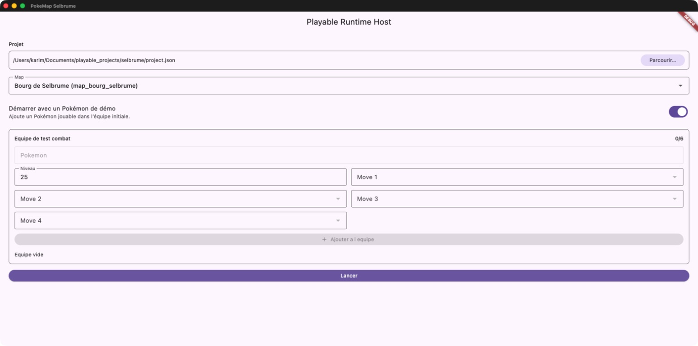
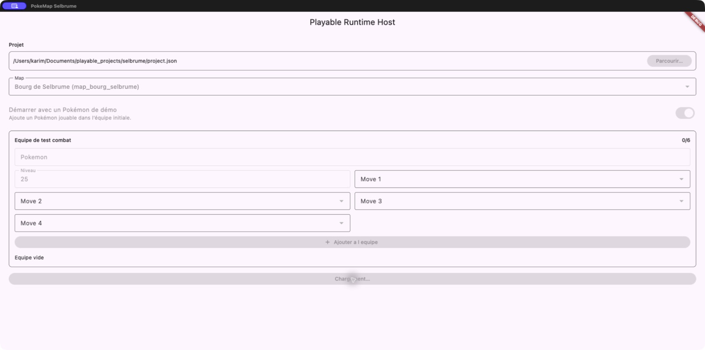
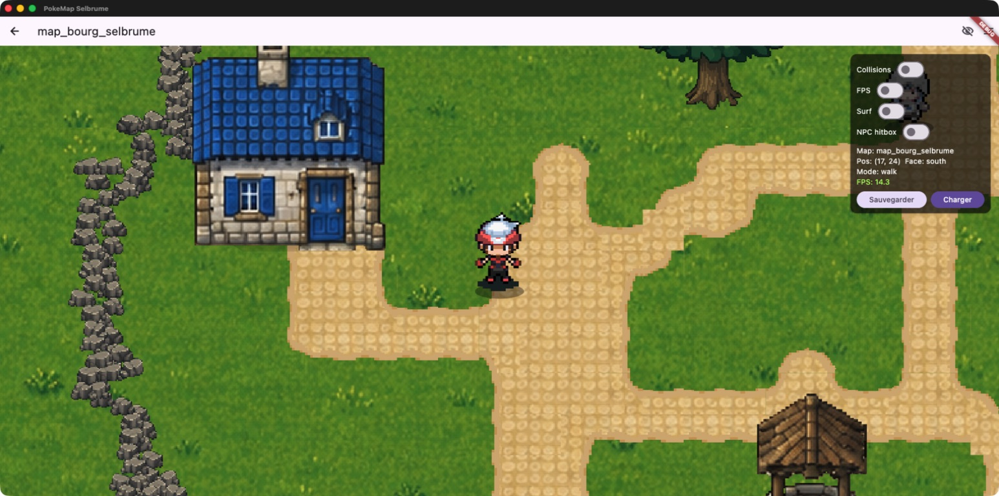
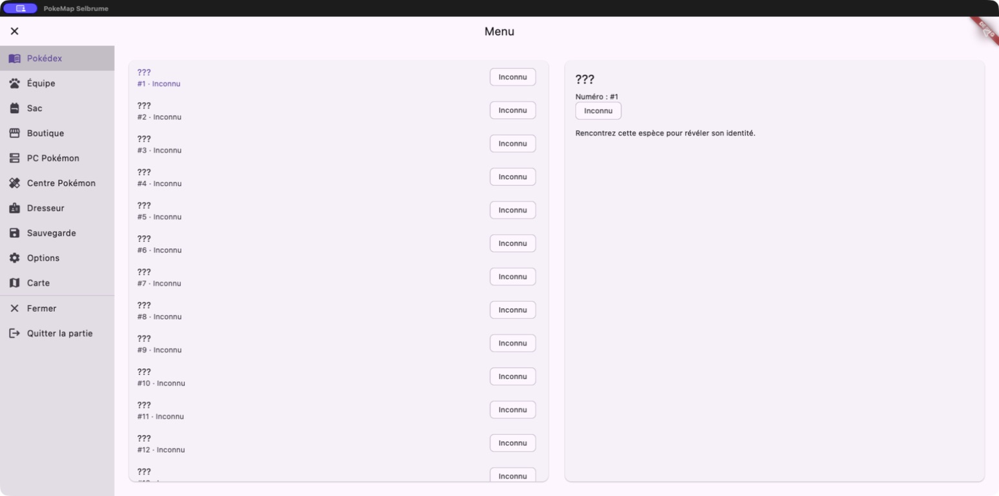
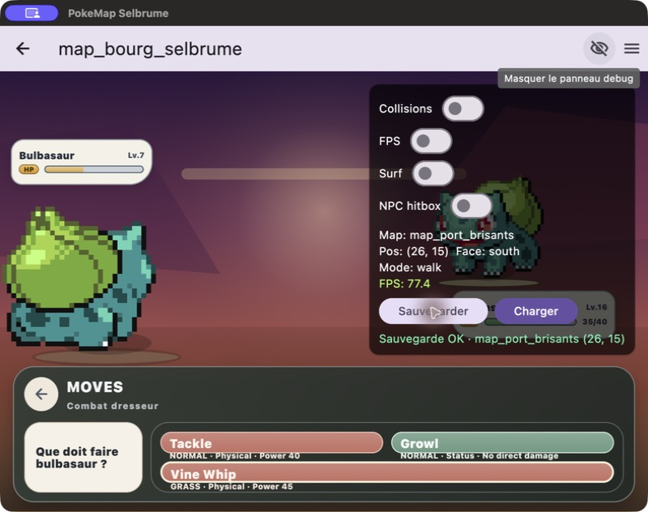
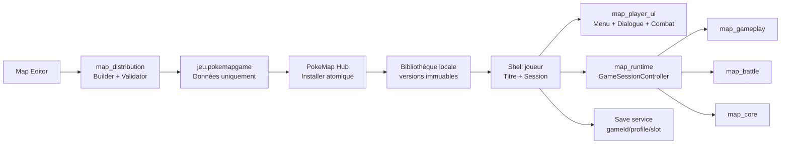
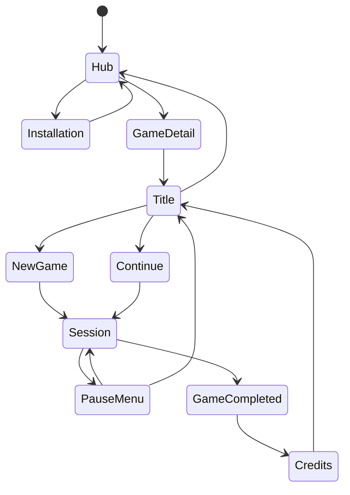

# Audit produit et technique — PokeMap Hub et application joueur

Date : 24 juillet 2026

Révision auditée : `a3bc35104` (`main`)

Nature du lot : audit en lecture seule du code, exécution macOS et proposition d’architecture

Verdict : **NO-GO pour une application hub multijeu distribuable aujourd’hui, GO pour engager sa construction sur les fondations existantes**

## 1. Résumé exécutif

PokeMap possède déjà le cœur difficile :

- un modèle de projet riche ;
- un moteur overworld fonctionnel ;
- un moteur de combat séparé et fortement testé ;
- un runtime Flutter/Flame capable de charger un projet, jouer, sauvegarder, afficher un menu et lancer des combats ;
- un éditeur no-code avancé ;
- un hôte d’évaluation headless et non headless ;
- un packaging macOS et une golden slice Selbrume.

En revanche, l’application actuelle n’est pas encore un produit joueur. `examples/playable_runtime_host` est un banc de test qui charge un dossier brut, restaure un chemin local, expose des outils de debug et mélange le chargement, la session, les services joueur et l’évaluation dans un même hôte.

Les quatre blocages les plus importants ne sont pas visuels :

1. aucun format de jeu installable, versionné et sûr ;
2. aucune identité stable de jeu ni bibliothèque multijeu ;
3. toutes les parties utilisent actuellement une sauvegarde globale commune ;
4. aucune séparation nette entre le hub, le shell joueur, le moteur et le host développeur.

L’écran d’accueil, le vrai menu et la nouvelle UI de combat sont nécessaires, mais ils doivent être construits au-dessus de ce socle. Commencer uniquement par dessiner l’accueil créerait une belle façade incapable d’installer, mettre à jour ou isoler correctement plusieurs jeux.

La recommandation centrale est :

> Le hub exécute un moteur de confiance. Les jeux sont des archives de données immuables, vérifiées, versionnées et sans code exécutable.

## 2. Périmètre et méthode

L’audit a couvert :

- l’architecture des packages Dart/Flutter ;
- le chargement actuel d’un projet ;
- le packaging Selbrume ;
- l’import, l’installation future, les mises à jour et la désinstallation ;
- les sauvegardes, leur compatibilité et leur récupération ;
- le shell joueur, l’écran titre, le menu, les inputs et le lifecycle ;
- l’UI des combats, dialogues et transitions ;
- le design system, l’accessibilité et la localisation ;
- les performances de chargement ;
- la sécurité des packages ;
- les tests, les gates et la distribution desktop/mobile.

Trois passes indépendantes ont été réalisées :

| Passe | Mission | Verdict |
|---|---|---|
| Architecture / distribution | Examiner les frontières, manifests, fichiers, imports, saves et packaging | Le moteur est réutilisable, mais le host actuel n’est pas une base d’installation multijeu sûre. |
| Parcours joueur / UI | Examiner accueil, titre, menu, inputs, combat, dialogue, accessibilité | Le combat doit être consolidé et thématisé, pas réécrit. Le shell joueur et le hub sont absents. |
| Tests / qualité | Exécuter les suites ciblées et examiner performances, crash recovery et gates | GO sur les contrats existants ciblés ; aucune preuve des parcours hub encore absents. |
| Build / validation visuelle | Construire et lancer la build macOS Debug, puis inspecter les écrans courants | GO pour le harness ; N/A pour une release signée qui n’existe pas encore. |
| Implémentation | Vérifier si une modification fonctionnelle était autorisée | N/A : le prompt demandait uniquement un audit. |
| Critique finale | Relire les faits, l’architecture, les liens, les artefacts et les limites | CHANGES_REQUIRED lors de la première passe ; les six corrections ont été appliquées, puis la seconde passe a rendu **GO**. |

Il n’y avait pas de passe « implémentation » : le prompt demandait explicitement un audit et aucune modification fonctionnelle.

## 3. État Git initial

- branche : `main` ;
- HEAD : `a3bc35104` ;
- aucun changement suivi au début de l’audit ;
- de nombreux fichiers non suivis, issus de travaux et preuves précédents, étaient déjà présents ;
- aucun de ces fichiers préexistants n’a été supprimé, déplacé ou modifié.

## 4. Architecture actuelle

| Zone | Rôle actuel | Réutilisabilité pour le hub |
|---|---|---|
| `packages/map_core` | Modèles, sérialisation, validations, sauvegarde | Élevée, avec nouveaux contrats de distribution et de compatibilité à ajouter. |
| `packages/map_gameplay` | Règles overworld pures | Élevée. |
| `packages/map_battle` | Moteur de combat pur | Élevée ; aucune réécriture recommandée. |
| `packages/map_runtime` | Runtime Flutter/Flame, session, rendu, overlays, sauvegarde | Élevée, mais il faut une façade de session et supprimer les hypothèses de chemins libres et de save globale. |
| `packages/map_editor` | Authoring no-code | Élevée ; doit exporter un package joueur nettoyé, pas un dossier source. |
| `examples/playable_runtime_host` | Chargement direct, debug, seeds, évaluation, UI joueur provisoire | À conserver comme harness développeur ; ne doit pas devenir le produit officiel. |

### 4.1 Fondations déjà exploitables

| Fondation | Preuve | État |
|---|---|---|
| Modèle de projet | [`project_manifest.dart`](../../packages/map_core/lib/src/models/project_manifest.dart) | Riche, mais sans identité commerciale de jeu. |
| Validation runtime | [`load_runtime_map_bundle.dart`](../../packages/map_runtime/lib/src/application/load_runtime_map_bundle.dart) | Bonne base de préflight. |
| Digest déterministe | [`project_tree_digest.dart`](../../examples/playable_runtime_host/lib/src/project_tree_digest.dart) | Bonne primitive à étendre en inventaire par fichier. |
| New Game et restauration | [`runtime_launch_save.dart`](../../examples/playable_runtime_host/lib/src/runtime_launch_save.dart) | Réutilisable après isolation et versionnement. |
| Repository de save injectable | [`playable_map_game.dart`](../../packages/map_runtime/lib/src/presentation/flame/playable_map_game.dart) | Bonne couture architecturale. |
| Snapshot Flutter de combat | [`battle_command_overlay_snapshot.dart`](../../packages/map_runtime/lib/src/presentation/flutter/battle_command_overlay_snapshot.dart) | Contrat UI déjà prometteur. |
| Layout de combat responsive | [`battle_scene_layout.dart`](../../packages/map_runtime/lib/src/presentation/flame/battle_scene_layout.dart) | Trois classes de viewport déjà prévues. |
| Design system éditeur | [`design_system.dart`](../../packages/map_editor/lib/src/ui/design_system/design_system.dart) | Source d’inspiration et de tokens, sans dépendance directe depuis le runtime. |

### 4.2 Concentration excessive dans le host

Le fichier [`main.dart`](../../examples/playable_runtime_host/lib/main.dart) gère actuellement :

- la sélection et la copie d’un projet ;
- la restauration du dernier chemin local ;
- la sélection manuelle d’une map ;
- le seed d’une équipe de démonstration ;
- le chargement de catalogues ;
- le lancement d’une partie ;
- la composition du runtime ;
- les outils de debug ;
- le menu ;
- la sauvegarde et le chargement ;
- l’évaluation interactive.

Cette concentration est acceptable dans un harness. Elle ne l’est pas pour un produit qui doit installer, lancer et décharger plusieurs jeux de manière fiable.

## 5. Audit visuel du produit actuel

Les captures suivantes ont été produites pendant l’audit sur la build macOS actuelle. La visualisation des collisions est restée désactivée.

### 5.1 Chargeur de projet



**Santé : critique pour un produit joueur.**

Constats :

- chemin de fichier brut exposé ;
- choix manuel de map ;
- option de seed de Pokémon de démonstration ;
- composition d’équipe de test ;
- absence de bibliothèque, jaquette, auteur, version ou bouton Continuer ;
- chrome Material par défaut sans identité PokeMap joueur ;
- bannière debug visible.

Ce formulaire doit rester dans le host développeur. Il ne doit pas être maquillé en écran d’accueil.

### 5.2 Chargement non borné



**Santé : critique.**

Après lancement du projet historique mémorisé, l’interface reste désactivée avec le seul texte « Chargement… ». Aucun élément n’indique :

- l’étape en cours ;
- le nombre de fichiers ;
- la progression ;
- un délai attendu ;
- une annulation ;
- un timeout ;
- une action de réparation.

Le code confirme des scans séquentiels de catalogues et learnsets. Le problème de chargement supérieur à une heure observé précédemment est compatible avec ce comportement, notamment face à des arbres dupliqués ou obsolètes.

### 5.3 Session en jeu



**Santé : fonctionnelle comme build de développement, insuffisante comme release.**

Le rendu du monde fonctionne. En revanche, le chrome joueur affiche encore :

- l’identifiant technique de map ;
- un AppBar de développement ;
- des contrôles collisions/FPS/Surf/hitbox ;
- des boutons Sauvegarder/Charger dans le panneau debug ;
- une bannière DEBUG.

Le mode release doit être plein écran et ne contenir aucun de ces éléments. Le debug doit être un flavor ou rester dans le host.

### 5.4 Menu actuel



**Santé : partiellement fonctionnelle, refonte produit nécessaire.**

Points positifs :

- plusieurs fonctions joueur existent réellement ;
- Équipe, Sac, Pokédex, Boutique, PC, soin, sauvegarde, options et carte sont branchés ;
- l’acquisition et la restitution des inputs sont protégées.

Limites :

- layout desktop fixe avec rail de 220 px ;
- faible hiérarchie visuelle et beaucoup d’espace inutilisé ;
- pas de vraie navigation manette de la route Flutter ;
- une seule sauvegarde sans vignette, durée, date ou slot ;
- services Boutique/PC/Centre accessibles globalement, sans contexte ni capacité projet ;
- options très limitées ;
- pas de mixeur audio ;
- contenu incomplet affiché comme une longue liste d’« Inconnu » ;
- aucune direction artistique joueur cohérente avec le Narrative Studio.

### 5.5 Combat

Une preuve E2E récente, réalisée sur le même état de projet avec les collisions désactivées, se trouve ici :



**Santé : meilleure fondation UI du runtime, mais encore visuellement et techniquement hybride.**

Le combat possède déjà :

- une scène Flame ;
- des sprites et HUD ;
- un overlay Flutter de commandes ;
- des snapshots typés ;
- des layouts responsive ;
- des tests de commandes et de progression.

Il reste :

- le panneau debug superposé dans la build actuelle ;
- un style local non thématisé ;
- des textes mixtes français/anglais ;
- des composants Flutter et Flame qui peuvent diverger ;
- l’absence de focus et de semantics explicites ;
- des assets d’objets lus synchroniquement pendant `build()` ;
- des transitions et écrans de rencontre encore provisoires ;
- le besoin d’un vrai écran de résultat et d’un feedback plus lisible.

## 6. Écarts fonctionnels globaux

### 6.1 P0 — Indispensable avant de parler de « vraie application »

| Écart | Preuve actuelle | Risque | Action |
|---|---|---|---|
| Identité stable de jeu | `ProjectManifest` possède surtout un nom et une version de schéma. | Collisions, saves mal associées, mises à jour impossibles. | Introduire `gameId`, `gameVersion`, éditeur et compatibilité dans un manifeste de distribution distinct. |
| Format installable | Les jeux sont des dossiers bruts. | Installation impossible à certifier ou partager. | Créer une archive `.pokemapgame` data-only. |
| Packager générique | [`package_selbrume_macos.dart`](../../examples/playable_runtime_host/tool/package_selbrume_macos.dart) est limité à Selbrume/macOS. Le profil actuel peut encore embarquer `runtime_host_launch_save.json`. | Un état de debug peut court-circuiter New Game et le digest source ne certifie pas exactement le payload final. | Construire et hasher le staging final, exclure saves/debug/caches et supprimer toute hypothèse Selbrume. |
| Bibliothèque | Aucun `GameLibrary` ou `InstalledGame`. | Pas d’accueil multijeu réel. | Registre local persistant, reconstruit et réparable. |
| Installation atomique | [`runtime_projects_directory.dart`](../../examples/playable_runtime_host/lib/src/runtime_projects_directory.dart) supprime la cible avant copie. | Une panne détruit la version fonctionnelle. | Staging, validation, promotion atomique, rollback. |
| Saves isolées | [`file_game_save_repository.dart`](../../packages/map_runtime/lib/src/infrastructure/file_game_save_repository.dart) utilise un unique `pokemonProject/game_save.json`. | Deux jeux peuvent s’écraser ou lire la mauvaise save. | Namespace par `gameId/profileId/slotId`. |
| Save versionnée et robuste | Écriture directe du fichier final ; pas de backup/checksum. | Corruption irrécupérable et migrations ambiguës. | `SaveEnvelope`, temp + rename atomique, backup et migrations transactionnelles. |
| Compatibilité | `ProjectVersion` ne couvre que `v1/v2` et la migration est essentiellement identitaire. | Jeu ou save future mal interprétés. | Séparer versions package, jeu, projet, runtime API et save. |
| Confinement des assets | Plusieurs loaders acceptent encore des chemins absolus ou insuffisamment confinés. | Lecture hors package par un contenu importé. | `PackageAssetResolver` unique et chemins relatifs validés. |
| Nettoyage des secrets | `ProjectSettings` peut contenir `mistralApiKey`. | Clé privée distribuée avec un jeu. | Compiler une projection runtime et refuser tout secret probable. |
| Shell joueur | Le host n’a que chargeur ou partie. | Pas de titre, Continue, New Game ni retour propre. | `GameSessionController` et états de navigation produit. |
| Écran titre | Absent. | Démarrage brutal dans le formulaire ou la partie. | Titre brandé par jeu, Continuer, Nouvelle partie, Options, Crédits. |
| Fin de jeu | Aucun contrat `GameCompleted`/crédits trouvé. | Impossible de terminer proprement une démonstration A à Z. | Commande narrative no-code et événement runtime typé. |
| Input Menu/Start | Les actions abstraites sont surtout directions/A/B ; Start/Menu n’est pas routé de bout en bout. | Manette incomplète. | Routeur d’input partagé hub/titre/jeu/overlay. |
| Lifecycle | Aucun observer applicatif central trouvé. | Audio/moteur continuent mal en arrière-plan, reprise fragile. | Pause, checkpoint, reprise et fermeture contrôlée. |
| Séparation debug/release | Panneau debug activé par défaut dans le host. | Expérience impropre et coût performance. | Flavors séparés ; aucun debug dans le shell joueur. |
| Chargements bornés | Scan global séquentiel sans progression/annulation. | Chargement interminable et UI bloquée. | Index, lazy loading, cache, isolate, étapes, timeout et cancel. |

### 6.2 P1 — Expérience cohérente et publiable

| Domaine | Éléments nécessaires |
|---|---|
| Design system joueur | Tokens sémantiques, typographie, spacing, motion, focus, composants hub/titre/menu/combat. |
| Hub | Onboarding vide, import, grille/liste, détail du jeu, reprise récente, espace disque, erreurs actionnables. |
| Menu | Responsive desktop/mobile/manette, services conditionnels, sauvegardes enrichies, vraie hiérarchie. |
| Combat | Overlay canonique, thèmes, safe areas, préchargement, résultats, transitions, statut, accessibilité. |
| Dialogue | Migrer le canvas monospace fixe vers un snapshot/overlay Flutter thématisé. |
| Audio | Volumes musique/SFX/UI, mute, persistance globale et éventuelles préférences par jeu. |
| Accessibilité | Focus visible, navigation clavier/manette, text scaling, contraste, reduced motion, semantics et live regions. |
| Localisation | Locale du hub, fallback contenu, métadonnées traduites. |
| Résilience | Crash boundary, journal structuré, rotation, redaction, support bundle. |
| Mises à jour | Versions côte à côte, migration de save, rollback et réparation. |
| Export éditeur | Métadonnées, branding, préflight, nettoyage, création et réouverture du package produit. |
| Distribution macOS | Identité produit, Developer ID, notarisation, association de fichier et preuve d’installation froide. |

### 6.3 P2 — Après le premier produit local publiable

- catalogue distant ;
- téléchargements reprenables ;
- mises à jour automatiques ou delta ;
- profils multiples avancés ;
- import/export et cloud saves ;
- favoris, recherche, filtres, temps de jeu ;
- signatures éditeur obligatoires et révocation ;
- Windows/Linux, puis web selon le modèle de fichiers ;
- télémétrie strictement opt-in ;
- succès et fonctions sociales ;
- extensions ou mods uniquement avec un modèle de sandbox explicite.

## 7. Trois directions possibles

| Direction | Avantage | Coût / risque | Verdict |
|---|---|---|---|
| Transformer `playable_runtime_host` en hub | Premier écran rapide à produire. | Conserve le monolithe, le debug, les chemins locaux et les responsabilités mêlées. | Non recommandé. |
| Créer un hub, une couche de distribution et une UI joueur dédiés | Architecture propre, réutilise le moteur, permet un vrai produit multijeu. | Demande le socle package/save/install avant le polish. | **Recommandé.** |
| Distribuer seulement un exécutable autonome par jeu | Simple pour une première démo. | Duplique le runtime, pas de bibliothèque ni mises à jour communes. | Option d’export secondaire plus tard. |

Le hub et l’export autonome peuvent partager exactement le même player et le même format de jeu. L’exécutable autonome embarquerait simplement un package et masquerait la bibliothèque.

## 8. Architecture cible recommandée



### 8.1 Nouveaux modules

#### `packages/map_distribution`

Package Dart pur :

- `GamePackageManifest` ;
- codec et canonicalisation ;
- SemVer et compatibilité runtime ;
- inventaire et SHA-256 ;
- builder et inspector ;
- validateur de sécurité ;
- reçus d’installation ;
- politique de migration.

#### `packages/map_player_ui`

Package Flutter :

- thème joueur ;
- titre ;
- menu pause ;
- équipe, sac, Pokédex et carte ;
- services contextuels ;
- dialogue et notifications ;
- overlays de combat ;
- accessibilité et focus.

#### `apps/pokemap_hub`

Application produit :

- bibliothèque ;
- import et installation ;
- progression, annulation et diagnostic ;
- détail du jeu ;
- lancement et reprise ;
- profils et sauvegardes ;
- update, repair, rollback et uninstall ;
- préférences globales ;
- lifecycle et récupération de crash.

### 8.2 Sens des dépendances

Le hub est la racine de composition :

```text
apps/pokemap_hub
├── dépend de map_distribution
├── dépend de map_runtime
└── dépend de map_player_ui

map_player_ui ──► contrats/snapshots de map_runtime
map_runtime ──X─► map_player_ui
```

`map_runtime` ne doit jamais importer `map_player_ui`. L’UI envoie des commandes au runtime via des ports injectés par le hub. Si les snapshots deviennent difficiles à partager sans cycle, leurs DTO sans Flutter seront déplacés dans un petit module de contrats pur plutôt que de créer une dépendance inverse.

### 8.3 Isolation de la session

Une erreur Dart interceptée ne protège pas le hub contre tous les crashs natifs, OOM ou décodeurs défaillants.

Décision provisoire recommandée :

- V0 et mobile : même processus, session jetable, contenu data-only strictement validé, crash marker et restauration au redémarrage ;
- desktop public : prototyper un player enfant lancé par le hub, avec IPC minimal, afin qu’un crash natif du jeu ne ferme pas la bibliothèque ;
- phase 0 : ADR obligatoire comparant coût, UX, rendu, distribution, reprise et niveau d’isolation, avant de figer l’API de session.

### 8.4 Modules existants

- `map_runtime` reste le moteur de session et expose une façade `GameSessionController`.
- `map_editor` dépend du contrat `map_distribution`, pas des internals du hub.
- `playable_runtime_host` reste le banc de test, de benchmark et d’évaluation.
- `map_battle` reste la source de vérité du combat.

## 9. Format de jeu recommandé

Extension recommandée : `.pokemapgame`.

Le dossier source de l’éditeur et le package joueur sont deux choses différentes :

- le dossier source peut contenir caches, réglages auteur et données de travail ;
- le package joueur est une projection nettoyée, immuable, inventoriée et strictement data-only.

```text
mon-jeu-1.2.0.pokemapgame
├── game-manifest.json
├── project/
│   ├── project.json
│   ├── maps/
│   ├── assets/
│   ├── dialogues/
│   └── data/
├── presentation/
│   ├── icon.png
│   ├── cover.png
│   └── hero.png
└── legal/
    ├── LICENSE.txt
    └── CREDITS.txt
```

### 9.1 Champs minimaux du manifeste

L’exemple suivant est volontairement minimal : son inventaire contient exactement un fichier de payload. Dans le format réel :

- `game-manifest.json` est exclu de `content.files` pour éviter toute auto-référence ;
- `fileCount` et `uncompressedBytes` décrivent uniquement le payload ;
- `treeHashSha256` est dérivé de l’inventaire canonique trié ;
- une éventuelle signature couvre le manifeste canonique avec le champ `signature` omis.

```json
{
  "packageFormat": 1,
  "gameId": "app.pokemap.karim.ma-demo",
  "gameVersion": "1.2.0",
  "displayName": "Ma Démo",
  "publisher": {
    "id": "karim",
    "displayName": "Karim"
  },
  "runtime": {
    "apiMajor": 1,
    "minHubVersion": "0.1.0",
    "requiredCapabilities": [
      "overworld.v1",
      "battle.single.v1",
      "narrative.scene.v1"
    ]
  },
  "project": {
    "format": "v2",
    "entrypoint": "project/project.json"
  },
  "save": {
    "format": 1,
    "compatibilityId": "main-campaign-v1"
  },
  "presentation": {
    "defaultLocale": "fr",
    "supportedLocales": ["fr"]
  },
  "content": {
    "fileCount": 1,
    "uncompressedBytes": 48213,
    "treeHashSha256": "...",
    "files": [
      {
        "path": "project/project.json",
        "bytes": 48213,
        "sha256": "...",
        "mediaType": "application/json"
      }
    ]
  }
}
```

La couleur d’accent et le branding peuvent être déclaratifs, mais aucun widget, script Dart, binaire ou plugin natif ne doit être chargé depuis un jeu.

### 9.2 Sécurité de l’archive

L’inspection doit refuser :

- chemins absolus ou contenant `..` ;
- symlinks, hardlinks et fichiers spéciaux ;
- doublons et collisions Unicode/casse ;
- fichiers non inventoriés ou hash incorrect ;
- profondeur, nombre ou taille excessifs ;
- ratio de compression suspect ;
- extensions exécutables ;
- assets dépassant les limites de décodage ;
- secrets probables ;
- références sortant de la racine installée.

SHA-256 garantit l’intégrité, pas l’identité de l’auteur. Pour un sideload local V1, un package non signé peut être accepté avec avertissement. Un catalogue public devra exiger une signature éditeur.

### 9.3 Installation

```text
Sélection du package
→ lecture du manifeste
→ compatibilité et quotas
→ extraction dans staging
→ hashes et confinement
→ validation projet/runtime
→ smoke de chargement
→ promotion atomique
→ mise à jour de la bibliothèque
```

Une version installée est immuable :

```text
games/<gameId>/
├── versions/
│   ├── 1.1.0/
│   └── 1.2.0/
├── current.json
└── install-receipts/
```

Une mise à jour est installée côte à côte. `current.json` n’est basculé qu’après validation. L’ancienne version est conservée pour rollback.

La désinstallation conserve les saves par défaut. « Supprimer également mes données » doit être une action distincte et explicite.

## 10. Sauvegardes multijeux

Stockage recommandé :

```text
Application Support/PokeMap/
├── games/
├── saves/
│   └── <gameId>/
│       └── <profileId>/
│           └── <slotId>/
│               ├── save.json
│               └── save.backup.json
├── cache/
├── logs/
└── library.json
```

Une enveloppe de sauvegarde doit contenir :

- `schemaVersion` ;
- `gameId` ;
- `slotId` et `saveId` ;
- dates de création et mise à jour ;
- version du jeu à la création et à la dernière ouverture ;
- version du format projet ;
- version du format de save ;
- identifiant de compatibilité ;
- checksum ;
- état métier.

Écriture :

1. produire `save.tmp` ;
2. flush et relecture ;
3. valider l’enveloppe ;
4. déplacer l’ancienne save vers le backup ;
5. renommer atomiquement la temporaire ;
6. restaurer ou mettre en quarantaine si nécessaire.

Une migration s’exécute sur une copie, produit un reçu et ne détruit jamais la dernière save valide.

## 11. Parcours joueur cible



### 11.1 Accueil / bibliothèque

- reprendre la dernière partie ;
- jeux installés ;
- importer un jeu ;
- état vide guidé ;
- progression d’installation ;
- statut de compatibilité et intégrité ;
- accès aux réglages et diagnostics.

### 11.2 Détail d’un jeu

- icon, cover, titre, auteur, version et description ;
- Continuer ou Jouer ;
- Nouvelle partie ;
- dernière sauvegarde et temps de jeu ;
- mise à jour, réparer, gérer les saves et désinstaller ;
- avertissement éditeur non vérifié.

### 11.3 Écran titre

Le hub lance le player, puis chaque jeu possède un titre standard brandé :

- Continuer ;
- Nouvelle partie ;
- Charger ;
- Options ;
- Crédits / À propos ;
- Retour au hub.

Le branding doit rester déclaratif et sûr : logo, fond, accent, musique, illustration et quelques variantes de layout validées.

### 11.4 Menu pause

Sections recommandées :

- Reprendre ;
- Équipe ;
- Sac ;
- Pokédex ;
- Carte ;
- Sauvegarder ;
- Options ;
- Retour au titre.

Boutique, Centre Pokémon et PC doivent être exposés par les interactions du monde ou par une capacité explicite du projet, éventuellement conditionnée par les Facts. Ils ne doivent pas être automatiquement disponibles partout.

### 11.5 Fin du jeu

Il manque un véritable état terminal :

- commande narrative no-code `Terminer le jeu` ;
- événement `GameCompleted` ;
- verrouillage du gameplay ;
- save marquée complétée ;
- écran de résultat ;
- crédits ;
- retour au titre ou au hub.

## 12. Stratégie UI globale

### 12.1 Ne pas copier directement le design system éditeur

Le Narrative Studio est un outil dense de production. Le joueur a besoin d’une interface immersive et lisible.

Il faut partager ou recréer une petite fondation :

- couleurs sémantiques ;
- typographie ;
- spacing et rayons ;
- motion ;
- focus ;
- états disabled/selected/danger ;
- composants de base.

Le package joueur ne doit pas dépendre de `map_editor`.

### 12.2 Hub

Direction recommandée :

- identité sombre et qualitative proche de l’Event Builder ;
- covers comme point focal ;
- faible densité sur la bibliothèque ;
- diagnostics et métadonnées dans les vues secondaires ;
- transitions cohérentes entre hub, titre et player.

### 12.3 Menu

- desktop/paysage : rail et contenu ;
- mobile portrait : grille ou sheet puis sous-pages ;
- manette : pages plein écran avec focus directionnel ;
- aucune donnée brute ou identifiant technique ;
- empty states utiles ;
- previews de save avec date, durée, lieu et miniature.

### 12.4 Combat

Il ne faut pas réécrire `map_battle`.

La cible est :

- Flame pour le terrain, les combattants, la caméra et les FX ;
- Flutter pour le HUD interactif, les commandes, la cible, le sac, l’équipe, les résultats et l’accessibilité ;
- un snapshot de présentation typé ;
- un seul contrôleur de commandes ;
- un fallback Flame temporaire uniquement pendant la migration.

Lots visuels :

1. contrat canonique et suppression des divergences ;
2. thème et composants HUD ;
3. sélection de commande, cible, sac et équipe ;
4. transitions, statuts, résultats et progression ;
5. audio, haptique, reduced motion et accessibilité ;
6. performance et préchargement des assets.

### 12.5 Dialogue et notifications

Le dialogue actuel est encore un canvas à couleurs et dimensions fixes avec des hints clavier littéraux. Il doit suivre le même pattern que le combat :

- snapshot de dialogue ;
- overlay Flutter ;
- speaker, portrait, texte, choix et progression ;
- adaptation tactile/clavier/manette ;
- text scaling et semantics ;
- vitesse de texte et réduction des animations.

## 13. Performance, résilience et exploitation

### 13.1 Chargement

Le lancement normal doit afficher des étapes :

```text
Validation du package
→ Ouverture du projet
→ Index des espèces
→ Préchargement essentiel
→ Restauration de la save
→ Initialisation de la map
```

Chaque étape doit être :

- mesurable ;
- annulable lorsque c’est sûr ;
- soumise à un budget ;
- journalisée ;
- capable de produire une erreur actionnable.

Les catalogues doivent disposer d’un index exporté, d’un cache versionné et d’un chargement paresseux. Le player ne doit pas scanner toutes les espèces et tous les learnsets à chaque démarrage.

### 13.2 Crash recovery

Il manque :

- `runZonedGuarded` ;
- gestion centrale de `FlutterError.onError` et erreurs plateforme ;
- écran de récupération ;
- journal local structuré et rotatif ;
- redaction des données sensibles ;
- support bundle ;
- détection d’un lancement précédent interrompu.

### 13.3 Lifecycle

- pause du moteur et de l’audio en arrière-plan ;
- checkpoint sur événement sûr ;
- fermeture propre des streams, audio, controllers et caches ;
- déchargement complet avant de lancer un autre jeu ;
- reprise claire après suspension.

### 13.4 Offline

Le runtime n’a pas besoin d’un réseau pour jouer si tous les assets sont packagés. Cela doit devenir un gate officiel :

- réseau coupé ;
- workspace source absent ;
- package installé dans le stockage privé ;
- New Game, save, fermeture, Continue et combat réussis.

## 14. Distribution et plateformes

### Cible recommandée

1. macOS en premier, car le packaging actuel y existe déjà ;
2. Windows ensuite pour une vraie distribution desktop large ;
3. Android/iOS après stabilisation de l’installer, du stockage et des saves ;
4. Linux et web selon la demande.

Avant publication macOS :

- bundle ID et nom produit génériques ;
- association `.pokemapgame` ;
- universal build ou politique d’architecture claire ;
- Developer ID ;
- notarisation ;
- installation froide sur une machine sans le dépôt ;
- gate archive → hub → jeu ;
- politique d’update du hub lui-même.

Les identités actuelles divergent entre macOS, iOS et Android et restent liées à Selbrume ou à des noms d’exemple. Elles doivent être remplacées par une identité produit cohérente.

La logique iOS actuelle duplique aussi la suppression puis la copie directe du projet. Elle devra être remplacée par le même service d’installation que les autres plateformes, et non maintenue comme un second installateur divergent.

Aucun workflow CI `.github/workflows` n’a été trouvé pendant l’audit. Le gate générique devra être automatisé sur une CI reproductible avant de devenir une preuve de publication.

## 15. Roadmap proposée

Le découpage suivant contient **9 phases et 47 lots testables**. Il est volontairement détaillé afin de pouvoir regrouper plusieurs lots sûrs dans une même session sans mélanger les gates.

### Phase 0 — Contrats produit et architecture

| Lot | Contenu | Sortie attendue |
|---|---|---|
| HUB-000 | ADR hub/player/host et frontières de packages | Architecture approuvée. |
| HUB-001 | Spécification `.pokemapgame` | Schéma, exemples et versions. |
| HUB-002 | Threat model et politique de confiance | Menaces, quotas, signatures et non-objectifs. |
| HUB-003 | Compatibilité package/jeu/projet/runtime/save | Matrice et règles de migration/downgrade. |
| HUB-004 | IA et états hub/titre/menu/fin | Parcours produit validés avant implémentation visuelle. |
| HUB-005 | ADR isolation de session | Même processus ou player enfant selon les plateformes, avec limites de crash documentées. |

### Phase 1 — Distribution core

| Lot | Contenu | Sortie attendue |
|---|---|---|
| HUB-010 | Nouveau package `map_distribution` | Modèles et barrels purs. |
| HUB-011 | Codec, SemVer et canonicalisation | Manifests déterministes. |
| HUB-012 | Inventaire et hashes par fichier | Intégrité complète. |
| HUB-013 | Builder de package data-only | Archive reproductible. |
| HUB-014 | Inspector et validateur hostile | Traversal, liens, collisions, quotas et secrets couverts. |

### Phase 2 — Saves et lifecycle multijeux

| Lot | Contenu | Sortie attendue |
|---|---|---|
| HUB-020 | `GameIdentity` et `SaveEnvelope` | Contrats versionnés. |
| HUB-021 | Repository scoppé game/profile/slot | Isolation prouvée entre deux jeux. |
| HUB-022 | Écriture atomique, backup et récupération | Kill/corruption tests verts. |
| HUB-023 | Migrations et rollback | N→N+1 et futur refusé proprement. |
| HUB-024 | Lifecycle et checkpoint | Pause/reprise/fermeture prouvées. |

### Phase 3 — Installer et bibliothèque

| Lot | Contenu | Sortie attendue |
|---|---|---|
| HUB-030 | Registre `GameLibrary` | Installations listables et réparables. |
| HUB-031 | Installer staging/promotion atomique | Échec sans perte de la version active. |
| HUB-032 | Update côte à côte et rollback | Migration et retour arrière testés. |
| HUB-033 | Repair/uninstall et conservation des saves | UX et contrats sûrs. |
| HUB-034 | Progression, annulation, stockage et diagnostics | Aucun chargement opaque. |

### Phase 4 — Shell joueur et session

| Lot | Contenu | Sortie attendue |
|---|---|---|
| HUB-040 | `GameSessionController` | Chargement/déchargement déterministes. |
| HUB-041 | `PackageAssetResolver` confiné | Aucun chemin hors package. |
| HUB-042 | Routeur d’input commun | Menu/Start et navigation manette de bout en bout. |
| HUB-043 | Écran titre New Game/Continue/Options | Premier démarrage et reprise réels. |
| HUB-044 | `GameCompleted`, crédits et retour au hub | Démonstration terminable A à Z. |

### Phase 5 — Hub et design system joueur

| Lot | Contenu | Sortie attendue |
|---|---|---|
| HUB-050 | Fondations `map_player_ui` | Tokens, thème, composants et focus. |
| HUB-051 | Accueil/bibliothèque | Empty state, import et jeux récents. |
| HUB-052 | Détail du jeu | Jouer, Continue, gérer et désinstaller. |
| HUB-053 | Menu responsive | Desktop, mobile et manette. |
| HUB-054 | Audio, accessibilité et localisation | Réglages persistants et tests dédiés. |

### Phase 6 — Combat, dialogue et feedback

| Lot | Contenu | Sortie attendue |
|---|---|---|
| HUB-060 | Contrat canonique de présentation combat | Une seule source de commandes UI. |
| HUB-061 | HUD et commandes thématisés | Responsive et sans debug. |
| HUB-062 | Sac, équipe, cible et statuts | Tous les sous-flux cohérents. |
| HUB-063 | Transitions, résultat et progression | Boucle de combat lisible. |
| HUB-064 | Dialogue/notifications/post-combat Flutter | UI accessible et homogène. |
| HUB-065 | Performance, audio, haptique, reduced motion | Assets préchargés et options respectées. |

### Phase 7 — Export éditeur et release générique

| Lot | Contenu | Sortie attendue |
|---|---|---|
| HUB-070 | Métadonnées et branding no-code | Aucun JSON manuel requis. |
| HUB-071 | Projection runtime et secret scrub | Source auteur jamais distribuée telle quelle. |
| HUB-072 | Export, réouverture et validation | Package produit certifié. |
| HUB-073 | « Installer dans PokeMap Hub » | Boucle auteur rapide. |
| HUB-074 | Gate release générique | Plus aucune hypothèse Selbrume. |

### Phase 8 — Certification produit

| Lot | Contenu | Sortie attendue |
|---|---|---|
| HUB-080 | Second mini-jeu neutre | Preuve que l’architecture n’est pas Selbrume-spécifique. |
| HUB-081 | E2E offline A à Z | Export → install → New Game → combat → save → Continue → fin. |
| HUB-082 | Update/migration/rollback/uninstall | Parcours de maintenance complet. |
| HUB-083 | Stress, kill et budgets de performance | 100 jeux et grands catalogues sans blocage opaque. |
| HUB-084 | Build macOS signé et notarisé | Installation froide reproductible. |

### Ordre de livraison

```text
P0 technique : phases 0 à 4
→ Premier hub utilisable : phase 5
→ Qualité joueur attendue : phase 6
→ Boucle no-code complète : phase 7
→ GO de publication : phase 8
```

## 16. Matrice de tests à instaurer

### Package et sécurité

- manifeste valide/invalide ;
- version future refusée ;
- traversal, absolu, symlink et hardlink ;
- doublon et collision de casse ;
- ZIP bomb, fichier et total trop grands ;
- fichier absent, supplémentaire ou hash incorrect ;
- secret détecté ;
- code exécutable refusé.

### Installation

- fresh install ;
- deux jeux de même titre et `gameId` distinct ;
- idempotence ;
- interruption, crash, disque plein et permission refusée ;
- version active conservée après échec ;
- repair ;
- uninstall conservant les saves.

### Saves

- isolation de deux jeux ;
- profils et slots ;
- kill pendant écriture ;
- primary corrompu et backup valide ;
- migration compatible ;
- migration en échec avec rollback ;
- version future refusée ;
- update puis downgrade selon politique.

### Runtime

- lancement froid sans dépôt ;
- réseau coupé ;
- premier démarrage ;
- Continue ;
- retour au titre et au hub ;
- déchargement puis lancement d’un second jeu ;
- fin et crédits ;
- aucun seed ni panneau debug.

### UI et input

- clavier, tactile et manette ;
- Start/Menu ;
- focus directionnel ;
- safe areas et breakpoints ;
- text scaling ;
- semantics et annonces ;
- locale/fallback ;
- reduced motion ;
- services conditionnels.

### Performance

- cold/warm start ;
- bibliothèque de 100 jeux ;
- catalogues de 1 000 à 2 000 espèces ;
- gros package ;
- annulation réactive ;
- budgets P95 fixés sur une machine CI de référence.

## 17. Vérifications exécutées

### Architecture, package et saves

```text
cd packages/map_core
dart test test/project_json_migrations_test.dart \
  test/mvp_release_gate_test.dart \
  test/mvp_release_evidence_receipt_test.dart
→ +26, All tests passed
```

```text
cd packages/map_runtime
flutter test test/file_game_save_repository_test.dart \
  test/runtime_pokemon_species_loader_test.dart \
  test/runtime_pokemon_learnset_loader_test.dart \
  test/runtime_pokemon_evolution_loader_test.dart
→ +52, All tests passed
```

```text
cd examples/playable_runtime_host
flutter test test/runtime_projects_directory_test.dart \
  test/runtime_project_picker_test.dart \
  test/runtime_ios_project_picker_test.dart \
  test/bundled_runtime_project_test.dart \
  test/selbrume_release_package_test.dart \
  test/project_tree_digest_test.dart \
  test/runtime_launch_save_test.dart \
  test/mvp_release_command_matrix_test.dart \
  test/mvp_release_evidence_collector_test.dart
→ +23, All tests passed
```

### UI joueur et combat

```text
cd examples/playable_runtime_host
flutter test --reporter compact \
  test/in_game_menu_test.dart \
  test/runtime_player_options_test.dart \
  test/runtime_gamepad_bridge_test.dart \
  test/runtime_touch_input_driver_test.dart \
  test/project_loader_page_test.dart \
  test/runtime_project_picker_test.dart \
  test/runtime_projects_directory_test.dart \
  test/runtime_launch_save_test.dart \
  test/runtime_battle_command_overlay_visibility_test.dart
→ 31 tests, All tests passed
```

```text
cd packages/map_runtime
flutter test --reporter compact \
  test/battle_mobile_command_overlay_test.dart \
  test/battle_scene_layout_test.dart \
  test/file_game_save_repository_test.dart \
  test/battle_overlay_component_test.dart \
  test/post_battle_progression_overlay_component_test.dart
→ 121 tests, All tests passed
```

Ces commandes se chevauchent sur certains fichiers de test ; leurs totaux ne doivent pas être additionnés comme une couverture globale.

### Build et exécution visuelle

```text
cd examples/playable_runtime_host
flutter run -d macos
→ build Debug réussie et application lancée
```

Une seconde exécution a chargé le projet courant avec le mode interactif. Le monde et le menu ont été inspectés. Les collisions sont restées désactivées.

### Analyse statique

Aucune commande `dart analyze` ou `flutter analyze` n’a été lancée : aucun code n’a été modifié et cette passe était un audit produit/architecture. Cela ne constitue pas une preuve que le dépôt complet est sans warning.

### Gates complets connus

Une passe complète immédiatement antérieure, sur le même HEAD, avait encore signalé trois échecs Selbrume :

- `selbrume_event_v2_three_source_integration_test.dart` ;
- `selbrume_narrative_campaign_outcome_matrix_test.dart` ;
- `selbrume_event_v2_promoted_project_test.dart`.

Ils ne remettent pas en cause l’architecture recommandée, mais interdisent de déclarer le dépôt globalement vert.

## 18. Critères de GO

Le produit pourra être déclaré « vraie application hub » lorsque :

- un package est généré depuis un commit propre ;
- son manifeste et son inventaire sont validés ;
- l’archive est installée par le même parcours que celui utilisé par le joueur ;
- le dépôt source peut être absent ;
- deux jeux ne partagent aucune save, préférence ou cache mutable ;
- une interruption pendant install/save/update ne détruit pas la dernière version valide ;
- les versions futures sont refusées avec une erreur claire ;
- tous les assets restent confinés ;
- le parcours complet fonctionne offline ;
- le titre, le menu, le combat et la fin sont jouables au clavier, tactile et manette ;
- les budgets de chargement et l’annulation sont prouvés ;
- le gate générique ne dépend pas de Selbrume ;
- aucun test critique n’échoue ou n’est ignoré ;
- la build cible est signée, installée à froid et relancée ;
- un reçu de diagnostic redacted est produit.

## 19. Risques et auto-critique

### Risques principaux

1. sous-estimer la migration des saves parce que le jeu et le format projet évoluent en même temps ;
2. exposer un chemin non confiné dans un loader secondaire ;
3. reconstruire le hub dans `playable_runtime_host` par commodité ;
4. créer un deuxième système de combat au lieu de consolider les snapshots existants ;
5. copier visuellement l’éditeur sans concevoir une UI réellement adaptée au joueur ;
6. certifier uniquement Selbrume et masquer des dépendances implicites ;
7. traiter la signature comme un remplacement de la validation hostile ;
8. publier une UI avant d’avoir des erreurs, progrès et réparations actionnables.

### Limites de cet audit

- aucune implémentation n’a été réalisée ;
- aucun package hostile réel n’existe encore à tester ;
- aucune build signée/notarisée n’a été produite ;
- aucune validation visuelle multi-device n’a été faite ;
- aucune revue WCAG complète avec lecteur d’écran n’a été réalisée ;
- les captures proviennent d’une build Debug et ne mesurent pas les performances Release ;
- les tests ciblés prouvent les briques existantes, pas les parcours encore absents ;
- les estimations de planning en jours ont volontairement été évitées avant les ADR et prototypes de la phase 0.

## 20. Conclusion

Oui, PokeMap peut devenir cette application.

Le moteur n’est pas le problème principal. Le chantier est désormais un chantier de **produit, distribution et expérience joueur** :

1. figer les contrats ;
2. packager des jeux data-only ;
3. isoler installations et sauvegardes ;
4. créer le hub et le shell joueur ;
5. unifier l’UI du menu, du dialogue et du combat ;
6. exporter depuis l’éditeur ;
7. certifier un parcours générique offline, puis le distribuer.

La première phase à lancer est la phase 0, suivie immédiatement de la phase 1. L’accueil peut être conçu pendant la phase 0, mais son implémentation doit attendre que l’identité, le package, l’installation et les saves aient un contrat stable.

## 21. État Git final et artefacts

État final :

- HEAD inchangé : `a3bc35104` ;
- aucun fichier suivi modifié ;
- aucun fichier source ou test créé/modifié ;
- aucun commit, stage ou push ;
- les fichiers non suivis préexistants sont restés intacts.

Artefacts créés par cet audit :

1. `reports/product/pokemap_hub_player_application_audit_2026-07-24.md` — présent rapport ;
2. `reports/product/evidence/hub_runtime_audit_2026-07-24/01-current-runtime-project-loader.jpeg` ;
3. `reports/product/evidence/hub_runtime_audit_2026-07-24/02-current-runtime-indefinite-loading.jpeg` ;
4. `reports/product/evidence/hub_runtime_audit_2026-07-24/03-current-runtime-game-screen.jpeg` ;
5. `reports/product/evidence/hub_runtime_audit_2026-07-24/04-current-runtime-in-game-menu.jpeg`.

Diff fonctionnel : aucun. Les seules écritures sont ce rapport et ses quatre preuves visuelles.
