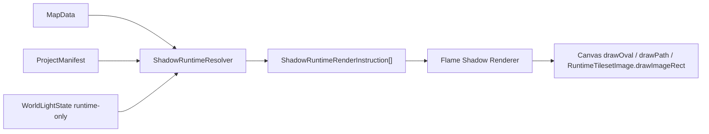

# Shadow System Architecture Audit & Roadmap V0

Date: 2026-05-14  
Lot: Shadow-0  
Type: audit + architecture + roadmap, sans implémentation de production

## 1. Résumé exécutif

Le système d'ombres doit rester un système visuel. Il ne doit pas écrire dans la collision, ne doit pas être un masque d'occlusion, et ne doit pas devenir une surface gameplay. L'existant fournit déjà les garde-fous principaux:

- `ElementCollisionProfile` sépare `visualMask`, `collisionMask` (`pixelMask` JSON historique), `occlusionMask` et `cells`.
- `map_gameplay` lit la collision, pas l'occlusion ni le visuel.
- `MapLayersComponent` et `MapGridPainter` ont déjà une séparation fond / avant-plan pour les éléments hauts.
- Surface Runtime a un pattern utile: résoudre des instructions pures avant de dessiner, sans charger d'image dans le resolver.
- `RuntimeTilesetImage.drawImageRect(...)` fournit déjà une abstraction compatible avec de futurs sprites d'ombres ou atlas d'ombres.

Architecture recommandée: combinaison catalog + config par élément + override par instance.

```text
map_core:
  ProjectShadowProfile / ProjectShadowCatalog
  ProjectElementShadowConfig
  MapPlacedElementShadowOverride

map_editor:
  read model + inspecteur élément
  overrides par instance
  preview non destructif
  aucun mélange avec l'éditeur collision/occlusion

map_runtime:
  MapData + ProjectManifest + WorldLightState
    -> ShadowRuntimeResolver pur
    -> ShadowRuntimeRenderInstruction[]
    -> Flame shadow renderer

map_gameplay:
  aucun modèle d'ombre
  uniquement tests de non-régression "shadow has no collision side-effect"
```

V0 doit rester modeste:

- acteurs: contact blob / ellipse simple;
- éléments statiques: ombres contact/ellipse/profilées via instructions;
- blur runtime interdit en V0;
- sprites d'ombre pré-bakés ou atlas d'ombres préparés pour V1;
- heure de journée préparée par contrat, pas branchée partout.

Point d'attention découvert: l'ordre actuel Surface diffère entre runtime et éditeur. Runtime peint Surface avant les tiles et placed elements. L'éditeur peint Surface après la passe background des tiles/placed elements. Avant de brancher des ombres visibles dans les deux environnements, il faudra un micro-lot de régression d'ordre de rendu.

## 2. Fichiers inspectés

### map_core

- `packages/map_core/lib/map_core.dart`
- `packages/map_core/lib/src/models/map_data.dart`
- `packages/map_core/lib/src/models/map_layer.dart`
- `packages/map_core/lib/src/models/project_manifest.dart`
- `packages/map_core/lib/src/models/tileset.dart`
- `packages/map_core/lib/src/models/element_collision_profile.dart`
- `packages/map_core/lib/src/models/map_entity_editor_visual.dart`
- `packages/map_core/lib/src/models/map_entity_payloads.dart`
- `packages/map_core/lib/src/models/surface.dart`
- `packages/map_core/lib/src/models/surface_catalog.dart`
- `packages/map_core/lib/src/operations/map_layers.dart`
- `packages/map_core/lib/src/operations/map_placed_elements.dart`
- `packages/map_core/lib/src/operations/map_placed_element_animation.dart`
- `packages/map_core/lib/src/operations/surface_layer_placements.dart`
- `packages/map_core/lib/src/operations/surface_variant_role_resolver.dart`
- `packages/map_core/lib/src/operations/project_manifest_surface_catalog_operations.dart`
- `packages/map_core/lib/src/validation/validators.dart`

### map_editor

- `packages/map_editor/lib/src/application/collision_generation/element_visual_occupancy_analyzer.dart`
- `packages/map_editor/lib/src/application/collision_generation/element_visual_occupancy_raster.dart`
- `packages/map_editor/lib/src/application/collision_generation/placed_element_auto_collision_generator.dart`
- `packages/map_editor/lib/src/application/collision_generation/placed_element_collision_params.dart`
- `packages/map_editor/lib/src/application/collision_generation/placed_element_mask_heuristics_v1.dart`
- `packages/map_editor/lib/src/ui/widgets/element_collision_triple_mask_editor.dart`
- `packages/map_editor/lib/src/ui/canvas/map_canvas.dart`
- `packages/map_editor/lib/src/ui/canvas/map_canvas/map_grid_painter.dart`
- `packages/map_editor/lib/src/application/services/placed_element_instance_indexer.dart`
- `packages/map_editor/lib/src/application/services/element_collision_authoring_service.dart`
- `packages/map_editor/lib/src/application/services/element_collision_profile_generator.dart`
- `packages/map_editor/lib/src/features/surface_painter/surface_layer_static_preview.dart`
- `packages/map_editor/lib/src/features/surface_painter/surface_tile_preview_resolver.dart`
- `packages/map_editor/lib/src/features/editor/state/editor_state.dart`
- `packages/map_editor/lib/src/features/editor/state/editor_notifier.dart`

### map_runtime

- `packages/map_runtime/lib/src/presentation/flame/runtime_map_game.dart`
- `packages/map_runtime/lib/src/presentation/flame/playable_map_game.dart`
- `packages/map_runtime/lib/src/presentation/flame/map_layers_component.dart`
- `packages/map_runtime/lib/src/presentation/flame/player_component.dart`
- `packages/map_runtime/lib/src/presentation/flame/overworld_actor_component.dart`
- `packages/map_runtime/lib/src/presentation/flame/placed_element_occlusion_patch_component.dart`
- `packages/map_runtime/lib/src/presentation/flame/runtime_path_autotile.dart`
- `packages/map_runtime/lib/src/surface/surface_runtime_render_instruction.dart`
- `packages/map_runtime/lib/src/surface/surface_runtime_resolver.dart`
- `packages/map_runtime/lib/src/surface/surface_runtime_tileset_collector.dart`
- `packages/map_runtime/lib/src/infrastructure/runtime_tileset_image.dart`
- `packages/map_runtime/lib/src/infrastructure/tile_image_loader.dart`
- `packages/map_runtime/test/surface/surface_runtime_test_support.dart`

### map_gameplay

- `packages/map_gameplay/pubspec.yaml`
- `packages/map_gameplay/lib/src/gameplay_world_state.dart`
- `packages/map_gameplay/lib/src/collision/pixel_movement_resolver.dart`

Le chemin demandé `packages/map_gameplay/lib/src/collision.dart` n'existe pas. L'équivalent inspecté est `packages/map_gameplay/lib/src/collision/pixel_movement_resolver.dart`, plus la construction des caches de collision dans `gameplay_world_state.dart`.

## 3. État actuel du rendu PokeMap

### Runtime Flame

`RuntimeMapGame` est le host simple: il charge les tilesets via `loadTilesetImagesById(...)`, ajoute un `MapLayersComponent`, puis cadre la caméra sur la map.

`PlayableMapGame` est le host complet. Il monte:

- un `MapLayersComponent` background avec `priority = 0`;
- un `MapLayersComponent` foreground avec `priority = 100000`;
- le joueur via `PlayerComponent`;
- les NPC avec `OverworldActorComponent`;
- une profondeur dynamique `1000 + footY` pour le joueur et les acteurs.

Dans `MapLayersComponent.render(...)`, le pass background fait actuellement:

```text
1. TerrainLayer
2. PathLayer
3. SurfaceLayer
4. TileLayer + placed elements liés à la tile layer
5. entités rendues comme ProjectElementEntry
6. overlay collision si activé
```

Le pass foreground fait:

```text
1. TileLayer foreground explicite ou cellules foreground dérivées
2. placed elements de ces tile layers foreground
3. entités explicitement forcées foreground
```

Les placed elements sont actuellement dessinés via `RuntimeTilesetImage.drawImageRect(...)`. Les sprites multi-cellules peuvent être séparés entre fond et avant-plan selon les cellules de collision:

- cellules collision: restent en fond;
- cellules hors collision: peuvent repasser en avant-plan.

`PlacedElementOcclusionPatchComponent` existe et documente clairement son rôle: redessiner les pixels `occlusionMask` au-dessus du joueur sans gérer la collision. Audit `rg`: il n'est actuellement référencé que par sa propre définition. Il faut donc le traiter comme un point d'intégration préparé, pas comme un pass déjà monté partout.

### Éditeur

`MapCanvas` est le shell widget; le rendu vit dans `MapGridPainter`.

Ordre actuel dans `MapGridPainter.paint(...)`:

```text
1. TerrainLayer
2. PathLayer
3. TileLayer background + placed elements background
4. SurfaceLayer preview atlas/debug
5. CollisionLayer
6. grille + hover
7. gameplay zones
8. entités background
9. TileLayer foreground + placed elements foreground
10. entités foreground
11. sélection / tool preview / environment mask / events / triggers / warps / connections
```

Écart important: Surface est avant tile/placed dans runtime, mais après tile/placed background dans l'éditeur. Ce n'est pas forcément un bug pour Surface aujourd'hui, mais c'est un risque pour Shadow. Un système d'ombres doit être vérifié avec des tests d'ordre editor/runtime avant rendu visible.

### Surface Runtime

Surface suit déjà le bon pattern pour Shadow:

```text
SurfaceLayer + ProjectSurfaceCatalog + elapsedMs
  -> resolveSurfaceRuntimeRenderInstructions(...)
  -> SurfaceRuntimeRenderInstruction[]
  -> MapLayersComponent dessine avec RuntimeTilesetImage.drawImageRect(...)
```

Le resolver est pur: il ne charge pas d'image et ne dessine pas. Les références manquantes sont ignorées pour garder une map partiellement authorée chargeable.

## 4. Séparation actuelle visuel / collision / occlusion / gameplay

`ElementCollisionProfile` contient:

- `visualMask`: occupation visuelle pixel-level;
- `collisionMask` sérialisé sous la clé JSON historique `pixelMask`;
- `occlusionMask`: pixels qui peuvent couvrir le joueur;
- `cells`: vérité runtime legacy à la grille;
- champs d'authoring manuel (`shapeCells`, `manualAddedCells`, `manualRemovedCells`).

`ElementCollisionTripleMaskEditor` rappelle explicitement:

- collision = bloque le déplacement;
- occlusion = peut recouvrir le joueur au rendu, ne bloque pas par elle-même;
- visual = référence visuelle / alpha.

`PlacedElementAutoCollisionGenerator` orchestre un pipeline à trois rôles:

```text
alpha image -> visualMask
visualMask -> heuristiques -> collisionMask + occlusionMask
```

`PlacedElementMaskHeuristicsV1` existe justement pour éviter l'ancien piège "opaque = bloquant": il retire une bande basse candidate "ombre" de la collision et place l'occlusion sur une bande haute du volume.

`map_gameplay` confirme la séparation:

- le `pubspec.yaml` indique "Pure Dart - no rendering, no Flame dependency";
- le cache de collision pixel lit `profile.collisionMask`;
- le fallback legacy lit `profile.cells`;
- `occlusionMask` et `visualMask` ne sont pas utilisés pour bloquer le joueur;
- les paths water et gameplay zones servent au surf/mouvement, pas aux ombres.

Conclusion: Shadow doit s'ajouter comme contrat visuel distinct. Il ne doit pas réutiliser `collisionProfile` comme stockage primaire. Il peut lire `visualMask` comme source optionnelle de silhouette plus tard, mais uniquement comme input visuel.

## 5. Besoin produit : ce qu'un système d'ombres flexible doit permettre

Le système cible doit couvrir:

- ombre absente par élément ou instance;
- ombre simple sous acteur;
- ombre statique pour arbres, maisons, rochers, panneaux, lampadaires, clôtures et décors hauts;
- ombre complète, partielle, contact-only, lower-body-only, custom mask, frame-specific;
- bord dur, feathered, blur pré-baké, pas de blur;
- sprite d'ombre custom ou frame d'atlas custom;
- forme procédurale simple;
- évolutivité heure de journée;
- performances sur grandes maps;
- parité éditeur/runtime;
- aucune influence collision, occlusion ou gameplay.

Types cibles à considérer:

| Type | Usage | V0 ? |
|---|---|---|
| `none` | élément sans ombre | oui |
| `contactBlob` | acteurs, petits props | oui |
| `ellipse` | rochers, panneaux, sprites simples | oui |
| `projectedQuad` | ombre directionnelle simple de maison/arbre | V1 |
| `projectedSpriteMask` | silhouette projetée à partir d'un masque/sprite | V2 |
| `customShadowSprite` | asset d'ombre dédié | V1 |
| `customShadowAtlasFrame` | frame dans un atlas d'ombre | V1 |
| `handPaintedMask` | masque d'ombre authoré | V2 ou après ShadowLayer |

Softness:

| Mode | Recommandation |
|---|---|
| hard edge | V0, pixel art safe |
| feathered | V1, seulement si pré-calculé ou approximé par texture |
| prebaked blur | V1, recommandé pour ombres douces |
| runtime blur | interdit V0, très limité V2 si cache par chunk |
| no blur | default pixel art |

## 6. Risques principaux

1. Mélange Shadow/Collision: le plus gros risque produit. Les ombres ne doivent jamais créer de cellule bloquante.
2. Mélange Shadow/Occlusion: une ombre au-dessus du joueur devient vite un bug visuel. L'occlusion sert à cacher le joueur derrière un volume; l'ombre sert à teinter le sol.
3. Ordre de rendu fragile: background/foreground/Y-sort sont déjà subtils. Ajouter des ombres sans pass clair produira des ombres au-dessus du joueur ou des façades.
4. Parité éditeur/runtime: Surface a déjà un ordre différent entre les deux. Shadow doit avoir des tests de parité très tôt.
5. Blur runtime coûteux: `saveLayer + ImageFilter.blur` par objet/frame est un risque de perf immédiat.
6. Modèle JSON trop tôt: un `ShadowCatalog` global non préparé peut créer de la dette si les besoins réels diffèrent.
7. Instance overrides trop puissants: tout permettre par instance dès V0 peut rendre l'éditeur et les migrations lourds.
8. Time-of-day scope creep: direction, couleur, longueur, intérieur/extérieur et lumière locale peuvent exploser le lot.
9. Assets/atlas: les ombres custom doivent réutiliser le pipeline tileset/image, pas introduire un loader parallèle.
10. Culling/cache: recalculer toutes les ombres statiques de toute la map à chaque frame serait inacceptable.

## 7. Options d'architecture comparées

### Option A - Shadow config directement dans `ProjectElementEntry`

Principe: ajouter `shadow` ou `shadowConfig` dans chaque `ProjectElementEntry`.

- Avantages: simple à comprendre; pas de lookup catalog; bon pour un toggle V0.
- Inconvénients: duplication massive; difficile d'aligner tous les arbres/rochers; peu adapté aux presets globaux.
- Impact JSON: champ optionnel sur `elements[]`; backward-compatible si nullable/default.
- Migration: faible au départ; forte si on veut ensuite extraire un catalog.
- Editor: facile dans l'inspecteur élément; mauvaise UX pour appliquer un style à plusieurs éléments.
- Runtime: lookup direct depuis l'entry; simple.
- Tests: codec élément + defaults.
- Dette: moyenne à forte si l'équipe veut des presets réutilisables.
- Verdict: acceptable seulement comme micro-lot de transition, pas comme architecture finale.

### Option B - `ProjectShadowProfile` référençable par `ProjectElementEntry`

Principe: un profil réutilisable décrit l'ombre; l'élément référence `shadowProfileId`.

- Avantages: DRY; cohérent avec presets; bon pour arbres/rochers/maisons; tests purs.
- Inconvénients: nécessite un espace de stockage de profils; gestion références manquantes.
- Impact JSON: `shadowProfileId` sur l'élément + stockage des profils ailleurs.
- Migration: sûre si `shadowProfileId` est nullable.
- Editor: bonne UX avec presets + override local.
- Runtime: resolver doit faire un lookup.
- Tests: validation refs, fallback absent, codec.
- Dette: faible si le profil reste visuel et petit.
- Verdict: recommandé comme base.

### Option C - `ProjectShadowCatalog` global dans `ProjectManifest`

Principe: `ProjectManifest` possède un catalog de profils Shadow.

- Avantages: point unique; cohérent avec `surfaceCatalog`; bon pour import/export; permet diagnostics.
- Inconvénients: introduire trop tôt un catalog global peut figer le modèle.
- Impact JSON: nouvelle clé top-level `shadowCatalog`.
- Migration: non cassante si clé absente/null -> catalog vide.
- Editor: permet future bibliothèque de presets.
- Runtime: charge tous les profils mais ne résout que ceux utilisés.
- Tests: defaults backward-compatible, duplication ids, refs.
- Dette: faible si le catalog reste compact; forte s'il devient un "Shadow Studio" avant besoin réel.
- Verdict: recommandé, mais après validation des value objects et de la config élément.

### Option D - Shadow data portée par `MapPlacedElement` instance

Principe: chaque instance placée porte son ombre.

- Avantages: désactiver/raccourcir l'ombre d'un arbre précis; variations locales; utile pour maisons custom.
- Inconvénients: duplication si utilisé comme source principale; bruit JSON sur chaque map.
- Impact JSON: champ optionnel sur `placedElements[]`.
- Migration: sûre si nullable.
- Editor: nécessaire dans l'inspecteur instance; risqué si trop de champs V0.
- Runtime: resolver doit merger element default + instance override.
- Tests: priorité des overrides, null = héritage, disable instance.
- Dette: faible en override, forte en source primaire.
- Verdict: recommandé uniquement comme override.

### Option E - `ShadowLayer` séparé dans `MapData`

Principe: une couche de map dédiée aux ombres peintes manuellement.

- Avantages: idéal pour ombres sous pont, falaise, toit, overlay décoratif; lisible comme layer visuel.
- Inconvénients: mauvais modèle pour "un arbre projette son ombre"; risque de refaire un système de tiles parallèle.
- Impact JSON: nouveau type de `MapLayer` ou payload layer.
- Migration: plus lourde; nécessite UI layer/tools.
- Editor: bon pour paint manuel; pas pour defaults par élément.
- Runtime: pass visuel indépendant; culling par layer/chunk possible.
- Tests: layer codec, painting, ordering.
- Dette: faible si réservé aux ombres peintes; forte si utilisé pour remplacer les ombres d'éléments.
- Verdict: à garder pour V1/V2, pas V0.

### Option F - Combinaison catalog + overrides par élément/instance

Principe:

```text
ProjectShadowCatalog
  -> ProjectShadowProfile[]

ProjectElementEntry.shadow
  -> castsShadow
  -> shadowProfileId
  -> small element-level overrides

MapPlacedElement.shadowOverride
  -> disable or override transform/opacity/profile
```

- Avantages: flexible; DRY; compatible avec instances; bonne séparation authoring/runtime.
- Inconvénients: nécessite un resolver clair et des règles de merge strictes.
- Impact JSON: trois ajouts optionnels progressifs.
- Migration: sûre si chaque champ est nullable/default et les instructions runtime ne sont jamais persistées.
- Editor: UX progressive: presets globaux, toggle élément, override instance.
- Runtime: resolver pur, facile à tester.
- Tests: plus nombreux mais isolables.
- Dette: faible si livré par micro-lots.
- Verdict: architecture recommandée.

## 8. Architecture recommandée

### Règle de frontière

Les ombres sont:

- `map_core`: données pures, authoring contract, validation;
- `map_editor`: authoring + preview;
- `map_runtime`: résolution + rendu Flame;
- jamais `map_gameplay`, sauf tests de non-effet collision.

### Flux recommandé



### Principe de merge

1. Si instance override `castsShadow == false`: pas d'ombre.
2. Sinon lire config élément.
3. Si élément `castsShadow == false` ou mode `none`: pas d'ombre.
4. Résoudre `shadowProfileId` dans catalog.
5. Appliquer overrides élément.
6. Appliquer overrides instance.
7. Appliquer light state runtime si `timeMode` l'autorise.
8. Émettre instruction pure.

### Stockage V0 recommandé

V0 strict:

- profils purs et tests;
- config élément optionnelle;
- override instance optionnel;
- pas de `ShadowLayer`;
- pas de time-of-day persistant branché au runtime;
- pas de blur runtime.

V1:

- catalog manifest;
- renderer static placed elements;
- sprites/atlas d'ombres;
- culling.

V2:

- painted shadow layer;
- time-of-day buckets;
- custom masks frame-specific;
- cache chunks.

## 9. Modèles proposés côté map_core

Les noms ci-dessous sont des propositions. Ils ne doivent pas être codés dans Shadow-0.

```dart
enum ShadowCasterMode {
  none,
  contactBlob,
  ellipse,
  projectedQuad,
  projectedSpriteMask,
  customShadowSprite,
  customShadowAtlasFrame,
  handPaintedMask,
}

enum ShadowCoverageMode {
  full,
  partial,
  contactOnly,
  lowerBodyOnly,
  customMask,
  frameSpecific,
}

enum ShadowSoftnessMode {
  hardEdge,
  feathered,
  prebakedBlur,
  runtimeBlur,
  noBlur,
}

enum ShadowTimeMode {
  static,
  affectedByGlobalLight,
  localOverride,
}

enum ShadowRenderPass {
  groundStatic,
  actorContact,
  manualOverlay,
}

class ProjectShadowProfile {
  final String id;
  final String name;
  final ShadowCasterMode mode;
  final ShadowCoverageMode coverageMode;
  final ShadowSoftnessMode softnessMode;
  final ShadowTimeMode timeMode;
  final ShadowRenderPass renderPass;
  final double offsetX;
  final double offsetY;
  final double scaleX;
  final double scaleY;
  final double skewX;
  final double skewY;
  final double rotationDegrees;
  final double opacity;
  final String? colorHex;
  final double? blurRadius;
  final String? shadowTilesetId;
  final TilesetSourceRect? shadowSource;
  final String? sourceMaskId;
}

class ProjectElementShadowConfig {
  final bool castsShadow;
  final String? shadowProfileId;
  final ProjectShadowProfileOverride? override;
}

class MapPlacedElementShadowOverride {
  final bool? castsShadow;
  final String? shadowProfileId;
  final ProjectShadowProfileOverride? override;
}
```

Champs V0 / V1 / V2:

| Champ | Niveau | Note |
|---|---:|---|
| `castsShadow` | V0 | indispensable pour opt-out |
| `shadowProfileId` | V0/V1 | V0 si catalog existe; sinon après catalog |
| `mode` | V0 | `none/contactBlob/ellipse` d'abord |
| `offsetX/offsetY` | V0 | alignement sous sprite |
| `scaleX/scaleY` | V0 | taille simple |
| `opacity` | V0 | besoin immédiat |
| `colorHex` | V0 | default noir/bleu nuit possible |
| `renderPass` | V0 | éviter les ombres au mauvais endroit |
| `softnessMode` | V0 | mais seulement `hardEdge/noBlur` actif |
| `shadowTilesetId/shadowSource` | V1 | sprite/atlas d'ombre |
| `skewX/skewY/rotationDegrees` | V1 | projection directionnelle |
| `coverageMode` | V1 | partial/lower-body/custom |
| `affectedByTimeOfDay` / `timeMode` | V1 | préparé mais pas tout brancher |
| `minOpacity/maxOpacity` | V1/V2 | utile avec lumière globale |
| `blurRadius/falloff` | V2 | interdit V0 sauf validation "non supporté" |
| `sourceMaskId` / frame-specific | V2 | requiert authoring mask/sprite |

Remarque importante: éviter `Color` de Flutter dans `map_core`. Persisté: `String colorHex` ou int ARGB pur. Dans `map_runtime`, convertir en `Color`.

## 10. Authoring proposé côté map_editor

### Approche progressive

1. Inspecteur élément: toggle "casts shadow", preset, offset, scale, opacity.
2. Inspecteur instance: héritage / désactiver / override léger.
3. Preview canvas: ombres visibles via un pass dédié, sans polluer collision/occlusion.
4. Presets globaux: bibliothèque simple de profils, pas "Shadow Studio" complet.
5. Time preview: matin/midi/soir/nuit seulement après modèle light state.
6. Shadow mask custom: outil séparé, pas dans l'éditeur de masques collision/occlusion.

### Pourquoi ne pas mettre ça dans `ElementCollisionTripleMaskEditor`

Cet éditeur porte une responsabilité nette: visual, collision, occlusion. Y ajouter Shadow créerait de la confusion avec les masques métiers. Il peut plus tard offrir une action "créer un masque d'ombre depuis visualMask", mais le masque d'ombre doit vivre dans un modèle Shadow séparé.

### UI recommandée

Dans l'inspecteur élément:

- toggle `castsShadow`;
- menu preset;
- segmented mode: `none / blob / ellipse / sprite`;
- inputs offset X/Y;
- sliders scale/opacity;
- swatch color;
- menu softness: `hard / prebaked`;
- badge "runtime blur disabled in V0";
- preview toggle in canvas.

Dans l'inspecteur instance:

- `inherit`;
- `disabled`;
- `custom`;
- override offset/scale/opacity/profile seulement.

Shadow Studio dédié: V2. Utile pour catalog massif, masques custom et time-of-day, mais trop gros pour V0.

## 11. Runtime proposé côté map_runtime / Flame

### Resolver

Créer plus tard:

```text
packages/map_runtime/lib/src/shadow/shadow_runtime_render_instruction.dart
packages/map_runtime/lib/src/shadow/shadow_runtime_resolver.dart
packages/map_runtime/lib/src/presentation/flame/shadow_layer_component.dart
```

Le resolver doit rester pur:

- input: `MapData`, `ProjectManifest`, `WorldLightState`, elapsed time si besoin;
- output: liste immutable d'instructions;
- pas d'image load;
- pas de `Canvas`;
- pas de mutation de `MapData`;
- références manquantes ignorées ou diagnostiquées selon le mode.

La forme proposée dans le prompt est globalement bonne, mais à ajuster:

- éviter `Color?` dans une instruction si on veut garder les tests runtime purs et simples; préférer `int? colorArgb` ou une petite value object;
- séparer shape et source image;
- éviter de persister `sourceRect` dérivé si la frame existe déjà dans le profile;
- inclure `bounds` ou `worldX/worldY/worldWidth/worldHeight`, plus `anchor`;
- ajouter un `debugSource` optionnel pour tests/diagnostics, pas obligatoire.

Exemple conceptuel amélioré:

```dart
final class ShadowRuntimeRenderInstruction {
  final String id;
  final double worldX;
  final double worldY;
  final double width;
  final double height;
  final double offsetX;
  final double offsetY;
  final double scaleX;
  final double scaleY;
  final double skewX;
  final double skewY;
  final double rotationDegrees;
  final double opacity;
  final int colorArgb;
  final ShadowCasterMode mode;
  final ShadowSoftnessMode softnessMode;
  final String? tilesetId;
  final int? sourceX;
  final int? sourceY;
  final int? sourceWidth;
  final int? sourceHeight;
  final int renderPriority;
}
```

### Renderer

V0 renderer:

- `contactBlob` / `ellipse`: `canvas.drawOval(...)` ou `drawPath(...)`, `isAntiAlias = false` par défaut pixel art;
- sprite/atlas: `RuntimeTilesetImage.drawImageRect(...)`;
- aucun `saveLayer + ImageFilter.blur` par objet;
- culling camera avant draw;
- paint objects réutilisables par couleur/opacité si possible.

### Acteurs

Pour player/NPC/follower/wild overworld/custom actor:

- commencer avec contact shadow simple;
- positionner sur `footPoint` / `depthSortY`;
- priorité juste avant le sprite acteur;
- ne pas stocker dans `map_gameplay`;
- exposer plus tard `ProjectCharacterShadowConfig` si nécessaire.

Un composant sibling `ActorShadowComponent` est préférable à un dessin caché dans le gameplay. Rendu dans `PlayerComponent`/`OverworldActorComponent` peut être acceptable pour V0, mais il rend l'ordre inter-acteurs plus difficile à tester. Le meilleur compromis: helper pur pour calculer l'instruction, puis composant Flame léger.

## 12. Ordre de rendu recommandé

Ordre cible runtime:

```text
1. terrain / path / surfaces
2. manual ground shadow overlays (futur ShadowLayer)
3. static shadows from placed elements
4. tile layer background + placed element base cells
5. dynamic actor contact shadows
6. actors / player / NPC by foot Y
7. placed element occlusion patches + foreground tile cells
8. UI / debug overlays
```

Adaptation à l'existant:

- les ombres statiques d'éléments peuvent être intégrées dans `MapLayersComponent` background entre Surface et `_paintTileLayer(...)`;
- les ombres dynamiques d'acteurs peuvent utiliser une priorité `actorPriority - 1`;
- le foreground `MapLayersComponent` à `100000` doit rester au-dessus;
- si `PlacedElementOcclusionPatchComponent` est réactivé/monté, il doit rester distinct de Shadow.

Éviter les bugs:

- ombre au-dessus du joueur: toujours priorité inférieure au sprite acteur;
- ombre cachée par le sol: dessiner après terrain/path/surface;
- ombre devant façade: foreground/occlusion doit repasser au-dessus;
- ombre qui disparaît derrière une surface: clarifier le pass Surface dans éditeur et runtime;
- incohérence éditeur/runtime: créer tests comparant ordre logique avant renderer visible.

Le prompt propose `terrain / tile background / surfaces / shadows...`. L'audit ne recommande pas de l'accepter tel quel, car le runtime actuel place Surface avant TileLayer background, et l'éditeur fait l'inverse pour Surface. Le premier lot de rendu doit donc verrouiller l'ordre réel voulu.

## 13. Stratégie performance

### Comparaison

| Technique | Coût | Recommandation |
|---|---:|---|
| `drawOval` simple | bas | V0 acteurs / petits props |
| `drawPath` simple | bas-moyen | V0/V1 projected shapes simples |
| `drawImageRect` sprite d'ombre | bas | V1 recommandé |
| `drawAtlas` / `drawRawAtlas` | bas par instance si batch | V2 après besoin mesuré |
| `saveLayer + ImageFilter.blur` | élevé | interdit V0 |
| texture blur pré-bakée | bas runtime | recommandé |
| cached `Picture` par chunk | moyen mémoire, bas CPU | V1/V2 static shadows |
| cached `ui.Image` par chunk | mémoire plus forte | V2 maps énormes |
| shadow atlas | bon | V1 |
| time-of-day buckets | bon compromis | V2 |
| camera culling | indispensable | V0 runtime |
| dirty rectangles | complexité | V2 |

### V0

- Actor shadows: recalcul léger chaque frame, drawOval/drawPath.
- Static shadows: instructions résolues au chargement ou quand map/manifest/light bucket change.
- Pas de blur runtime.
- Culling par viewport avant draw.
- Aucun recalcul global si seule la caméra bouge.

### V1

- Shadow atlas / custom shadow sprites.
- Cache d'instructions par map + manifest revision.
- Cache static par chunk si beaucoup d'ombres statiques.
- Culling spatial simple par rect.

### V2

- Time-of-day buckets: matin/midi/soir/nuit/intérieur.
- Interpolation légère entre buckets.
- Picture/image cache par chunk.
- Batching `drawAtlas` si profiling le justifie.
- Dirty regions uniquement si l'éditeur ou runtime modifie la map à chaud.

## 14. Préparation heure de la journée

Concepts utiles:

```text
WorldLightState        runtime current state, not persisted per frame
ShadowLightProfile    authoring profile or map profile
SunDirection          vector/direction conceptual
ShadowLengthMultiplier
ShadowOpacityMultiplier
AmbientTint
DayPhase
IndoorShadowPolicy
```

Persistable plus tard:

- profils de phases (`morning`, `noon`, `afternoon`, `evening`, `night`, `indoor`, `cave`, `special`);
- map policy indoor/outdoor;
- par-profile `timeMode`;
- min/max opacity;
- optional direction/length multipliers.

Runtime-only:

- heure courante;
- interpolation frame-by-frame;
- état courant du soleil;
- valeurs dérivées par instruction;
- caches de bucket.

Authoring/editor-only:

- selected preview phase;
- sliders temporaires avant save;
- diagnostic "this profile ignores time".

V0 doit seulement éviter de bloquer cette évolution: ne pas hardcoder la direction ou l'opacité comme constantes cachées impossibles à surcharger.

## 15. Compatibilité JSON et migration

Stratégie non cassante:

1. Créer d'abord les value objects Shadow en tests purs.
2. Ajouter codecs/defaults avec champs optionnels.
3. Ajouter `ProjectElementEntry.shadow` optionnel.
4. Ajouter `ProjectShadowCatalog` avec clé absente/null -> catalog vide.
5. Ajouter `MapPlacedElement.shadowOverride` optionnel.
6. Ajouter editor read-model.
7. Ajouter runtime resolver.

À persister:

- `ProjectShadowProfile` globaux;
- config par `ProjectElementEntry`;
- override par `MapPlacedElement`;
- plus tard config par character/entity kind;
- plus tard manual shadow layer;
- plus tard map light policy.

À ne pas persister:

- `ShadowRuntimeRenderInstruction`;
- source rects dérivées si elles sont déjà dans un profile/frame;
- caches d'images;
- current sun state;
- opacité interpolée frame-by-frame;
- culling results.

Compatibilité:

- tous les nouveaux champs doivent être optional/default;
- les projets existants doivent décoder sans migration destructive;
- pas de `required shadowCatalog` sans converter `null/missing -> empty`;
- suivre le pattern Surface: modèles purs -> codecs -> manifest -> editor -> runtime.

## 16. Tests recommandés

### map_core

Premiers lots:

- value equality / validation de `ProjectShadowProfile`;
- JSON absent -> default sans ombre;
- `shadowProfileId` référence existante/manquante;
- merge element + instance override;
- `castsShadow=false` gagne toujours;
- `no collision side-effect`: ajouter shadow ne change ni `collisionMask`, ni `cells`.

Plus tard:

- catalog duplicate IDs;
- custom atlas frame bounds;
- time mode defaults;
- migration legacy JSON.

### map_editor

Premiers lots:

- read model: inspecteur lit `castsShadow`;
- toggle on/off ne modifie pas collision/occlusion;
- preview resolver n'écrit pas `MapData`;
- canvas order test: shadow preview sous entités, sous foreground.

Plus tard:

- presets globaux;
- instance overrides;
- day phase preview;
- custom shadow mask UI séparée.

### map_runtime

Premiers lots:

- resolver pur: absent config -> no instruction;
- element profile -> instruction;
- instance disable -> no instruction;
- actor contact shadow instruction;
- render order smoke around `MapLayersComponent`;
- pixel test simple contact ellipse if stable.

Plus tard:

- culling;
- custom atlas drawImageRect;
- time multiplier;
- static chunk cache invalidation;
- large map perf characterization.

### performance

Tests à prévoir:

- 1k/5k static shadows resolved once;
- actor shadows moving every frame;
- culling offscreen;
- runtime blur rejected/disabled;
- cached/prebaked sprite path.

## 17. Roadmap micro-lots

Critique de la roadmap proposée dans le prompt: elle est bonne dans l'esprit, mais elle branche l'éditeur et le runtime avant d'avoir verrouillé le modèle de merge et l'ordre de rendu. Je recommande de déplacer "render ordering regression" plus tôt et de séparer "custom shadow sprite" de "manual shadow layer".

| Lot | Objectif | Fichiers probables | Tests | Risques / validation / non-objectifs |
|---|---|---|---|---|
| Shadow-0 | Audit + roadmap | `reports/shadows/shadow_system_architecture_audit.md` | aucun test Dart requis | Validation: rapport complet. Ne pas coder. |
| Shadow-1 | Décision modèle finale | `reports/shadows/shadow_model_decision.md` | n/a | Figer noms/champs V0. Ne pas toucher manifest. |
| Shadow-2 | Value objects Shadow purs | `packages/map_core/lib/src/models/shadow.dart`, barrel | `dart test` ciblé map_core | Pas de manifest, pas d'editor. |
| Shadow-3 | Codecs JSON Shadow | modèles + `.g.dart/.freezed.dart` | codec/defaults | build_runner seulement package modifié. Pas runtime. |
| Shadow-4 | Config optionnelle élément | `project_manifest.dart` | decode old ProjectElementEntry | Ne pas ajouter catalog si pas prêt. |
| Shadow-5 | Catalog Shadow manifest | `ProjectShadowCatalog`, operations | refs/default catalog empty | Clé absente/null compatible. |
| Shadow-6 | Override instance | `MapPlacedElement` | merge/disable tests | Override limité, pas tous les champs V2. |
| Shadow-7 | Règles de merge pures | `map_core/src/operations/shadow_config_resolver.dart` | element + profile + instance matrix | Pas de Flame. |
| Shadow-8 | Editor read model | editor state/use cases | widget/unit read tests | Pas de canvas renderer. |
| Shadow-9 | Inspecteur toggle élément | widgets inspecteur élément | toggle preserves collision masks | Pas de Shadow Studio. |
| Shadow-10 | Ordre de rendu regression | editor/runtime tests | canvas/render order tests | Corriger/acter Surface order si nécessaire. |
| Shadow-11 | Runtime instructions | `map_runtime/lib/src/shadow/...` | pure resolver tests | Pas de dessin. |
| Shadow-12 | Flame contact/ellipse renderer | `shadow_layer_component.dart` | pixel/smoke tests | Pas de blur runtime. |
| Shadow-13 | Actor blob shadows | `PlayerComponent`, `OverworldActorComponent` ou sibling component | actor priority tests | Pas de config character complexe. |
| Shadow-14 | Static placed element shadows | `MapLayersComponent` integration | static instruction + render order | Pas de custom sprite encore. |
| Shadow-15 | Culling V0 | runtime shadow renderer | offscreen no draw / counts | Pas de chunk cache. |
| Shadow-16 | Custom atlas/sprite shadow | runtime tileset collector + model refs | drawImageRect bounds tests | Pas de projected mask. |
| Shadow-17 | Editor static preview | `MapGridPainter` shadow pass | visual order tests | Pas de mask editor. |
| Shadow-18 | Manual shadow layer decision | report or map_core layer model | n/a or codec tests | À faire seulement si besoin produit validé. |
| Shadow-19 | Time-of-day parameters | light profile value objects | multiplier tests | Pas de local lights complexes. |
| Shadow-20 | Static cache/chunking | runtime cache | perf characterization | Seulement après mesure. |
| Shadow-21 | Polish + golden slice | runtime/editor fixtures | smoke + golden slice | Pas d'élargissement modèle. |

## 18. Non-objectifs

V0 ne fait pas:

- raytracing;
- vraies lumières 3D;
- lighting physique;
- shader global obligatoire;
- blur runtime par objet à chaque frame;
- pathfinding affecté par les ombres;
- collision créée par les ombres;
- occlusion créée automatiquement par les ombres;
- refactor complet de `MapLayersComponent`;
- `Shadow Studio` complet;
- lights locales complexes;
- `ShadowLayer` manuel si les ombres d'éléments suffisent;
- dépendance externe;
- `SurfaceDefinition` ou Surface Engine persistent model hors scope.

## 19. Questions ouvertes

1. Faut-il que le premier stockage persistant soit `ProjectElementEntry.shadow` ou faut-il d'abord livrer `ProjectShadowCatalog`?
2. L'écart d'ordre Surface éditeur/runtime est-il voulu ou historique?
3. `PlacedElementOcclusionPatchComponent` doit-il être monté avant Shadow pour stabiliser l'ordre occlusion?
4. Les ombres statiques doivent-elles être autorisées sur des éléments dont `applyCollision=false`?
5. Les characters doivent-ils avoir leur propre config Shadow dans `ProjectCharacterEntry`, ou un default runtime suffit-il longtemps?
6. Faut-il un `ShadowLayer` pour falaises/ponts/toits, ou un tile overlay décoratif existant suffit-il?
7. Quelle convention couleur: `#RRGGBB`, `#AARRGGBB`, ou int ARGB?
8. Quelle limite UI pour empêcher les overrides instance de devenir ingérables?
9. Quel niveau de pixel test est stable avec le pipeline Flame actuel?
10. Quelle politique indoor/outdoor existe déjà dans map metadata ou doit être créée plus tard?

## 20. Autocritique

Hypothèses qui peuvent être fausses:

- J'ai supposé que Shadow doit suivre Surface Runtime pour les instructions pures; c'est très probable, mais un besoin d'édition live pourrait ajouter un cache editor spécifique.
- J'ai supposé que l'écart Surface editor/runtime n'est pas intentionnel; il faut validation humaine.
- J'ai supposé que le premier rendu acteur peut être un contact blob; si la direction artistique exige des ombres sprites dès le départ, l'ordre des lots change.

Fichiers non trouvés:

- `packages/map_gameplay/lib/src/collision.dart` n'existe pas; l'équivalent inspecté est `packages/map_gameplay/lib/src/collision/pixel_movement_resolver.dart`.

Zones inspectées mais pas exhaustivement lues ligne par ligne:

- `playable_map_game.dart` est très volumineux; audit ciblé sur montage layers/actors/priorités.
- `editor_notifier.dart` est très volumineux; audit ciblé sur surface/collision/placed element state.
- Les rapports historiques n'ont pas été relus en détail: une commande `rg` sur `reports` et `packages/map_editor/reports` a expiré. Le présent rapport ne s'appuie pas sur un résultat incomplet de cette commande.

Risques cachés:

- `saveLayer` existe déjà côté éditeur pour opacité des placed elements; il ne faut pas imiter ce pattern pour blur runtime.
- Les priorités Flame autour de `1000 + footY` et `100000` foreground doivent être testées avec acteurs, props hauts et future occlusion.
- Les chunks `RuntimeTilesetImage` gèrent de grands tilesets; les sprites d'ombres doivent passer par cette abstraction, pas par `ui.Image` direct partout.
- Les masks pixel peuvent être grands; un `handPaintedMask` d'ombre doit être compressé/validé comme les masks collision, pas stocké naïvement.

Choix qui méritent validation humaine:

- Ajouter `ProjectShadowCatalog` au manifest dès le premier lot code ou d'abord livrer config élément locale.
- Autoriser `runtimeBlur` comme enum mais le rejeter en validation V0, ou ne pas l'exposer du tout avant V2.
- Créer un `ShadowLayer` ou réutiliser un tile overlay décoratif pour les ombres peintes.

Ce qui pourrait être over-engineered:

- Time-of-day complet avant que les ombres statiques simples soient bonnes.
- Shadow Studio dédié trop tôt.
- Trop de champs de transform par instance en V0.

Ce qui pourrait être sous-estimé:

- Parité éditeur/runtime.
- Assets custom et UX pour atlas d'ombre.
- Culling et cache sur très grandes maps.
- Interaction ombre/foreground/occlusion autour des maisons.

## 21. Ce que ce prompt semble peut-être discutable ou incomplet

Le prompt demande un système cible très large, avec types procéduraux, custom masks, blur, heure de journée, éditeur, runtime et performances. C'est utile pour l'audit, mais trop ambitieux pour orienter un premier lot de code. La bonne réduction V0 est: modèles simples, resolver pur, contact/ellipse, pas de blur runtime.

La liste de champs par élément mélange plusieurs horizons:

- `castsShadow`, `shadowProfileId`, `offset`, `scale`, `opacity`, `color`: V0 réaliste.
- `skew`, `rotation`, `falloff`, `blurRadius`, `affectedByTimeOfDay`: à préparer mais pas forcément exposer.
- `zOrder/renderPass`: nécessaire, mais doit rester contraint; un z-index libre serait dangereux.

Le prompt demande de comparer `ShadowLayer` et surfaces. Il faut être strict: une ombre n'est pas une Surface gameplay. Un ShadowLayer manuel peut exister comme couche visuelle, mais il ne doit pas hériter du sens Surface (surf, encounters, terrain/path).

Le prompt évoque `projectedSpriteMask` et `handPaintedMask`. Ces modes risquent de nécessiter un éditeur de masks distinct, une validation de taille, et une stratégie de cache. Ils ne doivent pas être dans les premiers lots de rendu.

## Validation finale du lot

### Fichiers consultés

Voir section 2. Les fichiers obligatoires ont été inspectés, avec un équivalent réel pour le fichier gameplay collision manquant.

### Fichiers créés

- `reports/shadows/shadow_system_architecture_audit.md`

### Fichiers modifiés

- `reports/shadows/shadow_system_architecture_audit.md`

### Fichiers supprimés

- Aucun.

### Commandes lancées

Commandes Git / inventaire:

```bash
git status --short --untracked-files=all
find . -name AGENTS.md -print | sort
if [ -d reports/shadows ]; then find reports/shadows -maxdepth 2 -type f -print | sort; else echo 'reports/shadows missing'; fi
```

Commandes d'audit principales:

```bash
rg -n "ProjectElementEntry|MapPlacedElement|visualMask|occlusionMask|collisionMask|SurfaceRuntimeRenderInstruction|SurfaceRuntimeResolver|drawImageRect|drawOval|ImageFilter\\.blur|MapLayersComponent|PlayerComponent|OverworldActorComponent|PlacedElementOcclusion|renderPass|priority|WorldLight|DayPhase|tileset|autotile|PathLayer|TerrainLayer|TileLayer" packages/map_core packages/map_editor packages/map_runtime packages/map_gameplay --glob '*.dart' --glob 'pubspec.yaml'
rg -n "PlacedElementOcclusionPatchComponent" packages/map_runtime packages/map_editor packages/map_core packages/map_gameplay --glob '*.dart'
find packages/map_gameplay/lib/src -maxdepth 2 -type f | sort | rg "collision|world|movement|path"
```

Des scripts Node.js lecture seule via Context Mode ont extrait des line ranges ciblés pour les fichiers listés en section 2. Aucun script n'a écrit de fichier.

Commande expirée et non utilisée comme preuve:

```bash
rg -n "shadow|ombre|collision|occlusion|visualMask|runtime|Surface|drawImageRect|radiateur" reports packages/map_editor/reports --glob '*.md'
```

### Résultat de `git status --short`

```text
 M packages/map_editor/lib/src/features/editor/state/editor_notifier.dart
 M packages/map_editor/lib/src/features/editor/state/editor_selectors.dart
 M packages/map_editor/lib/src/features/environment_studio/environment_studio_panel.dart
 M packages/map_editor/lib/src/features/environment_studio/environment_studio_workspace.dart
 M packages/map_editor/lib/src/features/environment_studio/widgets/environment_palette_item_draft_editor.dart
 M packages/map_editor/lib/src/features/environment_studio/widgets/environment_palette_item_view.dart
 M packages/map_editor/lib/src/features/environment_studio/widgets/environment_preset_creation_wizard.dart
 M packages/map_editor/lib/src/features/environment_studio/widgets/environment_preset_detail.dart
 M packages/map_editor/lib/src/features/environment_studio/widgets/environment_preset_draft_form.dart
 M packages/map_editor/lib/src/ui/panels/project_explorer_panel.dart
 M packages/map_editor/test/editor_selectors_test.dart
 M packages/map_editor/test/environment_studio/environment_studio_preset_creation_form_test.dart
 M packages/map_editor/test/environment_studio/environment_studio_workspace_entry_test.dart
?? packages/map_editor/lib/src/features/environment_studio/widgets/environment_element_thumbnail.dart
?? reports/shadows/shadow_system_architecture_audit.md
```

Les modifications `packages/map_editor/...` étaient hors scope Shadow-0 et n'ont pas été modifiées par ce lot. Le seul fichier créé par Shadow-0 est `reports/shadows/shadow_system_architecture_audit.md`.

### Tests

Aucun test Dart/Flutter n'a été lancé. Raison: Shadow-0 est un lot rapport-only et ne modifie aucun code de production.

Tests pertinents dès le premier lot code:

```bash
cd packages/map_core && dart test test/shadow/*
cd packages/map_core && dart analyze
```

Puis, dès qu'un renderer ou preview est touché:

```bash
cd packages/map_runtime && flutter test test/shadow/*
cd packages/map_editor && flutter test test/shadow/*
```
