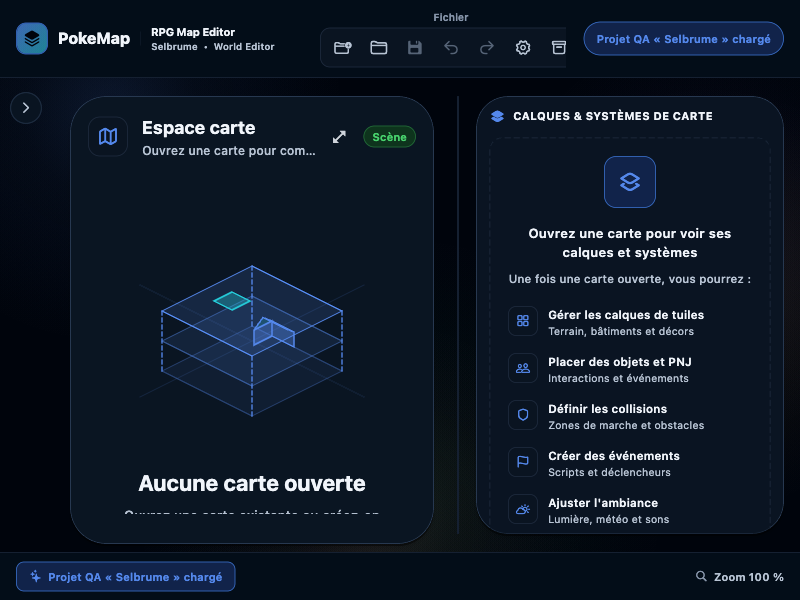
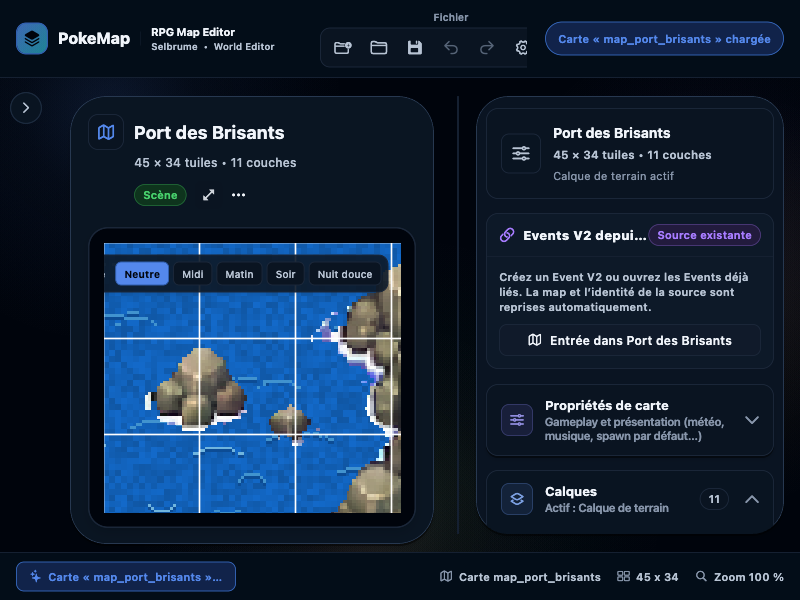
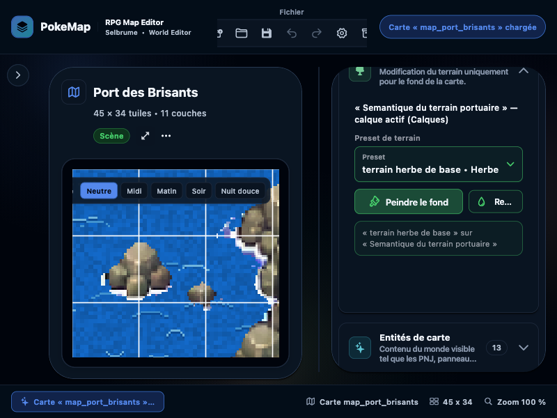
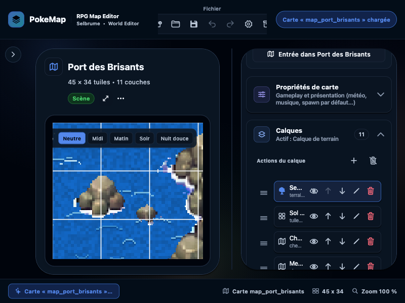

# WM-EDITOR-AUDIT-2026-07-28 — Audit ultra-complet du World Map Editor

Date : 2026-07-28
Produit : PokeMap `map_editor` desktop macOS
Surface : création et édition de cartes World Map
Mode : audit UX, accessibilité, architecture, persistance, rendu, interactions, tests et readiness d’implémentation
Verdict global : **FAIL produit / PARTIAL technique / refonte profonde justifiée**

---

## 1. Résumé exécutif

Le ressenti utilisateur est confirmé par le code, l’application lancée, les captures, les tests et les passes indépendantes :

> Le World Map Editor n’est pas simplement ancien ou visuellement chargé. Il ne possède pas plusieurs contrats fondamentaux qu’un éditeur visuel doit rendre évidents et fiables.

Cette confirmation concerne le diagnostic produit global. Le comportement
Magic Mouse exact n’a pas été reproduit avec le matériel de l’utilisateur :
le code confirme un arbitrage incomplet et l’absence de `PointerPanZoom`, pas
la forme native précise de l’événement qui déclenche chez lui une peinture.

Les problèmes les plus visibles ne sont donc pas des anomalies isolées :

1. la liste des calques ressemble à une pile visuelle, mais le painter regroupe plusieurs familles dans des passes codées en dur ;
2. la navigation et l’édition ne sont pas arbitrées par une machine d’interaction unique ;
3. la gomme dépend silencieusement de l’empreinte du dernier pinceau ;
4. l’outil Selection ne sélectionne pas réellement la majorité des objets du canvas ;
5. un élément posé ne peut pas être déplacé directement ;
6. le contexte de tileset est global alors que le besoin utilisateur est local au calque ;
7. le sélecteur expose tous les tilesets sans exploiter les dossiers ni le contexte ;
8. la carte, les propriétés, les calques, les entités et les bibliothèques sont entassés dans un long inspecteur vertical ;
9. plusieurs scénarios de cycle de vie de carte peuvent perdre ou endommager des données ;
10. le rendu éditeur n’est pas garanti identique au runtime.

### Verdict franc

Une refonte en profondeur est justifiée. En revanche, une réécriture totale de `map_editor` ne l’est pas.

Le dépôt possède déjà des briques solides à conserver :

- les contrats `map_core`;
- l’historique undo/redo par stroke ;
- les contrôleurs de Border et Environment ;
- les previews de placement ;
- les validations de compatibilité de tileset ;
- une grande base de tests ;
- le design system PokeMap ;
- des interactions plus modernes dans Cinematic Studio qui constituent une référence interne.

La bonne stratégie est donc :

1. **sécuriser les documents** ;
2. **unifier la vérité de rendu éditeur/runtime** ;
3. **introduire une machine d’interaction explicite** ;
4. **rendre Selection réellement capable de sélectionner et déplacer** ;
5. **remplacer le contexte global de palette par un contexte par calque** ;
6. **recomposer ensuite l’interface autour du canvas, pas autour de l’inspecteur**.

### Gravité synthétique

| ID | Gravité | Constat | Statut de preuve |
|---|---:|---|---|
| WM-01 | P0 candidate | Un ID de carte peut théoriquement sortir de `maps/` avant la validation tardive du manifeste | Chaîne statique confirmée ; effet filesystem non exécuté |
| WM-02 | P1 | Changer de carte peut abandonner un document dirty sans décision utilisateur | Confirmé par le chemin de code |
| WM-03 | P1 | La persistance d’une map n’est pas atomique | Confirmé statiquement |
| WM-04 | P2 | Le resize est incomplet et sans plan d’impact | Confirmé statiquement |
| WM-05 | P1 | L’ordre affiché des calques n’est pas l’ordre exécuté pour toutes les familles | Confirmé dans `MapGridPainter` |
| WM-06 | P1 | Éditeur et runtime peuvent produire une composition différente | Confirmé par les deux implémentations et tests runtime |
| WM-07 | P2 | Les tests d’ordre donnent une confiance trop étroite | Confirmé par l’inventaire |
| WM-08 | P2 | Navigation et peinture partagent un routage ambigu | Risque confirmé ; événement Magic Mouse exact non reproduit |
| WM-09 | P1 | La gomme hérite de l’empreinte du dernier brush | Confirmé dans `EditorNotifier` |
| WM-10 | P1 | Selection ne sélectionne/déplace pas normalement les éléments posés | Confirmé dans le routeur et les mutations |
| WM-11 | P2 | Il n’existe pas de machine d’interaction exclusive | Confirmé statiquement |
| WM-12 | P2 | Le picker expose les 31 tilesets Selbrume | Confirmé dans le projet réel et le widget |
| WM-13 | P1 | Le contexte de tileset est global, pas mémorisé par calque | Confirmé dans l’état et les selectors |
| WM-14 | P2 | La taxonomie d’assets est insuffisante pour un filtrage métier fiable | Confirmé dans le modèle |
| WM-15 | P2 | Le cache d’images est global et non invalidable | Confirmé statiquement |
| WM-16 | P2 | À 800×600, le layout overflow et comprime le canvas à environ 297×270 px | Reproduit sur ce viewport |
| WM-17 | P2 | L’inspecteur est organisé par features, pas par tâche | Confirmé visuellement et statiquement |
| WM-18 | P2 | La liste des calques est dense et trompeuse | Confirmé visuellement et statiquement |
| WM-19 | P3 | Libellés et terminologie sont incohérents | Confirmé |
| WM-20 | P2 | Le contrat clavier est insuffisant | Confirmé statiquement |
| WM-21 | P2 | Les contrôles iconiques ne sont pas uniformes | Confirmé statiquement |
| WM-22 | P3 | Le legacy World Map ne respecte pas partout le design system actuel | Contrainte de refonte confirmée ; lecteur d’écran non testé |

---

## 2. Audit du prompt et interprétation du scope

### Demande utilisateur

La demande porte sur :

- un audit ultra-complet ;
- un avis honnête ;
- une évaluation de la nécessité de revoir profondément l’UI de création de map.

### Interprétation retenue

Cet audit est **diagnostique**. Il ne modifie pas le comportement de l’éditeur.

Le fichier `codex_rule.md` demande habituellement une implémentation, des tests ajoutés et cinq passes. La demande directe n’autorisait pas une correction ou un refactor. La règle d’autonomie de l’agent impose également de ne pas implémenter pendant une simple demande de diagnostic.

Décision :

- aucune modification de code produit ;
- aucun test de caractérisation ajouté pour verrouiller involontairement un mauvais comportement ;
- exécution extensive des tests existants ;
- build macOS release ;
- audit interactif sur une copie jetable de Selbrume ;
- cinq verdicts indépendants conservés dans le rapport ;
- recommandations et lots proposés, sans les implémenter.

### Inclus

- shell World Map ;
- canvas ;
- rendu des calques ;
- parité runtime ;
- outils et gestes ;
- gomme ;
- sélection et déplacement ;
- palette, tilesets et assets ;
- inspecteur et architecture d’information ;
- accessibilité visible et statique ;
- cycle de vie des cartes ;
- persistance et resize ;
- architecture d’état ;
- tests, analyse et build ;
- roadmap de refonte.

### Exclus

- modification de données réelles ;
- reproduction destructive de chemin hostile ;
- migration JSON ;
- création de nouvelle UI ;
- benchmark mémoire ;
- test physique avec Magic Mouse ;
- lecteur d’écran ;
- signature, notarisation et packaging de distribution ;
- audit gameplay `FG-*`, non applicable à ce chantier.

---

## 3. Périmètre technique audité

### Flux principal

```text
main.dart
  → EditorShellPage
  → EditorCanvasHost
  → MapCanvas / MapInspectorPanel / LayersPanel
  → EditorNotifier
  → contrôleurs et use cases
  → repositories filesystem
  → contrats map_core
  → JSON
```

Le runtime consomme séparément les contrats `map_core` via `MapLayersComponent`.

### Fichiers centraux inspectés

| Domaine | Fichiers principaux |
|---|---|
| Canvas et gestes | `packages/map_editor/lib/src/ui/canvas/map_canvas.dart` |
| Painter | `packages/map_editor/lib/src/ui/canvas/map_canvas/map_grid_painter.dart` |
| Ordre éditeur | `packages/map_editor/lib/src/features/border_map_editing/presentation/editor_map_layer_paint_order.dart` |
| État et mutations | `packages/map_editor/lib/src/features/editor/state/editor_state.dart`, `editor_notifier.dart` |
| Sélecteurs | `packages/map_editor/lib/src/features/editor/state/editor_selectors.dart` |
| Outils | `packages/map_editor/lib/src/features/editor/tools/editor_tool.dart` |
| Palette | `packages/map_editor/lib/src/ui/panels/tileset_palette_panel.dart` |
| Instances posées | `packages/map_editor/lib/src/ui/panels/tileset_palette/widgets/placed_instances/placed_instances_section.dart` |
| Calques | `packages/map_editor/lib/src/ui/panels/layers_panel.dart` |
| Inspecteur | `packages/map_editor/lib/src/ui/panels/map_inspector_panel.dart` |
| Toolbar | `packages/map_editor/lib/src/ui/shared/top_toolbar.dart` |
| Cycle map | `packages/map_editor/lib/src/application/use_cases/map_use_cases.dart` |
| Filesystem | `packages/map_editor/lib/src/infrastructure/filesystem/project_filesystem.dart` |
| Repositories | `packages/map_editor/lib/src/infrastructure/repositories/file_repositories.dart` |
| Contrats map | `packages/map_core/lib/src/models/map_data.dart`, `map_layer.dart` |
| Validation | `packages/map_core/lib/src/validation/validators.dart` |
| Resize | `packages/map_core/lib/src/operations/map_resize.dart` |
| Rendu runtime | `packages/map_runtime/lib/src/presentation/flame/map_layers_component.dart` |
| Plan runtime | `packages/map_runtime/lib/src/presentation/flame/runtime_map_layer_paint_order.dart` |
| Référence interne | fichiers Cinematic Studio sous `packages/map_editor/lib/src/ui/canvas/cinematics/` |

### Points chauds

| Fichier | Taille observée |
|---|---:|
| `EditorNotifier` | 12 588 lignes |
| `TilesetPalettePanel` | 4 347 lignes |
| `MapGridPainter` | 2 872 lignes |
| `EditorShellPage` | 2 311 lignes |
| `MapCanvas` | 1 721 lignes |

La taille seule n’est pas le défaut. Le défaut est que ces fichiers cumulent des responsabilités qui devraient évoluer indépendamment : document, viewport, interaction, sélection, rendu, assets et feedback.

---

## 4. Audit interactif actuel

### Données protégées

Le projet réel n’a pas été utilisé comme cible d’écriture.

Copie d’audit :

```text
/Users/karim/Library/Containers/com.yoahnl.pokemap.editor/Data/Documents/pokemap-worldmap-audit.VCWGAF
```

Vérifications après la session :

- fingerprint relatif source/copie hors locks : `c58b34ca321b7b549289a1c2acbb748c763d44cf2d2870792cc83a4167ef77ab` des deux côtés ;
- SHA-256 `project.json` : `cb43a8cf9bb6e886cf950c1b0af99e40270a1afde3b0758ac6907f9646440b85` ;
- SHA-256 `map_port_brisants.json` : `d7bc655cce9f3b0e1f3d97643351b270f0df212fa2e0b32dd46c979f2466eda5` dans la source et la copie.

Commandes exactes utilisées pour le contrôle final :

```bash
audit_source='/Users/karim/Project/pokemonProject/selbrume'
audit_copy='/Users/karim/Library/Containers/com.yoahnl.pokemap.editor/Data/Documents/pokemap-worldmap-audit.VCWGAF'
(cd "$audit_source" && find . -type f ! -name '*.lock' -print0 | LC_ALL=C sort -z | xargs -0 shasum -a 256 | shasum -a 256)
(cd "$audit_copy" && find . -type f ! -name '*.lock' -print0 | LC_ALL=C sort -z | xargs -0 shasum -a 256 | shasum -a 256)
shasum -a 256 "$audit_copy/project.json"
shasum -a 256 "$audit_source/maps/map_port_brisants.json" "$audit_copy/maps/map_port_brisants.json"
```

Conclusion : aucune mutation de contenu n’a été produite pendant l’audit.
La copie externe est volontairement conservée à ce chemin à la fin de
l’audit ; elle n’est pas suivie par Git et peut être supprimée ultérieurement.

### Carte observée

`Port des Brisants` :

- 45 × 34 cases ;
- 11 calques sérialisés ;
- 43 éléments posés ;
- 13 entités ;
- plusieurs Tile, Terrain, Path, Environment et Collision layers.

### Flow capturé

| Étape | État | Santé |
|---:|---|---|
| 1 | Entrée World Map sans carte active | **FAIL** — overflow immédiat et contenu inférieur tronqué |
| 2 | Ouverture de Port des Brisants | **FAIL** — canvas secondaire face à un inspecteur dominant |
| 3 | Navigation verticale dans l’inspecteur | **FAIL** — accumulation de sections et recherche par scroll |
| 4 | Déploiement de la liste des calques | **FAIL** — noms et actions tronqués, pile difficile à lire |

### Étape 1 — Entrée World Map



Constats :

- deux erreurs `RenderFlex overflow` apparaissent au premier frame ;
- débordements observés : 29 px et 26 px sur la droite ;
- zone impliquée : `map_workspace_empty_state.dart:206` ;
- le contenu d’aide inférieur est coupé ;
- la toolbar reste dense alors qu’aucune carte n’est active.

Point positif :

- l’intention d’onboarding existe et explique le rôle de la zone.

### Étape 2 — Carte ouverte



Mesures issues de l’arbre interactif :

- viewport global : 800 × 600 ;
- bounds `MapCanvas` : environ `x=103,5`, `y=242,5`, `w=297`, `h=270` ;
- inspecteur droit : environ `x=464`, `y=78`, `w=336`, `h=474`.

Conséquence :

- la surface principale du produit — la carte — n’occupe qu’une fraction de la fenêtre ;
- à 100 %, une carte 45 × 34 n’est pas lisible globalement ;
- aucun contrôle “adapter à la fenêtre” n’est immédiatement évident ;
- l’utilisateur doit comprendre simultanément le canvas, la toolbar, le rail, l’inspecteur et les sections.

Points positifs :

- nom, dimensions et état de la carte sont présents ;
- les surfaces utilisent globalement le langage visuel récent de PokeMap ;
- le statut de sauvegarde et les commandes globales restent visibles.

### Étape 3 — Inspecteur scrolé



Constats :

- Terrain, entités et autres domaines vivent dans le même scroll ;
- des labels de boutons sont coupés ;
- la propriété réellement utile dépend du calque ou de l’objet, mais l’inspecteur reste structuré comme un catalogue de fonctionnalités ;
- l’utilisateur doit se souvenir de la section ouverte et de sa position verticale.

Point positif :

- les groupes repliables évitent que tout soit constamment visible.

Cette mitigation ne suffit pas : plusieurs accordéons peuvent rester ouverts, et `Tuiles & éléments` peut réserver entre 420 et 760 px de hauteur.

### Étape 4 — Calques déployés



Constats :

- noms réduits à quelques caractères ;
- drag handles et actions icon-only très rapprochés ;
- différence entre position affichée, position sérialisée et passe réelle de rendu invisible ;
- des Environment layers techniques peuvent être masquées de la présentation tout en conservant un index réel ;
- un déplacement d’un index peut donc ne produire aucun changement visible.

Point positif :

- visibilité, drag-and-drop, sélection active et actions de calque existent déjà.

### Limite de capture

La tentative d’atteindre un widget plus profond a terminé avec :

```text
Bad state: Widget not found after 56 scroll attempts
```

Le picker de tileset et les gestes destructifs n’ont donc pas été utilisés comme preuve visuelle. Leur audit repose sur le code, le manifeste Selbrume et les tests existants.

---

## 5. Ce qui fonctionne déjà

L’audit ne conclut pas que “tout est mauvais”.

### Fondations utiles

- frontières de packages `map_core`, `map_editor`, `map_runtime` globalement respectées ;
- aucune dépendance directe éditeur ↔ runtime ;
- modèles sérialisables déjà riches ;
- design system PokeMap disponible ;
- Riverpod et use cases offrent des seams, même s’ils sont surchargés ;
- historique undo/redo par stroke ;
- preview de brush et de gomme ;
- signal rouge de placement incompatible ;
- rejet d’un mélange de source sur un calque non vide ;
- toasts de succès et d’erreur centralisés ;
- calques masquables et réordonnables ;
- Border et Environment possèdent des contrôleurs spécialisés ;
- 511 fichiers `*_test.dart` dans `map_editor/test` (614 fichiers au total).

### Référence interne réutilisable

Cinematic Studio possède déjà :

- `PointerPanZoom`;
- pinch trackpad testé ;
- pan isolé des données ;
- reset/recentrage ;
- zoom visible ;
- repères sélectionnables et déplaçables ;
- snap ;
- `Escape` pour annuler un mode d’ajout ;
- tests garantissant qu’un geste de navigation ne sélectionne ni ne modifie les données.

La refonte World Map n’a donc pas besoin d’inventer ces conventions depuis zéro.

---

## 6. Findings détaillés

## 6.1 Data safety et cycle de vie

### WM-01 — P0 candidate — Confinement insuffisant des chemins de carte

Preuves :

- le dialogue accepte tout texte non vide : `world_group_dialogs.dart:113-151` ;
- `CreateMapUseCase` dérive `maps/$mapId.json` : `map_use_cases.dart:26-90` ;
- le fichier de carte est écrit avant le manifeste ;
- `ProjectFileSystem` normalise, mais ne vérifie pas que la cible reste dans `maps/` : `project_filesystem.dart:21-39` ;
- `MapValidator` exige seulement un ID non blanc : `validators.dart:1711-1718` ;
- le rejet de `..` se trouve dans la validation du `relativePath` du manifeste, donc après la première écriture : `validators.dart:1288-1301`.

Chemin statiquement déterministe :

```text
mapId = ../project
maps/../project.json
→ <racine>/project.json
```

Le rename possède un rollback qui supprime la nouvelle cible en cas d’échec. Avec une cible hostile, cette suppression pourrait viser le manifeste.

Impact potentiel :

- écrasement ou suppression potentielle de `project.json` ;
- défaut grave même si l’entrée paraît improbable dans un usage normal ;
- aucune refonte UI ne doit laisser ce chemin intact.

Recommandation :

- value object de nouvel ID ;
- validation avant toute I/O ;
- resolver canonique confiné ;
- vérification `isWithin` et symlinks ;
- tests en filesystem temporaire pour `..`, séparateurs, absolus, casse et cibles réservées.

Limites :

- aucune reproduction destructive n’a été exécutée ;
- l’effet filesystem n’est donc pas confirmé dynamiquement ;
- le rapport n’extrapole pas ce résultat à tous les OS ni aux symlinks.

### WM-02 — P1 — Changement de carte dirty sans décision

Preuves :

- un clic dans l’arbre appelle directement `notifier.loadMap(map.relativePath)` : `world_tree_nodes.dart:185-188` ;
- `EditorNotifier.loadMap` ne bloque pas sur `state.isDirty` : `editor_notifier.dart:1502+` ;
- `openMapDocument` remplace le document, réinitialise l’historique et passe `isDirty` à false : `project_session_controller.dart:75+` ;
- le flux Narrative, lui, refuse explicitement une activation cross-map si le document est dirty : `editor_notifier.dart:1641-1665`.

Impact :

- peinture non sauvegardée perdue ;
- historique undo/redo perdu ;
- comportement incohérent selon la route qui ouvre la carte.

Recommandation :

- une commande unique `MapActivationCoordinator`;
- décisions Enregistrer / Abandonner / Annuler ;
- échec de save = activation interdite ;
- requêtes concurrentes A puis B protégées contre les réponses tardives.

### WM-03 — P1 — Persistance map non atomique

`FileMapRepository.saveMap` écrit directement le fichier final :

- pas de sibling temporaire ;
- pas de `flush` explicite ;
- pas de révision attendue ;
- pas de compare-and-swap ;
- pas de récupération documentée.

Create, duplicate, rename et delete combinent plusieurs écritures carte/manifeste sans transaction durable.

Impact :

- fichier orphelin ;
- entrée manifeste orpheline ;
- last-write-wins entre deux éditeurs ;
- rollback pouvant écraser une modification extérieure ;
- projet dans un état intermédiaire après interruption.

Recommandation :

- store de document révisionné ;
- écriture temporaire + flush + hash + CAS + remplacement ;
- journal de lifecycle pour les transactions multi-fichiers ;
- injection de panne à chaque checkpoint.

### WM-04 — P2 — Resize incomplet et sans plan d’impact

Le resize tronque plusieurs collections, mais :

- `generatedPlacementIds` peut conserver des IDs supprimés ;
- les footprints multi-case ne sont pas tous validés avec contexte projet ;
- entités, événements, warps, triggers, zones et connexions ne disposent pas d’un plan d’impact utilisateur unifié ;
- aucun aperçu complet des pertes n’est présenté.

Recommandation :

- `MapResizePlan` pur dans `map_core`;
- expansion directement applicable ;
- shrink destructif bloqué dans un premier lot ;
- liste des objets concernés avant toute mutation.

## 6.2 Rendu et ordre des calques

### WM-05 — P1 — La pile utilisateur n’est pas la pile du painter

Le fichier `editor_map_layer_paint_order.dart` construit bien une liste `authoredLayers` en ordre sérialisé ou legacy.

Mais dans `MapGridPainter.paint`, cette liste n’est utilisée que pour Border. Les autres familles sont peintes par phases :

```text
Terrain
→ Path
→ Tile / Surface selon le cas spécial Path
→ Border
→ ombres
→ éléments posés background
→ Collision overlay
→ grille
→ zones
→ entités background
→ Tile/éléments foreground
→ entités foreground
→ overlays éditeur
```

Zones :

- création de `visibleLayers` et `layerPaintOrder` : `map_grid_painter.dart:280-285`;
- boucle Terrain : `314-319`;
- boucle Path : `348-354`;
- Surface : `356-373`;
- Tile : `375-405`;
- Border : `408-425`;
- éléments posés : `437-443`;
- Collision : `445-451`;
- entités et foreground : `506-523`.

Conséquence :

- déplacer un Terrain au-dessus d’un Tile ne garantit pas que Terrain soit exécuté après Tile ;
- déplacer un Surface sous ou au-dessus d’un Tile ne garantit pas le résultat attendu ;
- l’UI présente une affordance générale alors que la sémantique réelle est partielle ;
- l’utilisateur ne peut pas prédire le résultat depuis la liste.

Même l’ordre entre couches d’une même famille dépend d’une propriété sérialisée
peu visible, `tileLayerOrder` : `bottom_to_top` suit la liste authored, alors
que l’absence de cette propriété active l’inversion legacy. La liste seule ne
permet donc pas toujours de connaître la sémantique appliquée.

Ce n’est pas seulement déroutant : l’outil ment sur la portée de son réordonnancement.

### WM-06 — P1 — Parité éditeur/runtime non garantie

Cas potentiellement divergent lorsque la carte n’a aucune Border et que
l’éditeur suit sa branche standard sans Path différé :

- runtime legacy : Surface puis Tile, donc Tile au-dessus ;
- éditeur, chemin standard : Tile puis Surface, donc Surface au-dessus.

Le runtime possède un test explicite :

```text
Surface runtime ordering hardening renders TileLayer above SurfaceLayer in background pass
```

Avec n’importe quelle `BorderLayer`, même cachée, le runtime active son dispatcher d’ordre authored. L’éditeur continue ses phases et n’intercale que Border.

Cette preuve ne signifie pas que toutes les cartes sans Border produisent des
pixels différents : elle démontre que les contrats autorisent la divergence
sur les recouvrements concernés.

Impact :

- l’éditeur n’est pas strictement WYSIWYG ;
- une carte peut paraître correcte en édition et différente en jeu ;
- ajouter une Border cachée peut changer le mode d’ordonnancement runtime.

Recommandation :

- un plan de composition pur partagé dans `map_core`;
- éditeur et runtime deviennent deux exécutants de ce plan ;
- runtime actuel conservé comme canon de compatibilité ;
- fixture monochrome commune et tests pixels croisés.

### WM-07 — P2 — Les tests actuels donnent une confiance trop étroite

`map_grid_painter_layer_order_test.dart` vérifie surtout :

- ordre entre Tile layers ;
- ordre foreground ;
- éléments posés ;
- relation à certaines entités ;
- compatibilité Border.

Il ne prouve pas que le painter exécute une pile inter-type complète selon l’ordre visible.

Les tests du plan abstrait ne suffisent pas si `MapGridPainter` contourne ce plan.

## 6.3 Interactions, gomme, sélection et déplacement

### WM-08 — P2 — Navigation et peinture partagent un routeur ambigu

Dans `map_canvas.dart` :

- `Listener` gère boutons droit/milieu et `PointerScrollEvent` ;
- `GestureDetector.onPanStart/onPanUpdate` commence immédiatement un stroke pour les outils de peinture ;
- aucun `PointerPanZoom` n’est branché ;
- aucun mode temporaire `Espace + drag` ;
- le zoom n’est pas ancré sous le pointeur ;
- un cancel termine le stroke au lieu d’exprimer un rollback transactionnel.

Le test actuel “mouse and trackpad scroll pans without zooming or editing” envoie seulement `PointerScrollEvent`.

Il ne couvre pas :

- `PointerPanZoomStart/Update`;
- une Magic Mouse réelle ;
- pinch ;
- bouton droit/milieu ;
- navigation pendant un outil actif ;
- dirty state et historique ;
- annulation.

Avis :

Le signalement Magic Mouse est crédible. Le code sait gérer la molette, mais ne possède pas un contrat assez large pour tous les événements natifs macOS.

Recommandation :

- molette/deux doigts = pan sûr ;
- pinch ou Cmd/Ctrl + molette = zoom sous pointeur ;
- Espace + drag et bouton milieu = pan ;
- curseurs `grab`/`grabbing`;
- Fit, 100 %, recentrer ;
- toute navigation doit garder la carte byte-for-byte identique.

### WM-09 — P1 — La gomme est couplée au dernier brush

Chaîne confirmée :

```text
eraseAt
→ _resolveErasePattern
→ _resolveBrushFootprint
→ activeBrush
→ taille du tile / palette entry / project element
```

Zones :

- `eraseAt` : `editor_notifier.dart:4437-4494`;
- pattern : `6694-6702`;
- footprint : `6729-6794`;
- preview : `6433-6466`.

Il n’existe pas d’état de gomme indépendant.

La Collision possède déjà un choix 1×1 / footprint, preuve que le besoin est reconnu localement.

Impact :

- action destructive dépendant d’un contexte invisible ;
- changement de brush puis gomme = zone effacée inattendue ;
- l’aperçu réduit le risque, mais ne rend pas le modèle mental acceptable.

Recommandation :

- gomme 1×1 par défaut ;
- choix visible 1×1 / empreinte précédente / taille personnalisée ;
- dimensions près du curseur et dans la toolbar ;
- preview et commit partageant le même objet de footprint.

### WM-10 — P1 — Selection n’est pas un outil de sélection général

Le mode Selection :

- hit-test les Border features ;
- retourne ensuite sans action pour les autres objets.

Les entités, événements, warps et triggers sont souvent sélectionnés via leur outil de placement, ce qui mélange création et sélection.

Les `MapPlacedElement` :

- sont sélectionnés depuis une liste latérale ;
- peuvent être surlignés sur le canvas ;
- ne possèdent pas de mutation de position ;
- affichent leur position en lecture seule.

Risque supplémentaire : les méthodes `placeOrSelect*At` créent un nouvel objet
quand le hit-test ne trouve pas de cible. C’est vrai pour Entity, Event, Warp,
Trigger et Gameplay Zone
(`editor_notifier.dart:4559-4570`, `5333-5345`, `5663-5673`,
`5849-5859`, `6075-6085`). Un clic destiné à sélectionner peut donc devenir
une mutation ou une duplication si le hit-test rate la cible.

Impact :

- impossible de cliquer normalement un décor puis de le déplacer ;
- supprimer/replacer devient le seul workflow ;
- propriétés personnalisées potentiellement perdues ;
- superpositions difficiles à comprendre.

Recommandation :

- Selection neutre par défaut ;
- hit-test déterministe de toutes les familles ;
- couche supérieure issue du plan de rendu ;
- sélection alternative en cas de superposition ;
- drag avec ghost ;
- snap ;
- commit unique à pointer-up ;
- Escape annule ;
- une seule entrée undo.

### WM-11 — P2 — Absence d’une machine d’interaction

Le modèle actuel raisonne surtout en “outil actif”.

Il manque une interaction transitoire exclusive :

```text
idle
panning
paintingStroke
drawingZone
draggingSelection
borderGesture
cancelled
```

Sans cet arbitre :

- l’exclusivité d’un geste n’est pas portée par un contrat central ; le risque
  de routage concurrent reste à confirmer expérimentalement ;
- la navigation dépend du type d’événement natif ;
- annulation et rollback sont difficiles ;
- chaque nouveau studio ajoute son propre chemin.

Le feedback n’est pas non plus symétrique : `resolveMapToolPreview`
(`editor_notifier.dart:6359-6475`) accepte Tile, Terrain, Collision et Eraser,
mais pas `surfacePaint`, alors que le canvas sait bien appliquer cet outil.
Cette absence ne prouve pas une mutation erronée, mais elle prive précisément
ce mode d’un aperçu cohérent avant commit.

## 6.4 Palette, tilesets et assets

### WM-12 — P2 — Tous les tilesets sont présentés

Dans `tileset_palette_panel.dart:340-455` :

- copie de `project.tilesets`;
- tri par `sortOrder` et nom ;
- tous les éléments passent au popup ;
- aucun filtre par dossier, scope, famille, map, usage ou compatibilité.

Selbrume réel :

- 31 tilesets ;
- 17 dossiers ;
- dossiers incluant sprites, ground, path, terrain, bâtiments, interiors, forest, marsh, lighthouse, FX et borders.

Le picker ignore précisément l’organisation déjà disponible.

Impact :

- personnages, chemins, terrains et décors mélangés ;
- recherche visuelle répétée ;
- coût croissant avec le projet ;
- forte charge de mémoire de travail.

Recommandation :

- limiter d’abord aux tilesets assignables ;
- regrouper par dossier/famille ;
- recherche ;
- récents et favoris ;
- incompatibles visibles mais désactivés avec raison lorsque cela aide ;
- aucune liste plate de 31 entrées.

### WM-13 — P1 — Mémoire globale au lieu d’une mémoire par calque

État :

- un seul `selectedTilesetEditorId` global ;
- le selector donne priorité à ce choix global avant le `tilesetId` du calque actif ;
- `setActiveLayer` ne restaure pas un contexte par calque ;
- le coordinateur de session préserve encore le choix global entre cartes.

Conséquence :

- choisir un tileset pour A ;
- passer à B ;
- B continue à voir le choix global ;
- retour à A sans restitution d’un contexte propre.

Le rejet de compatibilité empêche certaines corruptions, mais intervient tard et ajoute de la friction.

Recommandation :

- contexte indexé par `layerId`;
- le tileset assigné au calque est la source primaire ;
- A → B → A restitue les deux contextes ;
- changement explicite d’assignation pour un calque vide ;
- assignation = mutation normale dirty + undo, pas persistance furtive.

### WM-14 — P2 — Taxonomie incomplète

`ProjectTilesetEntry` expose :

- `scope`;
- `folderId`;
- `groupId`;
- `isWorldTileset`;
- groupes d’éléments et entrées de palette.

Il n’existe pas de type produit général robuste “character / terrain / path / props / FX”.

Un filtrage entièrement sémantique nécessite donc une décision de modèle, pas seulement un filtre UI.

Approche progressive :

1. exploiter `folderId`, scope et assignabilité immédiatement ;
2. introduire ensuite des tags/familles explicites et validés ;
3. ne pas déduire silencieusement le type depuis le nom du fichier.

### WM-15 — P2 — Cache d’images global et non invalidable

`_TilesetImageCache` :

- map statique ;
- clé basée sur chemin et couleur transparente ;
- pas de mtime/hash ;
- pas d’eviction ;
- pas de `ui.Image.dispose()`;
- exceptions absorbées en `null`.

Risques :

- preview obsolète après remplacement au même chemin ;
- accumulation mémoire au fil des projets ;
- absence d’asset sans diagnostic exploitable.

Recommandation :

- cache possédé par la session projet ;
- clé chemin canonique + taille + mtime + paramètres ;
- invalidation après import/remplacement ;
- `dispose()` au changement de projet ;
- erreur typée visible.

## 6.5 Architecture d’information et UI

### WM-16 — P2 — Le canvas n’est pas le centre réel de l’espace

Le canvas est visuellement central, mais structurellement comprimé par :

- rail gauche ;
- card/header de carte ;
- toolbar ;
- inspecteur fixe de 336 px ;
- poignée ;
- sections longues.

À 800×600, le canvas observé mesure environ 297×270 px.

Recommandation :

- canvas plein centre ;
- chrome réduit ;
- panneaux dockables/masquables ;
- palette en tray stable plutôt que dans l’inspecteur ;
- fit-to-view au chargement ;
- conservation du viewport par carte.

### WM-17 — P2 — L’inspecteur est organisé par fonctionnalités, pas par tâche

`MapInspectorPanel` est un `SingleChildScrollView` contenant de nombreux accordéons conditionnels.

La tâche réelle est pourtant généralement l’une de celles-ci :

- travailler sur le calque actif ;
- travailler sur la sélection ;
- choisir un asset ;
- régler la carte ;
- diagnostiquer une erreur.

Ces cinq tâches ne devraient pas partager un seul long scroll.

Recommandation :

- inspecteur contextuel centré sur la sélection ;
- propriétés carte dans un onglet/document dédié ;
- pile des calques dans un dock stable ;
- assets dans un tray stable ;
- diagnostics proches de la cause.

### WM-18 — P2 — La liste des calques est trompeuse et trop dense

Constats :

- 0 est documenté comme haut de liste ;
- les commandes opèrent sur les indices sérialisés ;
- Environment techniques peuvent être cachées des rows ;
- déplacement ±1 peut ne rien changer visuellement ;
- drag targets utilisent également les indices réels ;
- noms longs tronqués ;
- actions icon-only proches.

Recommandation :

- grouper TileLayer + Environment attachée dans la présentation ;
- déplacer un groupe par rapport au voisin visible ;
- badges de type explicites ;
- nom complet accessible ;
- un clic Haut/Bas doit toujours produire un changement visible ou être disabled.

### WM-19 — P3 — Libellés et terminologie incohérents

Exemples :

- `Selection Tool`;
- `Eraser Tool`;
- `Tileset image unavailable`;
- interface majoritairement française.

Le libellé `Tuiles & éléments` est ambigu : le build utilise `_buildElementsTab`, tandis que `_buildTilesTab` existe mais n’est pas le chemin présenté.

Recommandation :

- terminologie française cohérente ;
- séparer Tuiles brutes et Éléments si les deux restent supportés ;
- retirer le code mort si une capacité n’est pas réellement proposée.

## 6.6 Accessibilité et design system

### WM-20 — P2 — Clavier insuffisant

Raccourcis globaux trouvés :

- undo ;
- redo ;
- save.

Manquent au minimum :

- sélection ;
- gomme ;
- peinture ;
- pan temporaire ;
- fit ;
- zoom ;
- suppression ;
- déplacement par clavier ;
- Escape transactionnel.

### WM-21 — P2 — Contrôles iconiques non uniformes

Certaines capsules utilisent :

```text
MouseRegion + GestureDetector
```

sans les garanties complètes de :

- `Semantics`;
- focus ;
- activation clavier ;
- état disabled standard.

`PokeMapIconButton` fournit déjà ces capacités.

### WM-22 — P3 — Règles design system non respectées dans le legacy

Des zones World Map utilisent encore :

- `Color(0x...)`;
- `Colors.*`;
- `PokeMapLegacyColors`;
- primitives Cupertino/Macos ad hoc.

Cela contrevient aux règles actuelles du dépôt pour les nouvelles modifications de l’éditeur.

Recommandation :

- `MapCanvasPalette` sémantique dérivée du thème ;
- tokens pour grille, collision, sélection, zones, triggers et diagnostics ;
- primitives design system uniquement pour la nouvelle UI ;
- migration ciblée, pas remplacement cosmétique global.

### Limite accessibilité

Les captures et l’inspection statique permettent de signaler :

- troncature ;
- faibles affordances ;
- densité ;
- risques de taille de cible ;
- manque de focus/sémantique.

Elles ne permettent pas de certifier :

- contraste mesuré de chaque état ;
- ordre de lecture VoiceOver ;
- annonces de changements ;
- navigation clavier complète ;
- comportement à fort zoom.

---

## 7. Causes racines

Les symptômes remontent à six contrats manquants.

### 1. Pas de plan visuel canonique partagé

La pile existe dans le modèle, mais plusieurs painters réinterprètent l’ordre.

### 2. Pas de machine d’interaction exclusive

L’outil persistant est confondu avec le geste transitoire.

### 3. Pas de modèle de sélection unifié

Chaque famille possède son propre chemin, et `MapPlacedElement` reste hors manipulation directe.

### 4. Pas de contexte d’asset par calque

Une valeur globale remplace la relation naturelle calque ↔ source.

### 5. Pas de lifecycle de document centralisé

Ouverture, save, rename, delete et resize ont des garanties différentes.

### 6. UI structurée selon les features historiques

Les nouveaux studios ont été ajoutés au même inspecteur au lieu de recomposer le workflow.

---

## 8. Direction produit recommandée

## 8.1 Modèle mental cible

L’utilisateur doit pouvoir comprendre l’éditeur ainsi :

```text
Je choisis un calque
→ sa bibliothèque revient automatiquement
→ je sélectionne / peins / efface avec une taille visible
→ je navigue sans jamais modifier la carte
→ je clique un objet pour le déplacer ou l’inspecter
→ l’ordre de la pile est exactement l’ordre visible en jeu
→ toute action importante est annulable et sauvegardée explicitement
```

## 8.2 Layout cible

### Barre supérieure

- nom de carte ;
- dirty/save ;
- undo/redo ;
- fit, zoom, recentrer ;
- preview/runtime ;
- diagnostics bloquants.

### Dock gauche

- onglet Cartes ;
- onglet Calques ;
- pile lisible, typée et réordonnable ;
- recherche de carte ;
- aucune Environment technique affichée comme un faux calque autonome.

### Centre

- canvas dominant ;
- toolbar d’outils compacte ;
- Selection par défaut ;
- Pan explicite et temporaire ;
- feedback de taille de brush ;
- coordonnées et zoom discrets ;
- overlays activables.

### Tray inférieur

- bibliothèque d’assets stable ;
- contexte du calque actif ;
- recherche, dossiers, récents, favoris ;
- taille ajustable ;
- sélection conservée par calque.

### Inspecteur droit

- uniquement la sélection ou le calque actif ;
- position éditable ;
- propriétés essentielles en premier ;
- actions destructives séparées ;
- erreurs au plus près du champ.

## 8.3 Contrat de navigation

| Entrée | Résultat |
|---|---|
| Deux doigts / molette | Pan |
| Pinch | Zoom sous le pointeur |
| Cmd/Ctrl + molette | Zoom sous le pointeur |
| Espace + drag | Pan temporaire |
| Bouton milieu + drag | Pan |
| Clic primaire en Selection | Sélection sans création |
| Drag primaire d’une sélection | Déplacement preview puis commit |
| Escape | Annulation du geste courant |
| `F` ou action Fit | Carte adaptée au viewport |

Invariant :

> Aucun geste de navigation ne doit changer un octet de `MapData`, le dirty state ou l’historique.

## 8.4 Contrat de calques

- la pile affiche l’ordre visuel canonique ;
- réordonner change ce même ordre ;
- éditeur et runtime consomment le même plan ;
- les sentinelles système sont explicites mais non manipulées comme des calques visuels ;
- foreground, collision et overlays ont une représentation compréhensible ;
- les Environment attachées sont groupées avec leur cible.

## 8.5 Contrat de gomme

- défaut 1×1 ;
- taille toujours visible ;
- preview exacte ;
- footprint précédente optionnelle mais jamais implicite ;
- changement de calque ne modifie pas silencieusement la taille ;
- undo restaure l’intégralité du stroke.

## 8.6 Contrat de sélection/déplacement

- clic vide = aucune mutation ;
- clic objet = sélection ;
- clic sur superposition = cible supérieure déterministe ;
- drag = ghost sans mutation ;
- pointer-up valide en une transaction ;
- destination invalide refuse le commit ;
- ID et propriétés intégralement préservés ;
- Escape rollback ;
- undo/redo en une étape.

## 8.7 Contrat de palette

- calque A mémorise A ;
- calque B mémorise B ;
- A → B → A restaure A ;
- liste limitée aux sources pertinentes ;
- dossiers du projet exploités ;
- recherche et récents ;
- assignation de source explicite ;
- incompatibilité expliquée avant la tentative.

---

## 9. Programme de refonte proposé

Les identifiants ci-dessous sont des lots proposés, pas des statuts roadmap existants.

## Gate 0 — Data-safe

### DS-00 — Tests de caractérisation lifecycle

- IDs hostiles ;
- dirty activation ;
- panne à chaque étape I/O ;
- modification externe ;
- rename/delete avec références.

### DS-01 — IDs et chemins confinés

- validation avant I/O ;
- resolver canonique ;
- ancien projet non conforme ouvert en diagnostic/read-only ;
- aucune migration silencieuse.

### DS-02 — Activation centralisée

- Save / Abandonner / Annuler ;
- double activation asynchrone ;
- conservation viewport/historique en cas d’annulation.

### DS-03 — Store atomique et révisionné

- temp + flush + hash + CAS ;
- conflit externe ;
- récupération.

### DS-04 — Préflight des dépendances

- rename/delete bloqués si référence entrante ;
- liste navigable des usages ;
- index incomplet = blocage conservateur.

### DS-05 — Transaction lifecycle

- journal create/duplicate/rename/delete ;
- reprise déterministe ;
- jamais de faux “atomic multi-file”.

### DS-06 — Resize impact plan

- preview complet ;
- shrink destructif bloqué initialement.

Gate de sortie :

> Le document peut être manipulé sans scénario connu de perte silencieuse.

## Gate 1 — WYSIWYG

Décision produit/contrat à figer avant livraison :

- ne pas surcharger `MapData.version` ni une propriété dynamique ;
- ajouter de préférence un `MapVisualStackConfig` versionné ;
- config absente = sémantique legacy inchangée ;
- config présente = pile canonique ;
- version future inconnue = diagnostic/read-only, jamais fallback silencieux ;
- la pile couvre toute la composition perceptible : couches, éléments posés,
  ombres ancrées, plan acteurs et foreground/occlusion explicites ;
- collision, grille et overlays d’édition restent hors de la pile visuelle.

### REN-01 — Plan de composition dans `map_core`

- sémantique legacy explicitement versionnée et conservée pixel-identique ;
- nouvelle sémantique de pile inter-type canonique, elle aussi versionnée ;
- Tile, Terrain, Path, Surface, Border ;
- sentinelles shadows/entities/foreground/collision ;
- Object/Environment explicitement no-op.

### REN-02 — Adaptateurs éditeur/runtime

- même plan ;
- pour les documents legacy, runtime actuel conservé pixel-identique et éditeur
  aligné sur ce résultat ;
- pour les documents de nouvelle version, éditeur et runtime exécutent la pile
  canonique ;
- la présence ou la visibilité d’un Border ne choisit plus implicitement la
  sémantique.

### REN-03 — Parité croisée

- fixture commune monochrome ;
- pixels centraux ;
- Surface/Tile ;
- Path différé ;
- Border ;
- placed elements ;
- entités ;
- collision.

### REN-04 — Migration explicite et idempotente

- preview avant/après ;
- comparaison pixel ;
- diagnostic des différences ;
- acceptation explicite ;
- sauvegarde d’une version de sémantique ;
- relance sans changement ;
- aucun basculement silencieux d’un document legacy.

Gate de sortie :

> Pour une version de sémantique donnée, la même carte produit la même pile
> perceptible dans l’éditeur et le runtime ; une migration de version est
> explicite, inspectable et idempotente.

## Gate 2 — Interactions

### INT-01 — Machine d’arbitrage

- états exclusifs ;
- pointer kind/buttons/modifiers ;
- rollback ;
- une interaction = au plus une entrée undo.

### INT-02 — Navigation desktop

- scroll/pan ;
- pinch ;
- zoom sous pointeur ;
- espace + drag ;
- fit et recentrage ;
- tests Magic Mouse/trackpad réels.

### INT-03 — Gomme indépendante

- 1×1 par défaut ;
- taille visible ;
- custom footprint.

## Gate 3 — Manipulation directe

### SEL-01 — Hit-test commun

- sélection de toutes les familles ;
- visibilité et ordre de rendu ;
- superpositions.

### MOV-01 — Déplacement transactionnel

- `MapPlacedElement` ;
- entités/événements/warps/triggers/zones ;
- préservation des propriétés ;
- Environment généré protégé.

### LAY-01 — Groupes de calques visibles

- Tile + Environment attachée ;
- drag/higher/lower conformes à la présentation.

## Gate 4 — Assets

### AST-01 — Cache session-scopé

- invalidation ;
- dispose ;
- diagnostics.

### AST-02 — Contexte palette par calque

- A → B → A ;
- assignabilité ;
- undo/save normalisés.

### AST-03 — Browser d’assets

- dossiers ;
- recherche ;
- récents ;
- favoris ;
- taxonomie explicite progressive.

## Gate 5 — Recomposition UI

### UI-01 — Shell canvas-first

- dock cartes/calques ;
- tray assets ;
- inspecteur contextuel ;
- canvas dominant.

### UI-02 — Design system et accessibilité

- tokens ;
- boutons sémantiques ;
- clavier ;
- focus ;
- tooltips ;
- light/dark ;
- 800×600 et 1280×800 sans overflow.

### UI-03 — Isolation des rebuilds

- snapshots étroits document/viewport/interaction/inspector ;
- ticker relié au repaint ;
- animation canvas sans rebuild inspecteur.

## Gate 6 — Validation produit

- tâches réelles sur projet réaliste ;
- Magic Mouse ;
- trackpad ;
- souris trois boutons ;
- clavier ;
- VoiceOver ;
- passage novice ;
- comparaison éditeur/runtime ;
- sauvegarde/fermeture/réouverture ;
- crash recovery.

### Ordonnancement réel et parallélisation

Les gates expriment des dépendances de livraison, pas une exécution strictement
séquentielle :

- DS-01/02/03/05 précèdent toute migration persistée ;
- DS-04 et DS-06 peuvent avancer en parallèle ; en attendant, rename/delete ou
  shrink peuvent être désactivés plutôt que bloquer tout le chantier ;
- REN-01 pur peut avancer en parallèle de la data safety, mais REN-02/04 ne
  doivent pas être livrés avant les garanties transactionnelles ;
- INT-01/02 peuvent avancer en parallèle du rendu et constituent le premier
  soulagement ergonomique ;
- SEL-01/MOV-01 dépendent du plan visuel canonique pour déterminer la cible
  supérieure ;
- LAY-01 dépend de REN-01, pas du déplacement ;
- AST-02 peut avancer après la normalisation d’interaction, mais AST-03 reste
  bloqué par la taxonomie et la décision « favoris personnels ou partagés » ;
- les primitives dock/tray, focus et sémantique du design system doivent être
  ajoutées avant UI-01, puis revalidées après composition ;
- Magic Mouse, 800×600 et clavier sont des critères continus de chaque lot
  concerné, pas uniquement une gate finale.

### Readiness par gate

| Gate | Readiness |
|---|---|
| 0 · Data-safe | READY/PARTIAL — seams présents, transaction multi-fichier à construire |
| 1 · WYSIWYG | PARTIAL/BLOCKED — structure/version de pile complète à décider |
| 2 · Interactions | READY après normalisation des entrées |
| 3 · Manipulation | PARTIAL — dépend de Gate 1 et d’une matrice de capacités |
| 4 · Assets | PARTIAL/BLOCKED — taxonomie et persistance favoris/récents à décider |
| 5 · UI | READY architecturalement après primitives DS et extraction `WorldMapWorkspace` |
| 6 · Validation | READY comme protocole final, avec QA continue obligatoire |

---

## 10. Stratégie de tests recommandée

### Data safety

- filesystem temporaire ;
- source et manifeste hashés ;
- fault injection ;
- symlinks ;
- collisions de casse ;
- Windows/macOS.

### Rendu

- plan pur dans `map_core`;
- spy d’appels painter ;
- pixels monochromes ;
- même fixture dans éditeur/runtime ;
- aucun bord antialiasé comme assertion principale.

### Gestes

- `PointerScrollEvent`;
- `PointerPanZoomStart/Update/End`;
- souris primaire/secondaire/milieu ;
- modificateurs ;
- cancel ;
- multi-pointeur ;
- carte, dirty et historique inchangés après navigation.

### Gomme

- 1×1 après brush multi-case ;
- custom size ;
- changement de calque ;
- preview = commit ;
- undo intégral.

### Sélection et déplacement

- sélection depuis canvas ;
- superpositions ;
- calques invisibles ;
- destination invalide ;
- Escape ;
- undo/redo ;
- préservation complète des propriétés.

### Palette

- A → B → A ;
- changement de carte ;
- scope groupe/global ;
- dossiers ;
- recherche ;
- incompatible ;
- tileset absent.

### UI

- goldens 800×600 et 1280×800 ;
- light/dark ;
- texte long ;
- Tab/Entrée/Espace/Escape ;
- semantics tree ;
- absence d’overflow ;
- compteur de rebuilds.

### Matériel réel

La simulation ne suffit pas pour clôturer la plainte initiale :

- Magic Mouse ;
- trackpad Apple ;
- souris à molette ;
- zoom et pan avec outil peinture actif.

---

## 11. Tests et validation exécutés

## 11.1 Tests World Map ciblés — PASS

Depuis `packages/map_editor` :

```bash
/usr/bin/time -p flutter test --no-pub --reporter expanded \
  test/map_canvas_pointer_navigation_test.dart \
  test/map_selection_controller_test.dart \
  test/map_editing_controller_test.dart \
  test/editor_selectors_test.dart \
  test/editor_state_groups_test.dart
```

Résultat :

```text
+23: All tests passed!
exit 0
real 8.34
```

```bash
/usr/bin/time -p flutter test --no-pub --reporter expanded \
  test/map_grid_painter_test.dart \
  test/map_grid_painter_layer_order_test.dart
```

Résultat :

```text
+29: All tests passed!
exit 0
real 7.38
```

```bash
/usr/bin/time -p flutter test --no-pub --reporter expanded \
  test/environment_studio/tile_layer_environment_layer_grouping_panel_test.dart \
  test/tileset_palette_recommended_layer_test.dart \
  test/tileset_palette_placed_instance_opacity_test.dart \
  test/surface_painter/surface_painting_controller_test.dart \
  test/placed_element_instance_delete_origin_test.dart
```

Résultat :

```text
+20: All tests passed!
exit 0
real 7.30
```

```bash
/usr/bin/time -p flutter test --no-pub --reporter expanded \
  test/border_map_editing/map_canvas_border_selection_test.dart
```

Résultat :

```text
+14: All tests passed!
exit 0
real 6.96
```

Total ciblé éditeur : **86 tests verts**.

## 11.2 Runtime ordering — PASS

```bash
cd packages/map_runtime
flutter test --no-pub --reporter expanded \
  test/surface/surface_runtime_ordering_test.dart
```

Résultat :

```text
+11: All tests passed!
exit 0
```

```bash
flutter test --no-pub --reporter expanded \
  test/border/runtime_map_layer_paint_order_test.dart \
  test/border/border_map_layers_component_ordering_test.dart
```

Résultat :

```text
+17: All tests passed!
exit 0
real 2.98
```

## 11.3 Analyse statique — PASS

```bash
cd packages/map_editor
/usr/bin/time -p flutter analyze --no-pub
```

Résultat exact :

```text
Analyzing map_editor...
No issues found! (ran in 11.9s)
real 14.47
exit 0
```

## 11.4 Build macOS release — PASS avec warnings plugins

```bash
cd packages/map_editor
/usr/bin/time -p flutter build macos --release --no-pub
```

Résultat :

```text
✓ Built build/macos/Build/Products/Release/PokeMap.app (44.5MB)
real 23.92
exit 0
```

Warnings non bloquants :

- isolation MainActor dans `audioplayers_darwin`;
- dépréciation `AVKeyValueStatus`;
- optionalité de `createArgsCodec()` dans `video_player_avfoundation`.

## 11.5 Lancement debug interactif — BUILD PASS, UI FAIL

```bash
flutter run \
  -t dev/marionette_main.dart \
  -d macos \
  --debug \
  --dart-define=MARIONETTE_PROJECT_PATH=/Users/karim/Library/Containers/com.yoahnl.pokemap.editor/Data/Documents/pokemap-worldmap-audit.VCWGAF
```

Résultats :

```text
✓ Built build/macos/Build/Products/Debug/PokeMap.app
```

Puis deux overflows initiaux :

```text
RenderFlex overflowed by 29 pixels on the right
RenderFlex overflowed by 26 pixels on the right
```

La carte Port des Brisants a été ouverte et les quatre captures ont été produites.

## 11.6 Suite complète `map_editor` — FAIL factuel

```bash
cd packages/map_editor
/usr/bin/time -p flutter test --no-pub --reporter compact
```

Résultat exact :

```text
+4259 -7: Some tests failed.
real 460.34
exit 1
```

Trois échecs ont été capturés avec leur assertion exacte :

```text
narrative_event_authoring_snapshot_performance_test.dart
  NS-EVENT-V2 Phase E-bis frozen persistence budgets
  Expected <= 750000 ; Actual 782239

narrative_large_project_workspace_performance_test.dart
  Map Events projects 100 maps and 1000 linked events within budget
  Expected <= 3.5 ; Actual 3.5255466177373442

narrative_large_project_workspace_performance_test.dart
  Storyline graph projects 1000 Steps within budget
  Expected <= 20000 ; Actual 20511
```

Le reporter compact a tronqué des segments du flux entre `-1` et `-3`, puis
entre `-5` et `-7`. Les quatre autres échecs ne peuvent donc pas être attribués
exactement à partir de la trace conservée. Le run complet reste rouge et n’est
pas présenté comme vert ; le rapport ne prétend pas que les sept échecs ont été
rejoués ou expliqués individuellement.

## 11.7 Diagnostic des budgets performance — PASS isolé, non conclusif

Six fichiers performance relancés avec `--concurrency=1` :

```text
cinematic_builder_characterization_performance_test.dart
event_registry_persistence_performance_test.dart
narrative_event_authoring_snapshot_performance_test.dart
narrative_event_validation_incremental_performance_test.dart
narrative_global_search_performance_test.dart
narrative_large_project_workspace_performance_test.dart
```

Résultat :

```text
+10: All tests passed!
real 48.04
exit 0
```

Même sélection relancée avec concurrence par défaut :

```text
+10: All tests passed!
real 18.35
exit 0
```

Interprétation :

- la contention ou la variabilité temporelle est une hypothèse plausible, pas
  un diagnostic prouvé pour les sept échecs ;
- aucune régression déterministe World Map démontrée ;
- certification globale toujours PARTIAL, car la commande complète exécutée a échoué.

---

## 12. Couverture manquante prioritaire

### P1

- peinture et gomme Tile/Terrain/Collision de bout en bout via `MapCanvas`;
- `PointerPanZoom`;
- Magic Mouse réelle ;
- changement A → B → A avec deux tilesets ;
- sélection d’un `MapPlacedElement` depuis le canvas ;
- déplacement et rollback ;
- changement de carte dirty ;
- create/rename/delete avec IDs hostiles ;
- parité pixel éditeur/runtime inter-type.

### P2

- picker réel de tileset avec assets disponibles ;
- drag générique des calques ;
- visibilité/rename/delete depuis l’UI ;
- golden World Map complet ;
- sélection superposée ;
- clavier et semantics ;
- resize avec pertes ;
- cache image et remplacement au même chemin.

### Faux signaux de confiance

- le test de navigation utilise seulement `PointerScrollEvent`;
- le smoke palette retourne avant le picker quand l’image est indisponible ;
- plusieurs smoke tests vérifient seulement un `CustomPaint` sans exception ;
- les tests painter isolés ne prouvent pas la parité runtime ;
- `RunnerTests.swift` reste un placeholder natif.

---

## 13. Verdicts des passes indépendantes

| Passe | Verdict | Conclusion |
|---|---|---|
| Audit / Architecture | **ROUGE** | Frontières package correctes, mais data safety, dirty switching, persistance et WYSIWYG empêchent une validation |
| Implémentation readiness | **PARTIAL** | Refonte incrémentale faisable ; structure versionnée du stack visuel et taxonomie/persistance des assets restent à décider ; release bloquée |
| Tests | **PARTIAL** | 86 tests ciblés verts, mais trous majeurs sur les gestes, le picker, la sélection et le déplacement |
| Build / Validation | **PARTIAL** | Analyze et build release verts ; 114 tests ciblés éditeur/runtime verts ; suite complète factuellement rouge `+4259 -7` |
| Critique finale | **PASS après corrections** | La première relecture avait bloqué la publication ; la seconde ne relève plus aucun bloqueur |

---

## 14. Rapports précédents pertinents

Consultés :

- `reports/previous/map_editor_architecture_audit_2026-04-10.md`;
- `reports/previous/map_editor_final_audit_2026-04-10.md`;
- `reports/previous/map_editor_refactor_masterplan_2026-04-10.md`;
- `reports/ui/pokemap_theme_17_final_shell_visual_consistency_audit.md`;
- `reports/narrativeStudio/scenes/ns_scenes_v1_96_bis_cinematic_backdrop_real_map_editor_ordering_fix_v0.md`;
- `reports/environment_studio/environment_studio_map_centric_workflow_review.md`.

Lecture :

- les audits précédents identifiaient déjà `EditorNotifier`, l’état global, les gros widgets et les frontières applicatives ;
- les chantiers de thème ont amélioré la cohérence visuelle globale ;
- Cinematic Studio a reçu des contrats d’interaction plus robustes ;
- les chantiers Surface, Border et Environment ont ajouté des capacités mais aussi davantage de passes spécialisées ;
- aucun rapport récent ne réunissait, avant celui-ci, UX réelle, ordre inter-type, parité runtime, gestes, palette, manipulation directe et data safety du World Map Editor.

---

## 15. Fichiers modifiés ou créés

### Code produit

Aucun fichier de code produit modifié.

### Tests

Aucun fichier de test créé ou modifié.

Raison :

- audit seulement ;
- pas d’autorisation d’implémenter ;
- éviter de verrouiller comme non-régression un comportement reconnu comme mauvais.

### Rapport créé

`reports/ui/world_map_editor_audit_2026-07-28/world_map_editor_ultra_complete_audit.md`

Zones :

- scope et méthode ;
- preuves interactives ;
- audit UX/accessibilité ;
- architecture et data safety ;
- tests/build ;
- direction cible ;
- roadmap ;
- critique et risques.

Impact :

- artefact de décision pour découper la refonte ;
- aucune modification runtime.

Le présent document constitue le contenu complet du fichier Markdown créé.

### Captures créées

| Fichier | SHA-256 |
|---|---|
| `evidence/01-empty-world-map-800x600.png` | `1a2abe557d9a4e4db61cb9eb5219d004a4584fd842da55b0e462f2d86b4ac662` |
| `evidence/02-port-open-overview-800x600.png` | `fea2c6e444b5313cd132b85fb10f794b19cc2cfb8f983462e6ebb28ad07b0237` |
| `evidence/03-inspector-scroll-layer-context-800x600.png` | `39800cf1907ee75bd6d04d979ff321a4803e363e10fd7b6677bb565001b1728f` |
| `evidence/04-layers-expanded-truncated-actions-800x600.png` | `e2e2f60d7a7c9842b399115c2f2661723c2df4b1b98c549365d644e6b7515c45` |

Les PNG sont binaires : leur contenu complet est représenté par leur rendu inline et leur empreinte cryptographique.

### Artefact externe conservé

```text
/Users/karim/Library/Containers/com.yoahnl.pokemap.editor/Data/Documents/pokemap-worldmap-audit.VCWGAF
```

Cette copie jetable de Selbrume a servi uniquement au lancement interactif.
Elle est restée byte-for-byte identique à la source pour le fingerprint hors
locks et n’appartient pas au worktree Git.

### Diff produit

```text
Aucun diff dans packages/map_editor/lib, packages/map_core/lib ou packages/map_runtime/lib.
```

---

## 16. État Git initial

```text
 M reports/gameplay/evidence/ph_007_personalization_release_gate_receipt.json
 M tool/pokemap_product_certification/pubspec.lock
?? packages/gamepads_darwin/macos/gamepads_darwin/.swiftpm/xcode/xcuserdata/karim.xcuserdatad/xcschemes/xcschememanagement.plist
?? packages/gamepads_ios/ios/gamepads_ios/.swiftpm/xcode/xcuserdata/karim.xcuserdatad/xcschemes/xcschememanagement.plist
?? reports/gameplay/audit/avelune_pokemap_ultra_complete_product_audit_2026-07-28.md
```

Ces éléments préexistaient à l’audit et n’ont pas été modifiés intentionnellement par ce chantier.

## 17. État Git final

Commande :

```bash
git status --short --untracked-files=all
```

Résultat exact :

```text
 M reports/gameplay/evidence/ph_007_personalization_release_gate_receipt.json
 M tool/pokemap_product_certification/pubspec.lock
?? packages/gamepads_darwin/macos/gamepads_darwin/.swiftpm/xcode/xcuserdata/karim.xcuserdatad/xcschemes/xcschememanagement.plist
?? packages/gamepads_ios/ios/gamepads_ios/.swiftpm/xcode/xcuserdata/karim.xcuserdatad/xcschemes/xcschememanagement.plist
?? reports/gameplay/audit/avelune_pokemap_ultra_complete_product_audit_2026-07-28.md
?? reports/gameplay/avelune_pokemap_product_roadmap_2026-07-28.md
?? reports/ui/world_map_editor_audit_2026-07-28/evidence/01-empty-world-map-800x600.png
?? reports/ui/world_map_editor_audit_2026-07-28/evidence/02-port-open-overview-800x600.png
?? reports/ui/world_map_editor_audit_2026-07-28/evidence/03-inspector-scroll-layer-context-800x600.png
?? reports/ui/world_map_editor_audit_2026-07-28/evidence/04-layers-expanded-truncated-actions-800x600.png
?? reports/ui/world_map_editor_audit_2026-07-28/world_map_editor_ultra_complete_audit.md
```

Par rapport à l’état initial :

- les deux fichiers suivis et les trois éléments non suivis préexistants sont
  toujours présents ;
- `reports/gameplay/avelune_pokemap_product_roadmap_2026-07-28.md` est apparu
  pendant l’audit via un travail concurrent hors périmètre ; il n’a pas été
  créé ni modifié par cet audit ;
- le présent audit a ajouté uniquement ce rapport et ses quatre captures ;
- aucun fichier source ou test du produit n’a été ajouté ou modifié.

---

## 18. Auto-critique finale

### Verdict de la relecture indépendante

La passe de critique finale a rendu un verdict initial **FAIL** : le fond de
l’audit était jugé solide et exploitable, mais plusieurs réserves empêchaient sa
publication en l’état.

1. Les identifiants de la synthèse n’étaient pas parfaitement alignés avec les
   fiches détaillées. La table de synthèse a été remappée sur `WM-01` à
   `WM-22`.
2. La cible d’ordre visuel pouvait laisser croire qu’une migration modifierait
   silencieusement les pixels des projets existants. La recommandation distingue
   désormais explicitement le mode legacy pixel-preserving d’un nouveau contrat
   canonique versionné, avec migration explicite et idempotente.
3. Le défaut exact de la Magic Mouse n’a pas été reproduit matériellement. Le
   rapport le qualifie désormais de risque fortement crédible, étayé par les
   handlers et les trous de tests, mais non de reproduction certaine.
4. Le P0 était formulé comme un effet confirmé. Il est désormais qualifié de
   **P0 candidate**, avec chaîne statique confirmée mais effet filesystem non
   exécuté.
5. La suite complète comptait sept échecs, alors que seuls trois étaient
   précisément capturés. Le rapport sépare maintenant les trois assertions
   exactes des quatre échecs non attribuables dans la trace tronquée.
6. Le risque de création accidentelle via les outils `placeOrSelect*At` et
   l’absence de preview `surfacePaint` manquaient. Ils sont maintenant inclus.
7. Les priorités du picker plat et de la dette design system ont été ramenées à
   P2 et P3.
8. Le verdict de critique, l’état Git final, le chemin de lancement et
   l’artefact d’audit externe sont maintenant documentés sans placeholder.

Après intégration de ces corrections, le rapport est **apte au cadrage et au
découpage de la refonte**, mais il ne constitue pas un feu vert de release :
les deux décisions d’architecture restantes — structure exhaustive du stack
visuel et taxonomie/persistance des assets — doivent être tranchées au Gate 1.

La seconde relecture indépendante rend un verdict **PASS pour publication**,
sans bloqueur restant. La certification technique globale demeure
**PARTIAL**, séparément, parce que la suite complète reste rouge.

### Ce que l’audit prouve fortement

- structure du painter et ordre par passes ;
- divergence de contrats éditeur/runtime ;
- état global de tileset ;
- liste complète de tilesets ;
- footprint de gomme ;
- absence de move pour `MapPlacedElement`;
- absence de sélection générale ;
- overflow à 800×600 ;
- densité et troncature des calques ;
- build et analyse ;
- trous de tests ;
- risques lifecycle visibles dans le code.

### Ce qu’il ne prouve pas totalement

- événement exact émis par une Magic Mouse sur la machine utilisateur ;
- fréquence réelle de perte dirty dans l’usage ;
- exploitabilité du chemin hostile sur toutes les plateformes ;
- coût mémoire du cache ;
- performance du canvas sur très grande carte ;
- accessibilité VoiceOver ;
- préférence utilisateur pour un layout précis ;
- parité pixel sur toutes les familles.

### Risque de sur-correction

Transformer immédiatement tout le shell, `EditorNotifier`, le painter et les modèles dans un big-bang serait dangereux.

Le programme proposé protège contre cela :

- contrats purs d’abord ;
- adaptateurs ensuite ;
- UI après les invariants ;
- lots avec critères d’acceptation ;
- aucune migration silencieuse.

### Risque de sous-correction

Refaire seulement :

- les couleurs ;
- les cards ;
- les icônes ;
- la largeur de l’inspecteur ;
- le style de la toolbar

produirait un éditeur plus joli mais toujours imprévisible.

### Conclusion de la critique principale

La refonte doit être jugée sur quatre résultats :

1. je ne peux pas perdre mon travail en changeant de carte ;
2. ce que je vois est ce que le runtime dessine ;
3. naviguer ne peut jamais peindre ;
4. sélectionner un objet me permet de le déplacer et de le modifier.

Si ces quatre résultats ne sont pas atteints, la nouvelle UI resterait un habillage du même problème.

---

## 19. Recommandation finale

Ne pas commencer par dessiner tout le nouvel éditeur.

Commencer par un lot de spécification et de tests qui fige :

- activation dirty ;
- ordre canonique ;
- navigation sans mutation ;
- gomme 1×1 ;
- sélection/déplacement ;
- contexte de palette A → B → A.

Une fois ces contrats acceptés, produire une maquette de l’espace canvas-first avec :

- dock Cartes/Calques ;
- canvas dominant ;
- tray Assets ;
- inspecteur contextuel.

Le préfixe immédiat reste **DS-00 → DS-02**. Une fois ces garde-fous posés,
**REN-01** et **INT-01/INT-02** peuvent avancer en parallèle ; les primitives
design system nécessaires au futur shell peuvent également être préparées sans
attendre toute la Gate WYSIWYG. La recomposition visuelle large ne doit en
revanche être livrée qu’après ces contrats.
